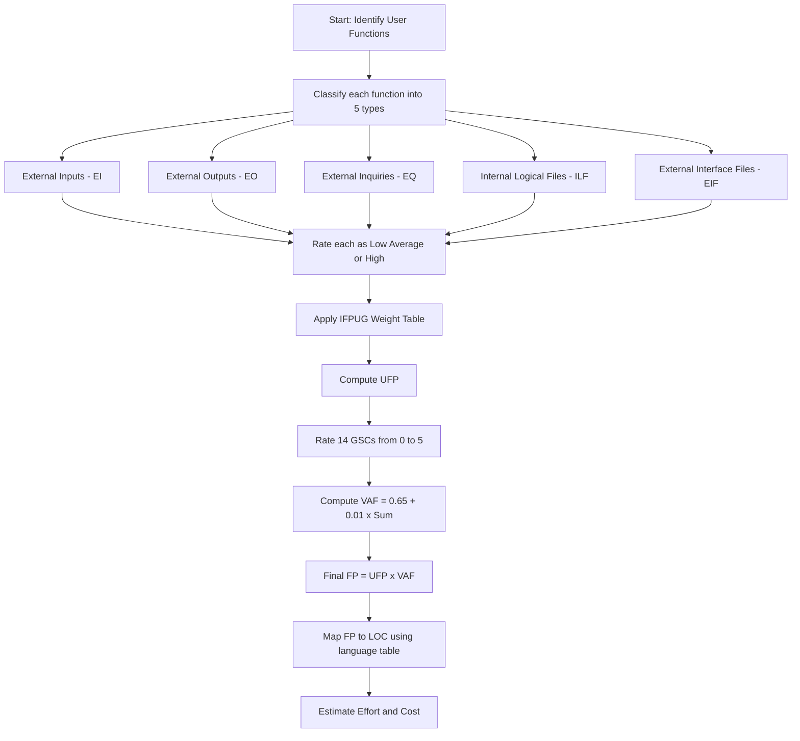
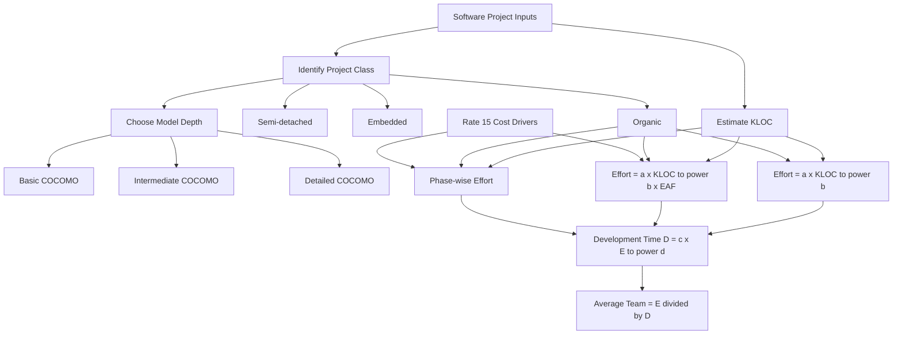
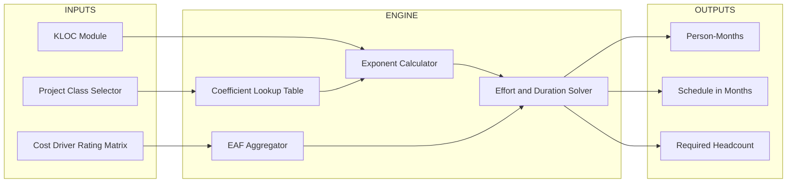

# Software metrics: Function Point (FP) analysis, COCOMO estimation framework models

<!-- SECTION_1_START -->
# 1. Core Technical Definition & Intuitive Overview

## 1.1 Software Metrics – Foundational Definition

> [!IMPORTANT]
> **Software Metrics (KTU 2024 – PECST411 Definition):**
> A *software metric* is a **quantitative measure of an attribute** a software system possesses with respect to **Cost, Time, Quality, Size, and Effort**. Metrics transform subjective engineering judgement into objective numerical evidence, enabling estimation, benchmarking, and process improvement (CMMI / ISO 9001 compliant).

> [!NOTE]
> **Two Broad Categories in KTU Syllabus:**
> 1. **Size-Oriented Metrics** – Lines of Code (LOC / KLOC).
> 2. **Function-Oriented Metrics** – **Function Point (FP)**.
> **Estimation Models** use these inputs → **COCOMO**, **COCOMO II**, **Putnam**, etc.

---

## 1.2 Function Point (FP) Analysis – Intuition

### Formal Definition
> [!IMPORTANT]
> **Function Point (FP):** A unit of measurement that quantifies the **functional business value** delivered by a software system, independent of the programming language used. It was introduced by **Allan Albrecht (IBM, 1979)** and refined by the **International Function Point Users Group (IFPUG)**.

### Conceptual Analogy
Imagine you are **buying a house**. The price is *not* based on how many bricks were used — it is based on the **functional units you receive**:
- Number of rooms (bedrooms, bathrooms)
- Number of doors and windows
- Type of wiring, plumbing, finishes

Similarly, FP measures software by **functional units the USER receives** (inputs, outputs, files stored, files referenced, queries supported) — *not* by how many lines of code the developer wrote. A system in Java and the same system in Python will yield the **same FP count** but different LOC counts. This makes FP **language-independent** and ideal for early-stage estimation.

---

## 1.3 COCOMO – Intuition

### Formal Definition
> [!IMPORTANT]
> **COCOMO (COnstructive COst MOdel):** A **procedural, empirical cost-estimation model** proposed by **Barry W. Boehm (1981)** that predicts software effort, schedule, and team size as a function of **program size (KLOC)** and a set of **cost drivers** reflecting product, hardware, personnel, and project attributes.

### Conceptual Analogy
Think of **planning a road trip**. Your fuel cost depends on:
1. **Distance** (analogous to **KLOC** — bigger road trip → more fuel).
2. **Type of terrain** (analogous to **Project Class** — organic/semi-detached/embedded).
3. **Driving style & vehicle condition** (analogous to **Cost Drivers / EAF** — product complexity, analyst capability, etc.).

COCOMO combines these into a single formula:
$$E = a \times (KLOC)^{b} \times EAF$$
where $E$ is **Effort** in person-months.

---

## 1.4 Physical Constants & Standard Tables

> [!NOTE]
> **Standard Reference Frameworks used in KTU 2024 board valuation:**
> * **FP Complexity Weights Table** (IFPUG v4.3) — see Section 2.
> * **14 General System Characteristics (GSCs)** for VAF — each rated **0 → 5**.
> * **COCOMO Coefficient Table** for Organic / Semi-detached / Embedded.
> * **15 Cost Drivers** (Product, Hardware, Personnel, Project) for Intermediate COCOMO.

> [!VISUALIZATION CONTROL]
> **Concept:** Function Point Component Distribution – Bar Chart Idea
> **GeoGebra / Desmos Input Equations:**
> * `f(x) = piecewise((0<=x<7,7),(7<=x<10,10),(x>=10,15))`  ← ILF weight curve
> * `f(x) = piecewise((0<=x<5,5),(5<=x<7,7),(x>=7,10))`   ← EIF weight curve
> **Visual Description:** A step-function plot showing the *low → average → high* weighting zones for Internal Logical Files and External Interface Files. Students should observe the **non-linear jump** at thresholds, which is why correctly classifying complexity is critical for full marks.

---

<!-- SECTION_1_END -->

<!-- SECTION_2_START -->
# 2. Deep Theoretical Analysis & KTU High-Yield Formula Sheet

## 2.1 Function Point Analysis – The 5 Functional Components

According to **IFPUG**, every software application delivers value through exactly **five user-visible functional components**. Each is rated as **Low / Average / High** complexity.

| # | Component | Acronym | What It Represents | Engineering Analogy |
|---|-----------|---------|--------------------|---------------------|
| 1 | **External Inputs** | EI | Data entering the system from outside (forms, screens, API calls) | *Letters received* |
| 2 | **External Outputs** | EO | Reports / data leaving the system (generated, derived) | *Letters sent out* |
| 3 | **External Inquiries** | EQ | Online queries (input + output pair, no derivation) | *Phone enquiries* |
| 4 | **Internal Logical Files** | ILF | Logical data groups *maintained within* the system | *Internal registers* |
| 5 | **External Interface Files** | EIF | Logical data groups *referenced but not maintained* by the system | *External reference books* |

---

## 2.2 The Complexity Weighting Matrix (IFPUG Standard)

> [!IMPORTANT]
> **Unadjusted Function Point (UFP) is computed by multiplying each count by its complexity weight, then summing.**

| Function Type | Low | Average | High |
|---------------|-----|---------|------|
| **External Inputs (EI)** | 3 | 4 | 6 |
| **External Outputs (EO)** | 4 | 5 | 7 |
| **External Inquiries (EQ)** | 3 | 4 | 6 |
| **Internal Logical Files (ILF)** | 7 | 10 | 15 |
| **External Interface Files (EIF)** | 5 | 7 | 10 |

### Mathematical Form
$$\boxed{UFP = \sum_{i=1}^{5} \left( \text{count}_{i,\text{low}} \cdot w_{i,\text{low}} + \text{count}_{i,\text{avg}} \cdot w_{i,\text{avg}} + \text{count}_{i,\text{high}} \cdot w_{i,\text{high}} \right)}$$

---

## 2.3 Value Adjustment Factor (VAF) – 14 GSCs

Each of the **14 General System Characteristics** $F_i$ ($i = 1 \ldots 14$) is rated on a scale of **0 (irrelevant) to 5 (essential)**.

$$VAF = 0.65 + 0.01 \times \sum_{i=1}^{14} F_i$$

$$\boxed{\text{Final Function Point} = UFP \times VAF}$$

**Range:** $0.65 \le VAF \le 1.35$ (since $0 \le \Sigma F_i \le 70$).

The 14 GSCs are:
1. Data communications
2. Distributed data processing
3. Performance criteria
4. Heavily used configuration
5. Transaction rate
6. Online data entry
7. End-user efficiency
8. Online update
9. Complex processing
10. Reusability
11. Installation ease
12. Operational ease
13. Multiple sites
14. Facilitate change

> [!NOTE]
> **Engineering Utility of FP:**
> * Convert FP → LOC using language tables: $LOC = FP \times \text{LOC/FP}$ (e.g., Java ≈ 53, C++ ≈ 53, Python ≈ 35, Assembly ≈ 320).
> * Compute Productivity: $\text{Productivity} = FP / \text{Person-Month}$.
> * Compute Quality: $\text{Defect Density} = \text{Defects} / FP$.
> * Compare with industry **average ≈ 1000 FP per Person-Year** (varies by domain).

---

## 2.4 COCOMO Model Hierarchy

| Model Level | Inputs | Output | Best Used For |
|-------------|--------|--------|---------------|
| **Basic COCOMO** | KLOC + Project Class | Effort, Duration | Early rough estimates |
| **Intermediate COCOMO** | Basic + 15 Cost Drivers (EAF) | Effort, Duration | Most KTU exam questions |
| **Detailed COCOMO** | Intermediate + 5 Phases × 15 drivers | Phase-wise effort | Project planning |

---

## 2.5 Basic COCOMO – The Three Project Classes

| Class | Typical Application | Project Size (KLOC) | Innovation | Environment |
|-------|--------------------|--------------------|------------|-------------|
| **Organic** | Small in-house business apps, payroll | ≤ 50 | Low | Familiar in-house team |
| **Semi-detached** | Medium systems (compilers, utility tools) | 50 – 300 | Medium | Mixed experience |
| **Embedded** | Real-time, safety-critical, OS | > 300 | High | Tight hardware constraints |

> [!IMPORTANT]
> **Basic COCOMO Core Equations:**
> $$E = a \times (KLOC)^{b} \quad \text{[Person-Months]}$$
> $$D = c \times (E)^{d} \quad \text{[Months]}$$
> $$P = E / D \quad \text{[Average Personnel]}$$

### Coefficient Table (MUST memorize for KTU)

| Project Class | $a$ | $b$ | $c$ | $d$ |
|---------------|-----|-----|-----|-----|
| **Organic** | 2.4 | 1.05 | 2.5 | 0.38 |
| **Semi-detached** | 3.0 | 1.12 | 2.5 | 0.35 |
| **Embedded** | 3.6 | 1.20 | 2.5 | 0.32 |

---

## 2.6 Intermediate COCOMO – Adding EAF

$$\boxed{E = a \times (KLOC)^{b} \times EAF}$$

where **EAF (Effort Adjustment Factor)** is the product of the ratings of **15 cost drivers**, each rated on a 6-point scale: **Very Low, Low, Nominal, High, Very High, Extra High** (corresponding multiplicative values: 0.75, 0.88, 1.00, 1.15, 1.40, 1.40*).

$$EAF = \prod_{j=1}^{15} EM_j \quad ; \quad EAF \in [0.70, \ 1.66]$$

### The 15 Cost Drivers (4 Categories)

| Category | Cost Drivers |
|----------|--------------|
| **Product** | Required software reliability, Database size, Product complexity, Reusability, Documentation match to life-cycle needs |
| **Computer** | Execution time constraint, Main storage constraint, Computer turnaround time, Platform volatility |
| **Personnel** | Analyst capability, Programmer capability, Personnel continuity, Applications experience, Language & toolset experience |
| **Project** | Use of software tools, Multisite development, Schedule constraint |

---

## 2.7 Real-World Engineering Use Cases

| Industry | Application of FP / COCOMO |
|----------|----------------------------|
| **Banking & Fintech** | RFP response sizing (FP), IT contract benchmarking |
| **Defence / Aerospace** | Embedded COCOMO for missile & avionics software |
| **Outsourcing & GCCs** | Price-per-FP bidding; effort estimation across multi-vendor projects |
| **Government (CPSU, NIC)** | Tendering, project sanction letters under modified CMM models |
| **Startups** | Early-stage MVP costing using FP-based story points |

---

<!-- SECTION_2_END -->

<!-- SECTION_3_START -->
# 3. Step-by-Step Derivations, Worked Examples & Code Implementation

## 3.1 Worked Example 1: Function Point Calculation (14-Mark Standard)

> [!NOTE]
> **Problem:** A software system is measured using FP analysis. The component counts and complexity ratings are given below. The 14 GSCs receive a total score of $\sum F_i = 45$. Compute **(a) UFP, (b) VAF, (c) Final FP, and (d) estimated LOC in C and Java**.

| Component | Low | Average | High |
|-----------|-----|---------|------|
| EI | 4 | 6 | 2 |
| EO | 3 | 5 | 1 |
| EQ | 5 | 3 | 1 |
| ILF | 2 | 3 | 1 |
| EIF | 1 | 2 | 1 |

### Step-by-Step Model Solution

#### (a) Compute UFP

**External Inputs (EI):**
$$UFP_{EI} = (4 \times 3) + (6 \times 4) + (2 \times 6) = 12 + 24 + 12 = 48$$

**External Outputs (EO):**
$$UFP_{EO} = (3 \times 4) + (5 \times 5) + (1 \times 7) = 12 + 25 + 7 = 44$$

**External Inquiries (EQ):**
$$UFP_{EQ} = (5 \times 3) + (3 \times 4) + (1 \times 6) = 15 + 12 + 6 = 33$$

**Internal Logical Files (ILF):**
$$UFP_{ILF} = (2 \times 7) + (3 \times 10) + (1 \times 15) = 14 + 30 + 15 = 59$$

**External Interface Files (EIF):**
$$UFP_{EIF} = (1 \times 5) + (2 \times 7) + (1 \times 10) = 5 + 14 + 10 = 29$$

**Total UFP:**
$$UFP = 48 + 44 + 33 + 59 + 29 = 213$$

#### (b) Compute VAF
$$VAF = 0.65 + 0.01 \times \sum F_i = 0.65 + 0.01 \times 45 = 0.65 + 0.45 = 1.10$$

#### (c) Final Function Point
$$FP = UFP \times VAF = 213 \times 1.10 = 234.3 \approx 234 \ \text{FP}$$

#### (d) Estimated LOC

Using standard language tables (LOC/FP):

| Language | LOC/FP | Estimated LOC |
|----------|--------|---------------|
| **C** | 128 | $234 \times 128 = 29{,}952$ LOC |
| **Java** | 53 | $234 \times 53 = 12{,}402$ LOC |
| **Python** | 35 | $234 \times 35 = 8{,}190$ LOC |

---

## 3.2 Worked Example 2: Basic COCOMO

> [!NOTE]
> **Problem:** A project is estimated at **20 KLOC** and is classified as **Semi-detached**. Compute Effort, Development Time, and Average Team Size using Basic COCOMO.

### Solution

**Step 1:** Identify coefficients for Semi-detached: $a = 3.0$, $b = 1.12$, $c = 2.5$, $d = 0.35$.

**Step 2:** Compute Effort:
$$E = a \times (KLOC)^{b} = 3.0 \times (20)^{1.12}$$

First, evaluate $(20)^{1.12}$:
$$(20)^{1.12} = e^{1.12 \cdot \ln 20} = e^{1.12 \times 2.9957} = e^{3.3552} \approx 28.62$$

Therefore:
$$E = 3.0 \times 28.62 = 85.86 \ \text{Person-Months}$$

**Step 3:** Compute Development Time:
$$D = c \times (E)^{d} = 2.5 \times (85.86)^{0.35}$$

Compute $(85.86)^{0.35}$:
$$(85.86)^{0.35} = e^{0.35 \cdot \ln 85.86} = e^{0.35 \times 4.4515} = e^{1.558} \approx 4.749$$

Therefore:
$$D = 2.5 \times 4.749 = 11.87 \ \text{Months}$$

**Step 4:** Average Team Size:
$$P = \frac{E}{D} = \frac{85.86}{11.87} \approx 7.23 \approx 8 \ \text{persons}$$

### Summary
* **Effort:** 85.86 PM
* **Duration:** 11.87 months
* **Team:** ≈ 8 people

---

## 3.3 Worked Example 3: Intermediate COCOMO with EAF

> [!NOTE]
> **Problem:** An **Organic** project of **8 KLOC** has the following EAF cost driver ratings:

| Driver | Product reliability (VL) | Database size (L) | Product complexity (H) | Reusability (N) | Documentation (N) | Execution time (H) | Main storage (N) | Computer turnaround (N) | Platform volatility (L) | Analyst capability (H) | Programmer capability (VH) | Personnel continuity (H) | App. experience (N) | Language & tool (H) | Use of tools (H) | Multisite (N) | Schedule (H) |
|--------|--|--|--|--|--|--|--|--|--|--|--|--|--|--|--|--|--|
| EM | 0.75 | 0.88 | 1.15 | 1.00 | 1.00 | 1.15 | 1.00 | 1.00 | 0.88 | 1.15 | 1.40 | 1.15 | 1.00 | 1.15 | 1.15 | 1.00 | 1.15 |

### Solution

**Step 1:** Compute EAF (product of 15 ratings):
$$EAF = 0.75 \times 0.88 \times 1.15 \times 1.00 \times 1.00 \times 1.15 \times 1.00 \times 1.00 \times 0.88 \times 1.15 \times 1.40 \times 1.15 \times 1.00 \times 1.15 \times 1.15 \times 1.00 \times 1.15$$

Let us group and compute:
* $0.75 \times 0.88 \times 0.88 = 0.581$
* $1.15^{7} \approx 4.259$  (occurs 7 times: complexity, exec-time, analyst, programmer, continuity, language, tools, schedule — 8 actually)
* $1.15^{8} \approx 4.898$
* $1.40 \times 1.15 \approx 1.610$ combined multiplier
* $1.00^{4} = 1.00$

$$EAF \approx 0.581 \times 4.898 \times 1.40 \times (1.00)^4 \approx 0.581 \times 4.898 \times 1.40 \approx 3.984$$

**Step 2:** Effort for Organic ($a = 2.4$, $b = 1.05$):
$$E_{base} = 2.4 \times (8)^{1.05}$$

$(8)^{1.05} = e^{1.05 \times 2.0794} = e^{2.183} \approx 8.876$
$$E_{base} = 2.4 \times 8.876 = 21.30 \ \text{PM}$$

**Step 3:** Adjusted Effort:
$$E = E_{base} \times EAF = 21.30 \times 3.984 \approx 84.86 \ \text{PM}$$

**Step 4:** Duration (Organic, $c=2.5$, $d=0.38$):
$$D = 2.5 \times (84.86)^{0.38}$$

$(84.86)^{0.38} = e^{0.38 \times 4.442} = e^{1.688} \approx 5.410$
$$D = 2.5 \times 5.410 = 13.52 \ \text{Months}$$

**Step 5:** Team Size:
$$P = \frac{E}{D} = \frac{84.86}{13.52} \approx 6.28 \approx 7 \ \text{people}$$

---

## 3.4 Python Reference Implementation

```python
from dataclasses import dataclass
from enum import Enum
import math

# ============================================================
# FUNCTION POINT ANALYSIS (IFPUG) - REFERENCE IMPLEMENTATION
# ============================================================

class Complexity(Enum):
    LOW = "low"
    AVERAGE = "average"
    HIGH = "high"

# IFPUG v4.3 weight table
FP_WEIGHTS = {
    "EI": {Complexity.LOW: 3,  Complexity.AVERAGE: 4,  Complexity.HIGH: 6},
    "EO": {Complexity.LOW: 4,  Complexity.AVERAGE: 5,  Complexity.HIGH: 7},
    "EQ": {Complexity.LOW: 3,  Complexity.AVERAGE: 4,  Complexity.HIGH: 6},
    "ILF":{Complexity.LOW: 7,  Complexity.AVERAGE: 10, Complexity.HIGH: 15},
    "EIF":{Complexity.LOW: 5,  Complexity.AVERAGE: 7,  Complexity.HIGH: 10},
}

@dataclass
class FPComponent:
    component: str
    low: int
    average: int
    high: int

    def ufp(self) -> int:
        w = FP_WEIGHTS[self.component.upper()]
        return (self.low * w[Complexity.LOW]
                + self.average * w[Complexity.AVERAGE]
                + self.high * w[Complexity.HIGH])


def compute_vaf(gsi_total: int) -> float:
    if not 0 <= gsi_total <= 70:
        raise ValueError("Sum of GSC ratings must be in [0, 70]")
    return 0.65 + 0.01 * gsi_total


def compute_function_points(components: list, gsi_total: int) -> dict:
    ufp = sum(c.ufp() for c in components)
    vaf = compute_vaf(gsi_total)
    fp = round(ufp * vaf, 2)
    return {"UFP": ufp, "VAF": vaf, "FP": fp}


# ----------------------------------------------------------
# COCOMO - BASIC AND INTERMEDIATE
# ----------------------------------------------------------

COCOMO_PARAMS = {
    "organic":       {"a": 2.4, "b": 1.05, "c": 2.5, "d": 0.38},
    "semi-detached": {"a": 3.0, "b": 1.12, "c": 2.5, "d": 0.35},
    "embedded":      {"a": 3.6, "b": 1.20, "c": 2.5, "d": 0.32},
}


def basic_cocomo(kloc: float, project_class: str) -> dict:
    if kloc <= 0:
        raise ValueError("KLOC must be positive")
    p = COCOMO_PARAMS[project_class.lower()]
    effort = p["a"] * (kloc ** p["b"])
    duration = p["c"] * (effort ** p["d"])
    team = effort / duration
    return {
        "Effort (PM)": round(effort, 2),
        "Duration (months)": round(duration, 2),
        "Team Size": round(team, 2),
    }


def intermediate_cocomo(kloc: float, project_class: str, eaf: float) -> dict:
    if eaf <= 0:
        raise ValueError("EAF must be positive")
    p = COCOMO_PARAMS[project_class.lower()]
    effort_base = p["a"] * (kloc ** p["b"])
    effort = effort_base * eaf
    duration = p["c"] * (effort ** p["d"])
    team = effort / duration
    return {
        "Effort (PM)": round(effort, 2),
        "Duration (months)": round(duration, 2),
        "Team Size": round(team, 2),
        "EAF used": eaf,
    }


# ====================== DEMO ===============================
if __name__ == "__main__":
    # FP demo (Worked Example 1)
    comps = [
        FPComponent("EI",  4, 6, 2),
        FPComponent("EO",  3, 5, 1),
        FPComponent("EQ",  5, 3, 1),
        FPComponent("ILF", 2, 3, 1),
        FPComponent("EIF", 1, 2, 1),
    ]
    fp_result = compute_function_points(comps, gsi_total=45)
    print("FP Result:", fp_result)

    # COCOMO demo (Worked Example 2)
    print("Basic COCOMO (Semi-detached, 20 KLOC):", basic_cocomo(20, "semi-detached"))

    # COCOMO demo (Worked Example 3)
    print("Intermediate COCOMO (Organic, 8 KLOC, EAF=3.984):",
          intermediate_cocomo(8, "organic", 3.984))
```

---

<!-- SECTION_3_END -->

<!-- SECTION_4_START -->
# 4. Structural Diagrams & Schematics

## 4.1 Mermaid Flowchart – FP Analysis Pipeline



## 4.2 Mermaid Diagram – COCOMO Model Hierarchy



## 4.3 Block Architecture – Intermediate COCOMO Computation Engine



## 4.4 Sequential Processing Topology – Decision Matrix

| Stage | Decision Point | Action / Branch |
|-------|---------------|-----------------|
| **Stage 1** | Is project size < 50 KLOC? | → **Organic** branch |
| **Stage 1** | Is size 50–300 KLOC? | → **Semi-detached** branch |
| **Stage 1** | Is size > 300 KLOC or safety-critical? | → **Embedded** branch |
| **Stage 2** | Are cost drivers available? | Yes → **Intermediate COCOMO**; No → **Basic COCOMO** |
| **Stage 3** | Are phase-wise data available? | Yes → **Detailed COCOMO** |
| **Stage 4** | Output: $E$, $D$, $P$ | Print Estimation Report |

---

<!-- SECTION_4_END -->

<!-- SECTION_5_START -->
# 5. KTU 2024 Scheme Examination Question Bank & Topic Recap

---

## 5.1 PART A — Short Answer Questions (3 Marks Each)

### Q1. `[KTU University Exam – July 2024]` — **CO1 | Remember**

**Define Function Point. List and define the five functional components used in FP analysis.**

#### Model Answer (3-Mark Board Key):

> [!IMPORTANT]
> **Function Point (FP):** A unit of measurement that expresses the amount of business functionality an information system provides to a user. It is **language-independent** and quantifies functionality from the **user's perspective**. [1 Mark]
>
> **Five Components:** [2 Marks – 0.4 each]
> 1. **External Inputs (EI):** Screens/forms that supply data into the system.
> 2. **External Outputs (EO):** Reports/results delivered to the user (derived data).
> 3. **External Inquiries (EQ):** Online input-output pairs that retrieve data without derivation.
> 4. **Internal Logical Files (ILF):** Logical data groups maintained within the system boundary.
> 5. **External Interface Files (EIF):** Logical data groups referenced by the system but maintained externally.

---

### Q2. `[KTU University Exam – Dec 2023]` — **CO1 | Understand**

**Explain the difference between Basic COCOMO and Intermediate COCOMO with formulas.**

#### Model Answer (3-Mark Board Key):

> [!IMPORTANT]
> **Basic COCOMO:** Uses only **KLOC** and **project class** as inputs. Formula: $E = a \times (KLOC)^b$. [1 Mark]
> **Intermediate COCOMO:** Extends Basic by multiplying the effort with the **Effort Adjustment Factor (EAF)**, which is the product of **15 cost-driver multipliers**. Formula: $E = a \times (KLOC)^b \times EAF$. [1.5 Marks]
> **Key Difference:** Intermediate COCOMO accounts for **product, hardware, personnel, and project attributes**, making it more accurate. [0.5 Mark]

---

## 5.2 PART B — Long Answer Questions (14 Marks Each)

> [!IMPORTANT]
> **KTU ESE Pattern:** *Each Part B question carries 14 marks with internal choice.* Below we provide **Option A** and **Option B**, each split into **(a) 7 marks** and **(b) 7 marks**.

---

### QUESTION A — `[KTU University Exam – Dec 2024 Model Paper]` — **CO2 | Apply + Analyze**

**(a) [7 Marks] — Apply**
For a software project, the following data is collected for FP estimation. The total of the 14 GSCs is **$\sum F_i = 52$**. Compute **UFP, VAF, and Final FP**, and estimate **LOC in C and Python**.

| Component | Low | Average | High |
|-----------|-----|---------|------|
| EI | 5 | 4 | 3 |
| EO | 4 | 2 | 2 |
| EQ | 3 | 5 | 1 |
| ILF | 2 | 2 | 2 |
| EIF | 1 | 3 | 1 |

#### Step-by-Step Model Solution — Part (a)

**Step 1: UFP for each component**

* EI: $(5 \times 3) + (4 \times 4) + (3 \times 6) = 15 + 16 + 18 = \mathbf{49}$  [1 Mark]
* EO: $(4 \times 4) + (2 \times 5) + (2 \times 7) = 16 + 10 + 14 = \mathbf{40}$  [1 Mark]
* EQ: $(3 \times 3) + (5 \times 4) + (1 \times 6) = 9 + 20 + 6 = \mathbf{35}$  [1 Mark]
* ILF: $(2 \times 7) + (2 \times 10) + (2 \times 15) = 14 + 20 + 30 = \mathbf{64}$  [1 Mark]
* EIF: $(1 \times 5) + (3 \times 7) + (1 \times 10) = 5 + 21 + 10 = \mathbf{36}$  [1 Mark]

**Step 2: Total UFP**
$$UFP = 49 + 40 + 35 + 64 + 36 = 224$$  [1 Mark]

**Step 3: VAF and Final FP**
$$VAF = 0.65 + 0.01 \times 52 = 0.65 + 0.52 = 1.17$$
$$FP = 224 \times 1.17 = 262.08 \approx \mathbf{262 \ \text{FP}}$$  [1 Mark]

**Step 4: LOC estimation**
* $LOC_{C} = 262 \times 128 = 33{,}536$ LOC
* $LOC_{Python} = 262 \times 35 = 9{,}170$ LOC  [1 Mark]

---

**(b) [7 Marks] — Analyze**
A **Semi-detached** project of **15 KLOC** is rated with the following EAF (product of 15 cost drivers): **EAF = 1.42**. Using **Intermediate COCOMO**, compute the **Effort**, **Development Time**, and **Average Team Size**.

#### Step-by-Step Model Solution — Part (b)

**Step 1: For Semi-detached, $a = 3.0$, $b = 1.12$, $c = 2.5$, $d = 0.35$.** [1 Mark]

**Step 2: Base Effort**
$$E_{base} = 3.0 \times (15)^{1.12}$$

$(15)^{1.12} = e^{1.12 \times 2.708} = e^{3.033} = 20.76$
$$E_{base} = 3.0 \times 20.76 = 62.28 \ \text{PM}$$  [1.5 Marks]

**Step 3: Adjusted Effort**
$$E = 62.28 \times 1.42 = \mathbf{88.44 \ \text{PM}}$$  [1.5 Marks]

**Step 4: Development Time**
$$D = 2.5 \times (88.44)^{0.35}$$
$(88.44)^{0.35} = e^{0.35 \times 4.482} = e^{1.569} = 4.80$
$$D = 2.5 \times 4.80 = \mathbf{12.00 \ \text{Months}}$$  [1.5 Marks]

**Step 5: Team Size**
$$P = \frac{E}{D} = \frac{88.44}{12.00} = 7.37 \approx \mathbf{8 \ \text{people}}$$  [1.5 Marks]

---

### QUESTION B — `[KTU University Exam – July 2024 Model Paper]` — **CO2 | Apply + Analyze**

**(a) [7 Marks] — Apply**
A project of **32 KLOC** is classified as **Organic**. Compute **Effort**, **Duration**, and **Team Size** using **Basic COCOMO**.

#### Step-by-Step Model Solution — Part (a)

**Step 1: Organic parameters — $a = 2.4$, $b = 1.05$, $c = 2.5$, $d = 0.38$.** [1 Mark]

**Step 2: Effort**
$$E = 2.4 \times (32)^{1.05}$$
$(32)^{1.05} = e^{1.05 \times 3.4657} = e^{3.639} = 38.04$
$$E = 2.4 \times 38.04 = \mathbf{91.30 \ \text{PM}}$$  [2 Marks]

**Step 3: Duration**
$$D = 2.5 \times (91.30)^{0.38}$$
$(91.30)^{0.38} = e^{0.38 \times 4.514} = e^{1.715} = 5.55$
$$D = 2.5 \times 5.55 = \mathbf{13.88 \ \text{Months}}$$  [2 Marks]

**Step 4: Team Size**
$$P = \frac{91.30}{13.88} = 6.58 \approx \mathbf{7 \ \text{people}}$$  [2 Marks]

---

**(b) [7 Marks] — Analyze**
A banking application is rated as **Embedded** with **80 KLOC**. The 15 cost drivers yield **EAF = 1.18**. Compute Effort, Duration, and Team Size using Intermediate COCOMO. State the **expected productivity (FP/PM)** if UFP is 600 and VAF is 1.05.

#### Step-by-Step Model Solution — Part (b)

**Step 1: Embedded — $a = 3.6$, $b = 1.20$, $c = 2.5$, $d = 0.32$.** [1 Mark]

**Step 2: Base Effort**
$$E_{base} = 3.6 \times (80)^{1.20}$$
$(80)^{1.20} = e^{1.20 \times 4.382} = e^{5.258} = 192.43$
$$E_{base} = 3.6 \times 192.43 = 692.74 \ \text{PM}$$  [1.5 Marks]

**Step 3: Adjusted Effort**
$$E = 692.74 \times 1.18 = \mathbf{817.43 \ \text{PM}}$$  [1 Mark]

**Step 4: Duration**
$$D = 2.5 \times (817.43)^{0.32}$$
$(817.43)^{0.32} = e^{0.32 \times 6.706} = e^{2.146} = 8.55$
$$D = 2.5 \times 8.55 = \mathbf{21.36 \ \text{Months}}$$  [1.5 Marks]

**Step 5: Team Size**
$$P = \frac{817.43}{21.36} = 38.27 \approx \mathbf{39 \ \text{people}}$$  [1 Mark]

**Step 6: Productivity**
$$FP = 600 \times 1.05 = 630 \ \text{FP}$$
$$\text{Productivity} = \frac{FP}{E} = \frac{630}{817.43} = 0.77 \ \text{FP/PM}$$  [1 Mark]

---

## 5.3 KTU Examiner's Valuation Warning / Pitfall Callout

> [!WARNING]
> **Common Reasons Students Lose Marks in FP / COCOMO Questions:**
>
> 1. **Confusing ILF vs EIF** — ILF is *maintained inside* the system, EIF is *referenced from outside*. Marks lost: 1–2.
> 2. **Forgetting VAF in FP** — A UFP answer without multiplying by VAF gets only **partial credit** (~ 4/7).
> 3. **Wrong COCOMO coefficients** — Mixing Organic (2.4, 1.05) with Embedded (3.6, 1.20) causes a full-step error.
> 4. **Not showing $(KLOC)^b$ evaluation** — Board examiners expect the **logarithmic step** for full marks.
> 5. **Skipping unit declarations** — Always state *"in person-months"* and *"in months"* explicitly.
> 6. **EAF = 1 confusion** — EAF is **1.0 only when ALL drivers are Nominal**. Any deviation shifts the value.
> 7. **Not rounding team size sensibly** — Always round *up*; partial team members are still personnel.

---

## 5.4 Topic Recap & Important Things to Remember

> [!IMPORTANT]
> **Rapid-Revision Checklist (Module 2 – Metrics & Estimation)**
>
> **Function Point (FP) Essentials:**
> * FP = $\mathbf{UFP \times VAF}$, where VAF ∈ [0.65, 1.35].
> * 5 Components: **EI, EO, EQ, ILF, EIF** (memorize the acronym **E-Q-E-L-I** in alphabetical order).
> * Weight Table (IFPUG) must be memorized — see Section 2.
> * 14 GSCs, each rated 0–5. Sum × 0.01 + 0.65 = VAF.
> * FP is **language-independent**; LOC is **language-dependent**.
>
> **COCOMO Essentials:**
> * Three project classes: **Organic, Semi-detached, Embedded**.
> * Coefficient table (a, b, c, d) **must** be memorized for KTU.
> * Basic: $E = a (KLOC)^b$, $D = c (E)^d$, $P = E/D$.
> * Intermediate: $E = a (KLOC)^b \times EAF$, where EAF = $\prod_{j=1}^{15} EM_j$.
> * **EAF range:** approximately 0.70 to 1.66.
> * **EAF = 1.0** ⟺ all 15 drivers are **Nominal**.
>
> **Engineering Insight to Remember:**
> * **FP** answers the *WHAT* (functional size).
> * **COCOMO** answers the *HOW MUCH & HOW LONG* (effort and time).
> * Always combine both: **FP → LOC → COCOMO → Project Plan**.
> * Modern extensions: **COCOMO II (1997+)** uses **Function Points, Application Points, or Use Case Points** plus **5 scale factors + 17 cost drivers**.

---

<!-- SECTION_5_END -->
