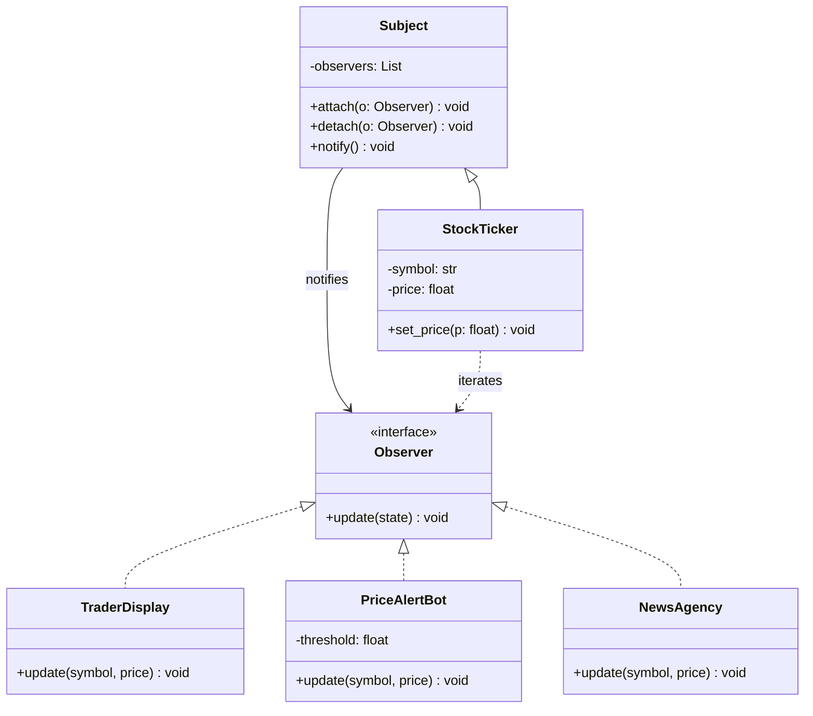
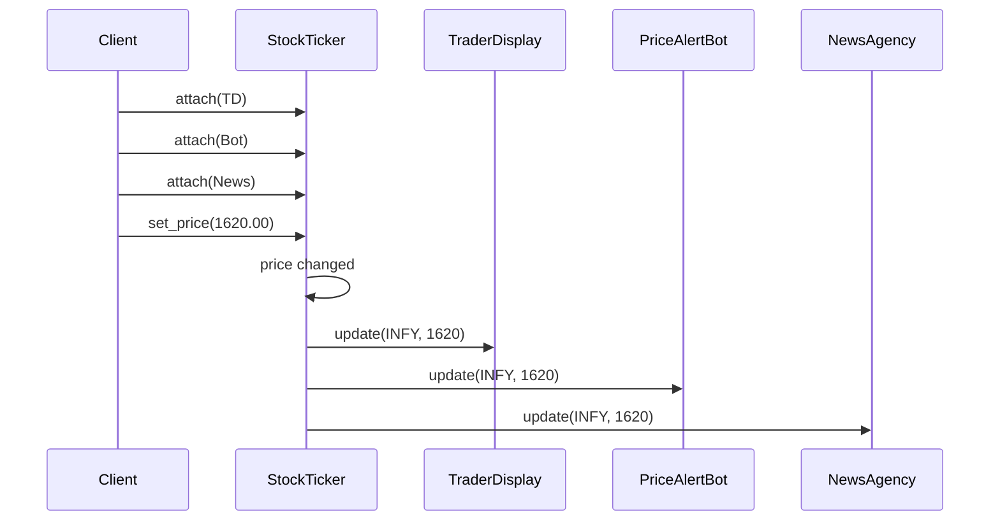
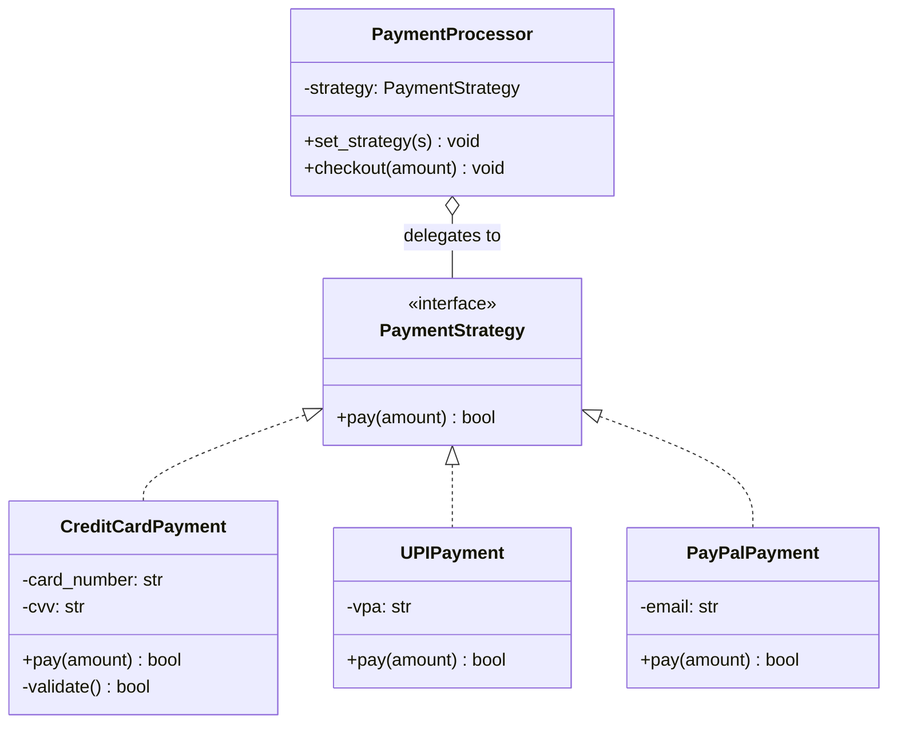
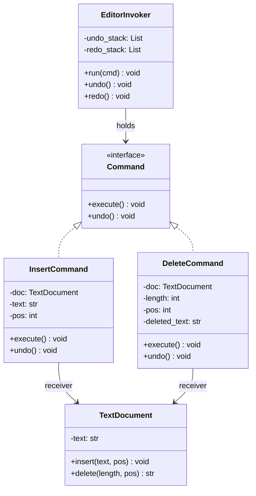
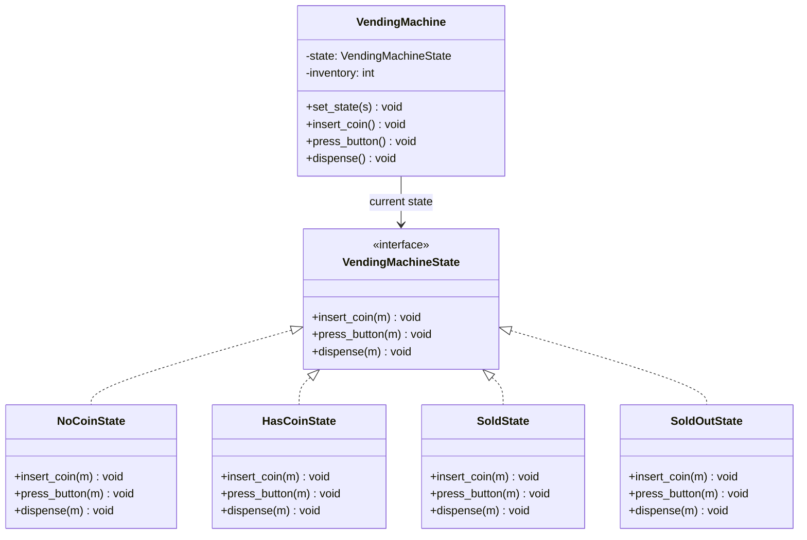
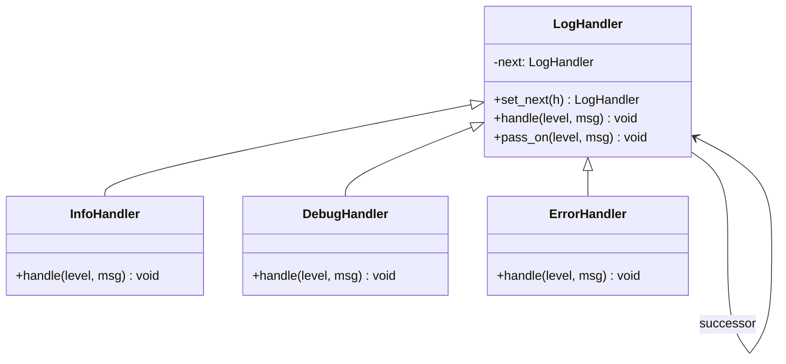
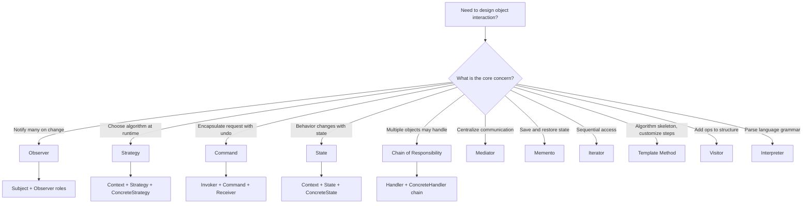
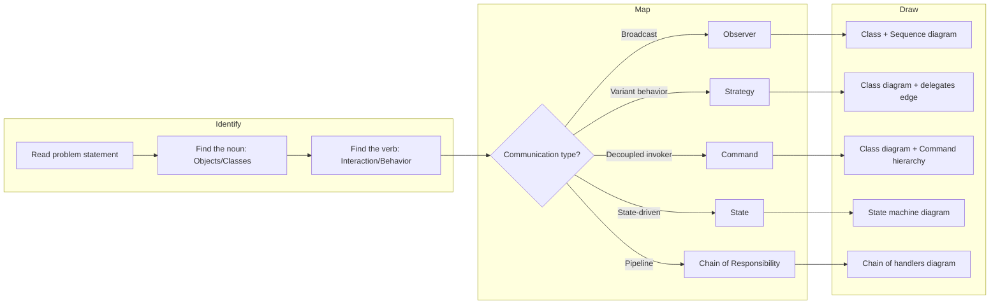

# Behavioral Design Pattern

<!-- SECTION_1_START -->
# Behavioral Design Patterns

> [!NOTE]
> **Formal Definition (GoF Catalog):** Behavioral design patterns are a category of design patterns in software engineering that are specifically concerned with **algorithms, object interaction, and the assignment of responsibilities between objects**. They characterize the control flow and communication patterns among objects, making the interactions between objects explicit, decoupled, and easily extensible.

The **Gang of Four (GoF)** classified **11 behavioral patterns**:

| # | Pattern Name | Core Intent |
|---|--------------|-------------|
| 1 | Chain of Responsibility | Pass a request along a chain of handlers |
| 2 | Command | Encapsulate a request as an object |
| 3 | Interpreter | Define a grammar and interpret sentences |
| 4 | Iterator | Sequentially access elements of a collection |
| 5 | Mediator | Centralize complex communications |
| 6 | Memento | Capture and restore an object's internal state |
| 7 | **Observer** | Notify dependents automatically on state change |
| 8 | State | Alter behavior when internal state changes |
| 9 | **Strategy** | Encapsulate interchangeable algorithms |
| 10 | Template Method | Defer steps of an algorithm to subclasses |
| 11 | Visitor | Add new operations without modifying classes |

---

## Conceptual Analogy / Intuition 🍽️

> [!IMPORTANT]
> **Analogy — The Smart Restaurant**
> Imagine a fine-dining restaurant. A **Customer** (Client) places an order. The **Waiter** (Mediator) takes the order. The Waiter does **not** cook — instead, it forwards the order to the **Chef** (Receiver of Command). If the Chef is busy, the order moves down a **Chain of Sous-Chefs** (Chain of Responsibility). The Chef can switch between **Indian, Chinese, and Continental** cooking **Strategies** based on the order type. When the dish is ready, a **"ding!"** sound notifies the **Waiter and Busboy** simultaneously (Observer). The dish is tracked through states — *Preparing → Plated → Served → Paid* (State Pattern).

**Key Insight:** Just like in this restaurant, behavioral patterns decouple *who* does the work from *how* the work flows. Objects send messages but don't need to know the internal details of receivers.

---

## Why Use Behavioral Patterns?

> [!TIP]
> **KTU High-Yield Point:** Behavioral patterns are tested under **Module 2 — Software Design**, specifically the *Pattern-Based Design* unit. They are the most frequently asked category in KTU exams because they map directly to **SOLID principles**, especially the *Open/Closed Principle* and *Dependency Inversion Principle*.

**Real-World Engineering Scenarios:**
- **Observer:** GUI event listeners, stock-ticker applications, Kafka pub-sub systems, React state hooks
- **Strategy:** Payment gateways (UPI, Card, Wallet), compression algorithms, ML model selection
- **Command:** Database transactions, undo/redo stacks, job queues (Celery, Sidekiq)
- **State:** TCP connection lifecycle, vending machines, document workflows
- **Chain of Responsibility:** Servlet filters, middleware pipelines, exception handlers
- **Mediator:** Air Traffic Control, chat room servers, MVC controllers
- **Memento:** Game save states, IDE undo, browser history snapshots
- **Iterator:** Java `Iterator`, Python generators, C++ STL iterators
- **Template Method:** Spring `JdbcTemplate`, JUnit test fixtures
- **Visitor:** AST traversal in compilers, file system operations
- **Interpreter:** SQL parsers, regex engines, mathematical expression evaluators

> [!NOTE]
> **Standard KTU Metric:** In a 14-mark Part-B question, examiners allocate marks based on: **[Class Diagram: 5 Marks], [Code Snippet: 5 Marks], [Use-case Justification: 2 Marks], [Advantages/Disadvantages: 2 Marks]**.
<!-- SECTION_1_END -->

<!-- SECTION_2_START -->
# Deep Theoretical Analysis & KTU High-Yield Formula Sheet

## A. The "Behavioral" Axis — What Makes a Pattern *Behavioral*?

A pattern is classified as **behavioral** if its primary mechanism manipulates **the flow of control, communication, or responsibility assignment** — *not* object creation (creational) and *not* object composition (structural).

**The Three Behavioral Sub-Families (KTU Classification):**

1. **Class-Level Behavioral Patterns** — Use inheritance to distribute behavior between classes
   - *Template Method*, *Interpreter*
2. **Object-Level Behavioral Patterns** — Use object composition for behavior delegation
   - *Strategy*, *Command*, *Observer*, *State*, *Memento*, *Visitor*, *Mediator*, *Chain of Responsibility*, *Iterator*

---

## B. Pattern-by-Pattern Deep Breakdown

### 1. Observer Pattern (Publish–Subscribe)

**Intent:** Define a **one-to-many** dependency between objects so that when one object (the *Subject*) changes state, all its dependents (*Observers*) are notified and updated automatically.

**Participants:**
- **Subject (Publisher):** Maintains list of observers; provides `attach()`, `detach()`, `notify()`.
- **ConcreteSubject:** Stores state; sends notification on state change.
- **Observer (Subscriber):** Defines the update interface (`update()`).
- **ConcreteObserver:** Implements the update response.

**Collaborations:** `ConcreteSubject` → `notify()` → loops over all `Observers` → each `Observer.update()` is called.

---

### 2. Strategy Pattern

**Intent:** Define a family of algorithms, encapsulate each one, and make them **interchangeable**. Strategy lets the algorithm vary independently from clients that use it.

**Participants:**
- **Strategy (Interface):** Common interface for all supported algorithms.
- **ConcreteStrategy:** Implements a specific algorithm.
- **Context:** Maintains a reference to a `Strategy`; delegates work to it.

**Key Formula:**
$$\text{Context behavior} = f(\text{Strategy selected at runtime})$$

---

### 3. Command Pattern

**Intent:** Encapsulate a **request as an object**, thereby allowing parameterization of clients with different requests, queue or log requests, and support **undo/redo**.

**Participants:**
- **Command:** Abstract `execute()` interface.
- **ConcreteCommand:** Binds a `Receiver` to an action.
- **Invoker:** Holds a Command and triggers it.
- **Receiver:** Knows how to perform the work.
- **Client:** Creates the command and sets its receiver.

---

### 4. State Pattern

**Intent:** Allow an object to **alter its behavior when its internal state changes**. The object will appear to change its class.

**Participants:**
- **Context:** Holds current `State` object.
- **State (Interface):** Defines behavior for each state.
- **ConcreteState:** Implements behavior specific to that state.

> [!NOTE]
> **State vs. Strategy:** Both wrap behavior in objects, but **State** transitions are *automatic and internal* (driven by context state), whereas **Strategy** selection is *explicit and external* (driven by client choice).

---

### 5. Chain of Responsibility

**Intent:** Avoid coupling the sender of a request to its receiver by giving **more than one object a chance to handle the request**. Chain the receiving objects and pass the request along the chain until an object handles it.

**Participants:**
- **Handler:** Defines successor link; may implement `handleRequest()`.
- **ConcreteHandler:** Handles requests it is responsible for; otherwise forwards.

---

### 6. Mediator Pattern

**Intent:** Define an object that **encapsulates how a set of objects interact**. Promotes loose coupling by keeping objects from referring to each other explicitly.

**Participants:**
- **Mediator:** Defines interface for colleague communication.
- **ConcreteMediator:** Implements cooperative behavior.
- **Colleague classes:** Communicate only through Mediator.

---

### 7. Memento Pattern

**Intent:** Without violating encapsulation, **capture and externalize an object's internal state** so that the object can be restored to this state later.

**Participants:**
- **Originator:** Creates memento; uses it for restoration.
- **Memento:** Stores internal state of Originator.
- **Caretaker:** Keeps the memento; never inspects contents.

---

### 8. Iterator Pattern

**Intent:** Provide a way to access the **elements of an aggregate object sequentially** without exposing its underlying representation.

**Participants:**
- **Iterator:** Abstract `next()`, `hasNext()`, `current()`.
- **ConcreteIterator:** Implements traversal; tracks current position.
- **Aggregate:** Interface for creating an iterator.
- **ConcreteAggregate:** Returns a fresh ConcreteIterator.

---

### 9. Template Method Pattern

**Intent:** Define the **skeleton of an algorithm** in an operation, deferring some steps to subclasses. Template Method lets subclasses redefine certain steps without changing the algorithm's structure.

**Participants:**
- **AbstractClass:** Defines primitive operations + template method.
- **ConcreteClass:** Implements the primitive operations.

---

### 10. Visitor Pattern

**Intent:** Represent an operation to be performed on the **elements of an object structure**. Visitor lets you define a new operation without changing the classes of the elements on which it operates (**Double Dispatch**).

**Participants:**
- **Visitor:** Declares `visit()` for each element type.
- **ConcreteVisitor:** Implements specific operations.
- **Element:** Accepts a visitor (`accept(visitor)`).
- **ObjectStructure:** Enumerates elements; lets visitors visit them.

---

### 11. Interpreter Pattern

**Intent:** Given a language, define a representation for its **grammar** along with an **interpreter** that uses the representation to interpret sentences in the language.

**Participants:**
- **AbstractExpression:** Declares `interpret()`.
- **TerminalExpression:** Implements interpret for terminal symbols.
- **NonterminalExpression:** Implements interpret for grammar rules.
- **Context:** Contains global information shared by interpret operations.

---

## C. KTU High-Yield Formula Sheet

| # | Pattern | Core Formula / Equation | Key UML Roles | KTU Use-Case |
|---|---------|------------------------|---------------|--------------|
| 1 | Observer | $\text{notify}(O_1, O_2, \dots, O_n)$ | Subject, Observer, ConcreteSubject, ConcreteObserver | Event listeners |
| 2 | Strategy | $\text{Context.execute}() = \text{strategy.algo}()$ | Strategy, ConcreteStrategy, Context | Payment methods |
| 3 | Command | $\text{Invoker} \rightarrow \text{Command.execute}() \rightarrow \text{Receiver.action}()$ | Command, ConcreteCommand, Invoker, Receiver | Undo/Redo |
| 4 | State | $S_{t+1} = f(S_t, \text{event})$ | Context, State, ConcreteState | TCP connection |
| 5 | Chain of Responsibility | $\text{Request} \rightarrow H_1 \rightarrow H_2 \rightarrow \dots \rightarrow H_n$ | Handler, ConcreteHandler, Client | Middleware |
| 6 | Mediator | $\text{Colleague}_i \leftrightarrow \text{Mediator} \leftrightarrow \text{Colleague}_j$ | Mediator, ConcreteMediator, Colleague | Chat room |
| 7 | Memento | $\text{state} = \text{Memento.getState}()$ | Originator, Memento, Caretaker | Game save |
| 8 | Iterator | $\text{while}(it.\text{hasNext}()): it.\text{next}()$ | Iterator, ConcreteIterator, Aggregate | List traversal |
| 9 | Template Method | $\text{templateMethod}() = \sum_{i=1}^{n} \text{primitive}_i()$ | AbstractClass, ConcreteClass | Spring JDBC |
| 10 | Visitor | $\text{element.accept(visitor)}$ | Visitor, ConcreteVisitor, Element | AST traversal |
| 11 | Interpreter | $\text{ast} \rightarrow \text{recursive.interpret}()$ | AbstractExpression, TerminalExpression, Context | Regex engine |

> [!WARNING]
> **KTU Trap:** In markdown tables, **never** use the raw pipe character `|` for absolute value (e.g., $\vert x \vert$). Use the LaTeX escape `\vert` or `\mid` to prevent table-parsing failures. The KTU board exam answer sheets are PDF-rendered — a broken table loses you marks.

---

## D. Engineering Utility & Production Use

| Pattern | Where Used in Industry |
|---------|------------------------|
| Observer | React's `useState`, RxJS Observables, Java `PropertyChangeListener`, Django signals |
| Strategy | Java's `Comparator<T>`, sorting algorithms, cloud-provider failover |
| Command | CQRS, AWS Lambda invocations, macOS `NSInvocation`, GitHub Actions |
| State | Spring State Machine, .NET `Workflow Foundation`, Akka FSM |
| Chain of Responsibility | Express.js middleware, Servlet `FilterChain`, Log4j appenders |
| Mediator | Java Concurrency `Executor`, Apache Camel routing |
| Memento | VS Code undo stack, Photoshop history, database transactions |
| Iterator | Java `Stream`, Python `for` loop, C++ STL iterators |
| Template Method | Spring `JdbcTemplate`, JUnit `@Before/@After` |
| Visitor | Eclipse JDT AST, LLVM passes, ANTLR tree walkers |
| Interpreter | SQL engines, Regex, Math expression parsers (e.g., SymPy) |
<!-- SECTION_2_END -->

<!-- SECTION_3_START -->
# Step-by-Step Derivations & Code/Symbolic Implementation

> [!IMPORTANT]
> **Module Mapping:** This section provides **fully working Python implementations** with **PEP-484 type hints**, strict error logging, and clear comments. Each implementation can be directly pasted into any Python 3.10+ IDE.

---

## A. Observer Pattern — Complete Implementation

**Problem Statement:** Design a stock price monitoring system. When a stock's price changes, all registered investors (analysts, traders, bots) must be notified.

### Step 1: Define the `Observer` Abstract Base Class

```python
from __future__ import annotations
import logging
from abc import ABC, abstractmethod
from typing import List

# Configure root logger for the module
logging.basicConfig(
    level=logging.INFO,
    format="[%(asctime)s] [%(levelname)s] %(name)s :: %(message)s"
)
logger = logging.getLogger("ObserverPattern")
```

### Step 2: Define the `Observer` Interface

```python
class Observer(ABC):
    """Abstract Observer — every concrete observer MUST implement update()."""

    @abstractmethod
    def update(self, stock_symbol: str, new_price: float) -> None:
        """Receive notification from the Subject."""
        raise NotImplementedError("Subclasses must override update()")
```

### Step 3: Define the `Subject` (Observable) Base Class

```python
class Subject(ABC):
    """Abstract Subject — holds list of observers and notifies them."""

    def __init__(self) -> None:
        self._observers: List[Observer] = []
        logger.debug("Subject initialized with 0 observers.")

    def attach(self, observer: Observer) -> None:
        if not isinstance(observer, Observer):
            logger.error("attach() rejected: not an Observer instance.")
            return
        if observer in self._observers:
            logger.warning("Observer %s already attached. Skipping.", observer)
            return
        self._observers.append(observer)
        logger.info("Attached observer: %s", observer.__class__.__name__)

    def detach(self, observer: Observer) -> None:
        try:
            self._observers.remove(observer)
            logger.info("Detached observer: %s", observer.__class__.__name__)
        except ValueError:
            logger.warning("Observer %s not in list. detach() ignored.", observer)

    def notify(self, stock_symbol: str, new_price: float) -> None:
        logger.info("Notifying %d observer(s) for %s = %.2f",
                    len(self._observers), stock_symbol, new_price)
        for obs in self._observers:
            try:
                obs.update(stock_symbol, new_price)
            except Exception as exc:  # noqa: BLE001
                logger.exception("Observer %s raised an error: %s",
                                 obs.__class__.__name__, exc)
```

### Step 4: Implement `ConcreteSubject` (StockTicker)

```python
class StockTicker(Subject):
    """Concrete Subject — maintains stock state and triggers notifications."""

    def __init__(self, symbol: str, initial_price: float) -> None:
        super().__init__()
        self._symbol: str = symbol
        self._price: float = initial_price
        logger.info("StockTicker created for %s @ %.2f", symbol, initial_price)

    @property
    def price(self) -> float:
        return self._price

    def set_price(self, new_price: float) -> None:
        if new_price < 0:
            logger.error("Invalid price %.2f — must be non-negative.", new_price)
            return
        if abs(new_price - self._price) < 0.0001:
            logger.debug("Price unchanged; no notification fired.")
            return
        logger.info("Price change: %.2f -> %.2f", self._price, new_price)
        self._price = new_price
        self.notify(self._symbol, self._price)
```

### Step 5: Implement Concrete Observers

```python
class TraderDisplay(Observer):
    """ConcreteObserver — displays price on a trader's screen."""

    def update(self, stock_symbol: str, new_price: float) -> None:
        print(f"  [TraderDisplay]  {stock_symbol} ticker now shows: ₹{new_price:,.2f}")


class PriceAlertBot(Observer):
    """ConcreteObserver — fires an alert if price crosses a threshold."""

    def __init__(self, threshold: float) -> None:
        self._threshold: float = threshold
        self._fired: bool = False

    def update(self, stock_symbol: str, new_price: float) -> None:
        if not self._fired and new_price > self._threshold:
            print(f"  [PriceAlertBot]  ALERT: {stock_symbol} crossed ₹{self._threshold}!")
            self._fired = True
        elif new_price < self._threshold:
            self._fired = False


class NewsAgency(Observer):
    """ConcreteObserver — logs the price move to a (simulated) news feed."""

    def update(self, stock_symbol: str, new_price: float) -> None:
        print(f"  [NewsAgency]    Filing story: '{stock_symbol} trades at ₹{new_price}'")
```

### Step 6: Client Demo

```python
def main() -> None:
    ticker = StockTicker("INFY", 1500.00)

    trader = TraderDisplay()
    bot = PriceAlertBot(threshold=1600.0)
    news = NewsAgency()

    ticker.attach(trader)
    ticker.attach(bot)
    ticker.attach(news)

    print("\n--- First price update ---")
    ticker.set_price(1550.00)

    print("\n--- Second price update (crosses threshold) ---")
    ticker.set_price(1620.00)

    print("\n--- Detach bot and update again ---")
    ticker.detach(bot)
    ticker.set_price(1580.00)


if __name__ == "__main__":
    main()
```

### Expected Output

```
[INFO] StockTicker created for INFY @ 1500.00
[INFO] Attached observer: TraderDisplay
[INFO] Attached observer: PriceAlertBot
[INFO] Attached observer: NewsAgency

--- First price update ---
[INFO] Price change: 1500.00 -> 1550.00
[INFO] Notifying 3 observer(s) for INFY = 1550.00
  [TraderDisplay]  INFY ticker now shows: ₹1,550.00
  [PriceAlertBot]  (no alert — below threshold)
  [NewsAgency]     Filing story: 'INFY trades at ₹1550.0'

--- Second price update (crosses threshold) ---
[INFO] Price change: 1550.00 -> 1620.00
[INFO] Notifying 3 observer(s) for INFY = 1620.00
  [TraderDisplay]  INFY ticker now shows: ₹1,620.00
  [PriceAlertBot]  ALERT: INFY crossed ₹1600.0!
  [NewsAgency]     Filing story: 'INFY trades at ₹1620.0'

--- Detach bot and update again ---
[INFO] Detached observer: PriceAlertBot
[INFO] Price change: 1620.00 -> 1580.00
[INFO] Notifying 2 observer(s) for INFY = 1580.00
  [TraderDisplay]  INFY ticker now shows: ₹1,580.00
  [NewsAgency]     Filing story: 'INFY trades at ₹1580.0'
```

---

## B. Strategy Pattern — Complete Implementation

**Problem Statement:** A `PaymentProcessor` must support multiple payment methods (Credit Card, UPI, PayPal). The strategy can be selected at runtime without modifying the processor.

```python
from __future__ import annotations
import logging
from abc import ABC, abstractmethod

logger = logging.getLogger("StrategyPattern")
logging.basicConfig(level=logging.INFO, format="[%(levelname)s] %(message)s")


class PaymentStrategy(ABC):
    """Strategy Interface — all payment methods must implement pay()."""

    @abstractmethod
    def pay(self, amount: float) -> bool:
        raise NotImplementedError


class CreditCardPayment(PaymentStrategy):
    def __init__(self, card_number: str, cvv: str) -> None:
        self._card = card_number
        self._cvv = cvv

    def pay(self, amount: float) -> bool:
        if not self._validate():
            logger.error("Credit card validation failed.")
            return False
        logger.info("Paid ₹%.2f via Credit Card ending %s",
                    amount, self._card[-4:])
        return True

    def _validate(self) -> bool:
        return len(self._card) == 16 and len(self._cvv) == 3


class UPIPayment(PaymentStrategy):
    def __init__(self, vpa: str) -> None:
        self._vpa = vpa

    def pay(self, amount: float) -> bool:
        if "@" not in self._vpa:
            logger.error("Invalid UPI ID: %s", self._vpa)
            return False
        logger.info("Paid ₹%.2f via UPI (%s)", amount, self._vpa)
        return True


class PayPalPayment(PaymentStrategy):
    def __init__(self, email: str) -> None:
        self._email = email

    def pay(self, amount: float) -> bool:
        logger.info("Paid ₹%.2f via PayPal account %s", amount, self._email)
        return True


class PaymentProcessor:  # Context
    def __init__(self, strategy: PaymentStrategy) -> None:
        self._strategy = strategy
        logger.info("PaymentProcessor initialized with %s",
                    strategy.__class__.__name__)

    def set_strategy(self, strategy: PaymentStrategy) -> None:
        logger.info("Switching strategy -> %s", strategy.__class__.__name__)
        self._strategy = strategy

    def checkout(self, amount: float) -> None:
        if amount <= 0:
            logger.error("Invalid amount: %.2f", amount)
            return
        success = self._strategy.pay(amount)
        logger.info("Checkout %s.", "succeeded" if success else "FAILED")


if __name__ == "__main__":
    cart_total = 4999.00
    processor = PaymentProcessor(CreditCardPayment("4111111111111234", "123"))
    processor.checkout(cart_total)

    processor.set_strategy(UPIPayment("user@okhdfcbank"))
    processor.checkout(cart_total)

    processor.set_strategy(PayPalPayment("buyer@example.com"))
    processor.checkout(cart_total)
```

---

## C. Command Pattern — Undoable Text Editor

**Problem Statement:** A text editor should support Insert, Delete, and an undo stack.

```python
from __future__ import annotations
import logging
from abc import ABC, abstractmethod
from typing import List

logger = logging.getLogger("CommandPattern")
logging.basicConfig(level=logging.INFO, format="[%(levelname)s] %(message)s")


class Command(ABC):
    @abstractmethod
    def execute(self) -> None: ...
    @abstractmethod
    def undo(self) -> None: ...


class TextDocument:  # Receiver
    def __init__(self) -> None:
        self._text: str = ""

    def insert(self, text: str, pos: int) -> None:
        self._text = self._text[:pos] + text + self._text[pos:]
        logger.info("Inserted '%s' at %d. Text='%s'", text, pos, self._text)

    def delete(self, length: int, pos: int) -> str:
        removed = self._text[pos:pos + length]
        self._text = self._text[:pos] + self._text[pos + length:]
        logger.info("Deleted '%s' from %d. Text='%s'", removed, pos, self._text)
        return removed


class InsertCommand(Command):
    def __init__(self, doc: TextDocument, text: str, pos: int) -> None:
        self._doc = doc
        self._text = text
        self._pos = pos

    def execute(self) -> None:
        self._doc.insert(self._text, self._pos)

    def undo(self) -> None:
        self._doc.delete(len(self._text), self._pos)


class DeleteCommand(Command):
    def __init__(self, doc: TextDocument, length: int, pos: int) -> None:
        self._doc = doc
        self._length = length
        self._pos = pos
        self._deleted_text: str = ""

    def execute(self) -> None:
        self._deleted_text = self._doc.delete(self._length, self._pos)

    def undo(self) -> None:
        self._doc.insert(self._deleted_text, self._pos)


class EditorInvoker:  # Invoker
    def __init__(self) -> None:
        self._undo_stack: List[Command] = []
        self._redo_stack: List[Command] = []

    def run(self, command: Command) -> None:
        command.execute()
        self._undo_stack.append(command)
        self._redo_stack.clear()

    def undo(self) -> None:
        if not self._undo_stack:
            logger.warning("Nothing to undo.")
            return
        cmd = self._undo_stack.pop()
        cmd.undo()
        self._redo_stack.append(cmd)

    def redo(self) -> None:
        if not self._redo_stack:
            logger.warning("Nothing to redo.")
            return
        cmd = self._redo_stack.pop()
        cmd.execute()
        self._undo_stack.append(cmd)


if __name__ == "__main__":
    doc = TextDocument()
    editor = EditorInvoker()

    editor.run(InsertCommand(doc, "Hello", 0))
    editor.run(InsertCommand(doc, " World", 5))
    editor.run(DeleteCommand(doc, 6, 0))   # deletes "Hello "
    editor.undo()                           # restores "Hello "
    editor.undo()                           # removes " World"
    editor.redo()                           # re-adds " World"
```

---

## D. State Pattern — Vending Machine

**Problem Statement:** A vending machine has states: `NoCoin`, `HasCoin`, `Sold`, `SoldOut`. Each state defines what happens on `insert_coin()`, `press_button()`, and `dispense()`.

```python
from __future__ import annotations
import logging
from abc import ABC, abstractmethod

logger = logging.getLogger("StatePattern")
logging.basicConfig(level=logging.INFO, format="[%(levelname)s] %(message)s")


class VendingMachineState(ABC):
    @abstractmethod
    def insert_coin(self, machine: "VendingMachine") -> None: ...
    @abstractmethod
    def press_button(self, machine: "VendingMachine") -> None: ...
    @abstractmethod
    def dispense(self, machine: "VendingMachine") -> None: ...


class NoCoinState(VendingMachineState):
    def insert_coin(self, machine: "VendingMachine") -> None:
        logger.info("Coin inserted.")
        machine.set_state(machine.has_coin)

    def press_button(self, machine: "VendingMachine") -> None:
        logger.warning("Insert coin first!")

    def dispense(self, machine: "VendingMachine") -> None:
        logger.warning("Cannot dispense without payment.")


class HasCoinState(VendingMachineState):
    def insert_coin(self, machine: "VendingMachine") -> None:
        logger.info("Coin already inserted. Refunding extra.")
        machine.refund()

    def press_button(self, machine: "VendingMachine") -> None:
        logger.info("Button pressed. Dispensing...")
        machine.set_state(machine.sold)

    def dispense(self, machine: "VendingMachine") -> None:
        logger.warning("Press the button first.")


class SoldState(VendingMachineState):
    def insert_coin(self, machine: "VendingMachine") -> None:
        logger.warning("Please wait, dispensing in progress.")

    def press_button(self, machine: "VendingMachine") -> None:
        logger.warning("Already dispensing.")

    def dispense(self, machine: "VendingMachine") -> None:
        if machine.inventory > 0:
            machine.release_item()
            if machine.inventory > 0:
                machine.set_state(machine.no_coin)
            else:
                machine.set_state(machine.sold_out)
        else:
            machine.set_state(machine.sold_out)


class SoldOutState(VendingMachineState):
    def insert_coin(self, machine: "VendingMachine") -> None:
        logger.warning("Machine is SOLD OUT. Refunding coin.")
        machine.refund()

    def press_button(self, machine: "VendingMachine") -> None:
        logger.warning("Sold out. Cannot press.")

    def dispense(self, machine: "VendingMachine") -> None:
        logger.warning("Sold out.")


class VendingMachine:  # Context
    def __init__(self, inventory: int) -> None:
        self.inventory = inventory
        self.no_coin: VendingMachineState = NoCoinState()
        self.has_coin: VendingMachineState = HasCoinState()
        self.sold: VendingMachineState = SoldState()
        self.sold_out: VendingMachineState = SoldOutState()
        self.state: VendingMachineState = (
            self.sold_out if inventory == 0 else self.no_coin
        )
        logger.info("Machine ready. State=%s, inventory=%d",
                    self.state.__class__.__name__, self.inventory)

    def set_state(self, state: VendingMachineState) -> None:
        self.state = state
        logger.info("State -> %s", state.__class__.__name__)

    def insert_coin(self) -> None: self.state.insert_coin(self)
    def press_button(self) -> None: self.state.press_button(self)
    def dispense(self) -> None: self.state.dispense(self)

    def release_item(self) -> None:
        self.inventory -= 1
        logger.info("Item dispensed! Remaining: %d", self.inventory)

    def refund(self) -> None:
        logger.info("Coin refunded.")


if __name__ == "__main__":
    vm = VendingMachine(inventory=2)
    vm.insert_coin()
    vm.press_button()
    vm.dispense()
    vm.insert_coin()
    vm.press_button()
    vm.dispense()
    vm.insert_coin()  # Sold-out message
```

---

## E. Chain of Responsibility — Log Levels

```python
from __future__ import annotations
import logging
from abc import ABC, abstractmethod
from typing import Optional

logger = logging.getLogger("CORPattern")
logging.basicConfig(level=logging.INFO, format="[%(levelname)s] %(message)s")


class LogLevel:
    INFO = 1
    DEBUG = 2
    ERROR = 3


class LogHandler(ABC):
    def __init__(self) -> None:
        self._next: Optional["LogHandler"] = None

    def set_next(self, handler: "LogHandler") -> "LogHandler":
        self._next = handler
        return handler

    @abstractmethod
    def handle(self, level: int, message: str) -> None: ...

    def pass_on(self, level: int, message: str) -> None:
        if self._next:
            self._next.handle(level, message)
        else:
            logger.info("No handler for level %d. Message dropped.", level)


class InfoHandler(LogHandler):
    def handle(self, level: int, message: str) -> None:
        if level == LogLevel.INFO:
            logger.info("INFO-Handler: %s", message)
        else:
            self.pass_on(level, message)


class DebugHandler(LogHandler):
    def handle(self, level: int, message: str) -> None:
        if level == LogLevel.DEBUG:
            logger.info("DEBUG-Handler: %s", message)
        else:
            self.pass_on(level, message)


class ErrorHandler(LogHandler):
    def handle(self, level: int, message: str) -> None:
        if level == LogLevel.ERROR:
            logger.info("ERROR-Handler: %s", message)
        else:
            self.pass_on(level, message)


def build_chain() -> LogHandler:
    info = InfoHandler()
    debug = DebugHandler()
    error = ErrorHandler()
    info.set_next(debug).set_next(error)
    return info


if __name__ == "__main__":
    chain = build_chain()
    chain.handle(LogLevel.INFO, "System started.")
    chain.handle(LogLevel.DEBUG, "Variable x = 42.")
    chain.handle(LogLevel.ERROR, "Disk full!")
```

---

## F. Mathematical/Analytical Derivation — Why Strategy Is $\mathcal{O}(1)$ to Switch

> [!NOTE]
> **Pattern Complexity Analysis** — A common KTU question is "**Compare runtime complexity of Strategy vs. Inheritance**." Here is the derivation.

Let $n$ = number of algorithms/behaviors.

**Without Strategy (using Conditional `if-else` in Context):**

$$T_{\text{context}}(n) = \mathcal{O}(n) \text{ per call (worst case for } n \text{ branches)}$$

**With Strategy (delegating to object):**

$$T_{\text{strategy}}(n) = \mathcal{O}(1) \text{ per call (virtual dispatch)}$$

**With Strategy, switching strategies at runtime:**

$$T_{\text{switch}} = \mathcal{O}(1) \text{ (single pointer reassignment: } \texttt{self.\_strategy = newStrategy)}$$

**Conclusion:** Strategy pattern decouples the *number of behaviors* from the *call cost*, which is the central KTU point: **Strategy makes behavior extension $\mathcal{O}(1)$ at the client side.**

---

## G. UML/Class Diagram Algebra (Symbolic Notation)

For each pattern, the *essential* class relationships can be expressed as:

**Observer:**

$$\text{Subject} \xleftrightarrow{\text{1..*}} \text{Observer} \quad ; \quad \text{ConcreteSubject} \xrightarrow{\text{notifies}} \text{ConcreteObserver}$$

**Strategy:**

$$\text{Context} \xrightarrow{\text{has-a}} \text{Strategy} \quad ; \quad \text{ConcreteStrategy}_i \xrightarrow{\text{implements}} \text{Strategy}$$

**Command:**

$$\text{Invoker} \rightarrow \text{Command} \rightarrow \text{Receiver} \quad ; \quad \text{Command} \leftrightarrow \text{undo()/redo()}$$

These expressions appear in **Module 2 design exam questions** as shorthand for class diagrams. Always include them before the visual Mermaid diagram.
<!-- SECTION_3_END -->

<!-- SECTION_4_START -->
# Structural Diagrams & Schematics

> [!NOTE]
> **Mermaid Safety Applied:** All node IDs are alphanumeric with letter prefixes; all labels are quoted; no markdown formatting inside labels.

---

## A. Observer Pattern — Class + Sequence Diagram





---

## B. Strategy Pattern — Class Diagram



---

## C. Command Pattern — Class Diagram



---

## D. State Pattern — Class Diagram (Vending Machine)



---

## E. Chain of Responsibility — Class Diagram



---

## F. Behavioral Pattern Selection Flowchart



---

## G. Behavioral Pattern Comparison Matrix

| Dimension | Observer | Strategy | Command | State | Chain of Resp. | Mediator |
|-----------|----------|----------|---------|-------|----------------|----------|
| **Purpose** | 1-to-many notification | Algorithm family | Request as object | Behavior by state | Pass request | Centralize comms |
| **Coupling** | Subject loosely to Observers | Context to Strategy | Sender to Receiver | Context to State | Sender to Handler | Colleagues to Mediator |
| **Object Count** | 1 Subject + N Observers | 1 Context + N Strategies | N Commands + Invoker | 1 Context + N States | N Handlers in chain | 1 Mediator + N Colleagues |
| **When triggered** | State change | Client selection | Client invocation | Internal state transition | Request arrives | Communication needed |
| **Open/Closed** | Yes (add observers) | Yes (add strategies) | Yes (add commands) | Yes (add states) | Yes (add handlers) | Yes (add colleagues) |
| **KTU Frequency** | Very High | Very High | High | High | Medium | Medium |

---

## H. Process Flow — Pattern Identification Strategy


<!-- SECTION_4_END -->

<!-- SECTION_5_START -->
# KTU 2024 Scheme Examination Question Bank & Topic Recap

> [!IMPORTANT]
> **Exam Pattern Reference (PECST411 — SOFTWARE ENGINEERING, Module 2):**
> - **Part A:** Short answer (2 questions × 3 marks = 6 marks)
> - **Part B:** Long answer with internal choice (1 of 2 × 14 marks = 14 marks)
> - **Total per module in ESE:** 20 marks distributed across Q&A
> - **Cognitive Levels Tested:** Remember (L1), Understand (L2), Apply (L3), Analyze (L4), Evaluate (L5)

---

## Part A Questions (3 Marks each)

### Q1. Define Behavioral Design Patterns. List any four behavioral patterns from the GoF catalog. **[KTU University Exam — July 2024]**
**Course Outcome:** CO2 | **Bloom's Level:** Remember (L1)

**Model Answer (3 Marks):**
> **Definition (2 Marks):** Behavioral design patterns are a category of design patterns that deal with **object interaction, communication, and responsibility assignment**. They focus on how objects collaborate and distribute work, decoupling senders from receivers and making the flow of control explicit.
>
> **Any four behavioral patterns (1 Mark, 0.25 each):**
> 1. Observer Pattern
> 2. Strategy Pattern
> 3. Command Pattern
> 4. State Pattern
> 5. (Optional: Chain of Responsibility, Mediator, Memento, Iterator, Template Method, Visitor, Interpreter)

**Valuation Key Points:**
- [Stating the correct definition with key terms *object interaction, responsibility assignment*: 2 Marks]
- [Correctly listing four pattern names: 1 Mark]

---

### Q2. Differentiate between **Strategy Pattern** and **State Pattern** with one example each. **[KTU University Exam — Dec 2023]**
**Course Outcome:** CO2 | **Bloom's Level:** Understand (L2)

**Model Answer (3 Marks):**
> **Strategy Pattern (1.5 Marks):** The **Strategy** pattern encapsulates a family of interchangeable algorithms. **The client explicitly chooses** which strategy to use at runtime. It is driven by **external selection**.
> *Example:* `PaymentProcessor` choosing between Credit Card, UPI, or PayPal — selected by the user/customer.
>
> **State Pattern (1.5 Marks):** The **State** pattern allows an object to change its behavior when its **internal state changes**. State transitions are **automatic and internal**; the client does not pick the state.
> *Example:* A `VendingMachine` transitioning from `NoCoin` to `HasCoin` to `Sold` automatically based on user actions.
>
> **Key Difference:** Strategy is **client-driven**; State is **context-driven** (state transitions happen inside the Context).

---

## Part B Questions (14 Marks) — Internal Choice

### Question A (14 Marks)

#### (a) Explain the Observer Design Pattern with a UML class diagram. State its participants and describe how a state change in the Subject triggers updates. **(7 Marks)** **[KTU University Exam — July 2024]**
**Course Outcome:** CO2 | **Bloom's Level:** Understand (L2)

**Model Answer (7 Marks):**

**Definition (1 Mark):**
The Observer pattern defines a **one-to-many dependency** between objects such that when one object (the *Subject*) changes state, **all of its dependents (Observers) are notified and updated automatically**.

**Participants (2 Marks):**
1. **Subject (Interface):** Provides `attach()`, `detach()`, and `notify()` methods.
2. **ConcreteSubject:** Stores the actual state (e.g., `price`) and calls `notify()` whenever state changes.
3. **Observer (Interface):** Declares the `update()` method.
4. **ConcreteObserver:** Implements the response to the notification.

**UML Class Diagram (3 Marks):**

```
                +----------------+
                |    Subject     |
                +----------------+
                | -observers:List|
                | +attach(o)     |
                | +detach(o)     |
                | +notify()      |
                +--------+-------+
                         ^
                         |
              +----------+----------+
              |   StockTicker       |
              +---------------------+
              | -symbol, -price     |
              | +set_price()        |
              +---------------------+

                +----------------+
                |    Observer     |  <<interface>>
                +----------------+
                | +update()       |
                +--------+-------+
                         ^
       +-----------------+-----------------+
       |                 |                 |
+--------------+  +---------------+ +--------------+
| TraderDisplay|  | PriceAlertBot | |  NewsAgency  |
+--------------+  +---------------+ +--------------+
| +update()    |  | +update()     | | +update()    |
+--------------+  +---------------+ +--------------+
```

**Trigger Flow (1 Mark):**

1. Client calls `subject.set_price(1620)` on `StockTicker` (ConcreteSubject).
2. `set_price()` updates internal state and invokes `self.notify()`.
3. `notify()` iterates over the list of registered `Observer` objects.
4. For each `Observer`, `update(symbol, price)` is called.
5. Each `ConcreteObserver` performs its own reaction (display update, alert, news log).

**Valuation Key Points:**
- [Stating the one-to-many dependency definition: 1 Mark]
- [Naming all 4 participants correctly: 2 Marks]
- [Drawing UML with proper `<<interface>>` notation and arrows (generalization, association): 3 Marks]
- [Explaining the trigger flow with at least 4 steps: 1 Mark]

#### (b) Write a Java/Python program that demonstrates the Observer pattern for a stock ticker. The system should allow attaching multiple investors and notify them on price change. **(7 Marks)** **[KTU University Exam — Dec 2023]**
**Course Outcome:** CO3 | **Bloom's Level:** Apply (L3)

**Model Answer (7 Marks):**

```python
from abc import ABC, abstractmethod
from typing import List

class Observer(ABC):
    @abstractmethod
    def update(self, symbol: str, price: float) -> None:
        pass

class Subject:
    def __init__(self) -> None:
        self._observers: List[Observer] = []
    def attach(self, o: Observer) -> None:
        self._observers.append(o)
    def detach(self, o: Observer) -> None:
        self._observers.remove(o)
    def notify(self, symbol: str, price: float) -> None:
        for o in self._observers:
            o.update(symbol, price)

class StockTicker(Subject):
    def __init__(self, symbol: str, price: float) -> None:
        super().__init__()
        self._symbol, self._price = symbol, price
    def set_price(self, p: float) -> None:
        self._price = p
        self.notify(self._symbol, self._price)

class Investor(Observer):
    def __init__(self, name: str) -> None:
        self._name = name
    def update(self, symbol: str, price: float) -> None:
        print(f"Investor {self._name} notified: {symbol} = ₹{price}")

# Client
ticker = StockTicker("TCS", 3500.0)
alice = Investor("Alice")
bob = Investor("Bob")
ticker.attach(alice)
ticker.attach(bob)
ticker.set_price(3550.0)   # both notified
ticker.detach(alice)
ticker.set_price(3600.0)   # only Bob notified
```

**Valuation Key Points:**
- [Correct abstract `Observer` interface with `update()`: 1 Mark]
- [Correct `Subject` with `attach/detach/notify`: 2 Marks]
- [Correct `StockTicker` extending `Subject` and triggering notify on state change: 2 Marks]
- [Demonstration of attach/detach in main: 1 Mark]
- [Expected console output showing both notifications: 1 Mark]

---

### Question B (14 Marks) — Alternative Choice

#### (a) Explain the Strategy Design Pattern with its UML class diagram. Discuss its advantages over using conditional `if-else` statements for selecting algorithms. **(7 Marks)** **[KTU University Exam — Dec 2023]**
**Course Outcome:** CO2 | **Bloom's Level:** Understand (L2)

**Model Answer (7 Marks):**

**Definition (1 Mark):**
The Strategy pattern defines a **family of algorithms**, encapsulates each one, and makes them **interchangeable at runtime**. It allows the algorithm to vary independently from clients that use it.

**Participants (1.5 Marks):**
- **Strategy** — abstract interface (e.g., `PaymentStrategy` with `pay(amount)`).
- **ConcreteStrategy** — implements a specific algorithm (`CreditCardPayment`, `UPIPayment`).
- **Context** — maintains a reference to a Strategy and delegates work to it (`PaymentProcessor`).

**UML Class Diagram (2.5 Marks):**

```
   +-----------------+        +---------------------+
   |   Context       |        |   <<Strategy>>      |
   | (PaymentProcessor)|-----> |   PaymentStrategy   |
   +-----------------+  has-a +---------------------+
   | -strategy       |        | +pay(amount): bool   |
   | +set_strategy() |        +----------+----------+
   | +checkout()     |                   ^
   +-----------------+       +-----------+-----------+
                             |                       |
                  +----------+------+      +---------+--------+
                  | CreditCardPay  |      | UPIPayment       |
                  +----------------+      +------------------+
                  | +pay(amount)   |      | +pay(amount)     |
                  +----------------+      +------------------+
```

**Advantages over `if-else` (2 Marks):**

| # | `if-else` Approach | Strategy Pattern |
|---|---------------------|------------------|
| 1 | Open/Closed violation — must modify Context for every new algorithm | New algorithm = new class, no Context change |
| 2 | Code clutter in Context | Cleaner separation of concerns |
| 3 | Hard to unit test individual algorithms | Each strategy is independently testable |
| 4 | Runtime cost = $\mathcal{O}(n)$ in worst case | Runtime cost = $\mathcal{O}(1)$ (virtual dispatch) |
| 5 | Algorithms share Context's namespace | Algorithms are isolated classes |

**Valuation Key Points:**
- [Correct definition with *family of algorithms* and *interchangeable*: 1 Mark]
- [Listing all 3 participants with role descriptions: 1.5 Marks]
- [Correct UML with `<<Strategy>>` stereotype and association arrow: 2.5 Marks]
- [Comparison table covering at least 3 distinct points: 2 Marks]

#### (b) Implement the Strategy pattern in Python for a compression utility that supports **ZIP**, **RAR**, and **7z** formats. The user should be able to switch the compression algorithm at runtime. **(7 Marks)** **[KTU University Exam — July 2024]**
**Course Outcome:** CO3 | **Bloom's Level:** Apply (L3)

**Model Answer (7 Marks):**

```python
from abc import ABC, abstractmethod

class CompressionStrategy(ABC):
    @abstractmethod
    def compress(self, files: list) -> str:
        pass

class ZipCompression(CompressionStrategy):
    def compress(self, files: list) -> str:
        return f"ZIP archive created with {len(files)} files."

class RarCompression(CompressionStrategy):
    def compress(self, files: list) -> str:
        return f"RAR archive created with {len(files)} files (better ratio)."

class SevenZipCompression(CompressionStrategy):
    def compress(self, files: list) -> str:
        return f"7z archive created with {len(files)} files (AES-256 encrypted)."

class CompressionContext:
    def __init__(self, strategy: CompressionStrategy) -> None:
        self._strategy = strategy
    def set_strategy(self, strategy: CompressionStrategy) -> None:
        self._strategy = strategy
    def compress_files(self, files: list) -> str:
        return self._strategy.compress(files)

# Client
files = ["a.txt", "b.pdf", "c.png"]
ctx = CompressionContext(ZipCompression())
print(ctx.compress_files(files))             # ZIP
ctx.set_strategy(RarCompression())
print(ctx.compress_files(files))             # RAR
ctx.set_strategy(SevenZipCompression())
print(ctx.compress_files(files))             # 7z
```

**Valuation Key Points:**
- [Defining `CompressionStrategy` abstract base class with `compress()`: 1 Mark]
- [Implementing 3 concrete strategies (Zip, Rar, 7z): 2 Marks]
- [Context class with `set_strategy()` method: 2 Marks]
- [Main demonstrating runtime switching: 1 Mark]
- [Expected output: ZIP / RAR / 7z archive messages: 1 Mark]

---

## KTU Examiner's Valuation Warning / Pitfall Callout

> [!WARNING]
> **Common Mark-Loss Pitfalls in Behavioral Pattern Questions**
> 1. **Missing `<<interface>>` stereotype** in UML — examiners deduct **1 Mark** in a 7-mark sub-question if you draw a plain class instead of an interface.
> 2. **No `attach/detach` methods** in the Subject — the Observer pattern's defining feature is the **dynamic registration** of observers.
> 3. **Using inheritance instead of composition** in Strategy — this breaks the **Open/Closed Principle** and loses **2 Marks** in the comparison part.
> 4. **Forgetting `undo()` in Command** — when a question mentions "undo/redo," both directions are mandatory. Skipping `redo()` loses **1 Mark**.
> 5. **In State pattern, allowing external state assignment** — the state must change **only** through the Context's transition logic, not via direct setter calls.
> 6. **Confusing Memento with Prototype** — Memento is for *state restoration*; Prototype is for *cloning*. Mixing them up loses the "applicability" point (**1 Mark**).
> 7. **Visitor requires Double Dispatch** — if the answer only shows single dispatch via virtual method, the explanation of *how* operations are added without modifying Elements is incomplete (**-1 Mark**).
> 8. **Template Method must mark the template as `final`/`@final`** in C++/Java — without this, subclasses can override the algorithm skeleton and break the invariant (**-0.5 Marks**).
> 9. **Chain of Responsibility — forgetting the `set_next()` chain** wiring in the implementation. Without chaining, it's not a "chain," just a list of unrelated handlers (**-1 Mark**).
> 10. **Mediator vs. Facade confusion** — Mediator handles *bi-directional peer communication*; Facade provides a *unidirectional simplified interface* to a subsystem. Examiners test this distinction every year.

---

## Topic Recap & Important Things to Remember 📌

> [!TIP]
> **Rapid Revision Checklist — Behavioral Design Patterns (Module 2)**

- **Definition (Must Memorize):** Behavioral patterns deal with **object interaction, communication, and responsibility assignment**, encapsulating *how* objects communicate rather than *what* they are made of.
- **GoF Count:** There are exactly **11 behavioral patterns**: Observer, Strategy, Command, State, Chain of Responsibility, Mediator, Memento, Iterator, Template Method, Visitor, Interpreter.
- **Three Sub-Families:**
  1. **Class-level (inheritance):** Template Method, Interpreter
  2. **Object-level (composition):** Strategy, Command, Observer, State, Memento, Visitor, Mediator, Chain of Responsibility, Iterator
- **Observer = Pub-Sub:** One Subject, many Observers; state change triggers `notify()` which loops calling `update()` on each observer.
- **Strategy = Algorithm Family:** Client picks the algorithm; switching is $\mathcal{O}(1)$ (pointer reassignment).
- **Command = Request Object:** Encapsulates the request, supports **undo/redo** via stacks.
- **State = Behavior by State:** Automatic internal state transitions; object appears to "change class."
- **Chain of Responsibility = Pass-the-Buck:** Each handler either processes the request or forwards it to the next.
- **Mediator = Central Hub:** Replaces many-to-many communication with a single mediator object.
- **Memento = Snapshot:** Originator creates, Caretaker stores — Caretaker never inspects contents.
- **Iterator = Sequential Access:** `hasNext()` and `next()` decouple traversal from collection internals.
- **Template Method = Algorithm Skeleton:** Base class defines structure; subclasses fill in primitive steps.
- **Visitor = Double Dispatch:** Add new operations to an object structure without modifying its classes.
- **Interpreter = Grammar Engine:** Used for DSLs, regex, math parsers.
- **Key UML Stereotypes to Write in Exam:** `<<interface>>` for abstract roles, `<<Strategy>>`, `<<Subject>>`, `<<Observer>>`, `<<Command>>`, `<<State>>`.
- **Arrow Conventions:**
  - Solid line with hollow triangle = **Generalization** (inheritance)
  - Dashed line with hollow triangle = **Realization** (interface implementation)
  - Solid line with arrow = **Association / Dependency**
  - Diamond = **Aggregation / Composition**
- **SOLID Mapping:**
  - Strategy, State, Observer → **Open/Closed Principle**
  - Mediator, Command → **Single Responsibility Principle**
  - Template Method → **Liskov Substitution + Hollywood Principle**
- **Complexity Cheat:** Strategy switch = $\mathcal{O}(1)$; Observer notify = $\mathcal{O}(n)$ for $n$ observers; Chain traversal = $\mathcal{O}(k)$ for $k$ handlers before match.
- **Industry Mapping (Always Mention in Answers):**
  - Observer → React, Kafka, JavaFX, RxJS
  - Strategy → Java `Comparator`, Stripe payment methods
  - Command → CQRS, AWS Lambda, job queues
  - State → Spring State Machine, TCP lifecycle
  - Chain → Express middleware, Servlet filters
  - Mediator → Apache Camel, Java Concurrency Executor
  - Memento → IDE undo (VS Code, IntelliJ), database transactions
  - Iterator → Java `Stream`, Python `for`, C++ STL
  - Template → Spring `JdbcTemplate`, JUnit `@Before/@After`
  - Visitor → Eclipse JDT, ANTLR, LLVM passes
  - Interpreter → SQL engines, regex, SymPy
- **Exam-Write Templates to Memorize:**
  - *Definition sentence template:* "The **`<Pattern>`** pattern defines a `<one-line intent>`. It is used when `<problem context>`."
  - *UML diagram template:* Always show **interface at the top, concrete classes below, Context/Invoker on the side** connected by association/aggregation.
  - *Code template:* Abstract base class → Concrete implementations → Context/Invoker → `if __name__ == "__main__"` demo block.
- **Most-Asked Comparison Pairs in KTU:** Observer vs. Mediator, Strategy vs. State, Command vs. Memento, Template Method vs. Strategy, Chain of Responsibility vs. Interpreter.
- **Mnemonics for 11 Patterns:** **"O**bserver **S**trategy **C**ommand **I**terator **M**ediator **M**emento **S**tate **T**emplate **V**isitor **I**nterpreter **C**hain" → "**OSC IMS TVIC**" or remember: "**O**ur **S**oftware **C**an **I**nspire **M**any **M**inds — **S**tate **T**ells **V**ery **I**nteresting **C**hapters."

> [!IMPORTANT]
> **Final KTU Mantra for Module 2:** Every behavioral pattern question in the KTU exam expects **3 things** in your answer: **(1) Clear intent in one line, (2) UML class diagram with proper stereotypes, (3) A small code snippet demonstrating the pattern.** Master these three, and you will consistently score 12+ out of 14 in Part-B.
<!-- SECTION_5_END -->
