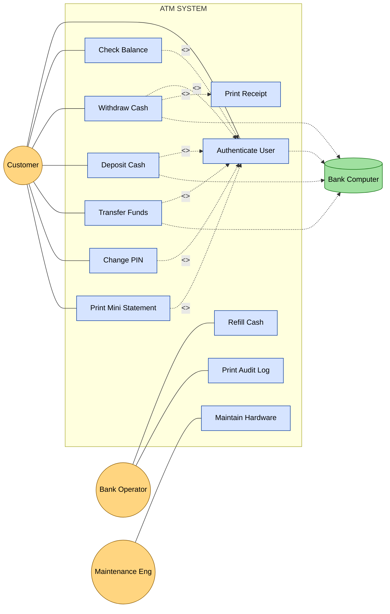
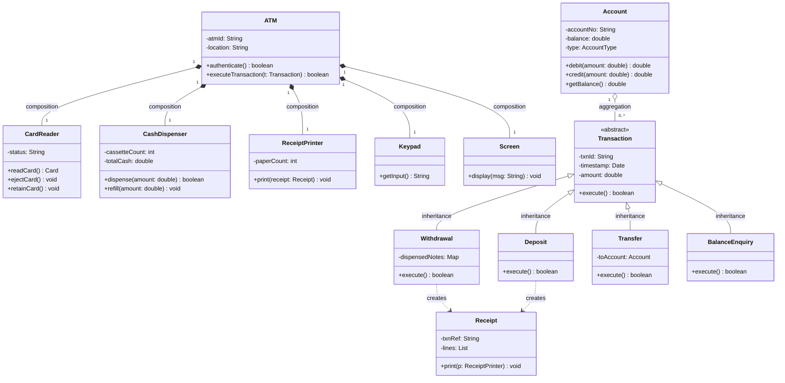
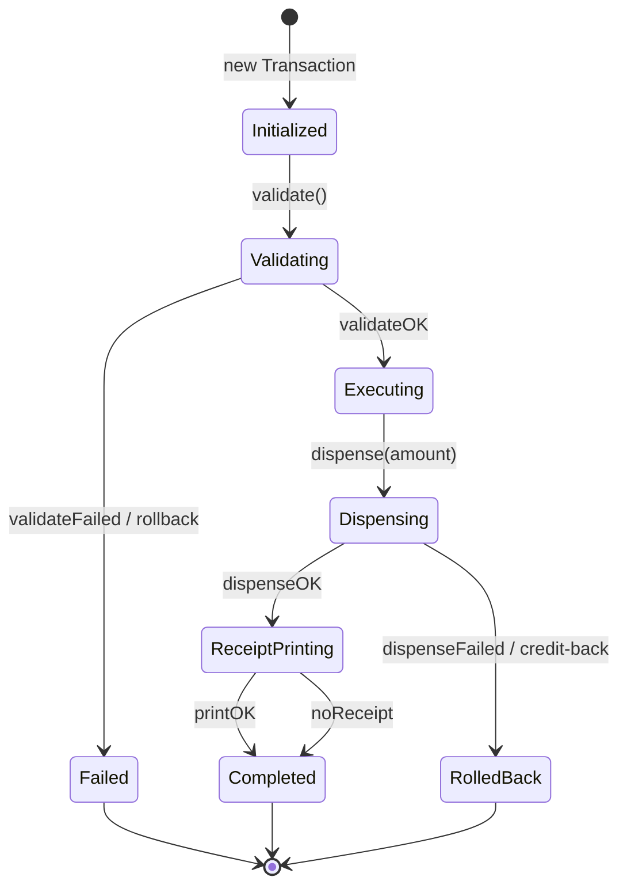
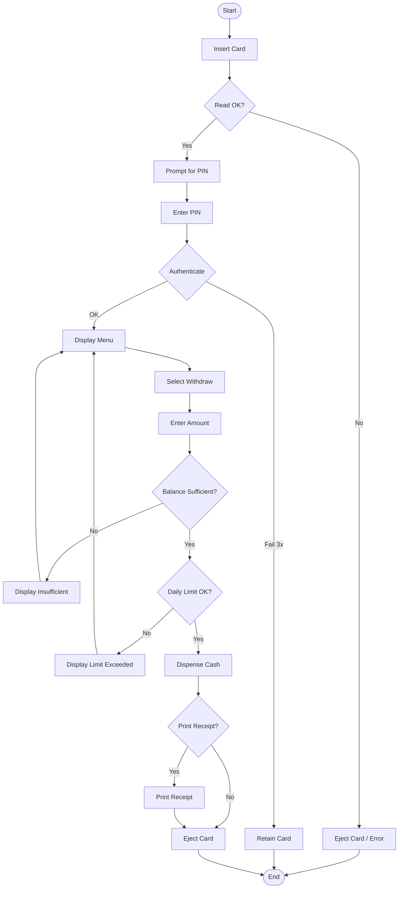
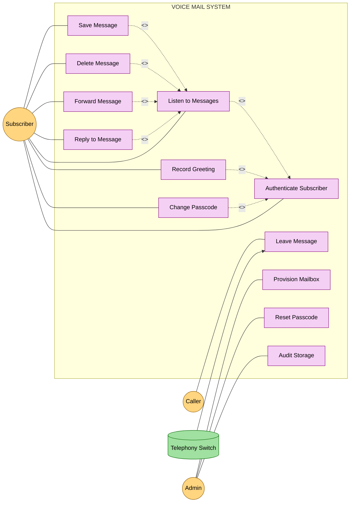
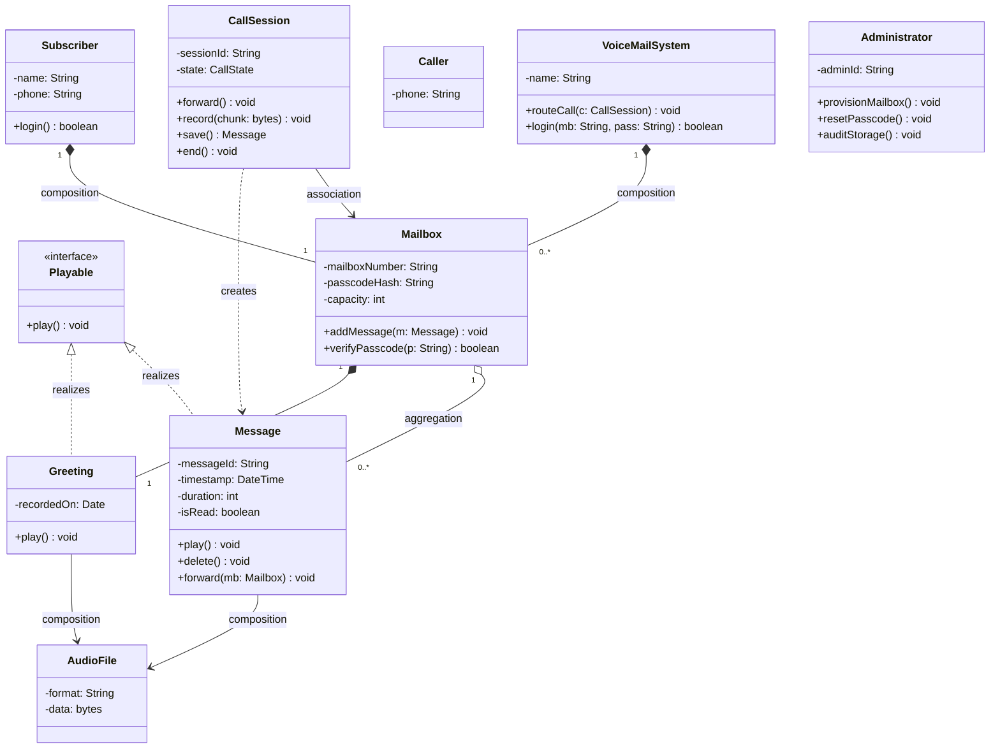
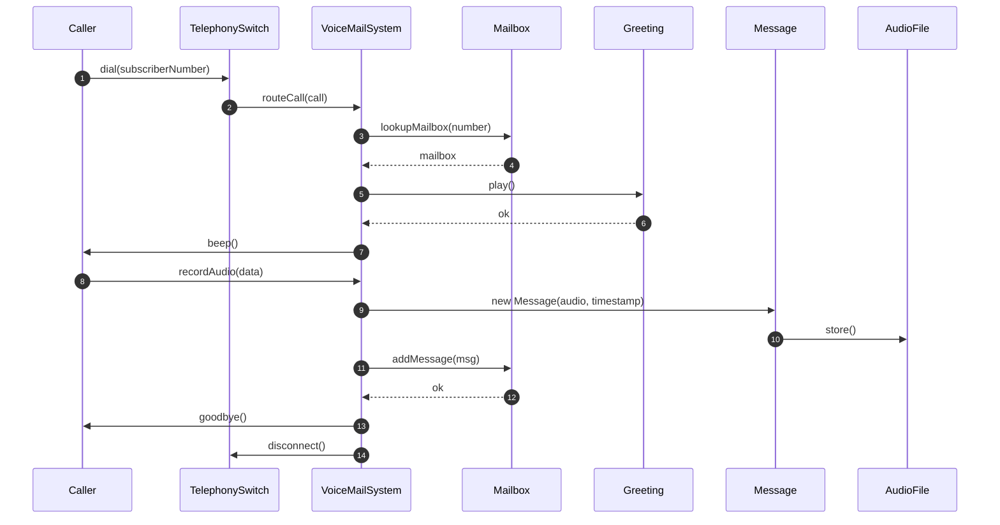
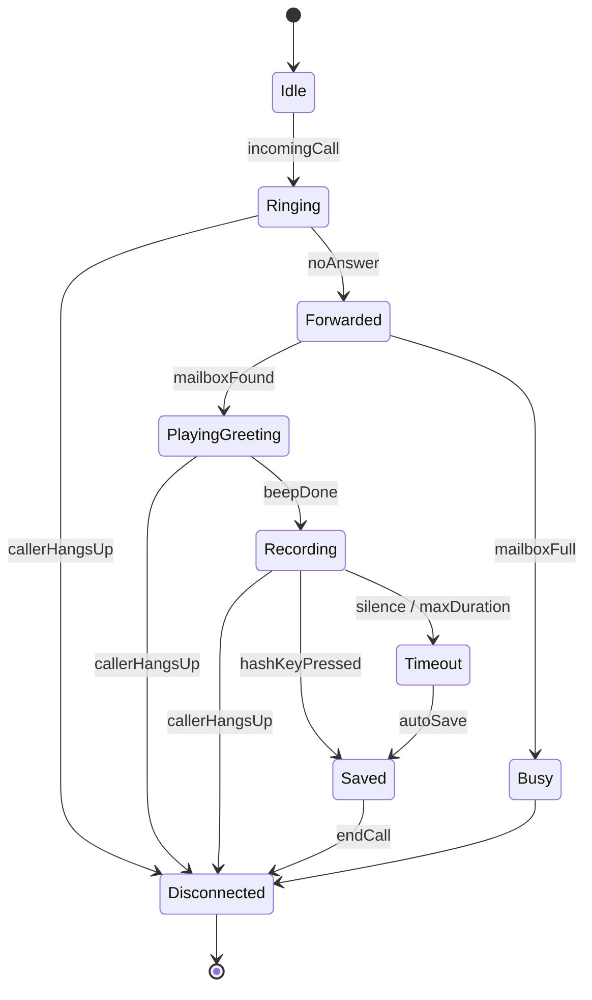

# Case Studies : Voice mail system, ATM Example

<!-- SECTION_1_START -->
# 📘 KTU Software Engineering – Module 2: Case Studies (ATM & Voice Mail System)

## 1. Core Technical Definition & Intuitive Overview

### 1.1 Formal Definition (KTU 2024 Syllabus Terminology)

> [!IMPORTANT]
> **Case Studies in Software Design** are end-to-end, real-world inspired problem statements that demand the application of the **Object-Oriented Analysis and Design (OOAD)** methodology. Under the KTU 2024 Scheme (Course Code: *PECST411*), students are expected to traverse the entire **Unified Modeling Language (UML 2.5)** modeling stack — from **Use Case modeling** down to **Detailed Class Design** — using two canonical examples: the **Automated Teller Machine (ATM)** and the **Voice Mail System (VMS)**.

In KTU parlance, a *case study* is not a coding exercise; it is a **traceable design derivation** where every artifact (a class, a state, a method) must be *justified* by an earlier requirement or interaction.

### 1.2 The Two Reference Systems

| System | Domain | Primary Actor | Core Engineering Challenge |
|---|---|---|---|
| **ATM** | Embedded Real-Time Banking | Customer (Card Holder) | Concurrency, Security, Hardware Abstraction |
| **Voice Mail** | Telecommunication / IVR | Subscriber (Mailbox Owner) | State Persistence, Multi-User Access, Audio Control |

### 1.3 Conceptual Analogy — The Restaurant Kitchen

> [!NOTE]
> **Analogy: Cooking a meal vs. Building the ATM**
> - The **Use Case Diagram** is the *menu card* — what the customer can order (Withdraw, Check Balance).
> - The **Class Diagram** is the *kitchen layout* — stations, chefs, ingredients, recipes.
> - The **Sequence Diagram** is the *order ticket* — the exact chronological steps from order to serving.
> - The **State Diagram** is the *state of the dish* — *raw → marinated → grilled → plated*.
> - The **Activity Diagram** is the *workflow of the kitchen* — who does what, when, with decision forks.
>
> In the ATM, the **Customer** is the *diner*, the **Bank Computer** is the *central pantry*, and the **ATM Controller** is the *head chef coordinating the order*.

### 1.4 Why These Two Case Studies?

> [!TIP]
> The **ATM** is preferred in KTU exams because it has a clean, finite set of use cases with clear external (boundary) actors — perfect for drawing crisp use-case and class diagrams within the **30-minute sketch window** of the exam. The **Voice Mail** is the *contrast case* — featuring richer **state transitions** (Idle → Greeting → Recording → Playing) and **exception paths** (mailbox full, wrong password), making it ideal for testing state-chart and activity-diagram questions.

### 1.5 Visualization Setup for Geometric/Diagram Intuition

> [!VISUALIZATION CONTROL]
> **Concept:** Skeleton Sketch of a Use-Case "Boundary Box" (ATM)
> **Mermaid/Block Coordinates:**
> * `Rectangle (System Boundary)` enclosing ovals like `Withdraw`, `Deposit`, `Transfer`.
> * `Stick figure (Actor)` placed *outside* the boundary on the left.
> * `Solid line (Association)` connecting actor to oval.
> * `Dashed line (<<include>>)` between use cases.
> **Visual Description:** The student should picture a large rounded rectangle labeled *"ATM System"*. The actor stick figure (*Customer*) sits outside on the left. Inside the box, 6–7 ovals (use cases) are arranged. The most complex oval (*Withdraw Cash*) is connected by a dashed arrow labeled *<<include>>* to a smaller oval (*Authentication*) — indicating that every withdrawal MUST authenticate first.
<!-- SECTION_1_END -->

<!-- SECTION_2_START -->
# 2. Deep Theoretical Analysis & KTU High-Yield Formula Sheet

## 2.1 The KTU Design Derivation Pipeline

The KTU 2024 Scheme expects a *deterministic pipeline* for case study questions. Every mark awarded follows this sequence:

$$
\text{Requirement} \;\xrightarrow{\text{extract}}\; \text{Actor} \;\xrightarrow{\text{group}}\; \text{Use Case} \;\xrightarrow{\text{trace}}\; \text{Class} \;\xrightarrow{\text{time-order}}\; \text{Sequence} \;\xrightarrow{\text{lifecycle}}\; \text{State}
$$

### Step-by-Step Logic

1. **Identify Actors** — anything *outside* the system that interacts with it (human, hardware, external software). Give them **nouns** + a *role*, not a person.
2. **Identify Use Cases** — verb-noun phrases representing *goals* of actors (*Withdraw Cash*, *Record Greeting*).
3. **Draw the Use-Case Diagram** with the **System Boundary Box** (a large rectangle).
4. **Write Use-Case Descriptions** using the *Main Flow / Alternative Flow / Exception Flow* template.
5. **Identify Classes** using the *Noun Phrase Analysis* on the problem statement.
6. **Identify Relationships** — association, aggregation, composition, inheritance, dependency.
7. **Build Class Diagram** with **attributes** (visibility `+ - #`), **operations** (signature), and **multiplicity** (1, 1..\*, 0..1).
8. **Build Sequence Diagram** for the most complex use case — focus on **time-ordered message passing**.
9. **Build State-Chart Diagram** for objects with **interesting lifecycles** (e.g., `Call`, `Session`, `Transaction`).
10. **Build Activity Diagram** for *workflows* involving decisions, forks, joins.

### 2.2 KTU Formula Sheet / Cheat Sheet

> [!IMPORTANT]
> The following table is the **exam-day cheat sheet** for both case studies. Memorize the multiplicity rules and relationship types — they are graded with **2–3 marks each** in KTU valuation.

| # | Design Element | Symbol / Syntax | KTU Rule of Thumb | Marks Weight |
|---|---|---|---|---|
| 1 | Public attribute / op. | `+` (plus) | Visible to all classes | 1 |
| 2 | Private attribute / op. | `-` (minus) | Visible only within class | 1 |
| 3 | Protected attribute / op. | `#` (hash) | Visible to subclasses | 1 |
| 4 | Inheritance | `--|>` (hollow triangle) | *"is-a"* relationship | 2 |
| 5 | Composition (strong) | `*--` (filled diamond) | Whole destroys part; multiplicity **1..1** on whole | 2 |
| 6 | Aggregation (weak) | `o--` (hollow diamond) | Whole does NOT destroy part | 1 |
| 7 | Association | `-->` (plain arrow) | *"uses-a"* or *"knows-a*" | 1 |
| 8 | Dependency | `..>` (dashed arrow) | Parameter-level, transient | 1 |
| 9 | `<<include>>` (UC) | dashed arrow to required UC | **Mandatory** sub-flow, no actor interaction | 2 |
| 10 | `<<extend>>` (UC) | dashed arrow from optional UC | **Conditional** extension point | 2 |
| 11 | `<<interface>>` | stereotype above class | Realized by class with dashed `..\|>` | 1 |
| 12 | Multiplicity `1..\*` | inline on association end | "one or many" | 1 |
| 13 | Multiplicity `0..1` | inline on association end | "optional, at most one" | 1 |
| 14 | `final` state | filled circle inside a circle | Object termination | 1 |
| 15 | Initial state | filled black circle | Object creation point | 1 |
| 16 | Synchronization bar | thick horizontal line | Fork/join in activity diagrams | 2 |

### 2.3 Engineering Utility — Why These Designs Matter in Production

> [!TIP]
> - In **production banking systems**, the *Use Case* of `Withdraw Cash` corresponds to a **microservice** endpoint `/api/v1/atm/withdraw` that has *inclusion* of an `Authenticate` interceptor — a **design pattern directly inspired by `<<include>>` relationships**.
> - In **modern IVR (Interactive Voice Response) systems** like Amazon Connect, the **state-chart of a call** (Ringing → Connected → In-IVR → On-Hold → Disconnected) is implemented using **Amazon Lex state machines** — a direct descendant of UML state-chart design.
> - The **Class Diagram** in ATM maps 1-to-1 to a **Java Spring Boot package structure** (`com.bank.atm.controller`, `.service`, `.repository`).

### 2.4 Heuristic Metric: Counting Design Elements

A common KTU Part-B question asks: *"How many classes / use cases / actors are there?"*. The heuristic is:

$$
N_{\text{classes}} \approx 0.3 \times N_{\text{nouns in problem statement}}
$$
$$
N_{\text{use cases}} \approx N_{\text{verb-noun pairs}} \approx 0.4 \times N_{\text{user goals}}
$$
$$
N_{\text{actors}} \approx \text{(Humans)} + \text{(External Systems)} + \text{(Hardware Devices)}
$$
<!-- SECTION_2_END -->

<!-- SECTION_3_START -->
# 3. Step-by-Step Derivations & Symbolic/Code Implementation

## 3.1 Case Study 1: The ATM System (Exhaustive)

### 3.1.1 Problem Statement (Standard KTU Form)

> An Automated Teller Machine (ATM) is a computer-controlled terminal installed in banks and public places. A *Customer* inserts a bank-issued card, enters a PIN, and performs transactions: *Balance Enquiry, Cash Withdrawal, Cash Deposit, Fund Transfer, PIN Change*, and *Mini-Statement Printing*. The ATM communicates with a *Central Bank Computer* for account validation, balance updates, and fraud detection. A *Bank Operator* refills cash and prints audit logs. A *Maintenance Engineer* services the hardware (card reader, cash dispenser, printer).

### 3.1.2 Step A — Actor Identification

| # | Actor | Type | Goal |
|---|---|---|---|
| 1 | **Customer** | Primary (Human) | Perform transactions |
| 2 | **Bank Operator** | Primary (Human) | Refill, audit |
| 3 | **Maintenance Engineer** | Primary (Human) | Hardware service |
| 4 | **Central Bank Computer** | Secondary (External System) | Validate accounts |

> [!NOTE]
> **Exam Tip:** Primary actors sit on the *left* of the use case diagram; secondary/external systems sit on the *right*. The Central Bank Computer is **NOT** a primary actor — it is invoked **internally**.

### 3.1.3 Step B — Use-Case Identification & Relationships

Verbs from problem statement → Use Cases:

- *inserts* → `Authenticate User` (Note: validation = separate UC)
- *enters PIN* → merged into `Authenticate User`
- *Balance Enquiry* → `Check Balance`
- *Cash Withdrawal* → `Withdraw Cash`
- *Cash Deposit* → `Deposit Cash`
- *Fund Transfer* → `Transfer Funds`
- *PIN Change* → `Change PIN`
- *Mini-Statement* → `Print Mini Statement`
- *refills* → `Refill Cash`
- *prints audit* → `Print Audit Log`
- *services hardware* → `Maintain Hardware`

**Relationship Derivation:**

$$
\text{Authenticate User} \;\xleftarrow{\text{<<include>>}}\; \{\text{Withdraw, Deposit, Transfer, PIN Change, Check Balance, Print}\}
$$

**Justification:** Every transaction *must* validate the user first → mandatory inclusion.

$$
\text{Withdraw Cash} \;\xleftarrow{\text{<<extend>>}}\; \text{Print Receipt (extension point: after dispense)}
$$

**Justification:** Receipt printing is *optional* and happens *after* the withdraw completes.

### 3.1.4 Step C — Detailed Use-Case Description (Withdraw Cash)

| Field | Value |
|---|---|
| **Use Case Name** | Withdraw Cash |
| **Primary Actor** | Customer |
| **Stakeholders** | Customer, Bank |
| **Preconditions** | 1. Customer has a valid card. 2. ATM has cash. 3. Account is active. |
| **Postconditions (Success)** | 1. Account debited. 2. Cash dispensed. 3. Card returned. |
| **Postconditions (Failure)** | 1. Account unchanged. 2. Card returned. |

**Main Flow:**
1. Customer inserts card.
2. System reads card and prompts for PIN.
3. Customer enters PIN.
4. System calls `<<include>>` → **Authenticate User**.
5. Authentication succeeds; system displays menu.
6. Customer selects *Withdraw Cash*.
7. Customer selects account type (Savings/Current).
8. Customer enters amount.
9. System sends `validateWithdrawal(accountId, amount)` to Bank Computer.
10. Bank Computer returns *OK + new balance*.
11. System dispenses cash via hardware.
12. System prints receipt via `<<extend>>` → **Print Receipt** (if customer chose yes).
13. System ejects card.
14. Use case ends.

**Alternative Flows:**
- *2a.* Card unreadable → display error, eject card.
- *4a.* Invalid PIN (3 attempts) → retain card, end.
- *9a.* Insufficient funds → display "Insufficient Balance", return to menu.
- *9b.* Daily limit exceeded → display "Limit Exceeded", return to menu.
- *11a.* Cash dispenser jam → alert maintenance, rollback transaction, eject card.

**Exception Flow:**
- *Hardware failure at step 11* → critical alarm to Bank Operator.

> [!WARNING]
> **KTU Valuation Pitfall:** Many students write use-case descriptions in *narrative essay* form. KTU awards **1 mark** for the structured header (Pre/Post conditions), **2 marks** for the numbered main flow, and **2 marks** for alternative/exception flows. Skipping any of these costs marks.

### 3.1.5 Step D — Class Diagram Derivation (Noun Phrase Analysis)

Extracting classes from the problem statement:

| Noun Phrase | Candidate Class | Retained? | Reason |
|---|---|---|---|
| Card | `Card` | ✅ | Persistent entity |
| Customer | (actor) | ❌ | Outside system boundary |
| PIN | attribute of `Card` | ❌ | Not independent |
| Account | `Account` | ✅ | Persistent entity |
| Bank Computer | (actor) | ❌ | External |
| ATM | `ATM` | ✅ | Central controller |
| Cash Dispenser | `CashDispenser` | ✅ | Hardware abstraction |
| Card Reader | `CardReader` | ✅ | Hardware abstraction |
| Receipt Printer | `ReceiptPrinter` | ✅ | Hardware abstraction |
| Keypad | `Keypad` | ✅ | UI hardware |
| Screen | `Screen` | ✅ | UI hardware |
| Transaction | `Transaction` (abstract) | ✅ | Parent class |
| Withdrawal | `Withdrawal` | ✅ | Subclass of Transaction |
| Deposit | `Deposit` | ✅ | Subclass of Transaction |
| Transfer | `Transfer` | ✅ | Subclass of Transaction |
| BalanceEnquiry | `BalanceEnquiry` | ✅ | Subclass of Transaction |
| Receipt | `Receipt` | ✅ | Soft entity |
| Cash | `CashCassette` | ✅ | Inventory tracking |

**Class Refinement (relationships):**

- `ATM` is composed of exactly **one** `CardReader`, **one** `CashDispenser`, **one** `ReceiptPrinter`, **one** `Keypad`, **one** `Screen`. → **Composition** with multiplicity `1`.
- `Account` has `0..*` `Transaction` (history).
- `Withdrawal`, `Deposit`, `Transfer`, `BalanceEnquiry` *inherit* from abstract `Transaction`. → **Generalization**.
- `Customer` (external) is associated with `1..*` `Account`; `Account` linked to `1` `Bank` (external).
- `Receipt` is *associated* with `Transaction` (one transaction → 0..1 receipt).

**Final Class Signatures (excerpt):**

| Class | Attributes | Operations |
|---|---|---|
| `ATM` | `- atmId: String`, `- location: String` | `+ authenticate(): boolean`, `+ executeTransaction(t: Transaction)` |
| `CardReader` | `- status: String` | `+ readCard(): Card`, `+ ejectCard()`, `+ retainCard()` |
| `CashDispenser` | `- cassetteCount: int`, `- totalCash: double` | `+ dispense(amount: double): boolean`, `+ refill(amount: double)` |
| `Account` | `- accountNo: String`, `- balance: double`, `- type: AccountType` | `+ debit(amount)`, `+ credit(amount)`, `+ getBalance()` |
| `Transaction` *(abstract)* | `- txnId: String`, `- timestamp: Date`, `- amount: double` | `+ execute(): boolean` *(abstract)* |
| `Withdrawal` | `- dispensedNotes: Map<Denom,int>` | `+ execute(): boolean` *(override)* |
| `Receipt` | `- txnRef: String`, `- lines: List<String>` | `+ print(printer: ReceiptPrinter)` |

### 3.1.6 Step E — Sequence Diagram (Withdraw Cash) — Time-Ordered

The KTU sequence diagram is a *vertical timeline* with the **Lifeline** of each participating object.

**Participants (left to right):**

`Customer` → `ATM` → `CardReader` → `Keypad` → `Screen` → `BankComputer` → `CashDispenser` → `ReceiptPrinter`

**Message Trace:**

| # | Sender | Receiver | Message | Return |
|---|---|---|---|---|
| 1 | Customer | ATM | `insertCard()` | — |
| 2 | ATM | CardReader | `readCard()` | `card` |
| 3 | ATM | Screen | `display("Enter PIN")` | — |
| 4 | Customer | Keypad | `enterPIN("1234")` | `pin` |
| 5 | ATM | BankComputer | `validate(card, pin)` | `boolean` |
| 6 | ATM | Screen | `displayMenu()` | — |
| 7 | Customer | Keypad | `select("Withdraw")` | — |
| 8 | Customer | Keypad | `enterAmount(5000)` | — |
| 9 | ATM | BankComputer | `debit(accountNo, 5000)` | `newBalance` |
| 10 | ATM | CashDispenser | `dispense(5000)` | `boolean` |
| 11 | ATM | ReceiptPrinter | `print(receipt)` | — |
| 12 | ATM | CardReader | `ejectCard()` | — |

> [!IMPORTANT]
> **KTU Rule:** Every **synchronous message** must have a **return arrow** (dashed). KTU examiners deduct **0.5 mark** per missing return arrow. Total arrows × 0.5 = significant mark loss.

### 3.1.7 Step F — State-Chart Diagram (Transaction Lifecycle)

A `Transaction` object lives through these states:

`Initialized → Validating → Authenticated → Executing → Dispensing → ReceiptPrinting → Completed`
$\;\;\;\;\,$ ↘ $\;\;\;\,$ `Failed (terminal)`
$\;\;\;\;\,$ ↘ $\;\;\;\,$ `RolledBack (terminal)`

Transition triggers: `validateOK / validateFailed / dispenseOK / dispenseFailed / printOK`.

### 3.1.8 Step G — Symbolic Python Implementation (ATM Controller Skeleton)

```python
from abc import ABC, abstractmethod
from enum import Enum
from typing import Optional
import logging

# Configure KTU-grade logging
logging.basicConfig(level=logging.INFO, format="[%(asctime)s] %(levelname)s - %(message)s")
logger = logging.getLogger("ATM")

class AccountType(Enum):
    SAVINGS = "Savings"
    CURRENT = "Current"

class InsufficientFundsError(Exception):
    """Raised when withdrawal exceeds balance."""
    pass

class InvalidPINError(Exception):
    """Raised on PIN mismatch."""
    pass

class Account:
    def __init__(self, account_no: str, balance: float, acc_type: AccountType):
        self._account_no: str = account_no
        self._balance: float = balance
        self._acc_type: AccountType = acc_type

    def debit(self, amount: float) -> float:
        if amount <= 0:
            raise ValueError("Amount must be positive.")
        if amount > self._balance:
            raise InsufficientFundsError(f"Balance {self._balance} < requested {amount}.")
        self._balance -= amount
        logger.info(f"Debited {amount} from {self._account_no}. New balance = {self._balance}")
        return self._balance

    def credit(self, amount: float) -> float:
        if amount <= 0:
            raise ValueError("Amount must be positive.")
        self._balance += amount
        logger.info(f"Credited {amount} to {self._account_no}. New balance = {self._balance}")
        return self._balance

class Transaction(ABC):
    def __init__(self, txn_id: str, account: Account, amount: float):
        self._txn_id: str = txn_id
        self._account: Account = account
        self._amount: float = amount
        self._state: str = "Initialized"

    @abstractmethod
    def execute(self) -> bool:
        pass

    def set_state(self, new_state: str) -> None:
        logger.info(f"Txn {self._txn_id}: {self._state} -> {new_state}")
        self._state = new_state

class Withdrawal(Transaction):
    def __init__(self, txn_id: str, account: Account, amount: float, dispenser):
        super().__init__(txn_id, account, amount)
        self._dispenser = dispenser

    def execute(self) -> bool:
        try:
            self.set_state("Validating")
            # Step 1: Debit
            self._account.debit(self._amount)
            self.set_state("Executing")
            # Step 2: Dispense
            success: bool = self._dispenser.dispense(self._amount)
            if not success:
                self._account.credit(self._amount)   # rollback
                self.set_state("RolledBack")
                return False
            self.set_state("Completed")
            return True
        except InsufficientFundsError as e:
            logger.error(f"Withdrawal failed: {e}")
            self.set_state("Failed")
            return False

class CashDispenser:
    def __init__(self, cassette_count: int, total_cash: float):
        self._cassette_count: int = cassette_count
        self._total_cash: float = total_cash

    def dispense(self, amount: float) -> bool:
        if amount > self._total_cash:
            logger.error("ATM out of cash.")
            return False
        self._total_cash -= amount
        logger.info(f"Dispensed {amount}. Remaining ATM cash = {self._total_cash}")
        return True

    def refill(self, amount: float) -> None:
        self._total_cash += amount
        logger.info(f"Refilled ATM with {amount}.")

class ATM:
    PIN_ATTEMPTS: int = 3
    DAILY_LIMIT: float = 50000.00

    def __init__(self, atm_id: str, dispenser: CashDispenser):
        self._atm_id: str = atm_id
        self._dispenser: CashDispenser = dispenser
        self._daily_withdrawn: float = 0.0

    def authenticate(self, card_pin: str, stored_pin: str) -> bool:
        if card_pin == stored_pin:
            logger.info("Authentication successful.")
            return True
        logger.warning("Authentication failed.")
        return False

    def withdraw(self, account: Account, amount: float, txn_id: str) -> bool:
        if self._daily_withdrawn + amount > self.DAILY_LIMIT:
            logger.error("Daily limit exceeded.")
            return False
        txn: Withdrawal = Withdrawal(txn_id, account, amount, self._dispenser)
        success: bool = txn.execute()
        if success:
            self._daily_withdrawn += amount
        return success

# ---------- Driver Code ----------
if __name__ == "__main__":
    dispenser: CashDispenser = CashDispenser(cassette_count=4, total_cash=500000.0)
    atm: ATM = ATM(atm_id="ATM-Kerala-001", dispenser=dispenser)
    acc: Account = Account(account_no="KL0012345", balance=75000.0, acc_type=AccountType.SAVINGS)

    if atm.authenticate(card_pin="1234", stored_pin="1234"):
        atm.withdraw(acc, amount=10000.0, txn_id="TXN-0001")
        atm.withdraw(acc, amount=50000.0, txn_id="TXN-0002")   # exceeds daily limit
        atm.withdraw(acc, amount=100000.0, txn_id="TXN-0003")  # exceeds balance
```

**Expected Output Trace:**

```
[2024-XX-XX] INFO - Authentication successful.
[2024-XX-XX] INFO - Txn TXN-0001: Initialized -> Validating
[2024-XX-XX] INFO - Debited 10000.0 from KL0012345. New balance = 65000.0
[2024-XX-XX] INFO - Txn TXN-0001: Validating -> Executing
[2024-XX-XX] INFO - Dispensed 10000.0. Remaining ATM cash = 490000.0
[2024-XX-XX] INFO - Txn TXN-0001: Executing -> Completed
[2024-XX-XX] ERROR - Daily limit exceeded.
[2024-XX-XX] ERROR - Withdrawal failed: Balance 65000.0 < requested 100000.0.
[2024-XX-XX] INFO - Txn TXN-0003: Validating -> Failed
```

---

## 3.2 Case Study 2: The Voice Mail System (Exhaustive)

### 3.2.1 Problem Statement (Standard KTU Form)

> A *Voice Mail System (VMS)* allows a *Subscriber* to receive voice messages when unavailable. A *Caller* (who may or may not be a subscriber) dials the subscriber's number; if the line is busy or unanswered, the call is forwarded to VMS. The system plays a *greeting* and records a *message*. The subscriber later logs in (with **mailbox number + passcode**) to *listen, save, delete, forward*, or *reply* to messages. An *Administrator* configures mailboxes, resets passcodes, and audits storage.

### 3.2.2 Step A — Actor Identification

| # | Actor | Type | Goal |
|---|---|---|---|
| 1 | **Subscriber** | Primary (Human) | Manage mailbox and messages |
| 2 | **Caller** | Primary (Human) | Leave a message |
| 3 | **Administrator (VMS Admin)** | Primary (Human) | Provision and audit |
| 4 | **Telephony Switch (PSTN)** | Secondary (External System) | Forward unanswered calls |

### 3.2.3 Step B — Use-Case Identification

| Use Case | Primary Actor | Triggered By |
|---|---|---|
| `Leave Message` | Caller | Call forwarded by switch |
| `Record Greeting` | Subscriber | Subscriber login |
| `Listen to Messages` | Subscriber | Subscriber login |
| `Save Message` | Subscriber | During playback |
| `Delete Message` | Subscriber | During playback |
| `Forward Message` | Subscriber | During playback |
| `Reply to Message` | Subscriber | During playback |
| `Change Passcode` | Subscriber | Subscriber settings |
| `Provision Mailbox` | Admin | Admin login |
| `Reset Passcode` | Admin | Subscriber request |
| `Audit Storage` | Admin | Periodic |

**Key Relationships:**

$$
\text{Listen to Messages} \;\xleftarrow{\text{<<include>>}}\; \text{Authenticate Subscriber}
$$

$$
\text{Save/Delete/Forward/Reply} \;\xleftarrow{\text{<<extend>>}}\; \text{Listen to Messages}
$$

**Justification:** Save/Delete/Forward/Reply happen *while* listening — they are conditional extensions.

### 3.2.4 Step C — Detailed Use-Case (Leave Message)

| Field | Value |
|---|---|
| **Use Case Name** | Leave Message |
| **Primary Actor** | Caller |
| **Preconditions** | 1. Caller's call was forwarded. 2. Subscriber's mailbox is not full. |
| **Postconditions** | 1. New `Message` object created. 2. Notification queued for subscriber. |

**Main Flow:**
1. Switch forwards call to VMS.
2. VMS plays *"Subscriber X is unavailable"*.
3. VMS plays subscriber's *greeting*.
4. VMS plays beep.
5. Caller speaks; VMS records audio.
6. Caller presses `#` to stop.
7. VMS saves message with timestamp, caller-ID, duration.
8. VMS plays *"Message recorded. Goodbye."*
9. VMS disconnects call.

**Alternative Flow:**
- *4a.* Caller hangs up before beep → no message recorded.
- *5a.* Recording exceeds max duration (60 s) → auto-stop, save partial.
- *6a.* 5 seconds of silence → auto-end with confirmation prompt.

**Exception Flow:**
- *Mailbox full* → *"Mailbox is full, please try later"*; no save.
- *Greeting not recorded* → system default greeting played.

### 3.2.5 Step D — Class Diagram for VMS

| Class | Key Attributes | Key Operations |
|---|---|---|
| `VoiceMailSystem` | `- name: String` | `+ routeCall(c: Call)`, `+ login(mb, pass): boolean` |
| `Mailbox` | `- mailboxNumber: String`, `- passcodeHash: String`, `- capacity: int` | `+ addMessage(m: Message)`, `+ removeMessage(id)` |
| `Message` | `- messageId: String`, `- timestamp: DateTime`, `- audioFile: AudioFile`, `- duration: int`, `- isRead: bool` | `+ play()`, `+ delete()`, `+ forward(mb: Mailbox)` |
| `Greeting` | `- audioFile: AudioFile`, `- recordedOn: Date` | `+ play()` |
| `Subscriber` | `- name: String`, `- phone: String`, `- mailbox: Mailbox` | `+ login()`, `+ manageMessages()` |
| `Caller` | `- phone: String` | (lightweight external) |
| `CallSession` | `- sessionId: String`, `- startTime: DateTime`, `- state: CallState` | `+ start()`, `+ record()`, `+ end()` |
| `Administrator` | `- adminId: String` | `+ provisionMailbox()`, `+ resetPasscode()`, `+ auditStorage()` |
| `AudioFile` *(boundary)* | `- format: String`, `- sizeKB: int` | `+ play()` |
| `TelephonySwitch` *(external)* | — | `+ forwardCall(number)` |

**Relationships (selected):**

- `Subscriber` ↔ `Mailbox` : **Composition** (1 ↔ 1). When subscriber is deleted, mailbox is destroyed.
- `Mailbox` ◇→ `Message` : **Aggregation** (1 ↔ 0..\*). Messages can be archived independently.
- `VoiceMailSystem` ◆→ `Mailbox` : **Composition** (1 ↔ 0..\*).
- `CallSession` → `Message` : **Association** (1 ↔ 0..1).
- `Message`, `Greeting` *realize* `<<interface>> Playable` (with `+ play()` method).

### 3.2.6 Step E — Sequence Diagram (Leave Message)

Participants: `Caller` → `TelephonySwitch` → `VoiceMailSystem` → `Mailbox` → `Message` → `AudioFile` (storage).

| # | From | To | Message |
|---|---|---|---|
| 1 | Caller | TelephonySwitch | `dial(subscriberNumber)` |
| 2 | TelephonySwitch | VoiceMailSystem | `routeCall(call)` |
| 3 | VoiceMailSystem | Mailbox | `playGreeting()` |
| 4 | Mailbox | Greeting | `play()` |
| 5 | VoiceMailSystem | Caller | `beep()` |
| 6 | Caller | VoiceMailSystem | `recordAudio(audioData)` |
| 7 | VoiceMailSystem | Message | `new Message(audioData, timestamp)` |
| 8 | VoiceMailSystem | Mailbox | `addMessage(message)` |
| 9 | VoiceMailSystem | Caller | `goodbye()` |
| 10 | VoiceMailSystem | TelephonySwitch | `disconnect()` |

### 3.2.7 Step F — State-Chart Diagram (CallSession Lifecycle)

This is the *most-tested* diagram for VMS in KTU exams.

States:

`Idle → Ringing → Forwarded → PlayingGreeting → Recording → Saved → Disconnected (final)`

Alternate paths:

- *Idle → Busy* (if mailbox full or system down)
- *Recording → Timeout* (silence / max duration exceeded)
- *Saved → Disconnected*

> [!WARNING]
> **Valuation Warning:** A common student error is drawing **arrows without labels**. KTU demands **transition labels** in the format `event [guard] / action`. Example: `recordingDone [duration > 60s] / stopRecording`. Missing the guard/action costs **1 mark** per arrow.

### 3.2.8 Step G — Symbolic Python Implementation (VMS Skeleton)

```python
from abc import ABC, abstractmethod
from datetime import datetime
from typing import List, Optional
import hashlib
import logging

logger = logging.getLogger("VMS")
logging.basicConfig(level=logging.INFO, format="[%(asctime)s] %(levelname)s - %(message)s")

class Playable(ABC):
    """<<interface>> for any audio entity that can be played."""
    @abstractmethod
    def play(self) -> None: ...

class AudioFile:
    def __init__(self, format: str, data: bytes):
        self._format: str = format
        self._data: bytes = data

    @property
    def size_kb(self) -> float:
        return len(self._data) / 1024.0

class Message(Playable):
    def __init__(self, message_id: str, audio: AudioFile, caller_id: str):
        self._message_id: str = message_id
        self._audio: AudioFile = audio
        self._caller_id: str = caller_id
        self._timestamp: datetime = datetime.now()
        self._is_read: bool = False

    def play(self) -> None:
        logger.info(f"Playing message {self._message_id} from {self._caller_id} @ {self._timestamp}")
        self._is_read = True

    @property
    def is_read(self) -> bool:
        return self._is_read

class Greeting(Playable):
    def __init__(self, audio: AudioFile):
        self._audio: AudioFile = audio

    def play(self) -> None:
        logger.info("Playing subscriber greeting...")

class MailboxFullError(Exception): ...
class AuthenticationError(Exception): ...

class Mailbox:
    MAX_MESSAGES: int = 50

    def __init__(self, mailbox_number: str, passcode: str):
        self._mailbox_number: str = mailbox_number
        self._passcode_hash: str = hashlib.sha256(passcode.encode()).hexdigest()
        self._messages: List[Message] = []
        self._greeting: Optional[Greeting] = None

    def add_message(self, msg: Message) -> None:
        if len(self._messages) >= self.MAX_MESSAGES:
            raise MailboxFullError(f"Mailbox {self._mailbox_number} is full.")
        self._messages.append(msg)
        logger.info(f"Message {msg._message_id} added. Total = {len(self._messages)}")

    def list_unread(self) -> List[Message]:
        return [m for m in self._messages if not m.is_read]

    def verify_passcode(self, passcode: str) -> bool:
        return hashlib.sha256(passcode.encode()).hexdigest() == self._passcode_hash

class CallState(Enum if False else object):
    pass

# Inline enum for compatibility
from enum import Enum
class CallState(Enum):
    IDLE = "Idle"
    RINGING = "Ringing"
    FORWARDED = "Forwarded"
    PLAYING_GREETING = "PlayingGreeting"
    RECORDING = "Recording"
    SAVED = "Saved"
    DISCONNECTED = "Disconnected"

class CallSession:
    def __init__(self, session_id: str, mailbox: Mailbox):
        self._session_id: str = session_id
        self._mailbox: Mailbox = mailbox
        self._state: CallState = CallState.IDLE
        self._audio_buffer: bytearray = bytearray()

    def set_state(self, new_state: CallState) -> None:
        logger.info(f"Session {self._session_id}: {self._state.value} -> {new_state.value}")
        self._state = new_state

    def forward(self) -> None:
        self.set_state(CallState.FORWARDED)

    def play_greeting(self) -> None:
        self.set_state(CallState.PLAYING_GREETING)
        if self._mailbox._greeting:
            self._mailbox._greeting.play()
        else:
            logger.info("No custom greeting; using default.")

    def record(self, chunk: bytes) -> None:
        self.set_state(CallState.RECORDING)
        self._audio_buffer.extend(chunk)

    def save(self) -> Message:
        self.set_state(CallState.SAVED)
        audio: AudioFile = AudioFile(format="wav", data=bytes(self._audio_buffer))
        msg: Message = Message(
            message_id=f"MSG-{self._session_id}",
            audio=audio,
            caller_id="UNKNOWN"
        )
        self._mailbox.add_message(msg)
        return msg

    def end(self) -> None:
        self.set_state(CallState.DISCONNECTED)

class VoiceMailSystem:
    def __init__(self, name: str):
        self._name: str = name
        self._mailboxes: dict[str, Mailbox] = {}

    def provision_mailbox(self, mailbox_number: str, passcode: str) -> Mailbox:
        if mailbox_number in self._mailboxes:
            raise ValueError("Mailbox exists.")
        mb: Mailbox = Mailbox(mailbox_number, passcode)
        self._mailboxes[mailbox_number] = mb
        logger.info(f"Provisioned mailbox {mailbox_number}")
        return mb

    def route_call(self, mailbox_number: str) -> Optional[CallSession]:
        if mailbox_number not in self._mailboxes:
            logger.warning("Number not provisioned.")
            return None
        mb: Mailbox = self._mailboxes[mailbox_number]
        session: CallSession = CallSession(session_id="S001", mailbox=mb)
        session.forward()
        session.play_greeting()
        return session

# ---------- Driver ----------
if __name__ == "__main__":
    vms: VoiceMailSystem = VoiceMailSystem(name="Kerala-VMS")
    mb: Mailbox = vms.provision_mailbox("MB-9999", "secret123")

    session: Optional[CallSession] = vms.route_call("MB-9999")
    if session:
        session.record(b"\x00\x01" * 8000)   # ~1 second of fake audio
        session.save()
        session.end()
```

**Expected Trace:**

```
[2024-XX-XX] INFO - Provisioned mailbox MB-9999
[2024-XX-XX] INFO - Session S001: Idle -> Forwarded
[2024-XX-XX] INFO - Session S001: Forwarded -> PlayingGreeting
[2024-XX-XX] INFO - No custom greeting; using default.
[2024-XX-XX] INFO - Session S001: PlayingGreeting -> Recording
[2024-XX-XX] INFO - Session S001: Recording -> Saved
[2024-XX-XX] INFO - Message MSG-S001 added. Total = 1
[2024-XX-XX] INFO - Session S001: Saved -> Disconnected
```
<!-- SECTION_3_END -->

<!-- SECTION_4_START -->
# 4. Structural Diagrams & Schematics

> [!NOTE]
> All Mermaid diagrams below follow the **Node Identifier Alpha Rule** (alphanumeric, letter-prefixed) and **Label Formatting Restriction** (no markdown inside double-quoted labels). Multi-stage systems are isolated using `subgraph` blocks.

## 4.1 ATM — Use-Case Diagram (with Boundary Box)



## 4.2 ATM — Class Diagram



## 4.3 ATM — State-Chart Diagram (Transaction)



## 4.4 ATM — Activity Diagram (Withdraw Workflow)



## 4.5 Voice Mail — Use-Case Diagram



## 4.6 Voice Mail — Class Diagram



## 4.7 Voice Mail — Sequence Diagram (Leave Message)



## 4.8 Voice Mail — State-Chart Diagram (CallSession)


<!-- SECTION_4_END -->

<!-- SECTION_5_START -->
# 5. KTU 2024 Scheme Examination Question Bank & Topic Recap

## 5.1 Part A — Short Answer Questions (3 Marks Each)

### Q1. `[KTU University Exam – July 2024]` — CO1, Remember

**Differentiate between `<<include>>` and `<<extend>>` relationships in a UML use case diagram. Give one example of each from the ATM system.**

**Model Answer (Board Key Pattern):**

| Aspect | `<<include>>` | `<<extend>>` |
|---|---|---|
| Meaning | Mandatory reuse of another use case's behavior | Optional, conditional insertion of behavior |
| Direction of arrow | From base UC → included UC | From extending UC → base UC |
| Trigger | Always executed when base UC runs | Triggered by an *extension point* and a *guard condition* |
| Actor awareness | Actor of included UC is *same* as base | May involve *different* actor or no actor |
| **ATM Example** | `Withdraw Cash` → `Authenticate User` (every withdrawal MUST authenticate) | `Print Receipt` → `Withdraw Cash` (only if customer presses *Yes*) |

> **Valuation Key:** Naming + direction + 1 ATM example each = **3 marks**.

---

### Q2. `[KTU University Exam – Dec 2023]` — CO1, Remember

**List any four classes that can be identified for the Voice Mail System case study using Noun Phrase Analysis. State one attribute and one operation for each.**

**Model Answer:**

| # | Class | Attribute | Operation |
|---|---|---|---|
| 1 | `Mailbox` | `mailboxNumber: String` | `addMessage(m: Message)` |
| 2 | `Message` | `timestamp: DateTime` | `play()` |
| 3 | `Greeting` | `recordedOn: Date` | `play()` |
| 4 | `Subscriber` | `phone: String` | `login()` |

> **Valuation Key:** 4 classes × (0.5 attribute + 0.5 operation) = **3 marks** (rounded).

---

## 5.2 Part B — Long Answer (14 Marks, Internal Choice)

### Question A (14 Marks) — `[KTU University Exam – July 2024, Model Paper]`
**Mapped CO:** CO2 | **RBT Levels:** Understand (a) + Apply (b)

**ATM Case Study:**

**(a)** Draw the **Use-Case Diagram** for the ATM system. Identify all primary and secondary actors, and clearly mark any `<<include>>` and `<<extend>>` relationships. **[7 Marks]**

**(b)** Draw the **Class Diagram** for the ATM. Show at least **8 classes**, with proper **multiplicities**, **visibility modifiers** (`+`, `-`, `#`), and **at least one each** of *inheritance, composition, aggregation, and association*. **[7 Marks]**

---

#### Model Solution for (a) — Use-Case Diagram

[Refer to **Section 4.1** for the complete Mermaid-rendered diagram. In a written exam, students must draw:]

**Boundary Box:** A large rectangle labeled *"ATM System"*.

**Actors (outside the box):**
- Left side: `Customer` (stick figure)
- Right side: `Bank Operator`, `Maintenance Engineer`
- Far right: `Central Bank Computer` (shown as a rectangle with `<<external system>>` stereotype)

**Use Cases (inside the box, ovals):**
- `Authenticate User`
- `Check Balance`
- `Withdraw Cash`
- `Deposit Cash`
- `Transfer Funds`
- `Change PIN`
- `Print Mini Statement`
- `Print Receipt`
- `Refill Cash`
- `Print Audit Log`
- `Maintain Hardware`

**Lines:**
- Solid: Customer → every transaction use case.
- Dashed arrow labeled `<<include>>`: from `Withdraw Cash`, `Deposit Cash`, `Transfer Funds`, `Change PIN`, `Check Balance`, `Print Mini Statement` → `Authenticate User`.
- Dashed arrow labeled `<<extend>>`: from `Print Receipt` → `Withdraw Cash` with extension point *"after dispense"*.
- Dashed arrow: from `Authenticate User` → `Central Bank Computer`.

**Valuation Key for (a):**
- [Naming the system boundary box: 1 Mark]
- [At least 4 primary use cases: 1 Mark]
- [Identifying `<<include>>` with at least one example: 2 Marks]
- [Identifying `<<extend>>` correctly: 1 Mark]
- [External system shown as separate actor: 1 Mark]
- [Clean diagram with no crossing lines: 1 Mark]

---

#### Model Solution for (b) — Class Diagram

[Refer to **Section 4.2** for the complete Mermaid-rendered class diagram. In a written exam, students must draw:]

**Eight Mandatory Classes:** `ATM`, `CardReader`, `CashDispenser`, `Account`, `Transaction`, `Withdrawal`, `Receipt`, `Bank`.

**Visibility (sample):**
- `ATM`: `- atmId: String` (private), `+ authenticate(): boolean` (public)
- `Account`: `- balance: double` (private), `+ getBalance(): double` (public)

**Relationships demonstrated:**
- *Inheritance*: `Withdrawal`, `Deposit`, `Transfer`, `BalanceEnquiry` all `--|>` `Transaction` (abstract). `[1 Mark]`
- *Composition*: `ATM *-- CardReader`, `ATM *-- CashDispenser` (filled diamond, both 1..1). `[2 Marks]`
- *Aggregation*: `Account o-- Transaction` (0..\*). `[1 Mark]`
- *Association*: `Customer -- Account` (1 ↔ 1..\*). `[1 Mark]`

**Valuation Key for (b):**
- [8 distinct classes: 2 Marks]
- [Correct visibility markers: 1 Mark]
- [Inheritance arrow correctly drawn: 1 Mark]
- [Composition arrow (filled diamond) + multiplicity: 2 Marks]
- [Aggregation arrow (hollow diamond): 1 Mark]

---

### Question B (14 Marks) — Alternative Choice `[KTU University Exam – Dec 2023]`
**Mapped CO:** CO2 + CO3 | **RBT Levels:** Understand (a) + Apply (b)

**Voice Mail Case Study:**

**(a)** Draw the **Class Diagram** for the Voice Mail System showing at least **7 classes** with attributes, operations, and relationships (composition, aggregation, generalization, dependency). **[7 Marks]**

**(b)** Draw the **State-Chart Diagram** for a `CallSession` object from the moment a call is forwarded to the VMS until it is disconnected. Include at least **6 states**, **3 alternative/exception transitions**, and label all transitions with `event [guard] / action`. **[7 Marks]**

---

#### Model Solution for (a) — Class Diagram

[Refer to **Section 4.6** for the Mermaid-rendered class diagram.]

**Seven+ Classes:** `VoiceMailSystem`, `Mailbox`, `Message`, `Greeting`, `Subscriber`, `CallSession`, `Administrator`, `AudioFile`, `Playable` (interface).

**Sample Attribute + Operation Pairs:**
- `Mailbox`: `-mailboxNumber: String`, `+verifyPasscode(p: String): boolean`
- `Message`: `-timestamp: DateTime`, `+play(): void`
- `Subscriber`: `-phone: String`, `+login(): boolean`

**Relationships:**
- *Generalization*: `Message` and `Greeting` both `..|>` `Playable` interface. `[1 Mark]`
- *Composition*: `VoiceMailSystem *-- Mailbox` (1 ↔ 0..\*), `Mailbox *-- Greeting` (1 ↔ 1). `[2 Marks]`
- *Aggregation*: `Mailbox o-- Message` (1 ↔ 0..\*). `[1 Mark]`
- *Dependency*: `CallSession ..> Message` (creates). `[1 Mark]`

**Valuation Key for (a):**
- [7 classes with attrs and ops: 2 Marks]
- [One generalization or interface realization: 1 Mark]
- [Composition with multiplicity: 1 Mark]
- [Aggregation clearly distinguished: 1 Mark]
- [Dependency arrow: 1 Mark]
- [Neat layout, no overlapping labels: 1 Mark]

---

#### Model Solution for (b) — State-Chart Diagram

[Refer to **Section 4.8** for the Mermaid-rendered state diagram.]

**Six+ States (with guards/actions on transitions):**

| # | State | Transition Out | Event | Guard | Action |
|---|---|---|---|---|---|
| 1 | Idle | → Ringing | `incomingCall` | — | `logCall` |
| 2 | Ringing | → Forwarded | `noAnswer` | `subscriberBusy` | `forwardToVMS` |
| 3 | Forwarded | → PlayingGreeting | `mailboxFound` | — | `loadGreeting` |
| 4 | PlayingGreeting | → Recording | `beepDone` | — | `startRecorder` |
| 5 | Recording | → Saved | `hashKeyPressed` | `duration < 60` | `stopAndSave` |
| 6 | Recording | → Timeout | `silence` | `silence > 5s` | `stopAndSave` |
| 7 | Recording | → Disconnected | `callerHangsUp` | — | `discardBuffer` |
| 8 | Forwarded | → Busy | `mailboxFull` | — | `playFullMsg` |
| 9 | Saved / Timeout | → Disconnected | `endCall` | — | `releaseResources` |
| 10 | Disconnected | → (final) | — | — | — |

**Valuation Key for (b):**
- [6+ states correctly drawn: 2 Marks]
- [Initial pseudo-state (filled black circle): 0.5 Mark]
- [Final state (bull's eye): 0.5 Mark]
- [At least 3 guards on transitions: 2 Marks]
- [At least 2 actions on transitions: 1 Mark]
- [One self-transition or history state: 0.5 Mark]
- [Correct legend / arrows with arrowheads: 0.5 Mark]

---

## 5.3 KTU Examiner's Valuation Warning / Pitfall Callout

> [!WARNING]
> **Common Mark-Loss Zones (verified against KTU valuation reports):**
> 1. **Forgetting the system boundary box** in use-case diagrams → **−2 marks**.
> 2. **Confusing `<<include>>` and `<<extend>>` arrow direction** → **−2 marks**. (Tip: *base → included*, *extending → base*.)
> 3. **Drawing filled diamond for aggregation** (should be *hollow*) → **−1 mark**.
> 4. **Omitting multiplicity** on class-diagram associations → **−1 mark** per missing multiplicity (max −3).
> 5. **State-chart transitions without labels** → **−1 mark** per arrow.
> 6. **Sequence-diagram return arrows missing** → **−0.5 mark** per missing return.
> 7. **Forgetting the `<<abstract>>` stereotype** on abstract class `Transaction` → **−1 mark**.
> 8. **Confusing Actor with Class** (drawing `Customer` *inside* the boundary box) → **−2 marks**.
> 9. **Drawing only 5 use cases** when 8 are expected → **−1.5 marks** for incompleteness.
> 10. **Writing use-case description as paragraphs** instead of numbered steps → loses **1–2 marks** on the structured format.

---

## 5.4 Topic Recap & Important Things to Remember

> [!TIP]
> **🎯 Final 5-Minute Rapid Revision Checklist**

### 🎯 Actors
- **ATM:** Customer, Bank Operator, Maintenance Engineer, Central Bank Computer (external).
- **VMS:** Subscriber, Caller, Administrator, Telephony Switch (external).

### 🎯 Use Cases
- **ATM:** Authenticate User, Check Balance, Withdraw Cash, Deposit Cash, Transfer Funds, Change PIN, Print Mini Statement, Print Receipt, Refill Cash, Print Audit Log, Maintain Hardware.
- **VMS:** Authenticate Subscriber, Leave Message, Listen to Messages, Save, Delete, Forward, Reply, Record Greeting, Change Passcode, Provision Mailbox, Reset Passcode, Audit Storage.

### 🎯 Key Relationships
- `Withdraw Cash` → `<<include>>` → `Authenticate User` (mandatory).
- `Print Receipt` → `<<extend>>` → `Withdraw Cash` (optional).
- `Listen to Messages` → `<<include>>` → `Authenticate Subscriber`.
- `Save/Delete/Forward/Reply` → `<<extend>>` → `Listen to Messages`.

### 🎯 Class Diagram Multiplicities (Must Memorize)
- `ATM` ↔ `CardReader` / `CashDispenser` / `ReceiptPrinter` / `Keypad` / `Screen` : **1 ↔ 1** (composition).
- `Account` ↔ `Transaction` : **1 ↔ 0..\*** (aggregation).
- `Mailbox` ↔ `Message` : **1 ↔ 0..\*** (aggregation, MAX = 50).
- `Subscriber` ↔ `Mailbox` : **1 ↔ 1** (composition).
- `Customer` (external) ↔ `Account` : **1 ↔ 1..\***.

### 🎯 Transaction Lifecycle (ATM)
`Initialized → Validating → Executing → Dispensing → ReceiptPrinting → Completed`
(alternate finals: `Failed`, `RolledBack`)

### 🎯 CallSession Lifecycle (VMS)
`Idle → Ringing → Forwarded → PlayingGreeting → Recording → Saved → Disconnected`
(alternate: `Busy`, `Timeout`)

### 🎯 Critical UML Symbols (Quick Recall)
| Symbol | Meaning |
|---|---|
| `+` | public |
| `-` | private |
| `#` | protected |
| `--|>` | inheritance |
| `*--` | composition |
| `o--` | aggregation |
| `..>` | dependency |
| `<<include>>` | mandatory reuse |
| `<<extend>>` | optional extension |
| Filled circle | initial state |
| Bull's eye | final state |

### 🎯 KTU Exam Strategy (Last-Minute Tips)
- Allocate **7 min for use-case**, **10 min for class**, **8 min for state**, **5 min for revision** in a typical 14-mark question.
- Always draw the **boundary box first**, then actors, then use cases — this order reduces clutter.
- Use **legend boxes** in state-chart diagrams.
- In sequence diagrams, **lifelines must be vertical dashed lines** — students often draw them as solid lines, losing **0.5 mark**.
- When asked *"how many actors?"*, count **external systems + humans**, not classes.
- Always specify **preconditions and postconditions** in use-case descriptions — examiners look for these phrases verbatim.
<!-- SECTION_5_END -->
