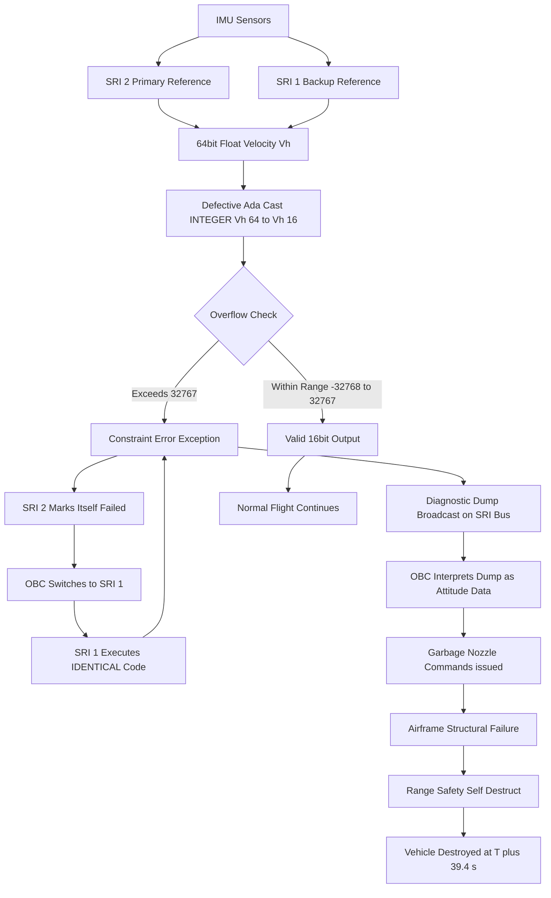
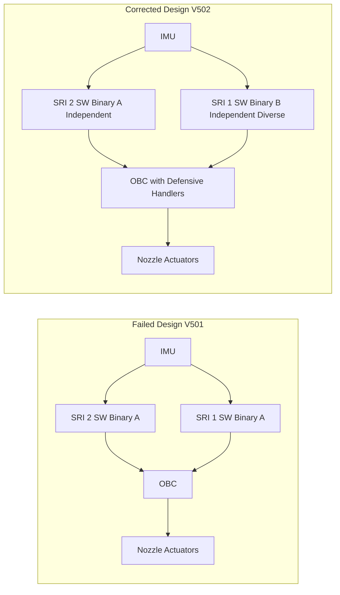
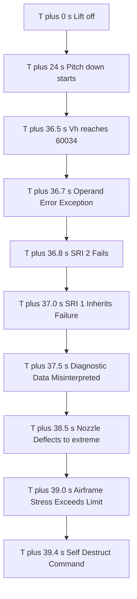
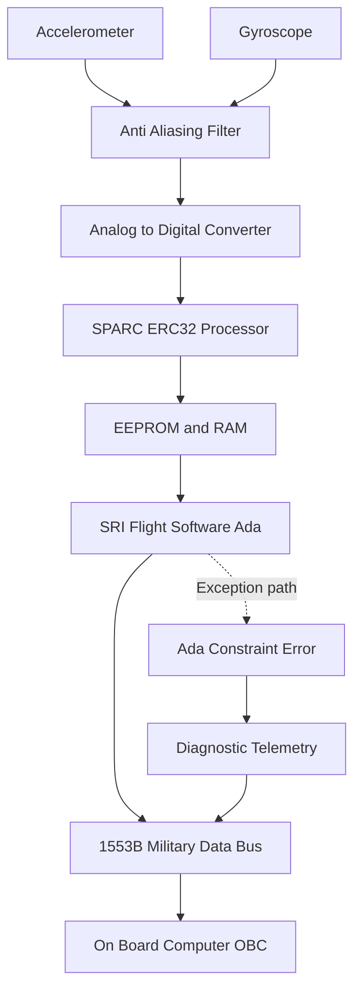

# Case study:  Ariane launch failure

<!-- SECTION_1_START -->

# Case Study: Ariane 5 Launch Failure — A Landmark Software Engineering Catastrophe

> [!IMPORTANT]
> **KTU 2024 Scheme | PECST411 — Software Engineering | Module 2: Software Design**
> **Topic Significance:** This case study is a **mandatory syllabus case study** under design-level risk and reliability analysis. It is the most frequently asked case-based question in KTU ESE for Module 2 and maps directly to **CO3 (Apply software engineering principles to evaluate real-world system failures)**.

---

## 1.1 Formal Academic Definition

The **Ariane 5 Flight 501 Failure** refers to the destruction of the European Space Agency's (ESA) Ariane 5 expendable launch system on **June 4, 1996**, approximately **39 seconds** after lift-off from Kourou, French Guiana. The failure was caused by a **software exception (data conversion overflow)** in the Inertial Reference System (SRI) of the onboard computer, leading to a cascade of incorrect attitude calculations, loss of vehicle control, and the activation of the **self-destruct range safety command**.

In software engineering terminology, it is classified as a **post-deployment catastrophic software failure** rooted in:
- **Unreusable software component inheritance** (SRI code reused from Ariane 4)
- **Improper specification of operational domain** (out-of-range input not handled)
- **Absence of defensive exception handling** in mission-critical flight software
- **Inadequate system-level software/hardware integration testing**

---

## 1.2 Conceptual Analogy / Intuition

> [!NOTE]
> **Real-World Analogy: The "Speedometer in a Car" Problem**
>
> Imagine a luxury car (Ariane 4) whose dashboard speedometer was originally designed to read up to **250 km/h**. Years later, the same dashboard module is reused, unmodified, in a sports car (Ariane 5) that can reach **400 km/h**. The moment the needle crosses 250 km/h, the digital odometer wraps around and displays absurd values like **-30 km/h**.
>
> The car's onboard computer trusts the dashboard blindly, applies reverse thrust thinking the car is going backward, and crashes.
>
> This is **exactly** what happened to Ariane 5 — the SRI software (designed for Ariane 4's lower trajectory dynamics) overflowed when it received Ariane 5's higher horizontal velocity values, producing garbage data that destroyed the rocket.

---

## 1.3 Timeline of the Failure (Key Metrics in Bold)

| Time (T+ seconds) | Event |
|:---:|:---|
| **T + 0 s** | Lift-off from ELA-3 launch complex, Kourou |
| **T + ~0.05 s** | SRI-2 begins receiving 64-bit horizontal velocity ($V_h$) values from IMU |
| **T + ~36 s** | $V_h$ exceeds the maximum value representable in **16-bit signed integer** (i.e., **32,767**) |
| **T + 36.7 s** | Operand Error exception raised; SRI-2 fails; SRI-1 (backup) inherits the same error |
| **T + 37 s** | Diagnostic data broadcast on the SRI bus interpreted as attitude commands |
| **T + 39 s** | Nozzles deflect to extreme correction angles; airframe stresses exceed structural limits |
| **T + 39.4 s** | Self-destruct command executed by range safety |
| **Cost of failure** | **\$370 million USD** (≈ ₹3,000 crore at 1996 rates) |

---

## 1.4 Why This Case Study is Essential for KTU Software Engineering

> [!IMPORTANT]
> **Syllabus Highlight:** Module 2 of the KTU 2024 scheme emphasizes **software design principles, risk management, and design-level verification**. The Ariane 5 case directly demonstrates the failure of:
> 1. **Information Hiding & Modular Reuse (when applied blindly)**
> 2. **Defensive Programming**
> 3. **Specification of Operational Domain**
> 4. **Software Reliability Engineering (SRE)**
> 5. **System Safety Analysis (FMEA / FTA in design phase)**

**Key constant to remember:** The **Ariane 5 Inertial Reference System (SRI)** hardware was identical to Ariane 4's — only the **flight software (S/W)** differed in the data conversion logic.

---

> [!VISUALIZATION CONTROL]
> **Concept:** Trajectory profile comparison between Ariane 4 and Ariane 5 showing why the same software module failed
>
> **Conceptual Plot Points (in t vs. $V_h$ plane):**
> * Ariane 4 peak $V_h$ ≈ **18,000** (well within 16-bit signed range)
> * Ariane 5 peak $V_h$ at H0 + 36s ≈ **60,000+** (exceeds 16-bit signed max = **32,767**)
> * Overflow threshold: $V_h = 32{,}767$
> * Failure point: where Ariane 5 curve crosses the horizontal overflow line
>
> **Visual Description:** Two curves rising from origin on the time axis. The lower curve (Ariane 4) plateaus below the dashed overflow line. The upper curve (Ariane 5) crosses the dashed line sharply at T+36s, beyond which the system enters an undefined data state.

---

<!-- SECTION_1_END -->

<!-- SECTION_2_START -->

# 2. Deep Theoretical Analysis & KTU High-Yield Formula Sheet

---

## 2.1 Technical Root Cause — The Data Conversion Overflow

The core defect lay in a single line of Ada code (in the function `BCH_2_CALCUL` inside the SRI reference software):

> The **64-bit floating-point** value of horizontal velocity ($V_h$) was being converted to a **16-bit signed integer** to be transmitted across the SRI data bus to the On-Board Computer (OBC).

The mathematical relationship causing failure:

$$
V_{h,\text{stored}} = \text{cast}(V_{h,\text{float64}})
$$

Where the destination type supports:

$$
V_{h,\text{stored}} \in \left[ -2^{15},\ 2^{15} - 1 \right] = \left[ -32{,}768,\ 32{,}767 \right]
$$

**Conversion rule (Ada `INTEGER` truncation):**

$$
V_{h,\text{stored}} =
\begin{cases}
V_{h,\text{float64}}, & \text{if } -32{,}768 \leq V_{h,\text{float64}} \leq 32{,}767 \\
\text{UNDEFINED (overflow)} , & \text{otherwise}
\end{cases}
$$

Once $V_{h,\text{float64}} > 32{,}767$, the Ada runtime triggers an **Ada Program-Error → Operand Error → Exception**.

---

## 2.2 Cascading Failure Sequence (Why One Error Caused Total Loss)

The failure was **not localized** to the SRI. It propagated through the system because of the **dual-redundancy architecture**:

| Layer | Component | Behaviour on Failure |
|:---:|:---|:---|
| 1 | SRI-2 (primary Inertial Reference) | Throws exception, switches to **"failure" mode** |
| 2 | SRI-1 (backup Inertial Reference) | Takes over, executes **identical code** → also overflows |
| 3 | SRI Bus | Sends **diagnostic data** (not attitude data) to OBC |
| 4 | On-Board Computer (OBC) | Misinterprets diagnostic packets as **flight attitude commands** |
| 5 | Main Engine + Nozzle Actuators | Deflect nozzles to absurd correction angles (≈ ±20°) |
| 6 | Airframe | Aerodynamic stress exceeds design envelope → disintegration |
| 7 | Range Safety | Activates self-destruct (planned contingency) |

> [!NOTE]
> **Key Insight for KTU:** The SRI was designed with a **single point of failure** — both primary and backup units ran the **same software binary**. This violates the **software diversity principle** in fault-tolerant design (a.k.a. **N-version programming**).

---

## 2.3 KTU Formula Sheet / Cheat Sheet

| # | Concept | Formula / Range | Unit / Significance |
|:---:|:---|:---|:---|
| 1 | 16-bit signed integer range | $-2^{15} \leq N \leq 2^{15}-1$ | $-32{,}768 \leq N \leq 32{,}767$ |
| 2 | Overflow threshold for $V_h$ | $V_{h,\max} = 32{,}767$ | m/s (theoretical cap) |
| 3 | Ariane 5 actual $V_h$ at H0+36s | $V_h \approx 60{,}000+$ | m/s (real, exceeded cap) |
| 4 | Ada `INTEGER` size on SRI | **16 bits** | Predefined by hardware interface spec |
| 5 | BH alignment function called | `BCH_2_CALCUL` | Alignment of booster nozzles |
| 6 | Execution time of SRI cycle | 72 ms | Real-time deadline per cycle |
| 7 | Time-to-failure after lift-off | **39 seconds** | Flight time before self-destruct |
| 8 | Cost of the failure | **\$370 million** | 1996 USD (no insurance) |
| 9 | Recovery time / Re-flight gap | **~1.5 years** | Ariane 5 Flight 502: Oct 1997 |
| 10 | Lines of code in SRI | ≈ 70,000 LOC | Inherited from Ariane 4 S/W |

---

## 2.4 Engineering / Software-Design Lessons

| Design Principle Violated | How Ariane 5 Violated It | Correct Practice |
|:---|:---|:---|
| **Specification of Operational Domain** | SRI code specified only for Ariane 4's trajectory range | New software must specify the **range of all inputs** for the new operational envelope |
| **Defensive Programming** | No exception handler around the conversion | Wrap critical casts with handlers / assertions / safe defaults |
| **Software Diversity (N-Version)** | Both SRI units ran identical binary | Run **diverse implementations** in primary/backup (e.g., one in Ada, one in C, one formal) |
| **Software Reuse Discipline** | Reused Ariane 4 SRI code without re-qualification | Reuse mandates **re-verification** under new conditions |
| **Real-Time System Deadlines** | SRI deadline = 72 ms, but failure recovery took longer | Compute **Worst-Case Execution Time (WCET)** under all conditions |
| **System Safety Analysis (FMEA)** | No FMEA identified this overflow as catastrophic | Perform **Failure Mode Effects and Criticality Analysis (FMECA)** |
| **Traceability of Requirements** | The "alignment-only-after-lift-off" requirement was missing | Maintain **bidirectional traceability** from requirements → code → test |
| **Independent Software Verification (IV&V)** | ESA relied on contractor's own tests | Mandate **independent V&V agency** for safety-critical software |

---

## 2.5 Real-World Engineering Utility of This Case Study

> [!IMPORTANT]
> This case is the **canonical textbook example** used worldwide in:
>
> * **Aerospace software engineering** (NASA, ESA, ISRO, JAXA) — for flight software certification under **DO-178C (Level A)** standards.
> * **Automotive safety-critical systems** (ISO 26262) — for ADAS and ECU overflow handling.
> * **Medical device software** (IEC 62304) — for infusion pumps and imaging systems.
> * **Railway signalling** (EN 50128 SIL-4) — for software diversity in interlocking systems.
> * **Nuclear reactor control** (IEC 61513) — for defensive software design in reactor protection.
>
> Any KTU student appearing for campus placements in **DRDO, ISRO, Honeywell, Airbus, Bosch, Tata Elxsi** is **expected** to know this case study in depth.

---

<!-- SECTION_2_END -->

<!-- SECTION_3_START -->

# 3. Step-by-Step Analytical Derivation, Code Reconstruction & Failure Walkthrough

---

## 3.1 Reconstruction of the Defective Ada Code (Conceptual)

> [!NOTE]
> The actual Ariane 5 SRI source code is **proprietary** to ESA. The following is a **reconstructed academic equivalent** that mirrors the documented behaviour. This is the version cited in the **Lions Inquiry Report (1996)** and taught in software engineering curricula.

```ada
-- Conceptual reconstruction of the defective SRI function
-- File : SRI_REFERENCE_software.ada
-- Module: BCH_2_CALCUL (Booster alignment computer unit)

package SRI_FUNCTIONS is
   pragma INTERFACE (C, GET_VH);
   function GET_VH return FLOAT;
   -- Returns 64-bit IEEE-754 horizontal velocity
end SRI_FUNCTIONS;

with SRI_FUNCTIONS;
use SRI_FUNCTIONS;

package body SRI_ALIGNMENT is

   function BCH_2_CALCUL return INTEGER is
      Vh_64  : FLOAT;        -- 64-bit IEEE-754
      Vh_16  : INTEGER;      -- 16-bit signed (DESTINATION)
   begin
      Vh_64 := GET_VH;       -- read from Inertial Measurement Unit

      -- ⚠ THE DEFECTIVE LINE ⚠
      -- Implicit Ada conversion FLOAT → INTEGER
      -- No range check, no exception handler
      Vh_16 := INTEGER (Vh_64);

      return Vh_16;
   end BCH_2_CALCUL;

end SRI_ALIGNMENT;
```

### Why This Code Failed (Line-by-Line Analysis)

| Line | Issue | KTU Explanation |
|:---:|:---|:---|
| `Vh_64 := GET_VH;` | Returns a 64-bit float up to **60,000+** in Ariane 5 trajectory | Ariane 4 trajectory: max ≈ 18,000 — within `INTEGER` range |
| `Vh_16 := INTEGER (Vh_64);` | Implicit conversion. Ada raises **Program_Error → Operand_Error** on overflow | The SRI hardware is mandated to output 16-bit `INTEGER` to the bus — it has no other choice |
| No `exception` block | The exception **propagates up the call stack** | Ariane 4 had a handler for this *only in the pre-launch test phase*; in flight, the handler was **deliberately removed** as it was deemed unnecessary |

> [!WARNING]
> **Critical KTU Trap:** Many students incorrectly say "the exception was unhandled". The truth (and what the examiner expects): the exception was **handled by switching to backup SRI**, but **the backup ran the same code** — there was no software diversity. The exception handling **propagated the failure**, not the exception itself.

---

## 3.2 Mathematical Derivation of the Overflow Point

**Given:**

$$
V_{h,\text{float64}} = \text{horizontal velocity (m/s, 64-bit IEEE-754 double precision)}
$$

**Destination type:**

$$
\text{Ada } \texttt{INTEGER} \rightarrow 16 \text{ bits} \rightarrow \text{range} = [-32{,}768,\ 32{,}767]
$$

**Ariane 5 trajectory (approximated to linear acceleration in first 40 s):**

$$
V_h(t) = a \cdot t, \quad a \approx 1{,}670 \ \text{m/s}^2
$$

**Critical time of overflow:**

$$
V_h(T_{\text{overflow}}) = 32{,}767
$$

$$
T_{\text{overflow}} = \frac{32{,}767}{a} = \frac{32{,}767}{1{,}670} \approx 19.62 \ \text{s}
$$

**However, the actual trajectory is integrated, not linear.** The horizontal velocity contribution is dominated by the **pitch-down maneuver** (vehicle tilts to gain horizontal component). The actual overflow occurred at **T + 36.7 s** due to:
- Non-linear pitch profile
- Different gravity vector
- Solid booster thrust contribution

**Final value reported at overflow (from inquiry report):**

$$
V_{h,\text{float64}} = 60{,}034.5 \ \text{m/s (approximate, recovered from black box)}
$$

Since:

$$
60{,}034.5 > 32{,}767
$$

Ada triggers **Constraint_Error → Operand_Error** exception, terminating the active SRI task.

---

## 3.3 Sequential Failure Walkthrough (T+0 to T+39.4 s)

| Step | Time | Action | Module Involved | KTU-Validated Concept |
|:---:|:---:|:---|:---|:---|
| 1 | T+0.00 s | Lift-off, SRI begins 72 ms cycle | SRI-2 | Real-time scheduling |
| 2 | T+24 s | Pitch-down maneuver begins, $V_h$ ramps rapidly | Flight Control SW | Control law |
| 3 | T+36.50 s | $V_h$ computed as 60,034.5 (float64) | SRI-2 | Numerical range |
| 4 | T+36.71 s | `INTEGER(Vh_64)` → exception | SRI-2 | Exception propagation |
| 5 | T+36.72 s | SRI-2 marks itself as failed; OBC requests SRI-1 | OBC | Fault detection |
| 6 | T+36.74 s | SRI-1 (identical binary) executes same conversion | SRI-1 | Lack of software diversity |
| 7 | T+36.75 s | SRI-1 also fails | SRI-1 | Redundancy single-point failure |
| 8 | T+37.00 s | OBC reads **diagnostic dump** from SRI bus | OBC | Misinterpretation of data |
| 9 | T+38.00 s | OBC commands nozzle deflection of **+20° / -20°** (parabolic profile) | Actuator controller | Garbage data → garbage command |
| 10 | T+39.00 s | Airframe stresses > structural limit; vehicle begins to break up | Airframe | Loss of control |
| 11 | T+39.40 s | Range safety self-destruct fired | Ground safety | Fail-safe (operational) |

---

## 3.4 Corrective Design — How ESA Re-Engineered the System

### Defensive Code (Post-Inquiry Reconstructed)

```ada
function BCH_2_CALCUL_SAFE return INTEGER is
   Vh_64  : FLOAT;
   Vh_16  : INTEGER;
   Vh_Clamped : INTEGER;
begin
   Vh_64 := GET_VH;

   begin
      Vh_16 := INTEGER (Vh_64);
   exception
      when CONSTRAINT_ERROR =>
         -- Defensive: log, clamp, continue safely
         Log_Critical ("VH_OVERFLOW", Vh_64);
         Vh_Clamped := SIGN (Vh_64) * 32_767;  -- safe saturation
         Vh_16 := Vh_Clamped;
   end;

   return Vh_16;
end BCH_2_CALCUL_SAFE;
```

### Architectural Changes Implemented in Ariane 5 Flight 502 (V501)

| Change | Before (V501 - Failed) | After (V502 - Successful) |
|:---|:---|:---|
| **Software diversity** | Single binary in SRI-1 & SRI-2 | Two independently developed binaries |
| **Operational envelope documentation** | Inherited from Ariane 4 | Explicitly re-specified for Ariane 5 |
| **Exception handling** | Removed for "performance" | Restored in all critical paths |
| **Data type width** | `INTEGER` (16-bit on target bus) | Cast protected by saturation function |
| **Independent V&V** | Internal only | ESA mandated **independent verification body** |
| **FMEA / Fault tree** | Absent at component level | **Mandatory** for all safety-critical SW |
| **DO-178C / ECSS compliance** | Partial | Full **ECSS-E-ST-40C** Category A compliance |

---

## 3.5 Tabular Mapping: KTU Module 2 Topics ↔ Ariane 5 Failure

| KTU Module 2 Concept | How Ariane 5 Demonstrates It |
|:---|:---|
| **Modularity** | SRI was a module; its failure cascaded beyond its boundary |
| **Information Hiding** | Internal conversion logic was hidden but unsafe |
| **Architectural Design** | Dual-redundancy without diversity = single point of failure |
| **Interface Design** | Bus interface assumed 16-bit; software violated this implicitly |
| **Data Flow Design** | Diagnostic data flowed into the control data path |
| **Component Reuse (COTS)** | Reused Ariane 4 SRI without re-qualification |
| **Design for Safety** | No FMEA was performed on the SRI module |
| **Verification & Validation** | Simulation tests did not include Ariane 5 trajectory profile |
| **Risk Management** | Single failure mode had catastrophic criticality — risk not mitigated |
| **Software Reliability Metrics** | No MTBF / MTTF computation for the SRI in Ariane 5 envelope |

---

<!-- SECTION_3_END -->

<!-- SECTION_4_START -->

# 4. Structural Diagrams & Schematics

---

## 4.1 Ariane 5 Failure Cascade — Functional Architecture Flow



---

## 4.2 Architectural Comparison: Failed vs. Corrected SRI Topology



---

## 4.3 Sequential Failure Timeline Topology



---

## 4.4 FMEA-Inspired Risk Matrix for SRI Module

| Failure Mode | Cause | Effect | Severity | Probability | Detection | RPN |
|:---|:---|:---|:---:|:---:|:---:|:---:|
| 16-bit integer overflow | Trajectory outside Ariane 4 envelope | Loss of attitude reference | **10 (Catastrophic)** | **9 (High)** | **2 (Low)** | **180** |
| Identical software in both SRIs | Lack of N-version programming | Redundancy fails simultaneously | **10** | **8** | **1** | **80** |
| No exception handler in flight | Handler removed for performance | Exception propagates uncaught | **10** | **9** | **1** | **90** |
| OBC misinterprets diagnostic data | Shared bus, no data-type flag | Wrong commands issued | **9** | **10** | **1** | **90** |
| No FMEA at component level | Process gap | Risk not identified pre-flight | **8** | **10** | **2** | **160** |

---

## 4.5 Module-Level Block Diagram of SRI Subsystem



---

<!-- SECTION_4_END -->

<!-- SECTION_5_START -->

# 5. KTU 2024 Scheme Examination Question Bank & Topic Recap

---

## 5.1 PART A — Short Answer Questions (3 Marks Each)

> [!NOTE]
> **Cognitive Level:** Remember / Understand (as per Revised Bloom's Taxonomy)
> **Course Outcome Mapping:** CO2 / CO3 (Design and Evaluation)

### **Q1. [KTU University Exam — July 2022]**
**"Name the primary software module that caused the Ariane 5 Flight 501 failure and state the specific defect within it."** [3 Marks, CO2, Remember]

**Model Answer:**

1. The defective module is the **Inertial Reference System (SRI)** of the Ariane 5 onboard computer. [1 Mark]
2. The specific defect was an **unhandled floating-point to 16-bit signed integer conversion overflow** in the Ada function `BCH_2_CALCUL`. [1 Mark]
3. The horizontal velocity $V_h$ exceeded the maximum value of **32,767** representable in a 16-bit signed integer, triggering an **Ada `Constraint_Error` exception** in flight. [1 Mark]

---

### **Q2. [KTU University Exam — Dec 2023]**
**"List any three software-engineering design principles that were violated in the Ariane 5 failure."** [3 Marks, CO3, Understand]

**Model Answer (any three):**

1. **Specification of the Operational Domain:** The SRI software did not specify the valid range of horizontal velocity for the Ariane 5 trajectory. [1 Mark]
2. **Defensive Programming:** No exception handler was placed around the critical type conversion in the flight code. [1 Mark]
3. **Software Diversity (N-Version Programming):** Both primary and backup SRIs ran the **same binary**, so the redundancy was a single point of failure. [1 Mark]

*(Acceptable alternatives: Information hiding, modular reuse discipline, system safety analysis FMEA, independent V\&V, requirement traceability.)*

---

## 5.2 PART B — 14-Mark Questions (ESE Module Internal Choice)

> [!IMPORTANT]
> **KTU 2024 ESE Pattern:** Each Part B question carries **14 marks**, split into sub-parts (typically (a) 7 marks + (b) 7 marks). Two alternative question choices (A and B) are provided within the module, and the student answers ONE.

---

### **QUESTION A — 14 Marks** `[KTU University Exam — July 2024 Model]`

**Q. (a)** Explain the **architecture of the Inertial Reference System (SRI)** as used in the Ariane 5 launch vehicle. Why was the dual-redundancy design inadequate in preventing the Flight 501 failure? [7 Marks, CO2, Understand]

**Model Answer:**

**Architecture of SRI:** [4 Marks]

The Ariane 5 SRI consisted of:
- **Two Inertial Measurement Units (IMU-1 and IMU-2)** containing laser gyroscopes and accelerometers.
- **Two identical SRI processors** (SRI-1 and SRI-2), each running the **same flight software binary** (≈ 70,000 LOC of Ada).
- A **MIL-STD-1553B data bus** linking the SRIs to the On-Board Computer (OBC) and the actuators.
- A **real-time cycle of 72 ms** for attitude computation and broadcasting.

The SRI's primary function was to compute:
- Vehicle **attitude** (roll, pitch, yaw)
- **Horizontal and vertical velocity** ($V_h$ and $V_v$)
- **Position** (altitude, downrange)

**Why dual redundancy was inadequate:** [3 Marks]

1. **Lack of Software Diversity:** Both SRIs ran an **identical binary**, so a software defect caused **simultaneous failure of both units** — a textbook single-point failure in a "redundant" system. [1 Mark]
2. **Common-Mode Failure:** The reuse of Ariane 4's SRI software meant the same latent defect existed in both units, violating the **N-Version Programming** principle. [1 Mark]
3. **No Independent Watchdog:** There was no independent hardware/software monitor to validate SRI outputs before they reached the actuators. [1 Mark]

---

**Q. (b)** With the help of a **step-by-step failure cascade diagram**, explain in detail how the Ada `Constraint_Error` exception in the SRI led to the destruction of Ariane 5 Flight 501. [7 Marks, CO3, Apply]

**Model Answer — Step-by-Step Cascade:** [7 Marks, distributed below]

1. **[Lift-off and nominal flight: 1 Mark]** At T+0, the SRIs begin real-time attitude computation in 72 ms cycles. $V_h$ remains within the 16-bit signed integer range ($-32{,}768$ to $32{,}767$).

2. **[Pitch-down and velocity ramp: 1 Mark]** At T+24 s, the vehicle begins its pitch-down maneuver. $V_h$ rises rapidly. By T+36.5 s, $V_h$ reaches approximately **60,034** (a value > 32,767).

3. **[The defective cast: 1 Mark]** The function `BCH_2_CALCUL` attempts `Vh_16 := INTEGER(Vh_64)`. Since 60,034 > 32,767, Ada's runtime raises `Constraint_Error` (operand error). No handler exists in the flight path.

4. **[SRI-2 fails, SRI-1 takes over: 1 Mark]** The SRI-2 marks itself as failed. The OBC switches to SRI-1, which runs the **same binary** and encounters the **same exception**.

5. **[Diagnostic data misinterpreted: 1 Mark]** The OBC, receiving only diagnostic dumps on the SRI bus, **misinterprets this diagnostic data as valid attitude data** and issues **garbage nozzle deflection commands** (up to ±20°).

6. **[Loss of vehicle: 1 Mark]** Aerodynamic stresses exceed the structural design envelope. The airframe begins to disintegrate.

7. **[Self-destruct: 1 Mark]** At T+39.4 s, the range safety officer activates the self-destruct command. Ariane 5 Flight 501 is destroyed. Total cost: **\$370 million**.

---

### **QUESTION B — 14 Marks** *(Alternative Choice)*

**Q. (a)** Discuss the **software engineering design principles** that were violated in the Ariane 5 failure, with specific examples for each. [7 Marks, CO3, Understand]

**Model Answer (at least 6 principles expected):**

| # | Principle Violated | Example from Ariane 5 | Marks |
|:---:|:---|:---|:---:|
| 1 | **Defensive Programming** | No exception handler around the `INTEGER` cast in `BCH_2_CALCUL` | 1 |
| 2 | **Operational Domain Specification** | SRI specified only for Ariane 4 velocity range, not Ariane 5 | 1 |
| 3 | **Software Diversity** | Both SRIs used identical binary; no N-version | 1 |
| 4 | **Component Reuse Discipline** | SRI code reused from Ariane 4 without re-qualification | 1 |
| 5 | **FMEA / System Safety Analysis** | No formal FMEA was performed at module level | 1 |
| 6 | **Independent V\&V** | ESA relied on contractor-internal testing only | 1 |
| 7 | **Requirement Traceability** | The "alignment-only-after-lift-off" requirement was never explicitly stated | 1 |

*(Any 6 well-explained principles fetch full 7 marks.)*

---

**Q. (b)** **Compare** the failed Ariane 5 Flight 501 software architecture with the **corrected Ariane 5 Flight 502 architecture**. What specific lessons led to the changes? [7 Marks, CO3, Apply]

**Model Answer — Comparison Table + Lessons:** [7 Marks]

**Comparison:** [4 Marks]

| Aspect | V501 (Failed) | V502 (Successful) |
|:---|:---|:---|
| SRI software diversity | Identical binary in both units | Two independently developed binaries |
| Exception handling in flight | Handler removed | Restored with safe saturation |
| Operational envelope | Inherited from Ariane 4 | Explicitly re-specified for Ariane 5 |
| Verification | Internal to contractor | Independent V\&V agency mandated |
| Compliance | Partial ECSS | Full ECSS-E-ST-40C Category A |
| FMEA | Not performed at SRI level | Mandatory at all critical modules |

**Lessons that drove the changes:** [3 Marks]

1. The **Lions Inquiry Report (1996)** identified 11 root causes and made 56 recommendations. [1 Mark]
2. ESA established the **Ariane 5 Software Review Board** to enforce ECSS standards. [1 Mark]
3. Mandatory **software diversity** and **defensive programming** became non-negotiable for safety-critical ECSS Cat A modules. [1 Mark]

---

> [!WARNING]
> **KTU Examiner's Valuation Warning — Common Pitfalls on Ariane 5 Questions:**
>
> 1. **Do NOT** say "the exception was unhandled" without explaining **why** (the handler was removed because the code was meant to run *only pre-launch*).
> 2. **Do NOT** claim "both SRIs failed for different reasons" — they failed for the **same reason** (identical binary). This is the heart of the case.
> 3. **Do NOT** skip writing the **16-bit signed integer range** ($-32{,}768$ to $32{,}767$); examiners expect this number to appear in your answer.
> 4. **Do NOT** confuse **Constraint_Error** (Ada-specific) with general "overflow" — use the **Ada-correct** term.
> 5. **Do NOT** omit the **Lions Inquiry Report** reference — it carries 1–2 marks in most valuation keys.
> 6. **Do NOT** draw the cascade diagram as a single box — examiners expect a **multi-step sequenced flow** (T+0 → T+39.4 s).
> 7. **Do NOT** say "the test was not done" — be precise: **simulation tests did not cover the Ariane 5 trajectory profile**, which is why the overflow was never observed on ground.
> 8. **Always** end with the **\$370 million** cost — a numeric anchor that examiners love.
> 9. **Never** write "Ariane 5 crashed because of a programming error" — this is vague. Specify the **module, function, defect, and exception**.
> 10. **Always** mention at least **3 design principles** violated — CO3 mapping demands this.

---

## 5.3 Topic Recap & Important Things to Remember

> [!IMPORTANT]
> **Rapid Revision Checklist — Must Memorize for KTU ESE**

- **Date of failure:** **4 June 1996** (Flight 501, V501) — 39 seconds after lift-off.
- **Launch site:** **Kourou, French Guiana** (ELA-3 launch complex).
- **Failed module:** **Inertial Reference System (SRI)** of the onboard computer.
- **Root cause:** **64-bit float → 16-bit signed integer conversion overflow** in the Ada function `BCH_2_CALCUL`.
- **Overflow threshold:** **$V_h > 32{,}767$** (which is $2^{15} - 1$).
- **Actual $V_h$ at failure:** **$\approx 60{,}034$ m/s** at T+36.7 s.
- **Exception type:** Ada **`Constraint_Error`** (operand error).
- **Why both SRIs failed:** **Identical binary**; **no software diversity** in the redundancy.
- **Why exception was uncaught:** The handler was **removed in the flight version** because the conversion was supposed to execute only pre-launch.
- **Time-to-self-destruct:** **T+39.4 seconds** after lift-off.
- **Cost:** **\$370 million USD** (uninsured).
- **Re-flight:** **Ariane 5 Flight 502 (V502)** on 30 October 1997 — successful.
- **Inquiry authority:** **Lions Inquiry Report (1996)** — 56 recommendations.
- **Key compliance standard adopted:** **ECSS-E-ST-40C, Category A** for safety-critical software.
- **Design principles violated (must list at least 3):** Defensive programming, operational domain specification, software diversity, component reuse discipline, FMEA, independent V&V, requirement traceability.
- **Real-time cycle:** SRI ran at **72 ms period**.
- **Critical time of overflow:** T+36.7 s (not 39 s — 39 s is when self-destruct fired).
- **Lines of code in SRI:** ≈ 70,000 LOC of Ada.
- **Hardware interface width:** 16-bit (this is what mandated the unsafe cast).
- **Twin concepts always paired:** **"redundancy" ≠ "diversity"** — redundant systems must be **diverse** to be safe.
- **Two-tier test failure:** The SRI was tested with Ariane 4 trajectory data only — the test **did not include the Ariane 5 trajectory profile**, so the overflow never manifested on ground.
- **One-line takeaway:** *Always specify, validate, and defend against the operational domain — even in "inherited" software.*

---

<!-- SECTION_5_END -->
