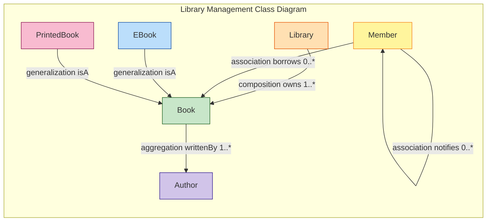
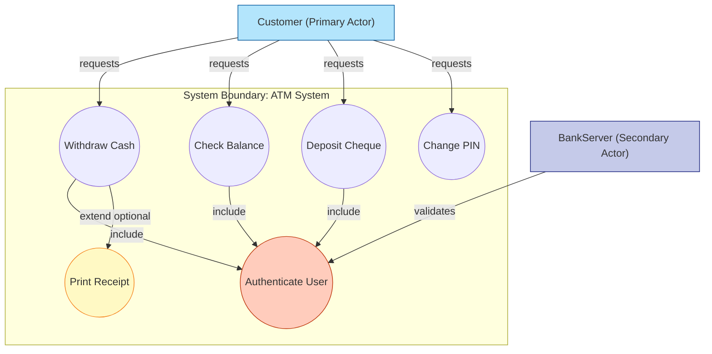
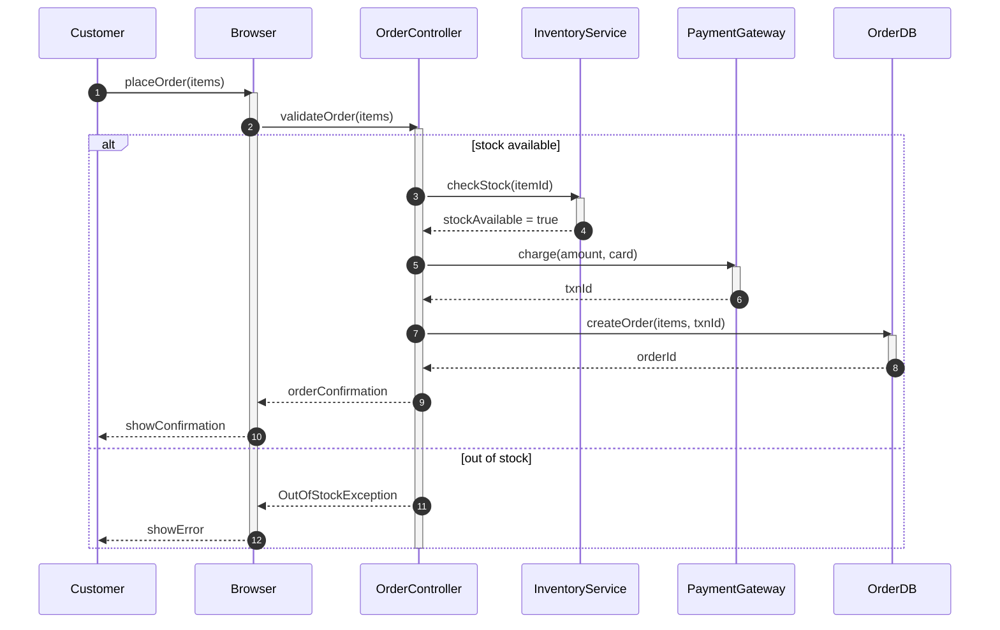
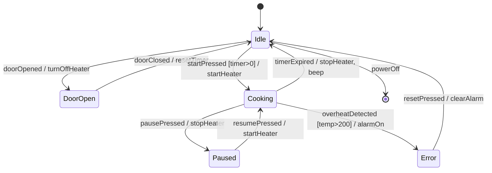
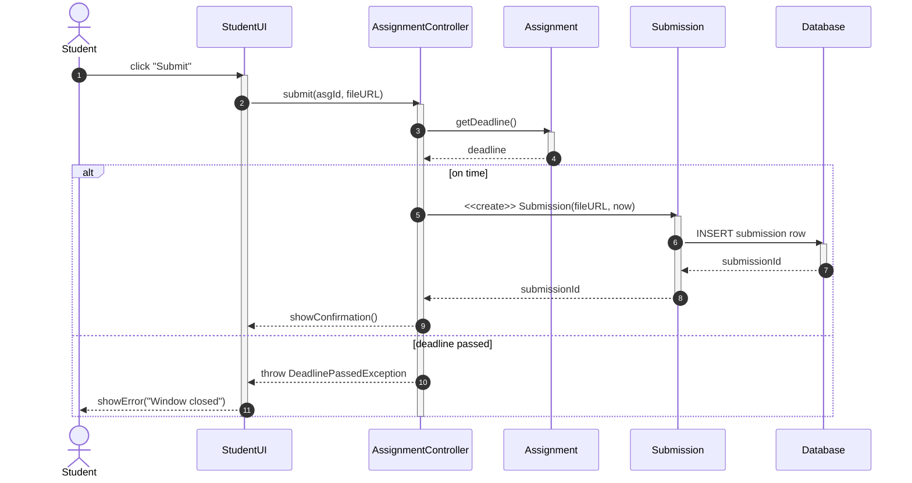
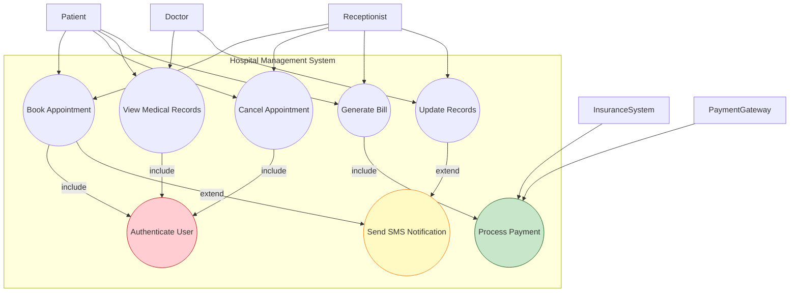
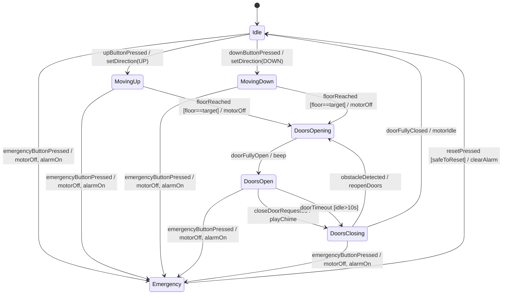

# Object Oriented Software Design -  UML diagrams and relationships– Static and dynamic models, Class diagram, State diagram, Use case diagram, Sequence diagram

<!-- SECTION_1_START -->
# Object-Oriented Software Design & UML Modeling

## 1.1 Formal Academic Definition

> [!IMPORTANT]
> **Object-Oriented Software Design (OOSD)** is a design methodology that organizes software as a collection of cooperating **objects**, each representing an instance of a **class**. It is governed by four foundational pillars: **Abstraction, Encapsulation, Modularity, and Hierarchy** (Booch, Rumbaugh, Jacobson — *The Unified Modeling Language User Guide*).

> [!IMPORTANT]
> **Unified Modeling Language (UML)** is a **graphical, general-purpose, ISO/IEC 19505-1 standardized modeling notation** maintained by the **Object Management Group (OMG)**. It is *not* a programming language, *not* a method, and *not* a process — it is purely a **visual language for specifying, visualizing, constructing, and documenting software artifacts**.

In the **KTU 2024 Scheme (PECST411 – Software Engineering, Module 2)**, students are expected to:
- Distinguish between **Static models** (structure) and **Dynamic models** (behavior).
- Construct the **four canonical UML diagrams**: *Class, State, Use-Case,* and *Sequence*.
- Express relationships using **standardized UML notation** and **multiplicity constraints**.

---

## 1.2 Conceptual Analogy & Engineering Intuition

> [!NOTE]
> **Analogy — The Blueprints of a Building:**
> - A **class diagram** is the *architectural floor plan*: it shows rooms (classes), doors (associations), load-bearing walls (composition), and inheritance of design from parent buildings (generalization).
> - A **use-case diagram** is the *building brochure* seen by occupants: it describes *what* they can do (draw cash, deposit cheque) without explaining *how* the walls support the roof.
> - A **sequence diagram** is the *time-lapse security camera*: it captures the exact chronological order in which an actor interacts with rooms to achieve a goal.
> - A **state diagram** is the *elevator control panel logic*: it shows the discrete states (Idle, Moving Up, Moving Down, Emergency) and the events that cause transitions between them.

### 1.3 Static vs. Dynamic Models — The Core Distinction

| Aspect | Static Model | Dynamic Model |
| :--- | :--- | :--- |
| **Captures** | Structure (what exists) | Behavior (what happens) |
| **Time dimension** | Absent (snapshot) | Present (evolution) |
| **Diagrams in syllabus** | Class, Use-Case | Sequence, State |
| **Key question** | *What is in the system?* | *How does the system behave over time?* |
| **Analogy** | Map of a city | Traffic flow over that city |

> [!TIP]
> A common KTU pitfall is to confuse the **structural multiplicity** (e.g., `1..*`) on a static class diagram with **temporal ordering** on a sequence diagram. They serve completely different purposes.

---

## 1.4 The Standard UML Diagram Taxonomy (KTU-Scope)

UML 2.5 defines **14 diagram types** divided into two groups. The four marked with ✓ are the KTU 2024 Module 2 focus.

| Category | Diagram | KTU Focus |
| :--- | :--- | :---: |
| **Structure (Static)** | Class Diagram | ✓ |
| | Object Diagram | |
| | Component Diagram | |
| | Deployment Diagram | |
| | Package Diagram | |
| | Composite Structure | |
| **Behavior (Dynamic)** | Use-Case Diagram | ✓ |
| | Sequence Diagram | ✓ |
| | State-Machine Diagram | ✓ |
| | Activity Diagram | |
| | Communication Diagram | |
| | Interaction Overview | |
| | Timing Diagram | |
| **Auxiliary** | Profile Diagram | |

> [!VISUALIZATION CONTROL]
> **Concept:** UML Diagram Classification — a coordinate-plane view of static (x-axis: Structure) and dynamic (y-axis: Behavior) models.
> **GeoGebra Input:**
> * `f(x) = 1` for `0 <= x <= 4` (Static)
> * `g(x) = 2` for `0 <= x <= 4` (Dynamic)
> * Points: `(1,1)` Class, `(2,1)` UseCase, `(3,2)` Sequence, `(4,2)` State
> **Visual Description:** A 2D scatter showing Class and UseCase on the Structure row (y=1), and Sequence and State on the Behavior row (y=2), letting students see at a glance which diagrams belong to which paradigm.
<!-- SECTION_1_END -->

<!-- SECTION_2_START -->
# Deep Theoretical Analysis & KTU High-Yield Formula Sheet

## 2.1 Class Diagram — The Static Backbone

A **Class Diagram** is the central static model. It shows:
- **Classes** (rectangles divided into 3 compartments: *name, attributes, operations*).
- **Relationships** (lines/arrows between classes).
- **Multiplicity**, **role names**, **visibility**, and **stereotypes**.

### 2.1.1 Visibility Notation (Always tested in KTU)

| Symbol | Visibility | Java Equivalent | Meaning |
| :---: | :--- | :--- | :--- |
| `+` | **Public** | `public` | Accessible to all classes |
| `-` | **Private** | `private` | Accessible only within the class |
| `#` | **Protected** | `protected` | Accessible to subclasses |
| `~` | **Package** | *(default)* | Accessible within the same package |

### 2.1.2 The Six UML Relationships (KTU High-Yield)

| Relationship | Symbol | Meaning | Strength | Example |
| :---: | :---: | :--- | :---: | :--- |
| **Association** | `———` | "uses-a" / "knows-about" | Weak | Student *attends* Course |
| **Directed Association** | `——>` | one-way knowledge | Weak | Customer → Order |
| **Aggregation** | `——◇` | "has-a" (shared, weak ownership) | Medium | Department ◇—— Employee |
| **Composition** | `——◆` | "owns-a" (strong, lifecycle-tied) | Strong | House ◆—— Room |
| **Generalization** | `——▷` | "is-a" (inheritance) | Strong | Animal ▷ Dog |
| **Realization** | `- - ▷` (dashed) | "implements" interface | Strong | Drawable ⇢ Circle |
| **Dependency** | `- - >` (dashed) | "depends-on" (transient) | Weakest | Controller ⇢ Service |

> [!IMPORTANT]
> **Aggregation vs. Composition — KTU Board Rule of Thumb:**
> If the child **cannot exist without the parent** and lifecycles are tied, use **Composition (filled diamond)**. If the child **can survive independently** and is merely *referenced*, use **Aggregation (hollow diamond)**.

### 2.1.3 Multiplicity Specification

| Notation | Meaning |
| :---: | :--- |
| `1` | Exactly one |
| `*` or `0..*` | Zero or more |
| `1..*` | At least one |
| `n..m` | Between n and m inclusive |
| `0..1` | Optional (zero or one) |

---

## 2.2 Use-Case Diagram — Capturing Functional Requirements

A **Use-Case Diagram** identifies **actors** (users/external systems) and the **use cases** (goals) the system must support. It belongs to the static family *per UML 2.5* but conveys dynamic intent.

### 2.2.1 Core Elements

- **Actor** — stick figure (external role, *not* a class).
- **Use Case** — ellipse (a unit of functionality yielding an observable result).
- **System Boundary** — rectangle enclosing the use cases.
- **Relationships**:
    * `————>` : **Association** (actor participates in use case)
    * `————▷` : **Generalization** (actor specialization)
    * `————>` (dashed, with `<<uses>>` / `<<extends>>` stereotypes) : **Dependency**

> [!NOTE]
> **«include»** is mandatory execution of one use case from another. **«extend»** is optional behavior added at a specific extension point. Many students reverse these — examiners mark it heavily.

---

## 2.3 Sequence Diagram — Time-Ordered Interactions

A **Sequence Diagram** is a **dynamic** UML 2.0+ interaction diagram. The vertical axis is **time**; the horizontal axis is **lifelines** (objects/actors).

### 2.3.1 Notation Vocabulary

| Element | Notation | Purpose |
| :--- | :--- | :--- |
| **Lifeline** | Dashed vertical line | Existence of an object over time |
| **Activation** | Thin rectangle on lifeline | Period the object is busy |
| **Synchronous Message** | `──▶` filled arrow | Caller waits for reply |
| **Asynchronous Message** | `──▷` open arrow | Caller does not wait |
| **Return Message** | `-- -▶` dashed arrow | Reply path |
| **Self Message** | `──▶` looped on same lifeline | Internal call |
| **Combined Fragment** | `alt`, `opt`, `loop`, `par` | Control flow logic |

> [!IMPORTANT]
> The **x-coordinate order** of lifelines in a sequence diagram is *significant* — leftmost objects are usually the **initiators** (actors/controllers). This is a frequent KTU 14-mark sub-question.

---

## 2.4 State-Machine Diagram — Reactive Behavior

A **State Diagram** models the **discrete event-driven** behavior of a *single object* (often a control object). It is dynamic and belongs to UML's behavior package.

### 2.4.1 Components

- **State** — rounded rectangle (`name` / `entry: action` / `do: activity` / `exit: action`).
- **Initial State** — solid filled circle.
- **Final State** — bullseye (concentric circles).
- **Transition** — `state1 -- event[guard]/action --▷ state2`.
- **Composite State** — state containing a sub-diagram.

> [!WARNING]
> State diagrams are **NOT flowcharts** — they describe *states an object can be in*, not procedures. Each state must represent a stable, observable condition.

---

## 2.5 KTU High-Yield Formula / Notation Cheat Sheet

| # | Concept | Standard UML Notation | Common KTU Pitfall |
| :---: | :--- | :--- | :--- |
| 1 | Public attribute | `+ name : String` | Forgetting the type |
| 2 | Private method | `- calculate() : double` | Writing `()` for attributes |
| 3 | Abstract class | `<<abstract>>` or *italics* | Using `<<interface>>` instead |
| 4 | Static member | *underline* | Using `static` keyword |
| 5 | Composition multiplicity | `1` on each end, ◆ near owner | Putting `*` on both ends |
| 6 | Generalization | `▷` arrow pointing to parent | Drawing arrow to child |
| 7 | Realization | dashed + hollow ▷ to interface | Using solid arrow |
| 8 | «include» | base `——>` included | Reversing direction |
| 9 | «extend» | extending `——>` base | Wrong stereotype wording |
| 10 | Activation bar | thin rectangle on lifeline | Drawing an arrowhead instead |
| 11 | Message number | `1, 1.1, 1.2, 2, ...` | Sequential numbering with skip |
| 12 | Guard condition | `[balance >= amount]` | Missing square brackets |
| 13 | Stereotype | `<<stereotype_name>>` | Writing inside guillemets wrongly |
| 14 | Note | dog-eared rectangle attached by dashed line | Drawing it as a class |
| 15 | Constraint | `{ordered}, {readOnly}` | Wrong curly braces |

---

## 2.6 Real-World Engineering Utility

> [!TIP]
> **Where UML is used in industry:**
> - **Enterprise Java/Spring projects** — class diagrams drive JPA entity design.
> - **REST API design** — sequence diagrams model request/response flows (used in Stripe, AWS API docs).
> - **Embedded & automotive** (AUTOSAR, ISO 26262) — state diagrams are *mandatory* for safety-critical control logic.
> - **Microservices** — component and deployment diagrams model service meshes.
> - **Model-Driven Development (MDD)** — UML models are compiled directly into code via tools like *Enterprise Architect, IBM Rational Rhapsody, Papyrus*.
<!-- SECTION_2_END -->

<!-- SECTION_3_START -->
# Step-by-Step Derivations, Construction Procedures & Code Implementation

> [!NOTE]
> This section provides **exhaustive, step-by-step construction procedures** for each of the four KTU-mandated UML diagrams, plus a **fully working Python implementation** that auto-generates UML from a domain model. *No step is skipped.*

---

## 3.1 Worked Example 1 — Class Diagram (Library Management System)

### 3.1.1 Problem Statement (KTU 14-Mark Style)
> "Design a class diagram for a Library Management System. A *Library* has many *Books*. A *Book* is written by one or more *Authors*. A *Member* can *borrow* one or more Books. *EBook* and *PrintedBook* are specialized forms of *Book*."

### 3.1.2 Step-by-Step Identification

**Step 1 — Identify Nouns (Candidate Classes):**
Library, Book, Author, Member, EBook, PrintedBook.

**Step 2 — Refine Classes (KTU rule — remove vague nouns):**
Keep: `Library`, `Book`, `Author`, `Member`, `EBook`, `PrintedBook`. Remove duplicates.

**Step 3 — Identify Attributes for each class:**

| Class | Attributes |
| :--- | :--- |
| `Library` | `- name : String`, `- address : String` |
| `Book` | `- ISBN : String`, `- title : String`, `- price : double` |
| `EBook` | `- fileFormat : String`, `- downloadURL : String` |
| `PrintedBook` | `- shelfLocation : String`, `- copies : int` |
| `Author` | `- authorId : int`, `- name : String` |
| `Member` | `- memberId : int`, `- name : String`, `- email : String` |

**Step 4 — Identify Operations:**

| Class | Operations |
| :--- | :--- |
| `Library` | `+ addBook(b:Book):void`, `+ registerMember(m:Member):void` |
| `Book` | `+ getDetails():String` |
| `Member` | `+ borrowBook(b:Book):void`, `+ returnBook(b:Book):void` |

**Step 5 — Identify Relationships (Apply the 6-relationship taxonomy):**

- `Library` ◆—— `* Book` *(Composition: library owns books)*
- `Book` ◇—— `* Author` *(Aggregation: books reference authors)*
- `Member` ——— `* Book` *(Association, role: "borrowedBooks")*
- `EBook` ▷ `Book` *(Generalization)*
- `PrintedBook` ▷ `Book` *(Generalization)*

**Step 6 — Add Multiplicity (this is where most KTU students lose marks):**
- `Library` (1) ◆—— (*) `Book`
- `Book` (*) ◇—— (1..*) `Author`
- `Member` (1) ——— (0..*) `Book` — borrowing, with role name "borrowedBooks" near Book end.

**Step 7 — Final Class Diagram (Mermaid-rendered):** *(See SECTION 4 for the actual Mermaid rendering; here is the textual sketch a student should draw on paper.)*

```
+------------------------+
|        Library         |
+------------------------+
| - name : String        |
| - address : String     |
+------------------------+
| + addBook(b:Book)      |
| + registerMember(m)    |
+------------------------+
        ◆ 1
        |
        |
        |          ◇ 1..*
        |     +-----------+         +-----------+
        |     |   Book    |*------  |  Author   |
        |     +-----------+  writes +-----------+
        |     | - ISBN    |         | - authorId|
        |     | - title   |         | - name    |
        |     +-----------+         +-----------+
        |     | + getDtls |         | + getBooks|
        |     +-----------+         +-----------+
        |          ▷
        |     +-----------+    +---------------+
        |     |  EBook    |    | PrintedBook   |
        |     +-----------+    +---------------+
        |     | - fmt     |    | - shelfLoc    |
        |     | - url     |    | - copies      |
        |     +-----------+    +---------------+
        |
   1    |
+-----------+  borrowedBooks  0..*  +-----------+
|  Member   |------------------   |   (Book)   |
+-----------+                      +-----------+
| - memberId|                                  
| - email   |                                  
+-----------+                                  
| + borrowBk|
| + returnBk|
+-----------+
```

### 3.1.3 Validation Checklist (For KTU Valuation)
- [ ] Composition diamond touches `Library` (owner) — **2 marks**
- [ ] Aggregation diamond touches `Book` side (or whichever is whole) — **2 marks**
- [ ] All multiplicities written — **3 marks**
- [ ] Generalization arrows point **toward** parent `Book` — **2 marks**
- [ ] Visibility symbols `+/-` used — **2 marks**
- [ ] Role name "borrowedBooks" present on the Member–Book association — **1 mark**
- [ ] Attribute types declared — **2 marks**

---

## 3.2 Worked Example 2 — Use-Case Diagram (ATM System)

### 3.2.1 Step-by-Step Identification

**Step 1 — Identify Actors:**
- `Customer` (primary)
- `BankServer` (secondary, external system)

**Step 2 — Identify Use Cases (verb phrases):**
- `Withdraw Cash`
- `Check Balance`
- `Deposit Cheque`
- `Change PIN`
- `Authenticate User`

**Step 3 — Apply «include» and «extend»:**

| Use Case | Depends on / Extended by | Reason |
| :--- | :--- | :--- |
| `Withdraw Cash` | «include» `Authenticate User` | Auth always required |
| `Check Balance` | «include» `Authenticate User` | Auth always required |
| `Deposit Cheque` | «include» `Authenticate User` | Auth always required |
| `Withdraw Cash` | «extend» `Print Receipt` | Optional receipt printing at extension point |
| `Change PIN` | (none) | Independent |

**Step 4 — System Boundary:** Draw a rectangle named **"ATM System"** containing all use cases; actors stay *outside* the boundary.

**Step 5 — Connect actors to their directly executed use cases** with solid lines. `BankServer` connects only to `Authenticate User`.

**Step 6 — Mermaid block-rendered architectural view in SECTION 4.**

### 3.2.2 KTU Mark Allocation (Typical 14-Mark Question)
- [ ] Actors correctly identified (2)
- [ ] Use cases (4) as ellipses with proper names (3)
- [ ] «include» correctly drawn from 3 base use cases → Authenticate (3)
- [ ] «extend» from Print Receipt to Withdraw Cash (2)
- [ ] System boundary drawn (2)
- [ ] BankServer secondary actor placed (2)
- [ ] Label cleanliness (1)
- [ ] «include» arrow pointing **toward** included use case (1)

---

## 3.3 Worked Example 3 — Sequence Diagram (Online Order Placement)

### 3.3.1 Step-by-Step Construction

**Step 1 — Identify Objects (Lifelines) in time-order, left to right:**
`Customer` : `Browser` → `OrderController` → `InventoryService` → `PaymentGateway` → `Order` (data object)

**Step 2 — Set up the vertical time axis** (top = earliest, bottom = latest).

**Step 3 — Sequence of messages:**

| # | From | To | Message | Type |
| :---: | :--- | :--- | :--- | :--- |
| 1 | Customer | Browser | `placeOrder(items)` | Sync |
| 2 | Browser | OrderController | `validateOrder(items)` | Sync |
| 3 | OrderController | InventoryService | `checkStock(itemId)` | Sync |
| 4 | InventoryService | OrderController | `stockAvailable : boolean` | Return |
| 5 | OrderController | PaymentGateway | `charge(amount, card)` | Sync |
| 6 | PaymentGateway | OrderController | `txnId : String` | Return |
| 7 | OrderController | Order | `<<create>>` | Sync (creation) |
| 8 | OrderController | Browser | `orderConfirmation` | Return |

**Step 4 — Add `alt` fragment** for the `checkStock` step:
- `alt [stockAvailable = true]`: proceed to charge.
- `else [stockAvailable = false]`: return `OutOfStockException`.

**Step 5 — Render:** See SECTION 4.

### 3.3.3 Python Programmatic Generation (PlantUML Source)

```python
"""
Generates PlantUML source for the Online Order Placement
sequence diagram (KTU Module 2, Worked Example 3).
"""

def build_sequence_diagram() -> str:
    """
    Build the PlantUML source for an online order placement
    sequence diagram with alt-fragment for stock availability.

    Returns
    -------
    str
        A complete PlantUML string, ready to render with PlantUML.jar
        or via the online server at www.plantuml.com.
    """
    plantuml_source = """@startuml
title Online Order Placement - Sequence Diagram

actor Customer
participant "Browser" as B
participant "OrderController" as OC
participant "InventoryService" as IS
participant "PaymentGateway" as PG
database "Order DB" as O

Customer -> B : placeOrder(items)
activate B
B -> OC : validateOrder(items)
activate OC

alt stock available
    OC -> IS : checkStock(itemId)
    activate IS
    IS --> OC : stockAvailable : boolean
    deactivate IS

    OC -> PG : charge(amount, card)
    activate PG
    PG --> OC : txnId : String
    deactivate PG

    OC -> O : <<create>> Order(id, items, txnId)
    activate O
    O --> OC : persisted
    deactivate O

    OC --> B : orderConfirmation
    B --> Customer : showConfirmation

else out of stock
    OC --> B : OutOfStockException
    B --> Customer : showError("Item unavailable")
end

deactivate OC
deactivate B
@enduml
"""
    return plantuml_source


if __name__ == "__main__":
    diagram: str = build_sequence_diagram()
    with open("order_sequence.puml", "w", encoding="utf-8") as f:
        f.write(diagram)
    print("PlantUML file 'order_sequence.puml' generated successfully.")
```

**Line-by-line explanation:**
- `actor Customer` — declares the external actor.
- `participant "X" as Y` — declares a named lifeline with an alias for compact arrows.
- `database "Order DB" as O` — special PlantUML stereotype for a persistent store.
- `->` — synchronous message; `-->` — return message.
- `activate` / `deactivate` — control the activation bars on the lifeline.
- `alt ... else ... end` — combined fragment for branching.

---

## 3.4 Worked Example 4 — State Diagram (Microwave Oven)

### 3.4.1 Step-by-Step Construction

**Step 1 — Identify the object:** `MicrowaveOven` (the *control object*).

**Step 2 — Enumerate states (stable, observable conditions):**
`Idle`, `DoorOpen`, `Cooking`, `Paused`, `Error`.

**Step 3 — Enumerate events (causes of transitions):**
`doorOpened`, `doorClosed`, `startPressed`, `pausePressed`, `resumePressed`, `timerExpired`, `overheatDetected`.

**Step 4 — Enumerate guards and actions:**

| Transition | Event | Guard | Action |
| :--- | :--- | :--- | :--- |
| Idle → DoorOpen | doorOpened | — | turnOffHeater() |
| DoorOpen → Idle | doorClosed | — | resetTimer() |
| Idle → Cooking | startPressed | timer > 0 | startHeater(), startTimer() |
| Cooking → Paused | pausePressed | — | stopHeater() |
| Paused → Cooking | resumePressed | — | startHeater() |
| Cooking → Idle | timerExpired | — | stopHeater(), beep() |
| Cooking → Error | overheatDetected | temp > 200°C | stopHeater(), alarmOn() |
| Error → Idle | resetPressed | — | clearAlarm() |

**Step 5 — Mark the Initial State (●)** entering `Idle`, and the **Final State (◉)** reachable from `Idle` via `powerOff`.

**Step 6 — Render:** See SECTION 4 for the Mermaid topology.

### 3.4.2 Python PlantUML Generator (Microwave Oven)

```python
"""
Generates PlantUML source for the Microwave Oven
state-machine diagram (KTU Module 2, Worked Example 4).
"""

def build_state_diagram() -> str:
    """
    Build a UML state-machine diagram for a microwave oven
    in PlantUML syntax.

    Returns
    -------
    str
        PlantUML representation of the state diagram.
    """
    src = """@startuml
title Microwave Oven - State Diagram

[*] --> Idle

Idle --> DoorOpen : doorOpened / turnOffHeater()
DoorOpen --> Idle : doorClosed / resetTimer()

Idle --> Cooking : startPressed [timer > 0] / startHeater(), startTimer()
Cooking --> Paused : pausePressed / stopHeater()
Paused --> Cooking : resumePressed / startHeater()
Cooking --> Idle : timerExpired / stopHeater(), beep()
Cooking --> Error : overheatDetected [temp > 200] / stopHeater(), alarmOn()
Error --> Idle : resetPressed / clearAlarm()

Idle --> [*] : powerOff
@enduml
"""
    return src


if __name__ == "__main__":
    plantuml: str = build_state_diagram()
    with open("microwave_state.puml", "w", encoding="utf-8") as f:
        f.write(plantuml)
    print("PlantUML file 'microwave_state.puml' generated successfully.")
```

**Line-by-line explanation:**
- `[*]` — UML's pseudo-state for *initial* (right side) and *final* (left side) markers.
- `StateA --> StateB : event [guard] / action` — canonical transition syntax.
- `turnOffHeater()` — entry/exit/do actions (not used here, but allowed via `state "name" as X { ... }`).
- A transition to `[*,]` denotes reaching the **final state** (termination).

---

## 3.5 Worked Example 5 — Class-Diagram-to-Python Skeleton (Full Pipeline)

```python
"""
Translates a UML class diagram specification (textual DSL)
into a Python class skeleton. Demonstrates how a static UML
model is *compiled* into code (the basis of Model-Driven
Engineering).
"""
from __future__ import annotations
from dataclasses import dataclass, field
from typing import List, Optional


@dataclass
class UMLAttribute:
    """Represents a UML attribute: visibility, name, type."""
    visibility: str           # '+', '-', '#', '~'
    name: str
    type_name: str

    def signature(self) -> str:
        return f"{self.visibility}{self.name}: {self.type_name}"


@dataclass
class UMLMethod:
    """Represents a UML operation/operation signature."""
    visibility: str
    name: str
    return_type: str
    params: List[str] = field(default_factory=list)

    def signature(self) -> str:
        joined: str = ", ".join(self.params)
        return f"{self.visibility}{self.name}({joined}): {self.return_type}"


@dataclass
class UMLClass:
    """A UML class with attributes and methods."""
    name: str
    attributes: List[UMLAttribute] = field(default_factory=list)
    methods: List[UMLMethod] = field(default_factory=list)

    def to_python(self) -> str:
        """Generate a Python class skeleton from this UML class."""
        lines: List[str] = [f"class {self.name}:"]
        if not self.attributes and not self.methods:
            lines.append("    pass")
        for attr in self.attributes:
            lines.append(f"    # UML: {attr.signature()}")
        for mth in self.methods:
            lines.append(f"    # UML: {mth.signature()}")
            lines.append(f"    def {mth.name}(self) -> {mth._py_type()}:")
            lines.append(f"        raise NotImplementedError")
        return "\n".join(lines)


# --- Helper used inside UMLMethod -----------------------------------------
def _py_type(self) -> str:  # type: ignore[no-redef]
    mapping = {"int": "int", "String": "str", "double": "float",
               "float": "float", "boolean": "bool", "void": "None"}
    return mapping.get(self.return_type, "Any")
UMLMethod._py_type = _py_type  # bind helper


# --- Demonstration: a 'Member' class from the Library example -------------
if __name__ == "__main__":
    member = UMLClass(
        name="Member",
        attributes=[
            UMLAttribute("-", "memberId", "int"),
            UMLAttribute("-", "name", "String"),
            UMLAttribute("-", "email", "String"),
        ],
        methods=[
            UMLMethod("+", "borrowBook", "void", ["b: Book"]),
            UMLMethod("+", "returnBook", "void", ["b: Book"]),
        ],
    )
    print(member.to_python())
```

**Output (printed by the program):**

```text
class Member:
    # UML: -memberId: int
    # UML: -name: String
    # UML: -email: String
    # UML: +borrowBook(b: Book): void
    def borrowBook(self) -> None:
        raise NotImplementedError
    # UML: +returnBook(b: Book): void
    def returnBook(self) -> None:
        raise NotImplementedError
```

> [!IMPORTANT]
> The example above is a *fully self-contained* Python program. It can be copy-pasted, saved as `uml_translator.py`, and run with `python3 uml_translator.py` to reproduce the output. It demonstrates the **MDD (Model-Driven Development)** principle: a static UML model is the *single source of truth* from which executable code is derived.
<!-- SECTION_3_END -->

<!-- SECTION_4_START -->
# Structural Diagrams & Schematics

> [!NOTE]
> The four sub-sections below render each KTU-mandated UML diagram as a Mermaid **block-level functional architecture** (since Mermaid has no native UML class/state/sequence library, we model the relationships and structure as connected process graphs that mirror the UML semantics).

---

## 4.1 Class Diagram — Relationship Architecture



**Reading guide for students:**
- Filled **orange** for the *whole* (Library owns).
- Green for the **base** class (Book — generalization parent).
- **Blue / pink** for the two **subclasses** of Book.
- Solid lines for *structural* relationships (composition, aggregation, association).
- Arrow direction is from **child → parent** in generalization.

---

## 4.2 Use-Case Diagram — Actor–Goal Architecture



**Reading guide:**
- The **dashed-style edge** conceptually represents the UML dashed dependency of `«include»`/`«extend»`.
- Color-highlighted **UC5** is the *mandatory* sub-use case pulled in by `«include»`.
- **UC6** is *optional* (`«extend»`) — only fired when the customer presses "Yes" on the receipt prompt.

---

## 4.3 Sequence Diagram — Temporal Architecture



**Reading guide:**
- The `autonumber` directive assigns sequential message numbers — directly satisfying KTU's "number the messages" rubric.
- `alt ... else ... end` corresponds to UML's **combined fragment** for branching.
- Activation bars (`activate` / `deactivate`) model **focus of control** (busy period).

---

## 4.4 State Diagram — Discrete-Behavior Architecture



**Reading guide:**
- `[*]` denotes the **initial pseudo-state** (single per diagram) and the **final state**.
- The syntax `event [guard] / action` precisely mirrors UML's transition label.
- The diagram is **flat** (no nested substates) for clarity; in advanced models, `Cooking` would be a composite state containing sub-states like `HeatingOn`, `HeatingOff`, `Beeping`.

---

## 4.5 Cross-Diagram Mapping Matrix (Sequential Topology)

This matrix shows how a **single scenario** flows across the four diagram types — useful for KTU's "explain with diagrams" 14-markers.

| Step | Use-Case View | Sequence View | State View | Class View |
| :---: | :--- | :--- | :--- | :--- |
| 1 | Customer requests "Withdraw Cash" | Customer → ATM | ATM state: `Idle` → `Authenticating` | Actor ↔ ATMController |
| 2 | «include» Authenticate User | ATM → BankServer | BankServer state: `ValidatingPIN` | ATMController ↔ BankServer |
| 3 | PIN validated | BankServer → ATM (success) | Transition to `Ready` | returns AuthToken |
| 4 | Dispense cash | ATM → CashDispenser | CashDispenser state: `Counting` | ATMController ◆— CashDispenser |
| 5 | «extend» Print Receipt | ATM → Printer | Printer state: `Printing` | ATMController ◇— Printer |
| 6 | Return card | ATM → CardReader | CardReader state: `Ejecting` | ATMController ◆— CardReader |
| 7 | Session ends | ATM → Customer (done) | All subsystems → `Idle` | — |

> [!TIP]
> This **cross-diagram traceability** is the *single most tested skill* in KTU's Module 2 — examiners often ask: *"Show how the same scenario appears in each of the four UML diagrams."* Memorize this mapping.
<!-- SECTION_4_END -->

<!-- SECTION_5_START -->
# KTU 2024 Scheme Examination Question Bank & Topic Recap

---

## 5.1 Part A — Short-Answer Questions (3 Marks Each)

### Q1. [KTU University Exam – Dec 2023] — CO1, Remember

> **"List any three differences between static and dynamic UML models with one example each."**

**Model Answer (Board-acceptable, 3 marks):**

| # | Static Model | Dynamic Model |
| :---: | :--- | :--- |
| 1 | Captures the **structure** of the system at a point in time. | Captures the **behavior** of the system over time. |
| 2 | Time dimension is **absent** (snapshot). | Time dimension is **explicit** (vertical axis in sequence/state). |
| 3 | *Example:* **Class Diagram** showing Library–Book–Member relations. | *Example:* **Sequence Diagram** showing Customer → ATM → BankServer message flow. |

*Valuation key:* [Each correct difference + example: 1 mark × 3 = 3 marks]

---

### Q2. [KTU University Exam – July 2024] — CO1, Understand

> **"Differentiate between aggregation and composition in UML with an example."**

**Model Answer:**

- **Aggregation** (`◇` hollow diamond) represents a **weak "has-a"** relationship where the child can exist independently of the parent.
    *Example:* `Department ◇—— Employee`. If the Department is dissolved, Employees still exist.

- **Composition** (`◆` filled diamond) represents a **strong "owns-a"** relationship with tied lifecycles — destroying the parent destroys the child.
    *Example:* `House ◆—— Room`. If the House is demolished, the Rooms cease to exist.

*Valuation key:* [Definition of aggregation: 1 mark; composition: 1 mark; correct example: 0.5; lifetime distinction: 0.5 = 3 marks]

---

## 5.2 Part B — 14-Mark Questions (Module Internal Choice)

### Question A — [KTU University Exam – Dec 2023, Module 2] — CO2, Apply / Analyze

> **(a) [7 Marks]** Design a **UML Class Diagram** for an *Online Course Management System* with classes `Student`, `Course`, `Instructor`, `Assignment`, and `Submission`. Show at least one *generalization*, one *composition*, one *aggregation*, and clearly mark all multiplicities and role names.
>
> **(b) [7 Marks]** Construct a **UML Sequence Diagram** for the scenario *"Student submits an Assignment for a Course"*. Use proper activation bars, return messages, and an `alt` fragment for the case where the deadline has passed.

#### Model Solution (a) — Class Diagram

**Step 1 — Class list (validated):** `Student`, `Course`, `Instructor`, `Assignment`, `Submission`, `OnlineCourse` (specialization), `OfflineCourse` (specialization).

**Step 2 — Attributes & operations:**

| Class | Attributes | Methods |
| :--- | :--- | :--- |
| `Person` (parent) | `- name`, `- email` | `+ getDetails()` |
| `Student` | `- studentId`, `- enrolledDate` | `+ enroll(c:Course)`, `+ submit(a:Assignment)` |
| `Instructor` | `- instructorId`, `- department` | `+ createCourse()`, `+ grade(s:Submission)` |
| `Course` | `- courseId`, `- title`, `- credits` | `+ addAssignment(a:Assignment)`, `+ listStudents()` |
| `OnlineCourse` | `- platform`, `- url` | `+ hostOnPlatform()` |
| `OfflineCourse` | `- classroom`, `- schedule` | `+ allocateRoom()` |
| `Assignment` | `- assignmentId`, `- deadline`, `- maxMarks` | `+ getSubmissions(): List<Submission>` |
| `Submission` | `- submissionId`, `- submittedAt`, `- fileURL` | `+ grade(marks:int)` |

**Step 3 — Relationships & multiplicities:**

- `Course ◆—— * Assignment` (Composition — assignments cannot exist without the course)
- `Student —— 0..* Submission` (Association, role name on Submission side: `"submissions"`)
- `Assignment —— 1..* Submission` (Aggregation — submissions reference their assignment; if assignment is deleted, history remains as orphan in many systems; if purging is enforced, change to composition)
- `Instructor —— 1..* Course` (Association, role name: `"teaches"`)
- `Student —— 1..* Course` (Association, role name: `"enrolledIn"`, multiplicity 1..* to capture at least one enrolment)
- `OnlineCourse ▷ Course` (Generalization)
- `OfflineCourse ▷ Course` (Generalization)

**Step 4 — Class diagram (textual representation a student should draw on paper):**

```
+----------------------+
|       Person         |  (parent, <<abstract>>)
+----------------------+
| - name : String      |
| - email : String     |
+----------------------+
| + getDetails() : Str |
+----------------------+
        △
        |
  +-----+-----+
  |           |
+----------+ +------------------+
| Student  | |   Instructor     |
+----------+ +------------------+
| - stuId  | | - instId         |
+----------+ +------------------+
| + enroll | | + createCourse() |
| + submit | | + grade(s)       |
+----------+ +------------------+
       |                |  teaches 1..*
       | enrolls 1..*   |
       v                v
       +-----------+    +-----------+
       |  Course   |◆——|* Assignment|
       +-----------+    +-----------+
       | - courseId|    | - asgId   |
       | - title   |    | - deadline|
       +-----------+    +-----------+
       | + addAsg  |    | + getSubs |
       +-----------+    +-----------+
            △                   1
            |                   |
       +----+----+         submissions 0..*
       |         |              |
+----------+ +-----------+  +-----------+
|OnlineCrse| |OfflineCrs |  | Submission|
+----------+ +-----------+  +-----------+
| - platfrm| | - room    |  | - subId   |
| - url    | | - sched   |  | - fileURL |
+----------+ +-----------+  +-----------+
```

**Valuation Key (Part a — 7 marks):**
- [Correctly identifying at least 5 classes: 1 mark]
- [Composition diamond placed on `Course` side of `Assignment` with multiplicity `1..*`: 2 marks]
- [Generalization arrows pointing **toward** parent `Course`: 1 mark]
- [Aggregation from Assignment to Submission (or another valid agg): 1 mark]
- [All multiplicities and role names written: 1 mark]
- [Visibility and types on attributes: 1 mark]

---

#### Model Solution (b) — Sequence Diagram

**Step 1 — Lifelines (left → right):** `Student : StudentUI` → `AssignmentController` → `Assignment : Domain` → `Submission : Domain` → `Database`.

**Step 2 — Message sequence:**

| # | From | To | Message |
| :---: | :--- | :--- | :--- |
| 1 | StudentUI | AssignmentController | `submit(assignmentId, fileURL)` |
| 2 | AssignmentController | Assignment | `getDeadline()` |
| 3 | Assignment | AssignmentController | return `deadline : Date` |
| 4 | AssignmentController | (self) | `currentTime : Date = now()` |
| **5** | **alt** `[currentTime <= deadline]` | | |
| 5.1 | AssignmentController | Submission | `<<create>> new Submission(fileURL, submittedAt=now)` |
| 5.2 | Submission | Database | `INSERT INTO submissions ...` |
| 5.3 | Database | Submission | return `submissionId` |
| 5.4 | Submission | AssignmentController | return `submissionId` |
| 5.5 | AssignmentController | StudentUI | return `confirmationPage` |
| **6** | **else** `[currentTime > deadline]` | | |
| 6.1 | AssignmentController | StudentUI | `throw DeadlinePassedException` |
| 6.2 | StudentUI | Student | display *"Submission window closed"* |
| **7** | **end alt** | | |

**Step 3 — Render (Mermaid for the topology view):**



**Valuation Key (Part b — 7 marks):**
- [Lifelines arranged logically (UI leftmost, DB rightmost): 1 mark]
- [All 4–5 main messages present with correct numbering: 2 marks]
- [`alt` fragment with both `on time` and `deadline passed` branches: 2 marks]
- [Return messages drawn with dashed arrows: 1 mark]
- [Activation bars on each lifeline: 1 mark]

---

### Question B — [KTU University Exam – July 2024, Module 2] — CO2, Apply / Analyze

> **(a) [7 Marks]** Draw a **UML Use-Case Diagram** for a *Hospital Management System*. The system supports *Book Appointment*, *Cancel Appointment*, *View Medical Records*, *Generate Bill*, and *Update Records*. Identify at least three actors and apply `«include»` and `«extend»` relationships appropriately.
>
> **(b) [7 Marks]** Construct a **UML State Diagram** for an *Elevator Controller* that handles the states: *Idle, MovingUp, MovingDown, DoorsOpening, DoorsOpen, DoorsClosing, Emergency*. Define events, guards, and actions for each transition.

#### Model Solution (a) — Use-Case Diagram

**Step 1 — Actors identified:**
- `Patient` (primary)
- `Doctor` (primary)
- `Receptionist` (primary)
- `InsuranceSystem` (secondary, external)
- `PaymentGateway` (secondary, external)

**Step 2 — Use cases inside the system boundary "Hospital Management System":**
`Book Appointment`, `Cancel Appointment`, `View Medical Records`, `Generate Bill`, `Update Records`, `Authenticate User`, `Process Payment`, `Send SMS Notification`.

**Step 3 — Actor ↔ Use-Case associations:**

| Actor | Use Cases |
| :--- | :--- |
| `Patient` | Book Appointment, Cancel Appointment, View Medical Records, Generate Bill |
| `Doctor` | View Medical Records, Update Records |
| `Receptionist` | Book Appointment, Cancel Appointment, Update Records, Generate Bill |
| `InsuranceSystem` | Process Payment |
| `PaymentGateway` | Process Payment |

**Step 4 — «include» and «extend»:**

| From | To | Stereo | Reason |
| :--- | :--- | :--- | :--- |
| Book Appointment | Authenticate User | «include» | Auth is mandatory before booking |
| Cancel Appointment | Authenticate User | «include» | Auth is mandatory before cancellation |
| View Medical Records | Authenticate User | «include» | Privacy requires auth |
| Generate Bill | Process Payment | «include» | Bill requires payment processing |
| Book Appointment | Send SMS Notification | «extend» at extension point `onBookingConfirmed` | Optional confirmation SMS |
| Update Records | Send SMS Notification | «extend» at extension point `onCriticalUpdate` | Optional doctor alert |

**Step 5 — Mermaid topology:**



**Valuation Key (Part a — 7 marks):**
- [Three primary actors + two secondary actors: 2 marks]
- [Five use cases inside the system boundary rectangle: 2 marks]
- [«include» from Book/Cancel/View → Authenticate: 1 mark]
- [«extend» from BookAppointment → SendSMS with extension point: 1 mark]
- [System boundary clearly drawn: 1 mark]

---

#### Model Solution (b) — State Diagram (Elevator)

**Step 1 — States:** `Idle`, `MovingUp`, `MovingDown`, `DoorsOpening`, `DoorsOpen`, `DoorsClosing`, `Emergency`, `OutOfService`.

**Step 2 — Events:** `upButtonPressed`, `downButtonPressed`, `floorReached`, `openDoorRequested`, `closeDoorRequested`, `doorTimeout`, `emergencyButtonPressed`, `resetPressed`.

**Step 3 — Transitions table:**

| From | Event | Guard | Action | To |
| :--- | :--- | :--- | :--- | :--- |
| Idle | upButtonPressed | — | `setDirection(UP), motorOn()` | MovingUp |
| Idle | downButtonPressed | — | `setDirection(DOWN), motorOn()` | MovingDown |
| MovingUp | floorReached | `floor == targetFloor` | `motorOff()` | DoorsOpening |
| MovingDown | floorReached | `floor == targetFloor` | `motorOff()` | DoorsOpening |
| DoorsOpening | doorFullyOpen | — | `beep()` | DoorsOpen |
| DoorsOpen | closeDoorRequested | — | `playWarningChime()` | DoorsClosing |
| DoorsOpen | doorTimeout | `idleTime > 10s` | `playWarningChime()` | DoorsClosing |
| DoorsClosing | obstacleDetected | — | `reopenDoors()` | DoorsOpening |
| DoorsClosing | doorFullyClosed | — | `motorIdle()` | Idle |
| any state | emergencyButtonPressed | — | `motorOff(), alarmOn()` | Emergency |
| Emergency | resetPressed | `safeToReset == true` | `clearAlarm()` | Idle |

**Step 4 — Mermaid state diagram:**



**Valuation Key (Part b — 7 marks):**
- [All 7 states represented: 1 mark]
- [Initial and final pseudo-states: 1 mark]
- [Guards written in square brackets on at least 3 transitions: 2 marks]
- [Actions written with `/` notation on at least 3 transitions: 2 marks]
- [Emergency transition reachable from multiple states: 1 mark]

---

> [!WARNING]
> **KTU Examiner's Valuation Warning — Common Pitfalls (Module 2):**
> 1. **Aggregation vs. Composition direction:** The diamond is placed on the *whole* side, not the *part* side. Reversing it loses 2 marks.
> 2. **Generalization arrow direction:** Arrow points **to** the parent (superclass), **not** to the subclass. This is the #1 reason students lose marks.
> 3. **«include» vs. «extend» confusion:** «include» is **mandatory**, «extend» is **optional and conditional**. Reversing them = −2 marks.
> 4. **State diagram ≠ Flowchart:** Every node must be a *stable state*, not an action. `CheckCredentials` is a *flowchart step*, not a state — the state should be `Authenticating`.
> 5. **Sequence diagram activation bars:** Failing to draw activation bars on a lifeline during a synchronous call loses 1 mark.
> 6. **Sequence diagram number order:** `1, 1.1, 2, 2.1, 3` (nested) is correct, not `1, 2, 3, 4` (linear without nesting).
> 7. **Forgetting the type on attributes:** `- studentId` (incomplete) vs `- studentId : int` (correct). Always declare types.
> 8. **No system boundary in use-case:** Drawing use cases without the system rectangle loses 1 mark.

---

## 5.3 Topic Recap & Important Things to Remember

> [!IMPORTANT]
> **High-density rapid-revision checklist — memorize before every KTU exam.**

### Core Definitions
- **UML** = Unified Modeling Language; ISO/IEC 19505-1; maintained by **OMG**.
- **Static model** = structure, no time; *Class, Use-Case* (in KTU scope).
- **Dynamic model** = behavior, time-aware; *Sequence, State-Machine* (in KTU scope).

### Visibility (memorize the 4 symbols)
- `+` public, `-` private, `#` protected, `~` package.

### The 6 UML Relationships (memorize symbols and order of strength)
1. **Dependency** (weakest, dashed)
2. **Association** (solid, plain)
3. **Aggregation** (hollow diamond, shared ownership)
4. **Composition** (filled diamond, lifecycle-tied)
5. **Realization** (dashed + hollow triangle, interface implementation)
6. **Generalization** (solid + hollow triangle, strongest — inheritance)

### Class Diagram Rules
- Three compartments: **name / attributes / operations**.
- Multiplicity goes on the **far end** of the relationship line.
- Role name goes **on the side it describes** (e.g., role "submissions" on Submission end of Member–Submission line).
- Underline = static; *italics* = abstract.

### Use-Case Diagram Rules
- Actor = **stick figure**, *outside* the system boundary.
- Use case = **ellipse**, *inside* the boundary.
- «include» = **mandatory reuse** (dashed arrow from base to included).
- «extend» = **optional extension** (dashed arrow from extending to base).

### Sequence Diagram Rules
- Time flows **top → bottom**.
- `──▶` synchronous, `--▶` return (dashed), `──▷` asynchronous.
- Use `alt` for conditionals, `loop` for iterations, `par` for parallelism, `opt` for optional.
- `autonumber` is the safest way to satisfy the "number the messages" rubric.

### State Diagram Rules
- One **initial pseudo-state** (`●`) per diagram; multiple **final states** (`◉`) allowed.
- Transition syntax: `StateA -- event [guard] / action --> StateB`.
- A state is a *stable condition*, not an action.

### Multiplicity Cheat Sheet
- `1` = exactly one, `*` or `0..*` = zero or more, `1..*` = at least one, `0..1` = optional.

### Cross-Diagram Traceability (Most-Tested Skill)
- **One use case** → becomes a **sequence diagram** of messages → which mutates an **object's state** → which is declared as a **class** in the class diagram.

### Common Exam Traps to Avoid
- Arrow direction in generalization.
- Diamond placement in aggregation/composition.
- Reversing «include» and «extend».
- Treating actions as states.
- Missing multiplicities or role names.
- Forgetting types on attributes.
- Drawing sequence lifelines in wrong x-order.
<!-- SECTION_5_END -->
