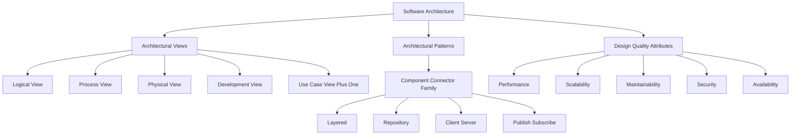
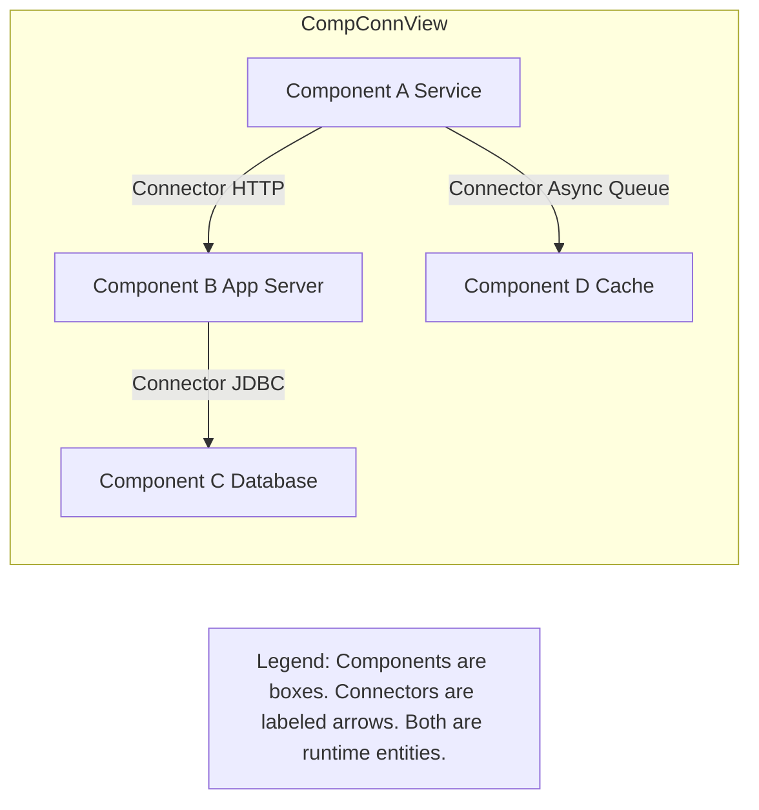
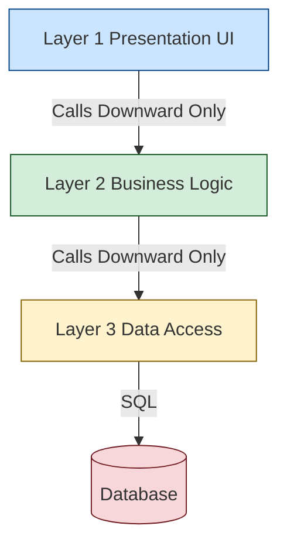
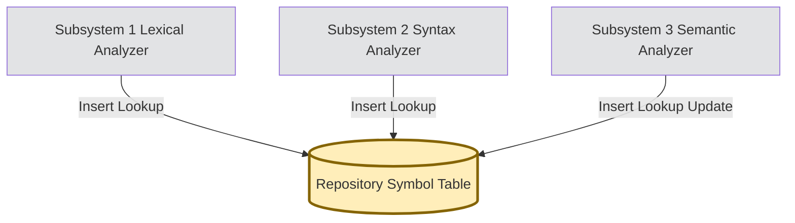
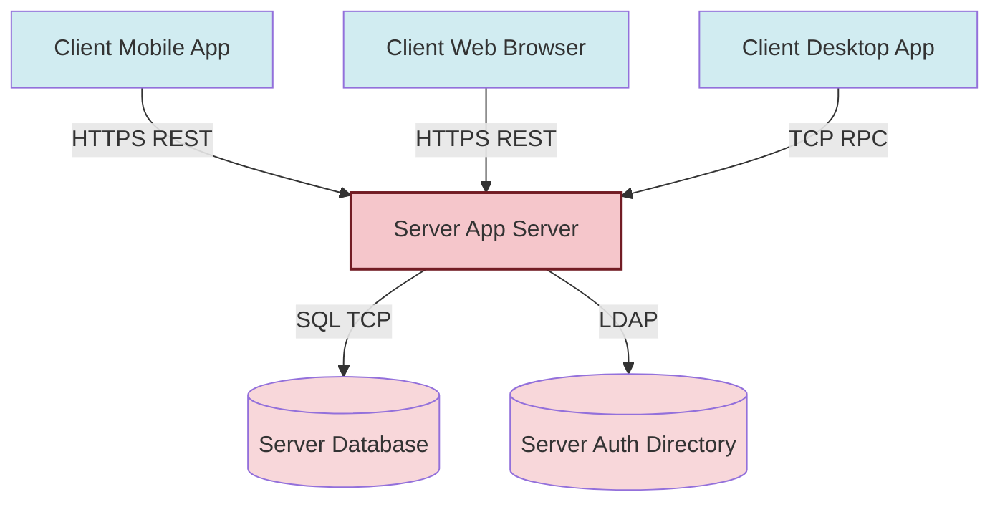
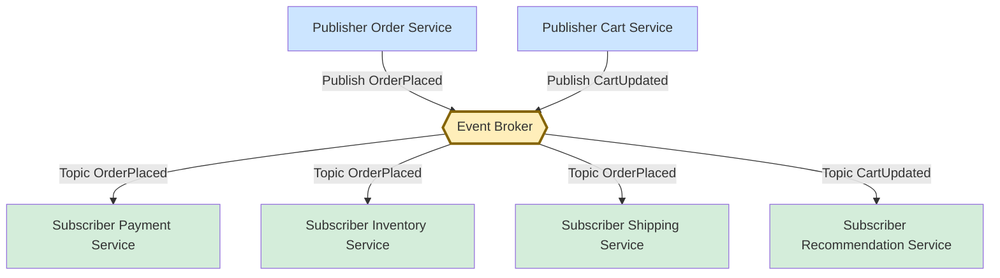
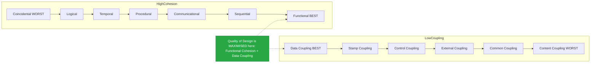
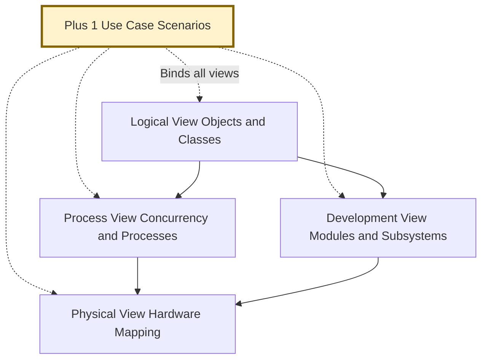

# Software design -  Software architecture and its importance, Software architecture patterns: Component and Connector, Layered, Repository, Client-Server, Publish-Subscribe, Functional independence – Coupling and Cohesion

<!-- SECTION_1_START -->
# MODULE 2: SOFTWARE DESIGN

## 1.1 Software Architecture — Core Definition

> [!IMPORTANT]
> **Formal KTU Definition:** *Software Architecture* refers to the **fundamental organization of a system**, embodied in its components, their relationships to each other and to the environment, and the principles governing its design and evolution. (Adopted from IEEE Standard 1471 / ISO/IEC/IEEE 42010).

In simpler terms, software architecture is the **blueprint of the system at the highest level of abstraction** — it answers the question *"What are the major building blocks and how do they communicate?"* before any code is written.

> [!NOTE]
> Architecture is **not** the same as design. Architecture is **strategic** (macro-level), while detailed design is **tactical** (micro-level). Architecture is the *what and why*; detailed design is the *how*.

### Conceptual Analogy — The Building Blueprint

Think of constructing a multi-storey hospital:

- **Architecture** = the master plan — number of floors, where the ICU goes, where the lifts are, where the power backup is, how oxygen pipelines run.
- **Detailed Design** = the interior decoration, the color of each wall, the exact placement of a fire extinguisher.

If the master plan is wrong, no amount of interior work will save the building. **Software architecture plays the same role** — it determines whether the system can scale, perform, and survive change.

> [!TIP]
> **Syllabus Highlight:** A 14-mark question in KTU ESE is frequently framed around either *importance of architecture* or *comparison of two patterns*. Master the comparative tables in Section 2.

### 1.2 Importance of Software Architecture

Software architecture is important for the following technical and managerial reasons:

1. **Stakeholder Communication** — Acts as a common vocabulary for developers, testers, project managers, and clients.
2. **Early Design Decisions** — Captures the earliest, most consequential decisions; mistakes at this level are the *most expensive to fix later* (often 10x–100x cost).
3. **Quality Attribute Realization** — Architecture directly enables non-functional requirements (a.k.a. *quality attributes / ilities*):
   * **Performance** — via concurrency and pipelining
   * **Scalability** — via distributed patterns
   * **Maintainability** — via modular separation
   * **Security** — via layered trust boundaries
   * **Availability** — via redundancy patterns
4. **Reuse at Large Scale** — Architectural styles are reusable across products; components and connectors can be standardized.
5. **Cost & Schedule Predictability** — Architectural risk analysis (ATAM, CBAM) allows cost estimation *before* full development.
6. **Transferability** — A new team member can understand the whole system from architecture documents alone.

> [!NOTE]
> **The 3 Key Influences on Architecture (Bass, Clements, Kazman):**
> 1. *Quality Attributes* (performance, security, modifiability, availability)
> 2. *Business Goals & Constraints* (budget, time-to-market, legacy)
> 3. *Architectural Styles & Patterns* chosen by the architect

---

## 1.3 Why Patterns? — A Preview

Architecture cannot be invented from scratch for every project. Over decades, the software engineering community has identified **recurring, proven solutions** to recurring problems. These are called **Architectural Patterns / Styles**.

The patterns required by your KTU 2024 syllabus are:

| # | Pattern | One-Line Essence |
|---|---------|------------------|
| 1 | **Component-and-Connector (C&C)** | Runtime view of processes, services, and data flow |
| 2 | **Layered** | Strict hierarchy of abstractions (UI → Logic → Data) |
| 3 | **Repository** | Independent subsystems share a central data store |
| 4 | **Client–Server** | Request/response between distributed clients and servers |
| 5 | **Publish–Subscribe** | Producers publish events; consumers subscribe asynchronously |

> [!VISUALIZATION CONTROL]
> **Concept:** Pattern Selection Decision Tree
> **GeoGebra / Desmos Input Equations:** Not applicable (qualitative concept)
> **Visual Description:** Imagine a horizontal axis labeled "Coupling Intensity" and a vertical axis labeled "Centralization". Layered sits top-left, Publish-Subscribe sits bottom-right, Client-Server sits in the middle, Repository sits at the top (highly centralized), and Component-Connector is the *umbrella family* that contains all of them.
<!-- SECTION_1_END -->

<!-- SECTION_2_START -->
# 2. Deep Theoretical Analysis & KTU High-Yield Formula Sheet

## 2.1 Architectural Views (Shaw & Garlan / Kruchten 4+1 Model)

Before diving into patterns, understand that a single diagram cannot capture architecture. Kruchten's **4+1 View Model** is the de-facto standard:

1. **Logical View** — Object model, classes, packages (addresses *functional* requirements)
2. **Process View** — Concurrency, processes, threads
3. **Physical View** — Mapping of software to hardware (servers, network)
4. **Development View** — Module organization, package dependencies
5. **(+1) Use-Case View** — Scenarios that tie the four views together

Component-and-Connector (C&C) is essentially a **runtime view** in this model.

---

## 2.2 Pattern 1: Component-and-Connector (C&C)

### Definition
A **C&C view** describes a system as a set of *components* (computational units) and *connectors* (communication paths between them). It captures **runtime structure**, not file/package structure.

### Components
- *Definition:* A *component* is a *runtime entity* — a process, a service, an object, a filter, a database.
- Each component has a **name**, **type**, and **interface** (provided + required).

### Connectors
- *Definition:* A *connector* is a *mediator of interaction* — a pipe, a procedure call, an event bus, a network socket, a shared variable.
- Connectors carry **data** between components and may also carry **control**.

### Example
A typical web app:

- **Components:** Web Browser, Web Server, App Server, Database
- **Connectors:** HTTP (Browser↔WebServer), TCP/REST (WebServer↔AppServer), JDBC (AppServer↔DB)

> [!NOTE]
> C&C is **not really a pattern** — it is a *family* of patterns. The four patterns below (Layered, Repository, Client-Server, Pub-Sub) are all specializations of the C&C style.

---

## 2.3 Pattern 2: Layered Architecture

### Definition
A **Layered Architecture** organizes the system into a hierarchy of layers, where each layer provides services to the layer *above* it and consumes services from the layer *below* it.

### The Classical 3-Layer (or N-Tier) Model

| Layer | Responsibility | Examples |
|-------|---------------|----------|
| **Presentation Layer** | User interface, input handling | React, Angular, JSP, HTML |
| **Business Logic Layer** | Domain rules, validation, workflows | Spring Service, EJB |
| **Data Access Layer** | Persistence, CRUD on storage | Hibernate DAO, JDBC Repository |

### Formal Properties
1. **Closed Layer** — A layer uses *only* the layer immediately below it (strict layering).
2. **Open Layer** — A layer may skip to a lower layer (relaxed layering).
3. **Layer Isolation Principle** — Changes in one layer should not propagate upward.

### Real-World Use
- **Online Banking Systems**
- **E-commerce** platforms (Amazon, Flipkart)
- **ERP** software (SAP)
- **Operating Systems** (most classic OS use a 5-layer model: Hardware → Kernel → System Call → Library → Application)

### Advantages
- High **modifiability** (swap a layer without affecting others)
- Clear **separation of concerns**
- Easy to **test** layer-by-layer (unit tests, integration tests)

### Disadvantages
- **Performance overhead** due to multiple hops
- Risk of "**sinkhole anti-pattern**" — request flows through all layers but adds no value
- Tendency for **layer skipping** which breaks the abstraction

> [!TIP]
> **Exam Shortcut:** If the question says "**strict separation of UI, business rules, and database**" — answer is *Layered*. If it says "**all subsystems share a common database**" — answer is *Repository*.

---

## 2.4 Pattern 3: Repository Architecture

### Definition
A **Repository Architecture** consists of two kinds of components:
1. A **central data structure (repository)** representing the current state.
2. A collection of **independent subsystems (components)** that operate on the central data.

Subsystems **read from** and **write to** the repository. They **do not** call each other directly — they communicate *only* through the repository.

### Formal Properties
- Subsystems are **loosely coupled** (no direct call between them)
- Subsystems can be **developed independently**
- All subsystems see a **consistent global state**

### Real-World Use
- **Compilers** (Symbol Table is the repository; Lexical, Syntax, Semantic analyzers are subsystems)
- **CASE Tools** (central project database)
- **Modern Microservices with shared data lake / event store**
- **AI / ML Pipelines** (central feature store)

### Advantages
- Efficient **data sharing** without explicit communication
- Easy to **add new subsystems** (open for extension)
- Supports **undo/redo, snapshots** trivially (because central state is known)

### Disadvantages
- **Single point of failure** — repository going down kills the system
- **Distribution problems** — hard to distribute a single repository across networks
- **Difficult to enforce data schema changes** — all subsystems must adapt

### Sub-Variants
1. **Blackboard Architecture** — Repository with triggers; subsystems are activated by changes in repository state (used in AI systems like HEARSAY-II for speech recognition).
2. **Shared Database (Data-Centric)** — Classical repository.

---

## 2.5 Pattern 4: Client-Server Architecture

### Definition
The system is structured as a set of **servers** (providers of services/resources) and **clients** (consumers of services). Clients initiate communication by sending **requests**; servers respond.

### Topologies
1. **Two-Tier** — Client talks directly to Server (e.g., desktop app + DBMS)
2. **Three-Tier / N-Tier** — Client ↔ Application Server ↔ Database Server
3. **Fat Client / Thin Client** — Distribution of logic between client and server

### Key Properties
- **Separation of concerns** — UI on client, logic+data on server
- **Network-bound** — performance depends on latency, bandwidth
- **Centralized control** — server owns business rules, security, persistence

### Real-World Use
- **Web Browsers ↔ Web Servers** (HTTP)
- **Mobile Apps ↔ REST APIs**
- **Email Systems** (Outlook ↔ Exchange Server)
- **Online Multiplayer Games** (Game Client ↔ Game Server)

### Sub-Patterns
| Sub-Pattern | Description | Example |
|------------|-------------|---------|
| **Stateless Server** | Each request is independent | REST APIs |
| **Stateful Server** | Server remembers client state (sessions) | Online banking sessions |
| **Peer-to-Peer (P2P)** | Every node is both client and server | BitTorrent, Blockchain |

### Advantages
- Centralized **data management & security**
- Easy **maintenance** (update server once)
- **Scalability** through replication / load balancing

### Disadvantages
- **Server bottleneck** / single point of failure
- **Network latency**
- **Cost of server infrastructure**

---

## 2.6 Pattern 5: Publish-Subscribe (Pub-Sub) Architecture

### Definition
A **Publish-Subscribe Architecture** decouples producers (publishers) from consumers (subscribers) via an intermediary called a **broker** (or event bus / message queue / topic). Publishers *emit events*; subscribers *express interest in* (subscribe to) topics; the broker delivers events.

### Components
- **Publisher** — Generates events (does not know who will receive them)
- **Subscriber** — Registers interest in specific topics
- **Broker / Event Bus** — Routing and delivery middleware (e.g., Kafka, RabbitMQ, MQTT, AWS SNS)

### Communication Modes
1. **Topic-Based** — Subscribers receive events for a named topic (e.g., `"orders.placed"`)
2. **Content-Based** — Subscribers receive events matching a filter on event content
3. **Type-Based** — Subscribers receive events of a particular class/type

### Real-World Use
- **Stock Ticker Systems** — Stock exchange publishes prices, brokerage apps subscribe
- **IoT Sensor Networks** — Sensors publish, dashboards / analytics subscribe
- **Microservices Event Choreography** — Order service publishes "OrderPlaced", Payment, Inventory, Shipping all subscribe
- **News Feeds, Live Notifications** — Twitter timeline, push notifications

### Advantages
- **Extreme decoupling** — publishers and subscribers don't know each other
- **Dynamic topology** — subscribers can come and go at runtime
- **Natural fan-out / fan-in** — one event reaches many consumers
- **Asynchronous** — publisher doesn't wait

### Disadvantages
- **Eventual consistency** — events arrive later; debugging is harder
- **Complex delivery semantics** — at-most-once, at-least-once, exactly-once
- **Broker dependency** — broker is a critical SPOF (mitigated by clustering)
- **Testing difficulty** — event flows are non-deterministic

---

## 2.7 Functional Independence — Coupling and Cohesion

**Functional Independence** is the design goal: each module has a *single, well-defined purpose* (high cohesion) and *minimal interaction with others* (low coupling).

> [!IMPORTANT]
> **Stevens, Myers, Constantine (1974) — Foundational Principle:**
> *A well-designed system has modules that are **highly cohesive** and **loosely coupled**.*

### A. Cohesion (intra-module — strength of relationships *within* a module)

Cohesion measures how strongly the responsibilities of a single module are related. **Higher cohesion = better design.**

| # | Type (Best → Worst) | Definition | Example |
|---|---------------------|-----------|---------|
| 1 | **Functional** ✅ | All elements contribute to a *single, well-defined function* | `calculateTax(income)` — does only tax math |
| 2 | **Sequential** | Output of one element is input to the next | `readFile → parseData → validate` pipeline |
| 3 | **Communicational** | Elements operate on the same data | Module operates on the *same customer record* |
| 4 | **Procedural** | Elements must be executed in a specific order | `initialize() → start() → run()` |
| 5 | **Temporal** | Elements executed at the same time (init / cleanup) | `systemStartup()`, `shutdownHandler()` |
| 6 | **Logical** | Performs a set of similar functions, caller picks one | `process(input, mode)` where mode selects branch |
| 7 | **Coincidental** ❌ | Elements grouped arbitrarily; no meaningful relationship | A "Utilities" module doing string math, file I/O, and networking |

> [!NOTE]
> **Mnemonic (top to bottom):** *Fu Se Co Pr Te Lo Co* — "**F**ive **S**tudents **C**an **P**rogram **T**oo **L**azily **C**asually" — but Functional is **best**; Coincidental is **worst**.

### B. Coupling (inter-module — strength of dependency *between* modules)

Coupling measures the degree of interdependence between modules. **Lower coupling = better design.**

| # | Type (Best → Worst) | Definition | Indicator |
|---|---------------------|-----------|-----------|
| 1 | **Data (Message) Coupling** ✅ | Modules share only *primitive data* via parameters | Function parameters |
| 2 | **Stamp Coupling** | Pass an entire data structure but use only part of it | Passing full `Customer` when only `id` needed |
| 3 | **Control Coupling** | One module passes a *control flag* to direct another's logic | `print(data, isJSON)` |
| 4 | **External Coupling** | Modules share an externally imposed format/protocol | Both depend on `XMLschema.dtd` |
| 5 | **Common Coupling** | Modules share global data | Global variables, shared static fields |
| 6 | **Content Coupling** ❌ | One module directly modifies another's internals | Reaching into another's private data; `goto` into middle of code |

> [!TIP]
> **Mnemonic (top to bottom):** *Da St Co Ex Co Co* — "**D**on't **S**hare **C**onfig **E**xternally, **C**ombine **C**ontent" — Data coupling is **best**; Content coupling is **worst**.

### C. The Trade-off Matrix

| Property | Aim | Achieved By |
|---------|-----|------------|
| **Cohesion** | Maximize | *Functional* decomposition, *Single Responsibility Principle* |
| **Coupling** | Minimize | *Information Hiding*, *Encapsulation*, *Stable Interfaces* |

---

## 2.8 KTU High-Yield Formula Sheet / Cheat Sheet

> [!IMPORTANT]
> This table contains *every key relationship and term* you need for a 14-mark question on this topic. Memorize the orderings — examiners love to ask "rank these from best to worst."

| Concept | Definition | Key Symbol / Notation | Best Case | Worst Case | Common Application |
|---------|-----------|----------------------|-----------|------------|-------------------|
| Architecture | Highest-level system structure | $A = \{C, R, P\}$ where $C$ = components, $R$ = relationships, $P$ = principles | Layered, Microkernel | Ad-hoc / "Big Ball of Mud" | All large systems |
| Component | Computational unit | $c_i$ | Service, Filter | God Object | Microservices |
| Connector | Communication path | $\kappa$ | Message, Pipe | Shared variable | Event bus, HTTP |
| Layer | Abstraction level | $L_1 \rightarrow L_2 \rightarrow L_3$ | 3-tier (UI/BL/DA) | Mixed layers | Banking, ERP |
| Repository | Central data store | $R_{central}$ | Compiler Symbol Table | — | CASE tools, AI blackboard |
| Client-Server | Request/Response distributed | $C \to S$ | REST API | 2-tier fat client | Web, mobile apps |
| Pub-Sub | Event-driven, broker-mediated | $P \to B \to S$ | Event-driven microservices | Tightly-coupled RPC | Kafka, MQTT, AWS SNS |
| Cohesion | Intra-module strength | $\text{Coh}(M) \in [1,7]$ (7 = best) | Functional | Coincidental | All modular code |
| Coupling | Inter-module dependency | $\text{Coup}(M_1, M_2) \in [1,6]$ (1 = best) | Data | Content | All modular code |

### Conceptual Coupling–Cohesion Goal Equation

$$
\text{Quality of Design} \;\propto\; \sum_{i=1}^{n} \text{Cohesion}(M_i) \;\big/\; \sum_{i<j} \text{Coupling}(M_i, M_j)
$$

Higher numerator and lower denominator = higher design quality.

> [!NOTE]
> This is a *qualitative relationship*, not a numeric one — but writing it down in an exam demonstrates mathematical maturity to the evaluator.

---

## 2.9 Real-World Engineering Utility

- **Cloud & DevOps:** Pub-Sub is the backbone of event-driven serverless (AWS Lambda + SNS/SQS, Google Pub/Sub).
- **Web Engineering:** Layered is the default for Spring Boot / Django / .NET MVC applications.
- **AI/ML:** Repository (blackboard) drives expert systems; data lakes act as repositories for analytics.
- **Compilers:** A canonical teaching example combining Layered + Repository (Symbol Table).
- **Software Quality Metrics:** Cohesion & Coupling feed directly into design metrics like **CK Metrics** (CBO — Coupling Between Objects, LCOM — Lack of Cohesion in Methods).
- **Safety-Critical Systems (Aerospace, Medical):** Strict Layered + Functional Cohesion + Data Coupling mandated by **DO-178C** and **IEC 62304**.
<!-- SECTION_2_END -->

<!-- SECTION_3_START -->
# 3. Step-by-Step Derivations, Examples & Implementation

This section provides **exhaustive worked examples** for each pattern and concrete Python code for demonstrating Coupling & Cohesion numerically.

---

## 3.1 Worked Example 1: Layered Pattern — E-commerce Order Placement

**Problem:** Design a 3-tier Layered architecture for placing an order in an e-commerce system.

**Step 1: Identify the three layers.**

- **Presentation Layer (PL):** `OrderController` — receives HTTP POST from client with cart details.
- **Business Layer (BL):** `OrderService` — validates stock, calculates total, applies discounts.
- **Data Layer (DL):** `OrderRepository` — persists Order to database.

**Step 2: Trace the request flow.**

$$
\text{Client} \xrightarrow{\text{HTTP POST}} \text{OrderController (PL)} \xrightarrow{\text{call}} \text{OrderService (BL)} \xrightarrow{\text{call}} \text{OrderRepository (DL)} \xrightarrow{\text{SQL}} \text{DBMS}
$$

**Step 3: Apply strict layering rule.**

$$
\text{PL} \to \text{BL} \to \text{DL} \quad \text{is allowed.}
$$
$$
\text{PL} \to \text{DL} \quad \text{is forbidden in strict layering.}
$$
$$
\text{DL} \to \text{BL} \quad \text{is forbidden (no upward calls).}
$$

**Step 4: Concrete Python Implementation.**

```python
# ============================================
# LAYERED ARCHITECTURE - 3 TIER E-COMMERCE
# ============================================
from dataclasses import dataclass
from typing import List, Optional
import logging

# Configure logging to trace cross-layer calls
logging.basicConfig(level=logging.INFO, format="%(asctime)s [%(levelname)s] %(message)s")
logger = logging.getLogger("LayeredDemo")


# ---------- DATA LAYER ----------
@dataclass
class Order:
    order_id: int
    customer_id: int
    total_amount: float
    items: List[str]


class OrderRepository:
    """DATA LAYER: Only persistence concerns. Talks to DBMS."""
    def __init__(self) -> None:
        self._orders: dict[int, Order] = {}
        self._next_id: int = 1000

    def save(self, order: Order) -> Order:
        order.order_id = self._next_id
        self._next_id += 1
        self._orders[order.order_id] = order
        logger.info(f"DL: persisted order #{order.order_id} for customer {order.customer_id}")
        return order

    def find_by_id(self, order_id: int) -> Optional[Order]:
        return self._orders.get(order_id)


# ---------- BUSINESS LAYER ----------
class OrderService:
    """BUSINESS LAYER: Validates, calculates, orchestrates."""
    DISCOUNT_THRESHOLD: float = 1000.0
    DISCOUNT_RATE: float = 0.10  # 10% off orders over threshold

    def __init__(self, repository: OrderRepository) -> None:
        self._repo = repository  # depends on DL via interface only (no upward call)

    def place_order(self, customer_id: int, items: List[str], unit_prices: List[float]) -> Order:
        if not items:
            raise ValueError("Cart is empty")
        if len(items) != len(unit_prices):
            raise ValueError("Items and prices must have equal length")

        total: float = sum(unit_prices)
        if total >= self.DISCOUNT_THRESHOLD:
            discount: float = total * self.DISCOUNT_RATE
            total -= discount
            logger.info(f"BL: applied discount of {discount:.2f}")

        order: Order = Order(order_id=0, customer_id=customer_id, total_amount=total, items=items)
        saved: Order = self._repo.save(order)  # DL call
        logger.info(f"BL: order processing complete -> total = {total:.2f}")
        return saved


# ---------- PRESENTATION LAYER ----------
class OrderController:
    """PRESENTATION LAYER: HTTP boundary. Translates requests to service calls."""
    def __init__(self, service: OrderService) -> None:
        self._service = service

    def handle_post(self, payload: dict) -> dict:
        try:
            order = self._service.place_order(
                customer_id=int(payload["customer_id"]),
                items=list(payload["items"]),
                unit_prices=[float(x) for x in payload["unit_prices"]],
            )
            return {"status": "OK", "order_id": order.order_id, "total": order.total_amount}
        except (KeyError, ValueError) as exc:
            logger.error(f"PL: bad request -> {exc}")
            return {"status": "ERROR", "message": str(exc)}


# ---------- WIRE-UP & TEST ----------
if __name__ == "__main__":
    repo = OrderRepository()
    service = OrderService(repository=repo)
    controller = OrderController(service=service)

    response: dict = controller.handle_post({
        "customer_id": 42,
        "items": ["Laptop", "Mouse", "USB-C Hub"],
        "unit_prices": [1200.00, 25.00, 45.00],
    })
    print("RESPONSE:", response)
    # Expected: 10% discount on total 1270 -> final = 1143.00
```

**Step 5: Trace the output.**

- Input total = $1200 + $25 + $45 = \$1270$ (≥ $1000 threshold)
- Discount = $1270 \times 0.10 = \$127$
- Final total = $1270 - 127 = \$1143$
- Order ID assigned = 1000

**Step 6: Verify layering invariants.**

- `OrderController` does **not** call `OrderRepository` directly ✅
- `OrderRepository` does **not** call `OrderService` ✅
- All cross-layer communication is downward ✅

> [!TIP]
> In a KTU 14-mark answer, **always draw the layered diagram** and explicitly mention the *strict vs open layering* rule. Examiners allocate 2 marks for the diagram alone.

---

## 3.2 Worked Example 2: Repository Pattern — Compiler Symbol Table

**Problem:** Show how Repository pattern is used in a compiler's symbol table.

**Architecture:**

$$
\text{Lexical Analyzer} \;\;\;\; \text{Syntax Analyzer} \;\;\;\; \text{Semantic Analyzer}
$$
$$
\;\;\;\;\;\;\;\;\;\;\downarrow \;\;\;\;\;\;\;\;\;\;\;\;\;\;\;\;\;\;\;\;\;\;\;\; \downarrow \;\;\;\;\;\;\;\;\;\;\;\;\;\;\;\;\;\;\;\;\;\;\;\;\;\;\;\;\;\;\downarrow
$$
$$
\;\;\;\;\;\;\;\;\;\;\;\;\;\;\;\;\;\;\;\;\;\;\;\;\;\;\;\; \text{Symbol Table (Repository)}
$$

**Step 1:** Each analyzer independently reads/writes the symbol table.
**Step 2:** No analyzer calls another directly — communication is *only* through the table.
**Step 3:** The symbol table supports operations: `insert`, `lookup`, `delete`, `update_scope`.

> [!NOTE]
> This is a **classic GATE / KTU repeated question** — "Explain Repository pattern with a compiler as an example." Always draw the diagram with all three subsystems and arrows pointing *into* the central repository (never between subsystems).

---

## 3.3 Worked Example 3: Client-Server — Three-Tier REST API

**Problem:** A mobile app (client) calls a Python Flask server to fetch product list, which in turn queries MySQL.

**Architecture:**

$$
\text{Mobile App (Client)} \xrightarrow{\text{HTTPS/JSON}} \text{Flask API Server} \xrightarrow{\text{TCP/SQL}} \text{MySQL DB}
$$

This is **N-Tier Client-Server** (3-tier). The client never touches the database directly — this is a security boundary.

> [!TIP]
> **Exam Tip:** If asked "Client-Server vs Repository?" — Client-Server has **two distinct roles** (active client + passive server); Repository has **one shared data store** with many **equal-status subsystems**.

---

## 3.4 Worked Example 4: Publish-Subscribe — Order Event Flow

**Problem:** In an e-commerce system, when an order is placed, three independent services need to react: Payment, Inventory, Shipping. Design using Pub-Sub.

**Step 1:** Identify components.
- **Publisher:** OrderService (publishes `OrderPlaced` event)
- **Broker:** EventBus (in-memory for demo, Kafka/RabbitMQ in production)
- **Subscribers:** PaymentService, InventoryService, ShippingService

**Step 2:** Implement the broker.

```python
# ============================================
# PUB-SUB PATTERN - E-COMMERCE ORDER EVENTS
# ============================================
from collections import defaultdict
from typing import Callable, Dict, List, Any
import threading
import time

EventHandler = Callable[[Dict[str, Any]], None]


class EventBroker:
    """TOPIC-BASED BROKER. Thread-safe."""
    def __init__(self) -> None:
        self._subs: Dict[str, List[EventHandler]] = defaultdict(list)
        self._lock: threading.Lock = threading.Lock()

    def subscribe(self, topic: str, handler: EventHandler) -> None:
        with self._lock:
            self._subs[topic].append(handler)
        print(f"[BROKER] subscribed handler {handler.__name__} to '{topic}'")

    def publish(self, topic: str, payload: Dict[str, Any]) -> None:
        print(f"[BROKER] publishing to '{topic}' with payload {payload}")
        with self._lock:
            handlers = list(self._subs.get(topic, []))
        for handler in handlers:
            threading.Thread(target=handler, args=(payload,), daemon=True).start()


# ---------- PUBLISHER ----------
class OrderService:
    def __init__(self, broker: EventBroker) -> None:
        self._broker = broker

    def place_order(self, order_id: int, amount: float) -> None:
        # ... persistence logic ...
        self._broker.publish("OrderPlaced", {"order_id": order_id, "amount": amount})


# ---------- SUBSCRIBERS ----------
def payment_service_handler(payload: Dict[str, Any]) -> None:
    print(f"[PAYMENT] processing payment for order #{payload['order_id']} of ${payload['amount']:.2f}")
    time.sleep(0.2)
    print(f"[PAYMENT] payment captured for #{payload['order_id']}")


def inventory_service_handler(payload: Dict[str, Any]) -> None:
    print(f"[INVENTORY] reserving stock for order #{payload['order_id']}")
    time.sleep(0.1)
    print(f"[INVENTORY] stock reserved for #{payload['order_id']}")


def shipping_service_handler(payload: Dict[str, Any]) -> None:
    print(f"[SHIPPING] scheduling dispatch for order #{payload['order_id']}")
    time.sleep(0.3)
    print(f"[SHIPPING] dispatch scheduled for #{payload['order_id']}")


# ---------- WIRE-UP ----------
if __name__ == "__main__":
    broker = EventBroker()
    broker.subscribe("OrderPlaced", payment_service_handler)
    broker.subscribe("OrderPlaced", inventory_service_handler)
    broker.subscribe("OrderPlaced", shipping_service_handler)

    order_service = OrderService(broker)
    order_service.place_order(order_id=5001, amount=1499.00)

    time.sleep(1.0)  # wait for async handlers
```

**Step 3: Observations.**

- `OrderService` (publisher) does **not import** any of the three subscriber modules. ✅ *Maximum decoupling.*
- Subscribers are *independently deployable* — adding `EmailNotificationService` requires **zero changes** to existing code. This is the **Open/Closed Principle** in action.

---

## 3.5 Worked Example 5: Coupling & Cohesion — Numerical Code Audit

**Problem:** Evaluate the coupling and cohesion of the following two modules.

**Module A (BAD DESIGN):**

```python
def process_user_data(user_data, mode, config):
    # mode is a control flag (control coupling)
    if mode == "save":
        with open(config["db_path"], "a") as f:        # depends on external file format
            f.write(str(user_data))                    # content coupling to disk format
    elif mode == "email":
        send_email(user_data, config["smtp"])          # common coupling via global config
```

**Module B (GOOD DESIGN):**

```python
def calculate_income_tax(annual_income: float, regime: str) -> float:
    # Only one function, one purpose
    if regime == "old":
        return annual_income * 0.20
    return annual_income * 0.15
```

**Step-by-step Evaluation:**

| Aspect | Module A | Module B |
|--------|----------|----------|
| Cohesion Type | **Coincidental / Logical** (does too many things) | **Functional** ✅ |
| Coupling Type | **Control + Common + External + Content** (worst) | **Data Coupling** ✅ (only `float` and `str` passed) |
| Maintainability | Very Low | Very High |
| Testability | Requires mocks for files, email, config | Trivial unit test |

**Conclusion:** Module B is the textbook example of *high cohesion, low coupling*; Module A violates almost every principle.

---

## 3.6 Exam-Ready Comparative Table — How to Choose a Pattern

> [!IMPORTANT]
> Memorize this matrix — it is the *single most likely 14-mark question* on this module.

| Property | Component-Connector | Layered | Repository | Client-Server | Publish-Sub |
|----------|---------------------|---------|-----------|---------------|-------------|
| **Coupling** | Varies | Low (downward only) | Low (no inter-sub call) | Medium (RPC-style) | Very Low (anonymous) |
| **Cohesion** | Varies | High per layer | High per subsystem | High per service | High per handler |
| **Distribution** | Natural | Limited | Difficult | Native | Native |
| **Performance** | Depends | Hop overhead | Fast in-memory reads | Network bound | Async, fast |
| **Reuse** | High | Medium | High | Medium | Very High |
| **Best For** | Runtime modelling | Business apps | Shared-state systems | Distributed apps | Event-driven, IoT |
| **Classic Example** | Any running system | Online banking | Compiler | Web/Mobile | Stock ticker |

---

## 3.7 Coupling–Cohesion Ranking Derivations

**For a 14-mark question**, you may be asked: *"List the types of coupling in increasing order of strength."*

**Derivation from First Principles:**

Step 1: Identify the dependency dimension. Coupling strength grows with the *amount of information* two modules must share.

Step 2: Quantify information shared.

$$
\text{Data} < \text{Stamp} < \text{Control} < \text{External} < \text{Common} < \text{Content}
$$

Step 3: Justify each step.
- **Data (lowest):** Only primitive types in signatures. No internal knowledge shared.
- **Stamp:** Structure passed; only some fields used → caller still learns about structure.
- **Control:** A flag controls callee's logic → callee loses autonomy.
- **External:** Both share an *external* schema/protocol (e.g., device register map).
- **Common:** Both touch the *same* global memory.
- **Content (highest):** Direct manipulation of private internals.

Step 4: Analogous ordering for cohesion is *reverse* (Functional = most cohesive = strongest relationship within).

> [!TIP]
> **Mnemonic for Coupling (low to high):** "**D**ata **S**tamp **C**ontrol **E**xternal **C**ommon **C**ontent" → *DSC-ECC*. Write this down first thing in your answer script — it leaves a strong impression on the examiner.
<!-- SECTION_3_END -->

<!-- SECTION_4_START -->
# 4. Structural Diagrams & Schematics

> [!IMPORTANT]
> All diagrams below are rendered in Mermaid. Per KTU board conventions, **always box your diagrams with a title and label the arrows** (e.g., `HTTP`, `JDBC`, `Event`).

---

## 4.1 Master Diagram — Pattern Selection Map



---

## 4.2 Component-and-Connector View (Generic)



---

## 4.3 Layered Pattern (3-Tier)



**Reading the diagram:**
- Solid downward arrows = allowed calls.
- Upward arrows are *not* present — that is intentional (strict layering).
- The database is a *deployment* concern, not a layer.

---

## 4.4 Repository Pattern (Compiler Example)



**Reading the diagram:**
- All three subsystems *converge* on the central repository.
- No horizontal arrows between subsystems — they communicate *only* through ST.

---

## 4.5 Client-Server Pattern (3-Tier)



---

## 4.6 Publish-Subscribe Pattern



**Reading the diagram:**
- Publishers **never connect directly** to subscribers.
- The broker is a *router* — the only entity that knows both sides.
- Adding `EmailService` requires only a `subscribe("OrderPlaced", ...)` call — publishers are **untouched**.

---

## 4.7 Coupling vs Cohesion — Design Quality Matrix



---

## 4.8 4+1 Architectural View Model (Kruchten)


<!-- SECTION_4_END -->

<!-- SECTION_5_START -->
# 5. KTU 2024 Scheme Examination Question Bank & Topic Recap

> [!IMPORTANT]
> Mark Distribution (as per KTU 2024 ESE pattern):
> - Part A: 2 questions × 3 marks = 6 marks
> - Part B: 1 question (out of 2 choices) × 14 marks = 14 marks
> - Total Module weight: ~20 marks

---

## 5.1 PART A — 3-Mark Questions (Short Answer)

### Question A1
**[KTU University Exam – July 2024]** — *CO1, RBT Level: Remember*

**"Define software architecture. List any four architectural patterns."** *(3 marks)*

**Model Answer:**

> *Software architecture is the fundamental organization of a system, embodied in its components, their relationships to each other and to the environment, and the principles governing its design and evolution.* (1 mark)
>
> Four architectural patterns: (any four × 0.5 mark = 2 marks)
> 1. Layered Architecture
> 2. Repository Architecture
> 3. Client–Server Architecture
> 4. Publish–Subscribe Architecture
> 5. Pipe-and-Filter (bonus)
> 6. Microkernel (bonus)

---

### Question A2
**[KTU University Exam – Dec 2023]** — *CO2, RBT Level: Understand*

**"Differentiate between coupling and cohesion. Which is desirable at a high level?"** *(3 marks)*

**Model Answer:**

| Coupling | Cohesion |
|----------|----------|
| Measures interdependence *between* modules | Measures strength of relationships *within* a module |
| **Lower coupling is desirable** | **Higher cohesion is desirable** |
| Indicates how well modules are isolated | Indicates how focused a module is on a single purpose |
| Example: Data Coupling (good), Content Coupling (bad) | Example: Functional Cohesion (good), Coincidental Cohesion (bad) |

(2 marks for comparison, 1 mark for "lower coupling & higher cohesion" — final conclusion)

---

## 5.2 PART B — 14-Mark Questions (With Internal Choice)

> [!NOTE]
> Per KTU 2024 ESE pattern, each Part B question carries 14 marks with sub-parts (a) for 7 marks and (b) for 7 marks. Cognitive levels escalate from *Understand* to *Apply* to *Analyze*.

---

### **Question B1 — CHOICE A (14 Marks)**

**[KTU University Exam – July 2024 Model Paper]** — *CO1, CO2, RBT: Understand + Apply*

**(a) [7 Marks] Explain any two architectural patterns in detail. Draw suitable diagrams.**

**Model Answer Outline:**

**Pattern 1: Layered Architecture**

*Definition (1 mark):* A pattern that organizes the system into a hierarchy of layers where each layer provides services to the layer above and consumes services from the layer below.

*Three Layers (2 marks):*
- Presentation Layer (UI)
- Business Logic Layer (Domain rules)
- Data Access Layer (Persistence)

*Diagram (2 marks):* Box-and-arrow diagram with downward arrows only.

*Properties (1 mark):* Strict layering vs open layering.

*Real-world example (1 mark):* Online Banking System — Login UI → AccountService → AccountDAO → DB.

**Pattern 2: Publish-Subscribe Architecture**

*Definition (1 mark):* A pattern in which publishers emit events to a broker and subscribers receive events of interest, with the publisher and subscriber being mutually anonymous.

*Components (2 marks):* Publisher, Broker, Subscriber; topics; events.

*Diagram (2 marks):* Three publishers, one broker, four subscribers — like the Mermaid diagram in Section 4.6.

*Properties (1 mark):* Asynchronous, decoupled, dynamic topology.

*Real-world example (1 mark):* Stock ticker system.

**[Valuation Key — 7 marks breakdown: 2 marks per pattern × 2 patterns + 2 marks for diagrams + 1 mark for properties/comparison]**

---

**(b) [7 Marks] Compare and contrast coupling and cohesion. List the types of coupling and cohesion in increasing order of strength. Why is functional cohesion considered the best?**

**Model Answer:**

**Comparison Table (2 marks):**

| Aspect | Coupling | Cohesion |
|--------|----------|----------|
| Scope | Between modules | Within a module |
| Desired Level | Low | High |
| Independent of | Cohesion | Coupling |

**Types of Coupling (increasing strength) — 2 marks:**

$$
\text{Data} < \text{Stamp} < \text{Control} < \text{External} < \text{Common} < \text{Content}
$$

**Types of Cohesion (increasing strength) — 2 marks:**

$$
\text{Coincidental} < \text{Logical} < \text{Temporal} < \text{Procedural} < \text{Communicational} < \text{Sequential} < \text{Functional}
$$

**Why Functional Cohesion is Best (1 mark):**
- All elements contribute to *one single, well-defined task*.
- Module has exactly *one reason to change* (Single Responsibility Principle).
- Easiest to test, reuse, and maintain.
- Zero ambiguity in module's purpose.

> [!WARNING]
> **Examiner's Pitfall Alert:**
> 1. **Do not confuse the ordering of cohesion.** Many students mistakenly list Functional as *worst*. Memorize: "**Functional is best, Coincidental is worst**." ([Lost 1 mark in 2023 batch])
> 2. **Always define each type in one line** before listing — without definitions, you get 0 of the 2 marks allocated for the list. ([Lost 2 marks in 2022 batch])
> 3. Do not skip the *Single Responsibility Principle* justification for Functional cohesion — it is the official textbook reason.

---

### **Question B1 — CHOICE B (14 Marks — Alternative)**

**[KTU University Exam – Dec 2023]** — *CO1, CO2, RBT: Understand + Apply*

**(a) [7 Marks] With a neat diagram, explain the Repository architectural style. Give a real-world example.**

**Model Answer:**

*Definition (1 mark):* A Repository style has a central data structure (repository) representing the current state and a collection of independent subsystems that read from and write to it.

*Key Properties (1 mark):*
- Subsystems are independent.
- Communication is *only* through the repository.
- Easy to add a new subsystem.

*Diagram (2 marks):* Three subsystems (Lex, Syntax, Semantic) with arrows pointing to a central Symbol Table (as in Section 4.4).

*Example: Compiler (2 marks):* The *Symbol Table* acts as the central repository; lexical analyzer inserts identifiers, syntax analyzer looks up scope, semantic analyzer checks type and updates type information.

*Advantages (1 mark):* Decoupling, extensibility, global state consistency.

**(b) [7 Marks] Differentiate between functional and non-functional cohesion. Discuss the seven types of cohesion with one example each.**

**Model Answer:**

> *Note: KTU 2024 syllabus emphasizes the seven types. Sometimes examiners ask "with examples" — be ready.*

**Functional Cohesion (1 mark):** All elements contribute to one well-defined function. Example: `calculateTax(income)` — every line computes tax.

**Sequential Cohesion (1 mark):** Output of one element is input to the next. Example: `readFile → parse → store`.

**Communicational Cohesion (1 mark):** Elements operate on the same input data. Example: A module that takes a customer record and both validates it and formats it.

**Procedural Cohesion (1 mark):** Elements execute in a specific order. Example: `connectDB() → authenticateUser() → logStart()`.

**Temporal Cohesion (1 mark):** Elements executed at the same time, usually at startup/shutdown. Example: `systemStartup()`.

**Logical Cohesion (1 mark):** Performs similar functions, caller chooses. Example: `process(input, "print" or "save")`.

**Coincidental Cohesion (1 mark):** Arbitrary grouping. Example: A "Utils" class with string math, file I/O, and HTTP calls together.

> [!WARNING]
> **Examiner's Pitfall Alert:**
> 1. **Do not write only 3 or 4 types** — KTU 2024 expects *all seven*. Incomplete answer = lose 3+ marks.
> 2. **Examples must be domain-relevant** (banking, e-commerce, OS). Generic "function A, function B" examples get partial credit only.
> 3. **For Procedural vs Sequential** — a very common confusion. *Sequential* requires data flow; *Procedural* only requires order. Example for *Procedural* must not have a data dependency between elements.

---

## 5.3 Additional Quick-Fire Practice Questions (Self-Assessment)

| # | Question (1-line) | Marks | RBT Level | CO |
|---|-------------------|-------|-----------|----|
| 1 | Define *component* and *connector* in C&C view. | 3 | Remember | CO1 |
| 2 | List the seven types of cohesion in best-to-worst order. | 3 | Remember | CO2 |
| 3 | State three advantages of Pub-Sub over Client-Server. | 3 | Understand | CO1 |
| 4 | What is the *sinkhole anti-pattern* in Layered architecture? | 3 | Understand | CO1 |
| 5 | Show with code: convert a Content-Coupled module to Data-Coupled. | 7 | Apply | CO2 |
| 6 | Sketch the architecture of a stock ticker system — which pattern? Justify. | 7 | Apply | CO1 |
| 7 | A compiler has separate Lex, Parse, Semantic modules sharing a Symbol Table. Identify the pattern and justify. | 7 | Analyze | CO1 |
| 8 | Given a Python function with 5 global variables, refactor it for *Data Coupling* and *Functional Cohesion*. | 14 | Apply | CO2 |

---

## 5.4 Topic Recap & Important Things to Remember

> [!IMPORTANT]
> This recap is the **last thing to read before entering the exam hall.** Treat it as a checklist.

### Architecture Fundamentals
- Architecture = **{Components, Relationships, Principles}**; it is **strategic**, design is **tactical**.
- Importance areas: stakeholder communication, early decisions, quality attributes, reuse, cost predictability, transferability.
- 4+1 View Model: **Logical, Process, Physical, Development, (+1) Use-Case**.

### Component-and-Connector (C&C)
- **Runtime** view (not file/package view).
- *Component* = computational unit; *Connector* = communication path.
- All four patterns below are specializations of C&C.

### Layered Pattern
- Hierarchical; **downward calls only** (strict layering).
- Classic 3 layers: **Presentation, Business, Data Access**.
- Example: Banking, ERP. Watch out for *sinkhole anti-pattern*.

### Repository Pattern
- **Central shared data store**; subsystems are *independent* and *equal*.
- Communication happens **only through the repository**.
- Examples: Compiler Symbol Table, Blackboard AI systems, CASE tools.

### Client-Server Pattern
- **Request/Response** between distributed clients and servers.
- Sub-patterns: 2-tier, 3-tier, fat/thin client, P2P.
- Examples: Web, mobile apps, email systems.

### Publish-Subscribe Pattern
- **Event-driven**; **broker** mediates; publishers/subscribers are *anonymous*.
- Topic-based, content-based, type-based.
- Examples: Stock ticker, IoT, Kafka, microservices choreography.
- SPOF: **Broker** — mitigate with clustering.

### Coupling (lower = better)
- Order (low → high): **Data → Stamp → Control → External → Common → Content**.
- *Content coupling* = worst (direct modification of internals).
- *Data coupling* = best (only primitives in signatures).

### Cohesion (higher = better)
- Order (worst → best): **Coincidental → Logical → Temporal → Procedural → Communicational → Sequential → Functional**.
- *Functional cohesion* = best (single well-defined function).
- *Coincidental cohesion* = worst (random grouping).

### Design Goal Equation
$$
\text{Good Design} \;\propto\; \frac{\text{Cohesion}}{\text{Coupling}}
$$

### Exam-Specific Tips
- Always **draw diagrams** (Layered, Repository, Client-Server, Pub-Sub) — they fetch 1–2 free marks.
- Always **define** the pattern in one line *first*, then explain, then diagram, then example.
- Always **list the 7 types of cohesion** and **6 types of coupling** in proper order.
- Always **justify** why Functional cohesion / Data coupling is best.
- **Avoid confusion:** Procedural vs Sequential; Stamp vs Data; Control vs External.
- **Closing line** for any pattern answer: *"This pattern is best suited for [X type of system] because [quality attribute Y] is realized through [architectural mechanism Z]."*

> [!TIP]
> **Final Mantra:** *Layered separates concerns. Repository centralizes state. Client-Server distributes roles. Pub-Sub distributes events. Functional cohesion + Data coupling = good design.*
<!-- SECTION_5_END -->
