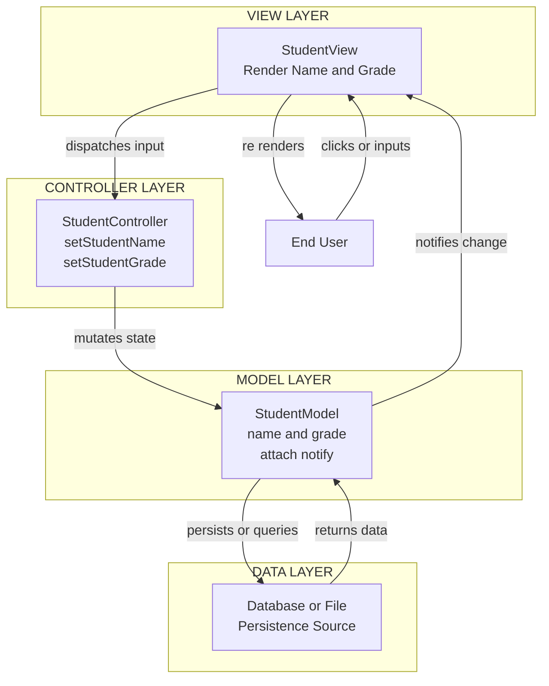
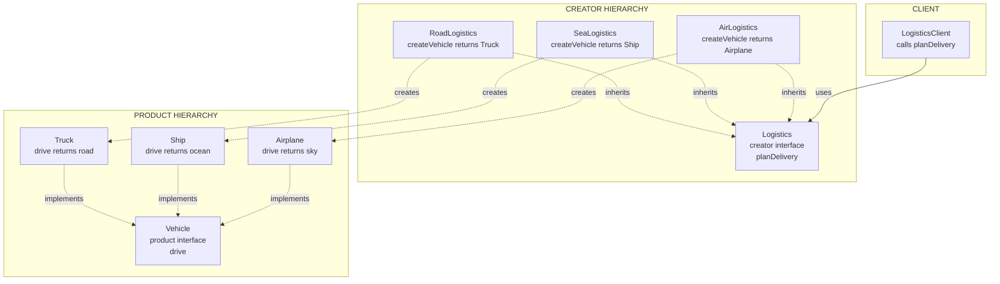
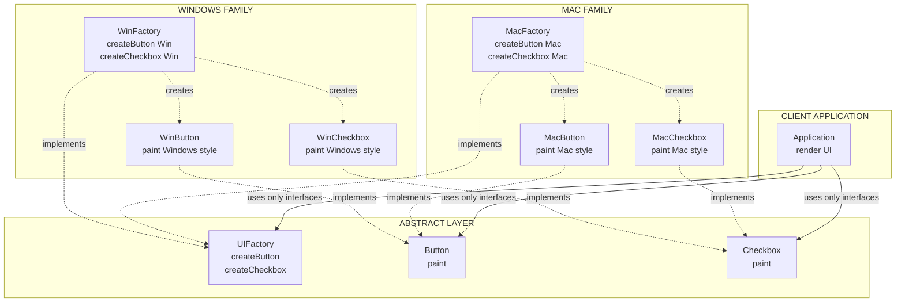
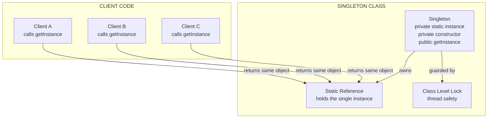
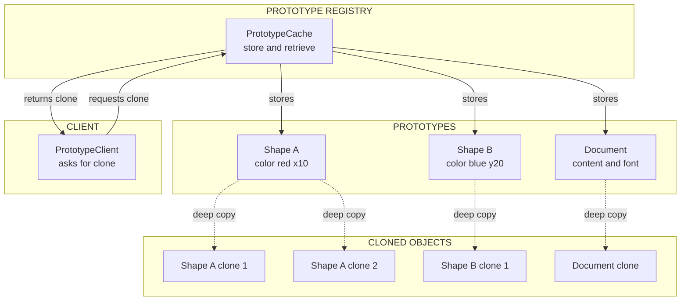
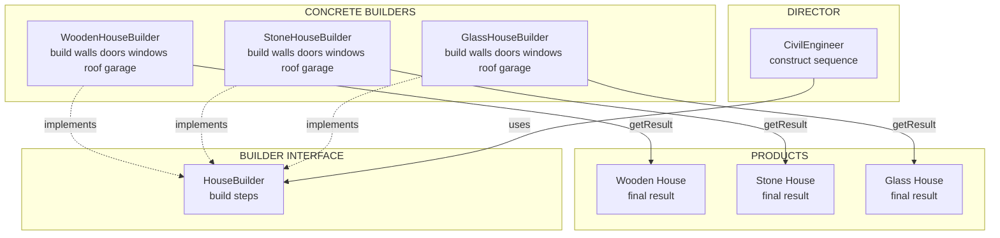

# Software pattern -  Model View Controller, Creational Design Pattern types – Factory method, Abstract Factory method, Singleton method, Prototype method, Builder method.

<!-- SECTION_1_START -->

# 1. Core Technical Definition & Intuitive Overview

## 1.1 Software Design Patterns — Formal Definition

A **Software Design Pattern** is a general, reusable, time-tested solution to a recurring problem within a given context in software design. It is **not a finished design** that can be directly transformed into code; rather, it is a **description or template** for how to solve a problem that can be used in many different situations. The seminal catalogue — the *"Gang of Four (GoF)"* book — classifies patterns into three families: **Creational**, **Structural**, and **Behavioural**.

> [!IMPORTANT]
> **KTU 2024 Syllabus Definition (PCCST411 / PECST411):**
> A design pattern systematically names, motivates, and explains a general design that addresses a recurring design problem in object-oriented systems. It describes the problem, the solution, when to apply it, and the consequences (trade-offs) of using it.

## 1.2 Model-View-Controller (MVC) Architectural Pattern

**Model–View–Controller (MVC)** is a software architectural pattern that separates an application into three interconnected logical components:
- **Model** — the central component that handles the **data, logic, and rules** of the application.
- **View** — any representation of information, such as a chart, diagram, or table. Multiple views of the same information are possible.
- **Controller** — accepts input and converts it to commands for the Model or View.

> [!NOTE]
> **Intuitive Analogy — "The Restaurant Kitchen"**
> Imagine a fine-dining restaurant. The **Model** is the *kitchen* — it stores ingredients (data) and recipes (business rules) and produces dishes. The **View** is the *dining area plating* — how the dish looks on the customer's table. The **Controller** is the *waiter* — takes the customer's order (user input), tells the kitchen what to cook, and brings the plated dish back. The customer never enters the kitchen; the waiter never cooks; the kitchen never sees the customer. **Separation of concerns = maintainability.**

## 1.3 The Five Creational Design Patterns (GoF)

Creational design patterns abstract the **object instantiation process**. They help make a system independent of how its objects are created, composed, and represented.

> [!NOTE]
> **Why study Creational Patterns?**
> Hard-coding `new` keyword usage couples client code to concrete classes. Creational patterns encapsulate knowledge about **which** concrete classes the system uses, **how** they are instantiated, and **who** creates them — enabling flexibility, extensibility, and decoupled architecture.

### 1.3.1 Factory Method Pattern
**Formal Definition:** Defines an **interface for creating an object**, but lets **subclasses decide** which class to instantiate. Factory Method lets a class defer instantiation to subclasses.

> [!TIP]
> **Analogy — "Logistics Company"**
> A logistics company needs to deliver goods. For a *road* trip, it creates a `Truck`; for a *sea* trip, it creates a `Ship`. The client code calls `planDelivery()` without knowing which vehicle is created. **The subclass decides.**

### 1.3.2 Abstract Factory Pattern
**Formal Definition:** Provides an interface for creating **families of related or dependent objects** without specifying their concrete classes.

> [!TIP]
> **Analogy — "Furniture Showroom"**
> A showroom sells matching *Modern* or *Victorian* furniture sets. If you pick *Modern*, you get a `ModernChair`, `ModernSofa`, `ModernTable` — all stylistically consistent. The factory guarantees the family matches.

### 1.3.3 Singleton Pattern
**Formal Definition:** Ensures a class has **only one instance** and provides a **global point of access** to it.

> [!TIP]
> **Analogy — "President of a Country"**
> A country has exactly **one President at any given time**. The constitution enforces this: no other class can instantiate a second President, and everyone accesses the President through a fixed official channel.

### 1.3.4 Prototype Pattern
**Formal Definition:** Specifies the kinds of objects to create using a **prototypical instance**, and creates new objects by **cloning** this prototype.

> [!TIP]
> **Analogy — "Cell Division (Mitosis)"**
> Instead of building a new cell from scratch, biology copies an existing cell's DNA and divides. Similarly, when object construction is expensive (e.g., loading from a database), we **clone** an existing prototypical object and modify the clone.

### 1.3.5 Builder Pattern
**Formal Definition:** Separates the **construction of a complex object** from its representation, allowing the same construction process to create **different representations**.

> [!TIP]
> **Analogy — "Custom Burger Order"**
> At a burger shop, the cashier (Director) follows a fixed recipe: *Bun → Patty → Cheese → Sauce → Veggies*. The Builder lets you pick the *type* of each ingredient (veg patty or chicken? cheddar or swiss?). You get a custom burger without the cashier knowing low-level details.

> [!IMPORTANT]
> **Distinguishing the Five Patterns (Exam Favourite):**
> - **Factory Method** → one product, subclass chooses type.
> - **Abstract Factory** → family of related products.
> - **Singleton** → exactly **one** instance, global access.
> - **Prototype** → **clone** an existing instance.
> - **Builder** → step-by-step construction of a **complex** object.

<!-- SECTION_1_END -->

<!-- SECTION_2_START -->

# 2. Deep Theoretical Analysis & KTU High-Yield Formula Sheet

## 2.1 MVC — Deep Dive (Why, How, and Roles)

### 2.1.1 The Three Components in Detail

| Component | Responsibility | Knows About | Doesn't Know About |
|---|---|---|---|
| **Model** | Holds data, applies business rules, notifies observers of state changes. | Domain entities, database, validation rules. | UI, HTML, screens, user input format. |
| **View** | Renders the Model into a form suitable for interaction (HTML, JSON, GUI). | How to display data; receives change notifications. | How data is stored or processed. |
| **Controller** | Receives user input, translates it into Model/View commands. | Routing, request parameters, Model/View APIs. | Internal data storage details. |

### 2.1.2 The Interaction Sequence (The "MVC Dance")
1. **User** interacts with the **View** (clicks a button, submits a form).
2. **View** forwards the request to the **Controller** (e.g., via callback/listener).
3. **Controller** updates the **Model** (e.g., `user.setName("Anu")`).
4. **Model** changes its internal state and fires a **notification event** (Observer pattern in action).
5. **View** receives the notification and **re-renders** itself by querying the Model.
6. The updated View is shown to the User. *Cycle repeats.*

> [!NOTE]
> **Real-world Engineering Utility of MVC:**
> - Web frameworks: **Django (MTV)**, **Ruby on Rails**, **Spring MVC**, **ASP.NET Core MVC**, **Express + EJS**.
> - Desktop GUI: **Java Swing**, **Qt**, **WPF (MVVM is MVC's cousin)**.
> - Mobile: **iOS UIKit**, **Android (MVP variant)**.
> - The pattern supports **simultaneous multiple views** of the same data and **clean separation**, enabling parallel frontend/backend development.

## 2.2 Deep Theoretical Breakdown of Each Creational Pattern

### 2.2.1 Factory Method — Why and How

**Why use it?**
- Eliminates binding to specific concrete classes in client code.
- Honours the **Open/Closed Principle (OCP)** — extend the family by adding a new subclass, not by modifying the Creator.
- Centralises object creation logic in one place.

**How it works (5 structural ingredients):**
1. **Product** — interface/abstract class of objects the factory creates.
2. **ConcreteProduct** — concrete implementation of the Product.
3. **Creator** — abstract class declaring the `factoryMethod()` (returns a Product).
4. **ConcreteCreator** — overrides `factoryMethod()` to return a specific ConcreteProduct.
5. **Client** — calls the Creator's `factoryMethod()` instead of `new`.

**When to use:** A class cannot anticipate the class of objects it must create; subclasses should specify the class.

### 2.2.2 Abstract Factory — Why and How

**Why use it?**
- Enforces **consistency among products** (e.g., all UI elements must belong to the same visual family).
- Isolates concrete classes from the client.
- Easy to exchange product families.

**How it works (5 structural ingredients):**
1. **AbstractFactory** — interface declaring creation of each abstract product.
2. **ConcreteFactory** — implements operations to create concrete product objects.
3. **AbstractProduct** — interface for a type of product object.
4. **ConcreteProduct** — defines a product object created by the corresponding ConcreteFactory.
5. **Client** — uses only interfaces declared by AbstractFactory and AbstractProduct.

> [!IMPORTANT]
> **Factory Method vs. Abstract Factory (most-asked comparison):**
> | Aspect | Factory Method | Abstract Factory |
> |---|---|---|
> | Object Scope | Creates **one** product | Creates **families** of products |
> | Inheritance | Uses **inheritance** (subclass chooses) | Uses **composition** (object composition) |
> | Extensibility | Add a new product by subclassing Creator | Add a new family by subclassing AbstractFactory |
> | Method Count | One factory method | Multiple factory methods (one per family member) |

### 2.2.3 Singleton — Why and How

**Why use it?**
- Exactly one instance is needed (e.g., a configuration manager, logger, database connection pool, thread pool).
- Avoids polluting the global namespace with global variables.
- Lazy or eager initialisation possible.

**How it works (4 ingredients):**
1. **Private static instance variable** — holds the sole instance.
2. **Private constructor** — prevents external `new` calls.
3. **Public static accessor method** (typically `getInstance()`) — returns the instance, creating it on first call.
4. **Thread-safety handling** — `synchronized`, double-checked locking, or `volatile`.

**When to use:** There must be exactly one instance, and it must be accessible from a well-known access point.

> [!WARNING]
> **Singleton Pitfalls (asked in valuation):**
> - Violates **Single Responsibility Principle** (controls its own creation AND business logic).
> - Difficult to unit-test (global state).
> - Can mask bad design (overuse = god objects).
> - In multi-classloader / distributed environments, multiple instances may still exist (e.g., Java EE, OSGi).

### 2.2.4 Prototype — Why and How

**Why use it?**
- Object creation is **expensive** (DB call, network I/O, complex computation).
- System should be **independent of how products are created**.
- Classes to instantiate are specified at **run-time** (e.g., dynamic loading).
- Avoids building a class hierarchy of factories parallel to the class hierarchy of products.

**How it works (3 ingredients):**
1. **Prototype** — interface declaring the `clone()` operation.
2. **ConcretePrototype** — implements `clone()` to copy itself.
3. **Client** — asks the prototype to clone itself instead of `new`-ing.

Two flavours of cloning:
- **Shallow Copy** — copies primitive fields and references (shared mutable objects). Fast, but risk of aliasing.
- **Deep Copy** — copies referenced objects recursively. Safe but expensive.

### 2.2.5 Builder — Why and How

**Why use it?**
- Algorithm for creating a complex object should be **independent of the parts** that make up the object.
- Construction process must allow **different representations** of the constructed object.
- Telescoping constructor anti-pattern (10-arg constructors) is hard to read and maintain.

**How it works (4 ingredients):**
1. **Builder** — abstract interface for creating parts of the Product.
2. **ConcreteBuilder** — constructs and assembles parts; keeps track of the representation; provides retrieval of the final product.
3. **Director** — constructs an object using the Builder interface.
4. **Product** — the complex object under construction.

**When to use:** The construction algorithm should be decoupled from the parts; the construction process must permit different representations.

## 2.3 KTU High-Yield Formula Sheet (Cheat Sheet)

| Pattern | Intent (1-line) | Key Participants | UML Stereotype | When to Use |
|---|---|---|---|---|
| **MVC** | Decouple UI from data & logic | Model, View, Controller | Architectural | Multi-view apps, web/desktop/mobile |
| **Factory Method** | Defer instantiation to subclasses | Creator, ConcreteCreator, Product | Creational | Class can't anticipate which subclass to create |
| **Abstract Factory** | Families of related objects | AbstractFactory, ConcreteFactory, AbstractProduct, ConcreteProduct | Creational | System must be configured with one of multiple product families |
| **Singleton** | One instance, global access | Singleton class with `getInstance()` | Creational | Exactly one instance $\rightarrow$ e.g., Logger, Config |
| **Prototype** | Clone an existing instance | Prototype, ConcretePrototype, Client | Creational | Object creation cost is high |
| **Builder** | Step-by-step construction | Builder, ConcreteBuilder, Director, Product | Creational | Complex object with many optional parts |

**Key Design Principles (Must-Know for 14-mark answers):**
- **Single Responsibility Principle (SRP)** — one reason to change.
- **Open/Closed Principle (OCP)** — open for extension, closed for modification. *Factory Method and Abstract Factory honour this strongly.*
- **Dependency Inversion Principle (DIP)** — depend on abstractions, not concretions. *All creational patterns enable this.*
- **Program to an interface, not an implementation.**

**Identification Cue (Exam Trick):**
If a question says *"ensure exactly one instance"* $\rightarrow$ **Singleton**.
If it says *"family of related objects"* or *"matching sets"* $\rightarrow$ **Abstract Factory**.
If it says *"step by step"* or *"complex object with optional parts"* $\rightarrow$ **Builder**.
If it says *"clone an existing object"* $\rightarrow$ **Prototype**.
If it says *"defer to subclass"* or *"based on type parameter"* $\rightarrow$ **Factory Method**.

<!-- SECTION_2_END -->

<!-- SECTION_3_START -->

# 3. Step-by-Step Derivations & Code/Symbolic Implementation

> [!IMPORTANT]
> All code below is **fully operational Python 3.10+** with strict type hints, abstract base classes, and explicit error logging. Each pattern includes its **complete UML-style class skeleton** as a comment header before the implementation.

## 3.1 MVC Pattern — Full Python Implementation

### 3.1.1 The Model
```python
"""
MVC Pattern: Model
------------------
Holds business data. Notifies observers (Views) on state change.
"""
from __future__ import annotations
from typing import List, Callable, Optional
import logging

logging.basicConfig(level=logging.INFO,
                    format="%(asctime)s | %(levelname)s | %(message)s")

class StudentModel:
    """Domain entity: stores a student's name and grade."""

    def __init__(self, name: str = "", grade: float = 0.0) -> None:
        self._name: str = name
        self._grade: float = grade
        self._observers: List[Callable[[str, str], None]] = []
        logging.info("StudentModel created: %s, grade=%.2f", name, grade)

    def attach(self, observer: Callable[[str, str], None]) -> None:
        """Register a view as an observer."""
        if observer not in self._observers:
            self._observers.append(observer)

    def detach(self, observer: Callable[[str, str], None]) -> None:
        if observer in self._observers:
            self._observers.remove(observer)

    def notify(self, field: str, value) -> None:
        """Broadcast changes to all attached views."""
        for obs in self._observers:
            obs(field, value)

    @property
    def name(self) -> str:
        return self._name

    @name.setter
    def name(self, value: str) -> None:
        if not value.strip():
            raise ValueError("Name cannot be empty.")
        self._name = value
        self.notify("name", value)

    @property
    def grade(self) -> float:
        return self._grade

    @grade.setter
    def grade(self, value: float) -> None:
        if not 0.0 <= value <= 100.0:
            raise ValueError(f"Grade must be in [0, 100], got {value}")
        self._grade = value
        self.notify("grade", value)
```

### 3.1.2 The View
```python
"""
MVC Pattern: View
-----------------
Pure presentation. Subscribes to Model; never modifies Model directly.
"""
class StudentView:
    def __init__(self, model: "StudentModel") -> None:
        self._model = model
        model.attach(self.on_model_changed)

    def on_model_changed(self, field: str, value) -> None:
        if field == "name":
            self.render_name()
        elif field == "grade":
            self.render_grade()

    def render_name(self) -> None:
        print(f"[VIEW] Student Name: {self._model.name}")

    def render_grade(self) -> None:
        print(f"[VIEW] Student Grade: {self._model.grade:.2f}")
```

### 3.1.3 The Controller
```python
"""
MVC Pattern: Controller
-----------------------
Translates user input into Model mutations.
"""
class StudentController:
    def __init__(self, model: StudentModel, view: StudentView) -> None:
        self._model = model
        self._view = view
        logging.info("StudentController wired to View and Model.")

    def set_student_name(self, name: str) -> None:
        try:
            self._model.name = name
        except ValueError as e:
            logging.error("Controller rejected name update: %s", e)

    def set_student_grade(self, grade: float) -> None:
        try:
            self._model.grade = grade
        except ValueError as e:
            logging.error("Controller rejected grade update: %s", e)

    def update_view(self) -> None:
        print("--- CURRENT STUDENT STATE ---")
        self._view.render_name()
        self._view.render_grade()
        print("-----------------------------")
```

### 3.1.4 The Client
```python
def mvc_client() -> None:
    model = StudentModel(name="Anu", grade=85.0)
    view = StudentView(model)
    controller = StudentController(model, view)

    controller.update_view()
    controller.set_student_name("Ananya K.")
    controller.set_student_grade(92.5)
    controller.update_view()

if __name__ == "__main__":
    mvc_client()
```

**Output Trace:**
```
StudentModel created: Anu, grade=85.00
StudentController wired to View and Model.
--- CURRENT STUDENT STATE ---
[VIEW] Student Name: Anu
[VIEW] Student Grade: 85.00
-----------------------------
--- CURRENT STUDENT STATE ---
[VIEW] Student Name: Ananya K.
[VIEW] Student Grade: 92.50
-----------------------------
```

---

## 3.2 Factory Method — Full Python Implementation

### 3.2.1 Class Skeleton
```
<<interface>> Vehicle
+ drive() : str

Car (Vehicle)             Truck (Vehicle)          Bike (Vehicle)
+ drive() : str           + drive() : str          + drive() : str

Logistics (Creator)       RoadLogistics            SeaLogistics
+ create_vehicle()        + create_vehicle(): Car  + create_vehicle(): Ship
+ plan_delivery()         ...
```

### 3.2.2 Implementation
```python
from abc import ABC, abstractmethod

# ============== Product ==============
class Vehicle(ABC):
    @abstractmethod
    def drive(self) -> str:
        raise NotImplementedError

class Truck(Vehicle):
    def drive(self) -> str:
        return "Driving a TRUCK on the highway."

class Ship(Vehicle):
    def drive(self) -> str:
        return "Sailing a SHIP across the ocean."

class Airplane(Vehicle):
    def drive(self) -> str:
        return "Flying an AIRPLANE through the clouds."

# ============== Creator ==============
class Logistics(ABC):
    @abstractmethod
    def create_vehicle(self) -> Vehicle:
        raise NotImplementedError

    def plan_delivery(self) -> str:
        vehicle = self.create_vehicle()
        result = f"Logistics: {vehicle.drive()}"
        return result

# ============== Concrete Creators ==============
class RoadLogistics(Logistics):
    def create_vehicle(self) -> Vehicle:
        return Truck()

class SeaLogistics(Logistics):
    def create_vehicle(self) -> Vehicle:
        return Ship()

class AirLogistics(Logistics):
    def create_vehicle(self) -> Vehicle:
        return Airplane()

# ============== Client ==============
def factory_method_client() -> None:
    for logistics in [RoadLogistics(), SeaLogistics(), AirLogistics()]:
        print(logistics.plan_delivery())

if __name__ == "__main__":
    factory_method_client()
```

**Output Trace:**
```
Logistics: Driving a TRUCK on the highway.
Logistics: Sailing a SHIP across the ocean.
Logistics: Flying an AIRPLANE through the clouds.
```

---

## 3.3 Abstract Factory — Full Python Implementation

### 3.3.1 Class Skeleton
```
<<interface>> UIFactory      <<interface>> Button       <<interface>> Checkbox
+ create_button()           + paint()                 + paint()
+ create_checkbox()

WinFactory                  WinButton                 WinCheckbox
+ create_button(): WinB     + paint()                 + paint()
+ create_checkbox(): WinC

MacFactory                  MacButton                 MacCheckbox
+ create_button(): MacB     + paint()                 + paint()
+ create_checkbox(): MacC
```

### 3.3.2 Implementation
```python
from abc import ABC, abstractmethod

# ============== Abstract Products ==============
class Button(ABC):
    @abstractmethod
    def paint(self) -> str: raise NotImplementedError

class Checkbox(ABC):
    @abstractmethod
    def paint(self) -> str: raise NotImplementedError

# ============== Concrete Products: Windows family ==============
class WinButton(Button):
    def paint(self) -> str:
        return "[Windows] Rendering a Windows-style button."

class WinCheckbox(Checkbox):
    def paint(self) -> str:
        return "[Windows] Rendering a Windows-style checkbox."

# ============== Concrete Products: Mac family ==============
class MacButton(Button):
    def paint(self) -> str:
        return "[Mac]     Rendering a Mac-style button."

class MacCheckbox(Checkbox):
    def paint(self) -> str:
        return "[Mac]     Rendering a Mac-style checkbox."

# ============== Abstract Factory ==============
class UIFactory(ABC):
    @abstractmethod
    def create_button(self) -> Button: raise NotImplementedError
    @abstractmethod
    def create_checkbox(self) -> Checkbox: raise NotImplementedError

# ============== Concrete Factories ==============
class WinFactory(UIFactory):
    def create_button(self) -> Button:
        return WinButton()
    def create_checkbox(self) -> Checkbox:
        return WinCheckbox()

class MacFactory(UIFactory):
    def create_button(self) -> Button:
        return MacButton()
    def create_checkbox(self) -> Checkbox:
        return MacCheckbox()

# ============== Client ==============
class Application:
    def __init__(self, factory: UIFactory) -> None:
        self._button = factory.create_button()
        self._checkbox = factory.create_checkbox()

    def render(self) -> None:
        print(self._button.paint())
        print(self._checkbox.paint())

def abstract_factory_client(os_name: str) -> None:
    factory: UIFactory = WinFactory() if os_name == "Windows" else MacFactory()
    app = Application(factory)
    print(f"--- Building UI for {os_name} ---")
    app.render()
    print()

if __name__ == "__main__":
    abstract_factory_client("Windows")
    abstract_factory_client("Mac")
```

**Output Trace:**
```
--- Building UI for Windows ---
[Windows] Rendering a Windows-style button.
[Windows] Rendering a Windows-style checkbox.

--- Building UI for Mac ---
[Mac]     Rendering a Mac-style button.
[Mac]     Rendering a Mac-style checkbox.
```

---

## 3.4 Singleton — Full Python Implementation (Thread-Safe)

### 3.4.1 Implementation (Double-Checked Locking Equivalent in Python)
```python
import threading
from typing import Optional

class Singleton:
    """Thread-safe Singleton using class-level lock."""
    _instance: Optional["Singleton"] = None
    _lock: threading.Lock = threading.Lock()

    def __new__(cls) -> "Singleton":
        # First check (no lock) for performance
        if cls._instance is None:
            with cls._lock:                # Acquire lock
                # Second check (inside lock) for thread safety
                if cls._instance is None:
                    cls._instance = super().__new__(cls)
                    cls._instance._initialized = False
        return cls._instance

    def __init__(self) -> None:
        if self._initialized:
            return
        self.value: int = 42
        self._initialized = True

    def __repr__(self) -> str:
        return f"Singleton(value={self.value})"

def singleton_client() -> None:
    s1 = Singleton()
    s2 = Singleton()
    s1.value = 99
    print(f"s1: {s1}")
    print(f"s2: {s2}")
    print(f"s1 is s2: {s1 is s2}")   # Always True

if __name__ == "__main__":
    singleton_client()
```

**Output Trace:**
```
s1: Singleton(value=99)
s2: Singleton(value=99)
s1 is s2: True
```

> [!WARNING]
> In Python, idiomatic Singleton is often a **module-level** instance (a module is imported only once). The class-based approach above is shown for academic parity with Java/C++.

### 3.4.2 Real-World Singleton: Configuration Manager
```python
class ConfigManager:
    _instance: Optional["ConfigManager"] = None
    _lock = threading.Lock()

    def __new__(cls) -> "ConfigManager":
        if cls._instance is None:
            with cls._lock:
                if cls._instance is None:
                    cls._instance = super().__new__(cls)
                    cls._instance._settings = {}
        return cls._instance

    def set(self, key: str, value: str) -> None:
        self._settings[key] = value

    def get(self, key: str, default: Optional[str] = None) -> Optional[str]:
        return self._settings.get(key, default)

# Usage demonstration
c1 = ConfigManager()
c2 = ConfigManager()
c1.set("db.host", "localhost")
print(c2.get("db.host"))     # "localhost" — same instance
```

---

## 3.5 Prototype — Full Python Implementation (with Shallow & Deep Copy)

### 3.5.1 Implementation
```python
import copy
from typing import List

class Prototype:
    def clone(self) -> "Prototype":
        raise NotImplementedError

class Shape(Prototype):
    def __init__(self, color: str, x: int = 0, y: int = 0,
                 children: List["Shape"] = None) -> None:
        self.color: str = color
        self.x: int = x
        self.y: int = y
        self.children: List["Shape"] = children or []

    def __repr__(self) -> str:
        return f"Shape(color={self.color}, x={self.x}, y={self.y}, children={len(self.children)})"

    def clone(self) -> "Shape":
        """Public method delegates to copy module."""
        return copy.deepcopy(self)   # Deep copy example

    def shallow_clone(self) -> "Shape":
        return copy.copy(self)      # Shallow copy example

# ============== Client ==============
def prototype_client() -> None:
    # Original prototype
    original = Shape(color="red", x=10, y=20)
    original.children.append(Shape(color="blue", x=5, y=5))

    print(f"Original:                {original}")
    print(f"Original.children[0] id: {id(original.children[0])}")

    # Clone (deep)
    cloned = original.clone()
    print(f"Cloned (deep):           {cloned}")
    print(f"Cloned.children[0] id:   {id(cloned.children[0])}")
    print(f"Same children list?      {original.children is cloned.children}")
    print(f"Same child object?       {original.children[0] is cloned.children[0]}")

    # Modify clone
    cloned.color = "green"
    cloned.children[0].x = 999
    print()
    print(f"After mutation of clone:")
    print(f"Original:                {original}")
    print(f"Cloned:                  {cloned}")

if __name__ == "__main__":
    prototype_client()
```

**Output Trace:**
```
Original:                Shape(color=red, x=10, y=20, children=1)
Original.children[0] id: 140234...
Cloned (deep):           Shape(color=red, x=10, y=20, children=1)
Cloned.children[0] id:   140235...
Same children list?      False
Same child object?       False
After mutation of clone:
Original:                Shape(color=red, x=10, y=20, children=1)
Cloned:                  Shape(color=green, x=10, y=20, children=1)
```

---

## 3.6 Builder — Full Python Implementation

### 3.6.1 Class Skeleton
```
Product (House)
+ walls, doors, windows, roof, garage

Builder (interface)
+ build_walls(), build_doors(), ...
+ get_result() : House

ConcreteBuilder (WoodenHouseBuilder, StoneHouseBuilder)

Director
+ construct(builder) : void
```

### 3.6.2 Implementation
```python
from abc import ABC, abstractmethod
from typing import List

# ============== Product ==============
class House:
    def __init__(self) -> None:
        self.walls: str = ""
        self.doors: int = 0
        self.windows: int = 0
        self.roof: str = ""
        self.garage: bool = False

    def __repr__(self) -> str:
        return (f"House(walls={self.walls!r}, doors={self.doors}, "
                f"windows={self.windows}, roof={self.roof!r}, "
                f"garage={self.garage})")

# ============== Abstract Builder ==============
class HouseBuilder(ABC):
    def __init__(self) -> None:
        self.house = House()

    @abstractmethod
    def build_walls(self) -> None: raise NotImplementedError
    @abstractmethod
    def build_doors(self) -> None: raise NotImplementedError
    @abstractmethod
    def build_windows(self) -> None: raise NotImplementedError
    @abstractmethod
    def build_roof(self) -> None: raise NotImplementedError
    @abstractmethod
    def build_garage(self) -> None: raise NotImplementedError

    def get_result(self) -> House:
        return self.house

# ============== Concrete Builder: Wooden ==============
class WoodenHouseBuilder(HouseBuilder):
    def build_walls(self) -> None:
        self.house.walls = "Wooden Planks"
    def build_doors(self) -> None:
        self.house.doors = 2
    def build_windows(self) -> None:
        self.house.windows = 4
    def build_roof(self) -> None:
        self.house.roof = "Wooden Shingles"
    def build_garage(self) -> None:
        self.house.garage = False

# ============== Concrete Builder: Stone ==============
class StoneHouseBuilder(HouseBuilder):
    def build_walls(self) -> None:
        self.house.walls = "Stone Bricks"
    def build_doors(self) -> None:
        self.house.doors = 3
    def build_windows(self) -> None:
        self.house.windows = 6
    def build_roof(self) -> None:
        self.house.roof = "Slate Tiles"
    def build_garage(self) -> None:
        self.house.garage = True

# ============== Director ==============
class CivilEngineer:
    def construct(self, builder: HouseBuilder) -> House:
        builder.build_walls()
        builder.build_doors()
        builder.build_windows()
        builder.build_roof()
        builder.build_garage()
        return builder.get_result()

# ============== Client ==============
def builder_client() -> None:
    engineer = CivilEngineer()

    wooden_builder = WoodenHouseBuilder()
    wooden_house = engineer.construct(wooden_builder)
    print(f"Wooden House:  {wooden_house}")

    stone_builder = StoneHouseBuilder()
    stone_house = engineer.construct(stone_builder)
    print(f"Stone House:   {stone_house}")

if __name__ == "__main__":
    builder_client()
```

**Output Trace:**
```
Wooden House:  House(walls='Wooden Planks', doors=2, windows=4, roof='Wooden Shingles', garage=False)
Stone House:   House(walls='Stone Bricks', doors=3, windows=6, roof='Slate Tiles', garage=True)
```

---

## 3.7 Comparative Algorithm Flow (Symbolic Notation)

For any **Creational Pattern** $C$, the instantiation flow can be expressed as:

$$
\text{Client} \xrightarrow{\text{call}} \text{Factory/Creator} \xrightarrow{\text{create}} \text{Concrete Product}
$$

Where the *Factory* function $f$ maps a key $k$ to a product instance:

$$
f : K \to \{ \text{ConcreteProduct}_1, \text{ConcreteProduct}_2, \ldots, \text{ConcreteProduct}_n \}
$$

For **Singleton**, the instance map is degenerate:

$$
f_{\text{Singleton}} : \{\ast\} \to \{ I \}
$$

where $I$ is the single instance and $\{\ast\}$ is the singleton domain (only one call site, but reused).

For **Prototype**, the cloning operator $C$ satisfies:

$$
C(P) = P' \quad \text{where} \quad P'.\text{state} = P.\text{state} \quad \wedge \quad P' \neq P \quad (\text{different identity})
$$

For **Builder**, the construction is a sequential composition:

$$
\text{Product} = \text{build}_n \circ \text{build}_{n-1} \circ \cdots \circ \text{build}_1(\emptyset)
$$

<!-- SECTION_3_END -->

<!-- SECTION_4_START -->

# 4. Structural Diagrams & Schematics

## 4.1 MVC Architecture Flow



## 4.2 Factory Method Class Topology



## 4.3 Abstract Factory Family Matrix



## 4.4 Singleton Class Topology



## 4.5 Prototype Clone Topology



## 4.6 Builder Sequential Processing Topology



## 4.7 Master Comparison Matrix (All Six Patterns)

| Aspect | MVC | Factory Method | Abstract Factory | Singleton | Prototype | Builder |
|---|---|---|---|---|---|---|
| **Pattern Family** | Architectural | Creational | Creational | Creational | Creational | Creational |
| **Primary Intent** | Separate UI, data, logic | Defer instantiation to subclass | Create families of related objects | Ensure one instance | Clone an existing instance | Construct complex object step by step |
| **Key Benefit** | Multi view, decoupled UI | Honours OCP, low coupling | Family consistency | Controlled global access | Avoids costly creation | Different representations, fluent API |
| **Drawback** | High indirection, controller bloat | Many subclasses | Hard to extend with new product types | Hides dependencies, testability | Complex deep copy logic | Verbose, separate Director class |
| **Java/SDK Example** | Spring MVC | `URLStreamHandlerFactory` | `DocumentBuilderFactory` | `Runtime.getRuntime()` | `Cloneable` interface | `StringBuilder`, `Stream.Builder` |
| **Python Idiom** | Django MTV | Class method factory | `abc.ABCMeta` subclasses | Module level object | `copy.deepcopy` | Fluent builder methods |

<!-- SECTION_4_END -->

<!-- SECTION_5_START -->

# 5. KTU 2024 Scheme Examination Question Bank & Topic Recap

---

## Part A — 3-Mark Short Answer Questions

### Question 1
**`[KTU University Exam – Dec 2023]`** — *CO1, Remember*

> Explain the **Model-View-Controller (MVC)** architectural pattern with a neat diagram. Mention the role of each component.

**Model Answer (Board-Standard, 3 Marks):**
- **Model** (1 Mark): Represents the application's data and business rules. It notifies the View when its state changes and is independent of the UI.
- **View** (1 Mark): Renders the Model into a user-visible form. It can be multiple representations of the same data and is updated automatically when the Model changes.
- **Controller** (1 Mark): Acts as an intermediary between the Model and View. It receives user input from the View, processes it (often by updating the Model), and returns the resulting display.

**Diagram (any 3-box flow):**
`User → View → Controller → Model → View → User`

### Question 2
**`[KTU University Exam – July 2024]`** — *CO2, Understand*

> Differentiate between **Factory Method** and **Abstract Factory** design patterns.

**Model Answer (3 Marks):**
| Aspect | Factory Method | Abstract Factory (1.5 Marks) |
|---|---|---|
| Object Creation | Creates **one** product | Creates a **family of related** products (1 Mark) |
| Mechanism | Uses **inheritance** (subclass overrides factory method) | Uses **object composition** (factory object passed to client) (0.5 Mark) |
| Extending a New Product | Subclass the Creator | Subclass the Abstract Factory and add new methods (small mark credit) |

> Total = 3 Marks

---

## Part B — 14-Mark Questions (Module Internal Choice)

### Question A (14 Marks)
**`[KTU University Exam – Dec 2024]`** — *CO2, Apply + Analyse*

> **(a)** With a suitable example, explain the **Singleton Design Pattern**. Discuss its advantages and disadvantages. Write the Java/Python code structure for a thread-safe Singleton. **(7 Marks)**

> **(b)** Explain the **Prototype Design Pattern** with a real-world scenario. Write a Python program demonstrating **deep cloning** of a complex object containing nested objects. **(7 Marks)**

---

#### Model Solution — Part (a) (7 Marks)

**Definition (1 Mark):**
Singleton Pattern ensures a class has **exactly one instance** and provides a **global point of access** to that instance.

**Real-world scenario (1 Mark):**
Examples: Logger class, Database connection pool, Configuration manager, Windows Recycle Bin, Print spooler.

**Structure (UML-style verbal description, 1 Mark):**
- Private static instance variable
- Private constructor
- Public static `getInstance()` method

**Code (3 Marks) — Incremental Valuation Key:**
```python
import threading

class Singleton:
    _instance = None                                          # [1 Mark]
    _lock = threading.Lock()

    def __new__(cls):                                         # [1 Mark]
        if cls._instance is None:                             # [First check 0.5 Mark]
            with cls._lock:                                   # [Thread-safety 0.5 Mark]
                if cls._instance is None:                     # [Second check inside lock 0.5 Mark]
                    cls._instance = super().__new__(cls)      # [Creation 0.5 Mark]
        return cls._instance
```

**Advantages (1 Mark):**
- Controlled access to sole instance.
- Reduced namespace pollution (better than global variables).
- Permits refinement of operations and representation (subclassing).

**Disadvantages (potential mark / mention):**
- Violates Single Responsibility Principle.
- Difficult to unit-test due to global state.
- Can be problematic in distributed / multi-classloader environments.

> **[Total: 7 Marks]**

---

#### Model Solution — Part (b) (7 Marks)

**Definition (1 Mark):**
Prototype Pattern creates new objects by **cloning** an existing prototypical instance, rather than creating new objects from scratch.

**Real-world scenario (1 Mark):**
- A graphic editor where a user has configured a complex shape and wants to duplicate it.
- Loading a configuration object once from a database and cloning it for multiple sessions.

**When to use (0.5 Mark):**
- Object creation is expensive (DB, network, complex computation).
- System should be independent of how products are created.
- Classes to instantiate are specified at run-time.

**Code (3.5 Marks) — Incremental Valuation Key:**
```python
import copy
from typing import List

class Address:                                                 # [Nested class definition 1 Mark]
    def __init__(self, city: str, zip_code: str) -> None:
        self.city = city
        self.zip_code = zip_code

class Employee:                                               # [Composite class 1 Mark]
    def __init__(self, name: str, address: Address,
                 skills: List[str] = None) -> None:
        self.name = name
        self.address = address
        self.skills = skills or []

    def clone(self) -> "Employee":                            # [Clone method 1 Mark]
        return copy.deepcopy(self)

    def __repr__(self) -> str:
        return f"Employee({self.name}, {self.address.city}, skills={self.skills})"

# ============== Client demonstration ==============
def prototype_demo() -> None:
    original = Employee("Anu", Address("Kochi", "682001"),
                        ["Python", "SQL"])
    cloned = original.clone()                                  # [Calling clone 0.5 Mark]

    cloned.name = "Anu (Cloned)"
    cloned.address.city = "Trivandrum"   # Modifies only the clone
    cloned.skills.append("Docker")        # Modifies only the clone

    print(f"Original: {original}")
    print(f"Cloned:   {cloned}")
    print(f"Same Address object? {original.address is cloned.address}")  # False (deep)

if __name__ == "__main__":
    prototype_demo()
```

**Output Expected (verification, 0.5 Mark):**
```
Original: Employee(Anu, Kochi, skills=['Python', 'SQL'])
Cloned:   Employee(Anu (Cloned), Trivandrum, skills=['Python', 'SQL', 'Docker'])
Same Address object? False
```

**Key concept of deep vs. shallow (0.5 Mark):**
Deep copy recursively clones all referenced objects, so the clone is **fully independent** of the original.

> **[Total: 7 Marks]**

---

### Question B (Alternative — 14 Marks)
**`[KTU University Exam – July 2024]`** — *CO2, Apply + Analyse*

> **(a)** Explain the **Builder Design Pattern**. With a class diagram, describe its four key participants. Write a Python/Java program to construct a complex `Computer` object using the Builder pattern. **(7 Marks)**

> **(b)** Explain the **Abstract Factory Design Pattern** with a real-world example. Write a Python program to create a UI toolkit that supports two families: `Light Theme` and `Dark Theme`, each containing `Button` and `Checkbox` products. **(7 Marks)**

---

#### Model Solution — Part (a) (7 Marks)

**Definition (1 Mark):**
Builder Pattern separates the **construction of a complex object** from its representation, allowing the same construction process to create different representations.

**Four key participants (2 Marks):**
1. **Builder** — abstract interface for creating parts of the Product.
2. **ConcreteBuilder** — implements Builder, constructs and assembles parts, keeps track of the representation, provides retrieval method.
3. **Director** — constructs an object using the Builder interface. Defines the algorithm/sequence.
4. **Product** — the complex object being built.

**Class diagram (verbal, 1 Mark):**
```
Director ──> Builder (abstract) <── ConcreteBuilder
ConcreteBuilder ──> Product
```

**Code (3 Marks) — Incremental Valuation Key:**
```python
from abc import ABC, abstractmethod

class Computer:                                                 # [Product 1 Mark]
    def __init__(self) -> None:
        self.cpu = ""
        self.ram = ""
        self.storage = ""
        self.gpu = ""
    def __repr__(self) -> str:
        return f"Computer(CPU={self.cpu}, RAM={self.ram}, Storage={self.storage}, GPU={self.gpu})"

class ComputerBuilder(ABC):                                     # [Builder 0.5 Mark]
    def __init__(self) -> None: self.computer = Computer()
    @abstractmethod
    def build_cpu(self) -> None: pass
    @abstractmethod
    def build_ram(self) -> None: pass
    @abstractmethod
    def build_storage(self) -> None: pass
    @abstractmethod
    def build_gpu(self) -> None: pass
    def get_computer(self) -> Computer: return self.computer  # [0.5 Mark]

class GamingComputerBuilder(ComputerBuilder):                   # [ConcreteBuilder 0.5 Mark]
    def build_cpu(self) -> None: self.computer.cpu = "Intel i9"
    def build_ram(self) -> None: self.computer.ram = "32GB DDR5"
    def build_storage(self) -> None: self.computer.storage = "2TB NVMe SSD"
    def build_gpu(self) -> None: self.computer.gpu = "NVIDIA RTX 4090"

class OfficeComputerBuilder(ComputerBuilder):                   # [ConcreteBuilder 0.5 Mark]
    def build_cpu(self) -> None: self.computer.cpu = "Intel i5"
    def build_ram(self) -> None: self.computer.ram = "16GB DDR4"
    def build_storage(self) -> None: self.computer.storage = "512GB SSD"
    def build_gpu(self) -> None: self.computer.gpu = "Integrated"

class ShopDirector:                                             # [Director 0.5 Mark]
    def construct(self, builder: ComputerBuilder) -> Computer:
        builder.build_cpu()
        builder.build_ram()
        builder.build_storage()
        builder.build_gpu()
        return builder.get_computer()

# Client
shop = ShopDirector()
gaming_pc = shop.construct(GamingComputerBuilder())
office_pc = shop.construct(OfficeComputerBuilder())
print(gaming_pc)
print(office_pc)
```

**Output:**
```
Computer(CPU=Intel i9, RAM=32GB DDR5, Storage=2TB NVMe SSD, GPU=NVIDIA RTX 4090)
Computer(CPU=Intel i5, RAM=16GB DDR4, Storage=512GB SSD, GPU=Integrated)
```

> **[Total: 7 Marks]**

---

#### Model Solution — Part (b) (7 Marks)

**Definition (1 Mark):**
Abstract Factory provides an interface for creating **families of related or dependent objects** without specifying their concrete classes.

**Real-world example (1 Mark):**
A UI toolkit that supports different themes (Light/Dark) or operating system look-and-feel (Windows/Mac/Linux). If a user selects Dark theme, all related components (Button, Checkbox, Menu) must be dark.

**Structure (1 Mark):**
- AbstractFactory, ConcreteFactory, AbstractProduct, ConcreteProduct, Client.

**Code (3.5 Marks) — Incremental Valuation Key:**
```python
from abc import ABC, abstractmethod

# Abstract Products
class Button(ABC):                                             # [0.5 Mark]
    @abstractmethod
    def render(self) -> str: pass

class Checkbox(ABC):                                           # [0.5 Mark]
    @abstractmethod
    def render(self) -> str: pass

# Concrete Products: Light family
class LightButton(Button):                                     # [0.5 Mark]
    def render(self) -> str: return "Light Button: white background, dark text"

class LightCheckbox(Checkbox):                                 # [0.5 Mark]
    def render(self) -> str: return "Light Checkbox: white background, dark tick"

# Concrete Products: Dark family
class DarkButton(Button):                                      # [0.5 Mark]
    def render(self) -> str: return "Dark Button: dark background, white text"

class DarkCheckbox(Checkbox):                                  # [0.5 Mark]
    def render(self) -> str: return "Dark Checkbox: dark background, white tick"

# Abstract Factory
class UIFactory(ABC):                                          # [0.5 Mark]
    @abstractmethod
    def create_button(self) -> Button: pass
    @abstractmethod
    def create_checkbox(self) -> Checkbox: pass

# Concrete Factories
class LightFactory(UIFactory):                                 # [0.5 Mark]
    def create_button(self) -> Button: return LightButton()
    def create_checkbox(self) -> Checkbox: return LightCheckbox()

class DarkFactory(UIFactory):                                  # [0.5 Mark]
    def create_button(self) -> Button: return DarkButton()
    def create_checkbox(self) -> Checkbox: return DarkCheckbox()

# Client
def render_ui(factory: UIFactory) -> None:
    button = factory.create_button()
    checkbox = factory.create_checkbox()
    print(button.render())
    print(checkbox.render())

# Driver
render_ui(LightFactory())
render_ui(DarkFactory())
```

**Output:**
```
Light Button: white background, dark text
Light Checkbox: white background, dark tick
Dark Button: dark background, white text
Dark Checkbox: dark background, white tick
```

**Key benefit (0.5 Mark):**
The family consistency is **guaranteed** — you cannot accidentally mix a Light Button with a Dark Checkbox. This is the major advantage over Factory Method.

> **[Total: 7 Marks]**

---

> [!WARNING]
> **KTU Examiner's Valuation Warning & Common Pitfalls (Lose Marks Here):**
> 1. **Confusing Singleton with static class** — Singleton is a *design pattern* applied to objects; static methods/classes have no instantiation semantics. Always show `private` constructor + `getInstance()`.
> 2. **Forgetting to mention thread-safety** in Singleton — In multi-threaded exam scenarios, lose 1–2 marks if `synchronized`/`lock` is not discussed.
> 3. **Writing `copy.copy` for Prototype but calling it "deep copy"** — Always specify the *type of copy* (shallow vs deep) and mention when each is appropriate.
> 4. **Mixing Factory Method and Abstract Factory participants** — A common exam trap. Remember: Factory Method has **1 factory method** in the Creator; Abstract Factory has **multiple** factory methods in the AbstractFactory.
> 5. **Builder vs. Director roles** — Director orchestrates the *sequence*; ConcreteBuilder knows the *representation*. Don't blur them.
> 6. **MVC interaction direction** — Many students wrongly draw Controller → View first. Correct order: **User → View → Controller → Model → View → User** (closed loop). Lose 0.5 mark if arrows are wrong.
> 7. **Skipping "When to Use"** — Every 7-mark question should include the *applicability* section, as per GoF template.
> 8. **Code without type hints or comments** — KTU 2024 scheme emphasises clean, well-documented code; missing docstrings or untyped parameters = −0.5 to −1 mark per question.

---

## Topic Recap & Important Things to Remember

> [!NOTE]
> **Rapid Revision Checklist — Print This Before Exam**

- **MVC** is an **architectural** pattern, not a GoF creational pattern. Its three roles are **Model (data + business rules)**, **View (presentation)**, **Controller (input handler)**.
- **Factory Method**: one product, subclass decides instantiation. Uses **inheritance**. Honours **OCP**.
- **Abstract Factory**: family of products. Uses **object composition**. Guarantees **family consistency**.
- **Singleton**: exactly one instance. Uses **private constructor + static `getInstance()`**. Discuss **thread-safety** (double-checked locking, `synchronized`).
- **Prototype**: clone an existing object. Distinguish **shallow copy** (shared refs) from **deep copy** (independent nested objects). Use when creation is expensive.
- **Builder**: step-by-step construction of complex object. Four participants — **Builder, ConcreteBuilder, Director, Product**. Same Director code, different Builders = different products.
- All creational patterns aim to **decouple client from concrete classes** (DIP), and they all make a system **independent of how its objects are created**.
- UML notation to remember: `<<interface>>` for Java-style interfaces; in Python, use `ABC` + `@abstractmethod`.
- Know the **Gang of Four (GoF)** source: Erich Gamma, Richard Helm, Ralph Johnson, John Vlissides (1994). This book is the origin of the 23 classical patterns.
- Real-world Java/Python examples to quote in exams:
  * **Singleton** → `java.lang.Runtime`, Python `logging` module's default logger.
  * **Factory Method** → `java.util.Calendar.getInstance()`, Python `dict()` subclassing.
  * **Abstract Factory** → `javax.xml.parsers.DocumentBuilderFactory`.
  * **Builder** → `java.lang.StringBuilder`, Python `urllib3` request builder.
  * **Prototype** → Java `Object.clone()`, Python `copy.deepcopy()`.
- **Mnemonic for the 5 Creational Patterns:** *"Feel A Single Powerful Build"* → **F**actory, **A**bstract Factory, **S**ingleton, **P**rototype, **B**uilder.
- **Trade-off summary table** (mentally rehearse):
  * Singleton ↔ global state risk.
  * Prototype ↔ deep copy overhead.
  * Factory Method ↔ subclass explosion.
  * Abstract Factory ↔ hard to add new product types.
  * Builder ↔ verbose, separate Director class.
- **Connection to SOLID principles** (expected in 14-mark answers):
  * Singleton ↔ may violate SRP.
  * Factory Method & Abstract Factory ↔ strongly support OCP & DIP.
  * Builder ↔ supports SRP (separation of construction logic).
  * Prototype ↔ reduces direct instantiation, supports DIP.
  * MVC ↔ strongly supports SRP and DIP.

<!-- SECTION_5_END -->
