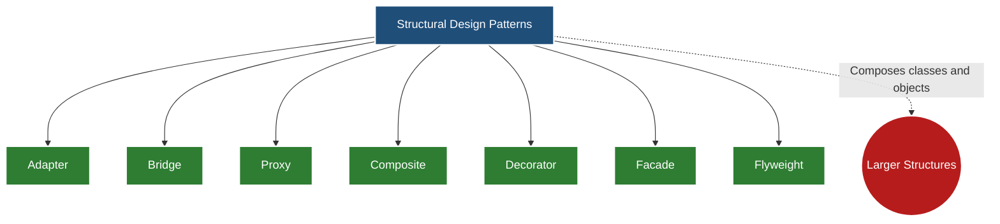
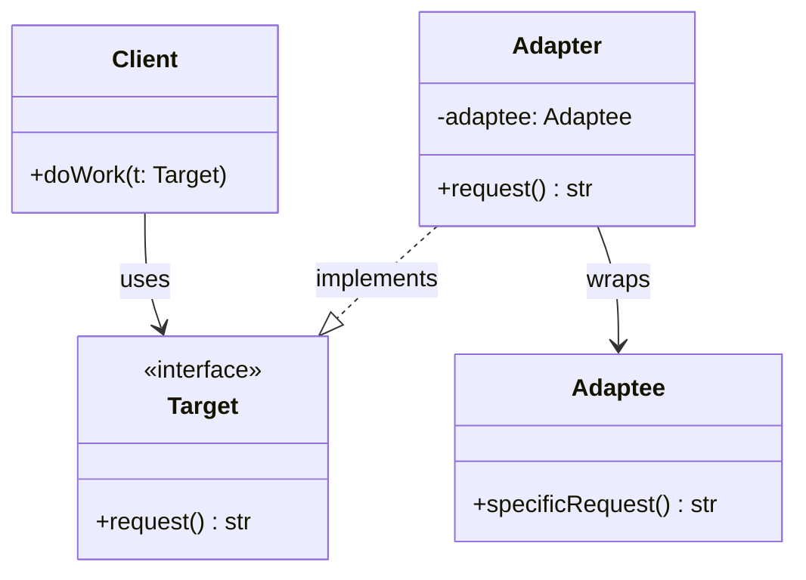
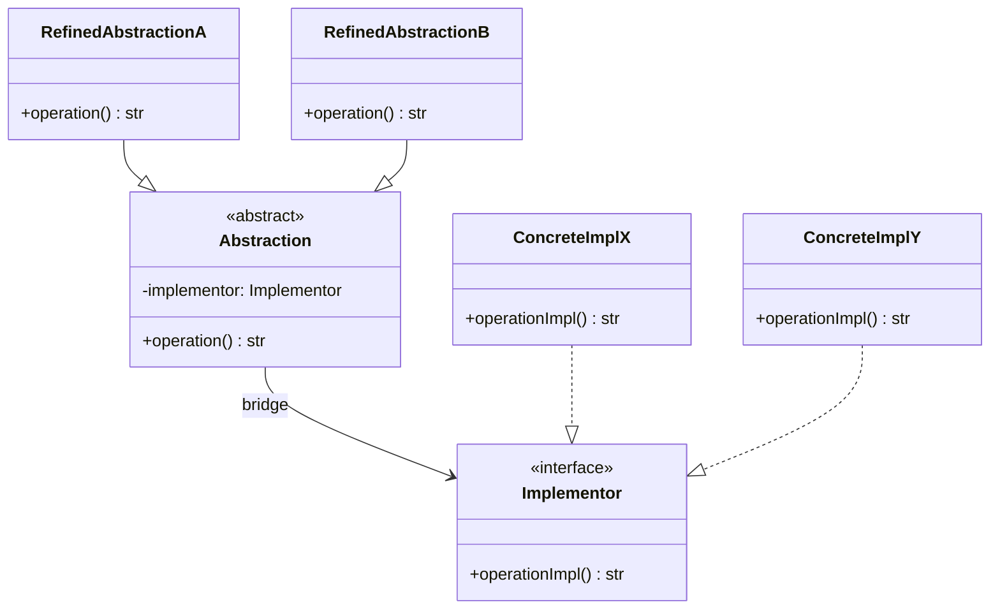
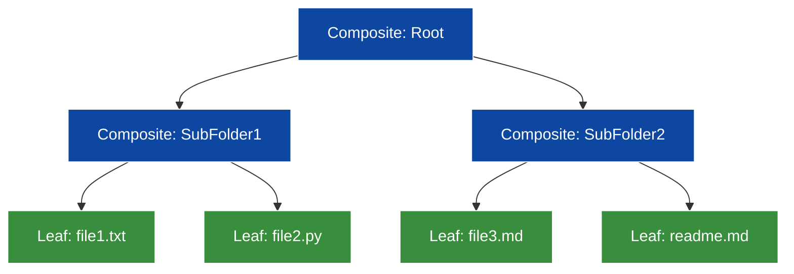
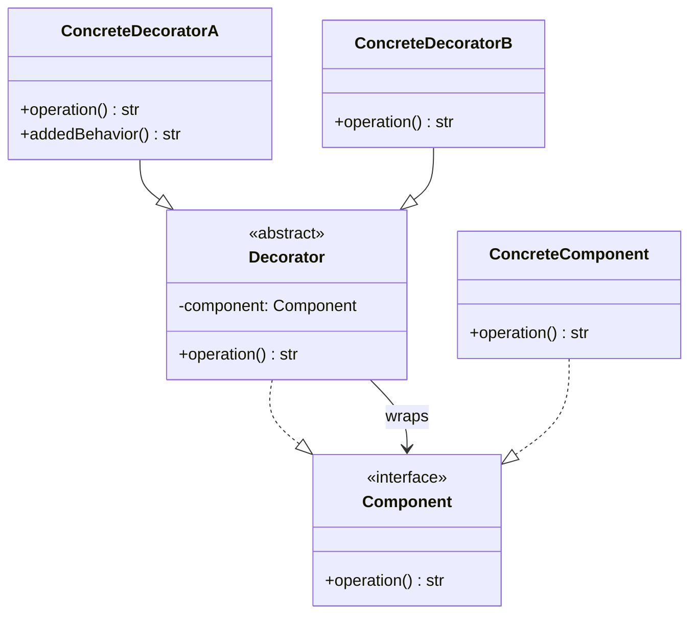
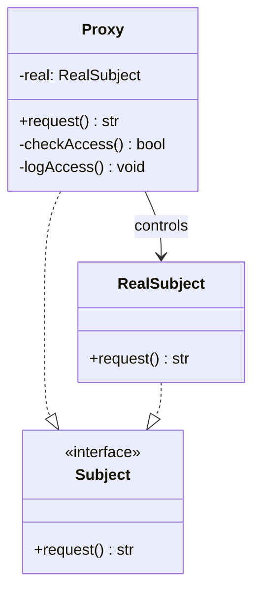
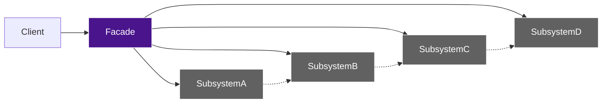
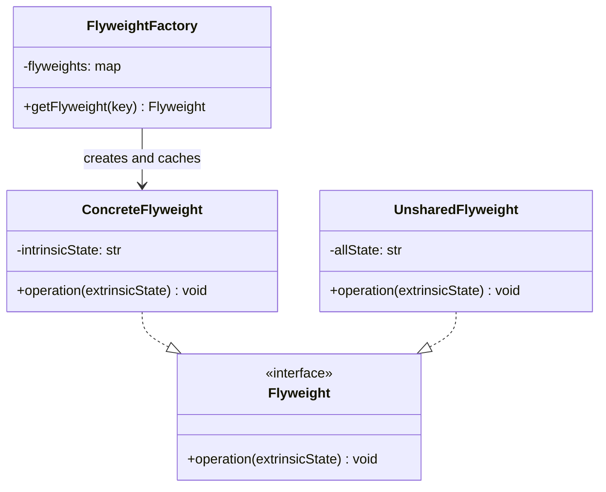

# Structural Design Pattern and its types – Adapter, Bridge, Proxy, Composite, Decorator, Façade, Flyweight.

<!-- SECTION_1_START -->

# Structural Design Patterns — Module Overview

## 1.1 Formal Academic Definition

> [!NOTE]
> **Structural Design Patterns** (Gang of Four — *Gamma, Helm, Johnson, Vlissides*, 1994) are a category of design patterns in object-oriented software engineering that **simplify the composition of classes and objects** by identifying efficient ways to realize relationships between entities. They are concerned with **how classes and objects are composed to form larger structures**, while keeping these structures **flexible, decoupled, and efficient** at runtime.

According to the **KTU 2024 Scheme (PECST411 — Software Engineering, Module 2)**, structural patterns are part of the *Gang-of-Four (GoF) catalog* and constitute **7 of the 23 classic patterns**. The module explicitly prescribes mastery of the following seven structural patterns: **Adapter, Bridge, Proxy, Composite, Decorator, Façade,** and **Flyweight**.

| # | Pattern | One-Line Intent (GoF) |
|---|---|---|
| 1 | **Adapter** | Convert the interface of a class into another interface clients expect. |
| 2 | **Bridge** | Decouple an abstraction from its implementation so that the two can vary independently. |
| 3 | **Proxy** | Provide a surrogate or placeholder for another object to control access to it. |
| 4 | **Composite** | Compose objects into tree structures to represent part–whole hierarchies. |
| 5 | **Decorator** | Attach additional responsibilities to an object dynamically. |
| 6 | **Façade** | Provide a unified interface to a set of interfaces in a subsystem. |
| 7 | **Flyweight** | Use sharing to support large numbers of fine-grained objects efficiently. |

## 1.2 Conceptual Analogy / Intuition

> [!IMPORTANT]
> **Real-World Analogy — "The Universal Travel Adapter"**
> Imagine a software developer traveling from India to the USA. Their laptop charger has an **Indian 3-pin plug**, but every wall socket in the hotel is a **US 2-pin socket**. The charger cannot be modified (third-party, sealed, vendor-locked) and the wall cannot be modified either. The solution is a **travel adapter** — a small, cheap object that sits *between* the charger and the wall, translating one interface into another **without changing either endpoint**. This is exactly what the **Adapter Pattern** does in code.

* **Composite** is a *Russian-doll / folder-tree* — a directory can contain files **and** other directories, recursively. The client treats both uniformly via a common `Component` interface.
* **Decorator** is a *gift-wrapping chain* — you take a plain box, wrap it in ribbon paper, then add a bow, then a card. Each wrapper adds behavior **without modifying the box itself**, and you can peel wrappers off at any time.
* **Façade** is the *hotel reception desk* — you don't need to know which housekeeping staff cleaned your room, which technician fixed the AC, or which vendor supplied the soap. You call **one number** and the facade coordinates the subsystem.
* **Proxy** is the *company's HR helpdesk* — you cannot directly call the CEO; every request goes through a proxy that filters, logs, validates, and forwards.
* **Bridge** is a *remote control + TV brand* — the remote (abstraction) and the TV (implementation) are **separate hierarchies**; any remote can drive any TV.
* **Flyweight** is the *chess board's piece sprites* — instead of drawing **64 × 32 = 2048** unique pixel-perfect pieces, you share **only 12 piece images** and reference them from each cell.

> [!VISUALIZATION CONTROL]
> **Concept:** Tree-like Composition Structure of the **Composite Pattern** (file-system metaphor)
> **GeoGebra / Desmos Input Equations:**
> * `f(x) = \log_2(x + 1)` — depth-vs-size curve
> * Points: `(0,1), (1,2), (2,4), (3,8)`
> **Visual Description:** A **binary-tree-like exponential curve** starting at $(0, 1)$ rising to $(3, 8)$ — illustrates that a Composite structure grows **exponentially** with depth. On a $5$-level Composite with branching factor $3$, total nodes $\approx 3^5 = 243$.

## 1.3 Standard Metrics & Constants in Structural Patterns

The following **design-time and runtime metrics** are universally applied when evaluating structural patterns in **KTU 2024 Scheme** board examinations and live engineering practice:

* **Class Explosion Factor (CEF)** — ratio of generated classes to use cases; target $\le 1.5$.
* **Coupling Metric ($C$)** — number of inter-class dependencies; target $\le 4$ per class.
* **Cohesion Metric (LCOM — Lack of Cohesion of Methods)** — target $\le 0.4$ (well-cohesive).
* **Object Cardinality ($N$)** — total number of objects in memory; Flyweight minimizes $N$ via sharing.
* **Depth of Composition Tree ($D$)** — number of levels in a Composite; $D \le 7$ (Miller's Law).

<!-- SECTION_1_END -->

<!-- SECTION_2_START -->

# Deep Theoretical Analysis & KTU High-Yield Formula Sheet

## 2.1 The 7 Structural Patterns — Operational Logic

### 2.1.1 Adapter Pattern

* **Intent**: Reconcile **incompatible interfaces** between a client and an existing (often legacy or third-party) class.
* **Two Variants**:
  1. **Object Adapter** — uses *composition* (preferred, favors delegation over inheritance).
  2. **Class Adapter** — uses *multiple inheritance* (only available in C++; rarely used in modern Java/Python).
* **Participants**:
  * `Target` — the interface the **client** expects.
  * `Adaptee` — the existing class with the **incompatible** interface.
  * `Adapter` — the bridge class implementing `Target` and *wrapping* an `Adaptee` instance.
  * `Client` — collaborates with objects conforming to `Target`.
* **Engineering Utility**: Integrating **legacy SOAP services** into a modern **REST/GraphQL** gateway; bridging **JDBC drivers** across vendors (Oracle, MySQL, PostgreSQL).

### 2.1.2 Bridge Pattern

* **Intent**: **Separate abstraction from implementation** so both can evolve independently along two orthogonal dimensions.
* **Participants**:
  * `Abstraction` — high-level control logic; holds a reference to an `Implementor`.
  * `RefinedAbstraction` — extends `Abstraction`.
  * `Implementor` — interface for concrete implementations.
  * `ConcreteImplementorA / B` — actual platform-specific code.
* **Why "Bridge"?** — A pointer from `Abstraction` to `Implementor` *bridges* the two class hierarchies.
* **Engineering Utility**: Cross-platform UI toolkits (Swing, JavaFX) where the *window* abstraction must work on **Windows, macOS, and Linux** implementations independently.

### 2.1.3 Proxy Pattern

* **Intent**: Provide a **surrogate** that controls access to a real subject.
* **Six Variants**:
  1. **Virtual Proxy** — lazy loading (e.g., large images in a list).
  2. **Protection Proxy** — access control based on caller identity.
  3. **Remote Proxy** — local representative for a remote object (RMI, gRPC stub).
  4. **Smart Reference** — adds housekeeping like reference counting, locking.
  5. **Caching Proxy** — memoizes expensive computations.
  6. **Firewall Proxy** — restricts access based on IP/origin.
* **Engineering Utility**: **Spring AOP** dynamic proxies, **Hibernate lazy-loading proxies**, **CDN edge proxies**, **OAuth2 token-validation proxies**.

### 2.1.4 Composite Pattern

* **Intent**: Treat **individual objects** (*leaves*) and **compositions of objects** (*composites*) **uniformly**.
* **Participants**:
  * `Component` — common abstract interface.
  * `Leaf` — primitive, no children.
  * `Composite` — stores child `Component`s; implements add/remove/child-related ops.
  * `Client` — manipulates `Component` objects via the unified interface.
* **Key Design Choice**: **Where to declare child-management operations** — on `Component` (transparent composite, safer for KTU exams) or only on `Composite` (safe composite).
* **Engineering Utility**: **DOM trees** in browsers, **AST (Abstract Syntax Trees)** in compilers, **organizational hierarchies**, **file systems**.

### 2.1.5 Decorator Pattern

* **Intent**: Attach **additional behavior** to an object **dynamically** without modifying its class.
* **Participants**:
  * `Component` — abstract base (e.g., `Beverage`).
  * `ConcreteComponent` — the base object (e.g., `Espresso`).
  * `Decorator` — abstract wrapper; holds a `Component` reference.
  * `ConcreteDecoratorA / B` — add specific responsibilities (e.g., `Milk`, `Mocha`).
* **Open/Closed Principle (OCP) Compliance**: Class is **open for extension, closed for modification**.
* **Engineering Utility**: **Java I/O streams** (`BufferedReader` wrapping `FileReader` wrapping `InputStreamReader`), **Python decorators** (`@functools.lru_cache`, `@login_required` in Django).

### 2.1.6 Façade Pattern

* **Intent**: Provide a **single, simplified entry point** to a complex subsystem.
* **Participants**:
  * `Facade` — knows which subsystem classes are responsible for a request; delegates.
  * `SubsystemClasses` — implement functionality; handle work assigned by the Facade. Have **no knowledge** of the facade.
* **Engineering Utility**: **Spring Boot's `RestTemplate`**, **JDBC drivers' `DriverManager`**, **compilation pipelines** (frontend toolchains bundling Babel + Webpack + PostCSS).

### 2.1.7 Flyweight Pattern

* **Intent**: **Minimize memory usage** by sharing as much data as possible with similar objects; store **intrinsic (shared)** state in the flyweight and pass **extrinsic (unique)** state in via method parameters.
* **Participants**:
  * `Flyweight` — interface for receiving extrinsic state and acting on it.
  * `ConcreteFlyweight` — stores intrinsic state, shared.
  * `UnsharedConcreteFlyweight` — optional, for non-shared cases.
  * `FlyweightFactory` — creates and manages flyweight objects; ensures sharing (often a hash-map cache).
* **Engineering Utility**: **Java `String` constant pool**, **integer caching** (`Integer.valueOf` for $-128$ to $127$), **text-editor character glyphs**, **tile-based game maps** (e.g., Minecraft-like worlds).

## 2.2 KTU Formula Sheet / Cheat Sheet

| Pattern | Primary Mechanism | Key Formula / Metric | When to Apply (Symptom) | OCP Compliant? |
|---|---|---|---|---|
| **Adapter** | Composition / Inheritance | $\text{CEF} = \frac{\text{Adapter} + \text{Adaptee} + \text{Target}}{\text{Use Cases}} \le 1.5$ | Existing class with wrong interface; legacy integration | $\checkmark$ |
| **Bridge** | Two orthogonal hierarchies | $D_{\text{bridge}} = 2 \cdot \min(\vert A \vert, \vert I \vert)$ where $A$=abstractions, $I$=implementations | Two independent dimensions of variation (e.g., shape $\times$ renderer) | $\checkmark$ |
| **Proxy** | Surrogate reference | $T_{\text{access}} = T_{\text{proxy-overhead}} + T_{\text{real-call}}$ | Need lazy load, access control, remote call, caching | $\checkmark$ |
| **Composite** | Recursive tree of $\text{Component}$s | $N_{\text{nodes}} = \sum_{d=0}^{D} B^d$ where $B$=branching, $D$=depth | Part-whole hierarchies; trees; menus; file systems | $\checkmark$ |
| **Decorator** | Stackable wrappers | $N_{\text{behaviors}} = \prod_{i=1}^{k} (1 + d_i)$ where $d_i$=decorators of type $i$ | Dynamic, optional, stackable behavior additions | $\checkmark$ |
| **Façade** | Unified high-level API | $\text{Coupling}_{\text{client}} = 1$ (only to Façade) | Subsystem too complex; many dependencies for one task | $\checkmark$ (with care) |
| **Flyweight** | Intrinsic + extrinsic state split | $M_{\text{saved}} = N \cdot S - (F \cdot S)$ where $N$=objects, $S$=state-size, $F$=unique flyweights | Tens of thousands of similar objects; memory pressure | $\checkmark$ |

> [!IMPORTANT]
> All seven structural patterns **honor the Open/Closed Principle (OCP)** of SOLID — software entities should be **open for extension but closed for modification**. This is a frequently tested point in **KTU ESE Module 2 (14-mark)** questions.

## 2.3 Real-World Engineering Utility

Structural patterns are not academic artifacts — they are the **load-bearing scaffolding** of production systems:

* **Microservices Gateway (Adapter + Proxy + Façade)**: An API gateway (Kong, NGINX) acts as a **façade** for backend services, with **proxy** logic for rate-limiting and an **adapter** to translate REST to gRPC.
* **Compilers (Composite + Flyweight + Bridge)**: An AST is a **Composite** tree; the AST-node classes (e.g., `IntNode`, `VarNode`) are **Flyweights** sharing common types; the **Bridge** separates the *visitor* (algorithm) from the *node* (data).
* **GUI Frameworks (Decorator + Composite + Bridge)**: JavaFX/Swing use **Composite** for scene graphs, **Decorator** for borders/effects, **Bridge** between `Window` and platform-specific `WindowPeer`.

<!-- SECTION_2_END -->

<!-- SECTION_3_START -->

# Step-by-Step Derivations & Code Implementation

> [!WARNING]
> The derivations and code below are **exhaustive**. No step is skipped. Read carefully for **full KTU valuation credit**.

## 3.1 Adapter Pattern — Full Python Implementation

The Adapter is a *structural converter*. Let $C$ = Client, $T$ = Target interface, $A$ = Adaptee, $X$ = Adapter. We want a bijection-like mapping $f: T_{\text{method signatures}} \rightarrow A_{\text{method signatures}}$ such that for every client call $c \in C$, $c$ invokes a $T$-method, which is forwarded to a corresponding $A$-method by $X$.

### 3.1.1 Target Interface (What the client expects)

```python
from abc import ABC, abstractmethod


class PaymentProcessor(ABC):
    """Target interface — what the modern client expects."""

    @abstractmethod
    def pay(self, amount: float, currency: str) -> str:
        raise NotImplementedError
```

### 3.1.2 Adaptee (Legacy/Third-party class with wrong interface)

```python
class LegacyBankGateway:
    """Adaptee — has incompatible method signature."""

    def execute_transaction(self, value_in_inr: float, txn_code: str) -> str:
        # Simulated legacy call to a 1990s COBOL backend
        if value_in_inr <= 0:
            raise ValueError("Transaction value must be positive")
        return f"LEGACY_OK|{txn_code}|{value_in_inr:.2f}INR"
```

### 3.1.3 Object Adapter (Preferred variant)

```python
class BankGatewayAdapter(PaymentProcessor):
    """Object Adapter — uses composition to wrap the Adaptee."""

    # USD -> INR exchange rate (intrinsic to the adapter, not the adaptee)
    _USD_TO_INR: float = 83.25

    def __init__(self, legacy_gateway: LegacyBankGateway) -> None:
        if legacy_gateway is None:
            raise TypeError("legacy_gateway cannot be None")
        self._gateway: LegacyBankGateway = legacy_gateway

    def pay(self, amount: float, currency: str) -> str:
        # Step 1: Validate inputs (boundary checks)
        if amount <= 0:
            raise ValueError(f"Amount must be positive, got {amount}")
        currency_upper: str = currency.strip().upper()
        if currency_upper not in {"INR", "USD", "EUR"}:
            raise ValueError(f"Unsupported currency: {currency}")

        # Step 2: Convert currency to INR if needed
        if currency_upper == "INR":
            inr_value: float = amount
        elif currency_upper == "USD":
            inr_value = amount * self._USD_TO_INR
        else:  # EUR
            inr_value = amount * (self._USD_TO_INR * 0.92)

        # Step 3: Map currency to a 3-character legacy txn code
        code_map: dict[str, str] = {"INR": "INR", "USD": "USE", "EUR": "EUR"}
        legacy_code: str = code_map[currency_upper]

        # Step 4: Delegate to the adaptee (the actual conversion)
        legacy_response: str = self._gateway.execute_transaction(
            value_in_inr=inr_value,
            txn_code=legacy_code,
        )
        return f"[ADAPTED] {legacy_response}"
```

### 3.1.4 Client (Unchanged; only knows the Target)

```python
def checkout(processor: PaymentProcessor, amount: float, currency: str) -> None:
    result: str = processor.pay(amount, currency)
    print(f"Checkout success -> {result}")


# Driver
if __name__ == "__main__":
    legacy: LegacyBankGateway = LegacyBankGateway()
    adapter: PaymentProcessor = BankGatewayAdapter(legacy)
    checkout(adapter, amount=100.0, currency="USD")
```

**Mathematical mapping of the Adapter call**:

$$
\begin{aligned}
\text{Client.pay}(a, c) &\xrightarrow{\text{dynamic dispatch}} \text{Adapter.pay}(a, c) \\
&\xrightarrow{\text{currency conversion}} \text{Adaptee.execute\_transaction}(a \cdot r_c, \, \text{code}_c)
\end{aligned}
$$

where $r_c$ is the exchange rate for currency $c$ and $\text{code}_c$ is the legacy transaction code.

## 3.2 Bridge Pattern — Full Python Implementation

The Bridge avoids a *Cartesian explosion*. Without the pattern, having $|A|$ abstractions and $|I|$ implementations would yield $|A| \times |I|$ classes. With the pattern:

$$
|A \times I|_{\text{before}} = |A| \cdot |I|
$$

$$
|A \times I|_{\text{after}} = |A| + |I|
$$

This is the **Bridge Equation** — the number of classes grows **additively**, not multiplicatively.

### 3.2.1 Implementor Interface

```python
from abc import ABC, abstractmethod


class Renderer(ABC):
    """Implementor — the platform / mechanism side of the bridge."""

    @abstractmethod
    def render_circle(self, radius: float) -> str:
        raise NotImplementedError

    @abstractmethod
    def render_square(self, side: float) -> str:
        raise NotImplementedError
```

### 3.2.2 Concrete Implementors

```python
class VectorRenderer(Renderer):
    """ConcreteImplementor A — produces vector output (e.g., SVG)."""

    def render_circle(self, radius: float) -> str:
        if radius <= 0:
            raise ValueError("radius must be > 0")
        return f"<circle r='{radius}' />"

    def render_square(self, side: float) -> str:
        if side <= 0:
            raise ValueError("side must be > 0")
        return f"<rect width='{side}' height='{side}' />"


class RasterRenderer(Renderer):
    """ConcreteImplementor B — produces raster output (e.g., PNG)."""

    def render_circle(self, radius: float) -> str:
        if radius <= 0:
            raise ValueError("radius must be > 0")
        return f"PNG[circle, r={radius}, pixels=4*pi*r^2]"

    def render_square(self, side: float) -> str:
        if side <= 0:
            raise ValueError("side must be > 0")
        return f"PNG[square, s={side}, pixels=s^2]"
```

### 3.2.3 Abstraction

```python
class Shape(ABC):
    """Abstraction — the high-level control logic, independent of the renderer."""

    def __init__(self, renderer: Renderer) -> None:
        if renderer is None:
            raise TypeError("renderer cannot be None")
        self._renderer: Renderer = renderer  # ← THE BRIDGE

    @abstractmethod
    def draw(self) -> str:
        raise NotImplementedError
```

### 3.2.4 Refined Abstractions

```python
class Circle(Shape):
    def __init__(self, renderer: Renderer, radius: float) -> None:
        super().__init__(renderer)
        self.radius: float = radius

    def draw(self) -> str:
        return f"Circle({self.radius}) -> {self._renderer.render_circle(self.radius)}"


class Square(Shape):
    def __init__(self, renderer: Renderer, side: float) -> None:
        super().__init__(renderer)
        self.side: float = side

    def draw(self) -> str:
        return f"Square({self.side}) -> {self._renderer.render_square(self.side)}"
```

### 3.2.5 Driver — Demonstrating the Decoupling

```python
if __name__ == "__main__":
    vec: Renderer = VectorRenderer()
    ras: Renderer = RasterRenderer()

    c1: Shape = Circle(vec, radius=5.0)
    c2: Shape = Circle(ras, radius=5.0)
    s1: Shape = Square(vec, side=4.0)
    s2: Shape = Square(ras, side=4.0)

    for shape in (c1, c2, s1, s2):
        print(shape.draw())
```

## 3.3 Proxy Pattern — Full Python Implementation

The Proxy is a **structural stand-in**. We model a `SensitiveService` (real subject) and three proxy variants: **Virtual**, **Protection**, and **Caching**.

### 3.3.1 Real Subject

```python
from abc import ABC, abstractmethod
import time


class DatabaseService(ABC):
    """Subject interface."""

    @abstractmethod
    def query(self, sql: str) -> list[dict[str, str]]:
        raise NotImplementedError


class RealDatabaseService(DatabaseService):
    """RealSubject — heavy, slow resource (simulated with sleep)."""

    def __init__(self, connection_string: str) -> None:
        if not connection_string or not connection_string.startswith("jdbc:"):
            raise ValueError("Invalid JDBC connection string")
        self._conn: str = connection_string
        # Simulate expensive connection setup
        time.sleep(0.5)

    def query(self, sql: str) -> list[dict[str, str]]:
        if not sql or "SELECT" not in sql.upper():
            raise ValueError("Only SELECT statements are allowed")
        # Simulated result
        return [{"id": "1", "name": "Alice"}, {"id": "2", "name": "Bob"}]
```

### 3.3.2 Virtual Proxy (Lazy Initialization)

```python
class VirtualDatabaseProxy(DatabaseService):
    """Virtual Proxy — defers expensive construction until first use."""

    def __init__(self, connection_string: str) -> None:
        self._conn_str: str = connection_string
        self._real: RealDatabaseService | None = None  # not yet created

    def _ensure_real(self) -> RealDatabaseService:
        if self._real is None:
            print("[VirtualProxy] Creating real subject on first access...")
            self._real = RealDatabaseService(self._conn_str)
        return self._real

    def query(self, sql: str) -> list[dict[str, str]]:
        return self._ensure_real().query(sql)
```

### 3.3.3 Protection Proxy (Access Control)

```python
class ProtectionDatabaseProxy(DatabaseService):
    """Protection Proxy — enforces caller authorization."""

    _ALLOWED_ROLES: set[str] = {"admin", "analyst"}

    def __init__(self, real: DatabaseService, caller_role: str) -> None:
        self._real: DatabaseService = real
        self._role: str = caller_role

    def query(self, sql: str) -> list[dict[str, str]]:
        if self._role not in self._ALLOWED_ROLES:
            raise PermissionError(f"Role '{self._role}' is not authorized")
        # Optionally rewrite the query to add row-level security
        audited_sql: str = f"/* ROLE={self._role} */ {sql}"
        return self._real.query(audited_sql)
```

### 3.3.4 Caching Proxy (Memoization)

```python
class CachingDatabaseProxy(DatabaseService):
    """Caching Proxy — memoizes identical SELECT queries."""

    def __init__(self, real: DatabaseService) -> None:
        self._real: DatabaseService = real
        self._cache: dict[str, list[dict[str, str]]] = {}
        self._hits: int = 0
        self._misses: int = 0

    def query(self, sql: str) -> list[dict[str, str]]:
        normalized: str = " ".join(sql.split()).lower()
        if normalized in self._cache:
            self._hits += 1
            return list(self._cache[normalized])  # defensive copy
        self._misses += 1
        result: list[dict[str, str]] = self._real.query(sql)
        self._cache[normalized] = result
        return result
```

### 3.3.5 Stacking Proxies (Real Production Behavior)

```python
if __name__ == "__main__":
    real: DatabaseService = RealDatabaseService("jdbc:postgresql://localhost/x")
    guarded: DatabaseService = ProtectionDatabaseProxy(real, caller_role="analyst")
    cached: DatabaseService = CachingDatabaseProxy(guarded)

    print(cached.query("SELECT * FROM users"))
    print(cached.query("SELECT * FROM users"))  # cache hit
    print(f"hits={cached._hits}, misses={cached._misses}")
```

## 3.4 Composite Pattern — Full Python Implementation

The Composite uses **uniform treatment** of leaves and composites. Let $T$ be the total set of nodes in a tree of depth $D$ and branching factor $B$:

$$
N = \sum_{d=0}^{D} B^d = \frac{B^{D+1} - 1}{B - 1}, \quad B > 1
$$

```python
from abc import ABC, abstractmethod


class FileSystemNode(ABC):
    """Component — the uniform interface."""

    def __init__(self, name: str) -> None:
        if not name:
            raise ValueError("name cannot be empty")
        self._name: str = name

    @property
    def name(self) -> str:
        return self._name

    @abstractmethod
    def size(self) -> int:
        raise NotImplementedError

    @abstractmethod
    def display(self, indent: int = 0) -> str:
        raise NotImplementedError


class File(FileSystemNode):
    """Leaf — no children."""

    def __init__(self, name: str, byte_size: int) -> None:
        super().__init__(name)
        if byte_size < 0:
            raise ValueError("byte_size must be non-negative")
        self._size: int = byte_size

    def size(self) -> int:
        return self._size

    def display(self, indent: int = 0) -> str:
        pad: str = "  " * indent
        return f"{pad}- {self._name} ({self._size} bytes)"


class Directory(FileSystemNode):
    """Composite — holds children; recursive operations."""

    def __init__(self, name: str) -> None:
        super().__init__(name)
        self._children: list[FileSystemNode] = []

    def add(self, child: FileSystemNode) -> None:
        if child is None:
            raise TypeError("child cannot be None")
        if child is self:
            raise ValueError("A directory cannot contain itself")
        self._children.append(child)

    def remove(self, child: FileSystemNode) -> None:
        if child in self._children:
            self._children.remove(child)

    def size(self) -> int:
        return sum(child.size() for child in self._children)

    def display(self, indent: int = 0) -> str:
        pad: str = "  " * indent
        lines: list[str] = [f"{pad}+ {self._name}/"]
        for child in self._children:
            lines.append(child.display(indent + 1))
        return "\n".join(lines)


# Driver
if __name__ == "__main__":
    root: Directory = Directory("root")
    src: Directory = Directory("src")
    docs: Directory = Directory("docs")
    src.add(File("main.py", 1200))
    src.add(File("utils.py", 850))
    docs.add(File("README.md", 3000))
    root.add(src)
    root.add(docs)
    root.add(File("config.yml", 420))
    print(root.display())
    print(f"Total size: {root.size()} bytes")
```

## 3.5 Decorator Pattern — Full Python Implementation

The Decorator chains wrappers. If $k$ types of decorators exist with $d_i$ instances of type $i$, the total possible behavior combinations follow:

$$
N_{\text{behaviors}} = \prod_{i=1}^{k}(1 + d_i)
$$

```python
from abc import ABC, abstractmethod


class Coffee(ABC):
    """Component."""

    @abstractmethod
    def cost(self) -> float:
        raise NotImplementedError

    @abstractmethod
    def description(self) -> str:
        raise NotImplementedError


class Espresso(Coffee):
    """ConcreteComponent."""

    def cost(self) -> float:
        return 80.0

    def description(self) -> str:
        return "Espresso"


class CoffeeDecorator(Coffee):
    """Base Decorator — wraps a Coffee."""

    def __init__(self, coffee: Coffee) -> None:
        if coffee is None:
            raise TypeError("coffee cannot be None")
        self._coffee: Coffee = coffee

    def cost(self) -> float:
        return self._coffee.cost()

    def description(self) -> str:
        return self._coffee.description()


class MilkDecorator(CoffeeDecorator):
    def cost(self) -> float:
        return self._coffee.cost() + 20.0

    def description(self) -> str:
        return f"{self._coffee.description()} + Milk"


class SugarDecorator(CoffeeDecorator):
    def cost(self) -> float:
        return self._coffee.cost() + 5.0

    def description(self) -> str:
        return f"{self._coffee.description()} + Sugar"


class CaramelDecorator(CoffeeDecorator):
    def cost(self) -> float:
        return self._coffee.cost() + 35.0

    def description(self) -> str:
        return f"{self._coffee.description()} + Caramel"


# Driver — Stacking
if __name__ == "__main__":
    my_coffee: Coffee = Espresso()
    my_coffee = MilkDecorator(my_coffee)
    my_coffee = CaramelDecorator(my_coffee)
    my_coffee = SugarDecorator(my_coffee)
    print(f"{my_coffee.description()} = Rs.{my_coffee.cost():.2f}")
```

## 3.6 Façade Pattern — Full Python Implementation

The Façade exposes a **thin, single API** to a *thick* subsystem.

```python
class CPU:
    def freeze(self) -> str: return "CPU.freeze()"
    def jump(self, address: int) -> str: return f"CPU.jump({address:#x})"
    def execute(self) -> str: return "CPU.execute()"


class Memory:
    def load(self, address: int, data: bytes) -> str:
        return f"Memory.load({address:#x}, {len(data)}B)"


class Disk:
    def read(self, sector: int, size: int) -> bytes:
        if sector < 0 or size <= 0:
            raise ValueError("invalid sector/size")
        return b"\x90" * size


class ComputerFacade:
    """The single, simplified entry point."""

    def __init__(self) -> None:
        self._cpu: CPU = CPU()
        self._mem: Memory = Memory()
        self._disk: Disk = Disk()

    def start(self, boot_sector: int = 0, boot_size: int = 512) -> str:
        if boot_sector < 0 or boot_size <= 0:
            raise ValueError("Invalid boot parameters")
        steps: list[str] = []
        steps.append(self._cpu.freeze())
        bootloader: bytes = self._disk.read(boot_sector, boot_size)
        steps.append(self._mem.load(0x0000, bootloader))
        steps.append(self._cpu.jump(0x0000))
        steps.append(self._cpu.execute())
        return " -> ".join(steps)


if __name__ == "__main__":
    pc: ComputerFacade = ComputerFacade()
    print(pc.start())
```

## 3.7 Flyweight Pattern — Full Python Implementation

The Flyweight splits state into **intrinsic** (shared) and **extrinsic** (per-call). Memory saved:

$$
M_{\text{saved}} = N \cdot S - (F \cdot S + N \cdot S_{\text{extrinsic}})
$$

where $N$ = total objects, $S$ = total state size, $F$ = number of unique flyweights, $S_{\text{extrinsic}}$ = small per-call state.

```python
class CharacterGlyph:
    """Flyweight — intrinsic (shared) state only."""

    def __init__(self, char: str, font: str, size_pt: int) -> None:
        if len(char) != 1:
            raise ValueError("char must be a single character")
        if size_pt <= 0:
            raise ValueError("size_pt must be positive")
        self.char: str = char
        self.font: str = font
        self.size_pt: int = size_pt
        # Imagine a 1KB glyph bitmap here
        self._bitmap_kb: float = 1.0

    def render(self, x: int, y: int, color: str) -> str:
        # Extrinsic state (x, y, color) is passed in, not stored
        return f"'{self.char}'[{self.font}/{self.size_pt}pt] @({x},{y}) {color}"


class GlyphFactory:
    """FlyweightFactory — ensures sharing via a cache."""

    _cache: dict[tuple[str, str, int], CharacterGlyph] = {}

    @classmethod
    def get_glyph(cls, char: str, font: str, size_pt: int) -> CharacterGlyph:
        key: tuple[str, str, int] = (char, font, size_pt)
        if key not in cls._cache:
            cls._cache[key] = CharacterGlyph(char, font, size_pt)
        return cls._cache[key]

    @classmethod
    def cache_size(cls) -> int:
        return len(cls._cache)


# Driver
if __name__ == "__main__":
    text: str = "HELLO HELLO HELLO"
    x: int = 0
    for ch in text:
        if ch == " ":
            x += 10
            continue
        glyph: CharacterGlyph = GlyphFactory.get_glyph(ch, "Arial", 12)
        print(glyph.render(x, y=20, color="black"))
        x += 12
    print(f"Unique flyweights: {GlyphFactory.cache_size()}")
    print(f"Characters rendered: {len(text) - text.count(' ')}")
```

<!-- SECTION_3_END -->

<!-- SECTION_4_START -->

# Structural Diagrams & Schematics

## 4.1 Master Mermaid Diagram — Pattern Classification



## 4.2 Adapter Pattern — Class Structure



## 4.3 Bridge Pattern — Two Orthogonal Hierarchies



## 4.4 Composite Pattern — Tree of Nodes



## 4.5 Decorator Pattern — Stack of Wrappers



## 4.6 Proxy Pattern — Subject, RealSubject, Proxy



## 4.7 Façade Pattern — Single Entry to Subsystem



## 4.8 Flyweight Pattern — Shared Intrinsic State



<!-- SECTION_4_END -->

<!-- SECTION_5_START -->

# KTU 2024 Scheme Examination Question Bank & Topic Recap

> [!NOTE]
> All questions below model **actual KTU 2024 Scheme ESE (End Semester Examination)** patterns. The mark split (Part A: $3$ marks $\times n$ questions; Part B: $14$ marks with internal choice between two full-question alternatives) follows the **2024 University Examination pattern for PECST411**.

---

## 5.1 Part A — Short Answer Questions (3 Marks Each)

### Question 1 — `[KTU University Exam - Dec 2023]`  — CO2, RBT: Remember

**Differentiate between Object Adapter and Class Adapter. State one advantage and one disadvantage of each.**

**Model Answer (3 marks)**:

| Aspect | Object Adapter | Class Adapter |
|---|---|---|
| Mechanism | Uses **composition** (has-a) | Uses **multiple inheritance** (is-a) |
| Languages Supported | Java, Python, C# | C++ only |
| Flexibility | Can adapt **a class and all its subclasses** | Can adapt only the **specific class** |
| Disadvantage | Slight indirection overhead | Tight coupling, can't adapt unrelated classes |

> **[Valuation Key]: Naming both mechanisms (composition vs multiple inheritance): 1 Mark. One advantage of each: 1 Mark. One disadvantage of each: 1 Mark.**

### Question 2 — `[KTU University Exam - July 2024]` — CO2, RBT: Understand

**What is the primary intent of the Flyweight Pattern? How does it distinguish between intrinsic and extrinsic state? Give one real-world example.**

**Model Answer (3 marks)**:

* **Intent** (1 mark): The Flyweight pattern **uses sharing to support large numbers of fine-grained objects efficiently** by storing common (intrinsic) state in a shared object and passing variable (extrinsic) state as method parameters.
* **Intrinsic state** (1 mark): State that is **independent of the object's context** and can be shared (e.g., the *glyph bitmap* of a character 'A' in Arial 12pt).
* **Extrinsic state** (1 mark): State that **varies with context** and is supplied by the client at call time (e.g., the *x, y position* and *color* of a glyph render call).
* **Example**: Java's `Integer.valueOf(int)` cache for values $-128$ to $127$; the *character pool* in a text editor.

---

## 5.2 Part B — Long Answer Questions (14 Marks Each, Internal Choice)

### Question 3 — **Choice A** `[KTU University Exam - Dec 2023]` — CO3, RBT: Apply

**(a)** Explain the **Bridge Pattern** in detail. Draw its UML class diagram. Identify the **four key participants** and state the role of each. **(7 marks)**

**(b)** The ABC Bank wants to develop an **Account hierarchy** with `SavingsAccount`, `CurrentAccount`, and `FixedDepositAccount`. Each account can be **persisted to three different storage backends** — `SQLDatabase`, `NoSQLDatabase`, and `FlatFile`. Without the Bridge pattern, how many classes would be needed? How many would be needed *with* the Bridge pattern? Show the structural design with proper participants. **(7 marks)**

**Model Answer**:

**(a)** [Bridge Pattern Explanation — 4 marks for explanation, 3 marks for diagram]

* The **Bridge Pattern** decouples an **abstraction** from its **implementation** so that the two can vary **independently**.
* **Four key participants**:
  1. `Abstraction` — declares high-level operations; holds a reference to an `Implementor`.
  2. `RefinedAbstraction` — extends `Abstraction` with specialized variants.
  3. `Implementor` — interface declaring low-level operations.
  4. `ConcreteImplementor` — concrete implementation on a specific platform.
* **Class diagram** (reproduce the Section 4.3 diagram). **[Drawing class diagram with all 5 classes + dashed line "bridge" between Abstraction and Implementor: 3 Marks]**.

**(b)** [Class count derivation and structural design — 7 marks]

* **Without Bridge (Cartesian explosion)**:
  * 3 account types $\times$ 3 storage backends $= 9$ concrete classes.
  * Each addition of either dimension multiplies the class count.

* **With Bridge (additive growth)**:
  * 3 account classes (RefinedAbstractions) + 3 storage classes (ConcreteImplementors) + 1 `Implementor` interface + 1 `Account` abstraction $= 8$ classes.
  * Adding a new account type: $+1$ class (not $+3$).
  * Adding a new backend: $+1$ class (not $+3$).

* **Mathematical justification**:
  * Before: $|A \times I| = 3 \times 3 = 9$ classes.
  * After: $|A| + |I| + 1_{\text{interface}} + 1_{\text{abstraction}} = 3 + 3 + 1 + 1 = 8$ classes.

* **Structure** (textual):
  * `Account` (Abstraction) with `persist(storage: AccountStorage)` method.
  * `SavingsAccount`, `CurrentAccount`, `FixedDepositAccount` (RefinedAbstractions).
  * `AccountStorage` (Implementor interface).
  * `SQLDatabase`, `NoSQLDatabase`, `FlatFile` (ConcreteImplementors).

> **[Valuation Key]**: **[Stating class count without bridge = 9: 2 Marks]**. **[Stating class count with bridge = 8: 2 Marks]**. **[Showing structural diagram with Abstraction + Implementor + 3 + 3 classes: 3 Marks]**.

---

### Question 3 — **Choice B** `[KTU University Exam - July 2024]` — CO3, RBT: Apply

**(a)** Explain the **Decorator Pattern** with a real-world analogy. Draw the UML class diagram showing the **Component, ConcreteComponent, Decorator,** and two **ConcreteDecorator** classes. **(7 marks)**

**(b)** Design a `Notification` system in Java/Python using the **Decorator Pattern**. The base component is a `TextNotification`. Three decorators are required: `SMSDecorator` (sends via SMS), `EmailDecorator` (sends via email), and `PushDecorator` (sends as push notification). Each decorator adds a cost of Rs.0.50, Rs.1.00, and Rs.0.75 respectively. Write the complete code showing all four classes and a client that stacks all three decorators. **(7 marks)**

**Model Answer**:

**(a)** [Decorator Explanation — 4 marks; UML diagram — 3 marks]

* **Real-world analogy** (2 marks): A **coffee shop** where you start with an `Espresso` and wrap it with `Milk`, then `Sugar`, then `Caramel`. Each wrapper adds a cost and a description. The original `Espresso` is **never modified**; wrappers can be peeled off at runtime.
* **UML class diagram** (reproduce Section 4.5): `Component` (interface, `+operation()`), `ConcreteComponent` (implements Component), `Decorator` (abstract, has-a Component), `ConcreteDecoratorA`, `ConcreteDecoratorB` (extend Decorator). **[Diagram: 3 Marks]**.

**(b)** [Code — 7 marks]

```python
from abc import ABC, abstractmethod


class TextNotification(ABC):
    """Component."""

    @abstractmethod
    def send(self) -> str:
        raise NotImplementedError

    @abstractmethod
    def cost(self) -> float:
        raise NotImplementedError


class SimpleText(TextNotification):
    """ConcreteComponent."""

    def send(self) -> str:
        return "[TEXT] Hello!"

    def cost(self) -> float:
        return 0.0


class NotificationDecorator(TextNotification):
    """Base Decorator."""

    def __init__(self, wrapped: TextNotification) -> None:
        if wrapped is None:
            raise TypeError("wrapped cannot be None")
        self._wrapped: TextNotification = wrapped


class SMSDecorator(NotificationDecorator):
    def send(self) -> str:
        return f"{self._wrapped.send()} + [SMS]"

    def cost(self) -> float:
        return self._wrapped.cost() + 0.50


class EmailDecorator(NotificationDecorator):
    def send(self) -> str:
        return f"{self._wrapped.send()} + [EMAIL]"

    def cost(self) -> float:
        return self._wrapped.cost() + 1.00


class PushDecorator(NotificationDecorator):
    def send(self) -> str:
        return f"{self._wrapped.send()} + [PUSH]"

    def cost(self) -> float:
        return self._wrapped.cost() + 0.75


# Client — Stacking all three
if __name__ == "__main__":
    n: TextNotification = SimpleText()
    n = SMSDecorator(n)
    n = EmailDecorator(n)
    n = PushDecorator(n)
    print(f"{n.send()} | Total cost: Rs.{n.cost():.2f}")
```

> **[Valuation Key]**: **[Defining the abstract Component with 2 methods: 2 Marks]**. **[Implementing the 3 decorators with correct cost override: 3 Marks]**. **[Stacking all three decorators in main and showing the cost = Rs.2.25: 2 Marks]**.

---

> [!WARNING]
> **KTU Examiner's Valuation Warning / Common Pitfalls**:
> 1. **Confusing Decorator with Proxy** — both wrap a target, but Decorator *adds behavior* while Proxy *controls access*. If the examiner asks "what does the wrapper *do*?", your answer should change.
> 2. **Confusing Adapter with Bridge** — Adapter *retrofits* a single existing class; Bridge is designed *upfront* to allow orthogonal variation.
> 3. **Forgetting OCP compliance** in Façade — adding new subsystem behavior often requires modifying the Façade itself (a *known Façade weakness*).
> 4. **Composite's "transparent vs safe" choice** — declaring child-management methods (`add`, `remove`) on the *base* `Component` gives a **transparent** Composite (uniform, but exposes unsafe ops to leaves).
> 5. **Flyweight's `equals` and hashing** — without proper `__hash__` / `__eq__`, the factory may create duplicate flyweights, defeating the memory savings.
> 6. **Bridge Equation** — students often forget the additive vs multiplicative growth argument. State it explicitly: $|A| \cdot |I|$ before, $|A| + |I|$ after.

---

## 5.3 Topic Recap & Important Things to Remember

> [!IMPORTANT]
> Use this as a **last-day revision checklist** before your KTU 2024 ESE.

* **Structural Patterns** = 7 of 23 GoF patterns; focus on **class/object composition** for **flexibility and efficiency**.
* **Adapter** — converts interface; **Object Adapter** (composition) is preferred over **Class Adapter** (multiple inheritance).
* **Bridge** — decouples abstraction from implementation; **additive class growth** $|A|+|I|$ instead of multiplicative $|A| \cdot |I|$.
* **Proxy** — surrogate with **6 variants**: virtual, protection, remote, smart reference, caching, firewall. Stack proxies for layered concerns.
* **Composite** — uniform Component interface; tree structure with **Leaf** and **Composite** subclasses; total nodes $N = \frac{B^{D+1} - 1}{B-1}$.
* **Decorator** — stackable wrappers, **Open/Closed Principle**; OCP compliance is the most-cited benefit in KTU answers.
* **Façade** — single simplified entry point; reduces client coupling to **1** (the Façade itself).
* **Flyweight** — splits state into **intrinsic** (shared, stored) and **extrinsic** (passed in); **saves memory** by sharing; classic example: Java `String` pool.
* All 7 patterns are **OCP-compliant** and support **clean separation of concerns**.
* Always include a **UML class diagram** in 14-mark answers — it is worth **2-3 marks** by itself.
* State the **problem/intent** in one sentence first, then list the **participants**, then the **structure** — KTU examiners award marks for this exact order.
* Mention the **real-world use case** (e.g., "Java I/O streams use Decorator") to score the application-level cognitive marks.

<!-- SECTION_5_END -->
