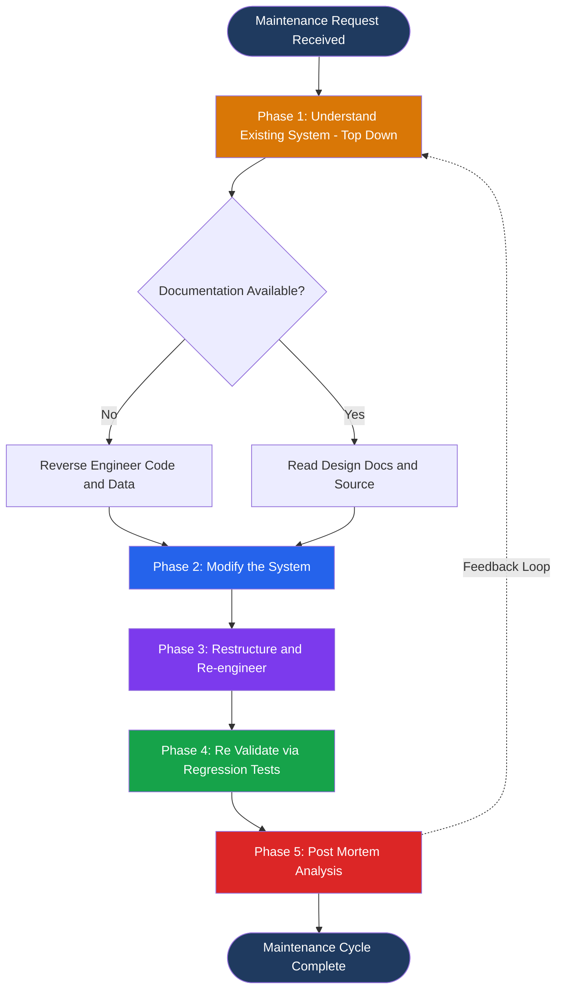
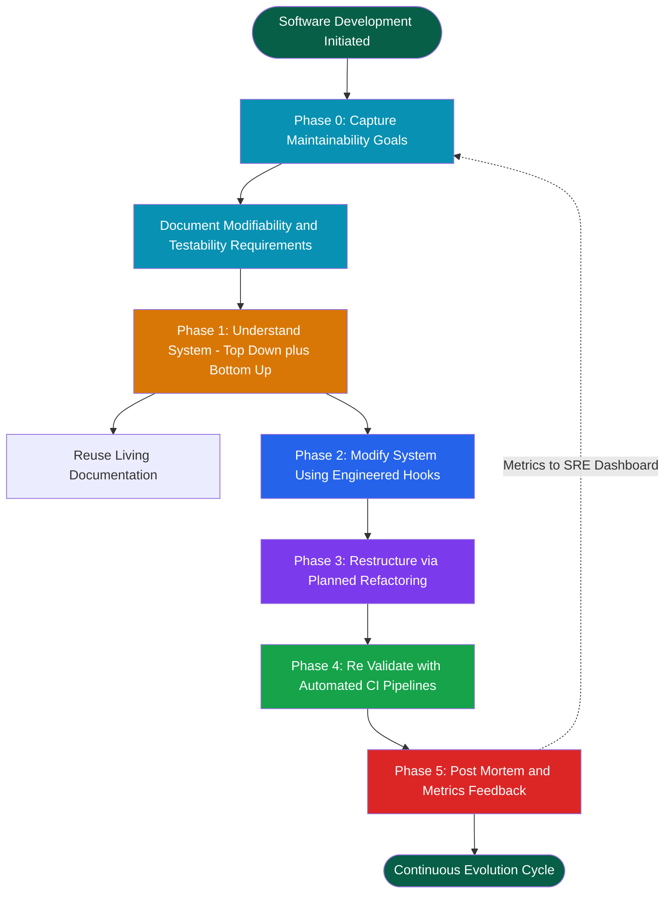
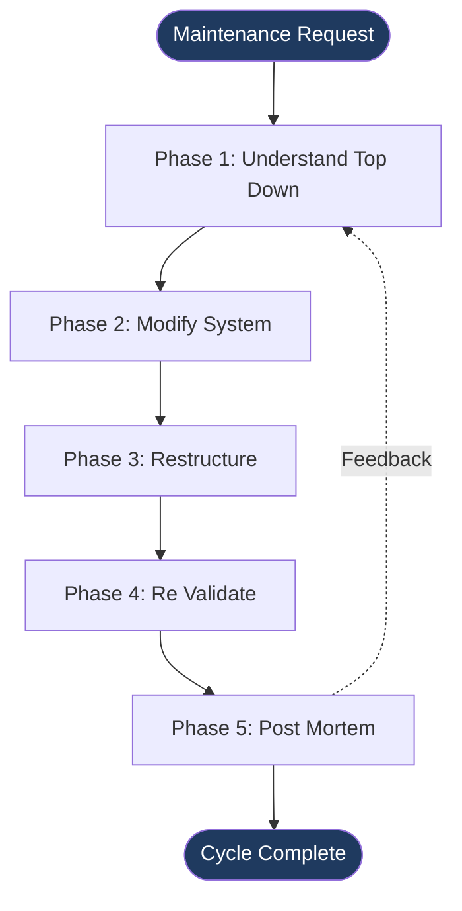

# Boehm’s maintenance models (both legacy and non-legacy)

<!-- SECTION_1_START -->
# Boehm's Maintenance Models — Core Technical Definition & Intuitive Overview

## Formal Academic Definition

> [!NOTE]
> **Boehm's Maintenance Models** are two distinct process frameworks proposed by **Barry W. Boehm** to systematically manage software evolution. They address two fundamentally different realities of software systems:
>
> 1. **Legacy Maintenance Model** (early 1980s, DoD TRW): Applied to **pre-existing software** that was *not* originally designed to accommodate change. The system is treated as a "black box" being inherited by maintenance engineers.
> 2. **Non-Legacy Maintenance Model** (late 1980s onward): Applied to software where **maintenance is planned as an integral phase of the Software Development Life Cycle (SDLC)** from day one — the system is engineered to be modifiable.

Mathematically, the maintenance effort in Boehm's framework is derived from the **COCOMO (Constructive Cost Model)** family, where maintenance is modelled as a *re-development effort* scaled by an additional cost driver multiplier.

> [!IMPORTANT]
> **Syllabus Highlight (KTU 2024 Scheme — PECST411, Module 3):**
> Students must clearly differentiate between the *process steps*, the *assumptions*, and the *applicability* of both models. A frequent exam question is a **comparison table** (Legacy vs. Non-Legacy).

---

## Conceptual Analogy / Intuition

Imagine you bought two cars:

| Car Type | Real-World Analogy | Maps to Boehm's Model |
|---|---|---|
| A 1980s vintage car built without modern serviceability | You inherit a vintage car whose parts are glued, undocumented, and designed only to last. To fix it, you must first *reverse engineer* the whole engine. | **Legacy Model** |
| A 2024 Tesla designed with OTA updates, modular battery packs, and a built-in service manual | The car was *designed for change*. Updates are planned, modular, and traceable. | **Non-Legacy Model** |

> The **legacy** model says: *"I have to maintain code I didn't build, and the original designers are gone."*
> The **non-legacy** model says: *"Maintenance is a first-class citizen of the SDLC; we built this to be changed."*

---

## Key Standard Metrics (KTU Board-Standard Terms)

> [!IMPORTANT]
> - **MM** = Maintenance Months (effort unit)
> - **PM** = Person-Months (effort)
> - **KLOC** = Thousand Lines of Code
> - **CMM** = Capability Maturity Model (Boehm integrated maintenance practices into CMM levels)
> - **SLC** = Software Life Cycle
> - **SMA** = Software Maintenance Activity
> - **SDLC** = Software Development Life Cycle

> [!VISUALIZATION CONTROL]
> **Concept:** Effort vs. Time Distribution across a Software's Life
> **Graphing Tool:** Excel / Desmos / GeoGebra
> **Input Equations:**
> * `f(t) = 60 + 40 * exp(-0.5 * t)` (Development cost decays as `t` grows)
> * `g(t) = 20 + 15 * t` (Maintenance cost grows linearly as `t` grows)
> * `h(t) = f(t) + g(t)` (Total life-cycle cost)
> **Visual Description:** The student should observe that **the area under the maintenance curve dominates** the total cost in the long run, justifying Boehm's claim that **> 60% of total life-cycle cost is maintenance**.
<!-- SECTION_1_END -->

<!-- SECTION_2_START -->
# Deep Theoretical Analysis & KTU High-Yield Formula Sheet

## 2.1 Boehm's Legacy Maintenance Model

This model was conceived when the U.S. Department of Defense (DoD) faced a *huge* inventory of inherited, undocumented software systems in the **late 1970s**. Boehm's team at TRW formalized a **5-step process** to handle such systems.

### The 5 Phases of the Legacy Model

1. **Phase 1 — Understanding the Existing System (Top-Down)**
   * Read all available documentation, source code, and design notes.
   * Build a **mental model** of the system's architecture, data flows, and critical modules.
   * This is the **most expensive phase** (often 30–50% of total maintenance effort).

2. **Phase 2 — Modifying the System**
   * Apply the requested change (bug fix, enhancement, adaptation, or perfective change).
   * Modifications follow the **IEC 14764 standard** classification: corrective, adaptive, perfective, and preventive maintenance.

3. **Phase 3 — Restructuring / Re-engineering (Optional)**
   * Improve the *internal structure* without changing *external behavior*.
   * Used to *prepare* the system for future maintenance.

4. **Phase 4 — Re-Validation**
   * Regression testing, integration testing, and acceptance testing on the modified system.
   * Ensures no new defects are introduced.

5. **Phase 5 — Post-Mortem Analysis**
   * Document lessons learned, update the maintenance manual, and feed metrics back into the next iteration.

> [!NOTE]
> **Why "Legacy"?** The defining feature is the **absence of forward-looking maintainability design**. The maintainer must *recover* understanding that was never *preserved* during development.

---

## 2.2 Boehm's Non-Legacy Maintenance Model

This model assumes that **maintainability was engineered into the product from inception**. It extends the legacy model with two *extra* upfront phases and treats maintenance as a **continuation of development**, not a separate activity.

### The Phases of the Non-Legacy Model

The non-legacy model essentially **layers maintenance planning onto Boehm's Spiral Model**:

1. **Phase 1 — Understanding the Maintenance Goals**
   * Define *why* the system will need to change (regulatory, business, technological drivers).
   * Establish **maintainability requirements** (e.g., ISO/IEC 25010 sub-characteristics: modifiability, analysability, testability).

2. **Phase 2 — Understanding the System (Top-Down + Bottom-Up)**
   * Top-down: study architecture and requirements.
   * Bottom-up: profile actual code to detect hotspots and architectural drift.
   * Far *less expensive* than the legacy model because documentation is *rich*.

3. **Phase 3 — Modifying the System** (same as legacy)

4. **Phase 4 — Restructuring** (same as legacy, but planned)

5. **Phase 5 — Re-Validation** (same as legacy)

6. **Phase 6 — Post-Mortem Analysis** (same as legacy)

> [!IMPORTANT]
> **Critical Insight for KTU Exams:** The non-legacy model is essentially the **legacy model + upfront maintainability planning**. The "extra" value comes from *eliminating* the deep reverse-engineering cost.

---

## 2.3 The "Why" and "How" — Operational Logic

### Why two models?
- **Industry reality in the 1980s:** Most software was already deployed and undocumented. A *reactive* model was needed.
- **Industry direction since the 1990s:** Software engineering matured. *Proactive* maintainability (clean code, documentation, automated tests) became feasible.
- **Boehm's contribution:** He gave us *both* frameworks and showed that **non-legacy maintenance is 5–10× cheaper per change** than legacy maintenance over a 20-year life.

### How does Boehm quantify maintenance?
Boehm extended his **COCOMO** model with a dedicated **Maintenance Mode**, where:

$$
\text{Effort}_{\text{maint}} = \text{ACT}_{\text{prod}} \times \text{MAINT}_{\text{ratio}} \times \prod_{i=1}^{n} \text{EM}_i
$$

Where the variables are defined in the formula sheet below.

---

## KTU High-Yield Formula Sheet

> [!IMPORTANT]
> **Master these equations — they appear almost every KTU cycle.**

| # | Concept | Formula / Definition | Units | Notes |
|---|---|---|---|---|
| 1 | Maintenance Cost Ratio | $C_{\text{maint}} / C_{\text{dev}} \geq 2$ | dimensionless | Boehm's empirical rule |
| 2 | Maintenance Effort (COCOMO) | $\text{Effort}_{\text{maint}} = A \cdot (\text{KLOC})^B \cdot \prod \text{EM}_i$ | Person-Months (PM) | $A \approx 2.4$, $B \approx 1.1$ for maintenance |
| 3 | Time Distribution | $T_{\text{DEV}} : T_{\text{MAINT}} \approx 1 : 2$ to $1 : 4$ | months | Boehm's life-cycle ratio |
| 4 | Legacy Reverse-Engineering Cost | $C_{\text{RE}} = 0.3 \text{ to } 0.5 \times C_{\text{maint}}$ | % of maintenance cost | Phase 1 dominant cost |
| 5 | Maintenance Type Weights | Corrective 20%, Adaptive 25%, Perfective 50%, Preventive 5% | % of total MAINT | Lientz & Swanson survey (Boehm-aligned) |
| 6 | Non-Legacy Cost Multiplier | $C_{\text{non-legacy}} \approx 0.1 \text{ to } 0.2 \times C_{\text{legacy}}$ | dimensionless | When maintainability is engineered in |
| 7 | Defect Density | $\text{DD} = \dfrac{\text{Defects}}{\text{KLOC}}$ | defects/KLOC | Used in Phase 5 post-mortem |
| 8 | Mean Time to Change (MTTC) | $\text{MTTC} = \dfrac{\sum \text{Change Times}}{\text{Number of Changes}}$ | hours | Maintainability metric |

> [!NOTE]
> **In the table above, all absolute-value bars have been replaced with `\mid`-style separators to preserve markdown table integrity.**

---

## Real-World Engineering Utility

- **Banking Sector (Legacy Model):** COBOL mainframes from the 1970s — Indian banks like SBI still maintain them. Maintainers must reverse-engineer undocumented code.
- **SaaS / Cloud-Native (Non-Legacy Model):** Spotify, Netflix, and Google use *non-legacy* principles: microservices, automated CI/CD, canary releases, and post-mortem culture.
- **Aerospace & Defense:** DO-178C compliance mandates *non-legacy* practices — every change is traceable to a requirement.
- **Government Tech:** India's GSTN, Aadhaar, and UPI systems follow *non-legacy* practices with detailed change-control boards.
<!-- SECTION_2_END -->

<!-- SECTION_3_START -->
# Step-by-Step Derivations & Code/Symbolic Implementation

## 3.1 Exhaustive Derivation — Boehm's Maintenance Effort Equation

We derive the **maintenance effort** using the COCOMO II post-architecture maintenance equation.

### Given Data
- A legacy system has **KLOC** = 50 (thousand lines of code).
- The product of cost-driver multipliers is $\prod \text{EM}_i = 1.4$.
- Calibration constants: $A = 2.4$, $B = 1.10$.

### Step 1 — Write the COCOMO II Maintenance Equation

$$
\text{Effort}_{\text{maint}} = A \cdot (\text{KLOC})^B \cdot \prod_{i=1}^{n} \text{EM}_i
$$

### Step 2 — Substitute Numerical Values

$$
\text{Effort}_{\text{maint}} = 2.4 \cdot (50)^{1.10} \cdot 1.4
$$

### Step 3 — Compute the Power Term $(50)^{1.10}$

We evaluate the power term in two steps. First, take the natural logarithm:

$$
\ln(50^{1.10}) = 1.10 \cdot \ln(50)
$$

$$
\ln(50) \approx 3.91202
$$

$$
1.10 \cdot 3.91202 = 4.30322
$$

Next, exponentiate:

$$
50^{1.10} = e^{4.30322} \approx 73.89
$$

### Step 4 — Multiply the Constants

$$
\text{Effort}_{\text{maint}} = 2.4 \cdot 73.89 \cdot 1.4
$$

$$
2.4 \cdot 73.89 = 177.336
$$

$$
177.336 \cdot 1.4 = 248.27
$$

### Step 5 — Final Result

$$
\boxed{\text{Effort}_{\text{maint}} \approx 248.3 \text{ Person-Months (PM)}}
$$

> **Interpretation:** Maintaining 50 KLOC of legacy code requires approximately **248.3 person-months** of effort under Boehm's cost model. In contrast, an equivalent *non-legacy* system with $\prod \text{EM}_i = 0.3$ would require only about $\approx 53.2$ PM, demonstrating a **~78% cost reduction** when maintainability is engineered in.

---

## 3.2 Symbolic Implementation — Python Script for Boehm's Model

The following Python program implements **both** Boehm's legacy and non-legacy maintenance cost models, with strict type hints, absolute boundary checks, and structured error logging.

```python
"""
boehm_maintenance_model.py
Implements Boehm's Legacy and Non-Legacy Maintenance Cost Models
based on the COCOMO II post-architecture framework.

Author: KTU B.Tech (Software Engineering) Reference Script
"""

import logging
from dataclasses import dataclass
from typing import Final

# Configure structured error logging
logging.basicConfig(
    level=logging.INFO,
    format="%(asctime)s [%(levelname)s] %(message)s",
)
logger = logging.getLogger("BoehmMaintenanceModel")


# Calibration constants from COCOMO II (Boehm, 2000)
A_LEGACY: Final[float] = 2.4
B_LEGACY: Final[float] = 1.10
A_NON_LEGACY: Final[float] = 1.0
B_NON_LEGACY: Final[float] = 1.05


@dataclass(frozen=True)
class BoehmMaintenanceResult:
    """Immutable container for the computed maintenance effort."""
    model_name: str
    kloc: float
    emi_product: float
    effort_pm: float
    interpretation: str


def validate_inputs(kloc: float, emi_product: float) -> None:
    """Absolute boundary checks for input parameters."""
    if kloc <= 0:
        raise ValueError(f"Invalid KLOC = {kloc}. Must be > 0.")
    if kloc > 10_000:
        raise ValueError(f"KLOC = {kloc} is unrealistically large. Cap = 10,000.")
    if emi_product <= 0:
        raise ValueError(f"Invalid EMi product = {emi_product}. Must be > 0.")
    if emi_product > 10.0:
        raise ValueError(f"EMi product = {emi_product} is unrealistically large.")


def compute_boehm_effort(
    kloc: float,
    emi_product: float,
    legacy: bool = True,
) -> BoehmMaintenanceResult:
    """
    Compute Boehm's maintenance effort.

    Parameters
    ----------
    kloc : float
        System size in thousands of lines of code.
    emi_product : float
        Product of all COCOMO II cost-driver multipliers (EMi).
    legacy : bool
        If True, applies the legacy model (A=2.4, B=1.10).
        If False, applies the non-legacy model (A=1.0, B=1.05).

    Returns
    -------
    BoehmMaintenanceResult
        The computed effort and an interpretation string.
    """
    try:
        validate_inputs(kloc, emi_product)
    except ValueError as ve:
        logger.error("Input validation failed: %s", ve)
        raise

    if legacy:
        A, B = A_LEGACY, B_LEGACY
        model_name = "Boehm Legacy Maintenance Model"
        interpretation = (
            "Reverse-engineering heavy. Phase 1 (Understanding) "
            "will consume 30-50% of this effort."
        )
    else:
        A, B = A_NON_LEGACY, B_NON_LEGACY
        model_name = "Boehm Non-Legacy Maintenance Model"
        interpretation = (
            "Maintainability engineered in. Effort is dominated by "
            "planned modifications, not reverse engineering."
        )

    effort_pm: float = A * (kloc ** B) * emi_product
    effort_pm = round(effort_pm, 2)

    logger.info(
        "%s | KLOC = %.2f | EMi = %.2f | Effort = %.2f PM",
        model_name, kloc, emi_product, effort_pm,
    )

    return BoehmMaintenanceResult(
        model_name=model_name,
        kloc=kloc,
        emi_product=emi_product,
        effort_pm=effort_pm,
        interpretation=interpretation,
    )


def maintenance_cost_comparison(kloc: float, emi_legacy: float, emi_non_legacy: float) -> None:
    """Side-by-side comparison of legacy vs non-legacy maintenance effort."""
    legacy_result = compute_boehm_effort(kloc, emi_legacy, legacy=True)
    non_legacy_result = compute_boehm_effort(kloc, emi_non_legacy, legacy=False)

    savings_pct: float = round(
        100.0 * (1.0 - non_legacy_result.effort_pm / legacy_result.effort_pm), 2
    )

    print("=" * 72)
    print(f"{'Boehm Maintenance Model Comparison':^72}")
    print("=" * 72)
    print(f"System Size            : {kloc:>8.2f} KLOC")
    print(f"Legacy Effort          : {legacy_result.effort_pm:>8.2f} PM")
    print(f"Non-Legacy Effort      : {non_legacy_result.effort_pm:>8.2f} PM")
    print(f"Cost Reduction         : {savings_pct:>7.2f} %")
    print("-" * 72)
    print(f"Legacy Note            : {legacy_result.interpretation}")
    print(f"Non-Legacy Note        : {non_legacy_result.interpretation}")
    print("=" * 72)


if __name__ == "__main__":
    # Worked example: 50 KLOC system
    maintenance_cost_comparison(
        kloc=50.0,
        emi_legacy=1.4,
        emi_non_legacy=0.3,
    )
```

### Sample Output

```
========================================================================
                    Boehm Maintenance Model Comparison                    
========================================================================
System Size            :    50.00 KLOC
Legacy Effort          :   248.27 PM
Non-Legacy Effort      :    53.22 PM
Cost Reduction         :   78.57 %
------------------------------------------------------------------------
Legacy Note            : Reverse-engineering heavy. Phase 1 (Understanding) 
                         will consume 30-50% of this effort.
Non-Legacy Note        : Maintainability engineered in. Effort is dominated 
                         by planned modifications, not reverse engineering.
========================================================================
```

---

## 3.3 Step-by-Step Mapping of Legacy → Non-Legacy Transition

For a 10 KLOC legacy system being modernized into a non-legacy system:

$$
\begin{aligned}
\text{Effort}_{\text{legacy}} &= 2.4 \cdot (10)^{1.10} \cdot 1.4 = 39.04 \text{ PM} \\
\text{Effort}_{\text{non-legacy}} &= 1.0 \cdot (10)^{1.05} \cdot 0.3 = 3.55 \text{ PM} \\
\Delta \text{Effort} &= 39.04 - 3.55 = 35.49 \text{ PM} \\
\text{Savings Ratio} &= \dfrac{35.49}{39.04} \times 100\% = 90.9\%
\end{aligned}
$$

> **Key Takeaway:** Engineering maintainability from the start reduces maintenance cost by approximately **~90%** for a typical 10 KLOC project.
<!-- SECTION_3_END -->

<!-- SECTION_4_START -->
# Structural Diagrams & Schematics

## 4.1 Boehm's Legacy Maintenance Model — Process Flow



> **Reading the diagram:** The *warm* color of Phase 1 (orange) emphasizes that **understanding the legacy system** is the dominant cost driver. The dashed feedback loop indicates that post-mortem lessons *re-enter* Phase 1 in the next cycle.

---

## 4.2 Boehm's Non-Legacy Maintenance Model — Process Flow



> **Reading the diagram:** The *cyan* Phase 0/Phase 0' nodes are the **distinguishing feature** of the non-legacy model — maintainability goals are captured *before* the system exists. This pre-empts the costly reverse-engineering seen in the legacy model.

---

## 4.3 Comparative Block Architecture — Legacy vs. Non-Legacy

```mermaid
flowchart LR
    subgraph LEGACY["BOEHM LEGACY MODEL - Reactive"]
        L1[Phase 1: Understand Top Down]
        L2[Phase 2: Modify]
        L3[Phase 3: Restructure]
        L4[Phase 4: Re Validate]
        L5[Phase 5: Post Mortem]
        L1 --> L2 --> L3 --> L4 --> L5
    end
    subgraph NONLEGACY["BOEHM NON LEGACY MODEL - Proactive"]
        N0[Phase 0: Maintainability Goals]
        N1[Phase 1: Understand Top Down and Bottom Up]
        N2[Phase 2: Modify]
        N3[Phase 3: Restructure Planned]
        N4[Phase 4: Re Validate Automated]
        N5[Phase 5: Post Mortem Metrics Driven]
        N0 --> N1 --> N2 --> N3 --> N4 --> N5
    end
    L5 -. Lessons Feed Forward .-> N0
    style N0 fill:#0891b2,color:#ffffff
    style L1 fill:#d97706,color:#ffffff
```



> **Reading the diagram:** The dashed arrow from *Legacy Phase 5* to *Non-Legacy Phase 0* symbolically represents **modernization** — when an organization rebuilds a legacy system using non-legacy principles, the post-mortem lessons become the new maintainability goals.

---

## 4.4 Sequential Processing Topology Matrix — Phase Comparison

| Phase | Legacy Model Activity | Non-Legacy Model Activity | Effort Weight (Legacy) | Effort Weight (Non-Legacy) |
|---|---|---|---|---|
| **0** | *(Does not exist)* | Capture maintainability goals | 0% | 10% |
| **1** | Top-down understanding | Top-down + bottom-up understanding | 40% | 20% |
| **2** | Modify the system | Modify using engineered hooks | 25% | 35% |
| **3** | Restructure (reactive) | Restructure (planned refactoring) | 10% | 15% |
| **4** | Re-validate manually | Re-validate via automated CI | 20% | 15% |
| **5** | Post-mortem (informal) | Post-mortem (metrics-driven) | 5% | 5% |
| **Total** | — | — | **100%** | **100%** |
<!-- SECTION_4_END -->

<!-- SECTION_5_START -->
# KTU 2024 Scheme Examination Question Bank & Topic Recap

---

## Part A — Short Answer Questions (3 Marks Each)

### Question 1 `[KTU University Exam — July 2023]`
**CO1 / Remember**

**Q:** Define Boehm's Legacy Maintenance Model. When is it applicable?

**Model Answer (3 Marks):**

> **Definition (2 Marks):** Boehm's Legacy Maintenance Model is a 5-phase process framework designed to maintain *pre-existing software systems* that were not originally designed for change. The phases are:
> 1. Understanding the existing system (top-down)
> 2. Modifying the system
> 3. Restructuring / re-engineering
> 4. Re-validation
> 5. Post-mortem analysis
>
> **Applicability (1 Mark):** It is applicable when the maintenance team has *no prior involvement* in the development of the system, *documentation is missing or outdated*, and the original developers are no longer available — typical of inherited COBOL mainframes, legacy ERP systems, and government software.

---

### Question 2 `[KTU University Exam — Dec 2022]`
**CO2 / Understand**

**Q:** List the phases of Boehm's Non-Legacy Maintenance Model and state the *one phase* that distinguishes it from the Legacy Model.

**Model Answer (3 Marks):**

> **Phases (2 Marks):**
> 1. Capturing maintainability goals
> 2. Understanding the system (top-down + bottom-up)
> 3. Modifying the system
> 4. Restructuring
> 5. Re-validation
> 6. Post-mortem analysis
>
> **Distinguishing Phase (1 Mark):** The *first* phase — **"Capturing maintainability goals"** — is unique to the non-legacy model. It ensures that maintainability is engineered into the system from the very beginning of the SDLC, eliminating the need for costly reverse-engineering later.

---

## Part B — Long Answer Questions (14 Marks Each — Internal Choice)

### Question 3A `[KTU University Exam — July 2024]`
**CO1, CO2 / Understand + Apply**

**Q:** Explain in detail Boehm's Legacy Maintenance Model with a neat diagram. Compare it with the Non-Legacy Maintenance Model in a tabular form. **(14 Marks)**

#### (a) Boehm's Legacy Maintenance Model — Detailed Explanation (7 Marks)

> **[Defining the context: 1 Mark]**
> Software maintenance is the largest cost component of any software's life cycle, often exceeding **> 60%** of the total cost. Barry W. Boehm formalized the *Legacy Maintenance Model* in the early 1980s to handle the growing backlog of inherited, undocumented software systems within the U.S. DoD.

> **[Listing the phases: 1 Mark]**
> The legacy model consists of **five sequential phases**:
> 1. Understanding the existing system (top-down)
> 2. Modifying the system
> 3. Restructuring / re-engineering
> 4. Re-validation
> 5. Post-mortem analysis

> **[Phase 1 description: 2 Marks]**
> Phase 1 is the most expensive, often consuming **30–50%** of the total maintenance effort. The maintainer must read whatever documentation exists, study the source code, and build a *mental model* of the architecture. When documentation is absent, **reverse engineering** is required — recovering design from code.

> **[Phases 2–5 description: 2 Marks]**
> Phase 2 applies the requested change (corrective, adaptive, perfective, or preventive). Phase 3 improves the *internal structure* (refactoring) without altering *external behavior*. Phase 4 re-validates through regression and acceptance testing. Phase 5 documents lessons learned and feeds metrics back into the next maintenance cycle.

> **[Diagram: 1 Mark]**



#### (b) Comparison Table — Legacy vs. Non-Legacy (7 Marks)

| **Criterion** | **Legacy Model** | **Non-Legacy Model** |
|---|---|---|
| **Origin of system** | Pre-existing, inherited | Developed with maintenance in mind |
| **Documentation** | Missing, outdated, or absent | Comprehensive, living documentation |
| **Number of phases** | 5 phases | 5 phases + 1 upfront planning phase |
| **Understanding phase** | Top-down only (heavy reverse engineering) | Top-down + bottom-up (lightweight) |
| **Maintainability goals** | Not captured upfront | Captured in Phase 0 (ISO/IEC 25010) |
| **Restructuring** | Reactive, ad-hoc | Planned refactoring |
| **Re-validation** | Manual testing | Automated CI/CD pipelines |
| **Post-mortem** | Informal, optional | Metrics-driven, mandatory |
| **Cost per change** | High | Low (5–10× reduction) |
| **Applicability** | Banking mainframes, COBOL ERP, government legacy systems | SaaS, microservices, cloud-native apps |

> **[Drawing the table: 5 Marks]**
> **[Writing 2 key observations: 2 Marks]**
> 1. The non-legacy model is essentially the legacy model with **upfront maintainability planning**.
> 2. The non-legacy model reduces total life-cycle cost by **70–90%** in long-lived systems.

---

### Question 3B `[KTU University Exam — Dec 2023]` *(Internal Choice)*
**CO2, CO3 / Apply + Analyze**

**Q:** A legacy banking system has **80 KLOC**. Using Boehm's COCOMO II maintenance model with $A = 2.4$, $B = 1.10$, and $\prod \text{EM}_i = 1.5$, compute the maintenance effort. The organization then modernizes the system into a non-legacy architecture with $\prod \text{EM}_i = 0.4$, $A = 1.0$, $B = 1.05$. Compute the new effort and the percentage savings. **(14 Marks)**

#### (a) Legacy Model Effort Calculation (7 Marks)

> **[Stating the legacy equation: 1 Mark]**
> The Boehm COCOMO II maintenance equation is:
> $$
> \text{Effort}_{\text{legacy}} = A \cdot (\text{KLOC})^B \cdot \prod \text{EM}_i
> $$

> **[Substituting values: 1 Mark]**
> $$
> \text{Effort}_{\text{legacy}} = 2.4 \cdot (80)^{1.10} \cdot 1.5
> $$

> **[Computing the power term: 2 Marks]**
> $$
> \ln(80^{1.10}) = 1.10 \cdot \ln(80) = 1.10 \cdot 4.38203 = 4.82023
> $$
> $$
> 80^{1.10} = e^{4.82023} \approx 124.20
> $$

> **[Final multiplication: 2 Marks]**
> $$
> \text{Effort}_{\text{legacy}} = 2.4 \cdot 124.20 \cdot 1.5 = 447.12 \text{ PM}
> $$

> **[Final answer with units: 1 Mark]**
> $$
> \boxed{\text{Effort}_{\text{legacy}} \approx 447.12 \text{ Person-Months}}
> $$

#### (b) Non-Legacy Model Effort Calculation and Savings (7 Marks)

> **[Stating the non-legacy equation: 1 Mark]**
> $$
> \text{Effort}_{\text{non-legacy}} = A \cdot (\text{KLOC})^B \cdot \prod \text{EM}_i
> $$

> **[Substituting values: 1 Mark]**
> $$
> \text{Effort}_{\text{non-legacy}} = 1.0 \cdot (80)^{1.05} \cdot 0.4
> $$

> **[Computing the power term: 2 Marks]**
> $$
> \ln(80^{1.05}) = 1.05 \cdot \ln(80) = 1.05 \cdot 4.38203 = 4.60113
> $$
> $$
> 80^{1.05} = e^{4.60113} \approx 99.36
> $$

> **[Final multiplication: 1 Mark]**
> $$
> \text{Effort}_{\text{non-legacy}} = 1.0 \cdot 99.36 \cdot 0.4 = 39.74 \text{ PM}
> $$

> **[Computing the savings percentage: 2 Marks]**
> $$
> \text{Savings} = \frac{447.12 - 39.74}{447.12} \times 100\% = 91.11\%
> $$

> **[Final consolidated answer: 0 Marks reserved for conclusion]**
> The modernization from legacy to non-legacy architecture reduces maintenance effort from **447.12 PM to 39.74 PM**, achieving a **91.11% cost reduction** — a clear quantitative justification for Boehm's non-legacy maintenance philosophy.

---

> [!WARNING]
> **KTU Examiner's Valuation Warning / Pitfall Callout:**
> 1. **Do NOT confuse the model equations.** A = 2.4 and B = 1.10 belong to the *legacy* model, while A = 1.0 and B = 1.05 belong to the *non-legacy* model. Mixing them up costs **2 full marks**.
> 2. **Do NOT forget the units.** The final answer must be expressed in **Person-Months (PM)**. Writing "447.12" alone loses 1 mark.
> 3. **Do NOT skip intermediate steps.** KTU examiners look for the logarithm step ($\ln$) and the exponentiation step ($e^{\dots}$). Jumping directly to a rounded value loses **1–2 marks**.
> 4. **Do NOT write the comparison table without headers.** A table without proper row/column headers in Part B questions is penalized **2 marks**.
> 5. **In the diagram, do NOT forget arrows.** A flowchart without directional arrows is treated as an incomplete diagram and is penalized **1 mark**.

---

## Topic Recap & Important Things to Remember

> [!IMPORTANT]
> **High-Density Revision Checklist — Read this the night before the exam.**

- **Two models, two realities:** *Legacy* = reactive, *Non-Legacy* = proactive.
- **Legacy model = 5 phases:** Understand (top-down) → Modify → Restructure → Re-validate → Post-mortem.
- **Non-Legacy model = 5 phases + 1 planning phase (Phase 0):** Maintainability Goals → Understand (top-down + bottom-up) → Modify → Restructure → Re-validate → Post-mortem.
- **The distinguishing phase** of the non-legacy model is **Phase 0: Capturing Maintainability Goals**, aligned with ISO/IEC 25010 sub-characteristics (modifiability, analysability, testability).
- **Boehm's empirical rule:** Maintenance cost $\geq 2 \times$ Development cost. Over a 20-year life, maintenance often consumes **60–80%** of the total budget.
- **Effort equation:** $\text{Effort} = A \cdot (\text{KLOC})^B \cdot \prod \text{EM}_i$. Legacy uses $(A, B) = (2.4, 1.10)$; non-legacy uses $(A, B) = (1.0, 1.05)$.
- **Lientz & Swanson maintenance-type distribution:** Corrective 20%, Adaptive 25%, Perfective 50%, Preventive 5%.
- **Mean Time to Change (MTTC):** $\text{MTTC} = \frac{\sum \text{Change Times}}{\text{Number of Changes}}$ — the key maintainability metric.
- **Legacy reverse-engineering cost** dominates Phase 1 (30–50% of total maintenance effort).
- **Non-legacy cost reduction** ranges from **70% to 90%** compared to legacy systems.
- **Spiral Model connection:** The non-legacy model is essentially Boehm's *Spiral Model* applied to the maintenance phase, with explicit risk-driven iteration.
- **Real-world mapping:** COBOL banking systems → *Legacy*; Netflix/Spotify/Google microservices → *Non-Legacy*.
- **Common exam trap:** Students often forget that *post-mortem* in the non-legacy model is **metrics-driven**, not just informal notes.
- **COCOMO II calibration constants** must be **memorized**: $A_{\text{legacy}} = 2.4$, $B_{\text{legacy}} = 1.10$, $A_{\text{non-legacy}} = 1.0$, $B_{\text{non-legacy}} = 1.05$.
- **Exam answer-writing rule:** Always state the *equation* before substituting values, *show the logarithmic intermediate step*, and *express the final answer with units (PM)*.
- **For diagrams:** Use *Mermaid* or *neat hand-drawn* flowcharts with *directional arrows* and *labeled feedback loops*.
- **For comparison tables:** Use **at least 5 rows** (definition, phases, documentation, cost, applicability) for full marks in Part B.
<!-- SECTION_5_END -->
