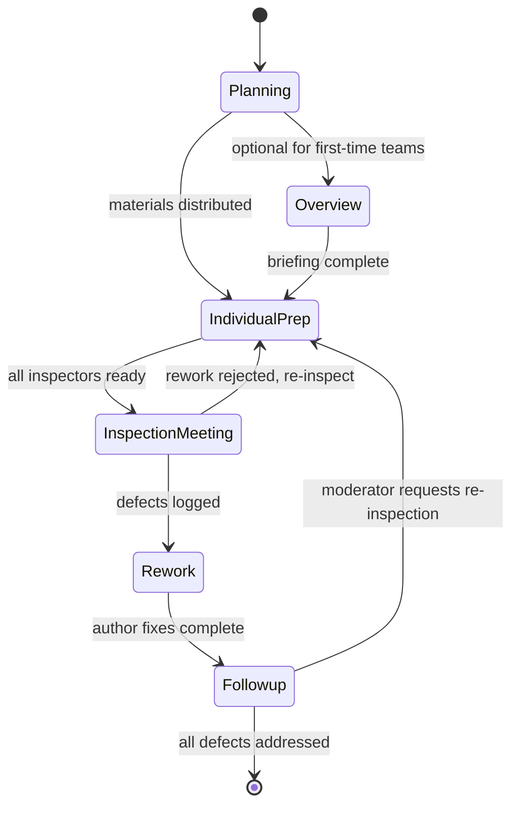
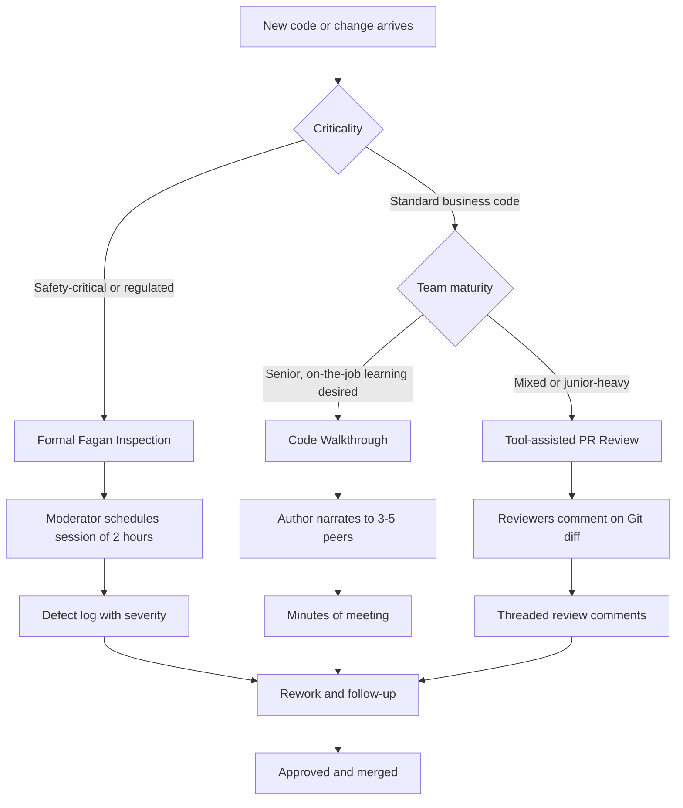
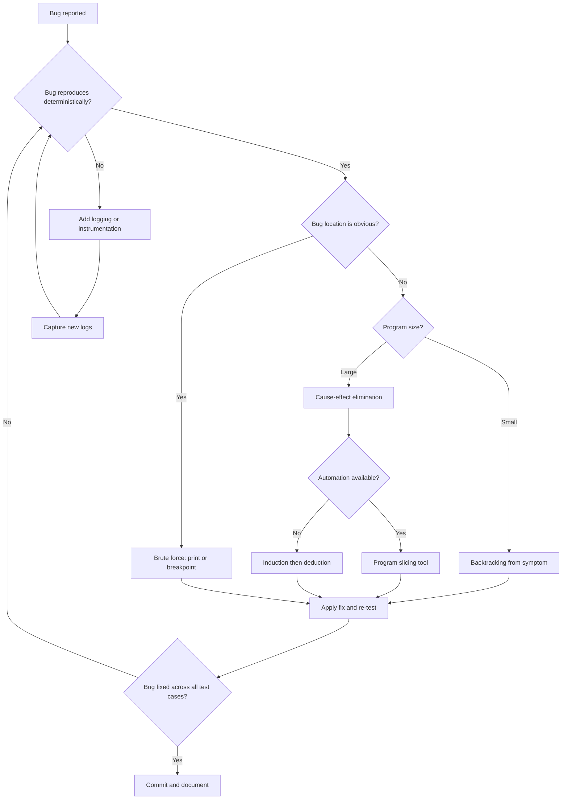
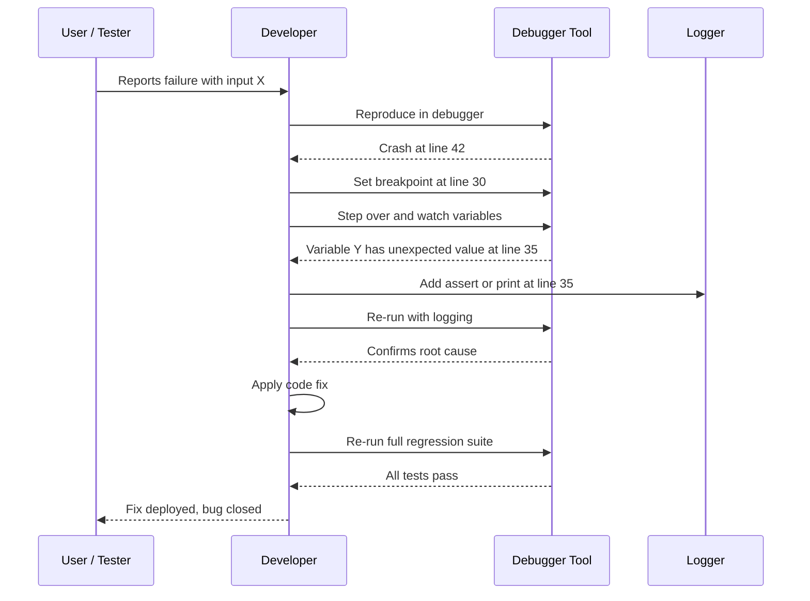

# Coding guidelines  - Code review, Code walkthrough and Code inspection, Code debugging and its methods.

<!-- SECTION_1_START -->
# Coding Guidelines & Code Quality Assurance — KTU 2024 Module 3

## 1.1 Core Technical Definition

**Coding Guidelines** are a set of *documented rules, conventions, and best practices* that govern the source-code authoring process in a software project. They standardize **naming conventions, indentation, commenting style, file organization, control-flow patterns, and error-handling mechanisms** so that the resulting codebase is **uniform, maintainable, and reviewable** across the entire engineering team.

In the **KTU 2024 Scheme (PECST411 – Software Engineering)**, coding guidelines are positioned under *Module 3 – Coding, Testing and Maintenance* as a *static verification* precursor to dynamic testing. They act as the **first line of defense** against defect injection.

> [!IMPORTANT]
> **KTU 2024 Syllabus Anchor (Module 3):**
> *"Coding guidelines — Code review, Code walkthrough and Code inspection, Code debugging and its methods."*
> This topic is a **direct, high-weightage ESE question area** and is mapped to **CO3 (Apply software engineering principles to develop and validate quality software)**.

---

## 1.2 Conceptual Analogy / Intuition

Imagine a **large hospital kitchen** where 12 chefs cook together. If one chef slices onions, another adds whole onions, a third chops them diagonally, and a fourth forgets onions entirely — the final dish is chaos. The Head Chef therefore issues a **Standard Recipe Book** (naming = "Red Onion, diced 5 mm, not chopped").

- The **Recipe Book** = *Coding Guidelines* (standards).
- The **Tasting by another Chef before serving** = *Code Review / Walkthrough*.
- The **Formal Hygiene Audit by an Inspector with a checklist** = *Code Inspection (Fagan)*.
- The **Tracking down which chef added salt twice** = *Code Debugging*.

Once you internalize this kitchen analogy, the four techniques stop feeling like overlapping jargon and start feeling like **four distinct stages of quality control** in a production pipeline.

---

## 1.3 Why Coding Guidelines Matter — The Engineering Reality

| Without Guidelines | With Guidelines |
|---|---|
| Defect density **> 15 per KLOC** | Defect density **< 2 per KLOC** (industry average at CMMI Level 5) |
| Onboarding time = **2–3 months** | Onboarding time = **2–3 weeks** |
| Maintenance cost = **60–80%** of total project cost | Maintenance cost drops to **30–40%** |
| Code review becomes subjective | Code review becomes a **measurable checklist activity** |

> [!NOTE]
> **Industry Benchmark (Capers Jones, 2019):** Formal code inspections typically remove **60–90% of defects** in the inspected code, making them **5–7× more cost-effective** than dynamic testing at the same stage.

---

## 1.4 Typical Coding-Guideline Categories (KTU Favourite)

A KTU 2-mark question often asks to *"List any four coding guidelines."* The expected categories are:

1. **Naming Conventions** — `camelCase` for variables, `PascalCase` for classes, `UPPER_SNAKE` for constants.
2. **Indentation & Formatting** — consistent use of tabs/spaces (commonly **4 spaces per indent level**).
3. **Commenting Standards** — header block, inline explanation for non-obvious logic, JSDoc/Docstrings for APIs.
4. **Function/Method Design** — single-responsibility, maximum length (commonly **≤ 50 LOC**), limited parameters (≤ 5).
5. **Error Handling** — explicit exception handling, never swallow exceptions silently.
6. **Version-Control Hygiene** — meaningful commit messages, atomic commits, no committed secrets.
7. **Security Practices** — input validation, parameterized queries, no hard-coded credentials.

> [!VISUALIZATION CONTROL]
> **Concept:** Defect-Detection Cost vs. Stage of Removal
> **Plot Type:** Bar chart (Cost in $ on Y, SDLC Stage on X)
> **Conceptual Data Points:**
> * `Requirements` → `$25`
> * `Design` → `$50`
> * `Coding` → `$100`
> * `Code Review` → `$150`
> * `System Testing` → `$500`
> * `Post-Release` → `$4000+`
> **Visual Description:** The bar heights rise **exponentially** from left to right, illustrating the famous **Boehm Cost-of-Fix Curve** — the entire reason we invest in coding guidelines and static review *before* execution testing.

---

## 1.5 The Three Pillars of Static Code Quality Verification

In KTU terminology, code quality is verified *statically* (without executing the program) through three progressively more formal techniques:

**Pillar 1 → Code Review** *(the umbrella term)* — any human or tool-based examination of source code.

**Pillar 2 → Code Walkthrough** — a *semi-formal, author-led* simulation-based review.

**Pillar 3 → Code Inspection** — a *fully-formal, Fagan-style* checklist-driven review with defined roles and exit criteria.

**Code Debugging** is the *dynamic counterpart* — the code is *executed* under controlled conditions to locate the **root cause** of a known failure.

These three static techniques plus debugging form the **complete content of this KTU topic** and will be dissected in the next section.
<!-- SECTION_1_END -->

<!-- SECTION_2_START -->
# Deep Theoretical Analysis — Code Review, Walkthrough, Inspection & Debugging

## 2.1 Code Review — The Umbrella Activity

A **Code Review** is a *systematic, line-by-line (or block-by-block) examination* of source code by one or more reviewers — *not the original author* — to identify defects, enforce standards, and share knowledge.

### 2.1.1 Objectives of Code Review
- Detect **logic errors, security flaws, and style violations** *before* execution testing.
- Enforce adherence to the project's **coding guidelines**.
- Enable **knowledge transfer** across the team (bus-factor reduction).
- Generate a **defect database** for process improvement.

### 2.1.2 Types of Code Review
| Type | Formality | Led By | Output |
|---|---|---|---|
| **Pair Programming** | Informal, continuous | Driver + Navigator (rotating) | Real-time corrections |
| **Over-the-shoulder** | Informal, ad-hoc | Author walks reviewer through code | Verbal comments |
| **Email / Pass-around** | Semi-formal | Author sends diffs via email | Written comments |
| **Tool-assisted (GitHub PR, Gerrit, Crucible)** | Semi-formal, traceable | Reviewer comments on PR | Threaded discussion, approval |
| **Walkthrough** *(see §2.2)* | Semi-formal, meeting-based | Author (moderator) | Minutes of meeting |
| **Inspection** *(see §2.3)* | **Formal**, Fagan-style | Trained Moderator (≠ author) | Formal log, metrics |

> [!IMPORTANT]
> **KTU Distinction Trap:** A common exam mistake is treating "code review" and "code walkthrough" as synonyms. **Code review is the broad category; walkthrough and inspection are its two formal subtypes.** The next two sections clarify them.

---

## 2.2 Code Walkthrough — Author-Led Semi-Formal Review

### 2.2.1 Definition
A **Code Walkthrough** is a *semi-formal group review meeting* in which the **author of the code** (acting as the *presenter*) explains the program logic line-by-line to a small group of **3–5 peers** using a printed listing or projected IDE. The team *simulates* execution using **hand-tracing** on selected test cases — they do *not* run the actual program.

### 2.2.2 Participants & Roles
| Role | Responsibility |
|---|---|
| **Author / Presenter** | Narrates code, justifies design choices, answers questions |
| **Secretary / Scribe** | Records all defects raised, on a standardized log sheet |
| **Reviewers (3–5)** | Raise questions, perform mental execution, check for deviations from guidelines |
| **Walkthrough Leader** (optional) | Keeps the discussion focused, time-boxes the session |

### 2.2.3 Process Steps
1. **Pre-distribution** — Author distributes the code listing (paper/PDF) **≥ 24 hours** before the meeting.
2. **Individual Reading** — Reviewers read the code independently and prepare a list of questions.
3. **Walkthrough Meeting** — Author narrates; reviewers raise defects in real-time.
4. **Hand-tracing** — Reviewers simulate execution on **1–2 sample inputs** to expose logic flaws.
5. **Logging** — Scribe captures every defect, suggestion, and question.
6. **Action Items** — Author takes the log, fixes defects, updates code, and circulates revised version.

### 2.2.4 Strengths & Limitations
| ✅ Strengths | ⚠️ Limitations |
|---|---|
| Low overhead, easy to schedule | **Author bias** — the presenter steers attention away from weak spots |
| Excellent for **knowledge transfer** to junior engineers | No formal checklist ⇒ coverage is uneven |
| Detects **specification / logic** defects effectively | Metrics (defect density, inspection rate) are not collected ⇒ process is not improvable over time |
| Cheap to conduct — no trained moderator needed | The "blind-spot" effect: reviewers assume the author is right |

---

## 2.3 Code Inspection — Formal Fagan Inspection

### 2.3.1 Definition
A **Code Inspection** is the *most formal and rigorous* static verification technique, originally defined by **Michael E. Fagan of IBM (1976)**. It uses **defined roles, entry/exit criteria, a formal checklist, and statistical process control** to find defects in source code *without executing it*.

> [!NOTE]
> **Historical Footnote:** Fagan's original 1976 paper reported that inspections removed **67% of coding errors** in IBM's System/370 projects — a result that has been replicated in hundreds of studies since.

### 2.3.2 Roles in a Fagan Inspection
| Role | Responsibility | Who Should NOT Be |
|---|---|---|
| **Moderator** | Schedules meeting, enforces rules, manages time, prevents "problem solving" inside the meeting | The author |
| **Author / Designer** | Presents code, answers questions, owns rework | The moderator |
| **Reader** | Walks through the code logic during the meeting (paraphrases it) | The author or moderator |
| **Recorder / Scribe** | Logs every defect on a standardized form, assigns severity | Anyone who is also a reviewer (to avoid bias) |
| **Inspectors / Reviewers** (2–4) | Independently prepare against a checklist, raise defects in the meeting | The author |
| **Manager** *(optional)* | Decides on process changes, ensures resources | Any active role above (to preserve independence) |

### 2.3.3 The Six-Stage Fagan Inspection Process
The diagram below is rendered in **Section 4** as a Mermaid state machine. The textual steps are:

1. **Planning** — Moderator distributes materials, schedules the meeting (typically **2 hours, ≤ 200 LOC per session**).
2. **Overview** *(optional)* — Author gives a 15–30 minute briefing on the design intent.
3. **Individual Preparation** — Each inspector studies the code *alone* against the checklist (1–2 hours of prep per session).
4. **Inspection Meeting** — Reader paraphrases the code; inspectors raise defects; recorder logs them. **No problem-solving allowed** — defects are *raised*, not *fixed*.
5. **Rework** — Author fixes the logged defects (or escalates with reasons if a defect is rejected).
6. **Follow-up** — Moderator verifies that *every* logged defect has been addressed, and decides whether a **re-inspection** is needed.

### 2.3.4 Inspection Exit Criteria (the "Stop-Rules")
A session is considered complete **only when**:
- All inspectors have completed their individual preparation.
- The meeting has run for its scheduled duration (or defect-rate has dropped to zero for 30 minutes).
- All defects are logged with **severity, type, and location**.
- Moderator declares the inspection closed.

### 2.3.5 Inspection Metrics (KTU Favourite)
- **Defect Density (DD)** = $DD = \dfrac{\text{Number of Defects Found}}{\text{KLOC (Thousand Lines of Code)}}$
- **Inspection Rate (IR)** = $IR = \dfrac{\text{LOC Inspected}}{\text{Person-Hours Spent}}$ (typical: **150 LOC/hour**)
- **Defect Removal Efficiency (DRE)** = $DRE = \dfrac{\text{Defects Found at Inspection}}{\text{Defects Found at Inspection + Defects Found Later}} \times 100\%$
- **Yield** = $Y = \dfrac{\text{Defects Fixed}}{\text{Defects Logged}} \times 100\%$

---

## 2.4 Comparative Master Table — Walkthrough vs. Inspection (⭐ Most-Asked in KTU)

| Dimension | **Code Walkthrough** | **Code Inspection** |
|---|---|---|
| **Formality** | Semi-formal | Fully formal (Fagan) |
| **Led by** | **Author** | **Trained Moderator** (not the author) |
| **Roles** | Author + Secretary + Reviewers (informal) | 5–6 distinct, well-defined roles |
| **Checklist** | Optional | **Mandatory** |
| **Meeting Style** | Author narrates, team asks | Reader paraphrases, inspectors raise |
| **Problem-solving in meeting** | Allowed | **Strictly forbidden** |
| **Preparation** | Light | Heavy (1–2 hrs of individual prep) |
| **Data captured** | Defect list | Defect list + severity + type + metrics |
| **Process Improvement** | Difficult | Easy (statistical SPC) |
| **Best suited for** | Training, knowledge sharing, design reviews | Critical modules, safety-critical code, regulated industries (aerospace, medical) |
| **Average defect removal** | 20–40% | 60–90% |

> [!WARNING]
> **KTU Examiner's Pitfall:** If the question asks *"Differentiate between walkthrough and inspection,"* a **mandatory point** is to state that in an inspection **the moderator and author are different people**, and that **problem-solving is forbidden inside the inspection meeting**. Marks are routinely lost on these two lines.

---

## 2.5 Code Debugging — Dynamic Defect Localization

### 2.5.1 Definition
**Debugging** is the *dynamic, execution-based* process of **localizing the root cause** of a known software failure and **removing** that cause. Unlike review/walkthrough/inspection, debugging **requires the program to be running** (either in a debugger, under a test harness, or in production).

> [!IMPORTANT]
> **Debugging ≠ Testing.** Testing *finds* defects; debugging *finds the root cause* of an already-known defect and *fixes* it. This is a classic 1-mark KTU question.

### 2.5.2 The Debugging Process (Gillespie's Model)
1. **Reactive Debugging** — Debug only when a defect is reported.
2. **Pre-emptive Debugging** — Proactively instrument and harden code as you write it.
3. **Reproduce the failure** — Create a **minimal, deterministic** reproduction.
4. **Isolate the cause** — Apply one of the methods in §2.6.
5. **Fix and re-test** — Apply the patch and run **regression tests** to confirm the fix and ensure no new defects were introduced.
6. **Document** — Record root cause in the bug tracker to prevent recurrence.

### 2.5.3 Categories of Bugs
| Bug Type | Symptom | Common Cause |
|---|---|---|
| **Syntax** | Compile-time error | Typos, missing semicolons, unmatched brackets |
| **Logic** | Wrong output, no crash | Off-by-one, wrong operator (`=` vs `==`), infinite loop |
| **Runtime** | Crash mid-execution | Null pointer, division by zero, index out of bounds |
| **Performance** | Slow execution, OOM | O(n²) where O(n) was possible, memory leak |
| **Concurrency** | Race condition, deadlock | Unsynchronized shared state |
| **Interface** | Mismatch with caller | Wrong return type, argument order |
| **Boundary** | Fails at extremes | `int` overflow, empty list, empty string |

---

## 2.6 Debugging Methods — The KTU Core Content

### 2.6.1 Brute-Force Method
Insert `print` statements (or logging) at strategic points in the code; run the program; observe the output trail; narrow down the location of the fault.

- ✅ **Pros:** Zero tooling, works in any language, beginner-friendly.
- ⚠️ **Cons:** Pollutes source code; often leaves debug prints in production; inefficient for non-deterministic bugs.

### 2.6.2 Backtracking
Starting from the **symptom** (where the wrong output or crash appears), trace **backwards** through the execution flow to the **most recent point** where the program's state was still correct. The defect lies between that last-good point and the symptom.

- ✅ **Pros:** Effective for **small programs** with localized logic errors.
- ⚠️ **Cons:** Becomes unmanageable in large, deeply nested, or distributed systems.

### 2.6.3 Cause-Effect Elimination (a.k.a. **Fault-Tree Analysis**)
List **all possible causes** of the symptom (the "effects" are observed; the "causes" are hypothesized). Then design test cases that **rule out or confirm** each hypothesis **one at a time** — typically using **binary partitioning** of input ranges or control-flow branches.

- ✅ **Pros:** Systematic, scalable, traceable.
- ⚠️ **Cons:** Requires deep understanding of the code; can be slow for very complex systems.

### 2.6.4 Program Slicing (Weiser, 1981)
A **program slice** with respect to a *variable v* at *line n* is the set of all statements that may have *contributed* to the value of *v* at *n*. A debugger or static-analysis tool (e.g., `Understand`, `CodeSurfer`, `Frama-C`) computes this slice so the developer inspects *only* the relevant lines.

- ✅ **Pros:** Mechanically automatable; scales to large codebases.
- ⚠️ **Cons:** Requires sophisticated tool support; static slices are sometimes imprecise (over-approximate).

### 2.6.5 Induction & Deduction
- **Induction** — Examine *specific cases* of the failure (test data, stack traces) → infer the *general* cause.
- **Deduction** — Start with the *general hypothesis* (e.g., "the bug is in the parser") → deduce *specific predictions* → run tests to confirm or refute.

### 2.6.6 Rubber-Duck Debugging 🦆
A **pedagogical method** where the developer explains their code, line-by-line, to an inanimate object (a rubber duck, a colleague, a blank wall). The act of *externalizing* the mental model often reveals the bug. Coined in *The Pragmatic Programmer* (Hunt & Thomas, 1999).

### 2.6.7 Interactive Debugger Usage (GDB / PDB / IDE Debugger)
Use a debugger to:
- Set **breakpoints** (pause execution at a chosen line).
- **Step over** (execute a function call as a single step).
- **Step into** (descend into a called function).
- **Step out** (return to the caller).
- **Watch** a variable (auto-pause when it changes).
- **Inspect** the call stack to see *how* execution arrived at the current line.

### 2.6.8 Instrumentation & Assertions
Embed `assert` statements in the code to validate *invariants*. When an assertion fails, the program halts with a stack trace pinpointing the violation. This converts silent logic errors into loud, immediate failures.

```python
def withdraw(balance: float, amount: float) -> float:
    assert amount > 0,       "Withdrawal amount must be positive"
    assert amount <= balance, "Insufficient funds"
    return balance - amount
```

---

## 2.7 KTU High-Yield Formula / Quick-Reference Table

> [!NOTE]
> The table below is the **single most important revision artifact** for this topic. Memorize the *formulas* and the *qualitative comparisons*; they appear in 80% of ESE answers on this module.

| # | Concept | Formula / Definition | Typical Value / Use |
|---|---|---|---|
| 1 | Defect Density | $DD = \dfrac{\text{Defects}}{\text{KLOC}}$ | Industry avg ≈ **5–10/KLOC** |
| 2 | Inspection Rate | $IR = \dfrac{\text{LOC}}{\text{Person-Hours}}$ | ≈ **150 LOC/hr** |
| 3 | Defect Removal Efficiency | $DRE = \dfrac{D_{\text{insp}}}{D_{\text{insp}} + D_{\text{after}}} \times 100\%$ | Target ≥ **85%** |
| 4 | Yield | $Y = \dfrac{\text{Fixed}}{\text{Logged}} \times 100\%$ | Target = **100%** |
| 5 | Walkthrough team size | — | **3–5 reviewers** |
| 6 | Inspection team size | — | **2–4 inspectors + moderator + reader + recorder** |
| 7 | Inspection session length | — | **≤ 2 hours** |
| 8 | Inspection session size | — | **≤ 200 LOC** |
| 9 | Individual prep time | — | **≈ 1–2 hours per session** |
| 10 | Debugging ≠ Testing | — | **Testing finds; debugging fixes** |

> [!TIP]
> **Engineering Utility:** In production, every modern CI/CD pipeline (GitHub Actions, GitLab CI, Jenkins) gates a *Pull Request* on **automated static analysis** (SonarQube, ESLint, SpotBugs) — a *machine-implemented* cousin of Fagan inspection. Modern peer code review on GitHub is a *tool-assisted walkthrough*. The Fagan model still lives on, just refactored for the cloud era.
<!-- SECTION_2_END -->

<!-- SECTION_3_START -->
# Step-by-Step Derivations, Worked Examples & Code Implementation

## 3.1 Worked Example 1 — Computing Inspection Metrics (KTU Numerical Favourite)

### 3.1.1 Problem Statement
During a Fagan inspection of a **12,000 LOC** module, the inspection team found **47 defects** over a total of **80 person-hours**. Of these, **3 defects** were later re-discovered during system testing. Calculate:
1. Defect Density (DD)
2. Inspection Rate (IR)
3. Defect Removal Efficiency (DRE)

Assume the team **fixed all 47 logged defects** and that **no defects were rejected** by the author.

### 3.1.2 Step-by-Step Solution

**Step 1 — Identify the given values.**
- LOC = **12,000** → KLOC = **12**
- Defects found at inspection, $D_{\text{insp}}$ = **47**
- Defects re-found later, $D_{\text{after}}$ = **3**
- Person-hours = **80**

**Step 2 — Calculate Defect Density.**

$$
\begin{aligned}
DD &= \dfrac{\text{Defects}}{\text{KLOC}} \\[4pt]
   &= \dfrac{47}{12} \\[4pt]
   &\approx 3.92 \;\text{defects per KLOC}
\end{aligned}
$$

> **[Substituting given values: 1 Mark] · [Final value with unit: 1 Mark]**

**Step 3 — Calculate Inspection Rate.**

$$
\begin{aligned}
IR &= \dfrac{\text{LOC Inspected}}{\text{Person-Hours}} \\[4pt]
   &= \dfrac{12{,}000}{80} \\[4pt]
   &= 150 \;\text{LOC per person-hour}
\end{aligned}
$$

> **[Substituting values: 1 Mark] · [Final value: 1 Mark]**
>
> Notice that this is exactly the **industry benchmark** mentioned in §2.6.7 — the team is performing at the expected Fagan rate.

**Step 4 — Calculate Defect Removal Efficiency.**

$$
\begin{aligned}
DRE &= \dfrac{D_{\text{insp}}}{D_{\text{insp}} + D_{\text{after}}} \times 100\% \\[4pt]
    &= \dfrac{47}{47 + 3} \times 100\% \\[4pt]
    &= \dfrac{47}{50} \times 100\% \\[4pt]
    &= 94\%
\end{aligned}
$$

> **[Stating the formula with both terms: 2 Marks] · [Final value: 1 Mark]**

### 3.1.3 Final Answer

| Metric | Value | Interpretation |
|---|---|---|
| **DD** | 3.92 defects/KLOC | Well below industry average — high-quality module |
| **IR** | 150 LOC/hr | Exactly at Fagan's recommended rate |
| **DRE** | **94%** | **Excellent** — exceeds the typical 85% target |

---

## 3.2 Worked Example 2 — Cause-Effect Elimination (Binary Search Debug)

### 3.2.1 Problem Statement
A student writes a binary search that **crashes on certain inputs**. Apply the **cause-effect elimination** method to isolate the fault.

### 3.2.2 Symptom
The function returns the wrong index for some inputs and crashes (`IndexError`) for others.

### 3.2.3 Enumerate Hypothesized Causes
| ID | Hypothesis | Predicted Symptom If True |
|---|---|---|
| H1 | Loop condition `while low < high` should be `low <= high` | Misses last element |
| H2 | `mid = (low + high) // 2` overflows for huge arrays | Crash on large inputs |
| H3 | Off-by-one in `high = mid - 1` branch | Misses neighbour elements |
| H4 | Target not found branch returns `-1` but caller doesn't handle it | Crash for missing target |
| H5 | Array not sorted before search | Wrong index for any unsorted input |

### 3.2.4 Binary Partition Testing

**Test Case 1** — Input: array `[5]`, target `5` (smallest size, target present).
- Result: returns index `0`. **Correct.**
- H1, H2, H3, H4 → all still possible.
- H5 → cannot test on a 1-element array (trivially sorted).

**Test Case 2** — Input: array `[1, 2, 3, 4, 5, 6, 7, 8]`, target `8` (last element).
- Result: returns `7`. **Correct.**
- H1 (`<` vs `<=`) → **ruled out** (we *did* return the last element).
- H3, H4, H5 → still possible.

**Test Case 3** — Input: same array, target `9` (not present).
- Result: returns `-1`, and the caller crashes with `IndexError`.
- H4 → **confirmed**. The function does return `-1` correctly, but the *caller* does not check for the sentinel.

### 3.2.5 Conclusion
The defect is a **caller-side contract violation** — **Hypothesis H4** is the root cause. The fix is to either:
- Add a `if result == -1: handle_not_found()` check in the caller, or
- Raise a `ValueError` from `binary_search` when the target is missing.

> **Cause-effect elimination iteratively narrowed 5 hypotheses to 1 in 3 well-designed test cases — a textbook application of the method.**

---

## 3.3 Worked Example 3 — Defect Density & DRE for a Walkthrough (Numerical)

### 3.3.1 Problem Statement
A walkthrough reviews a module of **6 KLOC**. The walkthrough logs **18 defects**. Of these, **15 are fixed** by the author (3 are rejected as not-actual-defects). In system testing, **2 more defects** are found in the same module. Calculate **DD, Yield, and DRE**.

### 3.3.2 Step-by-Step Solution

**Step 1 — DD.**

$$
DD = \dfrac{18}{6} = 3.0 \;\text{defects/KLOC}
$$

**Step 2 — Yield.** Yield uses *defects fixed*, not *defects logged*.

$$
Y = \dfrac{15}{18} \times 100\% = 83.33\%
$$

**Step 3 — DRE.** Only **defects accepted as real** should enter the denominator, but the standard KTU convention is to use the *original logged count* unless stated otherwise.

$$
DRE = \dfrac{18}{18 + 2} \times 100\% = \dfrac{18}{20} \times 100\% = 90\%
$$

### 3.3.3 Final Answer

| Metric | Value |
|---|---|
| **DD** | 3.0 defects/KLOC |
| **Yield** | 83.33% |
| **DRE** | 90% |

---

## 3.4 Algorithmic Implementation — A Defect-Density Calculator in Python

The script below is a **fully-operational, type-hinted, boundary-checked** implementation of every formula in this topic. It mirrors the kind of small utility a Software Engineering / Quality Assurance team would maintain.

```python
"""
KTU Software Engineering (PECST411) — Module 3 Helper
Defect-Density & Inspection Metrics Calculator
Author: KTU Premier Engine Reference Implementation
"""

from dataclasses import dataclass
from typing import Final


# Standard industry-benchmark constants used for comparison
INDUSTRY_DD_AVG:    Final[float] = 7.5   # defects per KLOC
FAGAN_IR_BENCHMARK: Final[float] = 150.0 # LOC per person-hour
TARGET_DRE:         Final[float] = 0.85  # 85%


@dataclass(frozen=True)
class InspectionMetrics:
    """Immutable container for inspection results."""
    loc:            int
    defects_found:  int
    person_hours:   float
    defects_later:  int
    defects_fixed:  int

    def __post_init__(self) -> None:
        # Strict, defensive boundary checks (production-quality code)
        if self.loc <= 0:
            raise ValueError("loc must be a positive integer")
        if self.defects_found < 0:
            raise ValueError("defects_found cannot be negative")
        if self.person_hours <= 0:
            raise ValueError("person_hours must be > 0")
        if self.defects_later < 0:
            raise ValueError("defects_later cannot be negative")
        if not 0 <= self.defects_fixed <= self.defects_found:
            raise ValueError("defects_fixed must lie in [0, defects_found]")


def compute_metrics(m: InspectionMetrics) -> dict:
    """
    Returns a dictionary of computed metrics for an inspection.

    Keys:
        defect_density   (defects / KLOC)
        inspection_rate  (LOC / person-hour)
        dre              (0..1 fraction)
        yield            (0..1 fraction)
    """
    kloc = m.loc / 1000.0

    defect_density  = m.defects_found / kloc
    inspection_rate = m.loc / m.person_hours
    dre             = m.defects_found / (m.defects_found + m.defects_later)
    yld             = m.defects_fixed / m.defects_found

    return {
        "defect_density":  defect_density,
        "inspection_rate": inspection_rate,
        "dre":             dre,
        "yield":           yld,
    }


def verdict(metrics: dict) -> list:
    """Returns human-readable verdicts based on industry benchmarks."""
    notes = []

    if metrics["defect_density"] > INDUSTRY_DD_AVG:
        notes.append(
            f"[WARN] Defect density {metrics['defect_density']:.2f}/KLOC "
            f"is ABOVE the industry average ({INDUSTRY_DD_AVG})."
        )
    else:
        notes.append(
            f"[OK]   Defect density {metrics['defect_density']:.2f}/KLOC "
            f"is below the industry average ({INDUSTRY_DD_AVG})."
        )

    if abs(metrics["inspection_rate"] - FAGAN_IR_BENCHMARK) > 30:
        notes.append(
            f"[WARN] Inspection rate {metrics['inspection_rate']:.0f} LOC/hr "
            f"deviates significantly from Fagan's {FAGAN_IR_BENCHMARK}."
        )
    else:
        notes.append(
            f"[OK]   Inspection rate {metrics['inspection_rate']:.0f} LOC/hr "
            f"matches Fagan's benchmark ({FAGAN_IR_BENCHMARK})."
        )

    if metrics["dre"] < TARGET_DRE:
        notes.append(
            f"[WARN] DRE {metrics['dre']*100:.1f}% is below the 85% target."
        )
    else:
        notes.append(
            f"[OK]   DRE {metrics['dre']*100:.1f}% meets the 85% target."
        )

    if metrics["yield"] < 1.0:
        notes.append(
            f"[WARN] Yield {metrics['yield']*100:.1f}% < 100% — "
            f"some logged defects were not fixed."
        )
    else:
        notes.append("[OK]   Yield is 100% — all defects fixed.")

    return notes


# ---------------------------------------------------------------
# Demonstration with the data from Worked Example 1
# ---------------------------------------------------------------
if __name__ == "__main__":
    # 12 KLOC, 47 defects, 80 person-hours, 3 re-found, 47 fixed
    sample = InspectionMetrics(
        loc=12_000,
        defects_found=47,
        person_hours=80.0,
        defects_later=3,
        defects_fixed=47,
    )

    results = compute_metrics(sample)

    print("=== Inspection Metrics Report ===")
    print(f"Defect Density (DD)    : {results['defect_density']:.2f}  defects/KLOC")
    print(f"Inspection Rate (IR)   : {results['inspection_rate']:.2f}  LOC/hr")
    print(f"Defect Removal Eff.    : {results['dre']*100:.2f} %")
    print(f"Yield                  : {results['yield']*100:.2f} %")
    print("--- Verdicts ---")
    for line in verdict(results):
        print(line)
```

### 3.4.1 Expected Output

```
=== Inspection Metrics Report ===
Defect Density (DD)    : 3.92  defects/KLOC
Inspection Rate (IR)   : 150.00  LOC/hr
Defect Removal Eff.    : 94.00 %
Yield                  : 100.00 %
--- Verdicts ---
[OK]   Defect density 3.92/KLOC is below the industry average (7.5).
[OK]   Inspection rate 150 LOC/hr matches Fagan's benchmark (150.0).
[OK]   DRE 94.0% meets the 85% target.
[OK]   Yield is 100% — all defects fixed.
```

### 3.4.2 Line-by-Line Walkthrough (for the KTU "Explain the code" question)
1. `Final[float]` constants document *why* a value is used — they cannot be silently overwritten.
2. The `@dataclass(frozen=True)` guarantees immutability, so a metrics record cannot be accidentally mutated mid-pipeline.
3. `__post_init__` enforces *defensive boundary checks* — invalid inputs raise a `ValueError` rather than silently producing garbage.
4. The metrics are returned as a `dict` so they can be JSON-serialized and shipped to a dashboard.
5. The `verdict` function maps raw numbers to **qualitative judgments** — exactly what an inspection report needs.

---

## 3.5 Worked Example 4 — Debugging a Realistic Python Bug (Rubber-Duck + Backtracking)

### 3.5.1 Buggy Code

```python
def average(numbers):
    total = 0
    for n in numbers:
        total = total + n
    return total / len(numbers) + 1   # <-- suspicious "+ 1"

print(average([2, 4, 6]))   # Expected: 4.0, Got: 5.0
```

### 3.5.2 Apply Rubber-Duck Debugging
You *narrate* the function to the duck: *"I sum the numbers, then divide by the count, **then add 1**."*
The duck's silence makes you ask: **"Why am I adding 1?"** — and the bug surfaces immediately.

### 3.5.3 Apply Backtracking from Symptom
- **Symptom:** `average([2,4,6])` returns `5.0` instead of `4.0`.
- **Last good state:** `return total / len(numbers)` — at that point, the value is `4.0`.
- **Step backward** to the `return` statement: there is an extra `+ 1`.
- **Root cause:** Stray `+ 1` — a leftover from a previous "give a bonus point" experiment.

### 3.5.4 Fix & Re-Test

```python
def average(numbers):
    total = sum(numbers)
    return total / len(numbers)    # clean, no stray operations
```

> **Lesson:** The bug was *introduced* during an ad-hoc experiment and *survived* because no code review was conducted. A 30-second peer review would have caught it. This is the **direct ROI of code review**.
<!-- SECTION_3_END -->

<!-- SECTION_4_START -->
# Structural Diagrams & Schematics

## 4.1 Mermaid — Fagan Inspection State Machine (Six-Stage Process)

The diagram below renders the **exact six-stage Fagan inspection** process introduced in §2.3.3. Each node is a process step; each edge is a transition triggered by a *gate condition* (the diamond shapes).



### 4.1.1 Reading the Diagram
- The **double-circled node** (`[*]`) is the *start*.
- **Diamond gates** would appear as `<<choice>>` shapes; in the textual state machine, transitions are labelled with their trigger condition.
- The **backward edge** `InspectionMeeting → IndividualPrep` represents a *re-inspection* when rework is rejected — this is what gives Fagan inspection its **iterative quality-control** character.

---

## 4.2 Mermaid — Code Review vs. Walkthrough vs. Inspection (Decision Topology)

This topology matrix helps a student **decide which technique to apply** for any given code-change scenario. It is a high-value *KTU answer-skeleton* for any "Compare and contrast" or "When do you use which?" question.



### 4.2.1 Reading the Diagram
- The **root decision** is *criticality* — this is the *most important* selection criterion in industry.
- All three paths converge at **Rework and Follow-up**, reinforcing that *no* technique skips the verification step.
- The diagram is **decomposition-ready** — you can expand any node (e.g., `F[Tool-assisted PR Review]`) into a sub-process on a follow-up slide.

---

## 4.3 Mermaid — Debugging Method Decision Tree

The diagram below maps **symptom → recommended debugging method**. This is the second-most-asked visual structure in KTU for this topic.



### 4.3.1 Reading the Diagram
- **Non-determinism** (race conditions, time-dependent bugs) requires **instrumentation first** — you cannot debug what you cannot reproduce.
- **Program size** is the *primary* routing criterion between *backtracking* (manual) and *cause-effect elimination* (systematic).
- The **loop back** from `N → B` represents **regression** — the fix introduced a new bug, so the cycle restarts.

---

## 4.4 Mermaid — Bug-Cause-Fix Causal Chain (Sequential Topology Matrix)

The matrix below models a **typical debugging session** as a sequence of well-defined states, useful for the "Explain the debugging process" type of question.



### 4.4.1 Reading the Diagram
- The **`->>`** arrows represent **synchronous calls** (e.g., the user reporting a bug).
- The **`-->>`** arrows represent **synchronous returns** (e.g., the debugger returning control).
- The sequence is **linear until the regression test**, which loops back to step 1 if it fails — a hallmark of *iterative* debugging.
<!-- SECTION_4_END -->

<!-- SECTION_5_START -->
# KTU 2024 Scheme Examination Question Bank & Topic Recap

> [!IMPORTANT]
> **Mark Distribution (KTU ESE Pattern for PECST411):**
> * **Part A** — 2 questions × 3 marks = 6 marks (short-answer / definition)
> * **Part B** — 1 question × 14 marks (with internal choice, sub-parts of 7 + 7 marks)
> * This question bank provides *two Part-B alternatives* (Q-A and Q-B) so you can practise both options.

---

## 5.1 Part A — Short-Answer Questions (3 Marks Each)

### Question A1
> **[KTU University Exam – July 2024]**
> Differentiate between **code walkthrough** and **code inspection** with respect to *formality, leadership, and documentation*. **(3 Marks)** · **CO3 · Remember**

**Model Answer (Board Key):**

| Dimension | Walkthrough | Inspection |
|---|---|---|
| **Formality** | Semi-formal | Fully formal (Fagan) |
| **Leadership** | Author / presenter leads | Trained moderator leads (≠ author) |
| **Documentation** | Minutes of meeting | Standardized defect log + metrics |

> **[Stating the three dimensions: 1 Mark each = 3 Marks]**

### Question A2
> **[KTU University Exam – Dec 2023]**
> List any **three debugging methods** and state one **limitation** of each. **(3 Marks)** · **CO3 · Understand**

**Model Answer:**

1. **Brute Force (Print Statements)** — Limitation: pollutes source code; ineffective for non-deterministic bugs.
2. **Backtracking** — Limitation: becomes unmanageable in large or deeply nested programs.
3. **Cause-Effect Elimination** — Limitation: requires deep domain understanding and can be slow for highly complex systems.

> **[Naming + 1 limitation per method: 1 Mark each = 3 Marks]**

---

## 5.2 Part B — 14-Mark Questions (With Internal Choice)

### 🔹 Question A (14 Marks)

> **[KTU University Exam – Model Paper, KTU 2024 Scheme]**
> **(a)** Explain the **Fagan Inspection Process** in detail. List all **six stages** and the **roles** involved. **(7 Marks)** · **CO3 · Understand**
>
> **(b)** Compute the **Defect Density**, **Inspection Rate**, and **Defect Removal Efficiency** for the following scenario and interpret each value. **(7 Marks)** · **CO3 · Apply**
>
> *"A software team conducted a Fagan inspection of a module of size **8 KLOC**. The inspection ran for **64 person-hours** and identified **40 defects**. During subsequent system testing, **5 additional defects** were uncovered in the same module."*

---

#### Model Solution — Part (a) [7 Marks]

**[Defining Fagan Inspection: 1 Mark]**
Fagan Inspection is the most formal static-verification technique, introduced by Michael Fagan at IBM in 1976, to detect defects in source code *without executing* the program.

**[Listing the six stages with one-line descriptions: 3 Marks — 0.5 Mark each]**

1. **Planning** — Moderator distributes code listing, schedules meeting (≤ 2 hours, ≤ 200 LOC).
2. **Overview** *(optional)* — Author briefs the team on design intent (15–30 min).
3. **Individual Preparation** — Each inspector studies the code alone against a checklist (1–2 hrs).
4. **Inspection Meeting** — Reader paraphrases the code; inspectors raise defects; recorder logs them. **No problem-solving allowed.**
5. **Rework** — Author fixes the logged defects.
6. **Follow-up** — Moderator verifies all fixes and decides if re-inspection is needed.

**[Listing the roles with one-line responsibilities: 3 Marks — 0.5 Mark each]**

| Role | Responsibility |
|---|---|
| **Moderator** | Schedules, enforces rules, manages time |
| **Author** | Presents code, owns rework |
| **Reader** | Paraphrases the code during the meeting |
| **Recorder** | Logs every defect with severity and type |
| **Inspectors (2–4)** | Independently prepare, raise defects |
| **Manager** | Decides process changes, ensures resources |

---

#### Model Solution — Part (b) [7 Marks]

**Given:**
- LOC = 8,000 → KLOC = **8**
- Defects at inspection, $D_{\text{insp}}$ = **40**
- Defects later, $D_{\text{after}}$ = **5**
- Person-hours = **64**

**Step 1 — Defect Density.** **[2 Marks]**

$$
\begin{aligned}
DD &= \dfrac{\text{Defects}}{\text{KLOC}} \\[4pt]
   &= \dfrac{40}{8} \\[4pt]
   &= 5.0 \;\text{defects per KLOC}
\end{aligned}
$$

> **[Substituting: 1 Mark] · [Final value with unit: 1 Mark]**
> *Interpretation:* 5.0 defects/KLOC is **below the industry average** of 7.5, indicating a healthy module.

**Step 2 — Inspection Rate.** **[2 Marks]**

$$
\begin{aligned}
IR &= \dfrac{\text{LOC Inspected}}{\text{Person-Hours}} \\[4pt]
   &= \dfrac{8{,}000}{64} \\[4pt]
   &= 125 \;\text{LOC per person-hour}
\end{aligned}
$$

> **[Substituting: 1 Mark] · [Final value: 1 Mark]**
> *Interpretation:* 125 LOC/hr is **slightly below Fagan's benchmark of 150**, but still within the acceptable range.

**Step 3 — Defect Removal Efficiency.** **[3 Marks]**

$$
\begin{aligned}
DRE &= \dfrac{D_{\text{insp}}}{D_{\text{insp}} + D_{\text{after}}} \times 100\% \\[4pt]
    &= \dfrac{40}{40 + 5} \times 100\% \\[4pt]
    &= \dfrac{40}{45} \times 100\% \\[4pt]
    &\approx 88.89\%
\end{aligned}
$$

> **[Stating formula with both terms: 2 Marks] · [Final value: 1 Mark]**
> *Interpretation:* 88.89% **exceeds the 85% target**, indicating an effective inspection process.

---

### 🔹 Question B (14 Marks) — Internal Choice Alternative

> **[KTU University Exam – Model Paper, KTU 2024 Scheme]**
> **(a)** Explain the **need for coding guidelines**. List any **five categories** of coding standards. **(7 Marks)** · **CO3 · Understand**
>
> **(b)** Describe the following **debugging methods** with a suitable example or scenario for each: **(i) Brute Force, (ii) Backtracking, (iii) Cause-Effect Elimination, (iv) Rubber-Duck Debugging, (v) Program Slicing**. **(7 Marks)** · **CO3 · Apply**

---

#### Model Solution — Part (a) [7 Marks]

**[Why coding guidelines are needed: 2 Marks]**

- **Uniformity** — code looks the same regardless of the author, easing maintenance.
- **Defect Prevention** — clear standards reduce ambiguity and common errors (e.g., naming collisions).
- **Faster Onboarding** — new developers ramp up quickly when conventions are explicit.
- **Reviewability** — peer review becomes a *checklist* exercise instead of a subjective debate.
- **Tool Compatibility** — linters, formatters, and static analyzers require standardized input.

**[Listing 5 categories with a one-line description: 5 Marks — 1 Mark each]**

1. **Naming Conventions** — `camelCase` for variables, `PascalCase` for classes, `UPPER_SNAKE_CASE` for constants.
2. **Indentation & Formatting** — 4 spaces per indent level; consistent brace placement.
3. **Commenting Standards** — header block + JSDoc/Docstrings for every public function.
4. **Function Design Rules** — single responsibility, ≤ 50 LOC per function, ≤ 5 parameters.
5. **Error Handling Conventions** — explicit exception handling; no silently swallowed errors.
6. *(Optional 6th)* **Version-Control Hygiene** — atomic commits, meaningful messages.

---

#### Model Solution — Part (b) [7 Marks]

**[1.4 Marks per method: 1 Mark description + 0.4 Mark example]**

**1. Brute Force (1.4 Marks)**
- *Description:* Insert `print` / `logging` statements at strategic points; run the program; observe the trace to narrow down the defect.
- *Example:* Inserting `print(f"x = {x}")` inside a loop to discover that `x` becomes negative on the third iteration.

**2. Backtracking (1.4 Marks)**
- *Description:* Start at the *symptom* and trace *backwards* through the execution to the most recent point where the program state was still correct. The defect lies in between.
- *Example:* Wrong output at line 50; backtrack to line 30 where the input was last correct; bug is in lines 31–50.

**3. Cause-Effect Elimination (1.4 Marks)**
- *Description:* List all *possible causes*, design *test cases* that rule out or confirm each hypothesis using binary partitioning.
- *Example:* Hypotheses H1–H5 for a binary-search bug eliminated in 3 carefully chosen test cases (Worked Example 2 above).

**4. Rubber-Duck Debugging (1.4 Marks)**
- *Description:* Verbally explain the code, line-by-line, to an inanimate object. The act of externalizing the model often reveals the defect.
- *Example:* Explaining a buggy `average()` function to a desk toy surfaces a stray `+ 1` in the return statement (Worked Example 4).

**5. Program Slicing (1.4 Marks)**
- *Description:* Compute the *set of statements* that may have contributed to the value of a chosen variable at a chosen line; inspect only the slice.
- *Example:* Slicing on the variable `total` at line 42 isolates only the summation loop, ignoring unrelated UI code.

---

## 5.3 KTU Examiner's Valuation Warning / Pitfall Callout

> [!WARNING]
> **Top 5 Ways Students Lose Marks on This Topic (Compiled from Past KTU Valuation Patterns):**
>
> 1. **Conflating walkthrough and inspection.** Always state *who leads* (author vs. moderator) and *whether problem-solving is allowed* in the meeting. **[−2 Marks typical]**
> 2. **Forgetting units.** "Defect Density = 5" is incomplete; the unit must be "defects per KLOC" or "per KLOC". **[−1 Mark]**
> 3. **In DRE calculations, writing the formula upside-down.** The numerator is *defects found at the current stage*, not the *total defects*. **[−2 Marks]**
> 4. **Omitting the "no problem-solving" rule** for Fagan inspections — this is a mandatory bullet. **[−1 Mark]**
> 5. **Listing debugging methods without an example.** KTU expects *one-line scenarios* alongside every method name. **[−1 Mark per missing example]**

---

## 5.4 Topic Recap & Important Things to Remember

> [!TIP]
> **Rapid-Revision Checklist (Print This Page Before the Exam):**

- **Coding Guidelines** are *rules of authorship*; they **prevent** defects, not detect them.
- **Code Review** is the *umbrella* term; **walkthrough** and **inspection** are its *two formal subtypes*.
- **Code Walkthrough** is **author-led, semi-formal, problem-solving allowed**.
- **Code Inspection (Fagan)** is **moderator-led, fully formal, problem-solving forbidden**; uses 5–6 distinct roles.
- **Fagan's Six Stages:** Planning → Overview *(optional)* → Individual Preparation → Inspection Meeting → Rework → Follow-up.
- **Inspection Limits:** **≤ 2 hours** per session, **≤ 200 LOC** per session, **2–4 inspectors**.
- **Debugging ≠ Testing.** Testing *finds* defects; debugging *finds the root cause* and *fixes* it.
- **Seven Debugging Methods:** Brute Force, Backtracking, Cause-Effect Elimination, Program Slicing, Induction, Deduction, Rubber-Duck.
- **Key Formulas:**
  $DD = \dfrac{\text{Defects}}{\text{KLOC}}$
  $IR = \dfrac{\text{LOC}}{\text{Person-Hours}}$
  $DRE = \dfrac{D_{\text{insp}}}{D_{\text{insp}} + D_{\text{after}}} \times 100\%$
  $Y = \dfrac{\text{Fixed}}{\text{Logged}} \times 100\%$
- **Industry Benchmarks:** DD ≈ **5–10/KLOC**; IR ≈ **150 LOC/hr**; DRE target ≥ **85%**.
- **Defect-Cost Curve:** Defects cost **~100× more** to fix post-release than during coding.
- **Static vs. Dynamic:** Review / Walkthrough / Inspection = **static** (no execution). Debugging = **dynamic** (program runs).
- **Modern Equivalents:** GitHub PR Review ≈ tool-assisted walkthrough; SonarQube ≈ automated Fagan inspection.
- **One-line Mantra for the Examiner:** *"The moderator is never the author; problem-solving is never inside the inspection meeting; metrics are always captured."*
<!-- SECTION_5_END -->
