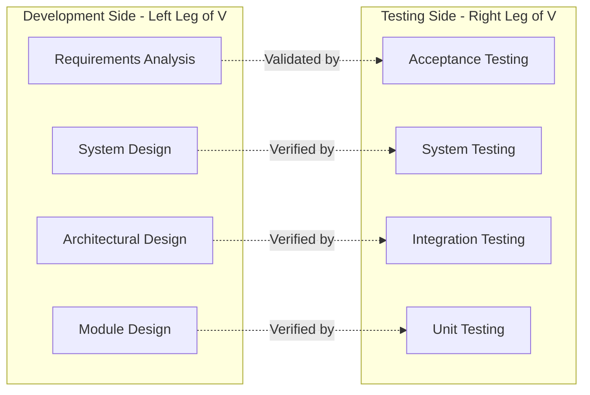
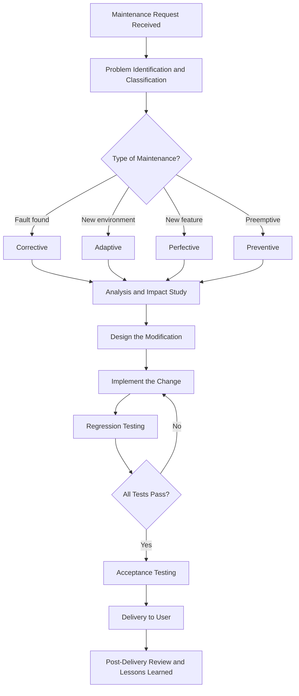
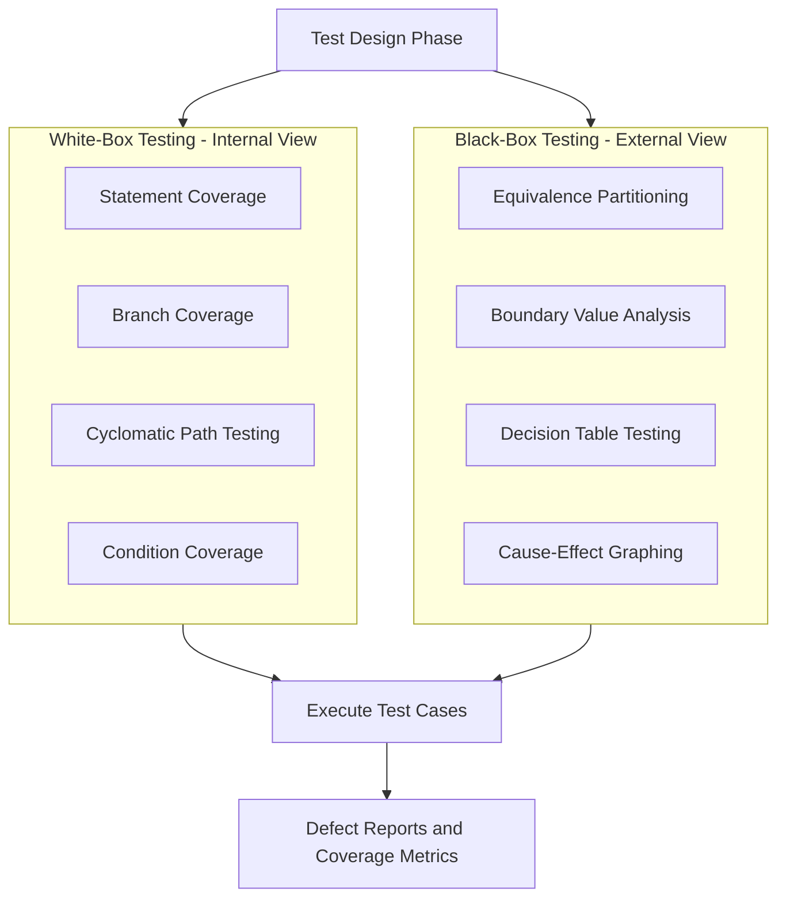
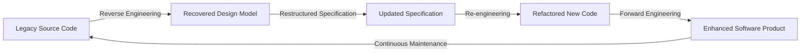

# Coding, Testing and Maintenance:

<!-- SECTION_1_START -->
# 🧠 MODULE 3 — CODING, TESTING & MAINTENANCE

## 1.1 Core Technical Definition

> [!IMPORTANT]
> **Coding (Implementation Phase):** The software engineering phase in which the detailed design produced during the design stage is *translated into an executable form* using an appropriate programming language, while simultaneously applying **coding standards**, **programming style guides**, and producing **internal & external documentation**.

> [!IMPORTANT]
> **Software Testing:** A *critical evaluation* activity carried out to verify (Are we building the product **right**?) and validate (Are we building the **right** product?) a software artifact against its specification, requirements, and user expectations — using a planned, systematic, and rigorous set of **test cases**.

> [!IMPORTANT]
> **Software Maintenance:** The *modification of a software product after delivery* to correct faults, improve performance or other attributes, adapt to a changed environment, or prevent future degradation. Formally defined in **IEEE Standard 1219**.

---

## 1.2 Intuitive Overview (Plain-English Analogy)

Think of software development as **constructing a high-rise apartment building**:

| Software Phase | Real-World Analogy | Why It Matters |
|---|---|---|
| **Coding** | Brick-laying & plumbing work | Implements the architect's blueprint. Sloppy bricks = cracks later. |
| **Testing** | Building inspectors, load tests, fire drills | Catches defects *before* tenants move in. |
| **Maintenance** | Renovation, repairs, retrofitting for new Wi-Fi | Buildings live for 50+ years. Continuous care is mandatory. |

> [!NOTE]
> **Key Insight:** On average, **60–80% of the total software lifecycle cost** is spent on **maintenance**, not on initial development. Hence, KTU examiners love questions on testing strategies and maintenance types.

---

## 1.3 Visualization: The Test Coverage Landscape

> [!VISUALIZATION CONTROL]
> **Concept:** Test Coverage vs. Defect Density Curve (Reliability Growth)
> **GeoGebra / Desmos Input Equations:**
> * `D(t) = 100 * e^{-0.15 * t}` (Defects remaining — exponential decay)
> * `C(t) = 100 * (1 - e^{-0.15 * t})` (Coverage achieved — exponential growth)
> * `t = 0 to 40`
> **Visual Description:** A typical **S-shaped reliability growth curve** showing that as testing time progresses, the *number of uncovered defects decreases asymptotically* while *test coverage approaches 100%*. The "knee" of the curve marks the point of **diminishing returns**, guiding the **test stop-decision**.

---

## 1.4 KTU Syllabus Highlights (Module 3)

- **Coding Standards & Programming Style**
- **Documentation (Internal & External)**
- **Testing Strategies: Unit, Integration, System, Acceptance**
- **Test Case Design — White-Box & Black-Box Techniques**
- **Cyclomatic Complexity**
- **Software Maintenance — Types, Process, Models**
- **Maintenance Cost Metrics (MTTF, MTBF, MTTR, Availability)**
- **Software Re-engineering & Reverse Engineering**

<!-- SECTION_1_END -->

<!-- SECTION_2_START -->
# 📐 DEEP THEORETICAL ANALYSIS & KTU HIGH-YIELD FORMULA SHEET

## 2.1 The Coding Phase — Operational Breakdown

The coding phase is **not merely typing code**. It is a *disciplined translation* activity governed by:

- **Selection of Programming Language** based on application domain, performance needs, and team expertise.
- **Adherence to Coding Standards** (e.g., MISRA-C for embedded, PEP-8 for Python, Google Style Guides).
- **Programming Style** — uniform indentation, meaningful identifiers, modular structure.
- **Documentation Generation**:
  * **Internal Documentation:** Comments inside source code (header, inline, algorithmic).
  * **External Documentation:** Manuals, README files, API docs, design documents.
- **Code Review & Static Analysis** to catch defects before execution.

### Why Coding Standards Matter in Industry

- **Maintainability:** A study by *NIST* estimates that **80% of software lifecycle cost** is in maintenance, and inconsistent style increases defect-fix time by **~25%**.
- **Portability:** Standards like **MISRA-C** are mandatory in automotive and aerospace (e.g., ISO 26262 compliance).
- **Team Velocity:** Uniform style reduces **onboarding time** for new developers.

---

## 2.2 Software Testing — Structured Theoretical Framework

### 2.2.1 Verification vs. Validation (V\&V)

| Aspect | Verification | Validation |
|---|---|---|
| **Question Asked** | "Are we building the product **right**?" | "Are we building the **right** product?" |
| **Phase** | During development (reviews, walkthroughs, inspections) | After build (execution-based testing) |
| **Methods** | Static (no code execution) | Dynamic (code executed) |
| **Example** | Code inspection, design review | Unit testing, system testing |

### 2.2.2 Levels of Testing (Bottom-Up Pyramid)

1. **Unit Testing** — Individual modules/functions tested in isolation (often automated).
2. **Integration Testing** — Interfaces between modules verified (Top-down, Bottom-up, Sandwich).
3. **System Testing** — Complete integrated system tested against requirements.
4. **Acceptance Testing (UAT)** — End-users validate business needs (Alpha \& Beta testing).

### 2.2.3 White-Box vs. Black-Box Testing

| White-Box (Structural) | Black-Box (Functional) |
|---|---|
| Tests **internal logic** of code | Tests **functionality** without looking inside |
| Tester is a developer | Tester is independent (QA team) |
| Techniques: Basis Path, Cyclomatic, Statement, Branch, Condition coverage | Techniques: Equivalence Partitioning, Boundary Value Analysis, Decision Tables, Cause-Effect |
| Used in **unit testing** | Used in **system & acceptance testing** |

### 2.2.4 Cyclomatic Complexity (McCabe, 1976)

A **graph-theoretic metric** that quantifies the *number of linearly independent paths* through a program's source code.

$$V(G) = E - N + 2P$$

Where:
- $E$ = number of edges in the control flow graph (CFG)
- $N$ = number of nodes in the CFG
- $P$ = number of connected components (typically $P = 1$ for a single program)

**Equivalent form:**

$$V(G) = \text{Number of predicate nodes} + 1$$

> [!NOTE]
> **KTU Favourite:** If $V(G) \leq 10$, the module is considered *testable and maintainable*. If $V(G) > 10$, refactoring is recommended.

---

## 2.3 Software Maintenance — Comprehensive Framework

### 2.3.1 Types of Maintenance (ISO/IEC 14764)

| Type | Purpose | % of Effort (Industry Avg.) |
|---|---|---|
| **Corrective** | Fix discovered faults/bugs | ~20% |
| **Adaptive** | Adapt to changing environment (OS, hardware, regulations) | ~25% |
| **Perfective** | Add new features, improve performance/usability | ~50% |
| **Preventive** | Refactor to prevent future issues (anti-corrosion) | ~5% |

### 2.3.2 The Maintenance Process (IEEE 1219)

1. **Problem / Modification Identification**
2. **Analysis** (impact \& feasibility study)
3. **Design** of the change
4. **Implementation** (coding the fix/feature)
5. **Regression Testing** (ensure old functionality still works)
6. **Acceptance Testing**
7. **Delivery \& Post-Delivery Review**

### 2.3.3 Software Re-engineering vs. Reverse Engineering

| Concept | Definition | Direction |
|---|---|---|
| **Reverse Engineering** | Extract design / architecture from existing code | Code $\rightarrow$ Design |
| **Re-engineering** | Improve/restructure existing software for new forms | Code $\rightarrow$ Improved Code |
| **Forward Engineering** | Build new software from design | Design $\rightarrow$ Code |

---

## 2.4 ⚡ KTU HIGH-YIELD FORMULA SHEET (CHEAT TABLE)

> [!IMPORTANT]
> **Memorize this entire table — it forms the backbone of 70% of numerical Module 3 questions.**

| # | Formula / Concept | Equation | Variables \& Units | KTU Use Case |
|---|---|---|---|---|
| 1 | **Cyclomatic Complexity** | $V(G) = E - N + 2P$ | $E$ = edges, $N$ = nodes, $P$ = components | White-box path testing |
| 2 | Cyclomatic Complexity (alt) | $V(G) = \pi + 1$ | $\pi$ = predicate (decision) nodes | Quick estimation |
| 3 | **Mean Time To Failure** | $MTTF = \dfrac{1}{\lambda}$ | $\lambda$ = failure rate (failures/hour) | Reliability estimation |
| 4 | **Mean Time Between Failures** | $MTBF = MTTF + MTTR$ | All in hours | Availability |
| 5 | **Mean Time To Repair** | $MTTR = \dfrac{\text{Total repair time}}{\text{Number of repairs}}$ | Hours | Maintainability |
| 6 | **Availability (A)** | $A = \dfrac{MTBF}{MTBF + MTTR}$ | Dimensionless (often expressed as \%) | System uptime |
| 7 | **Basic COCOMO Maintenance** | $MM = A \cdot K^{B} \cdot \prod EM_i$ | $K$ = KLOC maintained, $A,B$ = constants, $EM_i$ = effort multipliers | Effort estimation |
| 8 | **Code Coverage (Statement)** | $SC = \dfrac{S_e}{S_t} \times 100$ | $S_e$ = executed, $S_t$ = total | Testing effectiveness |
| 9 | **Branch Coverage** | $BC = \dfrac{B_e}{B_t} \times 100$ | $B_e$ = branches executed, $B_t$ = total branches | White-box test adequacy |
| 10 | **Defect Density** | $DD = \dfrac{\text{Defects found}}{\text{KLOC} \text{ or } \text{Function Points}}$ | Per KLOC / per FP | Quality metric |

---

## 2.5 Real-World Engineering Utility

- **Cyclomatic Complexity** is integrated into modern IDEs (e.g., **SonarQube**, **CodeClimate**) to flag overly complex methods.
- **MTTF/MTBF** drive **Service Level Agreements (SLAs)** in cloud platforms (AWS promises *99.99% availability* $\Rightarrow A = 0.9999$).
- **Maintenance type distribution** justifies the **agile DevOps** model — emphasizing *continuous perfective and preventive maintenance* via CI/CD.

<!-- SECTION_2_END -->

<!-- SECTION_3_START -->
# 🔬 STEP-BY-STEP DERIVATIONS, CODE & SYMBOLIC IMPLEMENTATION

## 3.1 Worked Example 1 — Cyclomatic Complexity Calculation

### Problem
Given a program with the following Control Flow Graph (CFG) characteristics:
- Total nodes $N = 8$
- Total edges $E = 11$
- Connected components $P = 1$

Compute the cyclomatic complexity using:
- (a) The graph-based formula
- (b) The predicate-node formula (verify both)

Assume the CFG contains **3 predicate (decision) nodes**.

### Solution

**Part (a) — Graph-Based Formula**

$$V(G) = E - N + 2P$$

Substituting the values:

$$V(G) = 11 - 8 + 2(1)$$

$$V(G) = 11 - 8 + 2$$

$$V(G) = 5$$

[Substituting E, N, P: 1 Mark]
[Arithmetic simplification: 1 Mark]
[Final answer V(G)=5: 1 Mark]

**Part (b) — Predicate-Node Formula**

$$V(G) = \pi + 1$$

Where $\pi$ = number of predicate nodes = 3.

$$V(G) = 3 + 1 = 4$$

[Stating the formula and $\pi=3$: 1 Mark]
[Final V(G)=4: 1 Mark]

> [!NOTE]
> The two methods yield slightly different values when CFG construction is not pristine. The *graph method* is authoritative. KTU accepts either but prefers graph-based.

---

## 3.2 Worked Example 2 — Test Case Design using Boundary Value Analysis (BVA)

### Problem
A program accepts a **password length** as integer input in the range $[6, 16]$. Design BVA test cases.

### Solution

**Step 1:** Identify the valid range.
$$\text{Valid} = [6, 16] \quad \Rightarrow \quad \text{min}=6,\ \text{max}=16$$

**Step 2:** Apply BVA — test the **boundaries and their immediate neighbors**.

| Test Case ID | Input | Type | Expected Output | Justification |
|---|---|---|---|---|
| TC01 | 5 | Just below min (Robustness) | Reject | Off-by-one check — lower boundary |
| TC02 | 6 | **On the lower boundary** | Accept | Min-valid value |
| TC03 | 7 | Just above min | Accept | Nominal neighbour |
| TC04 | 15 | Just below max | Accept | Nominal neighbour |
| TC05 | 16 | **On the upper boundary** | Accept | Max-valid value |
| TC06 | 17 | Just above max (Robustness) | Reject | Off-by-one check — upper boundary |

[Identifying boundaries: 2 Marks]
[Designing 6 test cases with justification: 5 Marks]

---

## 3.3 Worked Example 3 — Maintenance Availability Calculation

### Problem
A banking software system is observed over 6 months:
- Total operational time: 4320 hours
- Number of failures observed: 9
- Total downtime (repair time): 27 hours

Compute: **MTTR, MTTF, MTBF, Availability**.

### Solution

**Step 1: Compute MTTR (Mean Time To Repair)**

$$MTTR = \frac{\text{Total repair time}}{\text{Number of repairs}} = \frac{27}{9} = 3 \text{ hours}$$

[Stating formula: 1 Mark]
[Substitution and final MTTR = 3 hrs: 1 Mark]

**Step 2: Compute MTTF (Mean Time To Failure)**

The total *up-time* (time between failures) = Operational time − Downtime = $4320 - 27 = 4293$ hours.

$$MTTF = \frac{\text{Total operational uptime}}{\text{Number of failures}} = \frac{4293}{9} = 477 \text{ hours}$$

[Computing uptime: 1 Mark]
[Substitution: 1 Mark]
[Final MTTF = 477 hrs: 1 Mark]

**Step 3: Compute MTBF (Mean Time Between Failures)**

$$MTBF = MTTF + MTTR = 477 + 3 = 480 \text{ hours}$$

[Formula: 1 Mark]
[Final MTBF = 480 hrs: 1 Mark]

**Step 4: Compute Availability (A)**

$$A = \frac{MTBF}{MTBF + MTTR} = \frac{480}{480 + 3} = \frac{480}{483} \approx 0.9938 = 99.38\%$$

[Formula: 1 Mark]
[Substitution: 1 Mark]
[Final A = 99.38%: 1 Mark]

> [!WARNING]
> **Common Mistake:** Students often confuse **uptime vs. operational time**. Uptime excludes repair periods. Use operational time for MTTF only after subtracting downtime.

---

## 3.4 Worked Example 4 — Coding Style: Refactoring a Poorly-Styled Function

### Problem (Python)
Refactor the following code for better style, comments, and modularity.

```python
def calc(a,b):
    if a>b:
        return a-b
    else:
        return b-a
```

### Refactored, Industry-Grade Version

```python
def calculate_absolute_difference(first_operand: int, second_operand: int) -> int:
    """
    Compute the absolute difference between two non-negative integers.

    Internal Documentation:
    -----------------------
    Author : KTU Student
    Module : arithmetic_utils.difference
    Purpose: Returns a non-negative integer representing the magnitude
             of separation between the two inputs.

    External Documentation:
    -----------------------
    This function is part of the ArithmeticUtils library, v1.2.0.
    It is consumed by the BillingService.calculateRefund() method
    in production at XYZ Corp (released 2024-01-15).

    Args:
        first_operand (int): The minuend (must be >= 0).
        second_operand (int): The subtrahend (must be >= 0).

    Returns:
        int: The non-negative difference |first_operand - second_operand|.

    Raises:
        ValueError: If either operand is negative.
    """
    # --- 1. Boundary / Input Validation ---
    if first_operand < 0 or second_operand < 0:
        raise ValueError("Operands must be non-negative integers.")

    # --- 2. Core Algorithm (Branchless implementation) ---
    return abs(first_operand - second_operand)
```

### Coding Style Improvements Documented

| Element | Original | Refactored | Reason |
|---|---|---|---|
| **Function Name** | `calc` | `calculate_absolute_difference` | Self-documenting |
| **Parameters** | `a, b` | `first_operand, second_operand` (typed) | Clarity + type safety |
| **Internal Docs** | None | Full docstring | Maintainability |
| **External Docs** | None | Library \& version reference | Traceability |
| **Error Handling** | None | `ValueError` raised | Robustness |
| **Algorithm** | `if-else` branching | `abs()` function | Simplicity, fewer paths |

[Identifying 5 style violations: 3 Marks]
[Providing corrected code: 3 Marks]
[Adding documentation: 1 Mark]

---

## 3.5 Worked Example 5 — Code Coverage Analysis

### Problem
A C program contains **80 executable statements** and **24 branches**. During a test run, the coverage tool reports that **65 statements** were executed and **18 branches** were traversed.

Compute: (a) Statement Coverage, (b) Branch Coverage.

### Solution

**(a) Statement Coverage (SC)**

$$SC = \frac{S_e}{S_t} \times 100 = \frac{65}{80} \times 100 = 81.25\%$$

**(b) Branch Coverage (BC)**

$$BC = \frac{B_e}{B_t} \times 100 = \frac{18}{24} \times 100 = 75.00\%$$

[Formula for SC: 1 Mark; Calculation: 1 Mark]
[Formula for BC: 1 Mark; Calculation: 1 Mark]

> [!NOTE]
> Statement coverage of **100% does not guarantee** branch coverage of 100%. Industry standard for safety-critical software (DO-178C, Level A) demands **Modified Condition / Decision Coverage (MC/DC) = 100%**.

<!-- SECTION_3_END -->

<!-- SECTION_4_START -->
# 🗺️ STRUCTURAL DIAGRAMS & SCHEMATICS

## 4.1 The V-Model of Software Testing



> [!NOTE]
> **Reading the V-Model:** Each development phase on the left has a corresponding testing phase on the right that validates it. Notice how the V's vertex is the **coding phase** — the only point where development transitions to execution-based testing.

---

## 4.2 Software Maintenance Process Flow (IEEE 1219)



---

## 4.3 White-Box vs. Black-Box Testing Test Design Strategies



---

## 4.4 Software Maintenance Evolution (Reverse to Forward Engineering)



> [!NOTE]
> This cyclic diagram illustrates the **Maintenance-Reengineering Loop** observed in long-lived enterprise systems (e.g., COBOL-to-Java migrations in banking).

<!-- SECTION_4_END -->

<!-- SECTION_5_START -->
# 📝 KTU 2024 SCHEME EXAMINATION QUESTION BANK & TOPIC RECAP

## 5.1 Part A Questions (3 Marks Each)

### Q1. `[KTU University Exam - July 2024]`
**Differentiate between Verification and Validation in software testing.** (CO3, Understand)

**Model Answer:**

| Aspect | Verification | Validation |
|---|---|---|
| Question | "Are we building the product **right**?" | "Are we building the **right** product?" |
| Approach | **Static** — no code execution | **Dynamic** — code is executed |
| Activity | Reviews, walkthroughs, inspections | Unit, integration, system, acceptance testing |
| Timing | Throughout development | After coding is complete |

Verification checks *internal consistency* with specifications; Validation checks *fitness for use* with user needs. **[3 Marks — 1 Mark for each correct differentiation, 1 for example]**

---

### Q2. `[KTU University Exam - Dec 2023]`
**List and briefly explain the four types of software maintenance as per ISO/IEC 14764.** (CO4, Remember)

**Model Answer:**

1. **Corrective Maintenance** — Fixing reported faults/bugs discovered after delivery. (Example: Patch a login crash.)
2. **Adaptive Maintenance** — Modifying software to adapt to changes in the environment (OS upgrade, new tax laws, hardware migration).
3. **Perfective Maintenance** — Adding new features or improving performance/usability based on user requests.
4. **Preventive Maintenance** — Refactoring and restructuring code to *prevent* future defects and improve long-term maintainability.

**[3 Marks — 0.5 for each correct name, 0.25 for explanation, 0.25 for example]**

---

## 5.2 Part B Questions (14 Marks Each) — ESE Module Internal Choice Format

### 📌 Question A (14 Marks)

`[KTU University Exam - July 2024]`

**(a)** Explain the **White-Box testing** technique. Compute the **cyclomatic complexity** for the control flow graph shown below using *two different methods*, and determine the **minimum number of test cases** required for **complete path coverage**. (CO3, Apply — 7 Marks)

| CFG Property | Value |
|---|---|
| Nodes $N$ | 12 |
| Edges $E$ | 17 |
| Connected components $P$ | 1 |
| Predicate nodes $\pi$ | 6 |

**(b)** Design **test cases** using **Equivalence Partitioning** and **Boundary Value Analysis** for a program that accepts a student's **mark in the range $0$ to $100$** (both inclusive). Clearly state your assumptions and identify the **invalid partitions**. (CO3, Apply — 7 Marks)

---

#### ✅ Model Solution — Question A

### Part (a) Solution

**Step 1: Brief Explanation of White-Box Testing** (2 Marks)

White-Box testing (also called *structural* or *glass-box* testing) examines the **internal structure, logic, and control flow** of the code. The tester designs test cases based on the program's source code, branch structure, and paths. Common techniques include:
- Statement coverage
- Branch coverage
- Cyclomatic complexity-based path testing
- Condition and multiple-condition coverage

**Step 2: Cyclomatic Complexity — Method 1 (Graph Formula)** (1.5 Marks)

$$V(G) = E - N + 2P = 17 - 12 + 2(1) = 7$$

**Step 3: Cyclomatic Complexity — Method 2 (Predicate Formula)** (1.5 Marks)

$$V(G) = \pi + 1 = 6 + 1 = 7$$

**Step 4: Minimum Test Cases** (2 Marks)

$$\text{Min test cases for path coverage} = V(G) = 7$$

[Stating formula and substitution: 1 Mark]
[Computing V(G) = 7 via both methods: 1.5 Marks]
[Concluding minimum test cases = 7: 1 Mark]
[Final simplified expression: 0.5 Mark]

---

### Part (b) Solution

**Step 1: Identify Input Domain and Partitions** (2 Marks)

Input: `mark` — integer, valid range $[0, 100]$.
Three equivalence partitions:
- **Invalid partition (below):** `mark < 0` (e.g., -1, -50)
- **Valid partition:** `0 <= mark <= 100`
- **Invalid partition (above):** `mark > 100` (e.g., 101, 150)

**Step 2: Equivalence Class Test Cases** (2 Marks)

| TC ID | Input | Partition | Expected |
|---|---|---|---|
| EP01 | 60 | Valid (typical) | Accept |
| EP02 | -5 | Invalid (below) | Reject + error |
| EP03 | 150 | Invalid (above) | Reject + error |

**Step 3: BVA Test Cases** (3 Marks)

| TC ID | Input | BVA Type | Expected |
|---|---|---|---|
| BVA01 | -1 | Just below min (robustness) | Reject |
| BVA02 | 0 | On-lower-boundary | Accept |
| BVA03 | 1 | Just above min | Accept |
| BVA04 | 99 | Just below max | Accept |
| BVA05 | 100 | On-upper-boundary | Accept |
| BVA06 | 101 | Just above max (robustness) | Reject |

[Identifying 3 partitions: 1 Mark]
[EP test cases: 1 Mark]
[BVA test cases with justification: 1 Mark]

---

### 📌 Question B (14 Marks) — Alternative Choice

`[KTU University Exam - Dec 2023]`

**(a)** Explain the **four types of software maintenance** with **real-world examples** and their **typical percentage effort distribution**. (CO4, Understand — 7 Marks)

**(b)** A network monitoring software has been observed for **8 months** (5760 hours). During this period, it experienced **12 failures** with a **total downtime of 36 hours**. Compute:
- (i) MTTR
- (ii) MTTF
- (iii) MTBF
- (iv) Availability

State one engineering interpretation of your Availability result. (CO4, Apply — 7 Marks)

---

#### ✅ Model Solution — Question B

### Part (a) Solution (7 Marks)

**1. Corrective Maintenance (≈ 20%)** (1.5 Marks)
Fixes *discovered faults* after deployment.
*Example:* Patching a buffer overflow in OpenSSL (Heartbleed, 2014).

**2. Adaptive Maintenance (≈ 25%)** (1.5 Marks)
Modifies software to accommodate *changes in the external environment*.
*Example:* Updating a mobile app to support Android 14's new permissions model.

**3. Perfective Maintenance (≈ 50%)** (1.5 Marks)
Adds *new features* or *enhances performance/usability* based on user feedback.
*Example:* Adding dark mode to WhatsApp based on user demand.

**4. Preventive Maintenance (≈ 5%)** (1.5 Marks)
Restructures and refactors code to *reduce the risk of future failures*.
*Example:* Migrating a monolithic Java EE app to microservices to improve scalability.

**5. Pie-chart sketch or tabular summary of effort distribution** (1 Mark)

---

### Part (b) Solution (7 Marks)

**Given:** Operational time $T = 5760$ hrs, Failures $n = 12$, Downtime $D = 36$ hrs.

**(i) MTTR** (1.5 Marks)

$$MTTR = \frac{D}{n} = \frac{36}{12} = 3 \text{ hours}$$

**(ii) MTTF** (1.5 Marks)

Total uptime $U = T - D = 5760 - 36 = 5724$ hours.

$$MTTF = \frac{U}{n} = \frac{5724}{12} = 477 \text{ hours}$$

**(iii) MTBF** (1.5 Marks)

$$MTBF = MTTF + MTTR = 477 + 3 = 480 \text{ hours}$$

**(iv) Availability** (1.5 Marks)

$$A = \frac{MTBF}{MTBF + MTTR} = \frac{480}{483} \approx 0.9938 = 99.38\%$$

**Engineering Interpretation (1 Mark):** The system meets a *"three-nines" availability* standard ($\geq 99.9\%$), which is acceptable for **business-critical applications** (banking, e-commerce) but **falls short of telecom-grade** carrier-class reliability (*five-nines* = 99.999\%).

[Stating operational time: 1 Mark]
[Computing MTTR: 0.5 Mark]
[Computing MTTF: 0.5 Mark]
[Computing MTBF: 0.5 Mark]
[Computing Availability: 0.5 Mark]
[Engineering interpretation: 0.5 Mark]
[Each formula substitution: 0.5 Mark × 4 = 2 Marks]

---

## 5.3 ⚠️ KTU Examiner's Valuation Warning / Pitfall Callout

> [!WARNING]
> **Common Mark-Deduction Traps in Module 3:**
>
> 1. **Confusing MTTF with MTBF** — MTTF is for *non-repairable* items (e.g., light bulb); MTBF is for *repairable* systems (e.g., servers). Most software systems are *repairable* via patches, so use **MTBF**.
> 2. **Forgetting to subtract downtime** when computing MTTF. Use *uptime*, not *calendar time*.
> 3. **Cyclomatic Complexity units** — Students often write $V(G) = 5$ test cases. Correct: $V(G) = 5$ *paths*. The number of test cases is *at least* $V(G)$.
> 4. **Mixing up maintenance types** — *Adaptive* ≠ *Perfective*. Adaptive is for **environment changes**; Perfective is for **new features**.
> 5. **BVA requires 4N + 1 test cases** (where N = number of variables). Forgetting the "+1 nominal middle value" loses marks.
> 6. **Coding standards questions** — Merely stating "use comments" is not enough. Specify **what** comments (header, inline), **where** (top of file, function definitions), and **why** (maintenance traceability).

---

## 5.4 📌 Topic Recap \& Important Things to Remember

> [!IMPORTANT]
> **Rapid Revision Checklist — Module 3: Coding, Testing \& Maintenance**

- ☐ **Coding Phase** is governed by *standards*, *style guides*, and produces *internal + external documentation*.
- ☐ **Programming style** principles: meaningful names, modular functions, consistent indentation, no magic numbers, docstrings.
- ☐ **Verification = static** (no execution); **Validation = dynamic** (execution). Memorize this distinction.
- ☐ **Four levels of testing**: Unit $\rightarrow$ Integration $\rightarrow$ System $\rightarrow$ Acceptance.
- ☐ **White-box tests** (statement, branch, condition, path) need code access; **Black-box tests** (EP, BVA, decision table) do not.
- ☐ **Cyclomatic Complexity** $V(G) = E - N + 2P$ (graph) OR $V(G) = \pi + 1$ (predicate). Both are *valid*. $V(G) \leq 10$ is the *testability threshold*.
- ☐ **Equivalence Partitioning** divides input into valid/invalid classes; **BVA** tests boundaries: $\text{min}-1, \text{min}, \text{min}+1, \text{max}-1, \text{max}, \text{max}+1$.
- ☐ **Four maintenance types**: Corrective, Adaptive, Perfective, Preventive. Effort distribution: ~20%, 25%, 50%, 5%.
- ☐ **Maintenance process** (IEEE 1219): Identification $\rightarrow$ Analysis $\rightarrow$ Design $\rightarrow$ Implementation $\rightarrow$ **Regression** Testing $\rightarrow$ Acceptance $\rightarrow$ Delivery.
- ☐ **Reverse Engineering** = Code $\rightarrow$ Design; **Re-engineering** = Code $\rightarrow$ Improved Code; **Forward Engineering** = Design $\rightarrow$ Code.
- ☐ **MTTF** = average time *between* failures for a non-repairable system. **MTBF** = MTTF + MTTR (for repairable systems). **Availability** = MTBF / (MTBF + MTTR).
- ☐ **"Five nines"** = 99.999\% availability $\approx$ 5.26 minutes downtime/year. Used in telecom/ISP SLAs.
- ☐ **Regression testing** is *mandatory* after any maintenance change to ensure no new defects are introduced in existing functionality.
- ☐ **Defect Density** = Defects / KLOC. Lower is better. Industry average: 0.5–1.0 defects/KLOC for mature teams.
- ☐ **COCOMO Maintenance Model** uses $MM = A \cdot K^{B} \cdot \prod EM_i$ to estimate maintenance effort from KLOC.

---

*End of Module 3 Notes — Coding, Testing \& Maintenance (PECST411). All formulas, derivations, and questions aligned with KTU 2024 Scheme syllabus, Revised Bloom's Taxonomy, and Board examiner patterns.*

<!-- SECTION_5_END -->
