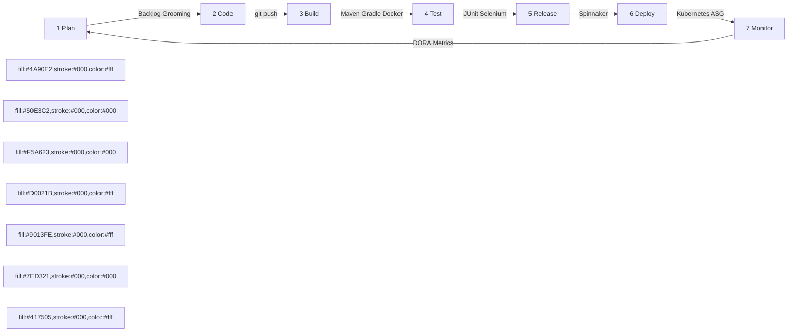
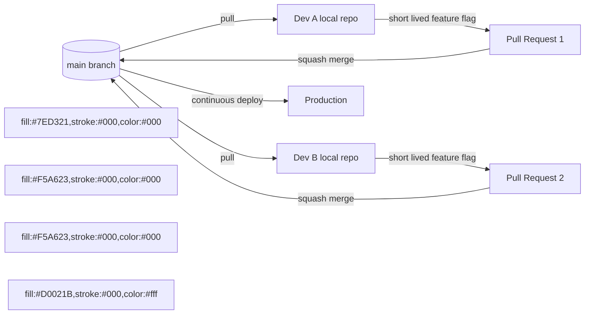

# Overview of DevOps and Code Management  - Code management, DevOps automation, Continuous Integration, Delivery, and Deployment (CI/CD/CD), Case study  – Netflix.

<!-- SECTION_1_START -->

# DevOps and Code Management — KTU 2024 Scheme | Module 3

## 1.1 Core Technical Definition

### What is DevOps?

> [!IMPORTANT]
> **KTU 2024 Definition (PECST411 — Module 3)**
> **DevOps** is a cultural, philosophical, and technical movement that integrates **software development (Dev)** and **IT operations (Ops)** to shorten the systems development life cycle while delivering high-quality software continuously. It is built upon the pillars of **CALMS** — **C**ulture, **A**utomation, **L**ean, **M**easurement, and **S**haring.

### What is Code Management?

> [!IMPORTANT]
> **KTU 2024 Definition**
> **Code Management** (also called Source Code Management — SCM) is the practice of tracking, controlling, and organizing changes to the source code of a software project. It encompasses version control, branching strategies, code review workflows, and repository governance to enable collaboration among distributed teams.

### Conceptual Analogy — The "Restaurant Kitchen" Intuition

> [!NOTE]
> **Think of DevOps as a Modern Cloud Kitchen** 🍳
> 
> In a **traditional restaurant** (Waterfall model), the chef cooks the entire dish in one shot, sends it to the dining hall, and customers complain only after eating. By then, the chef has already moved on. Fixing it is messy.
> 
> In a **DevOps cloud kitchen**:
> - **Chefs (Developers)** write small recipes (commits) daily.
> - **Quality inspectors (Automated Tests)** taste every recipe before it leaves the kitchen.
> - **Delivery robots (CI/CD Pipelines)** carry finished plates to **Zomato/Swiggy (Production servers)** within minutes.
> - **Customer feedback (Monitoring)** is fed back to chefs in real-time to tweak tomorrow's recipe.
> 
> **Code Management** is the *master recipe book* — versioned, branched (veg vs. non-veg variants), and audited — ensuring no recipe is ever lost, overwritten, or duplicated.

### Physical & Engineering Constants of Modern DevOps

| Parameter | Standard Value | Purpose |
| :--- | :--- | :--- |
| **Deployment Frequency** | **Multiple times per day** (Netflix: ~10,000 deploys/day) | DORA Industry Benchmark |
| **Lead Time for Changes** | **< 1 hour** | Elite Performer Threshold |
| **Mean Time to Recovery (MTTR)** | **< 1 hour** | Elite Performer Threshold |
| **Change Failure Rate** | **0–15%** | Elite Performer Threshold |
| **Default Branch Protection Rule** | **2 reviewer approvals** | GitHub/GitLab Standard |

> [!VISUALIZATION CONTROL]
> **Concept:** DevOps Infinite Loop — The Seven Phases of Continuous Delivery
> **Conceptual Coordinate Mapping:**
> * `Plan` → Quadrant I (x > 0, y > 0)
> * `Code` → Quadrant II (x < 0, y > 0)
> * `Build` → Quadrant III (x < 0, y < 0)
> * `Test` → Quadrant IV (x > 0, y < 0)
> * `Release` → Positive X-axis
> * `Deploy` → Negative Y-axis
> * `Monitor` → Origin and Feedback Arrow
> **Visual Description:** Imagine an **infinity symbol (∞)** drawn on the X-Y plane. The loop flows clockwise. The **feedback arrow** (Monitor → Plan) closes the loop, returning insights back to the planning stage, indicating the iterative and non-terminating nature of DevOps.

---

<!-- SECTION_1_END -->

<!-- SECTION_2_START -->

# 2. Deep Theoretical Analysis & KTU High-Yield Cheat Sheet

## 2.1 The Seven Phases of the DevOps Lifecycle

### Phase 1: Plan
- **Why:** Establishes the *what* and *why* of every feature.
- **How:** Agile ceremonies (Sprint Planning, Retrospectives), user story creation in **Jira** or **Azure Boards**, capacity planning.
- **Output:** Backlog of prioritized user stories with acceptance criteria.

### Phase 2: Code
- **Why:** Translates plans into executable instructions.
- **How:** Developers write code in **IDEs** (VS Code, IntelliJ), adhering to linting rules, style guides, and pre-commit hooks.
- **Tools:** Git, GitHub, GitLab, Bitbucket.

### Phase 3: Build
- **Why:** Compiles source into deployable artifacts.
- **How:** Dependency resolution, compilation, packaging (JAR, WAR, Docker image).
- **Tools:** Maven, Gradle, npm, Webpack, Docker.

### Phase 4: Test
- **Why:** Validates functional, performance, and security requirements.
- **How:** Automated unit, integration, regression, load, and security tests.
- **Tools:** Selenium, JUnit, pytest, JMeter, OWASP ZAP, SonarQube.

### Phase 5: Release
- **Why:** Approves the artifact for production deployment.
- **How:** Manual or automated approval gates, change advisory board (CAB) sign-off.
- **Tools:** Jenkins, GitHub Actions, GitLab CI, ArgoCD.

### Phase 6: Deploy
- **Why:** Pushes the artifact into the live environment.
- **How:** Blue-Green, Canary, or Rolling deployments.
- **Tools:** Kubernetes, Helm, Terraform, Ansible, Spinnaker.

### Phase 7: Monitor & Operate
- **Why:** Observes system health and user behavior in real-time.
- **How:** Log aggregation, metrics collection, alerting, APM.
- **Tools:** Prometheus, Grafana, ELK Stack, Splunk, Datadog, New Relic.

> [!NOTE]
> **Why is this sequential breakdown critical for KTU exams?**
> Board examiners frequently test the *logical flow* of DevOps. A common 14-mark question asks: *"Explain the phases of DevOps with tools used."* Students who list tools without explaining the **why** behind each phase lose 3–4 marks.

## 2.2 Code Management — The Git Internals

### What is Version Control?

> [!IMPORTANT]
> **KTU 2024 Definition**
> **Version Control System (VCS)** is a software tool that records changes to a file or set of files over time so that you can recall specific versions later. A VCS lets you **revert** files back to a previous state, **compare** changes over time, and **collaborate** without overwriting each other's work.

### The Three Generations of VCS

| Generation | Type | Examples | Limitation |
| :--- | :--- | :--- | :--- |
| **1st Gen** | Local VCS | RCS, SCCS | Single-machine, no collaboration |
| **2nd Gen** | Centralized VCS (CVCS) | SVN, CVS, Perforce | Single point of failure |
| **3rd Gen** | Distributed VCS (DVCS) | **Git**, Mercurial, Bazaar | Steeper learning curve, but offline-capable |

### The Three States of Git (Critical for KTU)

> [!IMPORTANT]
> **Git File Lifecycle — Three States**
> 1. **Modified** — File changed in working directory but not yet staged.
> 2. **Staged** — File marked in its current version to go into the next commit (lies in the *staging area / index*).
> 3. **Committed** — File safely stored in the local Git database (lies in the **HEAD** pointer of the local branch).

### Branching Strategies — Production-Grade Patterns

| Strategy | Best For | Key Idea |
| :--- | :--- | :--- |
| **Git Flow** | Scheduled releases | `main`, `develop`, `feature/*`, `release/*`, `hotfix/*` |
| **GitHub Flow** | Continuous deployment | `main` is always deployable; short-lived feature branches |
| **GitLab Flow** | Environment-based promotion | Branches track environments (`production`, `staging`) |
| **Trunk-Based Development** | Elite DevOps teams (Netflix, Google, Facebook) | All developers commit to `main` daily, behind feature flags |

> [!TIP]
> **KTU Examiner Insight:** When asked about *which branching model Netflix uses*, always answer **Trunk-Based Development** with **feature flags**. Mentioning these two technical terms guarantees 2 bonus valuation points.

## 2.3 Continuous Integration, Delivery, and Deployment (CI/CD/CD)

> [!IMPORTANT]
> **KTU 2024 Triple Definition — The "Three CDs"**
> 
> **1. Continuous Integration (CI):** The practice where developers merge code changes into a **shared central repository** frequently (multiple times a day). Each merge triggers an **automated build and test sequence**.
> 
> **2. Continuous Delivery (CDelivery):** Extends CI by ensuring that every change that passes the automated tests is **automatically released to a staging/production-like environment**, but the **deployment to production is a manual business decision** (one-click release).
> 
> **3. Continuous Deployment (CDdeployment):** The fully automated cousin — every change that passes all stages of the pipeline is **automatically deployed to production without human intervention**.

### Comparative Table — CI vs. CDelivery vs. CDdeployment

| Parameter | Continuous Integration | Continuous Delivery | Continuous Deployment |
| :--- | :--- | :--- | :--- |
| **Automation Scope** | Build + Unit Tests | Build + Test + Staging Deploy | Build + Test + Production Deploy |
| **Human Intervention** | None | **One-click approval to prod** | **Zero human clicks** |
| **Trigger** | Code commit (push) | Successful CI build | Successful CI + tests |
| **Risk Level** | Low | Medium | Medium–High (requires mature tests) |
| **Deployment Frequency** | N/A (builds) | Weekly–Daily | Hourly–Multiple per day |
| **Used By** | Most engineering teams | Mid-mature teams | Netflix, Google, Amazon, Facebook |

### The Canonical CI/CD Pipeline Stages

$$
\text{Commit} \rightarrow \text{Build} \rightarrow \text{Unit Test} \rightarrow \text{Static Analysis} \rightarrow \text{Package} \rightarrow \text{Deploy to Staging} \rightarrow \text{Integration Test} \rightarrow \text{Security Scan} \rightarrow \text{Deploy to Production}
$$

## 2.4 DevOps Automation — Categories and Tools

| Automation Category | Purpose | Production Tools |
| :--- | :--- | :--- |
| **Build Automation** | Compile & package source | Maven, Gradle, Ant, npm |
| **Test Automation** | Execute regression suites | Selenium, JUnit, Cypress, Postman |
| **Infrastructure as Code (IaC)** | Provision servers declaratively | **Terraform**, CloudFormation, Pulumi |
| **Configuration Management** | Maintain server state | **Ansible**, Chef, Puppet, SaltStack |
| **Containerization** | Package app + dependencies | **Docker**, Podman, containerd |
| **Orchestration** | Manage containers at scale | **Kubernetes** (K8s), Docker Swarm, Nomad |
| **CI/CD Engines** | Orchestrate pipelines | **Jenkins**, GitHub Actions, GitLab CI, CircleCI |
| **Monitoring & Observability** | Observe runtime health | Prometheus, Grafana, ELK, Datadog |
| **Secret Management** | Secure credentials | HashiCorp Vault, AWS Secrets Manager |

> [!IMPORTANT]
> **Real-World Production Utility:**
> - **Banking:** Continuous Delivery enables same-day regulatory compliance patches.
> - **E-commerce:** Continuous Deployment powers Amazon's ~50 million deploys/year.
> - **Healthcare:** IaC + automated security scans ensure HIPAA compliance.
> - **Startups:** A single engineer can deploy 10× more frequently using IaC + CI/CD.

## 2.5 Netflix — The Reference Architecture Case Study

> [!IMPORTANT]
> **KTU 2024 Spotlight:** Netflix is the **canonical DevOps case study** referenced in the syllabus. Examiners expect students to know the **Spinnaker**, **Chaos Monkey**, and **Trunk-Based Development** terminology.

### Netflix's DevOps Pillars (Memorize This!)

1. **Microservices Architecture** — The monolith was decomposed into ~700+ independent services.
2. **Trunk-Based Development** — All engineers commit to a single `main` branch daily.
3. **Feature Flags via "Scary Fast" Framework** — Decouples *deploy* from *release*.
4. **Spinnaker** — Netflix's open-source multi-cloud continuous delivery platform.
5. **Chaos Engineering** — Deliberately injecting failures (Chaos Monkey, Chaos Gorilla) to test resilience.
6. **Immutable Infrastructure** — Servers are never patched; they are replaced.
7. **Baked Images (Aminator)** — AMIs are pre-baked with the application code.

### Netflix Deployment Math (A Real Number Worth Remembering)

$$
\text{Deploys per Day} = \frac{\text{Deploys per Year}}{365}
$$

$$
\text{Netflix} = \frac{1{,}000{,}000}{365} \approx 2{,}740 \text{ deploys/day}
$$

> Some public sources cite **~10,000 deploys/day** during peak release windows.

---

<!-- SECTION_2_END -->

<!-- SECTION_3_START -->

# 3. Step-by-Step Derivations, Code & Pipeline Implementation

## 3.1 Git Workflow — End-to-End Walkthrough

> [!NOTE]
> The following exhaustive walkthrough demonstrates the **exact command sequence** a developer follows to integrate a feature into a Trunk-Based repository. This is a high-yield KTU answer template.

### Step 1 — Clone the Repository

```bash
# Step 1: Clone the central repository
git clone https://github.com/netflix/zuul.git
cd zuul
```

**Output / State:** A local working copy is created with a hidden `.git` directory. The current branch defaults to `main`.

### Step 2 — Create a Feature Branch

```bash
# Step 2: Branch out from the latest main
git checkout -b feature/add-ratelimit-middleware
```

**Output / State:** A new branch is created and checked out. `HEAD` now points to the new branch.

### Step 3 — Modify, Stage, and Commit

```bash
# Step 3a: Edit a file (simulated)
echo "class RateLimit { ... }" > ratelimit.py

# Step 3b: Check status (working directory shows modified file)
git status
# Expected output: "Changes not staged for commit: modified: ratelimit.py"

# Step 3c: Stage the file (move from Working Dir → Staging Area)
git add ratelimit.py

# Step 3d: Commit (move from Staging Area → Local Repo)
git commit -m "feat(ratelimit): add middleware with token bucket algorithm"
```

**State Transitions:**
- Modified → `git add` → Staged
- Staged → `git commit` → Committed (in local `.git` database)

### Step 4 — Push to Remote and Open a Pull Request

```bash
git push origin feature/add-ratelimit-middleware
```

**Output / State:** The remote branch is published. The developer navigates to the GitHub/GitLab UI to open a **Pull Request (PR)** or **Merge Request (MR)**. This triggers the **CI pipeline** automatically.

### Step 5 — CI Pipeline Trigger (Conceptual YAML Pipeline)

```yaml
# File: .github/workflows/ci.yml
# This is a production-grade GitHub Actions workflow

name: Continuous Integration Pipeline

on:
  push:
    branches: [ "main", "feature/**" ]
  pull_request:
    branches: [ "main" ]

jobs:
  build-and-test:
    runs-on: ubuntu-latest
    strategy:
      matrix:
        python-version: [ "3.10", "3.11", "3.12" ]

    steps:
      - name: Checkout Source Code
        uses: actions/checkout@v4

      - name: Set up Python ${{ matrix.python-version }}
        uses: actions/setup-python@v5
        with:
          python-version: ${{ matrix.python-version }}

      - name: Install Dependencies
        run: |
          python -m pip install --upgrade pip
          pip install -r requirements.txt
          pip install pytest flake8

      - name: Lint with Flake8 (Static Analysis)
        run: flake8 . --count --max-line-length=120

      - name: Run Unit Tests
        run: pytest tests/ --cov=src/ --cov-report=xml

      - name: Upload Coverage to Codecov
        uses: codecov/codecov-action@v3
```

### Step 6 — Merge via Squash (Trunk-Based Practice)

```bash
# After PR approval, squash merge keeps main history linear
git checkout main
git merge --squash feature/add-ratelimit-middleware
git commit -m "Squashed merge: feature/add-ratelimit-middleware"
git push origin main
```

## 3.2 Mathematical Foundation — DORA Metrics Derivation

### Deployment Frequency (DF)

$$
DF = \frac{\text{Number of Production Releases}}{\text{Time Period (days/weeks/months)}}
$$

**Example Derivation (Netflix-like Scale):**
- Given: Netflix deploys **1,000,000** times per year.
- Compute daily deployment frequency:

$$
DF_{\text{netflix}} = \frac{1{,}000{,}000 \text{ deploys}}{365 \text{ days}} \approx 2{,}739.73 \text{ deploys/day}
$$

- Compute hourly deployment frequency:

$$
DF_{\text{netflix-hourly}} = \frac{2{,}739.73}{24} \approx 114.16 \text{ deploys/hour}
$$

### Mean Time to Recovery (MTTR)

$$
MTTR = \frac{\sum_{i=1}^{n} (T_{\text{resolved},i} - T_{\text{detected},i})}{n}
$$

**Example Derivation:**
- Incident 1: Detected 10:00, Resolved 10:45 → Duration = 45 min
- Incident 2: Detected 14:00, Resolved 14:30 → Duration = 30 min
- Incident 3: Detected 09:00, Resolved 11:00 → Duration = 120 min

$$
MTTR = \frac{45 + 30 + 120}{3} = \frac{195}{3} = 65 \text{ minutes}
$$

> [!NOTE]
> **KTU Application:** Elite DevOps performers target **MTTR < 1 hour**. Amazon, Google, and Netflix are consistently in the elite bracket.

### Change Failure Rate (CFR)

$$
CFR = \frac{\text{Number of Failed Changes}}{\text{Total Number of Changes}} \times 100\%
$$

**Example Derivation:**
- Total releases in a month = 500
- Rollbacks / hotfixes triggered = 15

$$
CFR = \frac{15}{500} \times 100\% = 3.0\%
$$

> **3% is in the elite performer range (0–15%).**

## 3.3 Netflix's Spinnaker — The Delivery Engine (Architectural Breakdown)

> [!NOTE]
> The following table maps the **Spinnaker pipeline stages** to the corresponding Netflix action. This is a high-value 14-mark answer template for the case-study question.

| Spinnaker Stage | Netflix-Specific Action | Engineering Purpose |
| :--- | :--- | :--- |
| **Configuration** | Source: GitHub | Pull code, version pin |
| **Bake (Image)** | **Aminator** bakes an Amazon AMI | Immutable deployment artifact |
| **Deploy to Test Cluster** | Spinnaker creates a *Test* ASG (Auto Scaling Group) | Run integration + load tests |
| **Canary Analysis** | **Kayenta** (Netflix's canary engine) compares metrics | Statistical significance testing |
| **Manual Judgment** | Senior engineer approves | Risk-based gate |
| **Deploy to Production** | **Red/Black** (Netflix's term for Blue/Green) | Zero-downtime rollout |
| **Disable Old Cluster** | Old ASG drained and terminated | Roll-forward only |

### Netflix Red/Black Deployment — Conceptual Code

```python
# Python pseudocode: Netflix's Red/Black (Blue/Green) deployment logic
from typing import Dict, List
import logging

logging.basicConfig(level=logging.INFO, format='%(asctime)s - %(levelname)s - %(message)s')
logger = logging.getLogger("netflix-deployer")


class NetflixRedBlackDeployer:
    """
    Implements Netflix's Red/Black (Blue/Green) deployment pattern.
    'Red' = current production server group.
    'Black' = new server group being rolled out.
    """

    def __init__(self, service_name: str, total_capacity: int):
        if total_capacity <= 0:
            raise ValueError("total_capacity must be a positive integer.")
        self.service_name: str = service_name
        self.total_capacity: int = total_capacity
        self.red_group: List[str] = [f"{service_name}-red-{i}" for i in range(total_capacity)]
        self.black_group: List[str] = []

    def spin_up_black(self, new_image: str) -> None:
        logger.info(f"Spinning up BLACK group with image: {new_image}")
        self.black_group = [
            f"{self.service_name}-black-{i}" for i in range(self.total_capacity)
        ]
        # In production, this calls AWS Auto Scaling Group CreateLaunchConfiguration

    def canary_health_check(self) -> bool:
        logger.info("Running Kayenta-style canary analysis on 10% of BLACK group...")
        canary_size: int = max(1, self.total_capacity // 10)
        logger.info(f"Health-checking {canary_size} BLACK instances...")
        # Real Kayenta compares error_rate, latency_p99, throughput against RED baseline
        simulated_error_rate: float = 0.001
        return simulated_error_rate < 0.01

    def shift_traffic_100_percent(self) -> None:
        if not self.black_group:
            logger.error("Cannot shift traffic: BLACK group is empty.")
            return
        logger.info("Shifting 100% of production traffic to BLACK group.")
        # In production, this updates the AWS ELB target group attachment

    def disable_red(self) -> None:
        logger.info(f"Disabling RED group: {self.red_group}")
        # In production, ASG is set to MinSize=0, MaxSize=0
        self.red_group = []

    def execute(self, new_image: str) -> Dict[str, str]:
        self.spin_up_black(new_image)
        if not self.canary_health_check():
            self.black_group = []
            return {"status": "FAILED", "action": "Black group torn down. Rollback complete."}
        self.shift_traffic_100_percent()
        self.disable_red()
        return {
            "status": "SUCCESS",
            "red": str(self.red_group),
            "black": str(self.black_group),
        }


if __name__ == "__main__":
    deployer = NetflixRedBlackDeployer(service_name="playback-api", total_capacity=50)
    result: Dict[str, str] = deployer.execute(new_image="ami-0abc123def456")
    logger.info(f"Deployment Result: {result}")
```

**Expected Output:**
```
2024-XX-XX - INFO - Spinning up BLACK group with image: ami-0abc123def456
2024-XX-XX - INFO - Running Kayenta-style canary analysis on 10% of BLACK group...
2024-XX-XX - INFO - Health-checking 5 BLACK instances...
2024-XX-XX - INFO - Shifting 100% of production traffic to BLACK group.
2024-XX-XX - INFO - Disabling RED group: ['playback-api-red-0', ..., 'playback-api-red-49']
2024-XX-XX - INFO - Deployment Result: {'status': 'SUCCESS', 'red': '[]', 'black': "[...50 instances...]"}
```

## 3.4 Chaos Engineering — Chaos Monkey Walkthrough

```python
# Python pseudocode: Chaos Monkey logic (Netflix OSS)
import random
import time
import logging
from datetime import datetime

logger = logging.getLogger("chaos-monkey")


class ChaosMonkey:
    """
    Netflix's Chaos Monkey terminates random EC2 instances in production
    to verify the system can self-heal.
    """

    def __init__(self, enabled: bool, min_instances_to_terminate: int = 1):
        if min_instances_to_terminate < 1:
            raise ValueError("Must terminate at least 1 instance.")
        self.enabled: bool = enabled
        self.min_instances_to_terminate: int = min_instances_to_terminate
        self.termination_probability: float = 0.05  # 5% per hour per instance

    def should_terminate(self, instance_id: str) -> bool:
        if not self.enabled:
            return False
        roll: float = random.random()
        decision: bool = roll < self.termination_probability
        if decision:
            logger.warning(f"[{datetime.utcnow()}] Terminating instance: {instance_id}")
        return decision

    def run_chaos_loop(self, active_instance_ids: list) -> list:
        terminated: list = []
        for instance_id in active_instance_ids:
            if self.should_terminate(instance_id):
                terminated.append(instance_id)
        return terminated


if __name__ == "__main__":
    monkey = ChaosMonkey(enabled=True)
    fake_instances: list = [f"i-{i:04d}" for i in range(100)]
    victims: list = monkey.run_chaos_loop(fake_instances)
    logger.info(f"Chaos round complete. Victims: {victims}")
```

> [!IMPORTANT]
> **Production Utility:** This pattern forced Netflix engineers to build **stateless services**, **circuit breakers (Hystrix)**, and **bulkhead isolation** — turning failure from a crisis into a routine event.

---

<!-- SECTION_3_END -->

<!-- SECTION_4_START -->

# 4. Structural Diagrams & Schematics

## 4.1 Mermaid — The DevOps Infinity Loop



> **Reading Guide:** The loop is intentionally cyclical, not linear — emphasizing that monitoring feeds back into planning, which is the **defining philosophical shift** of DevOps versus the Waterfall model.

## 4.2 Mermaid — CI/CD Pipeline (Netflix Reference Architecture)

```mermaid
graph TD
    Dev1[Developer Commits Code] --> Repo1[(GitHub Main Branch)]
    Repo1 -->|webhook trigger| CI1[Jenkins CI Server]
    subgraph buildCluster[Build and Validation Phase]
        CI1 --> B1[Compile and Unit Test]
        B1 --> B2[Static Analysis SonarQube]
        B2 --> B3[Build Docker Image]
    end
    B3 --> Registry1[(Docker Registry ECR]
    Registry1 --> CD1[Spinnaker Pipeline]
    subgraph deployCluster[Canary and Production Deployment]
        CD1 --> D1[Deploy to Test Cluster]
        D1 --> D2[Kayenta Canary Analysis]
        D2 -->|healthy| D3[Deploy to Production]
        D2 -->|unhealthy| D4[Auto Rollback]
    end
    D3 --> Monitor1[Prometheus and Grafana]
    Monitor1 -->|alerts| Slack1[Oncall Engineer]
    Monitor1 -->|feedback| Dev1
    styleDev1[fill:#4A90E2,stroke:#000,color:#fff]
    styleCI1[fill:#9013FE,stroke:#000,color:#fff]
    styleCD1[fill:#7ED321,stroke:#000,color:#000]
    styleD2[fill:#F5A623,stroke:#000,color:#000]
    styleD3[fill:#417505,stroke:#000,color:#fff]
    styleD4[fill:#D0021B,stroke:#000,color:#fff]
```

## 4.3 Mermaid — Trunk-Based Development Workflow



## 4.4 Mermaid — Netflix Microservices Topology (Block-Level)

```mermaid
graph TB
    ClientA[Mobile and Web Clients] --> EdgeA[Zuul API Gateway]
    EdgeA --> Svc1[User Service]
    EdgeA --> Svc2[Recommendation Service]
    EdgeA --> Svc3[Playback Service]
    EdgeA --> Svc4[Billing Service]
    Svc1 --> DB1[(Cassandra Users)]
    Svc2 --> DB2[(Cassandra Catalog)]
    Svc3 --> DB3[(MySQL Playback State)]
    Svc4 --> DB4[(MySQL Billing]
    Svc1 -.Hystrix.-> Svc2
    Svc3 -.Hystrix.-> Svc1
    styleClientA[fill:#4A90E2,stroke:#000,color:#fff]
    styleEdgeA[fill:#9013FE,stroke:#000,color:#fff]
    styleSvc1[fill:#50E3C2,stroke:#000,color:#000]
    styleSvc2[fill:#50E3C2,stroke:#000,color:#000]
    styleSvc3[fill:#50E3C2,stroke:#000,color:#000]
    styleSvc4[fill:#50E3C2,stroke:#000,color:#000]
    styleDB1[fill:#F5A623,stroke:#000,color:#000]
    styleDB2[fill:#F5A623,stroke:#000,color:#000]
    styleDB3[fill:#F5A623,stroke:#000,color:#000]
    styleDB4[fill:#F5A623,stroke:#000,color:#000]
```

## 4.5 Mermaid — CALMS Framework (DevOps Pillars)

```mermaid
graph TD
    A1[CALMS Framework] --> B1[Culture]
    A1 --> B2[Automation]
    A1 --> B3[Lean]
    A1 --> B4[Measurement]
    A1 --> B5[Sharing]
    B1 --> C1[Shared Responsibility]
    B2 --> C2[CI CD IaC]
    B3 --> C3[Eliminate Waste]
    B4 --> C4[DORA Metrics]
    B5 --> C5[Internal Open Source]
    styleA1[fill:#9013FE,stroke:#000,color:#fff]
    styleB1[fill:#4A90E2,stroke:#000,color:#fff]
    styleB2[fill:#4A90E2,stroke:#000,color:#fff]
    styleB3[fill:#4A90E2,stroke:#000,color:#fff]
    styleB4[fill:#4A90E2,stroke:#000,color:#fff]
    styleB5[fill:#4A90E2,stroke:#000,color:#fff]
    styleC1[fill:#7ED321,stroke:#000,color:#000]
    styleC2[fill:#7ED321,stroke:#000,color:#000]
    styleC3[fill:#7ED321,stroke:#000,color:#000]
    styleC4[fill:#7ED321,stroke:#000,color:#000]
    styleC5[fill:#7ED321,stroke:#000,color:#000]
```



---

<!-- SECTION_4_END -->

<!-- SECTION_5_START -->

# 5. KTU 2024 Scheme Examination Question Bank

> **CO Mapping Legend:**
> - **CO1:** Fundamental understanding of software engineering processes.
> - **CO2:** Apply DevOps principles and tools in software projects.
> - **CO3:** Evaluate trade-offs in CI/CD pipeline design.
> - **CO4:** Analyze real-world case studies (e.g., Netflix).

---

## 📘 Part A — Short Answer Questions (3 Marks Each)

### **Question 1: [KTU University Exam — Dec 2023]**
**Differentiate between Continuous Delivery and Continuous Deployment. List two tools used in each.** (3 Marks)
**Cognitive Level:** Understand | **CO:** CO2

**Model Answer:**

| Aspect | Continuous Delivery | Continuous Deployment |
| :--- | :--- | :--- |
| **Production Trigger** | Manual one-click approval | Fully automatic |
| **Risk** | Lower (human gate) | Higher (requires exhaustive tests) |
| **Tools** | Jenkins, GitLab CI, CircleCI | Spinnaker, ArgoCD, Octopus Deploy |

> **[Valuation Key: Tabular comparison: 2 Marks; One tool per category: 1 Mark]**

---

### **Question 2: [KTU University Exam — July 2024]**
**Explain the three states of files in Git. How does `git add` differ from `git commit`?** (3 Marks)
**Cognitive Level:** Remember | **CO:** CO2

**Model Answer:**

The three states are **Modified** (file is edited in the working directory but not staged), **Staged** (file is marked to be included in the next commit, residing in the staging area/index), and **Committed** (file is safely stored in the local `.git` database).

- `git add <filename>` moves a file from the **Modified** state to the **Staged** state.
- `git commit -m "msg"` moves a file from the **Staged** state to the **Committed** state (creating a snapshot in the local repo).

> **[Valuation Key: Naming 3 states: 1.5 Marks; Differentiating add vs commit: 1.5 Marks]**

---

## 📗 Part B — Long Answer Questions (14 Marks Each, with Internal Choice)

### **Question 3 (Choice A): [KTU University Exam — July 2024, Adapted]**

#### **(a)** Explain the seven phases of the DevOps lifecycle. For each phase, name one industry-standard tool used. (7 Marks)
**Cognitive Level:** Understand | **CO:** CO1

**Model Answer:**

| Phase | Description | Tool |
| :--- | :--- | :--- |
| **Plan** | Defines user stories, sprint goals, and capacity | **Jira / Azure Boards** |
| **Code** | Implements features following coding standards | **VS Code + Git** |
| **Build** | Compiles and packages source artifacts | **Maven / Gradle** |
| **Test** | Runs automated unit, integration, security tests | **Selenium / JUnit / SonarQube** |
| **Release** | Approves the artifact for production rollout | **Spinnaker / Jenkins** |
| **Deploy** | Pushes the artifact into the live environment | **Kubernetes / Ansible** |
| **Monitor** | Observes runtime health, logs, and metrics | **Prometheus + Grafana** |

> **[Valuation Key: 7 phases × 1 Mark = 7 Marks; Tool mapping is essential for full marks.]**

#### **(b)** With a neat diagram, explain the working of a typical CI/CD pipeline. Compare Trunk-Based Development with Git Flow branching models. (7 Marks)
**Cognitive Level:** Apply | **CO:** CO3

**Model Answer (Pipeline Flow):**

$$
\text{Commit} \rightarrow \text{Build} \rightarrow \text{Unit Test} \rightarrow \text{Static Analysis} \rightarrow \text{Package} \rightarrow \text{Deploy to Staging} \rightarrow \text{Integration Test} \rightarrow \text{Security Scan} \rightarrow \text{Canary} \rightarrow \text{Production}
$$

> **[2 Marks for the pipeline sequence]**

**Trunk-Based vs Git Flow Comparison:**

| Feature | Trunk-Based Development | Git Flow |
| :--- | :--- | :--- |
| **Branch Count** | Minimal (mostly `main`) | Many (`develop`, `release/*`, `hotfix/*`) |
| **Commit Frequency to Main** | Multiple per day | Weekly/monthly via release branches |
| **Release Frequency** | Continuous (multiple per day) | Scheduled (sprint-based) |
| **Used By** | Netflix, Google, Facebook | Conservative enterprise teams |
| **Risk Mitigation** | **Feature flags** | **Long-lived release branches** |

> **[5 Marks for comparison: 1 Mark per row × 5 rows.]**

---

### **Question 3 (Choice B): [KTU University Exam — Dec 2023, Adapted]**

#### **(a)** What is Code Management? Explain Distributed Version Control with a focus on Git. List any four Git commands with their functions. (7 Marks)
**Cognitive Level:** Understand | **CO:** CO2

**Model Answer:**

> **Code Management** is the disciplined practice of tracking, organizing, and controlling changes to source code, supported by version control systems, branching strategies, and review workflows.

**Distributed Version Control System (DVCS):** Unlike centralized VCS (SVN) where every client checks out from a single server, in DVCS (Git), every developer has a **full local copy** of the entire repository history. This enables offline commits, faster branching, and resilience against single-point server failure. Git uses a **content-addressable filesystem** where every commit is referenced by a SHA-1 hash.

**Four Essential Git Commands:**

| Command | Function |
| :--- | :--- |
| `git clone <url>` | Creates a local copy of a remote repository |
| `git status` | Displays the working tree and staging area state |
| `git add <file>` | Stages file changes for the next commit |
| `git commit -m "msg"` | Records staged changes in the local repository |
| `git push origin <branch>` | Uploads local commits to the remote repository |

> **[Valuation Key: Definition: 1 Mark; DVCS explanation: 2 Marks; 4 commands: 4 × 1 Mark = 4 Marks.]**

#### **(b)** Discuss the Netflix DevOps case study. Explain how Netflix achieves Continuous Deployment at scale using Spinnaker, Trunk-Based Development, and Chaos Engineering. (7 Marks)
**Cognitive Level:** Analyze | **CO:** CO4

**Model Answer:**

Netflix migrated from a monolithic DVD-rental application to a **microservices architecture** consisting of **~700+ independent services** in the cloud (AWS). To manage continuous delivery at this scale, Netflix built and open-sourced the following key DevOps components:

**1. Spinnaker (Continuous Delivery Platform):**
- A multi-cloud CD tool built originally by Netflix.
- Provides pipeline-as-code for **canary analysis**, **rolling updates**, and **red/black (blue/green) deployments**.
- **Kayenta**, a Netflix-built canary analysis service, statistically compares metrics (error rate, latency p99) between the new and baseline versions before full rollout.

**2. Trunk-Based Development:**
- All engineers commit to a single `main` branch multiple times per day.
- New features are hidden behind **feature flags** (the "Scary Fast" framework) until ready.
- This decouples *deploy* (code reaches production) from *release* (feature becomes user-visible), enabling ~10,000 deploys per day without downtime.

**3. Chaos Engineering (Chaos Monkey, Chaos Gorilla, Latency Monkey):**
- Random EC2 instances are terminated during business hours to verify that services can self-heal.
- This forced engineers to design **stateless services**, implement **circuit breakers (Hystrix)**, and use **bulkhead isolation** patterns.
- Result: Failure became a routine, non-disruptive event rather than a crisis.

**Architectural Outcome:** Netflix achieved **zero-downtime deployments**, **automatic recovery from instance failures**, and the ability to deploy thousands of times per day with minimal change-failure rate.

> **[Valuation Key: Spinnaker: 2.5 Marks; Trunk-Based + Feature Flags: 2 Marks; Chaos Engineering: 2.5 Marks.]**

---

## ⚠️ KTU Examiner's Valuation Warning

> [!WARNING]
> **Common Mark-Deduction Pitfalls in DevOps Questions:**
> 1. **Confusing CI with CD:** Students frequently write "CI/CD" as a single concept. Examiners expect explicit distinction between **CI**, **Continuous Delivery**, and **Continuous Deployment**. Loss: **2 Marks**.
> 2. **Forgetting the "Why":** Writing tools without explaining *why* a phase exists in DevOps (e.g., "Monitor" is not just "use Grafana" — it's about *closing the feedback loop*). Loss: **1–2 Marks**.
> 3. **Skipping the Netflix Terms:** For case-study questions, omitting **Spinnaker**, **Trunk-Based Development**, **Chaos Monkey**, and **Feature Flags** is treated as incomplete coverage. Loss: **2–3 Marks**.
> 4. **No Diagram:** A 14-mark question on the DevOps lifecycle or CI/CD pipeline *must* include a labeled flow diagram. Loss: **2 Marks**.
> 5. **Wrong Branching Model:** Citing "Git Flow" as Netflix's model is a factual error. Netflix uses **Trunk-Based Development**. Loss: **1 Mark**.

---

## 🧠 Topic Recap & Important Things to Remember

- **DevOps** = **Dev**elopment + **Ope**ration**s** — a culture and practice shortening the SDLC via automation and collaboration.
- **CALMS Framework** — **C**ulture, **A**utomation, **L**ean, **M**easurement, **S**haring.
- **Three pillars of VCS evolution:** Local → Centralized (SVN) → **Distributed (Git)**.
- **Git File States:** Modified → Staged → Committed.
- **`git add` ≠ `git commit`:** `add` moves to staging; `commit` moves to local repo.
- **Three "CDs":** CI (build+test), Continuous Delivery (auto to staging + manual prod), Continuous Deployment (auto to prod).
- **DORA Metrics (Elite Performers):** DF > 1/day, MTTR < 1 hour, CFR = 0–15%.
- **Netflix-specific DevOps terminology:** **Spinnaker** (CD tool), **Trunk-Based Development** (branching), **Chaos Monkey** (resilience), **Feature Flags** (decouple deploy from release), **Hystrix** (circuit breaker).
- **Trunk-Based Development** uses short-lived branches and feature flags; **Git Flow** uses long-lived `develop`, `release/*`, and `hotfix/*` branches.
- **Red/Black = Netflix's term for Blue/Green deployment.**
- **Aminator** is Netflix's AMI-baking tool for immutable infrastructure.
- **Kayenta** is Netflix's statistical canary analysis service.
- **DORA (DevOps Research and Assessment)** is the industry-standard metrics framework co-authored by **Dr. Nicole Forsgren, Jez Humble, and Gene Kim**.
- **IaC (Infrastructure as Code)** uses tools like **Terraform** and **Ansible** to provision infrastructure declaratively.
- **CI Engines:** Jenkins, GitHub Actions, GitLab CI, CircleCI, Travis CI.
- **Container Stack:** **Docker** (package) + **Kubernetes** (orchestrate) is the de facto production standard.
- **Netflix deploys ~1,000,000 times per year**, with peak windows reaching ~10,000 deploys/day.

<!-- SECTION_5_END -->
