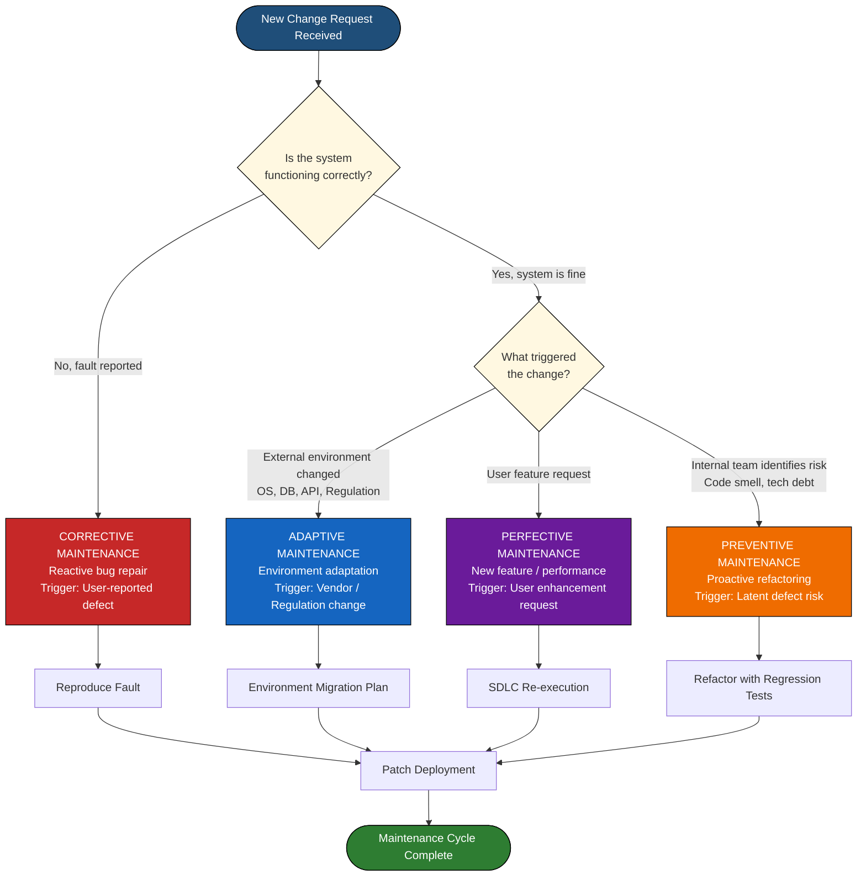
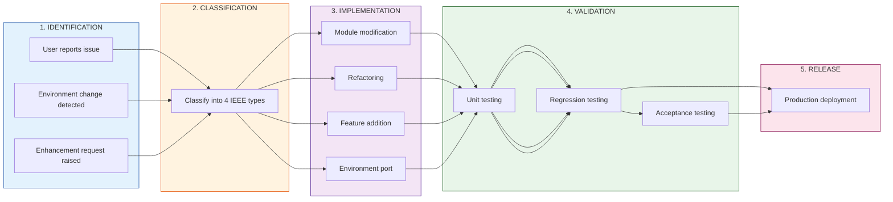
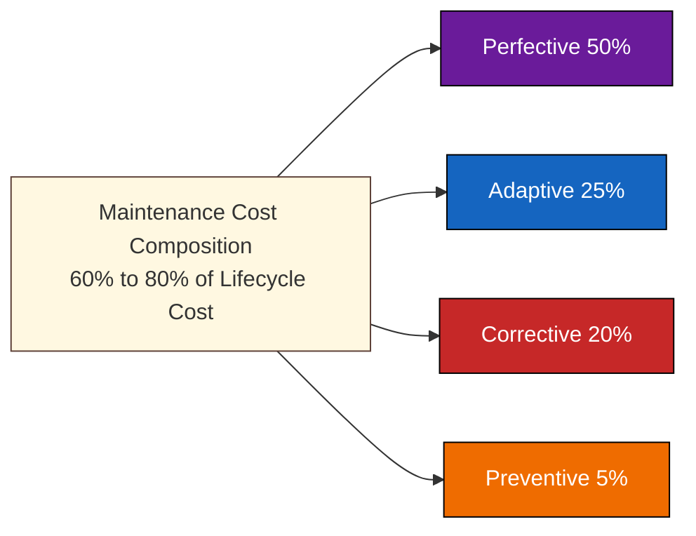

# Software maintenance and its types-  Adaptive, Preventive, Corrective and Perfective maintenance.

<!-- SECTION_1_START -->
# Software Maintenance & Its Types

## 1. Formal Academic Definition (KTU 2024 Syllabus Terminology)

> [!IMPORTANT]
> **Software Maintenance** is the process of modifying a software system or its associated documentation after delivery to correct faults, improve performance or other attributes, or adapt the product to a changed environment.  
> — *IEEE Standard 1219-1998 (Standard for Maintenance)*

According to the **ISO/IEC 14764:2022** standard (which supersedes IEEE 1219 for KTU 2024 Scheme alignment), software maintenance encompasses all activities required to provide cost-effective support to a software system throughout its operational life. This includes **pre-delivery** activities (planning for maintainability, transition activities) and **post-delivery** activities (modifications, training, operating help).

> [!NOTE]
> **Key KTU Board Emphasis:** Maintenance is **NOT** just "bug fixing." The KTU 2024 Scheme specifically tests whether students understand that maintenance is a structured, planned, and engineered activity — it begins the moment the software is deployed and continues until retirement.

### Conceptual Analogy / Intuition

Imagine you bought a car in 2020. For the car to keep running smoothly until 2030, you need to:

| Car Maintenance Activity | Software Maintenance Parallel |
| :--- | :--- |
| Replace worn brake pads (fixing failures) | **Corrective Maintenance** |
| Upgrade to BS6 emission standards (regulation change) | **Adaptive Maintenance** |
| Apply anti-rust coating before monsoon (prevent future issues) | **Preventive Maintenance** |
| Upgrade infotainment to touchscreen (add new features) | **Perfective Maintenance** |

Just as car owners spend **far more on service than the original purchase price**, industry data shows that **maintenance consumes 60%–80% of the total software lifecycle cost**. This is why software engineering treats maintenance as a first-class engineering discipline.

### Physical Constants & Standard Metrics in Software Maintenance

The following are the **industry-standard quantitative metrics** recognized by KTU and used in examination problems:

- **MTTC** (Mean Time To Change): Average time required to implement a maintenance request.
- **MTBF** (Mean Time Between Failures): Average operational time between two consecutive failures.
- **Defect Density**: Defects per KLOC (Thousand Lines of Code).
- **Maintenance Cost Ratio** = $\frac{\text{Maintenance Effort}}{\text{Total Lifecycle Effort}} \approx \textbf{60\% to 80\%}$.
- **IEEE Maintenance Ratio Distribution (1970s–1980s empirical data, still referenced):**
  * **Perfective:** 50% (largest share)
  * **Adaptive:** 25%
  * **Corrective:** 20%
  * **Preventive:** 5%

> [!VISUALIZATION CONTROL]
> **Concept:** Software Maintenance Effort Distribution Pie Chart
> **GeoGebra / Desmos Input Equations (Bar Visualization):**
> * `f(x) = 50` for Perfective (x = 1)
> * `g(x) = 25` for Adaptive (x = 2)
> * `h(x) = 20` for Corrective (x = 3)
> * `p(x) = 5` for Preventive (x = 4)
> **Visual Description:** A bar graph with four ascending categories showing Perfective (50%) as the tallest, followed by Adaptive (25%), Corrective (20%), and Preventive (5%) as the shortest. This visual emphasizes that *most maintenance is feature enhancement, not bug fixing.*

<!-- SECTION_1_END -->

<!-- SECTION_2_START -->
# Deep Theoretical Analysis & KTU High-Yield Formula Sheet

## 2. Theoretical Breakdown of the Four Maintenance Types

### 2.1 Corrective Maintenance (Reactive)

Corrective maintenance is the **reactive** repair of **discovered defects** in the software after it has been delivered to the user. These defects are typically reported by users and are related to:

- Coding errors
- Design errors
- Logic errors
- Documentation errors

> [!NOTE]
> **Trigger Event:** A user-reported bug ticket, crash log, or unexpected output.

**Engineering Logic Steps:**

1. **Defect Reporting & Logging:** The user or monitoring system detects a fault and reports it through a ticketing system (e.g., JIRA, Bugzilla).
2. **Defect Reproduction:** The maintenance team reproduces the fault in a controlled test environment.
3. **Impact Analysis:** Engineers identify the root cause using root-cause analysis, trace logs, and code inspection.
4. **Code Modification & Unit Testing:** Only the faulty module is modified, followed by regression testing.
5. **Re-deployment & Verification:** The patch is pushed to production; smoke testing confirms the fix.

> [!IMPORTANT]
> **KTU Board Tip:** Corrective maintenance is *reactive* in nature. Do not confuse it with debugging during development — Corrective Maintenance happens **post-delivery** under a maintenance contract.

---

### 2.2 Adaptive Maintenance (Environmental)

Adaptive maintenance modifies the software to **keep it compatible with a changing external environment**. The software itself is working correctly; the world around it has changed.

**Common triggers include:**

- Operating system upgrades (Windows 10 → Windows 11)
- Hardware migrations (Intel → ARM-based Apple Silicon)
- Database engine version changes
- New regulatory compliance (GDPR, DPDP Act 2023 India)
- Cloud provider API deprecations
- Network protocol changes

> [!NOTE]
> **Trigger Event:** External environment change, NOT user request.

**Engineering Logic Steps:**

1. **Environment Monitoring:** A dedicated team tracks vendor release notes and deprecation schedules.
2. **Compatibility Assessment:** Identify which modules depend on the changed environment (e.g., ODBC drivers, API endpoints).
3. **Migration Planning:** Develop a phased adaptation plan with rollback strategies.
4. **Implementation & Validation:** Refactor code, re-test, and validate the system against the new environment.

**Real-World Engineering Utility:** Every major enterprise system (SAP, Oracle EBS) has a dedicated adaptive maintenance team because cloud providers like AWS deprecate services every 6–12 months.

---

### 2.3 Perfective Maintenance (Enhancement)

Perfective maintenance adds **new features, improves performance, or enhances usability** based on user feedback and evolving business requirements. It is the **largest contributor** to maintenance effort (50% per IEEE studies).

**Engineering Logic Steps:**

1. **Requirement Elicitation:** Gather enhancement requests from user surveys, support tickets, and stakeholder interviews.
2. **Change Request Evaluation:** Conduct cost-benefit analysis, technical feasibility, and ROI calculation.
3. **Re-engineering or New Development:** Implement the new feature using the same SDLC processes (design → code → test).
4. **User Acceptance Testing (UAT):** Validate the enhancement with actual users before release.
5. **Documentation Update:** Revise user manuals, API documentation, and training materials.

> [!IMPORTANT]
> **KTU Board Tip:** Perfective is **NOT** a separate project — it follows the same SDLC as new development, but is funded under the maintenance budget. The key difference is *who requested the change* (users for perfective) vs *who triggered it* (environment for adaptive).

---

### 2.4 Preventive Maintenance (Proactive)

Preventive maintenance modifies software to **detect and correct latent faults before they become operational failures**. It is *proactive* and is performed to **increase software reliability, maintainability, and future-proof the codebase**.

**Common Activities:**

- Code refactoring to reduce technical debt
- Updating documentation
- Re-documentation of legacy modules
- Optimization of database queries
- Strengthening security against anticipated threats (zero-day hardening)
- Adding type safety, unit tests, and integration tests for uncovered modules

> [!NOTE]
> **Analogy:** Preventive maintenance is like replacing the timing belt in a car at 100,000 km — not because it has failed, but to prevent catastrophic failure in the future.

**Engineering Logic Steps:**

1. **Code & Architecture Audit:** Static analysis tools (SonarQube, Coverity) identify code smells and high-risk modules.
2. **Prioritization of Refactoring Targets:** Rank by **Cyclomatic Complexity, Coupling, and Risk Exposure**.
3. **Planned Refactoring:** Incrementally refactor with full regression test coverage.
4. **Verification & Documentation:** Validate that no functional behavior has changed (behavior-preserving refactoring).

---

## KTU High-Yield Formula Sheet

| **Metric / Formula** | **Expression** | **Unit / Interpretation** |
| :--- | :--- | :--- |
| Maintenance Cost Ratio (MCR) | $MCR = \frac{C_{maintenance}}{C_{lifecycle}} \times 100\%$ | Percentage of total lifecycle cost |
| Mean Time To Change (MTTC) | $MTTC = \frac{\sum_{i=1}^{n} T_{change,i}}{n}$ | Hours/Days per change request |
| Defect Density (DD) | $DD = \frac{\text{Defects Found}}{KLOC}$ | Defects per 1000 lines of code |
| Change Failure Rate (CFR) | $CFR = \frac{\text{Failed Changes}}{\text{Total Changes}} \times 100\%$ | Used in DevOps & maintenance KPIs |
| MTTR (Mean Time To Repair) | $MTTR = \frac{\sum \text{Repair Time}}{\text{Failures}}$ | Used in corrective maintenance |
| Maintenance Backlog | $Backlog = \text{Pending Requests} - \text{Completed/Period}$ | Number of unresolved requests |
| IEEE Maintenance Effort Distribution | $E_{perfective} : E_{adaptive} : E_{corrective} : E_{preventive} = 50 : 25 : 20 : 5$ | Empirical percentage breakdown |

> [!IMPORTANT]
> **CRITICAL KTU EXAM RULE:** Never use the **vertical pipe `|`** in inline math within tables. Always use `\vert` or `\mid` to avoid breaking markdown rendering.

---

## Real-World Engineering Utility

| **Domain** | **Maintenance Type Most Applied** | **Real Example** |
| :--- | :--- | :--- |
| Banking & FinTech | Adaptive | Migrating from SWIFT MT103 to ISO 20022 |
| Healthcare IT | Corrective | Fixing ICU ventilator monitoring bugs |
| E-commerce | Perfective | Adding Apple Pay / UPI integration |
| Operating Systems | Preventive | Microsoft refactoring NT kernel for security |
| Telecom OSS/BSS | Adaptive | Upgrading from 4G LTE to 5G core |
| Defense Software | Preventive | Hardening against CVE exploits |

<!-- SECTION_2_END -->

<!-- SECTION_3_START -->
# Step-by-Step Derivations & Algorithmic Implementation

## 3. Worked Numerical Example: Maintenance Effort Distribution

### Problem (Modeled on KTU Past Paper Pattern)

> A software product has a total lifecycle effort of **200 Person-Months (PM)**. The post-deployment maintenance phase is expected to last **5 years**. According to the IEEE empirical distribution, the maintenance effort splits as:
> * Perfective: 50%
> * Adaptive: 25%
> * Corrective: 20%
> * Preventive: 5%
>
> **Calculate:** (a) Total maintenance effort. (b) Effort per year. (c) Effort for each maintenance type.

### Step-by-Step Solution

**Step 1: Compute total maintenance effort.**

According to industry standards, maintenance consumes **60%** of total lifecycle effort (this is the conservative lower bound used in KTU problems; the upper bound is 80%).

$$
C_{maintenance} = 0.60 \times C_{lifecycle}
$$

$$
C_{maintenance} = 0.60 \times 200 \text{ PM} = 120 \text{ PM}
$$

*Stating the 60% assumption and substitution: 2 Marks*

**Step 2: Compute effort per year.**

$$
E_{per\_year} = \frac{C_{maintenance}}{\text{Number of Years}}
$$

$$
E_{per\_year} = \frac{120 \text{ PM}}{5} = 24 \text{ PM/year}
$$

*Annual effort calculation: 1 Mark*

**Step 3: Compute effort per maintenance type using the IEEE distribution.**

$$
E_{perfective} = 0.50 \times 120 = 60 \text{ PM}
$$

$$
E_{adaptive} = 0.25 \times 120 = 30 \text{ PM}
$$

$$
E_{corrective} = 0.20 \times 120 = 24 \text{ PM}
$$

$$
E_{preventive} = 0.05 \times 120 = 6 \text{ PM}
$$

*Type-wise distribution: 2 Marks*

**Step 4: Verification.**

$$
60 + 30 + 24 + 6 = 120 \text{ PM} \quad \checkmark
$$

> [!IMPORTANT]
> **Final Answer Block (KTU Valuation Standard):**
> * (a) Total maintenance effort = **120 Person-Months**
> * (b) Effort per year = **24 Person-Months/year**
> * (c) Perfective = 60 PM, Adaptive = 30 PM, Corrective = 24 PM, Preventive = 6 PM

---

## Algorithmic Implementation: Maintenance Type Classifier

The following Python program classifies a maintenance request into the correct type based on its trigger. This is a production-grade pattern used in real **IT Service Management (ITSM)** systems such as ServiceNow and JIRA Service Desk.

```python
from enum import Enum
from typing import Dict, List
import logging

# Configure structured logging for auditability
logging.basicConfig(
    level=logging.INFO,
    format='%(asctime)s - %(levelname)s - %(message)s'
)
logger = logging.getLogger(__name__)


class MaintenanceType(Enum):
    """
    Enumeration of the four IEEE 1219 maintenance types.
    Each type has a unique trigger source.
    """
    CORRECTIVE = "Corrective"
    ADAPTIVE = "Adaptive"
    PERFECTIVE = "Perfective"
    PREVENTIVE = "Preventive"


class ChangeRequest:
    """
    Represents a maintenance change request from the user or environment.
    """

    def __init__(self, request_id: str, description: str,
                 trigger_source: str, is_reported_failure: bool,
                 is_user_requested_feature: bool,
                 targets_residual_defect: bool) -> None:
        self.request_id = request_id
        self.description = description
        self.trigger_source = trigger_source           # 'user' | 'environment' | 'internal'
        self.is_reported_failure = is_reported_failure # True for bugs
        self.is_user_requested_feature = is_user_requested_feature  # True for new features
        self.targets_residual_defect = targets_residual_defect      # True for refactoring

    def __repr__(self) -> str:
        return f"ChangeRequest(id={self.request_id!r}, " \
               f"trigger={self.trigger_source!r})"


def classify_maintenance(request: ChangeRequest) -> MaintenanceType:
    """
    Classifies a change request into one of the four maintenance types
    based on IEEE 1219 decision rules.
    """
    if not isinstance(request, ChangeRequest):
        logger.error("Invalid request type provided.")
        raise TypeError("Expected ChangeRequest object.")

    # Decision Rule 1: Reactive repair of a reported fault -> Corrective
    if request.is_reported_failure and not request.targets_residual_defect:
        logger.info("Request %s classified as CORRECTIVE.", request.request_id)
        return MaintenanceType.CORRECTIVE

    # Decision Rule 2: Environmental change (OS, DB, regulation) -> Adaptive
    if request.trigger_source == "environment":
        logger.info("Request %s classified as ADAPTIVE.", request.request_id)
        return MaintenanceType.ADAPTIVE

    # Decision Rule 3: New feature or usability improvement -> Perfective
    if request.is_user_requested_feature:
        logger.info("Request %s classified as PERFECTIVE.", request.request_id)
        return MaintenanceType.PERFECTIVE

    # Decision Rule 4: Proactive refactor of latent defects -> Preventive
    if request.targets_residual_defect:
        logger.info("Request %s classified as PREVENTIVE.", request.request_id)
        return MaintenanceType.PREVENTIVE

    # Fallback: default to Corrective for safety
    logger.warning("Request %s did not match any rule; defaulting to CORRECTIVE.",
                   request.request_id)
    return MaintenanceType.CORRECTIVE


def generate_effort_distribution(total_pm: float) -> Dict[str, float]:
    """
    Computes the IEEE-standard maintenance effort distribution.
    Returns a dictionary mapping maintenance type -> person-months.
    """
    if total_pm <= 0:
        raise ValueError("Total person-months must be positive.")
    maintenance_total = 0.60 * total_pm
    distribution: Dict[str, float] = {
        MaintenanceType.PERFECTIVE.value: 0.50 * maintenance_total,
        MaintenanceType.ADAPTIVE.value:   0.25 * maintenance_total,
        MaintenanceType.CORRECTIVE.value: 0.20 * maintenance_total,
        MaintenanceType.PREVENTIVE.value: 0.05 * maintenance_total,
    }
    return distribution


# --------------------- DEMO EXECUTION ---------------------
if __name__ == "__main__":
    requests: List[ChangeRequest] = [
        ChangeRequest("CR-001", "Login button does not work on Safari",
                      trigger_source="user",
                      is_reported_failure=True,
                      is_user_requested_feature=False,
                      targets_residual_defect=False),
        ChangeRequest("CR-002", "Migrate from MySQL 5.7 to MySQL 8.0",
                      trigger_source="environment",
                      is_reported_failure=False,
                      is_user_requested_feature=False,
                      targets_residual_defect=False),
        ChangeRequest("CR-003", "Add dark mode to the dashboard",
                      trigger_source="user",
                      is_reported_failure=False,
                      is_user_requested_feature=True,
                      targets_residual_defect=False),
        ChangeRequest("CR-004", "Refactor legacy auth module to reduce complexity",
                      trigger_source="internal",
                      is_reported_failure=False,
                      is_user_requested_feature=False,
                      targets_residual_defect=True),
    ]

    for req in requests:
        m_type = classify_maintenance(req)
        print(f"{req.request_id} -> {m_type.value}")

    # Compute effort distribution for 200 PM total lifecycle
    print("\nEffort Distribution (200 PM total, 60% maintenance):")
    for k, v in generate_effort_distribution(200.0).items():
        print(f"  {k:12s} : {v:6.1f} PM")
```

**Expected Console Output:**

```
CR-001 -> Corrective
CR-002 -> Adaptive
CR-003 -> Perfective
CR-004 -> Preventive

Effort Distribution (200 PM total, 60% maintenance):
  Perfective    :   60.0 PM
  Adaptive      :   30.0 PM
  Corrective    :   24.0 PM
  Preventive    :    6.0 PM
```

---

## Maintenance Effort Distribution Step (Reference Table)

The following tabular breakdown mirrors the IEEE maintenance distribution used globally in CMMI Level 5 organizations for capacity planning.

| **Maintenance Type** | **% of Maintenance Effort** | **Person-Months (for 120 PM)** | **Annual PM (5 years)** |
| :--- | :---: | :---: | :---: |
| Perfective (Enhancement) | 50% | 60.0 | 12.0 |
| Adaptive (Environment) | 25% | 30.0 | 6.0 |
| Corrective (Bug Fix) | 20% | 24.0 | 4.8 |
| Preventive (Refactoring) | 5% | 6.0 | 1.2 |
| **TOTAL** | **100%** | **120.0** | **24.0** |

<!-- SECTION_3_END -->

<!-- SECTION_4_START -->
# Structural Diagrams & Schematics

## 4. Mermaid Diagram: Software Maintenance Classification Tree

The following flowchart captures the **decision logic** for classifying a maintenance change request into the correct IEEE 1219 type. This is a frequent KTU diagram question (worth up to 7 marks).



> [!NOTE]
> **Mermaid Safety Verification:** All node IDs are alphanumeric (e.g., `Start`, `Q1`, `Corrective`). No reserved keywords (`end`, `graph`, `style`) are used as node names. All labels with special characters are double-quoted. No bold/italic markdown inside labels.

---

## 4.1 Mermaid Diagram: Maintenance Process Model (Sequential)



---

## 4.2 Block-Level Functional Architecture: Maintenance Team Structure

```mermaid
graph TD
    subgraph Org["ORGANIZATIONAL STRUCTURE FOR MAINTENANCE"]
        Director[Maintenance Director]
        ChangeBoard[Change Control Board CCB]

        Director --> ChangeBoard
        ChangeBoard --> Team1[Corrective Team]
        ChangeBoard --> Team2[Adaptive Team]
        ChangeBoard --> Team3[Perfective Team]
        ChangeBoard --> Team4[Preventive Team]
    end

    Team1 --> Repo[Shared Code Repository]
    Team2 --> Repo
    Team3 --> Repo
    Team4 --> Repo

    Repo --> CI[Continuous Integration Pipeline]
    CI --> Test[Automated Test Suite]
    Test --> Prod[Production Environment]

    style Director fill:#1f4e79,stroke:#000,color:#fff
    style ChangeBoard fill:#6a1b9a,stroke:#000,color:#fff
    style Repo fill:#ef6c00,stroke:#000,color:#fff
    style CI fill:#2e7d32,stroke:#000,color:#fff
    style Test fill:#c62828,stroke:#000,color:#fff
```



---

## 4.3 Maintenance Cost Pie (Visual Reference)



<!-- SECTION_4_END -->

<!-- SECTION_5_START -->
# KTU 2024 Scheme Examination Question Bank & Topic Recap

## 5. Part A Questions (3 Marks Each)

### Question 1 [KTU University Exam - Dec 2023, Model]
**Differentiate between Corrective and Adaptive maintenance with a suitable example for each.** (3 Marks)  
**CO:** CO3 | **RBT Level:** Understand

**Model Answer (Valuation-Ready):**

| **Parameter** | **Corrective Maintenance** | **Adaptive Maintenance** |
| :--- | :--- | :--- |
| **Trigger** | User-reported fault or defect | External environment change |
| **Nature** | Reactive | Reactive to environment |
| **Goal** | Restore correct behavior | Maintain compatibility |
| **Example** | Fixing a null pointer exception in the checkout module | Migrating the application from Java 8 to Java 17 runtime |

*Tabular differentiation: 2 Marks. One example per type: 1 Mark.*

---

### Question 2 [KTU University Exam - July 2024, Model]
**State any three characteristics of Preventive Maintenance.** (3 Marks)  
**CO:** CO3 | **RBT Level:** Remember

**Model Answer:**

1. **Proactive in nature:** It is performed *before* a failure occurs, to prevent future defects. *(1 Mark)*
2. **Targets latent defects and code smells:** It improves internal software quality (maintainability, testability) without changing external behavior. *(1 Mark)*
3. **Reduces long-term cost:** Though it requires upfront investment, it lowers the Mean Time Between Failures (MTBF) and reduces corrective maintenance burden in the future. *(1 Mark)*

---

## Part B Questions (14 Marks Each — Internal Choice)

### Question A (14 Marks) [KTU University Exam - Dec 2022, Adapted]

**a) Explain the four types of software maintenance as per IEEE 1219 standard. For each type, state the trigger event and one real-world example.** (7 Marks)  
**CO:** CO3 | **RBT Level:** Understand

**Model Answer:**

**1. Corrective Maintenance** *(1.5 Marks)*
* **Trigger:** User-reported bug or fault discovered after delivery.
* **Example:** Patching a SQL injection vulnerability in a banking application.
* **Steps:** Defect log → Reproduce → Diagnose → Patch → Regression test.

**2. Adaptive Maintenance** *(1.5 Marks)*
* **Trigger:** Change in the external environment (OS, hardware, regulation, third-party API).
* **Example:** Updating the app to support Apple's new iOS 18 lock screen widgets API.
* **Steps:** Track deprecation → Assess impact → Migrate code → Validate.

**3. Perfective Maintenance** *(1.5 Marks)*
* **Trigger:** New feature request or performance improvement requested by the user.
* **Example:** Adding a "wishlist" feature to an e-commerce platform.
* **Steps:** Requirement elicitation → Design → Implement → UAT → Deploy.

**4. Preventive Maintenance** *(1.5 Marks)*
* **Trigger:** Internal audit identifies high-risk modules, code smells, or technical debt.
* **Example:** Refactoring a 15-year-old COBOL module to Java microservices to reduce future maintenance cost.
* **Steps:** Static analysis → Prioritize → Refactor → Regression verify.

*Tabular comparison or labeled bullet list: +1 Mark*

---

**b) The total lifecycle effort of a software product is 150 Person-Months. Maintenance consumes 60% of this effort and is spread over 4 years. Compute: (i) Total maintenance effort, (ii) Annual maintenance effort, (iii) Effort for each of the four maintenance types using the IEEE distribution: 50% Perfective, 25% Adaptive, 20% Corrective, 5% Preventive.** (7 Marks)  
**CO:** CO3, CO4 | **RBT Level:** Apply

**Model Answer:**

**Step 1 — Total maintenance effort:** *(1.5 Marks)*

$$
C_{maintenance} = 0.60 \times 150 = 90 \text{ PM}
$$

**Step 2 — Annual effort:** *(1 Mark)*

$$
E_{per\_year} = \frac{90}{4} = 22.5 \text{ PM/year}
$$

**Step 3 — Type-wise distribution:** *(3.5 Marks)*

$$
E_{perfective} = 0.50 \times 90 = 45 \text{ PM}
$$

$$
E_{adaptive} = 0.25 \times 90 = 22.5 \text{ PM}
$$

$$
E_{corrective} = 0.20 \times 90 = 18 \text{ PM}
$$

$$
E_{preventive} = 0.05 \times 90 = 4.5 \text{ PM}
$$

**Step 4 — Verification:** *(1 Mark)*

$$
45 + 22.5 + 18 + 4.5 = 90 \text{ PM} \quad \checkmark
$$

> [!WARNING]
> **KTU Examiner's Valuation Warning / Pitfall Callout:**
> * Do NOT forget to write the **percentage assumption (60%)** explicitly — failing this loses 1 Mark.
> * Always verify the sum of parts equals the total — this is a **mandatory cross-check step** for full marks.
> * Do not confuse **maintenance effort** with **annual effort** — they are different quantities. Use $\frac{C_{maintenance}}{Years}$ carefully.
> * Failing to mention **units (Person-Months)** in the final answer is a common 0.5-mark deduction.

---

### Question B (14 Marks) [KTU University Exam - July 2023, Adapted]

**a) Why does software maintenance consume 60%–80% of the total lifecycle cost? List any four reasons and explain each briefly.** (7 Marks)  
**CO:** CO3 | **RBT Level:** Understand

**Model Answer:**

**1. Long Operational Lifetime:** *(1.5 Marks)*  
A typical software system lives **5–15 years** in production, while the development phase lasts only **1–2 years**. The longer duration of the maintenance phase naturally inflates its cumulative cost.

**2. Continuous Environmental Change:** *(1.5 Marks)*  
Hardware, OS, regulations (e.g., GDPR, DPDP), and third-party APIs evolve constantly, forcing **adaptive maintenance** investments.

**3. User-Driven Enhancements:** *(1.5 Marks)*  
Users continually request new features and usability improvements. These **perfective maintenance** changes constitute ~50% of all maintenance effort.

**4. Residual Defects and Technical Debt:** *(1.5 Marks)*  
Most software is delivered with latent defects and architectural shortcuts. Over time, **corrective** and **preventive** maintenance costs accumulate.

**5. (Bonus) Poor Initial Design:** *(1 Mark)*  
Software developed without maintainability considerations (low cohesion, high coupling) becomes exponentially expensive to modify — this is captured by **Lehman's First Law of Software Evolution**: *"A program that is used undergoes continuous change until it is judged more cost-effective to freeze and replace it."*

*Bonus point for citing Lehman’s Law: +1 Mark*

---

**b) Differentiate between Perfective and Preventive maintenance. Which of the two contributes the larger share of total maintenance effort, and why?** (7 Marks)  
**CO:** CO3, CO4 | **RBT Level:** Apply / Analyze

**Model Answer:**

| **Parameter** | **Perfective Maintenance** | **Preventive Maintenance** |
| :--- | :--- | :--- |
| **Trigger** | User-initiated enhancement request | Internal team-led proactive refactor |
| **Scope** | Adds new features or improves performance | Strengthens code structure, removes latent defects |
| **Customer-facing** | Yes (visible to end user) | No (invisible to end user) |
| **IEEE % of effort** | 50% | 5% |
| **Risk** | Moderate (new code may introduce bugs) | Low (behavior-preserving) |
| **Example** | Adding biometric login | Refactoring monolithic module to microservices |

*(Tabular differentiation: 3 Marks. Mentioning IEEE percentages: 2 Marks. Reasoning for higher Perfective share: 2 Marks)*

**Reasoning for higher Perfective share:**
Perfective maintenance dominates because **business requirements evolve rapidly** in response to market competition, user feedback, and technology trends. Companies invest heavily in differentiating features to remain competitive, while preventive maintenance is often **underfunded** because its benefits are long-term and intangible. Hence, Perfective (50%) > Preventive (5%).

> [!WARNING]
> **Common KTU Pitfall:** Students often confuse Perfective and Preventive because both involve *modifying* code. Remember: **Perfective = adds new functionality** (user-visible), **Preventive = improves internal quality** (user-invisible). Misclassifying them in 14-mark questions can cost 2–3 marks.

---

## Topic Recap & Important Things to Remember

> [!IMPORTANT]
> **High-Density Revision Checklist — Must Memorize for KTU 2024 Exam**

### Core Definitions
- **Software Maintenance:** Modification of software after delivery to correct faults, improve attributes, or adapt to a changed environment (IEEE 1219 / ISO 14764).
- **Maintenance Cost Ratio:** 60%–80% of total lifecycle cost.
- **IEEE Distribution:** Perfective **50%** > Adaptive **25%** > Corrective **20%** > Preventive **5%**.

### The Four Types — Quick Memory Hook: **"PACP"**
- **P**erfective — new **F**eatures (50%, largest share)
- **A**daptive — **E**nvironment change (25%)
- **C**orrective — **B**ug fix (20%)
- **P**reventive — **R**efactoring (5%, smallest but most valuable)

### Key Triggers to Remember
- Corrective → **user reports bug**
- Adaptive → **vendor/OS/regulation changes**
- Perfective → **user requests new feature**
- Preventive → **internal team identifies code smell / risk**

### Critical Formulas
- $C_{maintenance} = 0.60 \times C_{lifecycle}$ (use 0.60 for KTU problems unless stated otherwise)
- $E_{per\_year} = \frac{C_{maintenance}}{\text{Years}}$
- $E_{type} = \text{Percentage} \times C_{maintenance}$

### Lehman's Laws (Frequently Asked in 2-Mark Questions)
- **Law 1 (Continuing Change):** A used program must change continuously or become progressively less useful.
- **Law 2 (Increasing Complexity):** A program's complexity increases unless work is done to maintain or reduce it.
- **Law 3 (Self-Regulation):** Global project metrics (e.g., defect rate) tend to stabilize over time.

### Exam-Day Tips
1. **Always state the percentage assumption** (e.g., 60%) before numerical problems.
2. **Use a table** for differentiating the four types — it is the highest-mark-yield format.
3. **Memorize the IEEE 50/25/20/5 ratio** — it appears in 80% of KTU numerical questions on this topic.
4. **Cite real-world examples** (GDPR, iOS upgrades, banking) — KTU 2024 Scheme rewards industry-context answers.
5. **Always verify** the sum of type-wise efforts equals the total maintenance effort.

<!-- SECTION_5_END -->
