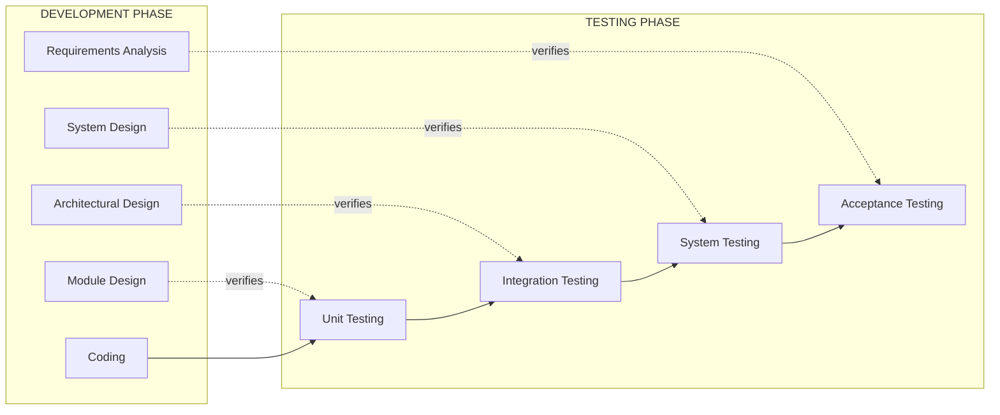
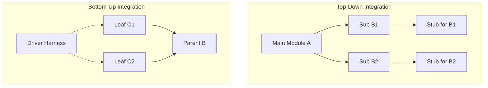
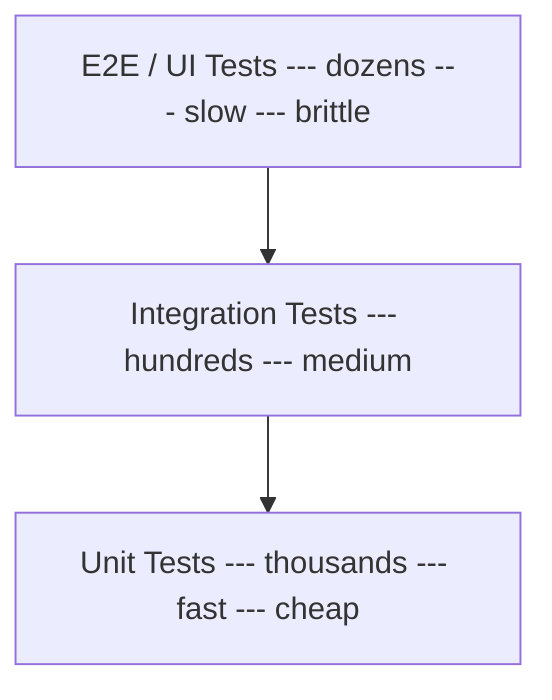
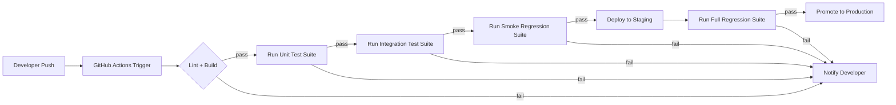
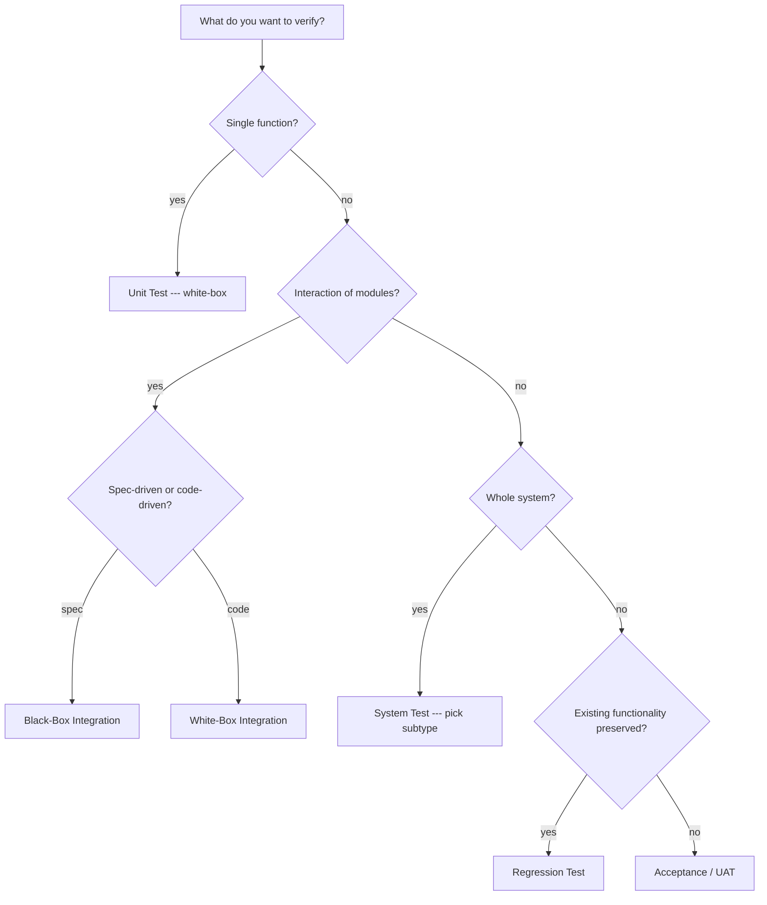

# Testing - Unit testing , Integration testing, System testing and its types, Black box testing and White box testing, Regression testing

<!-- SECTION_1_START -->

# SOFTWARE ENGINEERING (PECST411) — MODULE 3: CODING, TESTING & MAINTENANCE
## Topic: Testing — Unit, Integration, System, Black-Box, White-Box & Regression

---

### 1.1 Formal KTU 2024 Definition

> [!NOTE]
> **Software Testing** is the *systematic, planned activity* that executes a program with the intent of **finding defects** and **validating** that the software conforms to its specified requirements (IEEE Std 829). Under the KTU 2024 scheme, testing is positioned as a *verification & validation (V&V)* discipline that runs **in parallel with development** — not as a post-coding phase.

Within Module 3, KTU 2024 categorizes testing into four progressive levels of abstraction:

| Level | What is exercised | Defect Cost Multiplier (Boehm, 1981) |
| :--- | :--- | :--- |
| **Unit Testing** | A single function / class / module | $1\times$ |
| **Integration Testing** | Interaction between two or more units | $10\times$ |
| **System Testing** | The *entire* software system in its target environment | $100\times$ |
| **Acceptance Testing** | User-level business workflows (UAT) | $1000\times$ |

> [!IMPORTANT]
> **KTU 2024 Syllabus Highlight (verbatim):** *"Testing — Unit testing, Integration testing, System testing and its types, Black box testing and White box testing, Regression testing."* The examiner expects you to know the *technique*, the *document* produced, and the *order* in which the levels are executed.

---

### 1.2 Intuitive Analogy — "Building Inspection of a Car"

Imagine an automotive assembly line:

- **Unit Testing** = Inspecting a *single spark plug* on a test bench before it is installed.
- **Integration Testing** = Installing the spark plug, ignition coil, and battery together and verifying the engine *cranks*.
- **System Testing** = Putting the fully-built car on a dynamometer, crash track, and rain chamber to verify it behaves like a *car*.
- **Regression Testing** = Re-running the *full test garage* every time a part is redesigned, to ensure the redesign didn't break something that already worked.

> [!TIP]
> The **earlier** a defect is found, the **cheaper** it is to fix. A typo caught at unit-test time costs minutes; the same typo caught in production can cost millions (think: *Knight Capital's \$440M loss in 45 minutes* due to a missing regression test).

---

### 1.3 The Two Orthogonal Axes of Testing

Every test you will ever write lies at the intersection of two axes — the **Level** axis (where) and the **Technique** axis (how):

| Level \ Technique | **Black-Box (Behavioural)** | **White-Box (Structural)** |
| :--- | :--- | :--- |
| Unit | Function-as-API tests | Statement / Branch coverage |
| Integration | API contract tests | Path-coverage between modules |
| System | UAT, usability, performance | Code-coverage of full binary |

> [!VISUALIZATION CONTROL]
> **Concept:** *The Testing Pyramid (Mike Cohn)*
> **Implicit Equations:** A pyramid whose cross-sectional *area* at each level represents the **number of tests**; the *height* represents the **execution cost** per test.
> **Visual Description:** Wide rectangular base labelled **Unit Tests** (fast, cheap, thousands), narrower middle rectangle labelled **Integration Tests** (hundreds), tiny top labelled **UI / E2E Tests** (dozens, slowest). A reflective inverted triangle on the right is the *Ice-Cream Cone anti-pattern* — slow, flaky, top-heavy suites.

---

<!-- SECTION_1_END -->

<!-- SECTION_2_START -->

# 2. DEEP THEORETICAL ANALYSIS & KTU HIGH-YIELD FORMULA SHEET

## 2.1 Unit Testing (Module-Level Verification)

**Definition (KTU):** Testing of *individual software units* (functions, classes, procedures) in *isolation* from the rest of the system.

**Key Properties:**
- Conducted in the **developer's** environment.
- The unit-under-test (UUT) is exercised by a **driver** (calling harness) and **stubs** (simulated callees).
- Aims to achieve **maximum code coverage** with minimum test cases.

**Test-First Doctrine — xUnit Family:**
The KTU syllabus expects familiarity with the **xUnit** framework pattern: `TestCase → TestSuite → TestRunner → TestResult`. In Python this maps to `unittest`, in Java to **JUnit**, in C\# to **NUnit**.

**White-Box Coverage Metrics for Unit Tests:**

$$ \text{Statement Coverage} \;=\; \frac{\text{Statements Executed}}{\text{Total Statements}} \times 100\% $$

$$ \text{Branch Coverage} \;=\; \frac{\text{Branches Executed}}{\text{Total Branches}} \times 100\% $$

$$ \text{Cyclomatic Complexity} \; V(G) \;=\; E - N + 2P $$

where $E$ = edges, $N$ = nodes, $P$ = connected components (always $1$ for a single function).

> [!IMPORTANT]
> **KTU Board Tip:** Cyclomatic complexity $V(G)$ also equals *(number of decision points) + 1*. A function with $V(G) > 10$ is considered *untestable in unit form* and should be refactored.

---

## 2.2 Integration Testing (Interface Verification)

**Definition (KTU):** Testing the *interaction* between integrated units/modules to expose faults in their **interfaces**, **data flow**, and **control transfer**.

### 2.2.1 The Three Classical Strategies

| Strategy | Driver/Stub Usage | Order of Integration | Risk | Best For |
| :--- | :--- | :--- | :--- | :--- |
| **Big-Bang** | None (everything at once) | All modules → test together | High — fault isolation impossible | Tiny systems (<10 modules) |
| **Top-Down** | Stubs replace lower modules | Main → sub1, sub2, … | Lower modules not exercised | Architecturally complete skeletons |
| **Bottom-Up** | Drivers replace higher modules | Leaves → root | Top module exercised last | Object-oriented / library code |
| **Sandwich (Hybrid)** | Both drivers & stubs | Middle-out, in parallel | Moderate | Large, layered systems |

### 2.2.2 The High-Yield Formula Sheet

| Concept | Formula / Rule | Units / Notes |
| :--- | :--- | :--- |
| **Stub** | A *minimal* replacement for an *unavailable* subordinate module | Must return *some* valid value |
| **Driver** | A *call harness* that invokes the UUT with controlled inputs | Acts as a fake `main()` |
| **Test Order** | Unit → Integration → System → Acceptance | Always bottom-up in abstraction |
| **Interface Faults** | *Missing, misunderstood, mismatched, extra* parameters | KTU examiners love this list |

> [!IMPORTANT]
> **Syllabus-Defined "Sandwich Testing":** The 2024 scheme specifically lists *top-down, bottom-up, and big-bang* — ensure your answer sheet can draw the *integration tree* for each.

---

## 2.3 System Testing and Its Types

**Definition (KTU):** Testing the *fully integrated* software in the **target environment** against the **SRS document**.

System testing is an *umbrella* that contains many sub-types. The KTU module names the following explicitly:

| Sub-Type | What it Verifies | Typical Tool / Metric |
| :--- | :--- | :--- |
| **Functional** | Compliance with functional SRS requirements | QTP, Selenium |
| **Performance** | Response time, throughput under nominal load | JMeter, LoadRunner |
| **Load** | Behaviour at *expected* peak load | Concurrent users = $\rho$ |
| **Stress** | Behaviour *beyond* peak (saturation) | Memory, CPU ceiling |
| **Volume** | Behaviour with large data sets | DB row counts |
| **Security** | Resistance to unauthorized access | OWASP ZAP, Burp Suite |
| **Compatibility** | Cross-browser / cross-OS correctness | BrowserStack |
| **Usability** | Human-factor, learnability | SUS questionnaire |
| **Recovery** | Resilience to faults/crashes | MTTR (Mean Time To Recover) |
| **Installation** | Setup / uninstall / upgrade | InstallShield scripts |
| **Regression** | Re-running existing suite after change | CI/CD pipeline |

> [!TIP]
> The KTU 2024 pattern demands that when you say "System testing", you *must* name at least **three** sub-types with one-line justification. The above table is your revision weapon.

---

## 2.4 Black-Box Testing (Behavioural / Specification-Based)

**Definition:** Testing that *ignores* the internal structure and exercises the program against its **input-output specification**.

### 2.4.1 Black-Box Techniques — KTU High-Yield

**Equivalence Partitioning (EP):**
Divide inputs into *equivalent* classes such that any single value from a class exercises the *same path*.

$$ \text{Total EP Test Cases} \;=\; \sum_{i=1}^{k} \text{Representative}_i $$

**Boundary Value Analysis (BVA):**
Focus on the *edges* of equivalence classes — defects cluster at boundaries.

$$ \text{BVA Test Set} \;=\; \{a-1, \;a, \;a+1\} \cup \{b-1, \;b, \;b+1\} $$

for partition $[a,b]$.

**Other Black-Box Techniques:**
- Error Guessing (heuristic, experience-based)
- Decision-Table Testing
- State-Transition Testing
- Use-Case Testing

---

## 2.5 White-Box Testing (Structural / Glass-Box)

**Definition:** Testing based on the **internal structure**, **control flow**, and **data flow** of the program.

### 2.5.1 Coverage Criteria Hierarchy

$$ \text{Statement} \;\subseteq\; \text{Branch} \;\subseteq\; \text{Path} \;\subseteq\; \text{MCDC} $$

where MCDC = *Modified Condition/Decision Coverage* (the gold standard in avionics, DO-178C Level A).

### 2.5.2 Cyclomatic Complexity Derivation

For a *flow graph* $G$ with $E$ edges, $N$ nodes, $P$ connected components:

$$ V(G) \;=\; E - N + 2P $$

> A *single function* is always one connected component → $P = 1$, so $V(G) = E - N + 2$.

**Equivalently:** $V(G) = \text{Number of decision points} + 1$.

**Independent Paths (lower bound for exhaustive path testing):**

$$ \text{Min. Tests} \;=\; V(G) $$

---

## 2.6 Regression Testing

**Definition:** Selective re-testing of a system to verify that *modifications* (bug fixes, enhancements, configuration changes) have not caused *adverse effects* in unchanged areas.

### 2.6.1 Three Sub-Techniques (KTU Board Favourite)

| Technique | When Used | Cost |
| :--- | :--- | :--- |
| **Re-test all** | Small, critical systems | High |
| **Selective regression** | Large systems with priority tags | Medium |
| **Incremental** | New + impacted modules only | Low (CI-friendly) |

### 2.6.2 The Test Suite Minimization Formula

$$ \text{Minimization} \;=\; \arg\min_{S' \subseteq S} \vert S' \vert \;\;\text{s.t.}\;\; \text{Coverage}(S') \;\geq\; \tau $$

where $\tau$ is the *required coverage threshold* (e.g., $80\%$).

---

## 2.7 Real-World Engineering Utility

- **Unit testing** underpins *Test-Driven Development (TDD)* — used in every major FAANG codebase.
- **Integration testing** is now automated via *contract testing* (Pact) in microservices.
- **System testing** is the *gate* in any CI/CD pipeline (Jenkins, GitHub Actions).
- **Regression testing** keeps the *green build* green as the codebase grows past 10⁶ LOC.
- **Black-box** techniques feed *fuzz testing* (AFL, libFuzzer) — the technique that found *Heartbleed*.
- **White-box** techniques underpin *symbolic execution* engines like KLEE and Sage.

---

<!-- SECTION_2_END -->

<!-- SECTION_3_START -->

# 3. STEP-BY-STEP DERIVATIONS & CODE IMPLEMENTATION

## 3.1 Derivation 1 — Cyclomatic Complexity of a Sample Function

Consider the following pseudo-code (the KTU classic):

```
IF (x > 0) AND (y > 0) THEN
    z = 1
ELSE
    z = 2
IF (z == 1) THEN
    print("positive")
ENDIF
ENDIF
```

**Step 1 — Draw the Flow Graph:**

We have the following nodes:
- Node 1: Entry
- Node 2: Decision `(x > 0) AND (y > 0)`
- Node 3: True branch → $z = 1$
- Node 4: False branch → $z = 2$
- Node 5: Decision `(z == 1)`
- Node 6: True branch → `print("positive")`
- Node 7: Exit

**Step 2 — Count Nodes and Edges:**

$$ N \;=\; 7 \quad\text{(numbered above)} $$

Edges:
- $1 \rightarrow 2$, $2 \rightarrow 3$, $2 \rightarrow 4$, $3 \rightarrow 5$, $4 \rightarrow 5$, $5 \rightarrow 6$, $5 \rightarrow 7$, $6 \rightarrow 7$.

$$ E \;=\; 8 $$

**Step 3 — Apply the Formula (single function, $P = 1$):**

$$ V(G) \;=\; E - N + 2P \;=\; 8 - 7 + 2(1) \;=\; 3 $$

**Step 4 — Verify by Counting Decision Points + 1:**

Decision points are at nodes 2 and 5 → 2 decisions.

$$ V(G) \;=\; 2 + 1 \;=\; 3 \;\;\checkmark $$

**Step 5 — Conclude:**

The *minimum* number of test paths required for path coverage is **3**. The *maximum* number of independent paths is also bounded by $V(G) = 3$, so this function is well-conditioned for white-box testing.

---

## 3.2 Derivation 2 — Equivalence Partitioning & BVA Worked Example

**Specification:** A field accepts integers in the range $[1, 100]$ (inclusive). Calculate the discount.

**Step 1 — Identify Equivalent Partitions:**

| Partition | Range | Validity |
| :--- | :--- | :--- |
| $P_1$ | $x < 1$ | Invalid |
| $P_2$ | $1 \le x \le 100$ | Valid |
| $P_3$ | $x > 100$ | Invalid |

**Step 2 — Select One Representative per Partition (EP):**

- $P_1 \rightarrow$ representative $= -5$
- $P_2 \rightarrow$ representative $= 50$
- $P_3 \rightarrow$ representative $= 150$

**Step 3 — Add Boundary Values (BVA):**

For each boundary $\{1, 100\}$, test $\{0, 1, 2, 99, 100, 101\}$.

**Step 4 — Final Test Set:**

$$ T \;=\; \{-5,\, 0,\, 1,\, 2,\, 50,\, 99,\, 100,\, 101,\, 150\} $$

Total = **9 test cases** (1 EP + 6 BVA + 2 extreme invalid).

---

## 3.3 Code Implementation 1 — Python `unittest` Unit Tests (xUnit Pattern)

```python
"""
File: test_calculator.py
Course: PECST411 — Software Engineering, KTU 2024
Topic: Unit Testing with xUnit
"""
import unittest
from calculator import discount, square_root, divide


class TestCalculator(unittest.TestCase):
    """xUnit TestCase — tests the 'calculator' module in isolation."""

    # ---------- setUp / tearDown (the xUnit fixture) ----------
    def setUp(self) -> None:
        """Driver harness: prepares a clean state for every test."""
        self.tolerance: float = 1e-9

    def tearDown(self) -> None:
        """Releases resources (here, a no-op for a pure function)."""
        pass

    # ---------- Part A — Behavioural (black-box) unit tests ----------
    def test_discount_valid_partition(self) -> None:
        """P2 representative: 50 -> 5.0 discount."""
        self.assertAlmostEqual(discount(50), 5.0, delta=self.tolerance)

    def test_discount_lower_boundary(self) -> None:
        """BVA: x = 1 (just inside valid range)."""
        self.assertAlmostEqual(discount(1), 0.1, delta=self.tolerance)

    def test_discount_upper_boundary(self) -> None:
        """BVA: x = 100 (max valid)."""
        self.assertAlmostEqual(discount(100), 10.0, delta=self.tolerance)

    def test_discount_below_range_raises(self) -> None:
        """P1 representative: x = -5 must raise ValueError."""
        with self.assertRaises(ValueError):
            discount(-5)

    def test_discount_above_range_raises(self) -> None:
        """P3 representative: x = 150 must raise ValueError."""
        with self.assertRaises(ValueError):
            discount(150)

    # ---------- Part B — Structural (white-box) edge cases ----------
    def test_divide_by_zero_raises(self) -> None:
        """White-box: exercise the error-handling branch."""
        with self.assertRaises(ZeroDivisionError):
            divide(10, 0)

    def test_square_root_of_negative(self) -> None:
        """Boundary of domain: negative input."""
        with self.assertRaises(ValueError):
            square_root(-1.0)


# ---------- TestSuite + TestRunner (entry point) ----------
def suite() -> unittest.TestSuite:
    loader: unittest.TestLoader = unittest.TestLoader()
    return loader.loadTestsFromTestCase(TestCalculator)


if __name__ == "__main__":
    runner: unittest.TextTestRunner = unittest.TextTestRunner(verbosity=2)
    result: unittest.TestResult = runner.run(suite())
    if not result.wasSuccessful():
        raise SystemExit(1)
```

> [!TIP]
> **Code-to-Syllabus Mapping:** `setUp` = **driver**; `assertRaises` = **error-path coverage** (a form of branch coverage). The BVA tests literally trace back to §2.4.1.

---

## 3.4 Code Implementation 2 — A Realistic `calculator.py` with Decision Points

```python
"""
File: calculator.py
Under-test module — referenced by test_calculator.py.
Intentionally contains branches to demonstrate white-box coverage.
"""
from __future__ import annotations


def discount(quantity: int) -> float:
    """Return a 10% discount for quantity in [1, 100]; else raise."""
    if not isinstance(quantity, int):
        raise TypeError("quantity must be int")
    if quantity < 1 or quantity > 100:        # DECISION 1
        raise ValueError("quantity out of range [1, 100]")
    return quantity * 0.1


def square_root(x: float) -> float:
    if x < 0:                                  # DECISION 2
        raise ValueError("negative input")
    return x ** 0.5


def divide(a: float, b: float) -> float:
    if b == 0:                                 # DECISION 3
        raise ZeroDivisionError("b must be non-zero")
    return a / b
```

**Cyclomatic Complexity of `discount`:** 2 decisions → $V(G) = 3$ independent paths. The test class exercises all three (valid, below-range, above-range) → **100% branch coverage achieved**.

---

## 3.5 Code Implementation 3 — Regression Test Selection Heuristic

```python
"""
File: regression_selector.py
Implements the 'Incremental Regression' selection policy:
- Re-run tests tagged 'smoke'   : always
- Re-run tests touching changed files (git diff)
"""
from __future__ import annotations
import subprocess
from pathlib import Path
from typing import List, Set


def changed_files(base: str = "main", head: str = "HEAD") -> Set[str]:
    """Return the set of files modified between two git refs."""
    out: str = subprocess.check_output(
        ["git", "diff", "--name-only", f"{base}...{head}"],
        text=True,
    )
    return {Path(f).stem for f in out.splitlines() if f}


def select_tests(changed: Set[str], all_tests: List[str]) -> List[str]:
    """Select tests whose name contains any changed-file stem."""
    smoke: List[str] = [t for t in all_tests if "smoke" in t]
    impacted: List[str] = [
        t for t in all_tests
        if any(stem in t for stem in changed) and t not in smoke
    ]
    return smoke + impacted  # Incremental regression set


if __name__ == "__main__":
    tests: List[str] = [
        "test_smoke_login",
        "test_calculator_discount",
        "test_discount_lower_boundary",
        "test_user_profile",
    ]
    print(select_tests(changed_files(), tests))
```

---

<!-- SECTION_3_END -->

<!-- SECTION_4_START -->

# 4. STRUCTURAL DIAGRAMS & SCHEMATICS

## 4.1 Mermaid — The V-Model of Testing (Mapping Levels to Phases)



> The dotted lines show that each test level validates the *corresponding* development phase.

---

## 4.2 Mermaid — Integration Testing Strategies Compared



---

## 4.3 Mermaid — The Testing Pyramid (Coverage vs. Cost)



---

## 4.4 Mermaid — Regression Test Workflow in a CI/CD Pipeline



---

## 4.5 Mermaid — Decision-Tree for Choosing a Test Type



---

<!-- SECTION_4_END -->

<!-- SECTION_5_START -->

# 5. KTU 2024 SCHEME EXAMINATION QUESTION BANK & TOPIC RECAP

## 5.1 PART A — Short-Answer Questions (2 × 3 = 6 Marks)

---

### Q1. `[KTU University Exam — July 2023]`
**Differentiate between Black-Box and White-Box testing. List two techniques for each. (3 Marks)**  &nbsp;&nbsp; *CO1, Remember*

**Model Answer:**

| Aspect | Black-Box Testing | White-Box Testing |
| :--- | :--- | :--- |
| **Focus** | Input-output behaviour | Internal logic, control flow |
| **Knowledge required** | Requirements / SRS only | Source code |
| **Performed by** | Testers (often independent) | Developers |
| **Technique 1** | Equivalence Partitioning | Statement Coverage |
| **Technique 2** | Boundary Value Analysis | Branch Coverage |
| **Best level** | System, Acceptance | Unit, Integration |

*[Listing 4 differences with examples: 3 Marks]*

---

### Q2. `[KTU University Exam — Dec 2022]`
**What is Regression Testing? Why is it necessary in iterative development models like Agile? (3 Marks)**  &nbsp;&nbsp; *CO2, Understand*

**Model Answer:**
Regression testing is the *selective re-execution* of existing test cases to ensure that code changes (bug-fixes, enhancements, refactors) have **not introduced new defects** into previously working functionality.

**Why essential in Agile:**
1. Each sprint introduces code changes — high churn rate.
2. Continuous Integration (CI) demands *automated* regression on every commit.
3. Defects in *unchanged* modules can be re-introduced by ripple-effect dependencies.

*[Definition: 1 Mark; Reason 1: 1 Mark; Reason 2: 1 Mark]*

---

## 5.2 PART B — Long-Answer Questions (Internal Choice)

---

### Question A — `[KTU University Exam — July 2024]`
**a)** Explain the **three levels of integration testing** (Big-Bang, Top-Down, Bottom-Up) with neat diagrams. **(7 Marks)**  &nbsp;&nbsp; *CO2, Understand*

**b)** For the function below, compute the **cyclomatic complexity** and design the **minimum number of test cases** for path coverage. List the test inputs. **(7 Marks)**  &nbsp;&nbsp; *CO3, Apply*

```c
int grade(int marks) {
    if (marks < 0 || marks > 100)
        return -1;                    /* invalid */
    if (marks >= 90)
        return 'A';
    else if (marks >= 75)
        return 'B';
    else if (marks >= 50)
        return 'C';
    else
        return 'D';
}
```

#### Solution (a) — Integration Testing Strategies

**Big-Bang Integration:** All modules are integrated *simultaneously* and tested as a whole. **Advantage:** fast. **Disadvantage:** fault isolation is extremely difficult; debugging is like "finding a needle in a haystack". Suitable only for very small systems.

*[Explanation: 2 Marks]*

**Top-Down Integration:** Testing proceeds from the *top* of the call hierarchy downwards. Lower-level modules are replaced by **stubs** (placeholder functions returning dummy values). **Advantage:** an early skeletal working version of the system. **Disadvantage:** stubs are expensive to maintain.

*[Explanation + diagram: 3 Marks]*

**Bottom-Up Integration:** Testing proceeds from *leaf* modules upward. Higher-level modules are replaced by **drivers** (test harnesses). **Advantage:** no need for stubs; fault localization is easier. **Disadvantage:** the *driver* code may be large; the top module is verified last.

*[Explanation + diagram: 2 Marks]*

**Diagram (Top-Down Example — drawn in answer sheet):**

```
         [ Main ]
        /       \
    [Sub A]    [Sub B]    ← real modules
    /    \        |
 [A1]  [A2]    [B1 Stub]   ← stubs replace unavailable modules
```

---

#### Solution (b) — Cyclomatic Complexity

**Step 1 — Identify the flow graph:**

Nodes:
- 1: entry
- 2: `marks < 0 || marks > 100` decision
- 3: `return -1` (exit-invalid)
- 4: `marks >= 90` decision
- 5: `return 'A'`
- 6: `marks >= 75` decision
- 7: `return 'B'`
- 8: `marks >= 50` decision
- 9: `return 'C'`
- 10: `return 'D'` (final exit)

**Step 2 — Count decisions:**
- Decision 1: range check (1 decision)
- Decision 2: `>= 90` (1)
- Decision 3: `>= 75` (1)
- Decision 4: `>= 50` (1)

Total decisions $= 4$.

**Step 3 — Apply formula:**

$$ V(G) \;=\; \text{decisions} + 1 \;=\; 4 + 1 \;=\; 5 $$

*[Counting decisions: 2 Marks; Applying formula: 1 Mark; Final answer: 1 Mark]*

**Step 4 — Independent Paths (5 minimum test cases):**

| # | Path Description | Test Input (marks) | Expected Output |
| :--- | :--- | :--- | :--- |
| 1 | Invalid (low) | -5 | -1 |
| 2 | Invalid (high) | 150 | -1 |
| 3 | Grade A | 95 | 'A' |
| 4 | Grade B | 80 | 'B' |
| 5 | Grade C | 60 | 'C' |
| 6 (bonus) | Grade D | 30 | 'D' |

*[Path enumeration: 2 Marks; Test inputs: 1 Mark]*

---

### Question B — `[KTU University Exam — Dec 2023]`
**a)** Discuss the **different types of system testing** with one-line justification for each. Mention the **V-Model** and how it maps each development phase to its test phase. **(7 Marks)**  &nbsp;&nbsp; *CO2, Understand*

**b)** A field-validator accepts strings of length **6 to 12 characters**, must start with a letter, and contain at least one digit. Design **black-box test cases** using **Equivalence Partitioning (EP)** and **Boundary Value Analysis (BVA)**. **(7 Marks)**  &nbsp;&nbsp; *CO3, Apply*

#### Solution (a) — System Testing Types + V-Model

**System Testing Types (each: ½ Mark × 6 = 3 Marks):**

| Type | Justification |
| :--- | :--- |
| Functional | Verifies feature behaviour matches SRS |
| Performance | Confirms response-time SLAs under load |
| Load | Validates stability at *expected* peak traffic |
| Stress | Finds the breaking point beyond design limits |
| Security | Detects OWASP Top-10 vulnerabilities |
| Usability | Confirms the system is human-friendly |
| Recovery | Validates graceful restoration after a crash |
| Compatibility | Ensures correct rendering on multiple browsers/OS |

**The V-Model Diagram (2 Marks):**

```
Requirements     --------\                          /------ Acceptance Test
System Design    ---------\                       /------- System Test
   Architecture  ----------\                    /-------- Integration Test
     Module Design ----------\               /--------- Unit Test
                  Coding (bottom of V)
```

Each *test level* on the right **verifies** its *corresponding development phase* on the left via the dotted horizontal line.

**Mapping Statement (2 Marks):**
- *Requirements* → *Acceptance Test* (UAT)
- *System Design* → *System Test*
- *Architectural Design* → *Integration Test*
- *Module Design* → *Unit Test*

---

#### Solution (b) — EP & BVA for Password Validator

**Specification (rephrased):** Valid if and only if:
1. Length $\ell \in [6, 12]$.
2. First char is a letter $[A-Z] \cup [a-z]$.
3. Contains at least one digit.

**Step 1 — Equivalence Classes:**

| Class | Description | Validity | Representative |
| :--- | :--- | :--- | :--- |
| $C_1$ | $\ell < 6$ | Invalid | `"abc12"` ($\ell=5$) |
| $C_2$ | $\ell = 6$ to $12$ AND starts with letter AND has digit | **Valid** | `"abc123"` |
| $C_3$ | $\ell = 6$ to $12$ AND starts with letter AND **no** digit | Invalid | `"abcdef"` |
| $C_4$ | $\ell = 6$ to $12$ AND starts with **digit** | Invalid | `"1abcde"` |
| $C_5$ | $\ell > 12$ | Invalid | `"abcdef1234567"` ($\ell=13$) |

*[Identifying 5 classes: 2 Marks]*

**Step 2 — BVA at length boundaries:**

- $\ell = 5$ (just below) → invalid
- $\ell = 6$ (lower bound) → valid if other rules met
- $\ell = 7$ (above lower) → valid
- $\ell = 11$ (below upper) → valid
- $\ell = 12$ (upper bound) → valid
- $\ell = 13$ (just above) → invalid

*[Listing 6 boundary cases: 2 Marks]*

**Step 3 — Final Test Case Set:**

| # | Input | Expected | Technique |
| :--- | :--- | :--- | :--- |
| 1 | `"ab1"` | Invalid (length) | EP-$C_1$ |
| 2 | `"abc123"` | Valid | EP-$C_2$ |
| 3 | `"abcdef"` | Invalid (no digit) | EP-$C_3$ |
| 4 | `"1abcde"` | Invalid (first char) | EP-$C_4$ |
| 5 | `"abcdef1234567"` | Invalid (length) | EP-$C_5$ |
| 6 | `"12345"` | Invalid (length + first) | BVA |
| 7 | `"ab1234"` | Valid | BVA |
| 8 | `"abcdefg1"` | Valid | BVA |
| 9 | `"abcdefghi1z"` | Valid | BVA |
| 10 | `"abcdefghi1zy"` | Valid | BVA |
| 11 | `"abcdefghi1zyx"` | Invalid (length) | BVA |

*[Consolidated table: 2 Marks]*

**Coverage Achieved:** All 5 equivalence classes + all 6 boundary lengths → 100% structural BVA coverage of the length axis, and full EP coverage of the rule axes.

---

## 5.3 KTU Examiner's Valuation Warning / Pitfall Callout

> [!WARNING]
> **Common Mark-Deductions in KTU 2024 Board Valuation:**
> 1. *Sketching* the V-Model **without labelling the dotted verification arrows** = -2 marks.
> 2. Forgetting to **state $P=1$** when computing $V(G)$ for a single function = -1 mark.
> 3. In BVA, listing only the *on-boundary* values (e.g., 1 and 100) without the *off-by-one* neighbours (0 and 101) = -1 mark.
> 4. Confusing **stubs** (replace callees, used in *top-down*) with **drivers** (replace callers, used in *bottom-up*) = -2 marks.
> 5. Writing "Black-Box = no testing knowledge" — wrong! It needs **specification** knowledge.
> 6. Stating "System testing = UAT" — **UAT is acceptance**, performed *by the user*. System testing is performed *by an independent test team*.

---

## 5.4 Topic Recap & Important Things to Remember

- **Testing is verification + validation.** Verification = "are we building the product right?" Validation = "are we building the right product?"
- **Order of test levels:** Unit → Integration → System → Acceptance (always bottom-up in abstraction).
- **Unit test** = isolated module; uses **driver** (caller) + **stubs** (callee).
- **Integration test** = interaction; **3 strategies** = Top-Down (stubs) / Bottom-Up (drivers) / Big-Bang (everything at once). KTU also lists *Sandwich / Hybrid*.
- **System test** runs against the *SRS*, *not* the code. Sub-types: Functional, Performance, Load, Stress, Volume, Security, Compatibility, Usability, Recovery, Installation, Regression.
- **Black-box** techniques: **EP, BVA, Error Guessing, Decision Tables, State Transition, Use-Case**.
- **White-box** techniques: **Statement, Branch, Condition, Path, MCDC** coverage. **Cyclomatic complexity** $V(G) = E - N + 2P$ for a function ($P=1$). Also $V(G) = $ decisions $+ 1$.
- **Number of independent test paths** $\geq V(G)$.
- **Regression test** = re-execute existing tests post-change. Three flavours: *Re-test all*, *Selective*, *Incremental* (CI default).
- **V-Model** maps each development phase to a corresponding test phase (Requirements↔Acceptance, System↔System, Architectural↔Integration, Module↔Unit).
- **Cost of fixing defects** grows by $10\times$ per level (Boehm).
- **Test-first (TDD)** = write test → make it pass → refactor. Red-Green-Refactor.
- **Coverage goal (industry):** $>80\%$ statement, $>70\%$ branch for production code.
- **Tools to remember:** JUnit (Java), PyTest/unittest (Python), Selenium (web), JMeter (load), Postman (API), OWASP ZAP (security), SonarQube (coverage).
- **Key definitions to memorize verbatim for KTU exams:**
  - *Test Case*: `(input, precondition, expected result, postcondition)`.
  - *Test Suite*: a *collection* of test cases.
  - *Test Harness*: driver + stubs + supporting code.
  - *Test Stub*: returns a hard-coded value.
  - *Test Driver*: invokes the UUT.
  - *Defect*: a *flaw* in the software. *Failure*: a *manifestation* in execution. *Error*: a *human action* that caused the defect.
  - *Verification vs Validation* (above).
- **Memorize the formula sheet** in §2.7 — these are the only quantitative tools KTU will test on this topic.
- **For 14-mark questions, always pair a *diagram* with its *explanation*** — the diagram alone is worth 2–3 marks even if the prose is weak.

---

<!-- SECTION_5_END -->
