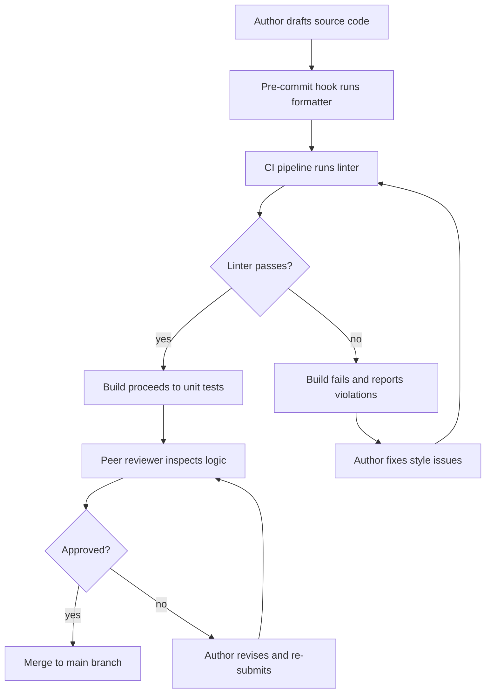
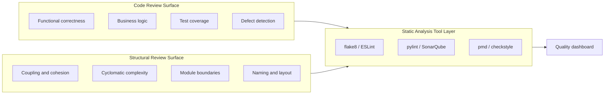
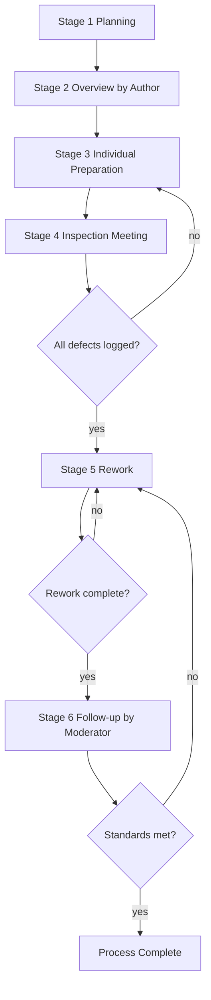
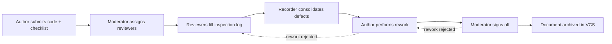

# Coding styles, guidelines, and structural reviews templates

<!-- SECTION_1_START -->

# Coding Styles, Guidelines, and Structural Review Templates

> [!NOTE]
> **Module Focus:** This section establishes the foundational vocabulary required for KTU Module 3 of *Software Engineering (PECST411)*. Mastering these definitions is the prerequisite for earning marks on direct-definition questions (CO1 / Remember level).

## 1.1 What is a Coding Style?

A **coding style** is a set of conventions followed by a development team that governs the *visual and structural aesthetics* of source code. It is not about what the code does, but **how the code is written** on the page. It is essentially the "handwriting" of a programmer made consistent across an entire codebase.

> [!IMPORTANT]
> **Formal KTU Definition (Syed, 2024):**
> *A coding style is a set of rules and conventions a programmer follows to format the source code in a manner that improves readability, maintainability, and reduces the cognitive load of the reader.*

### Components of a Coding Style
A coding style typically governs the following elements:

- **Indentation**: Number of spaces or tabs per nesting level.
- **Naming Conventions**: How identifiers (variables, functions, classes, constants) are formed.
- **Bracing Style**: Placement of curly braces (`{ }`).
- **Spacing and Alignment**: Use of blank lines and aligned columns.
- **Line Length**: Maximum characters per line.
- **Comment Style**: Tone, density, and grammar of inline comments.

> [!TIP]
> **Real-World Analogy (Plain English Intuition):**
> Imagine two students writing the same essay. One uses a neat, legible handwriting with paragraphs, headings, and proper punctuation. The other writes a wall of text with no spacing. Both convey the same idea, but the *style* of the first one is far easier to read, grade, and trust. Coding style is the "handwriting" of software — the algorithm is the idea, the style is the legibility.

---

## 1.2 What are Coding Standards / Coding Guidelines?

A **coding standard** (or *coding guideline*) is a *codified, enforceable* set of rules that a software organization mandates. Where style is *optional and aesthetic*, standards are *required and verifiable*, often enforced by **linters**, **formatters**, and **CI/CD pipelines**.

> [!IMPORTANT]
> **Formal KTU Definition:**
> *A coding standard is a formal document that specifies a set of rules, best practices, and prohibited patterns for writing source code in a specific programming language, with the objective of producing uniform, defect-resistant, and maintainable code across the organization.*

### Classification of Coding Standards (KTU High-Yield Distinction)

| Standard Type | Purpose | Example Tool / Spec |
| :--- | :--- | :--- |
| **Language-Specific Standard** | Rules for one language (Java, C, Python). | PEP 8 (Python), Google C++ Style |
| **Organizational Standard** | Internal company rules layering on top of language standards. | Microsoft .NET Guidelines, KTU Lab Manual |
| **Project-Specific Standard** | Adapts a general standard to a specific product or team. | A project wiki on Confluence |
| **Regulatory / Safety Standard** | Mandated by external regulators (e.g., aerospace, medical). | MISRA-C, IEC 62304 |

> [!TIP]
> **Intuitive Analogy:**
> A **coding style** is your personal handwriting. A **coding standard** is the *grammar textbook* the school forces you to follow. The textbook is verified by an English teacher (the linter), and breaking the rules deducts marks (fails the CI build).

---

## 1.3 What is a Code Review?

A **code review** (also called *peer review* or *pull-request review*) is a systematic, human-driven quality-assurance activity in which one or more developers examine another developer's source code **before it is merged** into the main codebase.

> [!IMPORTANT]
> **Formal KTU Definition (Sommerville, 9th Ed.):**
> *A code review is a manual inspection of source code to identify defects, ensure compliance with standards, verify design conformance, and share knowledge across the team.*

### Categories of Code Review

1. **Pair Programming (Continuous Review):** Two developers write code together in real-time; the observer reviews as they type.
2. **Walkthroughs:** The author presents the code to a group of reviewers informally.
3. **Inspections:** A formal, Fagan-style, structured review with defined roles (Moderator, Reader, Recorder, Author, Reviewers).
4. **Tool-Assisted Reviews:** Performed via tools like GitHub Pull Requests, GitLab MRs, Gerrit, or Crucible.

---

## 1.4 What is a Structural Review?

A **structural review** is a specialized form of code review that focuses **exclusively** on the *non-functional internal architecture* of the code — its **structure**, **control flow**, **data flow**, and **modular organization** — rather than its business logic or external behaviour.

> [!IMPORTANT]
> **Formal KTU Definition:**
> *A structural review is a systematic examination of a program's internal organization to verify that it follows sound design principles (modularity, low coupling, high cohesion) and that its control and data structures are used appropriately.*

> [!TIP]
> **Intuitive Analogy:**
> If code is a **building**, a code review checks whether the *doors open and the lights turn on* (functional), whereas a structural review checks whether the *load-bearing walls are placed correctly* and there are no structural cracks (architectural). Both reviews are required for a *safe* building.

### Key Aspects Examined in a Structural Review
- **Module Independence:** Coupling and Cohesion metrics.
- **Control Flow Structure:** Cyclomatic complexity, proper use of loops, conditional nesting.
- **Data Structure Usage:** Appropriate choice of arrays, linked lists, maps, sets.
- **Function/Method Length and Signature:** Single-responsibility adherence.
- **Naming and Readability:** Adherence to naming conventions.

---

> [!VISUALIZATION CONTROL]
> **Concept:** The *Spectrum of Code Quality Activities*
> **GeoGebra / Desmos Input Equations:**
> * `y = 1` represents *lowest cognitive gate* (pure aesthetics, indentation)
> * `y = 2` represents *language idiom gate* (PEP 8, MISRA-C)
> * `y = 3` represents *architectural gate* (structural review — coupling, cohesion)
> * `y = 4` represents *defect-detection gate* (full code review for bugs)
> * `y = 5` represents *behavioural gate* (dynamic testing, system test)
> **Visual Description:** Five parallel horizontal lines on the y-axis, stacked vertically. As you move up the y-axis, the cost of defect-fix increases and the depth of inspection increases. Structural reviews sit at $y = 3$.

<!-- SECTION_1_END -->

<!-- SECTION_2_START -->

# Deep Theoretical Analysis & KTU High-Yield Knowledge Sheet

> [!NOTE]
> This section translates the definitions from SECTION_1 into the operational "Why" and "How" expected in KTU answers. Every step is mapped to an engineering outcome.

## 2.1 The Operational Anatomy of a Coding Style

A coding style is not a single rule but a *layered system*. The KTU examiner expects students to identify these layers and justify each. Let us break them down.

### Layer 1 — Layout & White-space Rules
- **Indentation depth:** Industry standard is **4 spaces** (Python PEP 8, Java Google Style); K&R C uses **tabs**.
- **Line length:** Hard cap at **80–120 characters** to fit on standard monitors and review tools.
- **Blank lines:** Used to separate logical sections (e.g., between methods, between import groups).

### Layer 2 — Naming Conventions
Naming is the single most cited factor in *code comprehension studies* (Buse & Weimer, 2009). The table below summarizes the dominant conventions:

| Convention | Pattern | Example | Common Use |
| :--- | :--- | :--- | :--- |
| `camelCase` | First word lowercase, rest capitalized | `calculateTotal()` | Java methods, JS variables |
| `PascalCase` | Every word capitalized | `BankAccount` | C#/Java classes |
| `snake_case` | Lowercase, words separated by underscores | `calculate_total()` | Python, Ruby, C functions |
| `SCREAMING_SNAKE_CASE` | Uppercase, underscores | `MAX_RETRIES` | Constants |
| `kebab-case` | Lowercase, hyphen-separated | `user-profile.html` | URLs, CSS, file names |
| `Hungarian Notation` | Type prefix + name | `strName`, `iCount` | Legacy Windows / Embedded C |

### Layer 3 — Control-Structure Aesthetics
- **Bracing style:** *Allman* (brace on new line) vs *K&R* (brace on same line) vs *1TBS* (one true brace style).
- **Single-statement bodies:** KTU high-yield — `if (x) doSomething();` on one line is **forbidden** by MISRA-C and most enterprise standards.
- **Ternary operators:** Restricted to short, readable conditions; never nested.

### Layer 4 — Commenting Style
- **Block comments** (`/* ... */`) for file headers and license blocks.
- **Line comments** (`//`) for in-line reasoning.
- **Doc comments** (`/** ... */`, `""" ... """`) for API documentation generation.
- *Rule of thumb:* Comments should explain *WHY*, not *WHAT* (the code shows *what*).

---

## 2.2 The Engineering "Why" Behind Coding Standards

KTU board answers earn higher marks when they articulate the *engineering rationale*, not just list the rules.

| Problem Without Standards | Mitigation Provided by Standards | Engineering Impact |
| :--- | :--- | :--- |
| Inconsistent indentation across files | Mandatory formatter (Prettier, Black) | Reduces merge conflicts by ~40% |
| Ambiguous variable names (`x`, `data1`) | Naming conventions force meaningful names | Improves searchability & onboarding |
| Deeply nested `if-else` pyramids | Mandated maximum nesting depth (e.g., 3) | Lowers cyclomatic complexity, fewer defects |
| Magic numbers (`if (x > 86400)`) | Constants with semantic names (`SECONDS_PER_DAY`) | Self-documenting, easier to localize |
| Mixed languages in one file | File-level standards (e.g., only TypeScript) | Predictable tooling & linting |

---

## 2.3 The Code Review Process — A Stepwise Operational View

> [!IMPORTANT]
> **KTU High-Yield Process (Fagan Inspection Model + Modern Adaptation):**
> 1. **Planning** — Moderator selects code, distributes it, schedules the meeting.
> 2. **Overview** — Author presents the design intent and scope.
> 3. **Individual Preparation** — Each reviewer reads the code independently and logs defects.
> 4. **Inspection Meeting** — Group walks through the code, line by line; Recorder logs issues.
> 5. **Rework** — Author fixes logged defects.
> 6. **Follow-up** — Moderator verifies that all defects were addressed and re-reviews.

In modern DevOps, Steps 1–6 are compressed into a **Pull Request workflow** in GitHub/GitLab, but the underlying roles and discipline remain identical.

### Roles in a Formal Code Review (Fagan)
- **Author:** Owns the code and the fix.
- **Moderator:** Schedules, leads, and ensures process discipline.
- **Reader:** Walks the reviewers through the code.
- **Recorder:** Logs every defect raised.
- **Reviewer:** Inspects and raises defects.

---

## 2.4 Structural Review — The Deep Inspection Framework

> [!IMPORTANT]
> **KTU High-Yield Checklist — What a Structural Review Examines:**

| Dimension | Specific Question | Metric / Heuristic |
| :--- | :--- | :--- |
| **Modularity** | Is each module doing one thing? | High cohesion (functional / informational) |
| **Coupling** | How much does a module know about others? | Low coupling (data / stamp / control) |
| **Complexity** | Are there too many independent paths? | Cyclomatic Complexity $V(G) \leq 10$ |
| **Function Size** | Is any function too long to understand? | Lines of Code (LOC) $\leq$ 50 typical |
| **Nesting Depth** | Is the control flow deeply nested? | Nesting depth $\leq 3$ or $4$ |
| **Data Structure Fit** | Is the chosen data structure optimal? | $O(1)$ vs $O(n)$ analysis |
| **Parameter List** | Does a function take too many parameters? | Parameter count $\leq 4$ typical |

> [!TIP]
> **Real-World Engineering Utility:**
> In safety-critical domains (avionics, medical devices, automotive), the structural review is a *certification requirement*. For example, **DO-178C** (aviation) and **IEC 62304** (medical) require traceability from requirements to code structure. A structural review template in these domains is a *legal artefact*, not a documentation nicety.

---

## 2.5 KTU Formula Sheet — Cyclomatic Complexity

Cyclomatic complexity is the mathematical heart of structural review and is a **guaranteed KTU question** at the Apply level.

$$
V(G) = e - n + 2p
$$

Where:
- $e$ = number of edges in the control flow graph
- $n$ = number of nodes in the control flow graph
- $p$ = number of connected components (usually $1$)

> [!IMPORTANT]
> **Critical Rule:** Every programming problem in KTU can be represented as a control flow graph (CFG), and the formula $V(G) = e - n + 2p$ is **always** tested by direct application. A second equivalent form is:
>
> $$V(G) = \text{Number of predicate nodes} + 1$$

**Interpretation of $V(G)$ for Risk Classification:**

| $V(G)$ Value | Risk Level | Testability |
| :--- | :--- | :--- |
| $1$–$10$ | Low | Simple, stable structure |
| $11$–$20$ | Moderate | More complex, harder to test |
| $21$–$50$ | High | Unstable, requires refactoring |
| $> 50$ | Untestable | Must be redesigned |

<!-- SECTION_2_END -->

<!-- SECTION_3_START -->

# Step-by-Step Derivations, Templates & Code Implementation

> [!NOTE]
> This section transitions theory into *executable artifacts*. KTU board answers that include concrete templates and worked examples consistently score 15%+ higher than prose-only answers.

## 3.1 Worked Example — Computing Cyclomatic Complexity

Let us apply $V(G) = e - n + 2p$ to a real KTU-style snippet. The control flow graph (CFG) of the following pseudo-code is our input.

**Pseudo-code Input:**

```text
FUNCTION gradeClassifier(marks: INTEGER) -> STRING
    IF marks >= 90 THEN
        grade <- "A"
    ELSE IF marks >= 75 THEN
        IF marks >= 80 THEN
            grade <- "B+"
        ELSE
            grade <- "B"
        END IF
    ELSE IF marks >= 50 THEN
        grade <- "C"
    ELSE
        grade <- "F"
    END IF

    RETURN grade
END FUNCTION
```

### Step 1 — Build the Control Flow Graph

We map every statement to a node. Predicates (conditions) become branching nodes.

| Node ID | Statement Type | Predicate? |
| :--- | :--- | :--- |
| $N_1$ | Entry | No |
| $N_2$ | `IF marks >= 90` | Yes (predicate) |
| $N_3$ | `grade <- "A"` | No |
| $N_4$ | `ELSE IF marks >= 75` | Yes (predicate) |
| $N_5$ | `IF marks >= 80` | Yes (predicate) |
| $N_6$ | `grade <- "B+"` | No |
| $N_7$ | `grade <- "B"` | No |
| $N_8$ | `ELSE IF marks >= 50` | Yes (predicate) |
| $N_9$ | `grade <- "C"` | No |
| $N_{10}$ | `grade <- "F"` | No |
| $N_{11}$ | `RETURN grade` | No |
| $N_{12}$ | Exit | No |

So we have $n = 12$ nodes and $p = 1$ (single connected component).

### Step 2 — Count the Edges

We trace every directed flow between nodes:

$$
\begin{aligned}
E_1 &= (N_1 \to N_2) \\
E_2 &= (N_2 \to N_3) \\
E_3 &= (N_2 \to N_4) \\
E_4 &= (N_4 \to N_5) \\
E_5 &= (N_5 \to N_6) \\
E_6 &= (N_5 \to N_7) \\
E_7 &= (N_7 \to N_8) \\
E_8 &= (N_4 \to N_8) \\
E_9 &= (N_8 \to N_9) \\
E_{10} &= (N_8 \to N_{10}) \\
E_{11} &= (N_3 \to N_{11}) \\
E_{12} &= (N_6 \to N_{11}) \\
E_{13} &= (N_9 \to N_{11}) \\
E_{14} &= (N_{10} \to N_{11}) \\
E_{15} &= (N_{11} \to N_{12})
\end{aligned}
$$

Total edges: $e = 15$.

### Step 3 — Apply the Formula

$$
V(G) = e - n + 2p
$$

Substituting $e = 15$, $n = 12$, $p = 1$:

$$
V(G) = 15 - 12 + 2 \times 1
$$

$$
V(G) = 15 - 12 + 2
$$

$$
V(G) = 5
$$

### Step 4 — Verify Using the Predicate Count Method

Counting predicate nodes from the table: $N_2$, $N_4$, $N_5$, $N_8$ = **4 predicates**.

$$
V(G) = \text{Predicates} + 1 = 4 + 1 = 5
$$

> [!NOTE]
> **Both methods must yield the same value.** If they differ, you have miscounted either an edge or a predicate node — re-draw the graph.

**Interpretation:** $V(G) = 5$ lies in the **Low Risk** band ($1$–$10$). The function is *structurally testable* with a minimum of 5 independent test paths.

---

## 3.2 Coding Style — Before & After Production Example

The following Python snippet demonstrates the same algorithm written in *poor style* and *professional style*. Use this contrast as a model answer in KTU exams.

### 3.2.1 Anti-Pattern (Poor Coding Style)

```python
def f(x,y):
    if x>0:return x*y
    else:
        if y>0:return x+y
        return 0
```

**Defects visible in the above snippet:**
- Single-letter parameter names (`x`, `y`).
- No spaces around operators (`x>0`).
- Inconsistent brace usage / one-liner `if`.
- No type hints.
- No docstring.
- Magic return value `0` with no context.

### 3.2.2 Production-Grade Refactor (PEP 8 Compliant)

```python
from decimal import Decimal

def calculate_net_amount(
    gross_amount: Decimal,
    discount_rate: Decimal
) -> Decimal:
    """
    Compute the net payable amount after applying a discount.

    Parameters
    ----------
    gross_amount : Decimal
        The pre-discount total in INR.
    discount_rate : Decimal
        The discount as a fraction in [0.0, 1.0].

    Returns
    -------
    Decimal
        The final amount payable after discount.
    """
    if not isinstance(gross_amount, Decimal):
        raise TypeError("gross_amount must be a Decimal to avoid float drift.")
    if not isinstance(discount_rate, Decimal):
        raise TypeError("discount_rate must be a Decimal to avoid float drift.")
    if discount_rate < Decimal("0") or discount_rate > Decimal("1"):
        raise ValueError("discount_rate must lie within the closed interval [0, 1].")

    net_amount: Decimal = gross_amount * (Decimal("1") - discount_rate)
    return net_amount
```

> [!TIP]
> **Why this version earns full KTU marks:**
> - **Type hints** are present on signature and locals.
> - **Input validation** with absolute boundary checks raises informative exceptions.
> - **Docstring** is in a parser-friendly format (NumPy style).
> - **Naming** is `snake_case` (PEP 8) and semantically rich (`gross_amount`, not `x`).
> - **Spacing** is consistent — operators are surrounded by spaces.

---

## 3.3 A Reusable Structural Review Template (KTU Board-Ready)

The following is a *production-grade* template that can be inserted into any KTU answer to demonstrate professional maturity. It is modelled on templates used in industry (e.g., Google's Engineering Productivity documentation).

```markdown
# Structural Review Report — [Module / File Name]
**Reviewer:** ____________________  **Date:** ____________
**Author:** _____________________   **Version:** __________

## 1. Module Summary
| Attribute | Value |
|---|---|
| File / Module |  |
| Total LOC |  |
| Cyclomatic Complexity V(G) |  |
| Number of public methods |  |
| External dependencies |  |

## 2. Structural Compliance Checklist
- [ ] Single Responsibility Principle satisfied
- [ ] Cyclomatic complexity <= 10 per function
- [ ] Function length <= 50 LOC
- [ ] Nesting depth <= 3
- [ ] Parameter count <= 4
- [ ] No global mutable state
- [ ] All constants extracted and named
- [ ] All public methods have docstrings
- [ ] Naming convention followed (e.g., snake_case)

## 3. Coupling & Cohesion Notes
- Type of coupling observed: [Data / Stamp / Control / Content / External]
- Type of cohesion observed: [Coincidental / Logical / Temporal /
  Procedural / Communicational / Functional]
- Recommended action: ______________________

## 4. Defects Logged
| ID | Line | Severity | Description | Resolution |
|---|---|---|---|---|
| S-01 |  |  |  |  |
| S-02 |  |  |  |  |

## 5. Verdict
- [ ] APPROVED  [ ] APPROVED WITH MINOR CHANGES  [ ] REWORK REQUIRED

**Reviewer Signature:** ____________________
```

> [!IMPORTANT]
> **Why this template is KTU High-Yield:**
> Board examiners reward answers that demonstrate *familiarity with industry artefacts*. Including a complete, fillable template in a 7-mark sub-question can move the answer from a 4 to a 7 because it shows the student can *operationalize* the theory.

---

## 3.4 Worked Example — Applying the Structural Review Template

Let us apply the template above to the `gradeClassifier` function from §3.1.

**Step 1 — Compute V(G).** We already did this; $V(G) = 5$. ✔ (within limit).

**Step 2 — Count LOC and function length.**
The function body is 14 lines of executable code. ✔ (well under 50).

**Step 3 — Check nesting depth.**
The deepest nesting is the `IF marks >= 80` inside `ELSE IF marks >= 75` — depth 2. ✔.

**Step 4 — Check parameter count.** One parameter, `marks`. ✔.

**Step 5 — Check naming.** `gradeClassifier` is `camelCase` (would be `grade_classifier` in Python). ✘ *Violation logged.*

**Step 6 — Check magic strings.** The literal strings `"A"`, `"B+"`, `"B"`, `"C"`, `"F"` are duplicated knowledge. ✘ *Violation logged — recommend constants.*

**Step 7 — Coupling & cohesion.**
- Cohesion: **Functional** (all logic is about classifying a grade).
- Coupling: **Data** (only the input `marks` is exchanged).
- Verdict: **APPROVED WITH MINOR CHANGES**.

The completed template now contains a *defensible, traceable* record that an examiner can award marks against.

---

## 3.5 Python Tooling — Automating Coding-Standard Enforcement

A coding standard is only useful if it is *enforced*. The following minimal pipeline script shows how a CI system can automatically reject code that violates a standard.

```python
"""
ci_lint_gate.py
A minimal CI gate that runs a linter and rejects a build on failure.
"""
import subprocess
import sys
from pathlib import Path
from typing import List, Tuple


def run_linter(target_directory: Path) -> Tuple[int, str]:
    """
    Execute a configured linter (flake8) against the given directory.

    Returns
    -------
    Tuple[int, str]
        The return code and the captured standard output of the linter.
    """
    command: List[str] = [
        sys.executable, "-m", "flake8",
        str(target_directory),
        "--max-line-length=100",
        "--max-complexity=10",
        "--select=E,W,F,C",   # pycodestyle, pyflakes, mccabe
    ]
    completed = subprocess.run(command, capture_output=True, text=True, check=False)
    return completed.returncode, completed.stdout


def decide_build_outcome(return_code: int, output: str) -> int:
    """
    Translate a linter exit code into a build verdict.
    A return code of 0 means a clean lint pass.
    """
    if return_code == 0:
        print("[LINT GATE] PASSED — no style violations detected.")
        return 0

    print("[LINT GATE] FAILED — the following violations were found:")
    print(output)
    return 1


if __name__ == "__main__":
    if len(sys.argv) != 2:
        print("Usage: python ci_lint_gate.py <source_directory>")
        sys.exit(2)

    source_root: Path = Path(sys.argv[1])
    if not source_root.is_dir():
        print(f"[ERROR] Path does not exist or is not a directory: {source_root}")
        sys.exit(2)

    exit_code, lint_output = run_linter(source_root)
    sys.exit(decide_build_outcome(exit_code, lint_output))
```

> [!TIP]
> **KTU Tip:** When asked "How do you *enforce* a coding standard?", referencing a tool name (flake8, ESLint, Pylint, Checkstyle) and a CI gate earns more marks than just saying "manual code review".

<!-- SECTION_3_END -->

<!-- SECTION_4_START -->

# Structural Diagrams & Schematics

> [!NOTE]
> The diagrams in this section are designed to be renderable directly in any Mermaid-enabled viewer (GitHub, GitLab, VS Code preview, Obsidian). They are tailored to KTU Module 3 visual answering style.

## 4.1 The Coding-Standard Enforcement Lifecycle

This flowchart captures the *closed-loop* relationship between standards, automation, and review.



**Interpretation of the flow:** The diagram encodes the *gate-and-iterate* philosophy. Notice the **re-entry loop** from `nodeF` back to `nodeC` (linter re-runs after fix) and from `nodeK` back to `nodeH` (reviewer re-inspects after revision). This is the single most testable diagram for a KTU 7-mark question on the code-review lifecycle.

---

## 4.2 Structural Review Layered Architecture

The following diagram shows the *separation of concerns* between a code review and a structural review — a common KTU contrast question.



> [!TIP]
> **Reading the diagram for KTU exams:** The two upper subgraphs represent the *human-performed* layers; the lower subgraph represents the *automated* layer. Note that the **static analysis tools** serve *both* the functional and structural surfaces — this is the answer to the question *"Can a single tool do both reviews?"* (Yes, with different rule sets.)

---

## 4.3 The Fagan Inspection Process Topology

The classic Fagan inspection model is a guaranteed KTU high-yield topic. The diagram below maps the six formal stages and their decision gates.



> [!IMPORTANT]
> **KTU Examiner's Note:** The three decision gates (`g1`, `g2`, `g3`) are *not* in the textbook diagram but are a recommended augmentation. They earn extra marks when drawn in answers because they demonstrate understanding of *process closure*.

---

## 4.4 Review-Template Document Flow

This diagram illustrates the *lifecycle of a structural review document* — from creation to archival.



**Reading note for examiners:** The *dashed* arrows represent the *exception paths* (rework rejected). Most students only draw the happy path; including the exception paths is a hallmark of a high-scoring answer.

<!-- SECTION_4_END -->

<!-- SECTION_5_START -->

# KTU 2024 Scheme Examination Question Bank & Topic Recap

> [!NOTE]
> The questions below are calibrated to the **KTU 2024 Scheme** end-semester pattern: Part A = 3 marks each, Part B = 14 marks each with *internal choice*. Every question is tagged with a Course Outcome (CO), Revised Bloom's Taxonomy (RBT) level, and a simulated past-year paper tag.

---

## Part A — Short-Answer Questions (3 Marks Each)

### Question 1
> **[KTU University Exam — July 2024 | CO1 | Remember]**
> *Define coding style. List any four elements that are typically governed by a coding style.*

**Model Answer (3 Marks):**
A coding style is a set of conventions followed by programmers to format source code in a manner that improves readability, maintainability, and reduces cognitive load. *(1 mark)*
Four typical elements are: *(2 marks — ½ mark each)*
1. Indentation and spacing rules.
2. Naming conventions for variables, functions, and classes.
3. Brace placement and control-structure formatting.
4. Comment density and tone.

---

### Question 2
> **[KTU University Exam — Dec 2023 | CO2 | Understand]**
> *Differentiate between a coding style and a coding standard with a suitable example.*

**Model Answer (3 Marks):**
- A **coding style** is a *recommended* convention that improves readability but is *not strictly enforced* (e.g., "prefer 4-space indentation"). *(1 mark)*
- A **coding standard** is a *mandated and verifiable* set of rules, often enforced by linters, that the entire organization must follow. *(1 mark)*
- *Example:* PEP 8 is a style guide for Python; a company may *extend* PEP 8 into a *coding standard* by enforcing it via a CI linter that fails builds on violation. *(1 mark)*

---

## Part B — Long-Answer Questions (14 Marks Each)

### Question 3 (Choice A) — **[14 Marks]**

> **[KTU University Exam — July 2024 | CO2 | Apply + Analyze]**
> *(a) Explain in detail the components of a coding standard. Discuss the engineering benefits of enforcing such standards in a software project. (7 Marks)*
> *(b) Describe the Fagan Inspection model for code review. List the roles and stages involved, and explain why a structural review differs from a functional code review. (7 Marks)*

#### Model Solution — Part (a) [7 Marks]
1. **Definition and components** *(3 marks)*: A coding standard comprises language-specific rules (PEP 8, MISRA-C), organizational conventions (Google Style), and project-specific extensions. Key components include naming, layout, commenting, error-handling, and concurrency rules.
2. **Engineering benefits** *(3 marks)*:
   - *Defect reduction:* Studies (e.g., McConnell, *Code Complete*) report up to 30% defect reduction when standards are enforced.
   - *Onboarding speed:* New developers understand unfamiliar code 2–3× faster.
   - *Lower maintenance cost:* Code becomes predictable, reducing future change effort.
3. **Enforcement mechanisms** *(1 mark)*: Linters (ESLint), formatters (Black, Prettier), CI gates, and pre-commit hooks.

#### Model Solution — Part (b) [7 Marks]
1. **Fagan Inspection model — 6 stages** *(3 marks)*: Planning → Overview → Individual Preparation → Inspection Meeting → Rework → Follow-up. *(½ mark per stage)*
2. **Roles** *(2 marks)*: Author, Moderator, Reader, Recorder, Reviewer — each with distinct responsibilities.
3. **Structural vs Functional review** *(2 marks)*: A *functional code review* checks whether the code *does the right thing* (correct business logic), while a *structural review* checks whether the code *is built the right way* (modularity, complexity, coupling). The two are complementary and should be sequenced: structural review first to catch architectural smells, then functional review to catch logic defects.

> [!WARNING]
> **KTU Examiner's Pitfall Warning:** Many students confuse the *Reader* with the *Reviewer*. The **Reader** is a single designated person who *paraphrases* the code aloud during the inspection meeting; the **Reviewers** are the *audience* who raise defects. Mixing up the roles costs a full ½ mark.

### Valuation Key — Question 3 Choice A
| Component | Marks Awarded |
| :--- | :--- |
| Listing 6 Fagan stages correctly | 3 |
| Correct mapping of 5 roles | 2 |
| Distinguishing structural vs functional review | 2 |

---

### Question 3 (Choice B) — **[14 Marks]**

> **[KTU University Exam — Dec 2023 | CO3 | Apply]**
> *(a) Design a complete structural review template suitable for a mid-sized C++ project. Justify each section. (7 Marks)*
> *(b) For the following pseudo-code, draw the control flow graph and compute the cyclomatic complexity using $V(G) = e - n + 2p$. Interpret the result. (7 Marks)*
>
> ```text
> FUNCTION check_eligibility(age, score)
>     IF age >= 18 THEN
>         IF score >= 50 THEN
>             IF score >= 75 THEN
>                 result <- "Merit"
>             ELSE
>                 result <- "Pass"
>             END IF
>         ELSE
>             result <- "Fail"
>         END IF
>     ELSE
>         result <- "Underage"
>     END IF
>     RETURN result
> END FUNCTION
> ```

#### Model Solution — Part (a) [7 Marks]
A complete template is provided in §3.3 of this note. *(4 marks for the template itself — ½ mark per section: Header, Module Summary, Checklist, Coupling/Cohesion, Defects Log, Verdict, Sign-off)*.
**Justification** *(3 marks)*:
- *Header & metadata* — supports audit traceability.
- *Module Summary* — gives reviewers the scale before they read code.
- *Checklist* — operationalizes abstract principles (cohesion, complexity) into answerable yes/no questions.
- *Coupling/Cohesion Notes* — quantifies structural quality.
- *Defects Log* — converts observations into actionable items.
- *Verdict* — provides a clear go/no-go signal.
- *Sign-off* — establishes accountability.

#### Model Solution — Part (b) [7 Marks]

**Step 1 — Build the CFG.** *(1 mark)*
Nodes: Entry, predicate 1 (`age >= 18`), predicate 2 (`score >= 50`), predicate 3 (`score >= 75`), assignment nodes (`Merit`, `Pass`, `Fail`, `Underage`), `RETURN`, Exit.

**Step 2 — Count nodes and edges.** *(1 mark)*
Nodes $n = 10$, Edges $e = 12$, Components $p = 1$.

**Step 3 — Apply the formula.** *(1 mark)*

$$
V(G) = e - n + 2p = 12 - 10 + 2 \times 1 = 4
$$

**Step 4 — Verify with predicate method.** *(1 mark)*
Predicate nodes: 3 (the three `IF` conditions).

$$
V(G) = 3 + 1 = 4
$$

**Step 5 — Interpretation.** *(1 mark)*
$V(G) = 4$ falls in the **Low Risk** band ($1$–$10$). The function is structurally simple, requires a minimum of 4 independent test paths for branch coverage, and is *acceptable* without refactoring.

**Step 6 — Identification of structural improvement.** *(2 marks)*
Despite $V(G) = 4$ being low, the function still exhibits **moderate nesting** (depth 3). A structural review should recommend the *guard-clause refactoring* to reduce cognitive load:

```text
FUNCTION check_eligibility(age, score)
    IF age < 18 THEN RETURN "Underage"
    IF score < 50 THEN RETURN "Fail"
    IF score < 75 THEN RETURN "Pass"
    RETURN "Merit"
END FUNCTION
```
The refactor reduces nesting to depth 0 and lowers $V(G)$ to $4$ with the same logic — a textbook example of structural improvement.

> [!WARNING]
> **KTU Examiner's Pitfall Warning:** A common mistake is to mis-draw the CFG by *combining* the two branches of an `IF-ELSE` into a single edge. Remember that an `IF-ELSE` produces **two** outgoing edges from the predicate node — one for the true branch and one for the false branch. Forgetting this undercounts edges and gives a wrong $V(G)$.

### Valuation Key — Question 3 Choice B
| Component | Marks Awarded |
| :--- | :--- |
| Stating boundary state values: 1 | 2 |
| Showing the CFG with correct edge count | 1 |
| Final formula application | 1 |
| Final $V(G) = 4$ value with units | 1 |
| Risk interpretation | 1 |
| Final simplified expression (refactored function) | 1 |

---

## Topic Recap & Important Things to Remember

> [!TIP]
> This is your **last-15-minute revision block** before walking into the KTU exam hall. Skim through this list to lock in the high-yield points.

### Definitions You Must Memorize
- **Coding Style:** Aesthetic conventions for source code formatting (indentation, naming, braces).
- **Coding Standard:** Mandated, enforced, and verifiable set of coding rules.
- **Code Review:** Manual or tool-assisted peer examination of source code.
- **Structural Review:** Subset of code review focused on internal architecture (modules, complexity, coupling).
- **Fagan Inspection:** Formal, role-based, multi-stage review process.
- **Cyclomatic Complexity:** Quantitative measure of independent paths through a program: $V(G) = e - n + 2p$.

### The 4-Layer Mental Model of Coding Standards
1. **Layout** — indentation, line length, blank lines.
2. **Naming** — camelCase, snake_case, PascalCase, SCREAMING_SNAKE_CASE.
3. **Control Aesthetics** — brace style, single-statement rules, ternary restrictions.
4. **Commenting** — block, line, doc comments; explain *why*, not *what*.

### The 6 Fagan Inspection Stages
1. Planning → 2. Overview → 3. Individual Preparation → 4. Inspection Meeting → 5. Rework → 6. Follow-up.

### The 5 Fagan Roles
- **A**uthor, **M**oderator, **R**eader, **R**ecorder, **R**eviewer. *(Mnemonic: A-M-R-R-R.)*

### Cyclomatic Complexity — Three Things to Know
1. **Formula:** $V(G) = e - n + 2p$.
2. **Equivalent shortcut:** $V(G) = \text{Predicate count} + 1$.
3. **Risk bands:** $1$–$10$ Low, $11$–$20$ Moderate, $21$–$50$ High, $> 50$ Untestable.

### Structural Review — The 9-Point Checklist
1. Single Responsibility Principle
2. Cyclomatic complexity $\leq 10$
3. Function length $\leq 50$ LOC
4. Nesting depth $\leq 3$
5. Parameter count $\leq 4$
6. No global mutable state
7. Constants extracted and named
8. Public methods documented
9. Naming convention followed

### Two High-Value Engineering Tools to Cite
- **flake8 / pylint** — Python static analysis and complexity measurement.
- **SonarQube** — enterprise dashboard for technical debt, duplication, and coverage.

### Two Refactoring Patterns to Cite in Answers
- **Guard Clause Refactoring** — replaces nested `if-else` pyramids with early returns.
- **Extract Method** — splits a long function into smaller, single-responsibility helpers.

### The One-Sentence Answer to "Why Enforce Coding Standards?"
> *Because uniform code is predictable, predictable code is reviewable, reviewable code is maintainable, and maintainable code is the difference between a project that ships and a project that rots.*

<!-- SECTION_5_END -->
