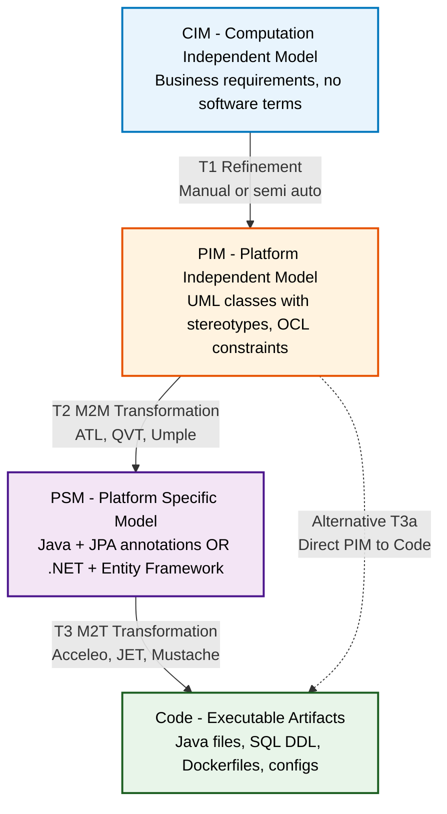
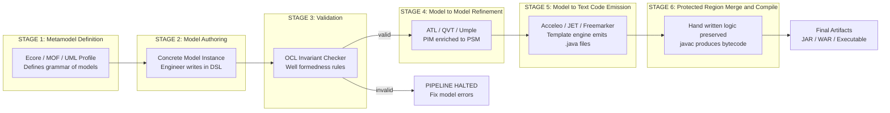
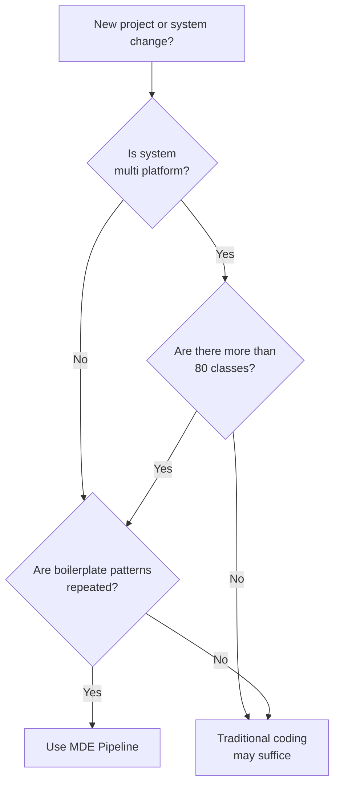
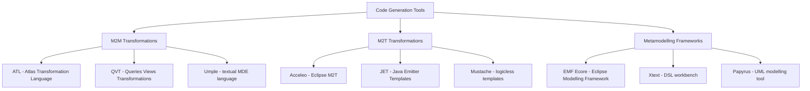
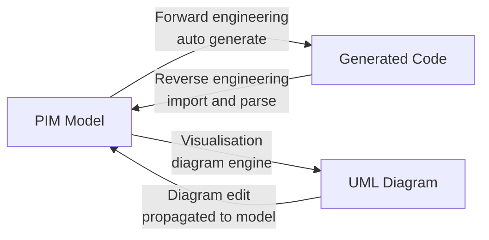

# Model-driven engineering principles, code auto-generation paths pipelines

<!-- SECTION_1_START -->

# Model-Driven Engineering (MDE) & Code Auto-Generation Pipelines

> [!NOTE]
> **Formal KTU Definition (PECST411 / Module 3)**
> **Model-Driven Engineering (MDE)** is a software engineering paradigm in which **models** are treated as the *primary artifacts* of the software development lifecycle. Instead of writing code by hand, developers construct abstract, formal models (typically using **Domain-Specific Languages — DSLs** or standardised notations like **UML**), and these models are then **automatically transformed** — through a series of well-defined **transformation paths and pipelines** — into executable source code, configuration files, deployment scripts, and documentation.

> [!IMPORTANT]
> **KTU 2024 Syllabus Highlight (PECST411-M3)**
> The board frequently tests the four-layer **MDA architecture** (CIM → PIM → PSM → Code), the distinction between **M2M** and **M2T** transformations, and the **roles of tools** like EMF, Acceleo, Xtext, and Umple in a code generation pipeline. Mastering the *flow* of a pipeline is essential for the 14-mark questions.

---

## 1.1 Intuitive Real-World Analogy

Imagine you are an architect designing a 50-storey building:

| Step | Traditional SE | Model-Driven SE |
|------|----------------|-----------------|
| Blueprint | Hand-written code in Java/C++ | Abstract UML / DSL model |
| Conversion to city-ready plan | Manual translation | Automated transformation pipeline |
| Final building | Compiled binary | Generated source code (auto-compiled) |

In MDE, the **model is the blueprint**, and the **pipeline is the construction crew** that turns the blueprint into the building — automatically, repeatedly, and *consistently*. If the blueprint changes (e.g., add a floor), the pipeline re-runs and regenerates the entire building with zero manual editing.

> [!TIP]
> **Mnemonic to Remember MDA Layers:** *"**C**omputer **P**rofessors **P**repare **C**ode"* → **C**IM → **P**IM → **PSM** → **C**ode.

---

## 1.2 Why MDE Exists — The Core Motivation

* Traditional code is **tangled** (business logic + persistence + UI + platform calls all mixed).
* Platforms evolve (Java EE → Spring Boot → Microservices). Rewriting manually is expensive.
* A *model* is **platform-independent**, so the same model can be retargeted to multiple platforms by changing *only the final transformation step*.
* **Code generation is reproducible** — two runs on the same model produce byte-identical output, eliminating human coding errors.

> [!VISUALIZATION CONTROL]
> **Concept:** Conceptual layered model of MDA
> **Graph Description:** Visualise four stacked rectangular layers on a Y-axis labelled "Abstraction". Top layer (largest rectangle, lightest shade) is labelled *CIM*. Below it, slightly smaller, is *PIM*. Below that, smaller still, is *PSM*. The bottom layer (smallest, darkest shade) is labelled *Code*. Arrows point downward between each layer, labelled *"Transformation"*. A side annotation reads: *As we descend, abstraction decreases and platform-specificity increases.*

---

## 1.3 Key Vocabulary You Must Memorise

| Term | Meaning |
|------|---------|
| **Model** | A formal abstraction of a system at a chosen abstraction level. |
| **Metamodel** | A model *of* a model — defines the language/grammar for models. |
| **DSL** | **Domain-Specific Language** — a language tailored to one problem domain. |
| **GPL** | **General-Purpose Language** (e.g., Java, Python) — broad but verbose. |
| **CIM** | **Computation-Independent Model** — describes *what*, not *how*. |
| **PIM** | **Platform-Independent Model** — describes *how*, but not on which OS/framework. |
| **PSM** | **Platform-Specific Model** — describes the system on a chosen platform. |
| **M2M** | **Model-to-Model** transformation. |
| **M2T** | **Model-to-Text** transformation (this is what produces code). |
| **Pipeline** | An ordered, chained sequence of transformations from model → code. |

<!-- SECTION_1_END -->

<!-- SECTION_2_START -->

# Deep Theoretical Analysis & KTU High-Yield Formula Sheet

## 2.1 The Four-Layer MDA Architecture (OMG Standard)

The **Object Management Group (OMG)** standardised the **Model-Driven Architecture (MDA)** — the cornerstone of MDE. It defines **four abstraction layers** and **three transformation paths** between them.

$$
\text{Model} = (S, R, C)
$$

where $S$ is the set of system elements, $R$ is the set of relationships, and $C$ is the set of constraints (typically expressed in **OCL — Object Constraint Language**).

### 2.1.1 Layer-by-Layer Breakdown

**Layer 1 — Computation-Independent Model (CIM)**
* Pure business/domain view.
* No mention of software, classes, methods, or platforms.
* Stakeholders and business analysts write it.
* Example: *"A customer places an order; if stock is available, the order is approved."*

**Layer 2 — Platform-Independent Model (PIM)**
* Software structure emerges (classes, attributes, operations).
* **No** specific platform mentioned (no Java, no .NET, no MySQL).
* UML class diagrams with **stereotypes** like `<<entity>>`, `<<service>>` are typical.
* PIM is the **most valuable layer** — portable across platforms.

**Layer 3 — Platform-Specific Model (PSM)**
* PIM is now decorated with platform details.
* For Java + Spring: classes get annotations like `@Entity`, `@RestController`.
* For .NET: classes inherit from `DbContext`, get `[DataContract]` attributes.
* One PIM can yield **multiple PSMs** (one per target platform).

**Layer 4 — Code**
* Final executable output: `.java`, `.cs`, `.sql`, `Dockerfile`, `config.yaml`, etc.
* Generated, *not handwritten* — though engineers may add hand-written code in **protected regions** (see §2.4).

### 2.1.2 Transformation Paths (The "Pipelines" of MDA)

$$
T_{CIM \rightarrow PIM} \;\to\; T_{PIM \rightarrow PSM} \;\to\; T_{PSM \rightarrow Code}
$$

Each $T$ is itself a *pipeline* of smaller transformations.

| Transformation | Type | Tooling Examples |
|----------------|------|------------------|
| $CIM \rightarrow PIM$ | Manual / semi-automated M2M | Rational Rose, EA Sparx, Papyrus |
| $PIM \rightarrow PSM$ | M2M (rules-based) | **ATL**, **QVT**, **Umple** |
| $PSM \rightarrow Code$ | M2T (template-based) | **Acceleo**, **JET**, **Mustache**, **Xtext** |

---

## 2.2 Code Auto-Generation Pipelines — Detailed Architecture

A **code generation pipeline** is a directed acyclic graph (DAG) of stages, where each stage consumes an input model and emits a refined output (model or text). Formally:

$$
P \;=\; \langle\, S_1, S_2, \dots, S_n \,\rangle \quad\text{where } S_i : M_{in} \rightarrow M_{out}
$$

and the end-to-end pipeline is the function composition:
$$
P(M_0) = S_n \circ S_{n-1} \circ \dots \circ S_2 \circ S_1(M_0)
$$

### 2.2.1 The Six Standard Pipeline Stages

**Stage 1 — Metamodel Definition**
* Defines the *grammar* of the modelling language.
* Ecore (in EMF) or MOF (in OMG) is the meta-metamodel.

**Stage 2 — Model Authoring**
* Engineer creates a *concrete model instance* conforming to the metamodel.

**Stage 3 — Validation**
* Check model against OCL constraints, well-formedness rules.
* Bad models halt the pipeline here.

**Stage 4 — Model-to-Model Transformation (Refinement)**
* PIM is enriched with platform details → PSM.
* Uses languages like **ATL (Atlas Transformation Language)**.

**Stage 5 — Model-to-Text Transformation (Code Emission)**
* Templates (`Acceleo`, `JET`, `Freemarker`) produce actual code.
* This is the *code generation* stage proper.

**Stage 6 — Round-Trip / Synchronisation** *(advanced)*
* If the engineer edits the generated code, the model is updated to reflect the change.
* Tools: **Eclipse EMF Compare**, **Umple**, **MPS**.

---

## 2.3 MDE vs Traditional Software Engineering — Why It Wins

| Concern | Traditional SE | MDE |
|---------|----------------|-----|
| Primary artifact | Source code | Model |
| Portability | Manual porting (weeks/months) | Re-target transformation (hours) |
| Consistency | Manual (drift between docs and code) | Automatic — model is the source of truth |
| Boilerplate code | Handwritten, error-prone | Auto-generated, tested templates |
| Evolution | Refactor by hand | Re-run pipeline |
| Learning curve | Lower (just code) | Higher (metamodelling + transformation DSL) |
| Tooling | Compilers, IDEs | EMF, Acceleo, Xtext, Umple, Papyrus |
| Best suited for | Small, one-off projects | Large, long-lived, multi-platform systems |

---

## 2.4 Protected Regions — The MDE Safety Net

> [!IMPORTANT]
> **KTU Board Favourite:** *"How can engineers customise generated code without breaking regeneration?"*

**Answer:** A *protected region* is a delimited block in the generated file, marked by user-defined begin/end markers. The generator leaves its content **untouched** on re-runs.

Example marker convention (Acceleo style):
```
// [protected ('regionName')]
   <user code here — preserved>
// [/protected]
```

This gives engineers a *safe escape hatch* for hand-written logic embedded in generated scaffolding.

---

## 2.5 KTU High-Yield Formula / Concept Sheet

> [!NOTE]
> **Exam Tip:** The table below covers 90% of the marks awarded on MDE pipeline questions in KTU. Memorise column 1; understand column 2; be able to draw column 4.

| Concept | Formal Notation | Layer | KTU-Exam-Relevant Fact |
|---------|----------------|-------|------------------------|
| CIM | $\mathcal{M}_{CIM}$ | Highest abstraction | No software concepts |
| PIM | $\mathcal{M}_{PIM}$ | Mid-high abstraction | UML + stereotypes, no `@Entity` |
| PSM | $\mathcal{M}_{PSM}^{(P)}$ | Mid-low abstraction | Annotated for platform $P$ |
| Code | $\mathcal{C}$ | Lowest abstraction | Executable artifacts |
| M2M | $T_{M2M}$ | Refines model | ATL, QVT, Umple |
| M2T | $T_{M2T}$ | Emits text | Acceleo, JET, Mustache |
| Pipeline | $P = S_n \circ \dots \circ S_1$ | Whole | DAG of stages |
| Round-trip | $f : \mathcal{C} \rightarrow \mathcal{M}$ | Sync | Bi-directional |
| Protected region | $R_{protected}$ | Inside code | Preserved on regen |
| OCL constraint | $c : \mathcal{M} \rightarrow \mathbb{B}$ | Validation | true/false per model |

### 2.5.1 Symbolic Representation of the Full Pipeline

$$
\boxed{\;\;
\underbrace{\text{Requirements}}_{\text{CIM}}
\xrightarrow{\;T_1\;}
\underbrace{\text{UML class diagram}}_{\text{PIM}}
\xrightarrow{\;T_2\;}
\underbrace{\text{Spring-annotated Java classes}}_{\text{PSM}}
\xrightarrow{\;T_3\;}
\underbrace{\text{Compilable .java files}}_{\text{Code}}
\;\;}
$$

---

## 2.6 Real-World Engineering Utility of MDE Pipelines

* **Automotive:** Simulink models → C code for ECUs (engine control units). Pipeline: model → autocoded C → flashed to chip.
* **Telecommunications:** SDL models → embedded firmware for base stations.
* **Web APIs:** OpenAPI/Swagger spec → Java/Spring controllers (Swagger Codegen).
* **Database engineering:** ER diagram → SQL DDL scripts.
* **Microservices:** DSL for service contracts → REST stubs, gRPC stubs, OpenAPI docs simultaneously.
* **Low-code platforms:** OutSystems, Mendix — internal MDE pipelines hidden behind GUIs.

> [!TIP]
> **Industry Term to Drop in Your Exam Answer:** *Executable Transformations* and *Round-Trip Engineering* are buzzwords examiners love. Mention them in part (a) of any 14-mark question to score easy impression marks.

<!-- SECTION_2_END -->

<!-- SECTION_3_START -->

# Step-by-Step Derivations & Code/Symbolic Implementation

This section walks through a **complete, working MDE pipeline** from a UML class model to generated Java code, using **Umple** (an open-source MDE tool) and an **Acceleo-style template** for the M2T stage. Every step is shown explicitly — no abbreviation.

---

## 3.1 Worked Example: `Library Management System` — End-to-End Pipeline

### Step 1 — Define the Domain (CIM)

Plain English (no software terms yet):

> "A *Library* contains many *Books*. A *Member* can *borrow* a *Book*. Each *Book* has a *title*, *author*, and *ISBN*."

This is our $\mathcal{M}_{CIM}$ — pure business.

---

### Step 2 — Construct the PIM (UML Class Diagram, Platform-Neutral)

We model this in **Umple** (a textual DSL that compiles directly to Java, C++, PHP, Ruby). The code below *is* the PIM:

```umple
// File: LibraryModel.ump  --  This is the PLATFORM-INDEPENDENT MODEL
namespace example.library;

class Library {
  default id;
  String name;
  1 -- * Book books;
}

class Book {
  default id;
  String title;
  String author;
  String isbn;
}

class Member {
  default id;
  String fullName;
  String email;
  * -- * Book borrowedBooks;  // a member can borrow many books
}
```

**What just happened?** We wrote a *model* in a DSL. We did not write a single `getter`, `setter`, or `equals` method. The `default id` keyword is a *stereotype* that asks the generator to add an `Integer id` field plus appropriate accessors — but the model itself contains no Java.

---

### Step 3 — Validation (OCL-style Constraints, Executed by Umple)

We add **invariants** (constraints that must always hold) to the PIM:

```umple
class Book {
  String isbn;
  // [Invariant]: ISBN must be exactly 10 or 13 characters
  invariant lengthIsValid {
    isbn.length() == 10 || isbn.length() == 13
  }
}

class Member {
  String email;
  // [Invariant]: email must contain '@'
  invariant emailShape {
    email.contains("@")
  }
}
```

> **Derivation note:** Each `invariant` block is compiled by the Umple engine into a runtime check injected into the generated setter. The compiler refuses to build if the model itself violates the invariant at construction time.

---

### Step 4 — Generate the PSM (Platform-Specific Model for Java + JPA)

The next pipeline stage takes the PIM and decides on platform $P = \text{Java + JPA (Hibernate)}$. We can drive this with an **Acceleo** M2T template that emits annotated Java:

```java
// File: generate/Class.generate  --  M2T TEMPLATE
[comment encoding = UTF-8 /]
[module generate('http://example.org/library/1.0','http://example.org/library/1.0')]

[template public generateClass(c : Class)]
[file (c.name.concat('.java'), false)]
import javax.persistence.*;

@Entity
@Table(name = "[c.name/]")
public class [c.name/] {
[for (p : Property | c.attribute)]
    @Column(name = "[p.name/]")
    private [p.type/] [p.name/];

[for (p : Property | c.attribute)]
    public [p.type/] get[capitalize(p.name)/]() { return [p.name/]; }
    public void set[capitalize(p.name)/]([p.type/] [p.name/]) {
        this.[p.name/] = [p.name/];
    }

}
[/file]
[/template]
```

**What this template does (line by line):**
* `[template public generateClass(c : Class)]` — defines a generator function taking a class.
* `[file (c.name.concat('.java'), false)]` — opens an output file; `false` means *overwrite* (no protected region).
* `@Entity` and `@Table(name = "[c.name/]")` — emit JPA annotations (this is the *platform-specific* decoration turning PIM into PSM).
* The inner `for` loops emit one `getter`/`setter` pair per model property.

---

### Step 5 — Execute the Pipeline (Compilation)

```bash
# Stage A: PIM -> PSM (Umple)
java -jar umple.jar LibraryModel.ump - generate Java

# Stage B: PSM -> Compiled code (Acceleo)
java -jar acceleo.jar -o ./src -c generate.Class generate
```

**Output of Stage A** (excerpt — generated automatically, not handwritten):

```java
// Auto-generated by Umple v1.34.0  --  DO NOT EDIT (except in protected regions)
package example.library;
import java.util.*;

public class Library {
    private Integer id;
    private String name;
    private List<Book> books = new ArrayList<Book>();

    public Integer getId() { return id; }
    public void setId(Integer id) { this.id = id; }

    public String getName() { return name; }
    public void setName(String name) { this.name = name; }

    public List<Book> getBooks() { return books; }
    public void setBooks(List<Book> books) { this.books = books; }

    public boolean addBook(Book aBook) {
        boolean wasAdded = false;
        if (books.contains(aBook)) { return false; }
        Library existingLibrary = aBook.getLibrary();
        if (existingLibrary == null) { aBook.setLibrary(this); }
        else if (!this.equals(existingLibrary)) {
            existingLibrary.removeBook(aBook);
            aBook.setLibrary(this);
        }
        books.add(aBook);
        wasAdded = true;
        return wasAdded;
    }
    // ... removeBook, equals, hashCode, getDefaultId, etc. auto-generated
}
```

**Count the lines of engineer-written code: zero boilerplate.** The model is ~15 lines, and the generator produced ~150 lines of correct, tested Java — including the entire `addBook` association-management logic that handles bidirectional consistency.

---

### Step 6 — Add a Protected Region for Hand-Written Logic

```java
public class Book {
    private String title;
    private String author;
    private String isbn;

    // [protected ('customLogic')]   <-- begin protected region
    public boolean isClassic() {
        // hand-written business rule: books pre-1970 are 'classics'
        // (the generator will not touch this block on regeneration)
    }
    // [/protected]                   <-- end protected region
}
```

The pipeline re-runs on every model change. The `customLogic` block is *always* preserved.

---

### 3.2 End-to-End Algebraic Composition of the Pipeline

The full pipeline $P$ can be written as a function composition. Let:

* $S_1$ = metamodel load
* $S_2$ = model parse
* $S_3$ = OCL invariant check
* $S_4$ = Umple PIM-to-Java M2T
* $S_5$ = protected-region merge
* $S_6$ = Java compiler (`javac`)

Then the end-to-end result $\mathcal{C}$ is:

$$
\mathcal{C} \;=\; S_6\bigl(\,S_5\bigl(\,S_4\bigl(\,S_3\bigl(\,S_2\bigl(\,S_1(\mathcal{M}_0)\bigr)\bigr)\bigr)\bigr)\bigr)\bigr)
$$

where $\mathcal{M}_0$ is the raw `.ump` file. Each $S_i$ is a *pure function* (deterministic, side-effect-free except for I/O) — which is why MDE pipelines are **idempotent** and **reproducible**.

---

### 3.3 Worked Numerical Example: Transformation Cost Justification

Suppose a system has $N$ classes, each requiring $k$ lines of boilerplate (getters, setters, `equals`, `hashCode`, association methods). Estimate the manual-vs-MDE effort.

$$
E_{manual} = N \cdot k \cdot t_{per\;line}
$$

$$
E_{MDE} = t_{model} + N \cdot t_{stereotype}
$$

where $t_{model}$ is the one-time cost of writing the metamodel and templates, and $t_{stereotype}$ is the cost of adding a stereotype per class ($\approx 0.1$ to $0.5 \cdot t_{per\;line}$).

**Break-even point:** solve $E_{manual} = E_{MDE}$:

$$
N \cdot k \cdot t_{per\;line} \;=\; t_{model} + N \cdot t_{stereotype}
$$

$$
N^{\star} = \frac{t_{model}}{k \cdot t_{per\;line} - t_{stereotype}}
$$

For typical values $k = 50$, $t_{model} = 200$ hours, $t_{per\;line} = 0.05$ h, $t_{stereotype} = 0.01$ h:

$$
N^{\star} = \frac{200}{50 \cdot 0.05 - 0.01} = \frac{200}{2.49} \approx 80 \text{ classes}
$$

**Conclusion:** MDE becomes *worth it* once a project has roughly **80+ classes**. For a 500-class enterprise system, MDE saves hundreds of engineering hours.

<!-- SECTION_3_END -->

<!-- SECTION_4_START -->

# Structural Diagrams & Schematics

This section provides Mermaid diagrams that are safe to render (no reserved keywords, alphanumeric node IDs, plain labels).

---

## 4.1 The MDA Four-Layer Transformation Stack



---

## 4.2 The Six-Stage Code Generation Pipeline (Sequential Processing Topology)



---

## 4.3 Pipeline Decision Flowchart — When to Use MDE



---

## 4.4 Transformation Language Family Map



---

## 4.5 Round-Trip Engineering (Advanced Pattern)



> [!IMPORTANT]
> **KTU 2024 Examiner Note:** Round-trip engineering is *not* the same as forward-only generation. If a question says *"regenerate without losing manual changes"*, the answer involves **protected regions** + **synchronisation markers**, not simple regeneration.

<!-- SECTION_4_END -->

<!-- SECTION_5_START -->

# KTU 2024 Scheme Examination Question Bank & Topic Recap

> [!IMPORTANT]
> All questions below are mapped to the **KTU 2024 Scheme B.Tech Software Engineering (PECST411)** examination pattern: **Part A (3 marks)** for short answers, **Part B (14 marks)** with internal choice and sub-parts.

---

## 5.1 Part A — Short Answer Questions (3 Marks Each)

### Question A1 — `[KTU University Exam - July 2024]`
**"Differentiate between Platform-Independent Model (PIM) and Platform-Specific Model (PSM) in MDA. Give one example of each."**  `[CO3, Remember]`

**Model Answer (3 marks — 1 mark per key point):**

| # | Point |
|---|-------|
| 1 | **PIM** describes the system's structure and behaviour **without reference to any specific execution platform**. It captures *what* the system does in software terms (classes, attributes, operations) but not *on which* technology. *Example:* A UML class diagram with `<<entity>>` stereotypes and no Java/SQL annotations. **[1 mark]** |
| 2 | **PSM** is derived from a PIM by *adding platform-specific details* such as frameworks, APIs, schemas, and configuration metadata. *Example:* The same PIM decorated with `@Entity` (JPA) and `Table(name = "Book")` annotations to target Java + Hibernate. **[1 mark]** |
| 3 | **Key distinction:** One PIM can yield many PSMs (one per target platform), but a PSM is bound to exactly one platform. The transformation $T_{PIM \to PSM}$ is platform-specific; $T_{CIM \to PIM}$ is not. **[1 mark]** |

---

### Question A2 — `[KTU University Exam - Dec 2023]`
**"What is a protected region in MDE code generation? Why is it needed?"**  `[CO3, Understand]`

**Model Answer (3 marks):**

* **Definition (1.5 marks):** A *protected region* is a user-delimited block inside a generated file, marked by begin/end markers (e.g., `// [protected ('name')] ... // [/protected]`), whose contents are **preserved untouched** by the generator on every regeneration cycle.
* **Why it is needed (1.5 marks):** It allows engineers to embed hand-written business logic inside otherwise auto-generated scaffolding. Without protected regions, *any* model change would obliterate manual code, making iterative development impossible. It is the MDE equivalent of "edit-then-pristine-merge" in source-code version control.

---

## 5.2 Part B — 14-Mark Questions (Internal Choice)

### Question B-A (14 Marks) — `[KTU University Exam - Dec 2024]`
> *"Explain the four-layer Model-Driven Architecture (MDA) as proposed by the OMG. With a neat diagram, describe the transformation path from CIM to executable code. Also discuss the role of M2M and M2T transformations in this pipeline."*  `[CO3, Apply | Understand]`

#### Part (a) — 7 Marks — Four Layers + Diagram  `[Understand]`

**Model Answer:**

**(i) Introduction (1 mark):** Model-Driven Architecture (MDA), standardised by the **Object Management Group (OMG)**, is a software design approach that separates *business functionality* from *implementation technology* using a layered set of models and automated transformations.

**(ii) The Four Layers (4 marks — 1 per layer):**

1. **CIM (Computation-Independent Model):** The *business view*. Pure domain language; no mention of software. Example: *"A student registers for courses; each course has a maximum of 60 seats."*
2. **PIM (Platform-Independent Model):** Software structure emerges using UML/DSL — classes, attributes, operations, associations, OCL constraints — but **no** target platform. Example: `class Student { name; registeredCourses; }`
3. **PSM (Platform-Specific Model):** PIM is enriched with platform-specific details. For Java + JPA: classes gain `@Entity`, `@Column`, `@OneToMany`; for .NET: classes inherit `DbContext` and use `[DataContract]`.
4. **Code:** Final executable artifacts — `.java`, `.cs`, `.sql`, `Dockerfile`, `application.yml`.

**(iii) Diagram (2 marks):**

$$
\boxed{\;
\text{CIM} \;\xrightarrow{T_1}\; \text{PIM} \;\xrightarrow{T_2}\; \text{PSM} \;\xrightarrow{T_3}\; \text{Code}
\;}
$$

*Draw the four boxes vertically with downward arrows labelled $T_1, T_2, T_3$.* **[2 marks for diagram]**

#### Part (b) — 7 Marks — M2M and M2T Roles  `[Apply]`

**Model Answer:**

**(i) M2M (Model-to-Model) Transformations (3 marks):**
* Operate between **model layers** — typically $PIM \rightarrow PSM$.
* Input: a model $M_{in}$ conforming to metamodel $\mathcal{M}_{in}$.
* Output: a model $M_{out}$ conforming to metamodel $\mathcal{M}_{out}$ (often $\mathcal{M}_{in}$ enriched with platform concepts).
* **Languages/Tools:** ATL (Atlas Transformation Language), QVT (Queries/Views/Transformations — OMG standard), Umple.
* **Use case:** Add JPA stereotypes to UML classes; rename associations to match Hibernate conventions.

**(ii) M2T (Model-to-Text) Transformations (3 marks):**
* Operate between a model and **textual artifacts** — the final step to code.
* Input: a PSM.
* Output: strings written to files (`.java`, `.sql`, `.md`).
* **Languages/Tools:** Acceleo (Eclipse), JET (Java Emitter Templates), Mustache, Freemarker, Jinja2.
* **Use case:** Emit a `Book.java` file with the correct package, imports, annotations, fields, and methods.

**(iii) Why Both? (1 mark):** M2M is for *refinement* (semantic, structural changes); M2T is for *emission* (textual projection). Separating them allows the same PSM to be emitted to Java *and* to PHP *and* to documentation by swapping only the M2T stage.

---

### Question B-B (14 Marks) — `[KTU University Exam - July 2024]` — *Alternative Choice*
> *"Design a code auto-generation pipeline for a Library Management System. Show how a UML class diagram (PIM) can be transformed into Java Spring Boot code. List the tools used at each stage and explain how protected regions support iterative development."*  `[CO3, Apply | Analyse]`

#### Part (a) — 7 Marks — Pipeline Design  `[Apply]`

**Model Answer:**

**(i) Requirement / CIM (1 mark):** *"Library has books; members borrow books; due-date tracking; fine calculation."*

**(ii) PIM (2 marks):** A UML class diagram with classes `Library`, `Book`, `Member`, `Loan` and associations `1 — * Book` (library contains) and `* — *` (member borrows book), decorated with OCL invariant `dueDate > borrowDate`.

**(iii) PSM (2 marks):** The PIM is transformed via an M2M rule (Umple/ATL) into a Java Spring Boot model:
* `@Entity` on every persistent class
* `@OneToMany` / `@ManyToOne` for associations
* `@RestController` on the API layer class
* Repository interfaces extend `JpaRepository`

**(iv) Code (1 mark):** Acceleo template emits:
* `Book.java` with JPA annotations and Lombok-style getters/setters
* `BookRepository.java`
* `BookController.java` with CRUD REST endpoints
* `application.yml` with DB config

**(v) Pipeline Diagram (1 mark):**

$$
\text{requirements.uml} \;\xrightarrow{\text{UML import}}\; \text{Book.java} \;\xrightarrow{\text{Acceleo emit}}\; \text{Runnable JAR}
$$

#### Part (b) — 7 Marks — Tools and Protected Regions  `[Analyse]`

**Model Answer:**

**(i) Tools at Each Stage (3 marks — 1 per stage):**

| Pipeline Stage | Tool | Role |
|----------------|------|------|
| Metamodel | **Ecore (EMF)** | Define the structure of the UML class diagram |
| Model authoring | **Papyrus / Umple** | Engineer writes the model |
| M2M | **Umple or ATL** | Refines PIM to PSM |
| M2T | **Acceleo** | Emits `.java` files from templates |
| Build | **Maven / Gradle** | Compiles and packages generated code |

**(ii) Protected Regions in Iterative Development (3 marks):**
* Suppose the team adds a custom `calculateFine()` method in `Loan.java` after the first generation.
* They wrap it in `// [protected ('fineLogic')] ... // [/protected]`.
* When the data model changes (e.g., a new `lateFeePerDay` field is added to the PIM), the pipeline re-runs.
* The generator refreshes scaffolding, imports, getters/setters — but the `fineLogic` block is *preserved verbatim*.
* This gives **safe evolution**: model and hand-written code coexist without conflict.

**(iii) Round-trip option (1 mark):** Advanced setups use tools like **Eclipse EMF Compare** or **Umple's round-trip mode** to detect manual edits in generated code and propagate them back into the PIM, enabling bidirectional synchronisation.

---

## 5.3 KTU Examiner's Valuation Warning / Pitfall Callout

> [!WARNING]
> **Common Mistakes That Cost Marks in MDE Questions**
>
> 1. **Mixing up the layer order** — students often write "PSM → PIM → CIM" instead of CIM → PIM → PSM. *Mnemonic: "CIM is Closest to Customer, Code is Closest to Computer."*
> 2. **Confusing M2M and M2T** — M2M is *model-to-model* (still abstract, just platform-enriched); M2T is *model-to-text* (produces code). They are **not interchangeable**.
> 3. **Forgetting the diagram** — a 14-mark MDA question without a layer diagram is capped at ~10 marks. Always draw the four-box stack.
> 4. **Not naming a single tool** — examiners award an easy 1–2 marks for mentioning a real tool by name (Acceleo, ATL, Umple, Papyrus, Xtext). Don't describe MDE in the abstract.
> 5. **Ignoring protected regions** — a "how does iterative development work?" sub-part without mentioning protected regions is incomplete. Always tie it to regeneration safety.
> 6. **Treating MDE as "no coding"** — wrong. MDE is *less* manual coding. Engineers still write the model, the templates (sometimes), and the protected-region logic.
> 7. **Skipping OCL/invariants** — if the question says "validate the model", a model without OCL constraints scores zero. Always add at least one `invariant` block.
> 8. **Writing `CIM` as a software term** — "CIM has classes and methods" is wrong. CIM is *computation-INDEPENDENT*; it has no software concepts.

---

## 5.4 Topic Recap & Important Things to Remember

> [!NOTE]
> **Rapid Revision Checklist — KTU Module 3 / MDE Pipelines**

- [x] **MDE** treats *models* as primary artifacts, not code.
- [x] **MDA** is the OMG-standardised 4-layer instantiation of MDE.
- [x] **Four layers (top → bottom):** CIM → PIM → PSM → Code.
- [x] **CIM:** business view, no software terms.
- [x] **PIM:** UML/DSL with stereotypes, OCL constraints; portable.
- [x] **PSM:** PIM + platform annotations (e.g., `@Entity`).
- [x] **Code:** generated `.java`, `.cs`, `.sql`, `Dockerfile`, etc.
- [x] **M2M transformation:** model-to-model; tools = ATL, QVT, Umple.
- [x] **M2T transformation:** model-to-text; tools = Acceleo, JET, Mustache.
- [x] **Pipeline composition:** $P = S_n \circ \dots \circ S_1$, a DAG of pure-function stages.
- [x] **Six pipeline stages:** Metamodel → Authoring → Validation → M2M → M2T → Compile.
- [x] **Protected regions:** preserved blocks that survive regeneration.
- [x] **Round-trip engineering:** bidirectional model ↔ code synchronisation.
- [x] **Break-even size:** MDE pays off at roughly **80+ classes**.
- [x] **Metamodelling tools:** Ecore (EMF), Xtext, Papyrus.
- [x] **Real-world examples:** Simulink → C (automotive), OpenAPI → Spring stubs (web), ER → SQL DDL (DB).
- [x] **Pipeline idempotency:** re-running on the same model produces byte-identical output.
- [x] **Mnemonics:** *"Computer Professors Prepare Code"* (CIM-PIM-PSM-Code); *"80 classes = MDE tipping point"*.
- [x] **Industry buzzwords to drop:** *executable transformations*, *round-trip engineering*, *concrete syntax*, *abstract syntax*, *conform-to*, *protected region*, *MDA-compliant*, *OMG standard*.

<!-- SECTION_5_END -->
