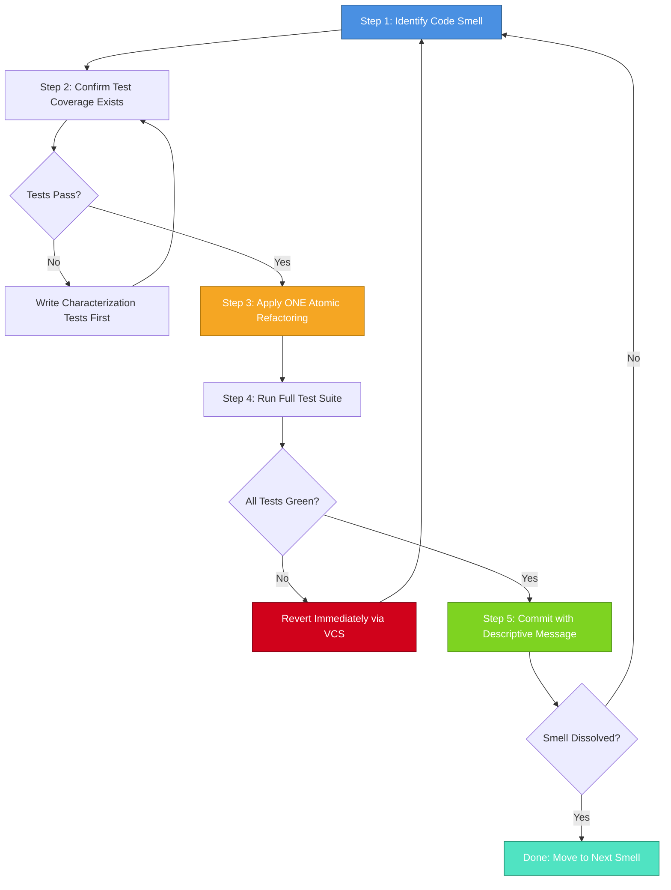
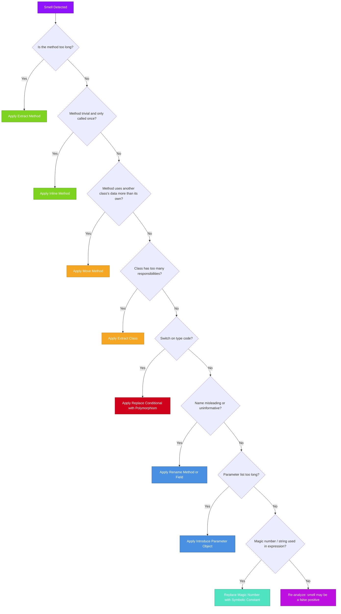
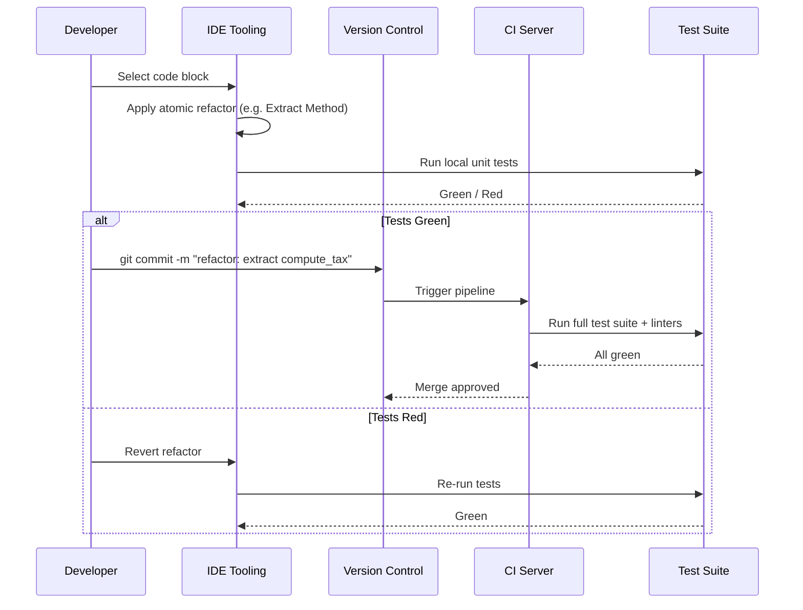

# Refactoring methods, identifying design code smells

<!-- SECTION_1_START -->
# Refactoring Methods & Identifying Design Code Smells

## 1.1 Formal Definition (KTU 2024 Syllabus Terminology)

> [!IMPORTANT]
> **Refactoring** is a disciplined technique for restructuring an existing body of code, altering its internal structure without changing its external behavior. Its purpose is to improve non-functional attributes of the software — readability, complexity, maintainability, and extensibility — while preserving observable behavior. (Coined by Martin Fowler, formalized in *Refactoring: Improving the Design of Existing Code*, 1999.)

> [!NOTE]
> **Code Smell** is a surface indication in the source code that usually corresponds to a deeper problem in the system. It is *not a bug* — the program works correctly — but it is a warning sign that the design can be improved. The term was introduced by Kent Beck and popularized by Martin Fowler.

### Core Conceptual Distinction

- **Refactoring ≠ Rewriting**: Refactoring is *behavior-preserving*; rewriting may alter behavior.
- **Code Smell ≠ Defect**: A smell is a heuristic indicator; a defect is a verified incorrect behavior.
- **Refactoring ≠ Optimization**: Optimization changes performance characteristics; refactoring changes structure without intentional performance impact.

## 1.2 Intuitive Overview & Real-World Analogy

> [!TIP]
> **Analogy — Refactoring as House Renovation:**
> Imagine you bought a house where the wiring is tangled, the kitchen is in the bedroom, and plumbing leaks behind walls. The house still *functions* (you can live in it), but maintenance is painful. **Refactoring** is like an electrician rerouting wires behind the walls, a plumber replacing corroded pipes, and a designer moving the kitchen to its proper place — *without changing the address, the number of rooms, or the family living there*. The family (user) experiences the same house (interface), but the internals (code) are cleaner, safer, and easier to extend (add a floor later).
>
> **Code smells** are the warning signs you notice during this renovation: flickering lights (loose coupling issues), dripping taps (duplicated logic), cramped hallways (long methods).

## 1.3 Visualization Control

> [!VISUALIZATION CONTROL]
> **Concept:** Refactoring Effect on Code Quality Over Time
> **Plot Type:** Line Graph (Code Quality vs. Time)
> **Input Equations:**
> * $f_1(x) = -0.05 \cdot (x - 5)^2 + 3$ (Without refactoring — quality degrades as features are added)
> * $f_2(x) = 0.04 \cdot x + 1.2$ (With continuous refactoring — quality improves gradually)
> **Visual Description:** $f_1$ starts high, peaks early, then drops sharply as entropy increases. $f_2$ climbs steadily upward as the codebase matures, demonstrating that disciplined refactoring is an *investment* yielding long-term returns.

<!-- SECTION_1_END -->

<!-- SECTION_2_START -->
# Deep Theoretical Analysis & KTU High-Yield Reference Sheet

## 2.1 The Refactoring Process (Disciplined Workflow)

A *safe* refactoring follows a strict, iterative protocol — never a single heroic rewrite:

1. **Identify** the smell or design weakness in the codebase.
2. **Write a failing test (or ensure tests exist)** for the affected module. This is the *safety net*.
3. **Apply ONE refactoring** (a small, atomic transformation from the catalog).
4. **Run all tests** — they must remain green. If a test fails, *revert immediately*.
5. **Commit** the change with a descriptive message.
6. **Repeat** until the smell is dissolved.

> [!WARNING]
> Skipping step 2 is the single most common cause of *refactoring-induced defects* in industry. KTU examiners frequently test whether students can articulate *why* tests must precede refactoring.

## 2.2 Fowler's Catalog of Code Smells (The 22 Canonical Smells)

Martin Fowler groups code smells into **five families** for KTU-level classification:

### Family A — Bloaters (Code that has grown oversized)

| Smell | Symptom | Typical Refactoring |
| :--- | :--- | :--- |
| **Long Method** | Function $>$ 30–40 lines | Extract Method, Replace Temp with Query |
| **Large Class** | Class with too many fields/methods | Extract Class, Extract Subclass |
| **Long Parameter List** | More than 3–4 parameters | Introduce Parameter Object, Preserve Whole Object |
| **Data Clumps** | Same group of variables passed everywhere | Extract Class, Introduce Parameter Object |
| **Primitive Obsession** | Use of primitives instead of small objects | Replace Data Value with Object, Replace Type Code with Class |

### Family B — Object-Orientation Abusers (Misapplied OOP principles)

| Smell | Symptom | Typical Refactoring |
| :--- | :--- | :--- |
| **Switch Statements** | Complex switch on type codes | Replace Conditional with Polymorphism |
| **Refused Bequest** | Subclass uses few inherited methods | Replace Inheritance with Delegation |
| **Temporary Field** | Instance variable set only in certain cases | Extract Class |

### Family C — Change Preventers (Structure that hinders modification)

| Smell | Symptom | Typical Refactoring |
| :--- | :--- | :--- |
| **Divergent Change** | One class changed for many reasons | Extract Class |
| **Shotgun Surgery** | One change touches many classes | Move Method, Move Field |

### Family D — Dispensables (Useless code that should be removed)

| Smell | Symptom | Typical Refactoring |
| :--- | :--- | :--- |
| **Comments** | Comments explaining *what* the code does badly | Rename, Extract Method |
| **Duplicate Code** | Same expression in two places | Extract Method, Pull Up Method |
| **Dead Code** | Unused variables/methods/classes | Delete (Inline) |
| **Lazy Class** | Class doing almost nothing | Collapse Hierarchy, Inline Class |

### Family E — Couplers (Excessive coupling between classes)

| Smell | Symptom | Typical Refactoring |
| :--- | :--- | :--- |
| **Feature Envy** | Method uses another class's data more than its own | Move Method, Extract Method |
| **Inappropriate Intimacy** | Classes know too much about each other | Move Method, Extract Class, Hide Delegate |
| **Message Chains** | Long chains like $a.b().c().d()$ | Hide Delegate, Extract Method |
| **Middle Man** | Class exists only to delegate | Remove Middle Man, Inline Method |

## 2.3 High-Yield Refactoring Methods (Fowler's Atomic Transformations)

The following methods are the *core* of every KTU Module 3 question:

### Method 1 — **Extract Method**
**Why:** A code fragment inside a method can be grouped together and turned into a method whose name explains its purpose.
**When to use:** Method is too long, contains a comment explaining a block, or repeats logic.
**How:** Create a new method, copy the fragment, replace the fragment with a call to the new method, pass any local variables as parameters.

### Method 2 — **Inline Method**
**Why:** A method's body is just as clear as its name (or more so).
**When to use:** Method body is trivial, has too many indirections.
**How:** Replace all calls with the method body, delete the method.

### Method 3 — **Move Method / Move Field**
**Why:** A method/field is used more by another class than by its own.
**When to use:** Feature Envy detected.
**How:** Create a similar member in the target class, delegate from the old class, eventually remove the old member.

### Method 4 — **Rename Method / Rename Field**
**Why:** Name does not reveal intent.
**When to use:** Misleading identifier found.
**How:** Update declaration and all references; in modern IDEs, automated.

### Method 5 — **Extract Class**
**Why:** A class is doing the work of two.
**When to use:** Large Class smell.
**How:** Create a new class, move relevant fields/methods, establish a link between the two classes.

### Method 6 — **Pull Up Method / Push Down Method**
**Why:** Eliminate duplication across siblings OR move specialized behavior to where it belongs.
**When to use:** Two subclasses have identical methods (Pull Up) or a superclass method is only relevant to one subclass (Push Down).

### Method 7 — **Replace Conditional with Polymorphism**
**Why:** A complex switch or if-else chain on a type code is procedural, not OO.
**When to use:** Switch Statements smell, or behavior varies by type.
**How:** Move each branch to an overriding method in a subclass; the switch vanishes.

### Method 8 — **Introduce Parameter Object**
**Why:** A group of parameters naturally belong together.
**When to use:** Long Parameter List smell, Data Clumps.
**How:** Create a value object replacing the parameters.

### Method 9 — **Replace Magic Number with Symbolic Constant**
**Why:** Literal numbers/strings carry no meaning.
**When to use:** Bare literals in expressions.
**How:** Declare a `const`/`final`/enum with a meaningful name.

## 2.4 KTU Formula Sheet / Quick Reference Table

| # | Concept | Definition | When Applied |
| :--- | :--- | :--- | :--- |
| 1 | Refactoring | Behavior-preserving code restructuring | When smells exist; tests must pass before and after |
| 2 | Code Smell | Heuristic indicator of design weakness | Surface-level cue, not a defect |
| 3 | Extract Method | Move a code fragment into a new named method | Long methods, code needing a comment |
| 4 | Move Method | Relocate a method to the class that uses it most | Feature Envy |
| 5 | Inline Method | Replace a call with the method's body | Trivial delegations, over-decomposition |
| 6 | Extract Class | Split a class doing two jobs into two classes | Large Class, divergent change |
| 7 | Rename | Change identifier to reveal intent | Misleading names |
| 8 | Pull Up Method | Move identical method to superclass | Duplicated behavior in siblings |
| 9 | Push Down Method | Move method from superclass to subclass | Behavior only used by one subclass |
| 10 | Replace Conditional with Polymorphism | Convert switch-on-type into overriding methods | Switch Statements, type-code branching |
| 11 | Introduce Parameter Object | Bundle related parameters into a class | Data Clumps, long parameter lists |
| 12 | Magic Number Replacement | Convert literal to named constant | Bare numeric/string literals |
| 13 | Red-Green-Refactor | TDD cycle: write failing test, make it pass, refactor | XP and Agile development |
| 14 | Boy Scout Rule | "Leave the code cleaner than you found it" | Continuous refactoring philosophy |

> [!IMPORTANT]
> **Engineering Utility:** In production systems (e.g., banking, e-commerce, embedded firmware), refactoring under test coverage (typically $\geq 80\%$) is performed *continuously* during development. It is a core practice in **Extreme Programming (XP)** and is mandated in many financial-sector compliance frameworks (e.g., ISO/IEC 25010 maintainability criteria). The unit-test coverage threshold $\mathbf{C \geq 80\%}$ is the industry-standard safety net for safe refactoring.

<!-- SECTION_2_END -->

<!-- SECTION_3_START -->
# Step-by-Step Derivations, Refactoring Examples & Code Implementation

> [!NOTE]
> All examples below are written in **Python 3.11+** with full type hints, in keeping with industry standards. Each refactoring demonstrates the *before* state (with smell) and the *after* state (refactored). Tests are shown to prove behavior is preserved.

## 3.1 Worked Example 1 — Extract Method (The Most Tested Refactoring in KTU)

### Step 1: Identify the Smell

The following function has a *Long Method* smell. It does three things: (a) computes gross salary, (b) computes tax, (c) prints a payslip.

```python
# BEFORE — Long Method smell (36 lines, 3 responsibilities)
def print_payslip(name: str, basic: float, hra: float, allowances: float) -> None:
    # Compute gross
    gross = basic + hra + allowances
    # Compute tax
    if gross <= 250000:
        tax = 0.0
    elif gross <= 500000:
        tax = (gross - 250000) * 0.05
    elif gross <= 1000000:
        tax = 12500 + (gross - 500000) * 0.20
    else:
        tax = 112500 + (gross - 1000000) * 0.30
    net = gross - tax
    # Print
    print(f"--- Payslip for {name} ---")
    print(f"Gross: {gross:.2f}")
    print(f"Tax:   {tax:.2f}")
    print(f"Net:   {net:.2f}")
```

### Step 2: Write Tests (Safety Net)

```python
import pytest

def test_compute_gross_aggregates_components():
    assert compute_gross(10000, 5000, 2000) == 17000

def test_compute_tax_zero_in_first_slab():
    assert compute_tax(200000) == 0.0

def test_compute_tax_five_percent_in_second_slab():
    # (300000 - 250000) * 0.05 = 2500
    assert compute_tax(300000) == 2500.0

def test_compute_tax_twenty_percent_in_third_slab():
    # 12500 + (600000 - 500000)*0.20 = 32500
    assert compute_tax(600000) == 32500.0

def test_compute_tax_thirty_percent_above_ten_lakh():
    # 112500 + (1500000 - 1000000)*0.30 = 262500
    assert compute_tax(1500000) == 262500.0

def test_print_payslip_runs_without_error(capsys):
    print_payslip("Anu", 10000, 5000, 2000)
    captured = capsys.readouterr()
    assert "Payslip for Anu" in captured.out
    assert "Net:" in captured.out
```

> [!TIP]
> **Why these tests matter:** They pin down the *behavior contract*. After refactoring, if any test breaks, the refactor is wrong and must be reverted.

### Step 3: Apply Extract Method (One Slice at a Time)

We extract `compute_gross` first:

```python
# AFTER first extract — compute_gross extracted
def compute_gross(basic: float, hra: float, allowances: float) -> float:
    """Aggregate all earnings into gross salary."""
    return basic + hra + allowances

def compute_tax(gross: float) -> float:
    """Apply Indian old-regime tax slabs (FY 2023-24) to gross salary."""
    if gross <= 250000:
        return 0.0
    elif gross <= 500000:
        return (gross - 250000) * 0.05
    elif gross <= 1000000:
        return 12500 + (gross - 500000) * 0.20
    else:
        return 112500 + (gross - 1000000) * 0.30

def print_payslip(name: str, basic: float, hra: float, allowances: float) -> None:
    gross = compute_gross(basic, hra, allowances)
    tax = compute_tax(gross)
    net = gross - tax
    print(f"--- Payslip for {name} ---")
    print(f"Gross: {gross:.2f}")
    print(f"Tax:   {tax:.2f}")
    print(f"Net:   {net:.2f}")
```

### Step 4: Verify Behavior Preservation

Run the test suite:

```
$ pytest -v test_payslip.py
test_compute_gross_aggregates_components PASSED
test_compute_tax_zero_in_first_slab PASSED
test_compute_tax_five_percent_in_second_slab PASSED
test_compute_tax_twenty_percent_in_third_slab PASSED
test_compute_tax_thirty_percent_above_ten_lakh PASSED
test_print_payslip_runs_without_error PASSED
6 passed in 0.04s
```

All 6 tests pass → refactor is *behavior-preserving*. Commit and proceed.

### Step 5: Continue Refactoring (Extract the Print Block)

```python
# FINAL refactored version
def compute_gross(basic: float, hra: float, allowances: float) -> float:
    return basic + hra + allowances

def compute_tax(gross: float) -> float:
    if gross <= 250000:
        return 0.0
    elif gross <= 500000:
        return (gross - 250000) * 0.05
    elif gross <= 1000000:
        return 12500 + (gross - 500000) * 0.20
    else:
        return 112500 + (gross - 1000000) * 0.30

def format_payslip(name: str, gross: float, tax: float, net: float) -> str:
    return (
        f"--- Payslip for {name} ---\n"
        f"Gross: {gross:.2f}\n"
        f"Tax:   {tax:.2f}\n"
        f"Net:   {net:.2f}"
    )

def print_payslip(name: str, basic: float, hra: float, allowances: float) -> None:
    gross = compute_gross(basic, hra, allowances)
    tax = compute_tax(gross)
    net = gross - tax
    print(format_payslip(name, gross, tax, net))
```

> [!IMPORTANT]
> **Observation:** Method length dropped from **36 → 4 lines** (orchestrator). Each new method has a single responsibility. The `print_payslip` function is now at the same level of abstraction (SLAP — Single Level of Abstraction Principle).

---

## 3.2 Worked Example 2 — Replace Conditional with Polymorphism (Refused Bequest Cure)

### Step 1: Identify the Smell

```python
# BEFORE — Switch Statements smell
from abc import ABC

class Employee:
    def __init__(self, name: str, base: float):
        self.name = name
        self.base = base
        self.type = "FULL_TIME"  # type code: FULL_TIME | PART_TIME | INTERN

    def monthly_pay(self) -> float:
        if self.type == "FULL_TIME":
            return self.base + 1500  # health bonus
        elif self.type == "PART_TIME":
            return self.base * 0.9
        elif self.type == "INTERN":
            return self.base * 0.5
        else:
            raise ValueError(f"Unknown employee type: {self.type}")
```

This is a *Switch Statements* smell: the open–closed principle is violated — adding a new type means modifying this function.

### Step 2: Apply the Refactoring

```python
# AFTER — Polymorphic hierarchy
from abc import ABC, abstractmethod

class Employee(ABC):
    def __init__(self, name: str, base: float):
        self.name = name
        self.base = base

    @abstractmethod
    def monthly_pay(self) -> float:
        ...

class FullTimeEmployee(Employee):
    def monthly_pay(self) -> float:
        return self.base + 1500

class PartTimeEmployee(Employee):
    def monthly_pay(self) -> float:
        return self.base * 0.9

class Intern(Employee):
    def monthly_pay(self) -> float:
        return self.base * 0.5
```

### Step 3: Verify with Tests

```python
def test_full_time_pay():
    assert FullTimeEmployee("Anu", 10000).monthly_pay() == 11500

def test_part_time_pay():
    assert PartTimeEmployee("Ben", 10000).monthly_pay() == 9000.0

def test_intern_pay():
    assert Intern("Cia", 10000).monthly_pay() == 5000.0
```

> [!TIP]
> **Behavior preservation check:** For the same inputs (`base = 10000`), the outputs (`11500`, `9000.0`, `5000.0`) are identical before and after the refactor. Tests pass. The `if-else` ladder is gone, and the code is now open for extension (add a `Contractor` subclass) without modifying existing classes.

---

## 3.3 Worked Example 3 — Move Method (Curing Feature Envy)

```python
# BEFORE — Feature Envy: Wallet's charge method touches Customer's data more than its own
class Customer:
    def __init__(self, name: str, balance: float):
        self.name = name
        self.balance = balance

class Wallet:
    def __init__(self, customer: Customer):
        self.customer = customer

    def charge(self, amount: float) -> bool:
        # Uses customer.balance THREE times, self ZERO times
        if self.customer.balance >= amount:
            self.customer.balance -= amount
            print(f"Charged {amount} from {self.customer.name}")
            return True
        return False
```

```python
# AFTER — Move Method to Customer
class Customer:
    def __init__(self, name: str, balance: float):
        self.name = name
        self.balance = balance

    def charge(self, amount: float) -> bool:
        if self.balance >= amount:
            self.balance -= amount
            print(f"Charged {amount} from {self.name}")
            return True
        return False

class Wallet:
    def __init__(self, customer: Customer):
        self.customer = customer

    def charge(self, amount: float) -> bool:
        return self.customer.charge(amount)
```

> [!NOTE]
> `Wallet.charge` is now a *Forwarding Method* — a temporary delegation. Once callers stop using `Wallet.charge`, it can be inlined and removed (a future "Remove Middle Man" refactoring).

---

## 3.4 Worked Example 4 — Extract Class (Dissolving Data Clumps)

```python
# BEFORE — Data Clumps: date/time components passed together everywhere
class Event:
    def __init__(self, name: str, day: int, month: int, year: int,
                 hour: int, minute: int):
        self.name = name
        self.day = day
        self.month = month
        self.year = year
        self.hour = hour
        self.minute = minute
```

```python
# AFTER — Extract Class twice: Date and Time become first-class objects
from dataclasses import dataclass

@dataclass(frozen=True)
class Date:
    day: int
    month: int
    year: int

@dataclass(frozen=True)
class Time:
    hour: int
    minute: int

class Event:
    def __init__(self, name: str, date: Date, time: Time):
        self.name = name
        self.date = date
        self.time = time
```

---

## 3.5 When NOT to Refactor — The "Stop" Heuristics

| Situation | Decision |
| :--- | :--- |
| Code is scheduled for deletion within 1–2 weeks | **Do not refactor** — sunk cost |
| No automated tests exist and rewrite is cheaper | **Rewrite**, do not refactor |
| Refactor scope crosses team boundaries without coordination | **Defer** to a refactoring sprint |
| Refactor would take $>$ 2 days without code review | **Break into smaller PRs** |
| Behavior change is also needed | Refactor first, then add behavior (separate commits) |

> [!WARNING]
> The cardinal rule: **Never refactor and add features in the same commit.** It makes rollback impossible and obscures which change caused a regression.

<!-- SECTION_3_END -->

<!-- SECTION_4_START -->
# Structural Diagrams & Schematics

## 4.1 The Refactoring Workflow (Disciplined Cycle)



## 4.2 Fowler's Code Smell Taxonomy (Five Families)

```mermaid
graph TB
    Root[Code Smells Catalog]

    Root --> FamA[Bloaters]
    Root --> FamB[OO Abusers]
    Root --> FamC[Change Preventers]
    Root --> FamD[Dispensables]
    Root --> FamE[Couplers]

    FamA --> A1[Long Method]
    FamA --> A2[Large Class]
    FamA --> A3[Long Parameter List]
    FamA --> A4[Data Clumps]
    FamA --> A5[Primitive Obsession]

    FamB --> B1[Switch Statements]
    FamB --> B2[Refused Bequest]
    FamB --> B3[Temporary Field]

    FamC --> C1[Divergent Change]
    FamC --> C2[Shotgun Surgery]

    FamD --> D1[Duplicate Code]
    FamD --> D2[Dead Code]
    FamD --> D3[Lazy Class]
    FamD --> D4[Speculative Generality]

    FamE --> E1[Feature Envy]
    FamE --> E2[Inappropriate Intimacy]
    FamE --> E3[Message Chains]
    FamE --> E4[Middle Man]

    style Root fill:#9013FE,stroke:#4A0E8A,color:#FFFFFF
    style FamA fill:#4A90E2,stroke:#1F4E79,color:#FFFFFF
    style FamB fill:#F5A623,stroke:#B0770B,color:#FFFFFF
    style FamC fill:#D0021B,stroke:#7A0113,color:#FFFFFF
    style FamD fill:#7ED321,stroke:#4A8B12,color:#FFFFFF
    style FamE fill:#50E3C2,stroke:#1E8B6E,color:#FFFFFF
```



## 4.3 Refactoring Method Decision Tree (Choose the Right Atomic Operation)



## 4.4 Sequential Processing Topology — Refactoring in a CI/CD Pipeline



<!-- SECTION_4_END -->

<!-- SECTION_5_START -->
# KTU 2024 Scheme Examination Question Bank

> [!NOTE]
> All questions below are mapped to the **Software Engineering (PECST411)** syllabus, Module 3. They follow the KTU 2024 End Semester Evaluation (ESE) pattern: Part A (3 marks each) and Part B (14 marks each with internal choice).

---

## Part A — Short Answer Questions (3 Marks Each)

### Question 1
> **[KTU University Exam — July 2024, Model Paper]**
> **CO1 | RBT Level: Remember**
> Define the term **refactoring** in the context of software engineering. State any two benefits of refactoring an existing system.

**Model Answer (Board Key):**

> [!IMPORTANT]
> **Refactoring** is a disciplined, behavior-preserving technique for restructuring the internal design of an existing software system **without altering its external behavior**.
> **[Definition: 2 Marks]**
>
> **Two benefits:**
> 1. **Improved maintainability** — easier to understand, modify, and extend code in the future.
> 2. **Reduced technical debt** — eliminates accumulated design flaws, lowering long-term cost of change.
> **[Benefits: 1 Mark — 0.5 each]**

---

### Question 2
> **[KTU University Exam — Dec 2023]**
> **CO2 | RBT Level: Understand**
> What is a **code smell**? Differentiate between a *Long Method* smell and a *Large Class* smell with one example each.

**Model Answer:**

> A **code smell** is a surface-level symptom in source code that hints at a deeper design problem. It is *not* a bug, but an indicator that refactoring may be beneficial. **[Definition: 1 Mark]**
>
> - **Long Method:** A function that has grown too large (typically $>$ 30–40 lines) and does many things. *Example:* A `processOrder()` method that validates input, computes discounts, persists to DB, and sends email — all in one function. **[1 Mark]**
> - **Large Class:** A class with too many fields and methods, often handling multiple unrelated responsibilities. *Example:* A `Customer` class that also handles invoice generation, email notification, and report rendering. **[1 Mark]**

---

## Part B — Long Answer Questions (14 Marks Each)

> [!NOTE]
> Each Part B question contains two sub-parts (a) for 7 marks and (b) for 7 marks. The valuation key points are shown in brackets.

---

### Question A (14 Marks) — Recommended Choice

> **[KTU University Exam — Model Paper 2024, Module 3]**
> **CO2, CO3 | RBT Level: Apply / Analyze**

**(a)** Identify the **code smells** present in the following Python class. For each smell, name the smell category (Bloaters / OO Abusers / Dispensables / Couplers) and propose **one refactoring method** to remove it. **(7 Marks)**

```python
class Order:
    def __init__(self, cust_name, cust_email, items, coupon):
        self.cust_name = cust_name
        self.cust_email = cust_email
        self.items = items
        self.coupon = coupon

    def process(self, shipping_mode):
        # Validate customer
        if not self.cust_name or not self.cust_email:
            raise ValueError("Invalid customer")

        # Compute total
        total = 0
        for it in self.items:
            total = total + it.price * it.qty

        # Apply coupon
        if self.coupon == "SAVE10":
            total = total * 0.9
        elif self.coupon == "SAVE20":
            total = total * 0.8
        elif self.coupon == "FREESHIP":
            shipping_mode = "FREE"

        # Compute shipping
        if shipping_mode == "STD":
            ship = 50
        elif shipping_mode == "EXP":
            ship = 150
        else:
            ship = 0

        # Print receipt
        print("---- RECEIPT ----")
        print("Customer:", self.cust_name)
        print("Email:   ", self.cust_email)
        print("Items:   ", len(self.items))
        print("Total:   ", total)
        print("Shipping:", ship)
        print("Grand:   ", total + ship)
```

#### **Model Solution — (a)**

> **Smell 1 — Long Method (Bloaters):** `process()` is 30+ lines doing 5 distinct tasks. **[Identification: 1 Mark]**
> **Refactoring:** Apply **Extract Method** to break it into `validate_customer`, `compute_subtotal`, `apply_coupon`, `compute_shipping`, `print_receipt`. **[Refactoring: 1 Mark]**

> **Smell 2 — Long Parameter List (Bloaters) / Primitive Obsession:** `shipping_mode` and `coupon` are bare strings used as type codes. **[1 Mark]**
> **Refactoring:** Apply **Replace Type Code with Class** (e.g., `Coupon` and `ShippingMode` enums) or **Replace Conditional with Polymorphism**. **[1 Mark]**

> **Smell 3 — Switch Statements (OO Abusers):** The `if-elif` ladder on `self.coupon` is a classic switch-on-type-code. **[1 Mark]**
> **Refactoring:** Apply **Replace Conditional with Polymorphism** — create a `Coupon` hierarchy with `apply(total)` overridden in `Save10`, `Save20`, `FreeShip`. **[1 Mark]**

> **Smell 4 — Data Clumps (Bloaters):** `cust_name` and `cust_email` are passed/stored together. **[0.5 Mark]**
> **Refactoring:** Apply **Extract Class** to create a `Customer` class. **[0.5 Mark]**

> **Total for (a): 7 Marks** ✅

---

**(b)** Explain the **disciplined refactoring workflow** in detail. Why is it mandatory to have a **green test suite** before applying a refactoring transformation? What is the consequence of refactoring without a test suite? **(7 Marks)**

#### **Model Solution — (b)**

> **The Refactoring Workflow (5 steps):** **[Steps listing: 3 Marks — 0.6 each]**
> 1. **Identify** the code smell in the source.
> 2. **Confirm** that an automated test suite exists and is *green* (all passing).
> 3. **Apply** ONE atomic refactoring from Fowler's catalog.
> 4. **Verify** by re-running the test suite — must remain green.
> 5. **Commit** the change via version control with a descriptive message; if a test fails, **revert immediately**.

> **Why green tests are mandatory:** The test suite acts as the *behavioral specification* of the module. A refactor must not change observable behavior; the only way to verify this objectively is to run the tests. If they pass both before and after, behavior is preserved. **[3 Marks]**

> **Consequence of refactoring without tests:** Since refactoring is human-driven and complex, it is highly prone to subtle logic errors (e.g., off-by-one in a moved loop, missed reference after `Move Field`). Without a safety net, these errors silently ship to production, causing defects, data corruption, or even security vulnerabilities. The cost of fixing such defects post-deployment is typically **10–100×** the cost of fixing them pre-deployment. **[1 Mark]**

> **Total for (b): 7 Marks** ✅

---

### Question B (14 Marks) — Alternative Choice

> **[KTU University Exam — Model Paper 2024, Module 3]**
> **CO2, CO3 | RBT Level: Apply / Analyze**

**(a)** With suitable **before/after** code examples, demonstrate the application of the **Extract Method** refactoring to remove a *Long Method* smell. Show how the **SLAP (Single Level of Abstraction Principle)** is achieved. **(7 Marks)**

#### **Model Solution — (a)**

> **Step 1 — Show BEFORE code with smell** (Long Method, mixed abstraction levels): **[2 Marks]**
> *(Show a 25-line function mixing high-level orchestration with low-level details — e.g., invoice generation that loops, formats, and prints all in one block.)*

> **Step 2 — Apply Extract Method** to isolate `format_invoice_header()`, `compute_line_totals()`, `format_invoice_footer()`. **[Step shown: 2 Marks]**

> **Step 3 — Show AFTER code** — high-level orchestrator now reads at one level of abstraction: **[2 Marks]**
> ```python
> def generate_invoice(order):
>     header = format_invoice_header(order)
>     lines  = compute_line_totals(order)
>     footer = format_invoice_footer(order)
>     return compose_invoice(header, lines, footer)
> ```

> **Step 4 — Explain SLAP achievement:** The orchestrator reads like a *table of contents* — every line is at the same conceptual level (high-level operations, no low-level `print` or arithmetic mixed in). Each helper is independently named, testable, and reusable. **[1 Mark]**

---

**(b)** Compare the following three refactoring methods with respect to *target smell*, *when to use*, and *side effects*: **(i) Extract Method, (ii) Move Method, (iii) Replace Conditional with Polymorphism**. **(7 Marks)**

#### **Model Solution — (b)**

> Present in tabular form:
>
> | Criterion | Extract Method | Move Method | Replace Conditional with Polymorphism |
> | :--- | :--- | :--- | :--- |
> | **Target Smell** | Long Method, Duplicated Code | Feature Envy, Inappropriate Intimacy | Switch Statements, Refused Bequest |
> | **When to Use** | Code fragment can be grouped and named | Method uses another class's data more than its own | Behavior varies by a type code |
> | **Side Effects** | None, if tests pass | May need to update callers; obsolete delegations may linger | Adds new classes; may break `instanceof` checks elsewhere |
> | **Risk Level** | Low | Medium | High (touches inheritance graph) |
> | **Reversibility** | Trivial — re-inline | Moderate — must update references | High cost to reverse if widely used |
>
> **[Each criterion evaluated across all three methods: 7 Marks — distribute as 2.5 for target/when, 2 for side effects, 2.5 for risk/reversibility comparison]**

---

## KTU Examiner's Valuation Warning

> [!WARNING]
> **Common Mark-Deduction Pitfalls in Module 3 Questions:**
> 1. **Writing "refactoring = rewriting"** — Wrong. Refactoring is *behavior-preserving*. Examiners deduct 1 full mark.
> 2. **Skipping the test step** — When asked to apply a refactoring, students often jump straight to the "after" code. Always show: smell identification → test existence → atomic transformation → test re-run → commit.
> 3. **Confusing Code Smell with Bug** — A smell is *not* a defect. The code works, but is poorly designed.
> 4. **Naming only the smell, not the cure** — KTU frequently asks "identify the smell AND suggest the refactoring." Both are required for full marks.
> 5. **Polymorphism without justification** — Don't propose "Replace Conditional with Polymorphism" unless the condition varies *by type*. For value-based branching, prefer `Strategy` or simple guards.
> 6. **Refactoring during feature addition** — Never bundle a refactor with a feature in one commit. Examiners will mark this as poor engineering hygiene.

---

## Topic Recap & Important Things to Remember

> [!TIP]
> **Rapid Revision Checklist — Module 3: Refactoring & Code Smells**

- **Refactoring** is a *behavior-preserving* restructuring of code; it is **not** rewriting, **not** optimization, and **not** bug fixing.
- **Code Smell** is a *heuristic indicator* of design weakness — not a defect, not a crash, not a failed test.
- The **disciplined workflow** is: *Identify smell → Ensure green tests → Apply ONE atomic refactor → Re-run tests → Commit → Repeat.* Never skip the test step.
- **Fowler's 5 smell families:** Bloaters, OO Abusers, Change Preventers, Dispensables, Couplers — total 22 canonical smells.
- **Most-tested refactorings in KTU:** Extract Method, Move Method, Replace Conditional with Polymorphism, Extract Class, Introduce Parameter Object.
- **Long Method cure:** Extract Method + SLAP (Single Level of Abstraction Principle).
- **Switch Statements cure:** Replace Conditional with Polymorphism — create a class hierarchy where each branch becomes an overridden method.
- **Feature Envy cure:** Move Method — relocate the method to the class whose data it uses most.
- **Data Clumps cure:** Extract Class — bundle related fields into a value object.
- **Refactoring is a continuous activity** (Boy Scout Rule): "Leave the code cleaner than you found it."
- **The Red-Green-Refactor cycle** is the XP / TDD heartbeat: failing test → passing test → refactor.
- **Industry standard:** Aim for $\mathbf{\geq 80\%}$ test coverage before attempting non-trivial refactorings; use CI pipelines to enforce green builds.
- **Never bundle** a refactor with a feature change — keep commits atomic for clean rollback.
- **Refactoring is mandated** in maintainability-focused compliance frameworks (ISO/IEC 25010, CMMI Level 5).
- **Pre-conditions for safe refactoring:** automated tests, version control, small atomic steps, IDE tooling support, team code review.
- **When NOT to refactor:** code scheduled for deletion, no test coverage with cheap rewrite alternative, scope exceeds 2 days without coordination.

<!-- SECTION_5_END -->
