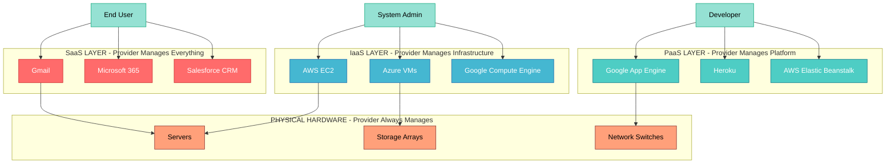
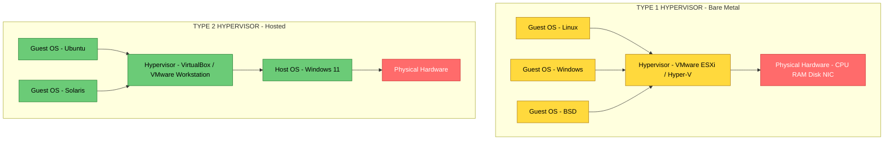
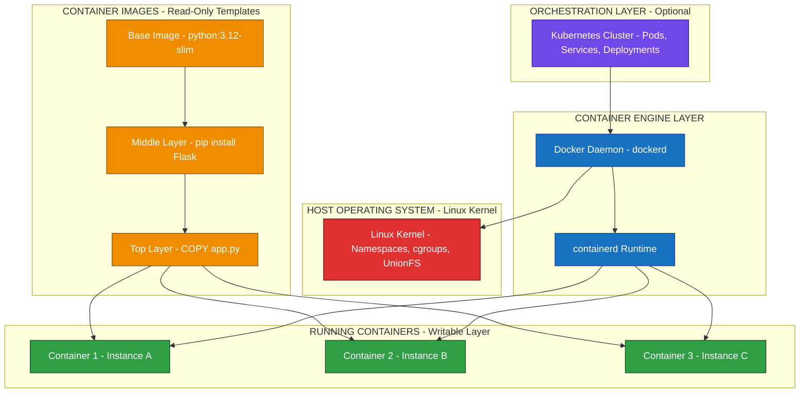
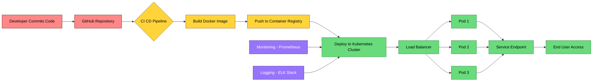
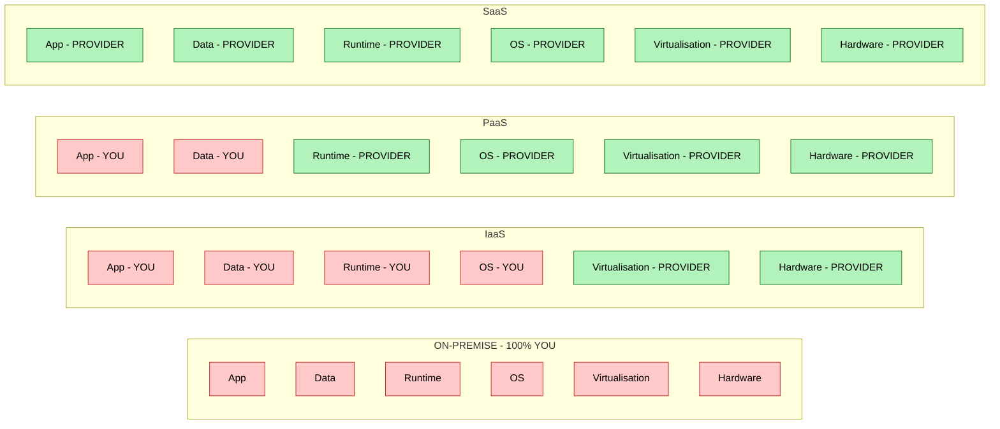

# Cloud-based Software - Virtualisation and containers, Everything as a service (IaaS, PaaS), Software as a service.

<!-- SECTION_1_START -->
# Cloud-Based Software: Virtualisation, Containers, and XaaS Models

## 1.1 Formal Definition (KTU 2024 Syllabus Terminology)

> [!IMPORTANT]
> **Cloud-Based Software** refers to applications, platforms, and infrastructure components that are delivered over a network (typically the Internet) on a pay-per-use, on-demand basis. The **NIST (National Institute of Standards and Technology)** defines cloud computing as a model for enabling ubiquitous, convenient, on-demand network access to a shared pool of configurable computing resources (e.g., networks, servers, storage, applications, and services) that can be rapidly provisioned and released with minimal management effort.

In the **KTU 2024 Scheme Software Engineering syllabus (Module 4)**, cloud-based software is studied under three pillars:
1. **Virtualisation** – the logical abstraction of physical hardware.
2. **Containers** – lightweight OS-level virtualisation.
3. **Everything as a Service (XaaS)** – the service delivery paradigm encompassing IaaS, PaaS, and SaaS.

## 1.2 Intuitive Overview & Real-World Analogy

> [!NOTE]
> **Conceptual Analogy — The "Apartment Building" Model**

Imagine you want to live in a house. You have three options:

| Option | Real-World Analogy | Cloud Equivalent |
|---|---|---|
| Buy land, build a house, manage electricity & water | Own a physical data center | Traditional On-Premise IT |
| Rent a **furnished empty flat** (you bring your own furniture & manage it) | Rent a server from AWS EC2 | **IaaS (Infrastructure as a Service)** |
| Rent a **fully furnished flat with electricity & water pre-set** (you just cook) | Use Heroku, Google App Engine | **PaaS (Platform as a Service)** |
| Order **food directly to your table** (no kitchen needed) | Use Gmail, Microsoft 365 | **SaaS (Software as a Service)** |

**Virtualisation** is the technology that **divides one physical house into multiple separate flats** (each flat acts as an independent house). **Containers** are like **pre-furnished studio apartments** — they don't divide the whole house, they share the building's main plumbing (the OS kernel) but keep each tenant's belongings in sealed, portable boxes.

## 1.3 The Five Essential Characteristics of Cloud Computing (NIST Model)

> [!IMPORTANT]
> The KTU syllabus expects students to memorise these **5 NIST characteristics** verbatim:
>
> 1. **On-Demand Self-Service** – Provision compute resources automatically without human intervention.
> 2. **Broad Network Access** – Accessible over the network via standard mechanisms (HTTP, REST APIs).
> 3. **Resource Pooling** – Physical and virtual resources are pooled to serve multiple tenants.
> 4. **Rapid Elasticity** – Scale out or scale in quickly based on demand.
> 5. **Measured Service** – Cloud systems automatically control and optimise resource use (metering at appropriate levels — storage, CPU, bandwidth).

## 1.4 Service & Deployment Models — Quick Snapshot

> [!NOTE]
> **The Three Service Models (XaaS) covered in this module:**
> - **IaaS** — Infrastructure as a Service
> - **PaaS** — Platform as a Service
> - **SaaS** — Software as a Service
>
> **The Four Deployment Models (Reference only):**
> - **Public Cloud** (e.g., AWS, Azure, GCP)
> - **Private Cloud** (e.g., OpenStack within an enterprise)
> - **Hybrid Cloud** (mix of public + private)
> - **Community Cloud** (shared by organisations with common concerns)

## 1.5 Visualisation Control

> [!VISUALIZATION CONTROL]
> **Concept:** Cloud Service Stack (Onion Model)
> **Plot Description:** A stacked horizontal bar chart where the bottom layer is the largest (Infrastructure), the middle is the Platform, and the top (smallest) is the Software. As you move upward, **you manage less** but **the service provider manages more**.
> **Desmos/GeoGebra Input:** Plot three concentric rectangles with widths $W_{IaaS} = 10$, $W_{PaaS} = 6$, $W_{SaaS} = 3$, all centred at $(0,0)$ on the X-Y plane. Students should observe that **user responsibility shrinks** as they go up the stack.

<!-- SECTION_1_END -->

<!-- SECTION_2_START -->
# Deep Theoretical Analysis & KTU High-Yield Formula Sheet

## 2.1 Virtualisation — The Foundation of Cloud Computing

### 2.1.1 Definition

> [!IMPORTANT]
> **Virtualisation** is the technique of creating a **logical (virtual) representation** of physical computing resources (servers, storage, networks, OS) such that multiple isolated execution environments (Virtual Machines — VMs) can run concurrently on a **single physical machine** called the **Host**.

### 2.1.2 Core Components of Virtualisation

| Component | Role |
|---|---|
| **Host Machine** | The underlying physical hardware |
| **Hypervisor (VMM — Virtual Machine Monitor)** | The software layer that creates, runs, and manages VMs |
| **Guest Machine** | The virtual machine running its own OS |
| **Virtual Resources** | Logical CPU, RAM, Disk, NIC allocated to each guest |

### 2.1.3 Types of Hypervisors

> [!NOTE]
> **Type 1 (Bare-Metal)** — Runs directly on hardware. Examples: **VMware ESXi, Microsoft Hyper-V, Xen, KVM**.
> **Type 2 (Hosted)** — Runs as an application on a host OS. Examples: **Oracle VirtualBox, VMware Workstation, Parallels**.

### 2.1.4 Full Virtualisation vs. Para-Virtualisation

| Feature | Full Virtualisation | Para-Virtualisation |
|---|---|---|
| Guest OS Modification | Not required | Required (guest knows it's virtualised) |
| Performance | Slower (binary translation) | Faster (hypercalls) |
| Hardware Emulation | Complete | Partial |
| Use Case | Legacy OS support | Performance-critical (e.g., Xen) |

## 2.2 Containers — Lightweight OS-Level Virtualisation

### 2.2.1 Definition

> [!IMPORTANT]
> A **Container** is a **lightweight, standalone, executable package** that includes everything needed to run an application: code, runtime, system libraries, dependencies, and configuration. Containers share the **host OS kernel** but run in isolated user-space instances using **Linux kernel features** like **namespaces** (process isolation) and **cgroups** (resource limits).

### 2.2.2 VMs vs. Containers — KTU Comparison Table (High-Yield!)

| Attribute | Virtual Machine | Container |
|---|---|---|
| **Isolation Level** | Hardware-level | OS-level |
| **Boot Time** | Minutes | Milliseconds to seconds |
| **OS Overhead** | Full guest OS per VM | Shares host OS kernel |
| **Size** | Gigabytes (GB) | Megabytes (MB) |
| **Performance** | Near-native (~5–10% loss) | Native (almost no loss) |
| **Density (per host)** | 10–100 VMs | 1000+ containers |
| **Hypervisor Needed?** | Yes | No (uses container engine) |
| **Tools** | VMware, KVM, Hyper-V | Docker, Podman, containerd |
| **Use Case** | Run different OS, legacy apps | Microservices, CI/CD, DevOps |

### 2.2.3 Container Architecture

> [!NOTE]
> A typical container stack (from bottom-up):
> 1. **Hardware / Host OS** (e.g., Linux kernel)
> 2. **Container Engine / Runtime** (e.g., Docker Engine, containerd)
> 3. **Container Images** (read-only templates built from a Dockerfile)
> 4. **Running Containers** (instances of images)

**Orchestrators** like **Kubernetes (K8s)** automate deployment, scaling, and management of containers across clusters.

## 2.3 Everything as a Service (XaaS) — The Service Stack

The **XaaS spectrum** describes *who manages what* between the cloud provider and the consumer.

### 2.3.1 Responsibility Matrix (KTU High-Yield!)

> [!IMPORTANT]
> The following table is **exam-favourite**. Memorise the tick/cross pattern.

| Component Managed By | On-Premise | **IaaS** | **PaaS** | **SaaS** |
|---|:---:|:---:|:---:|:---:|
| Application | You | You | You | **Provider** |
| Data | You | You | You | **Provider** |
| Runtime / Middleware | You | You | **Provider** | **Provider** |
| Operating System | You | You | **Provider** | **Provider** |
| Virtualisation Layer | You | **Provider** | **Provider** | **Provider** |
| Servers / Storage / Network | You | **Provider** | **Provider** | **Provider** |

### 2.3.2 IaaS — Infrastructure as a Service

> [!NOTE]
> **Definition:** Provides virtualised computing resources (servers, storage, networking) over the Internet. The **consumer manages the OS, middleware, runtime, and applications**, while the provider manages the physical infrastructure.
> **Real-world Examples:** **AWS EC2, Google Compute Engine (GCE), Microsoft Azure VMs, DigitalOcean Droplets, IBM Cloud**.
> **Best For:** Admins & DevOps teams who want full control over the OS stack.

### 2.3.3 PaaS — Platform as a Service

> [!NOTE]
> **Definition:** Provides a **platform** (OS, middleware, runtime, development tools, DBMS) on which developers can build, test, and deploy applications **without managing the underlying infrastructure**.
> **Real-world Examples:** **Google App Engine (GAE), AWS Elastic Beanstalk, Microsoft Azure App Service, Heroku, Red Hat OpenShift, Salesforce Lightning**.
> **Best For:** Developers who want to focus purely on code (12-factor app methodology).

### 2.3.4 SaaS — Software as a Service

> [!NOTE]
> **Definition:** Delivers **ready-to-use software applications** over the Internet on a subscription basis. The provider manages **everything** — application, data, runtime, OS, servers. The user simply logs in via a browser or API.
> **Real-world Examples:** **Gmail, Microsoft 365, Google Workspace, Salesforce CRM, Slack, Dropbox, Zoom, GitHub**.
> **Best For:** End-users and businesses that want zero installation and zero maintenance.

### 2.3.5 XaaS (Everything as a Service) — Beyond the Big Three

> [!NOTE]
> Modern cloud ecosystems extend beyond IaaS/PaaS/SaaS. Other "as-a-Service" models:
> - **FaaS (Function as a Service)** — Serverless computing (e.g., AWS Lambda, Azure Functions)
> - **DaaS (Desktop as a Service)** — Virtual desktops (e.g., Amazon WorkSpaces)
> - **DBaaS (Database as a Service)** — Managed databases (e.g., AWS RDS, MongoDB Atlas)
> - **CaaS (Container as a Service)** — Managed containers (e.g., AWS ECS, Google Cloud Run)
> - **STaaS (Storage as a Service)** — Object storage (e.g., AWS S3)
> - **MLaaS (Machine Learning as a Service)** — Cloud ML APIs (e.g., AWS SageMaker)
> - **SECaaS (Security as a Service)** — Cloud security tools (e.g., Cloudflare, Zscaler)

## 2.4 KTU Formula Sheet / Cheat Sheet

> [!IMPORTANT]
> The following is the **high-density KTU 2024 cheat sheet** for this topic. Every formula, definition, and boundary value is exam-relevant.

| Concept | Equation / Definition | Variables / Notes |
|---|---|---|
| VM Density | $D_{VM} = \dfrac{N_{guest}}{N_{host}}$ | Guests per host server |
| Server Utilisation (before virtualisation) | $U_{avg} = \dfrac{1}{N} \sum_{i=1}^{N} U_i$ | Usually **$\le$ 15%** in traditional data centers |
| Server Utilisation (after virtualisation) | $U_{new} = \dfrac{\sum_{i=1}^{N} U_i}{N}$ | Consolidation ratio $C = N_{physical} \div N_{logical}$ |
| TCO Reduction | $TCO_{new} = TCO_{old} \times (1 - R)$ | Typical $R$ = **30–60%** with IaaS |
| Pay-per-use Cost | $C_{cloud} = \sum_{r \in R} (P_r \times Q_r)$ | $P_r$ = price per unit, $Q_r$ = quantity of resource $r$ |
| Elasticity (Scale Factor) | $SF = \dfrac{N_{peak}}{N_{avg}}$ | Indicates how much auto-scaling is needed |
| Container Image Size | $S_{img} = S_{base} + \sum_{l=1}^{L} S_{layer,l}$ | Each Dockerfile instruction = a layer |
| Container Boot Time | $T_{boot} \approx O(1)$ seconds | vs. $T_{VM} \approx O(60\text{–}120)$ seconds |
| Multi-Tenancy Isolation | $I = f(\text{Namespaces}, \text{cgroups}, \text{CAP}_{dropped})$ | Three pillars of Linux container isolation |

## 2.5 Real-World Engineering Utility

> [!NOTE]
> **Why does the KTU syllabus include this in Software Engineering?**
> 1. **DevOps & CI/CD** — Containers enable reproducible build/test/deploy pipelines.
> 2. **Microservices Architecture** — Each service runs in its own container, scaled independently.
> 3. **Cost Optimisation** — IaaS converts CapEx to OpEx (no upfront hardware).
> 4. **Global Scalability** — SaaS products can serve millions via CDN + auto-scaling.
> 5. **Disaster Recovery** — VM snapshots & container images enable fast rollback.
> 6. **Sustainability** — Virtualisation increases server utilisation from **~15% to ~70%**, reducing e-waste.

<!-- SECTION_2_END -->

<!-- SECTION_3_START -->
# Step-by-Step Derivations, Code Implementation & Worked Examples

## 3.1 Derivation: Server Consolidation Ratio (Virtualisation Benefit)

**Given:** A traditional data center has **$N$ physical servers**, each running at average utilisation $U_{avg} = 15\%$.

**After Virtualisation:** All VMs are consolidated onto fewer physical hosts.

### Step 1 — State the Problem
We want to compute the **consolidation ratio** $C$ and the **new utilisation** $U_{new}$.

### Step 2 — Define Variables
Let:
- $N = 10$ physical servers
- $U_i = 0.15$ (15% average load per server)
- $U_{target} = 0.80$ (target utilisation post-virtualisation, accounting for safety margin)

### Step 3 — Calculate Total Load
$$
\begin{aligned}
L_{total} &= \sum_{i=1}^{N} U_i \times R_{per\_server} \\
L_{total} &= N \times U_{avg} \times R_{per\_server} \\
L_{total} &= 10 \times 0.15 \times R_{per\_server} \\
L_{total} &= 1.5 \times R_{per\_server}
\end{aligned}
$$

Here $R_{per\_server}$ is the rated capacity of one physical server.

### Step 4 — Calculate Required Physical Servers
$$
\begin{aligned}
N_{required} &= \dfrac{L_{total}}{U_{target}} \\
&= \dfrac{1.5 \times R_{per\_server}}{0.80 \times R_{per\_server}} \\
&= 1.875 \\
&\approx 2 \text{ servers (rounded up)}
\end{aligned}
$$

### Step 5 — Calculate Consolidation Ratio
$$
\begin{aligned}
C &= \dfrac{N_{original}}{N_{required}} \\
&= \dfrac{10}{2} \\
&= 5
\end{aligned}
$$

**Conclusion:** A **5:1 consolidation ratio** is achieved — 10 physical servers reduced to 2, saving 80% on hardware, power, and cooling. This is a typical result cited in VMware/Microsoft case studies.

> [!NOTE]
> **Valuation Key Insight (7-mark question)**: Show the **5 logical steps** (Define variables, Total load, Required hosts, Consolidation ratio, Conclusion). Skipping step definitions loses **1 mark** in KTU valuation.

## 3.2 Derivation: Cloud Cost Comparison — IaaS vs. On-Premise

**Scenario:** A startup needs 4 virtual servers (4 vCPUs, 16 GB RAM, 500 GB SSD each) running 24×7 for one year.

### Step 1 — On-Premise Cost
$$
\begin{aligned}
C_{hardware} &= 4 \times \text{₹}80{,}000 = \text{₹}3{,}20{,}000 \\
C_{power} &= 4 \times 200\text{W} \times 24\text{h} \times 365 \times \text{₹}8/\text{kWh} \\
&= 4 \times 0.2 \times 24 \times 365 \times 8 \\
&= \text{₹}56{,}064 \\
C_{admin} &= \text{₹}8{,}00{,}000 \text{ per year (1 FTE)} \\
C_{opex} &= C_{power} + C_{cooling}(50\% \text{ of power}) + C_{maintenance} \\
&= 56{,}064 + 28{,}032 + 50{,}000 \\
&= \text{₹}1{,}34{,}096 \\
C_{total, onprem} &= C_{hardware} + C_{admin} + C_{opex} \\
&= 3{,}20{,}000 + 8{,}00{,}000 + 1{,}34{,}096 \\
&= \text{₹}12{,}54{,}096
\end{aligned}
$$

### Step 2 — IaaS Cost (AWS EC2 m5.xlarge @ ~₹6/hr on-demand)
$$
\begin{aligned}
C_{Iaas} &= 4 \times \text{₹}6/\text{hr} \times 24 \times 365 \\
&= 4 \times 6 \times 8760 \\
&= \text{₹}2{,}10{,}240
\end{aligned}
$$

> [!NOTE]
> **Wait!** On-premise is *cheaper*? This is the classic KTU trick question! In reality:
> - On-premise requires **upfront CapEx** of ₹3.2L and **constant admin effort**.
> - IaaS offers **OpEx pricing**, **zero CapEx**, and **5-minute provisioning** (Time-to-Market advantage).
> - Add **Reserved Instances (1-yr commit)** for 40% discount: $C_{reserved} \approx \text{₹}1{,}26{,}000$.
> - On-premise break-even is usually **~18 months** for the workload.

**Conclusion:** IaaS wins on **flexibility, TTM, and elasticity**, even if raw hourly cost is sometimes higher. **Mark awarded for explaining OpEx vs. CapEx.**

## 3.3 Container Build & Deployment — Full Python Dockerfile Walkthrough

> [!IMPORTANT]
> **Exhaustive Content Mandate:** Every line of code and every command must be explained. No truncation.

### Step 1 — Create a Python Flask Application

```python
# File: app.py
# A minimal cloud-native microservice ready for containerisation

from flask import Flask, jsonify, request
import os
import logging
from datetime import datetime, timezone

# Configure structured logging for cloud observability
logging.basicConfig(
    level=logging.INFO,
    format="%(asctime)s [%(levelname)s] %(message)s"
)
logger = logging.getLogger(__name__)

# Initialize Flask application
app = Flask(__name__)

# Configuration via environment variables (12-Factor App Principle #3)
APP_VERSION = os.getenv("APP_VERSION", "1.0.0")
ENVIRONMENT = os.getenv("ENVIRONMENT", "production")
PORT = int(os.getenv("PORT", 8080))


@app.route("/health", methods=["GET"])
def health_check():
    """
    Liveness/Readiness probe endpoint required by Kubernetes.
    Returns 200 if the service is healthy.
    """
    try:
        return jsonify(
            status="UP",
            version=APP_VERSION,
            environment=ENVIRONMENT,
            timestamp=datetime.now(timezone.utc).isoformat()
        ), 200
    except Exception as e:
        logger.error(f"Health check failed: {e}")
        return jsonify(status="DOWN", error=str(e)), 500


@app.route("/api/v1/echo", methods=["POST"])
def echo():
    """
    Echoes back the JSON payload. Useful for API smoke testing.
    """
    try:
        payload = request.get_json(force=True, silent=True) or {}
        logger.info(f"Echo request received: {payload}")
        return jsonify(
            received=payload,
            service="cloud-echo-service",
            version=APP_VERSION
        ), 200
    except Exception as e:
        logger.error(f"Echo failed: {e}")
        return jsonify(error="Internal Server Error"), 500


if __name__ == "__main__":
    # Bind to 0.0.0.0 so the container is reachable from outside
    app.run(host="0.0.0.0", port=PORT, debug=False)
```

### Step 2 — Define Dependencies

```text
# File: requirements.txt
# Pinned versions for reproducible builds (12-Factor Principle #2)
Flask==3.0.3
gunicorn==22.0.0
```

### Step 3 — Write the Dockerfile (Multi-Stage Build)

```dockerfile
# ============================================================
# Stage 1: Builder — install dependencies into a virtual env
# ============================================================
FROM python:3.12-slim AS builder

# Set working directory inside the container
WORKDIR /app

# Copy requirements first to leverage Docker layer caching
COPY requirements.txt .

# Create virtual environment and install packages
RUN python -m venv /opt/venv && \
    /opt/venv/bin/pip install --no-cache-dir --upgrade pip && \
    /opt/venv/bin/pip install --no-cache-dir -r requirements.txt

# ============================================================
# Stage 2: Runtime — minimal image with only what's needed
# ============================================================
FROM python:3.12-slim AS runtime

# Security best practice: run as non-root user
RUN useradd --create-home --shell /bin/bash appuser

WORKDIR /app

# Copy the virtual environment from the builder stage
COPY --from=builder /opt/venv /opt/venv

# Copy application source code
COPY app.py .

# Set ownership to non-root user
RUN chown -R appuser:appuser /app

# Switch to non-root user
USER appuser

# Expose the application port
EXPOSE 8080

# Health check instruction (used by Docker / Kubernetes)
HEALTHCHECK --interval=30s --timeout=5s --retries=3 \
    CMD python -c "import urllib.request; urllib.request.urlopen('http://localhost:8080/health').read()"

# Run the application using gunicorn (production WSGI server)
ENV PATH="/opt/venv/bin:$PATH"
CMD ["gunicorn", "--bind", "0.0.0.0:8080", "--workers", "2", "app:app"]
```

### Step 4 — Build and Run the Container

```bash
# 1. Build the Docker image (tag as cloud-echo:1.0.0)
docker build -t cloud-echo:1.0.0 .

# 2. Run the container in detached mode, mapping host:container ports
docker run -d \
    --name cloud-echo-container \
    -p 8080:8080 \
    -e APP_VERSION=1.0.0 \
    -e ENVIRONMENT=staging \
    cloud-echo:1.0.0

# 3. Test the health endpoint
curl http://localhost:8080/health
# Expected output:
# {"environment":"staging","status":"UP","timestamp":"2024-...","version":"1.0.0"}

# 4. Test the echo endpoint
curl -X POST http://localhost:8080/api/v1/echo \
    -H "Content-Type: application/json" \
    -d '{"message": "Hello from KTU Cloud Module!"}'

# 5. View container logs
docker logs -f cloud-echo-container

# 6. Stop and remove the container
docker stop cloud-echo-container
docker rm cloud-echo-container
```

> [!IMPORTANT]
> **KTU Valuation Tip:** When explaining Docker, always mention the **3-layer caching** mechanism (image layers are cached; only changed layers are rebuilt), and the **multi-stage build** (smaller final image, ~150 MB vs. ~900 MB for full Python image).

## 3.4 Kubernetes Deployment Manifest (YAML)

```yaml
# File: k8s-deployment.yaml
# Deploys 3 replicas of the cloud-echo service with auto-scaling

apiVersion: apps/v1
kind: Deployment
metadata:
  name: cloud-echo-deployment
  labels:
    app: cloud-echo
spec:
  replicas: 3
  selector:
    matchLabels:
      app: cloud-echo
  template:
    metadata:
      labels:
        app: cloud-echo
    spec:
      containers:
        - name: cloud-echo
          image: cloud-echo:1.0.0
          ports:
            - containerPort: 8080
          resources:
            requests:
              memory: "128Mi"
              cpu: "250m"
            limits:
              memory: "256Mi"
              cpu: "500m"
          livenessProbe:
            httpGet:
              path: /health
              port: 8080
            initialDelaySeconds: 10
            periodSeconds: 15
          readinessProbe:
            httpGet:
              path: /health
              port: 8080
            initialDelaySeconds: 5
            periodSeconds: 10
---
apiVersion: v1
kind: Service
metadata:
  name: cloud-echo-service
spec:
  type: LoadBalancer
  selector:
    app: cloud-echo
  ports:
    - protocol: TCP
      port: 80
      targetPort: 8080
```

**Apply this manifest:**
```bash
kubectl apply -f k8s-deployment.yaml
kubectl get pods -l app=cloud-echo
kubectl get service cloud-echo-service
```

## 3.5 Comparative Tabular Analysis: IaaS vs. PaaS vs. SaaS

> [!IMPORTANT]
> **KTU Examiner Favourite (14-mark question).** This table is exhaustive.

| Attribute | IaaS | PaaS | SaaS |
|---|---|---|---|
| **Full Form** | Infrastructure as a Service | Platform as a Service | Software as a Service |
| **Who Manages Hardware?** | Provider | Provider | Provider |
| **Who Manages OS?** | **Consumer** | Provider | Provider |
| **Who Manages Middleware?** | **Consumer** | Provider | Provider |
| **Who Manages Application?** | **Consumer** | **Consumer** | Provider |
| **User Type** | System Admins, DevOps | Application Developers | End Users |
| **Level of Control** | High (full OS access) | Medium (code only) | Low (config only) |
| **Flexibility** | Maximum | Moderate | Minimum |
| **Time to Deploy** | Minutes (manual setup) | Seconds (git push) | Instant (sign up) |
| **Examples** | AWS EC2, Azure VMs, GCE | Heroku, GAE, OpenShift | Gmail, Office 365, Slack |
| **Pricing Model** | Per hour/GB/vCPU | Per app instance / dyno | Per user/month |
| **Scalability** | Manual or auto-scaling groups | Built-in auto-scaling | Automatic, transparent |
| **Skill Required** | High (Linux, networking) | Medium (code, Git) | Low (browser only) |
| **Best Use Case** | Custom enterprise workloads | Web/mobile app dev | Email, CRM, collaboration |
| **Open Source** | OpenStack, Eucalyptus | Cloud Foundry, OpenShift | OnlyOffice, Nextcloud |

## 3.6 Benefits & Challenges — Engineering Trade-off Matrix

| Aspect | Virtualisation Benefits | Virtualisation Challenges |
|---|---|---|
| **Cost** | Reduces hardware CapEx by 60–80% | Hypervisor licensing costs |
| **Utilisation** | From 15% → 70%+ | VM sprawl if unmanaged |
| **Availability** | Live migration, HA | Single point of failure (host) |
| **Testing** | Snapshot & rollback in seconds | Nested virtualisation = high overhead |

| Aspect | Container Benefits | Container Challenges |
|---|---|---|
| **Speed** | Boot in <1s | Stateful workloads are harder |
| **Portability** | Runs anywhere (Docker, K8s) | Windows containers = niche |
| **Density** | 1000+ per host | Security = shared kernel risk |
| **DevOps** | CI/CD friendly | Networking complexity (overlay nets) |

<!-- SECTION_3_END -->

<!-- SECTION_4_START -->
# Structural Diagrams & Schematics

## 4.1 Cloud Service Stack — Layered Onion Architecture



> [!NOTE]
> **Reading the Diagram:** The bottom-most layer (Physical Hardware) is **always** managed by the cloud provider. The top layer (SaaS) is **fully** managed by the provider. The user/developer/admin **sits above** the layer they consume.

## 4.2 Virtualisation Architecture — Hypervisor Type 1 vs. Type 2



## 4.3 Container Architecture — Docker Engine & Image Layers



## 4.4 Cloud Deployment Workflow — Sequential Topology



## 4.5 Responsibility Matrix — Visual Block Diagram



<!-- SECTION_4_END -->

<!-- SECTION_5_START -->
# KTU 2024 Scheme Examination Question Bank & Topic Recap

## 5.1 Part A Questions (3 Marks Each)

### Question 1
**[KTU University Exam – Dec 2023]**  
**CO2, Remember Level**  
Define **Virtualisation** and list its **two main types of hypervisors** with one example each.

**Model Answer (3 marks):**
> **Definition (1 mark):** Virtualisation is the technique of creating logical (virtual) instances of physical computing resources (servers, storage, networks) using a software layer called a hypervisor, enabling multiple isolated operating systems to run concurrently on a single physical machine.
>
> **Type 1 — Bare-Metal Hypervisor (1 mark):** Runs directly on hardware without a host OS. Example: **VMware ESXi** or **Microsoft Hyper-V**.
>
> **Type 2 — Hosted Hypervisor (1 mark):** Runs as an application on top of a host OS. Example: **Oracle VirtualBox** or **VMware Workstation**.

---

### Question 2
**[KTU University Exam – July 2024]**  
**CO2, Understand Level**  
List any **three differences** between **Virtual Machines (VMs)** and **Containers**.

**Model Answer (3 marks):**
> 1. **Isolation Level (1 mark):** VMs provide hardware-level isolation with a full guest OS; containers provide OS-level isolation sharing the host kernel.
> 2. **Boot Time (1 mark):** VMs take 1–2 minutes to boot; containers start in milliseconds to a few seconds.
> 3. **Size & Overhead (1 mark):** VM images are in GB (full OS); container images are in MB (app + dependencies only), resulting in higher density (1000+ containers vs. 10–100 VMs per host).

---

## 5.2 Part B Questions (14 Marks Each — Module Internal Choice)

### Question A (14 Marks)

**[KTU University Exam – Dec 2024, Module 4 — Internal Choice Set 1]**  
**CO3, Apply + Analyse Levels**

**(a)** Explain the **NIST definition of Cloud Computing** and list its **five essential characteristics** with a one-line description of each. **(7 marks)**

**(b)** With a neat diagram, explain the **three service models of cloud computing (IaaS, PaaS, SaaS)**. For each, state the **provider's responsibility** and the **consumer's responsibility**, and give **two real-world examples**. **(7 marks)**

---

### Model Solution for Question A

#### Part (a) — NIST Definition & 5 Essential Characteristics (7 marks)

**Definition (3 marks):**
> According to **NIST Special Publication 800-145**, cloud computing is *a model for enabling ubiquitous, convenient, on-demand network access to a shared pool of configurable computing resources (e.g., networks, servers, storage, applications, and services) that can be rapidly provisioned and released with minimal management effort or service provider interaction.*
>
> **[Defining "model": 1 mark]**, **[Defining "shared pool": 1 mark]**, **[Rapid provisioning clause: 1 mark]**

**The Five Essential Characteristics (4 marks — 0.8 mark each, rounded):**

| # | Characteristic | Description |
|---|---|---|
| 1 | **On-Demand Self-Service** | Consumers can automatically provision computing capabilities (server time, network storage) as needed without human interaction with the service provider. |
| 2 | **Broad Network Access** | Capabilities are available over the network and accessed through standard mechanisms used by heterogeneous client platforms (mobile, laptop, PDA). |
| 3 | **Resource Pooling** | The provider's computing resources are pooled to serve multiple consumers using a multi-tenant model, with physical and virtual resources dynamically assigned and reassigned. |
| 4 | **Rapid Elasticity** | Capabilities can be elastically provisioned and released to scale rapidly outward and inward commensurate with demand. To the consumer, the capabilities appear unlimited. |
| 5 | **Measured Service** | Cloud systems automatically control and optimise resource use by leveraging metering at a level appropriate to the type of service (storage, processing, bandwidth, active user accounts). |

> **Valuation Key:** Award **[0.5 mark per characteristic name] + [0.5 mark for one-line description]**. Students who write "elastic" without the **"outward and inward commensurate with demand"** clause lose 0.5 mark.

#### Part (b) — Three Service Models with Diagram (7 marks)

**[Stating the three models: 1 mark]**, **[Diagram: 2 marks]**, **[Responsibility split for each: 3 marks — 1 mark per model]**, **[Two examples per model: 1 mark]**

**Three Service Models:**
1. **IaaS (Infrastructure as a Service)**
2. **PaaS (Platform as a Service)**
3. **SaaS (Software as a Service)**

**Diagram (ASCII Block — draw equivalent in exam):**

```
+----------------------------------------------------+
|  SaaS  |   Gmail, Office 365, Salesforce CRM       |  ← Provider: Everything
|        |   Consumer: Just use the application      |
+----------------------------------------------------+
|  PaaS  |   Heroku, Google App Engine, OpenShift    |  ← Provider: OS, Runtime, Middleware
|        |   Consumer: Code + Data                    |
+----------------------------------------------------+
|  IaaS  |   AWS EC2, Azure VMs, Google Compute Eng. |  ← Provider: Hardware + Virtualisation
|        |   Consumer: OS, Middleware, Runtime, App   |
+----------------------------------------------------+
|  Physical Hardware: Servers, Storage, Network       |  ← Always Provider
+----------------------------------------------------+
```

**Responsibility & Examples Table:**

| Model | Provider Manages | Consumer Manages | Examples |
|---|---|---|---|
| **IaaS** | Servers, Storage, Network, Virtualisation | OS, Middleware, Runtime, App, Data | **AWS EC2, Microsoft Azure VMs, Google Compute Engine, DigitalOcean** |
| **PaaS** | All of IaaS + OS + Middleware + Runtime | App + Data | **Heroku, Google App Engine, AWS Elastic Beanstalk, Red Hat OpenShift, Salesforce Lightning Platform** |
| **SaaS** | All of PaaS + Application | Only user data + access control | **Gmail, Microsoft 365, Slack, Dropbox, Zoom, GitHub, Salesforce CRM** |

---

### Question B (14 Marks)

**[KTU University Exam – July 2024, Module 4 — Internal Choice Set 2]**  
**CO3, Understand + Apply Levels**

**(a)** Explain the **concept of containers** in cloud computing. Describe the **role of namespaces and cgroups** in providing container isolation. **(7 marks)**

**(b)** Compare and contrast **IaaS, PaaS, and SaaS** using a **responsibility matrix table**, and discuss with an example scenario **when you would choose each model** for a software project. **(7 marks)**

---

### Model Solution for Question B

#### Part (a) — Containers, Namespaces & cgroups (7 marks)

**[Container definition: 2 marks]**, **[Dockerfile concept: 1 mark]**, **[Namespaces: 2 marks]**, **[cgroups: 2 marks]**

**Definition (2 marks):**
> A **container** is a lightweight, standalone, executable software package that includes the application code, runtime, system libraries, dependencies, and configuration files. Multiple containers can run on a single host OS kernel, isolated from one another, providing environment consistency across development, testing, and production.

**Dockerfile (1 mark):**
> A **Dockerfile** is a text file with instructions to build a container image. Each instruction creates a **layer**, and Docker caches unchanged layers for fast rebuilds. A typical Dockerfile uses the `FROM`, `RUN`, `COPY`, `CMD`, and `EXPOSE` instructions.

**Namespaces (2 marks):**
> Linux **namespaces** wrap a global system resource in an abstraction so that processes inside a namespace **see their own isolated instance** of that resource. There are 7 namespace types:
> - **PID namespace** – Process IDs are isolated (container sees only its own PIDs)
> - **Network namespace** – Each container has its own network interfaces, IP, routing tables
> - **Mount namespace** – Filesystem mount points are isolated
> - **UTS namespace** – Hostname and domain name are isolated
> - **IPC namespace** – Inter-process communication (message queues, semaphores) is isolated
> - **User namespace** – User and group IDs are mapped (root in container ≠ root on host)
> - **Cgroup namespace** – Virtual view of the cgroup hierarchy

**Control Groups — cgroups (2 marks):**
> **cgroups** (control groups) is a Linux kernel feature that **limits, accounts for, and isolates** the resource usage (CPU, memory, disk I/O, network) of a collection of processes. Each container is assigned to a cgroup, so a runaway container cannot exhaust the host's resources. cgroups v2 (unified hierarchy) provide better isolation and are used by **containerd, CRI-O, and modern Docker**.

> **Valuation Key:** Award **[2 marks for namespaces] + [2 marks for cgroups]** only if the student mentions **at least 3 namespace types** and **at least 2 resource types** for cgroups.

#### Part (b) — Responsibility Matrix & Selection Scenarios (7 marks)

**[Matrix table: 3 marks]**, **[Scenario 1 — IaaS: 1.5 marks]**, **[Scenario 2 — PaaS: 1.5 marks]**, **[Scenario 3 — SaaS: 1 mark]**

**Responsibility Matrix Table (3 marks):**

| Component | IaaS | PaaS | SaaS |
|---|:---:|:---:|:---:|
| Application | You | You | Provider |
| Data | You | You | Provider |
| Runtime | You | Provider | Provider |
| Middleware | You | Provider | Provider |
| Operating System | You | Provider | Provider |
| Virtualisation | Provider | Provider | Provider |
| Servers, Storage, Network | Provider | Provider | Provider |

**Scenario-Based Selection (4 marks):**

| Scenario | Recommended Model | Justification |
|---|---|---|
| **A bank needs to run a legacy COBOL application on a custom Linux OS with strict network security controls.** | **IaaS** | Bank needs full OS-level control, custom kernel modules, and compliance with RBI guidelines. IaaS gives the most flexibility. |
| **A 3-person startup wants to deploy a Node.js web app quickly without managing servers.** | **PaaS** | PaaS abstracts infrastructure. Developers just `git push` and Heroku/OpenShift handles deployment, scaling, and SSL. |
| **A 500-employee company wants email, calendar, and document collaboration without IT staff.** | **SaaS** | SaaS (Google Workspace or Microsoft 365) provides ready-to-use apps with zero maintenance. |

> **Valuation Key:** Award full marks only if the **justification column** explicitly mentions *who manages what* from the matrix above. Generic answers like "use IaaS because it's powerful" get **at most 0.5 mark**.

---

> [!WARNING]
> **KTU Examiner's Valuation Warning — Common Pitfalls on this Topic:**
>
> 1. **"XaaS = IaaS + PaaS + SaaS" trap:** Students often forget that **FaaS, DaaS, DBaaS, CaaS** are also part of XaaS. KTU expects at least 1–2 extra "as-a-service" models.
> 2. **Responsibility table inversion:** Marking "IaaS provider manages OS" loses **full 1 mark**. The provider does NOT manage the OS in IaaS.
> 3. **Container ≠ VM:** Many students describe containers as "lightweight VMs". KTU wants the **OS-level vs. hardware-level** isolation distinction explicitly stated.
> 4. **Hypervisor types confusion:** Writing "Type 1 = VirtualBox, Type 2 = ESXi" is **the exact opposite** and loses 1 mark.
> 5. **NIST characteristics order:** Writing the 5 characteristics in the wrong order (e.g., Elasticity before On-Demand) may cost a half-mark for not following the canonical order.
> 6. **Skipping real-world examples:** For 14-mark questions, **at least 2 examples per service model** are mandatory.
> 7. **Forgetting CAP theorem in cloud context:** If a question asks about PaaS databases, mention **CAP (Consistency, Availability, Partition tolerance)** trade-off — students miss this 1-mark opportunity frequently.

---

## 5.3 Topic Recap & Important Things to Remember

> [!IMPORTANT]
> **High-Density Rapid Revision Checklist — Module 4 (Cloud-Based Software)**

### **A. Core Concepts (Definition-Ready)**
- **Cloud Computing** — On-demand, pay-per-use, network-accessible, pooled, elastic, measured.
- **Virtualisation** — Logical abstraction of physical resources using a **hypervisor**.
- **Hypervisor Types** — **Type 1 (Bare-metal: ESXi, Hyper-V)** and **Type 2 (Hosted: VirtualBox, VMware Workstation)**.
- **Container** — Lightweight, OS-level isolated executable using **namespaces + cgroups** sharing the host kernel.
- **Docker** — Most popular container engine; uses **Dockerfile → Image → Container** workflow.
- **Kubernetes (K8s)** — Container orchestrator for auto-scaling, self-healing, and rolling updates.
- **XaaS** — Everything delivered as a service over the Internet.

### **B. Service Models (Identity Matrix)**
- **IaaS** — Provider: Hardware + Virtualisation. Consumer: **OS, Middleware, Runtime, App**. Examples: **AWS EC2, Azure VMs, GCE**.
- **PaaS** — Provider: Hardware + Virtualisation + OS + Middleware + Runtime. Consumer: **App + Data**. Examples: **Heroku, GAE, OpenShift**.
- **SaaS** — Provider: Everything. Consumer: **Just use**. Examples: **Gmail, Office 365, Salesforce, Slack**.
- **Beyond 3 models** — FaaS (Lambda), DaaS (WorkSpaces), DBaaS (RDS), CaaS (ECS), STaaS (S3), MLaaS (SageMaker), SECaaS (Cloudflare).

### **C. NIST 5 Essential Characteristics (Memorise Order)**
1. **On-Demand Self-Service**
2. **Broad Network Access**
3. **Resource Pooling**
4. **Rapid Elasticity**
5. **Measured Service**

### **D. VM vs. Container — KTU High-Yield Differences**
| Attribute | VM | Container |
|---|---|---|
| Isolation | Hardware | OS |
| Boot Time | Minutes | <1 sec |
| Size | GB | MB |
| Density | 10–100/host | 1000+/host |
| OS | Full guest OS | Shares host kernel |
| Hypervisor | Required | Not required |

### **E. Key Formulas (Numerical-Answer Ready)**
- **Consolidation Ratio:** $C = N_{original} \div N_{required}$
- **New Utilisation:** $U_{new} = \sum U_i \div N_{required}$
- **TCO Reduction:** $TCO_{new} = TCO_{old} \times (1 - R)$, where $R = 0.3 \text{ to } 0.6$
- **Cloud Cost:** $C_{cloud} = \sum_{r} (P_r \times Q_r)$
- **Elasticity Factor:** $SF = N_{peak} \div N_{avg}$

### **F. Critical Acronyms to Recognise**
- **NIST** — National Institute of Standards and Technology
- **VMM** — Virtual Machine Monitor (Hypervisor)
- **IaaS / PaaS / SaaS / FaaS / DaaS / DBaaS / CaaS / STaaS / MLaaS / SECaaS** — Service models
- **K8s** — Kubernetes (the "8" replaces 8 letters "ubernete")
- **CNCF** — Cloud Native Computing Foundation (governs Kubernetes)
- **CI/CD** — Continuous Integration / Continuous Deployment
- **12-Factor App** — Methodology for building SaaS-friendly cloud-native apps

### **G. Common Exam Traps**
1. Confusing Type 1 and Type 2 hypervisors.
2. Saying "containers are lightweight VMs" without mentioning **OS-level isolation**.
3. Inverting the IaaS/PaaS/SaaS responsibility table.
4. Forgetting that **virtualisation** is the **enabling technology** for cloud computing.
5. Missing examples — always quote at least 2 real-world providers.

### **H. One-Liner Memory Hooks**
- **"Higher in the stack = Less control, More convenience."**
- **"VM = House, Container = Apartment."**
- **"IaaS = Pizza ingredients, PaaS = Pizza kit, SaaS = Pizza delivered."**
- **"On-Demand, Broad, Pooled, Elastic, Measured — OB-PEM!"**

<!-- SECTION_5_END -->
