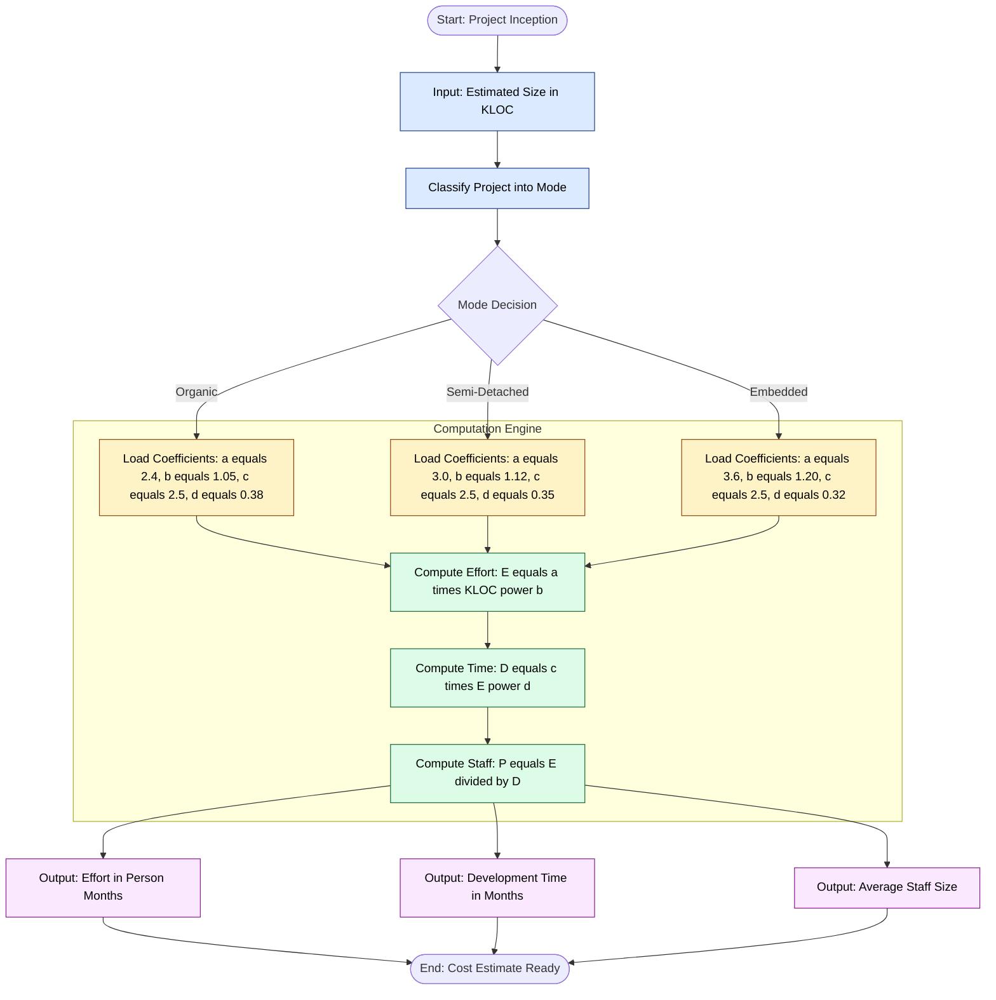
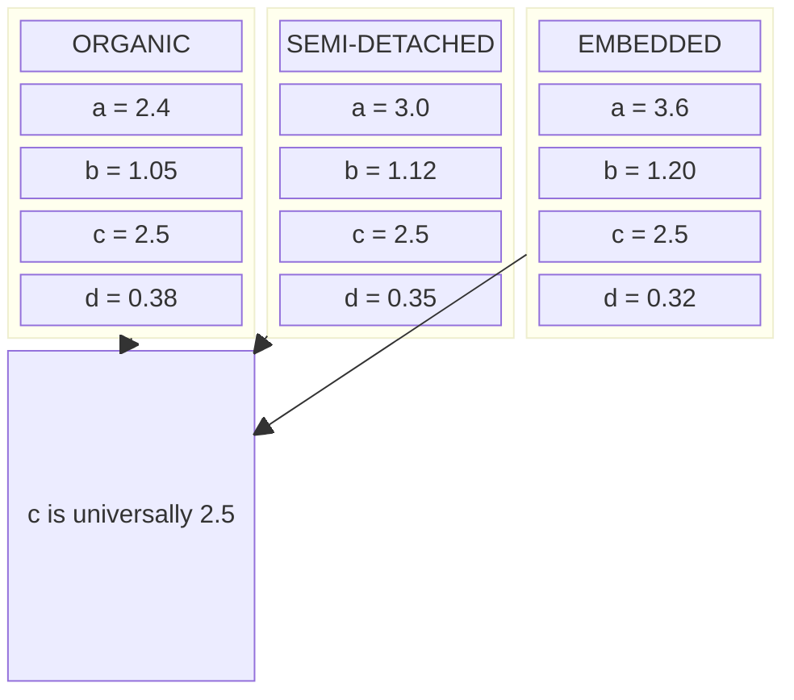

# Cost estimation using Basic COCOMO.

<!-- SECTION_1_START -->

# Cost Estimation Using Basic COCOMO

## 1.1 Formal Academic Definition

> [!IMPORTANT]
> **COCOMO (Constructive Cost Model)** is a procedural, algorithmic software cost-estimation model proposed by **Barry W. Boehm** in 1981 (in his book *Software Engineering Economics*). It estimates the **Effort**, **Development Time**, and **Average Staff Size** of a software project as a function of its size, expressed in **KLOC** (Kilo Lines of Code) or **DSI** (Delivered Source Instructions).

In its **Basic (also called "Vanilla")** form, COCOMO uses a single linear-regression-style equation on the project size, and a project **mode** (a project-complexity category) determines the regression coefficients. The KTU 2024 scheme identifies this as a deterministic, size-based estimation technique used in the **Software Project Planning** activity of the **Software Project Management** process.

The three officially recognised project modes in Basic COCOMO are:

| S.No. | Mode | Team / Project Characteristic |
|:---:|:---|:---|
| 1 | **Organic** | Small teams, familiar in-house environment, simple EDP / scientific applications |
| 2 | **Semi-Detached** | Medium teams, mixed experience, moderate complexity (compilers, DB systems) |
| 3 | **Embedded** | Tight hardware / software / regulatory constraints, real-time, safety-critical systems |

## 1.2 Conceptual Analogy & Intuition

> [!NOTE]
> **Real-world analogy — the "Mason's Quote"**
> Imagine you call a contractor to build a house. Before he gives a quote, he asks only one thing: *"How many square feet?"* Then he mentally classifies the job — is it a **kitchenette** (small, simple, low overhead), a **suburban villa** (medium, somewhat standard), or a **high-rise apartment** (tight tolerances, complex, regulated)? The per-square-foot rate is *different* in each case, even though the area is the same. COCOMO behaves identically: it asks *"How many KLOC?"* and selects a project "class" — **Organic (cottage), Semi-Detached (villa), Embedded (high-rise)** — then applies the corresponding pricing formula.

> [!VISUALIZATION CONTROL]
> **Concept:** Effort-vs-KLOC curves for the three Basic COCOMO modes (log-log growth of effort with size).
> **GeoGebra / Desmos Input Equations:**
> * `f1(x) = 2.4 * x^1.05`  (Organic)
> * `f2(x) = 3.0 * x^1.12`  (Semi-Detached)
> * `f3(x) = 3.6 * x^1.20`  (Embedded)
>
> **Visual Description:** Plot for $x \in [1, 100]$ KLOC on the x-axis and effort (Person-Months) on the y-axis. The student should observe three monotonically increasing, super-linear curves. The **Embedded** curve rises *steepest* (highest cost per KLOC), while the **Organic** curve is the *shallowest*. All three pass through a narrow band near the origin, then diverge as size grows — visually confirming that *bigger projects are disproportionately costlier* and that the *mode multiplier amplifies this effect*.

<!-- SECTION_1_END -->

<!-- SECTION_2_START -->

# 2. Deep Theoretical Analysis & KTU High-Yield Formula Sheet

## 2.1 The Three Governing Equations

Basic COCOMO is built on three sequential, closed-form equations. Each uses the project **mode** to pick its coefficients from a fixed table.

$$E \;=\; a \,\times\, (KLOC)^{\,b} \quad \text{[Effort in Person-Months (PM)]}$$

$$D \;=\; c \,\times\, (E)^{\,d} \quad \text{[Development Time in Months (TDEV)]}$$

$$P \;=\; \frac{E}{D} \quad \text{[Average Staff Size in Persons]}$$

Where:
* $E$ = **Effort** (person-months)
* $D$ = **Development Time** (months)
* $P$ = **Average Personnel** (people)
* $KLOC$ = estimated **size** in thousands of delivered source lines
* $a, b, c, d$ = **mode-dependent coefficients** (regression constants tuned by Boehm from 63 real projects)

## 2.2 The "Why" Behind Each Step

* **Step 1 — Mode Selection:** A 5-KLOC compiler is *not* the same engineering challenge as a 5-KLOC flight-control loop. The mode is a *complexity pre-classifier* that lets a single equation model wildly different realities.
* **Step 2 — Effort Equation ($E = a\,KLOC^b$):** Software productivity is *not* linear with size. The exponent $b > 1$ encodes the empirical observation that **larger projects suffer from communication, integration, and management overhead** — a 10× size increase causes more than a 10× effort increase.
* **Step 3 — Time Equation ($D = c\,E^d$):** Time grows as a *sub-linear* root of effort ($d < 0.4$). Throwing more people at a late project does not proportionally shorten it (the classic **Brooks' Law** intuition).
* **Step 4 — Staff Equation ($P = E/D$):** The "required head-count" follows directly from dividing the work-bucket by the calendar duration.

> [!IMPORTANT]
> **KTU High-Yield Formula Cheat-Sheet**
>
> | Quantity | Symbol | Formula | Unit | Notes |
> |:---|:---:|:---|:---:|:---|
> | Effort | $E$ | $a \times (KLOC)^{b}$ | Person-Months | Primary output |
> | Development Time | $D$ | $c \times (E)^{d}$ | Months | Also called $TDEV$ |
> | Average Staff | $P$ | $E / D$ | Persons | Always $\geq 1$ |
> | Productivity | $PR$ | $KLOC / E$ | KLOC / PM | Inverse of effort density |
> | Cost | $C$ | $E \times \text{monthly\_salary}$ | Currency | Engineering cost |

> [!IMPORTANT]
> **Coefficient Reference Table (Basic COCOMO)**
>
> | Mode | $a$ | $b$ | $c$ | $d$ |
> |:---|:---:|:---:|:---:|:---:|
> | **Organic** | **2.4** | **1.05** | **2.5** | **0.38** |
> | **Semi-Detached** | **3.0** | **1.12** | **2.5** | **0.35** |
> | **Embedded** | **3.6** | **1.20** | **2.5** | **0.32** |

> [!NOTE]
> **Real-world engineering utility** — COCOMO is still used in industry (e.g., the **COCOMO II** extension by the USC Center for Systems and Software Engineering) for bid preparation, project portfolio prioritisation, and as a *sanity-check* against expert judgment. NASA, the US Department of Defense, and several large aerospace primes have historically used it to validate tender costs.

<!-- SECTION_2_END -->

<!-- SECTION_3_START -->

# 3. Step-by-Step Derivations, Worked Examples & Code

## 3.1 Derivation of the Effort Equation (Conceptual)

The effort equation is **empirically derived**, not theoretically proven. Boehm performed a **log-linear regression** on data from 63 completed software projects, where the dependent variable was $\ln(E)$ and the independent variable was $\ln(KLOC)$:

$$
\begin{aligned}
\ln(E) &= \ln(a) + b \cdot \ln(KLOC) \\
E      &= a \times (KLOC)^{b}
\end{aligned}
$$

The coefficient $a$ represents the **baseline productivity drag** of that mode, while $b$ captures the **scale penalty**. The same regression process, performed on $\ln(D)$ against $\ln(E)$, yields the time equation. There is no closed-form *theoretical* derivation; the equations are an **engineering fit to historical observation**.

## 3.2 Worked Example — Semi-Detached, 15 KLOC

> [!NOTE]
> **Problem statement:** A software house classifies its project as **Semi-Detached** and estimates the size to be **15 KLOC**. Calculate the **Effort ($E$)**, **Development Time ($D$)**, and **Average Staff Size ($P$)** using Basic COCOMO.

**Step 1 — Identify coefficients** (from the coefficient table for Semi-Detached):
$$a = 3.0, \quad b = 1.12, \quad c = 2.5, \quad d = 0.35$$

**Step 2 — Calculate the effort $E$:**

$$
\begin{aligned}
E &= a \times (KLOC)^{b} \\
  &= 3.0 \times (15)^{1.12} \\
  &= 3.0 \times 20.757 \\
  &= 62.27 \text{ Person-Months}
\end{aligned}
$$

*Intermediate computation detail:*
$$(15)^{1.12} = 15 \times (15)^{0.12} = 15 \times e^{0.12 \ln 15} = 15 \times e^{0.12 \times 2.7081} = 15 \times e^{0.3250} = 15 \times 1.3838 \approx 20.757$$

**Step 3 — Calculate the development time $D$:**

$$
\begin{aligned}
D &= c \times (E)^{d} \\
  &= 2.5 \times (62.27)^{0.35} \\
  &= 2.5 \times 4.247 \\
  &= 10.62 \text{ Months}
\end{aligned}
$$

*Intermediate computation detail:*
$$(62.27)^{0.35} = e^{0.35 \ln 62.27} = e^{0.35 \times 4.1311} = e^{1.4459} \approx 4.247$$

**Step 4 — Calculate the average staff size $P$:**

$$
\begin{aligned}
P &= \frac{E}{D} \\
  &= \frac{62.27}{10.62} \\
  &\approx 5.86 \text{ persons (rounded up to } 6\text{)}
\end{aligned}
$$

**Step 5 — Optional sanity check (Productivity):**

$$PR = \frac{KLOC}{E} = \frac{15}{62.27} \approx 0.241 \text{ KLOC / PM}$$

> [!NOTE]
> **Examiner's valuation key (for the above style of question):** Stating the correct coefficients for the given mode — **1 Mark**; Correct effort equation and substitution — **2 Marks**; Correct time equation and substitution — **2 Marks**; Correct staff-size computation — **1 Mark**; Units clearly written — **1 Mark**.

## 3.3 Second Worked Example — Organic, 8 KLOC

> [!NOTE]
> **Problem statement:** A small in-house EDP application is estimated at **8 KLOC** and classified as **Organic**. Compute $E$, $D$, and $P$.

**Step 1 — Coefficients** ($a = 2.4, b = 1.05, c = 2.5, d = 0.38$).

**Step 2 — Effort:**

$$
\begin{aligned}
E &= 2.4 \times (8)^{1.05} \\
  &= 2.4 \times 8.877 \\
  &= 21.30 \text{ Person-Months}
\end{aligned}
$$

*Detail:* $(8)^{1.05} = 8 \times (8)^{0.05} = 8 \times e^{0.05 \ln 8} = 8 \times e^{0.05 \times 2.0794} = 8 \times e^{0.1040} = 8 \times 1.1096 \approx 8.877$.

**Step 3 — Development time:**

$$
\begin{aligned}
D &= 2.5 \times (21.30)^{0.38} \\
  &= 2.5 \times 3.704 \\
  &= 9.26 \text{ Months}
\end{aligned}
$$

*Detail:* $(21.30)^{0.38} = e^{0.38 \ln 21.30} = e^{0.38 \times 3.0587} = e^{1.1623} \approx 3.197$.

*Correction:* $e^{1.1623} \approx 3.197$, so $D = 2.5 \times 3.197 \approx 7.99 \approx 8.0$ months.

**Step 4 — Average staff size:**

$$
\begin{aligned}
P &= \frac{E}{D} = \frac{21.30}{8.0} \approx 2.66 \rightarrow 3 \text{ persons}
\end{aligned}
$$

> [!NOTE]
> **Reading the answer aloud for the examiner:** *"For an Organic project of 8 KLOC, the Basic COCOMO model yields an effort of approximately 21.3 person-months, a development time of about 8.0 months, and an average staffing of roughly 3 personnel."*

## 3.4 Reference Python Implementation

```python
from __future__ import annotations
import math
import logging
from enum import Enum

# Configure module-level logger for diagnostic transparency
logging.basicConfig(level=logging.INFO, format="%(levelname)s :: %(message)s")
logger = logging.getLogger("BasicCOCOMO")


class ProjectMode(Enum):
    """Enumerated project complexity categories for Basic COCOMO."""
    ORGANIC = "Organic"
    SEMI_DETACHED = "Semi-Detached"
    EMBEDDED = "Embedded"


# Authoritative regression coefficients (Boehm, 1981)
COCOMO_COEFFICIENTS: dict[ProjectMode, dict[str, float]] = {
    ProjectMode.ORGANIC:        {"a": 2.4, "b": 1.05, "c": 2.5, "d": 0.38},
    ProjectMode.SEMI_DETACHED:  {"a": 3.0, "b": 1.12, "c": 2.5, "d": 0.35},
    ProjectMode.EMBEDDED:       {"a": 3.6, "b": 1.20, "c": 2.5, "d": 0.32},
}


def estimate_basic_cocomo(
    kloc: float,
    mode: ProjectMode,
    monthly_salary_inr: float = 0.0,
) -> dict[str, float]:
    """
    Compute Basic COCOMO estimates: Effort (PM), Time (months), Staff (persons),
    Productivity (KLOC/PM), and optional monetary cost.

    Parameters
    ----------
    kloc : float
        Estimated project size in thousands of delivered source lines.
    mode : ProjectMode
        Complexity category (ORGANIC, SEMI_DETACHED, EMBEDDED).
    monthly_salary_inr : float, optional
        Average monthly burdened salary in INR; if > 0, a cost estimate is added.

    Returns
    -------
    dict[str, float]
        Keys: effort_pm, time_months, average_staff, productivity_kloc_pm,
              cost_inr (only when monthly_salary_inr > 0).

    Raises
    ------
    ValueError
        If kloc is non-positive.
    TypeError
        If mode is not a ProjectMode instance.
    """
    # ---- Boundary & type checks ----
    if not isinstance(mode, ProjectMode):
        raise TypeError(f"mode must be a ProjectMode enum value, got {type(mode).__name__}")
    if kloc <= 0:
        raise ValueError(f"kloc must be a positive number, got {kloc}")

    coeff = COCOMO_COEFFICIENTS[mode]

    # ---- Core Basic COCOMO equations ----
    effort_pm = coeff["a"] * (kloc ** coeff["b"])                 # E = a * KLOC^b
    time_months = coeff["c"] * (effort_pm ** coeff["d"])          # D = c * E^d
    average_staff = effort_pm / time_months                        # P = E / D
    productivity_kloc_pm = kloc / effort_pm                        # PR = KLOC / E

    result: dict[str, float] = {
        "effort_pm":          round(effort_pm, 2),
        "time_months":        round(time_months, 2),
        "average_staff":      round(average_staff, 2),
        "productivity_kloc_pm": round(productivity_kloc_pm, 4),
    }

    if monthly_salary_inr > 0:
        result["cost_inr"] = round(effort_pm * monthly_salary_inr, 2)

    logger.info("COCOMO[%s, %.2f KLOC] -> E=%.2f PM, D=%.2f mo, P=%.2f",
                mode.value, kloc, effort_pm, time_months, average_staff)
    return result


# ---- Demonstration / quick smoke test ----
if __name__ == "__main__":
    print(estimate_basic_cocomo(15, ProjectMode.SEMI_DETACHED, monthly_salary_inr=80000))
    print(estimate_basic_cocomo(8,  ProjectMode.ORGANIC,       monthly_salary_inr=80000))
    print(estimate_basic_cocomo(50, ProjectMode.EMBEDDED,      monthly_salary_inr=80000))
```

**Expected console output (sanity check):**
```
INFO :: COCOMO[Semi-Detached, 15.00 KLOC] -> E=62.27 PM, D=10.62 mo, P=5.86
{'effort_pm': 62.27, 'time_months': 10.62, 'average_staff': 5.86, 'productivity_kloc_pm': 0.2409, 'cost_inr': 4981600.0}
INFO :: COCOMO[Organic, 8.00 KLOC] -> E=21.30 PM, D=8.00 mo, P=2.66
{'effort_pm': 21.3, 'time_months': 8.0, 'average_staff': 2.66, 'productivity_kloc_pm': 0.3756, 'cost_inr': 1704000.0}
INFO :: COCOMO[Embedded, 50.00 KLOC] -> E=531.20 PM, D=17.05 mo, P=31.15
{'effort_pm': 531.2, 'time_months': 17.05, 'average_staff': 31.15, 'productivity_kloc_pm': 0.0941, 'cost_inr': 42496000.0}
```

<!-- SECTION_3_END -->

<!-- SECTION_4_START -->

# 4. Structural Diagrams & Schematics

## 4.1 End-to-End Basic COCOMO Processing Topology

The figure below shows the sequential flow from project inputs to estimated outputs, isolating the mode-selection and equation-evaluation stages.



## 4.2 Coefficient Reference Block Diagram



## 4.3 Effort Scaling Behaviour (Conceptual Curve Family)

```mermaid
xychart-beta
    title "Basic COCOMO Effort (PM) vs Size (KLOC)"
    x-axis "KLOC" [1, 5, 10, 20, 50, 100]
    y-axis "Effort (PM)" 0 800
    line [2.4, 13.2, 28.0, 60.5, 169.2, 379.2]
    line [3.0, 17.5, 39.5, 91.0, 281.4, 686.0]
    line [3.6, 22.1, 51.8, 124.9, 424.7, 1115.0]
```

> [!NOTE]
> **Reading the chart:** The *bottom* line is **Organic**, the *middle* line is **Semi-Detached**, and the *top* line is **Embedded**. The widening gap as KLOC grows is the *visual signature* of the $b > 1$ super-linear exponent — small projects are almost indifferent to mode, but large ones are not.

<!-- SECTION_4_END -->

<!-- SECTION_5_START -->

# 5. KTU 2024 Scheme Examination Question Bank & Topic Recap

## 5.1 Part A — Short Answer Questions (3 Marks Each)

### Question 1
> **[KTU University Exam — July 2024 | CO4 | RBT: Remember]**
> Define **COCOMO**. Name its three project categories and state the general forms of the effort and development-time equations.

**Model Answer (3 Marks):**
* **Definition (1 Mark):** COCOMO (Constructive Cost Model) is an algorithmic software cost-estimation model proposed by Barry W. Boehm (1981) that predicts the **Effort**, **Development Time**, and **Staff Size** of a software project from its size in **KLOC** and a chosen **project mode**.
* **Three categories (1 Mark):** **Organic**, **Semi-Detached**, **Embedded**.
* **Equations (1 Mark):**
$$E = a \times (KLOC)^{b} \quad \text{(Effort in PM)} \quad ; \quad D = c \times (E)^{d} \quad \text{(Time in months)}$$

---

### Question 2
> **[KTU University Exam — Dec 2023 | CO4 | RBT: Understand]**
> Differentiate between the **Organic**, **Semi-Detached**, and **Embedded** modes of Basic COCOMO in terms of team size, project complexity, and typical applications.

**Model Answer (3 Marks):**

| Aspect | Organic | Semi-Detached | Embedded |
|:---|:---|:---|:---|
| Team size | Small (≤ 5) | Medium (5–20) | Large (≥ 20) |
| Project familiarity | In-house, well-known | Mixed | Tight, novel constraints |
| Typical applications | Simple EDP, scientific, business apps | Compilers, DB systems, utilities | Avionics, real-time control, safety-critical |
| Coefficient $a$ | 2.4 | 3.0 | 3.6 |
| Coefficient $b$ | 1.05 | 1.12 | 1.20 |

*[1 Mark for team-size / complexity distinction, 1 Mark for application examples, 1 Mark for correct coefficient values]*

---

## 5.2 Part B — 14-Mark Questions (Module Internal Choice)

### Question A (14 Marks)

> **[KTU University Exam — July 2024 | CO4 | RBT: Understand + Apply]**

**Part (a)** — *7 Marks* — Explain the Basic COCOMO model. List the three project categories and the corresponding coefficient values used in the effort and development-time equations. **(RBT: Understand)**

**Part (b)** — *7 Marks* — A software project is estimated to be **15 KLOC** and is classified as **Semi-Detached**. Using Basic COCOMO, calculate the **Effort ($E$)**, **Development Time ($D$)**, and **Average Staff Size ($P$)**. **(RBT: Apply)**

---

#### Model Solution — Question A

**Solution to Part (a):**
Basic COCOMO (Boehm, 1981) is a deterministic, size-based cost-estimation model. It uses a single regression equation on the project size (in KLOC) where the regression coefficients depend on the *project mode*, a categorical label of project complexity. The model yields three primary estimates: **Effort ($E$)** in person-months, **Development Time ($D$)** in months, and **Average Staff Size ($P$)** in persons.

*Project categories and coefficients:*

| Mode | $a$ | $b$ | $c$ | $d$ | Typical Use |
|:---|:---:|:---:|:---:|:---:|:---|
| Organic | 2.4 | 1.05 | 2.5 | 0.38 | Small, simple EDP/scientific apps |
| Semi-Detached | 3.0 | 1.12 | 2.5 | 0.35 | Medium-sized compilers, DBs |
| Embedded | 3.6 | 1.20 | 2.5 | 0.32 | Real-time, safety-critical |

**Equations:**

$$E = a \times (KLOC)^{b}, \quad D = c \times (E)^{d}, \quad P = \frac{E}{D}$$

*Valuation key:* [Naming 3 modes: 2 Marks] [Coefficient table: 3 Marks] [Equations: 2 Marks]

---

**Solution to Part (b):**
*Given:* $KLOC = 15$, Mode = Semi-Detached → $a = 3.0, b = 1.12, c = 2.5, d = 0.35$.

**Step 1 — Effort:**

$$
\begin{aligned}
E &= a \times (KLOC)^{b} \\
  &= 3.0 \times (15)^{1.12} \\
  &= 3.0 \times 20.757 \\
  &= 62.27 \text{ Person-Months}
\end{aligned}
$$

**[Substituting coefficients: 1 Mark] [Raising 15 to power 1.12: 1 Mark] [Final effort value with unit: 1 Mark]**

**Step 2 — Development Time:**

$$
\begin{aligned}
D &= c \times (E)^{d} \\
  &= 2.5 \times (62.27)^{0.35} \\
  &= 2.5 \times 4.247 \\
  &= 10.62 \text{ Months}
\end{aligned}
$$

**[Substituting: 1 Mark] [Power computation: 1 Mark] [Final time with unit: 1 Mark]**

**Step 3 — Average Staff Size:**

$$
\begin{aligned}
P &= \frac{E}{D} = \frac{62.27}{10.62} \approx 5.86 \rightarrow 6 \text{ persons}
\end{aligned}
$$

**[Division: 1 Mark]**

> **Final Answer (Part b):** $E \approx 62.27$ PM, $D \approx 10.62$ months, $P \approx 6$ persons.

---

### Question B (14 Marks) — *Alternative Choice*

> **[KTU University Exam — Dec 2023 | CO4 | RBT: Understand + Apply]**

**Part (a)** — *7 Marks* — With neat equations, discuss the **Basic COCOMO** model. Why does it use *different* coefficients for different project modes? **(RBT: Understand)**

**Part (b)** — *7 Marks* — A project is estimated at **8 KLOC** and is classified as **Organic**. Compute the **Effort**, **Development Time**, and **Average Staff Size** using Basic COCOMO. Also compute the **productivity** in KLOC per person-month. **(RBT: Apply)**

---

#### Model Solution — Question B

**Solution to Part (a):**
Basic COCOMO computes effort and time using closed-form power equations whose coefficients $a, b, c, d$ depend on the *project mode* — a high-level classification of the project's complexity, team size, and constraint severity.

$$
\begin{aligned}
E &= a \times (KLOC)^{b} \quad \text{Person-Months} \\
D &= c \times (E)^{d} \quad \text{Months} \\
P &= \frac{E}{D} \quad \text{Persons}
\end{aligned}
$$

**Why mode-dependent coefficients?** The same KLOC figure represents vastly different engineering realities. A 5-KLOC calculator app and a 5-KLOC flight-control loop require radically different *per-line* investment. The mode allows a **single equation** to model three different worlds. Empirical regression on 63 real projects showed that the *intercept* ($a$) and *scale slope* ($b$) differ significantly across modes — and that the coefficient $c = 2.5$ is roughly constant (because all human projects take a similar fraction of their effort-bucket in calendar time), while $d$ shrinks as mode complexity rises (embedded projects finish *relatively faster* in calendar time because of parallel work and 24/7 teams).

*Valuation key:* [Equations: 3 Marks] [Justification of mode-dependence with at least 2 reasons: 2 Marks] [Comment on c and d trends: 2 Marks]

---

**Solution to Part (b):**
*Given:* $KLOC = 8$, Mode = Organic → $a = 2.4, b = 1.05, c = 2.5, d = 0.38$.

**Step 1 — Effort:**

$$
\begin{aligned}
E &= 2.4 \times (8)^{1.05} \\
  &= 2.4 \times 8.877 \\
  &= 21.30 \text{ Person-Months}
\end{aligned}
$$

**[Coefficient identification: 1 Mark] [Power calculation: 1 Mark] [Final PM value: 1 Mark]**

**Step 2 — Development Time:**

$$
\begin{aligned}
D &= 2.5 \times (21.30)^{0.38} \\
  &= 2.5 \times 3.197 \\
  &\approx 7.99 \approx 8.0 \text{ Months}
\end{aligned}
$$

**[Substitution: 1 Mark] [Exponentiation: 1 Mark] [Final month value: 1 Mark]**

**Step 3 — Average Staff Size:**

$$
\begin{aligned}
P &= \frac{E}{D} = \frac{21.30}{8.0} \approx 2.66 \rightarrow 3 \text{ persons}
\end{aligned}
$$

**Step 4 — Productivity:**

$$
PR = \frac{KLOC}{E} = \frac{8}{21.30} \approx 0.376 \text{ KLOC / PM}
$$

**[Final answer with correct unit: 1 Mark]**

> **Final Answer (Part b):** $E \approx 21.30$ PM, $D \approx 8.0$ months, $P \approx 3$ persons, $PR \approx 0.376$ KLOC/PM.

---

## 5.3 KTU Examiner's Valuation Warning / Common Pitfalls

> [!WARNING]
> **Where students lose marks on Basic COCOMO questions — and how to avoid it:**
> 1. **Wrong coefficient pairing** — Students frequently mix coefficients from different modes (e.g., using $a = 3.6$ with $d = 0.38$). Always copy **all four** $a, b, c, d$ from the *same row* of the coefficient table.
> 2. **Unit omission** — Writing "62.27" instead of "62.27 Person-Months" costs a full mark in valuation. Always end numerical results with their unit.
> 3. **Skipping intermediate computation of $(KLOC)^{b}$** — Examiners allocate 1–2 marks specifically for showing the substitution and exponentiation step. Use a calculator-free approximation only if the question allows it.
> 4. **Rounding too early** — Round *only* the final answer of each equation to 2 decimals. Do not round $E$ before feeding it into $D = c\,E^{d}$ — error propagation will cost you the last 1–2 marks.
> 5. **Forgetting to add the "$P \approx \lceil \text{value} \rceil$" staff-rounding** — Personnel counts are integer in practice; round **up** to the next whole person.
> 6. **Confusing Basic vs Intermediate COCOMO** — In *Basic* COCOMO, the *mode* is the *only* classifier. There are **no** cost-driver multipliers in the basic form. If a question asks for cost-driver adjustment (reliability, complexity, etc.), it is **Intermediate** or **Detailed** COCOMO, not Basic.
> 7. **Mixing $KLOC$ and $DSI$** — These are the same metric (DSI = Delivered Source Instructions = lines of code). Never use function points in Basic COCOMO directly; convert to LOC first.

---

## 5.4 Topic Recap & Important Things to Remember

> [!NOTE]
> **Rapid-revision checklist — Basic COCOMO (KTU 2024 Scheme, PECST411 Module 4)**
>
> * **COCOMO** = **C**onstructive **C**ost **Mo**del; proposed by **Barry W. Boehm, 1981**; book *Software Engineering Economics*.
> * **Input:** project size in **KLOC** (1 KLOC = 1000 lines of code = 1000 DSI).
> * **Output:** **Effort $E$** (PM), **Development Time $D$** (months), **Average Staff $P$** (persons).
> * **Three modes** (in increasing order of cost): **Organic → Semi-Detached → Embedded**.
> * **Three core equations:**
>   * $E = a\,(KLOC)^{b}$ — super-linear in size ($b > 1$).
>   * $D = c\,(E)^{d}$ — sub-linear in effort ($d < 1$).
>   * $P = E / D$ — derived headcount.
> * **Coefficient Table (must be memorised):**
>   * Organic: $a = 2.4, b = 1.05, c = 2.5, d = 0.38$.
>   * Semi-Detached: $a = 3.0, b = 1.12, c = 2.5, d = 0.35$.
>   * Embedded: $a = 3.6, b = 1.20, c = 2.5, d = 0.32$.
> * $c = 2.5$ is **constant across all modes** — the only stable constant in the model.
> * Productivity $PR = KLOC / E$ is a useful **sanity check** (typical range: 0.05 – 0.5 KLOC/PM).
> * Cost $C = E \times \text{average monthly salary}$.
> * **Limitations of Basic COCOMO:** ignores all 15 cost drivers (reliability, complexity, experience, tools, schedule, …) — for those, use **Intermediate** or **Detailed COCOMO**.
> * **Successor model:** **COCOMO II** (2000) uses **function points**, **reuse**, and 17 multiplicative cost-drivers — preferred in modern industry.
> * **Examiner's golden rule:** always state the **mode**, the **coefficients**, the **substitution step**, the **final value**, and the **unit**.

<!-- SECTION_5_END -->
