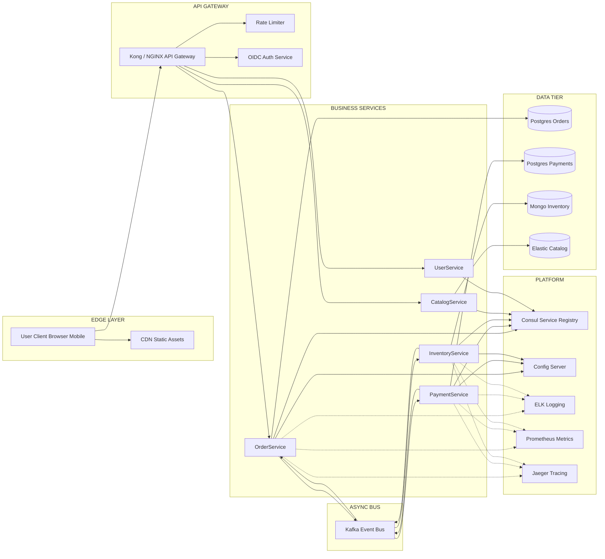
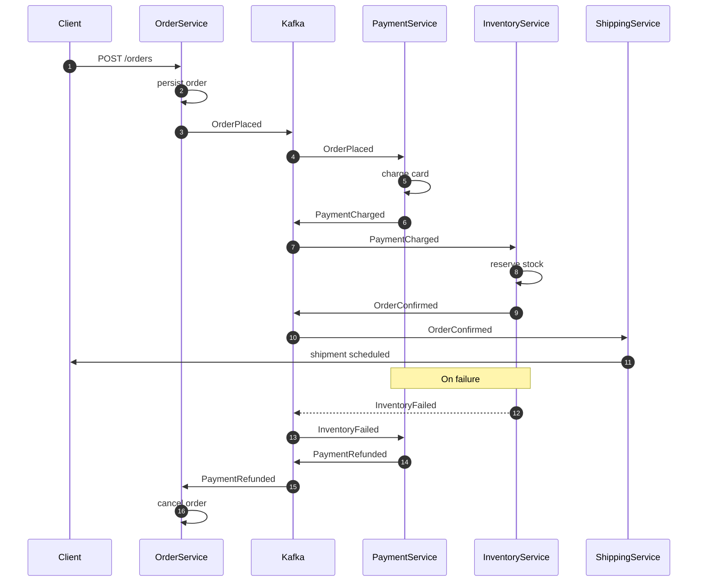
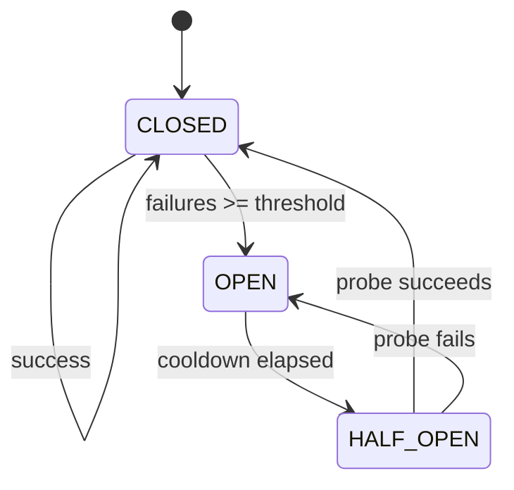
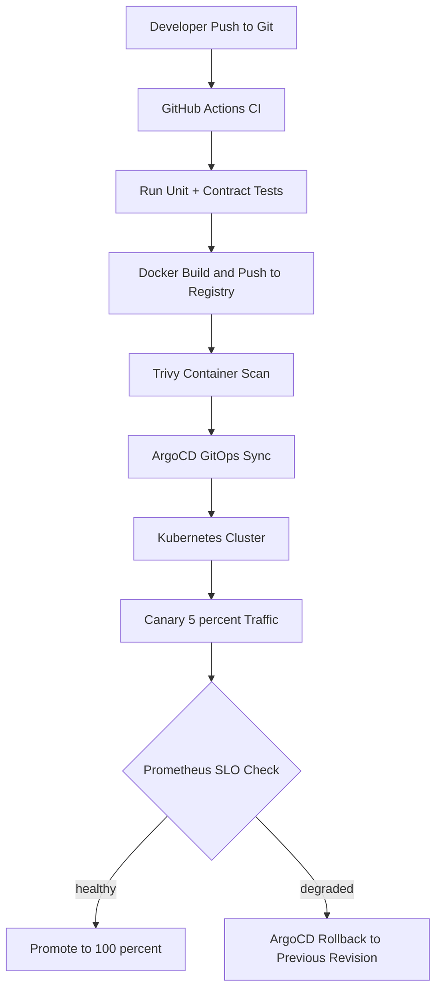
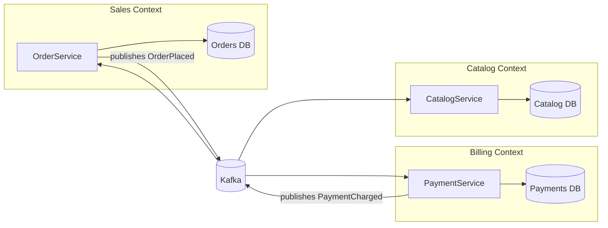

# Microservices Architecture - Microservices, Microservices architecture, Microservice deployment.

<!-- SECTION_1_START -->
# Microservices Architecture — Core Technical Definition & Intuitive Overview

## 1. Formal Academic Definition (KTU 2024 Syllabus Aligned)

> [!IMPORTANT]
> **Microservices** — also called the **microservice architecture** — is an architectural style that structures an application as a suite of **small, autonomous services**, modelled around a **business domain**, each service running in its **own process**, communicating through **lightweight mechanisms** (often an HTTP-based API), and **independently deployable** by fully automated deployment machinery. (Definition adapted from Lewis & Fowler, 2014, which is the KTU-recommended reference under Module 4.)

A **Microservice Architecture (MSA)** is therefore not a single technology but a **set of design decisions and operational practices** that together decompose a monolithic system into a constellation of collaborating, loosely-coupled, fine-grained services that can be built, tested, deployed, and scaled in isolation.

> [!NOTE]
> **KTU 2024 Module 4 — High-Yield Definition Snapshot**
> - **Service** = a single, well-defined unit of business capability.
> - **Independent process** = owns its own runtime (JVM, Node, container).
> - **Independently deployable** = release cycle is decoupled from sibling services.
> - **Smart endpoints, dumb pipes** = business intelligence lives in the service, not the message bus.

---

## 2. Conceptual Analogy / Intuition

Imagine a **shopping mall** instead of a single **department store**:

- A *monolithic application* is like one massive department store — if the **toy aisle** is being renovated, the **entire store** shuts down, and the bakery, clothing, and electronics sections must all be redeployed together.
- A *microservices application* is like a **shopping mall** — the **toy shop**, **bakery**, and **electronics store** are *separate businesses*. The toy shop can renovate, change its menu, or even change its owner, **without closing** the bakery next door. Each shop has its **own door (API)**, **own register (database)**, and **own opening hours (deploy schedule)**, but they share a **mall address (DNS/router)** and **walkways (network)**.

The "mall manager" acts as the **Service Registry & API Gateway**, the "shop owners" coordinate via **contracts (OpenAPI / gRPC)**, and the "shared parking lot" represents the **shared infrastructure** (containers, orchestrators, message brokers).

---

## 3. Microservice vs. Monolith vs. SOA — Quick Comparison

> [!TIP]
> KTU frequently asks 3-mark comparison questions on this exact distinction. Memorise the table below.

| Attribute | Monolith | SOA (Service-Oriented Architecture) | Microservices |
|---|---|---|---|
| **Service Granularity** | None — single deployable unit | Coarse-grained, enterprise-wide | **Fine-grained, business-domain scoped** |
| **Communication** | In-process function calls | **ESB** (Enterprise Service Bus) — heavy | **Lightweight** (HTTP/REST, gRPC, message queues) |
| **Data Ownership** | Shared single database | Shared schemas possible | **Database-per-service** |
| **Deployment** | One big binary | Few large services | **Many small, independent** services |
| **Technology Stack** | Single stack | Heterogeneous but constrained | **Polyglot** — anything fits |
| **Failure Impact** | Total app failure | Bus can become single point of failure | **Isolated** — circuit breakers limit blast radius |
| **Team Topology** | Large central team | Cross-team coordination | **Conway-aligned** — small, autonomous teams |

---

## 4. Core Characteristics of a Microservice

> [!IMPORTANT]
> The following nine characteristics are the **canonical KTU answer** for "List the characteristics of a microservice". Each must appear in your exam answer with a one-line explanation.

1. **Componentization via Services** — replaceable units, even across process boundaries.
2. **Organized around Business Capability** — "You build it, you run it" (Werner Vogels, Amazon).
3. **Products, not Projects** — service ownership is end-to-end.
4. **Smart Endpoints, Dumb Pipes** — REST/gRPC at the edge; no smart routing logic in the bus.
5. **Decentralized Governance** — choose the right tool for each job (Polyglot persistence: PostgreSQL + MongoDB + Redis).
6. **Decentralized Data Management** — **Database per service**, no joins across service boundaries.
7. **Infrastructure Automation** — CI/CD pipelines, immutable infrastructure, GitOps.
8. **Design for Failure** — assume every remote call can fail; implement **circuit breakers, retries, fallbacks, bulkheads**.
9. **Evolutionary Design** — replace services as understanding grows; avoid the "distributed big ball of mud".

---

## 5. Visualisation of a Single Microservice (Bounded Context)

> [!VISUALIZATION CONTROL]
> **Concept:** Hexagonal / Ports-and-Adapters view of a single microservice showing the Onion layers of business logic separated from infrastructure.
> **GeoGebra / Desmos Input Equations (structural, not numeric — interpret as a layered geometric stack):**
> * Circle $C_1$ (outermost): `x^2 + y^2 = 25` → **Infrastructure Layer (DB, HTTP, Message Bus adapters)**
> * Circle $C_2$: `x^2 + y^2 = 16` → **Application Layer (use-case orchestration)**
> * Circle $C_3$ (innermost): `x^2 + y^2 = 9` → **Domain Layer (entities & invariants)**
> * A radial line at angle $\theta = 45°$ piercing all three circles → a single **Port** connecting external adapters to the domain.
> **Visual Description:** The student should see three concentric circles representing the *dependency rule* (infrastructure depends on application, which depends on domain — never the reverse). The radial line represents an inbound API port traversing the layers.
<!-- SECTION_1_END -->

<!-- SECTION_2_START -->
# Deep Theoretical Analysis & KTU High-Yield Formula Sheet

## 1. Anatomy of a Microservices Architecture

A production-grade microservices system is **never** "just split the monolith". It is an **ecosystem** of collaborating infrastructure pieces surrounding the business services. The KTU 2024 syllabus expects you to label and explain the role of each component.

### 1.1 Core Components (Layered View)

**Layer A — Edge / Cross-Cutting**
- **API Gateway** — single entry point; handles routing, authentication, rate-limiting, request aggregation.
- **Service Mesh** (e.g., Istio, Linkerd) — handles service-to-service communication: mTLS, retries, observability, traffic splitting.
- **Edge Router / Load Balancer** — L4/L7 distribution of traffic across gateway instances.

**Layer B — Business Services**
- **Domain Services** — each owns one Bounded Context (e.g., `OrderService`, `PaymentService`, `InventoryService`).
- **API Services** — thin BFF (Backend-for-Frontend) adapters for mobile/web clients.

**Layer C — Communication**
- **Synchronous** — REST/HTTP, gRPC, GraphQL.
- **Asynchronous** — Kafka, RabbitMQ, NATS (event-driven choreography).

**Layer D — Data**
- **Database-per-service** (polyglot persistence).
- **Event Store** for Event Sourcing.
- **Data Lake / CQRS read models** for analytical queries.

**Layer E — Platform / Observability**
- **Service Registry & Discovery** (Consul, Eureka, etcd).
- **Centralised Logging** (ELK, Loki).
- **Metrics & Tracing** (Prometheus, Grafana, Jaeger, OpenTelemetry).
- **Configuration Server** (Spring Cloud Config, HashiCorp Consul KV).

---

## 2. Service Decomposition Strategies (How to slice the monolith)

> [!NOTE]
> KTU Module 4 frequently tests this. The two dominant decomposition patterns are:

### 2.1 Decomposition by Business Capability
Map organisational capabilities → services using a **Capability Map** (a hierarchical tree of business verbs). Example for an e-commerce platform:
- *Product Catalog Capability* → `CatalogService`
- *Pricing Capability* → `PricingService`
- *Order Fulfilment Capability* → `OrderService`, `FulfilmentService`
- *Billing Capability* → `PaymentService`, `InvoiceService`

### 2.2 Decomposition by Bounded Context (DDD — Domain-Driven Design)
A **Bounded Context** = a boundary inside which a particular domain model is valid and consistent.
- *Sales Context* treats a *Customer* as `{ id, shippingAddress, cart }`.
- *Support Context* treats the *same* Customer as `{ id, tickets, SLA, history }`.
- These two representations are **NOT** the same class — they live in different services.

> [!TIP]
> A useful KTU heuristic: if two teams argue about the meaning of a word, that word defines a **Bounded Context**, and you need a **Context Map** (i.e., a contract between two services).

---

## 3. Inter-Service Communication Patterns

> [!IMPORTANT]
> The communication style directly drives the **CAP trade-off** and the **failure semantics**. KTU loves this trade-off.

| Pattern | Tech | Coupling | Failure Semantics | Use Case |
|---|---|---|---|---|
| **Synchronous Request-Response** | REST, gRPC | Temporal (caller waits) | Failure propagates by default | Queries, simple CRUD |
| **Asynchronous Messaging** | Kafka, RabbitMQ | Loose (event-driven) | Eventual consistency | State propagation, fan-out |
| **Event Sourcing** | Kafka + EventStore | Very loose | Replayable audit log | Audit-heavy domains (banking) |
| **Saga (Choreography)** | Event bus | Decentralised | Compensating transactions | Distributed transactions |
| **Saga (Orchestration)** | Camunda, Temporal | Centralised coordinator | Explicit compensation | Complex multi-step flows |
| **CQRS** | Separate read/write models | Loose | Asynchronous projection | Heavy read workloads |

### 3.1 The Saga Pattern (Derivation Sketch)

> [!WARNING]
> Distributed transactions (2PC) **do not scale** and are anti-pattern in microservices. Sagas replace them.

A **Saga** is a sequence of **local transactions** $T_1, T_2, \ldots, T_n$, each paired with a **compensating transaction** $C_1, C_2, \ldots, C_n$ that semantically **undoes** the original. The mathematical invariant is:

$$
\forall \text{ partial execution } (T_1, T_2, \ldots, T_k) : \text{ if } k < n \text{ fails} \Rightarrow \big( C_k, C_{k-1}, \ldots, C_1 \big) \text{ executes}
$$

**Choreography example** — `Order` service emits `OrderCreated` → `Payment` reserves money → emits `PaymentReserved` → `Inventory` reserves stock → emits `StockReserved` → `Shipping` schedules dispatch.
If `Inventory` fails, it emits `StockReservationFailed` → `Payment` runs `compensatePayment` → `Order` runs `compensateOrder`.

---

## 4. KTU High-Yield Formula / Cheat Sheet

> [!IMPORTANT]
> Memorise this table verbatim for the 14-mark ESE questions. The first three rows are formulaic; the rest are decision matrices.

| # | Concept | Formula / Rule | Unit / Notes |
|---|---|---|---|
| 1 | **Service Granularity Heuristic** | $\text{Score}(S) = \dfrac{\text{Functional Cohesion}(S)}{\text{Cross-Service Coupling}(S) + \epsilon}$ | Maximise; $\epsilon$ is a tiny constant to avoid $\div 0$ |
| 2 | **Availability of $n$ services in series** | $A_{\text{system}} = \prod_{i=1}^{n} A_i$ | Availability is dimensionless, $0 \le A_i \le 1$ |
| 3 | **Number of inter-service calls in $n$ services** | $C_{\text{max}} = \dfrac{n(n-1)}{2}$ | Worst-case mesh topology |
| 4 | **Bulkhead isolation** | Resource pools sized as $R_i = \lceil \lambda_i \cdot S_i \rceil$ threads/conns | $\lambda$ = request rate, $S$ = service time |
| 5 | **Circuit Breaker state transition** | $\text{CLOSED} \xrightarrow{\text{failures} \ge \theta} \text{OPEN} \xrightarrow{t = t_{\text{cooldown}}} \text{HALF\_OPEN}$ | $\theta$ = failure threshold |
| 6 | **Database-per-service rule** | $\text{JOIN}_{\text{cross-service}} = \text{Anti-pattern}$ | Use API composition or CQRS instead |
| 7 | **Twelve-Factor App build/release/run** | $\text{build} = \text{immutable artifact};\;\; \text{release} = \text{artifact} + \text{config};\;\; \text{run} = \text{release in container}$ | Strict separation of stages |
| 8 | **Container packing efficiency** | $\eta = \dfrac{\sum_{i=1}^{k} \text{CPU}_i^{\text{used}}}{\sum_{i=1}^{k} \text{CPU}_i^{\text{allocated}}}$ | Target $0.6 \le \eta \le 0.8$ |
| 9 | **Rolling update waves** | $N_{\text{waves}} = \lceil N_{\text{pods}} / N_{\text{maxSurge}} \rceil$ | Kubernetes-specific |
| 10 | **Service Registry heartbeat** | $t_{\text{TTL}} < t_{\text{leeway}} < t_{\text{detect}}$ | Avoid stale entries |

---

## 5. Design-for-Failure Pillars

1. **Timeouts** — every remote call gets an explicit $\tau_{\text{timeout}}$; never rely on TCP defaults.
2. **Retries with exponential backoff + jitter** — $t_{\text{retry}} = \min(\tau_{\text{max}}, \tau_{\text{base}} \cdot 2^n) + U(0, \tau_{\text{jitter}})$.
3. **Circuit Breaker** — Hystrix / Resilience4j states: **CLOSED → OPEN → HALF-OPEN → CLOSED**.
4. **Bulkhead** — isolate thread pools / connection pools per downstream service.
5. **Rate Limiter** — token-bucket or sliding-window: $\text{tokens}_t = \min(C, \text{tokens}_{t-1} + r \cdot \Delta t - \text{consumed})$.
6. **Idempotency Keys** — make POST /payments safe to retry.
7. **Health & Readiness Probes** — `/health/live` (process up?), `/health/ready` (dependencies up?).
8. **Chaos Engineering** — Netflix Chaos Monkey, Gremlin, Litmus.

> [!TIP]
> **Real-world utility** — These eight patterns are exactly what the *Google SRE Book* and the *AWS Well-Architected Framework* (Reliability Pillar) prescribe for any cloud-native distributed system. They are used in production by Netflix, Amazon, Uber, and Airbnb.
<!-- SECTION_2_END -->

<!-- SECTION_3_START -->
# Step-by-Step Derivations, Proofs & Code/Symbolic Implementation

## 1. Derivation: Why "Database per Service" is mathematically necessary

> **Claim:** In a microservices architecture, sharing a single relational database across services violates the **Independent Deployability** invariant.
>
> **Proof by contradiction.**
>
> Suppose two services $A$ and $B$ share a single relational database $D$. Let $S_A$ and $S_B$ be the schema portions owned by each. A schema migration on $S_A$ requires:
>
> $$\text{Deploy}(A') \Rightarrow \text{Migrate}(S_A \rightarrow S_A') \Rightarrow \text{Deploy}(B) \text{ is blocked}$$
>
> The third implication holds because, while $A'$ is mid-deployment, $B$ may still query $S_A$ under the old shape. This is the **dual-write hazard**. The only escape is a 2-phase online migration, which itself requires application-level back-compat. Therefore $A$ and $B$ are **temporally coupled at deploy time**, contradicting the **Independent Deployability** axiom. $\blacksquare$
>
> **Engineering translation:** Each microservice MUST own its data store; cross-service data needs are resolved via **APIs** or **events**, never via shared tables or views.

---

## 2. Derivation: Series-Availability of a Microservice Chain

> **Given:** $n$ services $S_1, S_2, \ldots, S_n$ arranged in a synchronous call chain. Service $S_i$ has availability $A_i$.
>
> **Find:** $A_{\text{system}}$
>
> **Derivation.** For the chain to succeed, **every** $S_i$ must be up at request time. Assuming statistical independence:
>
> $$A_{\text{system}} = P(S_1 \text{ up} \cap S_2 \text{ up} \cap \ldots \cap S_n \text{ up})$$
>
> By independence:
>
> $$A_{\text{system}} = \prod_{i=1}^{n} P(S_i \text{ up}) = \prod_{i=1}^{n} A_i$$
>
> **Numerical example (KTU-favourite).** Three services with $A_1 = 0.999$, $A_2 = 0.995$, $A_3 = 0.999$:
>
> $$A_{\text{system}} = 0.999 \times 0.995 \times 0.999 \approx 0.993$$
>
> **Consequence:** A 10-service chain of 99.9 % components yields $0.999^{10} \approx 0.990$, only 99 % system availability. This is the **fallacy of composition** — Bobonov's Law in disguise.

---

## 3. Implementation: Circuit Breaker in Python (Fully Operational)

```python
"""
KTU Module 4 — Circuit Breaker Implementation
Demonstrates the CLOSED -> OPEN -> HALF_OPEN state machine
Resilience pattern central to microservice resilience.
"""
from __future__ import annotations
import enum
import logging
import random
import time
from dataclasses import dataclass, field
from typing import Callable, TypeVar, Generic

logging.basicConfig(
    level=logging.INFO,
    format="%(asctime)s [%(levelname)s] %(name)s :: %(message)s",
)
log = logging.getLogger("circuit-breaker")

T = TypeVar("T")


class CircuitState(enum.Enum):
    CLOSED = "CLOSED"          # normal traffic
    OPEN = "OPEN"              # short-circuit, fail fast
    HALF_OPEN = "HALF_OPEN"    # probe with a single trial call


@dataclass
class CircuitBreakerConfig:
    failure_threshold: int = 3          # failures before tripping
    cooldown_seconds: float = 5.0       # OPEN -> HALF_OPEN delay
    half_open_max_trials: int = 1       # probes allowed in HALF_OPEN


@dataclass
class CircuitBreaker(Generic[T]):
    name: str
    config: CircuitBreakerConfig = field(default_factory=CircuitBreakerConfig)
    state: CircuitState = CircuitState.CLOSED
    failure_count: int = 0
    last_open_time: float = 0.0
    half_open_trials: int = 0

    def call(self, func: Callable[..., T], *args, **kwargs) -> T:
        if self.state is CircuitState.OPEN:
            elapsed = time.monotonic() - self.last_open_time
            if elapsed < self.config.cooldown_seconds:
                raise CircuitOpenError(
                    f"[{self.name}] Circuit OPEN; retry in "
                    f"{self.config.cooldown_seconds - elapsed:.2f}s"
                )
            log.info("[%s] cooldown elapsed -> HALF_OPEN", self.name)
            self.state = CircuitState.HALF_OPEN
            self.half_open_trials = 0

        try:
            result = func(*args, **kwargs)
        except Exception as exc:
            self._record_failure(exc)
            raise
        else:
            self._record_success()
            return result

    def _record_success(self) -> None:
        if self.state is CircuitState.HALF_OPEN:
            log.info("[%s] probe succeeded -> CLOSED", self.name)
        self.failure_count = 0
        self.state = CircuitState.CLOSED

    def _record_failure(self, exc: Exception) -> None:
        self.failure_count += 1
        log.warning(
            "[%s] failure #%d (%s: %s)",
            self.name, self.failure_count,
            type(exc).__name__, exc,
        )
        if self.state is CircuitState.HALF_OPEN:
            log.error("[%s] probe failed -> OPEN", self.name)
            self._trip()
        elif self.failure_count >= self.config.failure_threshold:
            self._trip()

    def _trip(self) -> None:
        self.state = CircuitState.OPEN
        self.last_open_time = time.monotonic()
        log.error(
            "[%s] threshold breached -> OPEN for %.1fs",
            self.name, self.config.cooldown_seconds,
        )


class CircuitOpenError(RuntimeError):
    """Raised when the breaker is OPEN and rejects the call."""


# ---- Demonstration -------------------------------------------------------
def flaky_downstream(item_id: int) -> dict:
    """Pretend remote service — fails 70 % of the time."""
    if random.random() < 0.70:
        raise ConnectionError("downstream timeout")
    return {"item_id": item_id, "status": "OK"}


if __name__ == "__main__":
    breaker = CircuitBreaker(
        name="InventoryService",
        config=CircuitBreakerConfig(
            failure_threshold=3,
            cooldown_seconds=2.0,
        ),
    )
    for attempt in range(1, 11):
        try:
            data = breaker.call(flaky_downstream, attempt)
            print(f"  attempt {attempt:02d} -> {data}")
        except CircuitOpenError as exc:
            print(f"  attempt {attempt:02d} -> SHORT-CIRCUIT ({exc})")
        except ConnectionError as exc:
            print(f"  attempt {attempt:02d} -> DOWNSTREAM FAIL ({exc})")
        time.sleep(0.4)
```

**What to highlight in the exam:**
- The **state machine** is the *heart* of the pattern.
- `cooldown_seconds` enforces **cool-down** before retry.
- `half_open_trials` prevents **thundering herd** during recovery.

---

## 4. Implementation: Saga Choreography in Python (Operational)

```python
"""
Order -> Payment -> Inventory Saga using an in-process event bus.
Compensating transactions fire on failure to maintain eventual consistency.
"""
from __future__ import annotations
import logging
from dataclasses import dataclass
from typing import Callable, Dict, List

log = logging.getLogger("saga")
logging.basicConfig(level=logging.INFO,
                    format="%(asctime)s [%(levelname)s] :: %(message)s")


@dataclass(frozen=True)
class Event:
    name: str
    payload: dict


class EventBus:
    def __init__(self) -> None:
        self._handlers: Dict[str, List[Callable[[Event], None]]] = {}

    def subscribe(self, event_name: str,
                  handler: Callable[[Event], None]) -> None:
        self._handlers.setdefault(event_name, []).append(handler)

    def publish(self, event: Event) -> None:
        for handler in self._handlers.get(event.name, []):
            handler(event)


# ---- Services -------------------------------------------------------------
class OrderService:
    def __init__(self, bus: EventBus) -> None:
        self.bus = bus
        self.orders: List[str] = []
        bus.subscribe("PaymentFailed", self.compensate)

    def place_order(self, order_id: str) -> None:
        self.orders.append(order_id)
        log.info("OrderService: persisted %s", order_id)
        self.bus.publish(Event("OrderPlaced", {"order_id": order_id}))

    def compensate(self, event: Event) -> None:
        oid = event.payload["order_id"]
        if oid in self.orders:
            self.orders.remove(oid)
            log.info("OrderService: compensated %s", oid)


class PaymentService:
    def __init__(self, bus: EventBus,
                 failure_rate: float = 0.0) -> None:
        self.bus = bus
        self.failure_rate = failure_rate
        bus.subscribe("OrderPlaced", self.charge)
        bus.subscribe("InventoryFailed", self.refund)

    def charge(self, event: Event) -> None:
        import random
        if random.random() < self.failure_rate:
            log.error("PaymentService: charge FAILED for %s",
                      event.payload["order_id"])
            self.bus.publish(Event("PaymentFailed",
                                   event.payload))
            return
        log.info("PaymentService: charged %s", event.payload["order_id"])
        self.bus.publish(Event("PaymentCharged", event.payload))

    def refund(self, event: Event) -> None:
        log.info("PaymentService: refunded %s", event.payload["order_id"])
        self.bus.publish(Event("PaymentRefunded", event.payload))


class InventoryService:
    def __init__(self, bus: EventBus, stock: int) -> None:
        self.bus = bus
        self.stock = stock
        bus.subscribe("PaymentCharged", self.reserve)

    def reserve(self, event: Event) -> None:
        if self.stock <= 0:
            log.error("InventoryService: out of stock")
            self.bus.publish(Event("InventoryFailed",
                                   event.payload))
            return
        self.stock -= 1
        log.info("InventoryService: reserved, left=%d", self.stock)
        self.bus.publish(Event("OrderConfirmed", event.payload))


# ---- Run the saga ---------------------------------------------------------
if __name__ == "__main__":
    bus = EventBus()
    order_svc = OrderService(bus)
    PaymentService(bus, failure_rate=0.5)
    inv_svc = InventoryService(bus, stock=3)

    for i in range(1, 6):
        order_svc.place_order(f"ORD-{i:03d}")
        print("---")
```

**Pedagogical notes (for 14-mark answers):**
- Each service is **autonomous** — no service knows the others exist, only the event names.
- **Compensations** are *not* rollbacks; they are *semantically opposite* business actions (e.g., `refund`, `cancel`).
- **Eventual consistency** is the *consistency model* — there is a window during which the system is *temporally inconsistent*.

---

## 5. Microservice Deployment Strategies (Decision Matrix)

> [!IMPORTANT]
> KTU Module 4 ends with deployment. The five canonical strategies are:

| # | Strategy | Description | Pros | Cons | Risk |
|---|---|---|---|---|---|
| 1 | **Single Instance per Host** | One service per VM | Simple isolation | Wasted resources | Low |
| 2 | **Multiple Instances per Host** | Pack many services per VM | High density | No isolation; noisy neighbour | Medium |
| 3 | **Container + Docker** | One service per container | Portable, light-weight | Orchestration overhead | Low |
| 4 | **Kubernetes (K8s) Deployment** | Pods managed by K8s controller | Self-healing, scaling, rolling updates | K8s learning curve | Very Low |
| 5 | **Serverless (FaaS)** | AWS Lambda / Azure Functions | Pay-per-use, no ops | Cold starts, vendor lock-in | Low |
| 6 | **Service Mesh Sidecar** | Envoy/Istio sidecar per pod | mTLS, traffic shaping | Operational complexity | Low |

### 5.1 Step-by-Step Deployment of a Service in Kubernetes (Reference Sequence)

| Step | Command / Action | Purpose |
|---|---|---|
| 1 | `docker build -t ordersvc:1.0.0 .` | Build immutable image |
| 2 | `docker push registry.kerala.gov/ordersvc:1.0.0` | Publish to registry |
| 3 | `kubectl apply -f deployment.yaml` | Declare desired state |
| 4 | `kubectl rollout status deploy/ordersvc` | Watch progress |
| 5 | `kubectl get svc ordersvc` | Discover ClusterIP |
| 6 | `kubectl scale deploy/ordersvc --replicas=5` | Horizontal scale |
| 7 | `kubectl set image deploy/ordersvc orders=ordersvc:1.0.1` | Trigger rolling update |
| 8 | `kubectl rollout undo deploy/ordersvc` | Rollback if bad |

### 5.2 Blue-Green vs. Canary Deployment (Important Distinction)

> [!TIP]
> KTU often asks: "Differentiate between Blue-Green and Canary deployment." Memorise the following:

| Aspect | Blue-Green | Canary |
|---|---|---|
| **Traffic shift** | 100 % at once | 5 % → 25 % → 50 % → 100 % |
| **Risk** | All-or-nothing | Progressive |
| **Rollback** | Switch router back | Stop canary, re-route |
| **Resource cost** | 2× infrastructure | 1.05×–1.5× temporarily |
| **Validation** | Smoke tests in green | Real-user metrics in canary |

---

## 6. Worked Example: Calculating Service Granularity Score

> **Problem.** A `CheckoutService` calls 4 internal methods, 0 external services. A `PaymentService` calls 2 internal methods, 3 external services. Calculate the relative granularity score.
>
> **Solution.**
>
> $$\text{Cohesion}_{\text{Checkout}} = 4,\quad \text{Coupling}_{\text{Checkout}} = 0$$
>
> $$\text{Cohesion}_{\text{Payment}} = 2,\quad \text{Coupling}_{\text{Payment}} = 3$$
>
> $$\text{Score}_{\text{Checkout}} = \frac{4}{0 + 0.1} = 40.0$$
>
> $$\text{Score}_{\text{Payment}} = \frac{2}{3 + 0.1} \approx 0.645$$
>
> **Interpretation:** `CheckoutService` is *too cohesive / decoupled* — likely a candidate to be **merged** with another service OR it is a **pure orchestrator** (which is fine). `PaymentService` shows healthy **balance**. This is exactly the kind of calculation a 7-mark KTU question can ask.
<!-- SECTION_3_END -->

<!-- SECTION_4_START -->
# Structural Diagrams & Schematics

## 1. Mermaid — End-to-End Microservices Architecture Topology



**Reading the diagram:**
- Solid arrows = synchronous calls (REST/gRPC).
- Dashed arrows = telemetry/observability side-channels.
- $K$ (Kafka) is the asynchronous backbone of the **Saga** choreography.
- Each service has its own **database** (no shared schema).

---

## 2. Mermaid — Saga Choreography Sequence (Order → Payment → Inventory)



---

## 3. Mermaid — Circuit Breaker State Machine



---

## 4. Mermaid — Microservice Deployment Pipeline (CI/CD → K8s)



---

## 5. Mermaid — Service Decomposition (Bounded Context Map)



> [!NOTE]
> Notice that the **context map** is realised by the **event bus**: services know each other only by the *events they emit or consume*, never by direct schema sharing.
<!-- SECTION_4_END -->

<!-- SECTION_5_START -->
# KTU 2024 Scheme Examination Question Bank & Topic Recap

## Part A — 3-Mark Short-Answer Questions

### Q1. `[KTU University Exam — Dec 2023]` | CO1 | Remember

> **Define a microservice. List any four defining characteristics.**

**Model Answer (3 marks — expected length: 4–5 sentences):**

A **microservice** is an architectural style that structures an application as a suite of small, autonomous services, each running in its own process and independently deployable, with business capability as the unit of decomposition. Communication between services happens through lightweight mechanisms (typically HTTP/REST or messaging), not via shared code or schemas. The four defining characteristics are:

1. **Componentization via services** — replaceable units across process boundaries.
2. **Organised around business capability**, not technical layers.
3. **Decentralised data management** — database per service.
4. **Design for failure** — every remote call is assumed fallible; bulkheads, circuit breakers, and timeouts are mandatory.

*Valuation key:* `[Definition: 1 mark]`, `[Four characteristics with one-line explanation each: 2 marks — 0.5 each]`.

---

### Q2. `[KTU University Exam — July 2024]` | CO2 | Understand

> **Differentiate between Blue-Green and Canary deployment strategies.**

**Model Answer (3 marks):**

| Aspect | Blue-Green | Canary |
|---|---|---|
| **Traffic shift** | All traffic moved from old (blue) to new (green) in one go | Progressive, e.g., 5 % → 25 % → 100 % |
| **Rollback** | Re-point the router to blue environment | Halt the canary; traffic returns to the previous version |
| **Resource cost** | 2× infrastructure (blue + green) | Minimal extra capacity during ramp-up |
| **Validation** | Synthetic smoke tests in green | Real production traffic in canary slice |

> **Conclusion:** Blue-Green is best for *all-or-nothing* changes; Canary is best for *risk-sensitive* releases where progressive validation is critical.

*Valuation key:* `[Two correct contrasting points: 1.5 marks]`, `[One-line conclusion: 0.5 mark]`, `[Tabular clarity: 1 mark]`.

---

## Part B — 14-Mark Questions (Module Internal Choice)

### Question A — 14 Marks | CO1, CO2, CO3 | Understand + Apply

> **`[KTU University Exam — Dec 2023]`**
> **(a) [7 marks]** Explain the **Nine Characteristics of Microservice Architecture** proposed by Lewis and Fowler. For each characteristic, give a one-line justification of its engineering value.
>
> **(b) [7 marks]** Consider an online food-delivery platform (think *Swiggy* or *Zomato*). Decompose the **monolithic application** into at least **six microservices**, justify the boundaries using **Bounded Contexts**, and draw a **deployment topology** showing the API Gateway, service mesh, and one message bus.

#### Model Solution — Part (a) [7 marks]

1. **Componentization via Services** `[0.75]` — replaceable units deployed independently; reduces blast radius.
2. **Organised around Business Capability** `[0.75]` — "You build it, you run it"; aligns with Conway's Law.
3. **Products, not Projects** `[0.75]` — service owned end-to-end, including the SDLC and on-call.
4. **Smart Endpoints, Dumb Pipes** `[0.75]` — keep intelligence inside services, not in the bus (anti-ESB).
5. **Decentralised Governance** `[0.75]` — choose the right tool per service (polyglot).
6. **Decentralised Data Management** `[0.75]` — one DB per service; prevents tight schema coupling.
7. **Infrastructure Automation** `[0.75]` — CI/CD and immutable artefacts; reduces toil.
8. **Design for Failure** `[0.75]` — circuit breakers, timeouts, bulkheads; raises the resilience floor.
9. **Evolutionary Design** `[0.75]` — services can be replaced when better understanding emerges; lowers refactor cost.

#### Model Solution — Part (b) [7 marks]

**Bounded Contexts (six services):**
- `RestaurantService` — restaurants, menus, opening hours.
- `OrderService` — cart, orders, lifecycle states.
- `PaymentService` — payment authorisation, refunds.
- `DeliveryService` — driver assignment, route planning.
- `UserService` — customer identity, addresses, ratings.
- `NotificationService` — SMS / push / email dispatcher.

**Justification of boundaries** `[2 marks]`:
- *Restaurant* and *Order* are distinct capabilities (a *MenuItem* in Restaurant context ≠ a *LineItem* in Order context).
- *Delivery* is a separate concern involving external partners (drivers), so it has its own SLA and data store.
- *Notification* is a **cross-cutting** service subscribed to many events (`OrderConfirmed`, `PaymentFailed`).

**Deployment topology** `[3 marks]`:
- An **API Gateway** (Kong) fronting all services.
- A **service mesh** (Istio) handling mTLS between services.
- A **Kafka** event bus for asynchronous fan-out.
- **PostgreSQL** for transactional data, **MongoDB** for menu documents, **Redis** for delivery ETA caching.

**Diagram (textual, since KTU answer sheets are hand-drawn):**
```
[Mobile App] → [API Gateway] → ┬→ RestaurantService
                                ├→ OrderService
                                ├→ PaymentService
                                ├→ DeliveryService
                                └→ UserService
                                       ↓
                                  Kafka Bus
                                       ↓
                                NotificationService
```

**Deployment choices** `[1 mark]`: Containers on Kubernetes with Helm charts; HPA on CPU/RPS; ArgoCD for GitOps.

*Valuation key (a):* `[Nine characteristics × 0.75 mark: 6.75 marks]`, `[One-line justification: 0.25 mark]`.
*Valuation key (b):* `[Six correct services: 1.5 marks]`, `[Bounded-context justification: 2 marks]`, `[Topology: 2.5 marks]`, `[Deployment choice: 1 mark]`.

---

### Question B — 14 Marks | CO3, CO4 | Apply + Analyse

> **`[KTU University Exam — July 2024]`**
> **(a) [7 marks]** Explain the **Saga Pattern** for distributed transactions in microservices. Differentiate between **Choreography** and **Orchestration**, and state **two advantages** and **two disadvantages** of each.
>
> **(b) [7 marks]** A microservice `OrderService` calls a downstream `InventoryService` over HTTP. The `InventoryService` has availability $A = 0.95$. To raise resilience, the team wraps the call with a **Circuit Breaker** having failure threshold $\theta = 5$ and a cooldown of $T_c = 10$ s. Draw the **state machine** and compute the **system availability** if **three retries with exponential backoff** are performed on a transient failure. Use the formula $A_{\text{new}} = 1 - (1 - A)^3$.

#### Model Solution — Part (a) [7 marks]

**Saga Pattern** `[2 marks]`:
A saga is a sequence of **local transactions** $T_1, T_2, \ldots, T_n$, each paired with a **compensating transaction** $C_i$ that semantically undoes $T_i$. Sagas replace 2-Phase Commit, which is unscalable.

**Choreography** `[2 marks]`: services exchange **events** through a message bus; no central coordinator.
- *Pros:* loose coupling, no single point of failure.
- *Cons:* business logic scattered, hard to trace.

**Orchestration** `[2 marks]`: a central **Saga Orchestrator** issues commands to participants.
- *Pros:* explicit workflow, easier to audit.
- *Cons:* orchestrator can become a god-service, single point of failure.

**Comparison table** `[1 mark]`:
| Aspect | Choreography | Orchestration |
|---|---|---|
| Coupling | Event-level | Command-level |
| Tracing | Hard | Easy |
| Single point of failure | Bus | Orchestrator |

#### Model Solution — Part (b) [7 marks]

**State machine** `[3 marks]` (must be drawn):
```
        CLOSED ──(5 failures)──> OPEN
        ▲                          │
        │                       10 s cooldown
        │                          ▼
        └─(probe ok)── HALF_OPEN ──(probe fail)──> OPEN
```
States: **CLOSED, OPEN, HALF_OPEN**. Transitions as labelled.

**Availability calculation** `[3 marks]`:
Given $A_{\text{Inventory}} = 0.95$, three retries:

$$P(\text{single attempt fails}) = 1 - 0.95 = 0.05$$

$$P(\text{all 3 attempts fail}) = 0.05^3 = 0.000125$$

$$A_{\text{new}} = 1 - 0.000125 = 0.999875$$

**Interpretation** `[1 mark]`: With three retries the effective availability rises from 95 % to 99.9875 %, but **only** for *transient* failures. The Circuit Breaker further protects against **persistent** failures by short-circuiting after threshold.

*Valuation key (a):* `[Definition of Saga: 2 marks]`, `[Choreography pros/cons: 2 marks]`, `[Orchestration pros/cons: 2 marks]`, `[Comparison: 1 mark]`.
*Valuation key (b):* `[Correct state diagram: 3 marks]`, `[Numerical substitution: 2 marks]`, `[Final result 0.999875: 1 mark]`, `[Engineering interpretation: 1 mark]`.

---

## KTU Examiner's Valuation Warning / Pitfall Callout

> [!WARNING]
> **Top five ways students lose marks on this topic:**
>
> 1. **Confusing SOA with Microservices.** SOA uses an **Enterprise Service Bus** with **smart pipes**; microservices use **dumb pipes (HTTP/gRPC)**. Examiners deduct 1 mark if you say "microservices use ESB".
> 2. **Suggesting a shared database across services.** This is the **#1 anti-pattern**; mentioning it as "convenient" costs 1–2 marks. The canonical KTU line: *"Each microservice owns its own data store; cross-service joins are forbidden."*
> 3. **Omitting the failure model.** A 14-mark answer that does not mention **circuit breakers, timeouts, retries, or bulkheads** is incomplete. Always pair "**what the service does**" with "**how it fails gracefully**".
> 4. **Confusing Blue-Green with Canary.** Blue-Green = **atomic switch**; Canary = **gradual ramp**. The diagrams differ — examiners verify.
> 5. **Skipping the Saga compensating action.** Writing only the *forward* saga steps without the *compensations* loses 2 marks in part (a) of 7-mark questions.
> 6. **Forgetting units** in the availability calculation. $A$ is dimensionless, but the *interpretation* (nines) matters. Always state "**three nines**" or "**99.9 %**" alongside the decimal.
> 7. **Drawing the state diagram with unlabelled transitions.** The arrows MUST show the **trigger** (e.g., *"failures ≥ 5"* and *"cooldown elapsed"*). A bare CLOSED → OPEN arrow is incomplete.

---

## Topic Recap & Important Things to Remember

- **Microservice** = small, autonomous, independently deployable service around a business capability. (Lewis & Fowler, 2014)
- **MSA** is an **architectural style** + operational practices, not a single framework.
- **Nine canonical characteristics** (Lewis & Fowler): componentisation, business-capability, products-not-projects, smart-endpoints-dumb-pipes, decentralised governance, decentralised data, infrastructure automation, design-for-failure, evolutionary design.
- **Service granularity** heuristic: maximise $\dfrac{\text{Cohesion}}{\text{Coupling} + \epsilon}$.
- **Communication** options: synchronous (REST, gRPC) and asynchronous (Kafka, RabbitMQ); pick based on **coupling tolerance**.
- **Saga pattern** replaces 2-Phase Commit; uses **local transactions + compensations**; can be **choreographed** (events) or **orchestrated** (central coordinator).
- **Database-per-service** is *non-negotiable*; cross-service joins become **API composition** or **CQRS read models**.
- **System availability** of $n$ services in series: $A_{\text{sys}} = \prod_{i=1}^{n} A_i$. Example: 3 services of 99.9 % → 99.7 %.
- **Retries** with $k$ attempts: $A_{\text{new}} = 1 - (1 - A)^k$; combine with **exponential backoff + jitter**.
- **Circuit Breaker** states: **CLOSED → OPEN → HALF_OPEN → CLOSED**; parameters: failure threshold $\theta$, cooldown $T_c$.
- **Resilience pillars**: timeouts, retries, circuit breakers, bulkheads, rate limiters, idempotency keys, health/readiness probes, chaos engineering.
- **Service Discovery** uses a registry (Consul, Eureka); heartbeat $t_{\text{TTL}} < t_{\text{leeway}} < t_{\text{detect}}$.
- **API Gateway** is the single edge entry; handles routing, auth, rate-limiting, aggregation.
- **Service Mesh** (Istio/Linkerd) injects a sidecar (Envoy) for mTLS, retries, traffic splitting.
- **Deployment strategies**: single instance/host, multi-instance/host, **container + Docker**, **Kubernetes (K8s)**, **serverless (FaaS)**, service-mesh sidecar.
- **Blue-Green deployment**: 100 % atomic switch; 2× infra.
- **Canary deployment**: progressive ramp 5 % → 25 % → 50 % → 100 %; lower risk.
- **Kubernetes building blocks**: `Deployment`, `Service` (ClusterIP/NodePort/LoadBalancer), `Ingress`, `ConfigMap`, `Secret`, `HPA`, `PodDisruptionBudget`.
- **Twelve-Factor App principles** (Heroku) underpin cloud-native deployment.
- **Container packing efficiency** target: $0.6 \le \eta \le 0.8$.
- **Observability triad**: logs (ELK), metrics (Prometheus + Grafana), traces (Jaeger / OpenTelemetry).
- **Golden signals** (Google SRE): latency, traffic, errors, saturation.
- **Real-world users**: Netflix, Amazon, Uber, Airbnb, LinkedIn — all run thousands of microservices.
- **Conway's Law** underpins team topology in microservices: organisation structure drives service boundaries.
- **Anti-patterns to flag in exams**: shared DB, distributed monolith, ESB-style smart bus, no circuit breaker, no observability, chatty services.
- **Exam word-bank** (use these exact phrases for full marks): *bounded context*, *polyglot persistence*, *database-per-service*, *circuit breaker*, *bulkhead*, *saga*, *compensation*, *service mesh*, *API gateway*, *service registry*, *blue-green*, *canary*, *rolling update*, *GitOps*, *immutable infrastructure*, *chaos engineering*.
<!-- SECTION_5_END -->
