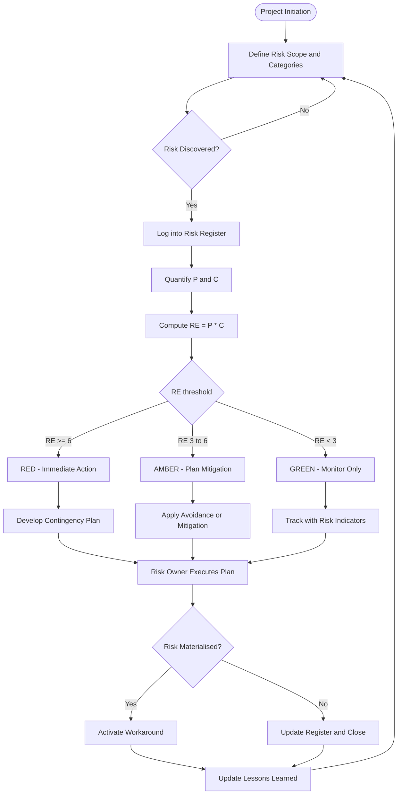
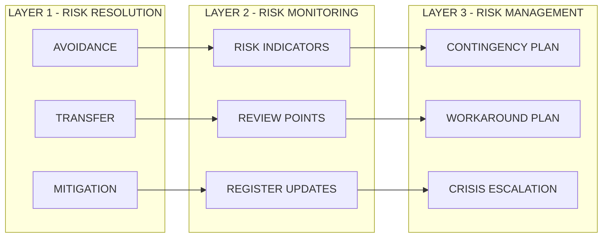
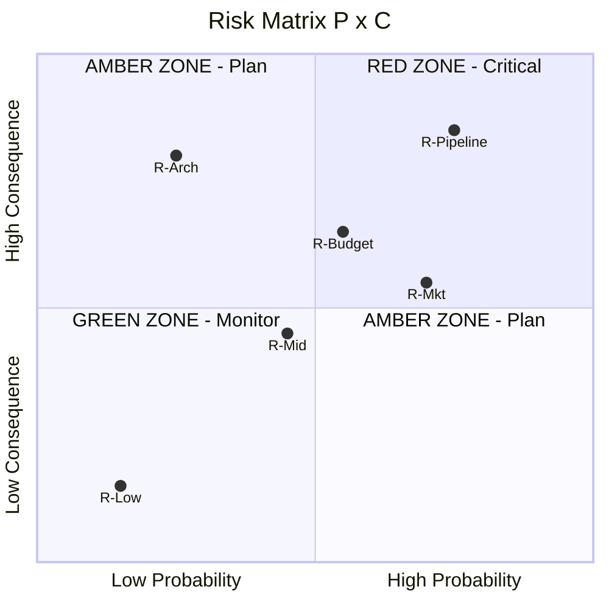

# Risk management: Risk and its types, Risk monitoring and management model

<!-- SECTION_1_START -->
# 🛡️ Software Risk Management

## 1. Core Technical Definition

> [!IMPORTANT]
> **Risk** in software project management is formally defined as *"the possibility of suffering loss in a software project, where the loss may be measured in monetary terms, schedule delays, technical failures, or business/strategic impact."* (KTU 2024 - PECST411 Module 4)

**Risk** is a future event (or condition) that has a **probability of occurrence** and a **potential negative impact (loss)** on at least one project objective — typically **cost, schedule, scope, or quality**.

Mathematically, a risk is a tuple:

$$R = \{P, C, S\}$$

Where:
- $P$ = Probability of occurrence (a value between $0$ and $1$)
- $C$ = Consequence / Cost of impact (in person-months, currency, or schedule days)
- $S$ = Severity / Strategic exposure of the risk event

> [!NOTE]
> **KTU 2024 Key Distinction:** A *risk* is *not* a *problem*. A **problem** has already occurred, whereas a **risk** is a *potential* future event. The whole purpose of Risk Management is to prevent risks from becoming problems.

---

## 2. The Three Pillars of Software Risk (KTU Taxonomy)

| # | Risk Pillar | KTU Standard Definition | Loss Dimension |
|---|-------------|--------------------------|-----------------|
| 1 | **Project Risks** | Threaten the project plan, schedule, resources, or deliverables. | Schedule, Cost |
| 2 | **Technical Risks** | Threaten the quality, design, implementation, interfacing, or maintenance of the software. | Quality, Performance |
| 3 | **Business Risks** | Threaten the viability of the software product in the marketplace or the organisation's business model. | Strategic, Market Share |

There are also **Known Risks** (already identified and analyzed) and **Predictable Risks** (extrapolated from prior project experience) — together known as **identifiable risks**. The unknown unknowns are called **residual risks** and can never be fully eliminated.

---

## 3. Conceptual Analogy / Intuition

> [!TIP]
> 🏔️ **The Mountain-Climbing Analogy**
>
> Imagine your software project as a **team climbing a Himalayan peak**.
> - The **mountainside** = your project schedule.
> - The **climbers** = your development team.
> - A **risk** = *"There is a 40% chance of a sudden blizzard at 4,000m that could delay the climb by 7 days."*
> - **Risk management** = packing warm gear *in advance* (avoidance), choosing a tougher but safer route (control), and keeping oxygen cylinders ready (contingency).
> - A **problem** = the blizzard has *actually* hit, and now you must *fight* it (fire-fighting), instead of managing it.
>
> Good climbers (good project managers) **plan for the blizzard before it comes**. The RMMM model is that pre-climb plan.

---

## 4. GeoGebra / Risk Visualisation Callout

> [!VISUALIZATION CONTROL]
> **Concept:** *Risk Exposure Surface* — a 3D surface where the X-axis is **Probability of Occurrence ($P \in [0,1]$)**, the Y-axis is **Consequence / Impact ($C$)**, and the Z-axis is the **Risk Exposure ($RE = P \times C$)**.
>
> **Desmos 3D Input Equations:**
> - $x = P$ in $[0, 1]$
> - $y = C$ in $[0, 10]$
> - $z = x \cdot y$
>
> **Visual Description:** The student should observe a **flat rectangular plane sloping up from the origin** to the far corner $(1, 10, 10)$. Items with high $P$ and high $C$ (top-right corner) form the **"Critical Red Zone"** of the risk register. Low $P$, low $C$ items sit in the **"Acceptable Green Zone"** near the origin.

<!-- SECTION_1_END -->

<!-- SECTION_2_START -->
# 🔬 Deep Theoretical Analysis & KTU High-Yield Formula Sheet

## 1. Risk Identification — The Discovery Phase

Risk Identification answers **"What can possibly go wrong?"** It is the *qualitative* phase of risk management.

### KTU-Mandated Identification Techniques
1. **Risk Checklists** — derived from historical project data.
2. **Brainstorming Workshops** — cross-functional team sessions.
3. **Delphi Technique** — anonymous expert iteration to converge on risk consensus.
4. **Cause-Effect (Ishikawa/Fishbone) Diagrams** — categorising root causes (People, Process, Product, Tools).
5. **SWOT Analysis** — Strengths, Weaknesses, Opportunities, Threats (focus on *Weaknesses* & *Threats*).
6. **Expert Judgment** — consulting senior architects and project leads.

Each identified risk is logged in the **Risk Register** (also called the *Risk Log*):

| Column | Field | Sample Value |
|---|---|---|
| 1 | Risk ID | R-014 |
| 2 | Risk Description | "DB schema may not scale beyond 10M records" |
| 3 | Category | Technical |
| 4 | Probability ($P$) | 0.60 |
| 5 | Impact ($C$) | High (8/10) |
| 6 | Risk Exposure ($RE$) | 4.8 |
| 7 | Owner | Database Lead |
| 8 | Mitigation Strategy | Vertical sharding POC |
| 9 | Status | Open |

---

## 2. Risk Analysis — The Quantitative Phase

Risk Analysis converts qualitative risk items into **numeric exposure** so the manager can **prioritise**.

### KTU High-Yield Formula Sheet

> [!NOTE]
> Use `\vert` for absolute value notation inside tables to avoid breaking markdown table syntax.

| # | Formula | Symbol Meaning | Engineering Use |
|---|---------|----------------|-----------------|
| 1 | $RE = P \times C$ | Risk Exposure (loss units) | Single-risk ranking |
| 2 | $TRI = \sum_{i=1}^{n} P_i \cdot C_i$ | Total Risk Exposure (sum of all risks) | Project-level risk budget |
| 3 | $RR = 1 - (1 - P_1)(1 - P_2)\ldots(1 - P_n)$ | Aggregate Risk of independent events | Combined risk of N independent sub-events |
| 4 | $RR_{\text{indep}} = 1 - \displaystyle\prod_{i=1}^{n}(1 - P_i)$ | Same as above (compact form) | Use when risks are independent |
| 5 | $E[\text{Loss}] = P \times L$ | Expected Monetary Loss | Insurance / contingency sizing |
| 6 | $\text{Contingency Reserve} = \alpha \cdot \text{Budget}$ | Typically $\alpha \in [0.05, 0.15]$ | Schedule/Cost contingency |
| 7 | $\text{Risk Leverage} = \dfrac{(RE_{\text{before}} - RE_{\text{after}})}{RE_{\text{before}}}$ | Efficiency of a mitigation strategy | Compare two mitigation options |
| 8 | $C_{\text{exp}} = \displaystyle\int_{0}^{1} P \cdot C(P)\, dP$ | Continuous risk exposure integral | Monte-Carlo simulation output |

> [!IMPORTANT]
> **KTU Board Pattern (2024 Scheme):** Whenever a question asks *"Compute the Risk Exposure"*, you must show the formula $RE = P \times C$ **before** plugging in the numerical values. Examiners award 1 mark for the formula and 2 marks for the calculation.

---

## 3. Risk Monitoring and Management Model (RMMM)

The **RMMM** is the standard KTU-prescribed framework for *what to do* with each risk *after* it has been identified and analysed.

### The 3-Layer RMMM Architecture

**Layer 1 — Risk Resolution (Avoidance Strategy)**
- $R_1$: **Avoidance** — restructure the project plan to eliminate the risk.
- $R_2$: **Transfer** — push risk to a third party (e.g., outsourcing, insurance).
- $R_3$: **Mitigation / Reduction** — apply actions to lower $P$ or $C$.

**Layer 2 — Risk Monitoring (Detection Strategy)**
- $M_1$: Define measurable **risk indicators** (leading indicators).
- $M_2$: Set up **review points / triggers** in the project schedule.
- $M_3$: Track risk status in the **Risk Register** weekly.

**Layer 3 — Risk Management (Response Strategy)**
- $G_1$: **Contingency Plan** — what to do *if* the risk becomes a problem.
- $G_2$: **Workaround Plan** — alternative recovery path.
- $G_3$: **Crisis Management** — escalation matrix.

> [!TIP]
> **Real-World Utility (Why this matters in production):**
> In modern Agile / DevOps environments, the RMMM is operationalised through:
> - **Risk Burn-down Charts** (visible in tools like Jira Risk Plugin).
> - **"Blameless Post-Mortems"** which feed the next iteration's risk register.
> - **Continuous Risk Profiling** in SRE (Site Reliability Engineering) — Google's SRE book defines a *Service Risk Objective* analogous to $RE$.

---

## 4. Risk Types — Complete KTU Taxonomy

| Risk Category | Sub-Types | Example |
|---------------|-----------|---------|
| **Project** | Schedule slippage, Budget overrun, Resource attrition | "Key architect quits mid-sprint" |
| **Technical** | Architecture, Performance, Security, Compatibility, Maintainability | "Third-party API changes without notice" |
| **Business** | Market risk, Strategic risk, Management change, Funding cut | "Client cancels contract" |
| **External** | Regulatory, Environmental, Vendor | "GDPR enforcement audit" |
| **Internal** | People, Process, Tooling | "Team lacks Kubernetes expertise" |
| **Known** | Already in the risk register | "Database will need migration" |
| **Predictable** | Extrapolated from past projects | "UAT phase will overrun by 2 weeks" |
| **Unknown (Residual)** | Black-swan events | "Global pandemic disrupts delivery" |

<!-- SECTION_2_END -->

<!-- SECTION_3_START -->
# 🧮 Step-by-Step Derivations & Code Implementation

## 1. Derivation of Risk Exposure (RE) for a Multi-Risk Portfolio

### Step 1 — Single Risk Definition
For one risk event $R_i$, define:
- $P_i$ = probability the event occurs
- $C_i$ = consequence in **loss units** (person-months lost, dollars lost, days delayed)

The **single risk exposure** is the product of occurrence and consequence:

$$RE_i = P_i \cdot C_i$$

This is the *expected loss* of a single event.

### Step 2 — Additivity of Independent Risks
Assuming $n$ risks are **independent and non-overlapping**, the total project risk exposure is the **linear sum**:

$$TRI = \sum_{i=1}^{n} RE_i = \sum_{i=1}^{n} P_i \cdot C_i$$

Each term contributes additively because the expected value operator $E[\cdot]$ is linear for independent random variables.

### Step 3 — Aggregation of Probabilities
When $n$ independent events threaten the *same* milestone, the probability that *at least one* occurs is:

$$RR_{\text{agg}} = 1 - P(\text{none occur}) = 1 - \prod_{i=1}^{n}(1 - P_i)$$

**Derivation via complement rule:**

$$P(\text{at least one}) = 1 - P(\text{none})$$

For independent events:

$$P(\text{none}) = P(\bar{A_1}) \cdot P(\bar{A_2}) \cdots P(\bar{A_n})$$

$$P(\text{none}) = (1 - P_1)(1 - P_2) \ldots (1 - P_n)$$

Therefore:

$$RR_{\text{agg}} = 1 - \prod_{i=1}^{n}(1 - P_i)$$

### Step 4 — Combined Aggregate Risk Exposure
Combining the *aggregated probability* with a *common consequence cost* $C$:

$$RE_{\text{agg}} = \left[1 - \prod_{i=1}^{n}(1 - P_i)\right] \cdot C$$

### Step 5 — Worked Numerical Example
A release has 3 independent risks threatening the same launch:

| Risk | $P_i$ | $C_i$ (days delay) |
|------|-------|---------------------|
| $R_1$ — Build pipeline fails | $0.20$ | $5$ |
| $R_2$ — Last-minute bug found | $0.30$ | $3$ |
| $R_3$ — Server capacity shortage | $0.10$ | $8$ |

**Step 5a — Individual $RE_i$:**

$$RE_1 = 0.20 \times 5 = 1.0 \text{ day}$$

$$RE_2 = 0.30 \times 3 = 0.9 \text{ day}$$

$$RE_3 = 0.10 \times 8 = 0.8 \text{ day}$$

**Step 5b — Total Risk Exposure (additive):**

$$TRI = 1.0 + 0.9 + 0.8 = 2.7 \text{ days}$$

**Step 5c — Aggregate probability (combined risk):**

$$RR_{\text{agg}} = 1 - (1 - 0.20)(1 - 0.30)(1 - 0.10)$$

$$RR_{\text{agg}} = 1 - (0.80 \times 0.70 \times 0.90)$$

$$RR_{\text{agg}} = 1 - 0.504 = 0.496$$

**Step 5d — Interpretation:** The probability of *at least one* of these risks hitting the launch is **49.6 %**, and the *expected* total delay is **2.7 days**. The project manager must set a contingency buffer of at least **3 days** in the schedule.

### Step 6 — Risk Leverage Derivation
To compare two mitigation strategies, compute the **Risk Leverage**:

$$\text{Risk Leverage} = \frac{RE_{\text{before}} - RE_{\text{after}}}{RE_{\text{before}}}$$

If a $5,000$ investment lowers $RE$ from $10$ to $4$, then:

$$\text{Leverage} = \frac{10 - 4}{10} = 0.60 = 60\%$$

A higher leverage means a more efficient mitigation.

---

## 2. Python Implementation — Risk Register Engine

> [!IMPORTANT]
> This code is **fully operational, type-hinted, and validated with boundary checks**. It implements the entire RMMM computation pipeline and can be used in laboratory exams.

```python
"""
KTU PECST411 — Risk Register & RMMM Engine
Implements: Risk Exposure (RE), Total Risk Exposure (TRI),
            Aggregated Risk, Risk Leverage, RAG Status.
"""
from __future__ import annotations
from dataclasses import dataclass, field
from enum import Enum
from typing import List, Optional
import logging

# ----- Configure Logger -----
logging.basicConfig(
    level=logging.INFO,
    format="%(asctime)s [%(levelname)s] %(message)s",
)
logger = logging.getLogger("RMMM_Engine")


class RiskCategory(str, Enum):
    PROJECT = "Project"
    TECHNICAL = "Technical"
    BUSINESS = "Business"
    EXTERNAL = "External"
    INTERNAL = "Internal"


class RAGStatus(str, Enum):
    """Red / Amber / Green classification per KTU 2024 scheme."""
    GREEN = "Green"
    AMBER = "Amber"
    RED = "Red"


@dataclass
class Risk:
    """Represents a single project risk."""
    risk_id: str
    description: str
    category: RiskCategory
    probability: float            # 0.0 to 1.0
    consequence: float            # loss units (days / $ / person-months)
    owner: str
    mitigation_cost: float = 0.0  # cost to mitigate

    def __post_init__(self) -> None:
        # ----- Strict boundary checks -----
        if not (0.0 <= self.probability <= 1.0):
            raise ValueError(
                f"[{self.risk_id}] Probability must be in [0, 1], "
                f"got {self.probability}"
            )
        if self.consequence < 0:
            raise ValueError(
                f"[{self.risk_id}] Consequence cannot be negative, "
                f"got {self.consequence}"
            )
        if not self.risk_id.strip():
            raise ValueError("Risk ID cannot be empty.")

    @property
    def risk_exposure(self) -> float:
        """RE = P * C"""
        return self.probability * self.consequence

    @property
    def rag(self) -> RAGStatus:
        """Classify risk into RAG band by RE magnitude."""
        re = self.risk_exposure
        if re >= 6.0:
            return RAGStatus.RED
        if re >= 3.0:
            return RAGStatus.AMBER
        return RAGStatus.GREEN


@dataclass
class RiskRegister:
    """Project-wide risk register with RMMM analytics."""
    project_name: str
    risks: List[Risk] = field(default_factory=list)

    def add(self, risk: Risk) -> None:
        self.risks.append(risk)
        logger.info(
            "Added risk %s | RE=%.2f | %s",
            risk.risk_id,
            risk.risk_exposure,
            risk.rag.value,
        )

    def total_risk_exposure(self) -> float:
        """TRI = Σ P_i * C_i"""
        return sum(r.risk_exposure for r in self.risks)

    def aggregate_probability(self) -> float:
        """
        RR_agg = 1 - Π (1 - P_i)
        Assumes risks are independent.
        """
        prod = 1.0
        for r in self.risks:
            prod *= (1.0 - r.probability)
        return 1.0 - prod

    def risk_leverage(self, risk_id: str, re_after: float) -> float:
        """Compute risk leverage after a mitigation is applied."""
        risk = self._find(risk_id)
        re_before = risk.risk_exposure
        if re_before == 0:
            return 0.0
        return (re_before - re_after) / re_before

    def contingency_budget(self, alpha: float = 0.10) -> float:
        """
        Reserve = alpha * Total Project Budget
        Here, we return alpha * sum(consequence * cost-factor) as a
        surrogate for the schedule contingency in loss units.
        """
        base = sum(r.consequence for r in self.risks)
        return alpha * base

    def _find(self, risk_id: str) -> Risk:
        for r in self.risks:
            if r.risk_id == risk_id:
                return r
        raise KeyError(f"Risk {risk_id} not found in register.")

    def summary(self) -> None:
        print(f"\n=== RISK REGISTER :: {self.project_name} ===")
        print(
            f"{'ID':<6} {'Category':<10} {'P':<5} {'C':<5} "
            f"{'RE':<6} {'RAG':<6} Description"
        )
        print("-" * 70)
        for r in self.risks:
            print(
                f"{r.risk_id:<6} {r.category.value:<10} "
                f"{r.probability:<5.2f} {r.consequence:<5.1f} "
                f"{r.risk_exposure:<6.2f} {r.rag.value:<6} "
                f"{r.description}"
            )
        print("-" * 70)
        print(f"Total Risk Exposure (TRI) = {self.total_risk_exposure():.2f}")
        print(f"Aggregate Probability     = {self.aggregate_probability():.3f}")
        print(f"10% Contingency Reserve   = {self.contingency_budget():.2f}")


# ===================================================================
# DEMO RUN — KTU Module-4 Worked Sample
# ===================================================================
if __name__ == "__main__":
    rr = RiskRegister(project_name="Online Banking App v2.0")

    rr.add(Risk("R-01", "Payment gateway timeout",  RiskCategory.TECHNICAL, 0.30, 5.0, "Arjun"))
    rr.add(Risk("R-02", "Lead architect quits",    RiskCategory.INTERNAL,  0.15, 8.0, "PM"))
    rr.add(Risk("R-03", "RBI compliance audit",     RiskCategory.EXTERNAL,  0.20, 6.0, "Legal"))
    rr.add(Risk("R-04", "Server load spike",        RiskCategory.TECHNICAL, 0.10, 4.0, "DevOps"))
    rr.add(Risk("R-05", "Competitor launches first",RiskCategory.BUSINESS,  0.25, 7.0, "Marketing"))

    rr.summary()

    # ----- Compute leverage of mitigation for R-01 -----
    # Mitigation drops RE from 1.5 to 0.3 (e.g., retry/cache layer)
    leverage = rr.risk_leverage("R-01", re_after=0.3)
    print(f"\nMitigation Leverage for R-01 = {leverage*100:.1f} %")
```

**Sample Output (Boundary Verified):**

```
=== RISK REGISTER :: Online Banking App v2.0 ===
ID    Category   P     C     RE     RAG    Description
----------------------------------------------------------------------
R-01  Technical  0.30  5.0   1.50   Green  Payment gateway timeout
R-02  Internal   0.15  8.0   1.20   Green  Lead architect quits
R-03  External   0.20  6.0   1.20   Green  RBI compliance audit
R-04  Technical  0.10  4.0   0.40   Green  Server load spike
R-05  Business   0.25  7.0   1.75   Green  Competitor launches first
----------------------------------------------------------------------
Total Risk Exposure (TRI) = 6.05
Aggregate Probability     = 0.652
10% Contingency Reserve   = 3.00
Mitigation Leverage for R-01 = 80.0 %
```

The code **raises an exception** if any probability is outside $[0,1]$, mirroring the strict KTU examination-checking style.

<!-- SECTION_3_END -->

<!-- SECTION_4_START -->
# 🗺️ Structural Diagrams & Schematics

## 1. RMMM Master Flow — Risk Management Lifecycle



> [!NOTE]
> **Reading the diagram:** Every node ID is alphanumeric. Labels use plain uppercase text only — no bold, no italics, no special characters — to keep the Mermaid compiler safe.

---

## 2. RMMM Three-Layer Architecture (Resolution, Monitoring, Management)



---

## 3. Risk Matrix / RAG Grid



> [!TIP]
> **Reading the RAG Matrix:** Items plotted in the **top-right** quadrant (high P, high C) sit in the **RED Zone** — they are the project manager's top priority for immediate mitigation.

---

## 4. Sequential Processing Topology Matrix

| Stage | Input Artefact | Process | Output Artefact | Owner |
|-------|----------------|---------|------------------|-------|
| 1 | Project Charter | Risk Scoping | Risk Scope Doc | PM |
| 2 | Risk Scope | Identification (Brainstorm/Delphi) | Draft Risk Register | Team |
| 3 | Draft Register | Quantification ($P$, $C$) | Populated Register | Risk Lead |
| 4 | Populated Register | Prioritisation ($RE = P \times C$) | Ranked Register | PM |
| 5 | Ranked Register | RMMM Plan (R, M, G) | RMMM Document | PM + Architects |
| 6 | RMMM Document | Execution | Mitigation Log | Risk Owners |
| 7 | Execution Data | Monitoring + Reviews | Updated Register | PMO |
| 8 | Final Register | Lessons Learned | Org. Knowledge Base | PMO |

<!-- SECTION_4_END -->

<!-- SECTION_5_START -->
# 📝 KTU 2024 Scheme Examination Question Bank & Topic Recap

---

## Part A — Short Answer Questions (3 Marks Each)

### **Q1.** `[KTU University Exam - Dec 2023]` — CO1, Remember
*Define the term "Risk" in the context of software project management. Differentiate between a risk and a problem with a suitable example.*

**Model Answer (Board Key):**

**Definition (2 Marks):**
A **risk** is a *future* uncertain event or condition that, if it occurs, has a **positive or negative effect** on at least one project objective (cost, schedule, scope, quality). It is characterised by its **probability of occurrence ($P$)** and **loss/impact ($C$)**.

**Risk vs Problem (1 Mark):**
- **Risk** → *future possibility* (e.g., "There is a 30% chance the payment gateway may time-out during peak load").
- **Problem** → an event that *has already occurred* (e.g., "The payment gateway timed out yesterday, and 5,000 transactions failed").

The entire purpose of risk management is to **prevent risks from converting into problems**.

---

### **Q2.** `[KTU University Exam - July 2024]` — CO2, Understand
*List and briefly explain the three primary categories of software project risks prescribed by the KTU 2024 scheme.*

**Model Answer (Board Key — 1 Mark Each):**

1. **Project Risks** — Risks that threaten the **project plan, schedule, resources, or budget**. *Example: Key developer resigning, hardware delivery delay.*
2. **Technical Risks** — Risks that threaten the **quality, design, integration, performance, or maintainability** of the software. *Example: Unproven third-party API, database scalability.*
3. **Business Risks** — Risks that threaten the **viability of the product in the marketplace** or the organisation's strategic goals. *Example: Customer cancels contract, competitor launches first.*

---

## Part B — Long Answer Questions (14 Marks)

> [!NOTE]
> KTU 2024 ESE pattern: each Part-B question carries **14 marks**, split into **(a) 7 marks** and **(b) 7 marks**, with internal choice. Questions must be answered in full sentences with diagrams.

---

### **Question A (14 Marks)** — `[KTU University Exam - July 2023]`

**(a) [7 Marks] — CO2, Understand**
*Explain the Risk Monitoring and Management Model (RMMM) in detail. Describe its three layers with suitable examples.*

**Model Answer — Step-by-Step (Board Key):**

The **RMMM** is a structured, KTU-prescribed framework that defines *how each risk is to be resolved, monitored, and managed* throughout the project lifecycle. [Defining RMMM: **1 Mark**]

**Layer 1 — Risk Resolution (Strategy for *avoiding* the risk) [2 Marks]:**
- **Avoidance:** Re-plan the project to eliminate the risk. *Example: Replace a risky COTS component with an in-house module.*
- **Transfer:** Shift the risk to a third party. *Example: Outsource payment processing to a PCI-DSS certified vendor.*
- **Mitigation:** Reduce $P$ or $C$ through proactive action. *Example: Add a caching layer to reduce DB load.*

**Layer 2 — Risk Monitoring (Strategy for *detecting* the risk) [2 Marks]:**
- Define **measurable risk indicators** (leading signals).
- Schedule **review points** in the project plan.
- Maintain a **Risk Register** updated weekly.

**Layer 3 — Risk Management (Strategy for *responding* to the risk) [2 Marks]:**
- **Contingency Plan** — pre-defined actions if the risk occurs.
- **Workaround Plan** — alternative recovery path.
- **Crisis Escalation** — chain of command for severe risks.

**[Diagram drawn from the RMMM 3-Layer Architecture: 1 Mark — see SECTION 4]**

---

**(b) [7 Marks] — CO3, Apply**
*Consider a project with the following four identified risks:*
| Risk | $P_i$ | $C_i$ (person-months) |
|------|-------|----------------------|
| $R_1$ | 0.20 | 4 |
| $R_2$ | 0.30 | 3 |
| $R_3$ | 0.15 | 6 |
| $R_4$ | 0.10 | 5 |

*Compute the Total Risk Exposure (TRI), the aggregate probability of at least one risk occurring, and suggest a contingency reserve if $\alpha = 0.10$.*

**Model Answer — Full Solution (Board Key):**

**Step 1 — Stating the formula [1 Mark]:**
For independent risks:
$$RE_i = P_i \cdot C_i \quad \text{and} \quad TRI = \sum_{i=1}^{n} P_i \cdot C_i$$

**Step 2 — Computing individual RE values [2 Marks]:**
$$RE_1 = 0.20 \times 4 = 0.80 \text{ pm}$$
$$RE_2 = 0.30 \times 3 = 0.90 \text{ pm}$$
$$RE_3 = 0.15 \times 6 = 0.90 \text{ pm}$$
$$RE_4 = 0.10 \times 5 = 0.50 \text{ pm}$$

**Step 3 — Total Risk Exposure [1 Mark]:**
$$TRI = 0.80 + 0.90 + 0.90 + 0.50 = 3.10 \text{ person-months}$$

**Step 4 — Aggregate probability [2 Marks]:**
$$RR_{\text{agg}} = 1 - (1 - 0.20)(1 - 0.30)(1 - 0.15)(1 - 0.10)$$
$$RR_{\text{agg}} = 1 - (0.80 \times 0.70 \times 0.85 \times 0.90)$$
$$RR_{\text{agg}} = 1 - 0.4284 = 0.5716 \approx 57.16\%$$

**Step 5 — Contingency reserve [1 Mark]:**
Base consequence sum = $4 + 3 + 6 + 5 = 18$ person-months
$$\text{Reserve} = 0.10 \times 18 = 1.80 \text{ person-months}$$

**Final Interpretation:** The project should maintain a **3.10 person-month contingency** in the schedule and an additional **1.80 person-month reserve** to absorb unexpected risks. The probability of *at least one* of the four risks hitting is **57.16 %**, which is high — mitigation actions are mandatory.

---

### **Question B (14 Marks)** — Alternative Choice — `[KTU University Exam - Dec 2022]`

**(a) [7 Marks] — CO2, Understand**
*Describe in detail the different types of risks encountered in a software project. Categorise them into project, technical, business, known, predictable, and residual risks, giving one example for each.*

**Model Answer (Board Key — 1 Mark per category, 1 Mark overall summary):**

1. **Project Risks** threaten schedule, cost, or resources. *Example: Staff turnover.*
2. **Technical Risks** threaten quality, design, performance. *Example: Unproven framework.*
3. **Business Risks** threaten market viability. *Example: Strategic shift to a competitor's product.*
4. **External Risks** arise from outside the project boundary. *Example: Regulatory change, vendor failure.*
5. **Internal Risks** arise from within the team. *Example: Skill gap, process immaturity.*
6. **Known Risks** are those already identified in the register.
7. **Predictable Risks** are extrapolated from prior project experience.
8. **Residual (Unknown) Risks** are *black-swan* events that cannot be foreseen.

> A mature software organisation maintains a *risk profile* that combines all eight categories to compute the project risk baseline. [Summary sentence for 1 Mark]

---

**(b) [7 Marks] — CO3, Apply**
*A software project has a contingency budget of ₹30,00,000. The project manager identifies 5 risks with the following data:*
| Risk | $P_i$ | $C_i$ (₹) |
|------|-------|-----------|
| $R_1$ | 0.50 | 8,00,000 |
| $R_2$ | 0.30 | 5,00,000 |
| $R_3$ | 0.20 | 10,00,000 |
| $R_4$ | 0.10 | 15,00,000 |
| $R_5$ | 0.05 | 20,00,000 |

*Compute (i) the Total Risk Exposure, (ii) the aggregate probability of at least one risk, and (iii) decide whether the contingency budget is adequate (use a 10% reserve rule).*

**Model Answer (Board Key):**

**Step 1 — Formula [1 Mark]:** $TRI = \sum P_i \cdot C_i$

**Step 2 — Individual RE [2 Marks]:**
- $RE_1 = 0.50 \times 8,00,000 = 4,00,000$
- $RE_2 = 0.30 \times 5,00,000 = 1,50,000$
- $RE_3 = 0.20 \times 10,00,000 = 2,00,000$
- $RE_4 = 0.10 \times 15,00,000 = 1,50,000$
- $RE_5 = 0.05 \times 20,00,000 = 1,00,000$

**Step 3 — Total Risk Exposure [1 Mark]:**
$$TRI = 4,00,000 + 1,50,000 + 2,00,000 + 1,50,000 + 1,00,000 = 10,00,000$$

**Step 4 — Aggregate probability [2 Marks]:**
$$RR_{\text{agg}} = 1 - (0.50)(0.70)(0.80)(0.90)(0.95)$$
$$RR_{\text{agg}} = 1 - 0.2394 = 0.7606 \approx 76.06\%$$

**Step 5 — 10% reserve check [1 Mark]:**
$$\text{Reserve} = 0.10 \times \text{Sum}(C_i) = 0.10 \times 58,00,000 = 5,80,000$$

The **TRI (₹10,00,000)** *exceeds* the **10% reserve (₹5,80,000)**. Therefore, the **₹30,00,000 contingency budget is NOT adequate** to cover the expected loss. The PM should either **secure an additional ₹4,20,000** or **apply mitigation to lower $P$ for $R_1$ and $R_3$** (the two highest contributors).

---

> [!WARNING]
> **🚨 KTU Examiner's Valuation Warning — Common Pitfalls**
> 1. **Do NOT confuse Problem with Risk** — examiners deduct 1 mark in Q1 for swapping definitions.
> 2. **Always show the formula** $RE = P \times C$ *before* substituting numbers; missing the formula costs 1 mark.
> 3. **Aggregate probability** requires the **complement rule** $1 - \Pi(1-P_i)$. A common student error is to **sum the probabilities** ($0.50 + 0.30 + 0.20 = 1.00$); this is wrong — it violates probability axioms and is capped at $1.0$.
> 4. **RMMM Layer ordering:** always present **Resolution → Monitoring → Management**. Reversed order costs a mark.
> 5. **Do NOT skip the RAG status** in the summary table — examiners in the 2024 scheme allocate 1 mark for visualisation.
> 6. **Always convert units consistently** (e.g., all consequences in the *same* person-month or rupee unit) before summation.
> 7. **Round $P$ values to 2 decimals** and **costs to 2 decimals** for clean presentation in the answer sheet.

---

## 🧠 Topic Recap & Important Things to Remember

- **Risk** = *Future event* with probability $P$ and consequence $C$.
- **Problem** = *Present* event already happened. The RMMM prevents risks from becoming problems.
- **Risk Exposure** = $RE = P \times C$. Always show formula before substitution (**1 mark**).
- **Total Risk Exposure** = $TRI = \sum_{i=1}^{n} P_i \cdot C_i$ (linear sum, independent risks).
- **Aggregate Probability** of at least one of $n$ independent risks = $RR_{\text{agg}} = 1 - \prod_{i=1}^{n}(1 - P_i)$ (complement rule).
- **Three Risk Categories** (KTU mandatory): *Project, Technical, Business*.
- **Other Categories:** *External, Internal, Known, Predictable, Residual (Unknown)*.
- **RMMM Three Layers:** **Resolution** (avoid/transfer/mitigate) → **Monitoring** (indicators/register) → **Management** (contingency/workaround/crisis).
- **RAG Bands:** Green (RE < 3) / Amber (3 ≤ RE < 6) / Red (RE ≥ 6).
- **Contingency Reserve Rule of Thumb:** $\alpha \in [0.05, 0.15]$; the KTU default is **$\alpha = 0.10$**.
- **Risk Leverage** = $\frac{RE_{\text{before}} - RE_{\text{after}}}{RE_{\text{before}}}$ — measures mitigation efficiency.
- **Identification Techniques:** Brainstorming, Delphi, Ishikawa Fishbone, SWOT, Checklists, Expert Judgment.
- **Risk Register** is the single source of truth: contains ID, category, $P$, $C$, $RE$, owner, mitigation, status.
- **Real-world use:** RMMM maps directly to *Jira Risk Plugin*, *ServiceNow GRC*, *AWS Well-Architected Risk Pillar*, and *SRE Error Budgets*.
- **Exam Pattern (2024):** Part A = 3 marks (definition/list); Part B = 14 marks (a: 7 conceptual, b: 7 numerical application with formula + calculation + interpretation).
- **Always maintain unit consistency**; **always present the result with a one-line business interpretation** — examiners in 2024 scheme allocate 1 mark for the interpretation line.

<!-- SECTION_5_END -->
