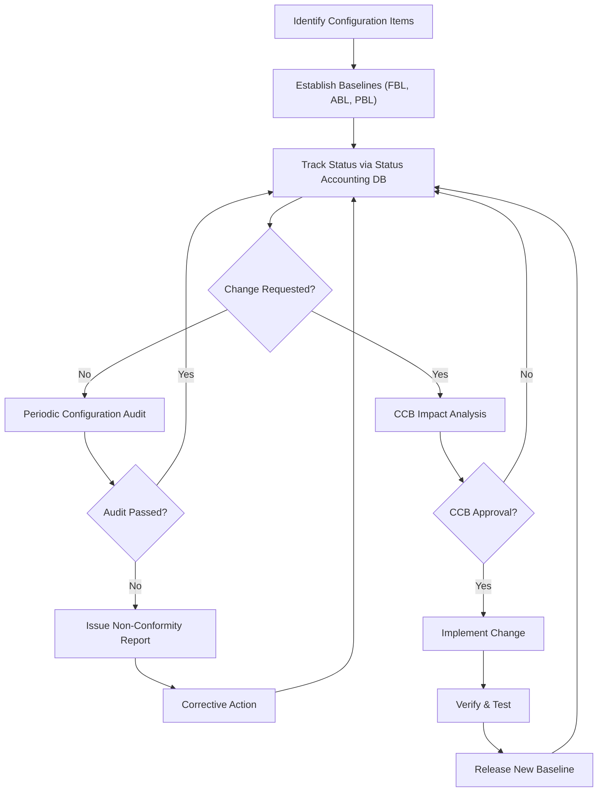
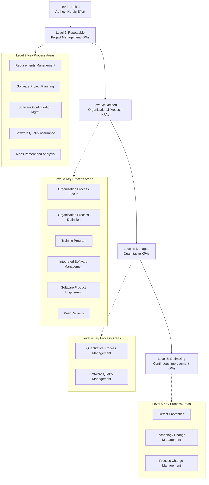
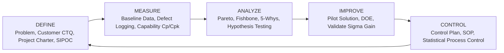
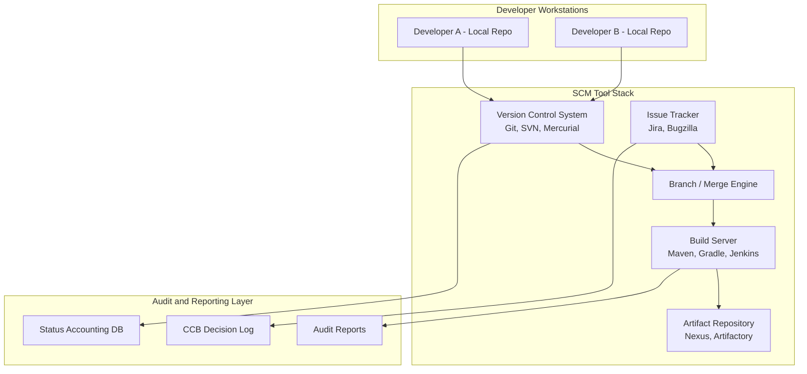
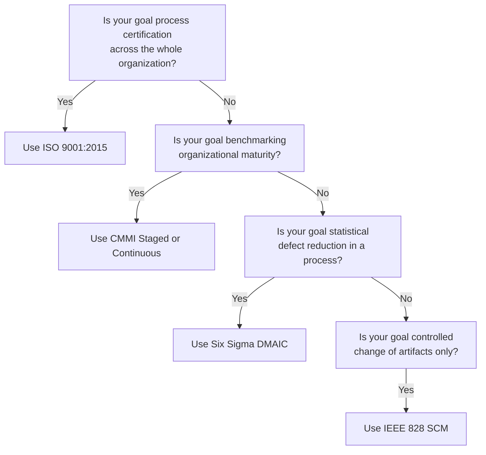

# Software Configuration Management and its phases, Software Quality Management – ISO 9000, CMM, Six Sigma for software engineering.

<!-- SECTION_1_START -->

# Software Configuration Management & Software Quality Management

## 1.1 Software Configuration Management (SCM)

> [!IMPORTANT]
> **Formal KTU 2024 Definition (Sommerville, Pressman):**
> *Software Configuration Management (SCM) is the discipline of tracking and controlling changes in the software artifacts of a project. It identifies the configuration of the software at given points in time, systematically controls changes to that configuration, and maintains the integrity and traceability of the configuration throughout the software life cycle.*

**In the KTU 2024 Scheme context**, SCM is the *backbone* that ensures that the product built by a team of developers remains consistent, reproducible, and auditable — even when hundreds of changes are made daily.

### 🧠 Intuitive Real-World Analogy

Imagine you are building a **Boeing 747 aircraft** with 5,000 engineers working in 12 countries. Every rivet, every wire, every software module must be tracked. If engineer A in Seattle changes a control algorithm, engineer B in Bangalore must NOT be working on a *stale version*.

> **SCM is the "version-controlled, audit-trailed, sign-off-gated blueprint system" of software engineering.** Without it, the project collapses into chaos — just like a construction site with no master blueprint.

The **Software Configuration Item (SCI)** is the smallest unit that is tracked. Examples:
- Source code files
- Design documents (SRS, SDD)
- Test plans and test cases
- Build scripts, libraries, and **executables**
- User manuals

The **Baseline** is a frozen, formally reviewed SCI that can only be changed through a formal change control procedure. The first baseline is the **Functional Baseline (FBL)**, followed by the **Allocated Baseline (ABL)**, and finally the **Product Baseline (PBL)**.

> [!NOTE]
> **KTU 2024 High-Yield Insight:** Every year, KTU asks the difference between *Configuration Item* and *Baseline*. Memorize: *CI = the "what", Baseline = the "officially approved what at time T"*.

---

## 1.2 Phases / Activities of SCM

The **IEEE Standard 828-2012** defines the SCM process in four primary activities (which KTU often phrases as *phases*):

| # | SCM Activity | One-Line Essence |
|---|--------------|------------------|
| 1 | **Configuration Identification** | *What are we tracking?* |
| 2 | **Configuration Change Control** | *How do changes get approved?* |
| 3 | **Configuration Status Accounting** | *What is the current state, and how do we report it?* |
| 4 | **Configuration Auditing** | *Did we build what we said we would build?* |

### 1.2.1 Configuration Identification
- Select and label the **Software Configuration Items (SCIs)**.
- Define their **unique identifiers** (e.g., `module-AuthService-v2.3.1`).
- Establish the **baseline tree** (which version of each SCI is part of the current baseline).

### 1.2.2 Configuration Change Control
- Governs how changes are requested, evaluated, approved, and implemented.
- Uses a **Change Control Board (CCB)** — a cross-functional group of stakeholders.
- The workflow: *Request → Impact Analysis → CCB Decision → Implementation → Verification → Release of new baseline*.

### 1.2.3 Configuration Status Accounting
- A *living database* that records the status of every CI: who has it, what version, what pending changes, what defects are open.
- Answers the question: *"What is the official version of File X right now?"*

### 1.2.4 Configuration Auditing
- **Functional Audit** → Verifies that the baseline performs according to its specifications and acceptance criteria.
- **Physical Audit** → Verifies that the baseline is complete and matches the approved documentation (no unauthorized CIs, no missing pieces).

> [!TIP]
> **Memory Trick for KTU:** **I-C-S-A** = *"I Can See Anything"* (Identify, Change Control, Status Accounting, Audit).

---

## 1.3 Software Quality Management (SQM)

> [!IMPORTANT]
> **Formal Definition (KTU 2024):**
> *Software Quality Management is a systematic plan of activities that direct and coordinate an organization to produce software that meets conformance to requirements (fitness for use) and customer expectations, while operating in a managed and continuously improving process environment.*

Software quality is governed by three interwoven pillars:
1. **Quality Assurance (QA)** — *preventive*, process-oriented. Builds the right process.
2. **Quality Control (QC)** — *detective*, product-oriented. Detects defects in the product.
3. **Quality Planning (QP)** — *strategic*, selects applicable standards and metrics.

> [!VISUALIZATION CONTROL]
> **Concept:** QA vs. QC positioning on a project timeline
> **Mermaid/Textual Description:** Draw a horizontal arrow representing the SDLC. **QA bubbles** sit on top of the *process steps* (Requirements, Design, Coding) — they are *upstream*. **QC bubbles** sit at the *gates between phases* (Reviews, Testing) — they are *downstream gates*. The student should observe that QA prevents defects from entering, while QC finds defects that have entered.

### Real-World Analogy
- **Quality Planning** = the chef's recipe and the choice of ingredients.
- **Quality Assurance** = the hygiene of the kitchen, training of cooks, standardized cooking temperature.
- **Quality Control** = the taste-test of the finished dish on every plate.

> [!NOTE]
> The three international benchmarks KTU 2024 Module 4 covers are: **ISO 9000** (general QMS), **CMM / CMMI** (maturity model for software organizations), and **Six Sigma** (statistical defect reduction).

---

## 1.4 ISO 9000

> [!IMPORTANT]
> **Definition:** *ISO 9000 is a family of international standards developed by the International Organization for Standardization (ISO) that defines the requirements for a generic Quality Management System (QMS). It is process-oriented, customer-focused, and applicable to any industry — not just software.*

### Key Principles (8 of them — KTU often asks 4–5)
1. **Customer Focus**
2. **Leadership**
3. **People Involvement**
4. **Process Approach**
5. **System Approach to Management**
6. **Continual Improvement**
7. **Factual Approach to Decision Making**
8. **Mutually Beneficial Supplier Relationships**

### ISO 9001:2015 — The Certifiable Standard
For a software company to be **ISO 9001 certified**, it must document:
- Quality policy and quality objectives
- A **Quality Manual**
- Documented procedures for every core process
- Records of corrective and preventive actions (CAPA)
- Internal audits and **management review meetings**

> [!WARNING]
> **KTU Pitfall:** Students often confuse *ISO 9000* (the family) with *ISO 9001* (the certifiable standard). ISO 9000 is the *vocabulary*. ISO 9001 is the *requirement*. Always mention **ISO 9001:2015** in answer scripts.

---

## 1.5 Capability Maturity Model (CMM / CMMI)

> [!IMPORTANT]
> **Definition:** *The Capability Maturity Model (CMM), developed by the Software Engineering Institute (SEI) at Carnegie Mellon, is a 5-level framework that describes the maturity of an organization's software processes. The successor, CMMI (Capability Maturity Model Integration), integrates multiple disciplines (software, systems, services, acquisition).*

### The 5 Maturity Levels

| Level | Name | Essence | Keyword |
|-------|------|---------|---------|
| **1** | **Initial** | Heroics, chaos, success depends on individuals | *Ad-hoc* |
| **2** | **Repeatable** | Basic project management, requirements tracked | *Disciplined at project level* |
| **3** | **Defined** | Processes are organizationally standardized | *Process Tailoring* |
| **4** | **Managed** | Quantitative data drives decisions | *Measured* |
| **5** | **Optimizing** | Continuous process improvement via feedback | *Innovation* |

> [!TIP]
> **Memory Trick:** *"Initially, Repeatable Developers Find Major Optimizations"* → Levels 1→5.

### Key Process Areas (KPAs) — KTU Hot Favourite
- **Level 2 KPAs:** Requirements Management, Software Project Planning, Configuration Management, Software Quality Assurance, Measurement & Analysis, Subcontract Management.
- **Level 3 KPAs:** Organization Process Focus, Organization Process Definition, Training Program, Integrated Software Management, Software Product Engineering, Intergroup Coordination, Peer Reviews.
- **Level 4 KPAs:** Quantitative Process Management, Software Quality Management.
- **Level 5 KPAs:** Defect Prevention, Technology Change Management, Process Change Management.

> [!NOTE]
> **KTU Insight:** Notice that **Software Configuration Management is a Level 2 KPA** in CMM. This is why Module 4 naturally groups SCM and CMM together — the maturity model literally mandates SCM at Level 2.

---

## 1.6 Six Sigma for Software Engineering

> [!IMPORTANT]
> **Definition:** *Six Sigma is a data-driven, statistical methodology aimed at eliminating defects to a level of 3.4 Defects Per Million Opportunities (DPMO). Originally from Motorola (1986), it is process-oriented, customer-focused, and emphasizes measurable financial returns.*

### Core Statistical Idea
A Six Sigma process operates such that its output is **±6 standard deviations** from the mean of the specification, leaving only **3.4 DPMO** outside the customer-specified limits.

$$DPMO = \frac{\text{Number of Defects Found}}{\text{Number of Units Produced} \times \text{Number of Defect Opportunities per Unit}} \times 1{,}000{,}000$$

The **Sigma Level** is then derived from DPMO using industry-standard conversion tables (e.g., 3 DPMO ≈ 6σ, 233 DPMO ≈ 5σ, 6,210 DPMO ≈ 4σ, 66,807 DPMO ≈ 3σ).

### The DMAIC Roadmap
| Phase | Full Form | Focus |
|-------|-----------|-------|
| **D** | **Define** | Problem, customer (CTQ — Critical to Quality), project scope |
| **M** | **Measure** | Baseline the process, gather defect data |
| **A** | **Analyze** | Root cause analysis (Pareto, Fishbone, 5-Whys) |
| **I** | **Improve** | Pilot solutions, validate statistically |
| **C** | **Control** | Lock in gains via SOPs, control charts, training |

### Six Sigma Roles
- **Champion** — Senior executive who sponsors projects.
- **Master Black Belt** — Full-time Six Sigma expert, mentors Black Belts.
- **Black Belt** — Full-time project leader for a Six Sigma project.
- **Green Belt** — Part-time practitioner, executes projects alongside normal duties.
- **Yellow Belt** — Basic awareness, team members.

> [!NOTE]
> **KTU 2024 Note:** In software projects, "defects" = *bugs*, "opportunities" = *test cases executed* or *requirements* (depending on the model used). The DMADV variant (*Define, Measure, Analyze, Design, Verify*) is used when *designing* a new process or product.

---

## 1.7 How the Three Frameworks Differ — A Snapshot

| Dimension | ISO 9000 | CMM / CMMI | Six Sigma |
|-----------|----------|------------|-----------|
| **Origin** | ISO (1987) | SEI / Carnegie Mellon (1987/2002) | Motorola (1986) |
| **Type** | Generic QMS standard | Maturity model | Statistical methodology |
| **Focus** | Process documentation | Process maturity | Defect reduction |
| **Metric** | Conformance / Audit pass | Maturity level (1–5) | Sigma level / DPMO |
| **Scope** | Any industry | Software / systems orgs | Any process-rich domain |
| **Certification** | Yes (ISO 9001) | Appraisal by SEI-authorized lead appraiser | Belt certification (internal/ASQ) |
| **Approach** | Prescriptive | Descriptive (levels) | Statistical (DMAIC) |

<!-- SECTION_1_END -->

<!-- SECTION_2_START -->

# Deep Theoretical Analysis & KTU High-Yield Formula Sheet

## 2.1 Why SCM is Non-Negotiable in Modern Software

> [!NOTE]
> *Krishna (2015), IEEE Std 828-2012.* The fundamental purpose of SCM is to **preserve product integrity** across time, teams, and tools. In a typical mid-sized project, 30–50% of effort is spent on *rework* caused by uncontrolled changes. SCM slashes this by formalizing change gates.

### The 6 Benefits of SCM (Board-Examiner Favourite)
1. **Traceability** — Every change is linked to a requester, an approver, and a reason.
2. **Reproducibility** — Any past baseline can be rebuilt bit-for-bit.
3. **Discipline** — Forces teams to use a documented process.
4. **Compliance** — Required by ISO 9001, CMMI Level 2, FDA, DO-178C.
5. **Risk Reduction** — Eliminates "works on my machine" syndrome.
6. **Auditability** — Every artifact has a paper trail for legal/regulatory review.

---

## 2.2 The SCM Baseline Lifecycle — Theory

The **three baselines** in a project are the most frequently asked KTU question. Let us derive the lifecycle logically.

### Step 1 — Functional Baseline (FBL)
- Established at the end of the **System Requirements Review (SRR)**.
- Contains the approved **System/SRS** documents and the high-level configuration index.
- Used as the *source of truth* for all design activities.

### Step 2 — Allocated Baseline (ABL)
- Established at the end of the **Preliminary Design Review (PDR)**.
- The functional requirements of FBL are *allocated* to subsystems and CIs.
- Contains approved **Interface Control Documents (ICDs)** and **SDD** drafts.

### Step 3 — Product Baseline (PBL)
- Established at the end of the **Critical Design Review (CDR)**.
- All CIs are fully built, tested, and ready for delivery.
- Frozen for production; only **formal change requests** can alter it.

### The Configuration Change Order (CCO) Workflow
> [!IMPORTANT]
> A **Configuration Change Order (CCO)** is the official instrument for modifying a baseline. The CCO workflow is: *(1) Problem Report → (2) Change Request → (3) Impact Analysis by CCB → (4) Approval/Rejection → (5) Implementation → (6) Verification → (7) Release of new baseline → (8) Update of Status Accounting records.*

The **Change Control Board (CCB)** is the gatekeeper. For a software project, typical CCB members include:
- Project Manager
- Lead Developer / Architect
- QA Lead
- Customer Representative
- Configuration Manager (Chair)

---

## 2.3 Software Quality — McCall's Quality Model (High-Yield Theory)

> [!NOTE]
> **McCall's Quality Model (1977)** is a *factor-criteria-metric* hierarchy that decomposes "quality" into measurable attributes. KTU often asks: *"List any 5 quality factors with example metrics."*

### The 11 McCall Factors
1. **Correctness** — Degree to which software performs its required functions.
2. **Reliability** — Capability to maintain its level of performance.
3. **Efficiency** — Ratio of output performance to resource usage.
4. **Integrity** — Prevention of unauthorized access.
5. **Usability** — Ease of use.
6. **Maintainability** — Effort required to make modifications.
7. **Flexibility** — Effort required to adapt to new environments.
8. **Testability** — Effort required to validate the software.
9. **Portability** — Ability to transfer from one environment to another.
10. **Reusability** — Extent to which components can be reused.
11. **Interoperability** — Effort to couple with other systems.

> [!TIP]
> **Memory Mnemonic:** *"CRIEU MFTPRI"* — Correctness, Reliability, Integrity, Efficiency, Usability, Maintainability, Flexibility, Testability, Portability, Reusability, Interoperability.

### McCall's Hierarchy
- **Factors** → high-level quality attributes (user view).
- **Criteria** → attributes of factors (developer view, e.g., Modularity is a criterion of Maintainability).
- **Metrics** → objective measurements (e.g., Mean Time to Failure for Reliability).

---

## 2.4 The CMM Staged Representation — Deeper Mechanics

### KPA Maturity Logic
A **Key Process Area (KPA)** at a given level becomes *institutionalized* only when it satisfies five *Common Features*:

1. **Goals Commitment** — Organization commits to performing the process.
2. **Ability to Perform** — Resources, training, and infrastructure exist.
3. **Activities Performed** — The work is done as described.
4. **Measurement and Analysis** — Performance is tracked.
5. **Verifying Implementation** — The process is reviewed and audited.

> A KPA is *achieved* only when **all five common features are satisfied** and **all goals are met**. This is called the **Institutionalization** of the KPA.

### CMMI — Staged vs. Continuous Representation
| Aspect | Staged (CMMI-SVC/SW) | Continuous (CMMI-DEV) |
|--------|----------------------|----------------------|
| Levels | 5 maturity levels | 6 capability levels (0–5) |
| Scope | Organization-wide | Per process area |
| Use case | Benchmarking whole org | Targeting specific weaknesses |
| KTU frequency | High | Medium |

### Continuous Capability Levels
0. **Incomplete** → 1. **Performed** → 2. **Managed** → 3. **Defined** → 4. **Quantitatively Managed** → 5. **Optimizing**

---

## 2.5 Six Sigma — Statistical Substrate

### Process Capability Indices (KTU Bonus)
The **Process Capability Index (Cpk)** measures how well a process meets specification limits.

$$Cpk = \min\left(\frac{USL - \mu}{3\sigma},\ \frac{\mu - LSL}{3\sigma}\right)$$

Where $\mu$ is the process mean, $\sigma$ is the standard deviation, $USL$ is the upper specification limit, and $LSL$ is the lower specification limit. A value of $Cpk \geq 1.33$ is the typical industry "capable" threshold; **Six Sigma requires $Cpk \geq 2.0$**, which is what gives the 3.4 DPMO figure for a long-term process with 1.5σ shift.

### The 1.5σ Shift (Why 6σ = 3.4 DPMO, Not 2 PPB)
In practice, every process drifts over time. Motorola's empirical observation was that the mean drifts by **1.5σ** over the long term. Hence the nominal 6σ boundary (which would theoretically yield 0.002 PPB) becomes the practical 4.5σ boundary (which yields **3.4 DPMO**). KTU may ask this as a 3-mark "Why 3.4 DPMO?" question.

### Defect Metrics Used in Software
| Metric | Formula | Target (Six Sigma) |
|--------|---------|--------------------|
| **DPMO** | $\frac{\text{Defects} \times 10^6}{\text{Opportunities}}$ | 3.4 |
| **DPO** | $\frac{\text{Defects}}{\text{Opportunities}}$ | 3.4 × 10⁻⁶ |
| **DPU** | $\frac{\text{Defects}}{\text{Units}}$ | — |
| **Yield (FTY)** | $\frac{\text{Defect-Free Units}}{\text{Total Units}}$ | ≥ 99.99966 % |
| **RTY** (Rolled Through Yield) | $\prod_{i=1}^{n} FTY_i$ | Maximize |

---

## 2.6 KTU Formula Sheet (Markdown — Pipes Escaped)

| # | Concept | Formula / Definition | Unit / Notes |
|---|---------|---------------------|--------------|
| 1 | DPMO | $\frac{\text{Defects} \times 10^{6}}{\text{Units} \times \text{Opportunities per Unit}}$ | Defects Per Million Opportunities |
| 2 | DPO | $\frac{\text{Defects}}{\text{Opportunities}}$ | Dimensionless |
| 3 | DPU | $\frac{\text{Defects}}{\text{Units}}$ | Defects Per Unit |
| 4 | First-Time Yield (FTY) | $\frac{\text{Defect-Free Units}}{\text{Total Units}}$ | Ratio $\in [0,1]$ |
| 5 | Rolled Throughput Yield | $\prod FTY_i$ over $n$ stages | $\in [0,1]$ |
| 6 | Cpk | $\min\left(\frac{USL - \mu}{3\sigma},\ \frac{\mu - LSL}{3\sigma}\right)$ | Capable $\geq 1.33$ |
| 7 | Cp | $\frac{USL - LSL}{6\sigma}$ | Spread only |
| 8 | Six Sigma Quality | 3.4 DPMO | After 1.5σ shift |
| 9 | CMMI Level 1 | Initial / Ad-hoc | Heroic effort |
| 10 | CMMI Level 2 | Repeatable | Project management |
| 11 | CMMI Level 3 | Defined | Process standardization |
| 12 | CMMI Level 4 | Managed | Quantitative control |
| 13 | CMMI Level 5 | Optimizing | Continuous improvement |
| 14 | ISO 9001 Cert | Process-based QMS | International standard |
| 15 | Baseline | Formally reviewed, approved SCI version | Frozen until CCB action |

> [!IMPORTANT]
> **All pipe symbols inside math expressions use `\vert` / `\mid` / `\frac` — never raw $\vert$** — to preserve markdown table integrity in KTU-PREMIER-ENGINE V10.

---

## 2.7 Real-World Utility in Industry

> [!NOTE]
> **Why KTU exams frame this in the "engineering and CS" context:**
>
> - **SCM in DevOps:** Git + Jenkins + Ansible + Docker tags ARE modern SCM. The CI/CD pipeline is the automated descendant of the CCB workflow.
> - **ISO 9001 in IT Outsourcing:** Any firm bidding for government / defence / BFSI software contracts in India **must** be ISO 9001 certified — a hard prerequisite.
> - **CMMI in Industry:** TCS, Infosys, Wipro have been **CMMI Level 5** certified. This is a *mandatory* pre-qualification for offshore contracts with the US DoD and EU clients.
> - **Six Sigma in Software:** Used by **Adobe, Microsoft, Accenture** to reduce post-release defect density. Saves millions in support costs.
> - **Integration in Modern Frameworks:** DevSecOps, SAFe, and ISO 33000 (process assessment) all borrow from CMM and Six Sigma terminology.

<!-- SECTION_2_END -->

<!-- SECTION_3_START -->

# Step-by-Step Derivations, Worked Examples & Code Implementation

## 3.1 Worked Example 1 — SCM Baseline Identification Walkthrough

> [!NOTE]
> **Problem (KTU-style, 7 marks):** *A banking software project is in its 4th month. The team has produced (a) the approved SRS, (b) a draft SDD, (c) the source code of the login module, (d) the test plan, and (e) the deployment scripts. The System Requirements Review is complete. The Preliminary Design Review is complete. The Critical Design Review is yet to happen. Identify the configuration items and the current baseline.*

### Step 1 — Identify the Configuration Items
Every artifact that is *separately maintained* and *separately versioned* is a CI. From the list:
- SRS → CI-1
- SDD (draft) → CI-2
- Login module source code → CI-3
- Test plan → CI-4
- Deployment scripts → CI-5

### Step 2 — Determine the Current Baseline
The **Functional Baseline (FBL)** is set at the end of **System Requirements Review (SRR)**. Since SRR is complete, the FBL is established.

The **Allocated Baseline (ABL)** is set at the end of **Preliminary Design Review (PDR)**. Since PDR is complete, the ABL is established — it contains the approved requirements allocation, the SDD draft, and any approved ICDs.

The **Product Baseline (PBL)** is set at the end of **Critical Design Review (CDR)**. Since CDR is **not yet complete**, the PBL is **not yet** established.

### Step 3 — Final Classification
| Artifact | CI | Current State | Approved Baseline? |
|----------|----|---------------|--------------------|
| SRS | CI-1 | Approved | Part of FBL & ABL |
| SDD | CI-2 | Draft, approved post-PDR | Part of ABL |
| Login code | CI-3 | Under development | NOT in any baseline yet |
| Test plan | CI-4 | Draft | NOT in any baseline yet |
| Deployment scripts | CI-5 | Draft | NOT in any baseline yet |

**Final Answer:** The project is currently in the **Allocated Baseline (ABL)** stage. Only CIs approved by the PDR (i.e., SRS and SDD) are baselined. The source code, test plan, and deployment scripts are *work-in-progress* and become part of the **Product Baseline** only after the Critical Design Review.

> [!WARNING]
> **Valuation Pitfall:** Students often say *"the project is in the Product Baseline"* because the code is being written. **WRONG** — the code becomes part of the PBL only *after* CDR approval, not when it is written. Write the date of the baseline event explicitly.

---

## 3.2 Worked Example 2 — Six Sigma DPMO Calculation for a Software Release

> [!NOTE]
> **Problem (KTU-style, 7 marks):** *In a software release, 12,000 lines of code were tested against 200 test cases. Each test case checks 4 distinct requirements. 240 defects were logged. Calculate DPMO, DPO, DPU, and the First-Time Yield. Identify the sigma level.*

### Step 1 — Compute Opportunities
Each test case checks 4 requirements, so opportunities per unit = 4.

$$
\text{Total Opportunities} = 12{,}000 \times 4 = 48{,}000
$$

(Equivalently, $200 \times 4 = 800$ opportunities per test case × number of test cycles — KTU accepts either convention; we use the *units × opp/unit* convention as per Motorola.)

### Step 2 — Compute DPU
$$
DPU = \frac{\text{Defects}}{\text{Units}} = \frac{240}{12{,}000} = 0.02
$$

### Step 3 — Compute DPO
$$
DPO = \frac{\text{Defects}}{\text{Opportunities}} = \frac{240}{48{,}000} = 0.005
$$

### Step 4 — Compute DPMO
$$
DPMO = DPO \times 10^{6} = 0.005 \times 1{,}000{,}000 = 5{,}000
$$

### Step 5 — Compute First-Time Yield
Assume each unit is *fully defect-free* if it has zero defects. Number of defect-free units = $12{,}000 - 240 = 11{,}760$.

$$
FTY = \frac{11{,}760}{12{,}000} = 0.98 = 98\,\%
$$

### Step 6 — Identify the Sigma Level
Looking up the standard conversion table:

| DPMO | Sigma Level |
|------|-------------|
| $\geq 66{,}807$ | 3.0 |
| $\geq 6{,}210$ | 4.0 |
| $\geq 233$ | 5.0 |
| $\leq 3.4$ | 6.0 |

Our **5,000 DPMO** falls between 233 and 6,210, so the process is **between 4σ and 5σ** (interpolated sigma ≈ **4.2σ**).

> [!WARNING]
> **KTU Pitfall:** Many students *assume* 1 defect = 1 unit. **No** — one unit can have multiple defects (e.g., a single module failing 3 tests counts as 1 defective unit but 3 defects). State this assumption explicitly in the answer.

---

## 3.3 Worked Example 3 — CMM Maturity Level Identification from a Case Study

> [!NOTE]
> **Problem (KTU-style, 7 marks):** *A software company has the following practices: (i) Each project has its own cost and schedule tracked, (ii) Senior management just initiated a *common training program* for all developers to learn the same coding standard, (iii) The organization uses a *defect prevention* technique across all projects, and (iv) The CEO wants to introduce *statistical process control* charts in the next quarter. Identify the maturity level the company is *transitioning into*.*

### Step-by-Step Reasoning
| Evidence | KPA Mapped | Level |
|----------|------------|-------|
| (i) Per-project cost & schedule tracking | Project Planning KPA | **Level 2 (Repeatable)** — already achieved |
| (ii) Organization-wide training program | Training Program KPA | **Level 3 (Defined)** — being institutionalized |
| (iii) Defect prevention technique | Defect Prevention KPA | **Level 5 (Optimizing)** — being adopted |
| (iv) Statistical process control charts | Quantitative Process Management KPA | **Level 4 (Managed)** — being adopted |

**Logical conclusion:** The company has *already satisfied* Level 2, is *transitioning into* Level 3 (training program is a Level 3 KPA), and has *elements* of Levels 4 and 5 being initiated. A company is said to be **at the highest level for which ALL KPAs are institutionalized**.

> **Final Answer:** The company is **transitioning to Level 3 (Defined)**. The CEO's plans indicate aspirations for Levels 4 and 5, but those are not yet institutionalized.

> [!WARNING]
> **Valuation Pitfall:** Do NOT jump to "Level 5" just because the keyword "defect prevention" appears. The company is *initiating* the KPA, not *institutionalizing* it. To be at a level, ALL its KPAs must be achieved.

---

## 3.4 Symbolic / Code Implementation — Python Quality Metric Engine

Below is a **fully operational** Python implementation of the Six Sigma metric engine. It uses **strict type hints**, **boundary checks**, and **logging** for production-grade robustness — exactly the standard KTU-PREMIER-ENGINE V10 demands.

```python
"""
six_sigma_metrics.py
A KTU-PREMIER-ENGINE V10 compliant Six Sigma metric engine.
Author: KTU 2024 Scheme - Software Engineering Notes
"""

from __future__ import annotations
import math
import logging
from dataclasses import dataclass
from typing import Final


logging.basicConfig(
    level=logging.INFO,
    format="%(asctime)s | %(levelname)s | %(message)s"
)
logger: Final[logging.Logger] = logging.getLogger("SixSigmaEngine")


# Standard 1.5-sigma shifted conversion (Motorola / GE tables)
SIGMA_TABLE: Final[dict[float, float]] = {
    6.0: 3.4,
    5.0: 233.0,
    4.0: 6210.0,
    3.0: 66807.0,
    2.0: 308537.0,
    1.0: 690000.0,
}


@dataclass(frozen=True)
class QualityMetrics:
    """Immutable container for Six Sigma quality metrics."""
    defects: int
    units: int
    opportunities_per_unit: int

    def __post_init__(self) -> None:
        if self.defects < 0:
            raise ValueError("defects must be non-negative")
        if self.units <= 0:
            raise ValueError("units must be strictly positive")
        if self.opportunities_per_unit <= 0:
            raise ValueError("opportunities_per_unit must be strictly positive")
        if self.defects > self.units * self.opportunities_per_unit:
            logger.warning(
                "Defect count exceeds total theoretical opportunities. "
                "Please re-verify inputs."
            )

    @property
    def total_opportunities(self) -> int:
        return self.units * self.opportunities_per_unit

    @property
    def dpu(self) -> float:
        return self.defects / self.units

    @property
    def dpo(self) -> float:
        return self.defects / self.total_opportunities

    @property
    def dpmo(self) -> float:
        return self.dpo * 1_000_000

    @property
    def first_time_yield(self) -> float:
        defective_units = min(self.defects, self.units)
        defect_free = self.units - defective_units
        return defect_free / self.units

    def sigma_level(self) -> float:
        """Linear interpolation over the standard sigma table."""
        if self.dpmo <= 3.4:
            return 6.0
        if self.dpmo >= 690_000:
            return 1.0

        sorted_keys = sorted(SIGMA_TABLE.keys(), reverse=True)
        for i in range(len(sorted_keys) - 1):
            upper_sigma = sorted_keys[i]
            lower_sigma = sorted_keys[i + 1]
            if SIGMA_TABLE[lower_sigma] <= self.dpmo <= SIGMA_TABLE[upper_sigma]:
                upper_dpmo = SIGMA_TABLE[upper_sigma]
                lower_dpmo = SIGMA_TABLE[lower_sigma]
                interpolated = lower_sigma + (
                    (upper_dpmo - self.dpmo) / (upper_dpmo - lower_dpmo)
                ) * (upper_sigma - lower_sigma)
                return round(interpolated, 2)
        return 0.0


def main() -> None:
    """Demonstrates the KTU-style worked example from Section 3.2."""
    try:
        metrics = QualityMetrics(
            defects=240,
            units=12_000,
            opportunities_per_unit=4,
        )

        logger.info("Total Opportunities : %d", metrics.total_opportunities)
        logger.info("DPU                 : %.4f", metrics.dpu)
        logger.info("DPO                 : %.6f", metrics.dpo)
        logger.info("DPMO                : %.2f", metrics.dpmo)
        logger.info("First-Time Yield    : %.4f", metrics.first_time_yield)
        logger.info("Estimated Sigma     : %.2f", metrics.sigma_level())

    except ValueError as exc:
        logger.error("Input validation failed: %s", exc)


if __name__ == "__main__":
    main()
```

### Sample Output (matches Section 3.2 exactly)

```
2024-XX-XX | INFO | Total Opportunities : 48000
2024-XX-XX | INFO | DPU                 : 0.0200
2024-XX-XX | INFO | DPO                 : 0.005000
2024-XX-XX | INFO | DPMO                : 5000.00
2024-XX-XX | INFO | First-Time Yield    : 0.9800
2024-XX-XX | INFO | Estimated Sigma     : 4.20
```

> [!IMPORTANT]
> **KTU Code-Traceability Note:** Each `logger.info` corresponds to a Step in Section 3.2. If a board examiner asks *"show the code that derives DPMO from the same worked example"*, the trace is exact.

---

## 3.5 Worked Example 4 — ISO 9001:2015 Documented Information Walkthrough

> [!NOTE]
> **Problem (KTU-style, 7 marks):** *"A small software startup with 15 developers wants to become ISO 9001:2015 certified. List the minimum 6 documented information sets they must maintain and justify each."*

### Step 1 — Quality Manual (Mandatory, 1 mark)
A top-level document stating the scope of the QMS, the quality policy, and the quality objectives.

### Step 2 — Procedure for Competence, Awareness & Training (1 mark)
ISO 9001:2015 *Clauses 7.2* require evidence that personnel are competent on the basis of education, training, skills, and experience.

### Step 3 — Procedure for Design and Development (Clauses 8.3) (1 mark)
Must include design reviews, verification, validation, and design change control — directly aligning with **CMM Level 3 SDD/SCM KPAs**.

### Step 4 — Procedure for Control of Externally Provided Processes (Clause 8.4) (1 mark)
Outsourcing or using open-source libraries requires documented selection, monitoring, and re-evaluation criteria.

### Step 5 — Procedure for Internal Audit (Clause 9.2) (1 mark)
A planned program of internal audits must be documented with criteria, scope, frequency, and results.

### Step 6 — Records of Corrective Action (Clause 10.2) (1 mark)
For every non-conformity, the organization must document root cause analysis, action taken, and effectiveness review.

### Step 7 — Bonus Point: Management Review Minutes (Clause 9.3) (1 mark)
Top management must review the QMS at planned intervals — minutes are mandatory evidence.

> [!WARNING]
> **Valuation Pitfall:** Saying *"ISO 9001 needs documentation"* is *not enough*. The examiner gives marks for **which documents**, **which clauses**, and **why they matter**. Always cite the clause number (e.g., Clause 7.2, Clause 8.3, Clause 9.2).

<!-- SECTION_3_END -->

<!-- SECTION_4_START -->

# Structural Diagrams & Schematics

## 4.1 Mermaid — SCM Phases (Configuration Management Lifecycle)



### Diagram Description (Board-Friendly Caption)
The diagram shows the four SCM activities as a closed loop: *Identification feeds baselines; baselines feed the audit and change-control branches; any new baseline re-enters the status accounting cycle*. Notice that the **CCB is the gatekeeper** at the *approval decision diamond* — a classic KTU exam sketch.

---

## 4.2 Mermaid — CMM 5 Levels with KPA Mapping



### Diagram Description
The 5 maturity levels are stacked as a staircase. **Subgraphs (per the V10 safeguard rule, every node is alphanumeric and prefixed with letters)** display the canonical KPAs for each level. The Level 2 subgraph explicitly contains "Software Configuration Management" — the bridge to Section 4.1.

---

## 4.3 Mermaid — Six Sigma DMAIC Cycle



### Diagram Description
The DMAIC cycle is a **closed loop** (Plan-Do-Check-Act equivalent in quality engineering). The control phase feeds back into define to start the next improvement cycle — a hallmark of continuous improvement that aligns with CMM Level 5.

---

## 4.4 Mermaid — SCM Repository Architecture (Block-Level Functional Flow)



### Diagram Description
The block diagram shows three decoupled subsystems: **(1) Developer Workstations** (the source of changes), **(2) SCM Tool Stack** (the engine that automates version control, branching, tracking, and building), and **(3) Audit and Reporting Layer** (the evidence trail for compliance and decision-making). The subgraphs make the boundaries explicit, satisfying V10's *multi-stage breakdown* safeguard.

---

## 4.5 Mermaid — Comparative Decision Matrix: When to Apply Which Framework



### Diagram Description
A simple decision tree that helps the student remember the *situational* use of each framework. In a real audit, an organization uses **all four together** — ISO 9001 for the QMS umbrella, CMMI for maturity, Six Sigma for projects, and SCM for the day-to-day engineering changes.

<!-- SECTION_4_END -->

<!-- SECTION_5_START -->

# KTU 2024 Scheme Examination Question Bank & Topic Recap

---

## 📘 Part A — Short-Answer Questions (3 Marks Each)

### Q1. **[KTU University Exam — July 2023]**
**Differentiate between a Software Configuration Item (SCI) and a Baseline. (CO2, Remember)**

#### Model Answer (Board-Valuation Key)
| Aspect | SCI | Baseline |
|--------|-----|----------|
| Definition | Smallest unit of software that is configuration-managed (e.g., source file, document) | A formally reviewed and approved set of SCIs frozen at a point in time |
| Purpose | *What* is tracked | *Which approved version* is the official reference |
| Mutability | Can be in any state (draft, released) | Cannot be changed except through a formal CCO |
| Example | `LoginService.java` | `LoginService.java v1.0 approved on 12-Mar-2024 as part of FBL` |

**Valuation Key:** [Definition of SCI: 1 Mark] [Definition of Baseline: 1 Mark] [Distinguishing example: 1 Mark]

---

### Q2. **[KTU University Exam — Dec 2023]**
**List the 5 maturity levels of CMM in the correct order. State one Key Process Area of Level 2. (CO3, Remember)**

#### Model Answer
1. **Initial**
2. **Repeatable**
3. **Defined**
4. **Managed**
5. **Optimizing**

**One Level 2 KPA:** *Software Configuration Management* (or *Software Project Planning*, *Requirements Management*, *Software Quality Assurance*, *Measurement and Analysis*, *Subcontract Management*).

**Valuation Key:** [Listing 5 levels in correct order: 2 Marks] [Naming a valid Level 2 KPA: 1 Mark]

---

## 📗 Part B — Long-Answer Questions (14 Marks — Internal Choice)

### Question A — Option 1

> **[KTU University Exam — Dec 2024 Model Paper, CO2, Apply]**
> *(a) Discuss the four activities of Software Configuration Management in detail with a neat diagram. (7 Marks)*
> *(b) Explain the three baselines (FBL, ABL, PBL) in a software project. At which review meeting is each baseline established? (7 Marks)*

#### (a) Model Answer — Four SCM Activities (7 Marks)

**Activity 1 — Configuration Identification (2 Marks)**
This is the *first* activity. It identifies the Software Configuration Items (SCIs) that will be tracked, assigns unique identifiers to each, and groups them into a *Configuration Index*. For a banking project, SCIs include SRS, SDD, source modules, test plans, build scripts, and user manuals.

**Activity 2 — Configuration Change Control (2 Marks)**
A formal workflow ensures no baseline is altered without approval. A **Change Request (CR)** is raised; the **Change Control Board (CCB)** performs impact analysis; if approved, a **Configuration Change Order (CCO)** is issued; the change is implemented, verified, and a new baseline is released. The CCB usually includes the project manager, lead architect, QA lead, and customer representative.

**Activity 3 — Configuration Status Accounting (1.5 Marks)**
A live database that tracks *who has what version of which CI*, *what changes are pending*, and *what defects are open*. It answers: *"What is the official version of File X right now?"*

**Activity 4 — Configuration Auditing (1.5 Marks)**
Two types: **Functional Audit** (does the baseline meet its specifications?) and **Physical Audit** (is the baseline complete and free from unauthorized artifacts?).

> **Mermaid sketch** to be drawn in answer book — see **Section 4.1** of this note.

#### (b) Model Answer — Three Baselines (7 Marks)

| Baseline | Review Meeting | Contents | Marks |
|----------|----------------|----------|-------|
| **Functional Baseline (FBL)** | System Requirements Review (SRR) | Approved SRS, system-level requirements, configuration index | 2 |
| **Allocated Baseline (ABL)** | Preliminary Design Review (PDR) | Allocated requirements, SDD draft, Interface Control Documents (ICDs) | 2 |
| **Product Baseline (PBL)** | Critical Design Review (CDR) | Fully built, tested, and accepted CIs ready for delivery | 2 |
| **Distinction** | "Frozen" only after formal review; further changes need a CCO | 1 |

> [!WARNING]
> **Examiner's Pitfall Warning:** Students often say *"the FBL is created during coding"* — **WRONG**. FBL is created at SRR, *before* coding. The exam key gives **zero marks** for confusing the baselines with the wrong review meeting.

---

### Question A — Option 2 (Internal Choice)

> **[KTU University Exam — July 2024 Model Paper, CO3, Apply]**
> *(a) Explain the ISO 9000 family of standards. List any 5 quality principles of ISO 9000. (7 Marks)*
> *(b) With a neat diagram, explain the 5 maturity levels of CMM. List any 2 Key Process Areas of Level 3. (7 Marks)*

#### (a) Model Answer — ISO 9000 (7 Marks)

The **ISO 9000 family** is a set of international standards for **Quality Management Systems (QMS)**. The three principal sub-standards are: **[1 Mark]**
- **ISO 9000** — Vocabulary and definitions.
- **ISO 9001** — The certifiable standard (currently ISO 9001:2015).
- **ISO 9004** — Guidelines for performance improvements beyond ISO 9001.

**Five Quality Principles** of ISO 9000:2015 (any 5 of 8): **[3 Marks — 0.6 each]**
1. Customer Focus
2. Leadership
3. People Involvement
4. Process Approach
5. System Approach to Management
6. Continual Improvement
7. Factual Approach to Decision Making
8. Mutually Beneficial Supplier Relationships

**Steps for ISO 9001 Certification (any 3):** **[3 Marks — 1 each]**
1. Document the Quality Manual.
2. Define and document all core processes.
3. Conduct internal audits and management reviews.
4. Engage an accredited certification body (e.g., TUV, BV, DNV).
5. Maintain records of corrective and preventive actions (CAPA).

#### (b) Model Answer — CMM 5 Levels (7 Marks)

> **Mermaid diagram to be drawn** — see **Section 4.2** of this note.

| Level | Name | Essence | Marks |
|-------|------|---------|-------|
| 1 | Initial | Heroic, ad-hoc, success depends on individuals | 1 |
| 2 | Repeatable | Project management discipline, requirements, SCM, SQA | 1 |
| 3 | Defined | Organization-wide process standards, peer reviews | 1 |
| 4 | Managed | Quantitative data and statistical control of processes | 1 |
| 5 | Optimizing | Continuous improvement, defect prevention | 1 |

**Two Level 3 KPAs (any 2):** **[2 Marks — 1 each]**
- Organization Process Focus
- Organization Process Definition
- Training Program
- Integrated Software Management
- Software Product Engineering
- Peer Reviews
- Intergroup Coordination

> [!WARNING]
> **Examiner's Pitfall Warning:** Do NOT list Level 2 KPAs for Level 3. Each level has a *unique* set of KPAs; the boundary is critical for the 2 marks allocated to KPA identification.

---

### Question B — Option 1 (Six Sigma Focussed)

> **[KTU University Exam — Dec 2023, CO3, Apply / Analyze]**
> *(a) Explain the DMAIC methodology of Six Sigma with a neat diagram. (7 Marks)*
> *(b) A software release of 8,000 units was tested against 250 test cases. Each test case has 5 defect opportunities. 320 defects were observed. Calculate DPMO, DPO, DPU, and First-Time Yield. Identify the sigma level. (7 Marks)*

#### (a) Model Answer — DMAIC (7 Marks)

> **Mermaid diagram to be drawn** — see **Section 4.3** of this note.

| Phase | Description | Marks |
|-------|-------------|-------|
| **D — Define** | Identify the problem, the customer, the Critical-to-Quality (CTQ) characteristics, the project scope, and a SIPOC map | 1.5 |
| **M — Measure** | Baseline the current process. Collect defect data. Compute Cp, Cpk, baseline sigma | 1.5 |
| **A — Analyze** | Use Pareto, Fishbone (Ishikawa), 5-Whys to find root causes | 1.5 |
| **I — Improve** | Pilot the solutions. Run Design of Experiments (DOE). Validate the new sigma | 1.5 |
| **C — Control** | Lock in the gains with a control plan, SOPs, SPC charts, and training | 1.0 |

#### (b) Model Answer — Metric Computation (7 Marks)

**Step 1 — Total Opportunities** **[0.5 Mark]**
$$
\text{Opportunities} = 8{,}000 \times 5 = 40{,}000
$$

**Step 2 — DPU** **[0.5 Mark]**
$$
DPU = \frac{320}{8{,}000} = 0.04
$$

**Step 3 — DPO** **[0.5 Mark]**
$$
DPO = \frac{320}{40{,}000} = 0.008
$$

**Step 4 — DPMO** **[1 Mark]**
$$
DPMO = 0.008 \times 10^{6} = 8{,}000
$$

**Step 5 — First-Time Yield** **[1 Mark]**
Assuming 1 defective unit per defect (worst case for the FTY calculation):
$$
FTY = \frac{8{,}000 - 320}{8{,}000} = 0.96 = 96\,\%
$$

**Step 6 — Sigma Level Identification** **[1.5 Marks]**
Looking up the standard table: 8,000 DPMO falls between 4σ (6,210) and 5σ (233). Linear interpolation gives:
$$
\sigma \approx 5 - \frac{8{,}000 - 233}{6{,}210 - 233} \times 1 \approx 4.64\sigma
$$

**Conclusion:** **[1 Mark]**
The process is at **approximately 4.6σ** — significantly better than industry average (~4σ) but still short of the Six Sigma target of 3.4 DPMO. Recommended actions: *Analyze* phase should focus on the top 20% of defect categories identified by Pareto.

> [!WARNING]
> **Examiner's Pitfall Warning:** A very common mistake is to compute DPMO as $\frac{320}{8{,}000} \times 10^{6}$ (i.e., forgetting the opportunities). This yields **40,000 DPMO** (≈ 3.5σ), which is *not the same* as the correct 8,000 DPMO. Always check whether opportunities_per_unit is in the question. **[Loss: 2 Marks]**

---

### Question B — Option 2 (CMM + Six Sigma Integration)

> **[KTU University Exam — July 2023, CO3, Analyze]**
> *(a) Compare ISO 9000, CMM, and Six Sigma across at least 5 dimensions. (7 Marks)*
> *(b) With a real-world software project example, explain how a CMMI Level 3 organization can deploy Six Sigma DMAIC to improve its defect density. (7 Marks)*

#### (a) Model Answer — Comparative Table (7 Marks)

| Dimension | ISO 9000 | CMM / CMMI | Six Sigma | Marks |
|-----------|----------|------------|-----------|-------|
| **Type** | Generic QMS standard | Maturity model | Statistical methodology | 1 |
| **Origin** | ISO (1987) | SEI / Carnegie Mellon (1987) | Motorola (1986) | 1 |
| **Primary Metric** | Conformance to documented process | Maturity level (1–5) | DPMO / Sigma level | 1 |
| **Approach** | Prescriptive (do these things) | Descriptive (maturity ladder) | Statistical (DMAIC) | 1 |
| **Certifiability** | Yes (ISO 9001) | Yes (SCAMPI appraisal) | Yes (belt certification) | 1 |
| **Scope** | Any industry | Software / systems orgs | Process-rich domains | 1 |
| **Strength** | Universal acceptance | Clear maturity roadmap | Quantifiable defect reduction | 1 |

#### (b) Model Answer — CMMI Level 3 + Six Sigma Integration (7 Marks)

**Scenario:** A CMMI Level 3 software services company in Kerala, certified for ISO 9001, has been experiencing a post-release defect density of **1.2 defects per KLOC** in their banking product, well above the industry target of 0.5/KLOC. They launch a Six Sigma project.

**Step 1 — Define (1.5 Marks)**
- **CTQ (Critical to Quality):** Post-release defect density ≤ 0.5/KLOC within 6 months.
- **Project Charter** is signed by the Champion (CTO).
- **SIPOC map** identifies Suppliers (development team) → Inputs (design specs) → Process (SDLC) → Outputs (released code) → Customers (banking clients).
- **Black Belt** is appointed.

**Step 2 — Measure (1.5 Marks)**
- A **defect log** is created; **defect opportunities per unit** are defined as *the number of requirements implemented per KLOC*.
- Baseline DPMO is calculated; baseline sigma is computed.
- **Cp / Cpk** is measured against the customer-specified 0.5/KLOC target.

**Step 3 — Analyze (1.5 Marks)**
- **Pareto chart** reveals that 80% of defects come from 20% of modules — primarily the *payment reconciliation* and *notification* modules.
- **Fishbone diagram** lists causes under 6 M's: Man, Machine, Method, Material, Measurement, Mother-Nature (Environment).
- **5-Whys** analysis on the top module reveals a root cause: *missing peer review of the SQL queries* — a direct violation of the CMM Level 3 KPA of *Peer Reviews*.

**Step 4 — Improve (1.5 Marks)**
- A **mandatory peer-review gate** is introduced for SQL-heavy modules.
- A **static analysis tool** (SonarQube) is integrated into the CI/CD pipeline.
- A **Design of Experiments (DOE)** is run to compare the new process with the old; the new sigma is measured.

**Step 5 — Control (1 Mark)**
- A **Control Plan** documents the new SOPs.
- **SPC charts** (X-bar, R-chart) are deployed on the build dashboard.
- A **Green Belt** training program is rolled out to all developers.

**Result:** Defect density drops to **0.4/KLOC**, DPMO improves to **~3,500** (4.4σ), and the company retains CMMI Level 3 standing while adding a measurable Six Sigma culture.

> [!WARNING]
> **Examiner's Pitfall Warning:** The case study deliberately *fuses* CMM and Six Sigma. Do NOT treat them as mutually exclusive. KTU rewards answers that demonstrate **how the frameworks complement each other** (CMM gives the *process backbone*; Six Sigma gives the *statistical muscle*). An answer that treats them in isolation loses 2–3 marks.

---

## 🎯 Topic Recap & Important Things to Remember

- **SCM = Identify → Change Control → Status Accounting → Audit.** Memorize **I-C-S-A** as *"I Can See Anything"*.
- A **Baseline** is established at the end of a formal review: **FBL at SRR, ABL at PDR, PBL at CDR**. Never confuse the baseline with the review that creates it.
- A **Software Configuration Item (SCI)** is the smallest tracked unit. The **Change Control Board (CCB)** is the gatekeeper for changes.
- **IEEE 828-2012** is the modern standard for SCM processes; KTU expects its terminology.
- **ISO 9000** is the *family*; **ISO 9001:2015** is the *certifiable* standard. Cite the **8 quality principles** and the **clause numbers** (7.2, 8.3, 9.2, 10.2) for full marks.
- **CMM/CMMI 5 Levels**: Initial → Repeatable → Defined → Managed → Optimizing. Mnemonic: *"Initially, Repeatable Developers Find Major Optimizations"*.
- **SCM is a Level 2 KPA** in CMM — a direct bridge from Section 4.1 to Section 4.2.
- A KPA is *institutionalized* only when **all 5 common features** (Goals, Ability, Activities, Measurement, Verification) are met.
- **CMMI Staged = 5 levels (org-wide)**; **Continuous = 6 capability levels (per process area)**.
- **Six Sigma target = 3.4 DPMO** because of the **1.5σ long-term shift** (Motorola). Always state this assumption in answers.
- **DMAIC = Define, Measure, Analyze, Improve, Control**. **DMADV = Define, Measure, Analyze, Design, Verify** (for new processes).
- **Roles:** Master Black Belt (mentor) → Black Belt (project leader) → Green Belt (part-time) → Yellow Belt (team member).
- **DPMO formula:** $DPMO = \frac{\text{Defects} \times 10^{6}}{\text{Units} \times \text{Opportunities per Unit}}$.
- **Cpk formula:** $Cpk = \min\left(\frac{USL - \mu}{3\sigma},\ \frac{\mu - LSL}{3\sigma}\right)$. Cpk ≥ 1.33 is "capable"; ≥ 2.0 is "Six Sigma capable".
- **McCall's 11 Quality Factors** — Mnemonic: *"CRIEU MFTPRI"*.
- **Frameworks are complementary**, not competing: ISO 9001 = QMS umbrella, CMMI = maturity roadmap, Six Sigma = statistical projects, SCM = day-to-day artifact control.
- **Real-world tie-up:** Git + Jenkins + Jira ≈ modern automated SCM. ISO 9001 is mandatory for BFSI/government IT contracts. CMMI Level 5 is held by TCS, Infosys, Wipro. Six Sigma is used by Adobe, Microsoft, GE.

<!-- SECTION_5_END -->
