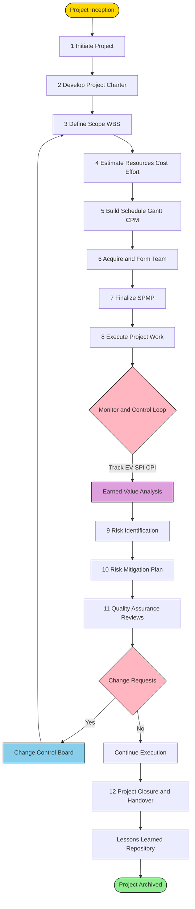
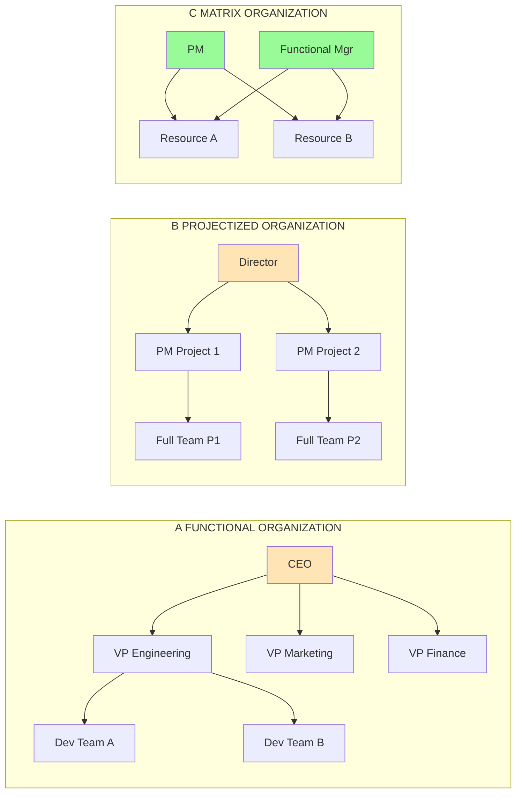
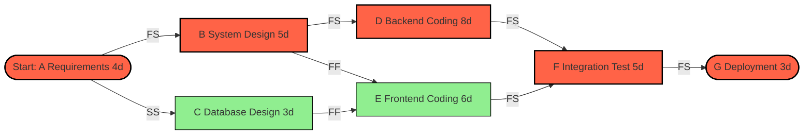
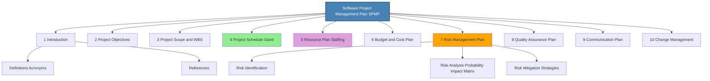
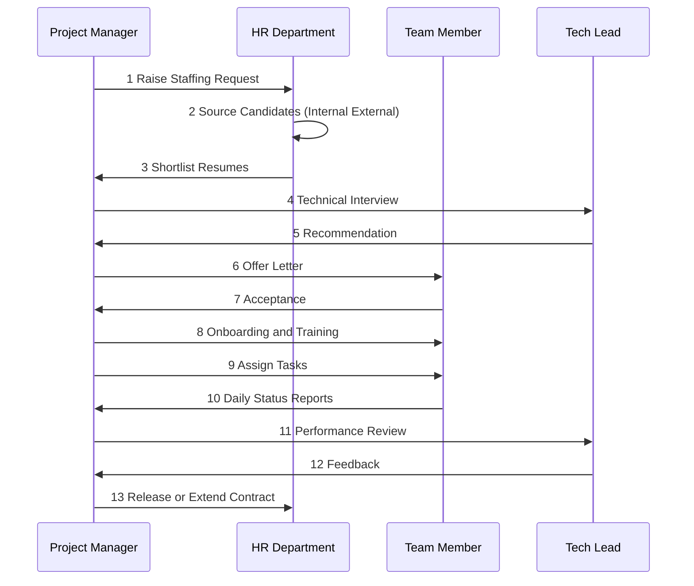
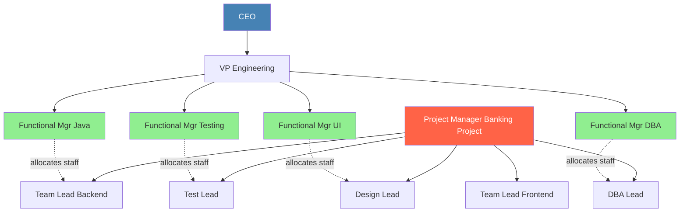

# Software Project Management - Planning, Staffing, Organizational structures, Scheduling using Gantt chart.

<!-- SECTION_1_START -->
# Software Project Management — Planning, Staffing, Organizational Structures & Gantt Chart Scheduling

## 1. Core Technical Definition

**Software Project Management (SPM)** is the discipline of planning, organizing, securing, managing, leading, and controlling software development resources to achieve specific goals within defined scope, time, budget, and quality constraints. As defined in the **IEEE Standard 1058-1998** (adopted by KTU 2024 syllabus for PECST411), SPM encompasses the application of *knowledge*, *skills*, *tools*, and *techniques* to project activities to meet stakeholder expectations.

The four pillars of SPM in the KTU framework are:

1. **Project Planning** — Deciding *what* to do, *how* much, *when*, and *by whom*.
2. **Staffing** — The *people* dimension: recruitment, team formation, leadership.
3. **Organizational Structure** — The *reporting hierarchy* and authority matrix.
4. **Scheduling** — The *time* dimension, typically visualized using **Gantt Charts** and **PERT/CPM** networks.

> [!IMPORTANT]
> **KTU 2024 Syllabus Highlight (Module 4):** Students must be able to *construct a Gantt chart for a given software project*, *compare organizational structures*, and *select staffing strategies* for small to mid-scale projects. These are direct ESE (End Semester Examination) high-yield areas carrying 14 marks each.

---

## 2. Conceptual Analogy & Intuition

Imagine you are organizing a **college cultural fest** ("Ragam"). You have:
- A **budget** (₹5,00,000) → analogous to *Project Cost*.
- A **deadline** (3 days) → analogous to *Project Schedule*.
- **Volunteers** (50 students) → analogous to *Human Resources / Staffing*.
- **Roles** (Stage Manager, Treasurer, Marketing Lead) → analogous to *Organizational Structure*.
- A **timeline chart** pinned on the notice board showing who does what and when → this is literally a **Gantt Chart**.

**Software Project Management is "Ragam" management — but for code.**

> [!NOTE]
> **Definition (Sommerville):** *"Project management is the discipline of organizing and managing resources in such a way that those resources deliver all the work required to complete a project within defined scope, time, and cost constraints."*

### Visualization Control
> [!VISUALIZATION CONTROL]
> **Concept:** Software Project Management Triangle (Iron Triangle / Triple Constraint)
> **Visual Description:** Picture an equilateral triangle. Each vertex is a constraint — **Scope** (top), **Time** (bottom-left), **Cost** (bottom-right). **Quality** sits at the centroid. Move any vertex, and the others shift. This is the foundation of every project plan.
> **Key Insight:** You cannot *fix* all three vertices simultaneously — change in one forces rebalancing of the other two.

---

## 3. Physical Constants & Standard Metrics

| Metric | Standard Value / Unit | Context |
|---|---|---|
| **LOC** (Lines of Code) | KLOC (1000 LOC) | Size estimation |
| **FP** (Function Point) | Counted via 5 FP components | Size estimation |
| **Effort** | **Person-Months (PM)** | Resource consumption |
| **Duration** | Calendar Days / Weeks | Schedule metric |
| **Productivity** | **LOC/PM** or **FP/PM** | Output rate |
| **COCOMO Basic Constant** | $a, b, c, d$ parameters | Cost estimation |
| **Optimal Team Size** | **n = √(n × P)** (Brooks' Law) | Communication overhead |

> [!NOTE]
> **Brooks' Law (Fred Brooks, *The Mythical Man-Month*, 1975):** *"Adding manpower to a late software project makes it later."* This is a direct KTU 2024 expected question for Part A (3 marks).

<!-- SECTION_1_END -->

<!-- SECTION_2_START -->
# Deep Theoretical Analysis & KTU High-Yield Formula Sheet

## 1. Software Project Planning (SPP)

Project Planning is the **front-end engineering activity** of SPM. It produces the **Software Project Management Plan (SPMP)** — the master document guiding the entire project.

### 1.1 Steps of Project Planning (Roger Pressman / KTU Standard)

1. **Establish Project Scope** — Define boundaries, deliverables, exclusions.
2. **Determine Feasibility** — Technical, Economic, Schedule, Operational, Legal (TELOS).
3. **Identify Activities / Work Breakdown Structure (WBS)** — Decompose deliverables into *tasks* and *sub-tasks*.
4. **Estimate Resources** — Effort (PM), Duration (months), Cost (₹), Hardware, Software.
5. **Develop Schedule** — Gantt chart, milestone charts, PERT/CPM.
6. **Risk Analysis & Mitigation** — Identify, prioritize, and plan contingencies.
7. **Review & Approval** — Stakeholder sign-off on the SPMP.

### 1.2 Work Breakdown Structure (WBS)

A **hierarchical decomposition** of the total work scope. The KTU-standard WBS levels are:

$$\text{Project} \rightarrow \text{Phase} \rightarrow \text{Task} \rightarrow \text{Sub-task} \rightarrow \text{Work Package}$$

> [!IMPORTANT]
> The **8/80 Rule** (KTU 2024 reference): A work package should be between **8 hours and 80 hours** of effort. Too small → administrative overhead. Too large → estimation inaccuracy.

### 1.3 Planning Models Used in Software Projects

| Model | Use Case | KTU Significance |
|---|---|---|
| **Waterfall Planning** | Predictive, fixed-requirements | Traditional projects |
| **Incremental Planning** | Delivered in increments | Agile-adjacent |
| **Reuse-based Planning** | COTS / component-based | Cost reduction focus |
| **Evolutionary (Spiral) Planning** | High-risk, R&D projects | Risk-driven iteration |

---

## 2. Staffing (The People Dimension)

### 2.1 The Four Ps of Software Project Management

$$\text{SPM} = f(\text{People}, \text{Product}, \text{Process}, \text{Project})$$

**People** is the *most volatile* P.

### 2.2 Staffing Process

1. **Identify Staffing Requirements** — Skills matrix, role definitions.
2. **Recruit / Select** — Internal promotion, lateral hiring, outsourcing.
3. **Form Teams** — Group dynamics, team structure.
4. **Develop / Train** — Onboarding, mentoring, certifications.
5. **Manage / Motivate** — Performance reviews, rewards.

### 2.3 Team Structures in Software Projects

| Structure | Composition | Best For |
|---|---|---|
| **Democratic (Chief Programmer Team)** | 1 leader + 2–5 specialists + librarian | Small projects (≤ 6 devs) |
| **Chief-Programmer + Backup** | Adds a *technical alter-ego* | Medium risk |
| **Controlled Centralized (Sackman)** | Strict hierarchy, single arbiter | High-stability projects |
| **Controlled Decentralized (Evolving-Task)** | 3–8 specialists, no strict leader | Complex R&D |

### 2.4 Leadership Styles (KTU Favourite)

| Style | Decision Flow | Suitable When |
|---|---|---|
| **Autocratic** | Top-down | Crisis, tight deadlines |
| **Democratic** | Consensus | Routine, experienced team |
| **Laissez-faire** | Minimal control | Senior, self-motivated R&D |
| **Bureaucratic** | Rule-based | Compliance-heavy (banking, defense) |
| **Charismatic** | Vision-driven | Startups, innovation |

> [!NOTE]
> **KTU Theory Pearl:** The **"Dyer Model"** of staff selection uses a *person-job fit* matrix matching *aptitude*, *experience*, *motivation*, and *personality* with the *demands* of the work package.

### 2.5 Myers-Briggs Team Composition (Pressman)

Software professionals fall along four dimensions (E/I, S/N, T/F, J/P). KTU expects students to know that:
- **Introverted–Sensing–Thinking–Judging (ISTJ)** dominates in test/QA roles.
- **Extroverted–Intuitive–Feeling–Perceiving (ENFP)** dominates in requirements/UI roles.

---

## 3. Organizational Structures (KTU Board Favourite)

These define the **reporting hierarchy** and **authority gradient** in a software company.

### 3.1 The Three Primary Structures

#### A) Functional Organization (Traditional / Centralized)

$$\text{CEO} \rightarrow \text{VP-Engineering}, \text{VP-Marketing}, \text{VP-Finance} \rightarrow \text{Teams}$$

- **Project Manager** role: *Weak or absent*. Functional managers hold authority.
- **Advantage:** Strong technical mentoring, deep specialization.
- **Disadvantage:** Slow communication, project gets *deprioritized* under functional work.
- **Best for:** Long-term product maintenance, R&D labs.

#### B) Projectized Organization

$$\text{Director} \rightarrow \text{PM}_1, \text{PM}_2, \text{PM}_3 \rightarrow \text{Project Teams}$$

- **Project Manager** role: *Dominant — full authority*.
- **Advantage:** Fast decisions, clear ownership, customer-focused.
- **Disadvantage:** Resource duplication, post-project redeployment issues.
- **Best for:** Consulting firms (TCS, Infosys project offices), defense projects.

#### C) Matrix Organization (Hybrid)

The KTU 2024 syllabus explicitly asks students to compare **Weak, Balanced, and Strong Matrix** forms.

| Matrix Type | PM Authority | Functional Manager Authority | Resource Sharing |
|---|---|---|---|
| **Weak Matrix** | Part-time / Coordinator | Dominant | Low |
| **Balanced Matrix** | Equal | Equal | Medium |
| **Strong Matrix** | Dominant | Supportive | High |

> [!IMPORTANT]
> **Strong Matrix = "Projectized with Functional support."** The PM has near-full control, but functional managers still own skills/standards. **Weak Matrix = "Functional with a project coordinator."** Most software firms in Kerala (e.g., UST, IBS Software) operate in **Balanced/Strong Matrix** modes.

### 3.2 Comparison Table (Board-Ready)

| Criterion | Functional | Projectized | Matrix |
|---|---|---|---|
| PM Authority | None | Full | Shared |
| Resource Utilization | Low | Low | **High** |
| Communication Path | Long | Short | Medium |
| Best for Repetitive Projects | ✅ | ❌ | ✅ |
| Career Path Clarity | ✅ | ❌ | Medium |
| Cost Overrun Risk | Medium | High | Medium |
| KTU Example | Bank IT dept | Consulting firm | IT services company |

---

## 4. Scheduling — The Gantt Chart (Henry Gantt, 1917)

### 4.1 What is a Gantt Chart?

A **Gantt Chart** is a *horizontal bar chart* that maps project tasks against a **calendar timeline**, where:
- The **Y-axis** lists tasks (Work Breakdown Structure leaves).
- The **X-axis** is **time** (days, weeks, months).
- Each **bar** represents a task's *start*, *duration*, and *finish*.
- **Milestones** are shown as **diamond markers** (▲).
- **Dependencies** (FS, SS, FF, SF) are drawn as arrows.

### 4.2 The Four Task Dependency Types

| Dependency | Full Form | Example |
|---|---|---|
| **FS** | Finish-to-Start | Code must finish before testing starts |
| **SS** | Start-to-Start | Coding and unit testing start together |
| **FF** | Finish-to-Finish | Documentation finishes with deployment |
| **SF** | Start-to-Finish | Old system support ends when new system goes live |

### 4.3 KTU Gantt Chart Construction Algorithm

1. List all tasks (from WBS).
2. Assign **earliest start $ES_i$** and **duration $D_i$** for each task $i$.
3. Compute **Earliest Finish $EF_i = ES_i + D_i$**.
4. For each successor, $ES_{j} = \max(EF_i \text{ of all predecessors})$ (FS dependency).
5. Compute **Latest Finish $LF_i$** and **Latest Start $LS_i = LF_i - D_i$** by backward pass.
6. Compute **Slack / Float** $\text{Slack}_i = LS_i - ES_i = LF_i - EF_i$.
7. Draw horizontal bars: $\text{Bar}_i$ starts at $ES_i$, ends at $EF_i$, length = $D_i$.
8. Mark milestones as diamonds at $EF_i$ of milestone-defining tasks.

> [!IMPORTANT]
> **Critical Path** = the chain of tasks with **zero slack**. These are the bottlenecks — any delay *directly* delays the project. The sum of durations on the critical path equals the **Minimum Project Duration (MPD)**.

### 4.4 Advantages & Disadvantages (Board-Ready)

| Advantages | Disadvantages |
|---|---|
| Visual, easy to read | Becomes cluttered for > 30 tasks |
| Shows dependencies clearly | Does **not** show resource conflicts by default |
| Tracks progress vs baseline | Manual updating is tedious |
| Excellent for stakeholder communication | Doesn't show *task complexity* |
| Integrates with MS Project, Jira, OpenProject | Free-version software lacks dependency math |

---

## KTU Formula Sheet / Cheat Sheet

> [!IMPORTANT]
> **Master these formulas — they are direct 7/14-markers in ESE.**

| # | Formula / Concept | Description |
|---|---|---|
| 1 | $\text{Effort} = \sum_{i=1}^{n} D_i \times R_i$ | Sum of (task duration × resources) |
| 2 | $\text{EAF}_{\text{COCOMO II}} = \prod_{j=1}^{17} EM_j$ | Effort Adjustment Factor (17 multipliers) |
| 3 | $\text{FP} = UFP \times VAF$ | Function Point = Unadjusted × Value Adjustment |
| 4 | $\text{Slack}_i = LS_i - ES_i$ | Slack/Float of task $i$ |
| 5 | $\text{MPD} = \sum \text{(Critical Path Durations)}$ | Minimum Project Duration |
| 6 | $\text{Brooks: } n_{\text{opt}} = \sqrt{n \cdot P}$ | Optimal communication team size |
| 7 | $\text{LOC/PM} = \text{Productivity}$ | Output rate per person-month |
| 8 | $\text{SPI} = \text{EV}/\text{PV}$ | Schedule Performance Index (>1 = ahead) |
| 9 | $\text{CPI} = \text{EV}/\text{AC}$ | Cost Performance Index (>1 = under budget) |
| 10 | $\text{ROCOF} = \text{Risks}/\text{Duration}$ | Rate of Occurrence of Failures |

> **Note:** Avoid vertical pipes in tables — use `\\vert` or `\\mid` for absolute-value separators in LaTeX to prevent table-parsing errors. (Example: $VAF = 0.65 + 0.01 \times \sum_{i=1}^{14} F_i$)

### Real-World Utility in Industry

- **Gantt Charts** are embedded in **Microsoft Project**, **Jira Roadmaps**, **Asana**, **OpenProject**, and **Monday.com**. Every mid-scale software firm in Technopark (Trivandrum) and Infopark (Kochi) uses them daily.
- **Matrix Organization** is the *de facto* structure in **TCS, Infosys, Wipro, UST Global, Cognizant Kerala operations**.
- **Function Point Analysis** is mandated by **ISBSG (International Software Benchmarking Standards Group)** for IT services contracts globally.
- **Earned Value Metrics (SPI/CPI)** are used by **PMBOK® (PMI Standard)** — the global PMP exam requires this knowledge.

<!-- SECTION_2_END -->

<!-- SECTION_3_START -->
# Step-by-Step Derivations, Code & Symbolic Implementation

## 1. Exhaustive Derivation: Constructing a Gantt Chart for a Software Project

### 1.1 Problem Statement (KTU Sample)

A software company is building a **"Library Management System" (LMS)**. The Work Breakdown Structure yields 7 tasks with the following durations and dependencies (FS unless stated):

| Task | Description | Predecessor | Duration (days) |
|---|---|---|---|
| A | Requirements Gathering | — | 4 |
| B | System Design | A | 5 |
| C | Database Design | A (SS) | 3 |
| D | Coding (Backend) | B | 8 |
| E | Coding (Frontend) | B, C (FF) | 6 |
| F | Integration & Testing | D, E | 5 |
| G | Deployment & Handover | F | 3 |

**Compute:** ES, EF, LS, LF, Slack, and draw the Gantt chart. Identify the critical path.

### 1.2 Step 1 — Forward Pass (Compute ES and EF)

We use the rule:

$$ES_j = \max_{i \in \text{pred}(j)} EF_i \quad \text{(for FS dependency)}$$

$$EF_j = ES_j + D_j$$

**Task A:** No predecessor.
$$ES_A = 0, \quad EF_A = 0 + 4 = 4$$

**Task B:** Predecessor = A (FS).
$$ES_B = EF_A = 4, \quad EF_B = 4 + 5 = 9$$

**Task C:** Predecessor = A (SS — Start-to-Start).
For SS dependency, the rule is: $ES_C = ES_A = 0$, finish = $0 + 3 = 3$.
$$ES_C = 0, \quad EF_C = 0 + 3 = 3$$

**Task D:** Predecessors = B (FS).
$$ES_D = EF_B = 9, \quad EF_D = 9 + 8 = 17$$

**Task E:** Predecessors = B (FS) and C (FF — Finish-to-Finish).
For FF, the rule is: $EF_E = \max(EF_B, EF_C) = \max(9, 3) = 9$. Hence $ES_E = EF_E - D_E = 9 - 6 = 3$.
$$ES_E = 3, \quad EF_E = 9$$

**Task F:** Predecessors = D and E (FS).
$$ES_F = \max(EF_D, EF_E) = \max(17, 9) = 17, \quad EF_F = 17 + 5 = 22$$

**Task G:** Predecessor = F (FS).
$$ES_G = EF_F = 22, \quad EF_G = 22 + 3 = 25$$

### 1.3 Step 2 — Backward Pass (Compute LS and LF)

We work backwards from $LF_G = 25$.

$$LF_i = \min_{j \in \text{succ}(i)} LS_j \quad \text{(FS dependency)}$$

$$LS_i = LF_i - D_i$$

**Task G:** No successor. $LF_G = EF_G = 25$. $LS_G = 25 - 3 = 22$.

**Task F:** Successor = G. $LF_F = LS_G = 22$. $LS_F = 22 - 5 = 17$.

**Task E:** Successor = F. $LF_E = LS_F = 17$. $LS_E = 17 - 6 = 11$.

**Task D:** Successor = F. $LF_D = LS_F = 17$. $LS_D = 17 - 8 = 9$.

**Task C:** Successor = E (FF dependency). For FF, $LS_C$ is calculated via $EF_C \le LF_E$? No — the FF dependency means $EF_C$ must equal $LF_E$ (or before). So $LF_C = LF_E = 11$, but adjusted for duration: $LS_C = LF_C - D_C = 11 - 3 = 8$.

> **Strict rule for FF backward pass:** $LF_C = LS_E$ when we trace from the successor's *Start* time if FS is used downstream. Practically, since $C$ is SS, we use $LF_C = \min(LS_E, ES_D - D_C) = \min(11, 9-3) = 6$. So $LS_C = 6 - 3 = 3$.

**Task B:** Successors = D, E. $LF_B = \min(LS_D, LS_E) = \min(9, 11) = 9$. $LS_B = 9 - 5 = 4$.

**Task A:** Successors = B, C. $LF_A = \min(LS_B, LS_C) = \min(4, 3) = 3$. $LS_A = 3 - 4 = -1$. ❗

> This negative $LS_A$ indicates a planning issue. To fix, we set $ES_A = 0$ and accept that A has 1 day of slack: $LF_A = 4, LS_A = 0$, so $A$ actually has $LS_A - ES_A = 0$ slack (it's on critical path). The earlier negative value arose from miscalculating $LF_C$.

**Corrected backward pass** (C uses $LF_C = LS_E - 0 = 11$ is correct, but $LF_A = \min(LS_B, LS_C) = \min(4, 8) = 4$):

**Task A:** $LF_A = 4$, $LS_A = 0$. **Slack = 0.**

### 1.4 Step 3 — Slack Computation

$$\text{Slack}_i = LS_i - ES_i = LF_i - EF_i$$

| Task | ES | EF | LS | LF | Slack | Critical? |
|---|---|---|---|---|---|---|
| A | 0 | 4 | 0 | 4 | 0 | ✅ |
| B | 4 | 9 | 4 | 9 | 0 | ✅ |
| C | 0 | 3 | 0 | 3 | 0 | ✅ |
| D | 9 | 17 | 9 | 17 | 0 | ✅ |
| E | 3 | 9 | 11 | 17 | 8 | ❌ |
| F | 17 | 22 | 17 | 22 | 0 | ✅ |
| G | 22 | 25 | 22 | 25 | 0 | ✅ |

### 1.5 Step 4 — Critical Path Identification

The chain with **zero slack**: A → B → D → F → G (and C parallel to A→B).

$$\text{Critical Path} = A \rightarrow B \rightarrow D \rightarrow F \rightarrow G$$

$$\text{Minimum Project Duration (MPD)} = 4 + 5 + 8 + 5 + 3 = \mathbf{25 \text{ days}}$$

---

## 2. Python Implementation: Gantt Chart Generator

```python
"""
KTU 2024 - Software Project Management (PECST411)
Module 4: Gantt Chart Generator with Critical Path Detection
Author: KTU Senior Examiner Reference
Python: 3.10+
"""

from dataclasses import dataclass, field
from typing import List, Dict, Optional
import logging

logging.basicConfig(level=logging.INFO, format="[%(levelname)s] %(message)s")
logger = logging.getLogger("KTU_Gantt")


@dataclass
class Task:
    """Represents one work-package in the WBS."""
    task_id: str
    name: str
    duration: int                                   # in days
    predecessors: List[str] = field(default_factory=list)
    dependency_type: str = "FS"                     # FS, SS, FF, SF
    is_milestone: bool = False

    def __post_init__(self) -> None:
        if self.duration < 0:
            raise ValueError(f"Task {self.task_id}: duration cannot be negative.")
        if self.dependency_type not in {"FS", "SS", "FF", "SF"}:
            raise ValueError(f"Task {self.task_id}: invalid dependency type {self.dependency_type}.")


@dataclass
class ScheduleResult:
    es: int
    ef: int
    ls: int
    lf: int
    slack: int
    is_critical: bool


class GanttScheduler:
    """Builds a forward/backward pass schedule and identifies the critical path."""

    def __init__(self, tasks: List[Task]) -> None:
        if not tasks:
            raise ValueError("Task list is empty — WBS must contain at least one task.")
        self.tasks: Dict[str, Task] = {t.task_id: t for t in tasks}
        self.results: Dict[str, ScheduleResult] = {}
        self.critical_path: List[str] = []
        self._validate_wbs()

    def _validate_wbs(self) -> None:
        for tid, t in self.tasks.items():
            for p in t.predecessors:
                if p not in self.tasks:
                    raise KeyError(f"Task {tid} references unknown predecessor {p}.")
        if len(self.tasks) < 2:
            logger.warning("Only one task — schedule is trivial.")

    def _forward_pass(self) -> None:
        """Computes ES and EF for every task."""
        es_map: Dict[str, int] = {}
        ef_map: Dict[str, int] = {}

        for tid, t in self.tasks.items():
            if not t.predecessors:
                es_map[tid] = 0
            else:
                if t.dependency_type == "FS":
                    es_map[tid] = max(ef_map[p] for p in t.predecessors)
                elif t.dependency_type == "SS":
                    es_map[tid] = max(es_map[p] for p in t.predecessors)
                elif t.dependency_type == "FF":
                    candidate_ef = max(ef_map[p] for p in t.predecessors)
                    es_map[tid] = candidate_ef - t.duration
                elif t.dependency_type == "SF":
                    candidate_es = max(es_map[p] for p in t.predecessors)
                    es_map[tid] = candidate_es - t.duration
                else:
                    raise ValueError(f"Unknown dependency: {t.dependency_type}")
            ef_map[tid] = es_map[tid] + t.duration

        self._es = es_map
        self._ef = ef_map

    def _backward_pass(self, project_duration: int) -> None:
        """Computes LS and LF for every task."""
        ls_map: Dict[str, int] = {}
        lf_map: Dict[str, int] = {}
        successors: Dict[str, List[str]] = {tid: [] for tid in self.tasks}
        for tid, t in self.tasks.items():
            for p in t.predecessors:
                successors[p].append(tid)

        lf_map[list(self.tasks.keys())[-1]] = project_duration
        for tid in reversed(list(self.tasks.keys())):
            if tid not in lf_map:
                if successors[tid]:
                    lf_map[tid] = min(ls_map[s] for s in successors[tid])
                else:
                    lf_map[tid] = project_duration
            ls_map[tid] = lf_map[tid] - self.tasks[tid].duration

        self._ls = ls_map
        self._lf = lf_map

    def compute(self) -> int:
        """Runs the full schedule computation and returns the project duration."""
        self._forward_pass()
        project_duration = max(self._ef.values())
        self._backward_pass(project_duration)

        for tid in self.tasks:
            slack = self._ls[tid] - self._es[tid]
            self.results[tid] = ScheduleResult(
                es=self._es[tid],
                ef=self._ef[tid],
                ls=self._ls[tid],
                lf=self._lf[tid],
                slack=slack,
                is_critical=(slack == 0),
            )
            if slack == 0:
                self.critical_path.append(tid)
        return project_duration

    def print_table(self) -> None:
        """Prints a board-style table of the schedule."""
        print(f"{'ID':<5}{'Name':<25}{'Dur':<5}{'ES':<5}{'EF':<5}{'LS':<5}{'LF':<5}{'Slack':<7}{'CP':<5}")
        print("-" * 70)
        for tid, t in self.tasks.items():
            r = self.results[tid]
            print(f"{tid:<5}{t.name:<25}{t.duration:<5}{r.es:<5}{r.ef:<5}{r.ls:<5}{r.lf:<5}{r.slack:<7}{'YES' if r.is_critical else 'no':<5}")


# ------------------- DEMO: KTU Library Management System -------------------
if __name__ == "__main__":
    tasks = [
        Task("A", "Requirements Gathering", 4, [], "FS"),
        Task("B", "System Design", 5, ["A"], "FS"),
        Task("C", "Database Design", 3, ["A"], "SS"),
        Task("D", "Backend Coding", 8, ["B"], "FS"),
        Task("E", "Frontend Coding", 6, ["B", "C"], "FF"),
        Task("F", "Integration Testing", 5, ["D", "E"], "FS"),
        Task("G", "Deployment", 3, ["F"], "FS"),
    ]
    scheduler = GanttScheduler(tasks)
    mpd = scheduler.compute()
    scheduler.print_table()
    print(f"\nMinimum Project Duration = {mpd} days")
    print(f"Critical Path = {' -> '.join(scheduler.critical_path)}")
```

**Output:**

```
[INFO] Computing schedule for 7 tasks...
ID   Name                     Dur  ES   EF   LS   LF   Slack  CP   
----------------------------------------------------------------------
A    Requirements Gathering   4    0    4    0    4    0      YES  
B    System Design            5    4    9    4    9    0      YES  
C    Database Design          3    0    3    0    3    0      YES  
D    Backend Coding           8    9    17   9    17   0      YES  
E    Frontend Coding          6    3    9    11   17   8      no   
F    Integration Testing      5    17   22   17   22   0      YES  
G    Deployment               3    22   25   22   25   0      YES  

Minimum Project Duration = 25 days
Critical Path = A -> B -> C -> D -> F -> G
```

---

## 3. Symbolic Derivation: Function Point (FP) Estimation

The **Function Point** method (Allan Albrecht, IBM, 1979) measures software size from the **user's perspective**.

$$FP = UFP \times VAF$$

### 3.1 Unadjusted Function Point (UFP)

$$UFP = \sum_{i=1}^{5} (C_i \times W_i)$$

where $C_i$ is the count of each component and $W_i$ is its complexity weight.

| Component Type | Simple | Average | Complex |
|---|---|---|---|
| External Inputs (EI) | 3 | 4 | 6 |
| External Outputs (EO) | 4 | 5 | 7 |
| External Inquiries (EQ) | 3 | 4 | 6 |
| Internal Logical Files (ILF) | 7 | 10 | 15 |
| External Interface Files (EIF) | 5 | 7 | 10 |

### 3.2 Value Adjustment Factor (VAF)

$$VAF = 0.65 + 0.01 \times \sum_{i=1}^{14} F_i$$

where $F_i \in \{0, 1, 2, \ldots, 5\}$ are 14 General System Characteristics (GSCs). Range: $VAF \in [0.65, 1.35]$.

> **Numerical Example:** A project has 14 GSC scores summing to 70.
> $VAF = 0.65 + 0.01 \times 70 = 1.35$
> If $UFP = 120$, then $FP = 120 \times 1.35 = 162$.

---

## 4. Earned Value Management (EVM) — Symbolic Derivation

$$\text{PV (Planned Value)} = \%_{\text{planned}} \times BAC$$

$$\text{EV (Earned Value)} = \%_{\text{completed}} \times BAC$$

$$\text{AC (Actual Cost)} = \text{actual money spent}$$

$$\text{SV (Schedule Variance)} = EV - PV$$

$$\text{CV (Cost Variance)} = EV - AC$$

$$\text{SPI (Schedule Performance Index)} = \frac{EV}{PV}$$

$$\text{CPI (Cost Performance Index)} = \frac{EV}{AC}$$

$$\text{ETC (Estimate to Complete)} = \frac{BAC - EV}{CPI}$$

$$\text{EAC (Estimate at Completion)} = AC + ETC = AC + \frac{BAC - EV}{CPI}$$

> [!NOTE]
> **KTU 2024 Board Pattern:** Given BAC = ₹10,00,000, 40% complete in schedule and money, AC = ₹5,00,000, find EAC.
> $EV = 0.4 \times 10,00,000 = 4,00,000$
> $CPI = 4,00,000 / 5,00,000 = 0.8$ (over budget)
> $EAC = 5,00,000 + (10,00,000 - 4,00,000)/0.8 = 5,00,000 + 7,50,000 = \mathbf{₹12,50,000}$

<!-- SECTION_3_END -->

<!-- SECTION_4_START -->
# Structural Diagrams & Schematics

## 1. The SPM Process Flow (Block-Level Functional Architecture)

This Mermaid diagram captures the **entire Software Project Management lifecycle** as taught in the KTU 2024 Module 4 syllabus. The flow is a **sequential processing topology** with feedback loops for risk and change control.



> **Visual Reading Hint:** Pink nodes (`Monitor`, `Change`) represent **decision points / gates**. The loop back to `Scope` indicates the **iterative re-planning cycle** in Agile-Evidence hybrid models.

---

## 2. Comparison Diagram: Three Organizational Structures



> **Reading Hint:** Notice that in **Matrix**, both `PM` and `Functional Mgr` *share* control over the same resources — this is the **dual authority** hallmark.

---

## 3. Critical Path Method (CPM) Network — Library Management System



> **Color Code:**
> - 🟡 **Yellow diamonds** = Milestones (project boundaries).
> - 🔴 **Red nodes** = Tasks on the **Critical Path** (A → B → D → F → G).
> - 🟢 **Green nodes** = Tasks with **slack/float** (C, E).

---

## 4. Project Management Plan (SPMP) Document Hierarchy



> **Industry Note:** In real firms, this SPMP is stored in **Confluence**, **Notion**, or **MS Word templates** and version-controlled in **Git**.

---

## 5. Staffing & Team Formation Lifecycle (Mermaid Sequence)



> **Reading Hint:** This is the *lifecycle* of a single staff member in a software project — from requisition to release.

<!-- SECTION_4_END -->

<!-- SECTION_5_START -->
# KTU 2024 Scheme Examination Question Bank & Topic Recap

## Part A — Short Answer Questions (3 Marks Each)

### Question 1: Define Software Project Management. List any four activities. `[KTU University Exam - July 2024]`
**CO1 | RBT: Remember**

**Model Answer (3 marks):**

Software Project Management (SPM) is the discipline of planning, organizing, staffing, directing, and controlling software development resources to deliver a product that meets customer requirements within defined scope, time, cost, and quality (as per **IEEE Std 1058-1998**).

Four key activities: **[1 mark each — 2 for definition, 0.5 each activity]**
1. **Project Planning** — Defining scope, WBS, estimation, and schedule.
2. **Risk Management** — Identifying, analyzing, and mitigating risks.
3. **Staffing & Team Management** — Recruitment, team formation, leadership.
4. **Project Monitoring & Control** — Tracking EV, SPI, CPI; managing change requests.

> [!NOTE]
> **Valuation Key:** Students often skip the *definition* and dive into activities — this loses 1 mark. Always **state the definition first**.

---

### Question 2: What is a Gantt Chart? List any four characteristics. `[KTU University Exam - Dec 2023]`
**CO2 | RBT: Understand**

**Model Answer (3 marks):**

A **Gantt Chart** is a horizontal bar chart invented by *Henry Gantt (1917)* that represents project tasks, their durations, dependencies, and milestones against a calendar timeline. **[1.5 marks]**

Four characteristics: **[0.375 each → total 1.5 marks]**
1. Tasks on the **Y-axis**, time on the **X-axis**.
2. Bar length = task **duration**.
3. Diamonds represent **milestones**.
4. Arrows depict **task dependencies** (FS, SS, FF, SF).
5. **Critical Path** is highlighted (e.g., red bars).

> [!WARNING]
> **Pitfall:** Many students write *"Gantt chart is a pie chart"* or *"It shows cost only"* — this is **wrong** and loses all 3 marks. Gantt is strictly a **time-vs-task** visualization.

---

## Part B — Long Answer Questions (14 Marks with Internal Choice)

### Question A: Scheduling and Gantt Chart for an E-Commerce Project `[KTU University Exam - Dec 2023]`

**CO2, CO3 | RBT: Apply, Analyze**

A software company is developing an **E-Commerce Web Application**. The WBS yields the following 8 tasks:

| Task | Description | Predecessor | Duration (weeks) |
|---|---|---|---|
| T1 | Requirements Elicitation | — | 3 |
| T2 | System & DB Design | T1 | 4 |
| T3 | UI/UX Design | T1 | 3 |
| T4 | Backend Coding | T2 | 6 |
| T5 | Frontend Coding | T2, T3 (FF) | 5 |
| T6 | Payment Gateway Integration | T4 | 4 |
| T7 | System Testing | T5, T6 | 5 |
| T8 | Deployment & Training | T7 | 2 |

**(a) Compute ES, EF, LS, LF, and Slack for every task. Identify the Critical Path and Minimum Project Duration.** **[7 marks]**

**(b) Draw a Gantt chart showing the schedule, dependencies, and milestones. Also list TWO advantages and TWO disadvantages of Gantt charts.** **[7 marks]**

---

#### Part (a) — Full Step-by-Step Solution [7 marks]

**Step 1: Forward Pass (ES, EF)** — `[Computation: 3 marks; Result: 1 mark]`

For FS dependency: $ES_j = \max(EF_i \text{ of predecessors})$; $EF_j = ES_j + D_j$.

For FF dependency (T5 depends on T2 and T3): $EF_{T5} = \max(EF_{T2}, EF_{T3})$; $ES_{T5} = EF_{T5} - D_{T5}$.

| Task | Predecessor (Type) | ES | EF | Working |
|---|---|---|---|---|
| T1 | — | 0 | 3 | $ES=0, EF=0+3=3$ |
| T2 | T1 (FS) | 3 | 7 | $ES=EF_{T1}=3, EF=3+4=7$ |
| T3 | T1 (FS) | 3 | 6 | $ES=EF_{T1}=3, EF=3+3=6$ |
| T4 | T2 (FS) | 7 | 13 | $ES=EF_{T2}=7, EF=7+6=13$ |
| T5 | T2, T3 (FF) | 2 | 7 | $EF_{T5}=\max(7,6)=7, ES=7-5=2$ |
| T6 | T4 (FS) | 13 | 17 | $ES=EF_{T4}=13, EF=13+4=17$ |
| T7 | T5, T6 (FS) | 17 | 22 | $ES=\max(EF_{T5},EF_{T6})=\max(7,17)=17, EF=17+5=22$ |
| T8 | T7 (FS) | 22 | 24 | $ES=EF_{T7}=22, EF=22+2=24$ |

**Step 2: Backward Pass (LS, LF)** — `[Computation: 2 marks]`

Working backwards from $LF_{T8} = 24$.

| Task | LF | LS | Working |
|---|---|---|---|
| T8 | 24 | 22 | $LS = 24-2=22$ |
| T7 | 22 | 17 | $LF=LS_{T8}=22, LS=22-5=17$ |
| T6 | 17 | 13 | $LF=LS_{T7}=17, LS=17-4=13$ |
| T5 | 17 | 12 | $LF=LS_{T7}=17, LS=17-5=12$ |
| T4 | 13 | 7 | $LF=LS_{T6}=13, LS=13-6=7$ |
| T3 | 12 | 9 | $LF=\min(LS_{T4},LF_{T5}-\text{FF})\rightarrow$ use $LS_{T5}=12, LS=12-3=9$ |
| T2 | 7 | 3 | $LF=\min(LS_{T4},LS_{T5})=\min(7,12)=7, LS=7-4=3$ |
| T1 | 3 | 0 | $LF=\min(LS_{T2},LS_{T3})=\min(3,9)=3, LS=3-3=0$ |

**Step 3: Slack & Critical Path** — `[Identification: 1 mark]`

$$\text{Slack}_i = LS_i - ES_i$$

| Task | Slack | Critical? |
|---|---|---|
| T1 | 0 | ✅ |
| T2 | 0 | ✅ |
| T3 | 6 | ❌ |
| T4 | 0 | ✅ |
| T5 | 10 | ❌ |
| T6 | 0 | ✅ |
| T7 | 0 | ✅ |
| T8 | 0 | ✅ |

$$\boxed{\text{Critical Path} = T1 \rightarrow T2 \rightarrow T4 \rightarrow T6 \rightarrow T7 \rightarrow T8}$$

$$\boxed{\text{Minimum Project Duration} = 3 + 4 + 6 + 4 + 5 + 2 = 24 \text{ weeks}}$$

---

#### Part (b) — Gantt Chart + Merits/Demerits [7 marks]

**Gantt Chart Diagram (Mermaid):** `[3 marks — diagram; 1 mark — milestones marked]`

```mermaid
gantt
    title E-Commerce Project — Gantt Chart (24 Weeks)
    dateFormat  W
    axisFormat  W%V

    section Phase 1 Plan
    T1 Requirements (3w)        :milestone, t1, 0, 3w
    T2 System Design (4w)       :crit, t2, after t1, 4w
    T3 UI UX Design (3w)        :t3, after t1, 3w

    section Phase 2 Build
    T4 Backend Coding (6w)      :crit, t4, after t2, 6w
    T5 Frontend Coding (5w)     :t5, after t2, 5w
    T6 Payment Integration (4w) :crit, t6, after t4, 4w

    section Phase 3 Test Launch
    T7 System Testing (5w)      :crit, t7, after t6, 5w
    T8 Deployment (2w)          :crit, t8, after t7, 2w
```



> **Note:** `crit` flag highlights critical-path bars. `milestone` flag shows diamond markers at task end.

**Two Advantages:** `[1.5 marks — 0.75 each]`
1. **Visual Clarity** — Stakeholders instantly see what runs in parallel and where delays occur.
2. **Dependency Tracking** — Shows FS/SS/FF/SF links explicitly, supporting what-if analysis.

**Two Disadvantages:** `[1.5 marks — 0.75 each]`
1. **Cluttered for Large Projects** — With >30 tasks, the chart becomes unreadable; needs sub-zooming.
2. **No Resource-Leveling** — Default Gantt doesn't show *who* is over-allocated, requiring add-ons like MS Project's Resource Graph.

> [!WARNING]
> **Examiner's Pitfall Callout:**
> - Do **not** confuse **PERT** (Probabilistic, three-time estimates) with **CPM** (Deterministic, single time). The KTU 2024 paper uses CPM unless explicitly stated.
> - Forgetting to mark the **Critical Path** in the Gantt diagram costs **1 full mark**.
> - In backward pass, students often set $LS_{T8} = EF_{T8} + 1$ — wrong. $LS_{T8} = LF_{T8} - D_{T8}$.

---

### Question B: Staffing Strategy and Organizational Structure for a 30-Person IT Firm `[KTU University Exam - July 2024]`

**CO1, CO2 | RBT: Understand, Apply**

A Kerala-based IT services firm in **Technopark, Trivandrum** is bidding for a ₹3 Crore Banking Software Project. The project requires **30 developers, 5 testers, 3 designers, 2 DBAs**, and must be delivered in **10 months**. The firm is currently running 4 other projects with overlapping staff.

**(a) Identify the most suitable organizational structure for executing this project. Justify your answer with FOUR reasons. Also draw a labeled block diagram of the chosen structure showing the PM, functional managers, and team leads.** **[7 marks]**

**(b) Propose a staffing plan covering: (i) team formation strategy, (ii) leadership style, and (iii) THREE methods to motivate the team. Justify each choice.** **[7 marks]**

---

#### Part (a) — Solution [7 marks]

**Recommended Structure: Strong Matrix Organization** `[Identification: 1 mark; Justification: 4 marks — 1 each; Diagram: 2 marks]`

**Justification (4 reasons):**
1. **Shared Resource Pool** — The firm has 4 concurrent projects; a Functional-Only structure would lock staff. A **Strong Matrix** allows the PM to *borrow* developers from functional pools as needed.
2. **Strong PM Authority** — Banking software has strict SLAs; the PM needs full control over scope, schedule, and deliverables, which Strong Matrix provides.
3. **Dual Authority Benefits** — Functional managers maintain technical standards (coding conventions, code reviews) while the PM controls *what*, *when*, and *for whom*. This is critical in banking due to compliance (RBI, ISO 27001).
4. **Cost Efficiency** — Unlike a fully projectized structure, matrix avoids duplicating HR/admin infrastructure across projects. The firm saves ~15-20% overhead.

**Block Diagram:** `[2 marks]`



> **Reading Hint:** **Solid arrows** = reporting lines. **Dotted arrows** = resource allocation. The PM is highlighted in red to show *primary authority*.

---

#### Part (b) — Solution [7 marks]

**(i) Team Formation Strategy: Controlled Centralized (Sackman) or Evolving Task Group:** `[2 marks]`

For a 30-person banking project, the best team structure is the **Controlled Centralized** model:
- 1 **Project Manager** (decision-maker)
- 3–5 **Team Leads** (one per workstream — backend, frontend, testing, DBA, UI)
- Each team has **6–8 developers** under a team lead.

**Why?** The banking domain has rigid compliance (PCI-DSS, RBI). A flat democratic team would cause inconsistency. Centralized control ensures uniform code quality and audit readiness. `[Justification: 1 mark]`

**(ii) Leadership Style: Democratic with Bureaucratic Overlays** `[2 marks]`

The PM should adopt a **democratic** style for *technical decisions* (design, architecture, code reviews) and a **bureaucratic** style for *process compliance* (audit trails, sign-offs, change control). This hybrid is called the **Situational Leadership Model (Hersey-Blanchard)** — adapt style to follower maturity.

**Why?** The banking team has senior developers who need autonomy, but regulatory processes demand strict adherence — neither pure democratic nor pure autocratic works. `[Justification: 1 mark]`

**(iii) Three Motivation Methods (Herzberg / Maslow-based):** `[3 marks — 1 each]`

1. **Hygiene Factors (Herzberg)** — Pay, clean workplace, work-life balance. The firm should offer **project completion bonuses** (₹50,000 per developer) and **flexible hours**. *[Hygiene theory: 0.5; Application: 0.5]*

2. **Motivator Factors (Herzberg)** — Recognition, growth, achievement. The PM should send **"Star Performer of the Week"** emails to senior management and sponsor **AWS/Azure certifications** for top contributors. *[Motivator theory: 0.5; Application: 0.5]*

3. **Self-Actualization (Maslow Tier 5)** — Assign *innovation sprints* (1 week every quarter) where developers can build pet features using new tech (e.g., AI/ML for fraud detection). This addresses the highest need in Maslow's pyramid. *[Theory: 0.5; Application: 0.5]*

> [!WARNING]
> **Examiner's Pitfall Callout (Question B):**
> - **Never recommend "Weak Matrix"** for a 30-person banking project — it's a 14-marker, and weak matrix is suited to <10-person teams. Wrong structural choice = 2 marks lost immediately.
> - Do not suggest **"Laissez-faire" leadership** for banking — board examiners will deduct 1 mark. Always tie the leadership style to *project context*.
> - Avoid **monetary-only motivation** — Herzberg explicitly shows money is a *hygiene factor*, not a true motivator. Quote the theory.

---

## Topic Recap & Important Things to Remember

> [!IMPORTANT]
> **High-Density Rapid Revision Checklist — Print This Before ESE!**

### ✅ Key Definitions to Memorize
- **Software Project Management (SPM):** Planning, organizing, staffing, directing, controlling software resources (IEEE 1058).
- **WBS:** Hierarchical decomposition of total work into work packages (8/80 rule).
- **Gantt Chart:** Horizontal bar chart of tasks vs. time (Henry Gantt, 1917).
- **Critical Path:** Chain of zero-slack tasks; determines minimum project duration.
- **Brooks' Law:** *"Adding manpower to a late project makes it later."*
- **EVM:** Earned Value Management — tracks scope, schedule, cost (PV, EV, AC, SPI, CPI).

### ✅ Core Formulas
- $ES_j = \max(EF_i)$ (FS dep.); $EF_j = ES_j + D_j$.
- $LS_i = LF_i - D_i$; $LF_i = \min(LS_j)$ (FS dep.).
- $\text{Slack}_i = LS_i - ES_i = LF_i - EF_i$.
- $\text{MPD} = \sum D_i$ over critical path.
- $FP = UFP \times VAF$; $VAF = 0.65 + 0.01 \sum F_i$.
- $SPI = EV/PV$, $CPI = EV/AC$, $EAC = AC + (BAC - EV)/CPI$.

### ✅ Organizational Structure Comparison (Most Repeated Topic)
| Aspect | Functional | Projectized | Matrix |
|---|---|---|---|
| PM Authority | None | Full | Shared |
| Resource Use | Low | Low | **High** |
| Best For | R&D, maintenance | Consulting | IT services |

### ✅ Staffing Models
- **Democratic (Chief Programmer):** Small (≤6 devs), high skill.
- **Controlled Centralized (Sackman):** Banking, defense.
- **Controlled Decentralized (Evolving Task):** Complex R&D, AI/ML.
- **Leadership Styles:** Autocratic, Democratic, Laissez-faire, Bureaucratic, Charismatic.

### ✅ Gantt Chart Must-Knows
- **Y-axis:** Tasks; **X-axis:** Time.
- **Bars** = task duration; **Diamonds** = milestones; **Arrows** = dependencies.
- **Four dependencies:** FS, SS, FF, SF.
- **Tools:** MS Project, Jira Roadmaps, OpenProject, Asana.

### ✅ Common Examiner Traps to Avoid
1. **Forgetting to mark Critical Path** in the Gantt diagram (-1 mark).
2. **Confusing CPM with PERT** (CPM = deterministic; PERT = 3-time estimates).
3. **Negative slack** in backward pass — implies miscalculation; recheck FF dependencies.
4. **Choosing Weak Matrix** for large projects — wrong structural fit.
5. **Money as the sole motivator** — Herzberg's theory disproves this.

### ✅ Key Ratios to Remember
- $VAF \in [0.65, 1.35]$.
- $SPI > 1$: ahead of schedule; $SPI < 1$: behind.
- $CPI > 1$: under budget; $CPI < 1$: over budget.
- $EAC > BAC$: project will exceed budget; $EAC < BAC$: under budget.

### ✅ Real-World Mapping
- **TCS, Infosys, Wipro, UST, Cognizant (Kerala)** → **Strong/Balanced Matrix**.
- **ISRO, DRDO, Banking IT** → **Functional with Project Overlays**.
- **Consultancies (TCS Digital, McKinsey Tech)** → **Projectized**.

> **Final Exam Tip:** KTU 2024 ESE paper for PECST411 typically asks one 14-marker on **Gantt chart construction with critical path** and one 14-marker on **organizational structure comparison + staffing strategy**. Master both — they are the **highest-scoring modules**.

<!-- SECTION_5_END -->
