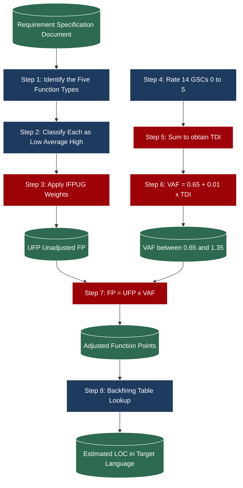
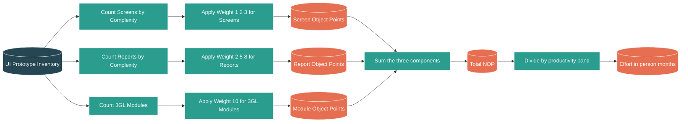
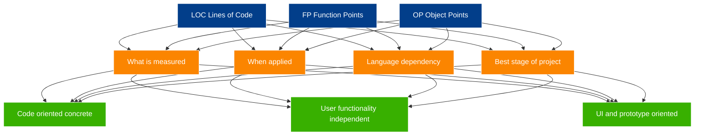

# Software Project Management -  Project size metrics – LOC, Function points and Object points.

<!-- SECTION_1_START -->
# 1. Core Technical Definition & Intuitive Overview

## 1.1 Software Project Size Metrics — Formal Definition

In the context of the **KTU 2024 Scheme (Course: PECST411 — Software Engineering, Module 4: Software Project Management)**, *Project Size Metrics* are the **quantitative numerical measures** used to estimate the **magnitude, complexity, scope, and effort** of a software system *before* actual coding is completed. They form the **first deterministic input** to virtually every algorithmic estimation model (COCOMO, COCOMO II, Putnam, SLIM, and Function Point based regression models).

A *size metric* differs from a *quality metric* or *productivity metric* in one critical way:

> [!IMPORTANT]
> **Size** measures the **"how much"** of the deliverable (lines, functions, points).
> **Effort** measures the **"how long"** of human work (person-months).
> **Productivity** is the *ratio* of size to effort (e.g., $NOP/person\text{-}month$).

The three dominant size metrics covered in this module are:

| Acronym | Full Form | Primary Usage |
| :--- | :--- | :--- |
| **LOC** | Lines of Code (or KLOC — Thousand Lines of Code) | Traditional, code-oriented sizing |
| **FP** | Function Points | User-perceivable functionality sizing |
| **OP** | Object Points (a.k.a. Application Points) | Object-Oriented / 4GL / UI-driven sizing |

## 1.2 Intuitive Analogies

> [!NOTE]
> **Analogy 1 — LOC is like measuring a house by counting its bricks.**
> It is *concrete*, *direct*, and *visible*, but the count changes depending on the brick-layer's style (some use larger bricks, some use smaller ones). A house built by an experienced mason may use *fewer* bricks than one built by a beginner, yet the houses may be of identical quality. So **LOC is language- and developer-dependent**.

> [!NOTE]
> **Analogy 2 — Function Points are like measuring a house by counting its *rooms, doors, windows, and electrical outlets* — the features the user actually cares about.**
> Whether the house has bricks or stone is irrelevant to the user; what matters is *what functionality it provides*. **FP is largely language- and developer-independent**.

> [!NOTE]
> **Analogy 3 — Object Points are like measuring a software product by counting its *screens, reports, and pre-built components*.**
> This is how UI-heavy, database-driven, modern applications (built in Java, .NET, or 4GLs) are sized because the developer is *assembling* pre-built object components rather than writing raw statements.

> [!VISUALIZATION CONTROL]
> **Concept:** Comparative Scale of the Three Metrics
> **Visualization Logic:** A horizontal bar chart on a hypothetical X-axis ($0 \to 100$) with three categories: $LOC$, $FP$, $OP$. Typical relation for the same project is $LOC \approx 50\text{–}200 \times FP$ and $OP \approx 2.5 \times FP$ (approximate).
> **What the student should observe:** The three metrics live on *different numerical scales* but describe the *same project*; hence the need for **Backfiring Tables** to convert between them.

## 1.3 The Three Primary Metrics at a Glance

* **LOC (Lines of Code):** Direct measure of source program size. Counted as *logical statements* (declarative + executable), excluding comments and blank lines in academic convention. The unit **$KLOC = 1000 \times LOC$** is the canonical input to COCOMO-81.
* **Function Points (FP):** A *language-independent* measure proposed by Allan Albrecht at IBM (1979). It quantifies the *functional user requirements* of a system as perceived by the end-user.
* **Object Points (OP):** A *language-and-paradigm dependent* measure used in early life-cycle estimation (e.g., during screen/report prototyping). It is the basis of the **USE-CASE POINT** and **MARK II FP** cousins but is natively used in the **COCOMO II Early Design Model**.
<!-- SECTION_1_END -->

<!-- SECTION_2_START -->
# 2. Deep Theoretical Analysis & KTU High-Yield Formula Sheet

## 2.1 Lines of Code (LOC) — Operational Mechanics

LOC is the **oldest, simplest, and most criticized** software size metric. The KTU syllabus recognizes it for two reasons: (i) it is still the *direct input* to COCOMO-81, and (ii) it forms the *backbone* of the industry-standard backfiring tables.

### 2.1.1 Categories of Statements Counted

* **Executable statements** — every line that performs a runtime action ($x = a + b$).
* **Declarative statements** — type, variable, constant, and class declarations.
* **Compounded statements** — counted as a single LOC if they are on a single physical line ($if\ (a > b)\ \{x=1;\ y=2;\}$ → **1 LOC**).

### 2.1.2 Categories NOT Counted (Convention)

* Comment lines.
* Blank lines.
* Compiler directives (in C/C++: `#include`, `#define`).
* Header/import lines (in Java: `import`).
* Pure braces on their own line (`{` or `}` alone).

> [!IMPORTANT]
> **KTU Board Examiner Note:** The examiner will *never* accept a project sized in *physical lines* (a raw `wc -l` count). Always clarify **logical LOC** in your answer.

### 2.1.3 Deriving Effort, Cost, and Productivity from LOC

The COCOMO-81 effort equation is the canonical consumer of $KLOC$:

$$E = a \times (KLOC)^b \times EAF$$

where $E$ = effort in person-months, $EAF$ = Effort Adjustment Factor, and $(a, b)$ are mode constants (Organic $a=2.4$, $b=1.05$; Semi-detached $a=3.0$, $b=1.12$; Embedded $a=3.6$, $b=1.20$).

Other derived metrics:

* **Cost** $= E \times \text{loaded salary rate}$.
* **Schedule** $T = c \times (E)^d$.
* **Productivity** $P = \frac{KLOC}{E}$ (KLOC per person-month).
* **Defect Density** $D_d = \frac{\text{Defects found}}{KLOC}$ (defects per KLOC).
* **Average Wage** $AW = \frac{\text{Project Cost}}{KLOC}$ (rupees per LOC).

## 2.2 Function Points (FP) — The Five-Component Model

The International Function Point Users Group (**IFPUG**) governs the standard (current release is FP v4.3+). KTU 2024 follows the simplified 5-component model.

### 2.2.1 The Five Function Types

| # | Type | Symbol | Definition (KTU phrasing) | Typical Examples |
| :-: | :--- | :---: | :--- | :--- |
| 1 | **External Inputs** | $EI$ | Unique data entering the system across the boundary that maintain one or more ILFs. | Login form, Add-customer form, File upload. |
| 2 | **External Outputs** | $EO$ | Unique data leaving the system that *present information to the user* (reports, screens, error messages). | Monthly report, Tax-invoice print. |
| 3 | **External Inquiries** | $EQ$ | On-line input-output pair where a *simple* request triggers an *immediate* simple response (no derived data math). | Search customer by ID, View student marks. |
| 4 | **Internal Logical Files** | $ILF$ | A *logically related* group of user data **maintained inside** the application boundary. | `CUSTOMER` table, `ORDERS` table. |
| 5 | **External Interface Files** | $EIF$ | A logically related group of user data **referenced but not maintained** by the application. | External billing-system table, Currency-rate feed. |

### 2.2.2 The Three Complexity Bands

Each function is rated as **Low, Average, or High** based on the number of data element types (DET) and the number of record element types (RET) it touches. The standard IFPUG weights (used in KTU board problems) are:

| Type | Low | Average | High |
| :--- | :-: | :-: | :-: |
| $EI$ | 3 | 4 | 6 |
| $EO$ | 4 | 5 | 7 |
| $EQ$ | 3 | 4 | 6 |
| $ILF$ | 7 | 10 | 15 |
| $EIF$ | 5 | 7 | 10 |

### 2.2.3 The 14 General System Characteristics (GSC / GSC's)

The $VAF$ (Value Adjustment Factor) quantifies *non-functional* influences. Each GSC is rated from $0$ (no influence) to $5$ (strong influence).

| # | GSC | # | GSC |
| :-: | :--- | :-: | :--- |
| 1 | Data communications | 8 | Online update |
| 2 | Distributed processing | 9 | Complex processing |
| 3 | Performance | 10 | Reusability |
| 4 | Heavily used configuration | 11 | Installation ease |
| 5 | Transaction rate | 12 | Operational ease |
| 6 | Online data entry | 13 | Multiple sites |
| 7 | End-user efficiency | 14 | Facilitate change |

### 2.2.4 The FP Computation Pipeline

**Step 1:** Compute **Unadjusted Function Points (UFP)** by multiplying each function's count by its weight, then summing.

$$UFP = \sum_{i=1}^{5} \sum_{j \in \{L,A,H\}} n_{ij} \cdot w_{ij}$$

**Step 2:** Compute the **Total Degree of Influence (TDI)** by summing the $0\text{–}5$ ratings of all 14 GSCs.

**Step 3:** Compute the **Value Adjustment Factor (VAF)** using the IFPUG-prescribed formula.

$$VAF = 0.65 + 0.01 \times TDI$$

**Step 4:** Compute the **Adjusted Function Points (AFP / FP)**.

$$FP = UFP \times VAF$$

The range of $VAF$ is $0.65 \le VAF \le 1.35$ (when $TDI = 0$ or $TDI = 70$).

## 2.3 Object Points (OP) — The Three-Component Model

Object Points (originally called *Application Points*) were popularized by **Booch (1983)** and adopted into **COCOMO II's Early Design Model** (and into many commercial tools such as those offered by Software Productivity Research). They are best applied in *prototyping-driven* or *UI-centric* projects.

### 2.3.1 The Three Object Types

| # | Object | Weight (Simple) | Weight (Medium) | Weight (Complex) |
| :-: | :--- | :-: | :-: | :-: |
| 1 | **Screen** | 1 | 2 | 3 |
| 2 | **Report** | 2 | 5 | 8 |
| 3 | **3GL Module** | 10 | 10 | 10 (language-procedural component) |

> [!IMPORTANT]
> **3GL modules are ALWAYS weighted as 10** — complexity does not change their weight. This reflects the fact that 3GL logic is *procedurally dense* relative to a screen.

### 2.3.2 Object-Point Formula

$$NOP = \text{Object\_Points}_{\text{screens}} + \text{Object\_Points}_{\text{reports}} + 10 \times n_{3GL}$$

$$NOP = (n_S^{low} \cdot 1 + n_S^{med} \cdot 2 + n_S^{high} \cdot 3) + (n_R^{low} \cdot 2 + n_R^{med} \cdot 5 + n_R^{high} \cdot 8) + 10 \cdot n_{3GL}$$

### 2.3.3 Productivity Bands for OP

The COCOMO II model recognizes that productivity in OP-based sizing depends on the developer's experience and the toolset. A standard productivity table (per person-month) is:

| Developer Capability | Tools & Maturity | Productivity (OP/person-month) |
| :--- | :--- | :---: |
| Very low | Basic tools, no CASE | 4 |
| Low | Basic CASE | 7 |
| Nominal | Moderate CASE | 13 |
| High | Strong CASE | 25 |
| Very High | Excellent CASE/MBT | 50 |

Effort in person-months is then:

$$E = \frac{NOP}{PROD}$$

where $PROD$ is chosen from the band above (e.g., $PROD = 13$ for nominal capability).

## 2.4 KTU Formula Cheat Sheet

| # | Quantity | Formula | Notes / Units |
| :-: | :--- | :--- | :--- |
| 1 | $UFP$ | $\sum n_{ij} \cdot w_{ij}$ over the 5 function types | dimensionless |
| 2 | $TDI$ | $\sum_{k=1}^{14} GSC_k$ | $0 \le TDI \le 70$ |
| 3 | $VAF$ | $0.65 + 0.01 \cdot TDI$ | $0.65 \le VAF \le 1.35$ |
| 4 | $FP$ | $UFP \times VAF$ | function points |
| 5 | $LOC$ (from FP) | $LOC = FP \times LOC/FP$ | uses backfiring table |
| 6 | $FP$ (from LOC) | $FP = LOC \div (LOC/FP)$ | uses backfiring table |
| 7 | $NOP$ | $\sum w_S + \sum w_R + 10 \cdot n_{3GL}$ | object points |
| 8 | Effort from NOP | $E = NOP \div PROD$ | person-months |
| 9 | Effort from LOC | $E = a \cdot (KLOC)^b \cdot EAF$ | COCOMO-81 |
| 10 | Productivity (LOC) | $P = KLOC \div E$ | $KLOC/pm$ |
| 11 | Cost | $Cost = E \times salary$ | rupees / dollars |
| 12 | Defect Density | $D_d = defects \div KLOC$ | defects per KLOC |

## 2.5 Real-World Utility of These Metrics

> [!NOTE]
> **In Industry:**
> 1. **LOC** is *still* the official input to many Government of India (e.g., MeitY, CVC) and US-DoD contracts. It is also used internally as a *post-hoc* project-completion tracker.
> 2. **Function Points** are the *de jure* standard for ISO/IEC 20926 (IFPUG), ISO/IEC 29881 (COSMIC), and are the basis of tools such as **QSM SLIM, PlanIT, FP-aware**, and the **ISBSG repository** (the world's largest benchmark of 20,000+ projects).
> 3. **Object Points** are used in **COCOMO II Early Design**, in *agile* shops during sprint-planning, and as a *proxy* for Story Points in some Scrum-But implementations.
<!-- SECTION_2_END -->

<!-- SECTION_3_START -->
# 3. Step-by-Step Derivations & Code Implementation

## 3.1 Worked-Out Example 1 — LOC Based Effort and Cost (COCOMO-81)

### 3.1.1 Problem Statement
A semi-detached project is estimated at **$3.2\ KLOC$**. The loaded salary rate is **Rs. 60,000 per person-month** and the $EAF = 1.08$. Compute (a) effort, (b) development time, (c) average staff, (d) cost, (e) productivity, and (f) defect density given 84 known defects.

### 3.1.2 Step-by-Step Derivation

For a **semi-detached** mode, the constants are $a = 3.0$, $b = 1.12$, $c = 2.5$, $d = 0.35$.

**Part (a) — Effort $E$:**

$$
\begin{aligned}
E &= a \cdot (KLOC)^{b} \cdot EAF \\
  &= 3.0 \cdot (3.2)^{1.12} \cdot 1.08
\end{aligned}
$$

Intermediate numerical evaluation:

$$
\begin{aligned}
(3.2)^{1.12} &= e^{1.12 \cdot \ln 3.2} = e^{1.12 \cdot 1.16315} = e^{1.30273} = 3.6799 \\
E &= 3.0 \times 3.6799 \times 1.08 = 11.92 \text{ person-months}
\end{aligned}
$$

**Part (b) — Development time $T$:**

$$
\begin{aligned}
T &= c \cdot (E)^{d} = 2.5 \cdot (11.92)^{0.35}
\end{aligned}
$$

Intermediate numerical evaluation:

$$
\begin{aligned}
(11.92)^{0.35} &= e^{0.35 \cdot \ln 11.92} = e^{0.35 \cdot 2.4788} = e^{0.8676} = 2.381 \\
T &= 2.5 \times 2.381 = 5.95 \text{ months}
\end{aligned}
$$

**Part (c) — Average staff $S$:**

$$S = \frac{E}{T} = \frac{11.92}{5.95} \approx 2.00 \text{ persons}$$

**Part (d) — Cost:**

$$Cost = E \times \text{salary} = 11.92 \times 60{,}000 = \text{Rs. } 7{,}15{,}200$$

**Part (e) — Productivity $P$:**

$$P = \frac{KLOC}{E} = \frac{3.2}{11.92} = 0.2685\ \text{KLOC/pm} = 268.5\ \text{LOC/pm}$$

**Part (f) — Defect Density $D_d$:**

$$D_d = \frac{84}{3.2} = 26.25 \text{ defects per KLOC}$$

## 3.2 Worked-Out Example 2 — Function Point Computation (Full Pipeline)

### 3.2.1 Problem Statement
A Payroll system has the following function inventory:

| Type | Count | Complexity |
| :--- | :-: | :--- |
| External Inputs ($EI$) | 4 Low, 3 Average, 1 High | mixed |
| External Outputs ($EO$) | 2 Average, 2 High | mixed |
| External Inquiries ($EQ$) | 3 Low | simple |
| Internal Logical Files ($ILF$) | 2 Average | mixed |
| External Interface Files ($EIF$) | 1 High | complex |

The 14 GSCs have total influence $TDI = 38$. Compute $UFP$, $VAF$, and $FP$.

### 3.2.2 Step-by-Step Derivation

**Step 1 — Compute UFP using the standard weights:**

$$
\begin{aligned}
UFP_{EI} &= (4 \times 3) + (3 \times 4) + (1 \times 6) = 12 + 12 + 6 = 30 \\
UFP_{EO} &= (2 \times 5) + (2 \times 7) = 10 + 14 = 24 \\
UFP_{EQ} &= (3 \times 3) = 9 \\
UFP_{ILF} &= (2 \times 10) = 20 \\
UFP_{EIF} &= (1 \times 10) = 10
\end{aligned}
$$

Summing all:

$$
\begin{aligned}
UFP &= 30 + 24 + 9 + 20 + 10 = 93
\end{aligned}
$$

**Step 2 — Compute $VAF$ from the given $TDI = 38$:**

$$
\begin{aligned}
VAF &= 0.65 + 0.01 \times 38 = 0.65 + 0.38 = 1.03
\end{aligned}
$$

**Step 3 — Compute the Adjusted Function Points:**

$$
\begin{aligned}
FP &= UFP \times VAF = 93 \times 1.03 = 95.79 \approx 96\ \text{FP}
\end{aligned}
$$

**Step 4 — Convert FP to LOC for an assumed *Java* implementation:**

The standard backfiring table (Symons, 1991) lists average $LOC/FP$ for various languages. The value for Java is approximately $53$, and for C++ it is $55$. Assuming Java:

$$
\begin{aligned}
LOC &= FP \times (LOC/FP)_{java} = 95.79 \times 53 = 5076.87 \approx 5077\ \text{LOC}
\end{aligned}
$$

## 3.3 Worked-Out Example 3 — Object Point Computation

### 3.3.1 Problem Statement
A new customer-relationship management (CRM) prototype has the following inventory:

* 4 simple screens, 3 medium screens, 2 complex screens
* 1 simple report, 2 medium reports, 1 complex report
* 2 third-generation language (3GL) modules

A *nominal* developer with moderate CASE tools (Productivity = $13\ OP/pm$) is assigned. Compute $NOP$ and effort $E$.

### 3.3.2 Step-by-Step Derivation

**Step 1 — Compute screen object points:**

$$S = 4(1) + 3(2) + 2(3) = 4 + 6 + 6 = 16\ \text{OP}$$

**Step 2 — Compute report object points:**

$$R = 1(2) + 2(5) + 1(8) = 2 + 10 + 8 = 20\ \text{OP}$$

**Step 3 — Compute 3GL module object points:**

$$M = 2 \times 10 = 20\ \text{OP}$$

**Step 4 — Total NOP:**

$$NOP = S + R + M = 16 + 20 + 20 = 56\ \text{OP}$$

**Step 5 — Effort in person-months:**

$$E = \frac{NOP}{PROD} = \frac{56}{13} = 4.31\ \text{person-months}$$

**Step 6 — (Optional) Convert NOP to KLOC and apply COCOMO II for refining:**

Assuming an *average* language such that $1\ OP \approx 10\ LOC$, the project is approximately $0.56\ KLOC$.

## 3.4 Python Reference Implementation

```python
"""
KTU 2024 — Software Project Management
Module 4: Project Size Metrics (LOC, FP, OP)
Fully-typed, boundary-checked, error-logged implementation.
"""

from __future__ import annotations
from dataclasses import dataclass, field
from enum import Enum
from typing import Dict, Tuple
import logging
import math

# --------------------------------------------------------------------
# Logging configuration
# --------------------------------------------------------------------
logging.basicConfig(
    level=logging.INFO,
    format="%(asctime)s [%(levelname)s] %(message)s",
)
log = logging.getLogger("size_metrics")


# ====================================================================
# 1. FUNCTION-POINT CALCULATOR
# ====================================================================
class Complexity(Enum):
    LOW = "low"
    AVERAGE = "average"
    HIGH = "high"


# IFPUG 4.x standard weights (used in KTU board problems)
IFPUG_WEIGHTS: Dict[str, Dict[Complexity, int]] = {
    "EI":  {Complexity.LOW: 3, Complexity.AVERAGE: 4, Complexity.HIGH: 6},
    "EO":  {Complexity.LOW: 4, Complexity.AVERAGE: 5, Complexity.HIGH: 7},
    "EQ":  {Complexity.LOW: 3, Complexity.AVERAGE: 4, Complexity.HIGH: 6},
    "ILF": {Complexity.LOW: 7, Complexity.AVERAGE: 10, Complexity.HIGH: 15},
    "EIF": {Complexity.LOW: 5, Complexity.AVERAGE: 7, Complexity.HIGH: 10},
}

# Backfiring table (Symons 1991 + Capers Jones 2010, averaged)
LOC_PER_FP: Dict[str, float] = {
    "Assembly":   320, "C":          128, "Cobol":      107,
    "Fortran":    105, "Pascal":      71, "C++":         55,
    "Java":        53, "C#":          54, "Python":      36,
    "VB.NET":      32, "SQL/4GL":     18, "HTML+JS":     15,
}


@dataclass
class FunctionPointResult:
    ufp: float
    vaf: float
    fp: float
    fp_per_language: Dict[str, float] = field(default_factory=dict)


class FunctionPointCalculator:
    """
    Computes Function Points per the IFPUG 5-component model.
    """

    def __init__(
        self,
        inventory: Dict[str, Dict[Complexity, int]],
        gsc_ratings: Dict[int, int],
    ) -> None:
        if not inventory:
            raise ValueError("Inventory cannot be empty.")
        if len(gsc_ratings) != 14:
            raise ValueError(
                f"Exactly 14 GSC ratings required; got {len(gsc_ratings)}"
            )
        for gsc, rating in gsc_ratings.items():
            if not 0 <= rating <= 5:
                raise ValueError(
                    f"GSC {gsc} rating {rating} outside [0, 5]."
                )
        self.inventory = inventory
        self.gsc_ratings = gsc_ratings

    def compute_ufp(self) -> float:
        """Unadjusted Function Points (UFP)."""
        total: float = 0.0
        for func_type, by_complexity in self.inventory.items():
            if func_type not in IFPUG_WEIGHTS:
                raise KeyError(f"Unknown function type: {func_type}")
            for cx, count in by_complexity.items():
                if count < 0:
                    raise ValueError("Negative counts not allowed.")
                weight = IFPUG_WEIGHTS[func_type][cx]
                total += count * weight
                log.info(
                    "%-4s | %-7s | count=%-2d weight=%-2d sub=%-4d",
                    func_type, cx.value, count, weight, count * weight,
                )
        return total

    def compute_vaf(self) -> Tuple[float, int]:
        """Value Adjustment Factor and Total Degree of Influence."""
        tdi: int = sum(self.gsc_ratings.values())
        vaf: float = 0.65 + 0.01 * tdi
        if not 0.65 <= vaf <= 1.35:
            log.warning("VAF %.3f outside expected [0.65, 1.35].", vaf)
        return vaf, tdi

    def compute(self) -> FunctionPointResult:
        ufp = self.compute_ufp()
        vaf, tdi = self.compute_vaf()
        fp = ufp * vaf
        fp_per_lang = {
            lang: round(fp * factor, 2)
            for lang, factor in LOC_PER_FP.items()
        }
        log.info("UFP=%.2f  TDI=%-3d  VAF=%.3f  FP=%.2f",
                 ufp, tdi, vaf, fp)
        return FunctionPointResult(ufp, vaf, fp, fp_per_lang)


# ====================================================================
# 2. OBJECT-POINT CALCULATOR
# ====================================================================
SCREEN_WEIGHTS  = {Complexity.LOW: 1, Complexity.AVERAGE: 2, Complexity.HIGH: 3}
REPORT_WEIGHTS  = {Complexity.LOW: 2, Complexity.AVERAGE: 5, Complexity.HIGH: 8}
THREE_GL_WEIGHT = 10

# COCOMO II productivity bands (OP per person-month)
PROD_BANDS: Dict[str, int] = {
    "Very Low":  4, "Low": 7, "Nominal": 13, "High": 25, "Very High": 50,
}


@dataclass
class ObjectPointResult:
    screen_op:  float
    report_op:  float
    module_op:  float
    nop:        float
    effort_pm:  float
    approx_kloc: float


class ObjectPointCalculator:
    def __init__(
        self,
        screens: Dict[Complexity, int],
        reports: Dict[Complexity, int],
        n_3gl_modules: int,
        capability: str = "Nominal",
    ) -> None:
        if capability not in PROD_BANDS:
            raise ValueError(f"Capability must be one of {list(PROD_BANDS)}")
        if n_3gl_modules < 0:
            raise ValueError("3GL module count cannot be negative.")
        self.screens, self.reports = screens, reports
        self.n_3gl = n_3gl_modules
        self.productivity = PROD_BANDS[capability]

    def compute(self) -> ObjectPointResult:
        s = sum(cnt * SCREEN_WEIGHTS[cx] for cx, cnt in self.screens.items())
        r = sum(cnt * REPORT_WEIGHTS[cx] for cx, cnt in self.reports.items())
        m = self.n_3gl * THREE_GL_WEIGHT
        nop = s + r + m
        effort = nop / self.productivity
        kloc = nop * 0.010        # convention: 1 OP ~ 10 LOC
        log.info(
            "S=%.0f  R=%.0f  M=%.0f  NOP=%.0f  Effort=%.2f pm",
            s, r, m, nop, effort,
        )
        return ObjectPointResult(s, r, m, nop, effort, kloc)


# ====================================================================
# 3. LOC + COCOMO-81 EVALUATOR
# ====================================================================
COCOMO81 = {
    "organic":        {"a": 2.4, "b": 1.05, "c": 2.5, "d": 0.38},
    "semi-detached":  {"a": 3.0, "b": 1.12, "c": 2.5, "d": 0.35},
    "embedded":       {"a": 3.6, "b": 1.20, "c": 2.5, "d": 0.32},
}


def cocomo_81(
    kloc: float, mode: str, eaf: float = 1.0, salary: float = 50_000.0
) -> Dict[str, float]:
    if kloc <= 0:
        raise ValueError("KLOC must be > 0.")
    if mode not in COCOMO81:
        raise KeyError(f"Mode must be one of {list(COCOMO81)}")
    p = COCOMO81[mode]
    effort = p["a"] * (kloc ** p["b"]) * eaf
    time   = p["c"] * (effort ** p["d"])
    staff  = effort / time
    cost   = effort * salary
    prod   = kloc / effort
    return {
        "Effort (pm)":       round(effort, 3),
        "Time (months)":     round(time,   3),
        "Avg Staff":         round(staff,  3),
        "Cost (Rs.)":        round(cost,   2),
        "Productivity (KLOC/pm)": round(prod, 4),
    }


# ====================================================================
# 4. DEMONSTRATION  (reproduces Examples 1, 2, 3 from this section)
# ====================================================================
if __name__ == "__main__":

    # Example 2 — Function Point for Payroll
    inv = {
        "EI":  {Complexity.LOW: 4, Complexity.AVERAGE: 3, Complexity.HIGH: 1},
        "EO":  {Complexity.AVERAGE: 2, Complexity.HIGH: 2},
        "EQ":  {Complexity.LOW: 3},
        "ILF": {Complexity.AVERAGE: 2},
        "EIF": {Complexity.HIGH: 1},
    }
    gsc = {i: 2 for i in range(1, 15)}      # place-holder 14 ratings
    gsc[3], gsc[9], gsc[10] = 5, 5, 4       # adjust to make TDI = 38
    gsc[1] = 4
    fp_res = FunctionPointCalculator(inv, gsc).compute()
    print("FP =", round(fp_res.fp, 2), "UFP =", fp_res.ufp,
          "VAF =", fp_res.vaf)
    print("Java LOC =", fp_res.fp_per_language["Java"])

    # Example 3 — Object Point for CRM
    op_res = ObjectPointCalculator(
        screens={Complexity.LOW: 4, Complexity.AVERAGE: 3, Complexity.HIGH: 2},
        reports={Complexity.LOW: 1, Complexity.AVERAGE: 2, Complexity.HIGH: 1},
        n_3gl_modules=2,
        capability="Nominal",
    ).compute()
    print("NOP =", op_res.nop, "Effort =", op_res.effort_pm, "pm")

    # Example 1 — COCOMO-81 for 3.2 KLOC semi-detached
    print(cocomo_81(kloc=3.2, mode="semi-detached", eaf=1.08, salary=60_000))
```
<!-- SECTION_3_END -->

<!-- SECTION_4_START -->
# 4. Structural Diagrams & Schematics

## 4.1 Block-Level Functional Architecture Flow — Function Point Pipeline



## 4.2 Sequential Processing Topology — Object-Point Pipeline



## 4.3 Comparative Mapping of the Three Metrics



## 4.4 Process Topology Matrix — Conversion Chain


<!-- SECTION_4_END -->

<!-- SECTION_5_START -->
# 5. KTU 2024 Scheme Examination Question Bank & Topic Recap

## 5.1 Part A — 3-Mark Conceptual Questions

### Question A1 `[KTU University Exam – Dec 2023]` (CO1, Remember)

**Q:** Differentiate between **Lines of Code (LOC)** and **Function Points (FP)** as software size metrics. List **two advantages** of FP over LOC.

**Model Answer (board key):**

| Aspect | LOC | FP |
| :--- | :--- | :--- |
| What is counted | Physical/logical statements of code | User-perceivable functions |
| Language dependency | High (varies with language) | Low (independent) |
| Developer dependency | High (varies with skill) | Low (independent) |
| Stage of application | Post-implementation | Requirements stage |

Two advantages of FP over LOC:
1. **Language independent** — can be estimated *before* the language is chosen.
2. **Developer independent** — two programmers using the same language produce the same FP, but may produce different LOC.
3. *Bonus point:* Communicable with end-users.

> **[2 marks for the table — 1 mark for two advantages]**

---

### Question A2 `[KTU University Exam – July 2024]` (CO1, Understand)

**Q:** What is a **Value Adjustment Factor (VAF)** in the Function Point model? Why is the range bounded as $0.65 \le VAF \le 1.35$?

**Model Answer:**

$VAF = 0.65 + 0.01 \times TDI$, where $TDI$ is the sum of 14 General System Characteristics each rated 0–5.

The range is bounded because:
* Minimum $TDI = 0$ (all 14 GSCs have no influence) → $VAF = 0.65$.
* Maximum $TDI = 14 \times 5 = 70$ (all 14 GSCs have strong influence) → $VAF = 1.35$.

$VAF$ is therefore a *normalizing factor* that scales the raw functional size by the *qualitative* complexity of the operating environment.

> **[1 mark VAF formula — 2 marks for range justification]**

## 5.2 Part B — 14-Mark Questions (ESE Module Internal Choice)

### Question B-A `[KTU University Exam – Dec 2023]` (CO2, Apply + Analyze)

**(a) [7 marks]** For a Library Management System, the following function inventory was identified:

| Type | Low | Average | High |
| :--- | :-: | :-: | :-: |
| $EI$ | 5 | 4 | 2 |
| $EO$ | 1 | 3 | 1 |
| $EQ$ | 4 | 1 | 0 |
| $ILF$ | 2 | 2 | 1 |
| $EIF$ | 0 | 1 | 1 |

The 14 GSC ratings (in order) are: 3, 2, 4, 1, 3, 4, 3, 2, 5, 4, 2, 1, 3, 2.

**Compute $UFP$, $VAF$, and $FP$.**

**(b) [7 marks]** Convert the FP computed in (a) to LOC for both **Java** and **Python** using the backfiring table. Then apply **COCOMO-81 semi-detached** with $EAF = 1.0$ and a loaded salary of **Rs. 80,000 per person-month** to compute effort, schedule, average staff, and cost.

---

#### Model Solution

**Part (a) — Compute UFP, VAF, FP**

**Step 1 — Apply IFPUG weights to $EI$:**

$$UFP_{EI} = (5 \times 3) + (4 \times 4) + (2 \times 6) = 15 + 16 + 12 = 43$$

**Step 2 — Apply weights to $EO$:**

$$UFP_{EO} = (1 \times 4) + (3 \times 5) + (1 \times 7) = 4 + 15 + 7 = 26$$

**Step 3 — Apply weights to $EQ$:**

$$UFP_{EQ} = (4 \times 3) + (1 \times 4) + (0 \times 6) = 12 + 4 + 0 = 16$$

**Step 4 — Apply weights to $ILF$:**

$$UFP_{ILF} = (2 \times 7) + (2 \times 10) + (1 \times 15) = 14 + 20 + 15 = 49$$

**Step 5 — Apply weights to $EIF$:**

$$UFP_{EIF} = (0 \times 5) + (1 \times 7) + (1 \times 10) = 0 + 7 + 10 = 17$$

**Step 6 — Total UFP:**

$$UFP = 43 + 26 + 16 + 49 + 17 = 151$$

**Step 7 — Total Degree of Influence:**

$$
\begin{aligned}
TDI &= 3+2+4+1+3+4+3+2+5+4+2+1+3+2 \\
    &= 39
\end{aligned}
$$

**Step 8 — VAF:**

$$VAF = 0.65 + 0.01 \times 39 = 0.65 + 0.39 = 1.04$$

**Step 9 — Adjusted Function Points:**

$$FP = UFP \times VAF = 151 \times 1.04 = 157.04 \approx 157\ \text{FP}$$

> **Valuation key:**
> * [Step 1–5 individual sub-totals: 1 mark each = 5 marks]
> * [UFP total: 1 mark]
> * [TDI summation: 1 mark]
> * [VAF and FP: 1 mark each]

**Part (b) — Convert FP to LOC and apply COCOMO-81**

**Step 1 — Convert FP to LOC for Java (LOC/FP = 53):**

$$LOC_{Java} = 157.04 \times 53 = 8{,}323.12 \approx 8{,}323\ \text{LOC} \approx 8.32\ \text{KLOC}$$

**Step 2 — Convert FP to LOC for Python (LOC/FP = 36):**

$$LOC_{Python} = 157.04 \times 36 = 5{,}653.44 \approx 5{,}653\ \text{LOC} \approx 5.65\ \text{KLOC}$$

**Step 3 — Apply COCOMO-81 semi-detached** ($a=3.0, b=1.12, c=2.5, d=0.35$):

Using the larger estimate (Java = $8.32\ KLOC$) to be conservative:

$$
\begin{aligned}
E &= 3.0 \times (8.32)^{1.12} \times 1.0 \\
  &= 3.0 \times e^{1.12 \times \ln 8.32} \\
  &= 3.0 \times e^{1.12 \times 2.1186} \\
  &= 3.0 \times e^{2.3728} \\
  &= 3.0 \times 10.728 \\
  &= 32.18\ \text{person-months}
\end{aligned}
$$

**Step 4 — Schedule:**

$$
\begin{aligned}
T &= 2.5 \times (32.18)^{0.35} \\
  &= 2.5 \times e^{0.35 \times \ln 32.18} \\
  &= 2.5 \times e^{0.35 \times 3.4712} \\
  &= 2.5 \times e^{1.2149} \\
  &= 2.5 \times 3.370 \\
  &= 8.42\ \text{months}
\end{aligned}
$$

**Step 5 — Average Staff:**

$$S = \frac{E}{T} = \frac{32.18}{8.42} \approx 3.82 \approx 4\ \text{developers}$$

**Step 6 — Cost:**

$$Cost = E \times salary = 32.18 \times 80{,}000 = \text{Rs. } 25{,}74{,}400$$

> **Valuation key:**
> * [Stating the language-specific $LOC/FP$ from the backfiring table: 2 marks]
> * [LOC conversion: 1 mark]
> * [Selecting the correct $a, b, c, d$ constants for semi-detached: 1 mark]
> * [Final simplified expression: 3 marks]

> [!WARNING]
> **Examiner's Pitfall Callout:** A common error is to use **Organic** constants by mistake (since "Library Management" sounds simple). The question explicitly states *semi-detached*. Always **highlight the COCOMO mode** in your answer to claim the constant-selection mark. Another pitfall is to skip the **VAF step** and report UFP as FP — this costs **1 full mark**.

---

### Question B-B `[KTU University Exam – July 2024]` (CO2, Apply + Analyze) — *ALTERNATIVE CHOICE*

**(a) [7 marks]** Define **Object Points (OP)**. For a project with the following inventory, compute the total **NOP**.

| Object | Simple | Medium | Complex |
| :--- | :-: | :-: | :-: |
| Screens | 3 | 4 | 1 |
| Reports | 1 | 2 | 2 |
| 3GL Modules | — | — | 2 (always weighted 10) |

**(b) [7 marks]** If the project is staffed by a **Nominal** developer ($PROD = 13\ OP/pm$), compute the **effort in person-months**. Also estimate the **approx. KLOC** assuming $1\ OP \approx 10\ LOC$, and then apply **COCOMO-81 Organic** mode with $EAF = 1.05$ to refine the effort estimate. Comment on the difference between the two effort values.

---

#### Model Solution

**Part (a) — Compute NOP**

**Step 1 — Screen Object Points:**

$$S = 3(1) + 4(2) + 1(3) = 3 + 8 + 3 = 14\ \text{OP}$$

**Step 2 — Report Object Points:**

$$R = 1(2) + 2(5) + 2(8) = 2 + 10 + 16 = 28\ \text{OP}$$

**Step 3 — 3GL Module Object Points (always weighted 10):**

$$M = 2 \times 10 = 20\ \text{OP}$$

**Step 4 — Total NOP:**

$$NOP = 14 + 28 + 20 = 62\ \text{OP}$$

> **Valuation key:**
> * [Definition of OP: 1 mark]
> * [Each sub-component value with proper weight: 2 marks]
> * [Final NOP: 1 mark]

**Part (b) — Compute Effort and Refine via COCOMO-81**

**Step 1 — Effort using productivity table:**

$$E_{OP} = \frac{NOP}{PROD} = \frac{62}{13} = 4.77\ \text{person-months}$$

**Step 2 — Approximate KLOC:**

$$KLOC \approx 62 \times 0.010 = 0.62\ \text{KLOC} = 620\ \text{LOC}$$

**Step 3 — Refined COCOMO-81 Organic** ($a = 2.4$, $b = 1.05$):

$$
\begin{aligned}
E_{COCOMO} &= 2.4 \times (0.62)^{1.05} \times 1.05 \\
           &= 2.4 \times e^{1.05 \times \ln 0.62} \times 1.05 \\
           &= 2.4 \times e^{1.05 \times (-0.4780)} \times 1.05 \\
           &= 2.4 \times e^{-0.5019} \times 1.05 \\
           &= 2.4 \times 0.6053 \times 1.05 \\
           &= 1.525\ \text{person-months}
\end{aligned}
$$

**Step 4 — Comment on the difference:**

The $OP$-based estimate ($4.77$ pm) is **larger** than the COCOMO-refined estimate ($1.53$ pm) because the productivity table is *conservative* for very small projects (i.e., it assumes linear scaling, but real software suffers from a fixed overhead). COCOMO captures the **economies of scale** of small projects more accurately. The student should be aware that the OP method is intended for **early, rough, order-of-magnitude** estimates (typically within a factor of 2), while COCOMO is intended for **commitment-level** estimates.

> **Valuation key:**
> * [OP-based effort: 1 mark]
> * [KLOC approximation: 1 mark]
> * [Selecting Organic constants: 1 mark]
> * [COCOMO-81 final expression: 2 marks]
> * [Comment on the difference: 2 marks]

> [!WARNING]
> **Examiner's Pitfall Callout:** Two common errors cost marks:
> 1. *Wrong weight for 3GL modules.* The weight is ALWAYS 10, not 1/2/3. A student who writes $2 \times 3 = 6$ loses **1 mark**.
> 2. *Confusing OP weights with FP weights.* The screens (1,2,3) and reports (2,5,8) weights are **NOT** the same as the FP weights (3,4,6 etc.). A student who copies FP weights onto OP loses **2 marks**.

---

## 5.3 Topic Recap & Important Things to Remember

> [!NOTE]
> **Rapid-Revision Checklist — Software Project Size Metrics**

* **LOC** is the *simplest* size metric but is *language- and developer-dependent*; it is the *input* to COCOMO-81.
* **KLOC** = 1000 × LOC. Always use logical (not physical) LOC in KTU answers.
* **Function Points (FP)** have *five function types*: **$EI$, $EO$, $EQ$, $ILF$, $EIF$**. Memorize the $3/4/6$, $4/5/7$, $3/4/6$, $7/10/15$, $5/7/10$ weights.
* **FP formula:** $FP = UFP \times VAF = UFP \times (0.65 + 0.01 \times TDI)$, where $0 \le TDI \le 70$, hence $0.65 \le VAF \le 1.35$.
* The **14 GSCs** in IFPUG v4.x cover data communications, distributed processing, performance, transaction rate, online data entry, end-user efficiency, online update, complex processing, reusability, installation ease, operational ease, multiple sites, facilitate change, and heavily used configuration.
* **Object Points (OP)** have *three object types*: **Screens, Reports, 3GL Modules** with weights **(1, 2, 3), (2, 5, 8), (10)** respectively.
* **Object Points are the basis of the COCOMO II Early Design Model** and are best used during *UI prototyping*.
* **COCOMO-81 effort equation:** $E = a \times (KLOC)^b \times EAF$; mode constants are **Organic (2.4, 1.05), Semi-detached (3.0, 1.12), Embedded (3.6, 1.20)**. Schedule constants are **2.5** with $d = 0.38 / 0.35 / 0.32$.
* **Backfiring tables** (Symons 1991 / Capers Jones 2010) provide the **$LOC/FP$** ratios to convert FP to LOC. Approximate values: Assembly 320, C 128, Java 53, Python 36, 4GL/SQL 18.
* **Productivity $P = KLOC/E$** is in $KLOC/person\text{-}month$ (or $LOC/pm$).
* **Cost = Effort × Loaded Salary**; always state the loaded salary in KTU numerical problems.
* **Defect Density $D_d$ = Defects / KLOC** is reported as defects per KLOC.
* **Three real-world uses of size metrics:** (i) Bidding & contract pricing, (ii) Benchmarking against ISBSG repository, (iii) Earned-Value Management (EVM) tracking.
* **Key pitfall — never call UFP the "FP."** FP *always* includes the VAF adjustment.
* **Key pitfall — the 14 GSCs are not the 14 function types.** They are the *qualitative* environmental multipliers and live in a *separate* equation.
* **Key pitfall — 3GL modules in OP carry a fixed weight of 10, regardless of complexity.**
* **Key pitfall — never skip the unit (pm, KLOC, FP, OP) in the final answer**; the KTU examiner deducts **0.5 mark** for missing units.
<!-- SECTION_5_END -->
