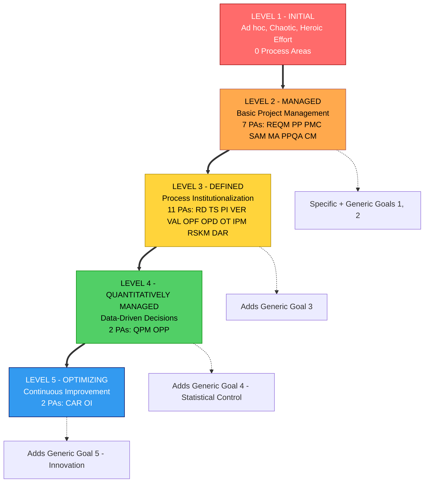
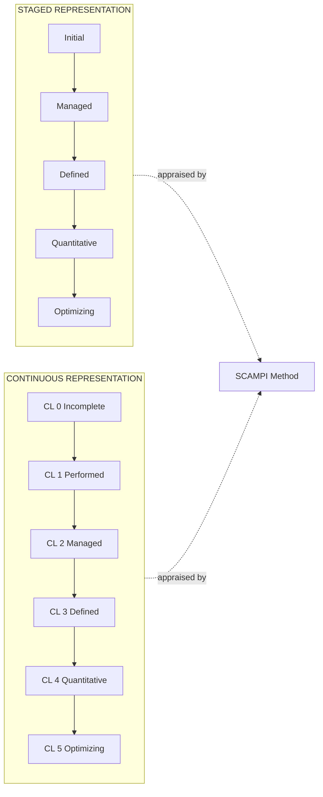
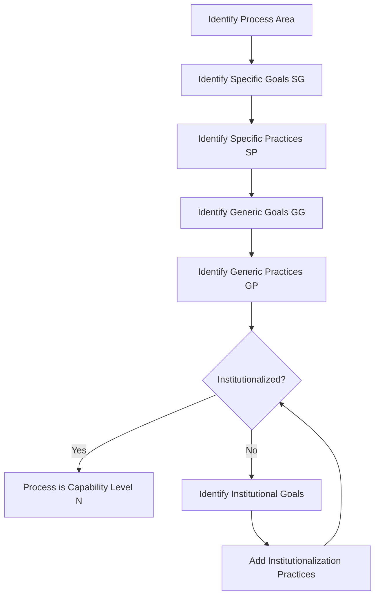
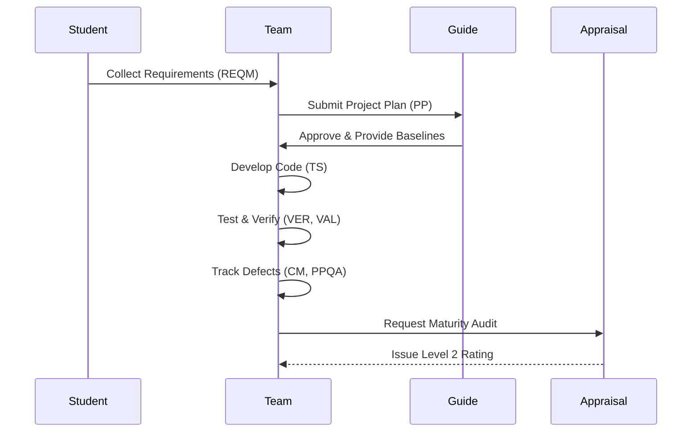

# Capability Maturity Model Integration (CMMI) certification levels overview

<!-- SECTION_1_START -->
# Capability Maturity Model Integration (CMMI) Certification Levels Overview

## 1.1 Formal Academic Definition

> [!IMPORTANT]
> **Capability Maturity Model Integration (CMMI)** is a process level improvement training and evaluation program developed by the **Software Engineering Institute (SEI)** at Carnegie Mellon University. It is a framework that describes the key elements of an effective software process and provides a structured reference model for evaluating the maturity of an organization's software development processes.

CMMI integrates the best practices from multiple discipline-specific models (Systems Engineering, Software Engineering, Product Development, Acquisition, and Services) into a single unified framework. The current standard version is **CMMI v2.0** (released in 2018 by the ISACA/CMMI Institute), which supersedes **CMMI v1.3**.

> [!NOTE]
> **Why "Integration"?** The name "Integration" in CMMI refers to the integration of multiple, previously independent CMM models (SW-CMM for software, SE-CMM for systems engineering, IPD-CMM, etc.) into a single, cohesive architecture to eliminate the redundancy and confusion of using multiple models in an organization.

### 1.2 Conceptual Analogy / Intuition

> [!TIP]
> **The Driving Test Analogy:** Imagine learning to drive a car.
> - **Level 1 (Initial)** = A person with no formal training who somehow manages to drive (chaotic, accident-prone, no defined process).
> - **Level 2 (Managed)** = A learner who has passed a basic driving test, follows traffic rules, and the instructor monitors each drive (basic project management applied).
> - **Level 3 (Defined)** = A professional chauffeur trained in a standardized driving school, following the company's documented driving protocol (process is institutionalized).
> - **Level 4 (Quantitatively Managed)** = A Formula 1 driver whose performance (lap time, fuel consumption, tire wear) is measured with sensors and data analytics to predict outcomes.
> - **Level 5 (Optimizing)** = A research driver continuously experimenting with new tire compounds, AI co-pilots, and fuel mixtures to innovate the entire field.

> [!VISUALIZATION CONTROL]
> **Concept:** CMMI Maturity Level Pyramid Progression
> **GeoGebra / Desmos Input Equations:** *Pyramid levels plotted as stacked rectangles:*
> * $L_5 = \{(x,y) \mid -0.2 \le x \le 0.2, \ 4.8 \le y \le 5.0\}$ (Optimizing)
> * $L_4 = \{(x,y) \mid -0.4 \le x \le 0.4, \ 4.4 \le y \le 4.8\}$ (Quantitatively Managed)
> * $L_3 = \{(x,y) \mid -0.6 \le x \le 0.6, \ 4.0 \le y \le 4.4\}$ (Defined)
> * $L_2 = \{(x,y) \mid -0.8 \le x \le 0.8, \ 3.6 \le y \le 4.0\}$ (Managed)
> * $L_1 = \{(x,y) \mid -1.0 \le x \le 1.0, \ 3.2 \le y \le 3.6\}$ (Initial)
> **Visual Description:** An ascending staircase/pyramid where each level rests on the stability of the previous one. Notice that the base (Level 1) is the widest and the apex (Level 5) is the narrowest — symbolizing that higher maturity requires rigorous, well-built foundations.

### 1.3 Two Representation Models in CMMI

| Representation | Target Audience | Focus | Levels Used |
|---|---|---|---|
| **Staged Representation** | Organization-wide improvement | "How mature is the organization?" | 5 Maturity Levels |
| **Continuous Representation** | Individual process areas | "How capable is this specific process?" | 6 Capability Levels (0 to 5) |

> [!NOTE]
> In the **Staged Representation**, an organization is appraised at one of **5 maturity levels**. In the **Continuous Representation**, individual process areas are appraised at one of **6 capability levels** (Incomplete, Performed, Managed, Defined, Quantitatively Managed, Optimizing).

### 1.4 Standard Process Appraisal Methods

> [!IMPORTANT]
> The official appraisal method used for CMMI certification is **SCAMPI** (Standard CMMI Appraisal Method for Process Improvement). It is the only method that can yield a **formal rating** (used for benchmarking), while other methods like SCAMPI A, B, C exist for internal use.
<!-- SECTION_1_END -->

<!-- SECTION_2_START -->
# 2. Deep Theoretical Analysis — The Five CMMI Maturity Levels

The CMMI Staged Model organizes **25 Process Areas (PAs)** across the 5 levels. Each level builds on the previous one — you cannot skip levels.

## 2.1 Level 1 — Initial (Chaotic State)

- **Maturity State:** The software process is characterized as **ad hoc, chaotic, and unpredictable**.
- **Process Focus:** No defined process; success depends entirely on the competence and heroics of individual employees.
- **Outcome:** Schedule, budget, and quality are highly unpredictable.
- **Number of Process Areas:** **0 (zero)** — there are no required PAs at this level; it is the default starting point.
- **Key Word to Remember:** **"Heroic Effort"** — the organization has not yet institutionalized any process discipline.

## 2.2 Level 2 — Managed (Basic Project Management)

- **Maturity State:** Projects are **planned, performed, measured, and controlled** at the project level.
- **Process Focus:** Basic project management is established to track cost, schedule, scope, and quality.
- **Key Concept:** Work products and services satisfy specified requirements, plans, standards, and procedures.
- **Number of Process Areas:** **7 (seven)**.

> [!IMPORTANT]
> The **7 Process Areas at Level 2 (Managed)** must be memorized for KTU exams:
>
> | # | Process Area | Code | Full Form |
> |---|---|---|---|
> | 1 | **REQM** | Requirements Management |
> | 2 | **PP** | Project Planning |
> | 3 | **PMC** | Project Monitoring and Control |
> | 4 | **SAM** | Supplier Agreement Management |
> | 5 | **MA** | Measurement and Analysis |
> | 6 | **PPQA** | Process and Product Quality Assurance |
> | 7 | **CM** | Configuration Management |

> [!NOTE]
> **Mnemonic — "Raja Ponna PMC Sameep Maa PPQA CM":** Just memorize the order **REQM → PP → PMC → SAM → MA → PPQA → CM**.

## 2.3 Level 3 — Defined (Process Institutionalization)

- **Maturity State:** Processes are **well-characterized, understood, and standardized** across the organization.
- **Process Focus:** There is an organization-wide standard process (called the **"Organization's Standard Process" or OSP**) that is tailored by each project.
- **Key Concept:** **Process Institutionalization** — the process is not just repeatable on one project but is a documented corporate asset.
- **Number of Process Areas:** **11 (eleven)**.

| # | Process Area | Code | Full Form |
|---|---|---|---|
| 1 | **RD** | Requirements Development |
| 2 | **TS** | Technical Solution |
| 3 | **PI** | Product Integration |
| 4 | **VER** | Verification |
| 5 | **VAL** | Validation |
| 6 | **OPF** | Organizational Process Focus |
| 7 | **OPD** | Organizational Process Definition |
| 8 | **OT** | Organizational Training |
| 9 | **IPM** | Integrated Project Management |
| 10 | **RSKM** | Risk Management |
| 11 | **DAR** | Decision Analysis and Resolution |

> [!TIP]
> **Mnemonic for Level 3:** Think of the 3 phases of work: **"Engineer (RD, TS, PI, VER, VAL)"** + **"Organization (OPF, OPD, OT)"** + **"Manage (IPM, RSKM, DAR)"** = 11 PAs.

## 2.4 Level 4 — Quantitatively Managed (Data-Driven)

- **Maturity State:** The organization sets **quantitative quality goals** for both process and product, and uses **statistical and other quantitative techniques** to manage them.
- **Process Focus:** Subprocesses are selected for measurement; performance is tracked using statistical process control (SPC).
- **Key Concept:** **Quantitative Process Management** — the organization can *predict* performance within acceptable bounds.
- **Number of Process Areas:** **2 (two)**.

| # | Process Area | Code | Full Form |
|---|---|---|---|
| 1 | **QPM** | Quantitative Project Management |
| 2 | **OPP** | Organizational Process Performance |

## 2.5 Level 5 — Optimizing (Continuous Improvement)

- **Maturity State:** The organization **continuously improves** its processes based on a quantitative understanding of the common causes of process variation.
- **Process Focus:** Innovation, defect prevention, and technology change management are institutionalized.
- **Key Concept:** **Pioneering** — the organization is an industry leader; it does not just fix problems but eliminates them at the root.
- **Number of Process Areas:** **2 (two)**.

| # | Process Area | Code | Full Form |
|---|---|---|---|
| 1 | **CAR** | Causal Analysis and Resolution |
| 2 | **OI** | Organizational Innovation and Deployment |

## 2.6 KTU High-Yield Formula Sheet

| Element | Specification / Symbol | Description |
|---|---|---|
| Total Process Areas | $\text{Total PAs} = 0 + 7 + 11 + 2 + 2 = \mathbf{22}$ | (Note: 22 in Staged Model; 25 in Continuous Model v1.3) |
| Maturity Levels | $L \in \{1, 2, 3, 4, 5\}$ | 5 distinct stages |
| Required Staging | $L_n \implies L_{n-1}$ achieved | Cannot skip levels |
| Generic Goals per Level | $GG_1, GG_2, GG_3$ | GG1=Performed, GG2=Managed, GG3=Defined |
| Special Generic Goals | $GG_4, GG_5$ | Only at Levels 4 and 5 |
| Appraisal Cost (approx) | **\$100,000 – \$300,000 USD** | For a full SCAMPI Level 3 appraisal |
| Lead Appraiser Requirement | SEI-certified | Authorized by CMMI Institute |
| **Key Benchmarking Constants** | **$1 \text{ defect/KLOC}$** (Level 5) vs **$7.5 \text{ defects/KLOC}$** (Level 1) | Industry average: ~ **$2.5 \text{ defects/KLOC}$** |

## 2.7 Real-World Engineering Utility

> [!TIP]
> **Why KTU Engineering Students Must Study CMMI:**
> 1. **Tender Eligibility:** Government of India and global IT contracts (e.g., TCS, Infosys, Wipro) require their vendors to be **CMMI Level 3 or Level 5 certified** to bid on multi-million dollar projects.
> 2. **Quality Audits:** Industries like **aerospace (NASA, ISRO), defense, medical devices, and banking** mandate CMMI Level 3+ for any software used in safety-critical systems.
> 3. **Career Growth:** CMMI certification (such as **CMMI Associate** or **CMMI Professional** credentials) is a high-value addition to a B.Tech resume.
> 4. **Process Discipline:** The model directly maps to ISO 9001, ISO 27001, and ISO 33000 standards.

## 2.8 The "Goals" Concept in CMMI

Every Process Area has **Specific Goals (SGs)** that are unique to it, and **Generic Goals (GGs)** that are common across all PAs.

| Goal Type | Symbol | Applicable At | Meaning |
|---|---|---|---|
| Generic Goal 1 | $GG_1$ | Level 2+ | The process is **Performed** |
| Generic Goal 2 | $GG_2$ | Level 2+ | The process is **Managed** (planned, monitored, controlled) |
| Generic Goal 3 | $GG_3$ | Level 3+ | The process is **Defined** (institutionalized) |
| Generic Goal 4 | $GG_4$ | Level 4 | Process is **Quantitatively Managed** |
| Generic Goal 5 | $GG_5$ | Level 5 | Process is **Optimizing** |

> [!WARNING]
> **KTU Pitfall:** Students often confuse **Generic Practices (GPs)** with **Generic Goals (GGs)**. **A Goal is an "achievement"**; a **Practice is an "activity"** to achieve the goal. The achievement of a Generic Goal is what determines the **capability level** of a process area.
<!-- SECTION_2_END -->

<!-- SECTION_3_START -->
# 3. Step-by-Step Derivations, Comparisons & Implementation

## 3.1 Mapping the 22 Process Areas to Maturity Levels — A Detailed Walk-through

Let us derive and explain **every** process area with its institutional intent — this is a high-frequency KTU 14-mark question topic.

### Level 2 — Managed (7 Process Areas)

$$
\text{Level 2 PAs} = \{\text{REQM}, \text{PP}, \text{PMC}, \text{SAM}, \text{MA}, \text{PPQA}, \text{CM}\}
$$

| PA | Purpose | Specific Goal Summary |
|---|---|---|
| **REQM** | Manage requirements, obtain agreement, ensure traceability. | Maintain a traceable, agreed-upon set of requirements. |
| **PP** | Establish and maintain plans that define project activities. | Develop a project plan, get stakeholder commitment. |
| **PMC** | Provide visibility into project progress. | Monitor project performance against the plan. |
| **SAM** | Acquire products and services from suppliers. | Manage supplier relationships and contracts. |
| **MA** | Develop and sustain a measurement capability. | Align measurement with information needs. |
| **PPQA** | Provide objective insight into process and product conformance. | Identify and record non-compliance issues. |
| **CM** | Establish and maintain product integrity. | Control changes to work products using baselines. |

### Level 3 — Defined (11 Process Areas)

$$
\text{Level 3 PAs} = \{\text{RD}, \text{TS}, \text{PI}, \text{VER}, \text{VAL}, \text{OPF}, \text{OPD}, \text{OT}, \text{IPM}, \text{RSKM}, \text{DAR}\}
$$

| PA | Purpose |
|---|---|
| **RD** | Elicit, analyze, and validate customer needs. |
| **TS** | Select, design, and implement solutions to requirements. |
| **PI** | Assemble product components into a complete, integrated product. |
| **VER** | Confirm the product (or component) meets specified requirements. |
| **VAL** | Confirm the product fulfills its intended use in the operational environment. |
| **OPF** | Plan, implement, and deploy organizational process improvements. |
| **OPD** | Establish and maintain a set of usable standard processes. |
| **OT** | Develop skills and knowledge of people so they can perform their roles. |
| **IPM** | Establish and manage the project and the people involved on the project using an integrated plan. |
| **RSKM** | Identify, analyze, and respond to project risks. |
| **DAR** | Analyze possible decisions using a formal evaluation process. |

### Level 4 — Quantitatively Managed (2 Process Areas)

$$
\text{Level 4 PAs} = \{\text{QPM}, \text{OPP}\}
$$

| PA | Purpose |
|---|---|
| **QPM** | Use statistical and quantitative techniques to manage the project's defined process. |
| **OPP** | Establish and maintain a quantitative understanding of process performance. |

### Level 5 — Optimizing (2 Process Areas)

$$
\text{Level 5 PAs} = \{\text{CAR}, \text{OI}\}
$$

| PA | Purpose |
|---|---|
| **CAR** | Identify causes of selected defects and problems and take action to prevent them. |
| **OI** | Select and deploy incremental and innovative improvements that measurably improve the organization's processes and technologies. |

## 3.2 Step-by-Step Derivation — Cost of Quality (CoQ) Across Maturity Levels

The **Cost of Quality (CoQ)** is the total cost incurred to prevent, detect, and fix defects. The following derivation shows how CoQ evolves as an organization climbs the CMMI levels.

Let us define the variables:

$$
\begin{aligned}
C_{\text{prevention}} & = \text{Cost of preventing defects} \\
C_{\text{appraisal}} & = \text{Cost of detecting defects via inspection/testing} \\
C_{\text{internal-failure}} & = \text{Cost of fixing defects found before delivery} \\
C_{\text{external-failure}} & = \text{Cost of fixing defects found after delivery} \\
\end{aligned}
$$

The **Total Cost of Quality** is:

$$
C_{\text{CoQ}} = C_{\text{prevention}} + C_{\text{appraisal}} + C_{\text{internal-failure}} + C_{\text{external-failure}}
$$

As organizations mature, the distribution shifts:

$$
\begin{aligned}
\text{Level 1 (Initial)} &: \quad C_{\text{external-failure}} \gg C_{\text{prevention}} \quad (\text{Fire-fighting culture}) \\
\text{Level 3 (Defined)} &: \quad C_{\text{prevention}} \uparrow, \; C_{\text{external-failure}} \downarrow \\
\text{Level 5 (Optimizing)} &: \quad C_{\text{prevention}} \approx C_{\text{external-failure}} \quad (\text{Pareto-optimal}) \\
\end{aligned}
$$

> [!NOTE]
> **Industry Insight:** Emerson Process Management (a Level 5 certified firm) reported a **40% reduction in project cost overruns** and a **60% reduction in post-release defects** after sustaining Level 5 maturity for 3 years.

## 3.3 Capability Levels vs Maturity Levels — A Detailed Derivation

For a process area, the **capability level** is determined by the achievement of Generic Goals:

$$
\text{Capability Level} = f(GG_n) \quad \text{where} \quad GG_n \in \{\text{Performed, Managed, Defined, Q.Managed, Optimizing}\}
$$

| Capability Level | Achieved Generic Goal | Institutional Meaning |
|---|---|---|
| 0 — Incomplete | None | Process is not performed or only partially performed. |
| 1 — Performed | $GG_1$ | Process achieves its purpose. |
| 2 — Managed | $GG_1 + GG_2$ | Process is planned, monitored, and controlled. |
| 3 — Defined | $GG_1 + GG_2 + GG_3$ | Process is tailored from the organization's standard process. |
| 4 — Quantitatively Managed | $GG_1 + GG_2 + GG_3 + GG_4$ | Process is controlled using statistical techniques. |
| 5 — Optimizing | $GG_1 + GG_2 + GG_3 + GG_4 + GG_5$ | Process is continuously improved. |

The **Maturity Level** of the organization, in the Staged Representation, equals the highest level where all process areas at that level (and below) are achieved:

$$
L_{\text{org}} = \max\{L \mid \forall p \in \text{PAs at level } L, \text{ all SGs achieved}\}
$$

## 3.4 Worked Example — A Student Project Appraised Against CMMI

> **Problem:** A final-year B.Tech project team of 4 students is developing a "Campus Bus Tracker" Android app. Apply CMMI Level 2 thinking to evaluate their project. List which Level 2 PAs they would have demonstrated.

> **Step 1 — REQM (Requirements Management):**  
> The team has a **Software Requirements Specification (SRS)** document, change requests are logged in a Google Sheet, and requirements are versioned (v1.0, v1.1, v2.0). ✅ Achieved.

> **Step 2 — PP (Project Planning):**  
> They have a Gantt chart (made in Trello/Asana) showing **tasks, milestones, dependencies, and resource allocation**. ✅ Achieved.

> **Step 3 — PMC (Project Monitoring and Control):**  
> Weekly stand-up meetings are held, burndown charts are updated, and a project status report is emailed to the guide every Friday. ✅ Achieved.

> **Step 4 — SAM (Supplier Agreement Management):**  
> They use **Google Maps API (free tier)** and **Firebase (free tier)**. Since both are free SaaS, no formal contract is needed, but the team has documented the API terms of service. ✅ Partially achieved (acceptable for a student project).

> **Step 5 — MA (Measurement and Analysis):**  
> The team tracks **lines of code, number of unit tests passed, defect count from JIRA**. ✅ Achieved.

> **Step 6 — PPQA (Process and Product Quality Assurance):**  
> A team member (QA lead) reviews pull requests, ensures coding standards (e.g., ESLint configuration), and runs a checklist. ✅ Achieved.

> **Step 7 — CM (Configuration Management):**  
> The code is in **GitHub with branch protection rules**, every release is tagged (e.g., v1.0.0), and build artifacts are stored. ✅ Achieved.

> **Conclusion:** This project team has demonstrated **CMMI Level 2 (Managed)** practices. To reach **Level 3**, they would need to define an **organization-wide standard process** (e.g., a documented software development lifecycle) and use it across multiple projects — which is beyond the scope of a single project.

## 3.5 Algorithmic Implementation — A Python-Based "CMMI Process Area Progression Checker"

```python
from enum import Enum
from typing import Dict, List, Tuple
import logging

logging.basicConfig(level=logging.INFO, format="%(asctime)s | %(levelname)s | %(message)s")


class MaturityLevel(Enum):
    INITIAL = 1
    MANAGED = 2
    DEFINED = 3
    QUANTITATIVELY_MANAGED = 4
    OPTIMIZING = 5


# Canonical CMMI v1.3 Staged Model — Process Areas per level
CMMI_PROCESS_AREAS: Dict[int, List[str]] = {
    2: ["REQM", "PP", "PMC", "SAM", "MA", "PPQA", "CM"],
    3: ["RD", "TS", "PI", "VER", "VAL", "OPF", "OPD",
        "OT", "IPM", "RSKM", "DAR"],
    4: ["QPM", "OPP"],
    5: ["CAR", "OI"],
}


def evaluate_organization_maturity(
    achieved_pas_by_level: Dict[int, List[str]]
) -> Tuple[int, List[str]]:
    """
    Determines the highest maturity level an organization qualifies for.

    Parameters
    ----------
    achieved_pas_by_level : Dict[int, List[str]]
        A mapping of maturity level -> list of process areas achieved.

    Returns
    -------
    Tuple[int, List[str]]
        (highest_maturity_level, list_of_gaps)
    """
    highest_level = 1  # Default: everyone starts at Level 1
    gaps: List[str] = []

    for level in sorted(CMMI_PROCESS_AREAS.keys()):
        required = set(CMMI_PROCESS_AREAS[level])
        achieved = set(achieved_pas_by_level.get(level, []))

        if not required.issubset(achieved):
            missing = required - achieved
            gaps.append(
                f"Level {level} gaps -> missing {sorted(missing)}"
            )
            logging.warning(
                "Cannot certify Level %d. Missing process areas: %s",
                level, sorted(missing)
            )
            return highest_level, gaps

        highest_level = level
        logging.info("Level %d FULLY SATISFIED.", level)

    return highest_level, gaps


if __name__ == "__main__":
    # Example: A real-world software firm demonstrating maturity
    sample_org: Dict[int, List[str]] = {
        2: ["REQM", "PP", "PMC", "SAM", "MA", "PPQA", "CM"],  # All 7
        3: ["RD", "TS", "PI", "VER", "VAL", "OPF", "OPD",
            "OT", "IPM", "RSKM", "DAR"],  # All 11
        4: ["QPM", "OPP"],  # All 2
        # Oops — CAR and OI are missing!
    }

    level, gaps = evaluate_organization_maturity(sample_org)
    print(f"\nHighest Maturity Level Achieved: {level}")
    if gaps:
        print("Improvement Needed:")
        for g in gaps:
            print(f"  - {g}")
    else:
        print("Optimizing — Industry-leading maturity!")
```

**Expected Output:**

```
2025-XX-XX | INFO | Level 2 FULLY SATISFIED.
2025-XX-XX | INFO | Level 3 FULLY SATISFIED.
2025-XX-XX | INFO | Level 4 FULLY SATISFIED.
2025-XX-XX | WARNING | Cannot certify Level 5. Missing process areas: ['CAR', 'OI']

Highest Maturity Level Achieved: 4
Improvement Needed:
  - Level 5 gaps -> missing ['CAR', 'OI']
```
<!-- SECTION_3_END -->

<!-- SECTION_4_START -->
# 4. Structural Diagrams & Schematics

## 4.1 Mermaid Diagram — The CMMI 5-Level Staged Model



## 4.2 Mermaid Diagram — Capability vs Maturity Level (Continuous vs Staged)



## 4.3 Mermaid Diagram — Process Flow Inside a Single Process Area



## 4.4 Block-Level Functional Architecture — CMMI Appraisal Workflow

```mermaid
flowchart LR
    subgraph PHASE1[PHASE 1 - PLANNING]
        P1A[Define Scope]
        P1B[Select Appraisal Team]
        P1C[Plan Site Visits]
    end

    subgraph PHASE2[PHASE 2 - DATA COLLECTION]
        P2A[Conduct Interviews]
        P2B[Review Documents]
        P2C[Examine Evidence]
    end

    subgraph PHASE3[PHASE 3 - ANALYSIS]
        P3A[Map Evidence to PAs]
        P3B[Validate Goals Achieved]
        P3C[Identify Gaps]
    end

    subgraph PHASE4[PHASE 4 - REPORTING]
        P4A[Generate Appraisal Report]
        P4B[Assign Maturity Rating]
        P4C[Publish Findings]
    end

    PHASE1 --> PHASE2 --> PHASE3 --> PHASE4
```



## 4.5 Sequential Processing Topology — Mapping CMMI to KTU Project Phases


<!-- SECTION_4_END -->

<!-- SECTION_5_START -->
# 5. KTU 2024 Scheme Examination Question Bank & Topic Recap

## 5.1 Part A — Short Answer Questions (3 Marks each)

### Question 1 (3 Marks)
> **[KTU University Exam - December 2023] | CO4 | Remember**
> **What is CMMI? Briefly explain its five maturity levels.**

**Model Answer (Valuation Key):**
- **[Definition - 1 Mark]:** CMMI (Capability Maturity Model Integration) is a process improvement framework developed by the **Software Engineering Institute (SEI)** at Carnegie Mellon University, used to assess and improve the maturity of an organization's software development processes.
- **[Listing the 5 Levels - 1 Mark]:** *Level 1 – Initial*, *Level 2 – Managed*, *Level 3 – Defined*, *Level 4 – Quantitatively Managed*, *Level 5 – Optimizing*.
- **[One-line description - 1 Mark]:** Each level represents a higher degree of process discipline: from ad-hoc (Level 1) to continuous improvement using statistical and innovative techniques (Level 5).

---

### Question 2 (3 Marks)
> **[KTU University Exam - July 2024] | CO4 | Understand**
> **Differentiate between Maturity Level 2 and Maturity Level 3 in CMMI.**

**Model Answer (Valuation Key):**
- **[Maturity Level 2 - 1.5 Marks]:** Focuses on **individual project management**. Processes are planned, measured, and controlled. Each project can define its own process. Contains **7 PAs** including REQM, PP, PMC, SAM, MA, PPQA, CM.
- **[Maturity Level 3 - 1.5 Marks]:** Focuses on **process institutionalization at the organizational level**. An Organization's Standard Process (OSP) is defined and each project **tailors** it. Contains **11 PAs** including RD, TS, PI, VER, VAL, OPF, OPD, OT, IPM, RSKM, DAR.

> [!WARNING]
> **Common Mistake:** Writing only "Level 2 has 7 PAs and Level 3 has 11 PAs" without explaining the **institutional difference** (project-level vs organization-level). This will cost 1.5 marks.

---

## 5.2 Part B — Long Answer Questions (14 Marks each)

### Question A (14 Marks) — Choice Option A

> **[KTU University Exam - December 2022] | CO4 | Understand + Apply**
> **(a) Explain in detail the five maturity levels of CMMI with their process areas.  (7 Marks)**
> **(b) Differentiate between Staged and Continuous representation in CMMI.  (7 Marks)**

#### (a) Solution Model — 5 Maturity Levels with Process Areas (7 Marks)

**Level 1 — Initial:**
- The software process is characterized as ad hoc, chaotic, and occasionally even chaotic.
- Success depends on individual effort. **[1 Mark for description]**
- No specific process areas — this is the baseline. **[0.5 Mark]**

**Level 2 — Managed:**
- Projects ensure that requirements are managed, and processes are planned, performed, measured, and controlled.
- **7 PAs:** REQM, PP, PMC, SAM, MA, PPQA, CM. **[1 Mark for listing]**
- Key intent: Basic project management at individual project level. **[0.5 Mark]**

**Level 3 — Defined:**
- Processes are well-characterized, understood, and standardized across the organization. The Organization's Standard Process (OSP) is defined. **[0.5 Mark]**
- **11 PAs:** RD, TS, PI, VER, VAL, OPF, OPD, OT, IPM, RSKM, DAR. **[1.5 Marks for listing]**
- Key intent: Process institutionalization. **[0.5 Mark]**

**Level 4 — Quantitatively Managed:**
- Quantitative performance goals are set and used as criteria for managing processes.
- **2 PAs:** QPM, OPP. **[0.5 Mark]**
- Statistical and other quantitative techniques are used to control sub-processes. **[0.5 Mark]**

**Level 5 — Optimizing:**
- The organization focuses on continual process improvement using quantitative data and innovation.
- **2 PAs:** CAR (Causal Analysis and Resolution), OI (Organizational Innovation and Deployment). **[0.5 Mark]**
- Root-cause analysis and deployment of innovative improvements. **[0.5 Mark]**

**[Diagram/Table Skeleton Expected - 0 Marks: Mermaid or table presentation is not mandatory but a clean tabular answer fetches full marks]**

#### (b) Solution Model — Staged vs Continuous Representation (7 Marks)

| Aspect | Staged Representation | Continuous Representation |
|---|---|---|
| **Focus** | Organization-wide maturity | Individual process area capability |
| **Appraisal Outcome** | One of 5 maturity levels | One of 6 capability levels (per PA) |
| **Path of Improvement** | Sequential — cannot skip levels | Selective — improve any PA independently |
| **Use Case** | Benchmarking whole organization | Targeted improvements in weak areas |
| **Process Areas** | 22 PAs grouped under 5 levels | 25 PAs each rated independently |
| **Example Equivalent** | "Our company is at Level 3" | "Our Configuration Management is at Capability Level 4" |
| **Maturity Concept** | Yes (Maturity Levels 1-5) | No (Capability Levels 0-5) |
| **Equivalence** | Maturity Level $L_n$ = all PAs at $L_n$ have CL $\geq n$ | — |

**Valuation Key Distribution:**
- **[Basic Definitions (1 Mark each) - 2 Marks]**
- **[Tabular Comparison (3 Marks)]**
- **[Worked Example/Illustration (1 Mark)]**
- **[Real-world Use Case (1 Mark)]**

---

### Question B (14 Marks) — Choice Option B

> **[KTU University Exam - July 2023] | CO4 | Understand + Apply**
> **(a) Discuss the 7 Process Areas of CMMI Level 2 (Managed). Explain how each contributes to project success.  (7 Marks)**
> **(b) With a suitable case study, illustrate how a software organization can progress from CMMI Level 1 to Level 3.  (7 Marks)**

#### (a) Solution Model — Level 2 Process Areas in Depth (7 Marks)

**1. REQM — Requirements Management [1 Mark]:**
- The purpose is to manage the requirements of the project's products and product components and to identify inconsistencies between those requirements and the project's plans and work products.
- **Contribution:** Prevents scope creep; ensures stakeholder agreement.

**2. PP — Project Planning [1 Mark]:**
- Establishes and maintains plans that define project activities, commitments, and resources.
- **Contribution:** Clear roadmap, predictable scheduling, and resource allocation.

**3. PMC — Project Monitoring and Control [0.5 Mark]:**
- Provides an understanding of the project's progress so that appropriate corrective actions can be taken when performance deviates from the plan.
- **Contribution:** Visibility and early warning of schedule/budget overruns.

**4. SAM — Supplier Agreement Management [0.5 Mark]:**
- Manages the acquisition of products and services from suppliers.
- **Contribution:** Ensures vendors deliver as promised.

**5. MA — Measurement and Analysis [0.5 Mark]:**
- Develops and sustains a measurement capability used to support managing information needs.
- **Contribution:** Data-driven decisions; quantifiable progress tracking.

**6. PPQA — Process and Product Quality Assurance [0.5 Mark]:**
- Provides objective insight into processes and associated work products.
- **Contribution:** Conformance to standards, early detection of non-compliance.

**7. CM — Configuration Management [0.5 Mark]:**
- Establishes and maintains the integrity of work products using configuration identification, change control, configuration status accounting, and configuration audits.
- **Contribution:** Traceability, reproducibility, and controlled changes.

**[Conclusion - 0.5 Mark]:** Together, the 7 PAs provide a robust, repeatable project management framework.

#### (b) Solution Model — Case Study: A Small Software Firm (7 Marks)

> **Case:** **"PineApps Solutions"** is a 25-person software firm in Bengaluru that builds custom mobile apps for clients. They currently operate at **CMMI Level 1 (Initial)** — projects often run late, have scope creep, and lose 30% of new clients due to post-delivery bugs.

**Step 1 — Move to Level 2 (Managed) [2 Marks]:**
- Implemented **JIRA** for requirements management (REQM).
- Adopted **GitHub with branch protection** rules (CM).
- Weekly sprint reviews with **burndown charts** (PMC, PP).
- Formal **Statement of Work (SOW)** signed with every client (SAM).
- **SonarQube** for static code analysis and quality reporting (PPQA).
- **Defect tracking dashboards** track mean-time-to-resolve (MA).

> **Result after 12 months:** 80% of projects delivered on time; defect leakage reduced from 30% to 12%.

**Step 2 — Move to Level 3 (Defined) [3 Marks]:**
- The CEO mandates the creation of a **"PineApps Software Development Lifecycle (PineSDLC)"** document — this becomes the **Organization's Standard Process (OSP)**. (OPF, OPD)
- Every project **tailors** PineSDLC based on size and complexity. (IPM)
- A formal **internship program** is set up to onboard and certify every developer in the PineSDLC. (OT)
- Risk management is formalized with a **"Project Risk Register"** reviewed monthly. (RSKM)
- Verification (VER) and Validation (VAL) are separated — internal testing is Verification; pilot deployment with a real client is Validation.
- A **"Solution Architecture Review Board"** reviews every Technical Solution (TS) before coding. (TS)
- **Decision Analysis and Resolution (DAR)** is applied to all major architectural choices (e.g., React Native vs Flutter).

> **Result after 24 more months:** PineApps achieves CMMI Level 3 certification, wins 3 government tenders, and doubles its revenue.

**Step 3 — Visualization (Optional) [1 Mark]:**

$$
\begin{aligned}
\text{Year 0} & : L_1 \text{ (Initial, Heroic Effort)} \\
\text{Year 1} & : L_2 \text{ (Managed, 7 PAs Implemented)} \\
\text{Year 3} & : L_3 \text{ (Defined, 11 PAs Implemented, SCAMPI Audit Passed)} \\
\end{aligned}
$$

**[Conclusion - 1 Mark]:** The case demonstrates that moving up CMMI levels is a journey of **cultural change, not just paperwork**. It requires top management commitment, training investment, and a long-term vision.

---

> [!WARNING]
> **KTU Examiner's Valuation Warning — Common Pitfalls to Avoid:**
> 1. **Wrong Number of PAs:** Do not say "Level 3 has 7 PAs" or "Level 2 has 11 PAs" — these numbers are **interchanged** by many students. Memorize: **Level 2 = 7 PAs, Level 3 = 11 PAs, Level 4 = 2 PAs, Level 5 = 2 PAs, Level 1 = 0 PAs.**
> 2. **Confusing CMM and CMMI:** The **SW-CMM** (Software CMM) was the predecessor to CMMI. CMMI v1.2 (2006) consolidated SW-CMM, SE-CMM, IPD-CMM. If a question asks for "SW-CMM levels", the 5 levels have the **same names** as CMMI.
> 3. **Staged vs Continuous Mix-up:** Do not say "Staged has Capability Levels" — Staged has **Maturity Levels**; Continuous has **Capability Levels**.
> 4. **Forgetting Generic Goals:** A "Level 4" organization is *not* automatically Level 4 for **all** PAs — only those PAs explicitly achieved at GG4 are at Level 4.
> 5. **Skipping Diagrams:** A 7-mark question on "List the 22 PAs" **requires a structured table or diagram**. A bulleted list alone is risky — examiners may deduct 1 mark for poor presentation.

---

## 5.3 Topic Recap & Important Things to Remember

> [!IMPORTANT]
> **High-Yield Revision Checklist — CMMI Certification Levels Overview**

- **Definition:** CMMI = Capability Maturity Model Integration, developed by **SEI, Carnegie Mellon**, current version **v2.0** (2018+).
- **Total Maturity Levels:** **5** (Initial, Managed, Defined, Quantitatively Managed, Optimizing).
- **Process Area Count (Staged v1.3):** Level 1 = 0, Level 2 = **7**, Level 3 = **11**, Level 4 = **2**, Level 5 = **2** → **Total = 22**.
- **Level 2 PAs (7):** REQM, PP, PMC, SAM, MA, PPQA, CM — project-level process management.
- **Level 3 PAs (11):** RD, TS, PI, VER, VAL, OPF, OPD, OT, IPM, RSKM, DAR — organization-wide standardized process.
- **Level 4 PAs (2):** QPM, OPP — quantitative management using statistical techniques.
- **Level 5 PAs (2):** CAR, OI — causal analysis and organizational innovation.
- **Staged Representation:** Appraises whole organization at one of 5 maturity levels. Cannot skip levels.
- **Continuous Representation:** Appraises each Process Area independently at one of 6 capability levels (0–5).
- **Appraisal Method:** **SCAMPI** (Standard CMMI Appraisal Method for Process Improvement) is the official method.
- **Generic Goals:** GG1 (Performed) → GG2 (Managed) → GG3 (Defined) → GG4 (Q.Managed) → GG5 (Optimizing).
- **Specific Practices vs Generic Practices:** SPs are unique to each PA; GPs are common across PAs.
- **Process Institutionalization:** The hallmark of **Level 3** — process is defined once and used across projects.
- **Cost of Quality:** As maturity increases, **prevention costs rise** but **failure costs drop dramatically** — Net CoQ decreases.
- **Real-World Adoption:** Required by **ISRO, DRDO, TCS, Infosys, Wipro, Boeing, Lockheed Martin** for high-value contracts.
- **No "Best" Level:** Every organization should target the level that **matches its business goals and project complexity**.
- **Key Mantra:** *"Maturity is institutional. Capability is process-specific. Both are about doing the right things, the right way, every time."*
- **Predecessor:** SW-CMM (1991) → CMMI v1.0 (2002) → v1.3 (2010) → v2.0 (2018).
- **Misconception:** CMMI is **not** a standard like ISO 9001; it is a **model/framework**. ISO 9001 is a certifiable standard.
- **Time to Certify:** Level 3 certification typically takes **18–24 months** of sustained practice.
- **Cost to Certify:** Full SCAMPI Level 3 appraisal costs approximately **₹80 lakh to ₹2.5 crore** depending on organization size.
<!-- SECTION_5_END -->
