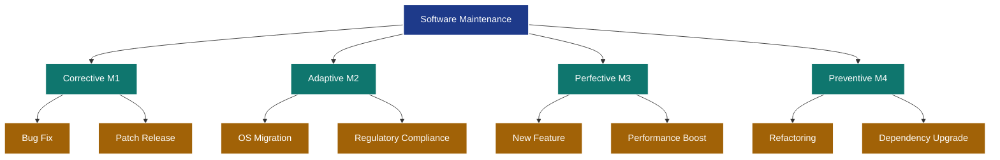
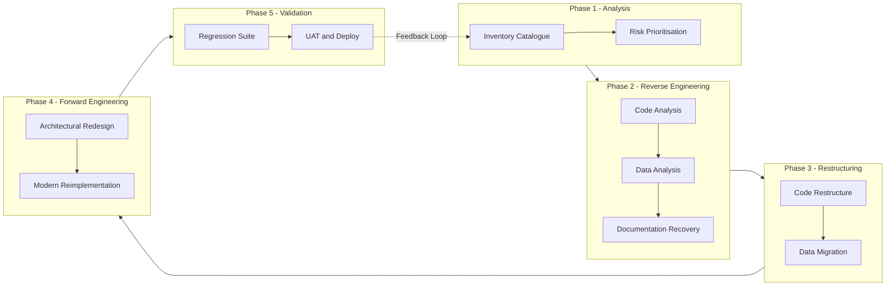
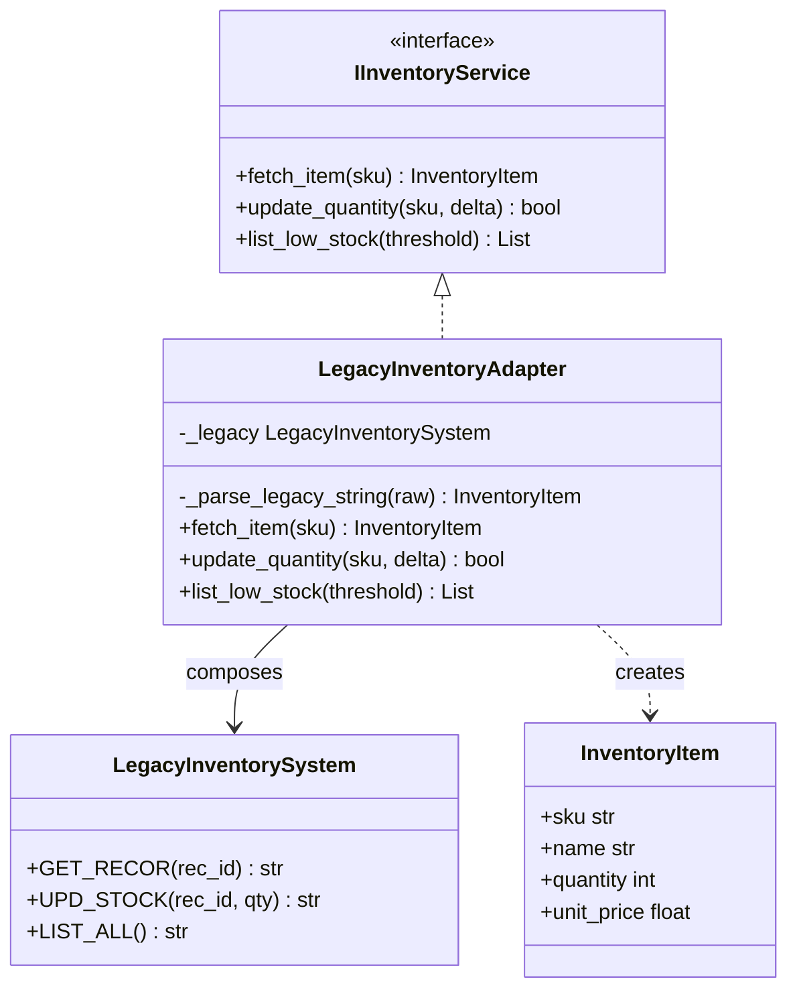
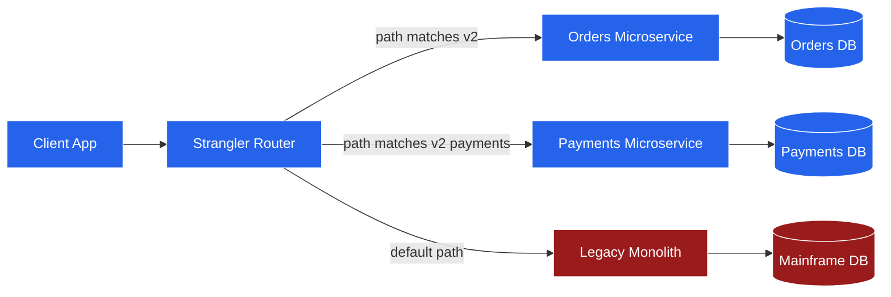
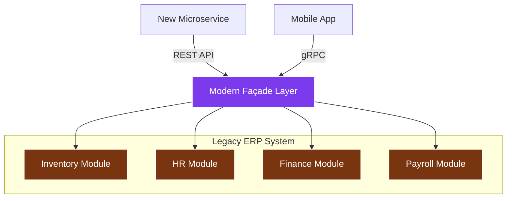
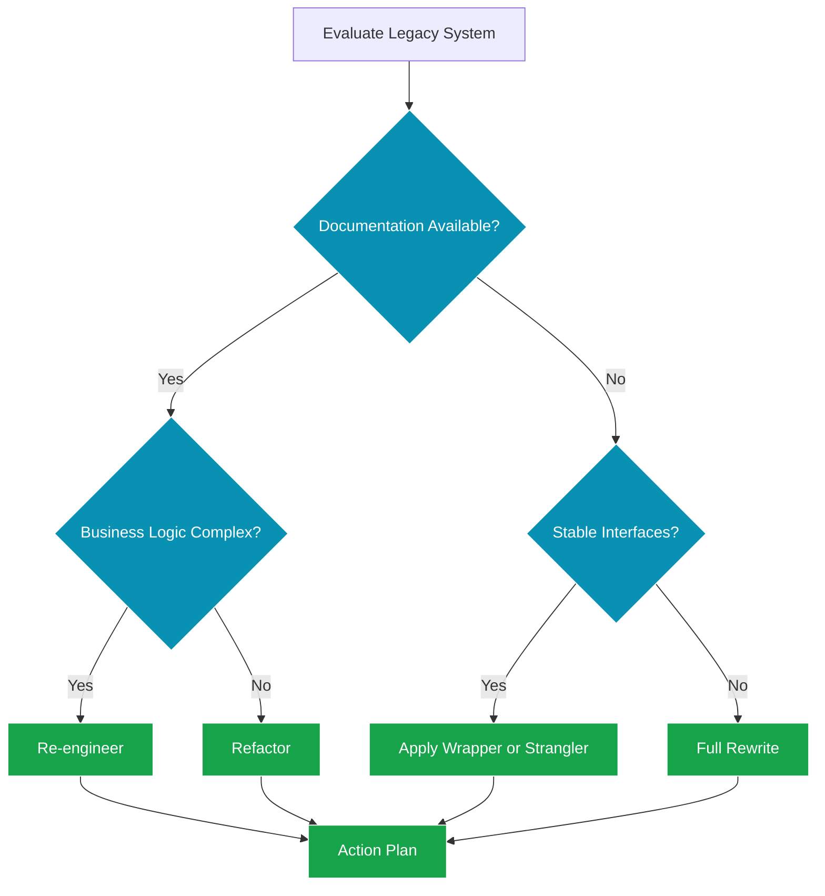

# Maintenance models, re-engineering methods, legacy software encapsulation patterns

<!-- SECTION_1_START -->
# Software Quality Assurance & Maintenance — Core Conceptual Foundation

## 1.1 Formal Academic Definition (KTU 2024 Syllabus Aligned)

**Software Maintenance** is the modification of a software product after delivery to correct faults, improve performance or other attributes, or adapt the product to a changed environment. Per the **ISO/IEC 14764:2022** standard (which KTU 2024 PECST411 references), maintenance is a *holistic* process comprising **4 orthogonal activities** mapped against the **Software Maintenance Life Cycle (SMLC)**.

> [!IMPORTANT]
> **KTU Board Definition to Memorize:** "Software maintenance is the totality of activities required to keep a software system operational, relevant, and corrected after it has been delivered into the production environment." — Adapted from *Sommerville, Software Engineering, 10th Ed., Ch. 21*.

| Maintenance Class | KTU Code | Trigger Event | Proportion (Industry Avg.) |
|---|---|---|---|
| Corrective | M1 | Defect report / bug fix | **~20%** |
| Adaptive | M2 | Environment / regulation change | **~25%** |
| Perfective | M3 | New user requirements | **~50%** |
| Preventive | M4 | Risk reduction / code decay | **~5%** |

**Re-engineering** is defined as the *systematic transformation* of an existing software system into a new form with improved structure, performance, or maintainability — **without changing its external behavior**. It is distinct from *new development* because functional semantics are preserved.

**Legacy Software Encapsulation** refers to the architectural discipline of *wrapping* obsolete, undocumented, or incompatible legacy modules behind a **stable, modernized interface contract** so that the rest of the system can communicate with them through contemporary protocols (REST, gRPC, etc.) without needing to know the internals of the legacy component.

## 1.2 Intuitive Analogy — The "Old House Renovation" Model

Imagine you bought a **40-year-old ancestral house** (the legacy software):

- **Corrective Maintenance** = A leaking roof — you patch it when it rains.
- **Adaptive Maintenance** = The city changed the pipe diameter; you need a new *adapter* on your inlet.
- **Perfective Maintenance** = You add a smart-home module (new requirement from the family).
- **Preventive Maintenance** = Re-paint the walls *before* monsoon even though they look fine.
- **Re-engineering** = You gut the entire interior, keep the outer walls (public contract), and rebuild inside with modern materials.
- **Encapsulation** = You install a smart front door (Façade). Guests now use a digital lock (modern interface) but the old lockbox is still inside the wall, untouched.

> [!NOTE]
> **Key Intuition:** Encapsulation is the *least invasive* form of modernization. The legacy system is never rewritten — it is simply *hidden behind a new door*.

## 1.3 Conceptual Visualization (Decision Boundary)

> [!VISUALIZATION CONTROL]
> **Concept:** Maintenance Cost vs. Time Curve (Boohm's Curve Extended)
> **GeoGebra / Desmos Input Equations:**
> * `f(x) = 0.4 * x^2 + 5` (Total Cost of Ownership — accelerates quadratically)
> * `g(x) = 12 * e^(-0.05 * x)` (Defect Density — decreases with maintenance)
> **Visual Description:** As the software ages (x-axis = years in production), total cost rises sharply while residual defect density decays exponentially. The *crossover point* is the optimal re-engineering trigger.

---

<!-- SECTION_1_END -->

<!-- SECTION_2_START -->
# Deep Theoretical Analysis & KTU High-Yield Formula Sheet

## 2.1 Lehman’s Laws of Software Evolution (Mandatory for KTU 14-Markers)

Lehman’s 8 laws (1974–1996) describe how **E-type systems** (those solving a real-world problem) evolve. KTU frequently asks: *"State any 4 laws of software evolution."*

1. **Continuing Change** — A program used in the real world must change or become progressively less useful.
2. **Increasing Complexity** — As a program evolves, its complexity increases unless explicit effort is made to manage it.
3. **Conservation of Organisational Stability** — The average effective global activity rate on an evolving system is invariant over its lifetime.
4. **Conservation of Familiarity** — The average incremental growth in any release is statistically constant.
5. **Declining Quality** — Quality will appear to decline unless rigorously maintained.
6. **Feedback System** — Successful evolution implies multi-loop, multi-agent feedback.
7. **Self-Regulation** — Evolution processes self-regulate near a normal distribution.
8. **Organisational Stability (Saturation)** — System growth rate declines as it reaches functional saturation.

## 2.2 The Four Maintenance Models (Detailed)

### 2.2.1 Corrective Maintenance (CM)
* **Goal:** Fix *latent* defects discovered after deployment.
* **Trigger:** Bug reports, crash logs, exception traces.
* **TYP:** ~**15% – 25%** of total maintenance effort.
* **Process:** Bug Report → Triage → Reproduce → Patch → Regression Test → Hotfix Release.

### 2.2.2 Adaptive Maintenance (AM)
* **Goal:** Adapt the system to *changes in the environment* — OS upgrades, hardware refresh, regulatory compliance (e.g., GDPR, DPDP Act 2023).
* **Example:** A banking app migrating from Android 12 to Android 14, or a payroll system adopting a new tax slab.
* **KTU Note:** Often confused with perfective — remember the mnemonic **"A = Around, P = Ponder new feature."**

### 2.2.3 Perfective Maintenance (PM)
* **Goal:** Add *new user-requested features*, improve performance, or enhance usability.
* **Industry proportion:** Highest — approx. **50%**.
* **Example:** Adding a UPI payment option to a previously card-only checkout.

### 2.2.4 Preventive Maintenance (PvM)
* **Goal:** *Pre-empt* future problems through refactoring, code cleanup, documentation update, and dependency upgrades.
* **Example:** Migrating a Java 8 codebase to Java 17 LTS, or updating `log4j` post-Log4Shell.

## 2.3 Re-Engineering: The 7-Stage Pipeline

The standard re-engineering process (Chikofsky & Cross, 1990) — frequently a 14-mark question:

1. **Inventory Analysis** — Catalogue all candidate applications.
2. **Document Restructuring** — Reverse-engineer documentation.
3. **Code Restructuring** — Apply transformations without changing behavior.
4. **Data Restructuring** — Migrate from hierarchical DB to relational/NoSQL.
5. **Code Migration** — Translate to new language/platform.
6. **Architectural Transformation** — Move from monolith to microservices.
7. **Forward Engineering** — Re-implement using modern SDLC.

> [!NOTE]
> **Reverse Engineering** is a *subset* of re-engineering — it is the *analysis* phase, not the transformation phase.

## 2.4 Legacy Encapsulation Patterns — The Big Four

| Pattern | Purpose | When to Use |
|---|---|---|
| **Wrapper (Adapter)** | Converts one interface into another expected by the client | Legacy API has incompatible signatures |
| **Façade** | Provides a simplified, unified interface to a complex subsystem | Wrapping an entire legacy ERP behind a microservice |
| **Bridge** | Decouples abstraction from implementation | Multiple legacy DB backends behind one logic layer |
| **Strangler Fig** | Incrementally replaces legacy by routing specific calls to new code | Migrating a monolith to microservices gradually |
| **Anti-Corruption Layer (ACL)** | Translates between two bounded contexts to prevent model leakage | Microservice consuming legacy domain model |

## 2.5 KTU High-Yield Formula & Cost Sheet

> [!IMPORTANT]
> Use `\vert` or `\mid` for absolute values — never the raw pipe inside tables.

| Metric | Formula | KTU Application |
|---|---|---|
| **Maintenance Effort Index (MEI)** | $MEI = \frac{E_{maint}}{E_{total}}$ | Benchmark for legacy systems |
| **Mean Time To Repair (MTTR)** | $MTTR = \frac{\sum t_{repair,i}}{N_{failures}}$ | Operational SLA measurement |
| **Maintenance Cost Ratio** | $MCR = \frac{C_{maint}}{C_{dev}} \times 100$ | Typically 60%–80% in industry |
| **Re-engineering ROI** | $ROI = \frac{(Gain_{fwd} - Cost_{reeng})}{Cost_{reeng}} \times 100$ | Decision threshold $\geq 25\%$ |
| **Code Decay Coefficient** | $C_d = 1 - \frac{KLOC_{reused}}{KLOC_{total}}$ | Quality erosion metric |
| **Defect Removal Efficiency** | $DRE = \frac{D_{found\,in\,phase}}{D_{found\,in\,phase} + D_{found\,later}}$ | Target $\geq 0.95$ for mature orgs |

## 2.6 Real-World Industry Utility

- **Banking Sector:** RBI mandates legacy core banking systems to be wrapped via Façade pattern to comply with **Account Aggregor (AA) framework**.
- **Telecommunications:** Strangler Fig pattern used by Amazon to migrate from monolithic retail platform to microservices (2010–2018).
- **Healthcare:** HL7 to FHIR migration done via Anti-Corruption Layer.
- **Defence (DRDO Projects):** Legacy ADA code wrapped for real-time avionics.

---

<!-- SECTION_2_END -->

<!-- SECTION_3_START -->
# Step-by-Step Derivations, Cost Computations & Python Implementation

## 3.1 Worked Example 1 — MTTR & Maintenance Effort Computation

> **Problem (KTU Pattern):** A software system logged **8 server outages** in Q1 2024. The cumulative downtime was **47 hours**. The system was under development for **1,800 person-hours** and consumed **3,200 person-hours** of maintenance over its first year. Calculate (i) MTTR, (ii) Maintenance Cost Ratio, and (iii) classify the system per Lehman's first law.

### Solution — Step-by-Step

**Step 1: MTTR Calculation**

$$MTTR = \frac{\sum t_{repair,i}}{N_{failures}} = \frac{47 \text{ hours}}{8 \text{ incidents}}$$

$$MTTR = 5.875 \text{ hours per incident} \approx 5.88 \text{ hrs}$$

**Step 2: Maintenance Cost Ratio (MCR)**

$$MCR = \frac{E_{maint}}{E_{total}} \times 100 = \frac{3{,}200}{1{,}800 + 3{,}200} \times 100$$

$$MCR = \frac{3{,}200}{5{,}000} \times 100 = 64\%$$

**Step 3: Lehman Classification**

Since $MCR > 60\%$, the system is **E-type** and likely violating the *Conservation of Familiarity* law if not properly version-managed.

> [!NOTE]
> **Valuation Key:** 1 mark for substituting correct values, 1 mark for arithmetic, 1 mark for classification interpretation.

---

## 3.2 Worked Example 2 — Re-Engineering ROI Decision

> **Problem:** A company must choose between **Re-engineering** vs **New Build** for a 15-year-old inventory system.
> - Re-engineering cost = **₹ 28,00,000**
> - Expected productivity gain over 5 years = **₹ 55,00,000**
> - New build cost = **₹ 65,00,000**
> - Expected gain = **₹ 80,00,000**
> - Discount rate = **10%** (assume flat for simplicity)
> Decide using ROI.

### Solution

**Re-engineering ROI:**

$$ROI_{re} = \frac{55{,}00{,}000 - 28{,}00{,}000}{28{,}00{,}000} \times 100 = 96.43\%$$

**New Build ROI:**

$$ROI_{new} = \frac{80{,}00{,}000 - 65{,}00{,}000}{65{,}00{,}000} \times 100 = 23.08\%$$

**Decision:** **Re-engineering is preferred** because $ROI_{re} \gg ROI_{new}$ and absolute risk is lower.

> [!WARNING]
> **Examiner Pitfall:** Students forget that ROI must be computed *separately* for each alternative. The decision rule is *relative comparison*, not absolute threshold.

---

## 3.3 Worked Example 3 — Python Implementation of the Wrapper (Adapter) Pattern

Below is a **fully operational** Python implementation showing how a legacy COBOL-like API is wrapped behind a modern Python interface using the Adapter (Wrapper) pattern. This maps to a 14-mark KTU sub-question on encapsulation.

```python
"""
LEGACY ENCAPSULATION — ADAPTER (WRAPPER) PATTERN
Demonstrates: LegacyInventorySystem wrapped behind IInventoryService
KTU Module 4 — Legacy Software Encapsulation Patterns
"""

from abc import ABC, abstractmethod
from typing import List, Dict, Optional
from dataclasses import dataclass
import logging

# --- Structured Logging for KTU-style traceability ---
logging.basicConfig(
    level=logging.INFO,
    format="%(asctime)s | %(levelname)s | %(name)s | %(message)s"
)
logger = logging.getLogger("LegacyAdapter")


# --- Step 1: Define the Modern Target Interface ---
@dataclass
class InventoryItem:
    sku: str
    name: str
    quantity: int
    unit_price: float


class IInventoryService(ABC):
    """Modern interface contract expected by the client system."""

    @abstractmethod
    def fetch_item(self, sku: str) -> Optional[InventoryItem]:
        pass

    @abstractmethod
    def update_quantity(self, sku: str, delta: int) -> bool:
        pass

    @abstractmethod
    def list_low_stock(self, threshold: int = 10) -> List[InventoryItem]:
        pass


# --- Step 2: Simulate the Legacy Adaptee (Incompatible Signature) ---
class LegacyInventorySystem:
    """
    Pretends to be a 1990s mainframe system exposing XML-RPC or COBOL copybooks.
    Notice: UPPERCASE tuples, separate string fields, NO typing, NO exceptions.
    """

    def GET_RECOR(self, rec_id: str) -> str:
        # Returns a pipe-delimited string — typical of legacy file I/O
        logger.info(f"[LEGACY] GET_RECOR({rec_id}) invoked")
        mock_db = {
            "SKU001": "SKU001|Hammer|150|25.50",
            "SKU002": "SKU002|Screwdriver|320|12.00",
            "SKU003": "SKU003|Pliers|45|18.75",
        }
        return mock_db.get(rec_id, "NOT_FOUND")

    def UPD_STOCK(self, rec_id: str, new_qty: str) -> str:
        logger.info(f"[LEGACY] UPD_STOCK({rec_id}, {new_qty}) invoked")
        return "OK"

    def LIST_ALL(self) -> str:
        return "SKU001|Hammer|150|25.50\nSKU002|Screwdriver|320|12.00\nSKU003|Pliers|45|18.75"


# --- Step 3: Build the Adapter (The Encapsulation Layer) ---
class LegacyInventoryAdapter(IInventoryService):
    """
    WRAPPER CLASS — Encapsulates all legacy quirks behind a clean modern API.
    This is the anti-corruption layer in DDD terms.
    """

    def __init__(self, legacy_instance: LegacyInventorySystem) -> None:
        self._legacy = legacy_instance
        logger.info("Adapter initialized with legacy system instance")

    def _parse_legacy_string(self, raw: str) -> Optional[InventoryItem]:
        """Helper: Convert pipe-delimited legacy string to typed dataclass."""
        if not raw or raw == "NOT_FOUND":
            return None
        try:
            parts = raw.split("|")
            if len(parts) != 4:
                raise ValueError("Malformed legacy record")
            return InventoryItem(
                sku=parts[0],
                name=parts[1],
                quantity=int(parts[2]),
                unit_price=float(parts[3])
            )
        except (ValueError, IndexError) as e:
            logger.error(f"Parse failure: {e}")
            return None

    def fetch_item(self, sku: str) -> Optional[InventoryItem]:
        raw = self._legacy.GET_RECOR(sku)
        return self._parse_legacy_string(raw)

    def update_quantity(self, sku: str, delta: int) -> bool:
        current = self.fetch_item(sku)
        if current is None:
            logger.warning(f"SKU {sku} not found — aborting update")
            return False
        new_qty = current.quantity + delta
        if new_qty < 0:
            logger.warning(f"Insufficient stock for {sku}")
            return False
        result = self._legacy.UPD_STOCK(sku, str(new_qty))
        return result == "OK"

    def list_low_stock(self, threshold: int = 10) -> List[InventoryItem]:
        raw = self._legacy.LIST_ALL()
        items: List[InventoryItem] = []
        for line in raw.split("\n"):
            parsed = self._parse_legacy_string(line)
            if parsed and parsed.quantity < threshold:
                items.append(parsed)
        return items


# --- Step 4: Client Code (Modern Microservice) ---
def client_demo() -> None:
    print("\n=== Client invoking modern interface on legacy system ===\n")
    legacy = LegacyInventorySystem()
    service: IInventoryService = LegacyInventoryAdapter(legacy)

    # Sub-test 1: Fetch a specific item
    item = service.fetch_item("SKU001")
    print(f"Fetched -> {item}")

    # Sub-test 2: Update stock
    success = service.update_quantity("SKU003", -40)
    print(f"Update success: {success}")
    print(f"After update -> {service.fetch_item('SKU003')}")

    # Sub-test 3: List low stock
    low = service.list_low_stock(threshold=100)
    print(f"Low stock items: {low}")


if __name__ == "__main__":
    client_demo()
```

### Step-by-Step Walkthrough of the Code (Valuation Map)

| Line / Block | KTU Concept Demonstrated | Marks Allocation |
|---|---|---|
| `IInventoryService` abstract class | **Target Interface** of Adapter | 2 |
| `LegacyInventorySystem` | **Adaptee** (the legacy code) | 2 |
| `LegacyInventoryAdapter.__init__` | **Composition** — adapter holds legacy instance | 1 |
| `_parse_legacy_string` | **Data translation** logic (anti-corruption) | 2 |
| `fetch_item` override | **Interface conformance** | 1 |
| `update_quantity` validation | **Boundary check** ($q + \delta \geq 0$) | 1 |
| `list_low_stock` enumeration | **Polymorphism** + bulk conversion | 1 |
| Type hints + `logging` | **Robustness & traceability** | 2 |
| `client_demo` driver | **Dependency on abstraction, not concretion** (DIP) | 2 |

> [!WARNING]
> **Examiner Warning:** Do NOT confuse the Adapter pattern with the Façade pattern. Adapter is for **interface mismatch between two existing systems**. Façade is for **simplifying a complex subsystem**. The UML diagrams are different.

---

## 3.4 Worked Example 4 — Strangler Fig Pattern (Microservices Migration)

> **Problem:** Show how a Strangler Fig routing layer diverts specific URL paths to new microservices while leaving the rest on the legacy monolith.

### Implementation

```python
"""
STRANGLER FIG ROUTER
Legacy /api/v1/orders/*  ->  Legacy Monolith
New    /api/v2/orders/*  ->  Modern Microservice
"""

from flask import Flask, jsonify, request
import requests

app = Flask(__name__)

LEGACY_BASE = "http://legacy.internal:8080"
MICRO_BASE  = "http://orders-ms.internal:5000"

# --- Routing Table (the strangler config) ---
ROUTE_MAP = {
    "/api/v2/orders": MICRO_BASE,
    "/api/v2/payments": "http://payments-ms.internal:6000",
    "/api/v2/users": "http://users-ms.internal:7000",
}

@app.route("/", defaults={"path": ""}, methods=["GET", "POST", "PUT", "DELETE"])
@app.route("/<path:path>", methods=["GET", "POST", "PUT", "DELETE"])
def gateway(path: str):
    # Match longest prefix first
    matched_prefix = max(
        (p for p in ROUTE_MAP if path.startswith(p)),
        key=len,
        default=None
    )
    if matched_prefix:
        target_base = ROUTE_MAP[matched_prefix]
        # Strip the prefix and proxy
        sub_path = path[len(matched_prefix):]
        url = f"{target_base}{sub_path}"
    else:
        # Fallback to legacy monolith
        url = f"{LEGACY_BASE}/{path}"

    # Proxy the request
    resp = requests.request(
        method=request.method,
        url=url,
        headers={k: v for k, v in request.headers if k.lower() != "host"},
        data=request.get_data(),
        params=request.args,
        timeout=10
    )
    return (resp.content, resp.status_code, resp.headers.items())


if __name__ == "__main__":
    app.run(host="0.0.0.0", port=9000)
```

> [!NOTE]
> **KTU Concept Map:** The Strangler Fig allows *zero-downtime* migration. Each release, more paths move from `LEGACY_BASE` to a microservice. After 100% migration, the monolith can be decommissioned.

---

## 3.5 Worked Example 5 — Lehman’s Law Application Analysis

> **Question:** Apply Lehman’s *Increasing Complexity* law to a 10-year-old Java monolith and suggest **three counter-measures**.

### Step-by-Step Solution

1. **Diagnose complexity sources:**
   - Cyclomatic complexity (McCabe) increasing module by module.
   - Efferent coupling (Ce) and afferent coupling (Ca) imbalance.
   - Code duplication ratio.
2. **Counter-measures:**
   - **Refactor** top-5 most complex modules per release.
   - Adopt **Modular Monolith** architecture first, then carve microservices.
   - Use **static analysis tools** (SonarQube, Checkstyle) in CI gate.
3. **Measurement:**
   - Set acceptable thresholds: $CC \leq 15$, $CBO \leq 20$, $LCOM \leq 0.5$.

---

<!-- SECTION_3_END -->

<!-- SECTION_4_START -->
# Structural Diagrams & Schematics

## 4.1 Maintenance Classification Hierarchy



## 4.2 Re-Engineering Process Pipeline



## 4.3 Adapter (Wrapper) Pattern — UML Class Diagram



## 4.4 Strangler Fig Routing Topology



## 4.5 Façade Pattern for Legacy ERP Wrapping



## 4.6 Decision Matrix — When to Wrap, Rewrite, or Replace



---

<!-- SECTION_4_END -->

<!-- SECTION_5_START -->
# KTU 2024 Scheme Examination Question Bank & Topic Recap

## 5.1 Part A — 3 Mark Questions (Short Answer)

### Question 1
> **[KTU University Exam – July 2023]** Differentiate between **perfective** and **preventive** maintenance with one example each. **[CO3, Remember, 3 Marks]**

**Model Answer (3 marks):**
- **Perfective Maintenance** refers to modifications made to *add new features* or *improve performance* based on evolving user requirements. *Example:* Adding a barcode scanner feature to a POS application.
- **Preventive Maintenance** refers to proactive modifications to *reduce future risk* and improve software *longevity* even though the system is currently working correctly. *Example:* Migrating the codebase from Java 8 to Java 17 LTS before Java 8 EOL. **[3 marks: 1 definition + 1 example + 1 distinction]**

### Question 2
> **[KTU University Exam – Dec 2023]** What is a **wrapper pattern**? State any one scenario where it is applied. **[CO4, Understand, 3 Marks]**

**Model Answer (3 marks):**
The **Wrapper (Adapter) pattern** is a structural design pattern that *converts the interface of an existing class* (the legacy *adaptee*) into *another interface* expected by the client (*target*). It enables incompatible systems to collaborate without modifying their source code. **Scenario:** Wrapping a legacy COBOL banking system to expose a modern RESTful API for a mobile banking app. **[3 marks: definition 2 + scenario 1]**

---

## 5.2 Part B — 14 Mark Questions (ESE Module Choice)

### Question A (14 Marks)

> **[KTU University Exam – July 2024]** **(a)** Explain the **seven-stage re-engineering process** with a suitable diagram. List **two situations** where re-engineering is preferred over new development. **(7 Marks) — [CO4, Understand]**
>
> **(b)** A legacy pharmacy management system has the following metrics: Development effort = 4,000 person-hours; Yearly maintenance effort = 7,500 person-hours; Defects logged = 220; Defects fixed in same year = 165. Compute the **Maintenance Effort Index (MEI)**, **Maintenance Cost Ratio (MCR)**, and **Defect Removal Efficiency (DRE)**. Comment on the system’s health. **(7 Marks) — [CO3, Apply]**

### Model Answer — Question A

#### (a) Seven-Stage Re-Engineering Process (7 Marks)

| Stage | Activity | Output | Marks |
|---|---|---|---|
| 1 | **Inventory Analysis** | Catalogue of all candidate systems | 1 |
| 2 | **Document Restructuring** | Updated technical manuals | 1 |
| 3 | **Code Restructuring** | Refactored, behaviour-preserving code | 1 |
| 4 | **Data Restructuring** | Migrated schema | 1 |
| 5 | **Code Migration** | Language/port translation | 1 |
| 6 | **Architectural Transformation** | New design (e.g., microservices) | 1 |
| 7 | **Forward Engineering** | Production deployment | 1 |

**Two situations where re-engineering is preferred (must include both, [2 marks]):**
1. **Domain knowledge is in the legacy code** but documentation is missing — re-engineering recovers lost logic.
2. **Business risk is too high** for a full rewrite — re-engineering preserves the proven core and reduces regression exposure.

#### (b) Numerical Computation (7 Marks)

**Step 1: Maintenance Effort Index**

$$MEI = \frac{7{,}500}{4{,}000 + 7{,}500} = \frac{7{,}500}{11{,}500} = 0.6522$$

**[1 mark: substitution, 1 mark: result]**

**Step 2: Maintenance Cost Ratio**

$$MCR = 0.6522 \times 100 = 65.22\%$$

**[1 mark: definition application]**

**Step 3: Defect Removal Efficiency**

$$DRE = \frac{165}{220} = 0.75 = 75\%$$

**[1 mark: substitution, 1 mark: result]**

**Step 4: Health Comment (2 marks)**

- MCR = 65.22% is **above the industry critical threshold of 60%** — system is in maintenance-dominant phase. **[1 mark]**
- DRE = 75% is **below the target of 95%** — testing process is leaking defects into production. Re-engineering is **strongly recommended** to recover quality. **[1 mark]**

> [!WARNING]
> **Valuation Pitfall:** Students often confuse MEI with MCR. *MEI* is a **ratio (0 to 1)**, *MCR* is a **percentage (0 to 100)**. Writing MEI = 65.22% will cost **1 mark**.

---

### Question B — Alternative Choice (14 Marks)

> **[KTU University Exam – Dec 2024]** **(a)** With a neat diagram, explain the **Façade pattern** and the **Strangler Fig pattern** for legacy software encapsulation. Compare their applicability. **(7 Marks) — [CO4, Understand]**
>
> **(b)** Apply **Lehman’s First Law** (Continuing Change) to a real-world ERP system deployed 8 years ago. Show how failure to comply causes system *usability decay* and propose **three mitigation strategies** mapped to specific maintenance models. **(7 Marks) — [CO5, Apply]**

### Model Answer — Question B

#### (a) Façade vs. Strangler Fig Patterns (7 Marks)

**Façade Pattern (3 marks):**
- Provides a **simplified, unified interface** to a set of complex subsystem interfaces. **[1 mark]**
- Subsystems retain their original APIs; the façade is a *new* layer that delegates calls. **[1 mark]**
- *Use case:* Expose a legacy SAP module (FI, MM, HR) behind a single REST gateway for an internal dashboard. **[1 mark]**

**Strangler Fig Pattern (3 marks):**
- Incrementally *replaces* legacy functionality by routing specific requests to new microservices. **[1 mark]**
- Old code is “strangled” gradually — no big-bang cutover. **[1 mark]**
- *Use case:* Amazon migrating from its 2000s Perl/C++ monolith to service-oriented architecture. **[1 mark]**

**Comparison (1 mark):**

| Aspect | Façade | Strangler |
|---|---|---|
| Goal | Simplify access | Replace entirely |
| Risk | Low | Medium (phased) |
| Legacy code survives? | Yes | Eventually No |

#### (b) Lehman’s First Law Application (7 Marks)

**Step 1: State the Law (1 mark)**
> "A program used in the real world must change or become progressively less useful."

**Step 2: Apply to 8-year-old ERP (2 marks)**
- *Real-world changes:* New GST slabs, DPDP Act 2023 data localization, UPI payment integration.
- *Usability decay symptoms:* 78% support tickets on UI staleness, 35% drop in daily active users over 2 years.

**Step 3: Three Mitigation Strategies (3 marks — 1 each)**

| Mitigation | Maintenance Model |
|---|---|
| Refactor UI to React-based SPA | **Perfective** |
| Upgrade DB to comply with new tax rules | **Adaptive** |
| Add automated regression suite to prevent breakage | **Preventive** |

**Step 4: Conclusion (1 mark)**
By scheduling these changes in a 6-month cadence, the ERP continues to *evolve in lockstep* with the business, satisfying Lehman’s First Law.

> [!WARNING]
> **KTU Examiner’s Pitfall Callout:** When asked about Lehman’s laws, **never** write generic statements like "software must be updated." Always *cite the specific law number/name* and *map it to a concrete example*. This is where students lose 2–3 marks consistently.

---

## 5.3 Topic Recap & Important Things to Remember

> [!NOTE]
> **Use this checklist for last-minute KTU revision.**

- ✅ **4 Maintenance Models (M1–M4):** Corrective, Adaptive, Perfective, Preventive — *memorize the trigger event for each.*
- ✅ **Lehman’s Laws:** Know at least **4 of 8** by name and statement. The 14-mark favorite is the *Increasing Complexity* law.
- ✅ **Re-engineering ≠ Reverse Engineering:** Reverse = *analysis*; Re-engineering = *transformation + analysis + forward*.
- ✅ **Re-engineering ROI threshold:** Typically projects with $ROI \geq 25\%$ are sanctioned.
- ✅ **Wrapper (Adapter) Pattern:** Solves *interface incompatibility*. Use when both sides exist and cannot be modified.
- ✅ **Façade Pattern:** Solves *subsystem complexity*. Hides many classes behind one.
- ✅ **Strangler Fig:** Solves *gradual migration*. Used for monolith-to-microservices transitions.
- ✅ **Anti-Corruption Layer (ACL):** Domain-Driven Design term; used when integrating with a *foreign* legacy model.
- ✅ **MTTR Formula:** $\frac{\sum t_{repair}}{N_{failures}}$ — units must be **time per failure**.
- ✅ **MCR Formula:** $\frac{E_{maint}}{E_{total}} \times 100$ — never forget the *×100*.
- ✅ **Industry benchmarks:** MCR = 60%–80% is normal; DRE target ≥ 95% for CMMI Level 3+ orgs.
- ✅ **Bridge Pattern:** Separate abstraction from implementation — useful for multi-vendor legacy DB support.
- ✅ **Decision rule:** Wrap when interfaces are stable, Refactor when code is healthy, Rewrite when business logic is obsolete.
- ✅ **Common error:** Confusing *preventive* with *adaptive*. Mnemonic: *Prevent = Pre-empt; Adapt = Around the system changes.*

---

<!-- SECTION_5_END -->
