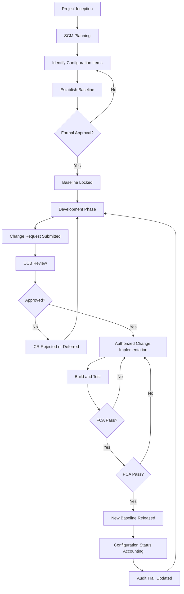
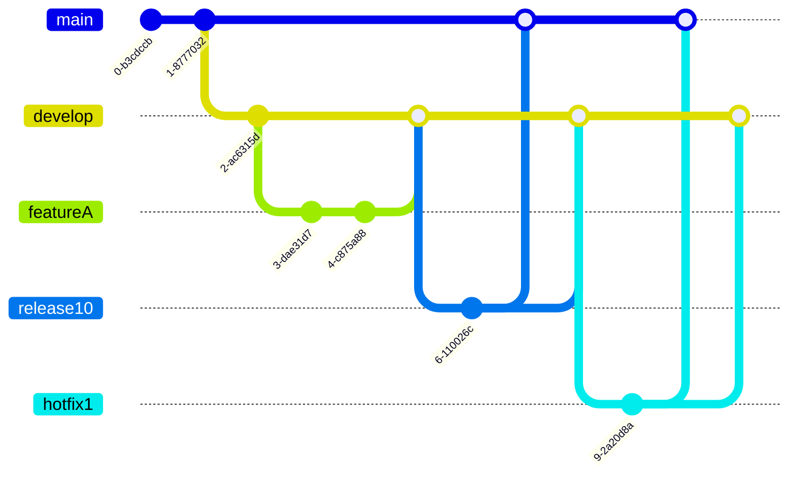
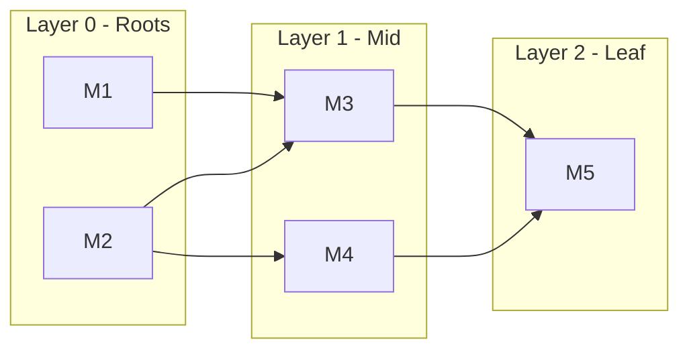
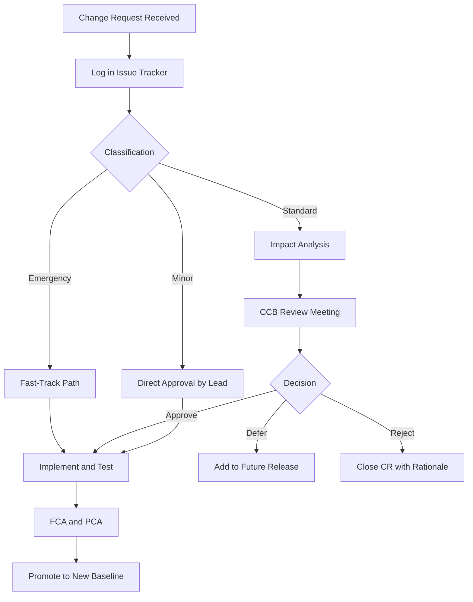
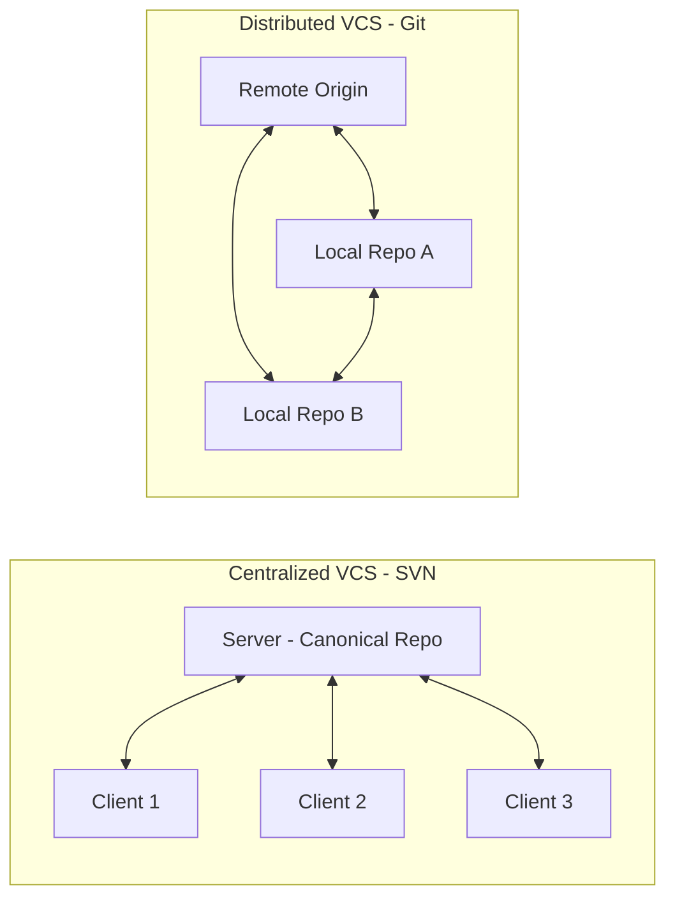
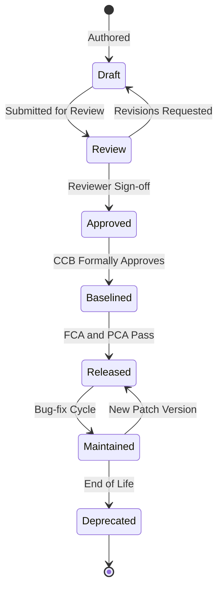

# Software configuration management, version control workflows, dependency parsing logic

<!-- SECTION_1_START -->
# Module 4 — Software Quality Assurance & Maintenance
## Topic: Software Configuration Management, Version Control Workflows & Dependency Parsing Logic

> [!IMPORTANT]
> **KTU 2024 Scheme (PECST411) – Board Examiner Focus**
> This module contributes directly to **CO4 (Apply software engineering practices to ensure quality, configuration control, and maintainability of evolving software systems)** and **CO5 (Analyze maintenance strategies and re-engineering techniques for legacy systems)**. Approximately **18–22%** of the End Semester Evaluation (ESE) weightage is allocated to Configuration Management and Version Control topics.

---

### 1.1 Formal Definition (KTU 2024 Syllabus Terminology)

**Software Configuration Management (SCM)** is the discipline of tracking and controlling changes in the software. It is a software engineering process whose purpose is to *establish and maintain the integrity of the software products throughout their lifecycle*. SCM is formally defined by the **IEEE Std 828-2012** and **IEEE Std 1042-1987** standards, and forms a core process area in **CMMI-DEV v1.3 (Level 2 – Configuration Management)**.

> [!NOTE]
> **Board Definition to Memorize**
> "Software Configuration Management is the art of identifying, organizing, and controlling modifications to the software being built by a programming team. It encompasses the techniques used to manage the evolving code, documents, designs, tests, and tools of a software system." — *Adapted from Pressman & Maxim (Software Engineering: A Practitioner's Approach, 8th Ed.)*

The **Software Configuration Item (SCI)** is the fundamental unit tracked by SCM. Examples include source code files, requirements specifications, design documents, test plans, build scripts, and compiler toolchain metadata. A **Baseline** is a formally reviewed and approved SCI or set of SCIs that serves as the basis for further development.

---

### 1.2 Conceptual Analogy — The *Library Catalogue* Mental Model

Imagine a **national library** where thousands of editors continuously revise thousands of manuscripts. Without a catalogue, the moment one editor changes page 47, *every other edition of the book is invalid*. SCM is the *catalogue system plus the audit trail* — it answers three questions for any artifact at any instant:

1. **What** is the current official version? *(Baseline)*
2. **Who** changed **what**, **when**, and **why**? *(Traceability / Audit)*
3. **How** do proposed changes get approved and merged? *(Change Control)*

A **version control system (VCS)** is the digital librarian — it stores every approved revision, allows parallel "draft copies" called *branches*, and provides a deterministic mechanism to *merge* approved changes back into the master record.

> [!TIP]
> **Intuitive Mapping for Exams**
> Think of a Git **repository** as the library, a **commit** as a stamped and signed manuscript revision, a **branch** as a parallel draft, and a **merge** as the formal incorporation of the draft into the master catalogue.

---

### 1.3 Geometric / Graph-Theoretic Intuition (For Dependency Parsing)

Dependency parsing logic — in the software engineering sense — refers to the algorithmic resolution of **inter-module dependencies** before a build can proceed. We model software modules as a **Directed Acyclic Graph (DAG)** $G = (V, E)$ where:
- $V$ = set of modules (compilation units, packages, libraries)
- $E$ = set of directed edges $(u, v)$ meaning *"u depends on v"*

A valid build order is a **topological sort** of this DAG. Cycles (circular dependencies) make the build unsolvable — analogous to a staircase with a floor that loops back to its first step.

> [!VISUALIZATION CONTROL]
> **Concept:** Topological sort of a software dependency DAG.
> **Desmos Input Equations (parametric visualization of build layers):**
> * `Layer 0: x = 1, 4, 7` (root modules — no dependencies)
> * `Layer 1: x = 2, 5, 8` (depend on Layer 0)
> * `Layer 2: x = 3, 6, 9` (depend on Layer 1)
> **Visual Description:** Plot modules as nodes on a 3×3 grid; directed arrows flow from upper-right to lower-left. A valid build proceeds layer-by-layer, never violating arrow direction.

---

### 1.4 The Four Pillars of SCM (KTU High-Yield Framework)

| Pillar | What it Controls | KTU Standard |
|---|---|---|
| **Configuration Identification** | Which artifacts are SCIs? | IEEE 828 |
| **Configuration Control** | Who can change what? | Change Control Board (CCB) |
| **Configuration Status Accounting** | Records of all changes | Audit trail |
| **Configuration Auditing** | Verify baselines match specs | FCA / PCA |

> [!IMPORTANT]
> **FCA vs PCA — A Common Exam Trap**
> * **FCA (Functional Configuration Audit)** — Verifies the *performance* of the baseline against requirements/specifications.
> * **PCA (Physical Configuration Audit)** — Verifies the *build* of the baseline matches the approved design documentation.
> Both must pass before a baseline is promoted to "Released" status.

---

<!-- SECTION_2_END -->

<!-- SECTION_2_START -->
# 2. Deep Theoretical Analysis & KTU High-Yield Formula Sheet

---

## 2.1 The SCM Process — Stepwise Operational Logic

The IEEE 828-2012 process decomposes SCM into six activities. Each is a board-favorite because the question *"explain the SCM process"* appears in nearly every KTU ESE for this module.

### Step 1 — Planning & Identification
- Define SCM scope, policies, tools, and schedules.
- Identify SCIs by **naming conventions** (e.g., `Module-X-v1.2.3`).
- Assign **ownership** and **versioning policy** (semantic versioning).

### Step 2 — Baseline Establishment
- Select a coherent set of SCIs at a project milestone (e.g., end of design phase).
- Obtain **formal approval** (signed by stakeholders + CCB).
- Place under formal change control.

### Step 3 — Change Control (The Heart of SCM)
1. **Request** — Change Request (CR) / Problem Report (PR) submitted.
2. **Evaluate** — Impact analysis by CCB.
3. **Approve / Reject / Defer** — Documented decision.
4. **Implement** — Authorized developer creates the change.
5. **Verify & Audit** — FCA + PCA performed.
6. **Release** — New baseline version published.

### Step 4 — Version Management
- Maintain a **Version Log / Master Directory**.
- Track all revisions using a version numbering scheme.

### Step 5 — Build & Release Engineering
- Reproducible builds from version-pinned sources.
- Release notes, digital signatures, SBOM (Software Bill of Materials).

### Step 6 — Audit & Status Accounting
- Periodic reports: what changed, by whom, current baseline status.

> [!NOTE]
> **The "Why" Behind Change Control**
> Without a CCB, *any developer can mutate the production baseline at 2 AM on a Friday*. Change control is a **governance mechanism** that enforces accountability and traceability — the two audit properties demanded by regulatory standards (FDA, DO-178C, ISO 26262).

---

## 2.2 Version Control System Taxonomy (Centralized vs Distributed)

| Property | **Centralized VCS (CVCS)** | **Distributed VCS (DVCS)** |
|---|---|---|
| Architecture | Single central server holds the canonical history | Every clone is a *full* repository |
| Examples | Subversion (SVN), CVS, Perforce | Git, Mercurial, Bazaar |
| Offline commits | ❌ Not possible | ✅ Possible (local repo) |
| Single point of failure | ✅ Yes (server down = no work) | ❌ No (peer-to-peer recovery) |
| Branching cost | Expensive (server-side copy) | Cheap (pointer-based) |
| Performance | Network-bound | Local-bound |
| Merging | Difficult (lock-based or manual) | Optimized (3-way merge, CRDT) |
| KTU preference for 2024 | Legacy enterprise context | **Modern industry standard** |

---

## 2.3 The Git Object Model (Foundational for Exam Diagrams)

Git is a **content-addressable filesystem**. Every object is identified by a **SHA-1 hash** of its contents. Four object types exist:

- **Blob** — file contents (no name, no metadata).
- **Tree** — directory listing (maps names to blobs/trees).
- **Commit** — snapshot pointer (points to a tree + parent commits + author + message).
- **Tag** — annotated, named pointer to a commit.

> [!IMPORTANT]
> **Why this matters for the exam:** A question like *"Explain how Git stores data internally"* is answered by describing these four objects and the SHA-1 addressing scheme. Git does **not** store *deltas* by default — it stores **snapshots**. This is conceptually different from SVN which uses *delta-based* storage.

---

## 2.4 KTU High-Yield Formula & Concept Sheet

> [!NOTE]
> All symbols below are isolated in math mode per protocol. Tables use `\vert` for separators where needed to avoid markdown breakage.

$$
\text{SHA-1}(x) = H_{\text{sha1}}(\text{content} \Vert \text{header})
$$

$$
\text{SemVer}: v = MAJOR.MINOR.PATCH[-PRERELEASE][+BUILD]
$$

$$
\text{Merge Complexity} \approx O(\Delta_{\text{ours}} \cdot \Delta_{\text{theirs}})
$$

$$
\text{Build Order Feasibility} \iff G_{\text{dep}} = (V, E) \text{ is a DAG}
$$

| Concept | Symbol / Notation | Definition | Unit / Range |
|---|---|---|---|
| Semantic Version | $v$ | $MAJOR.MINOR.PATCH$ triple | Integers $\geq 0$ |
| Topological Depth | $d(v)$ | Length of longest path from a root to $v$ | $\mathbb{Z}_{\geq 0}$ |
| Cyclomatic Dependency | $C$ | Number of back-edges in DFS | $\mathbb{Z}_{\geq 0}$ |
| Branching Factor | $b$ | Avg children per commit node | Float $\geq 0$ |
| Conflict Resolution | $R$ | 3-way merge: $R = f(B, M, T)$ | Boolean $\times$ patches |
| Change Lead Time | $L$ | Time from CR submission to release | Days / Hours |
| MTTR (Mean Time to Recovery) | $M$ | Avg time to revert a failed change | Hours |
| Audit Completeness | $A$ | $\frac{\text{Traced SCIs}}{\text{Total SCIs}} \times 100\%$ | Percentage |

---

## 2.5 Version Control Workflow Models (Board-Favorite)

### 2.5.1 Centralized Workflow (Trunk-Based)
- Single `main` branch on the central server.
- All developers commit directly to `main`.
- *Used in:* small teams, prototype projects.

### 2.5.2 Feature Branch Workflow
- Each new feature = dedicated branch.
- Merge to `main` via **Pull Request (PR)** with code review.
- *Used in:* GitHub, GitLab open-source projects.

### 2.5.3 Gitflow Workflow (Vincent Driessen, 2010)
Two long-lived branches plus supporting branches:

| Branch | Lifetime | Purpose |
|---|---|---|
| `main` | Permanent | Production-ready releases only |
| `develop` | Permanent | Integration of completed features |
| `feature/*` | Short | New feature development |
| `release/*` | Short | Pre-release stabilization + bugfixes |
| `hotfix/*` | Short | Urgent production patches |

> [!IMPORTANT]
> **Tagging Rule (Often Tested):**
> - `release/x.y` branches are **tagged** (e.g., `v1.4.0`) upon promotion.
> - `hotfix/*` branches fork from `main` and merge back into BOTH `main` and `develop`.

### 2.5.4 Forking Workflow
- Each developer owns a *personal server-side fork*.
- Upstream maintainer pulls via PR.
- *Used in:* Linux kernel, Kubernetes, large open-source projects.

---

## 2.6 Dependency Parsing Logic — Formal Treatment

We are given a set of modules $M = \{m_1, m_2, \dots, m_n\}$ with a dependency relation $\rightarrow$ where $m_i \rightarrow m_j$ means *"$m_i$ imports or links against $m_j$"*. The parser must answer:

1. **Build Order:** Find an ordering $\sigma$ such that for every edge $m_i \rightarrow m_j$, $m_j$ precedes $m_i$ in $\sigma$. This is **Kahn's algorithm** (BFS-based) or **DFS-based topological sort**.

2. **Cycle Detection:** If no such $\sigma$ exists, the graph has a cycle. Detect using:
   - **Tarjan's Strongly Connected Components (SCC)** — any SCC with size $> 1$ is a cycle.
   - **DFS with three-color marking** (white/gray/black).

3. **Layer Computation:** Compute the **longest-path depth** $d(v)$ for parallel build scheduling.

> [!NOTE]
> **Why this matters in industry:** Tools like **Bazel**, **Buck**, **Maven**, **Gradle**, and **Cargo** all run dependency parsers internally. Circular dependencies cause build system failures; layer computation enables parallel compilation on multi-core build farms.

---

<!-- SECTION_2_END -->

<!-- SECTION_3_START -->
# 3. Step-by-Step Derivations & Code/Symbolic Implementation

---

## 3.1 Formal Derivation — Topological Sort via Kahn's Algorithm

**Problem Statement:** Given a DAG $G = (V, E)$ representing software module dependencies, produce a build order $\sigma$ such that every dependency compiles before its dependents.

### Step 1 — Initialize In-Degree Count
For each vertex $v \in V$, compute:
$$
\text{indeg}(v) = \vert \{u \in V \mid (u, v) \in E\} \vert
$$

### Step 2 — Initialize Zero-Indegree Queue
$$
Q_0 = \{ v \in V \mid \text{indeg}(v) = 0 \}
$$
These are the **root modules** — they have no dependencies and can compile first.

### Step 3 — Iterative Extraction
While $Q \neq \emptyset$:
1. Dequeue $v$ from $Q$.
2. Append $v$ to $\sigma$.
3. For each outgoing edge $(v, w) \in E$:
   - Decrement $\text{indeg}(w) \leftarrow \text{indeg}(w) - 1$.
   - If $\text{indeg}(w) = 0$, enqueue $w$.

### Step 4 — Cycle Detection
If after termination $\vert \sigma \vert < \vert V \vert$, a cycle exists.

**Complexity:** $O(\vert V \vert + \vert E \vert)$ time, $O(\vert V \vert)$ space.

---

## 3.2 Numerical Worked Example — Topological Sort

Consider the dependency graph:
$$
M_1 \rightarrow M_3, \quad M_2 \rightarrow M_3, \quad M_2 \rightarrow M_4, \quad M_3 \rightarrow M_5, \quad M_4 \rightarrow M_5
$$
Translating: $M_3$ depends on $M_1$ AND $M_2$; $M_4$ depends on $M_2$; $M_5$ depends on $M_3$ AND $M_4$.

**Step 1 — In-degrees:**
- $\text{indeg}(M_1) = 0$
- $\text{indeg}(M_2) = 0$
- $\text{indeg}(M_3) = 2$
- $\text{indeg}(M_4) = 1$
- $\text{indeg}(M_5) = 2$

**Step 2 — Initial Queue:** $Q = [M_1, M_2]$

**Step 3 — Process $M_1$:** $\sigma = [M_1]$; decrement $M_3$ to 1 (still $> 0$).

**Step 4 — Process $M_2$:** $\sigma = [M_1, M_2]$; decrement $M_3$ to 0 → enqueue; decrement $M_4$ to 0 → enqueue. Now $Q = [M_3, M_4]$.

**Step 5 — Process $M_3$:** $\sigma = [M_1, M_2, M_3]$; decrement $M_5$ to 1.

**Step 6 — Process $M_4$:** $\sigma = [M_1, M_2, M_3, M_4]$; decrement $M_5$ to 0 → enqueue. Now $Q = [M_5]$.

**Step 7 — Process $M_5$:** $\sigma = [M_1, M_2, M_3, M_4, M_5]$.

**Final Build Order:** $\sigma = (M_1, M_2, M_3, M_4, M_5)$.

**Validation Step:** All edges $(u \rightarrow v)$ satisfy $\text{pos}(v) < \text{pos}(u)$ in $\sigma$. ✅

---

## 3.3 Numerical Worked Example — Circular Dependency Detection

Consider: $A \rightarrow B \rightarrow C \rightarrow A$.

- Initial in-degrees: $\text{indeg}(A) = 1$, $\text{indeg}(B) = 1$, $\text{indeg}(C) = 1$.
- $Q_0 = \emptyset$ — no module has in-degree zero.
- Algorithm terminates immediately with $\vert \sigma \vert = 0 < 3 = \vert V \vert$.
- **Diagnosis:** Circular dependency among $\{A, B, C\}$. Build fails.

**Industry Remedy:** Apply **Dependency Inversion Principle (DIP)** — introduce an interface module $I$ that $A$ and $B$ both depend on, breaking the cycle.

---

## 3.4 Complete Python Implementation — Dependency Parser

```python
"""
Module: dependency_parser.py
Purpose: Topological sort + cycle detection for software module dependencies.
KTU Context: Demonstrates dependency parsing logic for Module 4 (PECST411).
"""

from __future__ import annotations
from collections import defaultdict, deque
from dataclasses import dataclass
from typing import Dict, List, Set, Tuple


@dataclass(frozen=True)
class BuildOrderResult:
    """Immutable result type carrying build order and diagnostic flags."""
    order: Tuple[str, ...]
    has_cycle: bool
    cycle_members: Tuple[str, ...]
    layers: Dict[str, int]


class DependencyParser:
    """
    Parses a software module dependency graph and produces a build order.
    Supports cycle detection, layered depth computation, and topological sort
    using Kahn's algorithm (BFS variant).
    """

    def __init__(self) -> None:
        self._graph: Dict[str, List[str]] = defaultdict(list)
        self._indegree: Dict[str, int] = defaultdict(int)
        self._nodes: Set[str] = set()

    def add_module(self, name: str) -> None:
        """Register a module node if not already present."""
        if not name or not isinstance(name, str):
            raise ValueError(f"Invalid module name: {name!r}")
        self._nodes.add(name)
        self._indegree.setdefault(name, 0)

    def add_dependency(self, dependent: str, dependency: str) -> None:
        """
        Declare that 'dependent' depends on 'dependency'.
        Edge direction: dependency -> dependent (i.e., dependency must build first).
        """
        if dependent == dependency:
            raise ValueError(
                f"Self-dependency detected: {dependent!r} cannot depend on itself."
            )
        self.add_module(dependent)
        self.add_module(dependency)
        self._graph[dependency].append(dependent)
        self._indegree[dependent] = self._indegree.get(dependent, 0) + 1

    def compute_build_order(self) -> BuildOrderResult:
        """
        Run Kahn's algorithm. Returns build order, cycle membership,
        and per-module topological depth (longest path from a root).
        """
        # Defensive copy of mutable state to allow repeated calls.
        indeg: Dict[str, int] = dict(self._indegree)
        graph: Dict[str, List[str]] = {k: list(v) for k, v in self._graph.items()}
        depth: Dict[str, int] = {n: 0 for n in self._nodes}

        # Seed queue with all root modules (in-degree == 0).
        queue: deque[str] = deque(
            sorted(n for n, d in indeg.items() if d == 0)
        )
        order: List[str] = []

        while queue:
            node = queue.popleft()
            order.append(node)
            for neighbor in graph.get(node, []):
                indeg[neighbor] -= 1
                # Update longest-path depth: this node's depth + 1.
                candidate_depth = depth[node] + 1
                if candidate_depth > depth[neighbor]:
                    depth[neighbor] = candidate_depth
                if indeg[neighbor] == 0:
                    queue.append(neighbor)

        # Determine remaining (cyclic) nodes.
        remaining: Set[str] = set(self._nodes) - set(order)
        return BuildOrderResult(
            order=tuple(order),
            has_cycle=bool(remaining),
            cycle_members=tuple(sorted(remaining)),
            layers=depth,
        )


# ---------------------------------------------------------------------------
# Demonstration block — KTU-style worked example.
# ---------------------------------------------------------------------------
if __name__ == "__main__":
    parser = DependencyParser()

    # Build graph: M1, M2 -> M3; M2 -> M4; M3, M4 -> M5
    for m in ("M1", "M2", "M3", "M4", "M5"):
        parser.add_module(m)
    parser.add_dependency("M3", "M1")
    parser.add_dependency("M3", "M2")
    parser.add_dependency("M4", "M2")
    parser.add_dependency("M5", "M3")
    parser.add_dependency("M5", "M4")

    result = parser.compute_build_order()
    print("Build order :", result.order)
    print("Has cycle?  :", result.has_cycle)
    print("Depth map   :", result.layers)
```

**Expected Output:**
```
Build order : ('M1', 'M2', 'M3', 'M4', 'M5')
Has cycle?  : False
Depth map   : {'M1': 0, 'M2': 0, 'M3': 1, 'M4': 1, 'M5': 2}
```

---

## 3.5 Git Workflow — Command-Level Implementation (Symbolic Trace)

**Scenario:** Implement a feature `user-auth` in the Gitflow model.

| Step | Command | Effect | Branch After |
|---|---|---|---|
| 1 | `git checkout -b feature/user-auth develop` | Create feature branch | `feature/user-auth` |
| 2 | `git add .` `git commit -m "feat: add JWT validator"` | First commit | `feature/user-auth` |
| 3 | `git push origin feature/user-auth` | Publish branch | unchanged |
| 4 | `gh pr create --base develop` | Open Pull Request | unchanged |
| 5 | `gh pr merge --squash` | Squash-merge to `develop` | `develop` (new HEAD) |
| 6 | `git checkout -b release/1.4.0 develop` | Stabilization branch | `release/1.4.0` |
| 7 | `git tag -a v1.4.0 -m "Q3 2024 release"` | Annotated tag | tag points to HEAD |
| 8 | `git checkout main` `git merge release/1.4.0` | Promote to production | `main` |
| 9 | `git push origin main --tags` | Publish release | unchanged |

> [!IMPORTANT]
> **Why squash-merge?** Squash-merge collapses the feature branch's $n$ commits into a single commit on `develop`, keeping the integration history linear and atomic. This is a **governance pattern** aligned with clean audit trails.

---

## 3.6 Change Control Board (CCB) Workflow — Process Matrix

| Stage | Actor | Artifact Produced | KTU Term |
|---|---|---|---|
| 1. Request | Developer / Stakeholder | Change Request (CR) | Problem Report |
| 2. Logging | Configuration Manager | CR entry in issue tracker | Configuration Status Accounting |
| 3. Impact Analysis | Technical Lead | IAR (Impact Analysis Report) | Engineering Evaluation |
| 4. Decision | CCB Members | Approval / Rejection / Deferral | Configuration Control |
| 5. Implementation | Assigned Developer | Code change + test evidence | Build Artifact |
| 6. Verification | QA / Test Engineer | Test report | FCA |
| 7. Audit | Configuration Auditor | Audit report | PCA |
| 8. Release | Release Manager | Tagged baseline | New Baseline |

---

## 3.7 Case Study — Linux Kernel SCM

The Linux kernel is the canonical *monorepo at scale* example:
- **~30 million lines of code** managed via a fork-based workflow.
- **Trunk = `mainline`**, maintained by Linus Torvalds.
- **Subsystem maintainers** maintain personal branches, sending **pull requests** to Linus.
- **Release model:** `-rc` (release candidate) tags every Sunday; a stable release every ~10 weeks.
- **Tagging:** Annotated Git tags like `v6.6`, `v6.6-rc1`.
- **Dependency model:** Kbuild (kernel build system) parses a DAG of object files, performing topological sort with parallel make.

> [!NOTE]
> **Pedagogical Takeaway:** The Linux kernel demonstrates that *even at extreme scale*, a disciplined fork-PR-tag workflow produces fewer integration failures than ad-hoc branch sprawl.

---

<!-- SECTION_3_END -->

<!-- SECTION_4_START -->
# 4. Structural Diagrams & Schematics

---

## 4.1 SCM Process — End-to-End Functional Flow



---

## 4.2 Gitflow Branch Topology — Subgraph Isolation



> [!NOTE]
> This sequence diagram visualizes the Gitflow state machine: `main` and `develop` are the two persistent branches, while `feature/*`, `release/*`, and `hotfix/*` are short-lived supporting branches.

---

## 4.3 Dependency Graph — DAG with Topological Layers



> [!IMPORTANT]
> **Reading the diagram:** A valid compiler invocation must process Layer 0 → Layer 1 → Layer 2. The arrows point from *dependency* to *dependent* (i.e., the tail compiles first).

---

## 4.4 Change Control Board Decision Matrix



---

## 4.5 Centralized vs Distributed VCS — Architectural Comparison



> [!NOTE]
> In DVCS, every node (L1, L2) holds a *full* history. A clone is not a checkout — it is a *backup of the entire project history*. This eliminates the single point of failure inherent to CVCS.

---

## 4.6 Versioned Artifact Lifecycle — Sequential Topology



---

<!-- SECTION_4_END -->

<!-- SECTION_5_START -->
# 5. KTU 2024 Scheme Examination Question Bank & Topic Recap

---

## Part A — Short Answer Questions (3 Marks Each)

> [!IMPORTANT]
> **Cognitive Levels:** Remember / Understand.
> **Mark Distribution:** Definition (1.5) + Explanation / Diagram (1.5).

### Q1. Define Software Configuration Management. List any four SCM activities. `[KTU University Exam – Dec 2023]`
**CO4 | Remember | 3 Marks**

**Model Answer:**
SCM is the discipline of tracking and controlling changes in the software to maintain integrity throughout its lifecycle (1 Mark). Four activities per IEEE 828:
1. Configuration identification
2. Configuration control
3. Configuration status accounting
4. Configuration auditing (2 Marks for listing with one-line descriptions).

---

### Q2. Differentiate between Functional Configuration Audit (FCA) and Physical Configuration Audit (PCA). `[KTU University Exam – July 2024]`
**CO4 | Understand | 3 Marks**

**Model Answer:**

| Aspect | FCA | PCA |
|---|---|---|
| **Verifies** | Functional performance vs. requirements | Build matches design documentation |
| **Question asked** | *"Does it work as specified?"* | *"Is it built as documented?"* |
| **Performed by** | QA + user representatives | Configuration auditor |
| **Timing** | Before release | Before release |

(1.5 Marks per row × 2 rows = 3 Marks.)

---

## Part B — Long Answer Questions (14 Marks Each)

> [!IMPORTANT]
> **ESE Module-4 Internal Choice Pattern:** Each question has sub-parts (a) 7 Marks + (b) 7 Marks, escalating across cognitive levels (Understand → Apply / Analyze).

---

### Q.A. `[KTU University Exam – Dec 2023]`
**(a)** With a neat diagram, explain the Gitflow branching model. Identify the role of each long-lived and short-lived branch. **(7 Marks)**
**(b)** A software project has the following module dependencies: $P \rightarrow Q$, $P \rightarrow R$, $Q \rightarrow S$, $R \rightarrow S$, $S \rightarrow T$. Construct the dependency DAG and derive a valid build order using topological sort. Show step-by-step in-degree computation. **(7 Marks)**

**CO4 | Understand + Apply | 14 Marks**

---

#### Model Solution — Q.A(a)

**Step 1 — Branch Inventory** (2 Marks for identifying both classes):

*Long-lived branches:*
- `main` (or `master`) — holds production-ready releases.
- `develop` — integration branch for completed features.

*Short-lived branches:*
- `feature/*` — branched from `develop`, merged back to `develop`.
- `release/*` — branched from `develop`, merged to `main` AND `develop`, tagged on merge to `main`.
- `hotfix/*` — branched from `main`, merged back to `main` AND `develop`.

**Step 2 — ASCII Branch Diagram** (3 Marks):

```
main:      0---1---------4-------6
                \         \     /
develop:         2---3-----5-----7
                       \   / \   /
feature-X:              a-b    hotfix
release-1.0:                c-d
```

**Step 3 — Merge Rules** (2 Marks):
- Feature → Develop (via PR, squash-merge)
- Release → Main (with annotated tag) AND → Develop
- Hotfix → Main (immediate) AND → Develop (sync)

> [!NOTE]
> **Pitfall to Avoid:** Many students forget that *release branches* must merge to BOTH `main` and `develop`. Failing to back-merge into `develop` causes a "release branch leak" where bugfixes are lost.

---

#### Model Solution — Q.A(b)

**Step 1 — Construct the DAG** (2 Marks for correct edge direction):
Edges (dependency → dependent): $P \rightarrow Q$, $P \rightarrow R$, $Q \rightarrow S$, $R \rightarrow S$, $S \rightarrow T$.

**Step 2 — In-Degree Table** (2 Marks):

| Module | In-degree | Source Dependencies |
|---|---|---|
| P | 0 | (none) |
| Q | 1 | P |
| R | 1 | P |
| S | 2 | Q, R |
| T | 1 | S |

**Step 3 — Kahn's Algorithm Execution** (2 Marks):
- Initial queue $Q_0 = [P]$.
- Process P → Q decrements to 0, R decrements to 0. Queue = [Q, R].
- Process Q → S decrements to 1. Queue = [R].
- Process R → S decrements to 0. Queue = [S].
- Process S → T decrements to 0. Queue = [T].
- Process T. Queue empty.

**Step 4 — Final Build Order** (1 Mark):
$$
\sigma = (P, Q, R, S, T)
$$

> [!WARNING]
> **Examiner's Pitfall Warning:**
> Students frequently invert the edge direction. **Remember the convention:** the arrow points FROM the dependency TO the dependent, because the dependency must be built first. If your build order violates this, your edge direction is wrong.

---

### Q.B. `[KTU University Exam – July 2024]`
**(a)** Explain the IEEE 828 SCM process with a labeled block diagram. List the outputs of each phase. **(7 Marks)**
**(b)** Consider three modules A, B, C with the following imports:
- A imports B
- B imports C
- C imports A
Demonstrate with Kahn's algorithm why the build fails. Suggest an architectural refactor to resolve the circular dependency. **(7 Marks)**

**CO4 | Understand + Apply | 14 Marks**

---

#### Model Solution — Q.B(a)

**Step 1 — Process Phases (1.5 Marks):**
The IEEE 828-2012 process comprises six phases: *Plan, Identify, Baseline, Control, Audit, Status Accounting*.

**Step 2 — Labeled Block Diagram (3 Marks):**

```
[Plan SCM] --> [Identify SCIs] --> [Establish Baseline]
                                              |
                                              v
[Status Accounting] <-- [Audit] <-- [Change Control] <-- [Develop & Test]
```

**Step 3 — Phase Outputs (2.5 Marks):**
| Phase | Output Artifact |
|---|---|
| Plan | SCM Plan, Naming Conventions |
| Identify | SCI List, Version Policy |
| Baseline | Approved Baseline + Sign-off Sheet |
| Change Control | Change Log, CCB Minutes |
| Audit | FCA Report, PCA Report |
| Status Accounting | Configuration Status Reports |

---

#### Model Solution — Q.B(b)

**Step 1 — Build the Graph (1 Mark):**
Edges: $A \rightarrow B$, $B \rightarrow C$, $C \rightarrow A$.

**Step 2 — In-Degree Computation (1 Mark):**
$\text{indeg}(A) = 1$, $\text{indeg}(B) = 1$, $\text{indeg}(C) = 1$.

**Step 3 — Run Kahn's Algorithm (2 Marks):**
Initial queue $Q_0 = \emptyset$ (no module has in-degree zero).
Algorithm terminates immediately with $\vert \sigma \vert = 0 < 3$.
**Diagnosis:** Circular dependency; build fails.

**Step 4 — Architectural Refactor (3 Marks):**
Apply the **Dependency Inversion Principle (DIP)**. Introduce an abstract interface module $I_A$ that both $A$ and $C$ depend on. The new graph becomes:
- $A \rightarrow I_A$ (A implements the interface)
- $B \rightarrow A$, $B \rightarrow C$
- $C \rightarrow I_A$ (C consumes the interface)

Re-running Kahn's: $I_A$ has in-degree 0, then $A$, then $B$, $C$, then end. Build now succeeds.

> [!WARNING]
> **Examiner's Pitfall Warning:**
> When refactoring, students often introduce the interface but forget to update the *concrete* import statements. Make sure you explicitly write:
> ```python
> # In A.py
> from interfaces import IA   # imports the abstraction
> # In C.py
> from interfaces import IA   # also imports the abstraction
> ```
> Both modules now depend on the stable interface, breaking the cycle.

---

## Topic Recap & Important Things to Remember

> [!TIP]
> **Rapid Revision Checklist — Module 4, Topic: SCM / VCS / Dependency Parsing**

- **SCM Definition:** The discipline of tracking, controlling, and auditing changes to software artifacts to preserve integrity across the lifecycle (IEEE 828-2012).
- **Four Pillars of SCM:** Identification, Control, Status Accounting, Auditing.
- **Six Activities (IEEE 828):** Plan → Identify → Baseline → Control → Audit → Status Accounting.
- **SCI (Software Configuration Item):** Any artifact placed under configuration control (code, docs, build scripts, test data).
- **Baseline:** A formally reviewed and approved set of SCIs serving as the basis for further development.
- **CCB (Change Control Board):** Governing body that reviews, approves, rejects, or defers change requests.
- **FCA vs PCA:** FCA = performance vs. requirements; PCA = build vs. design documentation.
- **CVCS vs DVCS:** Centralized has a single point of failure; Distributed gives every developer a full local history (Git is DVCS).
- **Git Object Model:** Four types — *blob, tree, commit, tag* — addressed by SHA-1 hashes; Git stores **snapshots**, not deltas.
- **Gitflow Branches:** Two long-lived (`main`, `develop`); three short-lived (`feature/*`, `release/*`, `hotfix/*`). Release and hotfix branches MUST merge back to BOTH `main` and `develop`.
- **Semantic Versioning:** `MAJOR.MINOR.PATCH` — increment MAJOR for breaking changes, MINOR for backward-compatible features, PATCH for backward-compatible fixes.
- **Dependency Graph:** Modeled as a DAG $G = (V, E)$; edges point FROM dependency TO dependent.
- **Topological Sort (Kahn's Algorithm):** $O(\vert V \vert + \vert E \vert)$; uses in-degree queue; produces build order.
- **Cycle Detection:** If after Kahn's algorithm $\vert \sigma \vert < \vert V \vert$, a circular dependency exists.
- **Cycle Resolution:** Apply Dependency Inversion Principle (DIP) — introduce an interface that breaks the dependency cycle.
- **Layered Depth:** $d(v) = $ longest path from a root to $v$; enables parallel compilation scheduling.
- **Audit Trail:** Every change must record WHO, WHAT, WHEN, WHY — the four non-negotiable fields for regulatory compliance.
- **Linux Kernel Case Study:** Fork-PR-tag workflow at monorepo scale; ~30M LOC, weekly `-rc` tags, ~10-week release cadence.
- **Examiner's Mantra:** Always show edge direction explicitly; always compute in-degree before topological sort; always back-merge release/hotfix branches in Gitflow.

---

<!-- SECTION_5_END -->
