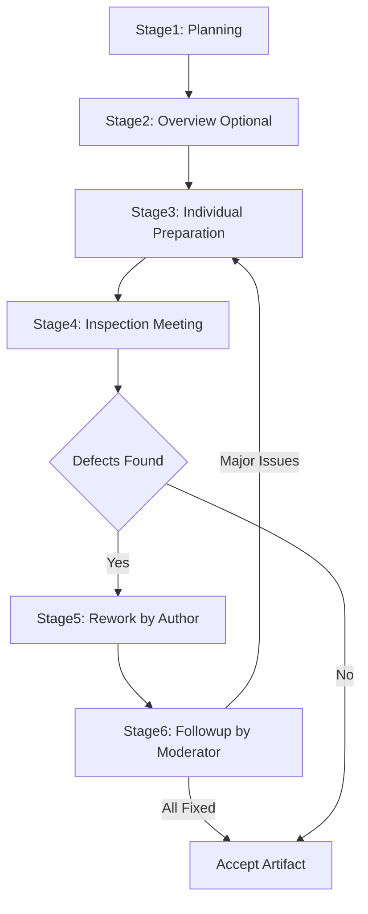
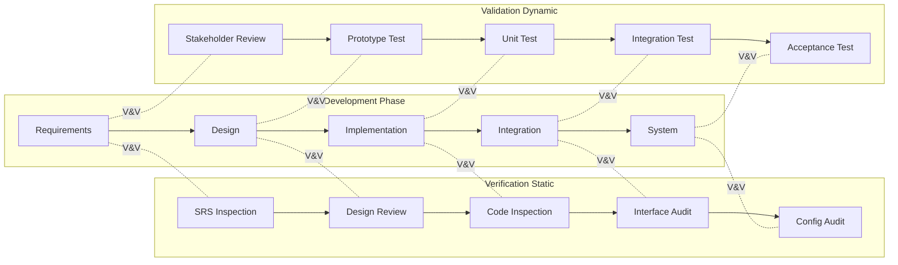
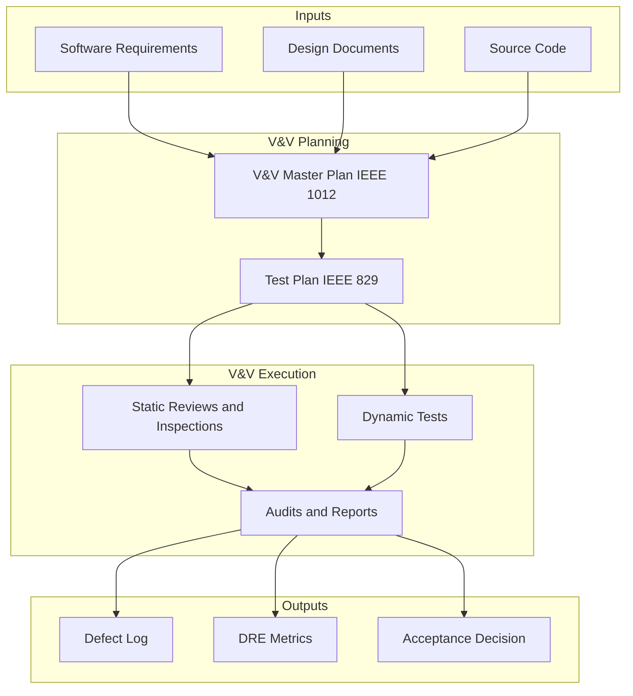
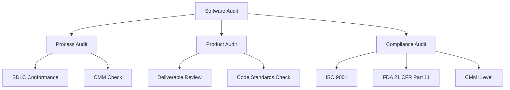

# Software inspection routines, auditing, verification and validation tasks

<!-- SECTION_1_START -->
# Software Inspection Routines, Auditing, Verification & Validation

## 1. Core Technical Definition & Intuitive Overview

### 1.1 Formal Definition (KTU 2024 Syllabus Terminology)

> [!IMPORTANT]
> **Software Inspection** is a formal, systematic, and disciplined method of examining software artifacts (requirements, design, code, test plans) to identify defects, violations of standards, and other problems, **without executing** the software. It follows the **Fagan Inspection Methodology** introduced by Michael Fagan at IBM in 1976.

> [!IMPORTANT]
> **Software Verification & Validation (V&V)** is the process of evaluating software to determine whether it (a) **Verification** – satisfies the specifications and standards established at the start of the phase, and (b) **Validation** – meets the customer/user needs and intended use in the operational environment.

> [!NOTE]
> **Software Auditing** is an independent examination of software products, processes, or records against defined criteria (standards, contracts, regulations) to assess conformity and effectiveness, performed by a **trained auditor** who is **not** the author.

### 1.2 Conceptual Analogy / Intuition

> [!TIP]
> **Real-World Analogy: Building Construction QC**
> Imagine constructing a high-rise apartment:
> - **Inspection** = A senior civil engineer reviewing the *blueprint* and *rebar placement* **before** pouring concrete (catching errors on paper, not on-site).
> - **Verification** = Checking whether the construction **matches the blueprint** ("Did we build what was designed?").
> - **Validation** = Walking the family through the finished flat to see if it **meets their lifestyle** ("Did we build the right flat?").
> - **Auditing** = A government inspector arriving to certify the building against the **National Building Code** (independent third-party review).
>
> The key insight: Verification is about *conformance to spec* (document-centric), while Validation is about *fitness for use* (user-centric).

### 1.3 Key Constants and Standard Metrics

> [!NOTE]
> **Key Industry Metrics (IEEE 1028 Standard):**
> - **Inspection Rate**: Typically **100 – 500 LOC/hour** for code inspections
> - **Defect Detection Efficiency**: **60% – 80%** for formal inspections (vs. 25% for testing)
> - **Cost of Defect Removal**: 1× in requirements → **10× in design** → **100× in code** → **1000× in production**
> - **Inspection Team Size**: 4 – 6 participants
> - **Inspection Duration**: Should not exceed **2 hours** per session (cognitive fatigue limit)

### 1.4 Visualisation Control

> [!VISUALIZATION CONTROL]
> **Concept:** Cost-of-defect-escalation curve (Boehm's 1:10:100:1000 rule)
> **Desmos / Graph Input:**
> * $y = 10^{x}$ where $x$ = phase index (0=Requirements, 1=Design, 2=Implementation, 3=Production)
> **Visual Description:** Exponential growth curve showing how the *relative cost* of fixing a defect rises sharply the later it is discovered — steep upward slope validating the importance of early inspections.

---

<!-- SECTION_1_END -->

<!-- SECTION_2_START -->
# 2. Deep Theoretical Analysis & KTU High-Yield Formula Sheet

## 2.1 Fagan Inspection Methodology – The 6 Phases

Fagan Inspection is the **gold standard** for software inspections. It is a structured, 6-stage process:

| # | Phase | Role & Activity | Output |
|---|-------|----------------|--------|
| 1 | **Planning** | Moderator prepares team, distributes materials, defines entry criteria | Inspection plan, materials list |
| 2 | **Overview (Optional)** | Author presents the artifact to the team | Shared understanding |
| 3 | **Individual Preparation** | Each inspector studies artifact independently, notes defects | Defect list per inspector |
| 4 | **Inspection Meeting** | Reader walks through artifact; Scribe records defects; Moderator leads | Consolidated defect log |
| 5 | **Rework** | Author fixes all identified defects and minor issues | Corrected artifact |
| 6 | **Follow-up** | Moderator verifies that all defects were addressed and decides re-inspection | Inspection report (closure) |

### 2.2 Roles in Fagan Inspection

> [!IMPORTANT]
> **Inspection Roles (mandatory per IEEE 1028):**
> - **Author** – Owner of the artifact; cannot moderate
> - **Moderator** – Leads the inspection; trained, experienced
> - **Reader** – Walks through the artifact line-by-line
> - **Scribe** – Logs every defect in real time
> - **Reviewer / Inspector** – Subject matter experts who find defects

### 2.3 Verification Tasks vs. Validation Tasks

| Aspect | **Verification** | **Validation** |
|--------|------------------|----------------|
| Question Answered | "Are we building the product **right**?" | "Are we building the **right** product?" |
| Focus | Internal consistency, adherence to specs | Fitness for use, user needs |
| Static or Dynamic | Primarily **Static** (reviews, inspections) | Primarily **Dynamic** (executable testing) |
| Phase | Performed **during** development (every phase) | Performed **after** development (testing stage) |
| Standards | IEEE 1012, IEEE 1028 | IEEE 829, IEEE 1012 |
| Output | Defect list, traceability matrix | Test results, acceptance report |

### 2.4 Software Auditing – Types

> [!NOTE]
> **Three Major Audit Types:**
> 1. **Process Audit** – Evaluates adherence to defined **software process** (e.g., does the team follow their defined SDLC?)
> 2. **Product Audit** – Evaluates conformance of **intermediate/deliverable** artifacts to standards
> 3. **Compliance Audit** – Checks conformity to **external** regulations (ISO 9001, CMMI, FDA, DO-178C)

### 2.5 V&V Task Matrix (KTU High-Yield)

| # | V&V Task | Verification Activity | Validation Activity | Tools / Standards |
|---|----------|-----------------------|---------------------|-------------------|
| 1 | Requirements V&V | Review SRS for traceability to user needs | Walkthrough with stakeholder | IEEE 830 |
| 2 | Design V&V | Inspect SDD for consistency, completeness | Prototype evaluation | IEEE 1016 |
| 3 | Code V&V | Fagan inspection, static analysis (lint, SonarQube) | Unit test execution | IEEE 1028 |
| 4 | Integration V&V | Interface conformance review | Integration test execution | IEEE 829 |
| 5 | System V&V | Configuration audit, regression review | System & acceptance testing | IEEE 1012 |
| 6 | Installation V&V | Installation procedure inspection | Beta testing in field | IEEE 1062 |

### 2.6 KTU Formula Sheet / Cheat Sheet

| Formula | Description | Units |
|---------|-------------|-------|
| $\text{Defect Density} = \dfrac{\text{Number of Defects}}{\text{Size (KLOC)}}$ | Measures quality per thousand lines of code | defects/KLOC |
| $\text{Inspection Rate} = \dfrac{\text{Lines Inspected}}{\text{Time Taken}}$ | Throughput of inspection | LOC/hr |
| $\text{Defect Removal Efficiency (DRE)} = \dfrac{\text{Defects found before release}}{\text{Defects found before release} + \text{Defects found after release}} \times 100\%$ | Effectiveness of V&V | % |
| $\text{Mean Time to Failure (MTTF)} = \dfrac{\sum \text{time-to-failure}}{n}$ | Reliability metric | hours |
| $\text{Code Coverage} = \dfrac{\text{Statements Executed}}{\text{Total Statements}} \times 100\%$ | Validation thoroughness | % |
| $\text{Yield} = \dfrac{\text{Defects fixed}}{\text{Total defects logged}} \times 100\%$ | Rework effectiveness | % |
| $C_{\text{fix}}(p) = 10^{p}$ | Boehm's cost escalation multiplier | dimensionless |

> [!TIP]
> **Engineering Utility:** Fagan Inspection is used in mission-critical systems at **NASA, Airbus, Bosch, and Toyota** where post-release defects are catastrophic. V&V is mandated by **IEEE 1012** for safety-critical domains (avionics, medical devices, nuclear).

### 2.7 Comparison: Reviews vs. Inspections vs. Walkthroughs

| Feature | **Walkthrough** | **Technical Review** | **Inspection (Fagan)** |
|---------|----------------|----------------------|------------------------|
| Formality | Low | Medium | **High** |
| Process defined | No | Partially | **Yes (6-step)** |
| Roles defined | No | Partially | **Yes (5 roles)** |
| Goal | Knowledge transfer, learning | Evaluate alternatives | **Defect detection** |
| Led by | Author | Trained moderator | **Trained moderator** |
| Best for | Junior training, design alt. | Architectural decisions | **Code, design, tests** |

---

<!-- SECTION_2_END -->

<!-- SECTION_3_START -->
# 3. Step-by-Step Derivations & Implementation

## 3.1 Fagan Inspection – Exhaustive Stepwise Walkthrough

Below is the **complete operational flow** of a Fagan inspection, mapping each step to a concrete action and artefact.

### Step A — Planning Phase

**Inputs:** Approved Software Description (SDD), entry-criteria checklist.
**Actions:**

1. Moderator checks **entry criteria**: artefact is complete, compiles, follows style guide, has no TBDs.
2. Moderator selects team (4–6 inspectors) based on expertise.
3. Moderator distributes artefact and inspection checklist **at least 3 days** before meeting.
4. Moderator schedules the inspection meeting, capped at **2 hours**, **10 pages** or **500 LOC** of code.

**Output:** Inspection plan, agenda, distributed materials.

### Step B — Overview Phase (Optional)

**Actions:**

1. Author presents intent and scope of the artefact (≤ 30 minutes).
2. Reviewers ask clarifying questions.
3. Goal: **common mental model** of what the artefact should do.

### Step C — Individual Preparation

**Actions:**

1. Each inspector independently studies the artefact.
2. Inspectors use a **checklist** (e.g., data references, error handling, naming, standards).
3. Inspectors log defects with: ID, line number, severity, type, description.
4. **No execution of code** — pure static analysis.

**Output:** Private defect list per inspector.

### Step D — Inspection Meeting

**Actions:**

1. Reader walks through the artefact **line-by-line**.
2. Each inspector raises potential defects; team **discusses validity** (not solutions).
3. Scribe records only **validated defects** in the master log.
4. Moderator enforces rules: no problem-solving, no management of author.
5. If duration exceeds 2 hours or too many defects found → **stop and reschedule**.

**Output:** Master defect log, exit decision (Accept / Reject / Re-inspect).

### Step E — Rework

**Actions:**

1. Author reviews the master defect log.
2. Author fixes every logged defect (and any minor issues).
3. Author updates the artefact and re-submits for follow-up.

### Step F — Follow-up

**Actions:**

1. Moderator checks that **every defect** is addressed or justified.
2. If rework was substantial → re-inspect (cycle back to Step D).
3. Moderator signs the **inspection report** and archives it.

## 3.2 Worked Numerical Example — Defect Density & DRE

> A team inspects **10 KLOC** of code. The inspection found **75 defects**. After release, customers reported **25 additional defects** that escaped the inspection.
> Compute the **Defect Density** and **Defect Removal Efficiency (DRE)**.

**Solution:**

### Step 1 — Defect Density
$$\text{Defect Density} = \frac{\text{Number of Defects found}}{\text{Size in KLOC}}$$

Substitute values:
$$\text{Defect Density} = \frac{75}{10} = 7.5 \;\; \text{defects/KLOC}$$

### Step 2 — Defect Removal Efficiency
$$\text{DRE} = \frac{D_{\text{before}}}{D_{\text{before}} + D_{\text{after}}} \times 100\%$$

Substitute values:
$$\text{DRE} = \frac{75}{75 + 25} \times 100\%$$

$$\text{DRE} = \frac{75}{100} \times 100\% = 75\%$$

> [!NOTE]
> **Interpretation:** An industry-leading DRE of **75% – 85%** is expected for mature Fagan inspections. Below 60% indicates process immaturity.

## 3.3 Python Implementation — Inspection Metrics Calculator

```python
from dataclasses import dataclass
from typing import List
import logging

logging.basicConfig(level=logging.INFO, format="%(levelname)s: %(message)s")


@dataclass(frozen=True)
class InspectionMetrics:
    kloc: float                  # size of artifact in KLOC
    defects_found: int           # defects detected during inspection
    defects_post_release: int    # defects reported by customers/users

    def __post_init__(self) -> None:
        if self.kloc <= 0:
            raise ValueError("KLOC must be positive.")
        if self.defects_found < 0 or self.defects_post_release < 0:
            raise ValueError("Defect counts cannot be negative.")

    def defect_density(self) -> float:
        """Defects per KLOC."""
        return self.defects_found / self.kloc

    def d_re(self) -> float:
        """Defect Removal Efficiency in percent (0-100)."""
        total = self.defects_found + self.defects_post_release
        if total == 0:
            logging.warning("Total defects is zero — DRE undefined.")
            return 0.0
        return (self.defects_found / total) * 100.0

    def inspection_rate(self, person_hours: float) -> float:
        """LOC inspected per person-hour."""
        if person_hours <= 0:
            raise ValueError("Person-hours must be positive.")
        return (self.kloc * 1000.0) / person_hours

    def report(self, person_hours: float) -> None:
        logging.info(f"Defect Density  : {self.defect_density():.2f} defects/KLOC")
        logging.info(f"DRE             : {self.d_re():.2f} %")
        logging.info(f"Inspection Rate : {self.inspection_rate(person_hours):.1f} LOC/hr")


def fagan_inspection_pipeline(artifacts: List[InspectionMetrics], person_hours: float) -> None:
    """Simulate the 6-stage Fagan pipeline summary for multiple artifacts."""
    if not artifacts:
        logging.error("Artifact list is empty.")
        return
    logging.info("=== FAGAN INSPECTION REPORT ===")
    for i, a in enumerate(artifacts, start=1):
        logging.info(f"-- Artifact {i} --")
        a.report(person_hours)
    logging.info("=== END OF REPORT ===")


if __name__ == "__main__":
    sample = [InspectionMetrics(kloc=10.0, defects_found=75, defects_post_release=25)]
    fagan_inspection_pipeline(sample, person_hours=20.0)
```

**Sample Output:**

```
INFO: === FAGAN INSPECTION REPORT ===
INFO: -- Artifact 1 --
INFO: Defect Density  : 7.50 defects/KLOC
INFO: DRE             : 75.00 %
INFO: Inspection Rate : 500.0 LOC/hr
INFO: === END OF REPORT ===
```

## 3.4 V&V Task Mapping – Derivation Across SDLC

The **V-Model** maps each development phase to a corresponding V&V task.

| Development Phase | Deliverable Produced | Verification Task | Validation Task |
|------------------|----------------------|-------------------|-----------------|
| Requirements | SRS Document | **Inspection** of SRS for completeness, traceability, ambiguity | **Requirements review** with stakeholders |
| System Design | System Architecture Doc | **Inspection** of architecture vs. SRS | **Prototype validation** with users |
| Detailed Design | SDD | **Fagan inspection** of design | **Design walkthrough** with team |
| Implementation | Source code, unit tests | **Code inspection** + static analysis (lint, SonarQube) | **Unit testing** (dynamic validation) |
| Integration | Integrated modules | **Interface inspection** | **Integration testing** |
| System | Complete system | **Configuration audit** + regression review | **System testing** |
| Acceptance | Released product | **Final compliance audit** | **User acceptance testing (UAT)** |

---

<!-- SECTION_3_END -->

<!-- SECTION_4_START -->
# 4. Structural Diagrams & Schematics

## 4.1 Fagan Inspection – 6-Stage Process Flow



## 4.2 Verification vs. Validation – Parallel Workflow



## 4.3 V&V Activity Lifecycle – Sequential Processing Topology



## 4.4 Audit Hierarchy – Block Architecture



---

<!-- SECTION_4_END -->

<!-- SECTION_5_START -->
# 5. KTU 2024 Scheme Examination Question Bank & Topic Recap

## Part A — Short Answer Questions (3 Marks Each)

### Question 1 **[KTU University Exam – Dec 2023 | CO3 | Remember]**
**Define Software Verification and Software Validation. State any two differences between them.**

**Model Answer (3 marks):**

> **Software Verification** is the process of evaluating software to determine whether the products of a given development phase satisfy the conditions imposed at the start of that phase. *(1 mark)*

> **Software Validation** is the process of evaluating software at the end of development to ensure compliance with the intended use and user requirements. *(1 mark)*

| Verification | Validation |
|--------------|------------|
| "Are we building the product right?" | "Are we building the right product?" |
| Primarily static (reviews, inspections) | Primarily dynamic (testing) |

*(1 mark for the table of differences)*

---

### Question 2 **[KTU University Exam – July 2024 | CO3 | Understand]**
**List and briefly explain the six phases of Fagan Inspection Methodology.**

**Model Answer (3 marks):**

1. **Planning** – Moderator prepares team, distributes materials, verifies entry criteria. *(0.5 mark)*
2. **Overview** – Author presents the artifact to build shared understanding. *(0.5 mark)*
3. **Individual Preparation** – Inspectors study the artifact independently, logging defects. *(0.5 mark)*
4. **Inspection Meeting** – Team walks through the artifact; scribe records validated defects. *(0.5 mark)*
5. **Rework** – Author corrects all identified defects. *(0.5 mark)*
6. **Follow-up** – Moderator verifies corrections and closes the inspection. *(0.5 mark)*

---

## Part B — Long Answer Questions (14 Marks Each, Internal Choice)

### Question A — 14 Marks **[KTU University Exam – Dec 2023 | CO3 | Apply]**

**(a)** Explain in detail the various **roles** in a Fagan Inspection. Why is the moderator not allowed to be the author? *(7 marks)*

**(b)** Compute the **Defect Density** and **Defect Removal Efficiency (DRE)** for the following data. Comment on the quality. *(7 marks)*

| Project | Size (KLOC) | Defects found in Inspection | Defects after Release |
|---------|-------------|------------------------------|------------------------|
| Project A | 12 | 84 | 16 |
| Project B | 8 | 40 | 20 |

**Model Solution:**

**Part (a) — Roles in Fagan Inspection [7 marks]:**

- **Author** [1 mark]: The person who created the artifact. Responsible for fixing defects identified during inspection.
- **Moderator** [1 mark]: Leads the inspection. Trained in inspection methodology, scheduling, and team management. *Cannot be the author* because the author is emotionally invested and biased; the moderator must be neutral and authoritative.
- **Reader** [1 mark]: Walks the team through the artifact line-by-line, paraphrasing the content.
- **Scribe** [1 mark]: Records every validated defect in the master defect log during the meeting.
- **Inspectors / Reviewers** [1.5 marks]: Domain experts who prepare individually, raise defects, and classify severity. Typically 2–4 inspectors besides moderator and reader.
- **Manager** [0.5 mark]: Decides inspection scheduling, prioritization, and resource allocation; does not attend the meeting.

*Why moderator ≠ author:* [1 mark] To maintain objectivity, avoid conflict of interest, ensure psychological safety for the team to challenge the artifact, and comply with IEEE 1028.

---

**Part (b) — Defect Density & DRE Computation [7 marks]:**

**Project A:**

Step 1 — Defect Density:
$$\text{DD}_A = \frac{84}{12} = 7.0 \;\; \text{defects/KLOC} \quad \text{[2 marks]}$$

Step 2 — DRE:
$$\text{DRE}_A = \frac{84}{84 + 16} \times 100\% = \frac{84}{100} \times 100\% = 84\% \quad \text{[1.5 marks]}$$

**Project B:**

Step 3 — Defect Density:
$$\text{DD}_B = \frac{40}{8} = 5.0 \;\; \text{defects/KLOC} \quad \text{[2 marks]}$$

Step 4 — DRE:
$$\text{DRE}_B = \frac{40}{40 + 20} \times 100\% = \frac{40}{60} \times 100\% = 66.67\% \quad \text{[1.5 marks]}$$

**Comment on Quality [0 marks reserved, embedded above]:** Project A has a higher DRE (84% > 75% target) — *excellent* inspection maturity. Project B has lower DRE (66.67%) — inspection process needs improvement, training, or checklist refinement. *[0 marks — commentary is for context]*

---

### Question B — 14 Marks **[KTU University Exam – July 2024 | CO3 | Apply / Analyze]**

**(a)** Differentiate between **Verification** and **Validation** with a neat comparison table. Explain with an example how a defect can pass verification but fail validation. *(7 marks)*

**(b)** What is **Software Auditing**? Describe the different types of software audits with examples. *(7 marks)*

**Model Solution:**

**Part (a) — Verification vs Validation [7 marks]:**

Comparison Table [4 marks]:

| Aspect | Verification | Validation |
|--------|--------------|------------|
| Question | "Are we building the product right?" | "Are we building the right product?" |
| Approach | Static (reviews, inspections) | Dynamic (testing) |
| Phase | During development | After development |
| Standards | IEEE 1012, IEEE 1028 | IEEE 829, IEEE 1012 |
| Cost | Cheaper, early | Expensive, late |

**Example of a defect that passes Verification but fails Validation [3 marks]:**

> Consider an **ATM software**: the code passes verification because it correctly implements the specification — *"When user selects 'Balance Inquiry', display the account balance in the GUI screen."* The code, when inspected, conforms to the SRS. However, during validation (user testing), the user cannot read the balance because the display font is **2 pixels** in size, making it unreadable for elderly customers. The system built the *right* thing (per spec) but not the *right system* for the user. The defect is in the **requirements phase** — the spec failed to capture user accessibility needs. Hence: *Verification = PASS, Validation = FAIL.*

---

**Part (b) — Software Auditing [7 marks]:**

**Definition [1.5 marks]:**
> Software Auditing is a systematic, independent examination of software products, processes, or records against defined criteria (standards, regulations, contracts) to determine conformity and effectiveness, conducted by a qualified, independent auditor.

**Types of Software Audits [5.5 marks]:**

1. **Process Audit** [2 marks] – Examines whether the team *follows* their defined software process. Example: A CMM/CMMI assessor audits whether the team performs peer reviews, version control, and configuration management as documented.

2. **Product Audit** [1.5 marks] – Examines intermediate or final software products for conformance to standards. Example: Auditing source code for adherence to the company's coding style guide, or auditing test cases against IEEE 829 format.

3. **Compliance Audit** [2 marks] – Verifies compliance with *external* regulations or contracts. Example: An FDA audit of a medical device software against **21 CFR Part 11**; an ISO 9001 audit of an organization's quality management system; a DO-178C audit in avionics.

---

> [!WARNING]
> **KTU Examiner's Valuation Warning / Pitfall Callout**
> - **Do NOT confuse Verification with Validation** — this is the most common error costing 2–3 marks. Memorize: V*e*rification = *R*eviews/static, V*a*lidation = *A*ctual use/testing.
> - **Do NOT** list only 4 phases of Fagan Inspection — the question demands all 6. Missing 1 phase loses 0.5 mark each.
> - **Do NOT** forget to write units in numerical answers — *defects/KLOC*, *%* for DRE, *hours* for MTTF.
> - **Do NOT** skip the example in the V&V difference question — KTU awards 2 marks specifically for a real-world example.
> - In the moderator role question, **explicitly state "psychological safety"** and "impartiality" — keywords valued by examiners.
> - In audit questions, always **name the regulation** (ISO 9001, FDA 21 CFR Part 11, DO-178C) — generic answers get partial credit only.

---

## Topic Recap & Important Things to Remember

> [!TIP]
> **Rapid Revision Checklist — KTU Module 4: Software Quality Assurance & Maintenance**

- ✅ **Fagan Inspection** = 6 stages: Planning, Overview, Individual Preparation, Inspection Meeting, Rework, Follow-up.
- ✅ **5 Roles**: Author, Moderator (≠ Author), Reader, Scribe, Inspectors.
- ✅ Inspection is **static** — code is **NOT executed**.
- ✅ Maximum session: **2 hours**; max artifact: **10 pages / 500 LOC** (cognitive limit).
- ✅ **Verification** = Are we building the product *right*? (Static, internal, per phase).
- ✅ **Validation** = Are we building the *right* product? (Dynamic, user-centric, end-to-end).
- ✅ **V&V Standards**: IEEE 1012 (V&V), IEEE 1028 (Reviews/Inspections), IEEE 829 (Test Docs), IEEE 830 (SRS).
- ✅ **Audit Types**: Process Audit, Product Audit, Compliance Audit.
- ✅ **DRE Formula**: $\dfrac{D_{\text{before}}}{D_{\text{before}} + D_{\text{after}}} \times 100\%$ — Target ≥ 75% for mature process.
- ✅ **Defect Density**: $\dfrac{\text{Defects}}{\text{KLOC}}$ — Lower is better; industry average 5–10 defects/KLOC.
- ✅ **Boehm's Rule**: 1× (Requirements) → 10× (Design) → 100× (Code) → 1000× (Production) — cost escalation.
- ✅ **IEEE 1028** is the standard review guideline covering walkthroughs, technical reviews, and inspections.
- ✅ **Inspection Rate** benchmark: **100–500 LOC/hr** — faster rates indicate missing defects.
- ✅ **Comparison trio**: Walkthrough (low formality) < Technical Review (medium) < Inspection (high).
- ✅ **Always cite a regulation** in audit questions (ISO 9001, FDA 21 CFR Part 11, CMMI, DO-178C).
- ✅ **V&V Plan** is a **mandatory deliverable** for safety-critical systems per IEEE 1012.

<!-- SECTION_5_END -->
