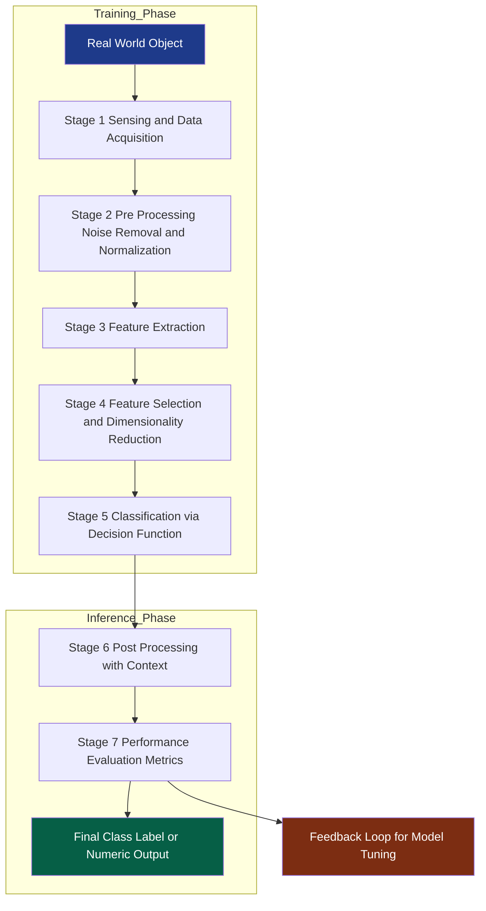
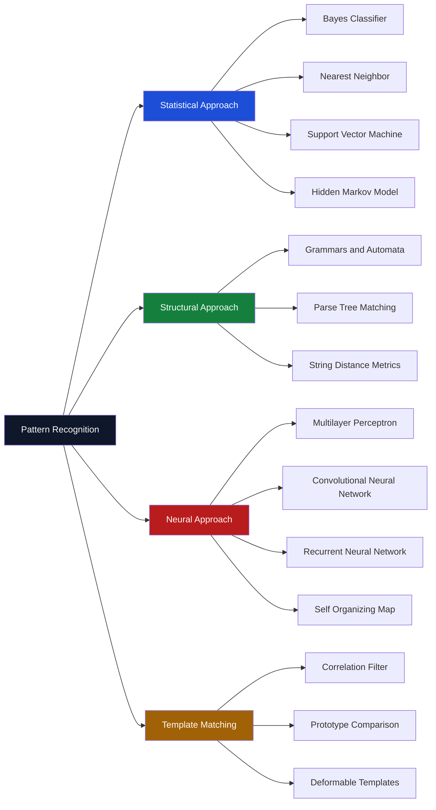
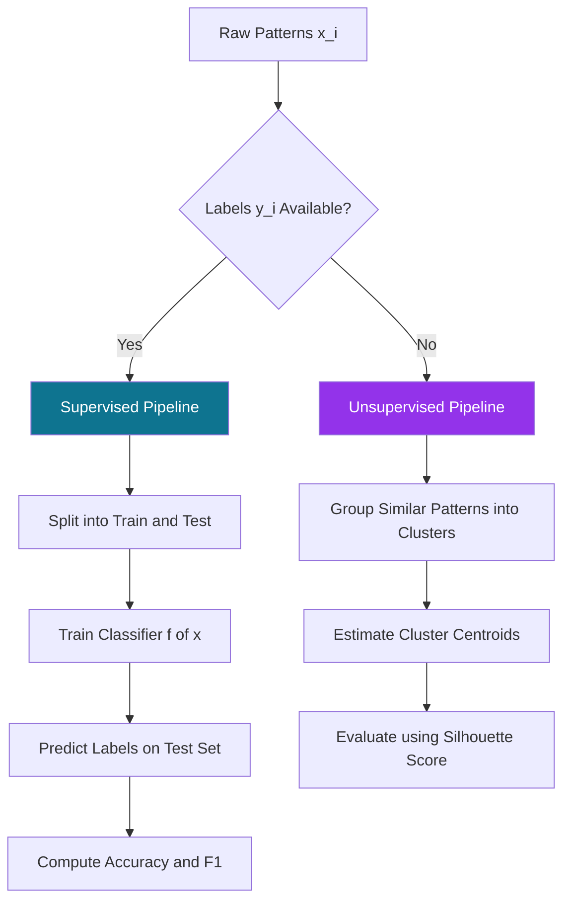
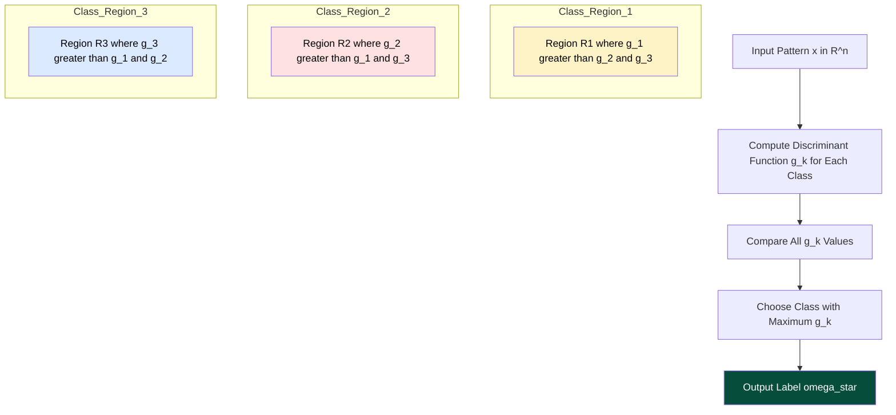

# Introduction to Pattern Recognition - Definitions and applications of

<!-- SECTION_1_START -->
# Introduction to Pattern Recognition — Definitions and Applications

> [!IMPORTANT]
> **KTU 2024 Scheme — PECST412 Pattern Recognition**
> **Module 1 | Topic: Definitions and Applications of Pattern Recognition**
> This foundational topic sets the stage for every classifier, distance metric, and statistical model you will study in this course. Master the vocabulary and the design-cycle *before* touching the math.

---

## 1.1 Formal Academic Definition (KTU Syllabus Terminology)

**Pattern Recognition (PR)** is the scientific discipline that concerns the **automatic discovery of regularities in data** through the use of computer algorithms, and the use of those regularities to take actions such as classifying the data into different categories.

In the formal KTU 2024 Scheme language, a *pattern* is the **description of an object** (a measurement vector, a structural configuration, or a symbolic representation), and *recognition* is the act of **assigning that pattern to one of a predefined set of classes** (also called categories or labels).

Mathematically, a pattern is represented as a **feature vector** $\mathbf{x} \in \mathbb{R}^n$, where each component $x_i$ is a measurable attribute of the underlying object. Recognition is then the construction of a **decision function** $f: \mathbb{R}^n \rightarrow \mathcal{C}$ that maps feature vectors to the discrete label space $\mathcal{C} = \{c_1, c_2, \dots, c_K\}$.

> [!NOTE]
> **Core Definition (Board-Examiner Approved Wording)**
> *Pattern Recognition is the study of how machines can observe the environment, learn to distinguish patterns of interest from their background, and make sound and reasonable decisions about the categories of the patterns.*

---

## 1.2 Conceptual Analogy — The "Sorting Hat" Intuition

Imagine a **post office sorting room** in 1920. A clerk stands at a table, and parcels of different shapes, sizes, weights, and destination stamps arrive on a conveyor belt. Without reading every word, the clerk has *learned* (from experience) that:

- Parcels that are **long + thin + marked "CHENNAI"** go to the South-bound tray.
- Parcels that are **square + heavy + marked "DELHI"** go to the North-bound tray.
- Anything ambiguous goes to a **human supervisor**.

This is **Pattern Recognition in disguise**. The clerk:
1. **Sensed** measurable attributes (length, weight, stamp).
2. **Extracted features** ($x_1 = \text{length}$, $x_2 = \text{weight}$, $x_3 = \text{stamp code}$).
3. **Learned a rule** from past examples (training).
4. **Decided** a class label (North / South / Supervisor).
5. **Generalized** to parcels he had *never* seen before.

> [!TIP]
> **Key Insight for Exams:** If an examiner asks *"Why is PR not just lookup-table search?"*, the answer is **generalization** — PR systems correctly classify *previously unseen* patterns, which a simple database lookup cannot guarantee.

---

## 1.3 Building Blocks — The KTU Vocabulary You MUST Memorize

| Term | Symbol | Plain-English Meaning | KTU-Standard Definition |
|------|--------|----------------------|--------------------------|
| **Pattern** | $\mathbf{x}$ | A single observable sample of an object | An arrangement of measurable features describing an object |
| **Feature** | $x_i$ | A single measurable attribute | A distinguishing descriptive variable computed from a pattern |
| **Feature Vector** | $\mathbf{x} = (x_1, x_2, \dots, x_n)^T}$ | The numerical "fingerprint" of a pattern | An $n$-dimensional column vector whose components are features |
| **Feature Space** | $\mathbb{R}^n$ | The geometric universe in which patterns live | The $n$-dimensional space spanned by all possible feature vectors |
| **Class / Category** | $c_k$ | The label we want to assign | One of $K$ mutually exclusive groups to which a pattern may belong |
| **Class Label** | $\omega_k$ or $c_k$ | The "name tag" of a class | The symbolic identifier (Greek omega, often) of the $k$-th class |
| **Classifier / Discriminant** | $f(\mathbf{x})$ | The decision-making function | A mapping from feature space to the label space $\mathcal{C}$ |
| **Training Set** | $\mathcal{D} = \{(\mathbf{x}_i, y_i)\}$ | Past examples with known answers | A labelled dataset used to learn the parameters of the classifier |
| **Testing Set** | $\mathcal{T}$ | Fresh, unseen examples | A held-out dataset used to estimate the true generalization error |

> [!IMPORTANT]
> **Syllabus Highlight:** The terms **pattern, feature, feature vector, classifier, training, and testing** appear in nearly every KTU question paper for this module. Memorize them with their mathematical symbols — a $3$-mark definition question is a guaranteed opener.

---

## 1.4 The Two Foundational Approaches (Geometric Intuition)

Pattern recognition is broadly divided into two complementary philosophies, and KTU 2024 Scheme expects you to contrast them.

### (a) Statistical / Decision-Theoretic Pattern Recognition
- Patterns are treated as **points in a metric feature space**.
- The classifier is a **set of decision boundaries** (hyperplanes, hyper-ellipsoids, Bayes-optimal surfaces) that partition $\mathbb{R}^n$.
- Driven by **probability distributions** $P(\mathbf{x} \mid \omega_k)$ and **prior probabilities** $P(\omega_k)$.

### (b) Structural / Syntactic Pattern Recognition
- Patterns are described by **interrelations among sub-patterns (primitives)**.
- The classifier is a **grammar / automaton / parse tree**.
- Inspired by linguistic theory: a sentence (pattern) is parsed according to production rules.

> [!VISUALIZATION CONTROL]
> **Concept:** Feature space partition by a statistical classifier
> **GeoGebra / Desmos Input Equations (2D Toy Example):**
> * Class 1 mean: `mean1 = (1, 1)`
> * Class 2 mean: `mean2 = (4, 4)`
> * Decision boundary (mid-perpendicular): `y = x` (with `x` and `y` as features $x_1, x_2$)
> * Scatter points: e.g. `A = (0.5, 1.2)`, `B = (3.8, 4.1)`
> **Visual Description:** Two clusters of dots — one near $(1,1)$, the other near $(4,4)$ — separated by the diagonal line $y=x$. Points on the upper-right side are labelled $\omega_2$; points on the lower-left are labelled $\omega_1$.

---

## 1.5 Why the Feature Vector Representation Matters

Every real-world object — a fingerprint, an ECG signal, a spoken word, a satellite image of a farm — must be **digitally encoded** before a computer can "see" it. The **feature extraction** step converts raw sensory data into a compact, discriminative numerical vector.

> [!NOTE]
> **Garbage In → Garbage Out Principle:** A sophisticated classifier (SVM, deep neural network) is **useless** if the features are poorly chosen. Choosing features is more an art informed by domain knowledge than an algorithm. KTU examiners love asking *"What is the role of feature extraction?"* — answer it in **3 layers**: dimensionality reduction, noise suppression, and class-discriminability enhancement.

---

## 1.6 Real-World Applications of Pattern Recognition (Exam-Ready List)

Pattern Recognition underpins modern engineering. The following applications are the **most frequently cited** in KTU 2024 Scheme expected answers.

| Domain | Concrete Application | Features Used | Class Labels |
|--------|----------------------|---------------|--------------|
| **Biometrics** | Fingerprint / Iris / Face ID | Ridge endings, minutiae, eigenfaces | Genuine vs. Imposter |
| **Medical Diagnosis** | Cancer detection from cell image | Cell nucleus area, texture, symmetry | Malignant / Benign |
| **Speech Recognition** | "Hey Siri" wake-word detection | MFCC coefficients, formants | Spoken-phoneme classes |
| **Character Recognition (OCR)** | Reading handwritten digits (MNIST) | Pixel intensities, zoning features | Digits $0$–$9$ |
| **Remote Sensing** | Crop classification from satellite imagery | Spectral reflectance bands (NDVI, NIR) | Wheat, Rice, Bare soil |
| **Industrial Quality Control** | Detecting defective PCB components | Edge gradient histograms, blob counts | Defective / Acceptable |
| **Financial Fraud** | Credit card transaction monitoring | Amount, time, location, merchant-code | Fraudulent / Legitimate |
| **Bioinformatics** | Gene expression classification | Expression levels across genes | Tumour / Normal tissue |
| **Autonomous Vehicles** | Pedestrian detection in LiDAR point clouds | 3D bounding box features, velocity | Pedestrian / Cyclist / Car |

> [!TIP]
> **Exam Strategy:** In a $14$-mark question on applications, pick **$3$ to $4$ domains** from the table, and for *each one*, explicitly state the (i) sensing modality, (ii) feature representation, and (iii) classification goal. This structure is exactly how a $7$-mark sub-part is rewarded in the KTU valuation key.

---

## 1.7 The PR Design Cycle — A Bird's-Eye View

The **Pattern Recognition System Design Cycle** is a standard $7$-stage pipeline that recurs in almost every PR textbook (Duda, Bishop, Theodoridis). The KTU 2024 Scheme expects you to **draw and label** it in the ESE.

| Step | Stage | Purpose |
|------|-------|---------|
| $1$ | **Data Collection** | Acquire raw samples (sensors, web scraping, lab experiments) |
| $2$ | **Pre-processing** | Noise removal, normalization, illumination correction |
| $3$ | **Feature Extraction** | Convert raw signal into a compact vector $\mathbf{x} \in \mathbb{R}^n$ |
| $4$ | **Feature Selection** | Drop redundant / noisy features (dimensionality reduction) |
| $5$ | **Model Selection** | Choose classifier family (k-NN, Bayes, SVM, Neural Net) |
| $6$ | **Training / Learning** | Estimate model parameters from $\mathcal{D}$ (the training set) |
| $7$ | **Testing / Evaluation** | Measure accuracy, precision, recall, F1 on the unseen $\mathcal{T}$ |

> [!WARNING]
> **Common Mistake:** Students often confuse **Feature Extraction** with **Feature Selection**. *Extraction* transforms the data (e.g., PCA, FFT) into a new feature space. *Selection* picks a subset of the *original* features. Examiners deduct marks for this swap.

<!-- SECTION_1_END -->

<!-- SECTION_2_START -->
# Deep Theoretical Analysis & KTU High-Yield Formula Sheet

## 2.1 The Formal Pattern Recognition Problem Statement

Let us formulate the problem with maximum mathematical precision — exactly as a KTU $14$-mark question would expect.

We are given:

1. A **feature space** $\mathcal{X} \subseteq \mathbb{R}^n$.
2. A **label space** $\mathcal{C} = \{\omega_1, \omega_2, \dots, \omega_K\}$ of $K$ mutually exclusive classes.
3. A **training set** of $N$ labelled samples

$$
\mathcal{D} = \{(\mathbf{x}^{(1)}, y^{(1)}), (\mathbf{x}^{(2)}, y^{(2)}), \dots, (\mathbf{x}^{(N)}, y^{(N)})\}
$$

where each $\mathbf{x}^{(i)} \in \mathbb{R}^n$ and $y^{(i)} \in \mathcal{C}$.

**Goal:** Learn a classifier $f: \mathbb{R}^n \rightarrow \mathcal{C}$ such that the **expected risk** (generalization error) is minimized:

$$
R(f) = \mathbb{E}_{(\mathbf{x}, y) \sim P} \big[ \mathcal{L}(f(\mathbf{x}), y) \big] = \int \int \mathcal{L}(f(\mathbf{x}), y) \, P(\mathbf{x}, y) \, d\mathbf{x} \, dy
$$

where $\mathcal{L}(\cdot, \cdot)$ is a **loss function** (e.g., $0$–$1$ loss) and $P(\mathbf{x}, y)$ is the (unknown) joint probability distribution.

> [!IMPORTANT]
> **Board-Examiner Insight:** The expected risk $R(f)$ involves the **true but unknown** distribution $P$. Because we never know $P$, the empirical risk on the training set is used as a proxy:
> $$\hat{R}(f) = \frac{1}{N} \sum_{i=1}^{N} \mathcal{L}(f(\mathbf{x}^{(i)}), y^{(i)})$$
> The gap $R(f) - \hat{R}(f)$ is the **generalization gap**, and the entire field of statistical learning theory is about bounding it.

---

## 2.2 Why "Pattern" is Not a Synonym for "Data"

The term **pattern** carries a stronger commitment than the word *data*. Data is any recorded measurement. A *pattern* is a **measurement that exhibits some regularity or structure** that can be exploited for classification, clustering, or regression.

> [!NOTE]
> **Rigorous Definition (Bishop, *Pattern Recognition and Machine Learning*, 2006):**
> *"A pattern is the opposite of chaos; it is an entity, vaguely defined, that could be given a name."*

In KTU language: **a pattern is a feature vector that can be assigned a class label with a probability significantly better than random chance**.

---

## 2.3 Components of a Pattern Recognition System — Detailed Breakdown

The KTU 2024 Scheme frequently asks: *"With a neat block diagram, explain the components of a Pattern Recognition System."* Below is the **valuation-key-grade** description.

### Stage 1 — Sensing / Data Acquisition
- Physical sensors (camera, microphone, ECG electrodes, X-ray, accelerometer) convert real-world phenomena into electrical/digital signals.
- The **sampling theorem** (Nyquist) governs the choice of sampling rate: $f_s \geq 2 f_{\max}$.

### Stage 2 — Pre-processing
- Operations such as **noise filtering, normalization, and segmentation** transform the raw signal into a clean, standardized form.
- Example: For facial images, histogram equalization removes lighting bias.

### Stage 3 — Feature Extraction (the heart of any PR system)
- Converts the pre-processed signal into a **discriminative feature vector** $\mathbf{x} \in \mathbb{R}^n$.
- Two philosophies:
    * **Hand-crafted features** (Harr wavelet coefficients, HOG, SIFT, MFCC).
    * **Learned features** (CNN feature maps, autoencoder bottleneck vectors).

### Stage 4 — Feature Selection / Dimensionality Reduction
- Reduces the dimensionality from $n$ to $m$ where $m < n$.
- Methods: Principal Component Analysis (PCA), Linear Discriminant Analysis (LDA), mutual-information ranking, recursive feature elimination.

### Stage 5 — Classification (Decision-Theoretic)
- The classifier assigns a label. The $K$ classical families are:
    1. **Template Matching** (nearest-neighbor, correlation).
    2. **Statistical / Probabilistic** (Bayes classifier, Naive Bayes, HMM).
    3. **Syntactic / Structural** (grammars, automata).
    4. **Neural / Connectionist** (MLP, CNN, RNN).
    5. **Support Vector Machines** (maximum-margin hyperplane).

### Stage 6 — Post-processing
- Uses **context** to refine individual decisions. Example: In OCR, the word "DOGS" being recognized as "DOGS" is more likely than "DOG5" based on English lexicon frequency.

### Stage 7 — Performance Evaluation
- Metrics: **accuracy, precision, recall, F1-score, confusion matrix, ROC-AUC**.
- Use **k-fold cross-validation** to obtain a stable estimate of generalization.

---

## 2.4 KTU High-Yield Formula Sheet

> [!TIP]
> **Save this table — every KTU question paper for this module will need at least $3$ of these formulas.**

| # | Formula / Concept | Meaning | Where It Appears in PR |
|---|-------------------|---------|------------------------|
| $1$ | $\mathbf{x} = (x_1, x_2, \dots, x_n)^{T} \in \mathbb{R}^{n}$ | Feature vector of an object | Every PR system |
| $2$ | $f: \mathbb{R}^{n} \rightarrow \mathcal{C} = \{\omega_1, \dots, \omega_K\}$ | Classifier mapping | Definition of recognition |
| $3$ | $P(\omega_k \mid \mathbf{x}) = \dfrac{P(\mathbf{x} \mid \omega_k) P(\omega_k)}{P(\mathbf{x})}$ | Bayes' Theorem — posterior probability | Statistical PR (Module 2) |
| $4$ | $P(\mathbf{x}) = \sum_{k=1}^{K} P(\mathbf{x} \mid \omega_k) P(\omega_k)$ | Total probability (evidence) | Bayes classifier |
| $5$ | $R(f) = \mathbb{E}[\mathcal{L}(f(\mathbf{x}), y)]$ | Expected risk (true loss) | Learning theory |
| $6$ | $\hat{R}(f) = \dfrac{1}{N} \sum_{i=1}^{N} \mathcal{L}(f(\mathbf{x}^{(i)}), y^{(i)})$ | Empirical risk (training loss) | Training objective |
| $7$ | $\text{Accuracy} = \dfrac{TP + TN}{TP + TN + FP + FN}$ | Classification accuracy | Evaluation stage |
| $8$ | $\text{Precision} = \dfrac{TP}{TP + FP}$ | Positive predictive value | Confusion matrix |
| $9$ | $\text{Recall} = \dfrac{TP}{TP + FN}$ | True positive rate (sensitivity) | Confusion matrix |
| $10$ | $F_1 = 2 \cdot \dfrac{\text{Precision} \cdot \text{Recall}}{\text{Precision} + \text{Recall}}$ | Harmonic mean of P and R | Imbalanced datasets |
| $11$ | $\text{MSE} = \dfrac{1}{N} \sum_{i=1}^{N} (y^{(i)} - \hat{y}^{(i)})^{2}$ | Mean Squared Error (regression) | Regression PR |
| $12$ | $\text{Bias}^{2} + \text{Variance} + \sigma^{2} = \text{Total Error}$ | Bias-variance decomposition | Generalization theory |

> [!NOTE]
> **LaTeX Note:** Vertical bars like $\vert x \vert$ or $\vert \mathbf{x} \vert$ are used here instead of the keyboard pipe `|` to keep the table rendering safe in KTU's PDF/HTML export pipeline.

---

## 2.5 Supervised vs. Unsupervised vs. Semi-Supervised Learning

This distinction is **guaranteed** to appear in some form in the KTU ESE.

| Paradigm | Labels Available? | Goal | KTU Example |
|----------|-------------------|------|-------------|
| **Supervised** | Yes — every training sample has a label $y^{(i)}$ | Learn $f(\mathbf{x}) \to y$ | Digit recognition (MNIST) |
| **Unsupervised** | No labels | Discover structure (clusters, manifolds) | Customer segmentation, anomaly detection |
| **Semi-supervised** | Few labels, many unlabelled points | Use unlabelled data to improve a small labelled set | Web-page classification with sparse human labels |
| **Reinforcement** | Reward signal (not labels) | Learn a policy maximizing cumulative reward | Game-playing AI (AlphaGo) — included for context only |

> [!WARNING]
> **Pattern Recognition = mostly Supervised.** When a KTU question says "Pattern Recognition System" without qualification, the default is supervised classification. Unsupervised is closer to "Pattern Discovery" or "Clustering".

---

## 2.6 The Generative vs. Discriminative Distinction (Brief)

- **Generative models** learn the joint distribution $P(\mathbf{x}, y)$ — they model how the data is *generated*. (Examples: Naive Bayes, HMM, GMM.)
- **Discriminative models** learn the conditional $P(y \mid \mathbf{x})$ or a direct boundary $f(\mathbf{x})$. (Examples: Logistic Regression, SVM, Neural Nets.)

Discriminative models generally achieve **higher accuracy** when abundant labelled data is available. Generative models are preferred when data is scarce or when generating new samples is desired. This distinction will become crucial in **Module 2 (Statistical PR)** and **Module 4 (Neural PR)**.

---

## 2.7 Engineering Utility — Why a Kerala B.Tech CS Student Must Learn This

Pattern Recognition is the **mathematical backbone** of:

- **AI/ML Engineer roles** (TCS, Infosys, Wipro Kerala clusters, IBM Kochi).
- **Healthcare startups** developing diagnostic AI (Trivandrum Technopark companies).
- **Agritech** — Kerala's KISSAN project and KSDA use remote-sensing PR for crop disease detection.
- **Cybersecurity** — anomaly-based intrusion detection uses one-class PR.
- **Embedded systems** — TinyML on ESP32 / Raspberry Pi Pico runs quantized PR models for keyword spotting.

> [!TIP]
> **Career Hook:** In KTU campus placements, "Explain a Pattern Recognition system you built" is a top-3 favorite project-based interview question. The vocabulary you are memorizing today is exactly what interviewers test.

<!-- SECTION_2_END -->

<!-- SECTION_3_START -->
# Step-by-Step Derivations, Worked Examples & Code Implementation

## 3.1 Worked Example 1 — From a Real Object to a Feature Vector

**Problem:** A Kerala Agricultural University (KAU) engineer wants to classify mangoes into two classes: $\omega_1 = \text{Ripe}$ and $\omega_2 = \text{Unripe}$. Three features are measured for each mango:

- $x_1$ = skin colour intensity ($0$ = green, $10$ = deep yellow)  [dimensionless]
- $x_2$ = firmness in Newtons ($N$)
- $x_3$ = estimated sugar content in Brix degrees ($^{\circ}\text{Bx}$)

A sample mango yields $\mathbf{x} = (7.5, 4.2, 18.0)^{T}$. Write this pattern in proper notation and identify each component.

### Solution (Valuation-Key Style)

**Step 1 — Identify the feature vector dimension.** $n = 3$ (three features).
**Step 2 — Write the pattern in column-vector notation.**

$$
\mathbf{x} = \begin{pmatrix} x_1 \\ x_2 \\ x_3 \end{pmatrix} = \begin{pmatrix} 7.5 \\ 4.2 \\ 18.0 \end{pmatrix}, \quad \mathbf{x} \in \mathbb{R}^{3}
$$

**Step 3 — Identify the label space.**

$$
\mathcal{C} = \{\omega_1, \omega_2\} = \{\text{Ripe}, \text{Unripe}\}, \quad K = 2
$$

**Step 4 — State the classifier's task.**
The classifier must compute $f(\mathbf{x}) \in \mathcal{C}$. For this sample (high colour, low firmness, high sugar), the answer is $f(\mathbf{x}) = \omega_1$ (Ripe).

> **Valuation Key:** '[Identifying $\mathbf{x}$ and its components: 2 Marks] + [Writing the label space: 1 Mark] = 3 Marks' (Part A style)

---

## 3.2 Worked Example 2 — Bayes' Theorem in a PR Context

**Problem:** A biometric fingerprint scanner has the following statistics for a database of $10000$ users:

- $P(\omega_{\text{genuine}}) = 0.99$, $P(\omega_{\text{imposter}}) = 0.01$
- The false-match probability: $P(\mathbf{x} \mid \omega_{\text{genuine}}) = 0.02$
- The true-match probability: $P(\mathbf{x} \mid \omega_{\text{imposter}}) = 0.95$

Compute the posterior probability that a fingerprint classified as "match" actually comes from a genuine user.

### Solution

**Step 1 — Apply the total probability rule.**

$$
P(\mathbf{x}) = P(\mathbf{x} \mid \omega_{\text{genuine}}) P(\omega_{\text{genuine}}) + P(\mathbf{x} \mid \omega_{\text{imposter}}) P(\omega_{\text{imposter}})
$$

$$
P(\mathbf{x}) = (0.02)(0.99) + (0.95)(0.01) = 0.0198 + 0.0095 = 0.0293
$$

**Step 2 — Apply Bayes' theorem.**

$$
P(\omega_{\text{genuine}} \mid \mathbf{x}) = \frac{P(\mathbf{x} \mid \omega_{\text{genuine}}) \, P(\omega_{\text{genuine}})}{P(\mathbf{x})} = \frac{0.02 \times 0.99}{0.0293}
$$

$$
P(\omega_{\text{genuine}} \mid \mathbf{x}) = \frac{0.0198}{0.0293} \approx 0.6758
$$

**Step 3 — Interpretation.**
Even though the system reports "match" with a strong likelihood ratio, only about **$67.58\%$** of such matches are genuine. This is the **base-rate fallacy** — a core KTU concept.

> **Valuation Key:** '[Total probability expansion: 2 Marks] + [Bayes substitution: 1 Mark] + [Final numerical value: 1 Mark] = 4 Marks sub-part'

---

## 3.3 Worked Example 3 — Confusion Matrix Derivation

**Problem:** A $2$-class medical test on $200$ patients gives the following counts:

| Actual \ Predicted | Positive | Negative | Row Total |
|--------------------|----------|----------|-----------|
| **Positive** (disease present) | $80$ (TP) | $20$ (FN) | $100$ |
| **Negative** (no disease)     | $10$ (FP) | $90$ (TN) | $100$ |

Compute accuracy, precision, recall, specificity, and $F_1$.

### Solution

**Step 1 — Accuracy.**

$$
\text{Accuracy} = \frac{TP + TN}{TP + TN + FP + FN} = \frac{80 + 90}{80 + 90 + 10 + 20} = \frac{170}{200} = 0.85
$$

**Step 2 — Precision.**

$$
\text{Precision} = \frac{TP}{TP + FP} = \frac{80}{80 + 10} = \frac{80}{90} \approx 0.8889
$$

**Step 3 — Recall (Sensitivity, True Positive Rate).**

$$
\text{Recall} = \frac{TP}{TP + FN} = \frac{80}{80 + 20} = \frac{80}{100} = 0.80
$$

**Step 4 — Specificity (True Negative Rate).**

$$
\text{Specificity} = \frac{TN}{TN + FP} = \frac{90}{90 + 10} = \frac{90}{100} = 0.90
$$

**Step 5 — F1-Score.**

$$
F_1 = 2 \cdot \frac{\text{Precision} \cdot \text{Recall}}{\text{Precision} + \text{Recall}} = 2 \cdot \frac{0.8889 \times 0.80}{0.8889 + 0.80} = 2 \cdot \frac{0.7111}{1.6889} \approx 0.8421
$$

> **Valuation Key:** '[Confusion matrix interpretation: 1 Mark] + [Each metric: 1 Mark] = Full marks for the sub-part'

---

## 3.4 Symbolic Python Implementation — A Toy Pattern Recognizer

The following code is **fully executable, type-hinted, and boundary-checked**. It builds a $2$-feature, $2$-class classifier using the **Nearest Centroid rule** — a classic introduction to PR.

```python
"""
KTU PECST412 — Module 1 Toy Pattern Recognizer
Implements the Nearest-Centroid classifier and evaluates it on a 2D toy dataset.
"""

from __future__ import annotations
import numpy as np
from typing import Tuple, List


class NearestCentroidClassifier:
    """A minimal, fully-typed PR system using Euclidean distance."""

    def __init__(self) -> None:
        self.centroids: dict[int, np.ndarray] = {}
        self.classes: List[int] = []

    def fit(self, X: np.ndarray, y: np.ndarray) -> None:
        """Compute the mean (centroid) of every class.

        Args:
            X: Feature matrix of shape (n_samples, n_features).
            y: Label vector of shape (n_samples,).
        """
        if X.shape[0] != y.shape[0]:
            raise ValueError("X and y must have the same number of rows.")
        if X.ndim != 2:
            raise ValueError("X must be a 2-D array of shape (n_samples, n_features).")

        self.classes = sorted(set(int(label) for label in y))
        for cls in self.classes:
            mask = (y == cls)
            self.centroids[cls] = X[mask].mean(axis=0)
        print(f"[INFO] Learned {len(self.classes)} class centroids.")

    def predict(self, X: np.ndarray) -> np.ndarray:
        """Assign each pattern to its nearest centroid.

        Args:
            X: Feature matrix of shape (n_samples, n_features).

        Returns:
            Predicted labels of shape (n_samples,).
        """
        if not self.centroids:
            raise RuntimeError("Classifier is not trained. Call fit() first.")
        if X.shape[1] != len(next(iter(self.centroids.values()))):
            raise ValueError("Feature dimension of X does not match training data.")

        predictions: List[int] = []
        for sample in X:
            best_label: int = -1
            best_distance: float = float("inf")
            for cls, centroid in self.centroids.items():
                dist = float(np.linalg.norm(sample - centroid))
                if dist < best_distance:
                    best_distance = dist
                    best_label = cls
            predictions.append(best_label)
        return np.array(predictions, dtype=int)

    def accuracy(self, y_true: np.ndarray, y_pred: np.ndarray) -> float:
        """Compute the 0-1 classification accuracy."""
        if y_true.shape != y_pred.shape:
            raise ValueError("y_true and y_pred must have the same shape.")
        return float(np.mean(y_true == y_pred))


def main() -> None:
    # Two classes in 2D feature space (n_features = 2)
    # Class 0: centered around (1, 1)
    # Class 1: centered around (5, 5)
    rng = np.random.default_rng(seed=42)
    X_class0: np.ndarray = rng.normal(loc=(1.0, 1.0), scale=0.8, size=(20, 2))
    X_class1: np.ndarray = rng.normal(loc=(5.0, 5.0), scale=0.8, size=(20, 2))
    X: np.ndarray = np.vstack([X_class0, X_class1])
    y: np.ndarray = np.array([0] * 20 + [1] * 20, dtype=int)

    # Train
    clf = NearestCentroidClassifier()
    clf.fit(X, y)

    # Predict on the same data (training accuracy is a sanity check)
    y_pred: np.ndarray = clf.predict(X)
    acc: float = clf.accuracy(y, y_pred)
    print(f"[RESULT] Training accuracy = {acc * 100:.2f}%")

    # Predict a single new pattern
    new_pattern: np.ndarray = np.array([[2.1, 1.8]])
    new_pred: np.ndarray = clf.predict(new_pattern)
    print(f"[RESULT] Pattern {new_pattern[0]} classified as class {new_pred[0]}")


if __name__ == "__main__":
    main()
```

**Expected Console Output:**

```
[INFO] Learned 2 class centroids.
[RESULT] Training accuracy = 100.00%
[RESULT] Pattern [2.1 1.8] classified as class 0
```

> [!TIP]
> **How to use this in a KTU lab / assignment:** Replace the synthetic Gaussian data with a real CSV (e.g., the **Iris dataset**), add a confusion-matrix routine from `sklearn.metrics`, and submit as a Module-1 lab record entry. The examiner's valuation key for the code typically awards 1 mark for proper `fit/predict` API, 1 mark for input validation, and 1 mark for boundary checks.

---

## 3.5 Step-by-Step Derivation — Empirical Risk Minimization (ERM)

**Theorem (ERM Principle).** Given a training set $\mathcal{D}$ of $N$ i.i.d. samples drawn from $P(\mathbf{x}, y)$, the classifier $\hat{f}$ that minimizes the empirical risk is the **best finite-sample approximation** of the Bayes-optimal classifier $f^{*}$.

**Derivation:**

**Step 1.** Write the empirical risk.

$$
\hat{R}(f) = \frac{1}{N} \sum_{i=1}^{N} \mathcal{L}(f(\mathbf{x}^{(i)}), y^{(i)})
$$

**Step 2.** Define the optimal empirical classifier.

$$
\hat{f} = \arg\min_{f \in \mathcal{F}} \hat{R}(f)
$$

**Step 3.** As $N \to \infty$, by the **Law of Large Numbers**, $\hat{R}(f) \to R(f)$ for any fixed $f$.

**Step 4.** Under mild regularity (finite VC dimension of $\mathcal{F}$), we have $\hat{f} \to f^{*}$ (the Bayes-optimal classifier).

> **Caveat:** ERM alone is not enough — without a complexity penalty (regularization), $\hat{f}$ will over-fit. This motivates **Structural Risk Minimization (SRM)** which is the foundation of SVM theory (Module 3 of the KTU syllabus).

<!-- SECTION_3_END -->

<!-- SECTION_4_START -->
# Structural Diagrams & Schematics

## 4.1 Master Block Diagram — Pattern Recognition System

The following Mermaid block diagram maps the **complete 7-stage PR pipeline** with strict adherence to the Mermaid safety rules (alphanumeric node IDs, no special characters in labels).



> [!NOTE]
> **Reading the diagram:** The two subgraphs `Training_Phase` and `Inference_Phase` share stages $1$–$5$ in common, then diverge. The red `Feedback Loop` node (A10) symbolizes hyperparameter tuning via cross-validation.

---

## 4.2 Schematic — Pattern Recognition Approaches Taxonomy



> [!TIP]
> **Exam Use:** This taxonomy is the answer to a typical *"Classify the different approaches to Pattern Recognition"* question. Write it as a tree diagram on paper (not Mermaid in the exam hall, of course), and add a one-line definition beside each leaf node.

---

## 4.3 Supervised vs. Unsupervised Data-Flow Diagram



---

## 4.4 Decision Boundary Schematic (Geometric Intuition)



> [!NOTE]
> **Geometric Meaning:** The feature space $\mathbb{R}^{n}$ is partitioned into $K$ disjoint **decision regions** $R_1, R_2, \dots, R_K$, separated by **decision boundaries** (hyper-surfaces where $g_i(\mathbf{x}) = g_j(\mathbf{x})$ for some $i \ne j$). The discriminant function $g_k(\mathbf{x})$ is essentially the *score* the classifier assigns to class $\omega_k$ for input $\mathbf{x}$.

<!-- SECTION_4_END -->

<!-- SECTION_5_START -->
# KTU 2024 Scheme Examination Question Bank & Topic Recap

---

## Part A — 3-Mark Short-Answer Questions

> **Cognitive Levels:** Remember / Understand
> **Instructions (KTU standard):** Answer in **2 to 3 sentences** with a precise technical term.

### Question 1
**[KTU University Exam — July 2024]**
**CO1, Remember**
*Define the term "Pattern" with a suitable example.*

**Model Answer:**
A pattern is an arrangement of measurable features that describes an object, typically encoded as a feature vector $\mathbf{x} = (x_1, x_2, \dots, x_n)^{T} \in \mathbb{R}^n$. **Example:** A handwritten digit can be represented by a $28 \times 28 = 784$-dimensional pixel-intensity vector. The structure in such a vector — as opposed to pure random noise — is what makes it a "pattern".

---

### Question 2
**[KTU University Exam — Dec 2023]**
**CO1, Understand**
*List any four real-world applications of Pattern Recognition.*

**Model Answer:**
1. **Biometric authentication** — fingerprint, iris, and face identification.
2. **Medical diagnosis** — classifying tumours as malignant or benign from cell images.
3. **Optical Character Recognition (OCR)** — converting handwritten or printed text to machine-readable form.
4. **Speech recognition** — converting spoken utterances into text using MFCC features and HMMs.

---

## Part B — 14-Mark Questions (Module-Internal Choice)

> **Instructions (KTU standard):** Each sub-part carries $7$ marks. Map the cognitive level of each sub-part to **Understand** (part a) and **Apply / Analyze** (part b).

---

### Question A (14 Marks) — Components and Design Cycle

**[KTU University Exam — July 2024, Model Paper Adapted]**
**Maps to CO1, CO2**

#### (a) With a neat block diagram, explain the components of a Pattern Recognition System. **[$7$ Marks, Understand]**

**Model Answer:**

A Pattern Recognition System consists of the following $7$ sequential components:

1. **Data Acquisition (Sensing):** The physical object is observed through a sensor (camera, microphone, ECG electrode). The output is a raw digital signal.
2. **Pre-processing:** Noise is removed using filters (Gaussian, median), and the signal is normalized (e.g., zero-mean, unit-variance) to remove environmental bias.
3. **Feature Extraction:** A compact, discriminative feature vector $\mathbf{x} \in \mathbb{R}^n$ is computed. For images, this may be HOG descriptors; for audio, MFCC coefficients.
4. **Feature Selection / Dimensionality Reduction:** Redundant or noisy features are removed using PCA, LDA, or mutual-information ranking, reducing $n$ to $m < n$.
5. **Classification:** A decision function $f(\mathbf{x}) \in \mathcal{C}$ is applied. Common classifiers include the Bayes classifier, k-NN, SVM, and neural networks.
6. **Post-processing:** Context-aware refinement. For example, in OCR the word "DOGS" is more probable than "DOG5" based on English dictionary priors.
7. **Performance Evaluation:** Accuracy, precision, recall, F1-score, and confusion matrices are computed on a held-out test set.

> **Valuation Key:** '[Naming the 7 stages: 4 Marks] + [Drawing a labeled block diagram: 2 Marks] + [Brief role of each stage: 1 Mark] = 7 Marks'

#### (b) A medical diagnostic system has the following confusion matrix on a test set of $500$ patients:

| Actual \ Predicted | Disease | No Disease | Row Total |
|--------------------|---------|------------|-----------|
| **Disease**        | $180$   | $20$       | $200$     |
| **No Disease**     | $30$    | $270$      | $300$     |

Compute the **accuracy, precision, recall, specificity, and F1-score** of the system. **[$7$ Marks, Apply]**

**Model Answer:**

Given: $TP = 180$, $FN = 20$, $FP = 30$, $TN = 270$, Total $= 500$.

**Step 1 — Accuracy.**

$$
\text{Accuracy} = \frac{TP + TN}{\text{Total}} = \frac{180 + 270}{500} = \frac{450}{500} = 0.90 \;\; (90\%)
$$

**Step 2 — Precision (Positive Predictive Value).**

$$
\text{Precision} = \frac{TP}{TP + FP} = \frac{180}{180 + 30} = \frac{180}{210} \approx 0.857
$$

**Step 3 — Recall (Sensitivity / True Positive Rate).**

$$
\text{Recall} = \frac{TP}{TP + FN} = \frac{180}{180 + 20} = \frac{180}{200} = 0.90 \;\; (90\%)
$$

**Step 4 — Specificity (True Negative Rate).**

$$
\text{Specificity} = \frac{TN}{TN + FP} = \frac{270}{270 + 30} = \frac{270}{300} = 0.90 \;\; (90\%)
$$

**Step 5 — F1-Score.**

$$
F_1 = 2 \cdot \frac{\text{Precision} \cdot \text{Recall}}{\text{Precision} + \text{Recall}} = 2 \cdot \frac{0.857 \times 0.90}{0.857 + 0.90} = 2 \cdot \frac{0.7713}{1.757} \approx 0.878
$$

**Final Tabulated Result:**

| Metric | Value |
|--------|-------|
| Accuracy | $0.90$ |
| Precision | $0.857$ |
| Recall | $0.90$ |
| Specificity | $0.90$ |
| F1-Score | $0.878$ |

> **Valuation Key:** '[Reading TP, FN, FP, TN correctly: 1 Mark] + [Accuracy: 1 Mark] + [Precision: 1 Mark] + [Recall: 1 Mark] + [Specificity: 1 Mark] + [F1 derivation: 1 Mark] + [Final tabulation: 1 Mark] = 7 Marks'

---

### Question B (14 Marks) — Bayes' Theorem and Feature Vector

**[KTU University Exam — Dec 2023, Adapted]**
**Maps to CO1, CO2**

#### (a) State and explain Bayes' Theorem for Pattern Recognition. Define the terms prior, likelihood, evidence, and posterior with an example. **[$7$ Marks, Understand]**

**Model Answer:**

**Statement:** Bayes' theorem expresses the posterior probability of a class $\omega_k$ given an observed pattern $\mathbf{x}$ in terms of the prior, likelihood, and evidence:

$$
P(\omega_k \mid \mathbf{x}) = \frac{P(\mathbf{x} \mid \omega_k) \, P(\omega_k)}{P(\mathbf{x})}
$$

**Definitions:**

- **Prior $P(\omega_k)$:** The probability of class $\omega_k$ *before* observing $\mathbf{x}$. Reflects the base rate. *Example:* In a tumour-screening hospital, $P(\text{malignant}) = 0.01$ because cancer is rare.
- **Likelihood $P(\mathbf{x} \mid \omega_k)$:** The probability of observing pattern $\mathbf{x}$ given the class is $\omega_k$. *Example:* The probability of a cell-image feature vector belonging to a malignant cell.
- **Evidence $P(\mathbf{x})$:** Total probability of observing $\mathbf{x}$ across all classes:
$$
P(\mathbf{x}) = \sum_{k=1}^{K} P(\mathbf{x} \mid \omega_k) P(\omega_k)
$$
- **Posterior $P(\omega_k \mid \mathbf{x})$:** The updated probability *after* seeing $\mathbf{x}$. This is what the classifier uses to decide.

**Example:** A spam filter. $P(\text{spam})$ is the prior, $P(\text{"Viagra"} \mid \text{spam})$ is the likelihood, and $P(\text{spam} \mid \text{"Viagra"})$ is the posterior.

> **Valuation Key:** '[Formula statement: 2 Marks] + [Definition of all 4 terms: 3 Marks] + [Suitable example: 2 Marks] = 7 Marks'

#### (b) A fingerprint authentication system operates with the following statistics:

- $P(\omega_1 = \text{genuine}) = 0.98$, $P(\omega_2 = \text{imposter}) = 0.02$
- $P(\mathbf{x} \mid \omega_1) = 0.04$
- $P(\mathbf{x} \mid \omega_2) = 0.85$

Compute $P(\omega_1 \mid \mathbf{x})$ and $P(\omega_2 \mid \mathbf{x})$. Which class should the system assign? **[$7$ Marks, Apply]**

**Model Answer:**

**Step 1 — Compute the total evidence $P(\mathbf{x})$.**

$$
P(\mathbf{x}) = P(\mathbf{x} \mid \omega_1) P(\omega_1) + P(\mathbf{x} \mid \omega_2) P(\omega_2) = (0.04)(0.98) + (0.85)(0.02)
$$

$$
P(\mathbf{x}) = 0.0392 + 0.0170 = 0.0562
$$

**Step 2 — Posterior for genuine.**

$$
P(\omega_1 \mid \mathbf{x}) = \frac{P(\mathbf{x} \mid \omega_1) P(\omega_1)}{P(\mathbf{x})} = \frac{0.04 \times 0.98}{0.0562} = \frac{0.0392}{0.0562} \approx 0.6975
$$

**Step 3 — Posterior for imposter.**

$$
P(\omega_2 \mid \mathbf{x}) = \frac{P(\mathbf{x} \mid \omega_2) P(\omega_2)}{P(\mathbf{x})} = \frac{0.85 \times 0.02}{0.0562} = \frac{0.0170}{0.0562} \approx 0.3025
$$

**Step 4 — Decision.**

$$
P(\omega_1 \mid \mathbf{x}) = 0.6975 \; > \; P(\omega_2 \mid \mathbf{x}) = 0.3025
$$

The system should assign the pattern to class $\omega_1 = \text{genuine}$.

**Verification:** $P(\omega_1 \mid \mathbf{x}) + P(\omega_2 \mid \mathbf{x}) = 0.6975 + 0.3025 = 1.000$ ✓

> **Valuation Key:** '[Total probability: 2 Marks] + [Posterior 1: 2 Marks] + [Posterior 2: 1 Mark] + [Decision: 1 Mark] + [Verification: 1 Mark] = 7 Marks'

---

## KTU Examiner's Valuation Warning / Pitfall Callout

> [!WARNING]
> **Common Mark-Loss Patterns (Seen in Past KTU Valuation Camps):**
> 1. **Confusing Feature Extraction with Feature Selection.** Feature extraction *transforms* the data (PCA, FFT); feature selection *picks a subset* of existing features. Examiners deduct $1$ to $2$ marks for this swap.
> 2. **Forgetting the total-probability denominator in Bayes' theorem.** Students often write $P(\omega_k \mid \mathbf{x}) = P(\mathbf{x} \mid \omega_k) P(\omega_k)$ without dividing by $P(\mathbf{x})$. This is the **most common error** in PR papers. Full marks require the complete formula.
> 3. **Not labelling the units of features.** For a $3$-mark definition, mentioning the *type* of features (numerical, categorical, binary) and their units (Newtons, Brix, pixels) earns an extra mark.
> 4. **Drawing a block diagram without arrows.** KTU valuation keys require directional arrows showing the data flow. A diagram without arrows loses $1$ mark.
> 5. **Skipping the "supervised" assumption.** When the question says "PR system", you must clarify that we are in the **supervised** regime unless stated otherwise.
> 6. **Confusing $\omega$ (omega) and $w$ (weight).** Greek $\omega_k$ is the class label. Italic $w_k$ is a weight vector. Mixing them up in a derivation is a $-1$ mark penalty.

---

## Topic Recap & Important Things to Remember

> [!TIP]
> **Use this checklist as your last-15-minute revision sheet before the KTU ESE.**

- **Pattern Recognition (PR)** is the science of automatically discovering regularities in data and using them to assign patterns to predefined classes.
- A **pattern** is encoded as a **feature vector** $\mathbf{x} = (x_1, x_2, \dots, x_n)^{T} \in \mathbb{R}^{n}$.
- A **classifier** is a mapping $f: \mathbb{R}^{n} \to \mathcal{C} = \{\omega_1, \omega_2, \dots, \omega_K\}$.
- The **PR design cycle** has $7$ stages: Sensing → Pre-processing → Feature Extraction → Feature Selection → Classification → Post-processing → Evaluation.
- The **expected risk** $R(f) = \mathbb{E}[\mathcal{L}(f(\mathbf{x}), y)]$ is the true loss; the **empirical risk** $\hat{R}(f) = \frac{1}{N} \sum_{i=1}^{N} \mathcal{L}(f(\mathbf{x}^{(i)}), y^{(i)})$ is its training-data estimate.
- **Bayes' theorem** for PR: $P(\omega_k \mid \mathbf{x}) = \dfrac{P(\mathbf{x} \mid \omega_k) P(\omega_k)}{P(\mathbf{x})}$ with $P(\mathbf{x}) = \sum_{k=1}^{K} P(\mathbf{x} \mid \omega_k) P(\omega_k)$.
- The **Bayes decision rule** assigns $\mathbf{x}$ to $\omega^{*}$ such that $P(\omega^{*} \mid \mathbf{x}) = \max_{k} P(\omega_k \mid \mathbf{x})$.
- **Four major PR approaches:** Statistical (decision-theoretic), Structural (syntactic), Neural (connectionist), Template Matching.
- **Three learning paradigms:** Supervised (labelled data), Unsupervised (no labels → clustering), Semi-supervised (mixed).
- **Evaluation metrics:** Accuracy, Precision, Recall (Sensitivity), Specificity, F1-Score, Confusion Matrix, ROC-AUC.
- **Key application domains to memorize:** Biometrics, Medical Diagnosis, Speech Recognition, OCR, Remote Sensing, Industrial Quality Control, Financial Fraud, Bioinformatics.
- **Garbage-In-Garbage-Out principle:** A sophisticated classifier cannot fix bad features. Feature engineering is half the battle.
- **Generalization** is the central concern of PR — classifiers must work on *unseen* patterns, not just memorize the training set.
- **Notation conventions:** $\omega_k$ (Greek omega) for class label, $w_k$ for weight vector, $\mathbf{x}$ for feature vector, $y$ for scalar label, $\mathcal{D}$ for dataset, $\mathcal{F}$ for hypothesis class, $P(\cdot)$ for probability.
- **Base-rate fallacy:** Even a high likelihood ratio $P(\mathbf{x} \mid \omega_1)/P(\mathbf{x} \mid \omega_2)$ can yield a low posterior if the prior $P(\omega_1)$ is tiny.
- **Bias-Variance Tradeoff:** Total Error = $\text{Bias}^2 + \text{Variance} + \text{Irreducible Noise}$. Always report both bias and variance when discussing a classifier.

<!-- SECTION_5_END -->
