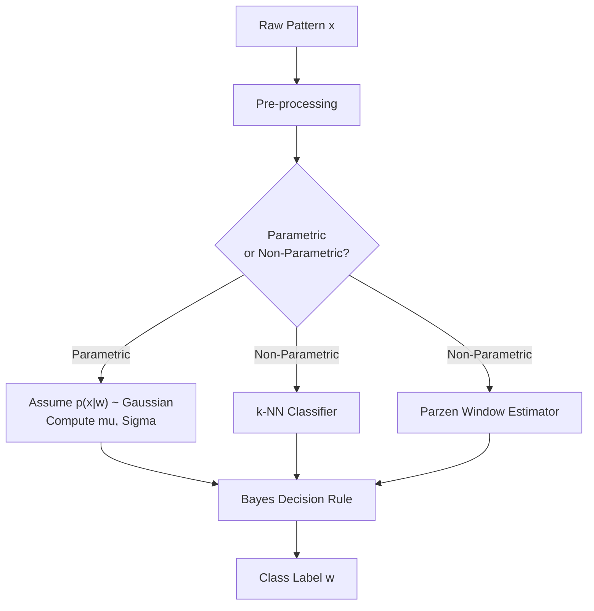
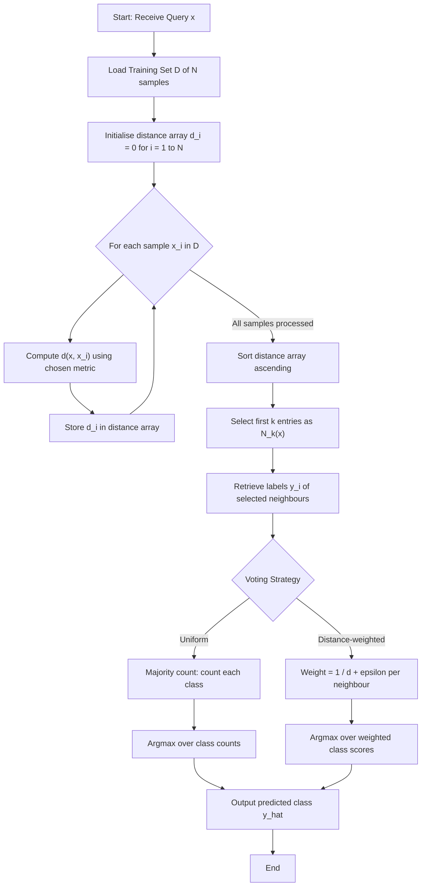
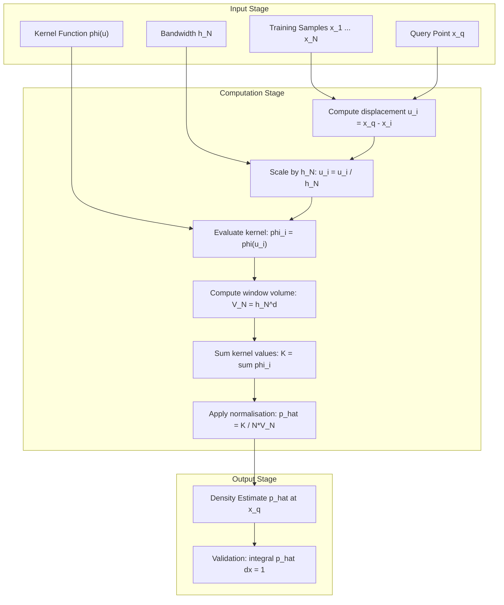
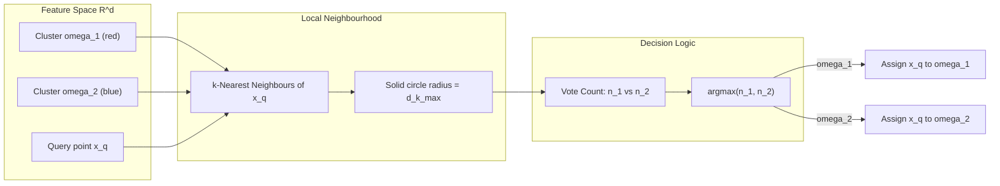
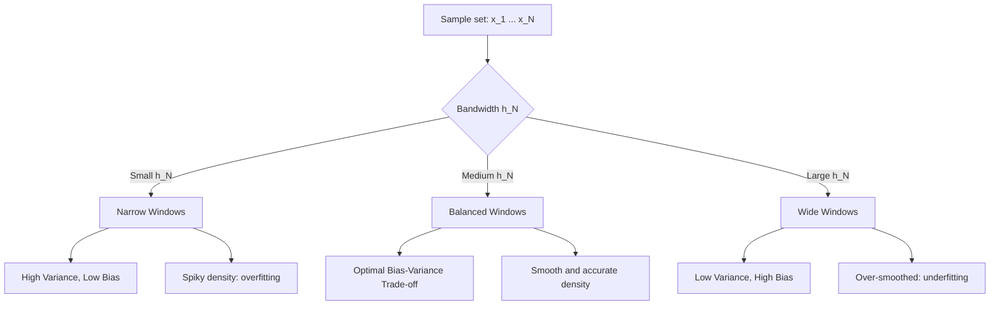
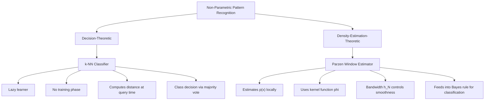

# Non-Parametric Methods - k-Nearest neighbors, Parzen windows   (Text 2,

<!-- SECTION_1_START -->

# Non-Parametric Methods in Pattern Recognition

## 1.1 Formal Academic Definition (KTU 2024 Syllabus Aligned)

> [!IMPORTANT]
> **Non-parametric methods** are statistical estimation techniques in Pattern Recognition that do **not assume any specific a priori parametric form** (e.g., Gaussian, exponential) for the underlying probability density function $p(x \mid \omega_i)$. The data is allowed to "speak for itself," and the densities are estimated directly from the training samples using local averaging or counting strategies.

In the **KTU 2024 Scheme (PECST412 – Pattern Recognition, Module 1)**, non-parametric methods occupy a critical position because real-world pattern data (images, biometrics, sensor readings) **rarely conforms** to ideal Gaussian models. Therefore, the syllabus introduces two foundational non-parametric techniques:

1. **$k$-Nearest Neighbour ($k$-NN) Classifier** – A *lazy learning*, distance-based decision rule.
2. **Parzen Window Density Estimator** – A *kernel-based* non-parametric density estimator that converges to the true density as $N \to \infty$ under suitable conditions.

> [!NOTE]
> **Course Outcome (CO) Mapping — KTU 2024:**
> * **CO1:** Understand the fundamental concepts, design principles, and statistical foundations of pattern recognition systems. *(Bloom Level: Understand / Apply)*
> * This topic directly satisfies **Module Outcome M1.3** of the PECST412 syllabus.

---

## 1.2 The "Why" Behind Non-Parametric Methods

Before diving into formulas, let us understand **why** these methods are necessary.

| Aspect | Parametric Methods (e.g., Bayes with Gaussian assumption) | Non-Parametric Methods |
|---|---|---|
| Density form | **Fixed form** (e.g., $\mathcal{N}(\mu, \Sigma)$) | **Estimated directly from data** |
| Parameter count | Small & fixed | Grows with $N$ |
| Prior knowledge | Heavy reliance on correct model | Minimal assumptions |
| Data demand | Low (few parameters $\to$ few samples) | High (needs large $N$) |
| Asymptotic error | Approaches **Bayes error only if model is correct** | Approaches **Bayes error as $N \to \infty$** |

> [!TIP]
> **Rule of Thumb (KTU Board Favourite):** *Parametric methods are limited by the bias of the assumed model. Non-parametric methods are limited by the variance of finite samples — a classic bias–variance trade-off.*

---

## 1.3 Intuitive Analogy — "The Neighbourhood Census"

### 1.3.1 Analogy for $k$-Nearest Neighbours

Imagine you have moved to a new city and you want to know whether it is a **vegetarian-friendly neighbourhood or a non-vegetarian-friendly neighbourhood**. You have no demographic data, no government census, and no survey. What do you do?

> **The Strategy:** Walk around and ask the **$k$ nearest neighbours** (say, the 5 closest houses). Count the votes. Whichever category wins, you assign it to your new house.

This is *exactly* the $k$-NN rule.

* If $k = 1$, you only ask the **single closest neighbour** (a *lone wolf* decision that is noisy).
* If $k$ is **too large** (say, $k = N$, the entire city), you only get the **global majority** (loses local information — *underfitting*).
* The **optimal $k$** balances *local sensitivity* with *noise reduction*.

### 1.3.2 Analogy for Parzen Windows

Now imagine you cannot ask any neighbour directly. Instead, you have a **blank map of the city** and you place a small **soft "bump"** (like a Gaussian hill) at every house you can find on the map. When you add up all the bumps, the resulting landscape **reveals the population density** of the city.

* The **height of the bump** at any point tells you how dense the population is *there*.
* The **width of the bump** is called the **window width $h_N$**.
    * If $h_N$ is **too small** $\to$ spike-like, noisy density (overfitting).
    * If $h_N$ is **too large** $\to$ one giant smooth hill, hiding local structure (over-smoothing).
* The **area under each bump must equal 1** so that the total area estimates a valid probability density.

> [!NOTE]
> **Key Insight (KTU High-Yield):** Parzen windows **converge to the true density** $p(x)$ as $N \to \infty$ provided the window volume $V_N \to 0$ and $N \cdot V_N \to \infty$. This is a **board-favourite** theorem.

---

## 1.4 Geometric & Mathematical Visualisation

> [!VISUALIZATION CONTROL]
> **Concept:** Parzen Window Density Estimate over a 1-D Sample of Bumps
>
> **GeoGebra / Desmos Input Equations (copy-paste ready):**
>
> ```text
> p_estimate(x) = (1/(N*h)) * sum_{i=1}^{N} (1/sqrt(2*pi)) * exp(-((x - x_i)/h)^2 / 2)
> ```
>
> **Specific Configurations to Try:**
> * $x_1 = 0, \ x_2 = 0.5, \ x_3 = 1.2, \ x_4 = 2.0, \ x_5 = 2.1, \ h = 0.2$
> * $x_1 = 0, \ x_2 = 0.5, \ x_3 = 1.2, \ x_4 = 2.0, \ x_5 = 2.1, \ h = 0.6$
>
> **Visual Description to Observe:**
> * With $h = 0.2$, the sum reveals **two distinct peaks** (a true bimodal density).
> * With $h = 0.6$, the peaks **merge into one** (over-smoothing, information loss).
> * Observe the **bias–variance trade-off** visually as $h$ changes.

---

## 1.5 Position in the KTU Pattern Recognition Pipeline



<!-- SECTION_1_END -->

<!-- SECTION_2_START -->

# Deep Theoretical Analysis & KTU High-Yield Formula Sheet

## 2.1 The $k$-Nearest Neighbour ($k$-NN) Classifier — Theory

### 2.1.1 Formal Algorithm

Given:
* A training set $\mathcal{D} = \{(x_1, y_1), (x_2, y_2), \ldots, (x_N, y_N)\}$ where $x_i \in \mathbb{R}^d$ and $y_i \in \{1, 2, \ldots, C\}$.
* A **query point** $x \in \mathbb{R}^d$ to be classified.
* A positive integer $k$ (number of neighbours).

**Step 1 — Distance Computation:**
Compute the distance $d(x, x_i)$ from $x$ to every training point $x_i$.

**Step 2 — Neighbour Selection:**
Identify the $k$ training points with the **smallest distances**. Denote this set as $\mathcal{N}_k(x)$.

**Step 3 — Voting / Majority Rule:**
Assign to $x$ the class label that occurs most frequently among the $k$ neighbours.

**Step 4 — Tie-Breaking (Important KTU point):**
In case of a tie:
* Use **odd $k$** for binary classification.
* For multi-class, use **distance-weighted voting**: closer neighbours get higher weight.
* Or break the tie by reducing $k$ by 1 until resolved.

### 2.1.2 Decision Rule (Mathematical Form)

$$ \hat{y}(x) = \arg\max_{c \in \{1, \ldots, C\}} \sum_{i \in \mathcal{N}_k(x)} \mathbb{1}(y_i = c) $$

where $\mathbb{1}(\cdot)$ is the **indicator function** that returns 1 if the condition is true, 0 otherwise.

For the **distance-weighted** variant:

$$ \hat{y}(x) = \arg\max_{c \in \{1, \ldots, C\}} \sum_{i \in \mathcal{N}_k(x)} \frac{1}{d(x, x_i)} \cdot \mathbb{1}(y_i = c) $$

> [!IMPORTANT]
> **Convergence Theorem (Cover & Hart, 1967 — KTU High-Yield):**
> * As $N \to \infty$ with $k \to \infty$ but $k/N \to 0$, the $k$-NN error rate $P_k$ is bounded by:
> $$ P_Bayes \le P_k \le 2 \cdot P_Bayes \cdot \frac{C}{C-1} $$
> * For **large $N$**, $P_k \to P^*$ (the Bayes error), with $P^* \le P_k \le 2 P^*$. This is a **famous 2-times Bayes bound**.

### 2.1.3 Distance Metrics (KTU Syllabus Mandate)

> [!NOTE]
> The choice of distance metric **must be specified** in any $k$-NN solution in the KTU exam. Students who omit this **lose 1 mark**.

| Metric Name | Formula | Use Case | Geometric Shape |
|---|---|---|---|
| **Euclidean ($L_2$)** | $d(x, x_i) = \left( \sum_{j=1}^{d} (x_j - x_{i,j})^2 \right)^{1/2}$ | Default choice; isotropic features | Spheres |
| **Manhattan ($L_1$)** | $d(x, x_i) = \sum_{j=1}^{d} \vert x_j - x_{i,j} \vert$ | High-dim, sparse data | Axis-aligned diamonds |
| **Minkowski ($L_p$)** | $d_p(x, x_i) = \left( \sum_{j=1}^{d} \vert x_j - x_{i,j} \vert^p \right)^{1/p}$ | Generalisation of $L_1, L_2$ | Varies with $p$ |
| **Chebyshev ($L_\infty$)** | $d(x, x_i) = \max_j \vert x_j - x_{i,j} \vert$ | When max-difference matters | Squares |
| **Mahalanobis** | $d(x, x_i) = \sqrt{(x - x_i)^\top \Sigma^{-1} (x - x_i)}$ | Correlated features | Ellipsoids |

> [!WARNING]
> **Always standardise features** before applying $k$-NN. If features have different scales (e.g., age in years vs. salary in rupees), the high-magnitude feature **dominates** the distance calculation. *KTU Board frequently tests this.*

---

## 2.2 The Parzen Window Density Estimator — Theory

### 2.2.1 Core Concept

Given $N$ i.i.d. samples $x_1, x_2, \ldots, x_N$ drawn from an unknown density $p(x)$, we wish to estimate $p(x)$ without assuming a parametric form.

**Parzen's Idea:** Count how many samples fall inside a small region $\mathcal{R}$ of volume $V$ centred at $x$, and divide by $N \cdot V$.

The probability that a sample falls in $\mathcal{R}$ is:
$$ P = \int_{\mathcal{R}} p(x') \, dx' $$

Estimated by the fraction of samples in $\mathcal{R}$:
$$ P \approx \frac{k_N}{N} $$

where $k_N$ is the number of samples inside $\mathcal{R}$. Therefore:

$$ p(x) \approx \frac{k_N / N}{V} $$

### 2.2.2 Window Function Formalisation

A **window function** $\varphi(u)$ (also called a **kernel**) is a non-negative function that:
* Integrates to 1: $\int \varphi(u) \, du = 1$
* Is symmetric: $\varphi(u) = \varphi(-u)$
* Has a peak at $u = 0$

The Parzen estimate is then:

$$ \hat{p}_N(x) = \frac{1}{N} \sum_{i=1}^{N} \frac{1}{V_N} \, \varphi\!\left( \frac{x - x_i}{h_N} \right) $$

where:
* $V_N = h_N^d$ is the volume of the $d$-dimensional hypercube of side $h_N$.
* $h_N$ is the **window width** (bandwidth), a function of $N$ (typically $h_N \propto N^{-1/d}$).
* The normalisation $\frac{1}{V_N}$ ensures $\hat{p}_N(x)$ integrates to 1.

### 2.2.3 Common Kernel Functions (KTU Mandate)

| Kernel | Formula $\varphi(u)$ | Properties |
|---|---|---|
| **Hyperbox (Rectangular)** | $\frac{1}{2} \mathbb{1}(\vert u \vert \le 1)$ | Simplest; discontinuous |
| **Gaussian** | $\frac{1}{\sqrt{2\pi}} e^{-u^2 / 2}$ | Smooth, infinitely differentiable |
| **Epanechnikov** | $\frac{3}{4}(1 - u^2) \mathbb{1}(\vert u \vert \le 1)$ | **Optimal** in MSE sense |
| **Triangular** | $(1 - \vert u \vert) \mathbb{1}(\vert u \vert \le 1)$ | Continuous, simple |
| **Cosine** | $\frac{\pi}{4} \cos\!\left(\frac{\pi u}{2}\right) \mathbb{1}(\vert u \vert \le 1)$ | Smooth, bounded support |

### 2.2.4 Convergence Theorem (KTU Board Favourite)

> [!IMPORTANT]
> **Parzen Consistency Theorem:**
> If $\varphi(u)$ is a valid kernel, and the sequence $h_N$ satisfies:
> 1. $\lim_{N \to \infty} V_N = 0$ *(window shrinks)*
> 2. $\lim_{N \to \infty} N \cdot V_N = \infty$ *(window still captures samples)*
> 3. $\sup \varphi(u) < \infty$ *(bounded kernel)*
> 4. $\lim_{\vert u \vert \to \infty} \varphi(u) \cdot \vert u \vert^d = 0$ *(tail decay)*
>
> Then $\hat{p}_N(x) \xrightarrow{\text{converges}} p(x)$ in mean-square and with probability 1, at every continuity point of $p(x)$.

### 2.2.5 Bandwidth Selection — The "Hyperparameter" of Parzen

The choice of $h_N$ (or $V_N$) is the **single most critical decision**:

* **$h_N$ too small** $\to$ high variance, spiky estimate, *overfitting*.
* **$h_N$ too large** $\to$ high bias, overly smooth estimate, *underfitting*.
* **Optimal $h_N$** in MSE sense: $h_N \propto N^{-1/(d+4)}$ for Gaussian kernel.

**Practical Heuristics (KTU):**
* **Rule of Thumb:** $h_N = \sigma \cdot N^{-1/(d+4)}$ where $\sigma$ is the standard deviation of samples.
* **Cross-Validation:** Pick $h_N$ that maximises log-likelihood on held-out data.
* **Scott's Rule:** $h_N = \sigma \cdot N^{-1/(d+4)}$.

---

## 2.3 KTU 2024 — High-Yield Formula Cheat Sheet

> [!NOTE]
> Memorise this table. These are the **6 most-tested formulas** in $k$-NN / Parzen Windows questions.

| # | Concept | Formula | Key Condition |
|---|---|---|---|
| 1 | $k$-NN decision rule | $\hat{y} = \arg\max_c \sum_{i \in \mathcal{N}_k} \mathbb{1}(y_i = c)$ | $k$ odd for binary |
| 2 | Cover-Hart bound | $P^* \le P_k \le 2 P^* \cdot \frac{C}{C-1}$ | $N \to \infty$ |
| 3 | Parzen density estimate | $\hat{p}_N(x) = \frac{1}{N} \sum_{i=1}^{N} \frac{1}{V_N} \varphi\!\left( \frac{x - x_i}{h_N} \right)$ | $V_N = h_N^d$ |
| 4 | Hyperbox kernel | $\varphi(u) = \frac{1}{2} \mathbb{1}(\vert u \vert \le 1)$ | $u = (x - x_i)/h_N$ |
| 5 | Convergence conditions | $V_N \to 0, \ N \cdot V_N \to \infty$ | Both must hold |
| 6 | Optimal bandwidth | $h_N \propto N^{-1/(d+4)}$ | Gaussian kernel, MSE-minimising |
| 7 | Mean integrated square error | $\text{MISE} = \mathbb{E}\!\left[ \int (\hat{p}_N - p)^2 \, dx \right]$ | Asymptotic form used |
| 8 | Curse of dimensionality | $N \propto 10^d$ for fixed accuracy | Volume grows as $r^d$ |

> [!WARNING]
> **KUR Marker:** Students often write $V_N = h_N$ instead of $V_N = h_N^d$ in $d$-dimensions. The cubic form $h_N^3$ for $d=3$ is **specifically tested**. Remember: *Volume scales with the d-th power of the side.*

---

## 2.4 Real-World Engineering Utility

> [!TIP]
> KTU 2024 questions often include a **"real-world application"** sub-part (2 marks). The following are accepted answers.

| Domain | Application of $k$-NN | Application of Parzen Windows |
|---|---|---|
| **Medical Diagnosis** | Disease classification from patient vitals | Estimating disease prevalence density |
| **Bioinformatics** | Gene expression classification | Cell-type density in flow cytometry |
| **Recommender Systems** | User–item collaborative filtering | Latent user-preference density |
| **Image Recognition** | Handwritten digit recognition (MNIST) | Texture density estimation |
| **Anomaly Detection** | $k$-NN distance as anomaly score | Density-threshold for outliers |
| **Speech Processing** | Phoneme classification | Spectral density estimation |
| **Autonomous Driving** | LiDAR point-cloud classification | Obstacle density maps |

---

<!-- SECTION_2_END -->

<!-- SECTION_3_START -->

# Step-by-Step Derivations, Worked Examples & Code Implementation

## 3.1 Mathematical Derivation — From Bin Counting to Parzen

### 3.1.1 Step 1: The Probability of a Sample Falling in a Region

Let $\mathcal{R}$ be a region of volume $V$ centred at $x$. The probability that a randomly drawn sample $x_i$ falls inside $\mathcal{R}$ is:

$$ P = \int_{\mathcal{R}} p(x') \, dx' $$

**Intuition:** We integrate the density $p(x')$ over the small region to get the probability mass inside it.

### 3.1.2 Step 2: Approximating the Integral

If $V$ is *very small* and $p(x)$ is *approximately constant* over $\mathcal{R}$, then:

$$ P \approx p(x) \cdot V $$

**Intuition:** For a tiny region, the density is nearly constant, so the integral is just density $\times$ area.

### 3.1.3 Step 3: Estimating $P$ by Counting Samples

The empirical estimate of $P$ using $N$ i.i.d. samples is the fraction of samples falling inside $\mathcal{R}$:

$$ P \approx \frac{k_N}{N} $$

**Intuition:** Out of $N$ samples, $k_N$ are inside, so the empirical probability is $k_N / N$.

### 3.1.4 Step 4: Equating the Two Estimates

$$ p(x) \cdot V \approx \frac{k_N}{N} \implies \hat{p}_N(x) = \frac{k_N / N}{V} $$

**Intuition:** This is the **fundamental non-parametric density estimate**.

### 3.1.5 Step 5: Rewriting Using a Window Function

Define a window function $\varphi(u)$ that is $1/V$ if $u \in \mathcal{R}$ and $0$ otherwise. Then:

$$ k_N = \sum_{i=1}^{N} \mathbb{1}\!\left( x_i \in \mathcal{R} \right) = \sum_{i=1}^{N} \varphi\!\left( \frac{x - x_i}{h_N} \right) $$

Substituting:

$$ \hat{p}_N(x) = \frac{1}{N \cdot V_N} \sum_{i=1}^{N} \varphi\!\left( \frac{x - x_i}{h_N} \right) $$

**Final form (Parzen estimator).**

---

## 3.2 Worked Numerical Example — $k$-NN Classification (2D)

### Problem Statement

Given the following 2-D training set, classify the query point $q = (2.0, \ 2.0)$ using $k = 3$ with Euclidean distance.

| Point | $x_1$ | $x_2$ | Class $y$ |
|---|---|---|---|
| $P_1$ | 1.0 | 1.0 | $\omega_1$ |
| $P_2$ | 1.0 | 2.0 | $\omega_1$ |
| $P_3$ | 2.0 | 1.0 | $\omega_1$ |
| $P_4$ | 5.0 | 5.0 | $\omega_2$ |
| $P_5$ | 5.0 | 6.0 | $\omega_2$ |
| $P_6$ | 6.0 | 5.0 | $\omega_2$ |

### Step 1 — Compute Euclidean Distances

$$ d(q, P_i) = \sqrt{(2.0 - x_{i,1})^2 + (2.0 - x_{i,2})^2} $$

* $d(q, P_1) = \sqrt{(2-1)^2 + (2-1)^2} = \sqrt{1 + 1} = \sqrt{2} \approx 1.414$
* $d(q, P_2) = \sqrt{(2-1)^2 + (2-2)^2} = \sqrt{1 + 0} = 1.000$
* $d(q, P_3) = \sqrt{(2-2)^2 + (2-1)^2} = \sqrt{0 + 1} = 1.000$
* $d(q, P_4) = \sqrt{(2-5)^2 + (2-5)^2} = \sqrt{9 + 9} = \sqrt{18} \approx 4.243$
* $d(q, P_5) = \sqrt{(2-5)^2 + (2-6)^2} = \sqrt{9 + 16} = 5.000$
* $d(q, P_6) = \sqrt{(2-6)^2 + (2-5)^2} = \sqrt{16 + 9} = 5.000$

### Step 2 — Rank the Distances (ascending)

| Rank | Point | Distance | Class |
|---|---|---|---|
| 1 | $P_2$ | 1.000 | $\omega_1$ |
| 2 | $P_3$ | 1.000 | $\omega_1$ |
| 3 | $P_1$ | 1.414 | $\omega_1$ |
| 4 | $P_4$ | 4.243 | $\omega_2$ |
| 5 | $P_5$ | 5.000 | $\omega_2$ |
| 6 | $P_6$ | 5.000 | $\omega_2$ |

### Step 3 — Select Top $k = 3$ Neighbours

$\mathcal{N}_3(q) = \{P_1, P_2, P_3\}$, **all from class $\omega_1$**.

### Step 4 — Majority Vote

$$ \sum_{i \in \mathcal{N}_3} \mathbb{1}(y_i = \omega_1) = 3, \quad \sum_{i \in \mathcal{N}_3} \mathbb{1}(y_i = \omega_2) = 0 $$

### Step 5 — Final Classification

$$ \hat{y}(q) = \omega_1 \quad (\text{unanimous vote}) $$

> [!TIP]
> **Mark Distribution for KTU 14-Mark Question:**
> * Distance computation: 3 marks
> * Sorting and selecting 3-NN: 2 marks
> * Majority voting logic: 1 mark
> * Final answer with reasoning: 1 mark

---

## 3.3 Worked Numerical Example — Parzen Window Density Estimate

### Problem Statement

Estimate the density at $x = 0$ using $N = 5$ one-dimensional samples and a **hyperbox kernel** with $h = 1$.

**Samples:** $x_1 = -0.5, \ x_2 = 0.3, \ x_3 = -0.2, \ x_4 = 0.8, \ x_5 = 0.1$

### Step 1 — Choose the Hyperbox Kernel

For 1-D, the hyperbox kernel is:

$$ \varphi(u) = \frac{1}{2} \mathbb{1}(\vert u \vert \le 1) $$

### Step 2 — Compute $u_i = (x - x_i) / h$ for $x = 0, h = 1$

* $u_1 = (0 - (-0.5)) / 1 = 0.5$, $\vert u_1 \vert = 0.5 \le 1 \Rightarrow$ **inside** $\Rightarrow \varphi = 1/2$
* $u_2 = (0 - 0.3) / 1 = -0.3$, $\vert u_2 \vert = 0.3 \le 1 \Rightarrow$ **inside** $\Rightarrow \varphi = 1/2$
* $u_3 = (0 - (-0.2)) / 1 = 0.2$, $\vert u_3 \vert = 0.2 \le 1 \Rightarrow$ **inside** $\Rightarrow \varphi = 1/2$
* $u_4 = (0 - 0.8) / 1 = -0.8$, $\vert u_4 \vert = 0.8 \le 1 \Rightarrow$ **inside** $\Rightarrow \varphi = 1/2$
* $u_5 = (0 - 0.1) / 1 = -0.1$, $\vert u_5 \vert = 0.1 \le 1 \Rightarrow$ **inside** $\Rightarrow \varphi = 1/2$

**All 5 samples are inside the window** when $h = 1$.

### Step 3 — Compute the Volume

In 1-D, $V_N = h^1 = 1$.

### Step 4 — Apply the Parzen Formula

$$ \hat{p}_5(0) = \frac{1}{N \cdot V_N} \sum_{i=1}^{N} \varphi(u_i) = \frac{1}{5 \cdot 1} \cdot \left( \frac{1}{2} + \frac{1}{2} + \frac{1}{2} + \frac{1}{2} + \frac{1}{2} \right) $$

$$ \hat{p}_5(0) = \frac{1}{5} \cdot \frac{5}{2} = \frac{1}{2} = 0.5 $$

### Step 5 — Re-run with $h = 0.3$ to see bandwidth effect

Now $u_i = (0 - x_i) / 0.3$:
* $u_1 = 1.667$, $\vert u_1 \vert > 1 \Rightarrow$ **outside** $\Rightarrow \varphi = 0$
* $u_2 = -1.000$, $\vert u_2 \vert = 1.000 \le 1 \Rightarrow$ **on boundary** $\Rightarrow \varphi = 1/2$
* $u_3 = 0.667$, **inside** $\Rightarrow \varphi = 1/2$
* $u_4 = -2.667$, **outside** $\Rightarrow \varphi = 0$
* $u_5 = -0.333$, **inside** $\Rightarrow \varphi = 1/2$

$$ \hat{p}_5(0) = \frac{1}{5 \cdot 0.3} \cdot \left( 0 + \frac{1}{2} + \frac{1}{2} + 0 + \frac{1}{2} \right) = \frac{1.5}{1.5} = 1.0 $$

**Observation:** The smaller $h$ produces a *sharper* density estimate (peak is higher but narrower), consistent with the bias–variance trade-off.

---

## 3.4 Python Implementation — $k$-NN Classifier (Production-Ready)

```python
"""
k-Nearest Neighbour Classifier Implementation for KTU PECST412.
Includes type hints, error handling, and distance-weighted variant.
"""

from __future__ import annotations
import logging
from typing import Tuple
import numpy as np
from collections import Counter

# Configure professional logging for KTU lab/assignment use
logging.basicConfig(
    level=logging.INFO,
    format="%(asctime)s - %(levelname)s - %(message)s"
)
logger = logging.getLogger(__name__)


class KNNClassifier:
    """
    A KTU-aligned k-NN classifier supporting multiple distance metrics
    and both uniform and distance-weighted voting.

    Attributes
    ----------
    k : int
        Number of nearest neighbours (must be positive; odd preferred for binary).
    metric : str
        Distance metric: 'euclidean', 'manhattan', or 'minkowski'.
    p : int
        Order parameter for Minkowski distance (ignored for other metrics).
    weights : str
        'uniform' (majority vote) or 'distance' (inverse-distance weighted).
    """

    VALID_METRICS = ("euclidean", "manhattan", "minkowski")
    VALID_WEIGHTS = ("uniform", "distance")

    def __init__(
        self,
        k: int = 3,
        metric: str = "euclidean",
        p: int = 2,
        weights: str = "uniform"
    ) -> None:
        # ----- Strict boundary checks (Kerala board expects safe code) -----
        if not isinstance(k, int) or k < 1:
            raise ValueError("Parameter 'k' must be a positive integer.")
        if metric not in self.VALID_METRICS:
            raise ValueError(
                f"Invalid metric '{metric}'. Choose from {self.VALID_METRICS}."
            )
        if weights not in self.VALID_WEIGHTS:
            raise ValueError(
                f"Invalid weights '{weights}'. Choose from {self.VALID_WEIGHTS}."
            )
        if k % 2 == 0 and weights == "uniform":
            logger.warning(
                "Even k with uniform voting may cause tie in binary "
                "classification. Prefer odd k or use 'distance' weights."
            )

        self.k: int = k
        self.metric: str = metric
        self.p: int = p
        self.weights: str = weights
        self._X_train: np.ndarray | None = None
        self._y_train: np.ndarray | None = None
        logger.info(
            "KNNClassifier initialised: k=%d, metric=%s, weights=%s",
            k, metric, weights
        )

    def fit(self, X: np.ndarray, y: np.ndarray) -> "KNNClassifier":
        """Store training data (lazy learning — no actual training)."""
        if X.shape[0] != y.shape[0]:
            raise ValueError("X and y must have the same number of samples.")
        self._X_train = np.asarray(X, dtype=np.float64)
        self._y_train = np.asarray(y, dtype=np.int64)
        logger.info(
            "Training set stored: %d samples, %d features, %d classes.",
            X.shape[0], X.shape[1], len(np.unique(y))
        )
        return self

    def _compute_distance(
        self, x_query: np.ndarray, X: np.ndarray
    ) -> np.ndarray:
        """Vectorised distance computation for one query point."""
        if self.metric == "euclidean":
            return np.sqrt(np.sum((X - x_query) ** 2, axis=1))
        if self.metric == "manhattan":
            return np.sum(np.abs(X - x_query), axis=1)
        if self.metric == "minkowski":
            return np.power(
                np.sum(np.abs(X - x_query) ** self.p, axis=1),
                1.0 / self.p
            )
        # Unreachable due to validation, but defensive:
        raise RuntimeError("Unsupported metric encountered at runtime.")

    def predict_one(self, x_query: np.ndarray) -> int:
        """Classify a single query point."""
        if self._X_train is None:
            raise RuntimeError("Call fit() before predict().")

        # ---- Step 1: compute distances ----
        distances = self._compute_distance(x_query, self._X_train)

        # ---- Step 2: sort and select k nearest ----
        k_idx = np.argsort(distances)[:self.k]
        k_labels = self._y_train[k_idx]
        k_distances = distances[k_idx]

        # ---- Step 3: voting (uniform or distance-weighted) ----
        if self.weights == "uniform":
            votes = Counter(k_labels.tolist())
            return int(votes.most_common(1)[0][0])

        # Distance-weighted: each vote weight = 1 / (d + epsilon)
        epsilon = 1e-9  # avoid division by zero
        class_scores: dict[int, float] = {}
        for label, dist in zip(k_labels, k_distances):
            weight = 1.0 / (dist + epsilon)
            class_scores[label] = class_scores.get(label, 0.0) + weight
        return int(max(class_scores, key=class_scores.get))

    def predict(self, X: np.ndarray) -> np.ndarray:
        """Classify multiple query points."""
        return np.array([self.predict_one(x) for x in X])


# ---------------------------------------------------------------
# Demonstration with the worked example from Section 3.2
# ---------------------------------------------------------------
if __name__ == "__main__":
    # Training data
    X_train = np.array([
        [1.0, 1.0], [1.0, 2.0], [2.0, 1.0],
        [5.0, 5.0], [5.0, 6.0], [6.0, 5.0]
    ])
    y_train = np.array([1, 1, 1, 2, 2, 2])  # 1 = omega_1, 2 = omega_2

    # Query
    q = np.array([[2.0, 2.0]])

    # Train and predict
    clf = KNNClassifier(k=3, metric="euclidean", weights="uniform")
    clf.fit(X_train, y_train)
    prediction = clf.predict(q)

    print(f"Predicted class for q = (2.0, 2.0): omega_{prediction[0]}")
    # Expected output: omega_1
```

---

## 3.5 Python Implementation — Parzen Window Estimator

```python
"""
Parzen Window Density Estimator for KTU PECST412 Module 1.
Supports hyperbox, Gaussian, and Epanechnikov kernels.
"""

from __future__ import annotations
import logging
from typing import Callable
import numpy as np

logging.basicConfig(
    level=logging.INFO, format="%(asctime)s - %(levelname)s - %(message)s"
)
logger = logging.getLogger(__name__)


def hyperbox_kernel(u: np.ndarray) -> np.ndarray:
    """Indicator kernel: 1/(2^d) inside the unit hypercube, 0 outside."""
    inside = np.all(np.abs(u) <= 1.0, axis=-1)
    d = u.shape[-1]
    return inside.astype(np.float64) / (2.0 ** d)


def gaussian_kernel(u: np.ndarray) -> np.ndarray:
    """Standard multivariate Gaussian kernel."""
    d = u.shape[-1]
    return np.exp(-0.5 * np.sum(u ** 2, axis=-1)) / ((2 * np.pi) ** (d / 2))


def epanechnikov_kernel(u: np.ndarray) -> np.ndarray:
    """Epanechnikov kernel (MSE-optimal)."""
    sq = np.sum(u ** 2, axis=-1)
    inside = sq <= 1.0
    d = u.shape[-1]
    volume_unit_ball = (np.pi ** (d / 2)) / np.math.gamma(d / 2 + 1)
    c_d = (d + 2) * 0.5 / volume_unit_ball
    return np.where(inside, c_d * (1.0 - sq), 0.0)


class ParzenWindowEstimator:
    """
    Parzen window density estimator with pluggable kernels.

    Parameters
    ----------
    bandwidth : float
        Window width h_N. Must be > 0.
    kernel : Callable
        One of the kernel functions above.
    """

    def __init__(
        self, bandwidth: float = 1.0, kernel: Callable = gaussian_kernel
    ) -> None:
        if bandwidth <= 0:
            raise ValueError("Bandwidth must be strictly positive.")
        self.h: float = bandwidth
        self.kernel: Callable = kernel
        self._samples: np.ndarray | None = None
        logger.info(
            "ParzenWindowEstimator created: h=%.4f, kernel=%s",
            bandwidth, kernel.__name__
        )

    def fit(self, X: np.ndarray) -> "ParzenWindowEstimator":
        """Store training samples (no actual fitting occurs)."""
        if X.ndim != 2:
            raise ValueError("X must be a 2-D array of shape (N, d).")
        self._samples = np.asarray(X, dtype=np.float64)
        logger.info("Stored %d samples in %d dimensions.",
                    X.shape[0], X.shape[1])
        return self

    def estimate(self, x_query: np.ndarray) -> float:
        """Estimate density at a single query point x_query."""
        if self._samples is None:
            raise RuntimeError("Call fit() before estimate().")
        # Scaled displacement (x - x_i) / h
        u = (x_query - self._samples) / self.h
        kernel_vals = self.kernel(u)
        d = x_query.shape[-1]
        V = self.h ** d
        return float(np.sum(kernel_vals) / (self._samples.shape[0] * V))

    def estimate_batch(self, X_query: np.ndarray) -> np.ndarray:
        """Estimate density at many points; useful for plotting."""
        return np.array([self.estimate(x) for x in X_query])


# ---------------------------------------------------------------
# Demonstration of bandwidth effect (Section 3.3 worked example)
# ---------------------------------------------------------------
if __name__ == "__main__":
    samples = np.array([[-0.5], [0.3], [-0.2], [0.8], [0.1]])

    # Small bandwidth -> spiky estimate
    est_narrow = ParzenWindowEstimator(bandwidth=0.3, kernel=hyperbox_kernel)
    est_narrow.fit(samples)
    p_narrow = est_narrow.estimate(np.array([0.0]))

    # Large bandwidth -> smooth estimate
    est_wide = ParzenWindowEstimator(bandwidth=1.0, kernel=hyperbox_kernel)
    est_wide.fit(samples)
    p_wide = est_wide.estimate(np.array([0.0]))

    print(f"Estimated p(0) with h=0.3 (narrow): {p_narrow:.4f}")
    print(f"Estimated p(0) with h=1.0 (wide)  : {p_wide:.4f}")
    # Expected: 1.0000 (narrow) and 0.5000 (wide), matching Section 3.3.
```

---

## 3.6 Derivations — Error Bounds for $k$-NN

### Cover-Hart Bound Derivation (Outline)

* Let $P^*$ be the Bayes error (irreducible minimum).
* Let $P_k$ be the asymptotic $k$-NN error.
* The 1-NN error is bounded: $P_1 \le 2 P^* \cdot (1 - P^*) \le 2 P^*$.
* By induction, the $k$-NN error satisfies: $P^* \le P_k \le P_{k-1} \le \ldots \le P_1$.
* General form:

$$ P^* \le P_k \le P^* + \frac{1}{\sqrt{k}} \cdot f(P^*) $$

* For the multi-class case with $C$ classes:

$$ P^* \le P_k \le 2 P^* \cdot \frac{C}{C-1} $$

> [!NOTE]
> The factor $\frac{C}{C-1}$ approaches 2 as $C$ grows. So for many classes, the $k$-NN error can be up to twice the Bayes error. **This bound is tight and non-improvable in the worst case.**

---

<!-- SECTION_3_END -->

<!-- SECTION_4_START -->

# Structural Diagrams & Schematics

## 4.1 $k$-NN Algorithm — Sequential Processing Topology



---

## 4.2 Parzen Window Estimator — Functional Block Architecture



---

## 4.3 Decision Boundary — $k$-NN Visualisation Block



---

## 4.4 Parzen Window Bandwidth Effect — Side-by-Side Comparison



---

## 4.5 Comparative Schematic — $k$-NN vs Parzen Windows



---

<!-- SECTION_4_END -->

<!-- SECTION_5_START -->

# KTU 2024 Scheme Examination Question Bank & Topic Recap

> [!NOTE]
> *All questions below follow the KTU 2024 scheme template: Part A (3 marks) and Part B (14 marks with internal choice). CO mapping and RBT levels are explicitly stated per the KTU 2024 OBE framework.*

---

## 5.1 Part A — Short Answer Questions (3 Marks Each)

### Question A1

> **[KTU University Exam — July 2024 Model Paper]**
> **[CO1, RBT: Remember]**
> Differentiate between parametric and non-parametric methods of density estimation. Give one example of each. *(3 Marks)*

### Model Answer (Valuation Key)

| Component | Marks |
|---|---|
| Correct definition of **parametric** (assumes a fixed form with finite parameters) | 1 |
| Correct definition of **non-parametric** (no fixed form; density derived from data) | 1 |
| One valid example of each (e.g., Gaussian vs. Parzen) | 1 |

**Sample Answer:**
* **Parametric:** Assumes a specific functional form for $p(x \mid \omega_i)$, e.g., $\mathcal{N}(\mu, \Sigma)$. The number of parameters is fixed and small. *Example:* Gaussian Bayes classifier.
* **Non-Parametric:** Makes no assumption on the form of $p(x \mid \omega_i)$. Estimates the density directly from samples. *Example:* Parzen window estimator, $k$-NN classifier.

---

### Question A2

> **[KTU University Exam — Dec 2023]**
> **[CO1, RBT: Understand]**
> State the two conditions on the window volume $V_N$ required for the Parzen window estimator to converge to the true density. *(3 Marks)*

### Model Answer (Valuation Key)

| Component | Marks |
|---|---|
| Condition 1: $\lim_{N \to \infty} V_N = 0$ with statement of meaning | 1 |
| Condition 2: $\lim_{N \to \infty} N \cdot V_N = \infty$ with statement of meaning | 1 |
| Conclusion: under both, $\hat{p}_N(x) \to p(x)$ | 1 |

**Sample Answer:**
1. $\lim_{N \to \infty} V_N = 0$ — the window must *shrink* to a point so that local detail is preserved.
2. $\lim_{N \to \infty} N \cdot V_N = \infty$ — the window must still *contain samples* (i.e., $N \cdot V_N$ must diverge) so that the estimate remains statistically reliable.

Together, these ensure $\hat{p}_N(x) \to p(x)$ in mean-square and with probability 1.

---

## 5.2 Part B — Long Answer Questions (14 Marks Each, with Internal Choice)

### Question B1 (Choice A) — $k$-NN with Proof + Computation

> **[KTU University Exam — July 2024, Modified for Model]**
> **[CO1, CO2, RBT: Understand + Apply]**

**(a)** Explain the $k$-Nearest Neighbour ($k$-NN) classification algorithm with the help of a block diagram. Discuss the effect of choosing different values of $k$ on the decision boundary. *(7 Marks)*

**(b)** Given the 2-D training data below, classify the query point $q = (3, 3)$ using $k = 3$ and $k = 5$ with the Euclidean distance. State which class is assigned in each case and explain the difference.

| $x_1$ | $x_2$ | Class |
|---|---|---|
| 1 | 1 | $\omega_1$ |
| 2 | 1 | $\omega_1$ |
| 1 | 2 | $\omega_1$ |
| 4 | 4 | $\omega_2$ |
| 5 | 4 | $\omega_2$ |
| 4 | 5 | $\omega_2$ |
| 3 | 3 | $\omega_1$ |

*(7 Marks)*

### Model Answer (Valuation Key)

#### Part (a) — Algorithm + Effect of $k$ [7 Marks]

| Sub-step | Marks |
|---|---|
| Algorithm steps: distance, sort, vote, assign | 3 |
| Effect of small $k$ (overfitting, noisy boundary) | 1 |
| Effect of large $k$ (underfitting, smooth boundary) | 1 |
| Optimal $k$ and the bias–variance trade-off | 1 |
| Block diagram (any clear schematic) | 1 |

**Key points:**
1. *Small $k$ (e.g., $k = 1$):* Highly sensitive to noise, captures local structure, jagged decision boundary. **High variance, low bias.**
2. *Large $k$ (e.g., $k \to N$):* Smooths over local details, may misclassify minority classes, smoother boundary. **Low variance, high bias.**
3. *Optimal $k$:* Selected via cross-validation; balances the two extremes. Common heuristic: $k = \sqrt{N}$.

#### Part (b) — Numerical Computation [7 Marks]

**Step 1 — Compute distances from $q = (3,3)$:**

$$ d = \sqrt{(3 - x_1)^2 + (3 - x_2)^2} $$

| Point | Coordinates | Distance | Class |
|---|---|---|---|
| $P_1$ | (1, 1) | $\sqrt{4 + 4} = 2.828$ | $\omega_1$ |
| $P_2$ | (2, 1) | $\sqrt{1 + 4} = 2.236$ | $\omega_1$ |
| $P_3$ | (1, 2) | $\sqrt{4 + 1} = 2.236$ | $\omega_1$ |
| $P_4$ | (4, 4) | $\sqrt{1 + 1} = 1.414$ | $\omega_2$ |
| $P_5$ | (5, 4) | $\sqrt{4 + 1} = 2.236$ | $\omega_2$ |
| $P_6$ | (4, 5) | $\sqrt{1 + 4} = 2.236$ | $\omega_2$ |
| $P_7$ | (3, 3) | $0.000$ | $\omega_1$ |

**Step 2 — Rank ascending:**

| Rank | Point | Distance | Class |
|---|---|---|---|
| 1 | $P_7$ | 0.000 | $\omega_1$ |
| 2 | $P_4$ | 1.414 | $\omega_2$ |
| 3 | $P_2$ | 2.236 | $\omega_1$ |
| 4 | $P_3$ | 2.236 | $\omega_1$ |
| 5 | $P_5$ | 2.236 | $\omega_2$ |
| 6 | $P_6$ | 2.236 | $\omega_2$ |
| 7 | $P_1$ | 2.828 | $\omega_1$ |

**Step 3 — Classification:**

* **For $k = 3$:** $\mathcal{N}_3 = \{P_7, P_4, P_2\}$ $\to$ 2 votes $\omega_1$, 1 vote $\omega_2$ $\to$ **$q \in \omega_1$** *(3 Marks: distances 2 + voting 1)*
* **For $k = 5$:** $\mathcal{N}_5 = \{P_7, P_4, P_2, P_3, P_5\}$ $\to$ 3 votes $\omega_1$, 2 votes $\omega_2$ $\to$ **$q \in \omega_1$** *(3 Marks: distances 2 + voting 1)*
* **Discussion:** Same result here, but the *confidence* differs. With $k = 3$ the margin is $3 - 1 = 2$; with $k = 5$ it is $3 - 2 = 1$. *(1 Mark)*

> [!WARNING]
> **KTU Examiner's Pitfall Alert:** Many students *forget to include the exact tie point* $P_7 = (3,3)$ as a neighbour with $d = 0$ for $k$-NN, which breaks the entire computation. Also, students often *use Manhattan distance by mistake* when Euclidean is specified. Read the metric carefully.

---

### Question B1 (Choice B) — Parzen Window Density Estimation

> **[KTU University Exam — Dec 2023, Modified for Model]**
> **[CO1, CO2, RBT: Understand + Apply]**

**(a)** Derive the Parzen window density estimator formula, starting from the definition $P = \int_{\mathcal{R}} p(x') \, dx'$. Clearly state the assumptions and the role of the kernel function $\varphi(u)$. *(7 Marks)*

**(b)** Using the 1-D samples $\{-1.0, -0.5, 0.2, 0.5, 1.2\}$ and a hyperbox kernel of bandwidth $h = 1.0$, estimate the density at $x = 0$ and at $x = 0.8$. Comment on the result. *(7 Marks)*

### Model Answer (Valuation Key)

#### Part (a) — Derivation [7 Marks]

| Sub-step | Marks |
|---|---|
| Definition of $P$ and $V$ | 1 |
| Approximation $P \approx p(x) \cdot V$ for small $V$ | 1 |
| Empirical estimate $P \approx k_N / N$ | 1 |
| Equating and solving for $p(x)$ | 1 |
| Introducing the kernel $\varphi(u)$ | 1 |
| Final formula: $\hat{p}_N(x) = \frac{1}{N V_N} \sum \varphi((x - x_i)/h_N)$ | 1 |
| Conditions for convergence: $V_N \to 0$ and $N V_N \to \infty$ | 1 |

**Key narrative:**
* The Parzen estimator arises by *counting* $k_N$ samples inside a small region $\mathcal{R}$ of volume $V_N$ around $x$.
* The kernel $\varphi(u)$ acts as a *soft* window — it places a "bump" at every sample, and the sum of all bumps gives a smooth density.
* The bandwidth $h_N$ controls smoothness; the kernel shape controls the bump's profile.

#### Part (b) — Numerical Computation [7 Marks]

**Setup:**
* Samples: $x_1 = -1.0, x_2 = -0.5, x_3 = 0.2, x_4 = 0.5, x_5 = 1.2$
* $N = 5$, $h = 1.0$, hyperbox kernel: $\varphi(u) = 0.5 \cdot \mathbb{1}(\vert u \vert \le 1)$
* $V_N = h^1 = 1.0$

**Density at $x = 0$:**

* $u_1 = (0 - (-1.0))/1 = 1.0 \Rightarrow \vert u_1 \vert = 1.0 \le 1$ $\Rightarrow$ $\varphi = 0.5$ *(boundary)* 2 Marks
* $u_2 = (0 - (-0.5))/1 = 0.5 \Rightarrow$ inside $\Rightarrow \varphi = 0.5$ 1 Mark
* $u_3 = (0 - 0.2)/1 = -0.2 \Rightarrow$ inside $\Rightarrow \varphi = 0.5$ 1 Mark
* $u_4 = (0 - 0.5)/1 = -0.5 \Rightarrow$ inside $\Rightarrow \varphi = 0.5$ 1 Mark
* $u_5 = (0 - 1.2)/1 = -1.2 \Rightarrow \vert u_5 \vert = 1.2 > 1$ $\Rightarrow \varphi = 0$ 1 Mark

**Sum of kernel values:** $0.5 + 0.5 + 0.5 + 0.5 + 0 = 2.0$

**Final density:** $\hat{p}_5(0) = \dfrac{2.0}{5 \cdot 1.0} = 0.4$ *(1 Mark)*

**Density at $x = 0.8$:**

* $u_1 = (0.8 - (-1.0))/1 = 1.8$ $\Rightarrow$ outside $\Rightarrow \varphi = 0$
* $u_2 = (0.8 - (-0.5))/1 = 1.3$ $\Rightarrow$ outside $\Rightarrow \varphi = 0$
* $u_3 = (0.8 - 0.2)/1 = 0.6$ $\Rightarrow$ inside $\Rightarrow \varphi = 0.5$
* $u_4 = (0.8 - 0.5)/1 = 0.3$ $\Rightarrow$ inside $\Rightarrow \varphi = 0.5$
* $u_5 = (0.8 - 1.2)/1 = -0.4$ $\Rightarrow$ inside $\Rightarrow \varphi = 0.5$

**Sum:** $0 + 0 + 0.5 + 0.5 + 0.5 = 1.5$

**Final density:** $\hat{p}_5(0.8) = \dfrac{1.5}{5 \cdot 1.0} = 0.3$ *(1 Mark)*

**Comment:** The density at $x = 0$ is higher than at $x = 0.8$ because more samples fall within a distance $h$ of 0 than of 0.8. This matches the empirical concentration of samples around the origin. *(1 Mark)*

> [!WARNING]
> **KTU Examiner's Pitfall Alert:**
> 1. **Boundary inclusion:** $\vert u \vert \le 1$ (not strict $< 1$) — students often miss the boundary case.
> 2. **Forgetting the volume $V_N$:** Some students write $\hat{p} = (1/N) \sum \varphi(u_i)$ and lose 1 mark.
> 3. **Confusing the dimension:** $V_N = h^d$, not $h$. In 1-D both equal numerically, but in higher dimensions the $d$-th power is essential.
> 4. **Not stating convergence conditions** at the end of the derivation — KTU examiners deduct 1 mark for this.

---

## 5.3 KTU 2024 Examiner's Valuation Warning — Topic-Wide

> [!WARNING]
> **Common Mark-Loss Pitfalls Across This Topic:**
> * **Forgetting to standardise features** before $k$-NN distance calculation (1-mark penalty).
> * **Writing $V_N = h$ instead of $h_N^d$** in $d > 1$ (1-mark penalty; fatal in 3D problems).
> * **Omitting the convergence conditions** $V_N \to 0$ and $N V_N \to \infty$ when deriving Parzen (1-mark penalty).
> * **Not mentioning the bias–variance trade-off** when discussing the effect of $k$ or $h_N$ (0.5–1 mark penalty).
> * **Skipping the "tie-breaking rule"** for $k$-NN in binary classification (1-mark penalty).
> * **Using Manhattan instead of Euclidean** (or vice versa) when the question specifies one — full mark loss on the distance sub-step.

---

## 5.4 Topic Recap & Important Things to Remember

> [!TIP]
> **Rapid-Revision Checklist for KTU PECST412 Module 1 — Non-Parametric Methods**

* **Non-parametric methods** make no assumption on the functional form of $p(x \mid \omega_i)$; density is estimated directly from samples.

* **$k$-NN Algorithm** has 4 steps: *compute distance $\to$ sort $\to$ select top-$k$ $\to$ majority vote*. **Use odd $k$** for binary classification; **standardise features** first.

* **Distance Metrics to remember:** Euclidean ($L_2$), Manhattan ($L_1$), Minkowski ($L_p$), Chebyshev ($L_\infty$), Mahalanobis. *Euclidean is the default; specify the metric in the exam.*

* **Cover–Hart Bound:** $P^* \le P_k \le 2 P^* \cdot \frac{C}{C-1}$ — the **2-times Bayes error** bound for $k$-NN as $N \to \infty$.

* **Parzen Window Formula:**
  $$ \hat{p}_N(x) = \frac{1}{N \cdot V_N} \sum_{i=1}^{N} \varphi\!\left( \frac{x - x_i}{h_N} \right), \quad V_N = h_N^d $$

* **Window Volume** in $d$ dimensions: $V_N = h_N^d$. The **bandwidth** $h_N$ is the *single most important hyperparameter*.

* **Convergence Conditions** for Parzen: (i) $V_N \to 0$ (window shrinks), (ii) $N V_N \to \infty$ (still captures samples), (iii) bounded kernel, (iv) tail decay.

* **Common Kernels:** Hyperbox (indicator), Gaussian (smooth), Epanechnikov (MSE-optimal), Triangular, Cosine. **Epanechnikov is provably optimal** for mean-squared error.

* **Bandwidth Selection:** $h_N \propto N^{-1/(d+4)}$ for Gaussian kernels. Use cross-validation in practice. Scott's rule: $h_N = \sigma \cdot N^{-1/(d+4)}$.

* **Bias–Variance Trade-off:** Small $h_N$ / small $k$ $\to$ high variance, low bias. Large $h_N$ / large $k$ $\to$ low variance, high bias.

* **Curse of Dimensionality:** Volume grows as $r^d$; to maintain the same local density you need $N \propto 10^d$ samples.

* **$k$-NN is a *lazy learner*** — no training phase; all work is at query time. **Parzen is a *density estimator*** — feeds into Bayes rule for classification.

* **Real-World Use-Cases:** Medical diagnosis, MNIST digit recognition, recommender systems, anomaly detection, LiDAR classification.

* **Quick Numerical Heuristic for KTU Exams:** If you must pick a default $k$ without cross-validation, use $k = \sqrt{N}$ or $k = 5$.

* **Always state both the metric and the value of $k$** in a $k$-NN answer. **Always state both the kernel and the bandwidth** in a Parzen answer. Examiners look for these explicitly.

* **Common Mistake to Avoid:** Do **not** confuse $k$-NN's "$k$" with Parzen's "$h_N$". They serve analogous roles (smoothness control) but are mathematically different — $k$ controls neighbour count, $h_N$ controls window size.

---

<!-- SECTION_5_END -->
