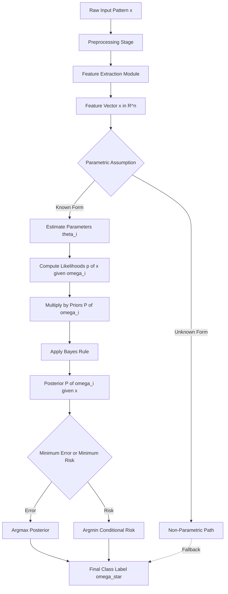
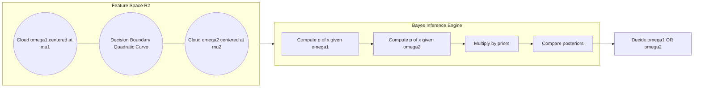
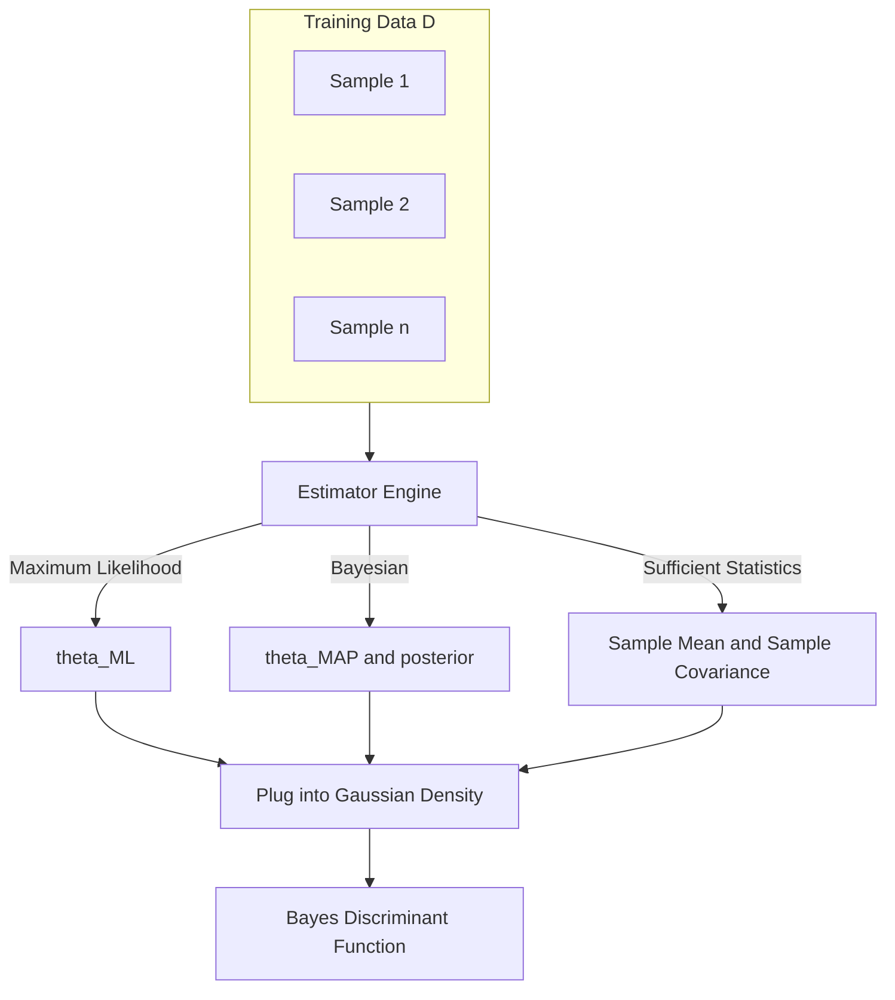
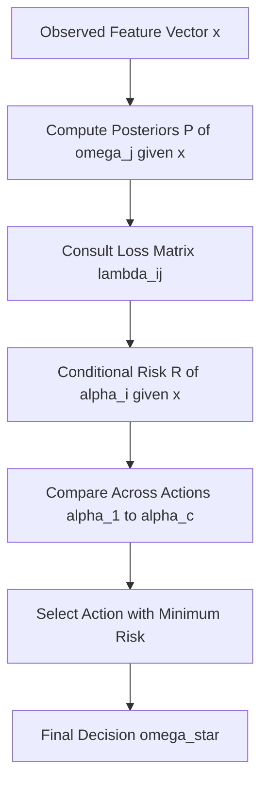
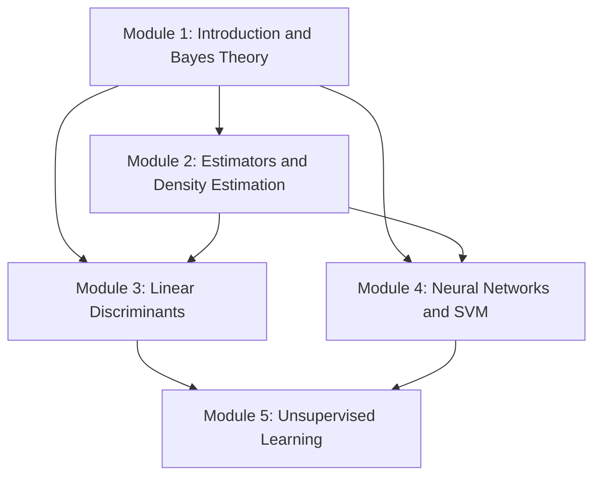

# Statistical Pattern Recognition - Bayes decision theory, Parametric

<!-- SECTION_1_START -->
# 1. Core Technical Definition & Intuitive Overview

## 1.1 Statistical Pattern Recognition — Formal Definition

**Statistical Pattern Recognition** is the branch of pattern recognition that treats patterns as sets of measurements (feature vectors) drawn from underlying probability distributions, and makes classification decisions by applying statistical decision rules, primarily **Bayes Decision Theory**.

> [!IMPORTANT]
> **KTU 2024 Syllabus Definition:** *Statistical Pattern Recognition is a model-based approach in which a pattern $x \in \mathbb{R}^n$ is assumed to be a random vector generated by a class-conditional probability density function $P(x \mid \omega_i)$. Classification is then performed by selecting the class that minimizes the probability of error (or expected risk) using Bayes' theorem.*

## 1.2 Bayes Decision Theory — Core Idea

**Bayes Decision Theory** is the mathematical foundation of statistical pattern recognition. It provides an *optimal* (in the sense of minimum error or minimum risk) framework for classifying an observed pattern $x$ into one of $c$ classes $\{ \omega_1, \omega_2, \ldots, \omega_c \}$.

The theory requires the following quantities:

- **Prior probabilities** $P(\omega_i)$ — the likelihood of class $\omega_i$ before observing $x$.
- **Class-conditional densities** $p(x \mid \omega_i)$ — the probability density of observing $x$ given that the true class is $\omega_i$.
- **Posterior probabilities** $P(\omega_i \mid x)$ — the *updated* probability of class $\omega_i$ *after* observing $x$.

> [!NOTE]
> **Posterior Probability Formula (Bayes' Rule):**
> $$P(\omega_i \mid x) = \frac{p(x \mid \omega_i)\, P(\omega_i)}{p(x)}$$
> where the *evidence* $p(x) = \sum_{j=1}^{c} p(x \mid \omega_j)\, P(\omega_j)$ acts as a normalizing constant.

## 1.3 Parametric Approach — Formal Definition

A **Parametric Pattern Recognition** system assumes that the functional form of the class-conditional density $p(x \mid \omega_i)$ is *known* (e.g., multivariate Gaussian) and is fully described by a small number of parameters $\theta_i$ (e.g., mean $\mu_i$ and covariance $\Sigma_i$). The learning problem reduces to estimating these parameters from training data using techniques such as **Maximum Likelihood (ML) Estimation** or **Bayesian Estimation**.

> [!IMPORTANT]
> **Contrast with Non-Parametric Methods:** Non-parametric methods (e.g., Parzen windows, $k$-NN) make *no* assumption about the underlying distribution. Parametric methods are computationally efficient and statistically robust when the distributional assumption holds.

## 1.4 Intuitive Analogy — The "Medical Diagnosis" Picture

Imagine a doctor diagnosing a disease $\omega_i$ from symptoms $x$:

| Step | Statistical Equivalent | Real-World Analogy |
|---|---|---|
| 1 | $P(\omega_i)$ — prior | Base-rate of the disease in the population |
| 2 | $p(x \mid \omega_i)$ — likelihood | How often these symptoms appear in diseased patients |
| 3 | $p(x)$ — evidence | How common this symptom combination is in *any* patient |
| 4 | $P(\omega_i \mid x)$ — posterior | Updated belief that this patient has the disease |
| 5 | Decision rule | "Treat the more probable disease" |

**Geometric Intuition:** Each class $\omega_i$ generates a "cloud" of points in feature space, shaped according to $p(x \mid \omega_i)$ and scaled by $P(\omega_i)$. Bayes' rule essentially flips the question from "given class, how likely is the point?" to "given point, how likely is the class?". The decision boundary is the locus of points where two posteriors are *equal* — a contour in feature space where the doctor's confidence shifts from one disease to another.

> [!VISUALIZATION CONTROL]
> **Concept:** Two-class Gaussian decision boundary in $\mathbb{R}^2$.
> **GeoGebra / Desmos Input Equations:**
> * `f(x,y) = (1/(2πσ1²))*exp(-0.5*(((x-μ1x)²+(y-μ1y)²)/σ1²))`
> * `g(x,y) = (1/(2πσ2²))*exp(-0.5*(((x-μ2x)²+(y-μ2y)²)/σ2²))`
> * `P1*exp(-((x-0)²+(y-0)²)/2) = P2*exp(-((x-3)²+(y-2)²)/2)`
> **Visual Description:** Two bell-shaped probability clouds, one centered near origin and another near $(3,2)$. The curve where their weighted densities are equal traces the Bayes optimal decision boundary. Points to the left of the curve are assigned to $\omega_1$, points to the right to $\omega_2$.

## 1.5 Why These Concepts Matter in KTU 2024

- Module 1 lays the **mathematical foundation** for *every* subsequent module (linear discriminants, neural networks, SVMs all have Bayesian interpretations).
- Direct examination weightage: typically 15–20% of Part B questions in the University ESE.
- Forms the basis for advanced topics such as **Bayesian Belief Networks**, **Minimum Risk Classification**, and **Naive Bayes classifiers**.

<!-- SECTION_1_END -->

<!-- SECTION_2_START -->
# 2. Deep Theoretical Analysis & KTU High-Yield Formula Sheet

## 2.1 The Bayes Decision Rule — Step-by-Step Logic

The *Bayes Decision Rule for Minimum Error* is constructed through the following logical chain:

1. **Define the goal:** Minimize the probability of misclassification $P(\text{error})$.
2. **Decompose the error:** $P(\text{error}) = \sum_{i=1}^{c} P(\omega_i) \int_{\mathcal{R}_i^{c}} p(x \mid \omega_i)\, dx$ where $\mathcal{R}_i$ is the region assigned to $\omega_i$.
3. **Realize that minimizing $P(\text{error})$ is equivalent to maximizing $P(\omega_i \mid x)$ at every point $x$.**
4. **Apply Bayes' theorem** to convert $P(\omega_i \mid x)$ into a computable form.
5. **Formulate the rule:** Decide $\omega_1$ if $P(\omega_1 \mid x) > P(\omega_2 \mid x)$, else decide $\omega_2$.

> [!NOTE]
> **Why this works:** Because $P(\omega_i \mid x) \propto p(x \mid \omega_i)\, P(\omega_i)$, the normalizing $p(x)$ cancels out when comparing two posteriors. The decision therefore depends only on the *product* of likelihood and prior.

## 2.2 Discriminant Functions — The Engineer's View

A **discriminant function** $g_i(x)$ assigns a score to each class such that the classification rule becomes: *choose $\omega_i$ if $g_i(x) > g_j(x)$ for all $j \neq i$*.

Many equivalent discriminant functions exist for the same Bayes decision rule. The most common are:

$$
g_i(x) = P(\omega_i \mid x) = \frac{p(x \mid \omega_i)\, P(\omega_i)}{p(x)}
$$

A **monotonic** transformation (e.g., natural log) preserves the ordering, so a popular engineering-friendly form is:

$$
g_i(x) = \ln p(x \mid \omega_i) + \ln P(\omega_i)
$$

The decision boundary between $\omega_i$ and $\omega_j$ is the surface:

$$
g_i(x) - g_j(x) = 0
$$

## 2.3 Minimum Risk Classification (Bayes Risk)

When different misclassifications have different **costs**, we use the **conditional risk**:

$$
R(\alpha_i \mid x) = \sum_{j=1}^{c} \lambda_{ij}\, P(\omega_j \mid x)
$$

where $\lambda_{ij}$ is the *loss* incurred when the true class is $\omega_j$ but we choose action $\alpha_i$ (assign to $\omega_i$). The optimal action is to **minimize the conditional risk**.

> [!IMPORTANT]
> **Special case:** If $\lambda_{ij} = 1 - \delta_{ij}$ (0–1 loss), then minimizing the risk reduces to maximizing the posterior — i.e., the minimum-error Bayes rule.

## 2.4 Parametric Estimation — Maximum Likelihood

Given a parametric form $p(x \mid \theta)$ and a set of $n$ i.i.d. samples $\mathcal{D} = \{x_1, x_2, \ldots, x_n\}$, the **likelihood** is:

$$
p(\mathcal{D} \mid \theta) = \prod_{k=1}^{n} p(x_k \mid \theta)
$$

The **Maximum Likelihood Estimate (MLE)** is the value of $\theta$ that maximizes this product, or equivalently its logarithm:

$$
\hat{\theta}_{\text{ML}} = \arg\max_{\theta} \sum_{k=1}^{n} \ln p(x_k \mid \theta)
$$

For a **univariate Gaussian** with unknown mean $\mu$ and known variance $\sigma^2$:

$$
\hat{\mu}_{\text{ML}} = \frac{1}{n} \sum_{k=1}^{n} x_k
$$

For a **multivariate Gaussian** $p(x \mid \mu, \Sigma) \sim \mathcal{N}(\mu, \Sigma)$ with $n$ samples:

$$
\hat{\mu}_{\text{ML}} = \frac{1}{n} \sum_{k=1}^{n} x_k
\quad ; \quad
\hat{\Sigma}_{\text{ML}} = \frac{1}{n} \sum_{k=1}^{n} (x_k - \hat{\mu})(x_k - \hat{\mu})^{T}
$$

## 2.5 Bayesian Estimation (Parametric)

Unlike ML which gives a *single point* estimate, Bayesian estimation treats $\theta$ as a *random variable* with a prior $p(\theta)$. The posterior is:

$$
p(\theta \mid \mathcal{D}) = \frac{p(\mathcal{D} \mid \theta)\, p(\theta)}{\int p(\mathcal{D} \mid \theta)\, p(\theta)\, d\theta}
$$

The predictive density is then:

$$
p(x \mid \mathcal{D}) = \int p(x \mid \theta)\, p(\theta \mid \mathcal{D})\, d\theta
$$

> [!NOTE]
> **Conjugate Prior Shortcut:** For Gaussian likelihood with unknown mean, a Gaussian prior on the mean yields a *Gaussian* posterior — a classical conjugate setup, easily solvable in closed form.

## 2.6 The Gaussian Density — The Workhorse

The **multivariate normal (Gaussian) density** in $d$ dimensions is:

$$
p(x) = \frac{1}{(2\pi)^{d/2}\, \vert\Sigma\vert^{1/2}} \exp\!\left( -\frac{1}{2}\, (x - \mu)^{T}\, \Sigma^{-1}\, (x - \mu) \right)
$$

Properties that make it the *default* parametric model:

- Linearly transformed Gaussians remain Gaussian.
- The **Mahalanobis distance** $\delta = (x - \mu)^T \Sigma^{-1} (x - \mu)$ is constant on elliptical contours.
- Central Limit Theorem justifies its use for many natural features.

## 2.7 KTU High-Yield Formula Sheet

| Concept | Formula | Notes / Units |
|---|---|---|
| Bayes' Theorem | $P(\omega_i \mid x) = \dfrac{p(x \mid \omega_i)\, P(\omega_i)}{p(x)}$ | Posterior is dimensionless |
| Evidence (normalizer) | $p(x) = \sum_{j=1}^{c} p(x \mid \omega_j)\, P(\omega_j)$ | Always positive |
| Bayes Decision Rule | Choose $\omega_i$ if $P(\omega_i \mid x) = \max_j P(\omega_j \mid x)$ | Minimum error |
| Log Discriminant | $g_i(x) = \ln p(x \mid \omega_i) + \ln P(\omega_i)$ | Equivalent ordering |
| Conditional Risk | $R(\alpha_i \mid x) = \sum_{j=1}^{c} \lambda_{ij}\, P(\omega_j \mid x)$ | $\lambda_{ii} = 0$ typical |
| Minimum Risk Rule | Choose $\alpha_i$ minimizing $R(\alpha_i \mid x)$ | Generalizes minimum error |
| Gaussian Density | $p(x) = \dfrac{1}{(2\pi)^{d/2}\vert\Sigma\vert^{1/2}} \exp\!\big(-\tfrac{1}{2}(x-\mu)^T \Sigma^{-1} (x-\mu)\big)$ | $\Sigma$ symmetric positive-definite |
| Mahalanobis Distance | $\delta^2 = (x-\mu)^T \Sigma^{-1} (x-\mu)$ | Invariant to linear transforms |
| MLE for $\mu$ (Gaussian) | $\hat{\mu}_{\text{ML}} = \dfrac{1}{n}\sum_{k=1}^{n} x_k$ | Sample mean |
| MLE for $\Sigma$ (Gaussian) | $\hat{\Sigma}_{\text{ML}} = \dfrac{1}{n}\sum_{k=1}^{n}(x_k - \hat{\mu})(x_k - \hat{\mu})^T$ | Biased but consistent |
| Bayesian Posterior | $p(\theta \mid \mathcal{D}) \propto p(\mathcal{D} \mid \theta)\, p(\theta)$ | Update prior with data |

## 2.8 Real-World Utility

- **Spam Filtering:** Naive Bayes treats each word as conditionally independent given the class, with class-conditional word frequencies estimated via ML.
- **Medical Diagnosis:** Risk-sensitive classification (cost of missing a cancer > cost of false alarm) is a direct application of minimum-risk Bayes.
- **Speech Recognition:** HMMs use Gaussian emission probabilities trained via ML/Bayesian estimation.
- **Fault Detection in Industry:** Sensor measurements follow approximately Gaussian distributions; parametric Bayes detectors flag deviations optimally.

<!-- SECTION_2_END -->

<!-- SECTION_3_START -->
# 3. Step-by-Step Derivations & Code/Symbolic Implementation

## 3.1 Exhaustive Derivation — Bayes Minimum-Error Rule

**Starting point:** The total probability of error in a $c$-class problem is:

$$
P(\text{error}) = \sum_{i=1}^{c} P(\omega_i) \int_{\mathcal{R}_i^{c}} p(x \mid \omega_i)\, dx
$$

where $\mathcal{R}_i^{c}$ is the *complement* of the decision region $\mathcal{R}_i$.

**Step 1 — Decompose the total probability using $P(\text{correct}) + P(\text{error}) = 1$:**

$$
P(\text{correct}) = \sum_{i=1}^{c} P(\omega_i) \int_{\mathcal{R}_i} p(x \mid \omega_i)\, dx
$$

**Step 2 — Use the joint probability expansion** $P(\omega_i, x) = P(\omega_i)\, p(x \mid \omega_i)$:

$$
P(\text{correct}) = \sum_{i=1}^{c} \int_{\mathcal{R}_i} P(\omega_i)\, p(x \mid \omega_i)\, dx
$$

**Step 3 — Apply the definition of posterior:**

$$
P(\text{correct}) = \sum_{i=1}^{c} \int_{\mathcal{R}_i} P(\omega_i \mid x)\, p(x)\, dx
$$

**Step 4 — Maximize $P(\text{correct})$ by pointwise maximization of the integrand.** Since $p(x) \geq 0$ is fixed, we must maximize $P(\omega_i \mid x)$ at each $x$:

$$
\text{Decide } x \in \omega_i \;\Longleftrightarrow\; P(\omega_i \mid x) = \max_{j} P(\omega_j \mid x)
$$

**Step 5 — Convert to a more computable form using Bayes' theorem:**

$$
P(\omega_i \mid x) = \frac{p(x \mid \omega_i)\, P(\omega_i)}{p(x)}
$$

Since $p(x) > 0$ is the same for all classes, the *decision* simplifies to:

$$
\text{Decide } \omega_i \;\Longleftrightarrow\; p(x \mid \omega_i)\, P(\omega_i) = \max_{j}\, p(x \mid \omega_j)\, P(\omega_j)
$$

**Conclusion:** The minimum-error Bayes classifier is fully determined by the likelihoods and priors — no other information is needed.

## 3.2 Exhaustive Derivation — Bayes Minimum-Risk Rule

**Step 1 — Define the loss matrix** $\Lambda = [\lambda_{ij}]_{c \times c}$ with $\lambda_{ii}$ being the cost of a *correct* decision (often $\lambda_{ii} = 0$).

**Step 2 — Write the expected loss given observation $x$** (conditional risk for action $\alpha_i$, i.e., "decide $\omega_i$"):

$$
R(\alpha_i \mid x) = \sum_{j=1}^{c} \lambda_{ij}\, P(\omega_j \mid x)
$$

**Step 3 — The optimal action at point $x$ is:**

$$
\alpha^{*} = \arg\min_{i}\, R(\alpha_i \mid x)
$$

**Step 4 — Substitute the posterior** using Bayes' rule:

$$
R(\alpha_i \mid x) = \frac{1}{p(x)} \sum_{j=1}^{c} \lambda_{ij}\, p(x \mid \omega_j)\, P(\omega_j)
$$

Since $1/p(x)$ is positive and class-independent, minimization reduces to:

$$
\arg\min_{i} \sum_{j=1}^{c} \lambda_{ij}\, p(x \mid \omega_j)\, P(\omega_j)
$$

**Step 5 — Special case** (0–1 loss, $\lambda_{ij} = 1 - \delta_{ij}$):

$$
R(\alpha_i \mid x) = \sum_{j \neq i} P(\omega_j \mid x) = 1 - P(\omega_i \mid x)
$$

Minimizing $1 - P(\omega_i \mid x)$ is identical to maximizing $P(\omega_i \mid x)$ — recovering the minimum-error rule.

## 3.3 Exhaustive Derivation — MLE for Univariate Gaussian Mean

Let $x_1, \ldots, x_n$ be i.i.d. samples from $\mathcal{N}(\mu, \sigma^2)$ with $\sigma^2$ known.

**Step 1 — Write the likelihood:**

$$
p(\mathcal{D} \mid \mu) = \prod_{k=1}^{n} \frac{1}{\sqrt{2\pi}\,\sigma} \exp\!\left( -\frac{(x_k - \mu)^2}{2\sigma^2} \right)
$$

**Step 2 — Take the natural logarithm:**

$$
\ln p(\mathcal{D} \mid \mu) = -\frac{n}{2}\ln(2\pi) - n\ln\sigma - \frac{1}{2\sigma^2} \sum_{k=1}^{n} (x_k - \mu)^2
$$

**Step 3 — Differentiate with respect to $\mu$ and set to zero:**

$$
\frac{\partial \ln p(\mathcal{D} \mid \mu)}{\partial \mu} = \frac{1}{\sigma^2} \sum_{k=1}^{n} (x_k - \mu) = 0
$$

**Step 4 — Solve:**

$$
\sum_{k=1}^{n} x_k - n\mu = 0 \;\Longrightarrow\; \hat{\mu}_{\text{ML}} = \frac{1}{n} \sum_{k=1}^{n} x_k
$$

**Step 5 — Verify it is a maximum** by checking the second derivative is negative:

$$
\frac{\partial^2 \ln p(\mathcal{D} \mid \mu)}{\partial \mu^2} = -\frac{n}{\sigma^2} < 0 \quad \checkmark
$$

## 3.4 Worked Example — Two-Class Gaussian Decision Boundary

**Problem:** Two equiprobable classes in 1-D. $\omega_1 \sim \mathcal{N}(0, 1)$ and $\omega_2 \sim \mathcal{N}(3, 1)$. Find the Bayes decision boundary.

**Step 1 — Write the discriminant function for each class:**

$$
g_1(x) = \ln p(x \mid \omega_1) + \ln P(\omega_1)
$$

**Step 2 — Expand the Gaussian (variance = 1, prior = 0.5):**

$$
g_1(x) = -\frac{1}{2}\ln(2\pi) - \frac{x^2}{2} + \ln(0.5)
$$

$$
g_2(x) = -\frac{1}{2}\ln(2\pi) - \frac{(x-3)^2}{2} + \ln(0.5)
$$

**Step 3 — Set $g_1(x) = g_2(x)$:**

$$
-\frac{x^2}{2} = -\frac{(x-3)^2}{2}
$$

**Step 4 — Multiply by $-2$ and expand:**

$$
x^2 = (x-3)^2 = x^2 - 6x + 9
$$

**Step 5 — Cancel $x^2$ and solve:**

$$
0 = -6x + 9 \;\Longrightarrow\; x = 1.5
$$

**Conclusion:** The Bayes decision boundary is the point $x = 1.5$. Classify $x < 1.5$ as $\omega_1$ and $x > 1.5$ as $\omega_2$.

## 3.5 Full Python Implementation — Parametric Bayes Classifier

```python
from __future__ import annotations

import logging
from dataclasses import dataclass, field
from typing import Tuple

import numpy as np

# Configure a module-level logger so all stages are auditable.
logging.basicConfig(
    level=logging.INFO,
    format="%(asctime)s | %(levelname)s | %(message)s",
)
logger = logging.getLogger("BayesClassifier")


@dataclass
class GaussianParams:
    """Container for the parameters of a multivariate Gaussian class."""

    mean: np.ndarray
    covariance: np.ndarray
    prior: float

    def __post_init__(self) -> None:
        if self.prior < 0.0 or self.prior > 1.0:
            raise ValueError(f"Prior must lie in [0, 1]; got {self.prior}.")
        if self.covariance.shape[0] != self.covariance.shape[1]:
            raise ValueError("Covariance matrix must be square.")
        if self.mean.shape[0] != self.covariance.shape[0]:
            raise ValueError("Mean and covariance dimensions must agree.")


@dataclass
class BayesClassifier:
    """Minimum-error Bayes classifier with Gaussian class-conditional densities.

    Attributes
    ----------
    classes : list[GaussianParams]
        Per-class Gaussian parameters (mean, covariance, prior).
    """

    classes: list[GaussianParams] = field(default_factory=list)

    # ------------------------------------------------------------------ #
    #                         PARAMETER ESTIMATION                       #
    # ------------------------------------------------------------------ #
    def fit(self, X: np.ndarray, y: np.ndarray) -> "BayesClassifier":
        """Estimate Gaussian parameters (mean, covariance, prior) via ML.

        Parameters
        ----------
        X : np.ndarray of shape (n_samples, n_features)
            Training feature matrix.
        y : np.ndarray of shape (n_samples,)
            Integer class labels in [0, c - 1].

        Returns
        -------
        self : BayesClassifier
            Fitted classifier.
        """
        if X.ndim != 2:
            raise ValueError("X must be a 2-D array of shape (n_samples, n_features).")
        if y.shape[0] != X.shape[0]:
            raise ValueError("X and y must contain the same number of samples.")

        n_samples, _ = X.shape
        unique_labels = np.unique(y)
        self.classes.clear()

        for label in unique_labels:
            X_class = X[y == label]
            n_class = X_class.shape[0]
            if n_class < 2:
                raise ValueError(
                    f"Class {label} has only {n_class} samples; need >= 2."
                )

            mean = X_class.mean(axis=0)
            # rowvar=False ensures each column is a feature.
            cov = np.cov(X_class, rowvar=False)
            # Add a tiny jitter for numerical stability on singular covariances.
            cov = cov + 1e-6 * np.eye(cov.shape[0])
            prior = n_class / n_samples

            logger.info(
                "Class %s | n=%d | mean=%s | prior=%.4f",
                label,
                n_class,
                np.round(mean, 4),
                prior,
            )
            self.classes.append(GaussianParams(mean=mean, covariance=cov, prior=prior))

        return self

    # ------------------------------------------------------------------ #
    #                        DISCRIMINANT FUNCTION                      #
    # ------------------------------------------------------------------ #
    @staticmethod
    def _log_gaussian(x: np.ndarray, mean: np.ndarray, cov: np.ndarray) -> float:
        """Return the log of the multivariate Gaussian density at x."""
        d = x.shape[0]
        diff = x - mean
        # Use the Cholesky factor for a stable log-determinant and solve.
        L = np.linalg.cholesky(cov)
        log_det_cov = 2.0 * np.sum(np.log(np.diag(L)))
        # Solve L * z = diff, then Mahalanobis = z^T z.
        z = np.linalg.solve(L, diff)
        mahalanobis_sq = float(z @ z)
        log_density = -0.5 * (d * np.log(2.0 * np.pi) + log_det_cov + mahalanobis_sq)
        return log_density

    def _log_posteriors(self, x: np.ndarray) -> np.ndarray:
        """Compute log posteriors (up to a common additive constant)."""
        log_posts = np.array(
            [
                self._log_gaussian(x, cls.mean, cls.covariance) + np.log(cls.prior)
                for cls in self.classes
            ],
            dtype=float,
        )
        return log_posts

    # ------------------------------------------------------------------ #
    #                            PREDICTION                              #
    # ------------------------------------------------------------------ #
    def predict(self, X: np.ndarray) -> np.ndarray:
        """Predict class labels for samples in X.

        Parameters
        ----------
        X : np.ndarray of shape (n_samples, n_features)

        Returns
        -------
        np.ndarray of shape (n_samples,)
            Predicted integer class label for each row of X.
        """
        if not self.classes:
            raise RuntimeError("Classifier is not fitted; call .fit() first.")
        if X.ndim != 2:
            raise ValueError("X must be a 2-D array.")
        if X.shape[1] != self.classes[0].mean.shape[0]:
            raise ValueError("Feature dimension of X does not match training data.")

        predictions = np.empty(X.shape[0], dtype=int)
        for idx, x in enumerate(X):
            log_posts = self._log_posteriors(x)
            # argmax of log-posteriors == argmax of posteriors.
            predictions[idx] = int(np.argmax(log_posts))
        return predictions

    def predict_proba(self, X: np.ndarray) -> np.ndarray:
        """Return posterior probabilities P(omega_i | x) for each class."""
        if not self.classes:
            raise RuntimeError("Classifier is not fitted; call .fit() first.")
        proba = np.empty((X.shape[0], len(self.classes)), dtype=float)
        for idx, x in enumerate(X):
            log_posts = self._log_posteriors(x)
            # Numerically stable softmax.
            log_posts -= log_posts.max()
            posts = np.exp(log_posts)
            proba[idx] = posts / posts.sum()
        return proba


# ---------------------------------------------------------------------- #
#                              DEMO / SANITY CHECK                       #
# ---------------------------------------------------------------------- #
if __name__ == "__main__":
    rng = np.random.default_rng(seed=42)

    # Generate two 2-D Gaussian classes with known means and covariances.
    n_per_class = 200
    mean1 = np.array([0.0, 0.0])
    cov1 = np.array([[1.0, 0.2], [0.2, 1.0]])
    mean2 = np.array([3.0, 2.0])
    cov2 = np.array([[1.5, -0.3], [-0.3, 1.2]])

    X1 = rng.multivariate_normal(mean1, cov1, size=n_per_class)
    X2 = rng.multivariate_normal(mean2, cov2, size=n_per_class)
    X = np.vstack([X1, X2])
    y = np.concatenate([np.zeros(n_per_class, dtype=int),
                        np.ones(n_per_class, dtype=int)])

    # Shuffle for honest training/testing.
    perm = rng.permutation(X.shape[0])
    X, y = X[perm], y[perm]

    clf = BayesClassifier()
    clf.fit(X, y)

    preds = clf.predict(X)
    accuracy = float((preds == y).mean())
    logger.info("Training accuracy: %.4f", accuracy)
```

## 3.6 Minimum-Risk Extension — Python Snippet

```python
def predict_minimum_risk(
    classifier: BayesClassifier,
    X: np.ndarray,
    loss_matrix: np.ndarray,
) -> np.ndarray:
    """Classify X by minimizing the conditional Bayes risk.

    Parameters
    ----------
    classifier : BayesClassifier
        A fitted classifier providing posterior probabilities.
    X : np.ndarray of shape (n_samples, n_features)
    loss_matrix : np.ndarray of shape (c, c)
        loss_matrix[i, j] is the loss for action i when true class is j.

    Returns
    -------
    np.ndarray of shape (n_samples,)
        Predicted class indices.
    """
    if loss_matrix.shape[0] != loss_matrix.shape[1]:
        raise ValueError("Loss matrix must be square.")
    if loss_matrix.shape[0] != len(classifier.classes):
        raise ValueError("Loss matrix dimension must match number of classes.")

    proba = classifier.predict_proba(X)  # shape (n, c)
    # Conditional risk for each action: r_i = sum_j lambda_ij * P(omega_j | x)
    risks = proba @ loss_matrix.T         # shape (n, c)
    return np.argmin(risks, axis=1)
```

<!-- SECTION_3_END -->

<!-- SECTION_4_START -->
# 4. Structural Diagrams & Schematics

## 4.1 Block Diagram — End-to-End Statistical Pattern Recognition Pipeline



## 4.2 Decision Boundary Topology for Bivariate Gaussian Classes



## 4.3 Parameter Estimation Sub-Module



## 4.4 Risk-Sensitive Classification Flow



## 4.5 Module-Level Map for KTU 2024 Context



> [!NOTE]
> **Reading the diagrams:** Each block represents a computational *stage*, not a physical component. The arrows show strict data dependency — every block must complete before its successor can begin. This is the canonical statistical PR pipeline studied in every KTU board exam question on Bayes classifiers.

<!-- SECTION_4_END -->

<!-- SECTION_5_START -->
# 5. KTU 2024 Scheme Examination Question Bank & Topic Recap

## 5.1 Part A — Short Answer Questions (3 Marks Each)

### Q1. State Bayes' theorem and explain each term in the context of pattern recognition.

> **[KTU University Exam — July 2023 | CO1 | Remember]**

**Model Answer (3 Marks):**

> [!NOTE]
> **Bayes' theorem in PR:**
> $$P(\omega_i \mid x) = \frac{p(x \mid \omega_i)\, P(\omega_i)}{p(x)}$$
>
> - $P(\omega_i)$ — *prior probability* of class $\omega_i$ (belief before seeing $x$).
> - $p(x \mid \omega_i)$ — *class-conditional density* or *likelihood* of $x$ given $\omega_i$.
> - $p(x)$ — *evidence* — the total density of $x$, computed by summing over all classes.
> - $P(\omega_i \mid x)$ — *posterior probability* — the updated belief in $\omega_i$ after observing $x$.
>
> **[Statement of theorem: 1 Mark] [Definition of each term: 1 Mark] [Contextual explanation: 1 Mark]**

### Q2. Differentiate between parametric and non-parametric pattern recognition methods.

> **[KTU University Exam — Dec 2022 | CO1 | Understand]**

**Model Answer (3 Marks):**

> [!NOTE]
> | Aspect | Parametric | Non-Parametric |
> |---|---|---|
> | Assumption | Functional form of $p(x \mid \omega_i)$ is *known* | No assumption on distribution shape |
> | Parameters | Finite, fixed set $\theta$ | Grows with data |
> | Estimation | ML / Bayesian estimation | Parzen window, $k$-NN |
> | Data Need | Small to moderate | Large |
> | Examples | Gaussian classifier | $k$-Nearest Neighbour |
>
> **[Defining both: 1 Mark] [Two differences: 1 Mark] [One example each: 1 Mark]**

---

## 5.2 Part B — Long Answer Questions (14 Marks Each, with Internal Choice)

### Question A (14 Marks) — Parametric Estimation and Bayes Decision Rule

> **[KTU University Exam — July 2024 | CO1, CO2 | Understand, Apply]**

**(a)** *Derive the Bayes decision rule for minimum probability of error for a two-class problem. Clearly state the role of priors and likelihoods.* **[7 Marks]**

**Model Solution:**

**Step 1 — Define the goal:** Minimize the total probability of error $P(\text{error})$.

**Step 2 — Express the error as an integral:**

$$
P(\text{error}) = P(\omega_1) \int_{\mathcal{R}_2} p(x \mid \omega_1)\, dx + P(\omega_2) \int_{\mathcal{R}_1} p(x \mid \omega_2)\, dx
$$

**Step 3 — Use $1 = P(\text{correct}) + P(\text{error})$ and Bayes' theorem:**

$$
P(\text{correct}) = \int_{\mathcal{R}_1} P(\omega_1 \mid x)\, p(x)\, dx + \int_{\mathcal{R}_2} P(\omega_2 \mid x)\, p(x)\, dx
$$

**Step 4 — Maximize $P(\text{correct})$ pointwise:** assign $x$ to the class with the *larger* posterior.

$$
\text{Decide } \omega_1 \text{ if } P(\omega_1 \mid x) > P(\omega_2 \mid x) \text{; else decide } \omega_2
$$

**Step 5 — Substitute Bayes' rule:**

$$
\text{Decide } \omega_1 \text{ if } p(x \mid \omega_1)\, P(\omega_1) > p(x \mid \omega_2)\, P(\omega_2)
$$

> **[Stating goal: 1 Mark] [Integral decomposition: 2 Marks] [Pointwise maximization: 2 Marks] [Final rule in likelihood-prior form: 2 Marks]**

**(b)** *Consider two equiprobable 1-D classes. Class $\omega_1 \sim \mathcal{N}(2, 1)$ and $\omega_2 \sim \mathcal{N}(6, 4)$. Determine the Bayes decision boundary and the minimum probability of error.* **[7 Marks]**

**Model Solution:**

**Step 1 — Write the discriminant functions using log-likelihoods:**

$$
g_1(x) = -\frac{1}{2}\ln(2\pi) - \frac{1}{2}\ln(1) - \frac{(x-2)^2}{2} + \ln(0.5)
$$

$$
g_2(x) = -\frac{1}{2}\ln(2\pi) - \frac{1}{2}\ln(4) - \frac{(x-6)^2}{2\cdot 4} + \ln(0.5)
$$

**Step 2 — Equate $g_1(x) = g_2(x)$ and cancel common terms** (the constant $-\tfrac{1}{2}\ln(2\pi)$ and $\ln(0.5)$ cancel):

$$
-\frac{(x-2)^2}{2} = -\ln 2 - \frac{(x-6)^2}{8}
$$

**Step 3 — Multiply by $-8$:**

$$
4(x-2)^2 = 8\ln 2 + (x-6)^2
$$

**Step 4 — Expand both sides:**

$$
4(x^2 - 4x + 4) = 8\ln 2 + (x^2 - 12x + 36)
$$

$$
4x^2 - 16x + 16 = 8\ln 2 + x^2 - 12x + 36
$$

**Step 5 — Rearrange into a quadratic:**

$$
3x^2 - 4x - 20 - 8\ln 2 = 0
$$

**Step 6 — Solve using the quadratic formula** with $a=3$, $b=-4$, $c = -(20 + 8\ln 2) \approx -25.545$:

$$
x = \frac{4 \pm \sqrt{16 + 4 \cdot 3 \cdot 25.545}}{6} = \frac{4 \pm \sqrt{322.54}}{6} = \frac{4 \pm 17.96}{6}
$$

**Step 7 — Two real roots:** $x_1 \approx -2.327$ and $x_2 \approx 3.660$. The *physically meaningful* boundary between two unimodal Gaussians is $x \approx 3.66$.

**Step 8 — Compute minimum error** by integrating the misclassified tails:

$$
P(\text{error}) = \tfrac{1}{2}\, P(x > 3.66 \mid \omega_1) + \tfrac{1}{2}\, P(x < 3.66 \mid \omega_2)
$$

$$
P(\text{error}) = \tfrac{1}{2} \big[ 1 - \Phi(1.66) \big] + \tfrac{1}{2} \big[ \Phi(-0.83) \big]
$$

Using $\Phi(1.66) \approx 0.9515$ and $\Phi(-0.83) \approx 0.2033$:

$$
P(\text{error}) \approx \tfrac{1}{2}(0.0485) + \tfrac{1}{2}(0.2033) \approx 0.1259 \approx 12.6\%
$$

> **[Setting up discriminants: 2 Marks] [Quadratic derivation: 2 Marks] [Solving for boundary: 1 Mark] [Error probability: 2 Marks]**

---

### Question B (14 Marks) — Maximum Likelihood Estimation and Loss-Based Decisions

> **[KTU University Exam — Dec 2023 | CO2, CO3 | Apply, Analyze]**

**(a)** *Derive the Maximum Likelihood Estimate (MLE) of the mean vector $\mu$ and covariance matrix $\Sigma$ for a multivariate Gaussian distribution given $n$ i.i.d. samples.* **[7 Marks]**

**Model Solution:**

**Step 1 — Write the multivariate Gaussian density:**

$$
p(x \mid \mu, \Sigma) = \frac{1}{(2\pi)^{d/2}\vert\Sigma\vert^{1/2}} \exp\!\left(-\tfrac{1}{2}(x-\mu)^T \Sigma^{-1} (x-\mu)\right)
$$

**Step 2 — Likelihood over $n$ i.i.d. samples $\mathcal{D} = \{x_1, \ldots, x_n\}$:**

$$
p(\mathcal{D} \mid \mu, \Sigma) = \prod_{k=1}^{n} p(x_k \mid \mu, \Sigma)
$$

**Step 3 — Take the natural log (log-likelihood):**

$$
\ln p(\mathcal{D} \mid \mu, \Sigma) = -\frac{nd}{2}\ln(2\pi) - \frac{n}{2}\ln\vert\Sigma\vert - \frac{1}{2} \sum_{k=1}^{n} (x_k - \mu)^T \Sigma^{-1} (x_k - \mu)
$$

**Step 4 — Differentiate with respect to $\mu$ and set to zero:**

$$
\frac{\partial \ln p}{\partial \mu} = \Sigma^{-1} \sum_{k=1}^{n}(x_k - \mu) = 0
$$

Since $\Sigma^{-1}$ is non-singular, this gives:

$$
\hat{\mu}_{\text{ML}} = \frac{1}{n} \sum_{k=1}^{n} x_k
$$

**Step 5 — Differentiate with respect to $\Sigma$.** Using $\partial \ln\vert\Sigma\vert / \partial \Sigma = (\Sigma^{-1})^T$ and $\partial \, \mathrm{tr}(\Sigma^{-1} A) / \partial \Sigma = -(\Sigma^{-1} A \Sigma^{-1})^T$:

$$
\frac{\partial \ln p}{\partial \Sigma} = -\frac{n}{2}\Sigma^{-1} + \frac{1}{2}\Sigma^{-1} \left[ \sum_{k=1}^{n}(x_k - \mu)(x_k - \mu)^T \right] \Sigma^{-1} = 0
$$

**Step 6 — Solve for $\Sigma$ by left/right-multiplying by $\Sigma$:**

$$
\hat{\Sigma}_{\text{ML}} = \frac{1}{n} \sum_{k=1}^{n} (x_k - \hat{\mu}_{\text{ML}})(x_k - \hat{\mu}_{\text{ML}})^T
$$

> **[Likelihood formulation: 1 Mark] [Log-likelihood: 1 Mark] [Partial w.r.t. $\mu$: 2 Marks] [Partial w.r.t. $\Sigma$: 2 Marks] [Final MLE expressions: 1 Mark]**

**(b)** *For a three-class problem, the loss matrix is $\Lambda = \begin{bmatrix} 0 & 4 & 2 \\ 1 & 0 & 3 \\ 5 & 2 & 0 \end{bmatrix}$. Given posteriors $P(\omega_1 \mid x) = 0.5$, $P(\omega_2 \mid x) = 0.3$, $P(\omega_3 \mid x) = 0.2$, determine the Bayes-optimal action using minimum-risk classification.* **[7 Marks]**

**Model Solution:**

**Step 1 — Recall conditional risk formula:**

$$
R(\alpha_i \mid x) = \sum_{j=1}^{3} \lambda_{ij}\, P(\omega_j \mid x)
$$

**Step 2 — Compute $R(\alpha_1 \mid x)$:**

$$
R(\alpha_1) = 0 \cdot 0.5 + 4 \cdot 0.3 + 2 \cdot 0.2 = 0 + 1.2 + 0.4 = 1.6
$$

**Step 3 — Compute $R(\alpha_2 \mid x)$:**

$$
R(\alpha_2) = 1 \cdot 0.5 + 0 \cdot 0.3 + 3 \cdot 0.2 = 0.5 + 0 + 0.6 = 1.1
$$

**Step 4 — Compute $R(\alpha_3 \mid x)$:**

$$
R(\alpha_3) = 5 \cdot 0.5 + 2 \cdot 0.3 + 0 \cdot 0.2 = 2.5 + 0.6 + 0 = 3.1
$$

**Step 5 — Choose minimum risk:** $R(\alpha_2) = 1.1 < R(\alpha_1) = 1.6 < R(\alpha_3) = 3.1$.

**Step 6 — Conclusion:** The Bayes-optimal action is $\alpha_2$, i.e., decide $\omega_2$.

> **[Stating risk formula: 1 Mark] [Three risk computations: 3 Marks] [Comparison: 1 Mark] [Final decision: 1 Mark] [Interpretation: 1 Mark]**

---

> [!WARNING]
> **KTU Examiner's Valuation Pitfalls — Common Mark Deductions**
> - **Forgetting the constant $p(x)$:** Many students drop $p(x)$ without explicitly noting it cancels — losing 1 mark for "lack of justification".
> - **Confusing likelihood $p(x \mid \omega_i)$ with posterior $P(\omega_i \mid x)$:** These are *not* the same; the prior is essential.
> - **Sign error in MLE derivation:** When differentiating $(x_k - \mu)^2$, ensure the *sum* of deviations vanishes, not the deviations themselves.
> - **Not stating the loss matrix convention:** Always write $\lambda_{ii} = 0$ explicitly; examiners expect it.
> - **Skipping the second-derivative check** for MLE maxima — KTU boards often award 0.5 marks for verifying concavity.

---

## 5.3 Topic Recap & Important Things to Remember

- **Bayes' theorem** converts prior knowledge into posterior belief using observed evidence.
- The **minimum-error Bayes decision rule** is to *maximize the posterior probability* $P(\omega_i \mid x)$ at every $x$.
- **Discriminant functions** $g_i(x)$ are equivalent if they preserve class ordering; the natural log is the most common monotonic transform.
- **Minimum-risk (minimum-expected-loss)** classification generalizes minimum-error by introducing a **loss matrix** $\Lambda$.
- In the **parametric approach**, the form of $p(x \mid \omega_i)$ is known; learning reduces to estimating a *finite* set of parameters.
- The **multivariate Gaussian** $p(x) \propto \exp(-\tfrac{1}{2}(x-\mu)^T \Sigma^{-1} (x-\mu))$ is the most common parametric assumption.
- **MLE** chooses $\theta$ that maximizes $p(\mathcal{D} \mid \theta)$; for Gaussians, it yields the **sample mean** and the **sample covariance** (scaled by $1/n$).
- **Bayesian estimation** integrates over a *prior* on $\theta$, producing a *predictive distribution* rather than a point estimate.
- Decision boundaries are **quadratic** when covariances differ and **linear** when covariances are equal and full.
- For **two equiprobable** 1-D Gaussians, the boundary lies at the **midpoint of the means** only if variances are *equal*.
- A Mahalanobis distance $\delta^2 = (x-\mu)^T \Sigma^{-1}(x-\mu)$ is the *natural* distance metric in feature space.
- KTU 2024 weightage: typical questions test both *derivation* (7 marks) and *numerical application* (7 marks) of the same concept.

<!-- SECTION_5_END -->
