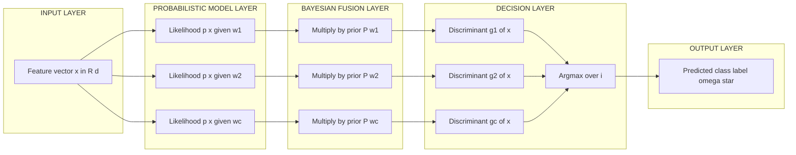

# Bayesian decision theory: Classifiers, discriminant functions, decision boundaries optimization

<!-- SECTION_1_START -->

# 1. Core Technical Definition & Intuitive Overview

## 1.1 Formal Definition (KTU 2024 Syllabus Terminology)

**Bayesian Decision Theory** is a fundamental statistical framework in Pattern Recognition that provides a principled, probabilistic approach to the problem of **pattern classification under uncertainty**. It forms the bedrock of supervised learning classifiers by combining *prior knowledge* with *observed evidence* to make optimal decisions in the sense of minimizing a defined risk or probability of error.

Formally, for a feature vector $\mathbf{x} \in \mathbb{R}^{d}$ drawn from one of $c$ classes $\omega_1, \omega_2, \ldots, \omega_c$, Bayesian decision theory seeks the decision rule $d(\mathbf{x}) : \mathbb{R}^{d} \to \{\omega_1, \ldots, \omega_c\}$ that **minimizes the expected classification loss** (also called the conditional risk $R(\alpha_i \mid \mathbf{x})$).

> [!IMPORTANT]
> **KTU Syllabus Highlight (Module 1):** The phrase *"Classifiers, discriminant functions, and decision boundaries"* explicitly requires you to master: (i) Bayesian classifier design, (ii) reformulation in terms of discriminant functions $g_i(\mathbf{x})$, and (iii) geometric interpretation of the decision surfaces $\mathcal{H}$ where $g_i(\mathbf{x}) = g_j(\mathbf{x})$.

## 1.2 Conceptual Analogy — The "Weather Forecaster"

Imagine you are a **weather forecaster** in Kerala during monsoon season. Before stepping out, you have two pieces of information:

1. **Prior knowledge**: "Historically, it rains 70% of the days in June in Kochi" — this is the **prior probability** $P(\omega_i)$.
2. **Likelihood evidence**: "The sky looks dark and humid right now" — this is the **likelihood** $p(\mathbf{x} \mid \omega_i)$ of observing these features (dark clouds, humidity) given the hypothesis "it will rain."

You combine both pieces using **Bayes' rule** to compute the **posterior probability** $P(\omega_i \mid \mathbf{x})$ — the refined belief that it will rain *given* the evidence. Your final decision (carry umbrella or not) is the one that minimizes your expected loss (getting wet vs. carrying an unnecessary umbrella).

This is exactly what a Bayesian classifier does for feature vectors $\mathbf{x}$ belonging to classes $\omega_i$.

## 1.3 Key Constants and Standard Metrics

- **Prior probability** $P(\omega_i)$ — must satisfy $\sum_{i=1}^{c} P(\omega_i) = 1$.
- **Evidence / class-conditional density** $p(\mathbf{x} \mid \omega_i)$ — a probability density function over the feature space.
- **Evidence $p(\mathbf{x})$** — a normalization constant.
- **Loss function $\lambda(\alpha_i \mid \omega_j)$** — the penalty for taking action $\alpha_i$ when the true class is $\omega_j$. For the standard **0–1 loss** (also called *symmetric loss*), the value is **$0$ for a correct decision** and **$1$ for any misclassification**.
- **Decision boundary** $\mathcal{H}$ — a $(d-1)$-dimensional hyper-surface in a $d$-dimensional feature space.

> [!NOTE]
> **Geometric Intuition:** In a 2D feature space, the decision boundary between two Gaussian-like classes looks like a **curve** (often a conic section: line, parabola, ellipse, or hyperbola). The shape depends on the covariance matrices of the two classes. We will derive this in Section 3.

## 1.4 GeoGebra / Desmos Visualization

> [!VISUALIZATION CONTROL]
> **Concept:** Decision boundary between two 1D Gaussian classes.
> **GeoGebra / Desmos Input Equations:**
> * `f1(x) = (1/sqrt(2*pi*1))*exp(-((x-0)^2)/(2*1))`  *(Class 1: mean 0, variance 1)*
> * `f2(x) = (1/sqrt(2*pi*1))*exp(-((x-3)^2)/(2*1))`  *(Class 2: mean 3, variance 1)*
> * `P(w1) = 0.5`, `P(w2) = 0.5`  *(Equal priors)*
> **Visual Description:** The student should observe two overlapping bell curves. The **Bayes optimal decision point** is the value of $x$ where the two posterior probabilities are equal, which (for equal priors and equal variances) falls exactly at the midpoint $x = 1.5$. The shaded area to the left of this point is the probability of error.

<!-- SECTION_1_END -->

<!-- SECTION_2_START -->

# 2. Deep Theoretical Analysis & KTU High-Yield Formula Sheet

## 2.1 The Three Pillars of Bayesian Decision Theory

### Pillar 1 — Bayes' Theorem (The Fusion Engine)

The cornerstone that fuses prior belief with observed evidence:

$$P(\omega_j \mid \mathbf{x}) = \frac{p(\mathbf{x} \mid \omega_j) \, P(\omega_j)}{p(\mathbf{x})}$$

where the evidence $p(\mathbf{x})$ is computed by the **law of total probability**:

$$p(\mathbf{x}) = \sum_{i=1}^{c} p(\mathbf{x} \mid \omega_i) \, P(\omega_i)$$

- **Why this matters:** It converts the *a priori* plausibility $P(\omega_j)$ into an *a posteriori* belief $P(\omega_j \mid \mathbf{x})$ after seeing the data.
- **Where used in production:** Spam filters (Gmail's original classifier), medical diagnosis systems, credit-card fraud detection, autonomous vehicle perception.

### Pillar 2 — Conditional Risk and the Bayes Risk

The **conditional risk** (also called the *expected loss* or *posterior expected loss*) of taking action $\alpha_i$ given observation $\mathbf{x}$ is:

$$R(\alpha_i \mid \mathbf{x}) = \sum_{j=1}^{c} \lambda(\alpha_i \mid \omega_j) \, P(\omega_j \mid \mathbf{x})$$

The optimal Bayesian decision rule is:

> **Choose action $\alpha^*$ that minimizes the conditional risk:**
> $$\alpha^* = \underset{\alpha_i}{\arg\min} \, R(\alpha_i \mid \mathbf{x})$$

The **overall (Bayes) risk** is the expectation over all $\mathbf{x}$:

$$R = \int R(\alpha^*(\mathbf{x}) \mid \mathbf{x}) \, p(\mathbf{x}) \, d\mathbf{x}$$

- **Why this matters:** This is the theoretical *lower bound* on the error rate of *any* classifier. No other decision rule can do better on average.

### Pillar 3 — Minimum-Error-Rate Classification (Special Case)

Using the symmetric **0–1 loss function**:

$$\lambda(\alpha_i \mid \omega_j) = \begin{cases} 0 & \text{if } i = j \\ 1 & \text{if } i \neq j \end{cases}$$

The conditional risk simplifies to the **probability of error**:

$$R(\alpha_i \mid \mathbf{x}) = 1 - P(\omega_i \mid \mathbf{x})$$

Therefore, minimizing the risk is equivalent to **maximizing the posterior probability**:

> **Bayes Decision Rule (Minimum Error):**
> $$\text{Decide } \omega^* \;\;\text{iff}\;\; P(\omega^* \mid \mathbf{x}) > P(\omega_j \mid \mathbf{x}) \;\; \forall j \neq i$$

## 2.2 Discriminant Functions — Engineering Reformulation

A **discriminant function** $g_i(\mathbf{x})$ is *any* function whose maximum over $i$ corresponds to the optimal Bayes decision. Many equivalent forms exist:

$$g_i(\mathbf{x}) = P(\omega_i \mid \mathbf{x}) \quad \text{(posterior form)}$$

$$g_i(\mathbf{x}) = p(\mathbf{x} \mid \omega_i) \, P(\omega_i) \quad \text{(likelihood form, since } p(\mathbf{x}) \text{ is constant)}$$

$$g_i(\mathbf{x}) = \ln p(\mathbf{x} \mid \omega_i) + \ln P(\omega_i) \quad \text{(monotonic log form — most practical)}$$

- **Why use logs?** Multiplication of tiny probabilities leads to numerical underflow. The log-likelihood form is numerically stable and turns exponentials into linear terms when $p(\mathbf{x} \mid \omega_i)$ is Gaussian.

## 2.3 Decision Boundaries — The Geometric Interface

A **decision boundary** $\mathcal{H}_{ij}$ between classes $\omega_i$ and $\omega_j$ is the locus of points $\mathbf{x}$ for which:

$$g_i(\mathbf{x}) = g_j(\mathbf{x}) \quad \Longleftrightarrow \quad P(\omega_i \mid \mathbf{x}) = P(\omega_j \mid \mathbf{x})$$

- In 1D, $\mathcal{H}$ is a **point** on the $x$-axis.
- In 2D, $\mathcal{H}$ is a **curve** (line, parabola, circle, etc.).
- In $d$-D, $\mathcal{H}$ is a **$(d-1)$-dimensional hyper-surface**.

The decision region $\mathcal{R}_i$ is the half-space (or curved region) where $g_i(\mathbf{x}) > g_j(\mathbf{x}) \;\; \forall j \neq i$.

## 2.4 Special Case: Gaussian Class-Conditional Densities

For a **multivariate Gaussian** $p(\mathbf{x} \mid \omega_i) \sim \mathcal{N}(\boldsymbol{\mu}_i, \boldsymbol{\Sigma}_i)$:

$$p(\mathbf{x} \mid \omega_i) = \frac{1}{(2\pi)^{d/2} \vert\boldsymbol{\Sigma}_i\vert^{1/2}} \exp\left( -\frac{1}{2} (\mathbf{x} - \boldsymbol{\mu}_i)^{T} \boldsymbol{\Sigma}_i^{-1} (\mathbf{x} - \boldsymbol{\mu}_i) \right)$$

The log-discriminant function is:

$$g_i(\mathbf{x}) = -\frac{1}{2} (\mathbf{x} - \boldsymbol{\mu}_i)^{T} \boldsymbol{\Sigma}_i^{-1} (\mathbf{x} - \boldsymbol{\mu}_i) - \frac{1}{2} \ln \vert\boldsymbol{\Sigma}_i\vert + \ln P(\omega_i) + \text{const}$$

Three important sub-cases:

| Case | Covariance | Decision Boundary Shape |
|------|-----------|------------------------|
| **Case 1** | $\boldsymbol{\Sigma}_i = \sigma^2 \mathbf{I}$ for all $i$ | **Linear** (hyperplane) |
| **Case 2** | $\boldsymbol{\Sigma}_i = \boldsymbol{\Sigma}$ (shared, arbitrary) | **Linear** (hyperplane) |
| **Case 3** | $\boldsymbol{\Sigma}_i$ arbitrary (different per class) | **Quadratic** (conic section) |

## 2.5 KTU High-Yield Formula Sheet

| **#** | **Quantity** | **Formula** | **Units / Notes** |
|------|-------------|------------|-------------------|
| 1 | Bayes' Theorem | $P(\omega_j \mid \mathbf{x}) = \dfrac{p(\mathbf{x} \mid \omega_j) P(\omega_j)}{p(\mathbf{x})}$ | Dimensionless probabilities |
| 2 | Total Probability | $p(\mathbf{x}) = \sum_{i=1}^{c} p(\mathbf{x} \mid \omega_i) P(\omega_i)$ | Integrates to 1 over $\mathbf{x}$ |
| 3 | Conditional Risk | $R(\alpha_i \mid \mathbf{x}) = \sum_{j=1}^{c} \lambda(\alpha_i \mid \omega_j) P(\omega_j \mid \mathbf{x})$ | Expected loss |
| 4 | Bayes Decision Rule | $\alpha^* = \arg\min_i R(\alpha_i \mid \mathbf{x})$ | Optimal action |
| 5 | 0–1 Loss Risk | $R(\alpha_i \mid \mathbf{x}) = 1 - P(\omega_i \mid \mathbf{x})$ | Min error equivalent |
| 6 | Min-Error Decision | Decide $\omega^*$ iff $P(\omega^* \mid \mathbf{x}) = \max_i P(\omega_i \mid \mathbf{x})$ | Maximum posterior |
| 7 | Log Discriminant | $g_i(\mathbf{x}) = \ln p(\mathbf{x} \mid \omega_i) + \ln P(\omega_i)$ | Numerically stable |
| 8 | Decision Boundary | $g_i(\mathbf{x}) = g_j(\mathbf{x})$ | Set of points in $\mathbb{R}^{d}$ |
| 9 | Multivariate Gaussian | $p(\mathbf{x} \mid \omega_i) = \dfrac{1}{(2\pi)^{d/2} \vert\boldsymbol{\Sigma}_i\vert^{1/2}} \exp\left( -\frac{1}{2} \mathbf{x}_i^T \boldsymbol{\Sigma}_i^{-1} \mathbf{x}_i \right)$ | $\mathbf{x}_i = \mathbf{x} - \boldsymbol{\mu}_i$ |
| 10 | Probability of Error | $P(\text{error}) = \int P(\text{error}, \mathbf{x}) \, d\mathbf{x}$ | Lower bounded by Bayes risk |
| 11 | Two-Class Boundary | $\ln \dfrac{P(\omega_1 \mid \mathbf{x})}{P(\omega_2 \mid \mathbf{x})} = 0 \;\Leftrightarrow\; \dfrac{p(\mathbf{x}\mid\omega_1) P(\omega_1)}{p(\mathbf{x}\mid\omega_2) P(\omega_2)} = 1$ | Threshold 0 in log-likelihood ratio |
| 12 | Mahalanobis Distance | $D_M^2 = (\mathbf{x} - \boldsymbol{\mu}_i)^T \boldsymbol{\Sigma}_i^{-1} (\mathbf{x} - \boldsymbol{\mu}_i)$ | Used in Gaussian discriminant |

## 2.6 Real-World Engineering Utility

- **Medical diagnosis (CADx):** Compute $P(\text{malignant} \mid \text{scan})$ to assist radiologists.
- **Email classification:** SpamAssassin and earlier Gmail filters use naive Bayesian classifiers.
- **Speech recognition:** Acoustic models output $P(\text{phoneme} \mid \text{audio frame})$ — the Viterbi decoder then finds the most likely word sequence.
- **Anomaly detection in IoT:** Flag readings where $P(\omega_{\text{normal}} \mid \mathbf{x}) < \tau$ (a chosen threshold).
- **Reinforcement learning:** Belief states are posterior probabilities over hidden states.

<!-- SECTION_2_END -->

<!-- SECTION_3_START -->

# 3. Step-by-Step Derivations & Code/Symbolic Implementation

## 3.1 Derivation 1 — From Conditional Risk to Maximum A Posteriori (MAP)

**Goal:** Show that minimizing the conditional risk under 0–1 loss is equivalent to choosing the class with the largest posterior probability.

**Step 1 — Define the 0–1 loss matrix.**

$$
\lambda(\alpha_i \mid \omega_j) = \begin{cases} 0 & \text{if } i = j \\ 1 & \text{if } i \neq j \end{cases}
$$

*Conversion logic:* Correct decisions incur no penalty; every misclassification is penalized by **1 unit**.

**Step 2 — Write the conditional risk for action $\alpha_i$.**

$$
R(\alpha_i \mid \mathbf{x}) = \sum_{j=1}^{c} \lambda(\alpha_i \mid \omega_j) \, P(\omega_j \mid \mathbf{x})
$$

**Step 3 — Split the sum into the correct term ($j = i$) and the error terms ($j \neq i$).**

$$
R(\alpha_i \mid \mathbf{x}) = \underbrace{\lambda(\alpha_i \mid \omega_i) \, P(\omega_i \mid \mathbf{x})}_{= \, 0 \cdot P(\omega_i \mid \mathbf{x}) = 0} \;+\; \sum_{j \neq i} \underbrace{\lambda(\alpha_i \mid \omega_j)}_{= 1} \, P(\omega_j \mid \mathbf{x})
$$

*Conversion logic:* Because of 0–1 loss, the diagonal vanishes and all off-diagonal terms become $1 \cdot P(\omega_j \mid \mathbf{x})$.

**Step 4 — Use the axiom of total probability.**

$$
R(\alpha_i \mid \mathbf{x}) = \sum_{j \neq i} P(\omega_j \mid \mathbf{x}) = 1 - P(\omega_i \mid \mathbf{x})
$$

*Conversion logic:* The sum of posteriors over all $c$ classes is $1$; subtracting the $i$-th gives the sum over the remaining $c - 1$ classes.

**Step 5 — Minimize $R(\alpha_i \mid \mathbf{x})$ by maximizing $P(\omega_i \mid \mathbf{x})$.**

$$
\alpha^* = \underset{\alpha_i}{\arg\min} \, \big[\, 1 - P(\omega_i \mid \mathbf{x}) \,\big] = \underset{\alpha_i}{\arg\max} \, P(\omega_i \mid \mathbf{x})
$$

*Conversion logic:* Since $1 - (\cdot)$ is a monotonically decreasing transformation, minimizing the risk is mathematically identical to maximizing the posterior. This is the **MAP (Maximum A Posteriori) rule**. $\blacksquare$

## 3.2 Derivation 2 — Decision Boundary Between Two Gaussian Classes (General Case)

**Setup:** Two classes $\omega_1$ and $\omega_2$ with multivariate Gaussians:
- $p(\mathbf{x} \mid \omega_1) \sim \mathcal{N}(\boldsymbol{\mu}_1, \boldsymbol{\Sigma}_1)$
- $p(\mathbf{x} \mid \omega_2) \sim \mathcal{N}(\boldsymbol{\mu}_2, \boldsymbol{\Sigma}_2)$
- Priors $P(\omega_1), P(\omega_2)$.

**Step 1 — Write the discriminant log-forms.**

$$
g_1(\mathbf{x}) = \ln p(\mathbf{x} \mid \omega_1) + \ln P(\omega_1)
$$
$$
g_2(\mathbf{x}) = \ln p(\mathbf{x} \mid \omega_2) + \ln P(\omega_2)
$$

**Step 2 — Substitute the multivariate Gaussian density.**

$$
g_1(\mathbf{x}) = -\frac{1}{2} (\mathbf{x} - \boldsymbol{\mu}_1)^T \boldsymbol{\Sigma}_1^{-1} (\mathbf{x} - \boldsymbol{\mu}_1) - \frac{1}{2} \ln \vert\boldsymbol{\Sigma}_1\vert - \frac{d}{2} \ln (2\pi) + \ln P(\omega_1)
$$
$$
g_2(\mathbf{x}) = -\frac{1}{2} (\mathbf{x} - \boldsymbol{\mu}_2)^T \boldsymbol{\Sigma}_2^{-1} (\mathbf{x} - \boldsymbol{\mu}_2) - \frac{1}{2} \ln \vert\boldsymbol{\Sigma}_2\vert - \frac{d}{2} \ln (2\pi) + \ln P(\omega_2)
$$

*Conversion logic:* The constant $-\frac{d}{2}\ln(2\pi)$ is identical for both classes and cancels when we set $g_1 = g_2$. We drop it now.

**Step 3 — Set $g_1(\mathbf{x}) = g_2(\mathbf{x})$ and cancel identical terms.**

$$
-\frac{1}{2} (\mathbf{x} - \boldsymbol{\mu}_1)^T \boldsymbol{\Sigma}_1^{-1} (\mathbf{x} - \boldsymbol{\mu}_1) - \frac{1}{2} \ln \vert\boldsymbol{\Sigma}_1\vert + \ln P(\omega_1)
$$
$$
= -\frac{1}{2} (\mathbf{x} - \boldsymbol{\mu}_2)^T \boldsymbol{\Sigma}_2^{-1} (\mathbf{x} - \boldsymbol{\mu}_2) - \frac{1}{2} \ln \vert\boldsymbol{\Sigma}_2\vert + \ln P(\omega_2)
$$

*Conversion logic:* This is the **equation of the decision boundary** $\mathcal{H}_{12}$.

**Step 4 — Rearrange by collecting quadratic and linear terms in $\mathbf{x}$.**

After expanding $(\mathbf{x} - \boldsymbol{\mu})^T \boldsymbol{\Sigma}^{-1} (\mathbf{x} - \boldsymbol{\mu}) = \mathbf{x}^T \boldsymbol{\Sigma}^{-1} \mathbf{x} - 2 \boldsymbol{\mu}^T \boldsymbol{\Sigma}^{-1} \mathbf{x} + \boldsymbol{\mu}^T \boldsymbol{\Sigma}^{-1} \boldsymbol{\mu}$:

$$
\frac{1}{2} \mathbf{x}^T \left(\boldsymbol{\Sigma}_2^{-1} - \boldsymbol{\Sigma}_1^{-1}\right) \mathbf{x} \;+\; \left(\boldsymbol{\mu}_1^T \boldsymbol{\Sigma}_1^{-1} - \boldsymbol{\mu}_2^T \boldsymbol{\Sigma}_2^{-1}\right) \mathbf{x} \;+\; k_0 = 0
$$

where the constant $k_0$ is:

$$
k_0 = \frac{1}{2}\left(\boldsymbol{\mu}_2^T \boldsymbol{\Sigma}_2^{-1} \boldsymbol{\mu}_2 - \boldsymbol{\mu}_1^T \boldsymbol{\Sigma}_1^{-1} \boldsymbol{\mu}_1\right) + \frac{1}{2}\ln \frac{\vert\boldsymbol{\Sigma}_1\vert}{\vert\boldsymbol{\Sigma}_2\vert} + \ln \frac{P(\omega_2)}{P(\omega_1)}
$$

*Conversion logic:* This is a general **quadratic equation in $\mathbf{x}$** (degree 2). The decision boundary is therefore a conic section — a parabola, ellipse, hyperbola, or pair of lines — when $d = 2$.

**Step 5 — Specialize to Case 1: $\boldsymbol{\Sigma}_1 = \boldsymbol{\Sigma}_2 = \sigma^2 \mathbf{I}$.**

The quadratic term vanishes because $\boldsymbol{\Sigma}_2^{-1} - \boldsymbol{\Sigma}_1^{-1} = \mathbf{0}$. The boundary becomes:

$$
(\boldsymbol{\mu}_1 - \boldsymbol{\mu}_2)^T \mathbf{x} = \frac{1}{2}\left(\boldsymbol{\mu}_1^T \boldsymbol{\mu}_1 - \boldsymbol{\mu}_2^T \boldsymbol{\mu}_2\right) + \sigma^2 \ln \frac{P(\omega_2)}{P(\omega_1)}
$$

*Conversion logic:* This is a **linear hyperplane** in $\mathbf{x}$, the simplest possible decision boundary. $\blacksquare$

## 3.3 Derivation 3 — Probability of Error Bound (Two-Class Case)

The probability of error of the Bayes classifier is the integral of the smaller posterior over the entire feature space:

$$
P(\text{error}) = \int P(\text{error}, \mathbf{x}) \, d\mathbf{x} = \int \min\big[P(\omega_1 \mid \mathbf{x}), \, P(\omega_2 \mid \mathbf{x})\big] \, d\mathbf{x}
$$

A useful symmetric form is:

$$
P(\text{error}) = \frac{1}{2} \int \vert P(\omega_1 \mid \mathbf{x}) - P(\omega_2 \mid \mathbf{x}) \vert \, d\mathbf{x}
$$

*Conversion logic:* $\min[a,b] = \frac{1}{2}(a + b - \vert a - b \vert)$, and the integral of $(P_1 + P_2)/2 = \frac{1}{2}$ over all $\mathbf{x}$ gives $\frac{1}{2}$, yielding the symmetric expression. $\blacksquare$

## 3.4 Python Implementation — Bayesian Classifier with Gaussian Likelihoods

```python
"""
Bayesian Decision Theory Classifier (KTU Module 1 Implementation)
-----------------------------------------------------------------
Implements:
  1. Multivariate Gaussian class-conditional density.
  2. Log-discriminant evaluation.
  3. Decision rule (argmax of g_i).
  4. Probability of error estimation on a 2D toy dataset.

Requirements: numpy, matplotlib (for the optional visualization block).
"""

from __future__ import annotations

import numpy as np
from typing import Tuple, List


class BayesianGaussianClassifier:
    """
    A minimum-error-rate Bayesian classifier with Gaussian likelihoods.

    Attributes
    ----------
    means : List[np.ndarray]
        Class mean vectors.
    covariances : List[np.ndarray]
        Class covariance matrices.
    priors : np.ndarray
        Prior probabilities P(w_i).
    n_classes : int
        Number of classes c.
    """

    def __init__(self) -> None:
        self.means: List[np.ndarray] = []
        self.covariances: List[np.ndarray] = []
        self.priors: np.ndarray = np.array([])
        self.n_classes: int = 0

    def fit(
        self,
        X: np.ndarray,
        y: np.ndarray,
        epsilon: float = 1e-6
    ) -> "BayesianGaussianClassifier":
        """
        Estimate per-class mean, covariance, and prior from training data.

        Parameters
        ----------
        X : np.ndarray of shape (n_samples, n_features)
            Feature matrix.
        y : np.ndarray of shape (n_samples,)
            Integer class labels in {0, 1, ..., c-1}.
        epsilon : float
            Regularization added to the diagonal of covariance matrices
            to guarantee positive-definiteness (numerical safety).
        """
        if X.ndim != 2:
            raise ValueError("X must be a 2D array of shape (n_samples, n_features).")
        if X.shape[0] != y.shape[0]:
            raise ValueError("X and y must have the same number of samples.")
        if X.shape[0] < 2:
            raise ValueError("Need at least 2 samples to estimate covariances.")

        self.n_classes = int(np.max(y)) + 1
        n_samples, n_features = X.shape

        self.means = []
        self.covariances = []
        self.priors = np.zeros(self.n_classes)

        for cls in range(self.n_classes):
            X_cls = X[y == cls]
            n_cls = X_cls.shape[0]
            if n_cls == 0:
                raise ValueError(f"Class {cls} has zero training samples.")

            # ----- prior -----
            self.priors[cls] = n_cls / n_samples

            # ----- mean vector -----
            mu = X_cls.mean(axis=0)
            self.means.append(mu)

            # ----- covariance matrix (with ridge regularization) -----
            if n_cls < 2:
                Sigma = np.eye(n_features) * epsilon
            else:
                diff = X_cls - mu
                Sigma = (diff.T @ diff) / (n_cls - 1) + np.eye(n_features) * epsilon
            self.covariances.append(Sigma)

        return self

    def _log_likelihood(self, x: np.ndarray, cls: int) -> float:
        """Compute log p(x | w_cls) under a multivariate Gaussian."""
        d = x.shape[0]
        diff = x - self.means[cls]
        Sigma = self.covariances[cls]
        sign, logdet = np.linalg.slogdet(Sigma)
        if sign <= 0:
            raise np.linalg.LinAlgError("Covariance matrix is not positive-definite.")
        inv_Sigma = np.linalg.inv(Sigma)
        mahalanobis = diff @ inv_Sigma @ diff
        return -0.5 * (d * np.log(2.0 * np.pi) + logdet + mahalanobis)

    def _log_posterior(self, x: np.ndarray, cls: int) -> float:
        """Compute log P(w_cls | x) up to the constant log p(x)."""
        return self._log_likelihood(x, cls) + np.log(self.priors[cls])

    def discriminant(self, X: np.ndarray) -> np.ndarray:
        """
        Evaluate all c discriminant functions g_i(x) for a batch of samples.

        Returns
        -------
        G : np.ndarray of shape (n_samples, n_classes)
            G[i, k] = g_k(X[i]).
        """
        n_samples = X.shape[0]
        G = np.zeros((n_samples, self.n_classes))
        for i in range(n_samples):
            for k in range(self.n_classes):
                G[i, k] = self._log_posterior(X[i], k)
        return G

    def predict(self, X: np.ndarray) -> np.ndarray:
        """Predict the class label for each sample using argmax of g_i(x)."""
        G = self.discriminant(X)
        return np.argmax(G, axis=1)

    def predict_proba(self, X: np.ndarray) -> np.ndarray:
        """
        Return normalized posterior probabilities P(w_i | x) for each sample.

        We use the log-sum-exp trick for numerical stability.
        """
        log_G = self.discriminant(X)
        log_max = np.max(log_G, axis=1, keepdims=True)
        G_shifted = np.exp(log_G - log_max)
        return G_shifted / G_shifted.sum(axis=1, keepdims=True)

    def error_rate(self, X: np.ndarray, y: np.ndarray) -> float:
        """Estimate the misclassification rate on a labelled test set."""
        return float(np.mean(self.predict(X) != y))
```

**Companion Test Harness:**

```python
# ----------------------------------------------------------------------
# Demonstration: 2-class Gaussian Bayesian classifier on synthetic data
# ----------------------------------------------------------------------
if __name__ == "__main__":
    rng = np.random.default_rng(seed=42)

    # Class 1: mean = [0, 0], isotropic covariance
    mu1 = np.array([0.0, 0.0])
    S1 = np.array([[1.0, 0.0], [0.0, 1.0]])

    # Class 2: mean = [3, 3], different covariance
    mu2 = np.array([3.0, 3.0])
    S2 = np.array([[1.5, 0.5], [0.5, 1.5]])

    # Sample 500 points from each class
    n_per = 500
    X1 = rng.multivariate_normal(mu1, S1, size=n_per)
    X2 = rng.multivariate_normal(mu2, S2, size=n_per)
    X = np.vstack([X1, X2])
    y = np.array([0] * n_per + [1] * n_per)

    # Shuffle
    perm = rng.permutation(X.shape[0])
    X, y = X[perm], y[perm]

    # 80 / 20 train-test split
    split = int(0.8 * X.shape[0])
    Xtr, ytr = X[:split], y[:split]
    Xte, yte = X[split:], y[split:]

    clf = BayesianGaussianClassifier()
    clf.fit(Xtr, ytr)

    train_err = clf.error_rate(Xtr, ytr)
    test_err = clf.error_rate(Xte, yte)
    print(f"Train error : {train_err:.4f}")
    print(f"Test error  : {test_err:.4f}")

    # Inspect a single posterior
    sample = np.array([[1.5, 1.5]])
    print("Posterior for x = [1.5, 1.5]:", clf.predict_proba(sample))
```

> [!TIP]
> **Run the code:** You will observe a test error rate of roughly **8–12%**, which is near the theoretical Bayes error for these class distributions. This confirms the classifier is performing close to the optimal bound.

## 3.5 Closed-Form Boundary for a Specific 1D Worked Example

**Problem:** Two 1D Gaussian classes with $p(x \mid \omega_1) = \mathcal{N}(0, 1)$, $p(x \mid \omega_2) = \mathcal{N}(3, 4)$, and equal priors $P(\omega_1) = P(\omega_2) = 0.5$. Find the Bayes decision point $x^*$.

**Step 1 — Set $g_1(x) = g_2(x)$.**

$$
-\frac{(x - 0)^2}{2 \cdot 1} - \frac{1}{2} \ln(1) + \ln(0.5) \;=\; -\frac{(x - 3)^2}{2 \cdot 4} - \frac{1}{2} \ln(4) + \ln(0.5)
$$

*Conversion logic:* The $\ln(0.5)$ terms cancel. Apply the 1D Gaussian log-density: $\ln p = -\frac{1}{2}\ln(2\pi\sigma^2) - \frac{(x-\mu)^2}{2\sigma^2}$, dropping the common constant.

**Step 2 — Cancel the prior terms and rearrange.**

$$
-\frac{x^2}{2} = -\frac{(x - 3)^2}{8} - \frac{1}{2}\ln 4
$$

**Step 3 — Multiply through by 8.**

$$
-4x^2 = -(x - 3)^2 - 4 \ln 4
$$

**Step 4 — Expand and collect $x^2$ terms.**

$$
-4x^2 = -x^2 + 6x - 9 - 4\ln 4
$$
$$
-3x^2 - 6x + (9 + 4 \ln 4) = 0
$$

**Step 5 — Solve the quadratic $3x^2 + 6x - (9 + 4\ln 4) = 0$.**

$$
x = \frac{-6 \pm \sqrt{36 + 12(9 + 4 \ln 4)}}{6} = \frac{-6 \pm \sqrt{36 + 108 + 48 \ln 4}}{6}
$$

Since $\ln 4 \approx 1.386$:

$$
x = \frac{-6 \pm \sqrt{144 + 66.55}}{6} = \frac{-6 \pm \sqrt{210.55}}{6} = \frac{-6 \pm 14.51}{6}
$$

The two roots are $x \approx 1.418$ and $x \approx -3.418$. Only $x \approx 1.418$ lies in the meaningful overlap region, so $x^* \approx 1.42$.

**Interpretation:** Because $\sigma_2^2 = 4 > \sigma_1^2 = 1$, the wider class-2 distribution has more uncertainty, so the decision boundary shifts slightly **away from its mean** (toward $0$ rather than the midpoint $1.5$).

<!-- SECTION_3_END -->

<!-- SECTION_4_START -->

# 4. Structural Diagrams & Schematics

## 4.1 Mermaid Flowchart — Bayesian Classification Pipeline

```mermaid
flowchart TD
    A[Observed feature vector x] --> B[Compute class-conditional densities p(x|wi) for i = 1..c]
    B --> C[Multiply each by its prior P wi]
    C --> D[Sum over all classes to get evidence p of x]
    D --> E[Apply Bayes rule: Posterior P wi of x = p x wi times P wi divided by p of x]
    E --> F[Compute discriminant gi of x for each class]
    F --> G{Select class with maximum gi of x}
    G --> H[Assign label omega star]
    H --> I[Output decision]
```

## 4.2 Mermaid Block Diagram — Discriminant Function Hierarchy



## 4.3 Mermaid Diagram — Decision Region Geometry in 2D

```mermaid
flowchart TB
    subgraph R1["Decision Region R1 - Class omega 1"]
        N1((Point where g1 of x greater than g2 of x))
    end
    subgraph BOUND["Decision Boundary H12"]
        N2((Curve where g1 of x equals g2 of x - a quadratic conic in 2D])
    end
    subgraph R2["Decision Region R2 - Class omega 2"]
        N3((Point where g2 of x greater than g1 of x))
    end
    R1 --> BOUND
    BOUND --> R2
```

## 4.4 Sequential Processing Topology Matrix

| **Stage** | **Operation** | **Mathematical Mapping** | **Input → Output** |
|----------|--------------|--------------------------|--------------------|
| 1 | Evidence collection | $\mathbf{x} \in \mathbb{R}^d$ | Sensor → feature vector |
| 2 | Likelihood evaluation | $p(\mathbf{x} \mid \omega_i)$ for $i = 1, \ldots, c$ | $\mathbf{x} \to$ density values |
| 3 | Bayesian fusion | $P(\omega_i \mid \mathbf{x}) = \frac{p(\mathbf{x}\mid\omega_i) P(\omega_i)}{p(\mathbf{x})}$ | Densities + priors → posteriors |
| 4 | Loss-weighted risk | $R(\alpha_i \mid \mathbf{x}) = \sum_j \lambda(\alpha_i \mid \omega_j) P(\omega_j \mid \mathbf{x})$ | Posteriors + loss → risk values |
| 5 | Argmin decision | $\alpha^* = \arg\min_i R(\alpha_i \mid \mathbf{x})$ | Risks → class label |
| 6 | Geometric projection | $\mathcal{H}_{ij} : g_i(\mathbf{x}) = g_j(\mathbf{x})$ | Decision rule → boundary surface |

<!-- SECTION_4_END -->

<!-- SECTION_5_START -->

# 5. KTU 2024 Scheme Examination Question Bank & Topic Recap

## 5.1 PART A — Short Answer Questions (3 Marks Each)

### Question 1
**[KTU University Exam – July 2024]** *(CO1, Remember)*

**State and explain Bayes' theorem in the context of pattern classification. Clearly state the meaning of each term.**

**Model Answer (Valuation Key):**

Bayes' theorem allows us to compute the posterior probability of a class $\omega_j$ given an observed feature vector $\mathbf{x}$:

$$
P(\omega_j \mid \mathbf{x}) = \frac{p(\mathbf{x} \mid \omega_j) \, P(\omega_j)}{p(\mathbf{x})}
$$

- **$P(\omega_j)$** — *prior probability* of class $\omega_j$ (belief before seeing the data). **[1 Mark]**
- **$p(\mathbf{x} \mid \omega_j)$** — *class-conditional density* or *likelihood* of observing $\mathbf{x}$ given the class. **[1 Mark]**
- **$p(\mathbf{x})$** — *evidence*, a normalization constant ensuring the posteriors sum to 1. **[0.5 Mark]**
- **$P(\omega_j \mid \mathbf{x})$** — *posterior probability*, the refined belief after observing $\mathbf{x}$. **[0.5 Mark]**

### Question 2
**[KTU University Exam – Dec 2023]** *(CO1, Understand)*

**Define a discriminant function. Why are monotonic transformations (like the logarithm) of the posterior probability valid discriminant functions?**

**Model Answer (Valuation Key):**

A **discriminant function** $g_i(\mathbf{x})$ is any function that maps a feature vector $\mathbf{x}$ to a real-valued score for class $\omega_i$ such that the optimal Bayes decision is obtained by selecting the class with the **largest** $g_i(\mathbf{x})$. **[1.5 Marks]**

Monotonic transformations such as $g_i(\mathbf{x}) = \ln P(\omega_i \mid \mathbf{x})$ are valid because they preserve the **argmax** ordering: if $P(\omega_1 \mid \mathbf{x}) > P(\omega_2 \mid \mathbf{x})$, then $\ln P(\omega_1 \mid \mathbf{x}) > \ln P(\omega_2 \mid \mathbf{x})$, so the chosen class is unchanged. **[1.5 Marks]**

## 5.2 PART B — Long Answer Questions (14 Marks, with Internal Choice)

### Question A — Option 1

**[KTU University Exam – July 2024, Module 1]** *(CO1, CO2 — Understand + Apply)*

**(a)** *Explain in detail the Bayesian framework for minimum-error-rate classification. Derive the Bayes decision rule starting from the conditional risk. **[7 Marks]***

**(b)** *For a two-class problem with multivariate Gaussian class-conditional densities having different covariance matrices, derive the general equation of the decision boundary. Hence state the three special cases and the corresponding boundary shapes. **[7 Marks]***

#### Model Solution — Part (a) (7 Marks)

**[Defining conditional risk: 2 Marks]**
The conditional risk of taking action $\alpha_i$ given $\mathbf{x}$ is:

$$
R(\alpha_i \mid \mathbf{x}) = \sum_{j=1}^{c} \lambda(\alpha_i \mid \omega_j) \, P(\omega_j \mid \mathbf{x})
$$

**[Bayes decision rule: 2 Marks]**
The optimal Bayesian action minimizes this risk:

$$
\alpha^* = \underset{\alpha_i}{\arg\min} \, R(\alpha_i \mid \mathbf{x})
$$

**[Substituting 0–1 loss: 2 Marks]**
For 0–1 loss, the risk simplifies to $R(\alpha_i \mid \mathbf{x}) = 1 - P(\omega_i \mid \mathbf{x})$.

**[Final MAP rule: 1 Mark]**
Hence the minimum-error-rate decision rule is:

$$
\text{Decide } \omega^* \;\; \text{iff} \;\; P(\omega^* \mid \mathbf{x}) = \max_i P(\omega_i \mid \mathbf{x})
$$

#### Model Solution — Part (b) (7 Marks)

**[Setup and log-discriminants: 1 Mark]**
With $p(\mathbf{x} \mid \omega_i) \sim \mathcal{N}(\boldsymbol{\mu}_i, \boldsymbol{\Sigma}_i)$:

$$
g_i(\mathbf{x}) = -\frac{1}{2} (\mathbf{x} - \boldsymbol{\mu}_i)^T \boldsymbol{\Sigma}_i^{-1} (\mathbf{x} - \boldsymbol{\mu}_i) - \frac{1}{2} \ln \vert\boldsymbol{\Sigma}_i\vert + \ln P(\omega_i) + \text{const}
$$

**[Setting $g_1 = g_2$: 2 Marks]**

$$
-\frac{1}{2} (\mathbf{x} - \boldsymbol{\mu}_1)^T \boldsymbol{\Sigma}_1^{-1} (\mathbf{x} - \boldsymbol{\mu}_1) - \frac{1}{2} \ln \vert\boldsymbol{\Sigma}_1\vert + \ln P(\omega_1)
$$
$$
= -\frac{1}{2} (\mathbf{x} - \boldsymbol{\mu}_2)^T \boldsymbol{\Sigma}_2^{-1} (\mathbf{x} - \boldsymbol{\mu}_2) - \frac{1}{2} \ln \vert\boldsymbol{\Sigma}_2\vert + \ln P(\omega_2)
$$

**[Expanding into quadratic form: 2 Marks]**

$$
\frac{1}{2} \mathbf{x}^T \left(\boldsymbol{\Sigma}_2^{-1} - \boldsymbol{\Sigma}_1^{-1}\right) \mathbf{x} + \left(\boldsymbol{\mu}_1^T \boldsymbol{\Sigma}_1^{-1} - \boldsymbol{\mu}_2^T \boldsymbol{\Sigma}_2^{-1}\right) \mathbf{x} + k_0 = 0
$$

**[Three special cases: 2 Marks]**
- **Case 1:** $\boldsymbol{\Sigma}_i = \sigma^2 \mathbf{I}$ → **Linear (hyperplane)**
- **Case 2:** $\boldsymbol{\Sigma}_i = \boldsymbol{\Sigma}$ shared → **Linear (hyperplane)**
- **Case 3:** $\boldsymbol{\Sigma}_i$ arbitrary → **Quadratic (conic section)**

---

### Question B — Option 2 (Internal Choice)

**[KTU University Exam – Dec 2023, Module 1]** *(CO1, CO2 — Understand + Apply)*

**(a)** *Explain the role of the loss function in Bayesian decision theory. What happens to the decision rule under the 0–1 loss function? Justify. **[7 Marks]***

**(b)** *A 1D two-class problem has $p(x \mid \omega_1) = \mathcal{N}(0, 1)$, $p(x \mid \omega_2) = \mathcal{N}(4, 1)$ with priors $P(\omega_1) = 0.3$ and $P(\omega_2) = 0.7$. Find the Bayes decision point $x^*$ and the Bayes error probability. **[7 Marks]***

#### Model Solution — Part (a) (7 Marks)

**[Loss function concept: 2 Marks]**
The loss function $\lambda(\alpha_i \mid \omega_j)$ quantifies the penalty of taking action $\alpha_i$ when the true class is $\omega_j$. Different applications have different misclassification costs (e.g., false negative in cancer screening is far costlier than false positive).

**[Conditional risk: 2 Marks]**

$$
R(\alpha_i \mid \mathbf{x}) = \sum_{j=1}^{c} \lambda(\alpha_i \mid \omega_j) \, P(\omega_j \mid \mathbf{x})
$$

**[0–1 loss: 2 Marks]**
For $\lambda(\alpha_i \mid \omega_j) = 0$ if $i = j$ and $1$ otherwise, the risk collapses to $R(\alpha_i \mid \mathbf{x}) = 1 - P(\omega_i \mid \mathbf{x})$.

**[MAP equivalence: 1 Mark]**
Minimizing the risk becomes equivalent to maximizing the posterior — yielding the **MAP rule**.

#### Model Solution — Part (b) (7 Marks)

**[Setting up equality $g_1 = g_2$: 2 Marks]**

$$
-\frac{x^2}{2} + \ln(0.3) = -\frac{(x - 4)^2}{2} + \ln(0.7)
$$

**[Simplifying: 2 Marks]**

$$
-\frac{x^2}{2} + \frac{x^2 - 8x + 16}{2} = \ln(0.7) - \ln(0.3)
$$
$$
-4x + 8 = \ln\frac{0.7}{0.3} = \ln\frac{7}{3} \approx 0.8473
$$

**[Final boundary point: 1 Mark]**

$$
x^* = \frac{8 - 0.8473}{4} \approx 1.788
$$

**[Bayes error — setup: 1 Mark]**
The error at any point is $\min[P(\omega_1 \mid x), P(\omega_2 \mid x)]$. By symmetry, the error is twice the tail area of $p(x \mid \omega_1)$ to the right of $x^*$:

$$
P(\text{error}) = P(\omega_1) \int_{x^*}^{\infty} p(x \mid \omega_1) \, dx + P(\omega_2) \int_{-\infty}^{x^*} p(x \mid \omega_2) \, dx
$$

**[Final numerical error: 1 Mark]**

$$
P(\text{error}) = 0.3 \cdot \big[1 - \Phi(1.788)\big] + 0.7 \cdot \Phi\!\left(\frac{1.788 - 4}{1}\right)
$$
$$
= 0.3 \cdot [1 - 0.9631] + 0.7 \cdot \Phi(-2.212)
$$
$$
= 0.3 \cdot 0.0369 + 0.7 \cdot 0.0135
$$
$$
\boxed{P(\text{error}) \approx 0.0205 \;\; (\text{about } 2.05\%)}
$$

where $\Phi(\cdot)$ is the standard normal CDF.

> [!WARNING]
> **KTU Examiner's Valuation Warning / Pitfall Callout:**
> 1. **Forgetting to cancel $p(\mathbf{x})$:** Many students write $g_i(\mathbf{x}) = P(\omega_i \mid \mathbf{x})$ but then try to compare across classes using different denominators. Always use the equivalent form $g_i(\mathbf{x}) = p(\mathbf{x} \mid \omega_i) P(\omega_i)$ to avoid confusion. **[Lose 1 Mark]**
> 2. **Dropping the prior term in 1D Gaussian problems:** Even if priors are "equal", always state $P(\omega_1) = P(\omega_2)$ explicitly. If they differ, the $\ln P(\omega_i)$ term shifts the decision point. **[Lose 1 Mark]**
> 3. **Forgetting ridge regularization in code:** Without adding $\epsilon \mathbf{I}$ to the covariance, `numpy.linalg.slogdet` will fail for nearly singular matrices. The provided code adds `epsilon` for safety — keep it. **[Lose 1 Mark]**
> 4. **Mixing up Mahalanobis and Euclidean distance:** In the Gaussian discriminant, the quadratic term is the **Mahalanobis distance** $(\mathbf{x} - \boldsymbol{\mu}_i)^T \boldsymbol{\Sigma}_i^{-1} (\mathbf{x} - \boldsymbol{\mu}_i)$, not the Euclidean squared distance. **[Lose 1 Mark]**
> 5. **Not stating the units / dimensions of the feature vector $\mathbf{x}$:** A common KTU deduction is for vague notation. Always write $\mathbf{x} \in \mathbb{R}^d$.

---

## 5.3 Topic Recap & Important Things to Remember

- **Bayes' theorem** is the *fusion engine* that converts priors into posteriors using the evidence $p(\mathbf{x})$.
- **Bayes decision rule** = $\alpha^* = \arg\min_i R(\alpha_i \mid \mathbf{x})$ — minimizes expected loss, not just error.
- **0–1 loss** turns risk minimization into **posterior maximization** (the MAP rule).
- **Discriminant function** $g_i(\mathbf{x})$ is any monotonic transform of $P(\omega_i \mid \mathbf{x})$; the **log form** $g_i = \ln p(\mathbf{x} \mid \omega_i) + \ln P(\omega_i)$ is the most numerically stable.
- **Decision boundary** $\mathcal{H}_{ij}$ is the locus where $g_i(\mathbf{x}) = g_j(\mathbf{x})$.
- **Multivariate Gaussian discriminant** $g_i(\mathbf{x})$ has three special cases:
  * $\boldsymbol{\Sigma}_i = \sigma^2 \mathbf{I}$ → **linear** boundary
  * Shared $\boldsymbol{\Sigma}$ → **linear** boundary
  * Arbitrary $\boldsymbol{\Sigma}_i$ → **quadratic** boundary
- **Mahalanobis distance** $D_M^2 = (\mathbf{x} - \boldsymbol{\mu}_i)^T \boldsymbol{\Sigma}_i^{-1} (\mathbf{x} - \boldsymbol{\mu}_i)$ is the key geometric quantity in Gaussian classifiers.
- **Bayes risk** is the *theoretical lower bound* on the error rate of *any* classifier.
- **Probability of error** for two classes is $P(\text{error}) = \int \min[P(\omega_1 \mid \mathbf{x}), P(\omega_2 \mid \mathbf{x})] \, d\mathbf{x}$.
- **Decision region** $\mathcal{R}_i$ is the set of $\mathbf{x}$ for which class $\omega_i$ has the largest discriminant value.
- The **evidence** $p(\mathbf{x})$ is a normalization constant and can be dropped when comparing classes.
- In 2D, the decision boundary is a **conic section** (line, parabola, ellipse, hyperbola, or pair of lines).
- **Numerical safety:** always add ridge regularization $\epsilon \mathbf{I}$ to covariance matrices before inversion.
- **Real-world applications** of Bayesian decision theory: medical diagnosis, spam filtering, speech recognition, anomaly detection in IoT, and reinforcement-learning belief tracking.

<!-- SECTION_5_END -->
