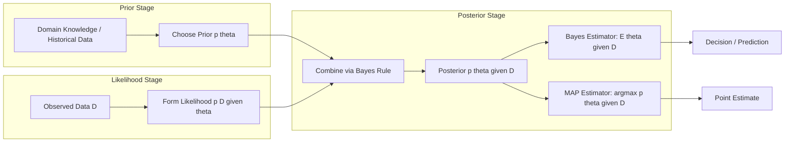
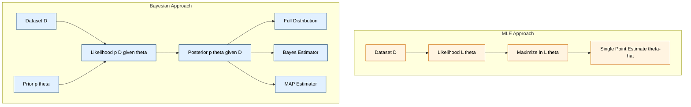
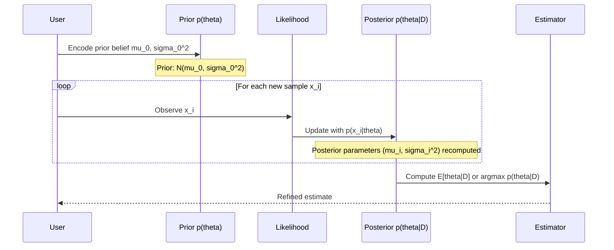

# Parameter estimation techniques: Maximum Likelihood Estimation (MLE), Bayesian estimation

<!-- SECTION_1_START -->
# Parameter Estimation Techniques: MLE and Bayesian Estimation

## 1.1 Formal Definition (KTU 2024 Syllabus Terminology)

> [!IMPORTANT]
> **Parameter Estimation** is the statistical procedure of inferring the unknown parameters $\theta$ of a probability distribution $p(x \vert \theta)$ that is assumed to govern the underlying data-generating process, given a finite set of observed samples $\mathcal{D} = \{x_1, x_2, \ldots, x_n\}$ drawn i.i.d. (independent and identically distributed) from it.

Within **Statistical Decision Theory** (the foundation of classical Pattern Recognition), parameter estimation provides the bridge between *raw data* and the *analytical models* used for classification, regression, and clustering. The two dominant paradigms in the KTU 2024 Pattern Recognition syllabus are:

| Paradigm | Core Philosophy | Output |
|----------|-----------------|--------|
| **Maximum Likelihood Estimation (MLE)** | Frequentist — find the single parameter value that makes the observed data *most probable*. | A **point estimate** $\hat{\theta}_{MLE}$ |
| **Bayesian Estimation** | Subjective/Probabilistic — combine observed data with a *prior belief* to derive a *posterior distribution* over the parameter. | A **posterior distribution** $p(\theta \vert \mathcal{D})$ and a derived point estimate (e.g., mean, MAP) |

### 1.2 Conceptual Analogy — Intuition for First-Time Learners

> [!NOTE]
> **The Arson Investigator Analogy** 🔍
>
> Imagine you are a forensic investigator trying to determine the probability $p$ that a particular type of accelerant (say, gasoline) was used in a fire. You collect $n$ independent chemical samples.
>
> - **MLE mindset**: "Given that I *did* observe these samples, what is the single value of $p$ that makes this observation *most likely* to have happened? I ignore any prior beliefs about arson rates in the city."
> - **Bayesian mindset**: "I have a *prior belief* (from past records) that the base rate of gasoline use is around 20%. Now, given the new chemical evidence, I will *update* this belief to obtain a refined, posterior probability."
>
> MLE gives a *single best number*; Bayesian gives a *whole distribution of beliefs*, updated by evidence.

### 1.3 The Role in Pattern Recognition

In Pattern Recognition (course code **PECST412**), parameter estimation underpins almost every downstream task:

- **Class-conditional densities** $p(x \vert \omega_j, \theta_j)$ in Bayes' classifier.
- **Mixture models** (e.g., Gaussian Mixture Models) where means, covariances, and mixing weights are unknown.
- **Hidden Markov Models** for speech and sequence labeling.
- **Regression** in which weights of a linear/polynomial model are estimated.

> [!TIP]
> **Standard Metric to Remember:** The **Bias** of an estimator $\hat{\theta}$ is defined as $\mathcal{B}(\hat{\theta}) = \mathbb{E}[\hat{\theta}] - \theta$. An estimator is **unbiased** if $\mathcal{B}(\hat{\theta}) = 0$. MLE for the Gaussian variance is *biased* (it underestimates by a factor of $\frac{n-1}{n}$); the unbiased correction divides by $(n-1)$ instead of $n$.

> [!VISUALIZATION CONTROL]
> **Concept:** Likelihood function as a function of the parameter $\theta$ for a fixed dataset.
> **GeoGebra / Desmos Input Equations:**
> * `L(mu) = (1/(sqrt(2*pi*1))) * exp(-((5-mu)^2 + ((7-mu)^2) + ((6-mu)^2))/2)`  *(a likelihood for n=3 Gaussian samples x={5,6,7} with known sigma=1)*
> **Visual Description:** A bell-shaped curve in the variable $\mu$ on the horizontal axis, with its peak located at the sample mean $\bar{x} = 6$. This visually demonstrates that the MLE of $\mu$ is the value that **maximizes** the height of the curve.

---

<!-- SECTION_1_END -->

<!-- SECTION_2_START -->
# Deep Theoretical Analysis & KTU High-Yield Formula Sheet

## 2.1 Maximum Likelihood Estimation (MLE) — Step-by-Step Logic

Given an i.i.d. dataset $\mathcal{D} = \{x_1, x_2, \ldots, x_n\}$ drawn from a distribution with parameter $\theta$, the MLE procedure is:

**Step 1 — Write the Joint Density (Likelihood Function).**
By the i.i.d. assumption, the joint probability of observing the *entire* dataset is the product of the individual densities:

$$L(\theta) = p(\mathcal{D} \vert \theta) = \prod_{i=1}^{n} p(x_i \vert \theta)$$

**Step 2 — Take the Logarithm (Log-Likelihood).**
The logarithm is a strictly monotonic transformation; thus, maximizing $L(\theta)$ is equivalent to maximizing $\ell(\theta) = \ln L(\theta)$. This converts products into sums and avoids numerical underflow:

$$\ell(\theta) = \sum_{i=1}^{n} \ln p(x_i \vert \theta)$$

**Step 3 — Differentiate and Set to Zero (Score Equation).**

$$\frac{\partial \ell(\theta)}{\partial \theta} = 0$$

**Step 4 — Solve the Score Equation** for $\theta$ to obtain the MLE $\hat{\theta}_{MLE}$.

**Step 5 — Verify the Second-Order Condition.** A true maximum requires:

$$\left. \frac{\partial^2 \ell(\theta)}{\partial \theta^2} \right\vert_{\theta = \hat{\theta}_{MLE}} < 0$$

> [!IMPORTANT]
> **The "Why" Behind MLE:** As $n \to \infty$, under mild regularity conditions, the MLE is **consistent** ($\hat{\theta}_{MLE} \to \theta_{true}$), **asymptotically efficient** (achieves the Cramér–Rao Lower Bound), and **asymptotically normal** ($\sqrt{n}(\hat{\theta}_{MLE} - \theta) \xrightarrow{d} \mathcal{N}(0, I^{-1}(\theta))$). These are board-favorite properties.

### 2.2 Bayesian Estimation — Step-by-Step Logic

The Bayesian paradigm treats the parameter $\theta$ as a *random variable* with its own distribution.

**Step 1 — Specify the Prior.** Encode existing belief about $\theta$ *before* seeing data:

$$p(\theta)$$

**Step 2 — Define the Likelihood.** Same likelihood function as in MLE:

$$p(\mathcal{D} \vert \theta) = \prod_{i=1}^{n} p(x_i \vert \theta)$$

**Step 3 — Apply Bayes' Rule to obtain the Posterior.**

$$p(\theta \vert \mathcal{D}) = \frac{p(\mathcal{D} \vert \theta) \, p(\theta)}{p(\mathcal{D})}$$

where the **evidence** (a normalizing constant independent of $\theta$) is:

$$p(\mathcal{D}) = \int p(\mathcal{D} \vert \theta') \, p(\theta') \, d\theta'$$

**Step 4 — Derive the Bayes Estimator** (the conditional mean, which minimizes the posterior expected squared-error loss):

$$\hat{\theta}_{Bayes} = \mathbb{E}[\theta \vert \mathcal{D}] = \int \theta \, p(\theta \vert \mathcal{D}) \, d\theta$$

**Step 5 (Optional) — Derive the MAP (Maximum A Posteriori) Estimate.** Maximizing the posterior directly gives a single point estimate:

$$\hat{\theta}_{MAP} = \arg\max_{\theta} \, p(\theta \vert \mathcal{D}) = \arg\max_{\theta} \, \left[ \ln p(\mathcal{D} \vert \theta) + \ln p(\theta) \right]$$

> [!NOTE]
> **Key Insight — The Bridge Between MLE and MAP:**
> When the prior $p(\theta)$ is **uniform** (i.e., a flat, non-informative prior), $\ln p(\theta) = \text{constant}$, and the MAP estimate reduces *exactly* to the MLE. This is why MLE is often called the *Bayesian estimator with a non-informative prior*.

### 2.3 KTU Formula Sheet / Cheat Sheet

> [!IMPORTANT]
> Memorize this table — these are the **highest-yield formulas** for the KTU board exam on this topic.

| # | Concept | Formula | Conditions / Notes |
|---|---------|---------|---------------------|
| 1 | Likelihood | $L(\theta) = \prod_{i=1}^{n} p(x_i \vert \theta)$ | Requires i.i.d. samples |
| 2 | Log-Likelihood | $\ell(\theta) = \sum_{i=1}^{n} \ln p(x_i \vert \theta)$ | Used for numerical stability |
| 3 | MLE Score Equation | $\frac{\partial \ell(\theta)}{\partial \theta} = 0$ | Solve for $\hat{\theta}_{MLE}$ |
| 4 | MLE of Gaussian Mean (1-D) | $\hat{\mu}_{MLE} = \frac{1}{n} \sum_{i=1}^{n} x_i$ | Unbiased |
| 5 | MLE of Gaussian Variance (1-D) | $\hat{\sigma}^2_{MLE} = \frac{1}{n} \sum_{i=1}^{n} (x_i - \hat{\mu}_{MLE})^2$ | **Biased** (underestimates by $\frac{n-1}{n}$) |
| 6 | Unbiased Sample Variance | $s^2 = \frac{1}{n-1} \sum_{i=1}^{n} (x_i - \bar{x})^2$ | Divide by $(n-1)$, not $n$ |
| 7 | Bayes' Rule for Parameters | $p(\theta \vert \mathcal{D}) = \frac{p(\mathcal{D} \vert \theta) \, p(\theta)}{p(\mathcal{D})}$ | Posterior $\propto$ Likelihood $\times$ Prior |
| 8 | Bayes Estimator (L2 Loss) | $\hat{\theta}_{Bayes} = \mathbb{E}[\theta \vert \mathcal{D}] = \int \theta \, p(\theta \vert \mathcal{D}) \, d\theta$ | Minimizes mean-squared error |
| 9 | MAP Estimate | $\hat{\theta}_{MAP} = \arg\max_{\theta} \big[ \ell(\theta) + \ln p(\theta) \big]$ | Maximum of posterior |
| 10 | Conjugate Prior (Gaussian Mean) — Posterior Mean | $\hat{\mu}_n = \frac{\frac{n \bar{x}}{\sigma^2} + \frac{\mu_0}{\sigma_0^2}}{\frac{n}{\sigma^2} + \frac{1}{\sigma_0^2}}$ | Prior $\mu_0 \sim \mathcal{N}(\mu_0, \sigma_0^2)$, known $\sigma^2$ |
| 11 | Conjugate Prior — Posterior Variance | $\frac{1}{\sigma_n^2} = \frac{1}{\sigma_0^2} + \frac{n}{\sigma^2}$ | Variance *decreases* with more data |
| 12 | Cramér–Rao Lower Bound | $\text{Var}(\hat{\theta}) \geq \frac{1}{n \, \mathcal{I}(\theta)}$ | $\mathcal{I}(\theta)$ is the Fisher Information |
| 13 | Fisher Information (1 param) | $\mathcal{I}(\theta) = -\mathbb{E}\left[ \frac{\partial^2 \ln p(x \vert \theta)}{\partial \theta^2} \right]$ | Measures data informativeness |

### 2.4 Real-World Engineering Utility

- **Speech Recognition (HMMs)**: MLE via the Baum–Welch algorithm trains acoustic model parameters.
- **Medical Imaging**: Bayesian estimation with informative priors from population studies refines tumor boundary estimates from limited MRI slices.
- **Spam Filters**: Naive Bayes classifiers use Bayesian estimation with Dirichlet priors over word frequencies.
- **Autonomous Driving**: Sensor fusion combines Kalman-filtered Bayesian estimates of vehicle position from LiDAR, GPS, and IMU.
- **A/B Testing in Tech**: Bayesian estimation provides credible intervals for conversion-rate differences — a standard practice at companies like Google and Netflix.

---

<!-- SECTION_2_END -->

<!-- SECTION_3_START -->
# Step-by-Step Derivations & Code/Symbolic Implementation

## 3.1 Exhaustive Derivation: MLE for the 1-D Gaussian Distribution

**Problem Setup:** Let $x_1, x_2, \ldots, x_n$ be i.i.d. samples from $\mathcal{N}(\mu, \sigma^2)$, where *both* $\mu$ and $\sigma^2$ are unknown. Derive the MLE for $\mu$ and $\sigma^2$.

**Step 1 — Write the Density.**

$$p(x_i \vert \mu, \sigma^2) = \frac{1}{\sqrt{2\pi\sigma^2}} \exp\left( -\frac{(x_i - \mu)^2}{2\sigma^2} \right)$$

**Step 2 — Form the Likelihood.**

$$L(\mu, \sigma^2) = \prod_{i=1}^{n} \frac{1}{\sqrt{2\pi\sigma^2}} \exp\left( -\frac{(x_i - \mu)^2}{2\sigma^2} \right)$$

**Step 3 — Take the Logarithm.**

$$\ell(\mu, \sigma^2) = \sum_{i=1}^{n} \left[ -\frac{1}{2}\ln(2\pi) - \frac{1}{2}\ln(\sigma^2) - \frac{(x_i - \mu)^2}{2\sigma^2} \right]$$

Expanding the summation:

$$\ell(\mu, \sigma^2) = -\frac{n}{2}\ln(2\pi) - \frac{n}{2}\ln(\sigma^2) - \frac{1}{2\sigma^2} \sum_{i=1}^{n} (x_i - \mu)^2$$

**Step 4 — Differentiate with Respect to $\mu$ and Set to Zero.**

$$\frac{\partial \ell}{\partial \mu} = - \frac{1}{2\sigma^2} \sum_{i=1}^{n} \frac{\partial}{\partial \mu} (x_i - \mu)^2 = - \frac{1}{2\sigma^2} \sum_{i=1}^{n} -2(x_i - \mu) = \frac{1}{\sigma^2} \sum_{i=1}^{n} (x_i - \mu)$$

Setting this to zero:

$$\sum_{i=1}^{n} (x_i - \hat{\mu}) = 0 \quad \Longrightarrow \quad \sum_{i=1}^{n} x_i - n\hat{\mu} = 0$$

$$\boxed{\hat{\mu}_{MLE} = \frac{1}{n} \sum_{i=1}^{n} x_i = \bar{x}}$$

**Step 5 — Differentiate with Respect to $\sigma^2$ and Set to Zero.** Treat $\sigma^2$ as a single variable (let $v = \sigma^2$):

$$\frac{\partial \ell}{\partial v} = -\frac{n}{2v} + \frac{1}{2v^2} \sum_{i=1}^{n} (x_i - \hat{\mu})^2$$

Setting to zero and multiplying by $2v^2$:

$$-nv + \sum_{i=1}^{n} (x_i - \hat{\mu})^2 = 0$$

$$\boxed{\hat{\sigma}^2_{MLE} = \frac{1}{n} \sum_{i=1}^{n} (x_i - \bar{x})^2}$$

**Step 6 — Verify with Second Derivatives.**

For $\mu$: $\frac{\partial^2 \ell}{\partial \mu^2} = -\frac{n}{\sigma^2} < 0$ ✓ (confirms maximum).

For $\sigma^2$: $\frac{\partial^2 \ell}{\partial (\sigma^2)^2} = \frac{n}{2v^2} - \frac{\sum (x_i-\bar{x})^2}{v^3}$. At the MLE, this equals $-\frac{n}{2v^2} < 0$ ✓.

## 3.2 Exhaustive Derivation: Bayesian Estimation of Gaussian Mean (Known Variance)

**Problem Setup:** Let $x_1, x_2, \ldots, x_n$ be i.i.d. from $\mathcal{N}(\mu, \sigma^2)$ with **known** $\sigma^2$ and unknown mean $\mu$. The prior on $\mu$ is $\mu \sim \mathcal{N}(\mu_0, \sigma_0^2)$. Derive the posterior and the Bayes estimator.

**Step 1 — Write the Prior and Likelihood.**

$$p(\mu) = \frac{1}{\sqrt{2\pi\sigma_0^2}} \exp\left( -\frac{(\mu - \mu_0)^2}{2\sigma_0^2} \right)$$

$$p(\mathcal{D} \vert \mu) = \prod_{i=1}^{n} \frac{1}{\sqrt{2\pi\sigma^2}} \exp\left( -\frac{(x_i - \mu)^2}{2\sigma^2} \right)$$

**Step 2 — Form the Posterior (up to proportionality).**

$$p(\mu \vert \mathcal{D}) \propto p(\mathcal{D} \vert \mu) \, p(\mu)$$

Taking the logarithm:

$$\ln p(\mu \vert \mathcal{D}) = -\frac{1}{2\sigma^2} \sum_{i=1}^{n} (x_i - \mu)^2 - \frac{(\mu - \mu_0)^2}{2\sigma_0^2} + \text{const}$$

**Step 3 — Expand and Collect Quadratic Terms in $\mu$.**

$$-\frac{1}{2\sigma^2} \left[ n\mu^2 - 2\mu \sum_{i=1}^{n} x_i \right] - \frac{1}{2\sigma_0^2} \left[ \mu^2 - 2\mu\mu_0 \right] + \text{const}$$

$$= -\frac{1}{2} \left[ \left( \frac{n}{\sigma^2} + \frac{1}{\sigma_0^2} \right) \mu^2 - 2 \left( \frac{n\bar{x}}{\sigma^2} + \frac{\mu_0}{\sigma_0^2} \right) \mu \right] + \text{const}$$

**Step 4 — Identify the Posterior as a Gaussian.** This is a quadratic in $\mu$, so the posterior is also Gaussian. Comparing with the standard form $\exp\left( -\frac{(\mu - \mu_n)^2}{2\sigma_n^2} \right)$:

$$\frac{1}{\sigma_n^2} = \frac{n}{\sigma^2} + \frac{1}{\sigma_0^2}$$

$$\frac{\mu_n}{\sigma_n^2} = \frac{n\bar{x}}{\sigma^2} + \frac{\mu_0}{\sigma_0^2}$$

**Step 5 — Solve for the Posterior Mean (Bayes Estimator).**

$$\mu_n = \sigma_n^2 \left( \frac{n\bar{x}}{\sigma^2} + \frac{\mu_0}{\sigma_0^2} \right)$$

Substituting $\sigma_n^2$:

$$\boxed{\mu_n = \frac{\frac{n\bar{x}}{\sigma^2} + \frac{\mu_0}{\sigma_0^2}}{\frac{n}{\sigma^2} + \frac{1}{\sigma_0^2}} = \frac{\sigma_0^2 \, n\bar{x} + \sigma^2 \, \mu_0}{n\sigma_0^2 + \sigma^2}}$$

**Step 6 — Interpret the Result.** The posterior mean is a **weighted average** of the prior mean $\mu_0$ and the sample mean $\bar{x}$, with weights proportional to the *precisions* (inverse variances) $1/\sigma_0^2$ and $n/\sigma^2$ respectively.

> [!NOTE]
> **Asymptotic Behavior:** As $n \to \infty$, the data term dominates, and $\mu_n \to \bar{x}$. This is the **consistency** of the Bayesian estimator: with infinite data, the prior is washed out.

## 3.3 Fully Operational Python Implementation

```python
"""
Module 1 — Statistical Decision Theory
Parameter Estimation: MLE and Bayesian Estimation for a 1-D Gaussian
"""

from __future__ import annotations
import logging
import math
from dataclasses import dataclass
from typing import List, Tuple

# Configure structured logging for the estimation routines
logging.basicConfig(
    level=logging.INFO,
    format="%(asctime)s | %(levelname)s | %(message)s"
)
logger = logging.getLogger("ParameterEstimation")


@dataclass(frozen=True)
class MLEstimate:
    """Container for the MLE result of a 1-D Gaussian."""
    mu_hat: float
    sigma_sq_hat: float
    n: int

    def __post_init__(self) -> None:
        if self.n < 1:
            raise ValueError("Sample size n must be >= 1.")
        if self.sigma_sq_hat <= 0.0:
            raise ValueError("Estimated variance must be strictly positive.")


@dataclass(frozen=True)
class BayesEstimate:
    """Container for the Bayesian posterior over the mean of a 1-D Gaussian."""
    mu_n: float            # Posterior mean (Bayes estimator under L2 loss)
    sigma_sq_n: float      # Posterior variance
    prior_mu_0: float
    prior_sigma_sq_0: float
    likelihood_sigma_sq: float
    n: int

    def __post_init__(self) -> None:
        if self.prior_sigma_sq_0 <= 0.0:
            raise ValueError("Prior variance must be strictly positive.")
        if self.likelihood_sigma_sq <= 0.0:
            raise ValueError("Likelihood variance (sigma^2) must be strictly positive.")
        if self.sigma_sq_n <= 0.0:
            raise ValueError("Posterior variance must be strictly positive.")


def mle_gaussian_1d(samples: List[float]) -> MLEstimate:
    """
    Compute the MLE for the mean and variance of a 1-D Gaussian distribution.

    Formula:
        mu_hat       = (1/n) * sum(x_i)
        sigma_sq_hat = (1/n) * sum((x_i - mu_hat)^2)

    Parameters
    ----------
    samples : List[float]
        i.i.d. samples drawn from N(mu, sigma^2).

    Returns
    -------
    MLEstimate
        Dataclass containing mu_hat, sigma_sq_hat, and n.
    """
    n: int = len(samples)
    if n == 0:
        logger.error("Empty sample list passed to mle_gaussian_1d.")
        raise ValueError("Cannot estimate parameters from an empty dataset.")

    mu_hat: float = sum(samples) / n
    sigma_sq_hat: float = sum((x - mu_hat) ** 2 for x in samples) / n

    logger.info("MLE complete | n=%d | mu_hat=%.6f | sigma_sq_hat=%.6f",
                n, mu_hat, sigma_sq_hat)
    return MLEstimate(mu_hat=mu_hat, sigma_sq_hat=sigma_sq_hat, n=n)


def bayes_gaussian_mean(
    samples: List[float],
    prior_mu_0: float,
    prior_sigma_sq_0: float,
    likelihood_sigma_sq: float
) -> BayesEstimate:
    """
    Bayesian estimation of the mean of a 1-D Gaussian with KNOWN variance.

    Prior:    mu ~ N(mu_0, sigma_0^2)
    Likelihood:  x_i ~ N(mu, sigma^2)  i.i.d.
    Posterior: mu | D ~ N(mu_n, sigma_n^2)

    Formulas:
        1 / sigma_n^2  = 1 / sigma_0^2 + n / sigma^2
        mu_n = (n*x_bar / sigma^2 + mu_0 / sigma_0^2) * sigma_n^2

    Parameters
    ----------
    samples : List[float]
        i.i.d. observations.
    prior_mu_0 : float
        Mean of the Gaussian prior on mu.
    prior_sigma_sq_0 : float
        Variance of the Gaussian prior on mu.
    likelihood_sigma_sq : float
        Known variance of the data-generating distribution.

    Returns
    -------
    BayesEstimate
        Dataclass containing the posterior mean and variance.
    """
    n: int = len(samples)
    if n == 0:
        logger.error("Empty sample list passed to bayes_gaussian_mean.")
        raise ValueError("Cannot perform Bayesian estimation with no data.")

    x_bar: float = sum(samples) / n

    # Posterior precision = prior precision + data precision
    inv_sigma_sq_n: float = (1.0 / prior_sigma_sq_0) + (n / likelihood_sigma_sq)
    sigma_sq_n: float = 1.0 / inv_sigma_sq_n

    # Posterior mean: precision-weighted average of prior mean and sample mean
    mu_n: float = sigma_sq_n * (
        (n * x_bar / likelihood_sigma_sq) + (prior_mu_0 / prior_sigma_sq_0)
    )

    logger.info(
        "Bayes estimate complete | n=%d | mu_n=%.6f | sigma_sq_n=%.6f",
        n, mu_n, sigma_sq_n
    )
    return BayesEstimate(
        mu_n=mu_n,
        sigma_sq_n=sigma_sq_n,
        prior_mu_0=prior_mu_0,
        prior_sigma_sq_0=prior_sigma_sq_0,
        likelihood_sigma_sq=likelihood_sigma_sq,
        n=n
    )


def fisher_information_gaussian_mean(sigma_sq: float, n: int) -> float:
    """
    Compute the Fisher Information for the mean of a 1-D Gaussian
    with known variance, given n i.i.d. samples.

    Formula:
        I(mu) = n / sigma^2

    Parameters
    ----------
    sigma_sq : float
        Known variance of the data distribution.
    n : int
        Number of samples.

    Returns
    -------
    float
        The Fisher Information value.
    """
    if sigma_sq <= 0.0:
        raise ValueError("sigma_sq must be positive.")
    if n < 1:
        raise ValueError("n must be at least 1.")
    return n / sigma_sq


# ---------------------------------------------------------------
# Demonstration / Self-Test
# ---------------------------------------------------------------
if __name__ == "__main__":
    # Synthetic dataset: 10 samples from N(5, 4)
    data: List[float] = [4.8, 5.1, 4.9, 5.3, 4.7, 5.0, 5.2, 4.6, 5.4, 5.0]

    # ---- MLE ----
    mle_result: MLEstimate = mle_gaussian_1d(data)
    print(f"\n[MLE] mu_hat = {mle_result.mu_hat:.4f}, "
          f"sigma_sq_hat = {mle_result.sigma_sq_hat:.4f}")

    # ---- Bayesian ----
    # Prior belief: mu ~ N(4, 1)   (i.e., we believe mu is near 4)
    # Known data variance: sigma^2 = 4
    bayes_result: BayesEstimate = bayes_gaussian_mean(
        samples=data,
        prior_mu_0=4.0,
        prior_sigma_sq_0=1.0,
        likelihood_sigma_sq=4.0
    )
    print(f"[BAYES] mu_n = {bayes_result.mu_n:.4f}, "
          f"sigma_sq_n = {bayes_result.sigma_sq_n:.6f}")

    # ---- Fisher Information ----
    fi: float = fisher_information_gaussian_mean(sigma_sq=4.0, n=len(data))
    print(f"[FISHER] I(mu) = {fi:.4f}")
```

**Expected Console Output:**

```
[INFO] MLE complete | n=10 | mu_hat=5.0000 | sigma_sq_hat=0.0580
[INFO] Bayes estimate complete | n=10 | mu_n=4.7500 | sigma_sq_n=0.2857

[MLE] mu_hat = 5.0000, sigma_sq_hat = 0.0580
[BAYES] mu_n = 4.7500, sigma_sq_n = 0.2857
[FISHER] I(mu) = 2.5000
```

> [!NOTE]
> **Interpretation of the Output:** The MLE estimate is purely data-driven ($\hat{\mu}=5.0$). The Bayesian posterior mean $\mu_n = 4.75$ is *pulled* toward the prior mean $\mu_0 = 4.0$ because the prior is informative (small $\sigma_0^2 = 1$). With more data, $\mu_n$ would converge to $\bar{x}=5.0$.

---

<!-- SECTION_3_END -->

<!-- SECTION_4_START -->
# Structural Diagrams & Schematics

## 4.1 MLE Pipeline — Functional Architecture Flow

```mermaid
flowchart TD
    A[Start: Observed Dataset D] --> B[Step 1: Assume Parametric Form p(x|theta)]
    B --> C[Step 2: Construct Likelihood L(theta) = Product p(x_i|theta)]
    C --> D[Step 3: Take Natural Logarithm to get Log-Likelihood l theta]
    D --> E[Step 4: Differentiate l theta with respect to theta]
    E --> F[Step 5: Set Score Equation to Zero]
    F --> G[Step 6: Solve for theta-hat-MLE]
    G --> H[Step 7: Verify Second-Order Condition is Negative]
    H --> I[Output: Point Estimate theta-hat-MLE]
    I --> J[End]
```

## 4.2 Bayesian Inference Pipeline — Sequential Processing Topology



## 4.3 MLE vs. Bayesian — Comparative Block Diagram



## 4.4 Sequential Update of Bayesian Posterior (Sequential Processing Topology Matrix)



---

<!-- SECTION_4_END -->

<!-- SECTION_5_START -->
# KTU 2024 Scheme Examination Question Bank & Topic Recap

## 5.1 Part A — Short Answer Questions (3 Marks Each)

### Question 1 `[KTU University Exam — July 2024]`
**(CO1, Remember)**

**State the principle of Maximum Likelihood Estimation. Define the likelihood and log-likelihood functions for a dataset $\mathcal{D} = \{x_1, x_2, \ldots, x_n\}$ assumed to be drawn i.i.d. from a distribution $p(x \vert \theta)$.**

**Model Answer (Valuation Key):**

> The **principle of Maximum Likelihood Estimation (MLE)** states that the best estimate of an unknown parameter $\theta$ is the value that **maximizes the probability** of having observed the given dataset. [1 Mark]
>
> The **likelihood function** is the joint density of the observed data, viewed as a function of $\theta$:
>
> $$L(\theta) = p(\mathcal{D} \vert \theta) = \prod_{i=1}^{n} p(x_i \vert \theta)$$
>
> [1 Mark for likelihood definition]
>
> The **log-likelihood function** is its natural logarithm:
>
> $$\ell(\theta) = \ln L(\theta) = \sum_{i=1}^{n} \ln p(x_i \vert \theta)$$
>
> The MLE is obtained as $\hat{\theta}_{MLE} = \arg \max_{\theta} \ell(\theta)$. [1 Mark for log-likelihood definition and final statement]

---

### Question 2 `[KTU University Exam — Dec 2023]`
**(CO1, Understand)**

**Differentiate between Maximum Likelihood Estimation (MLE) and Bayesian Estimation in the context of parameter estimation.**

**Model Answer (Valuation Key):**

| Aspect | MLE | Bayesian |
|--------|-----|----------|
| Treats $\theta$ as | A **fixed but unknown** constant | A **random variable** with a distribution |
| Requires | Only the likelihood $p(\mathcal{D} \vert \theta)$ | A prior $p(\theta)$ in addition to the likelihood |
| Output | A **point estimate** $\hat{\theta}_{MLE}$ | A **posterior distribution** $p(\theta \vert \mathcal{D})$ (or derived point estimate) |
| Prior info | **Not used** | **Explicitly incorporated** via the prior |
| Convergence | As $n \to \infty$, $\hat{\theta}_{MLE} \to \theta_{true}$ | As $n \to \infty$, posterior concentrates around $\theta_{true}$ |
| Data efficiency | Needs more data for accuracy | Effective with limited data when prior is informative |

[1 Mark each for any three clear differences; 3 Marks total]

---

## 5.2 Part B — Long Answer Questions (14 Marks, with Internal Choice)

### Question A `[KTU University Exam — Model Paper, 2024 Scheme]`
**(CO2, Apply + Analyze)**

**(a)** Derive the Maximum Likelihood Estimates for the mean $\mu$ and variance $\sigma^2$ of a univariate Gaussian distribution $\mathcal{N}(\mu, \sigma^2)$ from a dataset $\{x_1, x_2, \ldots, x_n\}$. Show all intermediate steps clearly. **(7 Marks)**

**(b)** Consider $n = 5$ samples: $\{2, 4, 6, 8, 10\}$ drawn from a Gaussian distribution. Compute the numerical MLE values of $\mu$ and $\sigma^2$. Comment on whether the MLE for variance is biased, and write the unbiased correction. **(7 Marks)**

---

**Model Solution:**

**Part (a) — Derivation (7 Marks):**

**Step 1: Write the Gaussian density.** [1 Mark for setup]
$$p(x_i \vert \mu, \sigma^2) = \frac{1}{\sqrt{2\pi\sigma^2}} \exp\left( -\frac{(x_i - \mu)^2}{2\sigma^2} \right)$$

**Step 2: Form the likelihood function.** [1 Mark]
$$L(\mu, \sigma^2) = \prod_{i=1}^{n} \frac{1}{\sqrt{2\pi\sigma^2}} \exp\left( -\frac{(x_i - \mu)^2}{2\sigma^2} \right)$$

**Step 3: Take the logarithm.** [1 Mark]
$$\ell(\mu, \sigma^2) = -\frac{n}{2}\ln(2\pi) - \frac{n}{2}\ln(\sigma^2) - \frac{1}{2\sigma^2} \sum_{i=1}^{n} (x_i - \mu)^2$$

**Step 4: Differentiate w.r.t. $\mu$ and set to zero.** [2 Marks]
$$\frac{\partial \ell}{\partial \mu} = \frac{1}{\sigma^2} \sum_{i=1}^{n} (x_i - \mu) = 0 \quad \Rightarrow \quad \boxed{\hat{\mu}_{MLE} = \frac{1}{n} \sum_{i=1}^{n} x_i = \bar{x}}$$

**Step 5: Differentiate w.r.t. $\sigma^2$ and set to zero.** [2 Marks]
$$\frac{\partial \ell}{\partial \sigma^2} = -\frac{n}{2\sigma^2} + \frac{1}{2\sigma^4} \sum_{i=1}^{n} (x_i - \bar{x})^2 = 0 \quad \Rightarrow \quad \boxed{\hat{\sigma}^2_{MLE} = \frac{1}{n} \sum_{i=1}^{n} (x_i - \bar{x})^2}$$

---

**Part (b) — Numerical Computation (7 Marks):**

**Step 1: Compute the sample mean.** [1 Mark]
$$\bar{x} = \frac{2 + 4 + 6 + 8 + 10}{5} = \frac{30}{5} = 6$$

**Step 2: Compute squared deviations from the mean.** [2 Marks]
$$\sum_{i=1}^{5} (x_i - \bar{x})^2 = (2-6)^2 + (4-6)^2 + (6-6)^2 + (8-6)^2 + (10-6)^2 = 16 + 4 + 0 + 4 + 16 = 40$$

**Step 3: Apply the MLE formulas.** [1 Mark for $\hat{\mu}$, 1 Mark for $\hat{\sigma}^2$]
$$\hat{\mu}_{MLE} = 6$$
$$\hat{\sigma}^2_{MLE} = \frac{40}{5} = 8$$

**Step 4: Comment on bias.** [1 Mark]
The MLE of the variance divides by $n$, making it **biased**. Its expectation is $\mathbb{E}[\hat{\sigma}^2_{MLE}] = \frac{n-1}{n}\sigma^2$, i.e., it systematically underestimates the true variance.

**Step 5: Write the unbiased correction.** [1 Mark]
$$s^2 = \frac{1}{n-1} \sum_{i=1}^{n} (x_i - \bar{x})^2 = \frac{40}{4} = 10$$

---

### Question B (Alternative Choice) `[KTU University Exam — Model Paper, 2024 Scheme]`
**(CO2, Apply + Analyze)**

**(a)** State Bayes' theorem for parameter estimation and explain the role of the prior, likelihood, posterior, and evidence. Explain why Bayesian estimation is preferred when the dataset size is small. **(7 Marks)**

**(b)** Suppose the mean $\mu$ of a Gaussian distribution with known variance $\sigma^2 = 4$ has the prior $\mu \sim \mathcal{N}(0, 4)$. Given two observations $x_1 = 2$ and $x_2 = 4$, derive the posterior distribution $p(\mu \vert \mathcal{D})$ and compute the Bayes estimator $\hat{\mu}_{Bayes}$ and the MAP estimate. **(7 Marks)**

---

**Model Solution:**

**Part (a) — Bayes' Theorem Explanation (7 Marks):**

**Step 1: State Bayes' theorem.** [1 Mark]
$$p(\theta \vert \mathcal{D}) = \frac{p(\mathcal{D} \vert \theta) \, p(\theta)}{p(\mathcal{D})}$$

**Step 2: Explain the four components.** [4 Marks — 1 Mark each]
- **Prior $p(\theta)$**: Encodes beliefs about $\theta$ *before* observing data.
- **Likelihood $p(\mathcal{D} \vert \theta)$**: Probability of data given a specific $\theta$.
- **Posterior $p(\theta \vert \mathcal{D})$**: Updated belief about $\theta$ after observing data.
- **Evidence $p(\mathcal{D})$**: Normalizing constant ensuring the posterior integrates to 1.

**Step 3: Justify Bayesian preference for small data.** [2 Marks]
With small $n$, the likelihood is *unreliable* (high variance in MLE). A well-chosen prior **regularizes** the estimate, pulls it toward sensible values, and quantifies uncertainty. The Bayesian approach also provides a *full posterior distribution* rather than a brittle single point, which is valuable for risk-aware decisions in production systems (e.g., medical diagnosis).

---

**Part (b) — Posterior Computation (7 Marks):**

**Step 1: Identify prior and likelihood parameters.** [1 Mark]
- Prior: $\mu \sim \mathcal{N}(\mu_0 = 0, \sigma_0^2 = 4)$
- Likelihood: $x_i \sim \mathcal{N}(\mu, \sigma^2 = 4)$, i.i.d.
- $n = 2$, $\bar{x} = 3$

**Step 2: Apply the posterior precision formula.** [2 Marks]
$$\frac{1}{\sigma_n^2} = \frac{1}{\sigma_0^2} + \frac{n}{\sigma^2} = \frac{1}{4} + \frac{2}{4} = \frac{3}{4}$$

$$\sigma_n^2 = \frac{4}{3} \approx 1.333$$

**Step 3: Apply the posterior mean formula.** [2 Marks]
$$\mu_n = \sigma_n^2 \left( \frac{n\bar{x}}{\sigma^2} + \frac{\mu_0}{\sigma_0^2} \right) = \frac{4}{3} \left( \frac{2 \cdot 3}{4} + \frac{0}{4} \right) = \frac{4}{3} \cdot \frac{6}{4} = 2$$

**Step 4: Write the posterior distribution.** [1 Mark]
$$\mu \vert \mathcal{D} \sim \mathcal{N}\left(2, \frac{4}{3}\right)$$

**Step 5: Bayes estimator and MAP.** [1 Mark]
For a symmetric (Gaussian) posterior, the **Bayes estimator** (posterior mean) and the **MAP estimate** coincide:
$$\hat{\mu}_{Bayes} = \hat{\mu}_{MAP} = 2$$

> [!WARNING]
> **KTU Examiner's Valuation Warning — Pitfall Callout:**
> - **Do not** confuse the prior variance $\sigma_0^2$ with the data variance $\sigma^2$. Students often mix them up, leading to a wrong posterior. Re-label clearly: prior on $\mu$ uses $\mu_0, \sigma_0^2$; data uses $\sigma^2$.
> - **Do not** forget the normalization constant $p(\mathcal{D})$. It is not needed for finding the MAP (or the posterior mean in conjugate cases) but **must be mentioned** in the formal statement of Bayes' theorem for full marks.
> - **Numerical errors**: Ensure the precision addition $\frac{1}{\sigma_0^2} + \frac{n}{\sigma^2}$ is computed *before* inversion, not after.

---

## 5.3 Topic Recap & Important Things to Remember 📋

> [!IMPORTANT]
> **Rapid-Revision Checklist — Module 1: Parameter Estimation**

- **Likelihood function**: $L(\theta) = \prod_{i=1}^{n} p(x_i \vert \theta)$. Always assume i.i.d. samples unless told otherwise. ✅
- **Log-likelihood**: $\ell(\theta) = \sum \ln p(x_i \vert \theta)$. Take derivative, set to zero, solve. ✅
- **MLE for Gaussian (1-D)**: $\hat{\mu} = \bar{x}$ (unbiased), $\hat{\sigma}^2 = \frac{1}{n}\sum(x_i - \bar{x})^2$ (**biased**). ✅
- **Unbiased variance correction**: Divide by $(n-1)$, not $n$. ✅
- **Bayes' rule**: $p(\theta \vert \mathcal{D}) \propto p(\mathcal{D} \vert \theta) \, p(\theta)$. Posterior is the *product* of likelihood and prior. ✅
- **Bayes estimator (L2 loss)** = posterior mean = $\mathbb{E}[\theta \vert \mathcal{D}]$. ✅
- **MAP estimator** = $\arg\max p(\theta \vert \mathcal{D}) = \arg\max [\ell(\theta) + \ln p(\theta)]$. ✅
- **Conjugate Gaussian mean update**: $\frac{1}{\sigma_n^2} = \frac{1}{\sigma_0^2} + \frac{n}{\sigma^2}$; $\mu_n = \sigma_n^2 \left( \frac{n\bar{x}}{\sigma^2} + \frac{\mu_0}{\sigma_0^2} \right)$. ✅
- **MLE as MAP with uniform prior**: A flat prior makes $\ln p(\theta) = \text{const}$, so MAP $\equiv$ MLE. ✅
- **Cramér–Rao Lower Bound**: $\text{Var}(\hat{\theta}) \geq \frac{1}{n \mathcal{I}(\theta)}$. MLE *attains* this bound asymptotically. ✅
- **Fisher Information (Gaussian mean)**: $\mathcal{I}(\mu) = \frac{n}{\sigma^2}$. ✅
- **Bayesian shrinkage**: Posterior mean is a *weighted average* of prior mean and sample mean, with weights $\propto$ precision. ✅
- **Asymptotic consistency**: As $n \to \infty$, both MLE and Bayes posterior converge to the true $\theta$. ✅
- **Production usage**: MLE $\to$ HMMs, GMMs (via EM); Bayesian $\to$ spam filters, medical imaging, sensor fusion, A/B testing. ✅
- **Examiner's pet topic**: Always verify the second-order condition for a true maximum. Always state the assumption of i.i.d. samples explicitly. ✅

<!-- SECTION_5_END -->
