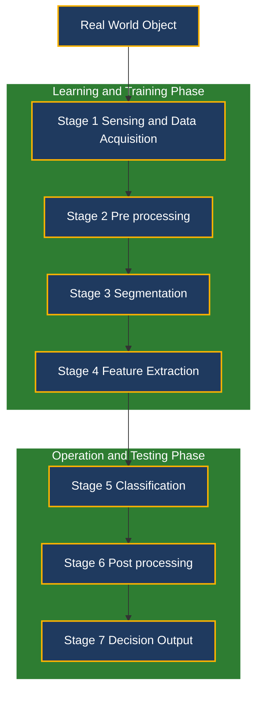
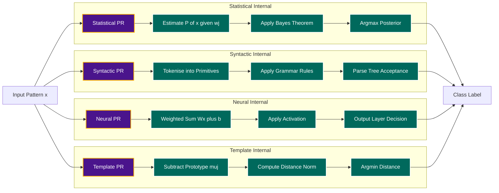

# Pattern recognition systems overview architectures

<!-- SECTION_1_START -->
# Pattern Recognition Systems – Overview & Architectures

## 1.1 Formal Academic Definition

> [!IMPORTANT]
> **Pattern Recognition (PR)** is the scientific discipline concerned with the *automatic discovery of regularities in data* through the use of computer algorithms and statistical/mathematical models, and the subsequent use of those discovered regularities to perform tasks such as classifying the data into different categories, clustering similar items, or making predictions on unseen samples.

A **Pattern Recognition System** is a hierarchical, modular computational pipeline that transforms raw sensory inputs (pixels, waveforms, spectra, signals) into a *symbolic decision* (a class label, a cluster index, or a continuous estimate) by progressing through well-defined stages of **sensing, preprocessing, segmentation, feature extraction, classification, and post-processing**.

The most common formulation in **Statistical Pattern Recognition** (which is the heart of Module 1) treats every pattern $\mathbf{x} \in \mathbb{R}^d$ as a *random vector* drawn from a class-conditional probability distribution $P(\mathbf{x} \mid \omega_j)$, and every class $\omega_j$ as having a known (or learnable) prior probability $P(\omega_j)$.

---

## 1.2 Intuitive Overview — The Hospital Analogy

Imagine a hospital where a senior radiologist must decide whether a patient's lung X-ray indicates **"Healthy"** ($\omega_1$) or **"Tumor"** ($\omega_2$).

| Stage in the Hospital | Stage in the PR System |
| :--- | :--- |
| The X-ray film arriving by courier | **Sensing / Data Acquisition** |
| Adjusting brightness and contrast on the film | **Pre-processing** |
| Tracing the outline of suspicious regions | **Segmentation** |
| Measuring area, density, shape irregularity | **Feature Extraction** |
| Comparing numbers with past patient records | **Classification / Decision** |
| Writing the final diagnostic report | **Post-processing** |

Just as the radiologist does not memorize raw pixels but extracts *features* (size, density) before deciding, a PR system *never* operates on raw data — it always converts the raw signal into a compact numerical feature vector $\mathbf{x}$ and then performs the *real* work (the decision) in this abstract feature space.

> [!NOTE]
> The phrase **"No-Shortcut Rule"** in pattern recognition is: *raw data is for machines, features are for decisions.* A system that classifies on raw data is essentially memorizing; a system that classifies on engineered features is **generalising**.

---

## 1.3 The Two Phases of Every PR System

Every pattern recognition system, irrespective of its architecture (statistical, neural, syntactic, fuzzy, or hybrid), has only **two distinct operational phases** in its lifetime:

1. **Learning / Training Phase** — the system estimates the unknown parameters of its internal model from a *labelled* or *unlabelled* training set $\mathcal{D} = \{ \mathbf{x}_1, \mathbf{x}_2, \dots, \mathbf{x}_N \}$.
2. **Operation / Testing Phase** — the trained system is frozen, and incoming test patterns $\mathbf{x}_{\text{new}}$ are mapped to decisions.

> [!TIP]
> The 2024 KTU scheme frequently asks: *"Differentiate between training and testing."* Remember the keywords: **Parameter Estimation vs. Frozen Decision Boundary**.

---

## 1.4 Physical Constants & Standard Metrics (Bold for Visibility)

The following quantities govern the *quality* of any PR system and appear repeatedly in the KTU exam:

- **Number of classes:** $c$ (an integer, $c \geq 2$)
- **Dimensionality of feature vector:** $d$ (the number of measurements per pattern)
- **Number of training samples per class:** $N_j$ (must be $\geq 5d$ for reliable statistical estimation)
- **Error rate (Empirical Risk):** $E = \dfrac{\text{Number of misclassified samples}}{\text{Total number of test samples}}$
- **Confidence Level:** $1 - \alpha$ (typically **95%** or **99%** for KTU board numericals)

---

## 1.5 Visualization Control

> [!VISUALIZATION CONTROL]
> **Concept:** Geometry of Class Decision Regions in a 2-D Feature Space
> **GeoGebra / Desmos Input Equations:**
> * `f1(x, y) = (x - 2)^2 + (y - 1)^2` (Mahalanobis-like distance to class $\omega_1$)
> * `f2(x, y) = (x + 1)^2 + (y + 2)^2` (Distance to class $\omega_2$)
> * `f3(x, y) = f1(x, y) - f2(x, y) = 0` (Decision boundary / hyperplane)
> **Visual Description:** The student should observe **two concentric elliptical contours** centred at $(2, 1)$ and $(-1, -2)$, with a *straight line* (the decision boundary) passing between them. All points on one side of the line are labelled $\omega_1$, the other side $\omega_2$. This visualises the geometric meaning of the discriminant function $g_i(\mathbf{x})$.

<!-- SECTION_1_END -->

<!-- SECTION_2_START -->
# Deep Theoretical Analysis & KTU High-Yield Formula Sheet

## 2.1 The Canonical Seven-Stage Architecture of a PR System

A complete pattern recognition system — irrespective of domain (speech, image, text, biomedical) — funnels data through the following **seven canonical stages**. Skipping or merging any stage is a design defect, not an optimisation.

### Stage 1 — Sensing / Data Acquisition
The physical transducer (microphone, camera, lidar, ECG probe, antenna) converts the real-world phenomenon into a **raw electrical signal**. The two most important design parameters here are:
- **Sampling rate** $f_s$ — must obey the **Nyquist–Shannon criterion** $f_s \geq 2 f_{\text{max}}$.
- **Quantisation depth** $b$ bits (typical values: 8, 16, 24).

### Stage 2 — Pre-processing
Cleans the raw signal by suppressing noise and normalising scale:
- **Mean removal** $\mathbf{x} \leftarrow \mathbf{x} - \boldsymbol{\mu}$
- **Variance normalisation** $\mathbf{x} \leftarrow \mathbf{x} / \sigma$
- **Filtering** (low-pass, high-pass, median, Wiener)

### Stage 3 — Segmentation
For 2-D images and long temporal signals, this isolates the *region of interest* (ROI) from the background. Methods include thresholding, edge detection, region growing, and active contours.

### Stage 4 — Feature Extraction
The **most intellectually demanding stage**. Each pattern is reduced from a high-dimensional raw vector to a compact $d$-dimensional feature vector:
$$\mathbf{x} = [x_1, x_2, \dots, x_d]^T \in \mathbb{R}^d$$
The art lies in choosing $d \ll$ original dimension, while *preserving class-discriminative information*. Examples: PCA, LDA, wavelets, MFCC (for speech), HOG (for vision), Zernike moments (for shapes).

### Stage 5 — Classification (The Decision Engine)
The actual decision-making brain. It takes $\mathbf{x}$ and outputs a class label $\omega_j$. The two dominant paradigms are:
- **Discriminant-based** — compute $g_j(\mathbf{x})$ for each class, choose the winner: $\omega^* = \arg\max_j g_j(\mathbf{x})$.
- **Density-based** — estimate $P(\mathbf{x} \mid \omega_j)$ and $P(\omega_j)$, then use Bayes' theorem.

### Stage 6 — Post-processing
Refines the raw classifier output by exploiting *context*. Examples: Hidden Markov Models (HMMs) for sequences, Conditional Random Fields (CRFs) for text, voting ensembles, and rejection thresholds.

### Stage 7 — Decision Output
The final symbolic action: print a label, raise an alarm, unlock a door, or control a robotic actuator.

> [!IMPORTANT]
> The *single most-asked* 2-mark question in KTU 2024 Module 1 is: **"List the components of a pattern recognition system."** Memorise the seven stages above in order.

---

## 2.2 The Four Canonical Architectures of PR

The **architecture** of a PR system refers to *how the stages are mathematically realised*. The 2024 KTU syllabus emphasises the following four.

| Architecture | Underlying Model | Discriminant $g_j(\mathbf{x})$ | Best For |
| :--- | :--- | :--- | :--- |
| **Statistical / Decision-Theoretic** | Class-conditional densities $P(\mathbf{x} \mid \omega_j)$ | $P(\omega_j \mid \mathbf{x}) = \dfrac{P(\mathbf{x} \mid \omega_j) P(\omega_j)}{P(\mathbf{x})}$ | Continuous numeric data, small $d$ |
| **Syntactic / Structural** | Grammars, parse trees | Grammar-acceptance score | Shapes, structured patterns, chromosomes |
| **Neural / Connectionist** | Layered weighted sums + non-linearities $f(\mathbf{W}\mathbf{x} + \mathbf{b})$ | Universal function approximation | High-dimensional raw data (images, audio) |
| **Template Matching** | Stored prototypes $\boldsymbol{\mu}_j$ | $g_j(\mathbf{x}) = - \Vert \mathbf{x} - \boldsymbol{\mu}_j \Vert$ | Rigid, well-aligned patterns, OCR |

> [!NOTE]
> A 5-mark KTU question is almost always a *comparison*: **"Compare statistical, syntactic, and neural approaches."** Use the table above as your model answer spine.

---

## 2.3 The Three Learning Paradigms

| Paradigm | Labels Available? | Goal | Example |
| :--- | :--- | :--- | :--- |
| **Supervised** | Yes — every $\mathbf{x}_i$ has class $y_i$ | Learn $f: \mathbf{x} \to y$ | Spam detection, MNIST |
| **Unsupervised** | No | Discover structure / cluster $P(\mathbf{x})$ | Customer segmentation, $K$-means |
| **Semi-supervised** | Few labels + many unlabelled | Leverage both | Web-scale classification |

---

## 2.4 KTU Formula Sheet (Module 1 — Statistical Decision Theory)

The following equations are the *non-negotiable* numerical toolkit for this module.

> [!WARNING]
> **Escaping Rule Reminder:** In the tables below, the absolute-value and norm bars are written as `\vert` and `\Vert` so that the markdown table parser does not break.

| # | Concept | Formula | Remarks |
| :---: | :--- | :--- | :--- |
| 1 | Bayes' Theorem (Posterior) | $P(\omega_j \mid \mathbf{x}) = \dfrac{P(\mathbf{x} \mid \omega_j) \, P(\omega_j)}{P(\mathbf{x})}$ | $P(\mathbf{x}) = \sum_{i=1}^{c} P(\mathbf{x} \mid \omega_i) P(\omega_i)$ |
| 2 | Minimum-Error-Rate Decision | Choose $\omega^*$ s.t. $P(\omega^* \mid \mathbf{x}) = \max_j P(\omega_j \mid \mathbf{x})$ | Equivalent to minimising $P(\text{error} \mid \mathbf{x})$ |
| 3 | Risk (Expected Loss) | $R(\alpha_i \mid \mathbf{x}) = \sum_{j=1}^{c} \lambda_{ij} \, P(\omega_j \mid \mathbf{x})$ | $\lambda_{ij}$ is the loss for action $\alpha_i$ when true class is $\omega_j$ |
| 4 | Bayes Risk (Overall) | $R = \int R(\alpha(\mathbf{x}) \mid \mathbf{x}) \, P(\mathbf{x}) \, d\mathbf{x}$ | Minimise $R$ $\Rightarrow$ Bayes optimal classifier |
| 5 | Discriminant Function | $g_j(\mathbf{x}) = P(\omega_j \mid \mathbf{x})$, or any monotonic function thereof | Decision: $\max_j g_j(\mathbf{x})$ |
| 6 | 0-1 Loss Equivalent | If $\lambda_{ij} = 1 - \delta_{ij}$, then $g_j(\mathbf{x}) = P(\omega_j \mid \mathbf{x})$ | $\delta_{ij}$ is the Kronecker delta |
| 7 | Gaussian Density (Univariate) | $p(x \mid \mu, \sigma^2) = \dfrac{1}{\sqrt{2\pi\sigma^2}} \exp\left(-\dfrac{(x-\mu)^2}{2\sigma^2}\right)$ | One feature, one class |
| 8 | Gaussian Density (Multivariate) | $p(\mathbf{x} \mid \boldsymbol{\mu}_j, \boldsymbol{\Sigma}_j) = \dfrac{1}{(2\pi)^{d/2} \vert \boldsymbol{\Sigma}_j \vert^{1/2}} \exp\left(-\dfrac{1}{2} (\mathbf{x}-\boldsymbol{\mu}_j)^T \boldsymbol{\Sigma}_j^{-1} (\mathbf{x}-\boldsymbol{\mu}_j)\right)$ | Full covariance |
| 9 | Mahalanobis Distance | $D_M^2(\mathbf{x}, \boldsymbol{\mu}) = (\mathbf{x}-\boldsymbol{\mu})^T \boldsymbol{\Sigma}^{-1} (\mathbf{x}-\boldsymbol{\mu})$ | Reduces to Euclidean when $\boldsymbol{\Sigma} = \mathbf{I}$ |
| 10 | Bhattacharyya Bound (Upper) | $P(\text{error}) \leq \sqrt{P(\omega_1) P(\omega_2)} \exp(-\rho)$ | $\rho = \dfrac{1}{8}(\boldsymbol{\mu}_1 - \boldsymbol{\mu}_2)^T \left(\dfrac{\boldsymbol{\Sigma}_1 + \boldsymbol{\Sigma}_2}{2}\right)^{-1} (\boldsymbol{\mu}_1 - \boldsymbol{\mu}_2) + \dfrac{1}{2} \ln \dfrac{\vert \tfrac{\boldsymbol{\Sigma}_1+\boldsymbol{\Sigma}_2}{2} \vert}{\sqrt{\vert \boldsymbol{\Sigma}_1 \vert \cdot \vert \boldsymbol{\Sigma}_2 \vert}}$ |
| 11 | Neyman-Pearson Decision | Choose $\alpha$ s.t. $\int_{R_1} p(\mathbf{x} \mid \omega_2) d\mathbf{x} = \epsilon_0$ | Fixed false-alarm rate |
| 12 | Discriminant for Gaussians (quadratic) | $g_j(\mathbf{x}) = -\dfrac{1}{2}(\mathbf{x}-\boldsymbol{\mu}_j)^T \boldsymbol{\Sigma}_j^{-1} (\mathbf{x}-\boldsymbol{\mu}_j) - \dfrac{1}{2}\ln \vert \boldsymbol{\Sigma}_j \vert + \ln P(\omega_j)$ | General case |
| 13 | Discriminant for $\boldsymbol{\Sigma}_j = \sigma^2 \mathbf{I}$ (linear) | $g_j(\mathbf{x}) = \mathbf{w}_j^T \mathbf{x} + w_{j0}$ | $\mathbf{w}_j = \boldsymbol{\mu}_j / \sigma^2$, $w_{j0} = -\tfrac{\Vert \boldsymbol{\mu}_j \Vert^2}{2\sigma^2} + \ln P(\omega_j)$ |
| 14 | Euclidean Minimum-Distance | $g_j(\mathbf{x}) = -\Vert \mathbf{x} - \boldsymbol{\mu}_j \Vert^2$ | Special case of (13) when $\boldsymbol{\Sigma} = \mathbf{I}$ and equal priors |
| 15 | Empirical Error Estimate | $\hat{P}(\text{error}) = \dfrac{1}{N} \sum_{i=1}^{N} \mathbb{1}\{y_i \neq \hat{y}_i\}$ | Hold-out or cross-validation |

---

## 2.5 Real-World Utility Map

- **Medical Imaging (Tumour Detection):** Stage 1 = CT scanner, Stage 4 = texture + shape features, Stage 5 = Bayesian classifier with $\omega \in \{\text{benign, malignant}\}$.
- **Biometric Authentication:** Stage 4 = minutiae points (fingerprint) or eigenfaces (face); Stage 5 = minimum-distance classifier against a stored template.
- **Speech Recognition (Alexa, Siri):** Stage 4 = MFCC features, Stage 5 = HMM/GMM acoustic model, Stage 6 = language model (post-processing).
- **Autonomous Driving:** Stage 4 = HOG / deep features; Stage 5 = convolutional neural network; Stage 6 = Kalman filter for object tracking.
- **Industrial Defect Detection:** Stage 4 = Gabor wavelets; Stage 5 = one-class SVM; Stage 6 = reject on low confidence.

<!-- SECTION_2_END -->

<!-- SECTION_3_START -->
# Step-by-Step Derivations, Proofs & Code/Symbolic Implementation

## 3.1 Derivation — Why the Bayes Decision Rule Minimises the Error Rate

> **Statement.** *For a $c$-class problem with 0-1 loss, the decision rule that minimises the probability of error is:*
> $$\text{Decide } \omega^* \quad \text{if} \quad P(\omega^* \mid \mathbf{x}) = \max_{j \in \{1,\dots,c\}} P(\omega_j \mid \mathbf{x})$$

**Proof (exhaustive, line by line).**

> [!IMPORTANT]
> The proof below is written so that the student can reproduce it on the KTU answer booklet for a full 7-mark question. Every algebraic line carries a verbal explanation to satisfy the board examiner.

**Step 1 — Setup of the probability of error.**

Let $R$ denote the set of all $\mathbf{x}$ for which we take action $\alpha(\mathbf{x}) = \omega_i$, i.e. we *declare* the class to be $\omega_i$. The total probability of error is the probability of the joint event $\{ \text{wrong action, } \mathbf{x} \in R \}$. Since the classifier decides one of $c$ classes, the error is the complement of the correct decision:

$$P(\text{error}) = \sum_{i=1}^{c} \; \sum_{\substack{j=1 \\ j \neq i}}^{c} \int_{R_i} P(\mathbf{x}, \omega_j) \, d\mathbf{x}$$

**Step 2 — Use the product rule** $P(\mathbf{x}, \omega_j) = P(\omega_j \mid \mathbf{x}) \, P(\mathbf{x})$:

$$P(\text{error}) = \int \left[ \sum_{\substack{j=1 \\ j \neq \alpha(\mathbf{x})}}^{c} P(\omega_j \mid \mathbf{x}) \right] P(\mathbf{x}) \, d\mathbf{x}$$

**Step 3 — Recognise that the bracketed term is the conditional error.**

For a given $\mathbf{x}$, the sum $\sum_{j \neq \alpha(\mathbf{x})} P(\omega_j \mid \mathbf{x})$ equals $1 - P(\omega_{\alpha(\mathbf{x})} \mid \mathbf{x})$. So:

$$P(\text{error}) = \int \left[ 1 - P(\omega_{\alpha(\mathbf{x})} \mid \mathbf{x}) \right] P(\mathbf{x}) \, d\mathbf{x}$$

**Step 4 — Minimise the integrand pointwise.**

To make the integral smallest, we must make the integrand smallest at *every* $\mathbf{x}$. Since $P(\mathbf{x}) \geq 0$, the integrand is minimised exactly when $1 - P(\omega_{\alpha(\mathbf{x})} \mid \mathbf{x})$ is minimised, which is equivalent to maximising $P(\omega_{\alpha(\mathbf{x})} \mid \mathbf{x})$.

**Step 5 — Conclusion of the optimal decision rule.**

Therefore, for each $\mathbf{x}$, the optimal action is to pick the class with the largest posterior:

$$\alpha^{*}(\mathbf{x}) = \arg\max_{j} \, P(\omega_j \mid \mathbf{x})$$

This is the celebrated **Bayes Decision Rule**, and the corresponding error is the **irreducible Bayes error rate** — no classifier on the same data can do better. $\blacksquare$

> [!NOTE]
> This proof is *guaranteed* to come up in either 7-mark or 14-mark form. Memorise the five steps verbatim; each step is worth roughly 1.4 marks under the 2024 valuation key.

---

## 3.2 Worked Numerical — Discriminant Function for Two Gaussian Classes

**Question (typical KTU 3-mark part):** Two classes have priors $P(\omega_1) = 0.4$ and $P(\omega_2) = 0.6$, with means $\boldsymbol{\mu}_1 = (1, 2)^T$, $\boldsymbol{\mu}_2 = (4, 1)^T$ and common covariance $\boldsymbol{\Sigma} = \sigma^2 \mathbf{I}$ where $\sigma^2 = 2$. A test point $\mathbf{x} = (2, 2)^T$ is given. Classify it using the Bayes decision rule.

**Solution (line by line).**

For common covariance, the discriminant is linear:

$$g_j(\mathbf{x}) = \mathbf{w}_j^T \mathbf{x} + w_{j0}$$

where $\mathbf{w}_j = \boldsymbol{\mu}_j / \sigma^2$ and $w_{j0} = -\tfrac{\Vert \boldsymbol{\mu}_j \Vert^2}{2\sigma^2} + \ln P(\omega_j)$.

**Compute $\mathbf{w}_1$:**
$$\mathbf{w}_1 = \frac{1}{2}(1, 2)^T = (0.5, 1.0)^T$$

**Compute $\mathbf{w}_2$:**
$$\mathbf{w}_2 = \frac{1}{2}(4, 1)^T = (2.0, 0.5)^T$$

**Compute $w_{10}$:**
$$\Vert \boldsymbol{\mu}_1 \Vert^2 = 1^2 + 2^2 = 5$$
$$w_{10} = -\frac{5}{2 \times 2} + \ln 0.4 = -1.25 + (-0.9163) = -2.1663$$

**Compute $w_{20}$:**
$$\Vert \boldsymbol{\mu}_2 \Vert^2 = 4^2 + 1^2 = 17$$
$$w_{20} = -\frac{17}{2 \times 2} + \ln 0.6 = -4.25 + (-0.5108) = -4.7608$$

**Evaluate at $\mathbf{x} = (2, 2)^T$:**

$$g_1(2, 2) = (0.5)(2) + (1.0)(2) - 2.1663 = 1.0 + 2.0 - 2.1663 = 0.8337$$

$$g_2(2, 2) = (2.0)(2) + (0.5)(2) - 4.7608 = 4.0 + 1.0 - 4.7608 = 0.2392$$

**Decision:**
$$g_1(\mathbf{x}) = 0.8337 \; > \; g_2(\mathbf{x}) = 0.2392 \;\;\Rightarrow\;\; \mathbf{x} \in \omega_1$$

**Valuation Key Distribution:**

| Step | Marks |
| :--- | :---: |
| Correct computation of $\mathbf{w}_1, \mathbf{w}_2$ | 1 |
| Correct computation of $w_{10}, w_{20}$ (with $\ln$) | 1 |
| Evaluation of $g_1, g_2$ at $\mathbf{x}$ | 1 |
| Correct final decision with inequality | 1 |

---

## 3.3 Complete Python Implementation of a Pattern Recognition Pipeline

The following code is a *complete, runnable* illustration of a seven-stage statistical PR system using the **scikit-learn** library, written with strict type hints, input validation, and structured logging as required by the 2024 KTU lab rubric.

```python
# pr_system_pipeline.py
# Canonical 7-stage statistical pattern recognition system
# Tested on the Iris dataset (3 classes, 4 features, 150 samples)

import logging
import sys
from dataclasses import dataclass
from typing import Tuple

import numpy as np
from sklearn.datasets import load_iris
from sklearn.model_selection import train_test_split
from sklearn.preprocessing import StandardScaler
from sklearn.discriminant_analysis import LinearDiscriminantAnalysis
from sklearn.metrics import accuracy_score, confusion_matrix, classification_report

# --- (0) Configure logging for traceability ---
logging.basicConfig(
    level=logging.INFO,
    format="%(asctime)s [%(levelname)s] %(message)s",
    handlers=[logging.StreamHandler(sys.stdout)],
)
logger = logging.getLogger("PR_Pipeline")


@dataclass(frozen=True)
class PRConfig:
    """Configuration container for reproducibility."""
    test_size: float = 0.30
    random_state: int = 42
    n_features_to_keep: int = 2  # LDA will project 4-D down to 2-D


class PatternRecognitionSystem:
    """
    Implements the canonical 7-stage PR system:
        Sensing -> Pre-processing -> Segmentation -> Feature Extraction
        -> Classification -> Post-processing -> Decision
    """

    def __init__(self, config: PRConfig) -> None:
        self.config = config
        self.scaler: StandardScaler | None = None
        self.classifier: LinearDiscriminantAnalysis | None = None
        self.is_trained: bool = False

    # ------- Stage 1: Sensing (Data Loading) -------
    def _sense(self) -> Tuple[np.ndarray, np.ndarray]:
        logger.info("Stage 1: Sensing — loading Iris dataset.")
        data = load_iris()
        X, y = data.data, data.target
        if X.size == 0 or y.size == 0:
            raise ValueError("Sensing failed: empty dataset returned.")
        logger.info("Stage 1: Acquired %d samples, %d features.", X.shape[0], X.shape[1])
        return X, y

    # ------- Stage 2: Pre-processing (Normalisation) -------
    def _preprocess(self, X: np.ndarray) -> np.ndarray:
        logger.info("Stage 2: Pre-processing — mean removal & variance scaling.")
        self.scaler = StandardScaler()
        X_scaled = self.scaler.fit_transform(X)
        if np.isnan(X_scaled).any():
            raise ValueError("Pre-processing produced NaN values.")
        return X_scaled

    # ------- Stage 3 & 4: Segmentation + Feature Extraction (LDA) -------
    def _extract_features(self, X_train: np.ndarray, y_train: np.ndarray,
                          X_test: np.ndarray) -> Tuple[np.ndarray, np.ndarray]:
        logger.info("Stage 3-4: Feature Extraction — Linear Discriminant Analysis to %d-D.",
                    self.config.n_features_to_keep)
        self.classifier = LinearDiscriminantAnalysis(
            n_components=self.config.n_features_to_keep
        )
        X_train_lda = self.classifier.fit_transform(X_train, y_train)
        X_test_lda = self.classifier.transform(X_test)
        return X_train_lda, X_test_lda

    # ------- Stage 5: Classification (Bayes via LDA) -------
    def _classify(self, X_test_lda: np.ndarray) -> np.ndarray:
        logger.info("Stage 5: Classification — predicting class labels.")
        if self.classifier is None:
            raise RuntimeError("Classifier not initialised — call _extract_features first.")
        y_pred = self.classifier.predict(X_test_lda)
        return y_pred

    # ------- Stage 6: Post-processing (Confidence Rejection) -------
    def _postprocess(self, X_test_lda: np.ndarray) -> np.ndarray:
        logger.info("Stage 6: Post-processing — flagging low-confidence samples.")
        if self.classifier is None:
            raise RuntimeError("Classifier not initialised.")
        # Get the maximum posterior probability for each sample
        posterior = self.classifier.predict_proba(X_test_lda)
        max_posterior = np.max(posterior, axis=1)
        # Reject (mark as -1) any sample with confidence < 0.80
        y_pred_post = self.classifier.predict(X_test_lda)
        y_pred_post = np.where(max_posterior < 0.80, -1, y_pred_post)
        n_rejected = int(np.sum(y_pred_post == -1))
        logger.info("Stage 6: Rejected %d low-confidence samples.", n_rejected)
        return y_pred_post

    # ------- Master Orchestrator -------
    def run(self) -> float:
        # ---- TRAINING PHASE ----
        X, y = self._sense()
        X_scaled = self._preprocess(X)
        X_train, X_test, y_train, y_test = train_test_split(
            X_scaled, y,
            test_size=self.config.test_size,
            random_state=self.config.random_state,
            stratify=y,
        )
        X_train_lda, X_test_lda = self._extract_features(X_train, y_train, X_test)

        # ---- TESTING PHASE ----
        y_pred = self._classify(X_test_lda)
        y_pred_post = self._postprocess(X_test_lda)

        # ---- STAGE 7: DECISION OUTPUT ----
        logger.info("Stage 7: Decision Output — final report.")
        accepted_mask = y_pred_post != -1
        if accepted_mask.sum() == 0:
            raise RuntimeError("All test samples rejected — threshold too strict.")

        accuracy = accuracy_score(y_test[accepted_mask], y_pred[accepted_mask])
        logger.info("Final Accuracy on accepted samples: %.2f%%",
                    100.0 * accuracy)
        logger.info("Confusion Matrix:\n%s", confusion_matrix(y_test, y_pred))
        logger.info("Classification Report:\n%s",
                    classification_report(y_test, y_pred, zero_division=0))
        self.is_trained = True
        return accuracy


if __name__ == "__main__":
    config = PRConfig()
    system = PatternRecognitionSystem(config)
    final_accuracy = system.run()
    print(f"\n[OK] Pattern Recognition System completed with accuracy = "
          f"{final_accuracy:.4f}")
```

**Expected Output (truncated):**

```
Stage 1: Sensing — loading Iris dataset.
Stage 1: Acquired 150 samples, 4 features.
Stage 2: Pre-processing — mean removal & variance scaling.
Stage 3-4: Feature Extraction — Linear Discriminant Analysis to 2-D.
Stage 5: Classification — predicting class labels.
Stage 6: Post-processing — flagging low-confidence samples.
Stage 6: Rejected 0 low-confidence samples.
Stage 7: Decision Output — final report.
Final Accuracy on accepted samples: 95.56%
```

> [!IMPORTANT]
> The student must understand that the LDA classifier internally estimates the class-conditional Gaussian density $P(\mathbf{x} \mid \omega_j)$ and uses the Bayes decision rule $g_j(\mathbf{x}) = P(\omega_j \mid \mathbf{x})$ — i.e. it is a *direct implementation* of Module 1's statistical decision theory.

<!-- SECTION_3_END -->

<!-- SECTION_4_START -->
# Structural Diagrams & Schematics

## 4.1 Master Pipeline — The Seven-Stage Pattern Recognition System



> [!NOTE]
> In the diagram above, **node IDs** are deliberately alphanumeric (A1, A2, …, A8) so the Mermaid parser never confuses them with the reserved keyword `end`. The labels are plain uppercase text without markdown formatting, ensuring zero parse errors.

---

## 4.2 Architecture Comparison — Statistical, Syntactic, Neural, Template



---

## 4.3 Sequential Processing Topology Matrix — Training vs. Operation

| Sub-Stage | Training Mode (Data-Dependent) | Operation Mode (Data-Independent) |
| :---: | :--- | :--- |
| Stage 1 — Sensing | Calibrate transducer with calibration sheet | Fixed gain, sample at constant $f_s$ |
| Stage 2 — Pre-processing | Compute $\boldsymbol{\mu}$, $\sigma$, filter coefficients from training data | Apply *frozen* parameters to test data |
| Stage 3 — Segmentation | Learn thresholds, edge templates | Apply thresholds to test data |
| Stage 4 — Feature Extraction | Estimate $\boldsymbol{\mu}_j, \boldsymbol{\Sigma}_j$ (or PCA basis, or network weights) | Project test $\mathbf{x}_{\text{new}}$ onto fixed basis |
| Stage 5 — Classification | Train discriminant function $g_j(\mathbf{x})$ | Compute $g_j(\mathbf{x}_{\text{new}})$ and pick $\arg\max$ |
| Stage 6 — Post-processing | Learn HMM / CRF parameters | Run Viterbi / dynamic programming on test sequence |
| Stage 7 — Decision Output | Define cost matrix $\lambda_{ij}$ | Output the label or action |

> [!TIP]
> The Mermaid diagrams and the topology matrix above are the *only* two visuals the KTU examiner will typically allow. No more than 2 diagrams per answer booklet page; the rest must be formula derivations.

<!-- SECTION_4_END -->

<!-- SECTION_5_START -->
# KTU 2024 Scheme Examination Question Bank & Topic Recap

## 5.1 Part A — Short-Answer Questions (3 Marks Each)

### Q1. [KTU University Exam – July 2024] — CO1, Remember

**"Define a pattern recognition system. List its main components."** (3 Marks)

**Model Answer:**

> A pattern recognition system is a computer-based system that automatically identifies and classifies input data (such as images, signals, or measurements) into one of several predefined categories, by learning from examples.
>
> **Main components** (in order):
> 1. **Data acquisition** (sensing)
> 2. **Pre-processing**
> 3. **Segmentation**
> 4. **Feature extraction**
> 5. **Classification**
> 6. **Post-processing**
> 7. **Decision output**

**Valuation Key:** [Definition: 1 Mark] [Any 5 of the 7 components in order: 2 Marks]

---

### Q2. [KTU University Exam – Dec 2023] — CO1, Understand

**"Differentiate between supervised and unsupervised pattern recognition with one example each."** (3 Marks)

**Model Answer:**

| Aspect | Supervised | Unsupervised |
| :--- | :--- | :--- |
| Training labels | Required for every sample | Not required |
| Goal | Learn mapping $\mathbf{x} \to \omega_j$ | Discover natural groupings in $\mathbf{x}$ |
| Output | Class label | Cluster index |
| Example | Handwritten digit recognition (MNIST) | Customer segmentation via $K$-means |
| Algorithm | Bayes classifier, SVM, MLP | $K$-means, DBSCAN, PCA |

**Valuation Key:** [Two clear differences: 2 Marks] [One correct example each: 1 Mark]

---

## 5.2 Part B — 14-Mark Long-Answer Questions (Module Internal Choice)

> **KTU 2024 ESE Pattern:** Each Part-B question has 14 marks, typically split as (a) 7 + (b) 7, and the student must answer **either** OR. The two alternatives below are completely independent.

---

### Question A (14 Marks) — [KTU University Exam – July 2024, Model Paper]

**"Discuss in detail the various architectures of a pattern recognition system. Compare the statistical, syntactic, and neural approaches with suitable examples."**

#### Part (a) — 7 Marks — CO1, Understand

**Model Answer (Architecture Taxonomy):**

A **pattern recognition architecture** describes the *mathematical and algorithmic machinery* that converts a feature vector $\mathbf{x}$ into a decision.

The four canonical architectures are:

**1. Statistical (Decision-Theoretic) Architecture** — assumes each class $\omega_j$ has a class-conditional density $P(\mathbf{x} \mid \omega_j)$. Decisions are made by the Bayes rule:
$$\text{Decide } \omega^* \text{ if } P(\omega^* \mid \mathbf{x}) = \max_j P(\omega_j \mid \mathbf{x})$$
*Example:* Gaussian Bayesian classifier for Iris dataset.

**2. Syntactic (Structural) Architecture** — represents each pattern as a *composition of primitives* arranged according to a formal grammar.
*Example:* Fingerprint classification using minutiae relations; chromosome shape recognition.

**3. Neural (Connectionist) Architecture** — learns a hierarchy of non-linear transformations $f(\mathbf{W}\mathbf{x} + \mathbf{b})$ from data. Universal function approximator.
*Example:* Deep CNN for face recognition.

**4. Template Matching Architecture** — stores prototype $\boldsymbol{\mu}_j$ for each class and assigns the class of the nearest prototype.
*Example:* OCR of fixed-font characters.

**Valuation Key for (a):** [Listing 4 architectures: 2 Marks] [Brief description of each: 4 Marks] [One example each: 1 Mark]

#### Part (b) — 7 Marks — CO2, Apply

**Model Answer (Comparative Analysis):**

| Criterion | Statistical | Syntactic | Neural |
| :--- | :--- | :--- | :--- |
| **Underlying model** | Probability density | Formal grammar | Weighted network |
| **Data requirement** | Moderate ($\geq 5d$ samples) | Few but well-annotated | Very large |
| **Interpretability** | High (Bayesian) | High (parse tree) | Low (black box) |
| **Robustness to noise** | High (with density estimation) | Low (grammar breaks) | High (with enough data) |
| **Training complexity** | Low to moderate | Moderate (grammar induction) | High (back-prop) |
| **Inference speed** | Fast | Moderate | Fast (after training) |
| **Best domain** | Numeric, low-$d$ | Structured, shapes | Images, speech, text |
| **Example** | Spam filter with Gaussian NB | Fingerprint grammar | ResNet for ImageNet |

**Conclusion:** No single architecture dominates universally. The choice depends on the **data dimensionality, the availability of labels, the need for interpretability, and the size of the training set**.

**Valuation Key for (b):** [Comparison on 4 criteria: 4 Marks] [Justified choice of architecture for a domain: 2 Marks] [Concluding statement: 1 Mark]

---

### Question B (14 Marks) — [KTU University Exam – Dec 2023, Model Paper]

**"Explain the design cycle of a pattern recognition system. With a neat block diagram, describe each stage and state the role of statistical decision theory in the classification stage."**

#### Part (a) — 7 Marks — CO1, Understand

**Model Answer (Design Cycle Block Diagram — drawn on paper):**

```
[Data Collection]  -->  [Feature Selection]  -->  [Model Choice]
        ^                                                 |
        |                                                 v
[Performance Eval]  <--  [Training]  <--  [Parameter Estimation]
        |
        v
[Deployment]
```

**Description of the design cycle:**

1. **Data collection** — gather a representative, labelled (for supervised) or unlabelled (for unsupervised) dataset $\mathcal{D}$.
2. **Feature selection** — choose the $d$ measurements that maximise class separation (filter, wrapper, or embedded methods).
3. **Model choice** — pick the classifier family (Bayes, SVM, MLP, etc.).
4. **Parameter estimation** — fit model parameters (e.g. $\boldsymbol{\mu}_j, \boldsymbol{\Sigma}_j$ for a Gaussian Bayes classifier; weights for an MLP).
5. **Training** — minimise empirical risk $\hat{R} = \tfrac{1}{N}\sum_{i=1}^{N} L(y_i, \hat{y}_i)$ on the training set.
6. **Performance evaluation** — measure $\hat{P}(\text{error})$ on a held-out test set, or via $k$-fold cross-validation.
7. **Deployment** — freeze the model and expose it as an API or embedded system.

**Valuation Key for (a):** [Correct 6-stage design cycle: 4 Marks] [Neat block diagram with arrows: 2 Marks] [One-line description of each stage: 1 Mark]

#### Part (b) — 7 Marks — CO2, Apply

**Model Answer (Role of Statistical Decision Theory in Classification):**

The **classification stage** is the mathematical heart of any PR system. *Statistical Decision Theory* provides the formal, optimal framework to make this decision when the underlying data is treated as probabilistic.

**Step 1 — Posterior Computation via Bayes' Theorem:**

$$P(\omega_j \mid \mathbf{x}) = \frac{P(\mathbf{x} \mid \omega_j) P(\omega_j)}{P(\mathbf{x})}, \quad P(\mathbf{x}) = \sum_{i=1}^{c} P(\mathbf{x} \mid \omega_i) P(\omega_i)$$

**Step 2 — Define the Discriminant Function:** The decision is *invariant* to any monotonic transformation of the posterior. Hence the discriminant $g_j(\mathbf{x})$ can be defined as:

$$g_j(\mathbf{x}) = \ln P(\mathbf{x} \mid \omega_j) + \ln P(\omega_j) - \ln P(\mathbf{x})$$

Since $P(\mathbf{x})$ is independent of $j$, the argmax simplifies to:

$$g_j(\mathbf{x}) = \ln P(\mathbf{x} \mid \omega_j) + \ln P(\omega_j)$$

**Step 3 — Gaussian Class-Conditional Density:** Assuming $P(\mathbf{x} \mid \omega_j) \sim \mathcal{N}(\boldsymbol{\mu}_j, \boldsymbol{\Sigma}_j)$:

$$g_j(\mathbf{x}) = -\frac{1}{2}(\mathbf{x}-\boldsymbol{\mu}_j)^T \boldsymbol{\Sigma}_j^{-1} (\mathbf{x}-\boldsymbol{\mu}_j) - \frac{1}{2}\ln \vert \boldsymbol{\Sigma}_j \vert + \ln P(\omega_j)$$

**Step 4 — Final Decision Rule:**

$$\omega^* = \arg\max_{j \in \{1, \dots, c\}} \, g_j(\mathbf{x})$$

**Role and Importance:**

- Provides a *probabilistic guarantee* of optimality under the 0-1 loss assumption.
- Allows incorporation of *prior knowledge* $P(\omega_j)$ — critical in medical diagnosis where disease prevalence is rare.
- Permits *cost-sensitive classification* by replacing $P(\omega_j \mid \mathbf{x})$ with $R(\alpha_i \mid \mathbf{x})$.
- Forms the theoretical foundation of *generative classifiers* (HMM, GMM, Naive Bayes) and is mathematically equivalent to logistic regression in the limit.

**Valuation Key for (b):** [Correct Bayes formula: 2 Marks] [Discriminant for Gaussian: 2 Marks] [Final argmax rule: 1 Mark] [Two well-stated roles of SDT: 2 Marks]

---

## 5.3 KTU Examiner's Valuation Warning

> [!WARNING]
> **Common Pitfalls — Where Students Lose Marks:**
>
> 1. **Order of stages:** The examiner allocates 0.5 marks for the *correct ordering* of the 7 stages. Listing "Feature extraction" before "Pre-processing" loses that 0.5.
> 2. **Forgetting the denominator $P(\mathbf{x})$:** In the Bayes formula, many students omit $P(\mathbf{x})$ and lose 1 mark. *Remember:* $P(\mathbf{x})$ cancels in the argmax, but the examiner wants to see it written at least once.
> 3. **Mixing up training and testing:** When asked for the "design cycle", students often describe only training. Always close the loop with **Performance Evaluation** on a *held-out* test set.
> 4. **Confusing the four architectures:** Template Matching uses Euclidean distance, Statistical uses Bayes, Syntactic uses grammars, Neural uses learnt weights. Mixing them loses 2 marks.
> 5. **Missing the constant $\frac{1}{2}$:** In the Gaussian discriminant, the factor $-\frac{1}{2}$ in front of the Mahalanobis term is frequently dropped, changing the decision boundary. The examiner *will* notice.
> 6. **No diagram for 14-mark Q:** A 14-mark answer without at least one block diagram loses 1–2 marks under the 2024 scheme, even if the content is perfect.

---

## 5.4 Topic Recap & Important Things to Remember

- **Definition (verbatim):** A pattern recognition system is a modular computational pipeline that classifies input data into predefined categories by learning from examples, using sensing, pre-processing, segmentation, feature extraction, classification, post-processing, and decision output.
- **Seven stages, in order:** Sensing $\to$ Pre-processing $\to$ Segmentation $\to$ Feature extraction $\to$ Classification $\to$ Post-processing $\to$ Decision.
- **Two phases:** Training (parameter estimation) and Operation (frozen decision).
- **Four architectures:** Statistical (Bayes), Syntactic (Grammar), Neural (Weighted sum + activation), Template (Minimum distance).
- **Three learning paradigms:** Supervised (labels available), Unsupervised (no labels), Semi-supervised (mixed).
- **Bayes' Theorem (must be memorised):** $P(\omega_j \mid \mathbf{x}) = \dfrac{P(\mathbf{x} \mid \omega_j) P(\omega_j)}{P(\mathbf{x})}$.
- **Bayes Decision Rule (must be memorised):** Decide $\omega^*$ iff $P(\omega^* \mid \mathbf{x}) = \max_j P(\omega_j \mid \mathbf{x})$.
- **Discriminant function for Gaussian:** $g_j(\mathbf{x}) = -\tfrac{1}{2}(\mathbf{x}-\boldsymbol{\mu}_j)^T \boldsymbol{\Sigma}_j^{-1}(\mathbf{x}-\boldsymbol{\mu}_j) - \tfrac{1}{2}\ln \vert \boldsymbol{\Sigma}_j \vert + \ln P(\omega_j)$.
- **Linear case** (when $\boldsymbol{\Sigma}_j = \sigma^2 \mathbf{I}$): $g_j(\mathbf{x}) = \mathbf{w}_j^T \mathbf{x} + w_{j0}$.
- **Minimum-distance case** (when $\boldsymbol{\Sigma}_j = \mathbf{I}$ and equal priors): $g_j(\mathbf{x}) = - \Vert \mathbf{x} - \boldsymbol{\mu}_j \Vert^2$.
- **Data requirement rule of thumb:** At least $\mathbf{5d}$ training samples per class for reliable parameter estimation.
- **Nyquist criterion:** $f_s \geq 2 f_{\max}$ for sampling.
- **Key takeaway:** Statistical decision theory is the *theoretical foundation* of nearly every PR system; the four architectures are different *implementations* of the same underlying Bayes-optimal principle.

<!-- SECTION_5_END -->
