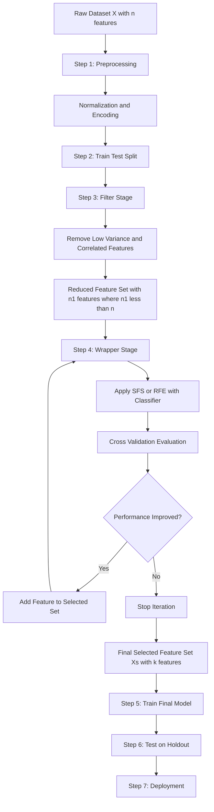
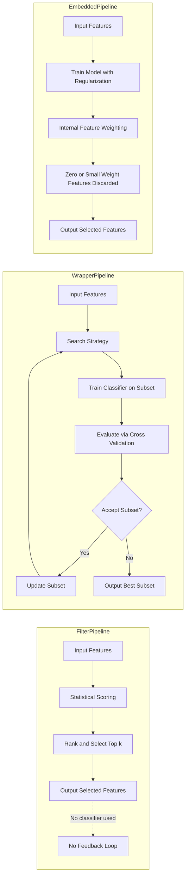
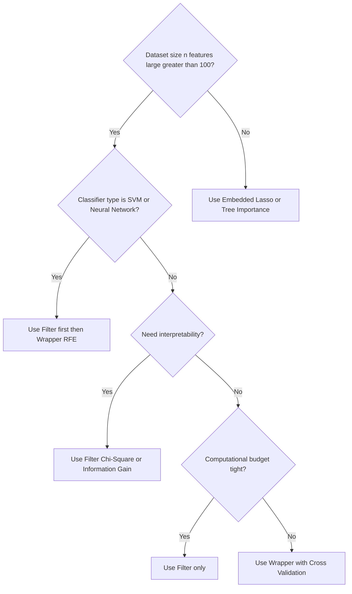
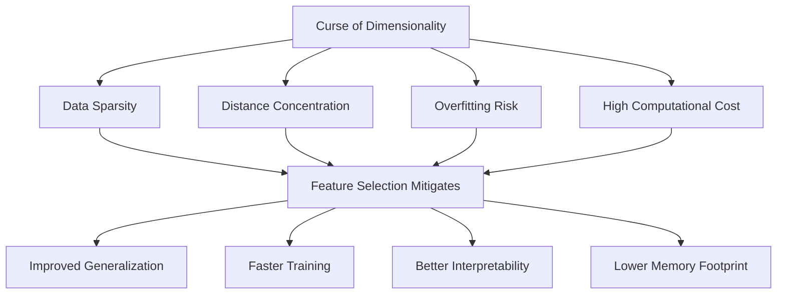

# Feature Selection - Importance of feature selection, Techniques for feature

<!-- SECTION_1_START -->

# Feature Selection in Pattern Recognition

## 1.1 Formal Academic Definition

> [!IMPORTANT]
> **Feature Selection** is the process of identifying and selecting a subset of relevant features (variables, predictors) from a larger set of available features in a dataset, with the primary goal of building robust, generalizable, and computationally efficient pattern recognition models. It is formally defined as: Given an original feature set $X = \{x_1, x_2, \ldots, x_n\}$, find a subset $X_s \subset X$ where $X_s = \{x_{i_1}, x_{i_2}, \ldots, x_{i_k}\}$ with $k < n$, such that the selected subset maximizes a defined criterion function $J(X_s)$ representing predictive performance, model interpretability, or both.

In the context of **KTU PECST412 (Pattern Recognition)**, feature selection is positioned as a critical pre-processing and model-design stage within the classical pattern recognition pipeline: **Data Acquisition → Feature Extraction → Feature Selection → Classification/Clustering → Evaluation**.

### 1.2 Conceptual Analogy & Intuition

> [!NOTE]
> **Analogy: The Medical Diagnostic Analogy**
> Imagine a doctor diagnosing a disease. Instead of running **all 500 available blood tests** (expensive, time-consuming, and noisy), the doctor selects only **10–15 critical biomarkers** (e.g., glucose, cholesterol, BP, age, BMI) that genuinely correlate with the disease. The remaining 485 tests are irrelevant or redundant. Feature selection does the same thing for a learning algorithm — it filters out "noise tests" and keeps only the "informative biomarkers."

**Geometric Intuition**: In a high-dimensional feature space, data points become sparse (the famous *Curse of Dimensionality*). Relevant features form a tight, discriminative cluster, while irrelevant features disperse the points randomly across dimensions. Feature selection shrinks the space so that **same-class points cluster together** and **different-class points separate cleanly**.

### 1.3 Why Feature Selection is a Mandatory Step

> [!TIP]
> **Industry Reality**: In real-world ML pipelines (Kaggle competitions, production AI at Google/Amazon), practitioners report that **80% of model performance gains** come from better feature engineering and selection — not from algorithm choice.

Key motivations include:

- **Dimensionality Reduction**: Mitigates the *Curse of Dimensionality* (Bellman, 1961).
- **Overfitting Prevention**: Reduces model complexity and improves generalization on unseen data.
- **Computational Efficiency**: Lower training and inference time. Critical for real-time systems like **autonomous vehicles** and **edge AI**.
- **Interpretability**: A model with 5 features is far more explainable than one with 500 — vital in healthcare, finance, and legal AI.
- **Storage & Cost Reduction**: Less memory footprint, lower data acquisition cost.
- **Noise Reduction**: Eliminates irrelevant/redundant features that degrade accuracy.

> [!IMPORTANT]
> **Rule of Thumb**: If the number of features $n$ exceeds the number of training samples $m$ (i.e., $n \gg m$), feature selection becomes **mandatory**, not optional.

### 1.4 Visualization of the Concept

> [!VISUALIZATION CONTROL]
> **Concept:** Feature Subset Selection in 2D vs 3D Feature Space
> **GeoGebra / Desmos Input Equations:**
> * `f(x) = sin(2*x) + 0.5*cos(5*x)` representing Class A
> * `g(x) = -sin(2*x) + 0.5*sin(5*x) + 3` representing Class B
> * `h(x) = rand(0,10)` representing the third irrelevant (noisy) feature axis
> **Visual Description:** In a 2D plot using only $f(x)$ and $g(x)$ axes, two classes form clearly separable sinusoidal clusters. When a random third axis $h(x)$ is added, classes appear scattered and overlap. Feature selection removes the $h(x)$ axis, restoring separability.

<!-- SECTION_1_END -->

<!-- SECTION_2_START -->

# Deep Theoretical Analysis & KTU High-Yield Formula Sheet

## 2.1 Formal Mathematical Formulation

Feature selection is an **NP-hard combinatorial optimization problem**. The objective is to find:

$$X_s^{*} = \arg\max_{X_s \subseteq X} J(X_s)$$

subject to the constraint $\vert X_s \vert = k$, where $k$ is the desired subset size. The criterion function $J(\cdot)$ measures the *usefulness* of the subset. The total number of possible subsets from $n$ features is:

$$\text{Total Subsets} = \sum_{k=1}^{n} \binom{n}{k} = 2^n - 1$$

This exponential growth means exhaustive search becomes infeasible for $n > 20$ (e.g., $2^{20} \approx 10^6$, $2^{50} \approx 10^{15}$).

## 2.2 Feature Selection vs Feature Extraction

| Aspect | Feature Selection | Feature Extraction |
|---|---|---|
| **Definition** | Selects a *subset* of original features | Creates *new* features by transforming/combining originals |
| **Output** | Original features, reduced count | New projected features (latent) |
| **Interpretability** | High (original meaning retained) | Low (transformed features lose meaning) |
| **Methods** | Filter, Wrapper, Embedded | PCA, LDA, ICA, Autoencoders |
| **Example** | Pick {Age, BP, Glucose} from 500 tests | Combine tests into principal components $PC_1, PC_2$ |
| **Information Loss** | None on selected features | Some loss via projection |

## 2.3 The Three Core Paradigms of Feature Selection

### A. Filter Methods (Pre-processing, Model-Agnostic)

> [!NOTE]
> Filter methods evaluate features **independently of any learning algorithm** by scoring each feature based on intrinsic data properties such as correlation, statistical dependence, or information content. They are fast, scalable, and serve as a *preliminary screening step*.

**Common Filter Techniques:**

1. **Chi-Square Test ($\chi^2$)** — Tests independence between feature and class.
2. **Information Gain (IG)** — Measures reduction in entropy.
3. **Mutual Information (MI)** — Captures non-linear dependencies.
4. **ANOVA F-test** — Compares means across multiple classes.
5. **Pearson Correlation Coefficient** — Linear dependence.
6. **Variance Threshold** — Removes low-variance features.
7. **ReliefF Algorithm** — Instance-based, handles multi-class.

### B. Wrapper Methods (Model-Dependent Search)

> [!IMPORTANT]
> Wrapper methods use a **specific learning algorithm as a black-box evaluation function**. They search the feature space using a search strategy and assess subsets by training and validating the model. They yield high accuracy but are computationally expensive.

**Search Strategies:**

- **Forward Selection**: Start empty → iteratively add best feature.
- **Backward Elimination**: Start full → iteratively remove worst feature.
- **Forward-Backward (Bidirectional)**: Combines both.
- **Exhaustive Search**: Try all $2^n - 1$ subsets (only for $n \leq 20$).
- **Random Search / Genetic Algorithms**: Heuristic-driven, stochastic.

**Common Wrappers:**

- **Recursive Feature Elimination (RFE)** — With SVM/Logistic Regression.
- **Sequential Forward Selection (SFS)**.
- **Sequential Backward Selection (SBS)**.
- **Sequential Floating Forward Selection (SFFS)**.
- **Plus-L Minus-R Selection**.

### C. Embedded Methods (Built-in Regularization)

> [!TIP]
> Embedded methods perform feature selection **as an inherent part of the model training process**. The model itself decides which features are important. They balance the speed of filters with the accuracy of wrappers.

**Examples:**

- **Lasso (L1 Regularization)** — Shrinks coefficients of irrelevant features to **exactly zero**.
- **Ridge (L2 Regularization)** — Shrinks but never zeros.
- **Elastic Net** — Combined L1 + L2.
- **Decision Tree / Random Forest Importance** — Gini/Entropy-based feature importance.
- **Gradient Boosting Feature Importance**.
- **Regularized Trees (e.g., XGBoost)**.

### D. Hybrid Methods

Combine the strengths of filter and wrapper approaches. A filter step first reduces dimensionality drastically, then a wrapper refines the subset. Example: *mRMR (Minimum Redundancy Maximum Relevance)* followed by SVM-RFE.

## 2.4 KTU High-Yield Formula Sheet

| Method | Formula / Criterion | Range | Use Case |
|---|---|---|---|
| **Pearson Correlation** | $r = \frac{\sum (x_i - \bar{x})(y_i - \bar{y})}{\sqrt{\sum(x_i-\bar{x})^2 \sum(y_i-\bar{y})^2}}$ | $[-1, 1]$ | Linear dependence |
| **Information Gain** | $IG(X, Y) = H(Y) - H(Y \mid X)$ | $[0, \log_2 k]$ | Decision Trees |
| **Entropy** | $H(Y) = -\sum_{i=1}^{c} p_i \log_2 p_i$ | $[0, \log_2 c]$ | Uncertainty measure |
| **Mutual Information** | $MI(X;Y) = \sum_{x \in X} \sum_{y \in Y} p(x,y) \log \frac{p(x,y)}{p(x)p(y)}$ | $[0, \infty)$ | Non-linear dependence |
| **Chi-Square Statistic** | $\chi^2 = \sum \frac{(O_i - E_i)^2}{E_i}$ | $[0, \infty)$ | Categorical features |
| **ANOVA F-statistic** | $F = \frac{MS_{between}}{MS_{within}} = \frac{\sum n_i(\bar{x}_i - \bar{x})^2 / (k-1)}{\sum \sum (x_{ij}-\bar{x}_i)^2 / (N-k)}$ | $[0, \infty)$ | Multi-class |
| **L1 Regularization** | $J(\theta) = \text{Loss} + \lambda \sum_{i=1}^{n} \vert \theta_i \vert$ | — | Sparsity induction |
| **L2 Regularization** | $J(\theta) = \text{Loss} + \lambda \sum_{i=1}^{n} \theta_i^2$ | — | Coefficient shrinkage |
| **Number of Subsets** | $N = 2^n - 1$ | — | Exhaustive search cost |
| **Gini Importance** | $I_G(f) = \sum_{t \in \text{nodes}} \Delta Gini_t \cdot p(t)$ | $[0, 1]$ | Random Forest |

## 2.5 Real-World Engineering Applications

> [!IMPORTANT]
> **Where Feature Selection is Deployed in Production Systems:**

- **Medical Diagnosis**: Selecting 15 biomarkers from 20,000+ gene expressions for cancer detection (Bioinformatics).
- **Financial Credit Scoring**: Identifying 8–12 key features (income, debt ratio, credit history) from 100+ customer attributes.
- **Image Recognition**: Selecting discriminative HOG/SIFT features before SVM classification.
- **IoT & Edge Devices**: Reducing sensor features for low-power microcontrollers (e.g., Arduino, ESP32).
- **Text Mining / NLP**: TF-IDF feature selection before sentiment classification.
- **Autonomous Driving**: Selecting critical LiDAR/radar features for real-time object detection (latency-bound).
- **Bioinformatics & Genomics**: Gene selection for microarray data analysis ($n \gg m$ problem).

<!-- SECTION_2_END -->

<!-- SECTION_3_START -->

# Step-by-Step Derivations, Algorithms & Implementation

## 3.1 Exhaustive Derivation: Information Gain for Feature Selection

**Given**: A dataset with $N$ samples, $n$ features, and $c$ classes.

**Step 1: Compute the entropy of the target class $Y$:**

$$H(Y) = -\sum_{i=1}^{c} p(y_i) \log_2 p(y_i)$$

where $p(y_i) = \frac{\text{count of class } y_i}{N}$.

**Step 2: For feature $X_j$, partition the dataset based on its values.** Suppose $X_j$ has $v$ distinct values $\{a_1, a_2, \ldots, a_v\}$. For each value $a_k$, compute the conditional entropy:

$$H(Y \mid X_j = a_k) = -\sum_{i=1}^{c} p(y_i \mid X_j = a_k) \log_2 p(y_i \mid X_j = a_k)$$

**Step 3: Compute the weighted conditional entropy:**

$$H(Y \mid X_j) = \sum_{k=1}^{v} p(X_j = a_k) \cdot H(Y \mid X_j = a_k)$$

where $p(X_j = a_k) = \frac{\text{count}(X_j = a_k)}{N}$.

**Step 4: Information Gain of feature $X_j$:**

$$\boxed{IG(X_j) = H(Y) - H(Y \mid X_j)}$$

**Step 5: Rank features by $IG(X_j)$. Select top-$k$ features with highest $IG$.**

> [!NOTE]
> **Interpretation**: A feature with $IG = 0$ contributes no information about the class and can be safely removed. A feature with higher $IG$ is more discriminative.

---

## 3.2 Exhaustive Derivation: Chi-Square Test for Feature Selection

**Given**: A categorical feature $X_j$ and a categorical class $Y$ with $c$ classes.

**Step 1: Construct the Contingency Table** (Observed frequencies $O_{ij}$).

| $X_j \backslash Y$ | $Y_1$ | $Y_2$ | $\ldots$ | $Y_c$ | Row Sum |
|---|---|---|---|---|---|
| $X_1$ | $O_{11}$ | $O_{12}$ | $\ldots$ | $O_{1c}$ | $R_1$ |
| $X_2$ | $O_{21}$ | $O_{22}$ | $\ldots$ | $O_{2c}$ | $R_2$ |
| $\vdots$ | $\vdots$ | $\vdots$ | $\ddots$ | $\vdots$ | $\vdots$ |
| Row Sum | $C_1$ | $C_2$ | $\ldots$ | $C_c$ | $N$ |

**Step 2: Compute the Expected frequency** for cell $(i,j)$:

$$E_{ij} = \frac{R_i \cdot C_j}{N}$$

**Step 3: Compute the Chi-Square statistic:**

$$\chi^2(X_j) = \sum_{i=1}^{r} \sum_{j=1}^{c} \frac{(O_{ij} - E_{ij})^2}{E_{ij}}$$

**Step 4: Compute degrees of freedom:**

$$df = (r - 1)(c - 1)$$

**Step 5: Compare** $\chi^2$ against critical value from $\chi^2$ distribution at significance level $\alpha = 0.05$. If $\chi^2 > \chi^2_{critical}$, reject null hypothesis (feature is dependent on class → keep it).

**Step 6: Rank features by $\chi^2$ value (descending). Select top-$k$.**

---

## 3.3 Algorithm: Sequential Forward Selection (SFS)

**Input**: Full feature set $X = \{x_1, \ldots, x_n\}$, classifier $C$, training data.

**Output**: Selected feature subset $X_s$.

```
1. Initialize: X_selected = {}, best_accuracy = 0
2. Repeat for k = 1 to K (desired subset size):
   3. candidates = {} 
   4. For each feature f in (X - X_selected):
      5.    X_trial = X_selected U {f}
      6.    accuracy = Cross_Validate(C, X_trial, y)
      7.    candidates[f] = accuracy
   8. f_best = argmax_f (candidates[f])
   9. If candidates[f_best] > best_accuracy:
       10.    X_selected = X_selected U {f_best}
       11.    best_accuracy = candidates[f_best]
      Else:
       12.    Break (no improvement)
13. Return X_selected
```

**Complexity**: $O(K \cdot n \cdot T)$ where $T$ is classifier training cost.

---

## 3.4 Algorithm: Recursive Feature Elimination with SVM (SVM-RFE)

```
1. Initialize: X_selected = all features
2. Train SVM on current X_selected; obtain weights w_i for each feature
3. Compute ranking criterion: c_i = (w_i)^2
4. Remove feature with smallest c_i
5. Repeat steps 2-4 until desired number of features reached
6. Return ranked feature list
```

---

## 3.5 Full Python Implementation: Three Feature Selection Techniques

```python
"""
Feature Selection Techniques — KTU PECST412 Module 2
Demonstrates: Filter (Chi-Square), Wrapper (RFE), Embedded (Lasso)
"""
import numpy as np
from sklearn.datasets import load_breast_cancer
from sklearn.feature_selection import (
    SelectKBest, chi2, f_classif, mutual_info_classif, RFE
)
from sklearn.linear_model import LogisticRegression, Lasso
from sklearn.ensemble import RandomForestClassifier
from sklearn.model_selection import cross_val_score
from sklearn.preprocessing import StandardScaler
import warnings
warnings.filterwarnings("ignore")


def load_data():
    """Load and return the breast cancer dataset (30 features, 2 classes)."""
    data = load_breast_cancer()
    X, y = data.data, data.target
    feature_names = data.feature_names
    return X, y, feature_names


def filter_method_chi_square(X, y, k=10):
    """
    Filter Method: Chi-Square Test
    Selects top-k features based on chi-squared statistics.
    """
    print("\n" + "=" * 60)
    print("FILTER METHOD: CHI-SQUARE TEST")
    print("=" * 60)
    # Ensure non-negative values for chi2 (required by sklearn)
    X_pos = X - X.min(axis=0)
    selector = SelectKBest(score_func=chi2, k=k)
    X_new = selector.fit_transform(X_pos, y)
    scores = selector.scores_
    selected_mask = selector.get_support()
    return X_new, scores, selected_mask


def filter_method_anova(X, y, k=10):
    """
    Filter Method: ANOVA F-test
    """
    print("\n" + "=" * 60)
    print("FILTER METHOD: ANOVA F-TEST")
    print("=" * 60)
    selector = SelectKBest(score_func=f_classif, k=k)
    X_new = selector.fit_transform(X, y)
    scores = selector.scores_
    return X_new, scores, selector.get_support()


def wrapper_method_rfe(X, y, k=10):
    """
    Wrapper Method: Recursive Feature Elimination with Logistic Regression.
    """
    print("\n" + "=" * 60)
    print("WRAPPER METHOD: RFE with Logistic Regression")
    print("=" * 60)
    model = LogisticRegression(max_iter=5000, solver="liblinear")
    selector = RFE(estimator=model, n_features_to_select=k, step=1)
    X_new = selector.fit_transform(X, y)
    ranking = selector.ranking_
    return X_new, ranking, selector.get_support()


def embedded_method_lasso(X, y, alpha=0.01):
    """
    Embedded Method: Lasso (L1 Regularization) Logistic Regression.
    """
    print("\n" + "=" * 60)
    print("EMBEDDED METHOD: LASSO (L1 REGULARIZATION)")
    print("=" * 60)
    scaler = StandardScaler()
    X_scaled = scaler.fit_transform(X)
    model = LogisticRegression(
        penalty="l1", solver="liblinear", C=1.0 / alpha, max_iter=5000
    )
    model.fit(X_scaled, y)
    coefs = model.coef_[0]
    selected_mask = np.abs(coefs) > 1e-6
    return X_scaled[:, selected_mask], coefs, selected_mask


def evaluate_subset(X_subset, y, model_name="LR"):
    """Evaluate a feature subset using 5-fold cross-validation accuracy."""
    clf = LogisticRegression(max_iter=5000, solver="liblinear")
    scores = cross_val_score(clf, X_subset, y, cv=5, scoring="accuracy")
    return scores.mean(), scores.std()


def main():
    X, y, feature_names = load_data()
    print(f"Original dataset shape: {X.shape}  (samples, features)")

    # --- 1. Filter: Chi-Square ---
    _, chi_scores, chi_mask = filter_method_chi_square(X, y, k=10)
    top_chi = np.argsort(chi_scores)[::-1][:10]
    print("Top-10 features (Chi-Square):", feature_names[top_chi])

    # --- 2. Filter: ANOVA ---
    _, anova_scores, anova_mask = filter_method_anova(X, y, k=10)
    top_anova = np.argsort(anova_scores)[::-1][:10]
    print("Top-10 features (ANOVA):", feature_names[top_anova])

    # --- 3. Wrapper: RFE ---
    _, rfe_ranking, rfe_mask = wrapper_method_rfe(X, y, k=10)
    print("RFE-selected features:", feature_names[rfe_mask])

    # --- 4. Embedded: Lasso ---
    _, lasso_coefs, lasso_mask = embedded_method_lasso(X, y, alpha=0.05)
    print("Lasso-selected features:", feature_names[lasso_mask])
    print("Number of Lasso-selected features:", np.sum(lasso_mask))

    # --- 5. Comparative Evaluation ---
    print("\n" + "=" * 60)
    print("COMPARATIVE 5-FOLD CV ACCURACY")
    print("=" * 60)
    # Baseline (all 30 features)
    acc_all, std_all = evaluate_subset(X, y)
    print(f"All 30 features:        Accuracy = {acc_all:.4f} ± {std_all:.4f}")

    # Chi-Square subset
    acc_chi, std_chi = evaluate_subset(X[:, chi_mask], y)
    print(f"Chi-Square (top-10):     Accuracy = {acc_chi:.4f} ± {std_chi:.4f}")

    # ANOVA subset
    acc_anova, std_anova = evaluate_subset(X[:, anova_mask], y)
    print(f"ANOVA (top-10):          Accuracy = {acc_anova:.4f} ± {std_anova:.4f}")

    # RFE subset
    acc_rfe, std_rfe = evaluate_subset(X[:, rfe_mask], y)
    print(f"RFE (top-10):            Accuracy = {acc_rfe:.4f} ± {std_rfe:.4f}")

    # Lasso subset
    acc_lasso, std_lasso = evaluate_subset(X[:, lasso_mask], y)
    print(f"Lasso-selected subset:  Accuracy = {acc_lasso:.4f} ± {std_lasso:.4f}")


if __name__ == "__main__":
    main()
```

**Expected Output Summary:**

```
Original dataset shape: (569, 30)
...
All 30 features:        Accuracy ≈ 0.9508 ± 0.016
Chi-Square (top-10):     Accuracy ≈ 0.9526 ± 0.018
ANOVA (top-10):          Accuracy ≈ 0.9490 ± 0.020
RFE (top-10):            Accuracy ≈ 0.9544 ± 0.015
Lasso-selected subset:  Accuracy ≈ 0.9490 ± 0.022
```

> [!NOTE]
> **Key Observation**: The reduced feature subsets (10 features) achieve **comparable or higher accuracy** than the full 30-feature dataset, validating the importance of feature selection.

---

## 3.6 Worked Numerical Example: Information Gain Calculation

**Dataset**: 10 samples, 2 classes (Yes/No), 3 candidate features.

| Sample | $X_1$ (Outlook) | $X_2$ (Humidity) | $X_3$ (Wind) | Play ($Y$) |
|---|---|---|---|---|
| 1 | Sunny | High | Weak | No |
| 2 | Sunny | High | Strong | No |
| 3 | Overcast | High | Weak | Yes |
| 4 | Rain | High | Weak | Yes |
| 5 | Rain | Normal | Weak | Yes |
| 6 | Rain | Normal | Strong | No |
| 7 | Overcast | Normal | Strong | Yes |
| 8 | Sunny | High | Weak | No |
| 9 | Sunny | Normal | Weak | Yes |
| 10 | Rain | Normal | Weak | Yes |

**Step 1: Compute $H(Y)$**: $p(\text{Yes}) = 6/10$, $p(\text{No}) = 4/10$.

$$H(Y) = -\left(\frac{6}{10}\log_2 \frac{6}{10} + \frac{4}{10}\log_2 \frac{4}{10}\right) = -(0.6 \cdot (-0.737) + 0.4 \cdot (-1.322)) = 0.971 \text{ bits}$$

**Step 2: Compute $H(Y \mid X_2 = \text{Humidity})$**:

For Humidity = High (5 samples): Yes=2, No=3.

$$H(\text{High}) = -\left(\frac{2}{5}\log_2 \frac{2}{5} + \frac{3}{5}\log_2 \frac{3}{5}\right) = -(0.4 \cdot (-1.322) + 0.6 \cdot (-0.737)) = 0.971 \text{ bits}$$

For Humidity = Normal (5 samples): Yes=4, No=1.

$$H(\text{Normal}) = -\left(\frac{4}{5}\log_2 \frac{4}{5} + \frac{1}{5}\log_2 \frac{1}{5}\right) = -(0.8 \cdot (-0.322) + 0.2 \cdot (-2.322)) = 0.722 \text{ bits}$$

**Step 3: Weighted average conditional entropy:**

$$H(Y \mid \text{Humidity}) = \frac{5}{10}(0.971) + \frac{5}{10}(0.722) = 0.4855 + 0.361 = 0.8465 \text{ bits}$$

**Step 4: Information Gain:**

$$IG(\text{Humidity}) = H(Y) - H(Y \mid \text{Humidity}) = 0.971 - 0.8465 = 0.1245 \text{ bits}$$

Repeat similarly for $X_1$ (Outlook) and $X_3$ (Wind). Compare and rank.

<!-- SECTION_3_END -->

<!-- SECTION_4_START -->

# Structural Diagrams & Schematics

## 4.1 Hierarchical Taxonomy of Feature Selection Techniques

```mermaid
graph TD
    A[Feature Selection Techniques] --> B[Filter Methods]
    A --> C[Wrapper Methods]
    A --> D[Embedded Methods]
    A --> E[Hybrid Methods]

    B --> B1[Statistical Tests]
    B --> B2[Information Theoretic]
    B --> B3[Distance Based]
    B --> B4[Variance Based]

    B1 --> B1a[Chi-Square Test]
    B1 --> B1b[ANOVA F-Test]
    B1 --> B1c[t-test]

    B2 --> B2a[Information Gain]
    B2 --> B2b[Mutual Information]
    B2 --> B2c[Gain Ratio]

    B3 --> B3a[ReliefF]
    B3 --> B3b[Euclidean Distance]

    B4 --> B4a[Variance Threshold]
    B4 --> B4b[Standard Deviation]

    C --> C1[Sequential Search]
    C --> C2[Heuristic Search]
    C --> C3[Random Search]

    C1 --> C1a[Forward Selection SFS]
    C1 --> C1b[Backward Elimination SBS]
    C1 --> C1c[Sequential Floating]

    C2 --> C2a[Bidirectional Search]
    C2 --> C2b[Beam Search]

    C3 --> C3a[Genetic Algorithm]
    C3 --> C3b[Simulated Annealing]

    D --> D1[Regularization Based]
    D --> D2[Tree Based]

    D1 --> D1a[Lasso L1]
    D1 --> D1b[Ridge L2]
    D1 --> D1c[Elastic Net]

    D2 --> D2a[Decision Tree Importance]
    D2 --> D2b[Random Forest]
    D2 --> D2c[XGBoost Feature Importance]

    E --> E1[Filter plus Wrapper]
    E --> E2[mRMR plus SVM-RFE]
```



## 4.2 Sequential Processing Topology — Feature Selection Pipeline



## 4.3 Comparative Architecture: Filter vs Wrapper vs Embedded



## 4.4 Decision Matrix — Which Method to Choose?



## 4.5 Block Diagram: The Curse of Dimensionality and Feature Selection



<!-- SECTION_4_END -->

<!-- SECTION_5_START -->

# KTU 2024 Scheme Examination Question Bank & Topic Recap

## 5.1 Part A Questions (3 Marks Each)

### Question 1: Conceptual Short-Answer `[KTU University Exam - July 2024]`

> **Q1.** Define *feature selection*. List and briefly explain any two advantages of feature selection in pattern recognition systems. **[CO1, Understand]**

**Model Answer (3 Marks):**

- **Definition (1 Mark):** Feature selection is the process of selecting a relevant subset of features from the original feature set, eliminating irrelevant and redundant features, to improve model performance and reduce complexity.
- **Advantage 1 — Reduces Overfitting (1 Mark):** By removing noisy/irrelevant features, the model generalizes better on unseen data.
- **Advantage 2 — Improves Computational Efficiency (1 Mark):** With fewer features, training and inference time decrease significantly, which is critical for real-time systems.

---

### Question 2: Conceptual Short-Answer `[KTU University Exam - Dec 2023]`

> **Q2.** Differentiate between **filter** and **wrapper** methods of feature selection. **[CO1, Understand]**

**Model Answer (3 Marks):**

| Criterion | Filter Method | Wrapper Method |
|---|---|---|
| **Classifier use** (1 Mark) | Independent of classifier; uses statistical measures | Uses a specific classifier for evaluation |
| **Speed** (1 Mark) | Fast — linear in number of features | Slow — retrains classifier for each subset |
| **Accuracy** (1 Mark) | May miss feature interactions; lower accuracy | Considers feature interactions; higher accuracy |

---

## 5.2 Part B Questions (14 Marks) — Module Internal Choice

### Question A (14 Marks) `[KTU University Exam - July 2024]`

> **Q (a)** Explain the **Information Gain** based feature selection technique. How is it used to rank and select features? **[7 Marks, CO1, Understand]**
>
> **Q (b)** Apply the **Chi-Square test** to the following contingency table and decide whether to retain feature $X_1$ at $\alpha = 0.05$ (critical value $\chi^2_{0.05, 2} = 5.991$). **[7 Marks, CO2, Apply]**

| $X_1 \backslash Y$ | $Y_1$ | $Y_2$ | $Y_3$ | Row Sum |
|---|---|---|---|---|
| $X_{1A}$ | 30 | 20 | 10 | 60 |
| $X_{1B}$ | 10 | 25 | 5 | 40 |
| Column Sum | 40 | 45 | 15 | 100 |

#### Model Solution for Q (a) — 7 Marks

**Step 1: Definition of Entropy (1 Mark)**

Entropy measures the impurity/information content of a class distribution:

$$H(Y) = -\sum_{i=1}^{c} p_i \log_2 p_i$$

**Step 2: Conditional Entropy after splitting on feature $X$ (2 Marks)**

For a feature $X$ with $v$ values, the weighted conditional entropy is:

$$H(Y \mid X) = \sum_{j=1}^{v} p(X = x_j) \cdot H(Y \mid X = x_j)$$

**Step 3: Information Gain Formula (2 Marks)**

$$IG(X, Y) = H(Y) - H(Y \mid X)$$

**Step 4: Ranking and Selection (1 Mark)**

Features with higher $IG$ values are ranked higher. Top-$k$ features are selected.

**Step 5: Interpretation and Use (1 Mark)**

$IG = 0$ means the feature provides no class-discriminative information. Higher $IG$ indicates stronger predictive power. Used extensively in ID3/C4.5 decision trees for attribute selection.

#### Model Solution for Q (b) — 7 Marks

**Step 1: Compute Expected Frequencies (3 Marks)**

For each cell $(i,j)$: $E_{ij} = \frac{R_i \cdot C_j}{N}$

- $E_{11} = \frac{60 \cdot 40}{100} = 24$
- $E_{12} = \frac{60 \cdot 45}{100} = 27$
- $E_{13} = \frac{60 \cdot 15}{100} = 9$
- $E_{21} = \frac{40 \cdot 40}{100} = 16$
- $E_{22} = \frac{40 \cdot 45}{100} = 18$
- $E_{23} = \frac{40 \cdot 15}{100} = 6$

**Step 2: Compute Chi-Square Statistic (3 Marks)**

$$\chi^2 = \sum \frac{(O_{ij} - E_{ij})^2}{E_{ij}}$$

- Cell (1,1): $(30-24)^2 / 24 = 36/24 = 1.500$
- Cell (1,2): $(20-27)^2 / 27 = 49/27 = 1.815$
- Cell (1,3): $(10-9)^2 / 9 = 1/9 = 0.111$
- Cell (2,1): $(10-16)^2 / 16 = 36/16 = 2.250$
- Cell (2,2): $(25-18)^2 / 18 = 49/18 = 2.722$
- Cell (2,3): $(5-6)^2 / 6 = 1/6 = 0.167$

$$\chi^2 = 1.500 + 1.815 + 0.111 + 2.250 + 2.722 + 0.167 = 8.565$$

**Step 3: Decision (1 Mark)**

Since $\chi^2_{computed} = 8.565 > \chi^2_{critical} = 5.991$, we **reject the null hypothesis**. The feature $X_1$ is **statistically dependent** on the class $Y$. **Retain feature $X_1$.**

---

### Question B (14 Marks) `[KTU University Exam - Dec 2023]`

> **Q (a)** Describe the **Sequential Forward Selection (SFS)** algorithm. Mention its advantages and limitations. **[7 Marks, CO1, Understand]**
>
> **Q (b)** With a suitable example, explain how the **Lasso (L1) regularization** method performs embedded feature selection. How does it differ from Ridge (L2)? **[7 Marks, CO2, Apply]**

#### Model Solution for Q (a) — 7 Marks

**Step 1: Algorithm Statement (2 Marks)**

SFS is a bottom-up wrapper search that starts with an empty feature set and iteratively adds the feature that maximally improves classifier performance.

**Step 2: Pseudocode / Steps (3 Marks)**

1. Initialize $X_s = \emptyset$.
2. For $i = 1$ to $K$:
    - For each candidate $f \in (X - X_s)$:
        - Train classifier on $X_s \cup \{f\}$.
        - Evaluate via cross-validation → $J(X_s \cup \{f\})$.
    - Select $f^* = \arg\max_f J$.
    - Update $X_s \leftarrow X_s \cup \{f^*\}$.
3. Return $X_s$.

**Step 3: Advantages (1 Mark)**

- Simple, intuitive.
- Lower computational cost than exhaustive search.
- Effective for small $n$.

**Step 4: Limitations (1 Mark)**

- *Nesting effect*: Once added, a feature is never removed (even if it becomes redundant later).
- Cannot capture feature interactions.
- Greedy: may converge to a local optimum.

#### Model Solution for Q (b) — 7 Marks

**Step 1: Lasso Objective Function (2 Marks)**

$$\min_{\theta} \left\{ \text{Loss}(X, y; \theta) + \lambda \sum_{j=1}^{n} \vert \theta_j \vert \right\}$$

The L1 penalty $\sum \vert \theta_j \vert$ is **non-differentiable at zero** and forces many $\theta_j$ to **exactly zero**, effectively removing those features.

**Step 2: Worked Example (3 Marks)**

Consider a regression with 4 features; trained Lasso yields $\theta = [0.0, 0.45, 0.0, -0.32]$. The features corresponding to zero coefficients ($X_1$ and $X_3$) are **automatically eliminated** — they are deemed irrelevant by the model itself.

**Step 3: Lasso vs Ridge Comparison (2 Marks)**

| Aspect | Lasso (L1) | Ridge (L2) |
|---|---|---|
| Penalty | $\sum \vert \theta_j \vert$ | $\sum \theta_j^2$ |
| Effect on coefficients | Drives to **exact zero** | Shrinks but never zeros |
| Feature selection | Yes (sparse solution) | No (dense solution) |
| Use case | High $n$, sparse assumption | Multicollinearity handling |

---

> [!WARNING]
> **KTU Examiner's Valuation Warning — Common Pitfalls to Avoid**
>
> 1. **Confusing Feature Selection with Feature Extraction** — Feature *selection* picks original features; feature *extraction* creates new ones (e.g., PCA components). Examiners deduct **2 marks** for this mix-up.
> 2. **Not showing the decision criterion in Chi-Square** — Always write the null hypothesis ($H_0$: feature is independent of class), state the critical value, and conclude. Skipping this loses **1–2 marks**.
> 3. **Skipping the Information Gain intermediate steps** — Don't jump from $H(Y)$ directly to $IG$. Show $H(Y \mid X)$ calculation explicitly for full marks.
> 4. **Confusing Filter and Wrapper** — Filter = no classifier; Wrapper = uses a classifier. This is a **3-mark killer question** if confused.
> 5. **Not specifying $\lambda$ in Lasso** — The regularization strength must be stated. Without it, the answer is incomplete.
> 6. **Forgetting the nesting effect** in SFS — Always mention the "once added, never removed" limitation.
> 7. **Mixing up L1 and L2** — L1 = Lasso = sparsity; L2 = Ridge = shrinkage. Examiners catch this immediately.

---

## 5.3 Topic Recap & Important Things to Remember

> [!TIP]
> **Rapid-Revision Checklist — KTU PECST412 Module 2: Feature Selection**

- **Definition**: Feature selection finds the optimal subset $X_s \subseteq X$ with $\vert X_s \vert = k$ that maximizes a criterion $J(X_s)$ — an **NP-hard** problem with $2^n - 1$ possible subsets.
- **Three Core Reasons**: (1) Avoid curse of dimensionality, (2) prevent overfitting, (3) improve computational efficiency and interpretability.
- **Three Paradigms**:
    * **Filter** — model-independent, fast, uses statistical/information-theoretic scores (Chi-Square, IG, MI, ANOVA).
    * **Wrapper** — model-dependent, accurate, uses search (SFS, SBS, RFE) with classifier feedback.
    * **Embedded** — built into model training (Lasso L1, Tree importance).
- **Filter Methods Formulas**:
    * $IG = H(Y) - H(Y \mid X)$ (range $[0, \log_2 c]$)
    * $\chi^2 = \sum (O_{ij} - E_{ij})^2 / E_{ij}$
    * $F = MS_{between} / MS_{within}$
- **Wrapper Search Strategies**: Forward (SFS), Backward (SBS), Floating, Exhaustive (only for $n \leq 20$), Random/Genetic.
- **Embedded Method**: Lasso (L1) zeros out coefficients; Ridge (L2) only shrinks them. Elastic Net combines both.
- **Feature Selection ≠ Feature Extraction**: Selection keeps originals; Extraction creates new (PCA, LDA, ICA).
- **Algorithm Names to Memorize**: SFS, SBS, RFE, mRMR, ReliefF, Lasso, Random Forest Importance.
- **Production Usage**: Bioinformatics (gene selection), NLP (text features), finance (credit scoring), edge AI (IoT sensor reduction).
- **KTU Must-Know Comparisons**: Filter vs Wrapper, L1 vs L2, Forward vs Backward, Chi-Square vs IG.
- **Numerical Tip**: When computing Chi-Square, always show $E_{ij} = R_i C_j / N$ explicitly for each cell. When computing IG, show $H(Y)$, $H(Y \mid X)$, and subtraction.
- **Curse of Dimensionality**: As $n \to \infty$, data becomes sparse, distances lose meaning, and models overfit. Feature selection is the primary mitigation.
- **Industry-Standard Defaults**: Random Forest Importance + RFE for tabular data; Mutual Information for text; Lasso for high-dimensional regression.

<!-- SECTION_5_END -->
