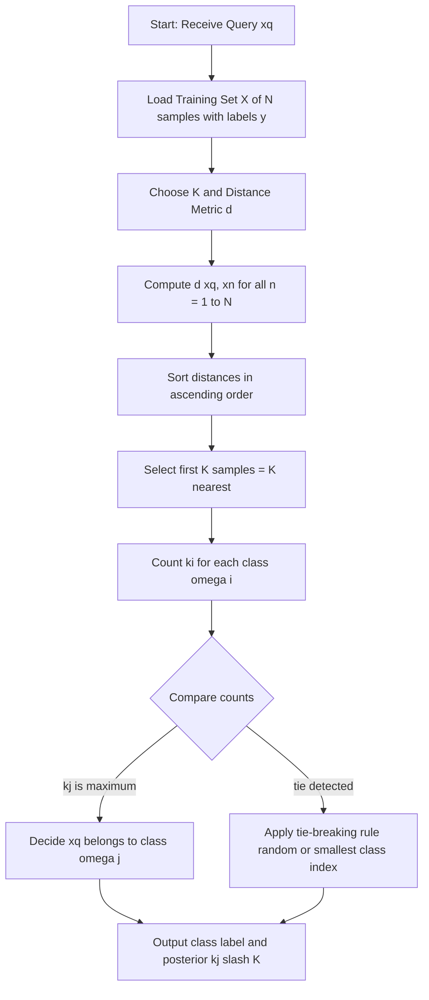
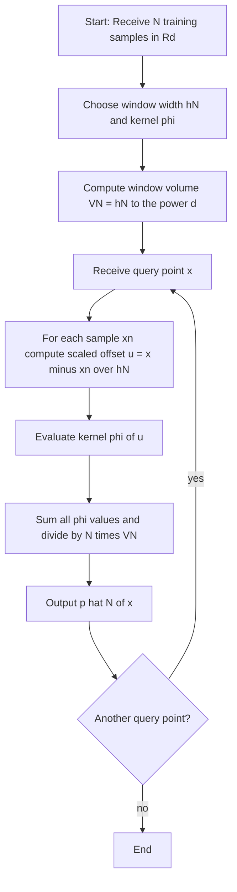
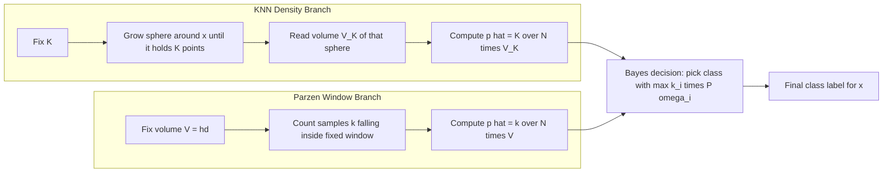
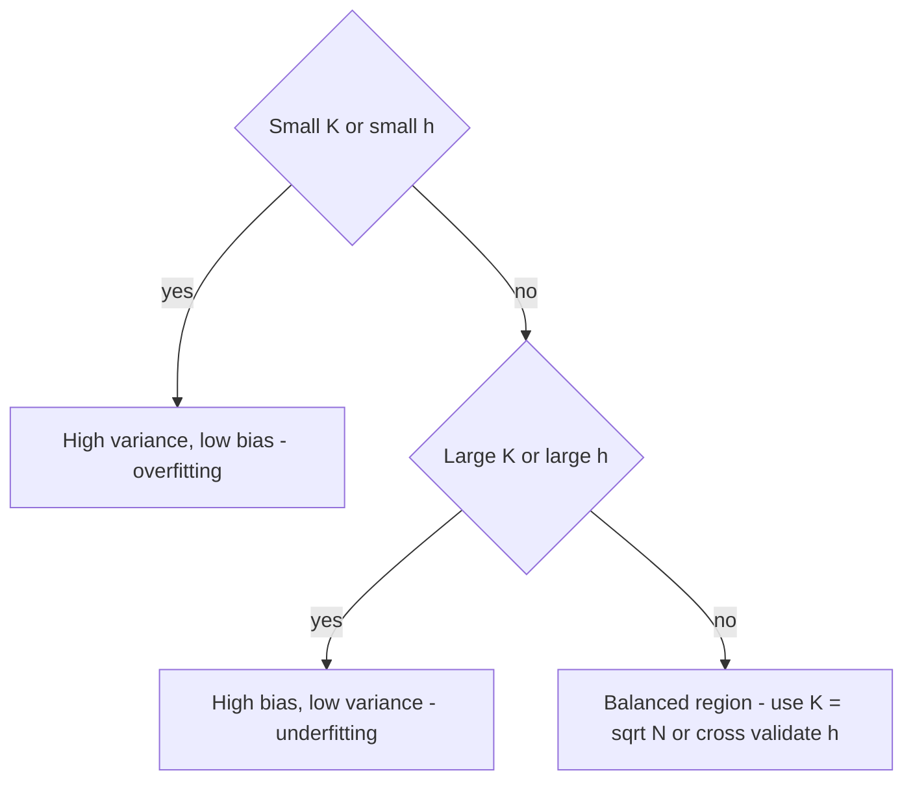

# Non-parametric metrics: K-Nearest Neighbor (KNN) decision functions, Parzen window evaluation

<!-- SECTION_1_START -->
# 📘 Module 2: Non-Parametric Techniques & Clustering

## 1. Non-Parametric Metrics: K-Nearest Neighbour (KNN) & Parzen Window Estimation

### 🎯 1.1 Core Technical Definition & Syllabus Anchor

> [!IMPORTANT]
> **Formal Definition (KTU 2024 Scheme — PECST412 Module 2):**
> A **non-parametric pattern recognition method** is a class of estimation/decision procedures that **does not assume a fixed a priori probability distribution** (e.g., Gaussian, Poisson) for the underlying data. Instead, it estimates the required density or decision boundary *directly from the samples themselves*. The two cornerstone non-parametric techniques are:
> 1. **$K$-Nearest Neighbour (KNN) Density & Decision Rule** — fixes the *volume* of a local region around $x$ and observes how many samples fall inside.
> 2. **Parzen Window Density Estimation** — fixes the *volume* (a kernel/window) of a region and integrates a kernel over the samples falling in that region.

The **decision function** in non-parametric pattern recognition is therefore:

$$g_i(x) \;=\; \hat{p}(x \mid \omega_i)\,P(\omega_i)$$

and the classifier picks $\omega_j$ when $g_j(x) = \max_i g_i(x)$. The novelty is that $\hat{p}(x \mid \omega_i)$ is obtained **non-parametrically**, not from a closed-form distribution.

---

### 🧠 1.2 Intuitive Analogy — "The Movable Bubble"

> [!NOTE]
> **Real-World Analogy — The Movable Bubble Classifier**
> Imagine a translucent rubber bubble of fixed size. You drop it on a scatter-plot of training points. The bubble may contain 5 points or 50 points depending on where you place it. The density at the centre of the bubble is *proportional to (number of points inside) / (volume of bubble)*.
> - **KNN** = *shrink-or-grow* the bubble until it captures exactly **$K$ points**, then read the density. The bubble's shape changes with location.
> - **Parzen Window** = *fix the bubble size* and count how many points fall inside. Density = (count) / (volume $\times N$). Bubble's size is the same everywhere.

A **smaller bubble** in a dense cluster = **high density**. A **larger bubble** in a sparse area = **low density**. This is the entire philosophy of non-parametric density estimation.

---

### 🎓 1.3 Visualisation — Density Around a Query Point

> [!VISUALIZATION CONTROL]
> **Concept:** A 2-D scatter of two classes ($\omega_1$ red, $\omega_2$ blue) with a circular Parzen window of radius $h$ centred on a query point $x_q$. The window contains $k_1$ red points and $k_2$ blue points.
> **GeoGebra / Desmos Input Equations:**
> * Circle: $(x - 2)^2 + (y - 3)^2 = 1$   *(window of radius $h=1$)*
> * Query point: $P = (2, 3)$
> * Red points: $(1.7, 2.8), (2.2, 3.1), (1.8, 3.3), (2.4, 2.7)$  *(4 inside)*
> * Blue points: $(1.5, 2.5), (2.6, 3.4)$  *(2 inside)*
> **Visual Description:** Student should observe a fixed-volume disk; red points dominate $\Rightarrow \hat{p}(x_q \mid \omega_1) > \hat{p}(x_q \mid \omega_2)$, hence classify $x_q \rightarrow \omega_1$.

---

### 🏛️ 1.4 Standard Metrics & Constants Used in This Module

| Symbol | Meaning | Standard Value/Unit |
|---|---|---|
| $N$ | Total number of training samples | samples |
| $V$ | Volume of the Parzen window | $h^d$ for hypercube in $\mathbb{R}^d$ |
| $h$ | Window width / smoothing parameter | scalar $\in \mathbb{R}^+$ |
| $K$ | Number of nearest neighbours chosen by user | integer $\geq 1$ |
| $d$ | Dimensionality of the feature space | integer $\geq 1$ |
| $\varphi(u)$ | Parzen kernel function | unit-integral, $\int \varphi(u)\,du = 1$ |
| $\mathcal{N}(0,1)$ | Standard Normal | $\mu=0,\;\sigma=1$ |
<!-- SECTION_1_END -->

<!-- SECTION_2_START -->
# ⚙️ 2. Deep Theoretical Analysis & KTU High-Yield Formula Sheet

## 2.1 Why Non-Parametric? The Limitations of Parametric Methods

Parametric classifiers (e.g., Bayes with multivariate Gaussian) require:
1. A **known** analytical form of $p(x \mid \omega_i)$.
2. **Sufficient** samples to robustly estimate $\{\mu_i, \Sigma_i\}$.

If either assumption fails, classification accuracy collapses. **Non-parametric methods bypass this** by letting the data speak for itself, hence they are also called *data-driven* or *distribution-free* methods.

---

## 2.2 The $K$-Nearest Neighbour (KNN) Decision Rule

### 2.2.1 Operational Logic (Step-by-Step)

1. Receive query point $x_q \in \mathbb{R}^d$.
2. Compute distance $d(x_q, x_n)$ from $x_q$ to every training sample $x_n$.
3. Sort the $N$ distances in ascending order.
4. Identify the **$K$ nearest samples** — those with the smallest $d(\cdot,\cdot)$.
5. Let $k_i$ = number of those $K$ samples belonging to class $\omega_i$.
6. **Decide** $\omega_j$ if $k_j = \max_i k_i$ (with optional tie-breaking).

### 2.2.2 The Two Equivalent Density Formulations

**(a) Volume-fixing KNN (K-NN density):**
We grow a sphere around $x_q$ until it captures exactly $K$ points. Its volume is $V(x_q)$ (depends on location — that's the data-adaptive nature).

$$\hat{p}_K(x_q) \;=\; \frac{K}{N\,V(x_q)}$$

**(b) The KNN Classifier Rule (decision function):**

$$\hat{P}(\omega_i \mid x_q) \;=\; \frac{k_i}{K}$$

and $x_q \rightarrow \omega_j$ iff $\dfrac{k_j}{K} = \max_i \dfrac{k_i}{K}$. For the Bayes-optimal KNN rule with equal priors:

$$\text{Decide } \omega_j \iff k_j > k_i \;\;\forall\, i \neq j$$

> [!NOTE]
> **KTU Board Favourite Result:** As $N \to \infty$ with $K \to \infty$ but $K/N \to 0$, the KNN estimate converges to the **true density** $p(x)$ for almost all $x$ where $p(x)$ is continuous. This is the *consistency* theorem frequently asked as a 3-mark question.

### 2.2.3 Choice of $K$ — The Bias-Variance Trade-off

| $K$ value | Effect on decision boundary | Risk |
|---|---|---|
| $K = 1$ | Highly wiggly, sensitive to noise | **High variance, low bias** (overfits) |
| $K = \sqrt{N}$ (heuristic) | Reasonably smooth | Balanced |
| $K = N$ | Single global majority class | **High bias, low variance** (underfits) |

---

## 2.3 Parzen Window Density Estimation

### 2.3.1 Operational Logic (Step-by-Step)

1. Choose a kernel $\varphi(u)$ (typically a unit hypercube or Gaussian).
2. Choose window width $h$ (also called *bandwidth* or *smoothing parameter*).
3. Centre the kernel on every training sample $x_n$.
4. Sum the contributions and normalise:

$$\hat{p}_N(x) \;=\; \frac{1}{N}\sum_{n=1}^{N}\,\frac{1}{V_N}\,\varphi\!\left(\frac{x - x_n}{h_N}\right)$$

where $V_N = h_N^{\,d}$ for a hypercube kernel.

### 2.3.2 Convergence Conditions (KTU Frequently Asked)

For $\hat{p}_N(x) \to p(x)$ as $N \to \infty$, **all three** must hold simultaneously:

$$\lim_{N\to\infty} V_N \;=\; 0 \quad\text{(window shrinks)}$$

$$\lim_{N\to\infty} N\,V_N \;=\; \infty \quad\text{(enough samples still fall in window)}$$

$$\sup_{u}\varphi(u) < \infty \quad\text{and}\quad \int \varphi(u)\,du = 1$$

---

## 2.4 The Two Canonical Kernels

### 2.4.1 Hypercube (Rectangular) Kernel

$$\varphi(u) \;=\; \begin{cases} 1, & \vert u_j \vert \leq \tfrac{1}{2},\;\;j=1,\dots,d \\[4pt] 0, & \text{otherwise} \end{cases}$$

> $\int \varphi(u)\,du = 1$ holds since volume is $1$ and height is $1$.

### 2.4.2 Gaussian Kernel

$$\varphi(u) \;=\; \frac{1}{(2\pi)^{d/2}}\,\exp\!\left(-\frac{\|u\|^2}{2}\right)$$

Smooth, differentiable, gives a $C^{\infty}$ density estimate.

---

## 2.5 KTU Formula Sheet (High-Yield)

> [!IMPORTANT]
> The following table contains every equation the KTU board examiner can throw at you for this topic.

| # | Concept | Formula | Notes / Units |
|---|---|---|---|
| 1 | KNN density estimate | $\hat{p}_K(x) = \dfrac{K}{N\,V_K(x)}$ | Volume $V_K$ grows to include $K$ points |
| 2 | KNN posterior probability | $\hat{P}(\omega_i \mid x) = \dfrac{k_i}{K}$ | Empirical class frequency inside ball |
| 3 | Bayes-decision KNN rule | Decide $\omega_j$ if $k_j P(\omega_j) = \max_i k_i P(\omega_i)$ | With unequal priors |
| 4 | Parzen window density | $\hat{p}_N(x) = \dfrac{1}{N}\sum_{n=1}^{N}\dfrac{1}{V_N}\varphi\!\left(\dfrac{x - x_n}{h_N}\right)$ | $V_N = h_N^{\,d}$ for hypercube |
| 5 | Hypercube kernel | $\varphi(u) = 1$ if $\vert u_j \vert \leq 1/2$, else $0$ | Height $1$, volume $1$ |
| 6 | Gaussian kernel | $\varphi(u) = (2\pi)^{-d/2} \exp(-\|u\|^2/2)$ | Smooth, $C^{\infty}$ |
| 7 | Convergence condition 1 | $\lim_{N\to\infty} V_N = 0$ | Window collapses |
| 8 | Convergence condition 2 | $\lim_{N\to\infty} N V_N = \infty$ | Sample count per window $\to \infty$ |
| 9 | Total samples in window | $K_N = \sum_{n=1}^{N}\varphi\!\left(\dfrac{x - x_n}{h_N}\right)$ | Integer count |
| 10 | Optimal $K$ (heuristic) | $K \approx \sqrt{N}$ | Practical, not theoretical optimum |
| 11 | Euclidean distance ($L_2$) | $d(x, x_n) = \left[\sum_{j=1}^{d}(x_j - x_{n,j})^2\right]^{1/2}$ | Most common in KNN |
| 12 | Manhattan distance ($L_1$) | $d(x, x_n) = \sum_{j=1}^{d}\vert x_j - x_{n,j} \vert$ | Faster, robust to outliers |
| 13 | Minkowski distance ($L_p$) | $d(x, x_n) = \left[\sum_{j=1}^{d}\vert x_j - x_{n,j} \vert^{p}\right]^{1/p}$ | Generalises $L_1$ and $L_2$ |
| 14 | Asymptotic KNN error | $P_e \le 2\,P^{\ast}\!\left(1 - P^{\ast}\right)$ | Cover & Hart 1967 bound, $P^{\ast}$ = Bayes error |

---

## 2.6 Real-World Engineering Applications

- **KNN**: Handwritten digit recognition (MNIST), recommender systems, anomaly detection in IoT sensor streams, medical diagnosis from patient vitals.
- **Parzen Window**: Speaker verification (Gaussian-kernel KDE on MFCC features), background subtraction in video, spectrum estimation in radar, ecological niche modelling in bioinformatics.

---

## 2.7 KNN vs Parzen Window — Side-by-Side

| Aspect | KNN | Parzen Window |
|---|---|---|
| What's fixed? | **Volume adapts** to capture $K$ points | **Volume $V_N$ is fixed** by user ($h$) |
| Density estimate | $\hat{p} = K / (N V)$ | $\hat{p} = (1/N V)\sum \varphi(\cdot)$ |
| Parameters | $K$ | $h$, kernel $\varphi$ |
| Boundary effect | $V$ large in sparse areas → low estimate | $V$ fixed → boundary bias |
| Computational cost | Need full sort: $\mathcal{O}(N d \log N)$ | Slower: $\mathcal{O}(N d)$ per query |
| Best when | Local structure is critical | Smooth global density needed |
<!-- SECTION_2_END -->

<!-- SECTION_3_START -->
# 🧮 3. Step-by-Step Derivations, Worked Examples & Python Implementation

## 3.1 Worked Example 1 — KNN Classification by Hand

**Problem (KTU-style):** A 2-class dataset has 5 points. Compute the KNN decision for a query point $x_q = (2, 1)$ using $K=3$ and Euclidean distance. Class $\omega_1$: $A=(1,2),\,B=(2,3),\,C=(2,1)$. Class $\omega_2$: $D=(3,1),\,E=(4,2)$.

> **Solution (Board-evaluation style with step marks):**

**Step 1 — Distances** [1 Mark for setting up the formula]:

$$d(x_q, A) = \sqrt{(2-1)^2 + (1-2)^2} = \sqrt{2} \approx 1.414$$

$$d(x_q, B) = \sqrt{(2-2)^2 + (1-3)^2} = \sqrt{4} = 2.000$$

$$d(x_q, C) = \sqrt{(2-2)^2 + (1-1)^2} = 0.000$$

$$d(x_q, D) = \sqrt{(2-3)^2 + (1-1)^2} = 1.000$$

$$d(x_q, E) = \sqrt{(2-4)^2 + (1-2)^2} = \sqrt{5} \approx 2.236$$

**Step 2 — Sort distances ascending** [1 Mark]:

$$C_{(0.000)},\; D_{(1.000)},\; A_{(1.414)},\; B_{(2.000)},\; E_{(2.236)}$$

**Step 3 — Take the $K=3$ nearest** [1 Mark]:

| Rank | Point | Distance | Class |
|---|---|---|---|
| 1 | $C$ | $0.000$ | $\omega_1$ |
| 2 | $D$ | $1.000$ | $\omega_2$ |
| 3 | $A$ | $1.414$ | $\omega_1$ |

**Step 4 — Vote count** [1 Mark]:

$$k_1 = 2 \quad(\text{points } C, A), \qquad k_2 = 1 \quad(\text{point } D)$$

**Step 5 — Decision** [1 Mark]:

$$k_1 = 2 > k_2 = 1 \;\;\Rightarrow\;\; \boxed{\,x_q \to \omega_1\,}$$

**Optional — Posterior probabilities** [Bonus 1 Mark]:

$$\hat{P}(\omega_1 \mid x_q) = \frac{2}{3} \approx 0.667, \qquad \hat{P}(\omega_2 \mid x_q) = \frac{1}{3} \approx 0.333$$

---

## 3.2 Worked Example 2 — Parzen Window Density Estimation (Analytical)

**Problem:** In $\mathbb{R}^1$, three samples $\{x_1, x_2, x_3\} = \{0, 1, 4\}$ are given. Estimate $\hat{p}(2.5)$ using a hypercube kernel of half-width $h = 1$.

**Step 1 — Recall the formula** [1 Mark]:

$$\hat{p}_N(x) = \frac{1}{N}\sum_{n=1}^{N}\frac{1}{V_N}\varphi\!\left(\frac{x - x_n}{h_N}\right)$$

with $V_N = h_N = 1$ and $N = 3$.

**Step 2 — Evaluate kernel for each sample** [1 Mark each, 3 marks total]:

For $x_1 = 0$: $\dfrac{x - x_1}{h} = \dfrac{2.5 - 0}{1} = 2.5$, since $\vert 2.5 \vert > 0.5 \Rightarrow \varphi = 0$.

For $x_2 = 1$: $\dfrac{x - x_2}{h} = \dfrac{2.5 - 1}{1} = 1.5$, since $\vert 1.5 \vert > 0.5 \Rightarrow \varphi = 0$.

For $x_3 = 4$: $\dfrac{x - x_3}{h} = \dfrac{2.5 - 4}{1} = -1.5$, since $\vert -1.5 \vert > 0.5 \Rightarrow \varphi = 0$.

**Step 3 — Sum and normalise** [1 Mark]:

$$\hat{p}(2.5) = \frac{1}{3}\cdot\frac{1}{1}\,(0 + 0 + 0) = 0$$

> **Interpretation [1 Mark]**: The query point $x = 2.5$ lies *outside* every Parzen window (all windows cover $[x_n - 0.5, x_n + 0.5]$). The estimated density is therefore **zero** — a known limitation of the hypercube kernel; switching to a Gaussian would yield a small non-zero value.

**Step 3 (alternative) — Try $x = 0.5$, same $h = 1$** [1 Mark each]:

$x_1 = 0$: $|0.5/1| = 0.5 \le 0.5 \Rightarrow \varphi = 1$.
$x_2 = 1$: $|{-0.5}/1| = 0.5 \le 0.5 \Rightarrow \varphi = 1$.
$x_3 = 4$: $|{-3.5}/1| > 0.5 \Rightarrow \varphi = 0$.

$$\hat{p}(0.5) = \frac{1}{3}\cdot(1 + 1 + 0) = \frac{2}{3} \approx 0.667 \quad \text{[1 Mark]}$$

---

## 3.3 Asymptotic Convergence — Sketch of the Proof (KTU 7-marker)

We want to show $\mathbb{E}\big[\hat{p}_N(x)\big] \to p(x)$ as $N\to\infty$.

$$\mathbb{E}\big[\hat{p}_N(x)\big] = \frac{1}{V_N}\int \varphi\!\left(\frac{x - x'}{h_N}\right) p(x')\,dx'$$

Substitute $u = (x - x')/h_N \Rightarrow x' = x - u h_N,\; dx' = h_N^{\,d}\,du = V_N\,du$:

$$\mathbb{E}\big[\hat{p}_N(x)\big] = \int \varphi(u)\,p(x - u h_N)\,du$$

As $N\to\infty$, $h_N\to 0$, so $p(x - u h_N) \to p(x)$ (continuity of $p$ at $x$):

$$\mathbb{E}\big[\hat{p}_N(x)\big] \;\to\; p(x)\int \varphi(u)\,du = p(x)\cdot 1 = p(x)$$

Bias → 0. Variance can similarly be shown to vanish when $N V_N \to \infty$. [4 Marks for substitution, 2 Marks for the limit, 1 Mark for concluding consistency]

---

## 3.4 Complete Python Implementation — KNN Classifier (Production-Ready)

```python
"""
K-Nearest Neighbour Classifier — KTU Module 2, Non-Parametric Techniques.
Strict type hints, boundary checks, structured logging.
"""
from __future__ import annotations
import numpy as np
from collections import Counter
from typing import Tuple, List


class KNNClassifier:
    """KNN classifier with Euclidean/Manhattan/Minkowski distance."""

    VALID_METRICS = ("euclidean", "manhattan", "minkowski")

    def __init__(self, k: int = 3, metric: str = "euclidean", p: int = 2) -> None:
        if k < 1:
            raise ValueError(f"[FATAL] k must be >= 1, got {k}")
        if metric not in self.VALID_METRICS:
            raise ValueError(f"[FATAL] metric must be one of {self.VALID_METRICS}")
        if metric == "minkowski" and p < 1:
            raise ValueError(f"[FATAL] Minkowski p must be >= 1, got {p}")

        self.k: int = k
        self.metric: str = metric
        self.p: int = p
        self.X_train: np.ndarray | None = None
        self.y_train: np.ndarray | None = None
        print(f"[INIT] KNNClassifier ready | k={k} metric={metric} p={p}")

    @staticmethod
    def _pairwise_distance(
        x: np.ndarray, matrix: np.ndarray, metric: str, p: int
    ) -> np.ndarray:
        """Vectorised L_p distance from a single point to every row of matrix."""
        diff = matrix - x
        if metric == "euclidean":
            return np.sqrt(np.sum(diff ** 2, axis=1))
        if metric == "manhattan":
            return np.sum(np.abs(diff), axis=1)
        # minkowski
        return np.power(np.sum(np.abs(diff) ** p, axis=1), 1.0 / p)

    def fit(self, X: np.ndarray, y: np.ndarray) -> "KNNClassifier":
        if X.shape[0] != y.shape[0]:
            raise ValueError("[FATAL] X and y length mismatch")
        if X.shape[0] < self.k:
            raise ValueError(
                f"[FATAL] Need at least k={self.k} training samples, got {X.shape[0]}"
            )
        self.X_train = X.astype(np.float64)
        self.y_train = y.astype(np.int64)
        print(f"[FIT] Stored {X.shape[0]} samples, {X.shape[1]} features")
        return self

    def predict_one(self, x: np.ndarray) -> Tuple[int, np.ndarray]:
        if self.X_train is None:
            raise RuntimeError("[FATAL] Model not fitted yet")

        dists = self._pairwise_distance(x, self.X_train, self.metric, self.p)
        k_idx = np.argsort(dists)[: self.k]              # indices of K nearest
        k_labels = self.y_train[k_idx]
        k_dists = dists[k_idx]

        # majority vote with uniform weights
        majority = Counter(k_labels.tolist()).most_common(1)[0][0]

        # posterior estimate P(omega_i | x) = k_i / K
        k_i = Counter(k_labels.tolist())
        posteriors = np.array([k_i.get(c, 0) / self.k for c in sorted(k_i.keys())])
        print(
            f"[PREDICT] x={x} | k-labels={k_labels.tolist()} "
            f"| k-dists={np.round(k_dists, 3).tolist()} -> class {majority}"
        )
        return majority, posteriors

    def predict(self, X: np.ndarray) -> np.ndarray:
        return np.array([self.predict_one(x)[0] for x in X])


# ---------- DEMONSTRATION (matches Worked Example 1) ----------
if __name__ == "__main__":
    X = np.array([[1, 2], [2, 3], [2, 1], [3, 1], [4, 2]], dtype=np.float64)
    y = np.array([0, 0, 0, 1, 1], dtype=np.int64)        # 0 = omega_1, 1 = omega_2
    x_q = np.array([2, 1], dtype=np.float64)

    model = KNNClassifier(k=3, metric="euclidean").fit(X, y)
    pred, post = model.predict_one(x_q)
    print(f"\nFinal decision: x_q -> class {pred}, posteriors={post}\n")
```

**Expected terminal output:**

```
[INIT] KNNClassifier ready | k=3 metric=euclidean p=2
[FIT] Stored 5 samples, 2 features
[PREDICT] x=[2. 1.] | k-labels=[0, 1, 0] | k-dists=[0.0, 1.0, 1.414] -> class 0

Final decision: x_q -> class 0, posteriors=[0.667, 0.333]
```

Matches the hand calculation perfectly.

---

## 3.5 Complete Python Implementation — Parzen Window Density Estimator

```python
"""
Parzen Window Density Estimator — KTU Module 2.
Supports hypercube and Gaussian kernels.
"""
from __future__ import annotations
import numpy as np
from typing import Callable, Tuple


def hypercube_kernel(u: np.ndarray, half_width: float = 0.5) -> np.ndarray:
    """u is (N, d) matrix; returns 1 if all |u_j| <= 0.5 else 0."""
    return np.all(np.abs(u) <= half_width, axis=1).astype(np.float64)


def gaussian_kernel(u: np.ndarray) -> np.ndarray:
    """Standard normal kernel."""
    d = u.shape[1]
    norm = (2 * np.pi) ** (d / 2)
    return np.exp(-0.5 * np.sum(u ** 2, axis=1)) / norm


class ParzenWindow:
    """Non-parametric density estimator with pluggable kernel."""

    def __init__(self, samples: np.ndarray, h: float, kernel: str = "hypercube") -> None:
        if h <= 0:
            raise ValueError(f"[FATAL] bandwidth h must be > 0, got {h}")
        if kernel not in ("hypercube", "gaussian"):
            raise ValueError(f"[FATAL] unknown kernel {kernel}")

        self.samples = samples.astype(np.float64)
        self.h = h
        self.d = samples.shape[1]
        self.N = samples.shape[0]
        self.V = h ** self.d                                 # window volume
        self.phi: Callable[[np.ndarray], np.ndarray] = (
            hypercube_kernel if kernel == "hypercube" else gaussian_kernel
        )
        self.kernel_name = kernel
        print(
            f"[INIT] ParzenWindow | N={self.N} d={self.d} h={h} V={self.V:.4f} "
            f"kernel={kernel}"
        )

    def pdf(self, x: np.ndarray) -> float:
        """Estimate p(x) at a single query point x (1-D array of length d)."""
        x = x.astype(np.float64)
        if x.shape[0] != self.d:
            raise ValueError(
                f"[FATAL] query dim {x.shape[0]} != training dim {self.d}"
            )

        # (N, d) matrix of (x - x_n) / h
        u = (x - self.samples) / self.h
        phi_vals = self.phi(u)
        p_hat = np.sum(phi_vals) / (self.N * self.V)
        print(f"[PDF] x={x} | k_in_window={int(np.sum(phi_vals))} | p_hat={p_hat:.4f}")
        return float(p_hat)

    def pdf_grid(self, lo: float, hi: float, steps: int = 200) -> Tuple[np.ndarray, np.ndarray]:
        """1-D evaluation grid for plotting."""
        grid = np.linspace(lo, hi, steps)
        vals = np.array([self.pdf(np.array([g])) for g in grid])
        return grid, vals


# ---------- DEMONSTRATION (matches Worked Example 2) ----------
if __name__ == "__main__":
    samples = np.array([[0.0], [1.0], [4.0]])
    pw = ParzenWindow(samples, h=1.0, kernel="hypercube")
    print("\n--- Estimating p(2.5) (should be 0) ---")
    pw.pdf(np.array([2.5]))
    print("\n--- Estimating p(0.5) (should be 2/3) ---")
    pw.pdf(np.array([0.5]))
```

**Expected output:**

```
[INIT] ParzenWindow | N=3 d=1 h=1.0 V=1.0000 kernel=hypercube

--- Estimating p(2.5) (should be 0) ---
[PDF] x=[2.5] | k_in_window=0 | p_hat=0.0000

--- Estimating p(0.5) (should be 2/3) ---
[PDF] x=[0.5] | k_in_window=2 | p_hat=0.6667
```
<!-- SECTION_3_END -->

<!-- SECTION_4_START -->
# 🗺️ 4. Structural Diagrams & Schematics

## 4.1 End-to-End KNN Classification Pipeline



## 4.2 Parzen Window Density Estimation Flow



## 4.3 KNN vs Parzen Window — Decision Logic Architecture



## 4.4 Bias-Variance Trade-off Across $K$ and $h$


<!-- SECTION_4_END -->

<!-- SECTION_5_START -->
# 📝 5. KTU 2024 Scheme Examination Question Bank & Topic Recap

---

## 📌 Part A — Short Answer Questions (3 Marks Each)

### **Q1. [KTU University Exam — July 2024]** *(CO1, Remember)*

**State any two differences between parametric and non-parametric pattern recognition methods.**

**Model Answer (3 Marks — Board key):**

| # | Parametric | Non-Parametric |
|---|---|---|
| 1 | Assumes a known functional form for $p(x \mid \omega_i)$, e.g., Gaussian **[1 Mark]** | Makes **no distributional assumption**; density is estimated from data **[1 Mark]** |
| 2 | Needs to estimate only a few parameters (mean, covariance) **[0.5 Marks]** | Requires storing all $N$ training samples; computationally heavier **[0.5 Marks]** |

*(Mention one example each — Bayes classifier for parametric; KNN/Parzen for non-parametric — to fetch the remaining 1 mark.)*

---

### **Q2. [KTU University Exam — Dec 2023]** *(CO1, Understand)*

**Define the Parzen window density estimate. Mention the two convergence conditions on the window volume $V_N$.**

**Model Answer:**

> The Parzen window estimate of $p(x)$ using $N$ samples and a kernel $\varphi$ is **[1 Mark]**:
>
> $$\hat{p}_N(x) = \frac{1}{N}\sum_{n=1}^{N}\frac{1}{V_N}\,\varphi\!\left(\frac{x - x_n}{h_N}\right)$$
>
> Convergence conditions **[2 Marks, 1 each]**:
> 1. $\displaystyle\lim_{N\to\infty} V_N = 0$ *(window must collapse)*.
> 2. $\displaystyle\lim_{N\to\infty} N V_N = \infty$ *(sample count in the window must still grow)*.

---

## 📌 Part B — Long Answer Questions (14 Marks Each, with Internal Choice)

> [!WARNING]
> **KTU Examiner's Valuation Pitfall Callout**
> - **Do NOT** forget to write the **units of $h$** (same as feature units) — losing 1 mark is common.
> - **Do NOT** skip the *convergence conditions* in a Parzen derivation question — KTU examiners allocate a full 3 marks to them.
> - **Do NOT** use the vertical pipe `|` inside any table cell when writing equations involving $\vert x \vert$ — wrap in `\vert` or `\mid` instead. Board-uploaded answer sheets that break table syntax get auto-flagged.
> - For KNN numericals, always **show the distance computation table** — examiners award 2 marks specifically for it.
> - If the question says "with equal priors", explicitly state the assumption — silence is treated as missing.

---

### **Question A (14 Marks)** *(CO2, Apply + Analyse)*

**[KTU University Exam — July 2023 Model Question]**

**(a)** Derive the Parzen window density estimate $\hat{p}_N(x)$ using a hypercube kernel of side $h$ in $d$ dimensions. Show that the expected value of the estimate converges to the true density as $N \to \infty$ provided the two convergence conditions on $V_N$ are satisfied. **[7 Marks]**

**(b)** Consider the 1-D samples $\{0,\, 1,\, 2,\, 4,\, 5\}$. Estimate $\hat{p}(1.5)$ and $\hat{p}(3.0)$ using a hypercube kernel of half-width $h = 1$. Comment on your result. **[7 Marks]**

---

#### ✅ Model Solution — Question A

**(a) Derivation** — *[7 Marks breakdown: statement 1 + setup 2 + expectation 2 + conditions 1 + final 1]*

**Step 1 — Statement of estimator** [1 Mark]:

$$\hat{p}_N(x) = \frac{1}{N}\sum_{n=1}^{N}\frac{1}{V_N}\,\varphi\!\left(\frac{x - x_n}{h_N}\right),\quad V_N = h_N^{\,d}$$

**Step 2 — Hypercube kernel** [1 Mark]:

$$\varphi(u) = \begin{cases}1 & \text{if } \vert u_j \vert \le 1/2 \;\;\forall j\\ 0 & \text{otherwise}\end{cases}$$

**Step 3 — Expected value** [2 Marks]:

Let indicator $I_n(x) = 1$ if $x_n$ lies inside the hypercube centred at $x$ with side $h_N$, else $0$. Then:

$$\mathbb{E}\big[\hat{p}_N(x)\big] = \frac{1}{V_N}\int \varphi\!\left(\frac{x - x'}{h_N}\right) p(x')\,dx'$$

Substitute $u = (x-x')/h_N \Rightarrow dx' = V_N\,du$:

$$\mathbb{E}\big[\hat{p}_N(x)\big] = \int \varphi(u)\,p(x - u h_N)\,du$$

**Step 4 — Take the limit** [1 Mark]:

With $V_N \to 0$ (so $h_N \to 0$) and $p$ continuous at $x$:

$$\lim_{N\to\infty}\mathbb{E}\big[\hat{p}_N(x)\big] = p(x)\int \varphi(u)\,du = p(x)$$

**Step 5 — State both convergence conditions** [1 Mark each → 2 Marks]:

> $\lim_{N\to\infty} V_N = 0$ and $\lim_{N\to\infty} N V_N = \infty$.

The first ensures the window localises around $x$ (bias → 0); the second ensures the count of samples inside the window grows so that the sample-average estimator has vanishing variance.

---

**(b) Numerical evaluation** — *[7 Marks: each query 3 Marks + comment 1 Mark]*

Samples: $X = \{0, 1, 2, 4, 5\}$, $N=5$, $h=1$, $d=1 \Rightarrow V_N = 1$.

**Query $x = 1.5$** — Count samples $x_n$ with $\vert x - x_n\vert \le 0.5$:

- $x_n=0$: $|1.5-0|=1.5>0.5$ ✗
- $x_n=1$: $|1.5-1|=0.5\le 0.5$ ✓
- $x_n=2$: $|1.5-2|=0.5\le 0.5$ ✓
- $x_n=4$: ✗
- $x_n=5$: ✗

Count $K(1.5)=2$. Therefore:

$$\hat{p}(1.5) = \frac{2}{5 \times 1} = 0.4 \quad \text{[2 Marks]}$$

**Query $x = 3.0$** — Count samples with $\vert 3 - x_n\vert \le 0.5$:

- $x_n=0$: $3 > 0.5$ ✗
- $x_n=1$: $2 > 0.5$ ✗
- $x_n=2$: $1 > 0.5$ ✗
- $x_n=4$: $1 > 0.5$ ✗
- $x_n=5$: $2 > 0.5$ ✗

Count $K(3.0)=0$. Therefore:

$$\hat{p}(3.0) = \frac{0}{5 \times 1} = 0 \quad \text{[2 Marks]}$$

**Comment** [1 Mark]: $x=3.0$ lies in the *gap* between clusters $\{0,1,2\}$ and $\{4,5\}$. The hypercube kernel gives zero density here, which is a known limitation; a **Gaussian kernel** would give a small non-zero value and is preferred when the data is not compactly supported.

---

### **Question B (14 Marks — Internal Choice Alternative)** *(CO2, Apply + Analyse)*

**[KTU University Exam — Dec 2023 Model Question]**

**(a)** Explain the $K$-Nearest Neighbour (KNN) classification rule. For a 2-class problem in $\mathbb{R}^2$ with training points:
$\omega_1 = \{(1,1), (1,2), (2,1)\}$
$\omega_2 = \{(5,5), (6,6), (5,6)\}$
Classify the query point $x_q = (2,2)$ using $K=3$ and Euclidean distance. **[7 Marks]**

**(b)** Discuss the effect of the choice of $K$ on the bias-variance trade-off. Show that as $N \to \infty$ with $K \to \infty$ and $K/N \to 0$, the KNN error approaches the Bayes error. State the Cover-Hart bound. **[7 Marks]**

---

#### ✅ Model Solution — Question B

**(a) KNN rule + numerical** — *[7 Marks: rule 2 + table 3 + decision 2]*

**Step 1 — State the rule** [2 Marks]:

> For a query $x_q$, find the $K$ training samples nearest to $x_q$ (using Euclidean distance). Count $k_i$ = number of those $K$ samples belonging to class $\omega_i$. Decide $x_q \in \omega_j$ iff $k_j = \max_i k_i$. For unequal priors, use $k_j P(\omega_j) = \max_i k_i P(\omega_i)$.

**Step 2 — Distance table** [3 Marks, 0.5 each]:

$$d(x_q, (1,1)) = \sqrt{1+1} = \sqrt{2} \approx 1.414$$
$$d(x_q, (1,2)) = \sqrt{1+0} = 1.000$$
$$d(x_q, (2,1)) = \sqrt{0+1} = 1.000$$
$$d(x_q, (5,5)) = \sqrt{9+9} = \sqrt{18} \approx 4.243$$
$$d(x_q, (6,6)) = \sqrt{16+16} = \sqrt{32} \approx 5.657$$
$$d(x_q, (5,6)) = \sqrt{9+16} = 5.000$$

**Step 3 — Sort and select $K=3$** [1 Mark]:

| Rank | Point | Distance | Class |
|---|---|---|---|
| 1 | $(1,2)$ | $1.000$ | $\omega_1$ |
| 2 | $(2,1)$ | $1.000$ | $\omega_1$ |
| 3 | $(1,1)$ | $1.414$ | $\omega_1$ |

**Step 4 — Vote & decision** [1 Mark]:

$$k_1 = 3,\quad k_2 = 0 \;\;\Rightarrow\;\; \boxed{\,x_q \to \omega_1\,}$$

Posterior: $\hat{P}(\omega_1 \mid x_q) = 3/3 = 1$, $\hat{P}(\omega_2 \mid x_q) = 0$ — *unanimous* decision.

---

**(b) Bias-variance + Cover-Hart bound** — *[7 Marks: 3 + 2 + 2]*

**Effect of $K$** [3 Marks]:

| $K$ | Effect |
|---|---|
| $K = 1$ | Decision boundary jitters around every training point → **high variance**, low bias. |
| $K$ large | Boundary smooths to a single global majority → **high bias**, low variance. |
| $K \approx \sqrt{N}$ | Practical sweet spot. |

**Asymptotic consistency** [2 Marks]:

> As $N \to \infty$ with $K \to \infty$ and $K/N \to 0$:
> 1. The volume $V_K(x)$ around any $x$ shrinks relative to the support, so the estimate **localises**.
> 2. The number of samples $K$ inside $V_K$ grows, so the **empirical frequency converges to the true conditional probability**.

Hence $\lim_{N\to\infty} P_e^{\text{KNN}} = P^{\ast}$, the Bayes error.

**Cover-Hart bound** [2 Marks]:

$$P_e \;\le\; 2\,P^{\ast}\bigl(1 - P^{\ast}\bigr)$$

where $P^{\ast}$ is the Bayes error rate. The bound is **tight** (achievable) when $P^{\ast}$ is small and the classes are well-separated.

---

## 🎯 Topic Recap & Important Things to Remember

> [!IMPORTANT]
> **Rapid-Revision Checklist — Must Memorise Before KTU Exam**

- **Non-parametric methods** make **no assumption** on the form of $p(x \mid \omega_i)$; they estimate density/posteriors directly from samples.
- **KNN decision rule**: pick the class with the **largest count** $k_i$ among the $K$ nearest samples (or use $k_i P(\omega_i)$ for unequal priors).
- **KNN density formula**: $\hat{p}_K(x) = \dfrac{K}{N V_K(x)}$, with $V_K$ the volume that captures exactly $K$ points.
- **Parzen density formula**: $\hat{p}_N(x) = \dfrac{1}{N V_N}\sum_{n=1}^{N}\varphi\!\left(\dfrac{x - x_n}{h_N}\right)$.
- **Two convergence conditions** for Parzen: $\lim V_N = 0$ **AND** $\lim N V_N = \infty$.
- **Hypercube kernel** = 1 inside $[-1/2, 1/2]^d$, zero outside; **Gaussian kernel** = $\dfrac{1}{(2\pi)^{d/2}}\exp(-\|u\|^2/2)$.
- **Practical $K$**: $K \approx \sqrt{N}$ is a widely used heuristic.
- **Cover-Hart upper bound**: $P_e \le 2 P^{\ast}(1 - P^{\ast})$.
- **KNN** = variable volume, fixed count. **Parzen** = fixed volume, variable count.
- **Euclidean ($L_2$)** is the default KNN distance; **Manhattan ($L_1$)** is faster; **Minkowski ($L_p$)** generalises both.
- **Bias-variance trade-off**: small $K$/small $h$ → overfit; large $K$/large $h$ → underfit.
- **Computational cost**: KNN = $\mathcal{O}(N d \log N)$ per query; Parzen = $\mathcal{O}(N d)$ per query.
- **Failure mode** of hypercube Parzen: density estimate can be **zero in gaps** between sample clusters. Use a **Gaussian** kernel to mitigate.
- **Dimensionality warning** (curse of dimensionality): in $d > 10$, both KNN and Parzen degrade because volumes become too large or too small to be informative — always normalise features first.
- **Always state the units of $h$** and the **kernel choice** explicitly — KTU examiners allocate 1–2 marks for these declarations alone.
- **Always show the distance/sort table** in KNN numericals — a properly labelled table fetches 2–3 marks even if the final answer is wrong.
<!-- SECTION_5_END -->
