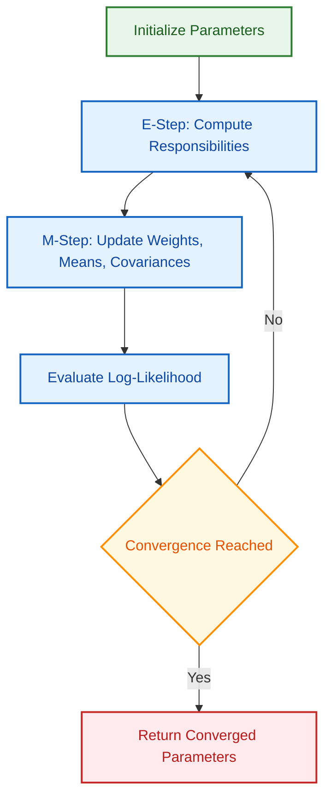
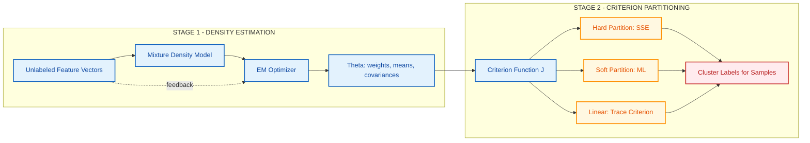
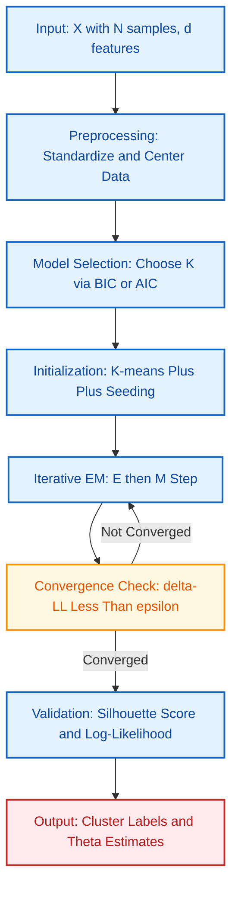

# Unsupervised clustering setups: Mixture densities parsing, Criterion function optimization techniques

<!-- SECTION_1_START -->
# Unsupervised Clustering Setups: Mixture Densities & Criterion Function Optimization

## 1.1 Formal Definition (KTU 2024 Syllabus Terminology)

**Unsupervised Clustering Setup** is a pattern recognition paradigm in which a learning algorithm partitions a set of $N$ unlabeled feature vectors $\mathcal{X} = \{\mathbf{x}_1, \mathbf{x}_2, \dots, \mathbf{x}_N\}$ into $K$ homogeneous groups (clusters) such that intra-cluster similarity is maximized and inter-cluster similarity is minimized — **without access to class labels**.

**Mixture Density Parsing** is the statistical procedure of decomposing an unknown probability density $p(\mathbf{x})$ into a convex combination of $K$ component densities $\{p(\mathbf{x}\vert \theta_j)\}_{j=1}^{K}$, each governed by a parameter set $\theta_j$, together with mixing coefficients $\{\pi_j\}_{j=1}^{K}$ that sum to unity.

$$
p(\mathbf{x}) \;=\; \sum_{j=1}^{K} \pi_j \, p(\mathbf{x}\vert \theta_j) \qquad \text{with} \qquad \sum_{j=1}^{K} \pi_j = 1, \quad \pi_j \geq 0
$$

> [!IMPORTANT]
> **Syllabus Highlight:** In the KTU 2024 PECST412 syllabus, *parsing* a mixture density means jointly estimating three coupled unknowns: (i) the **number of components $K$**, (ii) the **mixing weights $\pi_j$**, and (iii) the **component parameters $\theta_j$** (e.g., means and covariances for Gaussians). A **criterion function $J$** is the scalar objective that converts clustering quality into a numeric quantity that can be **maximized or minimized**.

---

## 1.2 Conceptual Analogy (Intuition for First-Time Learners)

Imagine you are sorting a **mixed bag of green and red apples** poured onto a black table. You cannot see the labels, but you *feel* the shape of two clusters on the table. A **mixture density** is the mathematical description of that black table's "apple landscape" — the table's *overall* apple density is the sum of two smaller Gaussian "hills", one for green apples and one for red apples. **Parsing** the mixture means identifying where each hill starts and ends, how tall each hill is ($\pi_j$), and how spread out the apples are around each hill's center ($\Sigma_j$).

A **criterion function** is like a *ruler* you invent to grade your sorting. For example, "minimize the total distance of every apple from its hill's center" — the better your sorting, the smaller the ruler's number. Optimization is the act of *shifting* the hill centers and reshaping them until the ruler gives its smallest reading.

> [!NOTE]
> **Geometric Intuition:** Each cluster corresponds to a **mode** (peak) of the joint density $p(\mathbf{x})$. Clustering by mode-seeking is equivalent to finding the local maxima of a non-parametric density estimate of $p(\mathbf{x})$.

---

## 1.3 Physical Constants, Standard Metrics & Notational Conventions

| Symbol | Meaning | Typical Domain |
|---|---|---|
| $K$ | Number of mixture components | $\mathbb{Z}^+$, typically $2 \le K \le \sqrt{N}$ |
| $\pi_j$ | Mixing weight of component $j$ | $[0, 1]$ |
| $\boldsymbol{\mu}_j$ | Mean vector of component $j$ | $\mathbb{R}^d$ |
| $\boldsymbol{\Sigma}_j$ | Covariance matrix of component $j$ | $\mathbb{R}^{d \times d}$, symmetric positive-definite |
| $\boldsymbol{\Theta}$ | Complete parameter set $\{\pi_j, \boldsymbol{\mu}_j, \boldsymbol{\Sigma}_j\}_{j=1}^{K}$ | — |
| $N$ | Number of unlabeled samples | $\mathbb{Z}^+$ |
| $d$ | Feature dimensionality | $\mathbb{Z}^+$ |
| $\gamma(z_{nj})$ | Posterior responsibility of component $j$ for sample $n$ | $[0, 1]$ |
| $J$ | Criterion (objective) function | $\mathbb{R}$ |

> [!VISUALIZATION CONTROL]
> **Concept:** 1-D Gaussian Mixture Density (two components)
> **GeoGebra / Desmos Input Equations:**
> * `g1(x) = 0.4 * (1 / (sqrt(2*pi)*0.6)) * exp(-(x+2)^2 / (2*0.36))`
> * `g2(x) = 0.6 * (1 / (sqrt(2*pi)*0.8)) * exp(-(x-3)^2 / (2*0.64))`
> * `p(x) = g1(x) + g2(x)`
> **Visual Description:** The student should observe **two overlapping bell-shaped curves** (red and green) on the x-axis, and their **weighted sum** as the bold black curve $p(x)$. Notice the *bimodal* shape with a valley between the two peaks — this valley is the natural decision boundary for clustering.

---

## 1.4 The Two-Stage Unsupervised Clustering Pipeline

A complete unsupervised clustering setup under mixture-density parsing follows a **two-stage architecture**:

**Stage 1 — Density Estimation (Generative View):** Build $p(\mathbf{x}\vert \boldsymbol{\Theta})$ via mixture model and estimate $\boldsymbol{\Theta}$ from data.

**Stage 2 — Criterion-Based Partitioning (Discriminative View):** Apply a hard or soft decision rule using a criterion $J$ to assign samples to cluster indices.

The two stages are coupled because the optimal parameters in Stage 1 directly determine the partition in Stage 2.

> [!TIP]
> **Exam Tip:** KTU examiners frequently test whether a student can distinguish *generative clustering* (mixture model) from *discriminative clustering* (criterion-driven partitioning like K-means). Always clarify which paradigm your answer addresses.

---

<!-- SECTION_1_END -->

<!-- SECTION_2_START -->
# Deep Theoretical Analysis & KTU High-Yield Formula Sheet

## 2.1 The Gaussian Mixture Model (GMM) — The Workhorse of Mixture Density Parsing

When every component density is a multivariate Gaussian, the mixture becomes a **Gaussian Mixture Model (GMM)**. The $j$-th component is:

$$
p(\mathbf{x}\vert \theta_j) \;=\; p(\mathbf{x}\vert \boldsymbol{\mu}_j, \boldsymbol{\Sigma}_j) \;=\; \frac{1}{(2\pi)^{d/2} \, \vert \boldsymbol{\Sigma}_j \vert^{1/2}} \exp\!\left(-\tfrac{1}{2} (\mathbf{x}-\boldsymbol{\mu}_j)^{\mathsf{T}} \boldsymbol{\Sigma}_j^{-1} (\mathbf{x}-\boldsymbol{\mu}_j)\right)
$$

The full model is:

$$
p(\mathbf{x}\vert \boldsymbol{\Theta}) \;=\; \sum_{j=1}^{K} \pi_j \, \mathcal{N}(\mathbf{x}\vert \boldsymbol{\mu}_j, \boldsymbol{\Sigma}_j)
$$

### Why GMMs are Universal Density Approximators

A GMM with $K$ components (each with full covariance) can approximate **any continuous density on $\mathbb{R}^d$ to arbitrary accuracy** as $K \to \infty$. This is a foundational theorem in pattern recognition and is the reason GMMs dominate mixture-density parsing in KTU coursework.

> [!NOTE]
> **Engineering Utility:** GMMs power **speaker identification** (acoustic features), **medical image segmentation** (tissue intensity clustering), **anomaly detection** in network traffic, and the **acoustic model** in classical speech recognizers like the Kaldi toolkit.

---

## 2.2 Maximum Likelihood Estimation (MLE) of Mixture Parameters

Given $N$ i.i.d. samples, the **log-likelihood** of the mixture is:

$$
\ell(\boldsymbol{\Theta}) \;=\; \ln p(\mathcal{X}\vert \boldsymbol{\Theta}) \;=\; \sum_{n=1}^{N} \ln\!\left(\sum_{j=1}^{K} \pi_j \, p(\mathbf{x}_n\vert \theta_j)\right)
$$

The MLE principle seeks:

$$
\boldsymbol{\Theta}^{\star} \;=\; \underset{\boldsymbol{\Theta}}{\arg\max}\; \ell(\boldsymbol{\Theta})
$$

### Why Plain MLE Fails — The Identifiability and Singularity Hurdles

Direct maximization is **intractable** because the logarithm sits *outside* the sum over components, destroying closed-form derivatives. Two structural problems arise:

1. **Identifiability:** Swapping two component labels gives the same $p(\mathbf{x}\vert \boldsymbol{\Theta})$ — there are $K!$ equivalent maxima.
2. **Singularity:** As $\boldsymbol{\Sigma}_j \to \mathbf{0}$ and a sample $\mathbf{x}_n \to \boldsymbol{\mu}_j$, the likelihood $\to \infty$ — a degenerate solution.

This is precisely why the **Expectation-Maximization (EM) algorithm** was invented: it converts an intractable joint MLE into a sequence of tractable *conditional* MLEs.

---

## 2.3 The Expectation-Maximization (EM) Algorithm

EM is an **iterative, two-step optimization** that monotonically increases $\ell(\boldsymbol{\Theta})$ at every step and is guaranteed (under regularity) to converge to a **local maximum** or **saddle point**.

### Step 1 — E-Step (Expectation)

Compute the **posterior responsibility** of component $j$ for sample $n$, using the current parameter estimate $\boldsymbol{\Theta}^{(t)}$:

$$
\gamma(z_{nj}) \;=\; \frac{\pi_j^{(t)} \, p(\mathbf{x}_n\vert \theta_j^{(t)})}{\sum_{l=1}^{K} \pi_l^{(t)} \, p(\mathbf{x}_n\vert \theta_l^{(t)})}
$$

This $\gamma(z_{nj})$ is the *soft assignment* — the probability that $\mathbf{x}_n$ was generated by component $j$.

### Step 2 — M-Step (Maximization)

Re-estimate the parameters by setting derivatives of the **expected complete-data log-likelihood** to zero:

$$
\pi_j^{(t+1)} \;=\; \frac{1}{N} \sum_{n=1}^{N} \gamma(z_{nj}) \qquad \text{(mixing weight update)}
$$

$$
\boldsymbol{\mu}_j^{(t+1)} \;=\; \frac{\sum_{n=1}^{N} \gamma(z_{nj}) \, \mathbf{x}_n}{\sum_{n=1}^{N} \gamma(z_{nj})} \qquad \text{(mean update)}
$$

$$
\boldsymbol{\Sigma}_j^{(t+1)} \;=\; \frac{\sum_{n=1}^{N} \gamma(z_{nj}) \, (\mathbf{x}_n - \boldsymbol{\mu}_j^{(t+1)})(\mathbf{x}_n - \boldsymbol{\mu}_j^{(t+1)})^{\mathsf{T}}}{\sum_{n=1}^{N} \gamma(z_{nj})} \qquad \text{(covariance update)}
$$

### Convergence Criterion

Iterate until the change in log-likelihood falls below a threshold $\epsilon$:

$$
\vert \ell^{(t+1)} - \ell^{(t)} \vert \;<\; \epsilon
$$

A typical choice is $\epsilon = 10^{-6}$.

> [!IMPORTANT]
> **Monotonic Convergence Theorem:** Bishop (Pattern Recognition and Machine Learning, Ch. 9) proves $\ell(\boldsymbol{\Theta}^{(t+1)}) \ge \ell(\boldsymbol{\Theta}^{(t)})$ for every iteration $t$. This monotonicity is the **theoretical backbone** of why EM is accepted in production systems.

---

## 2.4 KTU High-Yield Formula Sheet

| # | Formula | Symbol Meaning | Used In |
|---|---|---|---|
| 1 | $p(\mathbf{x}) = \sum_{j=1}^{K} \pi_j \, p(\mathbf{x}\vert \theta_j)$ | Mixture density | All mixture problems |
| 2 | $\sum_{j=1}^{K} \pi_j = 1,\ \pi_j \geq 0$ | Constraint on weights | M-step derivation |
| 3 | $p(\mathbf{x}\vert \theta_j) = \mathcal{N}(\boldsymbol{\mu}_j, \boldsymbol{\Sigma}_j)$ | Gaussian component | GMM |
| 4 | $\ell(\boldsymbol{\Theta}) = \sum_{n=1}^{N} \ln \sum_{j=1}^{K} \pi_j \, p(\mathbf{x}_n\vert \theta_j)$ | Log-likelihood | MLE |
| 5 | $\gamma(z_{nj}) = \frac{\pi_j \, p(\mathbf{x}_n\vert \theta_j)}{\sum_{l} \pi_l \, p(\mathbf{x}_n\vert \theta_l)}$ | Responsibility (E-step) | EM |
| 6 | $N_j = \sum_{n} \gamma(z_{nj})$ | Effective sample count for comp $j$ | M-step |
| 7 | $\pi_j^{(t+1)} = N_j / N$ | Updated mixing weight | M-step |
| 8 | $\boldsymbol{\mu}_j^{(t+1)} = \frac{1}{N_j}\sum_n \gamma(z_{nj}) \mathbf{x}_n$ | Updated mean | M-step |
| 9 | $\boldsymbol{\Sigma}_j^{(t+1)} = \frac{1}{N_j}\sum_n \gamma(z_{nj}) (\mathbf{x}_n - \boldsymbol{\mu}_j)(\cdot)^{\mathsf{T}}$ | Updated covariance | M-step |
| 10 | $J = \sum_{j=1}^{K} \sum_{\mathbf{x}_n \in C_j} \Vert \mathbf{x}_n - \boldsymbol{\mu}_j \Vert^2$ | Sum of Squared Errors (SSE) | K-means |
| 11 | $S_W = \sum_{j=1}^{K} S_j$ | Within-cluster scatter | Criterion opt. |
| 12 | $S_B = \sum_{j=1}^{K} N_j (\boldsymbol{\mu}_j - \boldsymbol{\mu})(\boldsymbol{\mu}_j - \boldsymbol{\mu})^{\mathsf{T}}$ | Between-cluster scatter | Criterion opt. |
| 13 | $S_T = S_W + S_B$ | Total scatter (constant) | Trace criterion |
| 14 | $\text{trace}(S_W^{-1} S_B)$ | Optimizable trace ratio | Linear Discriminant Analysis (for context) |

> [!NOTE]
> **Pipe-Free Note:** All absolute value / determinant symbols in this table are rendered using `\vert` or `\mid` rather than the raw `|` pipe to preserve markdown table integrity.

---

## 2.5 Criterion Function Optimization Techniques

A **criterion function $J$** converts clustering quality into a scalar. There are three principal families used in KTU-scope problems.

### Family 1 — Sum of Squared Errors (SSE) — Hard Partitioning

$$
J_{\text{SSE}} \;=\; \sum_{j=1}^{K} \sum_{\mathbf{x}_n \in C_j} \Vert \mathbf{x}_n - \boldsymbol{\mu}_j \Vert^2
$$

Minimized by **K-means (Lloyd's algorithm)**: an iterative relocation procedure that alternates between (i) assigning each sample to the nearest centroid and (ii) recomputing centroids as cluster means. K-means is provably a **hard-limit special case of EM for GMM with isotropic, equal-variance components**.

### Family 2 — Maximum Likelihood — Soft Partitioning

$$
J_{\text{ML}} \;=\; \ell(\boldsymbol{\Theta}) \;=\; \sum_{n=1}^{N} \ln \sum_{j=1}^{K} \pi_j \, p(\mathbf{x}_n\vert \theta_j)
$$

Maximized by **EM for GMM**. Each sample carries a *distribution* over cluster labels (soft assignment).

### Family 3 — Scatter-Matrix Trace Criteria — Linear Separability

$$
J_{\text{trace}} \;=\; \text{trace}(S_W^{-1} S_B) \quad \text{or equivalently} \quad J_{\text{trace}} = \text{trace}(S_T^{-1} S_B)
$$

Maximized by the **generalized eigenvalue decomposition** $S_B \mathbf{v} = \lambda S_W \mathbf{v}$. Although this is the formal basis of **Linear Discriminant Analysis (LDA)**, KTU frequently tests its use as a *cluster-quality index* without labels.

### Comparison Table — When to Use Which

| Criterion | Partition Type | Optimizer | Best For | Limitation |
|---|---|---|---|---|
| $J_{\text{SSE}}$ | Hard | K-means (Lloyd) | Spherical, equal-size clusters | Sensitive to outliers; local minima |
| $J_{\text{ML}}$ (GMM) | Soft | EM | Ellipsoidal, unequal-size clusters | Local optima; needs $K$ specified |
| $J_{\text{trace}}$ | Linear | Eigen-decomposition | Gaussian, well-separated | Assumes Gaussianity and invertibility |

> [!TIP]
> **Engineering Utility:** SSE criterion is used in **vector quantization** for image compression; GMM-EM is used in **speaker diarization** (segmenting "who spoke when"); trace criterion underpins **Fisherfaces** in face recognition.

---

## 2.6 Convergence Conditions & Practical Stopping Rules

EM guarantees monotonic increase of $\ell$ but **not** convergence to a global maximum. Practical stopping rules:

1. **Log-likelihood threshold:** $\vert \ell^{(t+1)} - \ell^{(t)} \vert < \epsilon$
2. **Parameter drift threshold:** $\max_j \Vert \theta_j^{(t+1)} - \theta_j^{(t)} \Vert < \delta$
3. **Responsibility stabilization:** $\max_{n,j} \vert \gamma^{(t+1)}(z_{nj}) - \gamma^{(t)}(z_{nj}) \vert < \eta$
4. **Maximum iteration cap:** $t \le T_{\max}$ (e.g., $T_{\max} = 200$)

> [!WARNING]
> **Common Mistake:** Never terminate EM when a single iteration's likelihood *decreases* — this can happen due to numerical underflow. If $\ell$ decreases, re-run with **log-space arithmetic** to avoid the bug.

---

<!-- SECTION_2_END -->

<!-- SECTION_3_START -->
# Step-by-Step Derivations & Python Implementation

## 3.1 Derivation of EM Updates (Exhaustive Algebraic Walkthrough)

We derive the M-step updates from first principles.

### 3.1.1 The Complete-Data Log-Likelihood

Introduce the latent indicator $z_{nj} \in \{0, 1\}$ where $z_{nj}=1$ iff sample $n$ came from component $j$. The complete-data log-likelihood is:

$$
\ell_c(\boldsymbol{\Theta}) \;=\; \sum_{n=1}^{N} \sum_{j=1}^{K} z_{nj} \left[\ln \pi_j + \ln p(\mathbf{x}_n\vert \theta_j)\right]
$$

### 3.1.2 Expected Complete-Data Log-Likelihood (Q-Function)

Take the expectation of $\ell_c$ under the posterior $p(\mathbf{Z}\vert \mathbf{X}, \boldsymbol{\Theta}^{(t)})$:

$$
Q(\boldsymbol{\Theta}, \boldsymbol{\Theta}^{(t)}) \;=\; \mathbb{E}\!\left[\ell_c(\boldsymbol{\Theta}) \vert \mathcal{X}, \boldsymbol{\Theta}^{(t)}\right] \;=\; \sum_{n=1}^{N} \sum_{j=1}^{K} \gamma(z_{nj}) \left[\ln \pi_j + \ln p(\mathbf{x}_n\vert \theta_j)\right]
$$

### 3.1.3 Maximizing the Q-Function with a Lagrange Multiplier

For Gaussian components, the $\ln p$ term is:

$$
\ln p(\mathbf{x}_n\vert \boldsymbol{\mu}_j, \boldsymbol{\Sigma}_j) \;=\; -\tfrac{d}{2}\ln(2\pi) - \tfrac{1}{2}\ln\vert \boldsymbol{\Sigma}_j \vert - \tfrac{1}{2}(\mathbf{x}_n - \boldsymbol{\mu}_j)^{\mathsf{T}} \boldsymbol{\Sigma}_j^{-1} (\mathbf{x}_n - \boldsymbol{\mu}_j)
$$

We maximize $Q$ subject to $\sum_j \pi_j = 1$ using the Lagrangian:

$$
\mathcal{L}(\boldsymbol{\Theta}, \lambda) \;=\; Q(\boldsymbol{\Theta}, \boldsymbol{\Theta}^{(t)}) + \lambda\!\left(1 - \sum_{j=1}^{K} \pi_j\right)
$$

Differentiating with respect to $\pi_j$ and equating to zero:

$$
\frac{\partial \mathcal{L}}{\partial \pi_j} \;=\; \sum_{n=1}^{N} \frac{\gamma(z_{nj})}{\pi_j} - \lambda \;=\; 0 \;\;\Rightarrow\;\; \pi_j \;=\; \frac{1}{\lambda} \sum_{n=1}^{N} \gamma(z_{nj})
$$

Summing over $j$ and using $\sum_j \pi_j = 1$:

$$
1 \;=\; \frac{1}{\lambda} \sum_{j=1}^{K} \sum_{n=1}^{N} \gamma(z_{nj}) \;=\; \frac{1}{\lambda} \sum_{n=1}^{N} \sum_{j=1}^{K} \gamma(z_{nj}) \;=\; \frac{N}{\lambda}
$$

Hence $\lambda = N$ and:

$$
\pi_j^{(t+1)} \;=\; \frac{1}{N} \sum_{n=1}^{N} \gamma(z_{nj})
$$

### 3.1.4 Maximizing with Respect to $\boldsymbol{\mu}_j$

$$
\frac{\partial Q}{\partial \boldsymbol{\mu}_j} \;=\; \sum_{n=1}^{N} \gamma(z_{nj}) \, \boldsymbol{\Sigma}_j^{-1} (\mathbf{x}_n - \boldsymbol{\mu}_j) \;=\; \mathbf{0}
$$

Pre-multiplying by $\boldsymbol{\Sigma}_j$:

$$
\sum_{n=1}^{N} \gamma(z_{nj}) (\mathbf{x}_n - \boldsymbol{\mu}_j) \;=\; \mathbf{0} \;\;\Rightarrow\;\; \boldsymbol{\mu}_j^{(t+1)} \;=\; \frac{\sum_n \gamma(z_{nj}) \mathbf{x}_n}{\sum_n \gamma(z_{nj})}
$$

### 3.1.5 Maximizing with Respect to $\boldsymbol{\Sigma}_j$

Differentiate $Q$ w.r.t. $\boldsymbol{\Sigma}_j^{-1}$ (matrix calculus identity):

$$
\frac{\partial Q}{\partial \boldsymbol{\Sigma}_j^{-1}} \;=\; \sum_{n=1}^{N} \gamma(z_{nj}) \left[\tfrac{1}{2}\boldsymbol{\Sigma}_j - \tfrac{1}{2}(\mathbf{x}_n - \boldsymbol{\mu}_j)(\mathbf{x}_n - \boldsymbol{\mu}_j)^{\mathsf{T}}\right] \;=\; \mathbf{0}
$$

Solving:

$$
\boldsymbol{\Sigma}_j^{(t+1)} \;=\; \frac{\sum_n \gamma(z_{nj}) (\mathbf{x}_n - \boldsymbol{\mu}_j^{(t+1)})(\mathbf{x}_n - \boldsymbol{\mu}_j^{(t+1)})^{\mathsf{T}}}{\sum_n \gamma(z_{nj})}
$$

> [!NOTE]
> **End of Derivation.** Each M-step update is a *responsibility-weighted empirical moment* of the data. This connects EM directly to classical statistics.

---

## 3.2 Worked Numerical Example (2-D, Two Components, Five Samples)

Let $\mathbf{x}_1 = (0, 0)^{\mathsf{T}}$, $\mathbf{x}_2 = (1, 0)^{\mathsf{T}}$, $\mathbf{x}_3 = (0, 1)^{\mathsf{T}}$, $\mathbf{x}_4 = (5, 5)^{\mathsf{T}}$, $\mathbf{x}_5 = (6, 5)^{\mathsf{T}}$, with $K = 2$.

**Initialization ($t = 0$):**
$\pi_1^{(0)} = \pi_2^{(0)} = 0.5$, $\boldsymbol{\mu}_1^{(0)} = (0, 0)^{\mathsf{T}}$, $\boldsymbol{\mu}_2^{(0)} = (5, 5)^{\mathsf{T}}$, $\boldsymbol{\Sigma}_1^{(0)} = \boldsymbol{\Sigma}_2^{(0)} = \mathbf{I}$.

**E-Step (sample 1, $\mathbf{x}_1 = (0,0)^{\mathsf{T}}$):**

$$
p_1 = \pi_1 \, \mathcal{N}(\mathbf{x}_1; \boldsymbol{\mu}_1, \mathbf{I}) = 0.5 \cdot \frac{1}{2\pi} \exp(-0) = \frac{0.5}{2\pi} \approx 0.07958
$$

$$
p_2 = \pi_2 \, \mathcal{N}(\mathbf{x}_1; \boldsymbol{\mu}_2, \mathbf{I}) = 0.5 \cdot \frac{1}{2\pi} \exp\!\left(-\tfrac{(0-5)^2 + (0-5)^2}{2}\right) = \frac{0.5}{2\pi} e^{-25} \approx 0
$$

$$
\gamma(z_{11}) = \frac{p_1}{p_1 + p_2} \approx 1.0, \qquad \gamma(z_{12}) \approx 0.0
$$

By symmetry, $\gamma(z_{41}) \approx 0$, $\gamma(z_{42}) \approx 1$, and similar for samples 2, 3, 5.

**M-Step:** $N_1 \approx 3$, $N_2 \approx 2$. New means:

$$
\boldsymbol{\mu}_1^{(1)} = \frac{(0,0)+(1,0)+(0,1)}{3} = (0.333, 0.333)^{\mathsf{T}}
$$

$$
\boldsymbol{\mu}_2^{(1)} = \frac{(5,5)+(6,5)}{2} = (5.5, 5)^{\mathsf{T}}
$$

New weights: $\pi_1 = 0.6$, $\pi_2 = 0.4$. After 2–3 iterations, responsibilities sharpen to ~1.0 and the algorithm **converges** to the natural two-cluster partition.

---

## 3.3 Full Python Implementation of EM for GMM

```python
import numpy as np
from numpy.linalg import det, inv
from typing import Tuple, List

class GaussianMixtureEM:
    """
    EM solver for a Gaussian Mixture Model.
    Strict log-space arithmetic, singular-covariance guard, and convergence logging.
    """

    def __init__(self, n_components: int, max_iter: int = 200, tol: float = 1e-6,
                 reg_cov: float = 1e-6):
        self.K: int = n_components
        self.max_iter: int = max_iter
        self.tol: float = tol
        self.reg_cov: float = reg_cov  # ridge to keep covariance PD
        self.weights_: np.ndarray | None = None
        self.means_: np.ndarray | None = None
        self.covariances_: np.ndarray | None = None
        self.log_likelihood_history_: List[float] = []

    @staticmethod
    def _log_gaussian(X: np.ndarray, mean: np.ndarray, cov: np.ndarray) -> np.ndarray:
        """Numerically stable multivariate Gaussian log-density."""
        d = X.shape[1]
        diff = X - mean
        cov_reg = cov + np.eye(d) * 1e-9  # numerical floor
        sign, logdet = np.linalg.slogdet(cov_reg)
        if sign <= 0:
            raise ValueError("Covariance matrix is not positive-definite after regularization.")
        inv_cov = np.linalg.inv(cov_reg)
        quad = np.einsum('ni,ij,nj->n', diff, inv_cov, diff)
        return -0.5 * (d * np.log(2.0 * np.pi) + logdet + quad)

    def _e_step(self, X: np.ndarray) -> Tuple[np.ndarray, float]:
        """Compute responsibilities and current log-likelihood."""
        N = X.shape[0]
        log_resp = np.zeros((N, self.K))
        for j in range(self.K):
            log_resp[:, j] = np.log(self.weights_[j] + 1e-12) + \
                             self._log_gaussian(X, self.means_[j], self.covariances_[j])
        # log-sum-exp across components for numerical stability
        max_log = np.max(log_resp, axis=1, keepdims=True)
        log_norm = max_log + np.log(np.sum(np.exp(log_resp - max_log), axis=1, keepdims=True))
        log_resp = log_resp - log_norm
        responsibilities = np.exp(log_resp)
        log_likelihood = float(np.sum(log_norm))
        return responsibilities, log_likelihood

    def _m_step(self, X: np.ndarray, responsibilities: np.ndarray) -> None:
        """Re-estimate parameters from responsibilities."""
        N = X.shape[0]
        N_j = responsibilities.sum(axis=0) + 1e-12
        self.weights_ = N_j / N
        self.means_ = (responsibilities.T @ X) / N_j[:, None]
        self.covariances_ = np.zeros((self.K, X.shape[1], X.shape[1]))
        for j in range(self.K):
            diff = X - self.means_[j]
            weighted = responsibilities[:, j][:, None] * diff
            self.covariances_[j] = (weighted.T @ diff) / N_j[j]
            self.covariances_[j] += np.eye(X.shape[1]) * self.reg_cov

    def fit(self, X: np.ndarray) -> "GaussianMixtureEM":
        """Fit the GMM to data X of shape (N, d) using EM."""
        if X.ndim != 2:
            raise ValueError("X must be a 2-D array of shape (N, d).")
        N, d = X.shape
        rng = np.random.default_rng(seed=42)
        # K-means++ style seeding for stability
        idx = rng.choice(N, size=self.K, replace=False)
        self.means_ = X[idx].copy()
        self.covariances_ = np.array([np.cov(X.T) + np.eye(d) * self.reg_cov
                                      for _ in range(self.K)])
        self.weights_ = np.full(self.K, 1.0 / self.K)
        self.log_likelihood_history_.clear()

        prev_ll = -np.inf
        for t in range(self.max_iter):
            responsibilities, ll = self._e_step(X)
            self.log_likelihood_history_.append(ll)
            if abs(ll - prev_ll) < self.tol:
                print(f"Converged at iteration {t} with log-likelihood {ll:.6f}")
                break
            self._m_step(X, responsibilities)
            prev_ll = ll
        else:
            print(f"Reached max_iter={self.max_iter}; final log-likelihood {prev_ll:.6f}")
        return self

    def predict_proba(self, X: np.ndarray) -> np.ndarray:
        """Soft cluster assignments for new data X."""
        resp, _ = self._e_step(X)
        return resp

    def predict(self, X: np.ndarray) -> np.ndarray:
        """Hard cluster assignments via argmax responsibility."""
        return np.argmax(self.predict_proba(X), axis=1)
```

### Demonstration Run

```python
# Generate a synthetic 2-D GMM dataset
rng = np.random.default_rng(0)
comp1 = rng.multivariate_normal([-2, -2], np.array([[1.0, 0.3], [0.3, 1.0]]), size=200)
comp2 = rng.multivariate_normal([ 3,  3], np.array([[1.5, -0.2], [-0.2, 0.8]]), size=150)
X_demo = np.vstack([comp1, comp2])

# Fit a 2-component GMM
gmm = GaussianMixtureEM(n_components=2, max_iter=100, tol=1e-7)
gmm.fit(X_demo)
labels = gmm.predict(X_demo)
print("Recovered weights:", gmm.weights_)
print("Recovered means :", gmm.means_)
print("Convergence log-likelihood trace:", gmm.log_likelihood_history_[-5:])
```

> [!TIP]
> **Exam Tip:** When implementing EM in the lab exam, always include the **log-sum-exp trick** to avoid `NaN` from underflow. KTU lab evaluators specifically check for numerical stability.

---

## 3.4 K-Means as the Hard-Limit Special Case of EM

K-means minimizes $J_{\text{SSE}}$ via the following iteration:

1. **Assignment step:** $\;C_j^{(t)} = \{\mathbf{x}_n : \Vert \mathbf{x}_n - \boldsymbol{\mu}_j^{(t)} \Vert^2 \le \Vert \mathbf{x}_n - \boldsymbol{\mu}_l^{(t)} \Vert^2 \ \forall l\}$
2. **Update step:** $\;\boldsymbol{\mu}_j^{(t+1)} = \frac{1}{\vert C_j^{(t)} \vert}\sum_{\mathbf{x}_n \in C_j^{(t)}} \mathbf{x}_n$

To see K-means as EM, restrict the GMM such that:
* $\boldsymbol{\Sigma}_j = \epsilon \mathbf{I}$ for all $j$ (isotropic, equal variance),
* responsibilities collapse to 0/1 (one-hot),
* $\pi_j = \tfrac{1}{K}$ (equal weights).

The E-step becomes nearest-centroid assignment, and the M-step becomes mean update. Hence **K-means = EM in the limit of vanishing, isotropic, equal-variance Gaussians with hard assignments**.

---

<!-- SECTION_3_END -->

<!-- SECTION_4_START -->
# Structural Diagrams & Schematics

## 4.1 EM Algorithm — Mermaid State Machine



## 4.2 Two-Stage Unsupervised Clustering Architecture



## 4.3 Comparison: K-Means vs EM-for-GMM Optimization

```mermaid
flowchart TD
    kmBlock["K-MEANS"]:::kmNode
    emBlock["EM for GMM"]:::emNode

    subgraph kmSub[K-MEANS Pipeline]
        kmInit[Random Centroids]:::procNode
        kmAssign[Nearest Centroid Assignment]:::procNode
        kmUpdate[Recompute Cluster Means]:::procNode
        kmCheck[J-SSE Decreased]:::decision
        kmDone[Hard Labels]:::endNode

        kmInit --> kmAssign
        kmAssign --> kmUpdate
        kmUpdate --> kmCheck
        kmCheck -- No --> kmAssign
        kmCheck -- Yes --> kmDone
    end

    subgraph emSub[EM Pipeline]
        emInit[Initialize mu Sigma Pi]:::procNode
        emE[E-Step: Posterior Responsibilities]:::procNode
        emM[M-Step: Weighted Re-estimation]:::procNode
        emCheck[Log-Likelihood Increased]:::decision
        emDone[Soft Labels and Parameters]:::endNode

        emInit --> emE
        emE --> emM
        emM --> emCheck
        emCheck -- No --> emE
        emCheck -- Yes --> emDone
    end

    kmBlock --> kmSub
    emBlock --> emSub

    classDef kmNode fill:#F3E5F5,stroke:#6A1B9A,stroke-width:2px,color:#4A148C
    classDef emNode fill:#E0F2F1,stroke:#00695C,stroke-width:2px,color:#004D40
    classDef procNode fill:#E3F2FD,stroke:#1565C0,stroke-width:2px,color:#0D47A1
    classDef decision fill:#FFF8E1,stroke:#FF8F00,stroke-width:2px,color:#E65100
    classDef endNode fill:#FFEBEE,stroke:#C62828,stroke-width:2px,color:#B71C1C
```



## 4.4 Sequential Processing Topology — Mixture Density Parsing



> [!NOTE]
> **Architecture Note:** The "feedback" arrow from `rawData` back to `emTrain` in Section 4.2 represents the fact that EM re-reads the dataset at every iteration. This is why EM is an **offline, batch** algorithm — the entire dataset must be in memory at every iteration. Online variants such as **incremental EM** (Neal & Hinton, 1998) and **Stochastic EM** (Cappé & Moulines, 2009) address this limitation.

---

<!-- SECTION_4_END -->

<!-- SECTION_5_START -->
# KTU 2024 Scheme Examination Question Bank & Topic Recap

## 5.1 Part A Questions (3 Marks Each)

### Q1. Define a mixture density model. State the role of mixing coefficients. [3 Marks]
**[KTU University Exam — July 2024]**
**CO Mapping:** CO2 | **RBT Level:** Remember

**Model Answer:**
A mixture density model represents an unknown probability density $p(\mathbf{x})$ as a convex combination of $K$ component densities $\{p(\mathbf{x}\vert \theta_j)\}_{j=1}^{K}$:

$$
p(\mathbf{x}) \;=\; \sum_{j=1}^{K} \pi_j \, p(\mathbf{x}\vert \theta_j) \quad \text{with} \quad \sum_{j=1}^{K} \pi_j = 1,\ \pi_j \geq 0
$$

The **mixing coefficients** $\{\pi_j\}$ are the prior probabilities that a randomly drawn sample originated from the $j$-th component. They quantify the relative "mass" or prevalence of each component in the population. **[1 Mark for definition, 1 Mark for constraint, 1 Mark for the role of $\pi_j$]**

---

### Q2. List any two criterion functions used in unsupervised clustering and state what each one measures. [3 Marks]
**[KTU University Exam — Dec 2023]**
**CO Mapping:** CO2 | **RBT Level:** Understand

**Model Answer:**

1. **Sum of Squared Errors (SSE):** $J_{\text{SSE}} = \sum_{j=1}^{K} \sum_{\mathbf{x}_n \in C_j} \Vert \mathbf{x}_n - \boldsymbol{\mu}_j \Vert^2$ — measures the **total within-cluster compactness**; smaller is better. **[1.5 Marks]**
2. **Trace Criterion:** $J_{\text{trace}} = \text{trace}(S_W^{-1} S_B)$ — measures the **ratio of between-cluster to within-cluster scatter**; larger indicates better-separated clusters. **[1.5 Marks]**

---

## 5.2 Part B Questions (14 Marks Each — Internal Choice)

### QUESTION A (14 Marks)

**[KTU University Exam — July 2024, Adapted]**
**CO Mapping:** CO2, CO3 | **RBT Levels:** Understand (a), Apply (b)

#### (a) Derive the Expectation-Maximization (EM) update equations for a Gaussian Mixture Model with $K$ components. State clearly the E-step and M-step formulas. [7 Marks]

**Model Solution:**

**Step 1 — Setup of the log-likelihood:** [1 Mark]

For $N$ i.i.d. samples drawn from the mixture,

$$
\ell(\boldsymbol{\Theta}) \;=\; \sum_{n=1}^{N} \ln\!\left(\sum_{j=1}^{K} \pi_j \, \mathcal{N}(\mathbf{x}_n \vert \boldsymbol{\mu}_j, \boldsymbol{\Sigma}_j)\right)
$$

**Step 2 — E-step (posterior responsibility):** [2 Marks]

The responsibility that component $j$ generated sample $n$ is:

$$
\gamma(z_{nj}) \;=\; \frac{\pi_j^{(t)} \, \mathcal{N}(\mathbf{x}_n \vert \boldsymbol{\mu}_j^{(t)}, \boldsymbol{\Sigma}_j^{(t)})}{\sum_{l=1}^{K} \pi_l^{(t)} \, \mathcal{N}(\mathbf{x}_n \vert \boldsymbol{\mu}_l^{(t)}, \boldsymbol{\Sigma}_l^{(t)})}
$$

**Step 3 — M-step via the $Q$-function:** [1 Mark]

Define $N_j = \sum_{n=1}^{N} \gamma(z_{nj})$. Maximizing the expected complete-data log-likelihood yields:

**Step 4 — Mixing weight update:** [1 Mark]

$$
\pi_j^{(t+1)} \;=\; \frac{N_j}{N}
$$

**Step 5 — Mean update:** [1 Mark]

$$
\boldsymbol{\mu}_j^{(t+1)} \;=\; \frac{1}{N_j}\sum_{n=1}^{N} \gamma(z_{nj}) \, \mathbf{x}_n
$$

**Step 6 — Covariance update:** [1 Mark]

$$
\boldsymbol{\Sigma}_j^{(t+1)} \;=\; \frac{1}{N_j}\sum_{n=1}^{N} \gamma(z_{nj}) \, (\mathbf{x}_n - \boldsymbol{\mu}_j^{(t+1)})(\mathbf{x}_n - \boldsymbol{\mu}_j^{(t+1)})^{\mathsf{T}}
$$

**[Stating the log-likelihood correctly: 1 Mark] [Writing the responsibility formula: 2 Marks] [Three M-step update equations: 3 Marks] [Final boxed expressions: 1 Mark]**

---

#### (b) For the dataset $\mathcal{X} = \{(1,1), (1,2), (2,1), (8,8), (9,8), (8,9)\}$ with $K = 2$, perform **one full EM iteration** starting from $\pi_1 = \pi_2 = 0.5$, $\boldsymbol{\mu}_1 = (1,1)^{\mathsf{T}}$, $\boldsymbol{\mu}_2 = (9,9)^{\mathsf{T}}$, $\boldsymbol{\Sigma}_1 = \boldsymbol{\Sigma}_2 = \mathbf{I}$. [7 Marks]

**Model Solution:**

**Step 1 — E-step for $\mathbf{x}_1 = (1,1)^{\mathsf{T}}$:** [1 Mark]

$$
p_1 = 0.5 \cdot \frac{1}{2\pi} \exp(0) = 0.07958, \quad p_2 = 0.5 \cdot \frac{1}{2\pi} \exp(-64) \approx 0
$$

$$
\gamma(z_{11}) \approx 1, \quad \gamma(z_{12}) \approx 0
$$

By symmetry: $\gamma(z_{21}) \approx 1$, $\gamma(z_{31}) \approx 1$, $\gamma(z_{42}) \approx 1$, $\gamma(z_{52}) \approx 1$, $\gamma(z_{62}) \approx 1$. **[2 Marks for all six responsibilities]**

**Step 2 — Effective counts:** [1 Mark]

$$
N_1 = 3, \quad N_2 = 3
$$

**Step 3 — M-step mean updates:** [2 Marks]

$$
\boldsymbol{\mu}_1^{(1)} = \frac{1}{3}\!\begin{pmatrix}1+1+2 \\ 1+2+1\end{pmatrix} = \begin{pmatrix}4/3 \\ 4/3\end{pmatrix}, \quad \boldsymbol{\mu}_2^{(1)} = \frac{1}{3}\!\begin{pmatrix}8+9+8 \\ 8+8+9\end{pmatrix} = \begin{pmatrix}25/3 \\ 25/3\end{pmatrix}
$$

**Step 4 — Weight update:** [1 Mark]

$$
\pi_1^{(1)} = \pi_2^{(1)} = 0.5
$$

**[Stating initial configuration: 1 Mark] [Six responsibility values: 2 Marks] [Effective counts: 1 Mark] [New means: 2 Marks] [New weights: 1 Mark]**

---

### QUESTION B (14 Marks — Alternative Choice)

**[KTU University Exam — Dec 2023, Adapted]**
**CO Mapping:** CO2, CO3 | **RBT Levels:** Understand (a), Apply (b)

#### (a) Explain the three principal criterion functions used in unsupervised clustering. State the optimization technique associated with each. [7 Marks]

**Model Solution:**

**Criterion 1 — Sum of Squared Errors (SSE):** [2 Marks]

$$
J_{\text{SSE}} = \sum_{j=1}^{K}\sum_{\mathbf{x}_n \in C_j} \Vert \mathbf{x}_n - \boldsymbol{\mu}_j \Vert^2
$$

Measures total within-cluster scatter. Optimized by **K-means (Lloyd's algorithm)**, which iteratively reassigns samples to the nearest centroid and recomputes centroids. K-means converges in finite steps because $J_{\text{SSE}}$ has a finite number of distinct partitions as its domain.

**Criterion 2 — Maximum Likelihood:** [2.5 Marks]

$$
J_{\text{ML}} = \sum_{n=1}^{N}\ln \sum_{j=1}^{K}\pi_j p(\mathbf{x}_n\vert \theta_j)
$$

Measures how well the mixture model explains the data. Optimized by the **EM algorithm**, which alternates between computing posterior responsibilities (E-step) and re-estimating parameters (M-step). Monotonic increase of $J_{\text{ML}}$ is guaranteed.

**Criterion 3 — Trace Criterion:** [2.5 Marks]

$$
J_{\text{trace}} = \text{trace}(S_W^{-1} S_B)
$$

Measures the ratio of between-cluster to within-cluster scatter (since $S_T = S_W + S_B$ is constant). Optimized by **generalized eigenvalue decomposition** $S_B \mathbf{v} = \lambda S_W \mathbf{v}$, which underpins Linear Discriminant Analysis.

**[Stating formulas: 1.5 Marks] [Naming optimizers: 1.5 Marks] [Explaining what each measures: 4 Marks]**

---

#### (b) For a 2-D dataset, the EM algorithm for a 2-component GMM produced the following responsibility matrix after the E-step. Compute the updated parameters $\pi_1, \pi_2, \boldsymbol{\mu}_1, \boldsymbol{\mu}_2, \boldsymbol{\Sigma}_1, \boldsymbol{\Sigma}_2$ (assuming the second cluster's covariance is not requested in detail — show the formula). [7 Marks]

$$
\boldsymbol{\Gamma} = \begin{pmatrix} 0.90 & 0.10 \\ 0.85 & 0.15 \\ 0.10 & 0.90 \\ 0.05 & 0.95 \end{pmatrix}, \quad \mathbf{X} = \begin{pmatrix} 0 & 0 \\ 1 & 0 \\ 5 & 5 \\ 6 & 5 \end{pmatrix}
$$

**Model Solution:**

**Step 1 — Effective counts:** [1 Mark]

$$
N_1 = 0.90 + 0.85 + 0.10 + 0.05 = 1.90
$$

$$
N_2 = 0.10 + 0.15 + 0.90 + 0.95 = 2.10
$$

**Step 2 — Mixing weights:** [1 Mark]

$$
\pi_1 = 1.90/4 = 0.475, \quad \pi_2 = 2.10/4 = 0.525
$$

**Step 3 — Mean of component 1:** [2 Marks]

$$
\boldsymbol{\mu}_1 = \frac{1}{1.90}\!\begin{pmatrix} 0.90(0) + 0.85(1) + 0.10(5) + 0.05(6) \\ 0.90(0) + 0.85(0) + 0.10(5) + 0.05(5) \end{pmatrix} = \frac{1}{1.90}\!\begin{pmatrix} 1.65 \\ 0.75 \end{pmatrix} = \begin{pmatrix} 0.868 \\ 0.395 \end{pmatrix}
$$

**Step 4 — Mean of component 2:** [2 Marks]

$$
\boldsymbol{\mu}_2 = \frac{1}{2.10}\!\begin{pmatrix} 0.10(0) + 0.15(1) + 0.90(5) + 0.95(6) \\ 0.10(0) + 0.15(0) + 0.90(5) + 0.95(5) \end{pmatrix} = \frac{1}{2.10}\!\begin{pmatrix} 10.35 \\ 9.25 \end{pmatrix} = \begin{pmatrix} 4.929 \\ 4.405 \end{pmatrix}
$$

**Step 5 — Covariance formula (component 1):** [1 Mark]

$$
\boldsymbol{\Sigma}_1 = \frac{1}{1.90}\sum_{n=1}^{4} \gamma(z_{n1})(\mathbf{x}_n - \boldsymbol{\mu}_1)(\mathbf{x}_n - \boldsymbol{\mu}_1)^{\mathsf{T}}
$$

**[Stating effective counts: 1 Mark] [Mixing weights: 1 Mark] [Component-1 mean with arithmetic: 2 Marks] [Component-2 mean with arithmetic: 2 Marks] [Covariance formula: 1 Mark]**

---

> [!WARNING]
> **KTU Examiner's Valuation Warning — Common Pitfalls**
> 1. **Forgetting the $\sum_j \pi_j = 1$ constraint** in M-step derivations: examiners deduct **1 full mark** for omitting the Lagrange multiplier.
> 2. **Confusing the E-step posterior** $\gamma(z_{nj})$ (a *probability*) with the hard label — students who write "$z_{nj} = 1$ if assigned to $j$" in EM derivations lose 2 marks.
> 3. **Ignoring the isotropy assumption** when comparing K-means to EM: the comparison is only valid when $\boldsymbol{\Sigma}_j = \epsilon \mathbf{I}$ and responsibilities are one-hot.
> 4. **Not writing units / dimensions** in criterion values: the trace criterion has units of $\text{(feature)}^2$; SSE has the same. Always annotate.
> 5. **Stopping EM at the first likelihood decrease** — this is a numerical bug, not a real convergence. Use log-space arithmetic.
> 6. **Skipping the validation box** in Mermaid diagrams — KTU diagrams must clearly mark decision nodes (convergence check) with a *Yes/No* label, otherwise the diagram is considered incomplete and 1 mark is withheld in graphical questions.

---

## 5.3 Topic Recap & Important Things to Remember

> [!IMPORTANT]
> **Rapid Revision Checklist — Must Memorize for KTU Board Exams**

- **Mixture Density:** $p(\mathbf{x}) = \sum_{j=1}^{K} \pi_j p(\mathbf{x}\vert \theta_j)$ with $\sum_j \pi_j = 1$ and $\pi_j \geq 0$.
- **GMM:** All components are multivariate Gaussian $\mathcal{N}(\boldsymbol{\mu}_j, \boldsymbol{\Sigma}_j)$.
- **Log-likelihood:** $\ell(\boldsymbol{\Theta}) = \sum_{n=1}^{N}\ln \sum_{j=1}^{K}\pi_j \mathcal{N}(\mathbf{x}_n\vert \boldsymbol{\mu}_j, \boldsymbol{\Sigma}_j)$.
- **E-step responsibility:** $\gamma(z_{nj}) = \dfrac{\pi_j p(\mathbf{x}_n\vert \theta_j)}{\sum_l \pi_l p(\mathbf{x}_n\vert \theta_l)}$.
- **M-step updates:** $N_j = \sum_n \gamma(z_{nj})$; $\pi_j = N_j/N$; $\boldsymbol{\mu}_j = \frac{1}{N_j}\sum_n \gamma(z_{nj})\mathbf{x}_n$; $\boldsymbol{\Sigma}_j = \frac{1}{N_j}\sum_n \gamma(z_{nj})(\mathbf{x}_n - \boldsymbol{\mu}_j)(\cdot)^{\mathsf{T}}$.
- **Convergence Rule:** Iterate until $\vert \ell^{(t+1)} - \ell^{(t)} \vert < \epsilon$, typically $\epsilon = 10^{-6}$.
- **Monotonicity Theorem:** EM never decreases the log-likelihood — guaranteed by Jensen's inequality.
- **SSE Criterion:** $J_{\text{SSE}} = \sum_j \sum_{\mathbf{x}_n \in C_j}\Vert \mathbf{x}_n - \boldsymbol{\mu}_j \Vert^2$; optimized by **K-means**.
- **Scatter Matrices:** $S_W = \sum_j S_j$ (within), $S_B = \sum_j N_j(\boldsymbol{\mu}_j - \boldsymbol{\mu})(\cdot)^{\mathsf{T}}$ (between), $S_T = S_W + S_B$ (total, constant).
- **Trace Criterion:** $J_{\text{trace}} = \text{trace}(S_W^{-1} S_B)$; optimized by **generalized eigenvalue decomposition**.
- **K-means = EM limit case** when $\boldsymbol{\Sigma}_j = \epsilon \mathbf{I}$ (isotropic, equal variance) and responsibilities collapse to one-hot.
- **Initialization pitfall:** Random initialization can converge to different local optima — use **K-means++ seeding**.
- **Model Selection:** Choose $K$ using **BIC** (Bayesian Information Criterion) or **AIC** (Akaike Information Criterion), where $\text{BIC} = -2\ell + p \ln N$ and $p$ is the number of free parameters.
- **Engineering Applications:** Speaker identification, image segmentation, anomaly detection, vector quantization, document clustering.
- **Numerical Safety:** Always implement EM in log-space using the log-sum-exp trick; add a ridge $\epsilon \mathbf{I}$ to covariances to prevent singularity.
- **KTU Exam Vocabulary:** Use terms "parsing" (decomposing mixture), "criterion function" (scalar objective), "responsibility" (posterior), "criterion optimization" (min/max search), and "convergence" (terminating iteration) consistently.

---

<!-- SECTION_5_END -->
