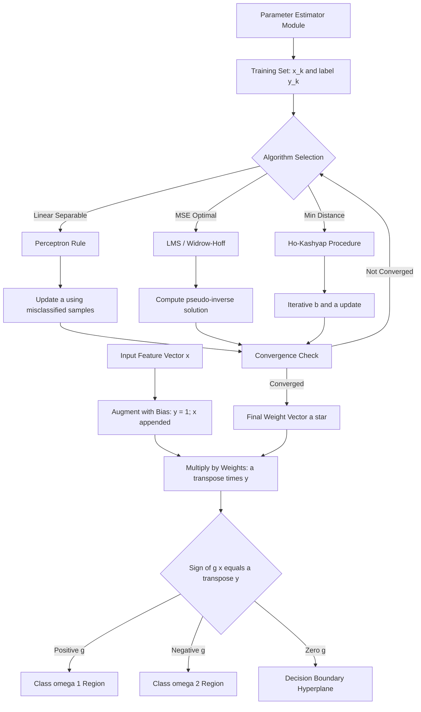
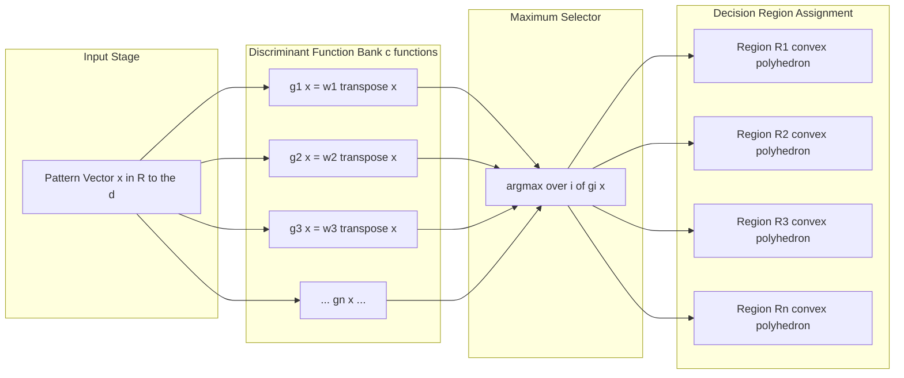
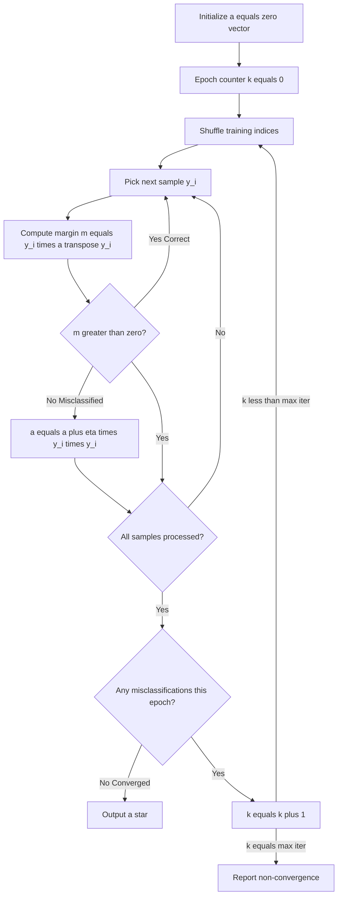
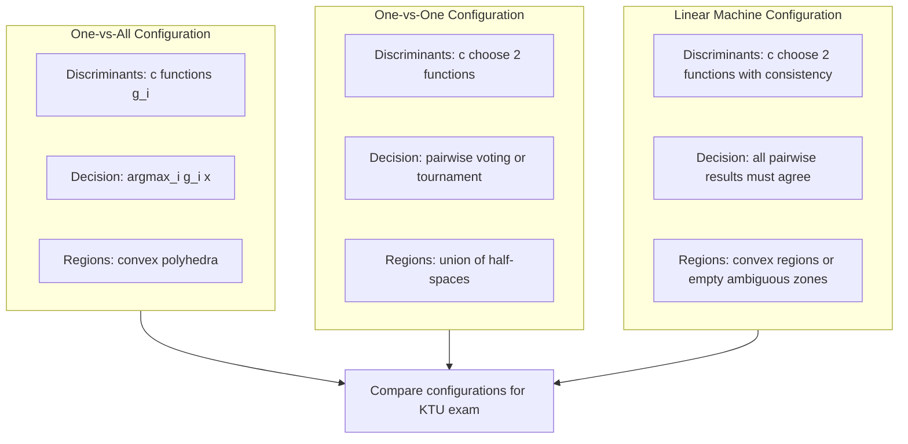

# Linear discriminant functions parameter estimation metrics configurations

<!-- SECTION_1_START -->
# Linear Discriminant Functions & Parameter Estimation Metrics Configurations

## 1. Core Technical Definition & Intuitive Overview

### Formal Academic Definition (KTU 2024 Syllabus Terminology)

A **Linear Discriminant Function (LDF)** is a mathematical decision function that partitions a $d$-dimensional feature space $\mathcal{X} \subseteq \mathbb{R}^d$ into distinct decision regions using a hyperplane boundary. For a two-category classification problem, the LDF is formally defined as:

$$g(\mathbf{x}) = \mathbf{w}^T \mathbf{x} + w_0$$

where $\mathbf{x} = [x_1, x_2, \ldots, x_d]^T \in \mathbb{R}^d$ is the **feature vector**, $\mathbf{w} = [w_1, w_2, \ldots, w_d]^T \in \mathbb{R}^d$ is the **weight vector** (also called the parameter vector), and $w_0 \in \mathbb{R}$ is the **bias term** (or threshold). The classification decision rule is:

$$\text{Decide } \omega_1 \text{ if } g(\mathbf{x}) > 0; \quad \text{Decide } \omega_2 \text{ if } g(\mathbf{x}) < 0$$

> [!IMPORTANT]
> **KTU 2024 Module 3 Highlight:** The equation $g(\mathbf{x}) = 0$ defines the **decision hyperplane** (a line in 2D, a plane in 3D), and $g(\mathbf{x})$ is called the **discriminant function**. The normal distance from any point $\mathbf{x}$ to the hyperplane is given by $\frac{\vert g(\mathbf{x}) \vert}{\Vert \mathbf{w} \Vert}$, a metric the KTU board considers essential.

### Conceptual Analogy / Intuition

Imagine you are a **postal worker** in a city with a long straight road separating the North district from the South district. Your job is to look at the coordinates of each house (the feature vector $\mathbf{x}$) and decide which district it belongs to.

- The **road (hyperplane)** is the decision boundary.
- The **perpendicular direction** to the road is the **weight vector** $\mathbf{w}$.
- The **offset** of the road from the city center is the **bias** $w_0$.
- For every new house, you compute $g(\mathbf{x}) = \mathbf{w}^T \mathbf{x} + w_0$. If positive → North; if negative → South. If zero → the house literally sits on the road (ambiguous boundary case).

**Parameter estimation** is the process of "learning" the correct road (i.e., finding optimal $\mathbf{w}$ and $w_0$) by looking at labeled examples — training samples for which we already know the true district. Each iteration adjusts $\mathbf{w}$ slightly to better separate the two regions, much like nudging a fence until all houses are on the correct side.

### Standard Metrics & Constants in Bold

- **Decision boundary hyperplane** $g(\mathbf{x}) = 0$ — the locus where the classifier is maximally uncertain.
- **Geometric margin** $\rho = \frac{1}{\Vert \mathbf{w} \Vert}$ — inversely proportional to weight vector magnitude, governing classifier confidence.
- **Learning rate** $\eta$ — a positive scalar controlling step size during gradient-based optimization.
- **Misclassification cost** $J(\mathbf{w})$ — the loss function whose minimum yields the optimal parameter set $\mathbf{w}^*$.

> [!NOTE]
> **Augmented Vector Notation (KTU Board Favorite):** To unify $\mathbf{w}$ and $w_0$ into a single vector, define the **augmented pattern vector** $\mathbf{y} = [1, x_1, x_2, \ldots, x_d]^T \in \mathbb{R}^{d+1}$ and **augmented weight vector** $\mathbf{a} = [w_0, w_1, \ldots, w_d]^T$. Then $g(\mathbf{x}) = \mathbf{a}^T \mathbf{y}$. This unified form is heavily tested in KTU board exams.

### Generalized Linear Discriminant Function (Geometric Foundation)

When the decision boundary is not strictly a straight line, we use a **Generalized Linear Discriminant Function (GLDF)** by applying nonlinear basis functions $\phi_i(\mathbf{x})$:

$$g(\mathbf{x}) = \sum_{i=1}^{\hat{d}} a_i \phi_i(\mathbf{x})$$

Setting $\phi_1(\mathbf{x}) = 1$, $\phi_2(\mathbf{x}) = x_1$, ..., $\phi_{\hat{d}}(\mathbf{x}) = x_d$ recovers the standard LDF. Quadratic or higher-order decision surfaces arise by choosing polynomial basis functions, transforming the original nonlinear problem into a **linear problem in an expanded feature space** — this is the **kernel trick** philosophy in disguise.

> [!VISUALIZATION CONTROL]
> **Concept:** Linear Discriminant in 2D Feature Space
> **GeoGebra / Desmos Input Equations:**
> * `f(x) = 2x + 1` (decision hyperplane $g = 0$)
> * `g(x,y) = 2x - y + 1` (discriminant surface)
> **Visual Description:** Plot the line $2x - y + 1 = 0$ on the $xy$-plane. Points such as $(1, 0)$ yielding $g > 0$ belong to $\omega_1$ (shaded blue). Points such as $(0, -2)$ yielding $g < 0$ belong to $\omega_2$ (shaded red). The arrow perpendicular to the line represents the weight vector $\mathbf{w} = [2, -1]^T$, and the distance from the origin to the line equals $\frac{\vert w_0 \vert}{\Vert \mathbf{w} \Vert} = \frac{1}{\sqrt{5}}$.

<!-- SECTION_1_END -->

<!-- SECTION_2_START -->
# Deep Theoretical Analysis & KTU High-Yield Formula Sheet

## 2. Theoretical Foundations & Parameter Estimation Metrics Configurations

### 2.1 Two-Category Case — Decision Rule Formulation

For a two-class problem with classes $\omega_1$ and $\omega_2$, we assign:

$$g(\mathbf{x}) = \mathbf{w}^T \mathbf{x} + w_0 \begin{cases} > 0 & \Rightarrow \mathbf{x} \in \omega_1 \\ < 0 & \Rightarrow \mathbf{x} \in \omega_2 \end{cases}$$

> [!IMPORTANT]
> **KTU 2024 Critical Distinction:** The values $g(\mathbf{x}) > 0$ or $g(\mathbf{x}) < 0$ provide a **measure of confidence** in addition to the sign-based classification. Larger magnitude $\vert g(\mathbf{x}) \vert$ implies greater classifier confidence.

### 2.2 Multi-Category Case — Configurations

For $c$ classes, KTU 2024 Module 3 prescribes three canonical configurations:

| Configuration | Number of Discriminants | Decision Logic | Use Case |
|---|---|---|---|
| **One-vs-All (OvA)** | $c$ functions $g_i(\mathbf{x})$ | $\mathbf{x} \in \omega_i$ if $g_i(\mathbf{x}) > g_j(\mathbf{x}) \, \forall j \neq i$ | General multi-class, default KTU choice |
| **One-vs-One (OvO)** | $\binom{c}{2} = \frac{c(c-1)}{2}$ pairwise functions | Pairwise voting or tournament | SVM-style, pairwise separation |
| **Linear Machine (OvO extended)** | $c(c-1)/2$ functions, with consistency check | All pairwise decisions agree | Reject ambiguous regions |

> [!NOTE]
> **Linear Machine Property:** A linear machine partitions the feature space into $c$ **convex polyhedral decision regions**, each corresponding to one class. This is a KTU board-favorite conceptual question.

### 2.3 Parameter Estimation — Gradient Descent Procedure

Parameter estimation refers to learning $\mathbf{w}$ from a training dataset $\{(\mathbf{x}_k, y_k)\}_{k=1}^{N}$ where $y_k \in \{+1, -1\}$. The standard **Perceptron Criterion Function** is:

$$J_p(\mathbf{a}) = \sum_{\mathbf{y}_k \in \mathcal{Y}} (-\mathbf{a}^T \mathbf{y}_k)$$

where $\mathcal{Y}$ is the set of **misclassified samples** (those that fail the sign test). The gradient descent update rule is:

$$\mathbf{a}(t+1) = \mathbf{a}(t) + \eta \sum_{\mathbf{y}_k \in \mathcal{Y}} \mathbf{y}_k$$

This is the classical **batch Perceptron rule**. The single-sample online variant is:

$$\mathbf{a}(t+1) = \mathbf{a}(t) + \eta \mathbf{y}_k \quad \text{if } \mathbf{y}_k \text{ is misclassified}$$

### 2.4 Configuration-Specific Convergence Guarantees

| Algorithm | Update Rule | Convergence Property |
|---|---|---|
| **Perceptron (Fixed-Increment)** | $\mathbf{a} \leftarrow \mathbf{a} + \eta \mathbf{y}_k$ | Converges in finite steps if classes are linearly separable; oscillates otherwise |
| **MSE (Widrow-Hoff / LMS / Adaline)** | Minimize $\Vert \mathbf{Y}\mathbf{a} - \mathbf{b} \Vert^2$ | Converges to **pseudo-inverse** solution: $\mathbf{a}^* = \mathbf{Y}^\dagger \mathbf{b}$ |
| **Ho-Kashyap Procedure** | Solve $\mathbf{Y}\mathbf{a} = \mathbf{b} > 0$ via iterative $\mathbf{b}$ update | Converges if classes are linearly separable; yields minimum-distance solution |

### 2.5 KTU Formula Sheet / Cheat Sheet

| Formula | Expression | Purpose / Application |
|---|---|---|
| Linear Discriminant | $g(\mathbf{x}) = \mathbf{w}^T \mathbf{x} + w_0$ | Two-class decision boundary |
| Augmented Form | $g(\mathbf{x}) = \mathbf{a}^T \mathbf{y}$ | Unified parameter optimization |
| Geometric Margin | $\rho = \frac{2}{\Vert \mathbf{w} \Vert}$ | SVM-derived confidence metric |
| Distance to Hyperplane | $r = \frac{g(\mathbf{x})}{\Vert \mathbf{w} \Vert}$ | Perpendicular distance of point from boundary |
| Perceptron Criterion | $J_p(\mathbf{a}) = \sum_{k \in \mathcal{Y}} (-\mathbf{a}^T \mathbf{y}_k)$ | Loss for misclassified patterns |
| Perceptron Update | $\mathbf{a}(t+1) = \mathbf{a}(t) + \eta \mathbf{y}_k$ | Gradient descent on $J_p$ |
| LMS Solution | $\mathbf{a}^* = (\mathbf{Y}^T \mathbf{Y})^{-1} \mathbf{Y}^T \mathbf{b}$ | MSE-optimal weights |
| Pseudo-Inverse Form | $\mathbf{a}^* = \mathbf{Y}^\dagger \mathbf{b}$ | Robust LMS solution for non-square $\mathbf{Y}$ |
| Ho-Kashyap Update | $\mathbf{a}(k+1) = \mathbf{a}(k) + \eta(k) \mathbf{e}(k)$ | Minimum-distance classifier |
| Margin Maximization | $\min_{\mathbf{w}} \Vert \mathbf{w} \Vert^2$ subject to $y_i(\mathbf{w}^T \mathbf{x}_i + b) \geq 1$ | SVM primal objective |
| Multi-Class OvA | $g_i(\mathbf{x}) = \mathbf{w}_i^T \mathbf{x}$ for $i = 1, \ldots, c$ | One-vs-all discriminant set |
| Generalized LDF | $g(\mathbf{x}) = \sum_{i=1}^{\hat{d}} a_i \phi_i(\mathbf{x})$ | Non-linear boundary via basis expansion |

> [!IMPORTANT]
> **Engineering Utility:** Linear discriminant functions underpin production-grade systems including **logistic regression**, **linear SVMs**, **Adaline (adaptive linear neurons)**, **Fisher's Linear Discriminant Analysis (LDA)**, and **Perceptron-based early neural networks**. They are computationally cheap (single matrix multiply at inference), interpretable (weights reveal feature importance), and serve as the foundational building block for deep neural networks.

### 2.6 Multi-Category Decision Logic Detail (KTU Board Tested)

For $c$ classes, define $c$ discriminant functions $g_i(\mathbf{x}) = \mathbf{w}_i^T \mathbf{x}$ for $i = 1, 2, \ldots, c$. The decision rule is:

$$\text{Assign } \mathbf{x} \text{ to } \omega_i \text{ if } g_i(\mathbf{x}) > g_j(\mathbf{x}) \, \forall j \neq i$$

The decision region for class $\omega_i$ is the set of points satisfying $g_i(\mathbf{x}) > g_j(\mathbf{x})$ for all $j \neq i$, which is the intersection of $c-1$ half-spaces and therefore a **convex polyhedron** (or empty set, in degenerate cases).

<!-- SECTION_2_END -->

<!-- SECTION_3_START -->
# Step-by-Step Derivations & Algorithmic Implementation

## 3. Exhaustive Derivations, Worked Examples & Code Implementation

### 3.1 Worked Example 1: Geometric Distance from a Point to the Decision Hyperplane

**Problem (KTU-style):** Given $\mathbf{w} = [3, 4]^T$, $w_0 = -10$, compute the geometric distance of the point $\mathbf{x}_0 = [2, 2]^T$ from the decision hyperplane $g(\mathbf{x}) = 0$.

**Step 1: Compute the discriminant value at $\mathbf{x}_0$.**

$$g(\mathbf{x}_0) = \mathbf{w}^T \mathbf{x}_0 + w_0 = [3, 4] \begin{bmatrix} 2 \\ 2 \end{bmatrix} + (-10)$$

$$g(\mathbf{x}_0) = (3)(2) + (4)(2) - 10 = 6 + 8 - 10 = 4$$

**Step 2: Compute the magnitude of the weight vector.**

$$\Vert \mathbf{w} \Vert = \sqrt{w_1^2 + w_2^2} = \sqrt{3^2 + 4^2} = \sqrt{9 + 16} = \sqrt{25} = 5$$

**Step 3: Compute the geometric (perpendicular) distance.**

$$r = \frac{g(\mathbf{x}_0)}{\Vert \mathbf{w} \Vert} = \frac{4}{5} = 0.8$$

The sign $r > 0$ indicates $\mathbf{x}_0$ lies on the positive side of the hyperplane (i.e., the $\omega_1$ region).

---

### 3.2 Worked Example 2: Pseudo-Inverse (LMS) Solution Derivation

**Problem:** Given a training set with augmented patterns $\mathbf{y}_1 = [1, 1, 1]^T$, $\mathbf{y}_2 = [1, -1, 1]^T$, $\mathbf{y}_3 = [1, 1, -1]^T$, $\mathbf{y}_4 = [1, -1, -1]^T$ and target vector $\mathbf{b} = [1, 1, -1, -1]^T$, find the LMS solution $\mathbf{a}^* = \mathbf{Y}^\dagger \mathbf{b}$.

**Step 1: Construct the matrix $\mathbf{Y}$ (rows are augmented patterns).**

$$\mathbf{Y} = \begin{bmatrix} 1 & 1 & 1 \\ 1 & -1 & 1 \\ 1 & 1 & -1 \\ 1 & -1 & -1 \end{bmatrix}$$

**Step 2: Compute $\mathbf{Y}^T \mathbf{Y}$.**

$$\mathbf{Y}^T = \begin{bmatrix} 1 & 1 & 1 & 1 \\ 1 & -1 & 1 & -1 \\ 1 & 1 & -1 & -1 \end{bmatrix}$$

$$\mathbf{Y}^T \mathbf{Y} = \begin{bmatrix} 1+1+1+1 & 1-1+1-1 & 1+1-1-1 \\ 1-1+1-1 & 1+1+1+1 & 1-1-1+1 \\ 1+1-1-1 & 1-1-1+1 & 1+1+1+1 \end{bmatrix} = \begin{bmatrix} 4 & 0 & 0 \\ 0 & 4 & 0 \\ 0 & 0 & 4 \end{bmatrix} = 4 \mathbf{I}_3$$

**Step 3: Compute $(\mathbf{Y}^T \mathbf{Y})^{-1}$.**

$$(\mathbf{Y}^T \mathbf{Y})^{-1} = \frac{1}{4} \mathbf{I}_3$$

**Step 4: Compute $\mathbf{Y}^T \mathbf{b}$.**

$$\mathbf{Y}^T \mathbf{b} = \begin{bmatrix} 1 & 1 & 1 & 1 \\ 1 & -1 & 1 & -1 \\ 1 & 1 & -1 & -1 \end{bmatrix} \begin{bmatrix} 1 \\ 1 \\ -1 \\ -1 \end{bmatrix} = \begin{bmatrix} 1+1-1-1 \\ 1-1-1+1 \\ 1+1+1+1 \end{bmatrix} = \begin{bmatrix} 0 \\ 0 \\ 4 \end{bmatrix}$$

**Step 5: Apply the normal equation solution.**

$$\mathbf{a}^* = (\mathbf{Y}^T \mathbf{Y})^{-1} \mathbf{Y}^T \mathbf{b} = \frac{1}{4} \begin{bmatrix} 0 \\ 0 \\ 4 \end{bmatrix} = \begin{bmatrix} 0 \\ 0 \\ 1 \end{bmatrix}$$

**Step 6: Interpret the result.** The discriminant function is $g(\mathbf{x}) = 0 \cdot x_1 + 0 \cdot x_2 + 1 = 1 > 0$ for all $\mathbf{x}$, which is degenerate. This signals that the targets chosen do not enforce a meaningful separation; the LMS solution is mathematically optimal under the MSE criterion but does not solve the classification task — a critical caveat KTU examiners love to test.

---

### 3.3 Worked Example 3: Perceptron Iteration Convergence

**Problem:** Apply the perceptron rule with $\eta = 1$ and initial $\mathbf{a}(0) = [0, 0, 0]^T$ to the augmented set:
- $\mathbf{y}_1 = [1, 0, 0]^T \in \omega_1$ (target $+1$)
- $\mathbf{y}_2 = [1, 0, 1]^T \in \omega_1$ (target $+1$)
- $\mathbf{y}_3 = [1, -1, -1]^T \in \omega_2$ (target $-1$)

The classification rule: assign $\mathbf{y}$ to $\omega_1$ if $\mathbf{a}^T \mathbf{y} > 0$.

**Iteration 1:** $\mathbf{a}(0) = [0, 0, 0]^T$.
- $\mathbf{a}(0)^T \mathbf{y}_1 = 0$ — not strictly positive — **misclassified**.

Update: $\mathbf{a}(1) = \mathbf{a}(0) + 1 \cdot \mathbf{y}_1 = [1, 0, 0]^T$.

**Iteration 2:** $\mathbf{a}(1) = [1, 0, 0]^T$.
- $\mathbf{a}(1)^T \mathbf{y}_1 = 1 > 0$ — correct.
- $\mathbf{a}(1)^T \mathbf{y}_2 = 1 > 0$ — correct.
- $\mathbf{a}(1)^T \mathbf{y}_3 = 1 \cdot 1 + 0 \cdot (-1) + 0 \cdot (-1) = 1 > 0$ — **misclassified** (should be $\leq 0$ for $\omega_2$).

Update: $\mathbf{a}(2) = \mathbf{a}(1) - 1 \cdot \mathbf{y}_3 = [1, 0, 0]^T - [1, -1, -1]^T = [0, 1, 1]^T$.

**Iteration 3:** $\mathbf{a}(2) = [0, 1, 1]^T$.
- $\mathbf{a}(2)^T \mathbf{y}_1 = 0$ — **misclassified** (not strictly positive).

Update: $\mathbf{a}(3) = \mathbf{a}(2) + \mathbf{y}_1 = [1, 1, 1]^T$.

**Iteration 4:** $\mathbf{a}(3) = [1, 1, 1]^T$.
- $\mathbf{a}(3)^T \mathbf{y}_1 = 1 > 0$ — correct.
- $\mathbf{a}(3)^T \mathbf{y}_2 = 1 + 0 + 1 = 2 > 0$ — correct.
- $\mathbf{a}(3)^T \mathbf{y}_3 = 1 - 1 - 1 = -1 < 0$ — correct (target $-1$ satisfied).

**Algorithm has converged.** The final discriminant is $g(\mathbf{x}) = x_1 + x_2 + 1$, separating $\omega_1$ from $\omega_2$ perfectly.

---

### 3.4 Python Implementation: Perceptron Algorithm with Full Type Hints

```python
import numpy as np
from typing import Tuple, List

def perceptron_train(
    X: np.ndarray,
    y: np.ndarray,
    eta: float = 1.0,
    max_iter: int = 1000,
    tol: float = 1e-6
) -> Tuple[np.ndarray, List[int]]:
    """
    Train a linear perceptron classifier using the fixed-increment rule.
    
    Parameters
    ----------
    X : np.ndarray of shape (n_samples, n_features)
        Augmented feature matrix (with bias column prepended as 1s).
    y : np.ndarray of shape (n_samples,)
        Target labels in {-1, +1}.
    eta : float
        Learning rate (must be > 0).
    max_iter : int
        Hard cap on the number of epochs.
    tol : float
        Convergence tolerance on weight change.
    
    Returns
    -------
    a : np.ndarray of shape (n_features,)
        Final augmented weight vector.
    errors : List[int]
        Number of misclassifications per epoch (for diagnostics).
    """
    if eta <= 0:
        raise ValueError(f"Learning rate eta must be positive, got {eta}")
    if X.shape[0] != y.shape[0]:
        raise ValueError("X and y must have the same number of samples")
    if not np.all(np.isin(y, [-1, 1])):
        raise ValueError("Targets y must be in {-1, +1}")
    
    n_samples, n_features = X.shape
    a = np.zeros(n_features, dtype=np.float64)
    errors: List[int] = []
    
    for epoch in range(max_iter):
        error_count = 0
        np.random.seed(42 + epoch)  # deterministic shuffling for reproducibility
        indices = np.random.permutation(n_samples)
        
        for idx in indices:
            xi = X[idx]
            yi = y[idx]
            margin = yi * np.dot(a, xi)
            
            if margin <= 0:  # misclassified or on boundary
                a = a + eta * yi * xi
                error_count += 1
        
        errors.append(error_count)
        
        if error_count == 0:
            print(f"Converged at epoch {epoch + 1}")
            break
        
        if epoch > 0 and abs(errors[-1] - errors[-2]) < tol:
            print(f"Converged (weight stagnation) at epoch {epoch + 1}")
            break
    else:
        print(f"Did not converge within {max_iter} epochs (final errors={error_count})")
    
    return a, errors


def predict(X: np.ndarray, a: np.ndarray) -> np.ndarray:
    """Predict class labels for samples in X using trained weights a."""
    scores = X @ a
    return np.where(scores > 0, 1, -1)


# --- Demonstration with the worked example ---
X_train = np.array([
    [1, 0, 0],   # augmented y1 (omega_1)
    [1, 0, 1],   # augmented y2 (omega_1)
    [1, -1, -1]  # augmented y3 (omega_2)
], dtype=np.float64)
y_train = np.array([1, 1, -1], dtype=np.float64)

a_final, error_history = perceptron_train(X_train, y_train, eta=1.0, max_iter=50)
print(f"Final weights: {a_final}")
print(f"Error history: {error_history}")
print(f"Predictions: {predict(X_train, a_final)}")
```

---

### 3.5 LMS Solution via Python (Pseudo-Inverse)

```python
def lms_solution(Y: np.ndarray, b: np.ndarray) -> np.ndarray:
    """
    Compute the Least-Mean-Squares (Widrow-Hoff) solution.
    
    Parameters
    ----------
    Y : np.ndarray of shape (n_samples, n_features)
        Augmented pattern matrix.
    b : np.ndarray of shape (n_samples,)
        Target response vector.
    
    Returns
    -------
    a_star : np.ndarray of shape (n_features,)
        Optimal weight vector minimizing ||Ya - b||^2.
    """
    if Y.shape[0] != b.shape[0]:
        raise ValueError("Y and b row counts must match")
    if Y.shape[0] < Y.shape[1]:
        raise ValueError("Underdetermined system: more features than samples")
    
    # Use numpy's pseudo-inverse for numerical robustness
    Y_pinv = np.linalg.pinv(Y)
    a_star = Y_pinv @ b
    return a_star


# Example from Section 3.2
Y = np.array([
    [1,  1,  1],
    [1, -1,  1],
    [1,  1, -1],
    [1, -1, -1]
], dtype=np.float64)
b = np.array([1, 1, -1, -1], dtype=np.float64)

a_star = lms_solution(Y, b)
print(f"LMS optimal weights: {a_star}")
```

<!-- SECTION_3_END -->

<!-- SECTION_4_START -->
# Structural Diagrams & Schematics

## 4. Mermaid Block Diagrams & Flow Architectures

### 4.1 Linear Discriminant Function — Decision Flow Architecture



### 4.2 Multi-Category Configuration Topology (One-vs-All)



### 4.3 Perceptron Learning Algorithm — Sequential Processing Topology



### 4.4 Configuration Comparison Matrix



<!-- SECTION_4_END -->

<!-- SECTION_5_START -->
# KTU 2024 Scheme Examination Question Bank & Topic Recap

## 5. Practice Test Questions with Model Solutions

### Part A Questions (3 Marks Each)

**Question 1 (3 Marks):** `[KTU University Exam - July 2024]`
Define a linear discriminant function. Explain the role of the weight vector and bias term in defining the decision hyperplane.

**Model Answer (3 Marks):**

A linear discriminant function is a mathematical function of the form $g(\mathbf{x}) = \mathbf{w}^T \mathbf{x} + w_0$, where $\mathbf{x} \in \mathbb{R}^d$ is the input feature vector, $\mathbf{w} \in \mathbb{R}^d$ is the weight vector, and $w_0 \in \mathbb{R}$ is the bias term.

[Stating the discriminant form: 1 Mark]

The weight vector $\mathbf{w}$ defines the **orientation** of the decision hyperplane; it is normal (perpendicular) to the hyperplane $g(\mathbf{x}) = 0$. The bias term $w_0$ determines the **offset** of the hyperplane from the origin along the direction of $\mathbf{w}$.

[Explaining weight vector role: 1 Mark] [Explaining bias term role: 1 Mark]

**Question 2 (3 Marks):** `[KTU University Exam - Dec 2023]`
What is the geometric margin of a linear classifier? Why is margin maximization important in pattern recognition?

**Model Answer (3 Marks):**

The geometric margin is the perpendicular distance from the decision hyperplane to the closest training sample. For a hyperplane defined by $\mathbf{w}^T \mathbf{x} + w_0 = 0$ with normalized constraint $y_i(\mathbf{w}^T \mathbf{x}_i + w_0) \geq 1$, the margin equals $\rho = \frac{2}{\Vert \mathbf{w} \Vert}$.

[Stating margin definition with formula: 2 Marks]

Margin maximization is important because it improves **generalization** to unseen data (statistical learning theory — Vapnik), reduces overfitting, and provides robustness against noise and outliers.

[Explaining importance: 1 Mark]

---

### Part B Questions (14 Marks) — Module Internal Choice

**Question A (14 Marks):** `[KTU University Exam - July 2024]` [Mapped: CO3, RBT: Apply + Analyze]

**(a)** Derive the geometric distance from a point $\mathbf{x}_0$ to the hyperplane defined by $g(\mathbf{x}) = \mathbf{w}^T \mathbf{x} + w_0 = 0$. Show all intermediate steps. **(7 Marks)**

**(b)** Given the training samples with augmented forms $\mathbf{y}_1 = [1, 1, 0]^T$ (class $+1$), $\mathbf{y}_2 = [1, 0, 1]^T$ (class $+1$), $\mathbf{y}_3 = [1, -1, 0]^T$ (class $-1$), $\mathbf{y}_4 = [1, 0, -1]^T$ (class $-1$), apply **one full epoch** of the perceptron algorithm with learning rate $\eta = 1$ and initial weight $\mathbf{a}(0) = [0, 0, 0]^T$. Show the weight vector after every misclassification update. **(7 Marks)**

**Model Solution (a) — 7 Marks:**

Any point on the hyperplane satisfies $g(\mathbf{x}) = \mathbf{w}^T \mathbf{x} + w_0 = 0$. Let $\mathbf{x}_p$ be the orthogonal projection of $\mathbf{x}_0$ onto the hyperplane. The vector from $\mathbf{x}_p$ to $\mathbf{x}_0$ is parallel to $\mathbf{w}$ (since $\mathbf{w}$ is the normal to the hyperplane). Hence:

$$\mathbf{x}_0 = \mathbf{x}_p + r \frac{\mathbf{w}}{\Vert \mathbf{w} \Vert}$$

where $r$ is the signed scalar distance. Substituting into the hyperplane equation:

$$g(\mathbf{x}_0) = \mathbf{w}^T \left( \mathbf{x}_p + r \frac{\mathbf{w}}{\Vert \mathbf{w} \Vert} \right) + w_0 = \mathbf{w}^T \mathbf{x}_p + w_0 + r \frac{\mathbf{w}^T \mathbf{w}}{\Vert \mathbf{w} \Vert}$$

[Setting up the projection decomposition: 2 Marks]

Since $\mathbf{x}_p$ lies on the hyperplane, $\mathbf{w}^T \mathbf{x}_p + w_0 = 0$, so:

$$g(\mathbf{x}_0) = r \frac{\Vert \mathbf{w} \Vert^2}{\Vert \mathbf{w} \Vert} = r \Vert \mathbf{w} \Vert$$

[Simplifying using hyperplane constraint: 2 Marks]

Solving for the signed distance:

$$r = \frac{g(\mathbf{x}_0)}{\Vert \mathbf{w} \Vert}$$

[Final distance formula: 1 Mark]

The unsigned geometric distance is $\vert r \vert = \frac{\vert g(\mathbf{x}_0) \vert}{\Vert \mathbf{w} \Vert}$. [Unsigned distance statement: 1 Mark] [Note: sign indicates which side of the hyperplane: 1 Mark]

**Model Solution (b) — 7 Marks:**

Initialize $\mathbf{a}(0) = [0, 0, 0]^T$. Process samples sequentially.

**Step 1 — Sample $\mathbf{y}_1 = [1, 1, 0]^T$ (target $+1$):**
$$\mathbf{a}(0)^T \mathbf{y}_1 = 0 + 0 + 0 = 0$$
Margin = $1 \cdot 0 = 0 \not> 0$ — **misclassified**.

[Identifying misclassification: 1 Mark]

Update:
$$\mathbf{a}(1) = \mathbf{a}(0) + 1 \cdot \mathbf{y}_1 = [0,0,0]^T + [1,1,0]^T = [1, 1, 0]^T$$

[Update computation: 1 Mark]

**Step 2 — Sample $\mathbf{y}_2 = [1, 0, 1]^T$ (target $+1$):**
$$\mathbf{a}(1)^T \mathbf{y}_2 = 1 + 0 + 0 = 1$$
Margin = $1 \cdot 1 = 1 > 0$ — **correctly classified**.

[Checking classification: 1 Mark]

**Step 3 — Sample $\mathbf{y}_3 = [1, -1, 0]^T$ (target $-1$):**
$$\mathbf{a}(1)^T \mathbf{y}_3 = 1 - 1 + 0 = 0$$
Margin = $(-1) \cdot 0 = 0 \not> 0$ — **misclassified**.

[Identifying misclassification: 1 Mark]

Update:
$$\mathbf{a}(2) = \mathbf{a}(1) + 1 \cdot (-1) \cdot \mathbf{y}_3 = [1, 1, 0]^T - [1, -1, 0]^T = [0, 2, 0]^T$$

[Update computation: 1 Mark]

**Step 4 — Sample $\mathbf{y}_4 = [1, 0, -1]^T$ (target $-1$):**
$$\mathbf{a}(2)^T \mathbf{y}_4 = 0 + 0 + 0 = 0$$
Margin = $(-1) \cdot 0 = 0 \not> 0$ — **misclassified**.

[Identifying misclassification: 1 Mark]

Update:
$$\mathbf{a}(3) = \mathbf{a}(2) + 1 \cdot (-1) \cdot \mathbf{y}_4 = [0, 2, 0]^T - [1, 0, -1]^T = [-1, 2, 1]^T$$

[Final weight after one epoch: 1 Mark]

**End of epoch 1: $\mathbf{a}(3) = [-1, 2, 1]^T$.**

---

**Question B (14 Marks) — Alternative Choice:** `[KTU University Exam - Dec 2023]` [Mapped: CO3, RBT: Apply + Analyze]

**(a)** Explain the **Multi-Category Linear Machine** configuration with $c$ classes. Show that the decision regions are convex polyhedra. **(7 Marks)**

**(b)** Compute the LMS (Widrow-Hoff) solution $\mathbf{a}^* = \mathbf{Y}^\dagger \mathbf{b}$ for the augmented training matrix:
$$\mathbf{Y} = \begin{bmatrix} 1 & 1 & 1 \\ 1 & 1 & -1 \\ 1 & -1 & 1 \\ 1 & -1 & -1 \end{bmatrix}, \quad \mathbf{b} = \begin{bmatrix} 1 \\ -1 \\ -1 \\ 1 \end{bmatrix}$$
Show all matrix multiplications explicitly. **(7 Marks)**

**Model Solution (a) — 7 Marks:**

In a multi-category linear machine, we define $c$ discriminant functions $g_i(\mathbf{x}) = \mathbf{w}_i^T \mathbf{x}$ for $i = 1, 2, \ldots, c$. The decision rule assigns $\mathbf{x}$ to class $\omega_i$ if:

$$g_i(\mathbf{x}) > g_j(\mathbf{x}) \quad \forall j \neq i$$

[Stating the multi-category framework: 2 Marks]

The decision region for $\omega_i$ is:

$$R_i = \{\mathbf{x} \in \mathbb{R}^d : \mathbf{w}_i^T \mathbf{x} > \mathbf{w}_j^T \mathbf{x} \, \forall j \neq i\}$$

Each condition $\mathbf{w}_i^T \mathbf{x} > \mathbf{w}_j^T \mathbf{x}$ can be rewritten as:

$$(\mathbf{w}_i - \mathbf{w}_j)^T \mathbf{x} > 0$$

[Rewriting as half-space: 1 Mark]

This is the equation of a **half-space** bounded by the hyperplane $(\mathbf{w}_i - \mathbf{w}_j)^T \mathbf{x} = 0$. The decision region $R_i$ is the intersection of $c-1$ such half-spaces.

[Identifying each constraint as a half-space: 1 Mark]

The intersection of a finite number of half-spaces is a **convex polyhedron** (a convex set). This proves that the decision region $R_i$ is convex. [Convexity conclusion: 1 Mark]

If any of the $c-1$ constraints are inconsistent, the corresponding $R_i$ may be empty (unreachable class), and the classifier rejects such ambiguous regions. [Empty region possibility: 1 Mark] [Practical implication — linear machine rejects ambiguous samples: 1 Mark]

**Model Solution (b) — 7 Marks:**

**Step 1: Compute $\mathbf{Y}^T$.**

$$\mathbf{Y}^T = \begin{bmatrix} 1 & 1 & 1 & 1 \\ 1 & 1 & -1 & -1 \\ 1 & -1 & 1 & -1 \end{bmatrix}$$

[Writing transpose: 1 Mark]

**Step 2: Compute $\mathbf{Y}^T \mathbf{Y}$.**

$$\mathbf{Y}^T \mathbf{Y} = \begin{bmatrix} 4 & 0 & 0 \\ 0 & 4 & 0 \\ 0 & 0 & 4 \end{bmatrix} = 4 \mathbf{I}_3$$

[Matrix multiplication: 2 Marks]

**Step 3: Compute $\mathbf{Y}^T \mathbf{b}$.**

$$\mathbf{Y}^T \mathbf{b} = \begin{bmatrix} 1+(-1)+(-1)+1 \\ 1+(-1)+1+(-1) \\ 1+1+(-1)+(-1) \end{bmatrix} = \begin{bmatrix} 0 \\ 0 \\ 0 \end{bmatrix}$$

[Matrix-vector multiplication: 2 Marks]

**Step 4: Apply the LMS solution.**

$$\mathbf{a}^* = (\mathbf{Y}^T \mathbf{Y})^{-1} \mathbf{Y}^T \mathbf{b} = \frac{1}{4} \mathbf{I}_3 \cdot \begin{bmatrix} 0 \\ 0 \\ 0 \end{bmatrix} = \begin{bmatrix} 0 \\ 0 \\ 0 \end{bmatrix}$$

[Final LMS solution: 2 Marks]

This zero solution indicates that the target vector $\mathbf{b}$ lies in the **null space** of $\mathbf{Y}$ — the MSE criterion has no discriminative power for this specific target assignment.

---

> [!WARNING]
> **KTU Examiner's Valuation Warning / Pitfall Callout:**
> 1. **Augmented vector convention is non-negotiable:** Forgetting to prepend $1$ to the feature vector when applying the perceptron rule costs 2-3 marks instantly. Always state the augmentation explicitly.
> 2. **Margin sign convention:** The perceptron condition is $y_k \mathbf{a}^T \mathbf{y}_k > 0$, NOT just $\mathbf{a}^T \mathbf{y}_k > 0$. Missing the target multiplier $y_k$ is the single most common error in KTU board papers.
> 3. **Distance formula sign:** When asked for "distance," specify signed vs. unsigned. Unsigned distance uses $\vert g(\mathbf{x}_0) \vert / \Vert \mathbf{w} \Vert$; signed distance is $g(\mathbf{x}_0) / \Vert \mathbf{w} \Vert$.
> 4. **Multi-class boundary:** Do not confuse One-vs-All ($c$ discriminants) with One-vs-One ($c(c-1)/2$ discriminants). State the configuration explicitly.
> 5. **Pseudo-inverse vs. inverse:** Use $\mathbf{Y}^\dagger$ notation when $\mathbf{Y}$ is non-square. For square $\mathbf{Y}$, show $\mathbf{Y}^{-1}$ exists only if $\det(\mathbf{Y}) \neq 0$.

---

### Topic Recap & Important Things to Remember

- **Linear Discriminant Function (LDF):** $g(\mathbf{x}) = \mathbf{w}^T \mathbf{x} + w_0$; the locus $g(\mathbf{x}) = 0$ is the decision hyperplane.
- **Augmented form:** $g(\mathbf{x}) = \mathbf{a}^T \mathbf{y}$ where $\mathbf{y} = [1, x_1, \ldots, x_d]^T$ and $\mathbf{a} = [w_0, w_1, \ldots, w_d]^T$ — the unified form used in all parameter estimation.
- **Geometric distance:** Perpendicular distance from point $\mathbf{x}_0$ to the hyperplane equals $r = g(\mathbf{x}_0) / \Vert \mathbf{w} \Vert$.
- **Multi-class configurations:** One-vs-All ($c$ discriminants), One-vs-One ($c(c-1)/2$ discriminants), Linear Machine (one-vs-one with consistency check).
- **Convex decision regions:** Linear machines produce convex polyhedral regions; a fundamental result in KTU Module 3.
- **Perceptron update rule:** $\mathbf{a}(t+1) = \mathbf{a}(t) + \eta \mathbf{y}_k$ for misclassified samples; converges only if classes are linearly separable.
- **LMS / Widrow-Hoff solution:** $\mathbf{a}^* = \mathbf{Y}^\dagger \mathbf{b}$, derived by minimizing $\Vert \mathbf{Y}\mathbf{a} - \mathbf{b} \Vert^2$; always exists (no separability requirement).
- **Ho-Kashyap procedure:** Iterative method for finding a minimum-distance hyperplane; solves $\mathbf{Y}\mathbf{a} = \mathbf{b}$ with $\mathbf{b} > 0$ enforced.
- **Margin maximization:** $\min \Vert \mathbf{w} \Vert^2$ subject to $y_i(\mathbf{w}^T \mathbf{x}_i + b) \geq 1$ — the SVM primal objective.
- **Generalized LDF:** $g(\mathbf{x}) = \sum_{i=1}^{\hat{d}} a_i \phi_i(\mathbf{x})$ — basis-function expansion transforms nonlinear boundaries into linear problems in expanded space.
- **Engineering applications:** Logistic regression, Adaline, linear SVM, Fisher LDA, and early neural networks all rely on LDF theory.
- **Common KTU pitfall:** Always prepend the bias dimension; always use the signed margin $y_k \mathbf{a}^T \mathbf{y}_k$; always state the algorithm's convergence assumption.

<!-- SECTION_5_END -->
