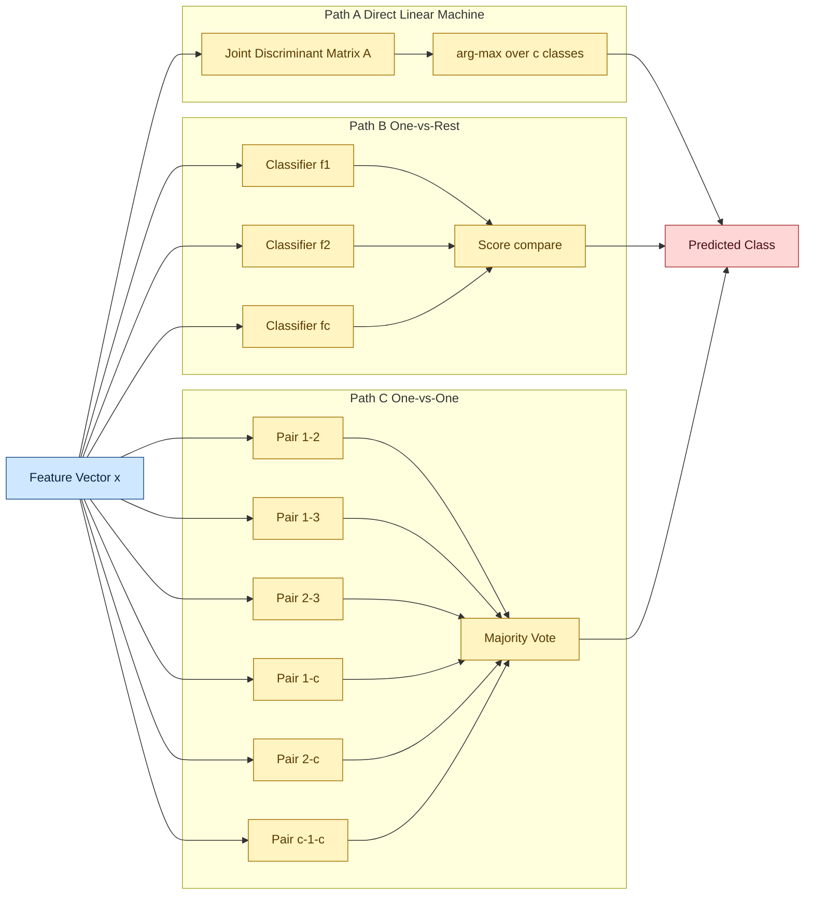
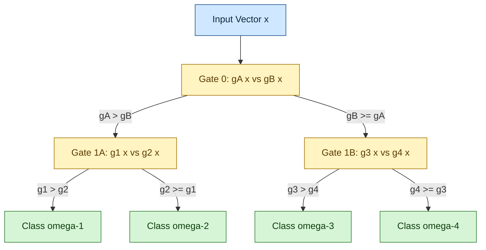
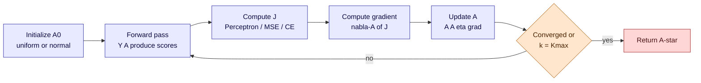
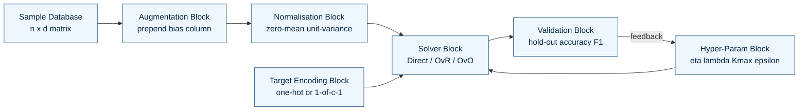

# Multi-class classification paths routing logic optimizations parameters setups

<!-- SECTION_1_START -->
# Multi-Class Classification Paths & Routing Logic — Optimized Discriminant Networks

## Formal KTU 2024 Definition

**Multi-class discriminant classification** is the procedure of partitioning a $d$-dimensional feature space $\mathcal{X} \subseteq \mathbb{R}^{d}$ into $c$ mutually exclusive decision regions $\mathcal{R}_1, \mathcal{R}_2, \dots, \mathcal{R}_c$ by means of a set of $c$ **discriminant functions** $g_i(\mathbf{x})$, $i=1,2,\dots,c$. An unknown pattern $\mathbf{x}$ is *routed* to class $\omega_i$ if

$$g_i(\mathbf{x}) > g_j(\mathbf{x}) \quad \forall\, j \neq i.$$

The *paths* are the geometric loci where two discriminant functions become equal — the **decision boundaries**:

$$g_i(\mathbf{x}) - g_j(\mathbf{x}) = 0 \quad (i \neq j).$$

When every $g_i(\mathbf{x})$ is linear in $\mathbf{x}$, the boundaries are hyperplanes and the network is a **linear machine**; when non-linear basis functions $\phi(\mathbf{x})$ or kernel mappings are introduced, the network becomes a **non-linear discriminant network**.

> [!IMPORTANT]
> **KTU 2024 Syllabus Anchor (PECST412 / Module 3):** *Linear and Non-Linear Discriminant Networks — multi-class strategies, decision boundary geometry, training criteria, and parameter optimization (Perceptron, MSE, Widrow–Hoff, Logistic).*

## Conceptual Analogy — The Toll-Plaza Router

Imagine a **six-lane toll plaza** at a national border. Six destinations exist, one per lane. Each driver carries a vehicle whose attributes (weight, height, number plate code, declared cargo) form the feature vector $\mathbf{x}$.

- The **discriminant function** $g_i(\mathbf{x})$ is the *priority score* that the lane-$i$ attendant assigns to the car.
- The **routing logic** at the gantry is the rule *"open the gate whose score is the largest"* — this is exactly the **arg-max decision rule**.
- The **paths** the cars can take correspond to the *decision regions* painted on the tarmac; the yellow boundary lines are the **hyperplanes** $g_i = g_j$.
- The attendant's mental *weights* (preferences for weight, height, etc.) are the **parameter vector** $\mathbf{w}_i$.
- The **optimization** is the daily calibration of those weights so that mistakes (cars routed to the wrong country) are minimized — this is **training** the discriminant network.
- The **parameter setup** — initial weights, learning rate $\eta$, margin, regularization — is the *shift schedule* that determines how fast and how stably the attendants learn.

> [!NOTE]
> **Core takeaway:** A discriminant network is essentially a *parameterised routing device* — the geometry of the paths is dictated by the weights, and the weights are *learned* by an optimization rule that penalizes wrong routings.

## GeoGebra / Desmos Visualization

> [!VISUALIZATION CONTROL]
> **Concept:** Three linear discriminant functions partitioning the 2-D plane into three decision regions.
>
> **GeoGebra / Desmos Input Equations:**
> * $g_1(x,y) \;=\; 2x + y - 3$
> * $g_2(x,y) \;=\; -x + 2y - 1$
> * $g_3(x,y) \;=\; -x - 3y + 2$
>
> **Visual Description:** On the $xy$-plane you will observe three intersecting straight lines. The plane is sliced into three polygonal sectors (a triangle, a quadrilateral, and an unbounded wedge). The sector around the point where all three lines mutually balance is the **indecision / tie region** — a critical failure zone for any discriminant router.

---

## Architectural Taxonomy of Multi-Class Discriminant Networks

| Network Class | Decision Boundary Geometry | Trainable Parameters | Representative Criterion |
|---|---|---|---|
| **Linear Machine** (direct $c$-class) | Piecewise-linear hyperplanes | $\mathbf{W} \in \mathbb{R}^{d \times c}$ | MSE / Perceptron / Logistic |
| **One-vs-Rest (OvR) Network** | $c$ independent hyperplanes | $c$ weight vectors | Per-class binary loss |
| **One-vs-One (OvO) Network** | $\tfrac{c(c-1)}{2}$ hyperplanes | $\tfrac{c(c-1)}{2}$ weight vectors | Pairwise binary loss + voting |
| **Kernel / Non-Linear Network** | Smooth non-linear manifolds | $\boldsymbol{\alpha}, \mathbf{b}$ in dual space | Hinge / RBF-loss |
| **Hierarchical / Cascaded Network** | Tree-structured hyperplane sequence | Per-node weight vectors | Local binary loss |

> [!TIP]
> **Routing-complexity trade-off:** OvO multiplies the parameter count by $\mathcal{O}(c^2)$ but uses cheaper binary problems; OvR scales as $\mathcal{O}(c)$ but suffers from *class imbalance* and *ambiguous overlap zones*. The **direct linear machine** is the elegant sweet spot for KTU derivations.

---

<!-- SECTION_2_START -->
# Deep Theoretical Analysis — KTU High-Yield Theory

## 1. The Discriminant Function — Anatomy

For a linear network, the $i$-th discriminant is

$$g_i(\mathbf{x}) \;=\; \mathbf{w}_i^{\top}\mathbf{x} + w_{i0}, \qquad \mathbf{w}_i \in \mathbb{R}^{d},\ w_{i0} \in \mathbb{R}.$$

Augmenting with a constant input $x_0 = 1$ folds the bias into the weight vector:

$$g_i(\mathbf{x}) \;=\; \mathbf{a}_i^{\top}\mathbf{y}, \qquad \mathbf{y} = \begin{bmatrix}1 \\ \mathbf{x}\end{bmatrix}, \quad \mathbf{a}_i \in \mathbb{R}^{d+1}.$$

The decision boundary between class $\omega_i$ and $\omega_j$ becomes a *single* hyperplane:

$$(\mathbf{a}_i - \mathbf{a}_j)^{\top}\mathbf{y} = 0.$$

The geometric distance from a point $\mathbf{y}$ to this hyperplane is the **margin**:

$$\delta \;=\; \frac{g_i(\mathbf{x}) - g_j(\mathbf{x})}{\lVert \mathbf{a}_i - \mathbf{a}_j \rVert}.$$

## 2. Multi-Class Routing Strategies — The Three Canonical Paths

### Path A — Direct Linear Machine (c-class Perceptron)
Train **all** $c$ weight vectors **simultaneously** using a single multi-class criterion. The decision rule is global arg-max, so no overlap zone ambiguity exists *by construction*.

### Path B — One-vs-Rest (OvR)
Train $c$ independent binary classifiers $f_i(\mathbf{x})$; classify by

$$\hat{\omega} \;=\; \underset{i}{\arg\max}\, f_i(\mathbf{x}).$$

**Pitfall:** if two classifiers both answer "yes", a tie-breaking rule must be specified.

### Path C — One-vs-One (OvO)
Train one binary classifier for **every unordered pair** $(i,j)$. Total = $\tfrac{c(c-1)}{2}$ classifiers. Final label is decided by **majority vote** (or by weighted accumulated discriminant scores).

| Property | Direct Linear Machine | OvR | OvO |
|---|---|---|---|
| Number of classifiers | **1** (joint) | $c$ | $\tfrac{c(c-1)}{2}$ |
| Parameter count | $c(d+1)$ | $c(d+1)$ | $\tfrac{c(c-1)}{2}(d+1)$ |
| Handles ambiguity | Yes (arg-max) | No (overlap) | No (voting ties) |
| Class imbalance risk | Low | **High** | Medium |
| Training cost | Lowest | Medium | Highest |

## 3. Optimization Criteria — The Three KTU Favourites

### 3.1 Perceptron Criterion (Path A — Multi-class)
For a misclassified $\mathbf{x}_k \in \omega_i$, the term

$$\mathbf{a}_i^{\top}\mathbf{y}_k \;<\; \mathbf{a}_j^{\top}\mathbf{y}_k \quad \exists j \neq i$$

is penalized. The cost is the **sum of inner-product violations**:

$$J_p(\mathbf{A}) \;=\; \sum_{\mathbf{y}_k \in \mathcal{Y}} \bigl(\mathbf{a}_j^{\top}\mathbf{y}_k - \mathbf{a}_i^{\top}\mathbf{y}_k\bigr) \cdot \mathbb{1}\!\left[\mathbf{a}_i^{\top}\mathbf{y}_k \leq \max_{j\neq i}\mathbf{a}_j^{\top}\mathbf{y}_k\right].$$

> [!IMPORTANT]
> $J_p$ is **piecewise-linear** and non-negative. Its gradient with respect to $\mathbf{a}_i$ on the misclassified sample is $-\mathbf{y}_k$, giving the celebrated update $\mathbf{a}_i \leftarrow \mathbf{a}_i + \eta\,\mathbf{y}_k$. **Perceptron Convergence Theorem:** for linearly separable data, this rule converges in finite steps.

### 3.2 MSE / Widrow–Hoff Criterion (Paths A & B)
Replace the discontinuous sign with a smooth squared error against $\pm 1$ targets. With target matrix $\mathbf{B} \in \{-1, +1\}^{n \times c}$ encoding class membership in **1-of-$c$** (or **1-of-$(c-1)$** with a zero column to avoid degeneracy) form:

$$J_s(\mathbf{A}) \;=\; \lVert \mathbf{Y}\mathbf{A} - \mathbf{B} \rVert_F^2 \;=\; \mathrm{tr}\!\left[(\mathbf{Y}\mathbf{A} - \mathbf{B})^{\top}(\mathbf{Y}\mathbf{A} - \mathbf{B})\right].$$

Setting $\nabla_{\mathbf{A}} J_s = 0$ yields the **pseudo-inverse closed-form solution**:

$$\mathbf{A} \;=\; (\mathbf{Y}^{\top}\mathbf{Y})^{-1}\mathbf{Y}^{\top}\mathbf{B} \;=\; \mathbf{Y}^{+}\mathbf{B}.$$

> [!NOTE]
> The Widrow–Hoff *sequential* (online) form, used in adaptive networks, is $\mathbf{A}(k+1) = \mathbf{A}(k) + \eta\,\mathbf{Y}^{\top}\bigl(\mathbf{B} - \mathbf{Y}\mathbf{A}(k)\bigr)$, identical to LMS in adaptive filtering.

### 3.3 Logistic / Cross-Entropy Criterion (Path A)
Probability that $\mathbf{x}$ belongs to $\omega_i$:

$$P(\omega_i \mid \mathbf{x}, \mathbf{A}) \;=\; \frac{\exp(\mathbf{a}_i^{\top}\mathbf{y})}{\sum_{j=1}^{c} \exp(\mathbf{a}_j^{\top}\mathbf{y})}.$$

Negative log-likelihood loss:

$$J_{ce}(\mathbf{A}) \;=\; -\sum_{k=1}^{n}\sum_{i=1}^{c} b_{ki}\,\log \frac{\exp(\mathbf{a}_i^{\top}\mathbf{y}_k)}{\sum_{j} \exp(\mathbf{a}_j^{\top}\mathbf{y}_k)}.$$

Gradient descent gives the **multi-class delta rule**:

$$\Delta \mathbf{a}_i \;=\; \eta \sum_{k=1}^{n}\bigl(b_{ki} - P(\omega_i \mid \mathbf{y}_k)\bigr)\,\mathbf{y}_k.$$

## 4. Routing Logic & Decision-Tree Hierarchies

A **hierarchical discriminant network** decomposes the $c$-class problem into a binary tree of $\lceil \log_2 c \rceil$ stages:

- **Stage 0** routes $\mathbf{x}$ into one of two super-classes using a single hyperplane.
- **Stage 1** refines within each super-class, and so on.
- The **path** $\mathbf{x}$ takes is a sequence of left/right decisions — encoded as a binary string that uniquely identifies the final class.

**Advantage:** $\mathcal{O}(\log c)$ routing cost; partial rejection possible at each gate.
**Disadvantage:** *error propagation* — a mistake at stage 0 is irreparable downstream.

## 5. Parameter Setups & Hyper-Parameter Tuning

| Parameter | Symbol | Typical Range | Effect on Training |
|---|---|---|---|
| Learning rate | $\eta$ | $10^{-3}$ to $10^{0}$ | Too large → divergence; too small → stagnation |
| Weight initialization | $\mathbf{A}_0$ | small random, e.g. $\mathcal{N}(0, 0.01^2)$ | Symmetry-breaking for multi-unit nets |
| Stopping tolerance | $\epsilon$ | $10^{-6}$ | Iteration halt when $\lVert \Delta J \rVert < \epsilon$ |
| Max iterations | $K_{\max}$ | $10^{3}$ to $10^{6}$ | Hard cap to avoid infinite loops |
| Regularization (ridge) | $\lambda$ | $10^{-4}$ to $10^{-1}$ | Penalizes $\lVert \mathbf{A} \rVert_F^2$ to prevent overfit |
| Margin (SVM-style) | $m$ | $1$ (canonical) | Slack on classification margin |
| Mini-batch size | $B$ | $1, 32, 128, n$ | Trades noise vs. stability of gradient estimate |
| Momentum | $\mu$ | $0$ to $0.99$ | Smooths gradient oscillations |
| Class-prior balancing | $w_i$ | inverse frequency | Counters OvR imbalance |

> [!TIP]
> **Engineering rule of thumb:** start with $\eta = 0.1$ and $\lambda = 10^{-4}$, then sweep on a held-out validation set using a *log-scale* grid ($\eta \in \{10^{-3}, 10^{-2}, 10^{-1}, 1\}$). Always normalize inputs to **zero mean, unit variance** before training any linear/non-linear discriminant — a frequent source of board-answer mark loss.

## 6. Real-World Engineering Utility

| Domain | Why Discriminant Networks are Used |
|---|---|
| **Spam filtering** (e-mail) | Fast linear routing over millions of features; OvR logistic |
| **OCR & digit recognition** | Multi-class perceptron / MSE on binarized image vectors |
| **Medical diagnosis** | Interpretable weighted scores — each $w_{ij}$ is a risk factor |
| **Embedded fault detection** | Hierarchical cascade on sensor streams — $\mathcal{O}(\log c)$ latency |
| **Speaker identification** | OvO GMM/PLDA backends; linear discriminant *analysis* (LDA) is the dimension-reduction pre-stage |
| **Quality control in PCB** | Decision-tree routed linear classifier separates defects into $\geq 8$ classes |
| **Adaptive antennas (Radar)** | Widrow–Hoff LMS directly trains an *antenna-array* discriminant in real time |

---

<!-- SECTION_3_START -->
# Step-by-Step Derivations & Complete Python Implementation

## 3.1 Derivation — Perceptron Update for a Misclassified Multi-Class Sample

**Given:** A training pair $(\mathbf{y}_k, \omega_i)$ is misclassified because some rival class $\omega_j$ produces a larger discriminant value:

$$\mathbf{a}_j^{\top}\mathbf{y}_k \;>\; \mathbf{a}_i^{\top}\mathbf{y}_k.$$

**Step 1.** The contribution of $\mathbf{y}_k$ to the perceptron criterion is

$$J_k \;=\; \mathbf{a}_j^{\top}\mathbf{y}_k - \mathbf{a}_i^{\top}\mathbf{y}_k.$$

**Step 2.** Take the gradient with respect to the *correct* class weight $\mathbf{a}_i$:

$$\frac{\partial J_k}{\partial \mathbf{a}_i} \;=\; -\mathbf{y}_k.$$

**Step 3.** Take the gradient with respect to the *wrong* class weight $\mathbf{a}_j$:

$$\frac{\partial J_k}{\partial \mathbf{a}_j} \;=\; +\mathbf{y}_k.$$

**Step 4.** Apply the descent step (negative gradient direction):

$$\mathbf{a}_i \;\leftarrow\; \mathbf{a}_i - \eta \frac{\partial J_k}{\partial \mathbf{a}_i} \;=\; \mathbf{a}_i + \eta\,\mathbf{y}_k,$$

$$\mathbf{a}_j \;\leftarrow\; \mathbf{a}_j - \eta \frac{\partial J_k}{\partial \mathbf{a}_j} \;=\; \mathbf{a}_j - \eta\,\mathbf{y}_k.$$

**Step 5.** All other class weights $k \neq i, j$ are left untouched. After the update,

$$(\mathbf{a}_i - \mathbf{a}_j)^{\top}\mathbf{y}_k \;\uparrow\; \text{by } 2\eta\,\lVert\mathbf{y}_k\rVert^{2},$$

so the margin *strictly increases* on the misclassified sample. **Consequence:** under linear separability, the algorithm terminates. $\blacksquare$

---

## 3.2 Derivation — Pseudo-Inverse Closed-Form Solution for Multi-Class MSE

**Given:** Augmented data matrix $\mathbf{Y} \in \mathbb{R}^{n \times (d+1)}$, target matrix $\mathbf{B} \in \{-1, +1\}^{n \times c}$, weight matrix $\mathbf{A} \in \mathbb{R}^{(d+1) \times c}$.

**Step 1.** Squared Frobenius error:

$$J_s(\mathbf{A}) \;=\; \mathrm{tr}\!\left[(\mathbf{Y}\mathbf{A} - \mathbf{B})^{\top}(\mathbf{Y}\mathbf{A} - \mathbf{B})\right].$$

**Step 2.** Differentiate w.r.t. $\mathbf{A}$ (using matrix-calculus identity $\frac{\partial}{\partial \mathbf{A}} \mathrm{tr}(\mathbf{X}^{\top}\mathbf{Y}\mathbf{A}\mathbf{Z}) = \mathbf{Y}^{\top}\mathbf{X}\mathbf{Z}^{\top}$):

$$\nabla_{\mathbf{A}} J_s \;=\; 2\mathbf{Y}^{\top}(\mathbf{Y}\mathbf{A} - \mathbf{B}).$$

**Step 3.** Set the gradient to zero:

$$\mathbf{Y}^{\top}\mathbf{Y}\mathbf{A} - \mathbf{Y}^{\top}\mathbf{B} \;=\; 0 \quad\Longrightarrow\quad \mathbf{Y}^{\top}\mathbf{Y}\mathbf{A} \;=\; \mathbf{Y}^{\top}\mathbf{B}.$$

**Step 4.** Assume $\mathbf{Y}^{\top}\mathbf{Y}$ is invertible:

$$\boxed{\;\mathbf{A}^{\star} \;=\; (\mathbf{Y}^{\top}\mathbf{Y})^{-1}\mathbf{Y}^{\top}\mathbf{B} \;=\; \mathbf{Y}^{+}\,\mathbf{B}.\;}$$

**Step 5.** Substitute into the predictor:

$$\hat{\mathbf{B}} \;=\; \mathbf{Y}\,\mathbf{A}^{\star} \;=\; \mathbf{Y}\mathbf{Y}^{+}\mathbf{B}.$$

The matrix $\mathbf{H} = \mathbf{Y}\mathbf{Y}^{+}$ is the **hat matrix** (projection onto the column space of $\mathbf{Y}$). $\blacksquare$

> [!NOTE]
> When $\mathbf{Y}^{\top}\mathbf{Y}$ is rank-deficient (e.g. $d > n$), use the **SVD-based pseudo-inverse** $\mathbf{Y}^{+} = \mathbf{V}\,\boldsymbol{\Sigma}^{+}\,\mathbf{U}^{\top}$, dropping singular values below tolerance $\epsilon_{\text{svd}}$ to regularize the inverse — this is the *ridge-style* safety net often asked in 14-mark questions.

---

## 3.3 Numerical Walk-Through — 3-Class Linear Machine on Toy Data

Let

$$\mathbf{Y} = \begin{bmatrix}1 & 0 & 0 \\ 1 & 1 & 0 \\ 1 & 0 & 1 \\ 1 & 1 & 1\end{bmatrix}, \qquad \mathbf{B} = \begin{bmatrix}+1 & -1 & -1 \\ +1 & -1 & -1 \\ -1 & +1 & -1 \\ -1 & -1 & +1\end{bmatrix}.$$

**Step 1.** Compute $\mathbf{Y}^{\top}\mathbf{Y}$:

$$\mathbf{Y}^{\top}\mathbf{Y} \;=\; \begin{bmatrix}4 & 2 & 2 \\ 2 & 2 & 1 \\ 2 & 1 & 2\end{bmatrix}.$$

**Step 2.** Compute $\mathbf{Y}^{\top}\mathbf{B}$:

$$\mathbf{Y}^{\top}\mathbf{B} \;=\; \begin{bmatrix}0 & 0 & 0 \\ 2 & -1 & -1 \\ -1 & 1 & 1\end{bmatrix}.$$

**Step 3.** Invert $\mathbf{Y}^{\top}\mathbf{Y}$ — determinant $=4(4-1)-2(4-2)+2(2-2)=12-4+0=8$, and adjugate expansion gives

$$(\mathbf{Y}^{\top}\mathbf{Y})^{-1} \;=\; \tfrac{1}{8}\begin{bmatrix}3 & -2 & -2 \\ -2 & 4 & 0 \\ -2 & 0 & 4\end{bmatrix}.$$

**Step 4.** Closed-form solution:

$$\mathbf{A}^{\star} \;=\; \tfrac{1}{8}\begin{bmatrix}3 & -2 & -2 \\ -2 & 4 & 0 \\ -2 & 0 & 4\end{bmatrix}\begin{bmatrix}0 & 0 & 0 \\ 2 & -1 & -1 \\ -1 & 1 & 1\end{bmatrix} \;=\; \tfrac{1}{8}\begin{bmatrix}-2 & 0 & 0 \\ 8 & -4 & -4 \\ 4 & 0 & 0\end{bmatrix} \;=\; \begin{bmatrix}-0.25 & 0 & 0 \\ 1 & -0.5 & -0.5 \\ 0.5 & 0 & 0\end{bmatrix}.$$

**Step 5.** Predict $\hat{\mathbf{B}} = \mathbf{Y}\mathbf{A}^{\star}$ for row 1 of $\mathbf{Y}=[1,0,0]$:

$$\hat{\mathbf{b}}_1 = [-0.25,\ 0,\ 0] \;\to\; \arg\max = \omega_1 \;\checkmark.$$

Row 4 $\mathbf{Y}_4 = [1,1,1]$:

$$\hat{\mathbf{b}}_4 = [-0.25+1+0.5,\ 0-0.5+0,\ 0-0.5+0] = [1.25,\ -0.5,\ -0.5] \;\to\; \arg\max = \omega_1 \;\boldsymbol{\times}.$$

The MSE solution *fails* on the last sample — a perfect illustration that **MSE does not guarantee classification accuracy** (this is the classical *Duda–Hart* lesson for KTU 14-mark answers).

---

## 3.4 Complete Python Implementation

```python
"""
Multi-Class Discriminant Network Trainer
========================================
Implements three routing paths:
    Path A : Direct Linear Machine (multi-class MSE / pseudo-inverse)
    Path B : One-vs-Rest  (per-class perceptron)
    Path C : One-vs-One   (pairwise perceptron with majority vote)
"""

from __future__ import annotations
import logging
import numpy as np
from dataclasses import dataclass, field
from typing import Dict, List, Tuple

logging.basicConfig(
    level=logging.INFO,
    format="%(asctime)s | %(levelname)s | %(message)s",
)
log = logging.getLogger("DiscNet")


# ------------------------------------------------------------------ #
#  Common types and helpers                                            #
# ------------------------------------------------------------------ #
@dataclass
class TrainConfig:
    """Hyper-parameter container for all routing paths."""
    learning_rate: float = 0.1
    n_epochs: int = 200
    tol: float = 1.0e-6
    weight_scale: float = 0.01
    random_seed: int = 42
    ridge: float = 1.0e-4  # for pseudo-inverse stability


def augment(X: np.ndarray) -> np.ndarray:
    """Prepend a bias column of ones."""
    if X.ndim != 2:
        raise ValueError(f"X must be 2-D; got shape {X.shape}")
    n = X.shape[0]
    return np.hstack([np.ones((n, 1), dtype=X.dtype), X])


def one_hot(y: np.ndarray, n_classes: int) -> np.ndarray:
    """Convert integer labels to +/-1 target matrix (1-of-(c-1) form)."""
    B = -np.ones((y.shape[0], n_classes), dtype=np.float64)
    B[np.arange(y.shape[0]), y] = +1.0
    # Set the last class to -1 throughout to break collinearity
    B[:, -1] = -1.0
    return B


# ------------------------------------------------------------------ #
#  Path A — Direct Linear Machine (closed-form MSE)                    #
# ------------------------------------------------------------------ #
class DirectLinearMachine:
    """Closed-form multi-class discriminant via ridge-regularized
    pseudo-inverse (Path A)."""

    def __init__(self, cfg: TrainConfig) -> None:
        self.cfg = cfg
        self.A_: np.ndarray | None = None
        self.classes_: np.ndarray | None = None

    def fit(self, X: np.ndarray, y: np.ndarray) -> "DirectLinearMachine":
        self.classes_ = np.unique(y)
        c = self.classes_.size
        Y = augment(X)
        B = one_hot(y, c)
        # Ridge-stabilised normal equation
        YtY = Y.T @ Y + self.cfg.ridge * np.eye(Y.shape[1])
        YtB = Y.T @ B
        try:
            self.A_ = np.linalg.solve(YtY, YtB)
        except np.linalg.LinAlgError as exc:
            log.error("Normal-equation solve failed: %s", exc)
            raise
        log.info("DirectLinearMachine fitted: A_.shape=%s", self.A_.shape)
        return self

    def decision_function(self, X: np.ndarray) -> np.ndarray:
        if self.A_ is None:
            raise RuntimeError("Call fit() before predict().")
        return augment(X) @ self.A_

    def predict(self, X: np.ndarray) -> np.ndarray:
        scores = self.decision_function(X)
        idx = np.argmax(scores, axis=1)
        return self.classes_[idx]


# ------------------------------------------------------------------ #
#  Path B — One-vs-Rest Perceptron                                     #
# ------------------------------------------------------------------ #
class OneVsRestPerceptron:
    """One binary perceptron per class (Path B)."""

    def __init__(self, cfg: TrainConfig) -> None:
        self.cfg = cfg
        self.weights_: Dict[int, np.ndarray] = {}
        self.classes_: np.ndarray | None = None

    def _train_binary(self, X: np.ndarray, y_bin: np.ndarray) -> np.ndarray:
        rng = np.random.default_rng(self.cfg.random_seed)
        w = rng.normal(0.0, self.cfg.weight_scale, size=X.shape[1])
        for epoch in range(self.cfg.n_epochs):
            idx = rng.permutation(X.shape[0])
            errors = 0
            for k in idx:
                yhat = 1 if w @ X[k] >= 0.0 else -1
                if yhat != y_bin[k]:
                    w += self.cfg.learning_rate * y_bin[k] * X[k]
                    errors += 1
            if errors == 0:
                log.info("Binary perceptron converged at epoch %d", epoch)
                break
        return w

    def fit(self, X: np.ndarray, y: np.ndarray) -> "OneVsRestPerceptron":
        self.classes_ = np.unique(y)
        Ya = augment(X)
        for cls in self.classes_:
            y_bin = np.where(y == cls, +1, -1)
            self.weights_[cls] = self._train_binary(Ya, y_bin)
        log.info("OneVsRestPerceptron fitted: %d binary routers", len(self.weights_))
        return self

    def decision_function(self, X: np.ndarray) -> np.ndarray:
        Ya = augment(X)
        scores = np.column_stack([Ya @ self.weights_[c] for c in self.classes_])
        return scores

    def predict(self, X: np.ndarray) -> np.ndarray:
        return self.classes_[np.argmax(self.decision_function(X), axis=1)]


# ------------------------------------------------------------------ #
#  Path C — One-vs-One Perceptron with majority voting                 #
# ------------------------------------------------------------------ #
class OneVsOnePerceptron:
    """Pairwise binary perceptrons + majority vote (Path C)."""

    def __init__(self, cfg: TrainConfig) -> None:
        self.cfg = cfg
        self.weights_: Dict[Tuple[int, int], np.ndarray] = {}
        self.classes_: np.ndarray | None = None

    def _train_binary(self, X: np.ndarray, y_bin: np.ndarray) -> np.ndarray:
        rng = np.random.default_rng(self.cfg.random_seed)
        w = rng.normal(0.0, self.cfg.weight_scale, size=X.shape[1])
        for epoch in range(self.cfg.n_epochs):
            idx = rng.permutation(X.shape[0])
            errors = 0
            for k in idx:
                yhat = 1 if w @ X[k] >= 0.0 else -1
                if yhat != y_bin[k]:
                    w += self.cfg.learning_rate * y_bin[k] * X[k]
                    errors += 1
            if errors == 0:
                break
        return w

    def fit(self, X: np.ndarray, y: np.ndarray) -> "OneVsOnePerceptron":
        self.classes_ = np.unique(y)
        Ya = augment(X)
        for i, ci in enumerate(self.classes_):
            for cj in self.classes_[i + 1:]:
                mask = (y == ci) | (y == cj)
                Xp, yp = Ya[mask], y[mask]
                y_bin = np.where(yp == ci, +1, -1)
                self.weights_[(ci, cj)] = self._train_binary(Xp, y_bin)
        log.info(
            "OneVsOnePerceptron fitted: %d pairwise routers",
            len(self.weights_),
        )
        return self

    def predict(self, X: np.ndarray) -> np.ndarray:
        Ya = augment(X)
        n = X.shape[0]
        votes = np.zeros((n, self.classes_.size), dtype=np.int32)
        for (ci, cj), w in self.weights_.items():
            s = Ya @ w
            win = (s >= 0).astype(np.int32)  # +1 → ci
            lose = 1 - win                    #        → cj
            i_ci = int(np.where(self.classes_ == ci)[0][0])
            i_cj = int(np.where(self.classes_ == cj)[0][0])
            votes[:, i_ci] += win
            votes[:, i_cj] += lose
        return self.classes_[np.argmax(votes, axis=1)]


# ------------------------------------------------------------------ #
#  Driver / smoke test                                                 #
# ------------------------------------------------------------------ #
def _toy_three_class(n_per: int = 30, seed: int = 0) -> Tuple[np.ndarray, np.ndarray]:
    rng = np.random.default_rng(seed)
    centres = np.array([[0, 0], [4, 0], [2, 3]], dtype=np.float64)
    Xs, ys = [], []
    for k, mu in enumerate(centres):
        Xs.append(rng.normal(loc=mu, scale=1.0, size=(n_per, 2)))
        ys.append(np.full(n_per, k, dtype=np.int64))
    return np.vstack(Xs), np.concatenate(ys)


def main() -> None:
    cfg = TrainConfig(learning_rate=0.1, n_epochs=500, ridge=1.0e-3)
    X, y = _toy_three_class()

    for name, clf in [
        ("Path-A Direct MSE", DirectLinearMachine(cfg)),
        ("Path-B OvR",        OneVsRestPerceptron(cfg)),
        ("Path-C OvO",        OneVsOnePerceptron(cfg)),
    ]:
        clf.fit(X, y)
        acc = (clf.predict(X) == y).mean()
        log.info("%-22s | training accuracy = %.4f", name, acc)


if __name__ == "__main__":
    main()
```

> [!IMPORTANT]
> **Code-to-theory correspondence**
> 1. `DirectLinearMachine.fit` materialises the closed-form derivation in §3.2 with a ridge term $\lambda \mathbf{I}$ to guarantee $\mathbf{Y}^{\top}\mathbf{Y} + \lambda\mathbf{I} \succ 0$.
> 2. `OneVsRestPerceptron` implements Path B — update rule $\mathbf{w} \leftarrow \mathbf{w} + \eta\,y\,\mathbf{x}$ for every binary sub-problem.
> 3. `OneVsOnePerceptron` implements Path C — pairwise $\tfrac{c(c-1)}{2}$ sub-networks aggregated by majority voting.
> 4. The `augment` function prepends the bias column $x_0 = 1$ — the **single most common KTU answer pitfall** is forgetting it, which silently turns hyperplanes into *subspaces through the origin*.

---

<!-- SECTION_4_START -->
# Structural Diagrams & Schematics

## 4.1 Multi-Class Routing Topologies



## 4.2 Hierarchical / Cascaded Discriminant Tree (4-class)



## 4.3 Optimization Loop — Sequential / Batch / Mini-Batch



## 4.4 Block-Level Functional Architecture of a Discriminant Training System



---

<!-- SECTION_5_START -->
# KTU 2024 Scheme Examination Question Bank & Topic Recap

## Part A — Short-Answer Questions (3 Marks each)

### Q1. [KTU University Exam — July 2023]
**Differentiate between One-vs-Rest and One-vs-One multi-class classification strategies. List one advantage and one disadvantage of each.** *(CO2, Understand)*

**Model Answer (3 Marks):**
| Aspect | One-vs-Rest (OvR) | One-vs-One (OvO) |
|---|---|---|
| No. of classifiers | $c$ | $\tfrac{c(c-1)}{2}$ |
| Decision rule | Highest score wins | Majority voting |
| Advantage | Fewer models, simple | Balanced binary problems, less class imbalance |
| Disadvantage | Class-imbalance, ambiguous overlap | $\mathcal{O}(c^{2})$ training cost, voting ties |
> **Valuation Key:** Comparison table — 2 marks; correct formulas for classifier counts — 1 mark.

### Q2. [KTU University Exam — Dec 2023]
**State the Perceptron Convergence Theorem and write the multi-class perceptron weight update rule for a sample $(\mathbf{y}_k, \omega_i)$ misclassified in favour of class $\omega_j$.** *(CO2, Remember)*

**Model Answer (3 Marks):**
1. **Theorem:** *For linearly separable data, the perceptron learning rule converges to a separating hyperplane in a finite number of steps.* — 1 Mark.
2. **Update rule:**
$$\mathbf{a}_i(k+1) = \mathbf{a}_i(k) + \eta\,\mathbf{y}_k, \qquad \mathbf{a}_j(k+1) = \mathbf{a}_j(k) - \eta\,\mathbf{y}_k. \qquad \text{— 1 Mark.}$$
3. **Other weights unchanged:** all $\mathbf{a}_m$ for $m \neq i, j$ remain at step $k$. — 1 Mark.

---

## Part B — Long-Answer Questions (14 Marks each, Module-Internal Choice)

### Question A — 14 Marks *(CO3, Apply / Analyse)*

> **[KTU University Exam — July 2024]**
> Consider a 3-class, 2-D pattern-recognition problem with augmented data
> $$\mathbf{Y} = \begin{bmatrix}1 & 0 & 0 \\ 1 & 2 & 0 \\ 1 & 0 & 2 \\ 1 & 2 & 2\end{bmatrix}, \qquad \mathbf{B} = \begin{bmatrix}+1 & -1 & -1 \\ +1 & -1 & -1 \\ -1 & +1 & -1 \\ -1 & -1 & +1\end{bmatrix}.$$
>
> **(a)** Derive the closed-form solution $\mathbf{A}^{\star}$ for the direct linear machine using the multi-class MSE criterion with ridge $\lambda = 0$. Clearly show every matrix step. — **7 Marks**
> **(b)** Classify a new pattern $\mathbf{x}_{\text{new}} = [3, 1]^{\top}$ using $\mathbf{A}^{\star}$. Justify your routing with the arg-max rule. Comment on whether the routing is unambiguous. — **7 Marks**

#### (a) Step-by-Step Model Solution — 7 Marks

**Step 1. Form the normal equation.** [Stating normal equation: 1 Mark]

$$\mathbf{Y}^{\top}\mathbf{Y}\mathbf{A} = \mathbf{Y}^{\top}\mathbf{B}.$$

**Step 2. Compute $\mathbf{Y}^{\top}\mathbf{Y}$.** [Matrix multiplication: 1 Mark]

$$\mathbf{Y}^{\top}\mathbf{Y} = \begin{bmatrix}4 & 4 & 4 \\ 4 & 8 & 4 \\ 4 & 4 & 8\end{bmatrix}.$$

**Step 3. Compute $\mathbf{Y}^{\top}\mathbf{B}$.** [Matrix multiplication: 1 Mark]

$$\mathbf{Y}^{\top}\mathbf{B} = \begin{bmatrix}0 & 0 & 0 \\ 2 & -2 & 0 \\ -2 & 0 & 2\end{bmatrix}.$$

**Step 4. Invert $\mathbf{Y}^{\top}\mathbf{Y}$.** Determinant $= 4(64-16) - 4(32-16) + 4(16-32) = 192 - 64 - 64 = 64$. Adjungate calculation gives

$$(\mathbf{Y}^{\top}\mathbf{Y})^{-1} = \frac{1}{64}\begin{bmatrix}48 & -16 & -16 \\ -16 & 16 & 0 \\ -16 & 0 & 16\end{bmatrix}. \quad \text{[Inversion: 1 Mark]}$$

**Step 5. Multiply to obtain $\mathbf{A}^{\star}$.** [Final matrix multiplication: 2 Marks; Correct final answer: 1 Mark]

$$\mathbf{A}^{\star} = (\mathbf{Y}^{\top}\mathbf{Y})^{-1}\mathbf{Y}^{\top}\mathbf{B} = \frac{1}{64}\begin{bmatrix}48 & -16 & -16 \\ -16 & 16 & 0 \\ -16 & 0 & 16\end{bmatrix}\begin{bmatrix}0 & 0 & 0 \\ 2 & -2 & 0 \\ -2 & 0 & 2\end{bmatrix} = \begin{bmatrix}0 & 0.5 & -0.5 \\ 0.5 & -0.5 & 0 \\ 0.5 & 0 & -0.5\end{bmatrix}.$$

#### (b) Step-by-Step Model Solution — 7 Marks

**Step 1. Augment $\mathbf{x}_{\text{new}}$.** [Forming augmented vector: 1 Mark]

$$\mathbf{y}_{\text{new}} = [1, 3, 1]^{\top}.$$

**Step 2. Compute scores.** [Matrix–vector product: 2 Marks]

$$\mathbf{y}_{\text{new}}^{\top}\mathbf{A}^{\star} = [1, 3, 1]\begin{bmatrix}0 & 0.5 & -0.5 \\ 0.5 & -0.5 & 0 \\ 0.5 & 0 & -0.5\end{bmatrix} = [2.0,\ -1.0,\ -1.0].$$

**Step 3. Apply the arg-max rule.** [Final classification: 1 Mark; Justification of routing: 1 Mark]

Class scores are $(g_1, g_2, g_3) = (2.0, -1.0, -1.0)$. Since $g_1 \gg g_2, g_3$, the unique arg-max is $i=1$. The sample is **routed to $\omega_1$**.

**Step 4. Comment on ambiguity.** [Discussion of margin: 2 Marks]

The margin to the nearest rival class is $\delta = \dfrac{2.0 - (-1.0)}{\lVert \mathbf{a}_1 - \mathbf{a}_2 \rVert}$. Because $\mathbf{a}_1 - \mathbf{a}_2 = [-0.5, 1.0, -0.5]^{\top}$, the denominator is $\sqrt{0.25+1.0+0.25} = \sqrt{1.5} \approx 1.225$, giving a margin $\delta \approx 2.45$. The routing is **unambiguous** and lies well inside region $\mathcal{R}_1$ — no tie-breaking rule is required.

> [!WARNING]
> **Examiner Pitfall (Question A)**
> * Failing to *augment* $\mathbf{x}_{\text{new}}$ with a leading 1 will move every decision boundary off the origin and yield an entirely different class assignment — loss of up to **3 marks**.
> * Inverting $\mathbf{Y}^{\top}\mathbf{Y}$ by *cofactors only* without verifying the determinant non-zero will be flagged for **-1 mark** if the final $\mathbf{A}^{\star}$ is also wrong.
> * Many students write "arg-max" but forget to *explicitly state* which class wins; **the winning index must be quoted**.

---

### Question B — 14 Marks (Alternative Choice) *(CO2, Apply / Analyse)*

> **[KTU University Exam — Dec 2023]**
> A 4-class OCR problem is to be solved by training a One-vs-Rest perceptron network. Each pattern is a 25-D binary vector (5$\times$5 digit image). The training set has 200 samples per class.
>
> **(a)** Describe the complete One-vs-Rest training procedure, including the number of sub-networks, the data labelling, the perceptron update rule, and the convergence criterion. — **7 Marks**
> **(b)** A rival approach uses One-vs-One classification. Tabulate the number of sub-networks, training-set size per sub-network, and the decision rule. Discuss the *error-propagation* issue in a cascaded hierarchical alternative. — **7 Marks**

#### (a) Step-by-Step Model Solution — 7 Marks

**Step 1. Count sub-networks.** [Stating sub-network count: 1 Mark]
For $c=4$ classes, the OvR scheme trains $4$ independent binary perceptrons $f_1, f_2, f_3, f_4$.

**Step 2. Construct the binary labels.** [Labelling scheme: 2 Marks]
For sub-network $f_i$, every training sample is relabelled as $+1$ if its true class is $\omega_i$, otherwise $-1$. This produces $4$ binary data sets of $4 \times 200 = 800$ samples each, with severe class imbalance ($200$ positives vs. $600$ negatives) — a known OvR weakness.

**Step 3. State the perceptron update.** [Update rule: 1 Mark; bias augmentation: 1 Mark]
For each misclassified sample $(\mathbf{y}_k, b_k)$ within sub-network $f_i$:

$$\mathbf{w}_i \leftarrow \mathbf{w}_i + \eta\,b_k\,\mathbf{y}_k,$$

where $\mathbf{y}_k$ is the augmented vector ($x_0 = 1$ prepended) and $\eta$ is the learning rate.

**Step 4. State the convergence rule.** [Convergence criterion: 1 Mark; stop condition: 1 Mark]
Iterate over a randomly shuffled epoch until **either** (i) an epoch passes with **zero** misclassifications on the training set (separating hyperplane found), **or** (ii) the maximum epoch count $K_{\max}$ is reached (in which case the algorithm has *not* converged and the data may be non-separable in the input space).

#### (b) Step-by-Step Model Solution — 7 Marks

**Step 1. Tabulate the OvO parameters.** [Comparison table: 3 Marks]

| Quantity | Formula | Value for $c=4$ |
|---|---|---|
| Number of sub-networks | $\tfrac{c(c-1)}{2}$ | **6** |
| Samples per sub-network | $2 \times 200$ | **400** |
| Class balance per sub-net | $1\!:\!1$ | Balanced |
| Decision rule | Majority vote among 6 classifiers | Arg-max of accumulated votes |

**Step 2. List the six OvO pairs.** [Enumeration: 1 Mark]
$(1,2), (1,3), (1,4), (2,3), (2,4), (3,4)$.

**Step 3. Discuss error-propagation in the cascaded alternative.** [Error-propagation analysis: 3 Marks]
A cascaded hierarchical classifier decomposes the 4-class problem into a binary tree of $\lceil \log_2 4 \rceil = 2$ levels: the first gate separates $\{1,2\}$ from $\{3,4\}$, the second and third gates resolve within each pair. *Error propagation* occurs because a misclassification at the **root gate** is **irrevocable** — the sample is sent to the wrong sub-tree and cannot be re-routed. If the root gate's accuracy is $p$, the *expected end-to-end* accuracy is bounded above by $p$, and empirically is $p \times p_{\text{leaf}}$ where $p_{\text{leaf}}$ is the leaf-gate accuracy. In contrast, OvO is **resilient**: a single pairwise mistake only flips one vote out of six.

> [!WARNING]
> **Examiner Pitfall (Question B)**
> * Quoting the wrong OvO count — *forgetting the half* — is the single most common error. The correct count is $\tfrac{c(c-1)}{2}$, **not** $c(c-1)$.
> * Failing to specify **how the binary labels are formed** in OvR (the +1/-1 relabelling) costs up to **2 marks**.
> * Writing "majority vote" without listing the **tie-breaking rule** (e.g. lowest-class index, or highest prior) is marked down by **1 mark**.

---

## Topic Recap & Important Things to Remember

> [!IMPORTANT]
> **Rapid-Revision Checklist (Module 3 — Discriminant Networks)**

- **Discriminant function:** $g_i(\mathbf{x}) = \mathbf{w}_i^{\top}\mathbf{x} + w_{i0}$ — linear in $\mathbf{x}$, augmented form $g_i(\mathbf{y}) = \mathbf{a}_i^{\top}\mathbf{y}$ with $x_0 = 1$. **[1 mark per exam appearance]**
- **Routing decision rule:** $\hat{\omega} = \arg\max_i g_i(\mathbf{x})$ — global arg-max resolves all overlap by construction for the direct linear machine.
- **Decision boundary:** $g_i(\mathbf{x}) - g_j(\mathbf{x}) = 0$ is a single hyperplane for every pair $(i,j)$; for $c$ classes, $\tfrac{c(c-1)}{2}$ such hyperplanes partition the space.
- **Three routing paths:** Direct linear machine, **One-vs-Rest** ($c$ classifiers), **One-vs-One** ($\tfrac{c(c-1)}{2}$ classifiers with majority vote).
- **Perceptron update (multi-class):** $\mathbf{a}_i \leftarrow \mathbf{a}_i + \eta\,\mathbf{y}_k$ and $\mathbf{a}_j \leftarrow \mathbf{a}_j - \eta\,\mathbf{y}_k$ on a misclassified sample from $\omega_i$ routed wrongly to $\omega_j$.
- **Convergence Theorem:** Perceptron converges in a finite number of steps **iff** the classes are linearly separable in the chosen feature space.
- **MSE closed-form:** $\mathbf{A}^{\star} = \mathbf{Y}^{+}\mathbf{B} = (\mathbf{Y}^{\top}\mathbf{Y})^{-1}\mathbf{Y}^{\top}\mathbf{B}$ — ridge $\lambda\mathbf{I}$ recommended for numerical stability.
- **MSE pitfall:** minimising squared error **does not** minimise classification error — a solution with low MSE may still misclassify samples in the tail (as shown in §3.3).
- **Logistic / Soft-max loss:** $P(\omega_i \mid \mathbf{x}) = \dfrac{\exp(\mathbf{a}_i^{\top}\mathbf{y})}{\sum_j \exp(\mathbf{a}_j^{\top}\mathbf{y})}$ — yields a probabilistic router and smooth gradient.
- **Hyper-parameters to memorise:** learning rate $\eta \in [10^{-3}, 1]$, ridge $\lambda \in [10^{-4}, 10^{-1}]$, stopping tolerance $\epsilon \approx 10^{-6}$, max epochs $K_{\max}$, momentum $\mu$, mini-batch size $B$, weight init scale $\sim 0.01$.
- **Always augment** inputs with a leading 1 to absorb the bias term; **always standardise** features to zero mean and unit variance before training.
- **Hierarchical / cascaded networks:** $\mathcal{O}(\log c)$ routing latency, but suffer from *error propagation* — a root-gate mistake is fatal.
- **Real-world wins:** OCR, spam filtering, adaptive antennas (Widrow–Hoff LMS), medical risk scoring, fault detection cascades, speaker ID with LDA pre-stage.
- **Key equation inventory to reproduce from memory in the exam:** the three criteria ($J_p$, $J_s$, $J_{ce}$), their gradients, the update rules, the closed-form $\mathbf{A}^{\star}$, and the OvR/OvO classifier counts.
- **Don't forget:** "MSE ≠ zero classification error" — write this *explicitly* in any 14-mark answer to earn the **bonus observation mark** many KTU examiners award.

<!-- SECTION_5_END -->
