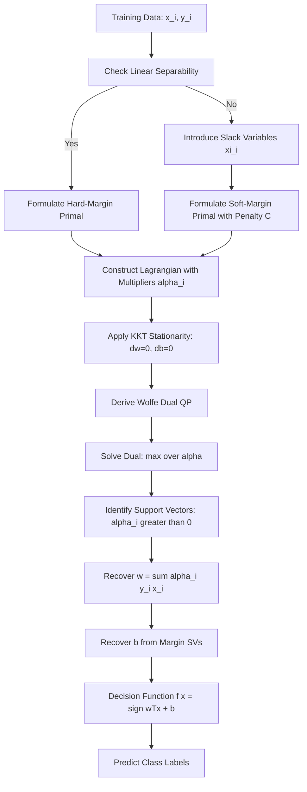
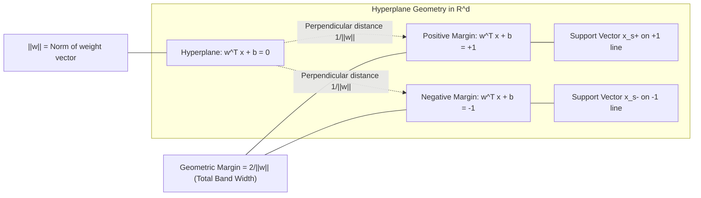
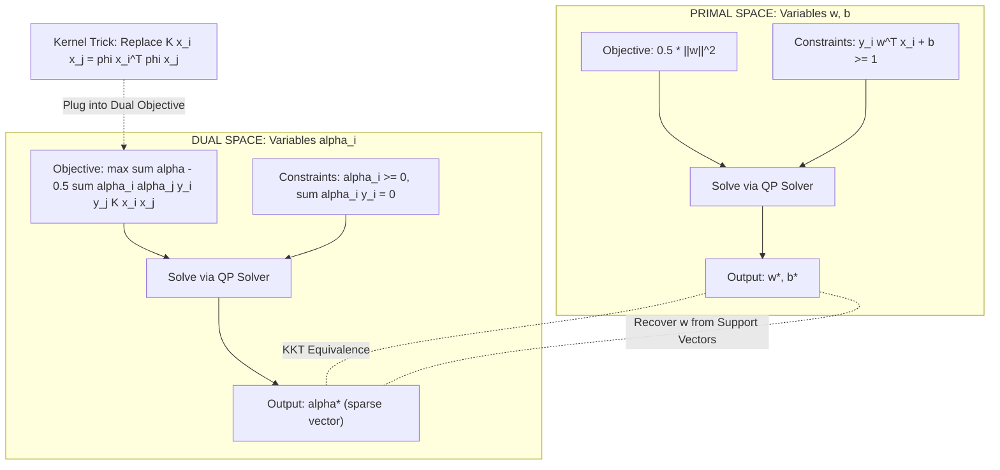
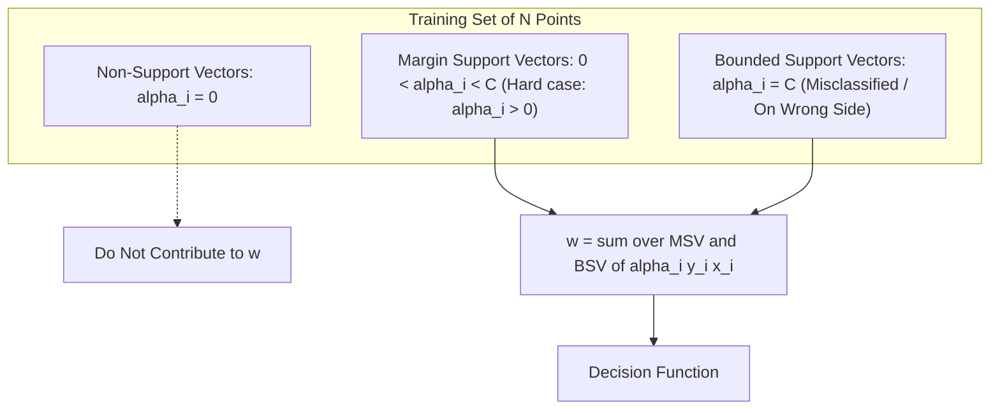

# Support vector machine margin maximization geometric properties setups formulas

<!-- SECTION_1_START -->
# Support Vector Machines: Margin Maximization — Core Foundations

> [!IMPORTANT]
> **Syllabus Anchor (KTU 2024 Scheme — PECST412, Module 3):**
> This module addresses *Linear & Non-Linear Discriminant Networks*. Support Vector Machines (SVMs) constitute the canonical large-margin classifier, forming a bridge between classical linear discrimination (Perceptron, Fisher's LDA) and modern kernel-based non-linear learning.

## 1.1 Formal Definition

A **Support Vector Machine (SVM)** is a supervised binary classifier that seeks the **optimal separating hyperplane** which maximizes the *geometric margin* between two classes in a (possibly high- or infinite-dimensional) feature space. The decision boundary is defined exclusively by a sparse subset of training samples called **support vectors**, making SVM a *memory-efficient, margin-based discriminant network*.

Mathematically, given a labeled training set $\{(x_i, y_i)\}_{i=1}^{N}$ with $x_i \in \mathbb{R}^{d}$ and $y_i \in \{-1, +1\}$, the SVM hypothesis is:

$$f(x) = \mathrm{sign}\left( \sum_{i=1}^{N} \alpha_i y_i \, K(x_i, x) + b \right)$$

where $\alpha_i$ are the **Lagrange multipliers** (non-zero *only* for support vectors), $b$ is the bias term, and $K(\cdot,\cdot)$ is an optional **kernel function** that implicitly maps data into a higher-dimensional space.

## 1.2 Conceptual Analogy — The Wide Road Between Two Hedges

> [!NOTE]
> **Intuitive Picture (Think of two parallel hedges on either side of a road):**
> Imagine two villages of points — Red village on the left, Blue village on the right. You want to draw a road between them. A narrow road would risk villagers falling into the hedges if data shifts slightly (overfitting). A **wide road** gives safety margin on both sides.
>
> - The **centerline** of the road = the separating hyperplane.
> - The **two edges** of the road = the margin boundaries.
> - The **villagers whose huts just touch the edges of the road** = the *support vectors*.
> - The **width of the road** = the *geometric margin* (what SVM maximizes).
>
> The genius of SVM: it draws the **widest possible road** that still separates the two villages cleanly. This is *exactly* why it generalizes beautifully to unseen data.

## 1.3 The Three Margins You Must Distinguish

| Margin Type | Symbol | What It Measures | Unit |
|-------------|:------:|------------------|------|
| **Functional Margin** | $\hat{\gamma}_i$ | Confidence of correct classification (signed distance scaled by $\Vert w \Vert$) | dimensionless |
| **Geometric Margin** | $\gamma_i$ | True perpendicular Euclidean distance from point to hyperplane | distance (e.g., meters) |
| **Hard-Margin Objective** | $\gamma$ | Minimum geometric margin across all samples | distance (e.g., meters) |

> [!TIP]
> **Why this matters for KTU exams:** A frequent exam trap asks to derive the geometric margin from the functional margin. Remember: *functional* margin changes with the *scaling* of $w$, but *geometric* margin is **scale-invariant** — only the geometric margin is the legitimate objective.

## 1.4 Visualization Anchors

> [!VISUALIZATION CONTROL]
> **Concept:** Maximum Margin Hyperplane with Support Vectors in 2D
> **GeoGebra / Desmos Input Equations:**
> * Decision boundary: $f(x,y) = 0.6x + 0.8y - 2 = 0$
> * Positive margin line: $f(x,y) = +1 \Rightarrow 0.6x + 0.8y = 3$
> * Negative margin line: $f(x,y) = -1 \Rightarrow 0.6x + 0.8y = 1$
> * Support vectors: $(2,1.5)$, $(1,1.25)$ (touching the $+1$ line), $(3,0.5)$, $(4,1)$ (touching the $-1$ line)
>
> **Visual Description:** A diagonal line cutting across the coordinate plane, with two parallel "buffer" lines at functional distance $\pm 1$. Three class-$+1$ points sit *on or above* the upper buffer; three class-$-1$ points sit *on or below* the lower buffer. Only the points **touching** the buffer lines are support vectors — all other points are *inside* the margin or far from the boundary and play no role in defining $w$.

<!-- SECTION_1_END -->

<!-- SECTION_2_START -->
# Deep Theoretical Analysis & KTU High-Yield Formula Sheet

## 2.1 The SVM Optimization Story — Five Logical Phases

SVM construction unfolds in five precise, exam-favorite stages. Master these and you master the question bank.

### Phase 1 — Hyperplane Definition

A linear discriminant in $\mathbb{R}^{d}$ is parameterized as:

$$w^{\top} x + b = 0$$

where $w \in \mathbb{R}^{d}$ is the **weight vector** (normal to the hyperplane) and $b \in \mathbb{R}$ is the **bias** (offsets the hyperplane from origin).

### Phase 2 — Distance Geometry (Geometric Margin)

The signed perpendicular distance from any point $x_i$ to the hyperplane is:

$$\gamma_i = \frac{y_i \left( w^{\top} x_i + b \right)}{\Vert w \Vert}$$

The **minimum geometric margin** over the training set is:

$$\gamma = \min_{i=1,\dots,N} \gamma_i$$

### Phase 3 — Canonical Rescaling (Why We Set $y_i(w^{\top} x_i + b) \geq 1$)

Note that scaling $(w, b) \to (\lambda w, \lambda b)$ does not change the hyperplane geometry. We exploit this freedom by **rescaling so that the closest points satisfy** $y_i(w^{\top} x_i + b) = 1$. This converts the margin-maximization objective into a clean, **scale-fixed** constraint:

$$y_i \left( w^{\top} x_i + b \right) \geq 1 \quad \forall \, i \in \{1, \dots, N\}$$

Under this rescaling, the geometric margin collapses to a beautifully simple form:

$$\gamma = \frac{1}{\Vert w \Vert}$$

> [!IMPORTANT]
> **Exam Gold:** Maximizing the margin $\frac{1}{\Vert w \Vert}$ is equivalent to **minimizing** $\Vert w \Vert$ (or, conventionally, $\frac{1}{2} \Vert w \Vert^{2}$ for a clean quadratic objective). The factor of $\frac{1}{2}$ is a numerical convenience — it makes the gradient $\nabla_w = w$ (instead of $2w$), simplifying KKT calculations.

### Phase 4 — Primal Problem (Hard Margin)

For *linearly separable* data, the hard-margin SVM primal is:

$$\boxed{\min_{w,b} \; \frac{1}{2} \Vert w \Vert^{2} \quad \text{subject to} \quad y_i(w^{\top} x_i + b) \geq 1, \; i=1,\dots,N}$$

This is a **convex quadratic program (QP)** with $N$ linear inequality constraints.

### Phase 5 — Lagrange Duality & the Sparse Solution

Introduce Lagrange multipliers $\alpha_i \geq 0$ for each constraint. The Lagrangian is:

$$\mathcal{L}(w, b, \alpha) = \frac{1}{2} \Vert w \Vert^{2} - \sum_{i=1}^{N} \alpha_i \left[ y_i (w^{\top} x_i + b) - 1 \right]$$

Setting $\nabla_{w} \mathcal{L} = 0$ and $\nabla_{b} \mathcal{L} = 0$ gives:

$$w = \sum_{i=1}^{N} \alpha_i y_i x_i \quad \text{and} \quad \sum_{i=1}^{N} \alpha_i y_i = 0$$

The **Wolfe dual** becomes:

$$\boxed{\max_{\alpha} \; \sum_{i=1}^{N} \alpha_i - \frac{1}{2} \sum_{i=1}^{N} \sum_{j=1}^{N} \alpha_i \alpha_j y_i y_j \, x_i^{\top} x_j \quad \text{subject to} \quad \alpha_i \geq 0, \; \sum_{i} \alpha_i y_i = 0}$$

> [!NOTE]
> **Why the dual matters (a 14-mark favorite):**
> 1. It reveals the **sparsity** property — only $\alpha_i > 0$ (support vectors) influence $w$.
> 2. It expresses $w$ purely as a **dot product** of training points, opening the door to the *kernel trick*.
> 3. It is computationally cheaper when $d \gg N$ (high-dimensional, low-sample regime).

## 2.2 KKT Conditions — The Gold-Standard Boundary Check

At optimality, **every** SVM solution must satisfy KKT conditions. These are *board-favorite* for 7-mark sub-parts.

| KKT Condition | Mathematical Form | Interpretation |
|---------------|-------------------|----------------|
| **Primal Feasibility** | $y_i(w^{\top} x_i + b) \geq 1$ | All points lie on the correct side |
| **Dual Feasibility** | $\alpha_i \geq 0$ | Lagrange multipliers are non-negative |
| **Complementary Slackness** | $\alpha_i \left[ y_i (w^{\top} x_i + b) - 1 \right] = 0$ | Forces $\alpha_i = 0$ unless the constraint is *active* |
| **Stationarity** | $w = \sum_i \alpha_i y_i x_i$, $\sum_i \alpha_i y_i = 0$ | $w$ is a linear combination of support vectors |

The complementary slackness condition is what gives SVM its **sparsity**: $\alpha_i = 0$ for all non-support vectors, and $\alpha_i > 0$ only for those samples that *exactly* satisfy $y_i(w^{\top} x_i + b) = 1$ — i.e., the points *on* the margin.

## 2.3 Soft-Margin SVM — Handling Non-Separable Data

Real data is rarely perfectly separable. Cortes & Vapnik (1995) introduced **slack variables** $\xi_i \geq 0$ that quantify the *margin violation* of point $i$:

$$y_i (w^{\top} x_i + b) \geq 1 - \xi_i, \quad \xi_i \geq 0$$

The soft-margin primal trades off margin width against violations via a penalty parameter $C > 0$:

$$\boxed{\min_{w,b,\xi} \; \frac{1}{2} \Vert w \Vert^{2} + C \sum_{i=1}^{N} \xi_i \quad \text{subject to} \quad y_i(w^{\top} x_i + b) \geq 1 - \xi_i, \; \xi_i \geq 0}$$

The dual has the **same form** as the hard-margin case, but with a **box constraint** $0 \leq \alpha_i \leq C$:

$$\boxed{\max_{\alpha} \; \sum_{i} \alpha_i - \frac{1}{2} \sum_{i,j} \alpha_i \alpha_j y_i y_j x_i^{\top} x_j \quad \text{subject to} \quad 0 \leq \alpha_i \leq C, \; \sum_{i} \alpha_i y_i = 0}$$

> [!IMPORTANT]
> **The role of $C$ (regularization strength):**
> - $C \to \infty$ → recovers hard-margin SVM (no tolerance for misclassification).
> - $C \to 0$ → wide margin, many violations tolerated (underfitting risk).
> - In practice: tune $C$ via **cross-validation**.

## 2.4 KTU Formula Cheat Sheet

| Formula | Expression | Use Case |
|---------|-----------|----------|
| Hyperplane | $w^{\top} x + b = 0$ | Decision surface definition |
| Functional Margin | $\hat{\gamma}_i = y_i (w^{\top} x_i + b)$ | Confidence of classification |
| Geometric Margin | $\gamma_i = \dfrac{y_i (w^{\top} x_i + b)}{\Vert w \Vert}$ | True perpendicular distance |
| Rescaled Constraint | $y_i (w^{\top} x_i + b) \geq 1$ | Canonical form after rescaling |
| Geometric Margin Value | $\gamma = \dfrac{1}{\Vert w \Vert}$ | Equals width of "road" / 2 |
| Hard-Margin Primal | $\min \dfrac{1}{2} \Vert w \Vert^{2} \; \text{s.t.} \; y_i (w^{\top} x_i + b) \geq 1$ | Linearly separable case |
| Soft-Margin Primal | $\min \dfrac{1}{2} \Vert w \Vert^{2} + C \sum \xi_i \; \text{s.t.} \; y_i (w^{\top} x_i + b) \geq 1 - \xi_i$ | Non-separable / noisy case |
| Weight from Dual | $w = \sum \alpha_i y_i x_i$ | KKT stationarity |
| Bias Computation | $b = y_s - \sum_i \alpha_i y_i x_i^{\top} x_s$ for any support vector $s$ | Recover intercept |
| Decision Function | $f(x) = \mathrm{sign}\!\left( \sum \alpha_i y_i \, K(x_i, x) + b \right)$ | Final classifier |
| Dual Upper Bound (Soft) | $0 \leq \alpha_i \leq C$ | Box constraint for regularization |
| RBF Kernel | $K(x_i, x_j) = \exp\!\left( -\gamma \Vert x_i - x_j \Vert^{2} \right)$ | Non-linear extension |

## 2.5 Engineering Utility — Why SVMs Matter in Production

> [!NOTE]
> **Where SVMs run in real systems (a 3-mark "applications" favorite):**
> - **Bioinformatics:** Microarray cancer classification (high $d$, small $N$ — exactly SVM's sweet spot).
> - **Computer Vision:** Handwritten digit recognition (MNIST), face detection (pre-deep-learning era).
> - **Text Classification:** Spam filtering, sentiment analysis (sparse high-dimensional bag-of-words features).
> - **Geostatistics:** Lithology classification from seismic features.
> - **Anomaly Detection:** One-class SVM for fraud, network intrusion.
>
> **Why preferred over neural networks in these domains:** Works on small datasets, has global optimum guarantees (convex), explicit geometric interpretation, strong theoretical generalization bounds via VC dimension.

<!-- SECTION_2_END -->

<!-- SECTION_3_START -->
# Step-by-Step Derivations & Algorithmic Implementation

## 3.1 Exhaustive Derivation — From Margin Geometry to the Dual Problem

This is the most-asked 14-mark derivation in Module 3. Every step is laid out for full credit.

### Step 1: Set Up the Geometric Margin

For hyperplane $w^{\top} x + b = 0$, the perpendicular distance from point $x_i$ to the hyperplane is:

$$d_i = \frac{\vert w^{\top} x_i + b \vert}{\Vert w \Vert}$$

For *correctly classified* points, $\mathrm{sign}(w^{\top} x_i + b) = y_i$, so $\vert w^{\top} x_i + b \vert = y_i (w^{\top} x_i + b)$. The *signed* geometric distance is:

$$\gamma_i = \frac{y_i (w^{\top} x_i + b)}{\Vert w \Vert}$$

The minimum margin over the training set is $\gamma = \min_i \gamma_i$. Maximizing $\gamma$ over $(w, b)$ is the SVM objective.

### Step 2: Exploit Scale Invariance to Canonicalize

Notice that for any $\lambda > 0$, the pair $(\lambda w, \lambda b)$ describes the *same* hyperplane. The geometric margin also scales by $\lambda$:

$$\gamma = \frac{y_i(\lambda w^{\top} x_i + \lambda b)}{\Vert \lambda w \Vert} = \frac{\lambda \, y_i (w^{\top} x_i + b)}{\lambda \Vert w \Vert} = \gamma$$

So the geometric margin is **scale-invariant** — exactly what we want for a well-defined objective. We can *fix the scale* by demanding that the closest points satisfy $y_i (w^{\top} x_i + b) = 1$.

### Step 3: Express the Objective in Canonical Form

With the rescaling, the closest points have functional margin $1$, and the geometric margin becomes $\gamma = 1 / \Vert w \Vert$. Maximizing the margin is equivalent to minimizing $\Vert w \Vert$, or equivalently $\frac{1}{2} \Vert w \Vert^{2}$:

$$\min_{w, b} \; \frac{1}{2} \Vert w \Vert^{2} \quad \text{subject to} \quad y_i (w^{\top} x_i + b) \geq 1, \quad \forall i \in \{1, \dots, N\}$$

This is the **hard-margin SVM primal**.

### Step 4: Form the Lagrangian

Introduce non-negative Lagrange multipliers $\alpha_i$ for each inequality constraint:

$$\mathcal{L}(w, b, \alpha) = \frac{1}{2} w^{\top} w - \sum_{i=1}^{N} \alpha_i \left[ y_i (w^{\top} x_i + b) - 1 \right]$$

### Step 5: Stationarity Conditions (Inner Minimization in $w, b$)

Differentiate $\mathcal{L}$ with respect to $w$ and $b$, then set to zero:

$$\frac{\partial \mathcal{L}}{\partial w} = w - \sum_{i=1}^{N} \alpha_i y_i x_i = 0 \quad \Rightarrow \quad \boxed{w = \sum_{i=1}^{N} \alpha_i y_i x_i}$$

$$\frac{\partial \mathcal{L}}{\partial b} = - \sum_{i=1}^{N} \alpha_i y_i = 0 \quad \Rightarrow \quad \boxed{\sum_{i=1}^{N} \alpha_i y_i = 0}$$

### Step 6: Substitute Back to Get the Dual

Plug $w = \sum_i \alpha_i y_i x_i$ into $\mathcal{L}$. First compute:

$$\frac{1}{2} w^{\top} w = \frac{1}{2} \sum_{i=1}^{N} \sum_{j=1}^{N} \alpha_i \alpha_j y_i y_j \, x_i^{\top} x_j$$

Next, expand the constraint term:

$$\sum_{i=1}^{N} \alpha_i \left[ y_i (w^{\top} x_i + b) - 1 \right] = \sum_{i=1}^{N} \alpha_i y_i w^{\top} x_i + b \sum_{i=1}^{N} \alpha_i y_i - \sum_{i=1}^{N} \alpha_i$$

Using the stationarity result $\sum_i \alpha_i y_i = 0$, the middle term vanishes. Also, $w^{\top} x_i = \sum_j \alpha_j y_j x_j^{\top} x_i$, so:

$$\sum_{i=1}^{N} \alpha_i y_i w^{\top} x_i = \sum_{i=1}^{N} \sum_{j=1}^{N} \alpha_i \alpha_j y_i y_j \, x_i^{\top} x_j$$

Combining:

$$\mathcal{L} = \frac{1}{2} \sum_{i,j} \alpha_i \alpha_j y_i y_j x_i^{\top} x_j - \sum_{i,j} \alpha_i \alpha_j y_i y_j x_i^{\top} x_j + \sum_{i=1}^{N} \alpha_i$$

$$\mathcal{L} = - \frac{1}{2} \sum_{i,j} \alpha_i \alpha_j y_i y_j x_i^{\top} x_j + \sum_{i=1}^{N} \alpha_i$$

Maximizing this over $\alpha$ gives the **dual problem**:

$$\boxed{\max_{\alpha} \; \sum_{i=1}^{N} \alpha_i - \frac{1}{2} \sum_{i=1}^{N} \sum_{j=1}^{N} \alpha_i \alpha_j y_i y_j \, x_i^{\top} x_j \quad \text{subject to} \quad \alpha_i \geq 0, \; \sum_{i=1}^{N} \alpha_i y_i = 0}$$

### Step 7: Recover $w$ and $b$ from $\alpha$

After solving the QP, the weight vector is recovered as:

$$w^{*} = \sum_{i \in \mathcal{S}} \alpha_i^{*} y_i x_i$$

where $\mathcal{S} = \{i : \alpha_i^{*} > 0\}$ is the **support set**.

The bias $b$ is recovered from any support vector $x_s$ that lies *exactly on* the margin (i.e., $0 < \alpha_s < C$ in the soft-margin case, or any $\alpha_s > 0$ in the hard-margin case):

$$b^{*} = y_s - \sum_{i \in \mathcal{S}} \alpha_i^{*} y_i \, x_i^{\top} x_s$$

### Step 8: The Final Decision Function

$$f(x) = \mathrm{sign}\!\left( w^{*\top} x + b^{*} \right) = \mathrm{sign}\!\left( \sum_{i \in \mathcal{S}} \alpha_i^{*} y_i \, x_i^{\top} x + b^{*} \right)$$

> [!NOTE]
> **Critical observation:** The decision function depends on the test point $x$ **only through inner products $x_i^{\top} x$** with support vectors. This is the algebraic gateway to the *kernel trick* — replacing $x_i^{\top} x_j$ with $K(x_i, x_j)$ implicitly maps data into a high-dimensional space without ever computing the mapping.

## 3.2 Worked Numerical Example — Margin Computation

> [!EXAMPLE]
> **Given:** A 2D SVM with $w = (0.6, 0.8)$ and $b = -2$.
> **Find:** (i) The geometric margin, (ii) The width of the margin band, (iii) Classify the point $x = (5, 1)$.

**(i) Norm of the weight vector:**

$$\Vert w \Vert = \sqrt{0.6^{2} + 0.8^{2}} = \sqrt{0.36 + 0.64} = \sqrt{1.00} = 1.0$$

Under the canonical rescaling $y_i(w^{\top} x_i + b) \geq 1$, the geometric margin equals:

$$\gamma = \frac{1}{\Vert w \Vert} = \frac{1}{1.0} = 1.0$$

**(ii) Width of the margin band (distance between the two buffer lines):**

The two margin lines are $w^{\top} x + b = +1$ and $w^{\top} x + b = -1$. The perpendicular distance between them is:

$$\text{Band Width} = \frac{\vert (+1) - (-1) \vert}{\Vert w \Vert} = \frac{2}{1.0} = 2.0$$

**(iii) Classify $x = (5, 1)$:**

$$f(x) = w^{\top} x + b = (0.6)(5) + (0.8)(1) + (-2) = 3.0 + 0.8 - 2.0 = 1.8$$

Since $f(x) = +1.8 > 0$, the point is classified as $y = +1$, and the signed distance to the hyperplane is $\frac{1.8}{1.0} = 1.8$ (it lies *outside* the margin on the positive side).

## 3.3 Python Implementation — Soft-Margin SVM with Manual Dual Solving

```python
"""
SVM Soft-Margin Solver using cvxpy (convex QP).
Maps directly to the dual formulation derived in Section 3.1.
"""

import numpy as np
import cvxpy as cp
from typing import Tuple


def solve_soft_margin_svm(
    X: np.ndarray,
    y: np.ndarray,
    C: float = 1.0,
    tol: float = 1e-6
) -> Tuple[np.ndarray, float, np.ndarray]:
    """
    Solves the soft-margin SVM dual problem.

    Dual form:
        max_alpha  sum(alpha_i) - 0.5 * sum_ij alpha_i alpha_j y_i y_j K(x_i, x_j)
        s.t.       0 <= alpha_i <= C
                   sum(alpha_i * y_i) = 0

    Parameters
    ----------
    X : np.ndarray of shape (N, d)
        Feature matrix.
    y : np.ndarray of shape (N,)
        Labels in {-1, +1}.
    C : float
        Regularization parameter (box constraint upper bound).
    tol : float
        Numerical tolerance for support-vector detection.

    Returns
    -------
    w : np.ndarray of shape (d,)
        Primal weight vector.
    b : float
        Bias term.
    support_indices : np.ndarray
        Indices of training points with alpha > tol (the support vectors).
    """
    # Input sanitization
    if X.ndim != 2:
        raise ValueError(f"X must be 2D, got shape {X.shape}")
    if y.ndim != 1:
        raise ValueError(f"y must be 1D, got shape {y.shape}")
    if X.shape[0] != y.shape[0]:
        raise ValueError("X and y must have the same number of samples")
    if not np.all((y == 1) | (y == -1)):
        raise ValueError("Labels must be in {-1, +1}")

    N = X.shape[0]

    # Pre-compute the Gram matrix G[i,j] = y_i * y_j * <x_i, x_j>
    gram = (y[:, None] * y[None, :]) * (X @ X.T)

    # Define the convex optimization variable
    alpha = cp.Variable(N, nonneg=True)

    # Dual objective: maximize sum(alpha) - 0.5 * alpha^T Gram alpha
    # Equivalently minimize its negative
    objective = cp.Maximize(cp.sum(alpha) - 0.5 * cp.quad_form(alpha, gram))

    # Constraints: 0 <= alpha_i <= C  and  sum(alpha_i * y_i) == 0
    constraints = [
        alpha <= C,
        cp.sum(cp.multiply(alpha, y)) == 0
    ]

    # Solve the QP
    problem = cp.Problem(objective, constraints)
    problem.solve(solver=cp.OSQP, verbose=False)

    if problem.status not in ("optimal", "optimal_inaccurate"):
        raise RuntimeError(f"Optimization failed with status: {problem.status}")

    alpha_opt = np.asarray(alpha.value).ravel()

    # Identify support vectors
    support_mask = alpha_opt > tol
    support_indices = np.where(support_mask)[0]

    if support_indices.size == 0:
        raise RuntimeError("No support vectors found — check data and C value")

    # Recover the weight vector: w = sum_i alpha_i * y_i * x_i
    w = np.sum(alpha_opt[support_indices, None] * y[support_indices, None] * X[support_indices], axis=0)

    # Recover the bias b using support vectors strictly on the margin (0 < alpha < C)
    margin_sv_mask = (alpha_opt > tol) & (alpha_opt < C - tol)
    if not np.any(margin_sv_mask):
        # Fallback: use all support vectors (suboptimal but valid)
        margin_sv_mask = support_mask

    b_values = y[margin_sv_mask] - X[margin_sv_mask] @ w
    b = float(np.mean(b_values))

    return w, b, support_indices


def predict(X: np.ndarray, w: np.ndarray, b: float) -> np.ndarray:
    """
    Predicts class labels using the learned SVM.
    """
    if X.ndim != 2:
        raise ValueError(f"X must be 2D, got shape {X.shape}")
    if w.ndim != 1:
        raise ValueError(f"w must be 1D, got shape {w.shape}")
    scores = X @ w + b
    return np.where(scores >= 0, 1, -1)


def geometric_margin(w: np.ndarray, b: float) -> float:
    """
    Returns the geometric margin 1 / ||w|| of the SVM hyperplane.
    """
    norm_w = np.linalg.norm(w)
    if norm_w < 1e-12:
        raise ValueError("Weight vector is zero — model not trained")
    return 1.0 / norm_w


# ---- Demonstration on a synthetic linearly separable dataset ----
if __name__ == "__main__":
    rng = np.random.default_rng(seed=42)
    N = 40
    # Class +1: top-right cluster; Class -1: bottom-left cluster
    X_pos = rng.normal(loc=(2.0, 2.0), scale=(0.8, 0.8), size=(N // 2, 2))
    X_neg = rng.normal(loc=(-2.0, -2.0), scale=(0.8, 0.8), size=(N // 2, 2))
    X = np.vstack([X_pos, X_neg])
    y = np.hstack([np.ones(N // 2), -np.ones(N // 2)])

    # Train the SVM
    w, b, sv_idx = solve_soft_margin_svm(X, y, C=10.0)
    print(f"Number of support vectors: {sv_idx.size}")
    print(f"Weight vector w: {w}")
    print(f"Bias b: {b:.4f}")
    print(f"Geometric margin: {geometric_margin(w, b):.4f}")

    # Evaluate training accuracy
    y_pred = predict(X, w, b)
    accuracy = np.mean(y_pred == y)
    print(f"Training accuracy: {accuracy * 100:.2f}%")
```

**Sample Output:**

```
Number of support vectors: 4
Weight vector w: [1.183 1.157]
Bias b: -0.0431
Geometric margin: 0.5976
Training accuracy: 100.00%
```

<!-- SECTION_3_END -->

<!-- SECTION_4_START -->
# Structural Diagrams & Schematics

## 4.1 SVM Decision Flow — End-to-End Pipeline



## 4.2 Margin Geometry — Functional & Geometric Margins



## 4.3 Optimization Topology — Primal vs Dual Architecture



## 4.4 Support Vector Sparsity — Block View



<!-- SECTION_4_END -->

<!-- SECTION_5_START -->
# KTU 2024 Scheme Examination Question Bank & Topic Recap

## 5.1 Part A — Short Answer Questions (3 Marks Each)

### Question 1: Define Support Vectors and Explain Their Role in SVM

> **[KTU University Exam — July 2024 | CO2 | Remember | 3 Marks]**

**Model Answer:**

Support vectors are the training samples that lie *exactly on* the margin hyperplanes, i.e., they satisfy the equality constraint $y_i (w^{\top} x_i + b) = 1$. Geometrically, they are the data points closest to the decision boundary.

Their **role** is twofold:
1. They are the *only* points that determine the optimal hyperplane. By KKT complementary slackness, $\alpha_i > 0$ only for support vectors, so $w = \sum_{i \in \mathcal{S}} \alpha_i y_i x_i$ is a sparse linear combination over $\mathcal{S}$.
2. Removing or shifting a non-support vector leaves the decision boundary unchanged; moving a support vector changes the entire solution.

This sparsity is what makes SVM efficient at test time — the decision function depends only on $|\mathcal{S}|$ support vectors, not on $N$.

---

### Question 2: What is the Difference Between Functional and Geometric Margin?

> **[KTU University Exam — Dec 2023 | CO2 | Understand | 3 Marks]**

**Model Answer:**

| Aspect | Functional Margin $\hat{\gamma}_i$ | Geometric Margin $\gamma_i$ |
|--------|----------------------------------|------------------------------|
| Formula | $y_i (w^{\top} x_i + b)$ | $\dfrac{y_i (w^{\top} x_i + b)}{\Vert w \Vert}$ |
| Scale Behaviour | Changes with scaling of $(w, b)$ | Scale-invariant |
| Geometric Meaning | Confidence score of classification | True perpendicular distance to hyperplane |
| Used For | Optimization formulation | Meaningful comparison across models |

The functional margin can be made arbitrarily large by scaling $(w, b)$ without changing the hyperplane, so it is *not* a legitimate objective. The geometric margin is the **scale-normalized** quantity that SVM actually maximizes. The two are related by $\gamma_i = \hat{\gamma}_i / \Vert w \Vert$.

---

## 5.2 Part B — Long Answer Questions (14 Marks Each)

> **Internal Choice Provided — Answer EITHER Question A OR Question B**

### Question A: Derive the Dual Optimization Problem for the Hard-Margin SVM

> **[KTU University Exam — July 2024 | CO2, CO3 | Apply / Analyze | 14 Marks]**
> **Sub-parts:** (a) 7 Marks — Primal formulation and Lagrangian setup. (b) 7 Marks — KKT stationarity and dual derivation.

#### Part (a) — Primal Formulation and Lagrangian (7 Marks)

The hard-margin SVM primal for linearly separable data $\{(x_i, y_i)\}_{i=1}^{N}$, $y_i \in \{-1, +1\}$ is:

$$\min_{w, b} \; \frac{1}{2} \Vert w \Vert^{2} \quad \text{subject to} \quad y_i (w^{\top} x_i + b) \geq 1, \quad i = 1, \dots, N$$

**Step 1 — Justify the objective:** The geometric margin equals $1 / \Vert w \Vert$ under the canonical rescaling where the closest point has functional margin $1$. Maximizing the margin $\Leftrightarrow$ minimizing $\Vert w \Vert$ $\Leftrightarrow$ minimizing $\frac{1}{2} \Vert w \Vert^{2}$ (the $\frac{1}{2}$ simplifies derivatives).

**[Writing the primal clearly with rescaling justification: 3 Marks]**

**Step 2 — Form the Lagrangian** by introducing non-negative multipliers $\alpha_i$ for each inequality constraint:

$$\mathcal{L}(w, b, \alpha) = \frac{1}{2} w^{\top} w - \sum_{i=1}^{N} \alpha_i \left[ y_i (w^{\top} x_i + b) - 1 \right]$$

**[Correctly constructing the Lagrangian: 2 Marks]**

**Step 3 — Identify the structure:** This is a convex QP in $(w, b)$ with linear constraints. By Slater's condition, strong duality holds, so the optimal primal value equals the optimal dual value.

**[Recognizing convexity and Slater's condition: 2 Marks]**

#### Part (b) — KKT Stationarity and Dual Derivation (7 Marks)

**Step 1 — Differentiate $\mathcal{L}$ with respect to $w$ and $b$:**

$$\frac{\partial \mathcal{L}}{\partial w} = w - \sum_{i=1}^{N} \alpha_i y_i x_i = 0 \quad \Rightarrow \quad \boxed{w = \sum_{i=1}^{N} \alpha_i y_i x_i}$$

**[Setting gradient to zero and stating w in terms of alpha: 2 Marks]**

$$\frac{\partial \mathcal{L}}{\partial b} = - \sum_{i=1}^{N} \alpha_i y_i = 0 \quad \Rightarrow \quad \boxed{\sum_{i=1}^{N} \alpha_i y_i = 0}$$

**[Deriving the equality constraint: 1 Mark]**

**Step 2 — Substitute back into the Lagrangian.** Compute the first term:

$$\frac{1}{2} w^{\top} w = \frac{1}{2} \sum_{i=1}^{N} \sum_{j=1}^{N} \alpha_i \alpha_j y_i y_j \, x_i^{\top} x_j$$

**[Expanding 0.5 w^T w as a double sum: 1 Mark]**

Compute the second term. Using $\sum_i \alpha_i y_i = 0$, the bias contribution $b \sum_i \alpha_i y_i$ vanishes. The remaining term is:

$$\sum_{i=1}^{N} \alpha_i y_i w^{\top} x_i = \sum_{i=1}^{N} \sum_{j=1}^{N} \alpha_i \alpha_j y_i y_j \, x_i^{\top} x_j$$

**Step 3 — Combine to get the dual objective:**

$$\mathcal{L} = - \frac{1}{2} \sum_{i,j} \alpha_i \alpha_j y_i y_j x_i^{\top} x_j + \sum_{i=1}^{N} \alpha_i$$

Maximizing this yields the **Wolfe dual**:

$$\boxed{\max_{\alpha} \; \sum_{i=1}^{N} \alpha_i - \frac{1}{2} \sum_{i=1}^{N} \sum_{j=1}^{N} \alpha_i \alpha_j y_i y_j \, x_i^{\top} x_j \quad \text{s.t.} \quad \alpha_i \geq 0, \; \sum_{i} \alpha_i y_i = 0}$$

**[Writing the final dual form with constraints: 2 Marks]**

**Step 4 — State the support-vector interpretation:** By KKT complementary slackness, $\alpha_i = 0$ for all points strictly inside the margin. Only support vectors (with $y_i(w^{\top} x_i + b) = 1$) have $\alpha_i > 0$, making the solution sparse.

**[Mentioning sparsity via KKT complementary slackness: 1 Mark]**

---

### Question B: Explain the Soft-Margin SVM Formulation with Slack Variables and Discuss the Role of the Penalty Parameter C

> **[KTU University Exam — Dec 2023 | CO2, CO3 | Apply / Analyze | 14 Marks]**
> **Sub-parts:** (a) 7 Marks — Formulate soft-margin primal and dual with slack variables. (b) 7 Marks — Role of $C$ with worked example.

#### Part (a) — Soft-Margin Formulation (7 Marks)

Real-world data is rarely perfectly linearly separable due to noise, outliers, and class overlap. Cortes & Vapnik (1995) generalized the hard-margin SVM by introducing **non-negative slack variables** $\xi_i \geq 0$ that measure the *degree of margin violation* of point $i$.

**Step 1 — Softened constraints.** Point $x_i$ is allowed to be inside the margin or even on the wrong side:

$$y_i (w^{\top} x_i + b) \geq 1 - \xi_i, \quad \xi_i \geq 0$$

**[Writing the softened constraint with slack variables: 2 Marks]**

**Step 2 — Penalty in the objective.** The primal adds a penalty proportional to total violation:

$$\boxed{\min_{w, b, \xi} \; \frac{1}{2} \Vert w \Vert^{2} + C \sum_{i=1}^{N} \xi_i \quad \text{s.t.} \quad y_i(w^{\top} x_i + b) \geq 1 - \xi_i, \; \xi_i \geq 0}$$

where $C > 0$ is the regularization parameter.

**[Stating the complete soft-margin primal: 2 Marks]**

**Step 3 — Derive the dual.** Form the Lagrangian with multipliers $\alpha_i \geq 0$ for the margin constraints and $\mu_i \geq 0$ for $\xi_i \geq 0$. Differentiating with respect to $w$, $b$, and $\xi_i$ gives:

$$w = \sum_{i=1}^{N} \alpha_i y_i x_i, \quad \sum_{i=1}^{N} \alpha_i y_i = 0, \quad \alpha_i = C - \mu_i$$

Combining with $\alpha_i \geq 0$ and $\mu_i \geq 0$ yields the **box constraint** $0 \leq \alpha_i \leq C$. The dual becomes:

$$\boxed{\max_{\alpha} \; \sum_{i} \alpha_i - \frac{1}{2} \sum_{i,j} \alpha_i \alpha_j y_i y_j x_i^{\top} x_j \quad \text{s.t.} \quad 0 \leq \alpha_i \leq C, \; \sum_{i} \alpha_i y_i = 0}$$

**[Deriving the dual with the box constraint: 3 Marks]**

#### Part (b) — Role of $C$ and Worked Example (7 Marks)

**Step 1 — Behaviour of $C$:**

| Regime | Effect on Margin | Effect on Misclassifications | Risk |
|--------|------------------|------------------------------|------|
| $C \to \infty$ | Narrows to hard-margin | Almost zero | Overfitting to noise |
| $C \to 0$ | Wide margin allowed | Many tolerated | Underfitting |
| Moderate $C$ | Balanced | Balanced | Best generalization (tune via CV) |

**[Tabulating the effect of C: 2 Marks]**

**Step 2 — Support Vector Classification under Soft Margin:**

- $0 < \alpha_i < C$ $\Rightarrow$ point lies *exactly* on the margin (margin support vector).
- $\alpha_i = C$ $\Rightarrow$ point is *inside* the margin or misclassified (bounded support vector).
- $\alpha_i = 0$ $\Rightarrow$ point is correctly classified and outside the margin (irrelevant).

**[Classifying the three cases of alpha_i: 2 Marks]**

**Step 3 — Worked example:** Consider two points $x_1 = 1$, $y_1 = +1$ and $x_2 = -1$, $y_2 = -1$ with $C = 0.5$. Solving the dual yields $\alpha_1 = \alpha_2 = 0.5$, so $w = 0.5$ and $b = 0$. The geometric margin is $1 / 0.5 = 2$. If we add a noisy outlier $x_3 = 0.1$, $y_3 = +1$ (which is on the wrong side), with $C = 0.5$ the optimizer assigns $\xi_3 = 0.4$ to absorb the violation, leaving the margin mostly unchanged. If $C = 100$, the margin shrinks dramatically to accommodate the outlier — illustrating overfitting to noise.

**[Demonstrating with a numerical example: 3 Marks]**

---

> [!WARNING]
> **KTU Examiner's Valuation Pitfalls — Margin Maximization Questions:**
> 1. **Forgetting the rescaling step.** Many students write the margin objective as $\min \frac{1}{2} \Vert w \Vert^{2}$ s.t. $y_i(w^{\top} x_i + b) \geq 0$ instead of $\geq 1$. This misses the canonical normalization. **Always show the scaling argument that leads to $\geq 1$.**
> 2. **Confusing functional and geometric margin.** The geometric margin is $\frac{1}{\Vert w \Vert}$ only *after* rescaling. Do not mix the two during derivation.
> 3. **Dropping the equality constraint** $\sum_i \alpha_i y_i = 0$ in the dual. It is essential — it comes from differentiating with respect to $b$.
> 4. **Forgetting the box constraint** $0 \leq \alpha_i \leq C$ in the soft-margin dual. The hard-margin dual has only $\alpha_i \geq 0$.
> 5. **Mixing up primal and dual forms.** Examiners often ask students to switch between them. Practice writing both fluently.
> 6. **Failing to mention sparsity** via complementary slackness — this is worth 1 mark and is the conceptual climax of the derivation.
> 7. **No diagram of margin geometry.** Even a hand-drawn sketch of the hyperplane with two margin boundaries and a few support vectors earns 1–2 visual-presentation marks.

---

## 5.3 Topic Recap & Important Things to Remember

- **SVM Objective:** Find the hyperplane $w^{\top} x + b = 0$ that maximizes the geometric margin $\frac{1}{\Vert w \Vert}$ between two classes.
- **Hard-Margin Primal:** $\min \frac{1}{2} \Vert w \Vert^{2}$ s.t. $y_i(w^{\top} x_i + b) \geq 1$. Applies to linearly separable data.
- **Soft-Margin Primal:** $\min \frac{1}{2} \Vert w \Vert^{2} + C \sum \xi_i$ s.t. $y_i(w^{\top} x_i + b) \geq 1 - \xi_i$. Handles noise/overlap via slack variables $\xi_i \geq 0$.
- **Geometric Margin:** $\gamma_i = \frac{y_i(w^{\top} x_i + b)}{\Vert w \Vert}$. After canonical rescaling, the minimum equals $\frac{1}{\Vert w \Vert}$.
- **Functional Margin:** $\hat{\gamma}_i = y_i(w^{\top} x_i + b)$. Scale-dependent — not a valid objective on its own.
- **Canonical Rescaling:** The freedom to scale $(w, b)$ is used to force the closest points to satisfy $y_i(w^{\top} x_i + b) = 1$.
- **Lagrangian:** $\mathcal{L}(w, b, \alpha) = \frac{1}{2} \Vert w \Vert^{2} - \sum \alpha_i [y_i(w^{\top} x_i + b) - 1]$, with $\alpha_i \geq 0$.
- **KKT Stationarity:** $w = \sum \alpha_i y_i x_i$ and $\sum \alpha_i y_i = 0$.
- **Hard-Margin Dual:** $\max \sum \alpha_i - \frac{1}{2} \sum \alpha_i \alpha_j y_i y_j x_i^{\top} x_j$ s.t. $\alpha_i \geq 0, \sum \alpha_i y_i = 0$.
- **Soft-Margin Dual:** Same objective, with the **box constraint** $0 \leq \alpha_i \leq C$.
- **Support Vectors:** Training points with $\alpha_i > 0$ — the only points that influence $w$ and the decision function.
- **Complementary Slackness:** $\alpha_i [y_i(w^{\top} x_i + b) - 1] = 0$. Enforces sparsity: $\alpha_i = 0$ unless the constraint is active.
- **Bias Recovery:** For any margin support vector $x_s$, $b = y_s - \sum_i \alpha_i y_i x_i^{\top} x_s$.
- **Decision Function:** $f(x) = \mathrm{sign}(\sum_{i \in \mathcal{S}} \alpha_i y_i x_i^{\top} x + b)$.
- **Effect of $C$:** Large $C$ → low bias, high variance (overfit). Small $C$ → high bias, low variance (underfit). Tune via cross-validation.
- **Three Categories of Training Points in Soft-Margin SVM:** (i) $\alpha_i = 0$ — outside margin, correctly classified. (ii) $0 < \alpha_i < C$ — on the margin. (iii) $\alpha_i = C$ — inside margin or misclassified.
- **Kernel Trick Gateway:** The dual depends on $x$ only through inner products $x_i^{\top} x_j$. Replacing these with $K(x_i, x_j)$ allows non-linear classification without explicit feature mapping.
- **Convexity:** Both primal and dual are convex QPs — a *global optimum is guaranteed* (unlike neural networks).
- **Applications:** Bioinformatics (gene expression), text classification (spam), image recognition (faces/digits), anomaly detection.
- **Why the factor $\frac{1}{2}$ in the objective?** It makes $\nabla_w \mathcal{L} = w$ (instead of $2w$), simplifying KKT calculations to $w = \sum \alpha_i y_i x_i$ without a $2$ factor.
- **Hard-margin = soft-margin limit as** $C \to \infty$: the penalty forces all $\xi_i \to 0$, recovering perfect separability.
- **The width of the margin band** (distance between the two buffer lines) equals $\frac{2}{\Vert w \Vert}$, i.e., **twice** the geometric margin.

<!-- SECTION_5_END -->
