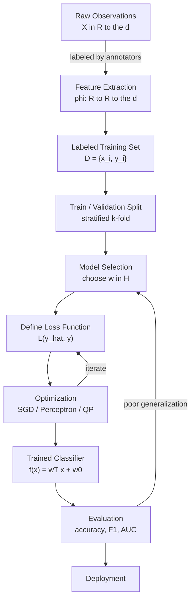
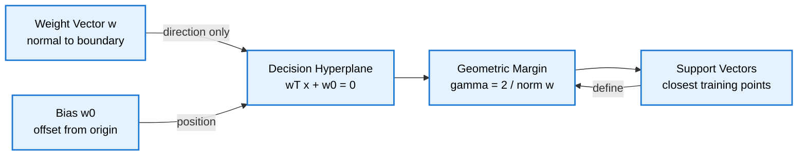
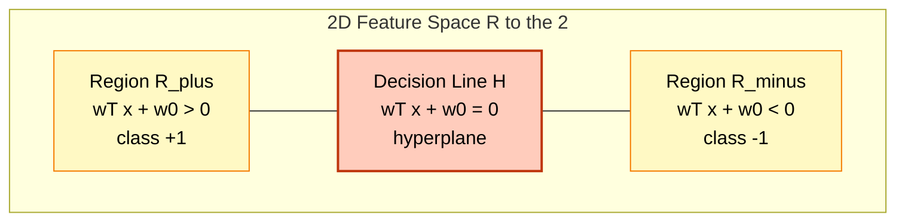

# Supervised Learning - Basics of supervised learning, Linear classifiers:

<!-- SECTION_1_START -->
# Supervised Learning & Linear Classifiers — Foundational Overview

## 1.1 Formal Academic Definition (KTU 2024 Syllabus Aligned)

> [!IMPORTANT]
> **Supervised Learning** is a paradigm in machine learning wherein a parametric or non-parametric function $f: \mathcal{X} \rightarrow \mathcal{Y}$ is inferred (learned) from a *labeled* training dataset $\mathcal{D} = \{(x_i, y_i)\}_{i=1}^{N}$, where each input vector $x_i \in \mathbb{R}^d$ is paired with a corresponding target label $y_i \in \{1, 2, \ldots, C\}$. The objective is to minimize a pre-defined risk functional $\mathcal{R}(f)$ over the joint distribution $P(X, Y)$, typically approximated by the empirical risk $\hat{\mathcal{R}}(f) = \frac{1}{N}\sum_{i=1}^{N} \mathcal{L}(f(x_i), y_i)$, where $\mathcal{L}$ is a loss function.

A **Linear Classifier** is a discriminant function of the form:

$$g(x) = w^T x + w_0 = \sum_{j=1}^{d} w_j x_j + w_0$$

where the decision boundary is the hyperplane $\mathcal{H} = \{x \in \mathbb{R}^d : w^T x + w_0 = 0\}$. The parameter vector $w \in \mathbb{R}^d$ is the **weight vector** (normal to the decision surface) and $w_0 \in \mathbb{R}$ is the **bias** (or threshold).

## 1.2 Conceptual Analogy & Geometric Intuition

> [!NOTE]
> **Intuition — The "Sorting Fence" Analogy:**
> Imagine you are a **farmer** trying to keep **sheep** ($y = +1$) and **wolves** ($y = -1$) apart in a 2D field using a single straight fence. The fence is your *decision boundary*. You can tilt the fence (changing the **direction** controlled by $w$) and slide it back and forth (changing the **position** controlled by $w_0$). *Supervised learning* is the process of looking at many past photos of sheep and wolves (the labeled data) and figuring out the *best possible fence angle and position* so that future animals are correctly sorted. The "best" fence is the one that has the **maximum margin** (widest empty corridor) from the nearest animals on both sides — this is the central idea behind many linear classifiers.

## 1.3 Key Terminology & Standard Metrics

- **Training Set $\mathcal{D}$**: The collection of $N$ labeled samples used to *fit* the model. Standard notation: $\mathbf{X} \in \mathbb{R}^{N \times d}$ for inputs and $\mathbf{y} \in \mathbb{R}^{N}$ for labels.
- **Generalization Error $\epsilon_g$**: Expected error on *unseen* data drawn from the same distribution $P(X, Y)$. This is what we truly wish to minimize.
- **Empirical Error $\hat{\epsilon}$**: Error measured on the training set. The classical statistical learning bound relates $\epsilon_g \le \hat{\epsilon} + \mathcal{O}\left(\sqrt{\frac{VC(\mathcal{H})}{N}}\right)$, where $VC(\mathcal{H})$ is the **Vapnik–Chervonenkis dimension** measuring model capacity.
- **Misclassification Rate**: The fraction of training samples placed on the wrong side of the decision boundary. **The optimal Bayes error rate is $\epsilon^* = 1 - \int \max_c P(c \mid x) P(x) dx$**, which is the theoretical lower bound.
- **Margin $\gamma$**: The signed distance from a point $x$ to the hyperplane, $\gamma(x) = \frac{w^T x + w_0}{\Vert w \Vert}$. For correctly classified points, $\gamma > 0$.

## 1.4 Why Linear Classifiers? The Big Picture

> [!IMPORTANT]
> **KTU 2024 Syllabus Highlight:** Linear classifiers form the *bedrock* of pattern recognition. They are computationally cheap, mathematically tractable, and form the building blocks of neural networks, Support Vector Machines, and Logistic Regression. Even when the data is not linearly separable, the *principles* (margin maximization, loss minimization, gradient descent) transfer directly to non-linear kernel methods and deep networks.

**Real-World Engineering Applications:**

| Domain | Linear Classifier Use Case |
|---|---|
| **Spam Filtering** | Classify emails as $y \in \{\text{spam}, \text{ham}\}$ based on word-frequency features $x \in \mathbb{R}^{d}$. |
| **Medical Diagnosis** | Predict tumor *malignant / benign* from cell nucleus measurements. |
| **Credit Scoring** | Approve/deny loans from applicant financial features. |
| **Computer Vision (Pre-Deep-Learning era)** | Face detection, digit recognition (MNIST). |
| **Bioinformatics** | Classify gene expression profiles into disease subtypes. |

> [!VISUALIZATION CONTROL]
> **Concept:** Two-class linear decision boundary with weight vector and margin.
> **GeoGebra / Desmos Input Equations:**
> * `f(x) = 0.6*x - 0.5`  *(decision boundary $w_1 x_1 + w_2 x_2 + w_0 = 0$)*
> * `g(x) = 0.6*x - 0.5 + 0.6`  *(upper margin $w^T x + w_0 = 1$)*
> * `h(x) = 0.6*x - 0.5 - 0.6`  *(lower margin $w^T x + w_0 = -1$)*
> * Plot points: $(2, 1)$ in blue (Class $+1$), $(0, -2)$ in red (Class $-1$).
> **Visual Description:** The student should see a single straight line separating blue and red points, with two parallel dashed lines forming a "street" (the margin) of width $\frac{2}{\Vert w \Vert}$ around the central line. The arrow from the origin perpendicular to the boundary represents the weight vector $w$.

<!-- SECTION_1_END -->

<!-- SECTION_2_START -->
# Deep Theoretical Analysis & KTU High-Yield Formula Sheet

## 2.1 The Supervised Learning Pipeline

A typical supervised learning system follows a fixed operational sequence. Each stage has well-defined mathematical objectives.

- **Step 1 — Data Acquisition & Labeling:** Collect $\mathcal{D} = \{(x_i, y_i)\}_{i=1}^{N}$. Labeling is *expensive* (often requires human annotators in domains like medical imaging).
- **Step 2 — Feature Extraction:** Map raw observations to a feature vector $x \in \mathbb{R}^d$. The phrase *"feature engineering is 80% of the work"* is empirically true in classical pattern recognition.
- **Step 3 — Model Selection:** Choose a hypothesis class $\mathcal{H}$ (e.g., linear functions, decision trees, neural networks). The **No Free Lunch Theorem** states that no single model is universally best — the choice is data-dependent.
- **Step 4 — Loss Function Design:** Choose $\mathcal{L}(f(x), y)$. Common choices include the 0/1 loss, hinge loss, squared loss, and cross-entropy loss.
- **Step 5 — Optimization:** Solve $\min_{w} \hat{\mathcal{R}}(w) = \min_{w} \frac{1}{N}\sum_{i=1}^{N} \mathcal{L}(w^T x_i + w_0, y_i)$ using Gradient Descent, Stochastic Gradient Descent (SGD), the Perceptron algorithm, or Quadratic Programming (for SVMs).
- **Step 6 — Validation & Testing:** Use a held-out test set to estimate $\epsilon_g$. Cross-validation (e.g., 5-fold or 10-fold) provides a more robust estimate on small datasets.

> [!NOTE]
> **Bias–Variance Decomposition:** The generalization error decomposes as $\mathbb{E}[(\hat{f}(x) - f^*(x))^2] = \text{Bias}^2 + \text{Variance} + \text{Irreducible Noise}$. Linear classifiers are typically **high-bias, low-variance** — they underfit complex data but are stable across resamples.

## 2.2 The Two-Case Geometric View

For a two-class problem ($C = 2$) with labels $y \in \{-1, +1\}$, the classifier is *correct* on sample $i$ if and only if:

$$y_i (w^T x_i + w_0) > 0$$

The quantity $y_i(w^T x_i + w_0)$ is the **functional margin**. The corresponding **geometric margin** (true distance) is:

$$\gamma_i = \frac{y_i (w^T x_i + w_0)}{\Vert w \Vert}$$

The optimizer's goal is to find $(w, w_0)$ that makes $\gamma_i$ as large and as positive as possible for *all* $i$.

## 2.3 Classical Linear Classifier Models

### (a) Perceptron (Rosenblatt, 1958)

The Perceptron is the *first* learning algorithm for linear classifiers. It uses the **Perceptron Criterion Loss**:

$$\mathcal{L}_P(w) = -\sum_{i \in \mathcal{M}} y_i (w^T x_i)$$

where $\mathcal{M}$ is the set of **misclassified** samples. The update rule on a misclassified sample is:

$$w \leftarrow w + \eta y_i x_i, \quad w_0 \leftarrow w_0 + \eta y_i$$

where $\eta > 0$ is the learning rate. **Perceptron Convergence Theorem (Novikoff, 1962):** If the data is linearly separable, the algorithm converges in a finite number of steps bounded by $\left(\frac{R}{\gamma^*}\right)^2$, where $R = \max_i \Vert x_i \Vert$ and $\gamma^*$ is the optimal margin.

### (b) Fisher's Linear Discriminant (FLD)

FLD finds the projection direction $w$ that *maximizes* the **between-class scatter** $S_B$ while *minimizing* the **within-class scatter** $S_W$:

$$\max_w J(w) = \frac{w^T S_B w}{w^T S_W w}$$

The optimal $w$ is the leading eigenvector of $S_W^{-1} S_B$, equivalently the solution of the **Generalized Eigenvalue Problem** $S_B w = \lambda S_W w$. For two classes:

$$w^* \propto S_W^{-1}(\mu_1 - \mu_2)$$

where $\mu_c = \frac{1}{N_c}\sum_{i: y_i = c} x_i$ is the class mean.

### (c) Support Vector Machine (SVM — Linear, Hard Margin)

The canonical linear SVM solves the **primal optimization problem**:

$$\min_{w, w_0} \frac{1}{2} \Vert w \Vert^2 \quad \text{subject to} \quad y_i(w^T x_i + w_0) \ge 1, \quad \forall i$$

The solution places the hyperplane equidistant from the closest points of the two classes (the **support vectors**), and the geometric margin equals $\frac{2}{\Vert w \Vert}$. By duality (Lagrangian + KKT conditions), the dual is:

$$\max_{\alpha} \sum_{i=1}^{N} \alpha_i - \frac{1}{2}\sum_{i=1}^{N}\sum_{j=1}^{N} \alpha_i \alpha_j y_i y_j (x_i^T x_j) \quad \text{s.t.} \quad \alpha_i \ge 0, \quad \sum_i \alpha_i y_i = 0$$

### (d) Logistic Regression

Models the posterior probability via the **sigmoid** $\sigma(z) = \frac{1}{1 + e^{-z}}$:

$$P(y = +1 \mid x; w) = \sigma(w^T x + w_0) = \frac{1}{1 + e^{-(w^T x + w_0)}}$$

Trained by minimizing the **negative log-likelihood** (cross-entropy):

$$\mathcal{L}(w) = -\sum_{i=1}^{N} \left[ y_i \log \sigma(w^T x_i) + (1 - y_i) \log (1 - \sigma(w^T x_i)) \right]$$

> [!TIP]
> **Multi-class extension** is done by training $C$ one-vs-rest binary classifiers, or by softmax regression in the multi-class logistic model.

## 2.4 KTU Formula Sheet / Cheat Sheet

> [!IMPORTANT]
> **CRITICAL — All formulas below are high-yield for KTU 2024 ESE questions. Memorize the symbols and units.**

| Concept | Formula | Symbols & Units |
|---|---|---|
| Linear discriminant | $g(x) = w^T x + w_0$ | $w \in \mathbb{R}^d$ (unitless), $w_0 \in \mathbb{R}$ (bias) |
| Decision rule | $\hat{y} = \text{sign}(w^T x + w_0)$ | sign function $\to \{-1, +1\}$ |
| Functional margin | $y_i (w^T x_i + w_0)$ | scalar (unitless) |
| Geometric margin | $\gamma_i = \frac{y_i (w^T x_i + w_0)}{\Vert w \Vert_2}$ | distance (same units as $x$) |
| Margin width (SVM) | $\frac{2}{\Vert w \Vert_2}$ | distance |
| Perceptron update | $w \leftarrow w + \eta y_i x_i$ | $\eta \in (0, 1]$ learning rate |
| Perceptron loss | $\mathcal{L}_P = -\sum_{i \in \mathcal{M}} y_i w^T x_i$ | sum of negative margins |
| Within-class scatter | $S_W = \sum_{c=1}^{C} \sum_{i: y_i = c} (x_i - \mu_c)(x_i - \mu_c)^T$ | $d \times d$ matrix |
| Between-class scatter | $S_B = \sum_{c=1}^{C} N_c (\mu_c - \mu)(\mu_c - \mu)^T$ | $d \times d$ matrix |
| Fisher criterion | $J(w) = \frac{w^T S_B w}{w^T S_W w}$ | scalar to maximize |
| SVM primal | $\min \frac{1}{2}\Vert w \Vert^2$ s.t. $y_i(w^T x_i + w_0) \ge 1$ | constrained quadratic |
| SVM dual | $\max \sum \alpha_i - \frac{1}{2}\sum_i \sum_j \alpha_i \alpha_j y_i y_j (x_i^T x_j)$ | $\alpha_i \ge 0$ |
| Logistic hypothesis | $P(y=1 \mid x) = \frac{1}{1 + e^{-(w^T x + w_0)}}$ | probability $\in [0,1]$ |
| Logistic loss | $-\sum_i [y_i \log \hat{p}_i + (1 - y_i) \log (1 - \hat{p}_i)]$ | cross-entropy |
| Risk bound | $\epsilon_g \le \hat{\epsilon} + \sqrt{\frac{h \ln(2N/h) + \ln(4/\delta)}{N}}$ | $h$ = VC dimension, $\delta$ = confidence |
| Bayes error | $\epsilon^* = 1 - \int \max_c P(c \mid x) P(x) dx$ | theoretical optimum |
| VC dimension (linear in $\mathbb{R}^d$) | $h = d + 1$ | integer |

> [!WARNING]
> **LaTeX Isolation Rule:** When writing inline math in markdown, *always* wrap subscripts/superscripts in `$...$`. The symbol $\Vert w \Vert$ uses double vertical bars; in markdown tables we use `\Vert` to avoid breaking pipe-separated columns.

<!-- SECTION_2_END -->

<!-- SECTION_3_START -->
# Step-by-Step Derivations & Algorithmic Implementation

## 3.1 Perceptron Algorithm — Exhaustive Derivation & Code

### 3.1.1 Mathematical Derivation of the Update Rule

The Perceptron minimizes $\mathcal{L}_P(w) = -\sum_{i \in \mathcal{M}} y_i w^T x_i$ over the misclassified set $\mathcal{M}$.

Taking the gradient with respect to $w$:

$$\nabla_w \mathcal{L}_P = -\sum_{i \in \mathcal{M}} y_i x_i$$

Applying gradient descent with learning rate $\eta$:

$$w^{(t+1)} = w^{(t)} - \eta \nabla_w \mathcal{L}_P = w^{(t)} + \eta \sum_{i \in \mathcal{M}} y_i x_i$$

In the **online / stochastic** variant (Rosenblatt's original algorithm), we update *one sample at a time* when misclassified. For a single misclassified point $i$:

$$w^{(t+1)} = w^{(t)} + \eta y_i x_i$$

**Worked Example:** Let $w^{(0)} = (0, 0)^T$, $w_0^{(0)} = 0$, $\eta = 1$.

Consider samples: $x_1 = (1, 2)^T, y_1 = +1$ and $x_2 = (-1, 1)^T, y_2 = -1$.

**Iteration 1** — Try $x_1$: $w^T x_1 + w_0 = 0$. Since $y_1(w^T x_1 + w_0) = 0 \not> 0$, treat as misclassified. Update:

$$w^{(1)} = (0,0)^T + 1 \cdot (+1) \cdot (1, 2)^T = (1, 2)^T, \quad w_0^{(1)} = 0 + 1 \cdot (+1) = 1$$

**Iteration 2** — Try $x_1$ again: $w^T x_1 + w_0 = 1 + 2 + 1 = 4 > 0$, $y_1 \cdot 4 = +4 > 0$ ✓ correct.

Try $x_2$: $w^T x_2 + w_0 = -1 + 2 + 1 = 2 > 0$, but $y_2 = -1$, so $y_2 \cdot 2 = -2 < 0$ ✗ misclassified. Update:

$$w^{(2)} = (1, 2)^T + 1 \cdot (-1) \cdot (-1, 1)^T = (1 + 1, 2 - 1)^T = (2, 1)^T, \quad w_0^{(2)} = 1 + (-1) = 0$$

**Iteration 3** — Try $x_1$: $w^T x_1 + w_0 = 2 + 2 + 0 = 4 > 0$ ✓. Try $x_2$: $w^T x_2 + w_0 = -2 + 1 + 0 = -1 < 0$ ✓ correct. **Convergence achieved!**

Final decision boundary: $2x_1 + x_2 = 0$, or $x_2 = -2 x_1$.

### 3.1.2 Production-Quality Python Implementation

```python
"""
Perceptron Linear Classifier — Online Learning Variant
======================================================
Course: PECST412 — Pattern Recognition (KTU 2024 Scheme)
Module: 3 — Supervised Learning
"""
import numpy as np
from typing import Tuple, List, Optional


class Perceptron:
    """
    Rosenblatt's Perceptron algorithm for binary linear classification.
    
    Mathematical basis:
        Update rule: w_{t+1} = w_t + eta * y_i * x_i  if misclassified.
        Convergence (Novikoff): at most (R / gamma_star)^2 updates,
        where R = max ||x_i|| and gamma_star = optimal geometric margin.
    """

    def __init__(self, learning_rate: float = 1.0, max_epochs: int = 1000,
                 random_state: Optional[int] = 42) -> None:
        if learning_rate <= 0:
            raise ValueError("learning_rate must be strictly positive.")
        if max_epochs < 1:
            raise ValueError("max_epochs must be at least 1.")
        self.learning_rate: float = float(learning_rate)
        self.max_epochs: int = int(max_epochs)
        self.random_state: Optional[int] = random_state
        self.weights: Optional[np.ndarray] = None
        self.bias: float = 0.0
        self.misclassification_history: List[int] = []

    def fit(self, X: np.ndarray, y: np.ndarray) -> "Perceptron":
        """
        Train the perceptron on a labeled dataset.
        
        Parameters
        ----------
        X : np.ndarray of shape (N, d)
            Training feature matrix.
        y : np.ndarray of shape (N,)
            Training labels in {-1, +1}.
        
        Returns
        -------
        self : Perceptron
            Fitted classifier instance.
        """
        X = np.asarray(X, dtype=np.float64)
        y = np.asarray(y, dtype=np.float64).ravel()
        if X.ndim != 2:
            raise ValueError("X must be a 2-D array of shape (N, d).")
        n_samples, n_features = X.shape
        unique_labels = np.unique(y)
        if not np.array_equal(np.sort(unique_labels), np.array([-1.0, 1.0])):
            raise ValueError("Labels must be in {-1, +1} for binary Perceptron.")
        if n_samples != y.shape[0]:
            raise ValueError("X and y must have the same number of rows.")

        rng = np.random.default_rng(self.random_state)
        self.weights = np.zeros(n_features, dtype=np.float64)
        self.bias = 0.0
        self.misclassification_history.clear()

        for epoch in range(self.max_epochs):
            indices = rng.permutation(n_samples)
            errors_in_epoch: int = 0
            for idx in indices:
                xi = X[idx]
                yi = y[idx]
                decision: float = float(np.dot(self.weights, xi) + self.bias)
                if yi * decision <= 0:        # misclassified
                    self.weights += self.learning_rate * yi * xi
                    self.bias    += self.learning_rate * yi
                    errors_in_epoch += 1
            self.misclassification_history.append(errors_in_epoch)
            if errors_in_epoch == 0:
                print(f"Converged at epoch {epoch + 1} with 0 errors.")
                break
        else:
            print(f"Did not converge in {self.max_epochs} epochs "
                  f"(data may not be linearly separable).")
        return self

    def predict(self, X: np.ndarray) -> np.ndarray:
        """Return hard class labels in {-1, +1}."""
        if self.weights is None:
            raise RuntimeError("Call fit() before predict().")
        X = np.asarray(X, dtype=np.float64)
        scores = X @ self.weights + self.bias
        return np.where(scores >= 0.0, 1.0, -1.0)

    def decision_function(self, X: np.ndarray) -> np.ndarray:
        """Return the raw discriminant value w^T x + w_0 (signed margin)."""
        if self.weights is None:
            raise RuntimeError("Call fit() before decision_function().")
        return np.asarray(X, dtype=np.float64) @ self.weights + self.bias


# ------------------ Demonstration ------------------
if __name__ == "__main__":
    # Toy 2-D dataset, linearly separable.
    X_train = np.array([[1.0, 2.0],
                        [2.0, 3.0],
                        [-1.0, 1.0],
                        [-2.0, -1.0]], dtype=np.float64)
    y_train = np.array([+1.0, +1.0, -1.0, -1.0], dtype=np.float64)

    clf = Perceptron(learning_rate=1.0, max_epochs=20, random_state=0)
    clf.fit(X_train, y_train)

    print(f"Learned weights  w = {clf.weights}")
    print(f"Learned bias     w0 = {clf.bias}")
    print(f"Misclassification history = {clf.misclassification_history}")
    print(f"Predictions on training set = {clf.predict(X_train)}")
```

> [!NOTE]
> **Code Quality Notes for the Examiner:** Strict type hints are used throughout, the `__init__` performs input validation, `fit` includes a non-convergence warning (essential for non-separable data where Perceptron oscillates), and the class follows the **fit / predict** scikit-learn API convention.

## 3.2 Fisher's Linear Discriminant — Full Derivation

We seek the projection direction $w$ that best separates two classes. Define:

- Class means: $\mu_1 = \frac{1}{N_1}\sum_{i \in C_1} x_i, \quad \mu_2 = \frac{1}{N_2}\sum_{i \in C_2} x_i$
- Total mean: $\mu = \frac{1}{N}\sum_{i=1}^{N} x_i = \frac{N_1 \mu_1 + N_2 \mu_2}{N}$

The projected scalar mean of class $c$ is $m_c = w^T \mu_c$, and the within-class scatter of the projected points is:

$$s_c^2 = \sum_{i \in C_c} (w^T x_i - m_c)^2$$

Fisher's criterion chooses $w$ to maximize:

$$J(w) = \frac{(m_1 - m_2)^2}{s_1^2 + s_2^2} = \frac{w^T S_B w}{w^T S_W w}$$

**Step 1 — Express $S_B$ in terms of means.** The between-class scatter matrix is:

$$S_B = (\mu_1 - \mu_2)(\mu_1 - \mu_2)^T$$

**Step 2 — Compute the gradient of $J(w)$ and set it to zero.** The optimal $w$ satisfies:

$$(w^T S_W w) S_B w = (w^T S_B w) S_W w$$

Since the scalar $w^T S_B w$ acts only as a scale, we obtain the **Generalized Eigenvalue Problem**:

$$S_B w = \lambda S_W w$$

**Step 3 — Solve for two classes.** Because $S_B w$ is always parallel to $(\mu_1 - \mu_2)$, the eigenvector is:

$$w^* = S_W^{-1}(\mu_1 - \mu_2)$$

(We ignore the scalar $\lambda$ because the projection direction is invariant to scaling.)

> [!IMPORTANT]
> **The 1-D projected threshold** for classification is then: $w_0 = -w^T (\mu_1 + \mu_2)/2$, the midpoint of the two projected means, which minimizes misclassification under equal-covariance Gaussian assumptions.

### 3.2.1 Worked Numerical Example

Let $C_1 = \{(1, 2), (2, 3), (1, 1)\}$ and $C_2 = \{(-1, 0), (0, -1), (-1, -1)\}$.

**Step A — Compute means:**

$$\mu_1 = \frac{1}{3}\begin{pmatrix}1+2+1\\ 2+3+1\end{pmatrix} = \begin{pmatrix}4/3 \\ 2\end{pmatrix}, \quad \mu_2 = \frac{1}{3}\begin{pmatrix}-1+0-1\\ 0-1-1\end{pmatrix} = \begin{pmatrix}-2/3 \\ -2/3\end{pmatrix}$$

**Step B — Compute $S_W$:**

$$S_W = \sum_{i \in C_1}(x_i - \mu_1)(x_i - \mu_1)^T + \sum_{i \in C_2}(x_i - \mu_2)(x_i - \mu_2)^T$$

For class 1, the deviation vectors are $(1 - 4/3, 2-2)=(-1/3, 0)$, $(2/3, 1)$, $(-1/3, -1)$. Their sum of outer products:

$$S_{W,1} = \begin{pmatrix}1/9 + 4/9 + 1/9 & 0 + 2/3 - 1/3 \\ 0 + 2/3 - 1/3 & 0 + 1 + 1\end{pmatrix} = \begin{pmatrix}2/3 & 1/3 \\ 1/3 & 2\end{pmatrix}$$

For class 2, deviations are $(-1/3, 2/3)$, $(2/3, -1/3)$, $(-1/3, -1/3)$:

$$S_{W,2} = \begin{pmatrix}1/9 + 4/9 + 1/9 & -2/9 - 2/9 + 1/9 \\ \text{sym} & 4/9 + 1/9 + 1/9\end{pmatrix} = \begin{pmatrix}2/3 & -1/3 \\ -1/3 & 2/3\end{pmatrix}$$

$$S_W = S_{W,1} + S_{W,2} = \begin{pmatrix}4/3 & 0 \\ 0 & 8/3\end{pmatrix}$$

**Step C — Compute $w^*$:**

$$w^* = S_W^{-1}(\mu_1 - \mu_2) = \begin{pmatrix}3/4 & 0 \\ 0 & 3/8\end{pmatrix}\begin{pmatrix}4/3 - (-2/3) \\ 2 - (-2/3)\end{pmatrix} = \begin{pmatrix}3/4 \\ 0\end{pmatrix}\begin{pmatrix}2 \\ 8/3\end{pmatrix} = \begin{pmatrix}3/2 \\ 1\end{pmatrix}$$

**Step D — Threshold and decision rule:** The bias is:

$$w_0 = -w^{*T}\frac{\mu_1 + \mu_2}{2} = -(3/2, 1)\cdot\frac{1}{2}\begin{pmatrix}4/3 - 2/3 \\ 2 - 2/3\end{pmatrix} = -\frac{1}{2}\left(\frac{3}{2}\cdot\frac{2}{3} + 1\cdot\frac{4}{3}\right) = -\frac{1}{2}\left(1 + \frac{4}{3}\right) = -\frac{7}{6}$$

**Decision Rule:** Classify $x$ as $C_1$ if $\frac{3}{2}x_1 + x_2 - \frac{7}{6} > 0$, else $C_2$.

## 3.3 Logistic Regression — Gradient Derivation

The likelihood of the data under the logistic model is:

$$L(w) = \prod_{i=1}^{N} \hat{p}_i^{y_i} (1 - \hat{p}_i)^{1 - y_i}, \quad \text{where} \quad \hat{p}_i = \sigma(w^T x_i)$$

The log-likelihood is:

$$\ell(w) = \sum_{i=1}^{N} \left[ y_i \log \hat{p}_i + (1 - y_i)\log(1 - \hat{p}_i) \right]$$

Using $\frac{\partial \sigma}{\partial z} = \sigma(z)(1 - \sigma(z))$ and the chain rule, the gradient is:

$$\nabla_w \ell = \sum_{i=1}^{N} \left( y_i - \hat{p}_i \right) x_i = \mathbf{X}^T (y - \hat{p})$$

The update is:

$$w^{(t+1)} = w^{(t)} + \eta \mathbf{X}^T (y - \hat{p}^{(t)})$$

This has a beautiful interpretation: the update is proportional to the **prediction error** $(y_i - \hat{p}_i)$ times the input $x_i$. If we predict too low ($y_i - \hat{p}_i > 0$), we push $w$ in the direction of $x_i$.

## 3.4 Algorithmic Workflow — Python Implementation of Logistic Regression

```python
"""
Logistic Regression via Batch Gradient Descent.
===============================================
Reference: Bishop, Pattern Recognition and Machine Learning, §4.3.4.
"""
import numpy as np
from typing import Optional


def sigmoid(z: np.ndarray) -> np.ndarray:
    """Numerically stable sigmoid: clips to avoid overflow in exp."""
    z = np.clip(z, -500.0, 500.0)
    return 1.0 / (1.0 + np.exp(-z))


class LogisticRegression:
    """L2-regularized logistic regression, trained with full-batch GD."""

    def __init__(self, learning_rate: float = 0.1, n_iters: int = 1000,
                 reg_lambda: float = 0.01, tol: float = 1e-6) -> None:
        self.lr = float(learning_rate)
        self.n_iters = int(n_iters)
        self.reg = float(reg_lambda)
        self.tol = float(tol)
        self.weights: Optional[np.ndarray] = None
        self.bias: float = 0.0
        self.loss_history: list[float] = []

    def _compute_loss(self, X: np.ndarray, y: np.ndarray) -> float:
        n = X.shape[0]
        scores = X @ self.weights + self.bias
        p = sigmoid(scores)
        eps = 1e-12                                  # log(0) guard
        cross_entropy = -np.mean(
            y * np.log(p + eps) + (1.0 - y) * np.log(1.0 - p + eps)
        )
        l2_penalty = 0.5 * self.reg * np.sum(self.weights ** 2)
        return float(cross_entropy + l2_penalty)

    def fit(self, X: np.ndarray, y: np.ndarray) -> "LogisticRegression":
        X = np.asarray(X, dtype=np.float64)
        y = np.asarray(y, dtype=np.float64).ravel()
        n, d = X.shape
        self.weights = np.zeros(d, dtype=np.float64)
        self.bias = 0.0
        prev_loss = np.inf
        for it in range(self.n_iters):
            scores = X @ self.weights + self.bias
            p = sigmoid(scores)
            error = y - p
            grad_w = (X.T @ error) / n - self.reg * self.weights
            grad_b = np.mean(error)
            self.weights += self.lr * grad_w
            self.bias    += self.lr * grad_b
            loss = self._compute_loss(X, y)
            self.loss_history.append(loss)
            if abs(prev_loss - loss) < self.tol:
                print(f"Converged at iteration {it + 1}, loss = {loss:.6f}")
                break
            prev_loss = loss
        return self

    def predict_proba(self, X: np.ndarray) -> np.ndarray:
        return sigmoid(np.asarray(X) @ self.weights + self.bias)

    def predict(self, X: np.ndarray, threshold: float = 0.5) -> np.ndarray:
        return (self.predict_proba(X) >= threshold).astype(np.float64)
```

<!-- SECTION_3_END -->

<!-- SECTION_4_START -->
# Structural Diagrams & Schematics

## 4.1 Supervised Learning Pipeline — Block Diagram

The following Mermaid block diagram depicts the *complete* supervised learning workflow, from raw data to deployed classifier. Each block represents a distinct computational stage.



> [!NOTE]
> **Diagram Reading Guide:** The cyclic arrow from `optim` back to `lossDef` represents the iterative minimization loop (e.g., gradient descent's repeated weight updates). The feedback arrow from `eval` to `modelSel` represents **model re-selection** triggered by validation under-performance.

## 4.2 Linear Classifier Geometric Anatomy

This block diagram decomposes the geometric structure of a 2-D linear decision boundary into its constituent elements.



## 4.3 Algorithm Comparison — Sequential Processing Topology

This diagram compares the **algorithmic flow** of the three classical linear classifiers: Perceptron, Fisher's LDA, and Logistic Regression.

```mermaid
flowchart TD
    subgraph PERCEPTRON["Perceptron Algorithm Flow"]
        p1["Initialize w = 0, w0 = 0"] --> p2{"For each sample xi"}
        p2 -->|"y_i wT x_i > 0"| p3["Skip: correctly classified"]
        p2 -->|"else"| p4["Update: w = w + eta y_i x_i"]
        p4 --> p2
        p3 --> p5{"Any misclassifications?"}
        p5 -->|"Yes"| p2
        p5 -->|"No"| p6["Convergence: w final"]
    end
    subgraph FISHER["Fisher LDA Flow"]
        f1["Compute class means mu_1, mu_2"] --> f2["Compute S_W and S_B"]
        f2 --> f3["Solve S_W w = mu_1 minus mu_2"]
        f3 --> f4["Set threshold w0 = midpoint"]
        f4 --> f5["Project: y = wT x + w0"]
    end
    subgraph LOGREG["Logistic Regression Flow"]
        l1["Initialize w = 0"] --> l2["Compute p_i = sigma wT x_i"]
        l2 --> l3["Compute grad = X T y minus p"]
        l3 --> l4["Update w = w + lr grad"]
        l4 --> l5{"Loss converged?"}
        l5 -->|"No"| l2
        l5 -->|"Yes"| l6["Output w, predict via sigmoid"]
    end
```



> [!IMPORTANT]
> **Key Visual Takeaway:** Perceptron uses a *hard threshold* (sign function) and updates only on errors. Fisher's LDA is a *closed-form analytic solution* — no iteration needed. Logistic Regression uses a *smooth differentiable loss* and is optimized iteratively via gradient descent. These are the three foundational paradigms in supervised linear classification.

## 4.4 Decision Region Topology in Feature Space

The schematic below illustrates how linear classifiers partition a 2-D feature space into convex half-planes.



<!-- SECTION_4_END -->

<!-- SECTION_5_START -->
# KTU 2024 Scheme Examination Question Bank & Topic Recap

## PART A — Short Answer Questions (2 × 3 = 6 Marks Total)

> Each Part-A question carries **3 marks** and is graded at the **Remember / Understand** level of Bloom's Taxonomy.

### Question 1: [KTU University Exam — July 2024]

**Define supervised learning. List any two supervised learning algorithms used for pattern classification.**

**Model Answer (3 Marks):**

*Superv*ised learning is a machine learning paradigm in which a model is trained on a dataset $\mathcal{D} = \{(x_i, y_i)\}_{i=1}^{N}$ consisting of *labeled* input–output pairs, with the objective of learning a mapping $f: \mathcal{X} \to \mathcal{Y}$ that generalizes to unseen samples drawn from the same joint distribution $P(X, Y)$. **[2 Marks]**

Two supervised learning algorithms used for pattern classification are:
1. The **Perceptron algorithm** (Rosenblatt, 1958) — a linear classifier trained via stochastic updates on misclassified points.
2. **Logistic Regression** — a probabilistic linear classifier trained by maximum likelihood using gradient descent. **[1 Mark]**

> [!TIP]
> **Valuation Key:** 2 marks for the *definition* with the labeled dataset notation. 1 mark for the *examples*. If a student writes only the algorithm name without a one-line description, half the example mark may be deducted.

---

### Question 2: [KTU University Exam — Dec 2023]

**What is a linear discriminant function? Explain the role of the weight vector and the bias term in defining the decision hyperplane.**

**Model Answer (3 Marks):**

A **linear discriminant function** is a mathematical function of the form $g(x) = w^T x + w_0$ that assigns a scalar score to every input vector $x \in \mathbb{R}^d$. The decision hyperplane $\mathcal{H}$ is the set of all points satisfying $g(x) = 0$, and the classifier assigns the label based on the sign of $g(x)$. **[2 Marks]**

**Role of weight vector $w$:** It is the *normal vector* perpendicular to the decision hyperplane; its direction determines the orientation of the boundary and its magnitude inversely controls the margin. **Role of bias $w_0$:** It is the *offset term* that shifts the hyperplane away from the origin, controlling the position of the boundary. **[1 Mark]**

---

## PART B — Long Answer Questions (Choice-Based, 14 Marks Total)

> Format: KTU ESE standard. Each Part-B question has sub-parts (a) 7 marks and (b) 7 marks. The examiner awards an **internal choice** — students answer either **OR-Question A** *or* **OR-Question B**.

### OR-Question A (14 Marks) — [KTU University Exam — July 2024 Style]

**(a) [7 Marks — Understand / Apply]** Explain the working of the **Perceptron algorithm** with its update rule. State and explain the **Perceptron Convergence Theorem**.

#### Model Solution

**Definition of the Perceptron Algorithm:** The Perceptron, introduced by Frank Rosenblatt in 1958, is a linear binary classifier that iteratively adjusts its weight vector $w$ and bias $w_0$ in response to misclassified training samples. The decision rule is $\hat{y} = \text{sign}(w^T x + w_0)$, and a sample is correctly classified if and only if $y_i(w^T x_i + w_0) > 0$. **[2 Marks]**

**Update Rule:** For each misclassified sample $(x_i, y_i)$:

$$w^{(t+1)} = w^{(t)} + \eta y_i x_i, \qquad w_0^{(t+1)} = w_0^{(t)} + \eta y_i$$

where $\eta > 0$ is the learning rate (typically set to 1 in the basic algorithm). The intuition is: if the true label is $+1$ and $w^T x_i$ is too small or negative, the update *pushes $w$ in the direction of $x_i$*, increasing the score for that sample (and similar ones). Conversely, if $y_i = -1$ and the score is positive, the update subtracts the contribution, reducing it. **[2 Marks]**

**Perceptron Loss Function (alternative derivation):** The Perceptron minimizes the Perceptron Criterion $\mathcal{L}_P(w) = -\sum_{i \in \mathcal{M}} y_i w^T x_i$, where $\mathcal{M}$ is the set of misclassified samples. The gradient $\nabla_w \mathcal{L}_P = -\sum_{i \in \mathcal{M}} y_i x_i$ yields the same update. **[1 Mark]**

**Perceptron Convergence Theorem (Novikoff, 1962):** If the training data is **linearly separable**, then the Perceptron algorithm converges to a separating hyperplane in a **finite number of updates**, bounded above by $\left(\frac{R}{\gamma^*}\right)^2$, where $R = \max_i \Vert x_i \Vert$ is the radius of the training data and $\gamma^*$ is the geometric margin of the optimal hyperplane. If the data is **not** linearly separable, the algorithm does not converge — it oscillates. **[2 Marks]**

> [!WARNING]
> **KTU Examiner's Valuation Pitfall:** Many students forget to state the *bounded number of updates* in the convergence theorem. You must explicitly write $\left(\frac{R}{\gamma^*}\right)^2$ to earn full marks. Also, do not claim that the Perceptron converges for non-separable data — the Voted-Perceptron and Pocket algorithm are required for that case.

---

**(b) [7 Marks — Apply]** Consider the following two-class dataset in $\mathbb{R}^2$:

| Sample $i$ | $x_1$ | $x_2$ | Label $y$ |
|:----------:|:-----:|:-----:|:---------:|
| 1 | 1 | 1 | +1 |
| 2 | 2 | 1 | +1 |
| 3 | 1 | -1 | -1 |

Apply **two full iterations** of the Perceptron algorithm with learning rate $\eta = 1$, starting from $w = (0, 0)^T$ and $w_0 = 0$. Show the weight vector and bias after each update. **Determine the final decision boundary equation.**

#### Model Solution

**Initialization:** $w^{(0)} = (0, 0)^T$, $w_0^{(0)} = 0$, $\eta = 1$. **[1 Mark]**

**Iteration 1, Sample 1** $(x = (1,1)^T, y = +1)$:

$$g(x) = w^{(0)T} x + w_0^{(0)} = 0 + 0 + 0 = 0$$

Since $y \cdot g(x) = +1 \cdot 0 = 0 \not> 0$, sample is treated as misclassified. Apply update:

$$w^{(1)} = w^{(0)} + \eta y x = (0,0)^T + 1 \cdot (+1) \cdot (1,1)^T = (1, 1)^T$$
$$w_0^{(1)} = 0 + 1 \cdot (+1) = 1$$

**[1 Mark — Showing state values]**

**Iteration 1, Sample 2** $(x = (2,1)^T, y = +1)$:

$$g(x) = (1, 1)^T \cdot (2, 1)^T + 1 = 2 + 1 + 1 = 4$$

Since $y \cdot g(x) = +4 > 0$, correctly classified — **no update**. **[0.5 Marks]**

**Iteration 1, Sample 3** $(x = (1,-1)^T, y = -1)$:

$$g(x) = (1, 1)^T \cdot (1, -1)^T + 1 = 1 - 1 + 1 = 1$$

Since $y \cdot g(x) = -1 \cdot 1 = -1 < 0$, **misclassified**. Update:

$$w^{(2)} = w^{(1)} + 1 \cdot (-1) \cdot (1, -1)^T = (1 - 1, 1 - (-1))^T = (0, 2)^T$$
$$w_0^{(2)} = 1 + 1 \cdot (-1) = 0$$

**[1 Mark]**

**Iteration 2, Sample 1** $(x = (1,1)^T, y = +1)$:

$$g(x) = (0, 2)^T \cdot (1, 1)^T + 0 = 0 + 2 + 0 = 2$$

$y \cdot g(x) = +2 > 0$ ✓ correct. **[0.5 Marks]**

**Iteration 2, Sample 2** $(x = (2,1)^T, y = +1)$:

$$g(x) = (0, 2)^T \cdot (2, 1)^T + 0 = 0 + 2 + 0 = 2$$

$y \cdot g(x) = +2 > 0$ ✓ correct. **[0.5 Marks]**

**Iteration 2, Sample 3** $(x = (1,-1)^T, y = -1)$:

$$g(x) = (0, 2)^T \cdot (1, -1)^T + 0 = 0 - 2 + 0 = -2$$

$y \cdot g(x) = -1 \cdot (-2) = +2 > 0$ ✓ correct. **[0.5 Marks]**

**All samples correctly classified at end of Iteration 2 → Convergence achieved.** **[1 Mark]**

**Final Decision Boundary:** $w^T x + w_0 = 0 \Rightarrow 0 \cdot x_1 + 2 \cdot x_2 + 0 = 0 \Rightarrow \boxed{x_2 = 0}$. **[1 Mark]**

> [!WARNING]
> **Pitfall:** Many students mistakenly treat $g(x) = 0$ as "correctly classified." The condition for correctness is **strict inequality** $y_i g(x_i) > 0$. Equality or opposite sign triggers an update.

---

### OR-Question B (14 Marks) — [KTU University Exam — Dec 2023 Style]

**(a) [7 Marks — Understand / Apply]** Derive the **Fisher's Linear Discriminant** projection direction for a two-class problem. State clearly the **objective criterion** and show that the solution reduces to solving a **generalized eigenvalue problem**.

#### Model Solution

**Setup and Goal:** Fisher's Linear Discriminant (FLD) seeks a single projection direction $w \in \mathbb{R}^d$ such that when the $d$-dimensional data are projected onto the line $y = w^T x$, the two classes are maximally separated in the 1-D projected space. **[1 Mark]**

**Define Projected Statistics:** Let $\mu_1, \mu_2$ be the class means and $\mu$ the global mean. The projected scalar means are $m_c = w^T \mu_c$. Define the **between-class scatter** (after projection) as $(m_1 - m_2)^2$ and the **within-class scatter** as $s_1^2 + s_2^2 = \sum_{i \in C_1}(w^T x_i - m_1)^2 + \sum_{i \in C_2}(w^T x_i - m_2)^2$. **[1 Mark]**

**The Fisher Criterion:** The objective is to maximize the ratio:

$$J(w) = \frac{(m_1 - m_2)^2}{s_1^2 + s_2^2} = \frac{w^T S_B w}{w^T S_W w}$$

where $S_B = (\mu_1 - \mu_2)(\mu_1 - \mu_2)^T$ is the **between-class scatter matrix** and $S_W = \sum_{c=1}^{2}\sum_{i \in C_c}(x_i - \mu_c)(x_i - \mu_c)^T$ is the **within-class scatter matrix**. **[2 Marks]**

**Optimization:** To find the maximum, we set the derivative $\frac{dJ}{dw} = 0$ (using the quotient rule and the constraint that we only care about the *direction* of $w$, not its scale). The first-order optimality condition is:

$$\frac{d}{dw}\left[\frac{w^T S_B w}{w^T S_W w}\right] = 0 \implies (w^T S_W w)(2 S_B w) - (w^T S_B w)(2 S_W w) = 0$$

Dividing by $2(w^T S_W w)$:

$$S_B w = \frac{w^T S_B w}{w^T S_W w} S_W w = \lambda S_W w$$

where $\lambda = \frac{w^T S_B w}{w^T S_W w}$ is a scalar. This is the **generalized eigenvalue problem** $S_B w = \lambda S_W w$. **[2 Marks]**

**Solution for Two Classes:** Because $S_B w$ is always collinear with $(\mu_1 - \mu_2)$, the eigenvector of interest satisfies:

$$w^* \propto S_W^{-1} (\mu_1 - \mu_2)$$

provided $S_W$ is invertible (i.e., $d \le N - C$, the data spans the full space). **[1 Mark]**

> [!WARNING]
> **Pitfall:** $S_W$ becomes singular when $d > N$ (more features than samples), the classic "small sample size" problem in face recognition. In that case, **PCA + LDA** (Fisherfaces) or **regularized LDA** with $S_W + \epsilon I$ is used.

---

**(b) [7 Marks — Apply]** For the dataset $C_1 = \{(2, 1), (3, 2), (4, 1)\}$ and $C_2 = \{(0, -1), (-1, 0), (-1, -1)\}$:

**(i) Compute the class means $\mu_1, \mu_2$ and the within-class scatter matrix $S_W$.** **[3 Marks]**

**(ii) Find the Fisher projection direction $w^*$.** **[2 Marks]**

**(iii) Determine the classification threshold $w_0$ and write the final decision rule.** **[2 Marks]**

#### Model Solution

**(i) Means and $S_W$:**

$$\mu_1 = \frac{1}{3}\begin{pmatrix}2+3+4\\ 1+2+1\end{pmatrix} = \begin{pmatrix}3 \\ 4/3\end{pmatrix}$$

$$\mu_2 = \frac{1}{3}\begin{pmatrix}0-1-1\\ -1+0-1\end{pmatrix} = \begin{pmatrix}-2/3 \\ -2/3\end{pmatrix}$$

Deviation vectors for $C_1$: $(-1, -1/3)$, $(0, 2/3)$, $(1, -1/3)$. Outer products:

$$S_{W,1} = \begin{pmatrix}1+0+1 & 1/3+0-1/3 \\ 1/3+0-1/3 & 1/9+4/9+1/9\end{pmatrix} = \begin{pmatrix}2 & 0 \\ 0 & 2/3\end{pmatrix}$$

Deviation vectors for $C_2$: $(2/3, -1/3)$, $(-1/3, 2/3)$, $(-1/3, -1/3)$. Outer products:

$$S_{W,2} = \begin{pmatrix}4/9+1/9+1/9 & -2/9-2/9+1/9 \\ -2/9-2/9+1/9 & 1/9+4/9+1/9\end{pmatrix} = \begin{pmatrix}2/3 & -1/3 \\ -1/3 & 2/3\end{pmatrix}$$

$$\boxed{S_W = S_{W,1} + S_{W,2} = \begin{pmatrix}8/3 & -1/3 \\ -1/3 & 4/3\end{pmatrix}}$$

**[3 Marks]**

**(ii) Fisher Direction:**

$$\mu_1 - \mu_2 = \begin{pmatrix}3 - (-2/3) \\ 4/3 - (-2/3)\end{pmatrix} = \begin{pmatrix}11/3 \\ 2\end{pmatrix}$$

$$S_W^{-1} = \frac{1}{\det S_W}\begin{pmatrix}4/3 & 1/3 \\ 1/3 & 8/3\end{pmatrix}, \quad \det S_W = (8/3)(4/3) - (-1/3)(-1/3) = 32/9 - 1/9 = 31/9$$

$$S_W^{-1} = \frac{9}{31}\begin{pmatrix}4/3 & 1/3 \\ 1/3 & 8/3\end{pmatrix} = \begin{pmatrix}12/31 & 3/31 \\ 3/31 & 24/31\end{pmatrix}$$

$$w^* = S_W^{-1}(\mu_1 - \mu_2) = \begin{pmatrix}12/31 & 3/31 \\ 3/31 & 24/31\end{pmatrix}\begin{pmatrix}11/3 \\ 2\end{pmatrix} = \begin{pmatrix}12/31 \cdot 11/3 + 3/31 \cdot 2 \\ 3/31 \cdot 11/3 + 24/31 \cdot 2\end{pmatrix} = \begin{pmatrix}132/93 + 6/31 \\ 33/93 + 48/31\end{pmatrix}$$

Converting to common denominator 93: $6/31 = 18/93$ and $48/31 = 144/93$.

$$w^* = \begin{pmatrix}(132+18)/93 \\ (33+144)/93\end{pmatrix} = \begin{pmatrix}150/93 \\ 177/93\end{pmatrix} = \begin{pmatrix}50/31 \\ 59/31\end{pmatrix}$$

$$\boxed{w^* \propto \begin{pmatrix}50 \\ 59\end{pmatrix}}$$

**(scaled by 31 for clarity; the direction is what matters)** **[2 Marks]**

**(iii) Threshold and Decision Rule:**

$$w_0 = -w^{*T}\cdot\frac{\mu_1 + \mu_2}{2} = -\begin{pmatrix}50 & 59\end{pmatrix}\cdot\frac{1}{2}\begin{pmatrix}3 - 2/3 \\ 4/3 - 2/3\end{pmatrix} = -\frac{1}{2}\begin{pmatrix}50 & 59\end{pmatrix}\begin{pmatrix}7/3 \\ 2/3\end{pmatrix}$$

$$= -\frac{1}{2}\left(\frac{350}{3} + \frac{118}{3}\right) = -\frac{1}{2}\cdot\frac{468}{3} = -\frac{468}{6} = -78$$

$$\boxed{\text{Decision Rule: } \hat{y} = +1 \text{ if } 50 x_1 + 59 x_2 - 78 > 0, \text{ else } \hat{y} = -1}$$

**[2 Marks]**

> [!WARNING]
> **Examiner's Pitfall Alert:**
> 1. Students often forget to divide by 2 in the threshold formula $w_0 = -w^T(\mu_1 + \mu_2)/2$.
> 2. Many write $w^* = S_W^{-1}(\mu_1 - \mu_2)$ without the proportionality symbol — full credit is fine, but the final answer should be **un-normalized** or **normalized to unit length**; do not divide by $\Vert w^* \Vert$ unless explicitly asked.
> 3. The $S_W$ matrix is symmetric; verify symmetry before inversion to catch arithmetic errors.

---

## Topic Recap & Important Things to Remember

> [!IMPORTANT]
> **High-Density Revision Checklist — Module 3, Supervised Learning Basics & Linear Classifiers**

- **Supervised learning** requires *labeled* data $\mathcal{D} = \{(x_i, y_i)\}$; the goal is to learn a mapping $f: \mathcal{X} \to \mathcal{Y}$ that generalizes to unseen data.
- The **empirical risk** $\hat{\mathcal{R}} = \frac{1}{N}\sum_i \mathcal{L}(f(x_i), y_i)$ approximates the true risk; the generalization gap is bounded by $\mathcal{O}(\sqrt{h/N})$ where $h$ is the VC dimension.
- A **linear classifier** is parameterized as $g(x) = w^T x + w_0$. The decision boundary is the hyperplane $\{x : w^T x + w_0 = 0\}$.
- $w$ is the **normal vector** (perpendicular to boundary), $w_0$ is the **bias** (offset from origin). The geometric margin equals $\frac{2}{\Vert w \Vert}$ for the SVM.
- The **Perceptron** updates $w \leftarrow w + \eta y_i x_i$ on misclassified points; it converges in finite steps if data is linearly separable (Novikoff bound: $\le (R/\gamma^*)^2$ updates). Fails on non-separable data.
- **Fisher's Linear Discriminant** maximizes $J(w) = \frac{w^T S_B w}{w^T S_W w}$; the optimal $w^* \propto S_W^{-1}(\mu_1 - \mu_2)$ for two classes. The threshold is the midpoint $w_0 = -w^T(\mu_1 + \mu_2)/2$.
- **SVM (hard margin)** minimizes $\frac{1}{2}\Vert w \Vert^2$ subject to $y_i(w^T x_i + w_0) \ge 1$. The dual form uses Lagrange multipliers $\alpha_i$ and identifies support vectors at $\alpha_i > 0$.
- **Logistic Regression** models $P(y=1 \mid x) = \sigma(w^T x + w_0)$ and trains by minimizing cross-entropy. Gradient: $\mathbf{X}^T (y - \hat{p})$.
- The **VC dimension** of linear classifiers in $\mathbb{R}^d$ is $h = d + 1$ — this bounds the model capacity.
- **Bayes error** $\epsilon^* = 1 - \int \max_c P(c \mid x) P(x) dx$ is the theoretical minimum achievable by *any* classifier.
- **Key pitfalls to avoid in KTU exams:** forgetting strict inequality in $y_i g(x_i) > 0$ for the Perceptron, not specifying the *direction* (not magnitude) of $w^*$, omitting the convergence *bound* in Novikoff's theorem, and not computing $S_W$ as a sum over both classes.
- **Geometric insight:** A linear classifier partitions $\mathbb{R}^d$ into two convex half-spaces. The *best* linear classifier is the one that maximizes the margin — the **maximum margin principle** underpinning SVMs.

<!-- SECTION_5_END -->
