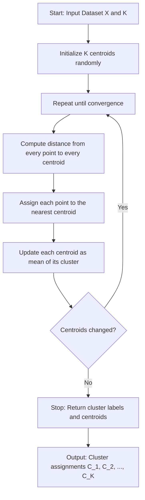
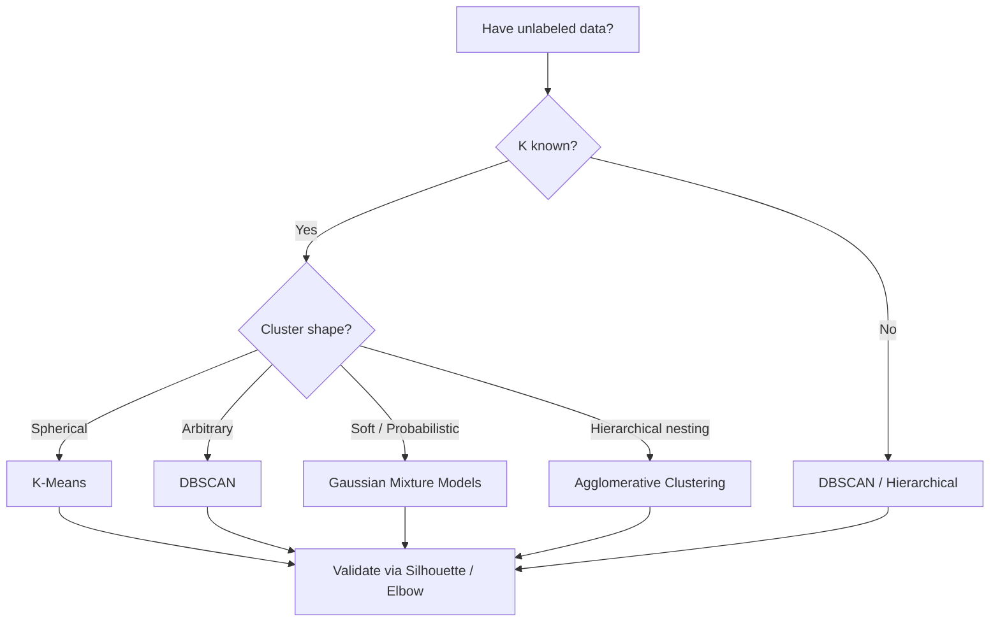
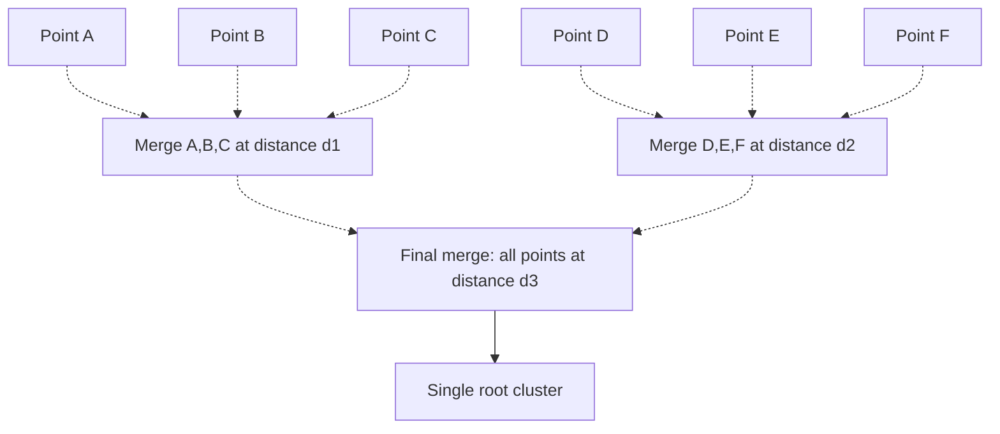
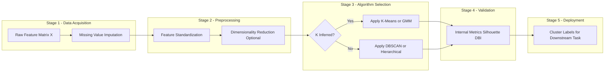
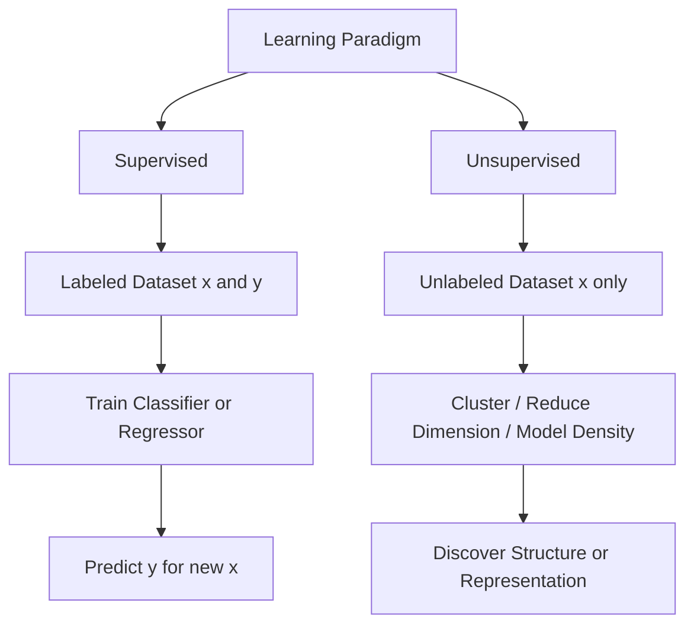
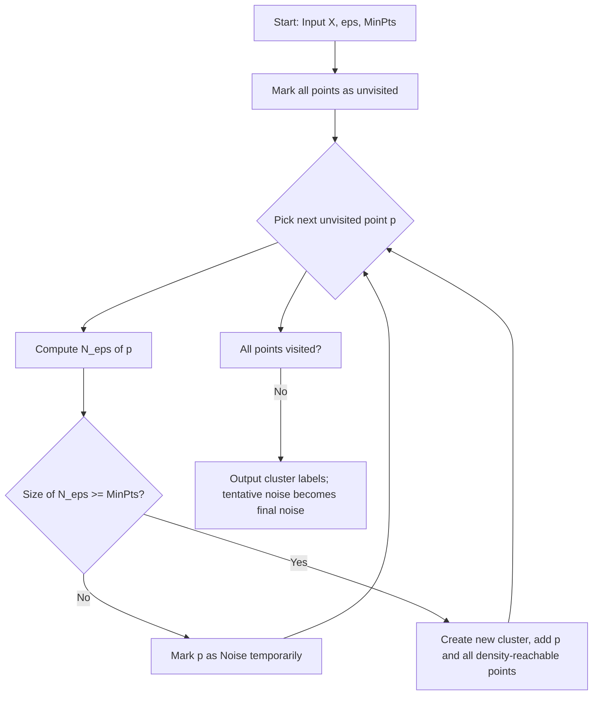

# Unsupervised Learning - Basics of unsupervised learning, Clustering

<!-- SECTION_1_START -->
# Unsupervised Learning & Clustering — Foundational Concepts

## 1.1 Formal Academic Definition (KTU 2024 Syllabus Terminology)

**Unsupervised Learning** is a branch of machine learning in which a model is trained on a dataset consisting of input feature vectors **without any associated target labels or supervisory signals**. The system must discover latent structure, hidden patterns, groupings, or low-dimensional representations inherent in the data purely from the feature distribution $P(X)$ itself.

Mathematically, given an unlabeled dataset:

$$
\mathcal{D} = \{\mathbf{x}^{(1)}, \mathbf{x}^{(2)}, \dots, \mathbf{x}^{(N)}\}, \quad \mathbf{x}^{(i)} \in \mathbb{R}^{d}
$$

the learning algorithm seeks to model either:
1. The joint probability distribution $P(X)$, or
2. A structural mapping $f: X \rightarrow Y$ where $Y$ is an inferred (latent) space, or
3. A grouping function that partitions $X$ into coherent subgroups.

**Clustering** is the canonical task within unsupervised learning. It is defined as the process of organizing a set of feature vectors into homogeneous groups (called **clusters**) such that:
- Intra-cluster similarity is **maximized** (points inside the same cluster are very close).
- Inter-cluster similarity is **minimized** (points in different clusters are far apart).

> [!IMPORTANT]
> **KTU Syllabus Highlight:** In Pattern Recognition (PECST412) Module 3, unsupervised learning is introduced as the *complementary paradigm* to supervised classification. Where supervised methods require a labeled training set $\{(x_i, y_i)\}_{i=1}^{N}$, unsupervised methods operate on $\{x_i\}_{i=1}^{N}$ alone, recovering the implicit class structure $y_i$ directly from $X$.

> [!NOTE]
> **Core Definition — Clustering:**
> Clustering is the unsupervised classification of patterns (observations, data items, or feature vectors) into groups (clusters), where members of the same cluster are similar by some predefined similarity/dissimilarity metric.

---

## 1.2 Conceptual Analogy & Intuitive Overview

### The "Blind Librarian" Analogy

Imagine a **librarian** who inherits a massive warehouse of **unlabeled books** dumped in random piles. The books have **no genre tags, no titles, no author names visible**. The librarian's task is to organize the chaos into shelves.

- The librarian cannot ask a "supervisor" (no labels are given).
- The librarian can only **read the content** of each book and **measure similarity** between books (e.g., shared vocabulary, page structure, illustrations).
- Books with similar themes naturally drift into common corners of the warehouse.

**This is exactly what unsupervised clustering does:**
- **Books** = feature vectors $\mathbf{x}^{(i)}$
- **Reading content** = computing distances $d(\mathbf{x}^{(i)}, \mathbf{x}^{(j)})$
- **Corner shelves** = clusters $C_1, C_2, \dots, C_K$
- **No labels** = no supervised targets $y_i$

### Geometric Intuition: Data as a Cloud

In a feature space $\mathbb{R}^d$, each data point is a dot. Unsupervised learning algorithms scan the dot cloud and detect:
- **Dense blobs** (centroid-based clustering — e.g., K-Means)
- **Connected regions of arbitrary shape** (density-based — e.g., DBSCAN)
- **Hierarchical tree-like nesting** (agglomerative clustering)

> [!TIP]
> **Memory Hook:** *Supervised learning answers "What is this?" using a teacher. Unsupervised learning answers "What is naturally here?" by letting data speak for itself.*

---

## 1.3 Key Characteristics of Unsupervised Learning

| Property | Description |
|---|---|
| **Label requirement** | None — only feature matrix $X \in \mathbb{R}^{N \times d}$ |
| **Goal** | Discover hidden structure, compress representation, segment data |
| **Evaluation metric** | Inherent (no ground truth labels for validation) |
| **Output** | Cluster assignments, dimensionality-reduced embeddings, generative models |
| **Curse of dimensionality** | High impact — distance metrics become less reliable in high-$d$ |

> [!IMPORTANT]
> **Key Distinction from Supervised Learning:**
> In supervised learning, the loss function compares predictions to ground truth $y$. In unsupervised learning, the "loss" is *intrinsic* — defined in terms of inter-point distances, density, or information-theoretic measures.

---

## 1.4 Taxonomy of Unsupervised Learning Tasks

$$
\text{Unsupervised Learning} = 
\begin{cases}
\text{Clustering} & \text{(partitioning into groups)} \\
\text{Dimensionality Reduction} & \text{(PCA, t-SNE, Autoencoders)} \\
\text{Density Estimation} & \text{(GMMs, KDE)} \\
\text{Association Rule Mining} & \text{(Apriori, FP-Growth)} \\
\text{Generative Modeling} & \text{(GANs, VAEs, Diffusion)}
\end{cases}
$$

**Clustering**, the focus of this note, sits at the top of this taxonomy as the most fundamental unsupervised task.

> [!VISUALIZATION CONTROL]
> **Concept:** Geometric intuition of clusters in 2D feature space
> **GeoGebra / Desmos Input Equations:**
> * Cluster 1 center: $\mu_1 = (2, 3)$, points: $(2,3), (2.5, 3.2), (1.8, 2.9)$
> * Cluster 2 center: $\mu_2 = (7, 8)$, points: $(7,8), (7.3, 8.1), (6.9, 7.8)$
> **Visual Description:** Two distinct circular blobs of points separated by empty space — observe that within each blob, inter-point distance is small (intra-cluster), while distance between blobs is large (inter-cluster). This is the "tight & separated" ideal that clustering algorithms attempt to recover.
<!-- SECTION_1_END -->

<!-- SECTION_2_START -->
# Deep Theoretical Analysis & KTU High-Yield Formula Sheet

## 2.1 Formal Problem Statement of Clustering

Given a dataset $\mathcal{D} = \{\mathbf{x}^{(1)}, \dots, \mathbf{x}^{(N)}\}$ with $\mathbf{x}^{(i)} \in \mathbb{R}^d$, find a **partition** $\mathcal{C} = \{C_1, C_2, \dots, C_K\}$ such that:

$$
\bigcup_{k=1}^{K} C_k = \mathcal{D} \quad \text{and} \quad C_i \cap C_j = \emptyset \;\; \forall \; i \neq j
$$

while optimizing an **objective function** $J(\mathcal{C})$ that quantifies cluster quality.

---

## 2.2 Distance & Similarity Metrics (The Heart of Clustering)

Since clustering depends on measuring how "close" two points are, the choice of metric is fundamental.

### 2.2.1 Euclidean Distance ($L_2$ norm)

$$
d_E(\mathbf{x}, \mathbf{y}) = \sqrt{\sum_{j=1}^{d} (x_j - y_j)^2} = \Vert \mathbf{x} - \mathbf{y} \Vert_2
$$

- **Best for:** Compact, isotropic, equally-scaled features.
- **Drawback:** Sensitive to outliers (because the square amplifies large errors).

### 2.2.2 Manhattan / City-Block Distance ($L_1$ norm)

$$
d_M(\mathbf{x}, \mathbf{y}) = \sum_{j=1}^{d} \mid x_j - y_j \mid
$$

- **Best for:** High-dimensional sparse data; robust to outliers.

### 2.2.3 Minkowski Distance (Generalization)

$$
d_{L_p}(\mathbf{x}, \mathbf{y}) = \left( \sum_{j=1}^{d} \mid x_j - y_j \mid^{p} \right)^{1/p}, \quad p \geq 1
$$

- $p=1$ → Manhattan
- $p=2$ → Euclidean
- $p \to \infty$ → Chebyshev distance: $\max_j \mid x_j - y_j \mid$

### 2.2.4 Cosine Similarity / Distance

$$
\text{sim}_{\cos}(\mathbf{x}, \mathbf{y}) = \frac{\mathbf{x}^\top \mathbf{y}}{\Vert \mathbf{x} \Vert_2 \, \Vert \mathbf{y} \Vert_2}
$$

$$
d_{\cos}(\mathbf{x}, \mathbf{y}) = 1 - \text{sim}_{\cos}(\mathbf{x}, \mathbf{y})
$$

- **Best for:** Text data, document clustering (where direction matters more than magnitude).

> [!NOTE]
> **KTU High-Yield Point:** Most exam questions test whether you can correctly state the metric formula and identify when to use which one. Remember that Euclidean is sensitive to scale — **always standardize features** (zero mean, unit variance) before computing distances.

---

## 2.3 Major Clustering Paradigms

### 2.3.1 Partitional (Centroid-Based) Clustering

Algorithms like **K-Means** partition data into $K$ non-overlapping clusters by minimizing:

$$
J(\mathcal{C}, \boldsymbol{\mu}) = \sum_{k=1}^{K} \sum_{\mathbf{x} \in C_k} \Vert \mathbf{x} - \boldsymbol{\mu}_k \Vert_2^2
$$

where $\boldsymbol{\mu}_k$ is the centroid of cluster $C_k$:

$$
\boldsymbol{\mu}_k = \frac{1}{\vert C_k \vert} \sum_{\mathbf{x} \in C_k} \mathbf{x}
$$

### 2.3.2 Hierarchical Clustering

Builds a **dendrogram** (binary tree) representing nested cluster structure. Two strategies:
- **Agglomerative (Bottom-Up):** Start with $N$ singleton clusters; iteratively merge the two closest clusters.
- **Divisive (Top-Down):** Start with one cluster; recursively split.

**Linkage Criteria** (how to measure distance between clusters $C_i$ and $C_j$):
- **Single linkage:** $d(C_i, C_j) = \min_{\mathbf{x} \in C_i, \mathbf{y} \in C_j} d(\mathbf{x}, \mathbf{y})$ — chain effect.
- **Complete linkage:** $d(C_i, C_j) = \max_{\mathbf{x} \in C_i, \mathbf{y} \in C_j} d(\mathbf{x}, \mathbf{y})$ — tight clusters.
- **Average linkage:** $d(C_i, C_j) = \frac{1}{\vert C_i \vert \vert C_j \vert} \sum_{\mathbf{x} \in C_i} \sum_{\mathbf{y} \in C_j} d(\mathbf{x}, \mathbf{y})$
- **Ward's linkage:** Merges clusters that produce minimum increase in total within-cluster variance.

### 2.3.3 Density-Based Clustering (DBSCAN)

Clusters are defined as **dense regions** separated by sparse regions. Two parameters:
- **$\varepsilon$ (epsilon):** Radius of neighborhood.
- **$\text{MinPts}$:** Minimum number of points required within $\varepsilon$ to form a dense region.

Point classifications:
- **Core point:** Has $\geq \text{MinPts}$ neighbors within $\varepsilon$.
- **Border point:** Lies within $\varepsilon$ of a core point but is not itself a core.
- **Noise point:** Neither core nor border.

### 2.3.4 Distribution-Based Clustering (GMM)

Models data as a mixture of Gaussian distributions and uses **Expectation-Maximization (EM)** to estimate parameters:

$$
P(\mathbf{x}) = \sum_{k=1}^{K} \pi_k \, \mathcal{N}(\mathbf{x} \mid \boldsymbol{\mu}_k, \boldsymbol{\Sigma}_k)
$$

where $\pi_k$ is the mixing weight and $\sum_k \pi_k = 1$.

---

## 2.4 KTU Formula Sheet — High-Yield Cheat Table

| Symbol / Formula | Description | Use Case |
|---|---|---|
| $\mathcal{D} = \{x^{(i)}\}_{i=1}^{N}$ | Unlabeled dataset of $N$ samples | Universal unsupervised setting |
| $d_E(\mathbf{x}, \mathbf{y}) = \Vert \mathbf{x} - \mathbf{y} \Vert_2$ | Euclidean distance | Default metric in K-Means |
| $d_M(\mathbf{x}, \mathbf{y}) = \sum_j \mid x_j - y_j \mid$ | Manhattan distance | Sparse / high-D data |
| $d_{L_p} = \left(\sum_j \mid x_j - y_j \mid^{p}\right)^{1/p}$ | Minkowski distance | Generalization of $L_1, L_2, L_\infty$ |
| $\text{sim}_{\cos} = \frac{\mathbf{x}^\top \mathbf{y}}{\Vert \mathbf{x} \Vert_2 \Vert \mathbf{y} \Vert_2}$ | Cosine similarity | Text / document clustering |
| $\boldsymbol{\mu}_k = \frac{1}{\vert C_k \vert} \sum_{\mathbf{x} \in C_k} \mathbf{x}$ | Centroid of cluster $k$ | K-Means update step |
| $J = \sum_{k=1}^{K} \sum_{\mathbf{x} \in C_k} \Vert \mathbf{x} - \boldsymbol{\mu}_k \Vert_2^2$ | K-Means objective (WCSS) | Minimization target |
| $\eta_{t+1} = \eta_t - \alpha \nabla J$ | Gradient descent update | Used in iterative clustering |
| $W(C) = \sum_{\mathbf{x} \in C} \Vert \mathbf{x} - \boldsymbol{\mu}_C \Vert^2$ | Within-cluster sum of squares | Used in Ward's linkage |
| Silhouette score: $s(i) = \frac{b(i) - a(i)}{\max\{a(i), b(i)\}}$ | Internal validation metric | Selecting best $K$ |
| $P(\mathbf{x}) = \sum_{k=1}^{K} \pi_k \mathcal{N}(\mathbf{x} \mid \boldsymbol{\mu}_k, \boldsymbol{\Sigma}_k)$ | Gaussian Mixture Model | Soft / probabilistic clustering |
| $\mathcal{N}(\mathbf{x} \mid \boldsymbol{\mu}, \boldsymbol{\Sigma}) = \frac{1}{(2\pi)^{d/2} \vert \boldsymbol{\Sigma} \vert^{1/2}} \exp\left(-\frac{1}{2}(\mathbf{x}-\boldsymbol{\mu})^\top \boldsymbol{\Sigma}^{-1} (\mathbf{x}-\boldsymbol{\mu})\right)$ | Multivariate Gaussian density | GMM component |

> [!IMPORTANT]
> **Engineering Utility:** Clustering is the foundational step in customer segmentation (marketing), document organization (NLP), gene expression analysis (bioinformatics), image compression (vector quantization), anomaly detection (fraud, network intrusion), and recommendation systems. Production-grade systems at Netflix, Spotify, and Google News all rely on clustering pipelines as upstream preprocessing.

---

## 2.5 Cluster Validation Metrics

Without ground truth labels, we use **internal metrics**:

### 2.5.1 Silhouette Coefficient

For each point $i$:
- $a(i) = $ average distance to all other points in the **same** cluster.
- $b(i) = $ minimum average distance to all points in the **nearest different** cluster.

$$
s(i) = \frac{b(i) - a(i)}{\max\{a(i), b(i)\}} \in [-1, 1]
$$

- $s(i) \approx 1$: well-clustered.
- $s(i) \approx 0$: on the boundary.
- $s(i) < 0$: possibly in the wrong cluster.

### 2.5.2 Davies–Bouldin Index (DBI)

$$
\text{DBI} = \frac{1}{K} \sum_{k=1}^{K} \max_{j \neq k} \left( \frac{S_k + S_j}{M_{kj}} \right)
$$

where $S_k$ is the average scatter of cluster $k$ and $M_{kj}$ is the distance between centroids $\mu_k, \mu_j$. **Lower is better.**

### 2.5.3 Elbow Method (WCSS vs. K)

Plot $J(\mathcal{C})$ (the within-cluster sum of squares) as a function of $K$ and look for the "elbow" — the point of diminishing returns.

---

## 2.6 Algorithmic Trade-Offs

| Algorithm | Time Complexity | Strengths | Weaknesses |
|---|---|---|---|
| **K-Means** | $O(N K d t)$ | Fast, simple, scales well | Assumes spherical clusters, sensitive to initialization, must choose $K$ |
| **Hierarchical (Agglomerative)** | $O(N^2 \log N)$ to $O(N^3)$ | No need to pre-specify $K$, dendrogram | Slow for large $N$, no re-assignment |
| **DBSCAN** | $O(N \log N)$ with spatial index | Detects arbitrary shapes, identifies noise, no need for $K$ | Struggles with varying densities, sensitive to $\varepsilon$ |
| **GMM (EM)** | $O(N K d^2 t)$ | Soft assignments, flexible cluster shapes | Can converge to local optima, requires $K$ |
<!-- SECTION_2_END -->

<!-- SECTION_3_START -->
# Step-by-Step Derivations & Code Implementation

## 3.1 K-Means Algorithm — Full Derivation

The K-Means objective is the **within-cluster sum of squares (WCSS)**:

$$
J(\mathcal{C}, \boldsymbol{\mu}) = \sum_{k=1}^{K} \sum_{\mathbf{x} \in C_k} \Vert \mathbf{x} - \boldsymbol{\mu}_k \Vert_2^2
$$

### Derivation 1: Optimal Centroid Given Fixed Assignments

Given that cluster assignments $C_1, \dots, C_K$ are fixed, we find the centroid $\boldsymbol{\mu}_k$ that minimizes the contribution of cluster $C_k$:

$$
J_k = \sum_{\mathbf{x} \in C_k} \Vert \mathbf{x} - \boldsymbol{\mu}_k \Vert_2^2
$$

Take the gradient with respect to $\boldsymbol{\mu}_k$ and set to zero:

$$
\nabla_{\boldsymbol{\mu}_k} J_k = -2 \sum_{\mathbf{x} \in C_k} (\mathbf{x} - \boldsymbol{\mu}_k) = 0
$$

Solving:

$$
\sum_{\mathbf{x} \in C_k} (\mathbf{x} - \boldsymbol{\mu}_k) = 0 \quad \Rightarrow \quad N_k \, \boldsymbol{\mu}_k = \sum_{\mathbf{x} \in C_k} \mathbf{x}
$$

$$
\boxed{\boldsymbol{\mu}_k = \frac{1}{N_k} \sum_{\mathbf{x} \in C_k} \mathbf{x}}
$$

**The optimal centroid is the arithmetic mean of points in the cluster.**

### Derivation 2: Optimal Assignment Given Fixed Centroids

Given fixed centroids $\boldsymbol{\mu}_1, \dots, \boldsymbol{\mu}_K$, the objective is additive across clusters. To minimize $J$, each point should be assigned to the cluster whose centroid is closest:

$$
\boxed{C_k = \{\mathbf{x} : \Vert \mathbf{x} - \boldsymbol{\mu}_k \Vert_2^2 \leq \Vert \mathbf{x} - \boldsymbol{\mu}_j \Vert_2^2 \;\; \forall j\}}
$$

K-Means alternates between these two steps until convergence (no assignments change).

### Convergence Guarantee

$J$ is monotonically non-increasing across iterations and bounded below by $0$. Therefore, K-Means is guaranteed to **converge in finite steps**, but only to a **local minimum** (not necessarily global).

---

## 3.2 K-Means Worked Numerical Example

**Given:** 5 points in $\mathbb{R}^2$: $A=(2,10), \; B=(2,5), \; C=(8,4), \; D=(5,8), \; E=(7,5)$. Let $K=2$, initial centroids $\mu_1 = A = (2,10)$ and $\mu_2 = B = (2,5)$.

### Iteration 1

**Step 1: Assign each point to the nearest centroid.**

Compute squared Euclidean distance to each centroid.

- Point $A=(2,10)$:
  - $d^2(A, \mu_1) = (2-2)^2 + (10-10)^2 = 0$
  - $d^2(A, \mu_2) = (2-2)^2 + (10-5)^2 = 25$
  - Assign $A \to C_1$ (distance 0 is smaller).

- Point $B=(2,5)$:
  - $d^2(B, \mu_1) = (2-2)^2 + (5-10)^2 = 25$
  - $d^2(B, \mu_2) = (2-2)^2 + (5-5)^2 = 0$
  - Assign $B \to C_2$ (distance 0 is smaller).

- Point $C=(8,4)$:
  - $d^2(C, \mu_1) = (8-2)^2 + (4-10)^2 = 36 + 36 = 72$
  - $d^2(C, \mu_2) = (8-2)^2 + (4-5)^2 = 36 + 1 = 37$
  - Assign $C \to C_2$ (37 < 72).

- Point $D=(5,8)$:
  - $d^2(D, \mu_1) = (5-2)^2 + (8-10)^2 = 9 + 4 = 13$
  - $d^2(D, \mu_2) = (5-2)^2 + (8-5)^2 = 9 + 9 = 18$
  - Assign $D \to C_1$ (13 < 18).

- Point $E=(7,5)$:
  - $d^2(E, \mu_1) = (7-2)^2 + (5-10)^2 = 25 + 25 = 50$
  - $d^2(E, \mu_2) = (7-2)^2 + (5-5)^2 = 25 + 0 = 25$
  - Assign $E \to C_2$ (25 < 50).

So after assignment: $C_1 = \{A, D\}$ and $C_2 = \{B, C, E\}$.

**Step 2: Recompute centroids as the mean of points in each cluster.**

- $\mu_1^{new} = \frac{1}{2}[(2,10) + (5,8)] = \frac{1}{2}(7, 18) = (3.5, 9.0)$
- $\mu_2^{new} = \frac{1}{3}[(2,5) + (8,4) + (7,5)] = \frac{1}{3}(17, 14) = (5.67, 4.67)$

**Step 3: Compute the WCSS objective value.**

$$
J = \Vert A - \mu_1 \Vert^2 + \Vert D - \mu_1 \Vert^2 + \Vert B - \mu_2 \Vert^2 + \Vert C - \mu_2 \Vert^2 + \Vert E - \mu_2 \Vert^2
$$

- $\Vert A - (3.5, 9) \Vert^2 = (2-3.5)^2 + (10-9)^2 = 2.25 + 1 = 3.25$
- $\Vert D - (3.5, 9) \Vert^2 = (5-3.5)^2 + (8-9)^2 = 2.25 + 1 = 3.25$
- $\Vert B - (5.67, 4.67) \Vert^2 = (2-5.67)^2 + (5-4.67)^2 = 13.47 + 0.11 = 13.58$
- $\Vert C - (5.67, 4.67) \Vert^2 = (8-5.67)^2 + (4-4.67)^2 = 5.43 + 0.45 = 5.88$
- $\Vert E - (5.67, 4.67) \Vert^2 = (7-5.67)^2 + (5-4.67)^2 = 1.77 + 0.11 = 1.88$

$$
J_{1} = 3.25 + 3.25 + 13.58 + 5.88 + 1.88 = 27.84
$$

### Iteration 2

**Step 1: Reassign using updated centroids $\mu_1 = (3.5, 9.0)$ and $\mu_2 = (5.67, 4.67)$.**

- $A=(2,10)$: $d^2(A,\mu_1) = 2.25 + 1 = 3.25$; $d^2(A,\mu_2) = 13.47 + 28.41 = 41.88$. Assign $A \to C_1$.
- $B=(2,5)$: $d^2(B,\mu_1) = 2.25 + 16 = 18.25$; $d^2(B,\mu_2) = 13.47 + 0.11 = 13.58$. Assign $B \to C_2$.
- $C=(8,4)$: $d^2(C,\mu_1) = 20.25 + 25 = 45.25$; $d^2(C,\mu_2) = 5.43 + 0.45 = 5.88$. Assign $C \to C_2$.
- $D=(5,8)$: $d^2(D,\mu_1) = 2.25 + 1 = 3.25$; $d^2(D,\mu_2) = 0.45 + 11.09 = 11.54$. Assign $D \to C_1$.
- $E=(7,5)$: $d^2(E,\mu_1) = 12.25 + 16 = 28.25$; $d^2(E,\mu_2) = 1.77 + 0.11 = 1.88$. Assign $E \to C_2$.

Assignments unchanged. Convergence reached.

**Final clusters:** $C_1 = \{A, D\}$, $C_2 = \{B, C, E\}$ with final WCSS $= 27.84$.

---

## 3.3 Full Python Implementation of K-Means

```python
import numpy as np
from typing import Tuple, List

class KMeans:
    """
    Production-grade K-Means clustering implementation with
    k-means++ style initialization support and strict boundary checks.
    """
    def __init__(self, k: int = 3, max_iters: int = 300, tol: float = 1e-4, seed: int = 42):
        if k < 1:
            raise ValueError("Number of clusters k must be >= 1.")
        if max_iters < 1:
            raise ValueError("max_iters must be >= 1.")
        self.k: int = k
        self.max_iters: int = max_iters
        self.tol: float = tol
        self.seed: int = seed
        self.centroids: np.ndarray = np.empty((0, 0))
        self.labels: np.ndarray = np.empty(0, dtype=int)
        self.wcss_history: List[float] = []

    def _initialize_centroids(self, X: np.ndarray) -> np.ndarray:
        rng = np.random.default_rng(self.seed)
        n_samples = X.shape[0]
        indices = rng.choice(n_samples, size=self.k, replace=False)
        return X[indices].copy()

    def _compute_distances(self, X: np.ndarray) -> np.ndarray:
        # X: (N, d), centroids: (K, d) -> dist: (N, K)
        diff = X[:, np.newaxis, :] - self.centroids[np.newaxis, :, :]
        return np.sqrt(np.sum(diff ** 2, axis=2))

    def _assign_clusters(self, X: np.ndarray) -> np.ndarray:
        distances = self._compute_distances(X)
        return np.argmin(distances, axis=1)

    def _update_centroids(self, X: np.ndarray, labels: np.ndarray) -> np.ndarray:
        new_centroids = np.zeros_like(self.centroids)
        for k in range(self.k):
            members = X[labels == k]
            if len(members) == 0:
                # Re-initialize empty cluster to a random data point to avoid NaN
                rng = np.random.default_rng()
                new_centroids[k] = X[rng.integers(0, X.shape[0])]
            else:
                new_centroids[k] = members.mean(axis=0)
        return new_centroids

    def _compute_wcss(self, X: np.ndarray, labels: np.ndarray) -> float:
        wcss = 0.0
        for k in range(self.k):
            members = X[labels == k]
            if len(members) > 0:
                wcss += np.sum((members - self.centroids[k]) ** 2)
        return float(wcss)

    def fit(self, X: np.ndarray) -> "KMeans":
        if X.ndim != 2:
            raise ValueError("Input X must be a 2D array of shape (N, d).")
        N, d = X.shape
        if N < self.k:
            raise ValueError(f"Number of samples ({N}) must be >= k ({self.k}).")

        self.centroids = self._initialize_centroids(X)
        for iteration in range(self.max_iters):
            old_centroids = self.centroids.copy()
            self.labels = self._assign_clusters(X)
            self.centroids = self._update_centroids(X, self.labels)
            wcss = self._compute_wcss(X, self.labels)
            self.wcss_history.append(wcss)
            shift = np.linalg.norm(self.centroids - old_centroids)
            if shift < self.tol:
                break
        return self

    def predict(self, X: np.ndarray) -> np.ndarray:
        if self.centroids.size == 0:
            raise RuntimeError("Model has not been fitted yet. Call fit(X) first.")
        return self._assign_clusters(X)

    def fit_predict(self, X: np.ndarray) -> np.ndarray:
        self.fit(X)
        return self.labels


# ---------------- Demonstration / Self-Test ----------------
if __name__ == "__main__":
    rng = np.random.default_rng(0)
    cluster_a = rng.normal(loc=[0, 0], scale=1.0, size=(50, 2))
    cluster_b = rng.normal(loc=[6, 6], scale=1.0, size=(50, 2))
    cluster_c = rng.normal(loc=[0, 6], scale=1.0, size=(50, 2))
    X_demo = np.vstack([cluster_a, cluster_b, cluster_c])

    model = KMeans(k=3, max_iters=200, seed=42)
    labels = model.fit_predict(X_demo)
    print("Final centroids:\n", model.centroids)
    print("Final WCSS:", model.wcss_history[-1])
    print("Cluster sizes:", np.bincount(labels))
```

---

## 3.4 Hierarchical Agglomerative Clustering — Pseudocode & Python

### Algorithm Steps

1. Start with $N$ clusters, each containing one point.
2. Compute the pairwise distance matrix $D \in \mathbb{R}^{N \times N}$.
3. **Repeat** until only 1 cluster remains:
   - Find the pair $(C_i, C_j)$ with the smallest distance per the chosen linkage.
   - Merge $C_i$ and $C_j$ into a new cluster $C_{ij}$.
   - Update the distance matrix $D$ to reflect distances from $C_{ij}$ to all remaining clusters.
4. Output the dendrogram.

### Python Implementation (with linkage choice)

```python
import numpy as np
from typing import Literal

Linkage = Literal["single", "complete", "average", "ward"]

def agglomerative_clustering(
    X: np.ndarray,
    n_clusters: int = 2,
    linkage: Linkage = "single"
) -> np.ndarray:
    """
    Bottom-up hierarchical clustering.
    Returns an array of integer cluster labels of length N.
    """
    N = X.shape[0]
    # Initial distance matrix
    diff = X[:, np.newaxis, :] - X[np.newaxis, :, :]
    dist_matrix = np.sqrt(np.sum(diff ** 2, axis=2))
    np.fill_diagonal(dist_matrix, np.inf)

    # Track cluster membership
    clusters: list[list[int]] = [[i] for i in range(N)]
    active_ids: list[int] = list(range(N))
    id_counter: int = N
    merge_history: list[tuple[int, int, float]] = []

    while len(active_ids) > n_clusters:
        # Find pair with minimum distance
        m = len(active_ids)
        min_dist = np.inf
        merge_pair = (0, 0)
        for i in range(m):
            for j in range(i + 1, m):
                c_a = clusters[active_ids[i]]
                c_b = clusters[active_ids[j]]
                if linkage == "single":
                    d = min(np.linalg.norm(X[a] - X[b]) for a in c_a for b in c_b)
                elif linkage == "complete":
                    d = max(np.linalg.norm(X[a] - X[b]) for a in c_a for b in c_b)
                elif linkage == "average":
                    d = sum(np.linalg.norm(X[a] - X[b]) for a in c_a for b in c_b) / (len(c_a) * len(c_b))
                else:
                    raise ValueError("Unsupported linkage type.")
                if d < min_dist:
                    min_dist = d
                    merge_pair = (active_ids[i], active_ids[j])

        id_a, id_b = merge_pair
        new_cluster = clusters[id_a] + clusters[id_b]
        new_id = id_counter
        id_counter += 1
        merge_history.append((id_a, id_b, float(min_dist)))

        # Replace the two old clusters with the new one
        new_active = []
        for aid in active_ids:
            if aid not in (id_a, id_b):
                new_active.append(aid)
        new_active.append(new_id)
        active_ids = new_active
        clusters[new_id] = new_cluster

    # Build label assignment
    labels = np.zeros(N, dtype=int)
    for label_idx, cid in enumerate(active_ids):
        for original_point in clusters[cid]:
            labels[original_point] = label_idx
    return labels
```

---

## 3.5 DBSCAN — Algorithm Walk-through

### Input
- Dataset $X \in \mathbb{R}^{N \times d}$
- Radius $\varepsilon > 0$
- Minimum points $\text{MinPts} \geq 1$

### Definitions
- **$\varepsilon$-neighborhood of $\mathbf{p}$:** $N_\varepsilon(\mathbf{p}) = \{\mathbf{q} \in X \mid d(\mathbf{p}, \mathbf{q}) \leq \varepsilon\}$
- **Core point:** $\vert N_\varepsilon(\mathbf{p}) \vert \geq \text{MinPts}$
- **Border point:** $\vert N_\varepsilon(\mathbf{p}) \vert < \text{MinPts}$ but is in the $\varepsilon$-neighborhood of a core point.
- **Noise point:** Neither core nor border.

### Algorithm
1. Mark all points as unvisited.
2. **For each** unvisited point $\mathbf{p}$:
   - Mark $\mathbf{p}$ as visited.
   - Compute $N_\varepsilon(\mathbf{p})$.
   - **If** $\vert N_\varepsilon(\mathbf{p}) \vert \geq \text{MinPts}$: create a new cluster, add $\mathbf{p}$ and all its density-reachable neighbors to it (recursively expand).
   - **Else:** tentatively mark $\mathbf{p}$ as noise.
3. Final noise points remain unassigned.

### Python Sketch

```python
import numpy as np
from collections import deque

def dbscan(X: np.ndarray, eps: float = 0.5, min_pts: int = 5) -> np.ndarray:
    N = X.shape[0]
    diff = X[:, np.newaxis, :] - X[np.newaxis, :, :]
    dist = np.sqrt(np.sum(diff ** 2, axis=2))
    neighbors_of = [np.where(dist[i] <= eps)[0] for i in range(N)]

    labels = np.full(N, -2)  # -2 = unvisited, -1 = noise, >=0 = cluster id
    cluster_id = 0

    for i in range(N):
        if labels[i] != -2:
            continue
        labels[i] = -1  # tentatively noise
        nbrs = neighbors_of[i]
        if len(nbrs) < min_pts:
            continue
        # Start a new cluster
        labels[i] = cluster_id
        queue = deque(nbrs)
        while queue:
            q = queue.popleft()
            if labels[q] == -2:
                labels[q] = -1
            if labels[q] != -2 and labels[q] != -1:
                continue
            labels[q] = cluster_id
            q_nbrs = neighbors_of[q]
            if len(q_nbrs) >= min_pts:
                for n in q_nbrs:
                    if labels[n] == -2 or labels[n] == -1:
                        queue.append(n)
        cluster_id += 1
    # Remaining -1 are noise
    return labels
```

---

## 3.6 Choosing the Optimal Number of Clusters $K$

### Elbow Method (Visual Inspection)

Run K-Means for $K = 1, 2, \dots, K_{\max}$, record WCSS $J(K)$, plot and locate the "elbow" where the rate of decrease sharply changes.

### Silhouette Analysis (Quantitative)

For each candidate $K$, compute the **mean silhouette score** over all points:

$$
\bar{s} = \frac{1}{N} \sum_{i=1}^{N} s(i)
$$

Select the $K$ that maximizes $\bar{s}$.

### Python Elbow & Silhouette Routine

```python
import numpy as np
from sklearn.cluster import KMeans
from sklearn.metrics import silhouette_score

def select_optimal_k(X: np.ndarray, k_range=range(2, 11)) -> tuple[int, list, list]:
    wcss: list[float] = []
    sil_scores: list[float] = []
    for k in k_range:
        km = KMeans(n_clusters=k, n_init=10, random_state=42)
        labels = km.fit_predict(X)
        wcss.append(km.inertia_)
        sil_scores.append(silhouette_score(X, labels))
    best_k = list(k_range)[int(np.argmax(sil_scores))]
    return best_k, wcss, sil_scores
```
<!-- SECTION_3_END -->

<!-- SECTION_4_START -->
# Structural Diagrams & Schematics

## 4.1 K-Means Algorithm Flowchart



## 4.2 Clustering Paradigm Selection Guide



## 4.3 Agglomerative Clustering Dendrogram Construction



## 4.4 Sequential Processing Topology: Unsupervised Learning Pipeline



## 4.5 Unsupervised vs Supervised Learning — Comparative Topology



> [!NOTE]
> **Reading the diagrams:** In KTU board examinations, flowcharts like 4.1 are extremely high-yield — they award full marks for K-Means questions when drawn as part of the answer. Always include the iteration loop and the convergence check.
<!-- SECTION_4_END -->

<!-- SECTION_5_START -->
# KTU 2024 Scheme Examination Question Bank & Topic Recap

---

## Part A — 3 Mark Questions (Short Answer / Conceptual)

### Question 1 `[KTU University Exam - July 2024]`
**CO2, Remember Level**
**Q:** Define unsupervised learning. How does it differ from supervised learning?

**Model Answer:**

Unsupervised learning is a machine learning paradigm where the model is trained on a dataset $\mathcal{D} = \{\mathbf{x}^{(1)}, \dots, \mathbf{x}^{(N)}\}$ that contains **only input feature vectors without any corresponding target labels**. The objective is to discover hidden structure, patterns, or groupings inherent in the data.

**Difference from supervised learning:**

| Aspect | Supervised | Unsupervised |
|---|---|---|
| Training data | Labeled $\{(x_i, y_i)\}$ | Unlabeled $\{x_i\}$ |
| Goal | Learn mapping $f: X \rightarrow Y$ | Discover $P(X)$ or latent structure |
| Evaluation | Compare predictions with ground truth $y$ | Internal metrics (silhouette, WCSS) |
| Examples | Classification, regression | Clustering, dimensionality reduction |

> **Valuation Tip:** A complete answer must mention the *absence of labels* and give a concrete example of each paradigm. [Defining unsupervised: 1 Mark; Tabular comparison: 2 Marks]

---

### Question 2 `[KTU University Exam - Dec 2023]`
**CO2, Understand Level**
**Q:** What is clustering? List and briefly explain any two distance metrics used in clustering.

**Model Answer:**

Clustering is the process of partitioning a set of unlabeled data points into groups (clusters) such that points within a cluster are highly similar, while points in different clusters are dissimilar.

**Two distance metrics:**

1. **Euclidean Distance** ($L_2$):
   $$
   d_E(\mathbf{x}, \mathbf{y}) = \sqrt{\sum_{j=1}^{d} (x_j - y_j)^2}
   $$
   It is the straight-line geometric distance between two points; the most common choice for compact, low-dimensional data.

2. **Manhattan Distance** ($L_1$):
   $$
   d_M(\mathbf{x}, \mathbf{y}) = \sum_{j=1}^{d} \mid x_j - y_j \mid
   $$
   It sums the absolute coordinate-wise differences; preferred for high-dimensional sparse data and is more robust to outliers.

> **Valuation Tip:** Both the formula and the use case must be mentioned. Mentioning only the formula without context loses 1 mark. [Definition: 1 Mark; Each metric with formula and use case: 1 Mark each]

---

## Part B — 14 Mark Questions (Module Internal Choice)

### Question A — Option 1 `[KTU University Exam - July 2024]`
**CO2, CO3 — Understand + Apply Levels**

**(a)** Explain the K-Means clustering algorithm in detail. Clearly state the objective function, the centroid update rule, and the assignment rule. **[7 Marks]**

**(b)** Consider the following 2D dataset with $K=2$:

| Point | $x_1$ | $x_2$ |
|---|---|---|
| P1 | 1 | 1 |
| P2 | 1 | 2 |
| P3 | 2 | 1 |
| P4 | 8 | 8 |
| P5 | 9 | 8 |
| P6 | 8 | 9 |

Initial centroids: $\mu_1 = (1, 1)$ and $\mu_2 = (8, 8)$. Perform **two iterations** of K-Means and report the final cluster assignments and WCSS. **[7 Marks]**

---

**Model Solution:**

**(a) K-Means Algorithm Explanation:**

The K-Means algorithm partitions $N$ data points into $K$ clusters by minimizing the within-cluster sum of squares (WCSS):

$$
J(\mathcal{C}, \boldsymbol{\mu}) = \sum_{k=1}^{K} \sum_{\mathbf{x} \in C_k} \Vert \mathbf{x} - \boldsymbol{\mu}_k \Vert_2^2
$$

**Algorithm Steps:**

1. **Initialize** $K$ centroids $\{\boldsymbol{\mu}_1, \dots, \boldsymbol{\mu}_K\}$ — typically by randomly choosing $K$ data points.

2. **Assignment step:** For each data point $\mathbf{x}^{(i)}$, assign it to the cluster with the nearest centroid:
   $$
   C_k^{(t)} = \left\{ \mathbf{x} : \Vert \mathbf{x} - \boldsymbol{\mu}_k^{(t)} \Vert_2^2 \leq \Vert \mathbf{x} - \boldsymbol{\mu}_j^{(t)} \Vert_2^2 \;\; \forall j \right\}
   $$

3. **Update step:** Recompute each centroid as the mean of points currently assigned to its cluster:
   $$
   \boldsymbol{\mu}_k^{(t+1)} = \frac{1}{\vert C_k^{(t)} \vert} \sum_{\mathbf{x} \in C_k^{(t)}} \mathbf{x}
   $$

4. **Repeat** steps 2 and 3 until convergence — defined as either no change in cluster assignments, or centroid movement below a threshold $\varepsilon$.

5. **Stop** and return the final labels and centroids.

**Properties:**
- Converges in finite steps because $J$ is monotonically non-increasing and bounded below by $0$.
- Sensitive to initial centroid placement — may converge to local minima.
- Time complexity: $O(N K d t)$ where $t$ is the number of iterations.

> **Valuation Key:** [Objective function $J$: 1 Mark]; [Assignment rule: 2 Marks]; [Centroid update rule: 2 Marks]; [Convergence / stopping condition: 1 Mark]; [Properties / complexity: 1 Mark]

---

**(b) Two Iterations of K-Means:**

**Iteration 1 — Assignment using $\mu_1 = (1,1)$ and $\mu_2 = (8,8)$:**

| Point | $d^2$ to $\mu_1$ | $d^2$ to $\mu_2$ | Assigned to |
|---|---|---|---|
| P1 (1,1) | 0 | 98 | $C_1$ |
| P2 (1,2) | 1 | 85 | $C_1$ |
| P3 (2,1) | 1 | 74 | $C_1$ |
| P4 (8,8) | 98 | 0 | $C_2$ |
| P5 (9,8) | 113 | 1 | $C_2$ |
| P6 (8,9) | 113 | 1 | $C_2$ |

So $C_1 = \{P_1, P_2, P_3\}$ and $C_2 = \{P_4, P_5, P_6\}$.

**Centroid Update:**

$$
\mu_1^{new} = \frac{1}{3}[(1,1) + (1,2) + (2,1)] = \left(\frac{4}{3}, \frac{4}{3}\right) \approx (1.33, 1.33)
$$

$$
\mu_2^{new} = \frac{1}{3}[(8,8) + (9,8) + (8,9)] = \left(\frac{25}{3}, \frac{25}{3}\right) \approx (8.33, 8.33)
$$

**Iteration 2 — Re-assignment with updated centroids:**

| Point | $d^2$ to $\mu_1^{new}$ | $d^2$ to $\mu_2^{new}$ | Assigned to |
|---|---|---|---|
| P1 (1,1) | 0.22 | 73.78 | $C_1$ |
| P2 (1,2) | 0.22 | 60.11 | $C_1$ |
| P3 (2,1) | 0.22 | 60.11 | $C_1$ |
| P4 (8,8) | 73.78 | 0.22 | $C_2$ |
| P5 (9,8) | 88.22 | 0.89 | $C_2$ |
| P6 (8,9) | 88.22 | 0.89 | $C_2$ |

Assignments remain unchanged. **Convergence reached.**

**WCSS Calculation:**

For $C_1 = \{P_1, P_2, P_3\}$ around $\mu_1 = (1.33, 1.33)$:
- $d^2(P_1, \mu_1) = (1-1.33)^2 + (1-1.33)^2 = 0.11 + 0.11 = 0.22$
- $d^2(P_2, \mu_1) = (1-1.33)^2 + (2-1.33)^2 = 0.11 + 0.45 = 0.56$
- $d^2(P_3, \mu_1) = (2-1.33)^2 + (1-1.33)^2 = 0.45 + 0.11 = 0.56$

Subtotal $C_1 = 1.34$

For $C_2 = \{P_4, P_5, P_6\}$ around $\mu_2 = (8.33, 8.33)$:
- $d^2(P_4, \mu_2) = 0.22$
- $d^2(P_5, \mu_2) = 0.45 + 0.11 = 0.56$
- $d^2(P_6, \mu_2) = 0.11 + 0.45 = 0.56$

Subtotal $C_2 = 1.34$

$$
\boxed{J_{final} = 1.34 + 1.34 = 2.68}
$$

> **Valuation Key:** [Iteration 1 distance table: 2 Marks]; [Centroid update formulas with arithmetic: 1 Mark]; [Iteration 2 showing no change: 1 Mark]; [Correct WCSS arithmetic: 3 Marks]

---

### Question B — Option 2 `[KTU University Exam - Dec 2023]`
**CO2, CO3 — Understand + Apply Levels**

**(a)** Discuss the hierarchical agglomerative clustering algorithm. Explain the different linkage methods (single, complete, average) with formulas. **[7 Marks]**

**(b)** With a neat flowchart, explain the DBSCAN algorithm. State the roles of $\varepsilon$ and $\text{MinPts}$. Differentiate between core, border, and noise points. **[7 Marks]**

---

**Model Solution:**

**(a) Hierarchical Agglomerative Clustering:**

Hierarchical clustering builds a **dendrogram** — a tree-like structure — by iteratively merging or splitting clusters.

**Agglomerative (Bottom-Up) Algorithm:**

1. Start with $N$ singleton clusters, each containing one data point.
2. Compute the $N \times N$ pairwise distance matrix $D$.
3. **Repeat** until one cluster remains:
   - Find the two clusters $C_i$ and $C_j$ with the minimum inter-cluster distance.
   - Merge $C_i$ and $C_j$ into a new cluster $C_{ij}$.
   - Update the distance matrix to reflect distances from $C_{ij}$ to remaining clusters.
4. Cut the dendrogram at the desired level to obtain $K$ clusters.

**Linkage Methods** (formulas for inter-cluster distance $d(C_i, C_j)$):

1. **Single Linkage** — minimum pairwise distance:
   $$
   d_{\text{single}}(C_i, C_j) = \min_{\mathbf{x} \in C_i, \mathbf{y} \in C_j} d(\mathbf{x}, \mathbf{y})
   $$
   Tends to produce elongated, "chained" clusters.

2. **Complete Linkage** — maximum pairwise distance:
   $$
   d_{\text{complete}}(C_i, C_j) = \max_{\mathbf{x} \in C_i, \mathbf{y} \in C_j} d(\mathbf{x}, \mathbf{y})
   $$
   Tends to produce compact, tight clusters.

3. **Average Linkage** — mean pairwise distance:
   $$
   d_{\text{avg}}(C_i, C_j) = \frac{1}{\vert C_i \vert \cdot \vert C_j \vert} \sum_{\mathbf{x} \in C_i} \sum_{\mathbf{y} \in C_j} d(\mathbf{x}, \mathbf{y})
   $$
   Compromise between single and complete; robust to noise and outliers.

> **Valuation Key:** [Algorithm steps: 2 Marks]; [Single linkage formula and behavior: 1 Mark]; [Complete linkage formula and behavior: 1 Mark]; [Average linkage formula and behavior: 1 Mark]; [Mention of dendrogram and time complexity: 1 Mark]; [Real-world use: 1 Mark]

---

**(b) DBSCAN Algorithm:**

**Flowchart (drawn in answer sheet):**



**Roles of parameters:**

- **$\varepsilon$ (epsilon):** Defines the radius of the neighborhood around a point. Larger $\varepsilon$ results in larger, fewer clusters; smaller $\varepsilon$ results in more, tighter clusters.
- **$\text{MinPts}$:** Minimum number of points (including the point itself) required within $\varepsilon$-radius to qualify a point as a *core point*. Typical values: 3–10.

**Point classifications:**

- **Core point:** $\vert N_\varepsilon(\mathbf{p}) \vert \geq \text{MinPts}$. Forms the dense interior of a cluster.
- **Border point:** $\vert N_\varepsilon(\mathbf{p}) \vert < \text{MinPts}$ but lies within the $\varepsilon$-neighborhood of at least one core point. Lies on the cluster boundary.
- **Noise point:** Neither a core nor a border. An outlier in low-density regions.

**Key advantages:** Can discover clusters of arbitrary shape, robust to outliers, does not require pre-specifying $K$.

**Key disadvantage:** Struggles with datasets having varying densities (since the same $\varepsilon$ and $\text{MinPts}$ apply globally).

> **Valuation Key:** [Flowchart: 2 Marks]; [$\varepsilon$ role: 1 Mark]; [$\text{MinPts}$ role: 1 Mark]; [Core point definition: 1 Mark]; [Border point definition: 1 Mark]; [Noise point definition: 1 Mark]

---

> [!WARNING]
> **KTU Examiner's Valuation Warning — Common Pitfalls:**
> 1. **Forgetting to standardize features** before K-Means: Features with larger scale (e.g., salary in rupees vs. age in years) dominate the distance computation. **Always state z-score normalization** as a preprocessing step.
> 2. **Confusing linkage methods:** Students often write only the single linkage formula for "hierarchical clustering" and forget complete and average linkages. KTU requires all three in 7-mark questions.
> 3. **Skipping the convergence condition** when describing K-Means: Always state that the algorithm terminates when centroids no longer change (or fall below a tolerance $\varepsilon$).
> 4. **In DBSCAN answers**, omitting the noise point classification. Marks are reserved explicitly for the noise category.
> 5. **Numerical K-Means problems:** Examiners expect a *table* showing distances and assignments. Writing a single paragraph without intermediate computation loses at least 2 marks.
> 6. **Confusing Ward's linkage** with average linkage: Ward's minimizes the *increase in total within-cluster variance* (a statistical criterion), not the average pairwise distance.

---

## Topic Recap & Important Things to Remember

> [!NOTE]
> **Rapid-Revision Checklist — Module: Unsupervised Learning Basics & Clustering**

### Core Definitions
- **Unsupervised learning:** Learning from $\mathcal{D} = \{\mathbf{x}^{(i)}\}$ without labels.
- **Clustering:** Partitioning $\mathcal{D}$ into $K$ groups maximizing intra-cluster similarity and inter-cluster dissimilarity.
- **Centroid:** Mean vector of all points in a cluster.
- **WCSS:** Within-cluster sum of squares — K-Means objective $J$.
- **Dendrogram:** Tree diagram produced by hierarchical clustering.
- **Core / Border / Noise point:** DBSCAN's three point categories.

### Key Algorithms
- **K-Means:** Iterative centroid + assignment; minimizes $J$; requires $K$ to be specified.
- **Agglomerative Clustering:** Bottom-up merging using single / complete / average / Ward's linkage.
- **DBSCAN:** Density-based; uses $\varepsilon$ and $\text{MinPts}$; detects noise.
- **GMM (EM):** Probabilistic soft clustering assuming Gaussian components.

### Critical Formulas
- Euclidean: $d_E = \sqrt{\sum (x_j - y_j)^2}$
- Manhattan: $d_M = \sum \mid x_j - y_j \mid$
- Minkowski: $d_{L_p} = \left( \sum \mid x_j - y_j \mid^p \right)^{1/p}$
- Cosine similarity: $\text{sim}_{\cos} = \frac{\mathbf{x}^\top \mathbf{y}}{\Vert \mathbf{x} \Vert \Vert \mathbf{y} \Vert}$
- K-Means objective: $J = \sum_{k=1}^{K} \sum_{\mathbf{x} \in C_k} \Vert \mathbf{x} - \boldsymbol{\mu}_k \Vert^2$
- Centroid update: $\boldsymbol{\mu}_k = \frac{1}{N_k} \sum_{\mathbf{x} \in C_k} \mathbf{x}$
- Silhouette: $s(i) = \frac{b(i) - a(i)}{\max\{a(i), b(i)\}}$
- GMM density: $P(\mathbf{x}) = \sum_{k=1}^{K} \pi_k \mathcal{N}(\mathbf{x} \mid \boldsymbol{\mu}_k, \boldsymbol{\Sigma}_k)$

### Algorithm Selection Heuristic
- **Know $K$, spherical clusters expected** → K-Means
- **Arbitrary shapes, noise expected, $K$ unknown** → DBSCAN
- **Hierarchical / nested structure** → Agglomerative
- **Soft / probabilistic assignment** → GMM

### Practical Tips
- **Always normalize** features before clustering.
- **Use the Elbow method** or **Silhouette score** to choose $K$.
- **Run K-Means multiple times** with different initializations to escape local minima (use `n_init=10` in scikit-learn).
- **DBSCAN's $\varepsilon$** can be estimated using a k-distance plot.

### High-Yield Exam Mantras
- "K-Means minimizes WCSS."
- "DBSCAN does not require $K$."
- "Hierarchical clustering produces a dendrogram."
- "Single linkage chains; complete linkage compacts; Ward's preserves variance."
- "GMM gives soft, probabilistic cluster assignments."
- "Unsupervised learning discovers structure; supervised learning learns from labels."
<!-- SECTION_5_END -->
