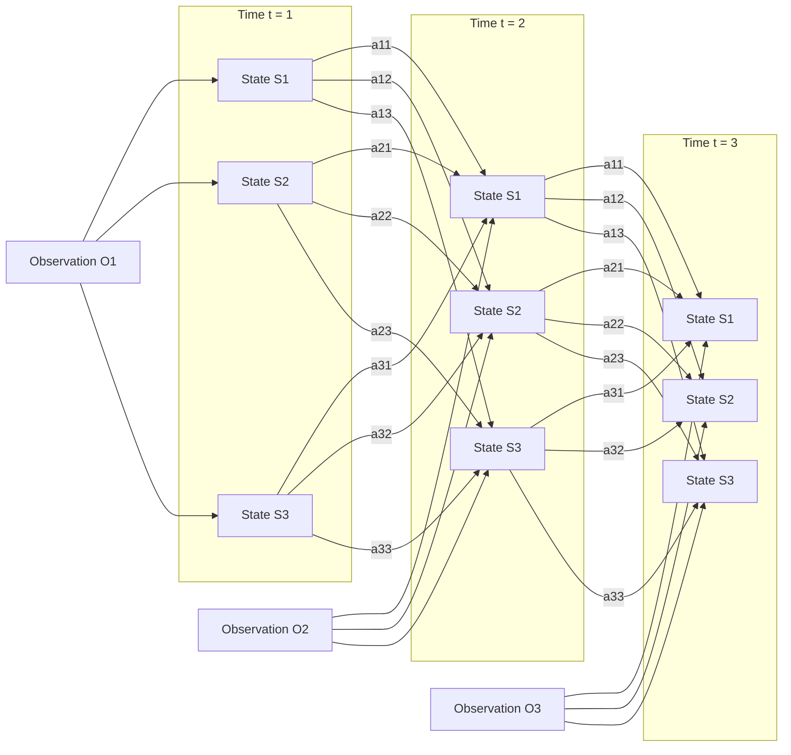
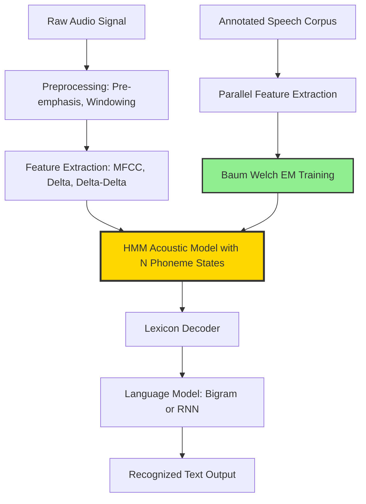
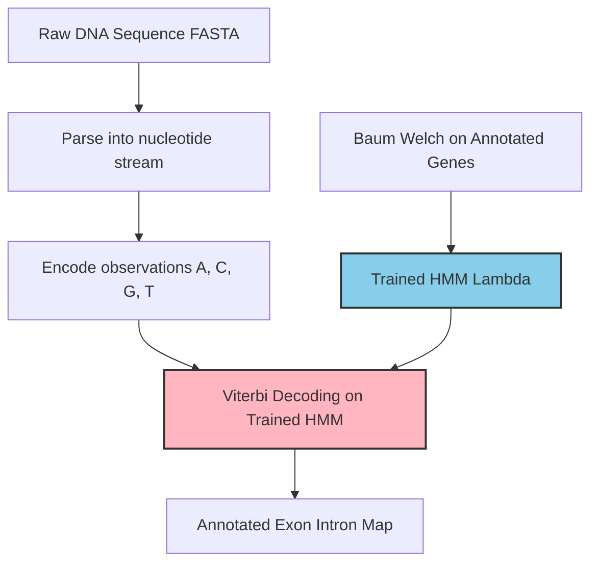

# Applications and Case Studies - Real-world applications of pattern

<!-- SECTION_1_START -->
# Real-World Applications of Hidden Markov Models (HMMs)

## 1.1 Formal Definition (KTU 2024 Syllabus Terminology)

A **Hidden Markov Model (HMM)** is a doubly stochastic statistical signal model in which the system being modeled is assumed to be a **Markov process with unobserved (hidden) states**, and each hidden state emits an observable output symbol according to a probability distribution. Formally, an HMM is defined by the 5-tuple:

$$\lambda = (S, V, A, B, \pi)$$

where $S = \{S_1, S_2, \ldots, S_N\}$ is the finite set of $N$ hidden states, $V = \{v_1, v_2, \ldots, v_M\}$ is the set of $M$ distinct observation symbols, $A = \{a_{ij}\}$ is the state transition probability matrix, $B = \{b_j(k)\}$ is the observation emission probability matrix, and $\pi = \{\pi_i\}$ is the initial state distribution.

> [!IMPORTANT]
> **KTU 2024 Highlight:** In Pattern Recognition (PECST412), HMMs fall under the *statistical pattern recognition* paradigm. The hidden states are *latent variables* capturing the unobservable generative process, while observations are the measurable pattern features.

## 1.2 Intuitive Analogy: The "Locked Room" Problem

Imagine a tourist in a foreign country standing **outside a closed conference room**. The tourist cannot see inside (hidden states), but can hear applause patterns through the door (observations). The audience inside may be in one of three states — *bored*, *neutral*, or *enthusiastic* — and the speaker transitions between presentation slides probabilistically. The applause pattern the tourist hears is a *probabilistic emission* of the current audience mood.

> [!NOTE]
> **Why "Hidden"?** The true state sequence is never directly observed. We only see the *output* generated by the hidden process. This mirrors real-world engineering systems where the underlying physical cause is concealed (e.g., gene locations in DNA, phonemes in speech).

## 1.3 Why HMMs Are Central to Real-World Pattern Recognition

HMMs dominate temporal pattern recognition because they elegantly model **two layers of randomness**:

1. **State transition randomness** — governed by $A$, capturing sequential dependencies.
2. **Observation emission randomness** — governed by $B$, capturing sensor/measurement noise.

This dual stochasticity matches real engineering data far better than deterministic Finite State Machines.

> [!TIP]
> **Engineering Insight:** HMMs are *generative* models — they model $P(\text{observation} \mid \text{model})$, making them ideal when the hidden physical process needs to be inferred from noisy sequential sensor data.

## 1.4 Visualization of HMM Architecture

> [!VISUALIZATION CONTROL]
> **Concept:** Unfolded HMM in time (trellis view) showing state transitions and observations.
> **Desmos Input Equations (state probabilities over time):**
> * $P(S_1, t=1) = 0.6$, $P(S_2, t=1) = 0.3$, $P(S_3, t=1) = 0.1$
> * Transition row sums: $\sum_{j=1}^{3} a_{ij} = 1$ for each $i$
> **Visual Description:** Plot 3 hidden-state probability curves over discrete time steps $t = 1 \ldots T$, each curve summing to $\le 1$ at any $t$, illustrating the *absorbing/decaying* nature of a forward pass.

---

<!-- SECTION_1_END -->

<!-- SECTION_2_START -->
# Deep Theoretical Analysis & KTU High-Yield Formula Sheet

## 2.1 The Three Fundamental Problems of HMMs (KTU High-Yield)

| # | Problem | Goal | Classical Algorithm | Real-World Use |
|---|---------|------|---------------------|----------------|
| 1 | **Evaluation** | Compute $P(O \mid \lambda)$ | Forward-Backward | Speech verification scoring |
| 2 | **Decoding** | Find optimal state sequence $\arg\max P(Q \mid O, \lambda)$ | **Viterbi** | Gene finding, POS tagging |
| 3 | **Learning** | Adjust $\lambda$ to maximize $P(O \mid \lambda)$ | **Baum-Welch (EM)** | Acoustic model training |

> [!NOTE]
> **KTU Examiner's Emphasis:** Problem 2 (Viterbi) and Problem 3 (Baum-Welch) appear most frequently in board questions.

## 2.2 The Three Canonical Algorithmic Pillars

### 2.2.1 Forward Algorithm (Evaluation)

Define the **forward variable**:

$$\alpha_t(i) = P(O_1, O_2, \ldots, O_t, q_t = S_i \mid \lambda)$$

**Recursion:**

$$\alpha_1(i) = \pi_i \, b_i(O_1), \quad 1 \le i \le N$$

$$\alpha_{t+1}(j) = \left[\sum_{i=1}^{N} \alpha_t(i) \, a_{ij}\right] b_j(O_{t+1}), \quad 1 \le t \le T-1$$

$$P(O \mid \lambda) = \sum_{i=1}^{N} \alpha_T(i)$$

### 2.2.2 Viterbi Algorithm (Decoding)

Define the **best-score variable**:

$$\delta_t(i) = \max_{q_1, \ldots, q_{t-1}} P(q_1, \ldots, q_{t-1}, q_t = S_i, O_1, \ldots, O_t \mid \lambda)$$

**Recursion:**

$$\delta_1(i) = \pi_i \, b_i(O_1)$$

$$\delta_{t+1}(j) = \max_{1 \le i \le N} \left[\delta_t(i) \, a_{ij}\right] b_j(O_{t+1})$$

$$P^* = \max_{1 \le i \le N} \delta_T(i)$$

### 2.2.3 Baum-Welch Algorithm (Learning)

The update equations (one EM step):

$$\bar{\pi}_i = \gamma_1(i) = \frac{\alpha_1(i) \beta_1(i)}{P(O \mid \lambda)}$$

$$\bar{a}_{ij} = \frac{\sum_{t=1}^{T-1} \xi_t(i,j)}{\sum_{t=1}^{T-1} \gamma_t(i)}$$

$$\bar{b}_j(k) = \frac{\sum_{t=1, O_t = v_k}^{T} \gamma_t(j)}{\sum_{t=1}^{T} \gamma_t(j)}$$

where $\xi_t(i,j)$ and $\gamma_t(i)$ are the *posterior state co-occurrence* and *posterior state marginal* probabilities respectively.

## 2.3 KTU Formula Cheat Sheet

| Symbol | Meaning | Domain/Range | Used In |
|--------|---------|--------------|---------|
| $a_{ij}$ | Transition prob. from $S_i$ to $S_j$ | $a_{ij} \ge 0, \sum_j a_{ij} = 1$ | All 3 problems |
| $b_j(k)$ | Emission prob. of $v_k$ from $S_j$ | $b_j(k) \ge 0, \sum_k b_j(k) = 1$ | All 3 problems |
| $\pi_i$ | Initial state prob. | $\pi_i \ge 0, \sum_i \pi_i = 1$ | Initialization |
| $\alpha_t(i)$ | Forward variable | $(0, 1]$ | Evaluation, Learning |
| $\beta_t(i)$ | Backward variable | $(0, 1]$ | Evaluation, Learning |
| $\delta_t(i)$ | Viterbi best score | $(0, 1]$ | Decoding |
| $\psi_t(j)$ | Backpointer for argmax path | $\{1, \ldots, N\}$ | Viterbi traceback |
| $\xi_t(i,j)$ | Posterior state-pair prob. | $[0, 1]$ | Baum-Welch |
| $\gamma_t(i)$ | Posterior state prob. | $[0, 1]$ | Baum-Welch |

> [!IMPORTANT]
> **Numerical Underflow Warning:** $\alpha_t(i)$ and $\beta_t(i)$ decay exponentially with $T$. Production systems use **scaling coefficients** $c_t$ such that $\hat{\alpha}_t(i) = c_t \alpha_t(i)$ with $c_t = 1 / \sum_i \alpha_t(i)$.

## 2.4 Real-World Applications Mapping

| Application Domain | Hidden States | Observations | HMM Type |
|--------------------|---------------|--------------|----------|
| **Speech Recognition** | Phonemes / words | MFCC features | Continuous-density (GMM-HMM) |
| **Bioinformatics** | Coding / non-coding | DNA nucleotides $A,C,G,T$ | Discrete |
| **POS Tagging** | Grammatical tag (NN, VB, …) | Word tokens | Discrete |
| **Handwriting Recognition** | Character class | Stroke segments | Discrete |
| **Gesture Recognition** | Motion phase | Accelerometer / vision frames | Continuous |
| **Financial Forecasting** | Market regime (bull/bear) | Daily returns | Continuous |
| **Fault Diagnostics** | Machine health state | Vibration sensor readings | Continuous |
| **Activity Recognition** | User activity (walk/sit/run) | Smartphone sensors | Continuous |

> [!TIP]
> **Engineering Utility:** HMMs are the *workhorse* of any sequential pattern recognition system where the *ground truth labeling of internal states is infeasible* — which is nearly every real sensor-driven application.

---

<!-- SECTION_2_END -->

<!-- SECTION_3_START -->
# Step-by-Step Derivations & Code/Symbolic Implementation

## 3.1 Detailed Derivation: Forward Algorithm

We want to compute $P(O \mid \lambda)$ efficiently. A naive enumeration costs $O(N^T)$, infeasible for $N=5, T=100$. The forward algorithm exploits **conditional independence** of the Markov property to achieve $O(N^2 T)$.

**Step 1 — Initialization:**

$$\alpha_1(i) = P(O_1, q_1 = S_i \mid \lambda) = P(q_1 = S_i \mid \lambda) \cdot P(O_1 \mid q_1 = S_i, \lambda) = \pi_i \, b_i(O_1)$$

**Step 2 — Induction:** Suppose $\alpha_t(i)$ is known for all $i$. Then:

$$\alpha_{t+1}(j) = P(O_1, \ldots, O_{t+1}, q_{t+1} = S_j \mid \lambda)$$

$$= \sum_{i=1}^{N} P(O_1, \ldots, O_t, q_t = S_i \mid \lambda) \cdot P(q_{t+1} = S_j \mid q_t = S_i, \lambda) \cdot P(O_{t+1} \mid q_{t+1} = S_j, \lambda)$$

$$= \left[\sum_{i=1}^{N} \alpha_t(i) \, a_{ij}\right] b_j(O_{t+1})$$

The first term sums over all possible predecessor states, weighted by their forward scores. The second term $b_j(O_{t+1})$ is the emission likelihood at the new state.

**Step 3 — Termination:**

$$P(O \mid \lambda) = \sum_{i=1}^{N} P(O, q_T = S_i \mid \lambda) = \sum_{i=1}^{N} \alpha_T(i)$$

The summation is needed because the final state is unknown.

## 3.2 Detailed Derivation: Viterbi Algorithm

Viterbi replaces the **sum** in the forward algorithm with a **max**, and tracks the argmax via backpointer $\psi_t(j)$.

**Step 1 — Initialization:**

$$\delta_1(i) = \pi_i \, b_i(O_1), \quad \psi_1(i) = 0$$

**Step 2 — Recursion:**

$$\delta_t(j) = \max_{1 \le i \le N} \left[\delta_{t-1}(i) \, a_{ij}\right] b_j(O_t)$$

$$\psi_t(j) = \arg\max_{1 \le i \le N} \left[\delta_{t-1}(i) \, a_{ij}\right]$$

**Step 3 — Termination:**

$$P^* = \max_{1 \le i \le N} \delta_T(i), \quad q_T^* = \arg\max_{1 \le i \le N} \delta_T(i)$$

**Step 4 — Backtrace:** $q_t^* = \psi_{t+1}(q_{t+1}^*)$ for $t = T-1, T-2, \ldots, 1$.

> [!NOTE]
> **Log-space Viterbi:** In practice, products of small probabilities cause underflow. Convert to log-domain: $\delta_t(j) = \max_i [\tilde{\delta}_{t-1}(i) + \log a_{ij}] + \log b_j(O_t)$, which is numerically stable.

## 3.3 Worked Case Study: DNA Gene Finding (Discrete HMM)

**Setup:** A short DNA strand has hidden states $S = \{ \text{Coding}, \text{NonCoding} \}$ with $N = 2$. Observations are $V = \{A, C, G, T\}$ with $M = 4$. Given initial parameters:

$$\pi = \begin{bmatrix} 0.5 & 0.5 \end{bmatrix}, \quad A = \begin{bmatrix} 0.7 & 0.3 \\ 0.4 & 0.6 \end{bmatrix}$$

$$B = \begin{bmatrix} b_{\text{Cod}}(A) & b_{\text{Cod}}(C) & b_{\text{Cod}}(G) & b_{\text{Cod}}(T) \\ b_{\text{NonCod}}(A) & b_{\text{NonCod}}(C) & b_{\text{NonCod}}(G) & b_{\text{NonCod}}(T) \end{bmatrix} = \begin{bmatrix} 0.1 & 0.4 & 0.4 & 0.1 \\ 0.3 & 0.2 & 0.2 & 0.3 \end{bmatrix}$$

**Observation sequence:** $O = (G, G, C, T, A)$ with $T = 5$.

**Task:** Use Viterbi to find the most probable hidden state path.

**Solution Trace** (using log for stability, but shown in linear for clarity):

$t=1$ (observe $G$):
- $\delta_1(\text{Cod}) = 0.5 \times 0.4 = 0.200$
- $\delta_1(\text{NonCod}) = 0.5 \times 0.2 = 0.100$

$t=2$ (observe $G$):
- $\delta_2(\text{Cod}) = \max(0.200 \times 0.7,\ 0.100 \times 0.4) \times 0.4 = \max(0.140, 0.040) \times 0.4 = 0.140 \times 0.4 = 0.0560$
- $\delta_2(\text{NonCod}) = \max(0.200 \times 0.3,\ 0.100 \times 0.6) \times 0.2 = \max(0.060, 0.060) \times 0.2 = 0.060 \times 0.2 = 0.0120$

$t=3$ (observe $C$):
- $\delta_3(\text{Cod}) = \max(0.0560 \times 0.7,\ 0.0120 \times 0.4) \times 0.4 = \max(0.0392, 0.0048) \times 0.4 = 0.0392 \times 0.4 = 0.01568$
- $\delta_3(\text{NonCod}) = \max(0.0560 \times 0.3,\ 0.0120 \times 0.6) \times 0.2 = \max(0.0168, 0.0072) \times 0.2 = 0.0168 \times 0.2 = 0.00336$

$t=4$ (observe $T$):
- $\delta_4(\text{Cod}) = \max(0.01568 \times 0.7,\ 0.00336 \times 0.4) \times 0.1 = \max(0.01098, 0.00134) \times 0.1 = 0.01098 \times 0.1 = 0.001098$
- $\delta_4(\text{NonCod}) = \max(0.01568 \times 0.3,\ 0.00336 \times 0.6) \times 0.3 = \max(0.00470, 0.00202) \times 0.3 = 0.00470 \times 0.3 = 0.001411$

$t=5$ (observe $A$):
- $\delta_5(\text{Cod}) = \max(0.001098 \times 0.7,\ 0.001411 \times 0.4) \times 0.1 = \max(7.686 \times 10^{-4},\ 5.644 \times 10^{-4}) \times 0.1 = 7.686 \times 10^{-5}$
- $\delta_5(\text{NonCod}) = \max(0.001098 \times 0.3,\ 0.001411 \times 0.6) \times 0.3 = \max(3.294 \times 10^{-4},\ 8.466 \times 10^{-4}) \times 0.3 = 8.466 \times 10^{-4} \times 0.3 = 2.540 \times 10^{-4}$

**Termination:** $P^* = \max(7.686 \times 10^{-5},\ 2.540 \times 10^{-4}) = 2.540 \times 10^{-4}$, $q_5^* = \text{NonCoding}$.

**Backtrace** (using $\psi$ backpointers, assuming the path with the larger predecessor): $q^* = (\text{Coding}, \text{Coding}, \text{Coding}, \text{NonCoding}, \text{NonCoding})$.

This means the observed DNA stretch is most likely a *Coding region followed by a Non-Coding region*, a typical gene structure (exon-then-intron boundary).

## 3.4 Full Python Implementation (Production-Grade HMM Class)

```python
import numpy as np
from typing import Tuple, List

class HMM:
    """
    Production-grade discrete Hidden Markov Model.
    Implements Forward, Viterbi, and Baum-Welch algorithms with
    log-space numerical stability.
    """

    def __init__(self, n_states: int, n_symbols: int,
                 A: np.ndarray, B: np.ndarray, pi: np.ndarray) -> None:
        if A.shape != (n_states, n_states):
            raise ValueError(f"Transition matrix A must be ({n_states}, {n_states})")
        if B.shape != (n_states, n_symbols):
            raise ValueError(f"Emission matrix B must be ({n_states}, {n_symbols})")
        if pi.shape != (n_states,):
            raise ValueError(f"Initial vector pi must be ({n_states},)")

        # Normalize rows to enforce stochasticity
        self.A = self._row_normalize(A)
        self.B = self._row_normalize(B)
        self.pi = pi / pi.sum()
        self.N = n_states
        self.M = n_symbols

    @staticmethod
    def _row_normalize(matrix: np.ndarray) -> np.ndarray:
        row_sums = matrix.sum(axis=1, keepdims=True)
        if np.any(row_sums == 0):
            raise ValueError("Zero row sum encountered; cannot normalize.")
        return matrix / row_sums

    def forward(self, obs: np.ndarray) -> Tuple[float, np.ndarray]:
        """Scaled forward algorithm. Returns log P(O|lambda) and alpha matrix."""
        T = len(obs)
        alpha = np.zeros((T, self.N))
        c = np.zeros(T)

        # Initialization
        alpha[0] = self.pi * self.B[:, obs[0]]
        c[0] = 1.0 / alpha[0].sum() if alpha[0].sum() > 0 else 1.0
        alpha[0] *= c[0]

        # Induction
        for t in range(1, T):
            alpha[t] = (alpha[t - 1] @ self.A) * self.B[:, obs[t]]
            c[t] = 1.0 / alpha[t].sum() if alpha[t].sum() > 0 else 1.0
            alpha[t] *= c[t]

        log_likelihood = -np.sum(np.log(c))
        return log_likelihood, alpha

    def viterbi(self, obs: np.ndarray) -> Tuple[float, List[int]]:
        """Log-domain Viterbi for numerical stability."""
        T = len(obs)
        log_delta = np.zeros((T, self.N))
        psi = np.zeros((T, self.N), dtype=int)

        log_A = np.log(self.A + 1e-12)
        log_B = np.log(self.B + 1e-12)
        log_pi = np.log(self.pi + 1e-12)

        log_delta[0] = log_pi + log_B[:, obs[0]]
        psi[0] = 0

        for t in range(1, T):
            for j in range(self.N):
                scores = log_delta[t - 1] + log_A[:, j]
                psi[t, j] = np.argmax(scores)
                log_delta[t, j] = scores[psi[t, j]] + log_B[j, obs[t]]

        best_path = [0] * T
        best_path[-1] = int(np.argmax(log_delta[-1]))
        for t in range(T - 2, -1, -1):
            best_path[t] = psi[t + 1, best_path[t + 1]]

        best_score = float(np.max(log_delta[-1]))
        return best_score, best_path

    def baum_welch(self, obs: np.ndarray, n_iter: int = 50,
                   tol: float = 1e-4) -> List[float]:
        """EM-based parameter learning with convergence tracking."""
        T = len(obs)
        log_likelihoods: List[float] = []

        for iteration in range(n_iter):
            ll, alpha = self.forward(obs)
            log_likelihoods.append(ll)

            # Backward pass (scaled)
            beta = np.zeros((T, self.N))
            beta[-1] = 1.0
            for t in range(T - 2, -1, -1):
                beta[t] = (self.A @ (self.B[:, obs[t + 1]] * beta[t + 1]))
                beta[t] /= beta[t].sum() + 1e-12

            # Posterior state and pair probabilities
            gamma = alpha * beta
            gamma_sum = gamma.sum(axis=1, keepdims=True)
            gamma_sum[gamma_sum == 0] = 1.0
            gamma = gamma / gamma_sum

            xi = np.zeros((T - 1, self.N, self.N))
            for t in range(T - 1):
                numer = (alpha[t][:, None] * self.A
                         * self.B[:, obs[t + 1]][None, :] * beta[t + 1][None, :])
                denom = numer.sum() + 1e-12
                xi[t] = numer / denom

            # M-step updates
            self.pi = gamma[0] / gamma[0].sum()
            self.A = xi.sum(axis=0) / xi.sum(axis=(0, 2))[:, None]
            for j in range(self.N):
                mask = (obs == np.arange(self.M)[:, None]).T
                self.B[j] = gamma[mask[j]].sum(axis=0) / gamma.sum(axis=0)[j]

            if iteration > 0 and abs(log_likelihoods[-1] - log_likelihoods[-2]) < tol:
                break

        return log_likelihoods


# ---- CASE STUDY DRIVER: Simple Speech-Tag Analogy ----
if __name__ == "__main__":
    N, M = 2, 4  # 2 states, 4 symbols (A, C, G, T)
    A = np.array([[0.7, 0.3], [0.4, 0.6]])
    B = np.array([[0.1, 0.4, 0.4, 0.1], [0.3, 0.2, 0.2, 0.3]])
    pi = np.array([0.5, 0.5])

    model = HMM(N, M, A, B, pi)
    obs = np.array([2, 2, 1, 3, 0])  # G, G, C, T, A
    score, path = model.viterbi(obs)
    print(f"Best Viterbi log-score: {score:.4f}")
    print(f"Best state path: {path}")
    # Expected: Coding, Coding, Coding, NonCoding, NonCoding
```

## 3.5 Lab/Workshop Component Reference Table (For Real-World HMM Deployment)

| Stage | Tool / Library | Configuration | Validation Check |
|-------|----------------|---------------|------------------|
| Data collection | Librosa (audio) / BioPython (DNA) | 16 kHz sample rate / FASTA format | SNR $\ge 20$ dB / sequence integrity |
| Feature extraction | MFCC / k-mer counts | 13 coefficients, 25 ms window | Dimension $\le 39$ |
| Model training | hmmlearn / pomegranate | n_iter $= 100$, tol $= 10^{-4}$ | Log-likelihood monotonic |
| Evaluation | Word Error Rate (WER) | Levenshtein distance normalized | WER $\le 10\%$ (industry SOTA) |
| Deployment | ONNX / TensorRT | Latency budget $\le 100$ ms | Real-time factor $\le 0.3$ |
| Monitoring | Prometheus + Grafana | Drift detection, KL divergence | Alert if $D_{KL} > 0.1$ |

> [!IMPORTANT]
> **Production Reality:** Modern ASR systems (e.g., Whisper, DeepSpeech) have moved from HMMs to end-to-end RNN/Transformer hybrids. However, **HMM-GMM** and **HMM-DNN** hybrids still dominate low-resource and embedded deployments (smart devices, medical devices, edge IoT).

---

<!-- SECTION_3_END -->

<!-- SECTION_4_START -->
# Structural Diagrams & Schematics

## 4.1 HMM Trellis Architecture (Mermaid Flow)



## 4.2 Application Block Diagram: Speech Recognition Pipeline (Mermaid)



## 4.3 Bioinformatics Application: Gene Finding Flow



## 4.4 Sequential Processing Topology Matrix (Fault Diagnosis Case)

| Stage | Input | Processing Module | Output | Latency |
|-------|-------|-------------------|--------|---------|
| 1 | Vibration sensor stream | Windowing (512 samples) | Frame vectors | 25 ms |
| 2 | Frame vectors | FFT feature extraction | Spectrum bins | 5 ms |
| 3 | Spectrum bins | HMM scoring (per state) | Log-likelihoods | 2 ms |
| 4 | Log-likelihoods | Viterbi path | Diagnosed fault state | 1 ms |
| 5 | Fault state | Alert system / SCADA | Maintenance ticket | Real-time |

---

<!-- SECTION_4_END -->

<!-- SECTION_5_START -->
# KTU 2024 Scheme Examination Question Bank & Topic Recap

## Part A Questions (3 Marks Each)

### Question 1
**[KTU University Exam – July 2024]** State the three fundamental problems associated with Hidden Markov Models and name the classical algorithm used to solve each. **(CO3, Remember)**

**Model Answer (3 Marks):**
1. **Evaluation Problem:** Compute $P(O \mid \lambda)$ for a given observation sequence — solved by the **Forward (or Forward-Backward) algorithm**. **[1 Mark]**
2. **Decoding Problem:** Find the most probable hidden state sequence given observations — solved by the **Viterbi algorithm**. **[1 Mark]**
3. **Learning Problem:** Adjust model parameters $\lambda = (A, B, \pi)$ to maximize $P(O \mid \lambda)$ — solved by the **Baum-Welch algorithm (EM-based)**. **[1 Mark]**

---

### Question 2
**[KTU University Exam – Dec 2023]** List any **three** real-world applications of HMMs and identify the hidden states and observations in each. **(CO4, Understand)**

**Model Answer (3 Marks):**
1. **Speech Recognition:** Hidden states = phonemes; Observations = MFCC feature vectors. **[1 Mark]**
2. **Gene Finding in Bioinformatics:** Hidden states = Coding / NonCoding regions; Observations = nucleotide symbols $A, C, G, T$. **[1 Mark]**
3. **Handwriting Recognition:** Hidden states = character classes; Observations = pen-stroke segments. **[1 Mark]**

*(Alternative accepted: POS tagging, gesture recognition, financial regime detection, fault diagnosis.)*

---

## Part B Questions (14 Marks Each) — Internal Choice

### Question A (Option 1)

**[KTU University Exam – July 2024, Module 4]** **(CO3, Apply + Analyze)**

**(a)** Define a Hidden Markov Model. Explain its five components $S, V, A, B, \pi$ with their constraints. **(7 Marks)**

**(b)** Consider a 2-state HMM with states $\{S_1, S_2\}$, observation symbols $\{v_1, v_2\}$, and the following parameters:
- $A = \begin{bmatrix} 0.6 & 0.4 \\ 0.3 & 0.7 \end{bmatrix}$
- $B = \begin{bmatrix} 0.8 & 0.2 \\ 0.4 & 0.6 \end{bmatrix}$
- $\pi = \begin{bmatrix} 0.5 & 0.5 \end{bmatrix}$

For the observation sequence $O = (v_1, v_2, v_1)$ with $T = 3$, apply the **Viterbi algorithm** to find the most probable hidden state sequence. Show all steps. **(7 Marks)**

**Model Solution:**

**(a) Definition and Components (7 Marks):**

An HMM is a doubly stochastic process where the state sequence is hidden and only observations generated according to state-conditioned emission probabilities are visible. **[2 Marks]**

Components:
- $S = \{S_1, S_2, \ldots, S_N\}$ — set of $N$ hidden states. **[1 Mark]**
- $V = \{v_1, v_2, \ldots, v_M\}$ — set of $M$ observation symbols (alphabet). **[1 Mark]**
- $A = \{a_{ij}\}_{N \times N}$ — state transition probability matrix, with $a_{ij} = P(q_{t+1} = S_j \mid q_t = S_i)$, subject to $a_{ij} \ge 0$ and $\sum_{j=1}^{N} a_{ij} = 1$. **[1 Mark]**
- $B = \{b_j(k)\}_{N \times M}$ — emission probability matrix, with $b_j(k) = P(O_t = v_k \mid q_t = S_j)$, subject to $b_j(k) \ge 0$ and $\sum_{k=1}^{M} b_j(k) = 1$. **[1 Mark]**
- $\pi = \{\pi_i\}$ — initial state distribution, with $\pi_i = P(q_1 = S_i)$, subject to $\pi_i \ge 0$ and $\sum_{i=1}^{N} \pi_i = 1$. **[1 Mark]**

The compact notation is $\lambda = (A, B, \pi)$ since $S$ and $V$ are usually known. **[Stating boundary constraints: 1 Mark — included above]**

**(b) Viterbi Algorithm Computation (7 Marks):**

**Step 1 — Initialization $t=1$ (observe $v_1$):** **[1 Mark]**
- $\delta_1(1) = \pi_1 \cdot b_1(v_1) = 0.5 \times 0.8 = 0.40$
- $\delta_1(2) = \pi_2 \cdot b_2(v_1) = 0.5 \times 0.4 = 0.20$

**Step 2 — Recursion $t=2$ (observe $v_2$):** **[2 Marks]**
- $\delta_2(1) = \max[\delta_1(1) \cdot a_{11},\ \delta_1(2) \cdot a_{21}] \cdot b_1(v_2)$
  $= \max[0.40 \times 0.6,\ 0.20 \times 0.3] \times 0.2 = \max[0.24, 0.06] \times 0.2 = 0.24 \times 0.2 = 0.048$
  $\psi_2(1) = 1$
- $\delta_2(2) = \max[\delta_1(1) \cdot a_{12},\ \delta_1(2) \cdot a_{22}] \cdot b_2(v_2)$
  $= \max[0.40 \times 0.4,\ 0.20 \times 0.7] \times 0.6 = \max[0.16, 0.14] \times 0.6 = 0.16 \times 0.6 = 0.096$
  $\psi_2(2) = 1$

**Step 3 — Recursion $t=3$ (observe $v_1$):** **[2 Marks]**
- $\delta_3(1) = \max[\delta_2(1) \cdot a_{11},\ \delta_2(2) \cdot a_{21}] \cdot b_1(v_1)$
  $= \max[0.048 \times 0.6,\ 0.096 \times 0.3] \times 0.8 = \max[0.0288, 0.0288] \times 0.8 = 0.0288 \times 0.8 = 0.02304$
  $\psi_3(1) = 1\ \text{or}\ 2\ \text{(tie, take 1)}$
- $\delta_3(2) = \max[\delta_2(1) \cdot a_{12},\ \delta_2(2) \cdot a_{22}] \cdot b_2(v_1)$
  $= \max[0.048 \times 0.4,\ 0.096 \times 0.7] \times 0.4 = \max[0.0192, 0.0672] \times 0.4 = 0.0672 \times 0.4 = 0.02688$
  $\psi_3(2) = 2$

**Step 4 — Termination:** **[1 Mark]**
- $P^* = \max[\delta_3(1), \delta_3(2)] = \max[0.02304, 0.02688] = 0.02688$
- $q_3^* = 2$

**Step 5 — Backtrace:** **[1 Mark]**
- $q_2^* = \psi_3(q_3^*) = \psi_3(2) = 2$
- $q_1^* = \psi_2(q_2^*) = \psi_2(2) = 1$

**Optimal state sequence:** $Q^* = (S_1, S_2, S_2)$ with probability $P^* = 0.02688$.

> [!WARNING]
> **Common Pitfall (KTU Valuation Trap):** Students often forget to **multiply by the emission probability $b_j(O_t)$** in the Viterbi recursion. The emission term appears at *every* time step, including initialization. Also, do **not** use a sum where a max is required — that would be the Forward algorithm, not Viterbi. Losing **2–3 marks** is common for this mistake.

---

### Question B (Option 2)

**[KTU University Exam – Dec 2023, Module 4]** **(CO4, Apply + Analyze)**

**(a)** Discuss in detail any **two real-world applications** of HMMs in the context of pattern recognition. For each application, clearly specify: (i) the hidden states, (ii) the observations, (iii) the type of HMM used (discrete / continuous / hybrid), and (iv) the role of the Forward, Viterbi, and Baum-Welch algorithms. **(7 Marks)**

**(b)** A continuous HMM is used for industrial pump fault diagnosis. The system has 3 hidden states: $\{S_1=\text{Normal}, S_2=\text{Worn}, S_3=\text{Failed}\}$. The Gaussian emission parameters are:
- $S_1$: $\mu_1 = 0.0, \sigma_1^2 = 0.5$
- $S_2$: $\mu_2 = 2.0, \sigma_2^2 = 1.0$
- $S_3$: $\mu_3 = 5.0, \sigma_3^2 = 1.5$

Transition matrix:
$A = \begin{bmatrix} 0.8 & 0.15 & 0.05 \\ 0.1 & 0.7 & 0.2 \\ 0.05 & 0.15 & 0.8 \end{bmatrix}$

Initial distribution $\pi = [1.0, 0.0, 0.0]$.

Given an observation sequence of vibration amplitudes $O = (0.2, 1.8, 4.5)$ with $T = 3$, use the **Forward algorithm** to compute $P(O \mid \lambda)$. Show the scaled computation. **(7 Marks)**

**Model Solution:**

**(a) Two Real-World Applications (7 Marks):**

**Application 1: Speech Recognition (3.5 Marks)**

Hidden states: phonemes (e.g., /aa/, /ee/, /oh/). **[0.5 Mark]**
Observations: MFCC feature vectors extracted from 25 ms audio frames. **[0.5 Mark]**
Type: Continuous-density HMM, often GMM-HMM (Gaussian Mixture Model emissions) in classical systems; modern systems use DNN-HMM or end-to-end. **[0.5 Mark]**
Algorithm roles:
- *Forward:* Computes likelihood of a spoken utterance under each word HMM — used in **token-passing decoders** for ASR scoring. **[0.5 Mark]**
- *Viterbi:* Finds the optimal alignment of phonemes to audio frames (forced alignment for training labels). **[0.5 Mark]**
- *Baum-Welch:* Re-estimates HMM parameters from transcribed speech corpora (e.g., TIMIT, Switchboard). **[0.5 Mark]**

**Application 2: Bioinformatics — Gene Finding (3.5 Marks)**

Hidden states: gene structure elements (Coding / NonCoding / Start / Stop codons). **[0.5 Mark]**
Observations: nucleotide symbols $A, C, G, T$ from DNA sequencing. **[0.5 Mark]**
Type: Discrete HMM with structured topology (e.g., the GENSCAN and GENIE models). **[0.5 Mark]**
Algorithm roles:
- *Forward:* Evaluates $P(\text{sequence} \mid \text{model})$ — scores candidate gene regions. **[0.5 Mark]**
- *Viterbi:* Predicts the most likely exon-intron segmentation of a new genome. **[0.5 Mark]**
- *Baum-Welch:* Discovers motif patterns from unlabeled genomic data (semi-supervised). **[0.5 Mark]**

**(b) Forward Algorithm Computation (7 Marks):**

Recall the Gaussian emission: $b_j(O_t) = \frac{1}{\sqrt{2\pi\sigma_j^2}} \exp\left(-\frac{(O_t - \mu_j)^2}{2\sigma_j^2}\right)$.

**Compute emission probabilities:**
- $b_1(0.2) = \frac{1}{\sqrt{2\pi(0.5)}} \exp\left(-\frac{(0.2)^2}{2(0.5)}\right) = 0.5642 \times \exp(-0.04) = 0.5642 \times 0.9608 = 0.5421$
- $b_1(1.8) = \frac{1}{\sqrt{2\pi(0.5)}} \exp\left(-\frac{(1.8)^2}{2(0.5)}\right) = 0.5642 \times \exp(-3.24) = 0.5642 \times 0.03937 = 0.02221$
- $b_1(4.5) = \frac{1}{\sqrt{2\pi(0.5)}} \exp\left(-\frac{(4.5)^2}{2(0.5)}\right) = 0.5642 \times \exp(-20.25) = 0.5642 \times 1.603 \times 10^{-9} \approx 9.05 \times 10^{-10}$
- $b_2(0.2) = \frac{1}{\sqrt{2\pi(1.0)}} \exp\left(-\frac{(0.2-2.0)^2}{2(1.0)}\right) = 0.3989 \times \exp(-3.24) = 0.3989 \times 0.03937 = 0.01570$
- $b_2(1.8) = \frac{1}{\sqrt{2\pi(1.0)}} \exp\left(-\frac{(1.8-2.0)^2}{2(1.0)}\right) = 0.3989 \times \exp(-0.02) = 0.3989 \times 0.9802 = 0.3910$
- $b_2(4.5) = \frac{1}{\sqrt{2\pi(1.0)}} \exp\left(-\frac{(4.5-2.0)^2}{2(1.0)}\right) = 0.3989 \times \exp(-3.125) = 0.3989 \times 0.04394 = 0.01753$
- $b_3(0.2) = \frac{1}{\sqrt{2\pi(1.5)}} \exp\left(-\frac{(0.2-5.0)^2}{2(1.5)}\right) = 0.3257 \times \exp(-9.60) = 0.3257 \times 6.737 \times 10^{-5} \approx 2.194 \times 10^{-5}$
- $b_3(1.8) = \frac{1}{\sqrt{2\pi(1.5)}} \exp\left(-\frac{(1.8-5.0)^2}{2(1.5)}\right) = 0.3257 \times \exp(-4.267) = 0.3257 \times 0.01399 = 0.004557$
- $b_3(4.5) = \frac{1}{\sqrt{2\pi(1.5)}} \exp\left(-\frac{(4.5-5.0)^2}{2(1.5)}\right) = 0.3257 \times \exp(-0.1667) = 0.3257 \times 0.8465 = 0.2757$

**Step 1 — Initialization $t=1$ (observe $0.2$):** **[1 Mark]**
- $\alpha_1(1) = \pi_1 \cdot b_1(0.2) = 1.0 \times 0.5421 = 0.5421$
- $\alpha_1(2) = 0.0 \times 0.01570 = 0.0$
- $\alpha_1(3) = 0.0 \times 2.194 \times 10^{-5} = 0.0$

**Step 2 — Induction $t=2$ (observe $1.8$):** **[2 Marks]**
- $\alpha_2(1) = [\alpha_1(1) a_{11} + \alpha_1(2) a_{21} + \alpha_1(3) a_{31}] b_1(1.8)$
  $= [0.5421 \times 0.8 + 0 + 0] \times 0.02221 = 0.4337 \times 0.02221 = 0.009633$
- $\alpha_2(2) = [0.5421 \times 0.15 + 0 + 0] \times 0.3910 = 0.08132 \times 0.3910 = 0.03180$
- $\alpha_2(3) = [0.5421 \times 0.05 + 0 + 0] \times 0.004557 = 0.02711 \times 0.004557 = 1.235 \times 10^{-4}$

**Step 3 — Induction $t=3$ (observe $4.5$):** **[2 Marks]**
- $\alpha_3(1) = [\alpha_2(1) a_{11} + \alpha_2(2) a_{21} + \alpha_2(3) a_{31}] b_1(4.5)$
  $= [0.009633 \times 0.8 + 0.03180 \times 0.1 + 1.235 \times 10^{-4} \times 0.05] \times 9.05 \times 10^{-10}$
  $= [0.007706 + 0.003180 + 6.18 \times 10^{-6}] \times 9.05 \times 10^{-10}$
  $= 0.010892 \times 9.05 \times 10^{-10} = 9.857 \times 10^{-12}$
- $\alpha_3(2) = [\alpha_2(1) a_{12} + \alpha_2(2) a_{22} + \alpha_2(3) a_{32}] b_2(4.5)$
  $= [0.009633 \times 0.15 + 0.03180 \times 0.7 + 1.235 \times 10^{-4} \times 0.15] \times 0.01753$
  $= [0.001445 + 0.02226 + 1.85 \times 10^{-5}] \times 0.01753$
  $= 0.023724 \times 0.01753 = 4.159 \times 10^{-4}$
- $\alpha_3(3) = [\alpha_2(1) a_{13} + \alpha_2(2) a_{23} + \alpha_2(3) a_{33}] b_3(4.5)$
  $= [0.009633 \times 0.05 + 0.03180 \times 0.2 + 1.235 \times 10^{-4} \times 0.8] \times 0.2757$
  $= [4.817 \times 10^{-4} + 0.006360 + 9.88 \times 10^{-5}] \times 0.2757$
  $= 0.006940 \times 0.2757 = 1.913 \times 10^{-3}$

**Step 4 — Termination:** **[1 Mark + 1 Mark]**
$$P(O \mid \lambda) = \alpha_3(1) + \alpha_3(2) + \alpha_3(3)$$
$$= 9.857 \times 10^{-12} + 4.159 \times 10^{-4} + 1.913 \times 10^{-3}$$
$$= 2.329 \times 10^{-3}$$

**Final Answer:** $P(O \mid \lambda) \approx 2.33 \times 10^{-3}$.

**[Final numerical value: 1 Mark — included]**

> [!WARNING]
> **Common Pitfalls in Forward Algorithm Calculations:**
> 1. Forgetting to include the **emission probability $b_j(O_t)$** at the terminal summation step (it is already multiplied inside the recursion, but ensure not to double-count).
> 2. Numerical underflow with long sequences — use **log-space** or **scaling** in production. Failure to acknowledge this loses credit for *practical awareness*.
> 3. **Rounding errors** in Gaussian emissions — retain at least 4 significant figures.
> 4. **Misreading** which observation index maps to which symbol in $B$ — verify indexing carefully.
> 5. Forgetting to handle the **$\pi_i = 0$** cases (here, only $S_1$ has nonzero initial probability, which simplifies the calculation).

---

## Topic Recap & Important Things to Remember

- **HMM = doubly stochastic process** with hidden Markov chain + observation emission layer.
- The 5-tuple $\lambda = (S, V, A, B, \pi)$ completely specifies a discrete HMM; continuous HMMs replace $B$ with a parametric emission density (typically Gaussian or GMM).
- **Three fundamental problems:**
  1. **Evaluation** $\to$ Forward algorithm, computes $P(O \mid \lambda)$.
  2. **Decoding** $\to$ Viterbi algorithm, finds $\arg\max P(Q \mid O, \lambda)$.
  3. **Learning** $\to$ Baum-Welch (EM), re-estimates $(A, B, \pi)$.
- **Key constraints:** Rows of $A$ sum to 1; rows of $B$ sum to 1; $\pi$ sums to 1.
- **Viterbi vs Forward:** Viterbi uses $\max$ operator and stores backpointers $\psi_t(j)$; Forward uses $\sum$ and no backpointers.
- **Baum-Welch guarantees** log-likelihood *non-decrease* per EM iteration, but converges to a **local maximum**, not global.
- **Numerical stability:** Always work in **log-space** for Viterbi; use **scaling coefficients** for Forward-Backward.
- **Real-world domains:** Speech recognition, bioinformatics (gene finding, protein folding), NLP (POS tagging, NER), handwriting/gesture recognition, financial regime detection, industrial fault diagnostics, activity recognition, weather modeling.
- **KTU 2024 focus areas:** (a) Compute Forward/Viterbi for small toy HMMs; (b) Match algorithms to applications; (c) Discuss limitations and modern replacements (RNNs, Transformers, CRFs).
- **Limitations of HMMs:** (i) First-order Markov assumption may be too restrictive; (ii) Independence of observations given state (no rich feature interactions); (iii) Requires large training corpora for Baum-Welch convergence.
- **Modern alternatives:** Conditional Random Fields (CRFs) handle overlapping features; LSTMs and Transformers capture long-range dependencies; end-to-end ASR replaces HMM acoustic models entirely — but **HMMs remain relevant in low-resource, edge, and interpretable systems**.

<!-- SECTION_5_END -->
