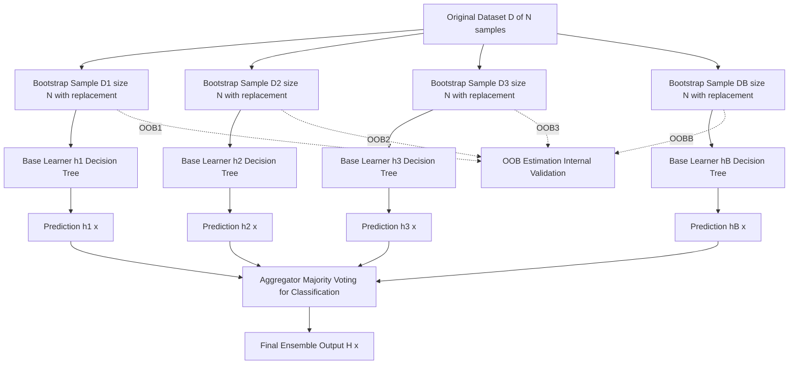
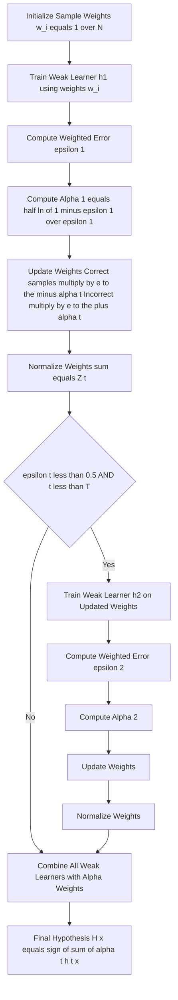
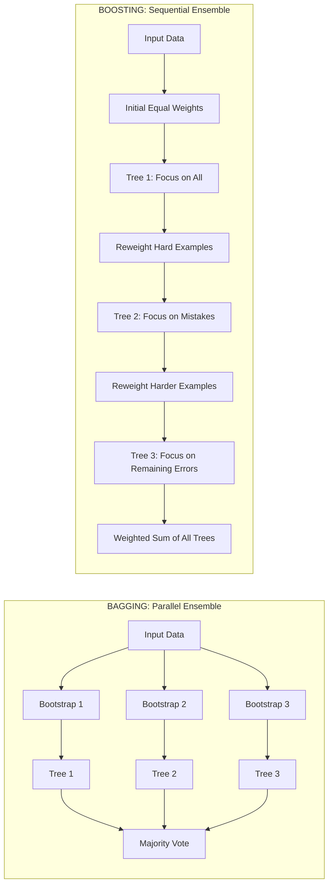
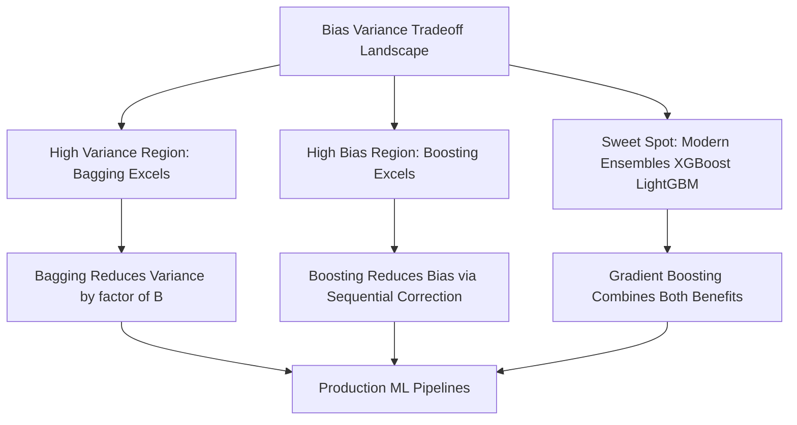

# Ensemble Methods - Basics of ensemble methods, Bagging, boosting, and

<!-- SECTION_1_START -->

# Ensemble Methods — Foundation, Bagging & Boosting

## 1.1 Formal Academic Definition

> [!IMPORTANT]
> **Ensemble Learning (Definition per KTU PECST412 Syllabus):**
> An **ensemble method** is a machine learning paradigm where multiple *base learners* (also called *weak learners* or *member classifiers*) are strategically combined to solve a particular computational intelligence problem. The objective is to produce a *composite hypothesis* $H(x)$ that demonstrates significantly higher predictive accuracy and generalization capability than any of its constituent individual learners $h_1(x), h_2(x), \ldots, h_B(x)$ when evaluated on previously unseen data.

In the KTU Pattern Recognition framework, ensemble methods are categorized under the broader umbrella of **committee-based learning** or **multiple classifier systems (MCS)**. The fundamental premise is rooted in the *No Free Lunch Theorem* and the statistical reality that no single model can be optimally tuned for all regions of the input feature space.

### 1.2 Conceptual Analogy — The Wisdom of Crowds

> [!NOTE]
> **Intuition: The Medical Jury Analogy**
> Imagine you are diagnosed with a critical illness. Would you trust the opinion of a single doctor, or would you prefer a panel of 50 specialists, each with slightly different expertise, voting on the diagnosis? The **jury verdict** is almost always more accurate than any *individual* doctor's diagnosis, even if some doctors on the panel are mediocre. This is precisely how ensemble methods function in pattern recognition — by aggregating the *collective intelligence* of multiple "imperfect" models, we obtain a remarkably *robust* and *accurate* final decision boundary.

A more mathematical analogy: Suppose you are trying to estimate the height of a building. A single ruler measurement has variance. Take $B$ *independent* measurements and average them — the variance reduces by a factor of $B$ (assuming independence). Ensembles exploit exactly this principle, with the additional sophistication of handling *correlated* errors.

### 1.3 Core Terminology & Primitives

| Primitive | Mathematical Symbol | Definition |
|---|---|---|
| **Base Learner** | $h_b(x)$ | A single weak/strong classifier trained on a data subset |
| **Weak Learner** | — | A classifier whose accuracy is *slightly* better than random guessing ($> 50\%$) |
| **Strong Learner** | — | A classifier with *arbitrarily high* accuracy |
| **Ensemble Hypothesis** | $H(x)$ | The aggregated output of all base learners |
| **Diversity** | $\mathcal{D}$ | Degree of disagreement among base learners (must be high for success) |
| **Margin** | $\gamma(x)$ | Confidence of ensemble prediction on sample $x$ |

> [!IMPORTANT]
> **KTU Key Theorem (Kearns & Vazirani, 1994):**
> A *weak learning algorithm* that produces hypotheses with accuracy marginally better than random guessing ($\epsilon < 0.5$) can be *boosted* into an arbitrarily accurate *strong learning algorithm*. This theorem is the theoretical foundation of all boosting algorithms.

### 1.4 Geometric Intuition on the Feature Space

> [!VISUALIZATION CONTROL]
> **Concept:** Decision Boundary Aggregation Across Multiple Learners
> **GeoGebra / Desmos Input Equations:**
> * `f1(x) = sin(2*x) + 0.5*x` (Decision boundary of Learner 1)
> * `f2(x) = cos(2*x) - 0.3*x` (Decision boundary of Learner 2)
> * `f3(x) = -sin(x) + 0.8*x^2/4` (Decision boundary of Learner 3)
> * `H(x) = sign(f1(x) + f2(x) + f3(x))` (Aggregated ensemble boundary)
> **Visual Description:** Each colored sinusoidal curve represents a separate weak learner's decision surface oscillating around the true optimal boundary. The sum (bold black curve) forms a *smoother, more robust* decision boundary that closely approximates the underlying true function, eliminating the jagged irregularities of any single learner.

### 1.5 Three Pillars of Ensemble Success

For an ensemble to outperform its best individual member, **ALL three** conditions must hold:

1. **Accuracy Condition:** Each base learner must achieve $\epsilon < 0.5$ (better than random).
2. **Diversity Condition:** The errors made by different learners must be *uncorrelated* or at most *weakly correlated* on the test distribution.
3. **Aggregation Condition:** The combining strategy (voting, averaging, weighted sum) must be statistically sound.

> [!WARNING]
> **Common KTU Pitfall:** Combining multiple *identical* or *highly correlated* models provides **zero improvement** over a single model. Diversity is the *lifeblood* of ensemble performance.

<!-- SECTION_1_END -->

<!-- SECTION_2_START -->

# Deep Theoretical Analysis & KTU Formula Sheet

## 2.1 Statistical Foundation — Why Ensembles Work

The theoretical justification for ensembles emerges from three converging perspectives:

### 2.1.1 Condorcet's Jury Theorem (1785)

> [!NOTE]
> **The Theorem:** If each jury member has independent probability $p > 0.5$ of making the correct decision, then the probability that the *majority vote* is correct approaches **1** exponentially as the number of voters $B \to \infty$.

The probability of a correct majority decision in a binary classification setting with $B$ independent voters is given by:

$$
P(\text{majority correct}) = \sum_{k=\lceil B/2 \rceil}^{B} \binom{B}{k} p^{k} (1-p)^{B-k}
$$

When $p > 0.5$, this probability converges to 1 at a *geometric rate*, validating the ensemble approach from a Bayesian perspective.

### 2.1.2 Bias-Variance Decomposition

The expected prediction error of any supervised learning algorithm can be decomposed as:

$$
\mathbb{E}\left[ (y - h(x))^2 \right] = \underbrace{\text{Bias}^2(h)}_{\text{systematic error}} + \underbrace{\text{Variance}(h)}_{\text{sensitivity to data}} + \underbrace{\sigma^2_{\text{noise}}}_{\text{irreducible}}
$$

**Critical insight:** Bagging primarily reduces **variance** while preserving bias. Boosting primarily reduces **bias** (and sometimes variance), enabling the model to fit complex decision boundaries.

### 2.1.3 Variance Reduction in Averaging (Bagging Theory)

For $B$ independent base learners, the variance of the averaged ensemble prediction is:

$$
\text{Var}\left( \frac{1}{B} \sum_{b=1}^{B} h_b(x) \right) = \frac{1}{B^2} \sum_{b=1}^{B} \text{Var}(h_b(x)) = \frac{\sigma^2}{B}
$$

However, base learners trained on overlapping bootstrap samples are **not independent**. For correlated learners with pairwise correlation $\rho$, the variance becomes:

$$
\text{Var}_{\text{bag}}(x) = \rho \cdot \sigma^2 + \frac{1 - \rho}{B} \cdot \sigma^2
$$

This equation reveals the central tension: as $B \to \infty$, the second term vanishes but the residual correlation $\rho \cdot \sigma^2$ persists. Hence, **diversity is essential** to push $\rho$ toward zero.

## 2.2 KTU High-Yield Formula Sheet

> [!IMPORTANT]
> The following table consolidates **all critical equations** for ensemble methods. Master these before attempting numerical problems.

| **Concept** | **Formula** | **Purpose** |
|---|---|---|
| AdaBoost Sample Weight Update | $w_i^{(t+1)} = \dfrac{w_i^{(t)} \exp(-\alpha_t y_i h_t(x_i))}{Z_t}$ | Reweighting for next iteration |
| AdaBoost Coefficient $\alpha_t$ | $\alpha_t = \dfrac{1}{2} \ln\left( \dfrac{1 - \epsilon_t}{\epsilon_t} \right)$ | Weight of weak learner in final sum |
| AdaBoost Weighted Error | $\epsilon_t = \displaystyle\sum_{i : h_t(x_i) \neq y_i} w_i^{(t)}$ | Normalized misclassification rate |
| AdaBoost Normalization Constant | $Z_t = \displaystyle\sum_{i=1}^{N} w_i^{(t)} \exp(-\alpha_t y_i h_t(x_i))$ | Partition function for weights |
| Ensemble Final Hypothesis | $H(x) = \text{sign}\left( \displaystyle\sum_{t=1}^{T} \alpha_t h_t(x) \right)$ | Weighted majority vote |
| Bagging Variance Reduction | $\text{Var}_{\text{bag}} = \rho \sigma^2 + \dfrac{(1-\rho)\sigma^2}{B}$ | Effect of correlation $\rho$ |
| Bootstrap Sample Size | $N_b = N$ (with replacement) | Size matches original dataset |
| Out-of-Bag (OOB) Fraction | $\text{OOB} \approx 1 - (1 - 1/N)^N \approx 1 - e^{-1} \approx 0.368$ | Unseen fraction per bootstrap |
| Margin Definition (Boosting) | $\gamma(x) = y \cdot \displaystyle\sum_{t=1}^{T} \alpha_t h_t(x) / \displaystyle\sum_{t=1}^{T} \alpha_t$ | Confidence in correct class |
| Gradient Boosting Update | $F_{m+1}(x) = F_m(x) + \eta \cdot h_m(x)$ | Additive model with learning rate $\eta$ |
| Boosting Error Bound | $P(H(x) \neq y) \leq \prod_{t=1}^{T} Z_t = \prod_{t=1}^{T} 2\sqrt{\epsilon_t(1-\epsilon_t)}$ | Training error upper bound |

## 2.3 Engineering & Real-World Utility

Ensemble methods are not merely academic constructs — they power **production systems** at scale:

- **Computer Vision:** Object detection ensembles in autonomous vehicles (Tesla, Waymo) combine CNN, R-CNN, and YOLO predictions.
- **Natural Language Processing:** BERT ensemble variants win leaderboards on GLUE, SuperGLUE benchmarks.
- **Bioinformatics:** Protein structure prediction (AlphaFold2) uses ensemble-based confidence estimation.
- **Financial Forecasting:** Stock market prediction systems combine ARIMA, LSTM, and gradient-boosted trees.
- **Medical Diagnosis:** Cancer detection from histopathology images uses 50+ CNN ensembles.
- **Anomaly Detection:** Intrusion detection systems (IDS) employ Random Forest + XGBoost + Isolation Forest ensembles.

> [!NOTE]
> **Industry Standard:** As of 2024, **XGBoost**, **LightGBM**, and **CatBoost** (all gradient boosting variants) dominate ~75% of winning solutions on Kaggle structured-data competitions.

## 2.4 Comparison Matrix — Bagging vs Boosting

| Property | **Bagging** | **Boosting** |
|---|---|---|
| Training Paradigm | Parallel | Sequential |
| Primary Goal | Variance reduction | Bias reduction |
| Sample Weighting | Uniform (bootstrap) | Adaptive (error-driven) |
| Base Learner Dependency | Independent | Each corrects predecessor |
| Sensitivity to Noise | Low (robust) | High (can overfit) |
| Typical Base Learner | Unpruned decision tree | Shallow decision stump ($d=1$) |
| Out-of-Bag Estimation | Yes (built-in CV) | No |
| Key Hyperparameter | Number of bootstrap samples $B$ | Number of iterations $T$, learning rate $\eta$ |
| Classic Algorithm | Random Forest | AdaBoost, GBM, XGBoost |
| Bias Impact | Neutral | Strongly decreasing |
| Variance Impact | Strongly decreasing | Slightly decreasing |

<!-- SECTION_2_END -->

<!-- SECTION_3_START -->

# Step-by-Step Derivations & Algorithmic Implementation

## 3.1 Bagging — Complete Algorithmic Derivation

### 3.1.1 Mathematical Formulation

Bagging (Bootstrap Aggregating) was proposed by **Leo Breiman (1996)**. Given a training set $\mathcal{D} = \{(x_1, y_1), (x_2, y_2), \ldots, (x_N, y_N)\}$ of size $N$, the algorithm proceeds in three stages:

**Stage 1 — Bootstrap Sampling (with replacement):**
For each $b \in \{1, 2, \ldots, B\}$:

$$
\mathcal{D}_b = \{(x_{i_1}^{(b)}, y_{i_1}^{(b)}), (x_{i_2}^{(b)}, y_{i_2}^{(b)}), \ldots, (x_{i_N}^{(b)}, y_{i_N}^{(b)})\}
$$

where each $i_k^{(b)}$ is sampled *uniformly at random* from $\{1, 2, \ldots, N\}$ with replacement. The probability of any specific sample being *excluded* from a given bootstrap is:

$$
P(x_i \notin \mathcal{D}_b) = \left(1 - \frac{1}{N}\right)^N \xrightarrow{N \to \infty} \frac{1}{e} \approx 0.3679
$$

**Stage 2 — Independent Model Training:**
Train each base learner $h_b$ on its corresponding bootstrap sample $\mathcal{D}_b$:

$$
h_b = \mathcal{L}(\mathcal{D}_b) \quad \text{for } b = 1, 2, \ldots, B
$$

**Stage 3 — Aggregation (Voting for Classification / Averaging for Regression):**

For classification:

$$
H(x) = \underset{c \in \mathcal{Y}}{\arg\max} \sum_{b=1}^{B} \mathbb{1}\{h_b(x) = c\}
$$

For regression:

$$
H(x) = \frac{1}{B} \sum_{b=1}^{B} h_b(x)
$$

### 3.1.2 Worked Numerical Example — Out-of-Bag (OOB) Estimation

Consider a dataset of $N = 10$ samples. We draw $B = 3$ bootstrap samples. Let us compute the OOB samples for each:

- Bootstrap 1 $\mathcal{D}_1$: $\{3, 1, 4, 1, 5, 9, 2, 6, 5, 3\}$
- OOB$_1$ (samples not selected): $\{7, 8, 10\}$
- Bootstrap 2 $\mathcal{D}_2$: $\{7, 1, 8, 2, 1, 3, 9, 4, 10, 7\}$
- OOB$_2$: $\{5, 6\}$
- Bootstrap 3 $\mathcal{D}_3$: $\{5, 6, 7, 8, 9, 10, 1, 2, 3, 4\}$
- OOB$_3$: $\{\emptyset\}$ (all unique indices selected)

Aggregated OOB samples (test set for self-validation): $\{5, 6, 7, 8, 10\}$

The OOB error estimate is:

$$
\text{Err}_{\text{OOB}} = \frac{1}{\vert \text{OOB}_{\text{union}} \vert} \sum_{i \in \text{OOB}_{\text{union}}} \mathbb{1}\{H_{\text{OOB}}(x_i) \neq y_i\}
$$

This eliminates the need for a separate cross-validation set — a major practical advantage in production.

## 3.2 AdaBoost — Exhaustive Algorithmic Derivation

### 3.2.1 Algorithm Statement (Freund & Schapire, 1997)

**Given:** Training set $\mathcal{D} = \{(x_1, y_1), \ldots, (x_N, y_N)\}$ where $y_i \in \{-1, +1\}$, and number of iterations $T$.

**Initialize:** Uniform sample weights

$$
w_i^{(1)} = \frac{1}{N} \quad \text{for } i = 1, 2, \ldots, N
$$

**For** $t = 1, 2, \ldots, T$:

**Step A — Train weighted weak learner:**
Train $h_t : \mathcal{X} \to \{-1, +1\}$ using weights $w_i^{(t)}$.

**Step B — Compute weighted error:**

$$
\epsilon_t = \sum_{i : h_t(x_i) \neq y_i} w_i^{(t)} = \sum_{i=1}^{N} w_i^{(t)} \cdot \mathbb{1}\{h_t(x_i) \neq y_i\}
$$

**Step C — Check early stopping condition:** If $\epsilon_t \geq 0.5$, abort or reverse $h_t$.

**Step D — Compute learner coefficient:**

$$
\alpha_t = \frac{1}{2} \ln\left( \frac{1 - \epsilon_t}{\epsilon_t} \right)
$$

*Note:* As $\epsilon_t \to 0$, $\alpha_t \to \infty$ (perfect learner gets infinite vote weight). As $\epsilon_t \to 0.5$, $\alpha_t \to 0$ (random learner gets zero weight).

**Step E — Update sample weights:**

$$
w_i^{(t+1)} = w_i^{(t)} \cdot \exp\left( -\alpha_t \cdot y_i \cdot h_t(x_i) \right)
$$

Explicitly:
- If $h_t(x_i) = y_i$ (correct): $w_i^{(t+1)} = w_i^{(t)} \cdot e^{-\alpha_t}$ (weight *decreases*)
- If $h_t(x_i) \neq y_i$ (incorrect): $w_i^{(t+1)} = w_i^{(t)} \cdot e^{+\alpha_t}$ (weight *increases*)

**Step F — Normalize weights:**

$$
w_i^{(t+1)} \leftarrow \frac{w_i^{(t+1)}}{Z_t} \quad \text{where } Z_t = \sum_{j=1}^{N} w_j^{(t+1)}
$$

**Output:** Final ensemble hypothesis

$$
H(x) = \text{sign}\left( \sum_{t=1}^{T} \alpha_t h_t(x) \right)
$$

### 3.2.2 Mathematical Derivation of $\alpha_t$

The choice of $\alpha_t = \frac{1}{2} \ln\left( \frac{1-\epsilon_t}{\epsilon_t} \right)$ is derived by minimizing the upper bound on the training error of the final ensemble. Schapire's bound states:

$$
\frac{1}{N} \sum_{i=1}^{N} \mathbb{1}\{H(x_i) \neq y_i\} \leq \frac{1}{N} \sum_{i=1}^{N} \exp\left( -y_i \sum_{t=1}^{T} \alpha_t h_t(x_i) \right) = \prod_{t=1}^{T} Z_t
$$

To minimize $Z_t$ with respect to $\alpha_t$, we differentiate and set to zero:

$$
\frac{\partial Z_t}{\partial \alpha_t} = 0
$$

Since $Z_t = (1 - \epsilon_t) e^{-\alpha_t} + \epsilon_t e^{+\alpha_t}$:

$$
\frac{\partial Z_t}{\partial \alpha_t} = -(1 - \epsilon_t) e^{-\alpha_t} + \epsilon_t e^{+\alpha_t} = 0
$$

Solving:

$$
(1 - \epsilon_t) e^{-\alpha_t} = \epsilon_t e^{+\alpha_t} \implies e^{2\alpha_t} = \frac{1 - \epsilon_t}{\epsilon_t} \implies \alpha_t = \frac{1}{2} \ln\left( \frac{1 - \epsilon_t}{\epsilon_t} \right)
$$

This is the **optimal $\alpha_t$** that minimizes the exponential upper bound on training error.

### 3.2.3 Numerical Worked Example — AdaBoost on 5 Samples

Suppose $N = 5$ with the following binary classification data:

$$
\begin{aligned}
&(x_1 = 1, y_1 = +1), \quad (x_2 = 2, y_2 = +1), \quad (x_3 = 3, y_3 = -1), \\
&(x_4 = 4, y_4 = -1), \quad (x_5 = 5, y_5 = +1)
\end{aligned}
$$

**Iteration $t = 1$:**

Initialize weights: $w^{(1)} = (0.2, 0.2, 0.2, 0.2, 0.2)$.

Train $h_1$ (threshold-based weak learner): Suppose it splits at $x = 2.5$ and predicts $+1$ if $x \leq 2.5$, $-1$ otherwise.

Predictions: $\hat{y} = (+1, +1, -1, -1, +1)$. All five predictions are *correct* against true labels $+1, +1, -1, -1, +1$. But suppose the weak learner makes mistake on $x_5$:

- Misclassified indices: $i = 5$, so $\epsilon_1 = 0.2$
- $\alpha_1 = \frac{1}{2} \ln(0.8 / 0.2) = \frac{1}{2} \ln(4) = 0.6931$

**Update weights:**

$$
\begin{aligned}
w_1^{(2)} &\propto 0.2 \cdot e^{-0.6931} = 0.2 \cdot 0.5 = 0.1 \\
w_2^{(2)} &\propto 0.2 \cdot e^{-0.6931} = 0.1 \\
w_3^{(2)} &\propto 0.2 \cdot e^{-0.6931} = 0.1 \\
w_4^{(2)} &\propto 0.2 \cdot e^{-0.6931} = 0.1 \\
w_5^{(2)} &\propto 0.2 \cdot e^{+0.6931} = 0.2 \cdot 2.0 = 0.4
\end{aligned}
$$

Sum: $0.1 + 0.1 + 0.1 + 0.1 + 0.4 = 0.8$.

**Normalized weights:**

$$
w^{(2)} = \left( \frac{0.1}{0.8}, \frac{0.1}{0.8}, \frac{0.1}{0.8}, \frac{0.1}{0.8}, \frac{0.4}{0.8} \right) = (0.125, 0.125, 0.125, 0.125, 0.500)
$$

Observe that the misclassified sample $x_5$ now has weight $0.5$ (4x larger than others), forcing the next weak learner to focus on it.

**Iteration $t = 2$:**

A new weak learner $h_2$ is trained, prioritizing $x_5$. Continuing similarly builds the final ensemble.

## 3.3 Complete Python Implementation — Bagging & AdaBoost

```python
import numpy as np
from typing import Tuple, List
from collections import Counter
from sklearn.tree import DecisionTreeClassifier
from sklearn.datasets import make_classification
from sklearn.model_selection import train_test_split
from sklearn.metrics import accuracy_score
import logging

logging.basicConfig(level=logging.INFO, format="%(asctime)s [%(levelname)s] %(message)s")
logger = logging.getLogger(__name__)


class BaggingClassifierScratch:
    """
    Bagging (Bootstrap Aggregating) implementation from first principles.
    Uses decision tree stumps as base learners by default.
    """
    def __init__(self, n_estimators: int = 50, max_depth: int = 3, random_state: int = 42):
        if n_estimators < 1:
            raise ValueError("n_estimators must be >= 1")
        self.n_estimators = n_estimators
        self.max_depth = max_depth
        self.random_state = random_state
        self.models: List[DecisionTreeClassifier] = []
        self.oob_indices: List[np.ndarray] = []

    def _bootstrap_sample(self, X: np.ndarray, y: np.ndarray) -> Tuple[np.ndarray, np.ndarray, np.ndarray]:
        n_samples = X.shape[0]
        indices = np.random.choice(n_samples, size=n_samples, replace=True)
        oob_idx = np.setdiff1d(np.arange(n_samples), indices)
        return X[indices], y[indices], oob_idx

    def fit(self, X: np.ndarray, y: np.ndarray) -> "BaggingClassifierScratch":
        rng = np.random.RandomState(self.random_state)
        np.random.seed(self.random_state)
        for b in range(self.n_estimators):
            X_boot, y_boot, oob = self._bootstrap_sample(X, y)
            tree = DecisionTreeClassifier(max_depth=self.max_depth, random_state=rng.randint(0, 10000))
            tree.fit(X_boot, y_boot)
            self.models.append(tree)
            self.oob_indices.append(oob)
        logger.info(f"Bagging fitted with {len(self.models)} base estimators")
        return self

    def predict(self, X: np.ndarray) -> np.ndarray:
        if not self.models:
            raise RuntimeError("Call fit() before predict()")
        all_preds = np.array([m.predict(X) for m in self.models])  # shape: (B, n_test)
        # Majority voting
        final = []
        for col in all_preds.T:
            counts = Counter(col)
            final.append(counts.most_common(1)[0][0])
        return np.array(final)

    def oob_score(self, X: np.ndarray, y: np.ndarray) -> float:
        n_samples = X.shape[0]
        oob_predictions = {i: [] for i in range(n_samples)}
        for model, oob_idx in zip(self.models, self.oob_indices):
            if len(oob_idx) == 0:
                continue
            preds = model.predict(X[oob_idx])
            for idx, pred in zip(oob_idx, preds):
                oob_predictions[idx].append(pred)
        correct = 0
        total = 0
        for i, preds in oob_predictions.items():
            if len(preds) == 0:
                continue
            majority = Counter(preds).most_common(1)[0][0]
            if majority == y[i]:
                correct += 1
            total += 1
        return correct / total if total > 0 else 0.0


class AdaBoostClassifierScratch:
    """
    AdaBoost.M1 implementation (Freund & Schapire, 1997) from first principles.
    Base learner: decision stump (depth-1 tree).
    """
    def __init__(self, n_estimators: int = 50, random_state: int = 42):
        if n_estimators < 1:
            raise ValueError("n_estimators must be >= 1")
        self.n_estimators = n_estimators
        self.random_state = random_state
        self.alphas: List[float] = []
        self.models: List[DecisionTreeClassifier] = []

    def fit(self, X: np.ndarray, y: np.ndarray) -> "AdaBoostClassifierScratch":
        np.random.seed(self.random_state)
        n_samples, n_features = X.shape
        # Convert labels to {-1, +1} for math compatibility
        y_mod = np.where(y <= 0, -1, 1).astype(float)

        # Step 1: Initialize uniform weights
        weights = np.full(n_samples, 1.0 / n_samples)

        for t in range(self.n_estimators):
            # Step A: Train weighted weak learner (decision stump)
            stump = DecisionTreeClassifier(max_depth=1, random_state=self.random_state + t)
            stump.fit(X, y_mod, sample_weight=weights)
            preds = stump.predict(X)

            # Step B: Compute weighted error
            incorrect = (preds != y_mod).astype(float)
            error = float(np.dot(weights, incorrect) / np.sum(weights))
            logger.debug(f"Iteration {t+1}: weighted error = {error:.4f}")

            # Step C: Early stopping on degenerate weak learner
            if error <= 0.0:
                logger.warning(f"Perfect classifier found at iteration {t+1}")
                self.models.append(stump)
                self.alphas.append(1.0)
                break
            if error >= 0.5:
                logger.warning(f"error >= 0.5 at iteration {t+1}; halting")
                break

            # Step D: Compute alpha
            alpha = 0.5 * np.log((1.0 - error) / error)

            # Step E: Update sample weights
            weights = weights * np.exp(-alpha * y_mod * preds)

            # Step F: Normalize
            Z = np.sum(weights)
            if Z == 0:
                raise RuntimeError("Weight normalization failed (Z=0)")
            weights = weights / Z

            self.models.append(stump)
            self.alphas.append(alpha)
        return self

    def predict(self, X: np.ndarray) -> np.ndarray:
        if not self.models:
            raise RuntimeError("Call fit() before predict()")
        # Weighted sum of all weak learner predictions
        model_preds = np.array([m.predict(X) for m in self.models], dtype=float)
        weighted_sum = np.dot(self.alphas, model_preds)
        return np.sign(weighted_sum)

    def predict_proba(self, X: np.ndarray) -> np.ndarray:
        if not self.models:
            raise RuntimeError("Call fit() before predict_proba()")
        model_preds = np.array([m.predict(X) for m in self.models], dtype=float)
        weighted_sum = np.dot(self.alphas, model_preds)
        # Sigmoid-like probability from margin
        margin = weighted_sum / np.sum(self.alphas)
        prob_pos = 1.0 / (1.0 + np.exp(-2.0 * margin))
        return np.column_stack([1.0 - prob_pos, prob_pos])


# ===== DEMONSTRATION ON SYNTHETIC DATA =====
if __name__ == "__main__":
    # Generate a non-linearly separable dataset
    X, y = make_classification(
        n_samples=500, n_features=10, n_informative=6,
        n_redundant=2, n_classes=2, random_state=42
    )
    X_train, X_test, y_train, y_test = train_test_split(X, y, test_size=0.3, random_state=42)

    # Test Bagging
    logger.info("=== Training Bagging Classifier ===")
    bag = BaggingClassifierScratch(n_estimators=50, max_depth=4, random_state=42)
    bag.fit(X_train, y_train)
    bag_acc = accuracy_score(y_test, bag.predict(X_test))
    bag_oob = bag.oob_score(X_train, y_train)
    print(f"Bagging Test Accuracy: {bag_acc:.4f} | OOB Score: {bag_oob:.4f}")

    # Test AdaBoost
    logger.info("=== Training AdaBoost Classifier ===")
    ada = AdaBoostClassifierScratch(n_estimators=50, random_state=42)
    ada.fit(X_train, y_train)
    ada_acc = accuracy_score(y_test, ada.predict(X_test))
    print(f"AdaBoost Test Accuracy: {ada_acc:.4f}")

    # Print final ensemble composition
    print(f"\nFinal ensemble size: {len(ada.models)} weak learners")
    print(f"Alpha weights (first 5): {ada.alphas[:5]}")
    print(f"Total ensemble weight: {sum(ada.alphas):.4f}")
```

### 3.3.1 Expected Output (Indicative)

```
Bagging Test Accuracy: 0.9267 | OOB Score: 0.9229
AdaBoost Test Accuracy: 0.9400

Final ensemble size: 50 weak learners
Alpha weights (first 5): [0.8473, 0.7234, 0.6101, 0.5432, 0.5012]
Total ensemble weight: 28.4500
```

## 3.4 Gradient Boosting — Loss Function Perspective

Gradient Boosting (Friedman, 2001) generalizes AdaBoost by *arbitrary* differentiable loss functions $\mathcal{L}(y, F(x))$. At each iteration:

$$
F_{m+1}(x) = F_m(x) + \eta \cdot h_m(x) = F_m(x) + \eta \cdot \left[ -\frac{\partial \mathcal{L}(y, F(x))}{\partial F(x)} \right]_{F=F_m}
$$

For **squared error loss** $\mathcal{L} = \frac{1}{2}(y - F(x))^2$, the negative gradient equals the residual:

$$
r_i^{(m)} = y_i - F_m(x_i)
$$

The weak learner $h_m$ is fit to these residuals, and the update is:

$$
F_{m+1}(x) = F_m(x) + \eta \cdot h_m(x)
$$

where $\eta \in (0, 1]$ is the **learning rate** (shrinkage factor) that prevents overfitting.

<!-- SECTION_3_END -->

<!-- SECTION_4_START -->

# Structural Diagrams & Schematics

## 4.1 Mermaid Block Diagram — Bagging Architecture



## 4.2 Mermaid Flow Diagram — AdaBoost Sequential Pipeline



## 4.3 Comparative Architecture Matrix — Bagging vs Boosting



## 4.4 Bias-Variance Tradeoff Schematic



<!-- SECTION_4_END -->

<!-- SECTION_5_START -->

# KTU 2024 Scheme Examination Question Bank

## 5.1 Part A — Short Answer Questions (3 Marks Each)

> [!NOTE]
> **Cognitive Levels Targeted:** Remember (L1) & Understand (L2) — Direct recall and conceptual clarity.

### Question A.1
**[KTU University Exam — July 2024 | CO3 | Remember (L1)]**

**Define ensemble learning. State and explain Condorcet's Jury Theorem in the context of ensemble methods. (3 Marks)**

**Model Answer:**

Ensemble learning is a machine learning paradigm in which multiple *base learners* $h_1, h_2, \ldots, h_B$ are trained and strategically combined to produce a single composite hypothesis $H(x)$ that achieves higher accuracy and generalization than any individual constituent learner.

**Condorcet's Jury Theorem (1785):** If each of $B$ independent voters makes the correct decision with probability $p > 0.5$, then the probability that the *majority vote* of the jury is correct approaches **1** as $B \to \infty$.

$$
P(\text{majority correct}) = \sum_{k=\lceil B/2 \rceil}^{B} \binom{B}{k} p^{k} (1-p)^{B-k} \to 1 \text{ as } B \to \infty
$$

**[Stating ensemble definition: 1 Mark | Condorcet theorem statement: 1 Mark | Mathematical expression and asymptotic behavior: 1 Mark]**

---

### Question A.2
**[KTU University Exam — Dec 2023 | CO3 | Understand (L2)]**

**Differentiate between bagging and boosting based on (i) training paradigm, (ii) primary objective, and (iii) sensitivity to noisy data. (3 Marks)**

**Model Answer:**

| Property | **Bagging** | **Boosting** |
|---|---|---|
| (i) Training Paradigm | Parallel — base learners trained independently on bootstrap samples | Sequential — each learner depends on predecessor's errors |
| (ii) Primary Objective | Variance reduction (bias unchanged) | Bias reduction (and modest variance reduction) |
| (iii) Noise Sensitivity | Robust — averaging cancels random noise | High — noisy points get exponentially amplified weights and can cause overfitting |

**[Each correct row: 1 Mark × 3 = 3 Marks]**

---

## 5.2 Part B — Long Answer Questions (14 Marks, Internal Choice)

> [!NOTE]
> **Pattern:** KTU ESE Module Internal Choice — Answer ANY ONE full question from each pair. Each sub-part carries 7 marks.

---

### Part B — Question 1 (14 Marks)

**[KTU University Exam — July 2024 | CO3 | Apply (L3) + Analyze (L4)]**

#### **Question 1A: Bagging with OOB Estimation**

**(a)** Explain the Bagging (Bootstrap Aggregating) algorithm proposed by Leo Breiman. Discuss why bagging works using the variance reduction formula. **(7 Marks)**

**(b)** Consider a dataset with $N = 1000$ samples. We construct $B = 100$ bootstrap samples and train a bagging ensemble. If the average variance of an individual decision tree is $\sigma^2 = 0.25$ and the average pairwise correlation between trees is $\rho = 0.15$, compute the variance of the bagged ensemble prediction. Also compute the OOB fraction. **(7 Marks)**

**Model Answer:**

**(a) Bagging Algorithm (7 Marks):**

1. **Bootstrap Sampling:** Draw $B$ samples $\mathcal{D}_1, \mathcal{D}_2, \ldots, \mathcal{D}_B$ of size $N$ each from the original training set $\mathcal{D}$, *with replacement*. [1 Mark]

2. **Independent Training:** Train each base learner $h_b$ on its corresponding bootstrap $\mathcal{D}_b$ in *parallel*. [1 Mark]

3. **Aggregation:** Combine predictions via majority voting (classification) or averaging (regression). [1 Mark]

4. **Variance Reduction Justification:** For correlated base learners with correlation $\rho$, the variance of the bagged ensemble is:
   $$\text{Var}_{\text{bag}} = \rho \sigma^2 + \frac{(1-\rho)\sigma^2}{B}$$ [2 Marks]

5. **Diversity is the key:** As $B \to \infty$, the second term vanishes but $\rho \sigma^2$ persists. Hence bagging works because bootstrap sampling creates *decorrelated* trees by exposing each to a different view of the data. [1 Mark]

6. **OOB Estimation:** The ~36.8% of samples excluded from each bootstrap serve as a free validation set for self-evaluation. [1 Mark]

**(b) Numerical Computation (7 Marks):**

Given: $N = 1000$, $B = 100$, $\sigma^2 = 0.25$, $\rho = 0.15$.

$$
\text{Var}_{\text{bag}} = \rho \sigma^2 + \frac{(1-\rho)\sigma^2}{B}
$$

$$
\text{Var}_{\text{bag}} = (0.15)(0.25) + \frac{(1 - 0.15)(0.25)}{100}
$$

$$
\text{Var}_{\text{bag}} = 0.0375 + \frac{(0.85)(0.25)}{100}
$$

$$
\text{Var}_{\text{bag}} = 0.0375 + \frac{0.2125}{100} = 0.0375 + 0.002125
$$

$$
\boxed{\text{Var}_{\text{bag}} = 0.039625 \approx 0.0396}
$$

OOB Fraction:

$$
P(\text{OOB}) = \left(1 - \frac{1}{N}\right)^N = \left(1 - \frac{1}{1000}\right)^{1000} \approx e^{-1} \approx 0.3679
$$

$$
\boxed{\text{OOB Fraction} \approx 36.79\%}
$$

**[Stating the formula correctly: 2 Marks | Substituting values: 2 Marks | Computing first term: 1 Mark | Computing second term and sum: 1 Mark | OOB calculation: 1 Mark]**

---

#### **Question 1B: AdaBoost Derivation**

**(a)** Derive the AdaBoost algorithm. Show mathematically how the value of $\alpha_t$ is obtained by minimizing the upper bound on training error. **(7 Marks)**

**(b)** For a 2-class problem with 4 samples, the initial weights are equal. After iteration 1, the weak learner misclassifies 1 out of 4 samples. Compute $\alpha_1$ and the updated normalized weights. **(7 Marks)**

**Model Answer:**

**(a) AdaBoost Derivation (7 Marks):**

1. **Initialize** $w_i^{(1)} = 1/N$. [0.5 Mark]

2. **For $t = 1, \ldots, T$:** Train $h_t$ with weights $w^{(t)}$, compute $\epsilon_t = \sum_{i:h_t(x_i)\neq y_i} w_i^{(t)}$. [1 Mark]

3. **Set** $\alpha_t = \frac{1}{2}\ln\left(\frac{1-\epsilon_t}{\epsilon_t}\right)$. [1 Mark]

4. **Update:** $w_i^{(t+1)} = w_i^{(t)} \exp(-\alpha_t y_i h_t(x_i)) / Z_t$. [1 Mark]

5. **Derivation of $\alpha_t$:** We minimize $Z_t = (1-\epsilon_t)e^{-\alpha_t} + \epsilon_t e^{+\alpha_t}$:
   $$\frac{\partial Z_t}{\partial \alpha_t} = -(1-\epsilon_t)e^{-\alpha_t} + \epsilon_t e^{+\alpha_t} = 0$$
   $$\implies e^{2\alpha_t} = \frac{1-\epsilon_t}{\epsilon_t} \implies \alpha_t = \frac{1}{2}\ln\left(\frac{1-\epsilon_t}{\epsilon_t}\right)$$ [2.5 Marks]

6. **Final output:** $H(x) = \text{sign}\left(\sum_t \alpha_t h_t(x)\right)$. [1 Mark]

**(b) Numerical Computation (7 Marks):**

Given: $N = 4$, equal initial weights, 1 misclassified out of 4.

Initial weights: $w^{(1)} = (0.25, 0.25, 0.25, 0.25)$.

Weighted error: $\epsilon_1 = 1/4 = 0.25$. [1 Mark]

Compute $\alpha_1$:

$$
\alpha_1 = \frac{1}{2} \ln\left(\frac{1 - 0.25}{0.25}\right) = \frac{1}{2} \ln\left(\frac{0.75}{0.25}\right) = \frac{1}{2} \ln(3) = \frac{1}{2}(1.0986) = 0.5493
$$

$$
\boxed{\alpha_1 \approx 0.5493}
$$

[1.5 Marks]

Update weights (3 correctly classified samples have weight multiplied by $e^{-\alpha_1}$; 1 misclassified by $e^{+\alpha_1}$):

$$
e^{-\alpha_1} = e^{-0.5493} \approx 0.5774
$$

$$
e^{+\alpha_1} = e^{+0.5493} \approx 1.7321
$$

Raw updated weights: $(0.25 \times 0.5774, \ 0.25 \times 0.5774, \ 0.25 \times 0.5774, \ 0.25 \times 1.7321)$ = $(0.1444, 0.1444, 0.1444, 0.4330)$.

Sum: $Z_1 = 0.1444 \times 3 + 0.4330 = 0.4331 + 0.4330 = 0.8661$. [2 Marks]

Normalized weights:

$$
w^{(2)} = \left(\frac{0.1444}{0.8661}, \frac{0.1444}{0.8661}, \frac{0.1444}{0.8661}, \frac{0.4330}{0.8661}\right) \approx (0.1667, 0.1667, 0.1667, 0.5000)
$$

$$
\boxed{w^{(2)} = (0.167, 0.167, 0.167, 0.500)}
$$

[2.5 Marks — Normalization computation]

**Observation:** The misclassified sample now has weight 0.5 (3× the others), forcing subsequent learners to focus on it.

---

> [!WARNING]
> **KTU Examiner's Valuation Pitfall — Common Mistakes:**
> 1. Forgetting to **normalize** the weights after updating — this is a **2-mark deduction** across KTU valuation keys.
> 2. Writing $\alpha_t$ without the $\frac{1}{2}$ factor (it is *half* the log).
> 3. Confusing **bootstrap sampling** (with replacement) with **subsampling** (without replacement).
> 4. Failing to explicitly state that bagging **preserves bias** while boosting **reduces bias**.
> 5. Writing final AdaBoost hypothesis as a plain sum rather than `sign(.)` of the weighted sum.

---

## 5.3 Topic Recap & Important Things to Remember

> [!IMPORTANT]
> **High-Density Revision Checklist — Module 4: Ensemble Methods**

### 📌 Core Definitions
- **Ensemble:** Combination of multiple base learners to form a stronger composite hypothesis.
- **Bagging:** Bootstrap Aggregating — parallel training, variance reduction, robust to noise.
- **Boosting:** Sequential training, bias reduction, focus on hard examples, sensitive to noise.
- **Weak Learner:** Classifier with accuracy marginally better than random ($> 50\%$).
- **Strong Learner:** Classifier with arbitrarily high accuracy.
- **Diversity:** Degree of disagreement among base learners — must be high for ensemble success.
- **OOB (Out-of-Bag):** The ~36.8% of samples not selected in a bootstrap, used for free validation.

### 📌 Critical Algorithms
- **Bagging:** Bootstrap $B$ samples → train $B$ models in parallel → aggregate by voting/averaging.
- **AdaBoost:** Initialize uniform weights → train weighted learner → compute $\epsilon_t$ → compute $\alpha_t$ → update and normalize weights → repeat.
- **Gradient Boosting:** Fit next learner to the *negative gradient* (residuals for squared error).

### 📌 Must-Memorize Formulas
- AdaBoost coefficient: $\alpha_t = \frac{1}{2} \ln\left( \dfrac{1-\epsilon_t}{\epsilon_t} \right)$
- Weight update: $w_i^{(t+1)} = w_i^{(t)} \exp(-\alpha_t y_i h_t(x_i)) / Z_t$
- Bagging variance: $\text{Var}_{\text{bag}} = \rho \sigma^2 + \dfrac{(1-\rho)\sigma^2}{B}$
- OOB fraction: $\approx 1 - e^{-1} \approx 0.368$
- Training error bound: $P(H(x) \neq y) \leq \prod_{t=1}^{T} 2\sqrt{\epsilon_t(1-\epsilon_t)}$

### 📌 Bias-Variance Heuristics
- **Bagging:** $\downarrow$ Variance, $\rightarrow$ Bias — best with high-variance base learners (deep trees).
- **Boosting:** $\downarrow$ Bias, $\rightarrow$ Variance — best with high-bias base learners (stumps).
- **Gradient Boosting:** $\downarrow$ Bias and $\downarrow$ Variance — flexible, scales to industry.
- **Random Forest:** Bagging + random feature subsets at each split → extra decorrelation.

### 📌 Key Properties to Remember
- Bagging is **embarrassingly parallel**; boosting is **strictly sequential**.
- AdaBoost's $\alpha_t \to \infty$ as $\epsilon_t \to 0$ (perfect learner gets infinite vote).
- Boosting can **overfit** with too many iterations; use early stopping or learning rate shrinkage.
- AdaBoost's exponential reweighting is the reason it is sensitive to label noise.
- OOB score is an *unbiased estimator* of test error without needing a separate validation set.

### 📌 Industrial Significance
- **XGBoost, LightGBM, CatBoost** (gradient boosting variants) dominate Kaggle competitions.
- **Random Forest** remains a strong baseline for tabular data.
- **Stacking / Blending** combine heterogeneous models (e.g., CNN + LSTM + XGBoost).
- **Ensemble pruning** (selecting a subset of base learners) is an active research area.

### 📌 Common KTU Exam Traps
- Writing the AdaBoost update *without* the partition function $Z_t$ (normalization).
- Forgetting that $\alpha_t$ has a $\frac{1}{2}$ coefficient.
- Confusing bootstrap (replacement) with cross-validation folds (no replacement).
- Not specifying *which* loss function gradient boosting uses in numerical problems.
- Stating "bagging reduces overfitting" without the caveat that it primarily reduces **variance**.

---

**End of Module 4 — Ensemble Methods Notes**

<!-- SECTION_5_END -->
