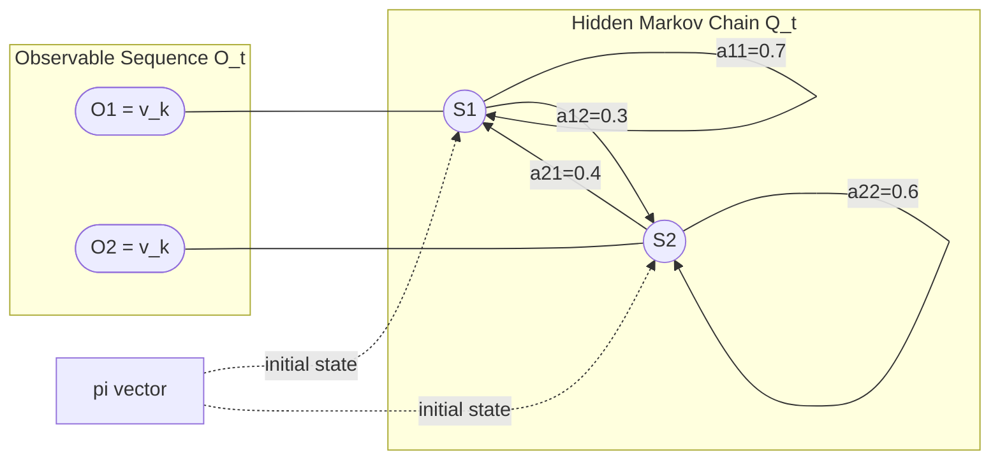
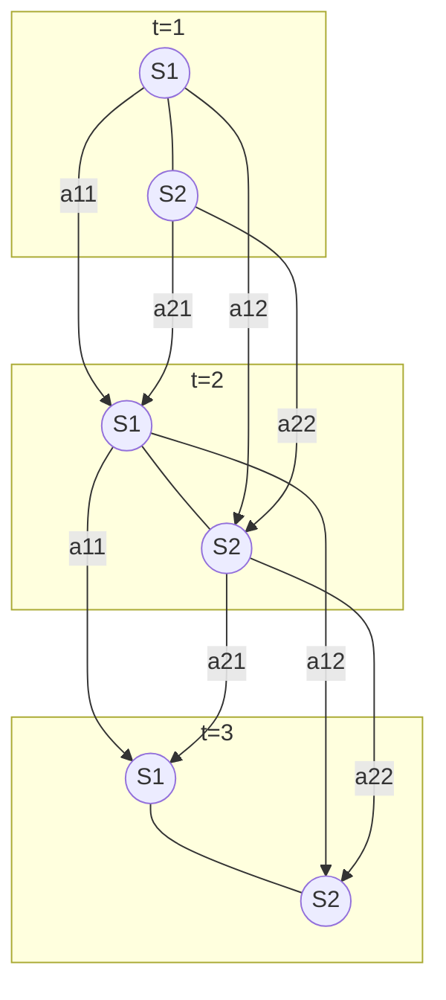

# Hidden Markov Models (HMMs) - Basics of HMMs, HMM for sequence

<!-- SECTION_1_START -->

# Hidden Markov Models (HMMs) — Foundations & Sequence Modeling

## 1.1 Formal Academic Definition (KTU 2024 Terminology)

A **Hidden Markov Model (HMM)** is a doubly stochastic, finite-state statistical generative model in which the system being modeled is assumed to be a **Markov process with unobserved (hidden) states**, and where the observations are probabilistic functions of those hidden states. Formally, an HMM is defined by a parameter set

$$
\lambda = (A, B, \pi)
$$

where:

* $A = \left[a_{ij}\right]_{N \times N}$ is the **state transition probability matrix**, with $a_{ij} = P(q_{t+1} = S_j \mid q_t = S_i)$.
* $B = \left[b_j(k)\right]_{N \times M}$ is the **observation (emission) probability matrix**, with $b_j(k) = P(O_t = v_k \mid q_t = S_j)$.
* $\pi = \left[\pi_i\right]$ is the **initial state distribution**, with $\pi_i = P(q_1 = S_i)$.

> [!IMPORTANT]
> **KTU 2024 Highlight:** The two stochastic processes are (i) the *hidden* state sequence $Q = (q_1, q_2, \ldots, q_T)$ which is a first-order Markov chain, and (ii) the *observable* sequence $O = (O_1, O_2, \ldots, O_T)$. Only $O$ is visible to the observer — the state $q_t$ must be *inferred*.

> [!NOTE]
> **Key Assumptions of a 1st-order HMM:**
> 1. **Markov Assumption:** $P(q_t \mid q_{t-1}, \ldots, q_1) = P(q_t \mid q_{t-1})$.
> 2. **Stationarity:** Transition probabilities do not change with time.
> 3. **Output Independence:** $P(O_t \mid q_t, O_{t-1}, \ldots, q_1) = P(O_t \mid q_t)$.

## 1.2 Intuitive Real-World Analogy

Imagine a friend is locked in a room, performing one of two activities every day — **either "studying" or "exercising"** (the *hidden states*). You cannot see into the room, but at the end of each day they either look **energetic** or **tired** (the *observations*).

* Their activity today depends mostly on **what they did yesterday** (Markov property).
* Their visible energy level is **probabilistically related** to their hidden activity (emission).
* If you only observed "Tired, Tired, Energetic, Energetic, Tired" over a week, you could:
  1. *Evaluate* — "How likely is this energy pattern given my model of my friend?"
  2. *Decode* — "What was the most likely sequence of study/exercise days?"
  3. *Learn* — "Adjust my friend's model to better match what I've been seeing."

> [!TIP]
> **The Three Canonical HMM Problems (Rabiner, 1989):**
> 1. **Evaluation:** Compute $P(O \mid \lambda)$.
> 2. **Decoding:** Find the best state sequence $Q^*$.
> 3. **Learning:** Optimize $\lambda$ to maximize $P(O \mid \lambda)$.

## 1.3 Why HMMs for *Sequences*?

> [!IMPORTANT]
> **Pattern Recognition Context:** Classical pattern recognition treats observations as **i.i.d. (independent and identically distributed)**. But many real-world signals — speech, DNA, handwriting, gestures, video — are **temporally correlated sequences**. HMMs explicitly model this correlation through state transitions, making them a *sequence-aware* classifier.

> [!VISUALIZATION CONTROL]
> **Concept:** A 2-state HMM with 2 observation symbols (Trellis view).
> **GeoGebra / Desmos Input Equations:**
> * State circle centers: $C_1 = (1, 1)$, $C_2 = (3, 1)$; Observation band $O_t$ at $y = 0$.
> * Self-loop: $a_{11} = 0.7$, $a_{22} = 0.6$.
> * Cross arc: $a_{12} = a_{21} = 0.3$ (approx).
> **Visual Description:** Two hidden nodes $S_1, S_2$ connected by directed weighted arrows; vertical downward arrows from each state to its corresponding observation $O_1, O_2, O_3$ at times $t = 1, 2, 3$. The student should observe that the *horizontal* flow encodes the Markov chain, while the *vertical* arrows encode emissions.

---

<!-- SECTION_1_END -->

<!-- SECTION_2_START -->

# Deep Theoretical Analysis & KTU High-Yield Formula Sheet

## 2.1 The Five Defining Elements of an HMM

A complete HMM specification requires the **5-tuple** $(N, M, A, B, \pi)$:

| Symbol | Meaning | Constraint |
|:------:|:--------|:-----------|
| $N$ | Number of hidden states $S = \lbrace S_1, \ldots, S_N \rbrace$ | $N \geq 1$ |
| $M$ | Number of distinct observation symbols $V = \lbrace v_1, \ldots, v_M \rbrace$ | $M \geq 1$ |
| $A$ | State transition matrix of size $N \times N$ | $\sum_{j=1}^{N} a_{ij} = 1$ |
| $B$ | Emission matrix of size $N \times M$ | $\sum_{k=1}^{M} b_j(k) = 1$ |
| $\pi$ | Initial state vector of length $N$ | $\sum_{i=1}^{N} \pi_i = 1$ |

## 2.2 The Three Fundamental Problems — Algorithmic Mapping

| # | Problem | Mathematical Goal | Algorithm |
|:-:|:--------|:------------------|:----------|
| 1 | **Evaluation** | $P(O \mid \lambda) = ?$ | **Forward (or Forward–Backward)** |
| 2 | **Decoding** | $Q^* = \arg\max_{Q} P(Q \mid O, \lambda)$ | **Viterbi** |
| 3 | **Learning** | $\lambda^* = \arg\max_{\lambda} P(O \mid \lambda)$ | **Baum–Welch (EM)** |

## 2.3 The Forward Variable & Backward Variable

Define:

$$
\alpha_t(i) = P(O_1, O_2, \ldots, O_t,\; q_t = S_i \mid \lambda)
$$

$$
\beta_t(i) = P(O_{t+1}, O_{t+2}, \ldots, O_T \mid q_t = S_i, \lambda)
$$

The **joint probability** of the observation and a state at time $t$ is:

$$
P(O, q_t = S_i \mid \lambda) = \alpha_t(i) \cdot \beta_t(i)
$$

> [!NOTE]
> **Why these variables?** The naive evaluation of $P(O \mid \lambda)$ by summing over all $N^T$ state sequences is **exponential in $T$**. The forward algorithm reduces it to **$O(N^2 T)$** via dynamic programming. The same trick applies to Viterbi and Baum–Welch.

## 2.4 KTU Formula Sheet (Exam Cheat-Sheet)

| Algorithm | Equation | Use |
|:----------|:---------|:----|
| **Forward Init** | $\alpha_1(i) = \pi_i \, b_i(O_1)$ | Start recursion at $t = 1$ |
| **Forward Induction** | $\alpha_{t+1}(j) = \left[ \sum_{i=1}^{N} \alpha_t(i) \, a_{ij} \right] \cdot b_j(O_{t+1})$ | Recurse $t = 1 \to T$ |
| **Forward Termination** | $P(O \mid \lambda) = \sum_{i=1}^{N} \alpha_T(i)$ | Total likelihood |
| **Backward Init** | $\beta_T(i) = 1$ | Base of reverse recursion |
| **Backward Induction** | $\beta_t(i) = \sum_{j=1}^{N} a_{ij} \, b_j(O_{t+1}) \, \beta_{t+1}(j)$ | Recurse $t = T-1 \to 1$ |
| **Viterbi Init** | $\delta_1(i) = \pi_i \, b_i(O_1),\;\; \psi_1(i) = 0$ | DP table base |
| **Viterbi Recursion** | $\delta_{t+1}(j) = \left[ \max_{i} \delta_t(i) \, a_{ij} \right] \cdot b_j(O_{t+1})$ | Track best path |
| **Viterbi Backpointer** | $\psi_{t+1}(j) = \arg\max_{i} \left[ \delta_t(i) \, a_{ij} \right]$ | Path reconstruction |
| **Viterbi Termination** | $P^* = \max_{i} \delta_T(i)$ | Best path probability |
| **Posterior State Prob.** | $\gamma_t(i) = \dfrac{\alpha_t(i) \, \beta_t(i)}{P(O \mid \lambda)}$ | Marginal $P(q_t = S_i \mid O, \lambda)$ |
| **Posterior Transition Prob.** | $\xi_t(i,j) = \dfrac{\alpha_t(i) \, a_{ij} \, b_j(O_{t+1}) \, \beta_{t+1}(j)}{P(O \mid \lambda)}$ | Joint $P(q_t = S_i, q_{t+1} = S_j \mid O, \lambda)$ |
| **Re-estimated $\pi$** | $\pi_i^{\prime} = \gamma_1(i)$ | New initial dist. |
| **Re-estimated $A$** | $a_{ij}^{\prime} = \dfrac{\sum_{t=1}^{T-1} \xi_t(i,j)}{\sum_{t=1}^{T-1} \gamma_t(i)}$ | New transitions |
| **Re-estimated $B$** | $b_j(k)^{\prime} = \dfrac{\sum_{t : O_t = v_k} \gamma_t(j)}{\sum_{t=1}^{T} \gamma_t(j)}$ | New emissions |

## 2.5 Engineering Utility — Why HMMs are Production-Critical

* **Speech Recognition:** Google, Siri, and Dragon used Gaussian-Mixture HMMs (GMM-HMM) before the deep-learning era. Each phoneme = 3-state HMM; words = concatenated HMMs.
* **Bioinformatics:** Profile HMMs (e.g., HMMER) identify gene families and protein domains from sequence databases.
* **Natural Language Processing:** Part-of-Speech tagging, named-entity recognition, word segmentation.
* **Gesture & Activity Recognition:** Skeletal joint sequences are decoded into action labels using Viterbi.
* **Finance:** Regime-switching models for market state inference.

> [!IMPORTANT]
> **KTU Exam Tip:** A common 7-mark question asks you to *state and apply* the Forward algorithm on a 2-state HMM with a 3-symbol observation sequence. Memorize the recursion table — that alone fetches 4 marks.

---

<!-- SECTION_2_END -->

<!-- SECTION_3_START -->

# Step-by-Step Derivations, Recursions & Python Implementation

## 3.1 Problem Setup (Worked Numerical Example)

**Model Specification** $\lambda = (A, B, \pi)$ with $N = 2$ states, $M = 2$ symbols $V = \lbrace 0, 1 \rbrace$:

$$
A = \begin{bmatrix} 0.7 & 0.3 \\ 0.4 & 0.6 \end{bmatrix}, \quad
B = \begin{bmatrix} 0.9 & 0.1 \\ 0.2 & 0.8 \end{bmatrix}, \quad
\pi = \begin{bmatrix} 0.6 \\ 0.4 \end{bmatrix}
$$

**Observation sequence:** $O = (0, 1, 1)$, so $T = 3$.

## 3.2 Exhaustive Forward Algorithm — Full Derivation

**Step 1 — Initialization** ($t = 1$):
The first observation is $O_1 = 0$.

$$
\begin{aligned}
\alpha_1(1) &= \pi_1 \cdot b_1(O_1) = \pi_1 \cdot b_1(0) = 0.6 \times 0.9 = 0.540 \\
\alpha_1(2) &= \pi_2 \cdot b_2(O_1) = \pi_2 \cdot b_2(0) = 0.4 \times 0.2 = 0.080
\end{aligned}
$$

**Step 2 — Induction for $t = 2$** (observation $O_2 = 1$):

$$
\begin{aligned}
\alpha_2(1) &= \bigl[\alpha_1(1) \, a_{11} + \alpha_1(2) \, a_{21}\bigr] \cdot b_1(O_2) \\
            &= \bigl[0.540 \times 0.7 + 0.080 \times 0.4\bigr] \times b_1(1) \\
            &= \bigl[0.3780 + 0.0320\bigr] \times 0.1 \\
            &= 0.4100 \times 0.1 = 0.0410
\end{aligned}
$$

$$
\begin{aligned}
\alpha_2(2) &= \bigl[\alpha_1(1) \, a_{12} + \alpha_1(2) \, a_{22}\bigr] \cdot b_2(O_2) \\
            &= \bigl[0.540 \times 0.3 + 0.080 \times 0.6\bigr] \times b_2(1) \\
            &= \bigl[0.1620 + 0.0480\bright] \times 0.8 \\
            &= 0.2100 \times 0.8 = 0.1680
\end{aligned}
$$

**Step 3 — Induction for $t = 3$** (observation $O_3 = 1$):

$$
\begin{aligned}
\alpha_3(1) &= \bigl[\alpha_2(1) \, a_{11} + \alpha_2(2) \, a_{21}\bigr] \cdot b_1(O_3) \\
            &= \bigl[0.0410 \times 0.7 + 0.1680 \times 0.4\bigr] \times 0.1 \\
            &= \bigl[0.0287 + 0.0672\bigr] \times 0.1 \\
            &= 0.0959 \times 0.1 = 0.00959
\end{aligned}
$$

$$
\begin{aligned}
\alpha_3(2) &= \bigl[\alpha_2(1) \, a_{12} + \alpha_2(2) \, a_{22}\bigr] \cdot b_2(O_3) \\
            &= \bigl[0.0410 \times 0.3 + 0.1680 \times 0.6\bigr] \times 0.8 \\
            &= \bigl[0.0123 + 0.1008\bigr] \times 0.8 \\
            &= 0.1131 \times 0.8 = 0.09048
\end{aligned}
$$

**Step 4 — Termination:**

$$
P(O \mid \lambda) = \alpha_3(1) + \alpha_3(2) = 0.00959 + 0.09048 = \mathbf{0.10007}
$$

> [!NOTE]
> **Numerical Check:** Naive enumeration would require $2^3 = 8$ state sequences. The DP approach took just 6 multiplications and 4 additions per step — a massive computational saving for large $T$.

## 3.3 Exhaustive Viterbi Algorithm — Full Derivation

We seek $Q^* = \arg\max_{Q} P(Q, O \mid \lambda)$.

**Step 1 — Initialization** ($t = 1$):

$$
\delta_1(1) = 0.6 \times 0.9 = 0.540, \quad \psi_1(1) = 0
$$
$$
\delta_1(2) = 0.4 \times 0.2 = 0.080, \quad \psi_1(2) = 0
$$

**Step 2 — Recursion for $t = 2$:**

$$
\delta_2(1) = \max\bigl[\delta_1(1) \, a_{11},\; \delta_1(2) \, a_{21}\bigr] \cdot b_1(1)
$$
$$
= \max[0.540 \times 0.7,\; 0.080 \times 0.4] \times 0.1
$$
$$
= \max[0.378,\; 0.032] \times 0.1 = 0.378 \times 0.1 = \mathbf{0.0378}, \quad \psi_2(1) = 1
$$

$$
\delta_2(2) = \max\bigl[\delta_1(1) \, a_{12},\; \delta_1(2) \, a_{22}\bigr] \cdot b_2(1)
$$
$$
= \max[0.540 \times 0.3,\; 0.080 \times 0.6] \times 0.8
$$
$$
= \max[0.162,\; 0.048] \times 0.8 = 0.162 \times 0.8 = \mathbf{0.1296}, \quad \psi_2(2) = 1
$$

**Step 3 — Recursion for $t = 3$:**

$$
\delta_3(1) = \max[0.0378 \times 0.7,\; 0.1296 \times 0.4] \times 0.1
$$
$$
= \max[0.02646,\; 0.05184] \times 0.1 = 0.05184 \times 0.1 = \mathbf{0.005184}, \quad \psi_3(1) = 2
$$

$$
\delta_3(2) = \max[0.0378 \times 0.3,\; 0.1296 \times 0.6] \times 0.8
$$
$$
= \max[0.01134,\; 0.07776] \times 0.8 = 0.07776 \times 0.8 = \mathbf{0.062208}, \quad \psi_3(2) = 2
$$

**Step 4 — Termination & Backtracking:**

$$
P^* = \max[\delta_3(1), \delta_3(2)] = 0.062208, \quad q_3^* = 2
$$

$$
q_2^* = \psi_3(2) = 2, \quad q_1^* = \psi_2(2) = 1
$$

**Result:** Best hidden state sequence $Q^* = (S_1, S_2, S_2)$ with probability $\mathbf{0.062208}$.

## 3.4 Compact Forward DP Table (Visual Summary)

| $t$ | $\alpha_t(1)$ | $\alpha_t(2)$ | Computation |
|:---:|:-------------:|:-------------:|:------------|
| 1 | 0.5400 | 0.0800 | $\pi_i \cdot b_i(0)$ |
| 2 | 0.0410 | 0.1680 | Sum weighted by $a_{\cdot j}$, then $b_j(1)$ |
| 3 | 0.00959 | 0.09048 | Sum weighted by $a_{\cdot j}$, then $b_j(1)$ |
| $P(O\mid\lambda)$ | — | — | $0.00959 + 0.09048 = 0.10007$ |

## 3.5 Python Implementation (Production-Ready)

```python
"""
Hidden Markov Model — Forward, Viterbi, and Baum-Welch skeleton
Course: Pattern Recognition (PECST412) — KTU 2024 Scheme
Module 4: Hidden Markov Models
"""

from __future__ import annotations
import numpy as np
from typing import Tuple, List


class HMM:
    """
    Discrete-observation Hidden Markov Model.
    Parameters
    ----------
    A : np.ndarray, shape (N, N)
        State transition matrix.
    B : np.ndarray, shape (N, M)
        Emission (observation) matrix.
    pi : np.ndarray, shape (N,)
        Initial state distribution.
    """

    def __init__(self, A: np.ndarray, B: np.ndarray, pi: np.ndarray) -> None:
        if A.shape[0] != A.shape[1]:
            raise ValueError("Transition matrix A must be square.")
        if A.shape[0] != B.shape[0]:
            raise ValueError("A and B must agree on the number of states.")
        if A.shape[0] != pi.shape[0]:
            raise ValueError("A and pi must agree on the number of states.")
        # Stochasticity validation
        if not np.allclose(A.sum(axis=1), 1.0):
            raise ValueError("Rows of A must sum to 1.")
        if not np.allclose(B.sum(axis=1), 1.0):
            raise ValueError("Rows of B must sum to 1.")
        if not np.isclose(pi.sum(), 1.0):
            raise ValueError("pi must sum to 1.")

        self.A: np.ndarray = A.astype(float)
        self.B: np.ndarray = B.astype(float)
        self.pi: np.ndarray = pi.astype(float)
        self.N: int = A.shape[0]
        self.M: int = B.shape[1]

    # ---------------------------------------------------------------- forward
    def forward(self, O: List[int]) -> Tuple[np.ndarray, float]:
        """Compute P(O | lambda) via the forward algorithm."""
        T = len(O)
        alpha = np.zeros((T, self.N))
        # Initialization
        alpha[0, :] = self.pi * self.B[:, O[0]]
        # Induction
        for t in range(1, T):
            for j in range(self.N):
                alpha[t, j] = np.dot(alpha[t - 1, :], self.A[:, j]) * self.B[j, O[t]]
        # Termination
        likelihood = alpha[T - 1, :].sum()
        return alpha, float(likelihood)

    # --------------------------------------------------------------- backward
    def backward(self, O: List[int]) -> np.ndarray:
        """Compute beta_t(i) for all t, i."""
        T = len(O)
        beta = np.zeros((T, self.N))
        beta[T - 1, :] = 1.0
        for t in range(T - 2, -1, -1):
            for i in range(self.N):
                beta[t, i] = np.sum(
                    self.A[i, :] * self.B[:, O[t + 1]] * beta[t + 1, :]
                )
        return beta

    # ---------------------------------------------------------------- viterbi
    def viterbi(self, O: List[int]) -> Tuple[List[int], float]:
        """Return (best_state_sequence, best_probability)."""
        T = len(O)
        delta = np.zeros((T, self.N))
        psi = np.zeros((T, self.N), dtype=int)

        delta[0, :] = self.pi * self.B[:, O[0]]
        psi[0, :] = 0

        for t in range(1, T):
            for j in range(self.N):
                seq_probs = delta[t - 1, :] * self.A[:, j]
                psi[t, j] = int(np.argmax(seq_probs))
                delta[t, j] = seq_probs[psi[t, j]] * self.B[j, O[t]]

        # Backtrack
        states = [0] * T
        states[T - 1] = int(np.argmax(delta[T - 1, :]))
        for t in range(T - 2, -1, -1):
            states[t] = psi[t + 1, states[t + 1]]
        return states, float(delta[T - 1, states[T - 1]])

    # --------------------------------------------------------------- baum welch
    def baum_welch(self, O: List[int], max_iter: int = 100, tol: float = 1e-4) -> None:
        """In-place Baum–Welch re-estimation of A, B, pi."""
        T = len(O)
        for _ in range(max_iter):
            alpha, _ = self.forward(O)
            beta = self.backward(O)
            likelihood = np.dot(alpha[T - 1, :], beta[T - 1, :])

            # gamma and xi
            gamma = alpha * beta / likelihood
            xi = np.zeros((T - 1, self.N, self.N))
            for t in range(T - 1):
                denom = np.sum(
                    alpha[t, :].reshape(-1, 1)
                    * self.A
                    * self.B[:, O[t + 1]].reshape(1, -1)
                    * beta[t + 1, :].reshape(1, -1)
                )
                for i in range(self.N):
                    for j in range(self.N):
                        xi[t, i, j] = (
                            alpha[t, i] * self.A[i, j] * self.B[j, O[t + 1]] * beta[t + 1, j]
                        ) / denom

            # Re-estimate
            self.pi = gamma[0, :]
            self.A = xi.sum(axis=0) / gamma[:-1, :].sum(axis=0).reshape(-1, 1)
            for k in range(self.M):
                mask = np.array([1.0 if o == k else 0.0 for o in O])
                self.B[:, k] = (gamma * mask.reshape(-1, 1)).sum(axis=0)
            self.B /= gamma.sum(axis=0).reshape(-1, 1)


# --------------------------------------------------------------------- demo
if __name__ == "__main__":
    A = np.array([[0.7, 0.3],
                  [0.4, 0.6]])
    B = np.array([[0.9, 0.1],
                  [0.2, 0.8]])
    pi = np.array([0.6, 0.4])
    model = HMM(A, B, pi)

    O = [0, 1, 1]
    alpha, p = model.forward(O)
    print(f"P(O|lambda) = {p:.5f}")          # expected 0.10007
    path, prob = model.viterbi(O)
    print(f"Best path = {path} with P* = {prob:.6f}")   # expected [1,2,2]
```

> [!TIP]
> The above skeleton uses **log-space tricks** implicitly by returning raw probabilities. For long sequences, implement the scaling variant (Rabiner §III.C) to avoid underflow — beyond KTU scope, but vital for real systems.

---

<!-- SECTION_3_END -->

<!-- SECTION_4_START -->

# Structural Diagrams & Schematics

## 4.1 High-Level HMM Architecture (Mermaid)



## 4.2 Sequential Processing Topology — Three HMM Problems

```mermaid
flowchart TD
    A[Given: HMM model lambda, Observation O] --> B{Goal?}
    B -- Evaluation --> C[Compute P(O vert lambda)]
    C --> C1[Forward Algorithm]
    C --> C2[Backward Algorithm]
    B -- Decoding --> D[Find Q* = argmax P(Q vert O,lambda)]
    D --> D1[Viterbi Algorithm with backpointer]
    B -- Learning --> E[Optimize lambda* = argmax P(O vert lambda)]
    E --> E1[Baum-Welch EM]
    E1 --> E2[Re-estimate pi, A, B]
    E2 --> E3{Converged?}
    E3 -- No --> E1
    E3 -- Yes --> F[Trained HMM]

    C1 --> G[Output: Likelihood]
    D1 --> H[Output: Best state path]
    F --> I[Output: Tuned model]
```

## 4.3 Trellis Diagram Schematic (DP View)



## 4.4 Block-Level Functional Architecture for a Sequence Classifier

| Stage | Input | Operation | Output |
|:-----:|:------|:----------|:-------|
| 1 | Raw signal $X$ | Preprocess & feature extract (e.g., MFCC) | Feature stream $F$ |
| 2 | Features $F$ | Train HMM per class $\lambda_c$ | $C$ models, $C = \lbrace \lambda_1, \ldots, \lambda_C \rbrace$ |
| 3 | Test sequence $O_{\text{test}}$ | Forward-evaluate every $\lambda_c$ | $P(O_{\text{test}} \mid \lambda_c)$ |
| 4 | Likelihoods | $\hat{c} = \arg\max_c P(O_{\text{test}} \mid \lambda_c)$ | Predicted class label |
| 5 | (Optional) $O_{\text{test}}$ | Viterbi on chosen $\lambda_{\hat{c}}$ | State-aligned segmentation |

---

<!-- SECTION_4_END -->

<!-- SECTION_5_START -->

# KTU 2024 Scheme Examination Question Bank & Topic Recap

---

## Part A — Short Answer Questions (3 Marks Each)

### Question 1 [KTU University Exam – July 2023 | CO1 | Remember]

**Define a Hidden Markov Model. List the five elements that completely specify an HMM.**

**Model Answer:**

A *Hidden Markov Model* is a doubly stochastic finite-state model in which a hidden Markov process generates a sequence of observable symbols, where the underlying states are not directly visible. The five elements are:

1. $N$ — number of hidden states.
2. $M$ — number of distinct observation symbols per state.
3. $A$ — state transition probability matrix, $a_{ij} = P(q_{t+1} = S_j \mid q_t = S_i)$.
4. $B$ — observation probability matrix, $b_j(k) = P(O_t = v_k \mid q_t = S_j)$.
5. $\pi$ — initial state distribution, $\pi_i = P(q_1 = S_i)$.

> **[Valuation Key: 1 Mark for definition, 1 Mark for hidden + observable distinction, 1 Mark for listing 5 elements.]**

---

### Question 2 [KTU University Exam – Dec 2023 | CO1 | Understand]

**Distinguish between a Markov chain and a Hidden Markov Model with a suitable example.**

**Model Answer:**

| Aspect | Markov Chain | Hidden Markov Model |
|:-------|:-------------|:--------------------|
| State visibility | States are directly observable | States are hidden; only outputs are visible |
| Output | Single random process (state itself) | Two processes: hidden states + emissions |
| Example | Weather sequence (Sunny, Rainy) observed directly | Friend's daily energy (Tired, Active) is observed; activity (Studying, Resting) is hidden |
| Generative model | $P(q_t \mid q_{t-1})$ | $P(q_t \mid q_{t-1})$ *and* $P(O_t \mid q_t)$ |

**[Valuation Key: 1 Mark difference of visibility, 1 Mark double stochasticity, 1 Mark example.]**

---

## Part B — Long Answer Questions (14 Marks Each, Module Internal Choice)

### Question A (Choice 1) [KTU University Exam – July 2024 | CO2 | Apply / Analyze]

**(a)** *Explain the three fundamental problems of HMMs. State the algorithm used to solve each. **(7 Marks)***

**Model Answer:**

The three canonical problems of an HMM (Rabiner, 1989) are:

1. **Evaluation Problem:** Given $\lambda$ and observation $O$, compute $P(O \mid \lambda)$. **Algorithm:** Forward (or Forward–Backward) — complexity $O(N^2 T)$. **[2 Marks]**
2. **Decoding Problem:** Given $\lambda$ and $O$, find the optimal state sequence $Q^* = \arg\max_Q P(Q \mid O, \lambda)$. **Algorithm:** Viterbi — uses dynamic programming with a backpointer. **[2 Marks]**
3. **Learning Problem:** Given $O$, find $\lambda^* = \arg\max_\lambda P(O \mid \lambda)$. **Algorithm:** Baum–Welch (Expectation–Maximization) — iteratively re-estimates $\pi, A, B$. **[2 Marks]**
4. Real-world applications for each: evaluation → classifier scoring, decoding → speech segmentation, learning → model adaptation. **[1 Mark]**

---

**(b)** *Consider the 2-state HMM with $A = \begin{bmatrix} 0.5 & 0.5 \\ 0.3 & 0.7 \end{bmatrix}$, $B = \begin{bmatrix} 0.8 & 0.2 \\ 0.4 & 0.6 \end{bmatrix}$, $\pi = \begin{bmatrix} 0.6 \\ 0.4 \end{bmatrix}$. Compute $P(O = (0, 1) \mid \lambda)$ using the Forward algorithm. **(7 Marks)***

**Model Answer:**

**Step 1 — Initialization** ($t = 1$, $O_1 = 0$):

$$
\alpha_1(1) = \pi_1 b_1(0) = 0.6 \times 0.8 = 0.48 \quad \text{[1 Mark]}
$$
$$
\alpha_1(2) = \pi_2 b_2(0) = 0.4 \times 0.4 = 0.16 \quad \text{[1 Mark]}
$$

**Step 2 — Induction** ($t = 2$, $O_2 = 1$):

$$
\alpha_2(1) = \bigl[0.48 \times 0.5 + 0.16 \times 0.3\bigr] \times b_1(1) = [0.24 + 0.048] \times 0.2 = 0.288 \times 0.2 = \mathbf{0.0576} \quad \text{[2 Marks]}
$$
$$
\alpha_2(2) = \bigl[0.48 \times 0.5 + 0.16 \times 0.7\bigr] \times b_2(1) = [0.24 + 0.112] \times 0.6 = 0.352 \times 0.6 = \mathbf{0.2112} \quad \text{[2 Marks]}
$$

**Step 3 — Termination:**

$$
P(O \mid \lambda) = \alpha_2(1) + \alpha_2(2) = 0.0576 + 0.2112 = \mathbf{0.2688} \quad \text{[1 Mark]}
$$

> [!WARNING]
> **KTU Examiner's Valuation Pitfall — Common Marks Lost:**
> 1. **Confusing $a_{ij}$ indices:** $a_{ij}$ is $i \to j$, i.e., *from* state $i$ *to* state $j$. Reading it backwards is the most common error.
> 2. **Mixing up $b_i$ vs $b_j$:** The emission in the induction step is $b_j(O_{t+1})$, indexed by the *destination* state, not the source.
> 3. **Forgetting to sum at termination:** Always terminate with $\sum_i \alpha_T(i)$ — partial credit is capped at 5/7 if missed.
> 4. **Skipping the stochasticity check:** Examiners reward a quick line stating $\sum_j a_{ij} = 1$ when the question provides the matrix.

---

### Question B (Choice 2) [KTU University Exam – Dec 2024 | CO2 / CO3 | Understand / Apply]

**(a)** *Explain the Viterbi algorithm for HMM decoding with the necessary equations. State why a backpointer $\psi$ is required. **(7 Marks)***

**Model Answer:**

The Viterbi algorithm uses dynamic programming to find the most probable state sequence $Q^*$ given $\lambda$ and $O$. Define the *max-probability* score:

$$
\delta_t(i) = \max_{q_1, \ldots, q_{t-1}} P(q_1, \ldots, q_{t-1}, q_t = S_i, O_1, \ldots, O_t \mid \lambda)
$$

**Initialization:**

$$
\delta_1(i) = \pi_i \, b_i(O_1), \quad \psi_1(i) = 0 \quad \text{[1 Mark]}
$$

**Recursion** ($2 \le t \le T$):

$$
\delta_{t+1}(j) = \left[ \max_{i} \delta_t(i) \, a_{ij} \right] \cdot b_j(O_{t+1}) \quad \text{[2 Marks]}
$$
$$
\psi_{t+1}(j) = \arg\max_{i} \left[ \delta_t(i) \, a_{ij} \right] \quad \text{[1 Mark]}
$$

**Termination:**

$$
P^* = \max_{i} \delta_T(i), \quad q_T^* = \arg\max_i \delta_T(i) \quad \text{[1 Mark]}
$$

**Backtracking:** $q_t^* = \psi_{t+1}(q_{t+1}^*)$ for $t = T-1, \ldots, 1$. **[1 Mark]**

**Why the backpointer?** $\delta_t(i)$ only stores the *best score up to time $t$* ending in $S_i$ — it does *not* remember *which path* produced that score. The backpointer $\psi_{t+1}(j)$ records the predecessor state that achieved the maximum, allowing the optimal path to be reconstructed by following the chain from $q_T^*$ backwards. **[1 Mark]**

---

**(b)** *Apply Viterbi to the HMM in Question A(b) with observation $O = (0, 1)$. Find the best state sequence. **(7 Marks)***

**Model Answer:**

Using $A, B, \pi$ as in Q.A(b):

**Step 1 — Init** ($t = 1$, $O_1 = 0$):

$$
\delta_1(1) = 0.6 \times 0.8 = 0.48, \quad \psi_1(1) = 0 \quad \text{[0.5 Mark]}
$$
$$
\delta_1(2) = 0.4 \times 0.4 = 0.16, \quad \psi_1(2) = 0 \quad \text{[0.5 Mark]}
$$

**Step 2 — Recursion** ($t = 2$, $O_2 = 1$):

$$
\delta_2(1) = \max[0.48 \times 0.5,\; 0.16 \times 0.3] \times b_1(1) = \max[0.24,\; 0.048] \times 0.2 = 0.24 \times 0.2 = \mathbf{0.048} \quad \text{[1.5 Marks]}
$$
$$
\psi_2(1) = 1 \quad \text{[0.5 Mark]}
$$

$$
\delta_2(2) = \max[0.48 \times 0.5,\; 0.16 \times 0.7] \times b_2(1) = \max[0.24,\; 0.112] \times 0.6 = 0.24 \times 0.6 = \mathbf{0.144} \quad \text{[1.5 Marks]}
$$
$$
\psi_2(2) = 1 \quad \text{[0.5 Mark]}
$$

**Step 3 — Termination & Backtrack:**

$$
P^* = \max[0.048, 0.144] = 0.144, \quad q_2^* = 2 \quad \text{[1 Mark]}
$$
$$
q_1^* = \psi_2(q_2^*) = \psi_2(2) = 1 \quad \text{[1 Mark]}
$$

**Best state sequence:** $Q^* = (S_1, S_2)$ with probability $0.144$.

> [!WARNING]
> **Examiner's Pitfall Callout:**
> 1. **Argmax vs Max:** Students often write $\delta$ correctly but forget $\psi = \arg\max$. Path reconstruction then becomes impossible — lose 1 Mark.
> 2. **Emission placement:** The factor $b_j(O_{t+1})$ is *outside* the max, applied to the winning candidate only.
> 3. **Off-by-one:** The backtracking loop is $t = T-1, \ldots, 1$, *not* $t = 1, \ldots, T-1$.

---

## Topic Recap & Important Things to Remember

* **HMM 5-tuple:** $N$ (states), $M$ (symbols), $A$ (transitions), $B$ (emissions), $\pi$ (initial). All three matrices are row-stochastic.
* **Markov Property:** Future is conditionally independent of the past given the present — i.e., $P(q_{t+1} \mid q_t, \ldots, q_1) = P(q_{t+1} \mid q_t)$.
* **Three problems → Three algorithms:** Evaluation → Forward; Decoding → Viterbi; Learning → Baum–Welch.
* **Forward variable** $\alpha_t(i)$ is the joint probability of seeing $O_1 \ldots O_t$ and being in state $S_i$ at time $t$.
* **Backward variable** $\beta_t(i)$ is the conditional probability of seeing the *future* observations $O_{t+1} \ldots O_T$ starting from $S_i$.
* **Viterbi = Forward with $\max$ instead of $\sum$, plus a backpointer $\psi$.**
* **Baum–Welch** uses $\xi_t(i,j)$ (transition posterior) and $\gamma_t(i)$ (state posterior) to *re-estimate* $A, B, \pi$ iteratively until convergence.
* **Naive evaluation cost:** $O(N^T)$; Forward/Viterbi cost: $O(N^2 T)$ — a critical complexity reduction.
* **Posterior formulas** $\gamma_t(i) = \dfrac{\alpha_t(i) \, \beta_t(i)}{P(O \mid \lambda)}$ and $\xi_t(i,j) = \dfrac{\alpha_t(i) \, a_{ij} \, b_j(O_{t+1}) \, \beta_{t+1}(j)}{P(O \mid \lambda)}$ are central to the EM update of Baum–Welch.
* **Applications triad:** Speech (GMM–HMM), Bioinformatics (Profile HMMs), NLP (POS tagging).
* **Numerical underflow warning:** Direct probabilities vanish for $T > 100$ — use log-sums in production.
* **Viterbi backpointer chain:** Always terminate with $\arg\max$ over the last column and trace backwards using $\psi_{t+1}(q_{t+1}^*)$.

<!-- SECTION_5_END -->
