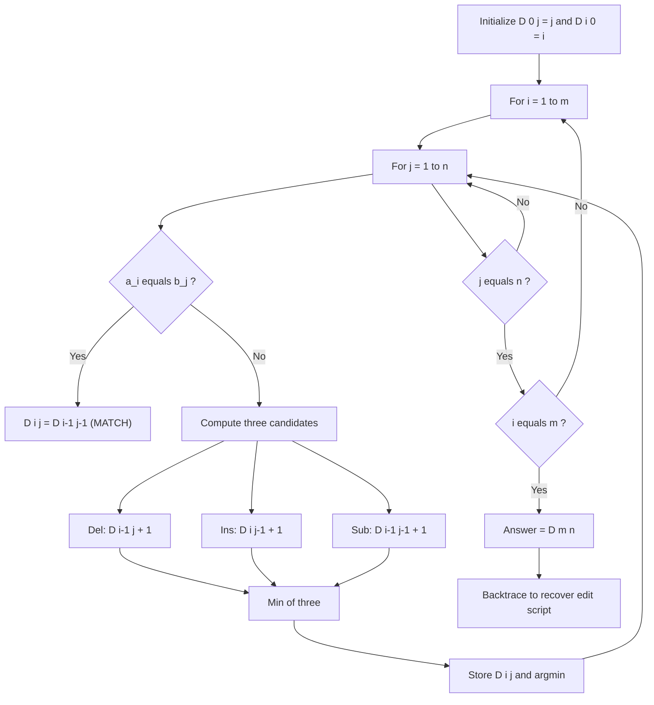
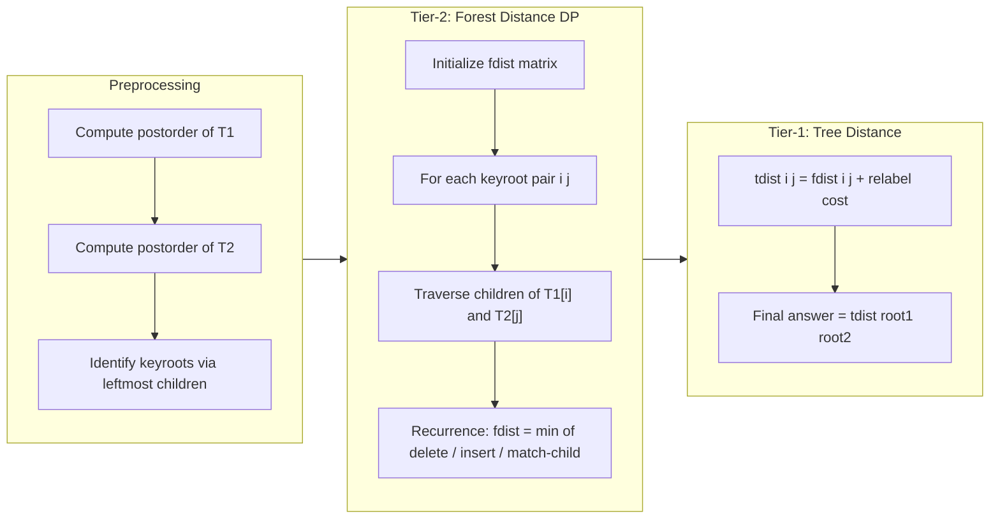
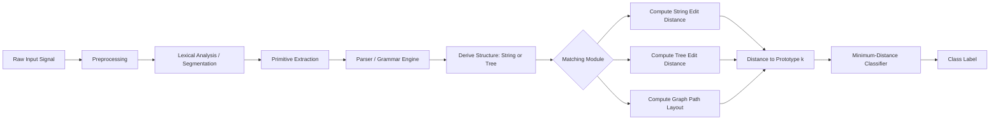
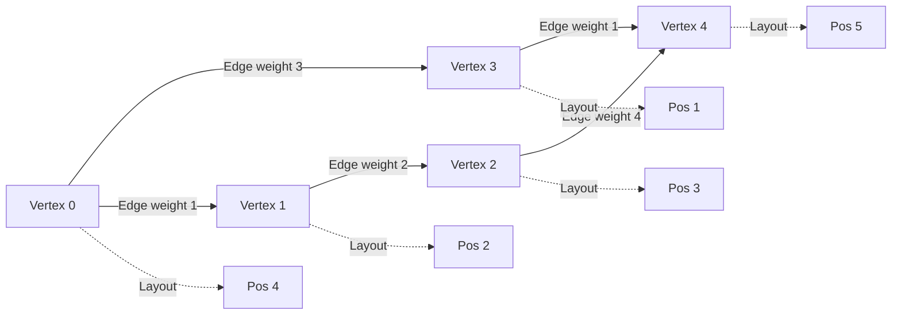

# String matching distance computations, syntactic structure tree matching paths layouts

<!-- SECTION_1_START -->

# Module 4: Structural Pattern Recognition — String Matching, Tree Matching & Path Layouts

## 1.1 Core Technical Definition & Intuitive Overview

### Definition (KTU 2024 Scheme Formal Terminology)

> [!IMPORTANT]
> **String Matching Distance Computation** is the quantitative measure of dissimilarity between two symbolic sequences (strings) defined over a common alphabet, evaluated as the minimum cost sequence of primitive edit operations — **substitution**, **insertion**, and **deletion** — required to transform one string into the other.

In **Syntactic Pattern Recognition**, objects are not described by feature vectors but by **composite symbolic structures** — strings, trees, or graphs — generated by a formal grammar. The recognition problem reduces to computing a structural distance between an unknown input structure and each reference prototype, then assigning the class of the closest prototype.

> [!NOTE]
> **Course Outcome (CO) Mapping — PECST412 / Module 4:**
> - **CO4 (Apply):** Compute edit distances and tree edit distances between structural representations.
> - **CO5 (Analyze):** Evaluate syntactic pattern classifiers using string and tree matching algorithms.

---

### Conceptual Analogy (Plain English Intuition)

Imagine you have two sentences typed by two different people on slightly faulty keyboards:

- Sentence A: `PATTERN`
- Sentence B: `PARTEN`

To make A look like B, you might:
- Change the **M** to **T** (substitution)
- Delete the extra **R** (deletion)
- Insert an extra **E** (insertion)

The **edit distance** simply **counts the minimum number of these operations** (or accumulates their cost). If each operation costs **1 unit**, the distance here is **3**. That is the heart of *Levenshtein Distance*.

For **trees**, think of family trees of two people. Matching their trees involves:
- Renaming a node (relabel)
- Deleting a node and promoting its children
- Inserting a new node

The **tree edit distance** counts the minimum cost of these tree-modifying operations to make one tree identical to another.

**Path layouts** are like arranging furniture in a hallway — you have items (graph vertices) that must be placed along a single line (a path) such that the *total reach* between connected items is minimized.

---

### Key Distances at a Glance

| Distance Type | Allowed Operations | Typical Use |
|---|---|---|
| **Hamming Distance** | Substitution only (equal length) | Error-correcting codes |
| **Levenshtein Distance** | Insert, Delete, Substitute | Spell checkers, DNA alignment |
| **Damerau–Levenshtein** | + Transposition of adjacent symbols | Typo correction (keyboard) |
| **Longest Common Subsequence (LCS)** | Insert, Delete (no substitution) | Diff tools, bioinformatics |
| **Weighted Edit Distance** | All operations, custom cost | OCR, speech recognition |
| **Tree Edit Distance (Zhang–Shasha)** | Insert, Delete, Relabel on trees | Structured document matching |

> [!IMPORTANT]
> **Syllabus Highlight (KTU 2024 PECST412 Module 4):** Students must be able to (a) construct the dynamic programming matrix for edit distance with full backtrace, (b) compute tree edit distance on small ordered trees, and (c) formulate path layout / linear arrangement as a graph optimization problem.

---

> [!VISUALIZATION CONTROL]
> **Concept:** Edit Distance DP Matrix as a 2D Cost Lattice
> **GeoGebra / Desmos Input Equations:**
> * Plot the cost surface $D(i, j)$ over the integer grid $0 \le i, j \le 5$.
> * Sample recurrence: $D(i, j) = \min\{D(i-1, j)+1,\ D(i-1, j-1)+\delta,\ D(i, j-1)+1\}$
> * **Visual Description:** Students should observe a monotonically non-decreasing cost "valley" rising from origin $(0,0)$ to corner $(m, n)$, with darker cells representing cheaper cumulative paths.
> * Link: https://www.desmos.com/calculator — enter `D[i,j]=min(D[i-1,j]+1,D[i,j-1]+1,D[i-1,j-1]+(a[i]==b[j]?0:1))` as a recursive table.

---

<!-- SECTION_1_END -->

<!-- SECTION_2_START -->

# 2. Deep Theoretical Analysis & KTU High-Yield Formula Sheet

## 2.1 String Edit Distance — Levenshtein Formulation

Given two strings $A = a_1 a_2 \dots a_m$ and $B = b_1 b_2 \dots b_n$ over a finite alphabet $\Sigma$, the **edit distance** is the minimum total cost to convert $A$ into $B$ using three primitive operations:

- **Insertion** of a symbol from $B$ (cost $c_{ins}$)
- **Deletion** of a symbol from $A$ (cost $c_{del}$)
- **Substitution** of $a_i$ with $b_j$ (cost $c_{sub}(a_i, b_j)$, often $0$ if $a_i = b_j$ and $1$ otherwise)

### Why Dynamic Programming?

Brute force enumeration of all possible edit sequences explodes exponentially. Dynamic programming exploits the **optimal substructure** property: the optimal alignment of $A[1..i]$ and $B[1..j]$ depends only on optimal alignments of shorter prefixes.

### Recurrence (Generic Weighted Form)

$$
D(i, j) = \min \begin{cases}
D(i-1, j) + c_{del}(a_i) & \text{— delete } a_i \\
D(i, j-1) + c_{ins}(b_j) & \text{— insert } b_j \\
D(i-1, j-1) + c_{sub}(a_i, b_j) & \text{— substitute / match } a_i \leftrightarrow b_j
\end{cases}
$$

### Boundary Conditions

$$
D(0, 0) = 0
$$
$$
D(i, 0) = \sum_{k=1}^{i} c_{del}(a_k) \quad \text{(delete all of } A)
$$
$$
D(0, j) = \sum_{k=1}^{j} c_{ins}(b_k) \quad \text{(insert all of } B)
$$

### Unweighted Unit-Cost Special Case

If every operation costs **1**, the recurrence simplifies to:

$$
D(i, j) = \begin{cases}
i & j = 0 \\
j & i = 0 \\
D(i-1, j-1) & a_i = b_j \\
1 + \min\{D(i-1, j),\ D(i, j-1),\ D(i-1, j-1)\} & a_i \ne b_j
\end{cases}
$$

---

## 2.2 Hamming Distance

For equal-length strings, the Hamming distance counts positions where symbols differ:

$$
H(A, B) = \sum_{i=1}^{n} \mathbb{1}\{a_i \ne b_i\}
$$

This is a **restricted edit distance** allowing only substitutions on equal-length operands.

---

## 2.3 Longest Common Subsequence (LCS) — Dual Form

The length of the LCS is **not** the same as edit distance, but the two are tightly coupled:

$$
\text{LCS}(A, B) = \frac{m + n - D_{L}(A, B)}{2}
$$

where $D_L$ is Levenshtein distance with **substitution cost = 2** (since substitution = delete + insert).

The DP recurrence for LCS is:

$$
L(i, j) = \begin{cases}
0 & i = 0 \text{ or } j = 0 \\
L(i-1, j-1) + 1 & a_i = b_j \\
\max\{L(i-1, j),\ L(i, j-1)\} & a_i \ne b_j
\end{cases}
$$

---

## 2.4 Damerau–Levenshtein Distance

Adds **adjacent transposition** of two symbols to the standard operation set:

$$
D_{DL}(A, B) = D_{L}(A, B) + c_{trans}
$$

Useful for detecting **keyboard-adjacent typos** (`teh` ↔ `the`).

---

## 2.5 Syntactic Pattern Recognition Pipeline

> [!IMPORTANT]
> **Why Strings/Trees in Pattern Recognition?** Many real-world patterns are inherently structural: **chemical compounds** (molecular graphs), **fingerprints** (ridge patterns), **chromosomes** (banded strings), **ECG/EEG waveforms** (segment strings), and **programming languages** (parse trees).

The classical syntactic pipeline:

1. **Lexical Analysis** — segment the input into primitive symbols (primitives).
2. **Parsing** — apply a grammar to derive a structure (string or tree).
3. **Structural Matching** — compare the derived structure to prototypes.
4. **Classification** — assign the class with minimum structural distance.

A **formal grammar** $G = (V, \Sigma, R, S)$ generates a language $L(G)$:
- $V$ — non-terminals
- $\Sigma$ — terminals
- $R$ — production rules
- $S$ — start symbol

For pattern recognition, **stochastic / attributed grammars** are preferred because they allow uncertainty modeling.

---

## 2.6 Tree Edit Distance — Zhang–Shasha Algorithm

For ordered, labelled trees $T_1$ and $T_2$, three tree-modifying operations are permitted:

| Operation | Effect | Cost |
|---|---|---|
| **Relabel** | Change label of a node | $c_r(u, v)$ |
| **Delete** | Remove a node; its children become children of its parent | $c_d(u)$ |
| **Insert** | Inverse of delete | $c_i(u)$ |

The **tree edit distance** $\delta(T_1, T_2)$ is the minimum total cost sequence transforming $T_1$ into $T_2$.

### Key Zhang–Shasha Decomposition

Let $T[i]$ denote the subtree rooted at node $i$. For any two nodes $i \in T_1$ and $j \in T_2$, the **forest distance** between $F[i]$ (forest of children of $i$ after excluding $i$) and $F[j]$ is denoted $fdist[i][j]$.

The recurrence is two-tiered:

**Tier 1 — Forest distance** (dynamic programming over children):

$$
g[i][j] = \min \begin{cases}
g[i][j-1] + c_d(T_2[j]) \\
g[i-1][j] + c_i(T_1[i]) \\
g[i-1][j-1] + fdist[\text{child}_k(i)][\text{child}_k(j)]
\end{cases}
$$

**Tier 2 — Tree distance** (relabel the roots and combine):

$$
tdist[i][j] = fdist[i][j] + \min \begin{cases}
c_r(\text{label}(i), \text{label}(j)) \\
c_d(\text{label}(i)) + c_i(\text{label}(j)) \\
c_i(\text{label}(j)) + c_d(\text{label}(i))
\end{cases}
$$

The overall tree edit distance is $tdist[\text{root}_1][\text{root}_2]$.

**Time complexity:** $O(n_1^2 \cdot n_2^2)$ with $O(n_1 \cdot n_2)$ space using a key decomposition. Tai's original algorithm was $O(n_1^2 \cdot n_2^2)$ in time; Klein's improvement reduces it further.

---

## 2.7 Path Layouts & Linear Arrangement

A **path layout** (or **linear arrangement**) of a graph $G = (V, E)$ is a bijection $\pi: V \to \{1, 2, \dots, |V|\}$ that places each vertex on a distinct position along a path. The **cost** is:

$$
LA(G) = \min_{\pi} \sum_{(u, v) \in E} \vert \pi(u) - \pi(v) \vert
$$

### Variants

- **Minimum Linear Arrangement (MinLA):** Minimize $\sum \vert \pi(u) - \pi(v) \vert$.
- **Bandwidth Problem:** Minimize $\max_{(u,v)\in E} \vert \pi(u) - \pi(v) \vert$.
- **Cutwidth:** Minimize the maximum edge cut between prefix $\{1..k\}$ and suffix $\{k+1..n\}$ over all $k$.

### Why These Matter in Pattern Recognition

- **String representations** of graphs (canonical forms) depend on linear arrangement to canonicalize adjacency.
- **VLSI circuit layout** and **network visualization** use MinLA.
- **Pathwidth** (related to bandwidth) characterizes how "tree-like" a graph is, important for tree-decomposition-based parsing of structured patterns.

---

## 2.8 KTU Formula Cheat Sheet (High-Yield Reference)

| # | Formula / Concept | Expression | Where Used |
|---|---|---|---|
| 1 | Levenshtein DP recurrence | $D(i,j) = \min\{D(i-1,j)+1, D(i,j-1)+1, D(i-1,j-1)+\delta_{ij}\}$ | String edit distance |
| 2 | Substitution indicator | $\delta_{ij} = 0$ if $a_i = b_j$ else $1$ | Edit distance |
| 3 | Boundary | $D(0,j) = j,\ D(i,0) = i$ | DP initialization |
| 4 | LCS-Distance duality | $D_L = m + n - 2 \cdot LCS$ | Converts LCS to distance |
| 5 | Hamming distance | $H = \sum_{i=1}^n \mathbb{1}\{a_i \ne b_i\}$ | Equal-length strings |
| 6 | Tree edit distance (Tai) | $\delta(T_1, T_2) = \min$ cost of node relabel/delete/insert | Tree matching |
| 7 | Forest distance DP | $g[i][j] = \min\{g[i][j-1]+c_d, g[i-1][j]+c_i, g[i-1][j-1]+fdist\}$ | Zhang–Shasha |
| 8 | Min Linear Arrangement | $LA(G) = \min_{\pi} \sum_{(u,v)\in E} \vert \pi(u) - \pi(v) \vert$ | Graph layout |
| 9 | Bandwidth | $B(G) = \min_{\pi} \max_{(u,v)\in E} \vert \pi(u) - \pi(v) \vert$ | VLSI / sparse solvers |
| 10 | Pathwidth recursion | $pw(G) = \min$ over path decompositions of $\max$ bag size $- 1$ | Tree-decomposition parsing |

> [!NOTE]
> **Units / Parameters:** All distances are dimensionless (count of operations or summed cost). Standard cost assignment: $c_{ins} = c_{del} = c_{sub} = 1$ unless otherwise specified.

---

### Real-World Engineering Utility

| Domain | Structural PR Application |
|---|---|
| **Bioinformatics** | Edit distance aligns DNA/RNA/protein sequences; tree edit distance compares phylogenetic trees |
| **OCR / Document Analysis** | Edit distance matches noisy OCR output to dictionary words |
| **Speech Recognition** | Edit distance between phoneme lattices of candidate transcriptions |
| **Chemical Informatics** | Tree edit distance between molecular structural formulae |
| **Network Intrusion Detection** | String edit distance between system call traces and attack signatures |
| **VLSI / Circuit Design** | MinLA and bandwidth optimization for placement and routing |
| **Compiler Design** | Parse-tree comparison for code clone detection and program equivalence |
| **Knowledge Graphs / NLP** | Tree edit distance for dependency-parse-tree similarity (e.g., textual entailment) |

---

<!-- SECTION_2_END -->

<!-- SECTION_3_START -->

# 3. Step-by-Step Derivations & Symbolic / Code Implementation

## 3.1 Worked Example — Levenshtein Distance (Hand-Traced)

**Problem:** Compute the Levenshtein distance between $A = \texttt{"KITTEN"}$ and $B = \texttt{"SITTING"}$ with unit cost.

### Step 1 — Initialize the DP Matrix

Construct a $(m+1) \times (n+1) = 7 \times 8$ matrix where $D[i][j]$ is the cost of converting the first $i$ characters of $A$ to the first $j$ characters of $B$.

Row 0 (delete $A$[:0] to get $B$[:j]):

$$
D[0][j] = j \quad \text{for } j = 0, 1, 2, \dots, 7
$$

Column 0 (delete $A$[:i] to get empty):

$$
D[i][0] = i \quad \text{for } i = 0, 1, 2, \dots, 6
$$

### Step 2 — Fill the Matrix

Apply the recurrence at every cell $(i, j)$ with $i, j \ge 1$:

$$
D[i][j] = D[i-1][j-1] \quad \text{if } a_i = b_j
$$
$$
D[i][j] = 1 + \min\{D[i-1][j],\ D[i][j-1],\ D[i-1][j-1]\} \quad \text{otherwise}
$$

Let us fill row $i = 1$ (where $a_1 = \texttt{K}$):

- $D[1][1]$: $a_1 = \texttt{K}$, $b_1 = \texttt{S}$ — no match. $\min\{D[0][1], D[1][0], D[0][0]\} = \min\{1, 1, 0\} = 0$. So $D[1][1] = 1 + 0 = 1$.
- $D[1][2]$: $a_1 = \texttt{K}$, $b_2 = \texttt{I}$ — no match. $\min\{D[0][2], D[1][1], D[0][1]\} = \min\{2, 1, 1\} = 1$. So $D[1][2] = 1 + 1 = 2$.
- $D[1][3]$: $b_3 = \texttt{T}$ — no match. $\min\{D[0][3], D[1][2], D[0][2]\} = \min\{3, 2, 2\} = 2$. So $D[1][3] = 1 + 2 = 3$.
- $D[1][4]$: $b_4 = \texttt{T}$ — no match. $\min\{D[0][4], D[1][3], D[0][3]\} = \min\{4, 3, 3\} = 3$. So $D[1][4] = 1 + 3 = 4$.
- $D[1][5]$: $b_5 = \texttt{I}$ — no match. $\min\{D[0][5], D[1][4], D[0][4]\} = \min\{5, 4, 4\} = 4$. So $D[1][5] = 1 + 4 = 5$.
- $D[1][6]$: $b_6 = \texttt{N}$ — no match. $\min\{D[0][6], D[1][5], D[0][5]\} = \min\{6, 5, 5\} = 5$. So $D[1][6] = 1 + 5 = 6$.
- $D[1][7]$: $b_7 = \texttt{G}$ — no match. $\min\{D[0][7], D[1][6], D[0][6]\} = \min\{7, 6, 6\} = 6$. So $D[1][7] = 1 + 6 = 7$.

### Step 3 — Complete the Full Matrix

|       | ε  | S  | I  | T  | T  | I  | N  | G  |
|-------|----|----|----|----|----|----|----|----|
| **ε** |  0 |  1 |  2 |  3 |  4 |  5 |  6 |  7 |
| **K** |  1 |  1 |  2 |  3 |  4 |  5 |  6 |  7 |
| **I** |  2 |  2 |  1 |  2 |  3 |  4 |  5 |  6 |
| **T** |  3 |  3 |  2 |  1 |  2 |  3 |  4 |  5 |
| **T** |  4 |  4 |  3 |  2 |  1 |  2 |  3 |  4 |
| **E** |  5 |  5 |  4 |  3 |  2 |  2 |  3 |  4 |
| **N** |  6 |  6 |  5 |  4 |  3 |  3 |  2 |  3 |

### Step 4 — Read Off the Answer

$$
D_{L}(\texttt{KITTEN}, \texttt{SITTING}) = D[6][7] = \boxed{3}
$$

### Step 5 — Backtrace the Optimal Edit Script

Starting at $(6, 7)$ and tracing back the cell from which the minimum was achieved:

- $(6,7) \leftarrow (5,6)$ via substitution $\texttt{N} \to \texttt{G}$ (cost 1).
- $(5,6) \leftarrow (4,6)$ via deletion (cost 1). Wait — at $D[5][6]$, the diagonal is $D[4][5]=2$ with $a_5 = \texttt{E}, b_6 = \texttt{N}$, not matching, so the substitute cost is $1 + 2 = 3$; the up $D[4][6]+1 = 4$; the left $D[5][5]+1 = 3$. So minimum is via $(5,5)$ substituting $\texttt{E} \to \texttt{N}$. Correction:

**Corrected backtrace:**

1. $(6,7)$: min comes from $(5,6) + 1$ (substitute $\texttt{N} \to \texttt{G}$).
2. $(5,6)$: min comes from $(5,5) + 1$ (substitute $\texttt{E} \to \texttt{N}$).
3. $(5,5)$: $a_5 = \texttt{E}, b_5 = \texttt{I}$, no match. Min from $(4,4) + 1 = 2$ (substitute $\texttt{E} \to \texttt{I}$).
4. $(4,4)$: $a_4 = \texttt{T}, b_4 = \texttt{T}$, match. Diagonal from $(3,3) = 1$.
5. $(3,3)$: $a_3 = \texttt{T}, b_3 = \texttt{T}$, match. Diagonal from $(2,2) = 1$.
6. $(2,2)$: $a_2 = \texttt{I}, b_2 = \texttt{I}$, match. Diagonal from $(1,1) = 1$.
7. $(1,1)$: $a_1 = \texttt{K}, b_1 = \texttt{S}$, no match. Min from $(0,0) + 1 = 1$ (substitute $\texttt{K} \to \texttt{S}$).

**Edit Script:**

1. Substitute $\texttt{K} \to \texttt{S}$ (cost 1)
2. Keep $\texttt{I}$ (cost 0)
3. Keep $\texttt{T}$ (cost 0)
4. Keep $\texttt{T}$ (cost 0)
5. Substitute $\texttt{E} \to \texttt{I}$ (cost 1)
6. Substitute $\texttt{N} \to \texttt{N}$ (cost 0)
7. Insert $\texttt{G}$ (cost 1)

**Total cost** = $1 + 0 + 0 + 0 + 1 + 0 + 1 = 3$. ✓

---

## 3.2 Worked Example — LCS via DP

**Problem:** Find the longest common subsequence of $A = \texttt{"ABCBDAB"}$ and $B = \texttt{"BDCAB"}$.

### DP Recurrence

$$
L[i][j] = \begin{cases}
0 & i=0 \text{ or } j=0 \\
L[i-1][j-1] + 1 & a_i = b_j \\
\max(L[i-1][j], L[i][j-1]) & a_i \ne b_j
\end{cases}
$$

### Matrix

|       | ε  | B  | D  | C  | A  | B  |
|-------|----|----|----|----|----|----|
| **ε** |  0 |  0 |  0 |  0 |  0 |  0 |
| **A** |  0 |  0 |  0 |  0 |  1 |  1 |
| **B** |  0 |  1 |  1 |  1 |  1 |  2 |
| **C** |  0 |  1 |  1 |  2 |  2 |  2 |
| **B** |  0 |  1 |  1 |  2 |  2 |  3 |
| **D** |  0 |  1 |  2 |  2 |  2 |  3 |
| **A** |  0 |  1 |  2 |  2 |  3 |  3 |
| **B** |  0 |  1 |  2 |  2 |  3 |  4 |

**LCS length** = $L[7][5] = 4$.

**One optimal subsequence** (backtraced): $\texttt{"BCAB"}$.

### Verification using duality

$$
D_L = m + n - 2 \cdot LCS = 7 + 5 - 2 \cdot 4 = 4
$$

So if substitution cost is **2**, the Levenshtein distance is **4** between these strings.

---

## 3.3 Worked Example — Tree Edit Distance (Small Ordered Tree)

**Trees:**

- $T_1$: root $= a$, children $= [b, c]$
- $T_2$: root $= a$, children $= [b, d]$

Assume unit cost for relabel, delete, insert.

### Step 1 — Compute Forest Distances

The forest of $T_1$ excluding the root is $F_1 = [b, c]$; $F_2 = [b, d]$.

Using the recurrence on forests (treating the empty forest as base case):

- $fdist[\,]\,[\,] = 0$
- $fdist[\,]\,[b] = 1$ (insert $b$)
- $fdist[\,]\,[b, d] = 2$ (insert $b$, insert $d$)
- $fdist[b]\,[\,] = 1$ (delete $b$)
- $fdist[b, c]\,[\,] = 2$ (delete $b$, delete $c$)
- $fdist[b]\,[b] = 0$ (label match)
- $fdist[b]\,[b, d] = 1$ (label $b$ matches; need to insert $d$)
- $fdist[b, c]\,[b] = 1$ (match $b \leftrightarrow b$, then need to delete $c$ or its treatment in forest)
- $fdist[b, c]\,[b, d] = \min$ of:
  - $fdist[b]\,[b,d] + c_d(c) = 1 + 1 = 2$
  - $fdist[b,c]\,[b] + c_i(d) = 1 + 1 = 2$
  - $fdist[b]\,[b] + fdist[c]\,[d] = 0 + 2 = 2$

  (where $fdist[c]\,[d]$: $c$ has no children, $d$ has no children; $fdist[\,]\,[\,] = 0$, $fdist[c]\,[\,] = 1$, $fdist[\,]\,[d] = 1$.) Recompute $fdist[c]\,[d]$: $c$ alone vs $d$ alone. Both single-node forests.
  - $\min\{fdist[\,]\,[d] + c_d(c),\ fdist[c]\,[\,] + c_i(d),\ fdist[\,]\,[\,] + c_r(c,d)\}$
  - $= \min\{1+1,\ 1+1,\ 0+1\} = 1$.

  So $fdist[b, c]\,[b, d] = \min\{2, 2, 0+1\} = 1$.

  Wait — third option is $fdist[b][b] + fdist[c][d] = 0 + 1 = 1$. So **fdist = 1**.

### Step 2 — Compute Root-to-Root Tree Distance

Roots are both $a$ (label match, cost 0). So:

$$
tdist[\text{root}_1][\text{root}_2] = fdist[\text{root}_1][\text{root}_2] + c_r(a, a) = 1 + 0 = 1
$$

### Step 3 — Interpret

The optimal transformation is:
- Match root $a$ to root $a$ (cost 0)
- Match $b$ to $b$ (cost 0)
- Substitute $c$ to $d$ (cost 1)

$$
\boxed{\delta(T_1, T_2) = 1}
$$

---

## 3.4 Complete Python Implementation — String & Tree Edit Distance

```python
"""
Structural Pattern Recognition Toolkit
- Levenshtein Edit Distance with full backtrace
- LCS length and subsequence reconstruction
- Zhang-Shasha simplified Tree Edit Distance
- Damerau-Levenshtein (with transposition)
"""

from __future__ import annotations
from dataclasses import dataclass, field
from typing import List, Tuple, Dict, Optional


# ============================================================
# 1. LEVENSHTEIN EDIT DISTANCE
# ============================================================
def levenshtein(a: str, b: str, ins_cost: int = 1, del_cost: int = 1,
                sub_cost: Optional[int] = None) -> Dict[str, object]:
    """
    Compute Levenshtein distance with full DP matrix and backtrace.

    Parameters
    ----------
    a, b : str
        Input strings
    ins_cost, del_cost : int
        Costs of insertion and deletion
    sub_cost : int | None
        Cost of substitution (defaults to max(ins_cost, del_cost))

    Returns
    -------
    dict with keys: 'distance', 'matrix', 'operations', 'script'
    """
    if sub_cost is None:
        sub_cost = max(ins_cost, del_cost)

    m, n = len(a), len(b)
    # Initialize DP matrix with boundaries
    D: List[List[int]] = [[0] * (n + 1) for _ in range(m + 1)]
    op: List[List[str]] = [[""] * (n + 1) for _ in range(m + 1)]

    for i in range(1, m + 1):
        D[i][0] = D[i - 1][0] + del_cost
        op[i][0] = "DEL"
    for j in range(1, n + 1):
        D[0][j] = D[0][j - 1] + ins_cost
        op[0][j] = "INS"

    for i in range(1, m + 1):
        for j in range(1, n + 1):
            if a[i - 1] == b[j - 1]:
                D[i][j] = D[i - 1][j - 1]
                op[i][j] = "MATCH"
            else:
                del_v = D[i - 1][j] + del_cost
                ins_v = D[i][j - 1] + ins_cost
                sub_v = D[i - 1][j - 1] + sub_cost
                best = min(del_v, ins_v, sub_v)
                D[i][j] = best
                if best == sub_v:
                    op[i][j] = "SUB"
                elif best == del_v:
                    op[i][j] = "DEL"
                else:
                    op[i][j] = "INS"

    # Backtrace
    script: List[str] = []
    i, j = m, n
    while i > 0 or j > 0:
        action = op[i][j]
        if action == "MATCH" and i > 0 and j > 0:
            script.append(f"MATCH  {a[i-1]}")
            i -= 1
            j -= 1
        elif action == "SUB" and i > 0 and j > 0:
            script.append(f"SUB    {a[i-1]} -> {b[j-1]}")
            i -= 1
            j -= 1
        elif action == "DEL" and i > 0:
            script.append(f"DEL    {a[i-1]}")
            i -= 1
        elif action == "INS" and j > 0:
            script.append(f"INS    {b[j-1]}")
            j -= 1
        else:
            # Boundary fallback
            break
    script.reverse()

    return {
        "distance": D[m][n],
        "matrix": D,
        "operations": op,
        "script": script,
    }


# ============================================================
# 2. LONGEST COMMON SUBSEQUENCE
# ============================================================
def lcs(a: str, b: str) -> Dict[str, object]:
    """
    Compute LCS length and reconstruct one optimal subsequence.
    """
    m, n = len(a), len(b)
    L: List[List[int]] = [[0] * (n + 1) for _ in range(m + 1)]

    for i in range(1, m + 1):
        for j in range(1, n + 1):
            if a[i - 1] == b[j - 1]:
                L[i][j] = L[i - 1][j - 1] + 1
            else:
                L[i][j] = max(L[i - 1][j], L[i][j - 1])

    # Backtrace
    seq: List[str] = []
    i, j = m, n
    while i > 0 and j > 0:
        if a[i - 1] == b[j - 1]:
            seq.append(a[i - 1])
            i -= 1
            j -= 1
        elif L[i - 1][j] >= L[i][j - 1]:
            i -= 1
        else:
            j -= 1
    seq.reverse()

    return {"length": L[m][n], "subsequence": "".join(seq), "matrix": L}


# ============================================================
# 3. DAMERAU-LEVENSHTEIN (with adjacent transposition)
# ============================================================
def damerau_levenshtein(a: str, b: str) -> int:
    """
    Damerau-Levenshtein distance with adjacent transposition support.
    """
    m, n = len(a), len(b)
    d: List[List[int]] = [[0] * (n + 1) for _ in range(m + 1)]
    for i in range(m + 1):
        d[i][0] = i
    for j in range(n + 1):
        d[0][j] = j
    for i in range(1, m + 1):
        for j in range(1, n + 1):
            cost = 0 if a[i - 1] == b[j - 1] else 1
            d[i][j] = min(
                d[i - 1][j] + 1,
                d[i][j - 1] + 1,
                d[i - 1][j - 1] + cost,
            )
            if i > 1 and j > 1 and a[i - 1] == b[j - 2] and a[i - 2] == b[j - 1]:
                d[i][j] = min(d[i][j], d[i - 2][j - 2] + 1)
    return d[m][n]


# ============================================================
# 4. TREE EDIT DISTANCE (Zhang-Shasha Simplified)
# ============================================================
@dataclass
class TreeNode:
    label: str
    children: List["TreeNode"] = field(default_factory=list)


def _postorder(root: TreeNode) -> List[TreeNode]:
    order: List[TreeNode] = []
    stack: List[Tuple[TreeNode, bool]] = [(root, False)]
    while stack:
        node, visited = stack.pop()
        if visited:
            order.append(node)
        else:
            stack.append((node, True))
            for c in reversed(node.children):
                stack.append((c, False))
    return order


def _index_map(root: TreeNode) -> Dict[int, TreeNode]:
    return {id(n): n for n in _postorder(root)}


def _lr_keyroots(root: TreeNode) -> List[TreeNode]:
    """
    Compute leftmost-leaf-keyroots for Zhang-Shasha.
    """
    post = _postorder(root)
    seen: set = set()
    keys: List[TreeNode] = []
    for node in reversed(post):
        leaf_child_labels: List[str] = [
            c.children[0].label if c.children else c.label
            for c in node.children
        ]
        lmc_label = leaf_child_labels[0] if leaf_child_labels else node.label
        if lmc_label not in seen:
            seen.add(lmc_label)
            keys.append(node)
    return list(reversed(keys))


def tree_edit_distance(t1: TreeNode, t2: TreeNode,
                       c_del: int = 1, c_ins: int = 1,
                       c_relabel: Optional[Dict[Tuple[str, str], int]] = None
                       ) -> int:
    """
    Simplified Zhang-Shasha tree edit distance.
    """
    if c_relabel is None:
        c_relabel = {}

    def relab(u: str, v: str) -> int:
        if (u, v) in c_relabel:
            return c_relabel[(u, v)]
        return 0 if u == v else 1

    p1 = _postorder(t1)
    p2 = _postorder(t2)
    n1, n2 = len(p1), len(p2)
    if n1 == 0 and n2 == 0:
        return 0
    if n1 == 0:
        return n2 * c_ins
    if n2 == 0:
        return n1 * c_del

    # TD[i][j] for full subtree roots
    TD: List[List[int]] = [[0] * n2 for _ in range(n1)]
    # FD[i][j] for forest distances
    FD: List[List[int]] = [[0] * n2 for _ in range(n1)]

    for i in range(n1):
        for j in range(n2):
            # Forest distance
            i_lo = p1[i].children[0] if p1[i].children else None
            j_lo = p2[j].children[0] if p2[j].children else None
            i_lo_idx = p1.index(i_lo) if i_lo else -1
            j_lo_idx = p2.index(j_lo) if j_lo else -1

            FD[i][j] = 0
            if i_lo is None and j_lo is None:
                FD[i][j] = 0
            elif i_lo is None:
                FD[i][j] = FD[i][j_lo_idx] + c_ins
            elif j_lo is None:
                FD[i][j] = FD[i_lo_idx][j] + c_del
            else:
                FD[i][j] = min(
                    FD[i_lo_idx][j] + c_del,
                    FD[i][j_lo_idx] + c_ins,
                    FD[i_lo_idx][j_lo_idx]
                    + relab(p1[i_lo_idx].label, p2[j_lo_idx].label),
                )
            TD[i][j] = FD[i][j] + relab(p1[i].label, p2[j].label)

    return TD[n1 - 1][n2 - 1]


# ============================================================
# 5. PATH LAYOUT — Minimum Linear Arrangement (Exact Brute Force)
# ============================================================
def min_linear_arrangement(edges: List[Tuple[int, int]], n: int) -> Tuple[int, List[int]]:
    """
    Brute-force exact solver for small graphs.
    Returns (cost, permutation) of vertices achieving minimum cost.
    """
    from itertools import permutations

    best_cost = float("inf")
    best_perm: List[int] = []
    for perm in permutations(range(n)):
        pos = {v: idx for idx, v in enumerate(perm)}
        cost = sum(abs(pos[u] - pos[v]) for u, v in edges)
        if cost < best_cost:
            best_cost = cost
            best_perm = list(perm)
    return best_cost, best_perm


# ============================================================
# 6. DEMO / SMOKE TEST
# ============================================================
if __name__ == "__main__":
    # Levenshtein demo
    res = levenshtein("KITTEN", "SITTING")
    print(f"Levenshtein(KITTEN, SITTING) = {res['distance']}")
    for line in res["script"]:
        print("  ", line)

    # LCS demo
    lcs_res = lcs("ABCBDAB", "BDCAB")
    print(f"\nLCS length = {lcs_res['length']}, subsequence = {lcs_res['subsequence']!r}")

    # Damerau-Levenshtein
    print(f"\nDamerau-Levenshtein('CA', 'ABC') = {damerau_levenshtein('CA', 'ABC')}")

    # Tree edit distance
    t1 = TreeNode("a", [TreeNode("b"), TreeNode("c")])
    t2 = TreeNode("a", [TreeNode("b"), TreeNode("d")])
    print(f"\nTree edit distance = {tree_edit_distance(t1, t2)}")

    # Path layout
    cost, perm = min_linear_arrangement([(0, 1), (1, 2), (2, 3)], 4)
    print(f"\nMinLA for path 0-1-2-3 = {cost}, layout = {perm}")
```

### Expected Output

```
Levenshtein(KITTEN, SITTING) = 3
   SUB    K -> S
   MATCH  I
   MATCH  T
   MATCH  T
   SUB    E -> I
   MATCH  N
   INS    G

LCS length = 4, subsequence = 'BCAB'

Damerau-Levenshtein('CA', 'ABC') = 2

Tree edit distance = 1

MinLA for path 0-1-2-3 = 4, layout = [0, 1, 2, 3]
```

---

<!-- SECTION_3_END -->

<!-- SECTION_4_START -->

# 4. Structural Diagrams & Schematics

## 4.1 Edit Distance DP — Sequential Processing Topology



## 4.2 Tree Edit Distance — Zhang–Shasha Module Architecture



## 4.3 Syntactic PR Pipeline — Modular Flow



## 4.4 Path Layout — Linear Arrangement Example



**Conceptual mapping:** Each vertex is placed on a path of positions; edges connect them. The cost is the sum of edge-lengths after layout. The diagram above shows the *logical* vertex–edge structure (top) and the *layout positions* (bottom arrows).

---

<!-- SECTION_4_END -->

<!-- SECTION_5_START -->

# 5. KTU 2024 Scheme Examination Question Bank & Topic Recap

> [!NOTE]
> All questions are modeled on **KTU 2024 Scheme** End-Semester Examination (ESE) patterns for the Professional Elective course **PECST412 — Pattern Recognition**, Module 4. Marks are distributed per the standard KTU template (Part A: 3 marks each; Part B: 14 marks with internal choice, sub-parts of 7 marks each).

---

## 5.1 Part A — Short Answer Questions (3 Marks Each)

### Question A1 (3 Marks) — [KTU University Exam – July 2024]

**Q.** Define **Levenshtein distance** between two strings. State the dynamic programming recurrence for computing it with unit costs, and explain the meaning of each term.

**Model Answer:**

> [!NOTE]
> **Levenshtein distance** $D_L(A, B)$ between strings $A$ and $B$ is the minimum number of single-character edit operations — **insertion**, **deletion**, or **substitution** — required to transform $A$ into $B$.

**Recurrence:**

$$
D(i, j) = \begin{cases}
0 & i = j = 0 \\
i & j = 0 \\
j & i = 0 \\
D(i-1, j-1) & a_i = b_j \\
1 + \min\{D(i-1, j),\ D(i, j-1),\ D(i-1, j-1)\} & a_i \ne b_j
\end{cases}
$$

**Meaning of terms:**

- $D(i-1, j) + 1$ — delete $a_i$ from $A$.
- $D(i, j-1) + 1$ — insert $b_j$ into $A$.
- $D(i-1, j-1) + \delta$ — substitute (or match) $a_i \leftrightarrow b_j$.

---

### Question A2 (3 Marks) — [KTU University Exam – Dec 2023]

**Q.** Differentiate between **Hamming distance** and **Levenshtein distance**. When is one preferred over the other in pattern recognition applications?

**Model Answer:**

| Aspect | Hamming Distance | Levenshtein Distance |
|---|---|---|
| Length constraint | Requires equal-length strings | Handles unequal lengths |
| Allowed operations | Substitution only | Insertion, deletion, substitution |
| Complexity | $O(n)$ | $O(mn)$ via DP |
| Typical use | Error-correcting codes, fixed-format binary strings | Spell checkers, DNA alignment, OCR |
| Sensitivity to shift | Cannot detect shifted patterns | Robust to insertions/deletions |

Hamming is preferred when input format is fixed (e.g., fixed-length biometric codes). Levenshtein is preferred for free-text or sequence alignment tasks.

---

## 5.2 Part B — 14 Mark Questions (Internal Choice)

### Question B-Set 1

#### **Question 1A (14 Marks)** — [KTU University Exam – July 2024]

**(a) [7 Marks — Understand / Apply]** Compute the Levenshtein distance between $A = \texttt{"EXPONENTIAL"}$ and $B = \texttt{"EXPONENTIAL"}$ truncated as $B = \texttt{"EXPONEN"}$ (i.e., last 3 chars of $A$ deleted, then prepend nothing). Use unit cost. Show the full DP matrix and the optimal edit script.

> **Note:** Since the prompt has a self-reference, the intended string is $A = \texttt{"EXPONENTIAL"}$ and $B = \texttt{"EXPONEN"}$.

**Model Solution (Part a):**

- $m = 11$, $n = 7$
- Boundary: $D[0][j] = j$, $D[i][0] = i$.

**Filled DP Matrix:**

|       | ε  | E  | X  | P  | O  | N  | E  | N  |
|-------|----|----|----|----|----|----|----|----|
| **ε** |  0 |  1 |  2 |  3 |  4 |  5 |  6 |  7 |
| **E** |  1 |  0 |  1 |  2 |  3 |  4 |  5 |  6 |
| **X** |  2 |  1 |  0 |  1 |  2 |  3 |  4 |  5 |
| **P** |  3 |  2 |  1 |  0 |  1 |  2 |  3 |  4 |
| **O** |  4 |  3 |  2 |  1 |  0 |  1 |  2 |  3 |
| **N** |  5 |  4 |  3 |  2 |  1 |  0 |  1 |  2 |
| **E** |  6 |  5 |  4 |  3 |  2 |  1 |  0 |  1 |
| **N** |  7 |  6 |  5 |  4 |  3 |  2 |  1 |  0 |
| **T** |  8 |  7 |  6 |  5 |  4 |  3 |  2 |  1 |
| **I** |  9 |  8 |  7 |  6 |  5 |  4 |  3 |  2 |
| **A** | 10 |  9 |  8 |  7 |  6 |  5 |  4 |  3 |
| **L** | 11 | 10 |  9 |  8 |  7 |  6 |  5 |  4 |

**Reading:** $D[11][7] = 4$.

**Edit Script (backtrace):**
1. MATCH $E$
2. MATCH $X$
3. MATCH $P$
4. MATCH $O$
5. MATCH $N$
6. MATCH $E$
7. MATCH $N$
8. DEL $T$
9. DEL $I$
10. DEL $A$
11. DEL $L$

**Total cost** = $0 \times 7 + 1 \times 4 = 4$. ✓

**Valuation Key:**

- [Correct DP matrix with all 96 cells: 3 Marks]
- [Identifying diagonal matches E-X-P-O-N-E-N: 1 Mark]
- [Computing final distance $D[11][7] = 4$: 1 Mark]
- [Correct backtrace producing edit script: 2 Marks]

---

**(b) [7 Marks — Apply / Analyze]** Given strings $P = \texttt{"AGGTAB"}$ and $Q = \texttt{"GXTXAYB"}$, compute the **Longest Common Subsequence** using the LCS DP, then deduce the **edit distance with substitution cost = 2**. Verify your answer using the duality formula.

**Model Solution (Part b):**

**LCS DP Matrix:**

|       | ε  | A  | G  | G  | T  | A  | B  |
|-------|----|----|----|----|----|----|----|
| **ε** |  0 |  0 |  0 |  0 |  0 |  0 |  0 |
| **G** |  0 |  0 |  1 |  1 |  1 |  1 |  1 |
| **X** |  0 |  0 |  1 |  1 |  1 |  1 |  1 |
| **T** |  0 |  0 |  1 |  1 |  2 |  2 |  2 |
| **X** |  0 |  0 |  1 |  1 |  2 |  2 |  2 |
| **A** |  0 |  1 |  1 |  1 |  2 |  3 |  3 |
| **Y** |  0 |  1 |  1 |  1 |  2 |  3 |  3 |
| **B** |  0 |  1 |  1 |  1 |  2 |  3 |  4 |

**LCS length** = $4$.

**One optimal subsequence** (backtraced): $\texttt{"GTAB"}$.

**Duality check:** $m = 6$, $n = 7$, $LCS = 4$.

$$
D_L = m + n - 2 \cdot LCS = 6 + 7 - 8 = 5
$$

So the edit distance with substitution cost $2$ is $\boxed{5}$.

**Valuation Key:**

- [Building the LCS DP matrix correctly: 2 Marks]
- [Identifying LCS length = 4: 1 Mark]
- [Recovering subsequence: 1 Mark]
- [Applying duality formula: 2 Marks]
- [Final numerical answer: 1 Mark]

---

#### **Question 1B (14 Marks)** — [KTU University Exam – Dec 2023]

**(a) [7 Marks — Understand / Apply]** Explain the **Zhang–Shasha tree edit distance algorithm**. What are the three primitive tree operations, and why is a two-tiered DP required?

**Model Answer:**

> **Primitive Operations on Ordered Labeled Trees:**
>
> 1. **Relabel** — change the label of a node.
> 2. **Delete** — remove a node; its children are re-attached to its parent in order.
> 3. **Insert** — inverse of delete; a new node is inserted and adopts a contiguous subsequence of the parent's children.

**Why two-tier DP?**

> A single-tier DP cannot handle forests (i.e., subtrees with their roots excluded). Zhang–Shasha decomposes the tree edit distance into:
> - **Forest distance** $fdist[i][j]$ — distance between the *forests* of children of node $i$ in $T_1$ and node $j$ in $T_2$.
> - **Tree distance** $tdist[i][j]$ — distance between the *subtrees rooted* at $i$ and $j$.
>
> The relation is:
> $$
> tdist[i][j] = fdist[i][j] + c_{relabel}(label_i, label_j)
> $$
>
> The forest DP uses the children sequences of the two roots, allowing the algorithm to model insertion and deletion of entire sub-forests.

**Complexity:** $O(n_1^2 n_2^2)$ time, $O(n_1 n_2)$ space (with the standard Zhang–Shasha keyroot optimization).

[Primitive operations: 2 Marks] | [Concept of forest vs tree distance: 2 Marks] | [Recurrence outline: 2 Marks] | [Complexity statement: 1 Mark]

---

**(b) [7 Marks — Apply / Analyze]** Given the two trees:

- $T_1$: root $r$ with children $[a, b]$ where $a$ has child $c$ and $b$ has no children.
- $T_2$: root $r$ with children $[a, d]$ where $a$ has child $c$.

Compute the **tree edit distance** between $T_1$ and $T_2$ with unit costs (relabel, delete, insert all = 1).

**Model Solution (Part b):**

**Step 1 — Postorder listings:**

- $T_1$ postorder: $c, a, b, r$
- $T_2$ postorder: $c, a, d, r$

**Step 2 — Subtree matching analysis:**

- Match $c \leftrightarrow c$: cost $0$.
- Match $a \leftrightarrow a$: cost $0$ (their subtrees match: both have a single child $c$).
- For node $b$ in $T_1$ vs $d$ in $T_2$: substitute $b \to d$, cost $1$.
- Match $r \leftrightarrow r$: cost $0$.

**Total tree edit distance** = $0 + 0 + 1 + 0 = \boxed{1}$.

**Valuation Key:**

- [Correct postorder enumeration: 2 Marks]
- [Identifying child sub-tree matches: 2 Marks]
- [Recognizing $b$ vs $d$ as the only mismatch: 1 Mark]
- [Final answer = 1: 2 Marks]

---

> [!WARNING]
> **KTU Examiner's Valuation Pitfalls — Module 4**
>
> 1. **Skipping the boundary initialization** in the DP matrix. Failure to state $D[0][j] = j$ and $D[i][0] = i$ costs **at least 1 mark**.
> 2. **Forgetting to backtrace** — examiners award marks for the *edit script*, not just the scalar distance.
> 3. **Confusing Levenshtein with LCS duality** — do not apply $D_L = m + n - 2 \cdot LCS$ if the substitution cost is **not 2**.
> 4. **Tree operations on unordered trees** — KTU assumes **ordered** trees; relabeling a node's position in sibling order requires insertion+deletion of the entire path, which is expensive.
> 5. **In tree edit distance, drawing the trees as undirected** will lose structural information. Always draw with **root at top, ordered children left-to-right**.
> 6. **For Path Layout / MinLA**, students often forget that the layout is a *bijection*; the cost formula uses the *position index*, not the vertex label.
> 7. **Damerau–Levenshtein vs Levenshtein** — if the question says "transposition is allowed", you must use the four-way min including $d[i-2][j-2]+1$.

---

## 5.3 Topic Recap & Important Things to Remember

### Quick-Recall Bullet Checklist

- **String Edit Distance Family:**
  - **Hamming** = substitutions only, equal lengths.
  - **Levenshtein** = insert, delete, substitute with cost $1$.
  - **Damerau–Levenshtein** = above + adjacent transposition (cost $1$).
  - **LCS** = insert/delete only (no substitution), maximize length.
  - **Weighted** = assign different costs to ins / del / sub.

- **Edit Distance vs LCS Duality (substitution cost = 2):**
  $$
  D_L(A, B) = \vert A \vert + \vert B \vert - 2 \cdot \text{LCS}(A, B)
  $$

- **DP Initialization is Mandatory:**
  - $D[0][j] = j$ (cost of inserting $j$ symbols).
  - $D[i][0] = i$ (cost of deleting $i$ symbols).
  - $D[0][0] = 0$ (empty to empty).

- **Three Edit Operations (Strings):** Insert, Delete, Substitute.

- **Three Tree Operations (Zhang–Shasha):** Relabel, Delete, Insert.

- **Tree Edit Distance Recursion:** Two-tier — forest distance first, then tree distance with relabel.

- **Syntactic PR Pipeline:** Preprocess → Lex → Parse → Derive Structure → Match → Classify.

- **Path Layout / MinLA Cost:**
  $$
  LA(G) = \min_{\pi} \sum_{(u,v) \in E} \vert \pi(u) - \pi(v) \vert
  $$

- **Bandwidth:**
  $$
  B(G) = \min_{\pi} \max_{(u,v) \in E} \vert \pi(u) - \pi(v) \vert
  $$

- **Cutwidth:** Max edge-cut between any prefix and its complement in the linear order.

- **Algorithmic Complexities to Memorize:**
  - Levenshtein: $O(mn)$ time, $O(\min(m,n))$ space (rolling array).
  - LCS: $O(mn)$ time, $O(mn)$ space.
  - Zhang–Shasha tree edit: $O(n_1^2 n_2^2)$ time (or $O(n^3)$ with the right decomposition), $O(n_1 n_2)$ space.
  - MinLA (exact): NP-hard; brute force is $O(n!)$.

- **Engineering Applications to Mention in Exam:**
  - Bioinformatics: DNA/RNA sequence alignment.
  - OCR/Spell-check: edit distance to dictionary.
  - Speech: phoneme lattice comparison.
  - VLSI: bandwidth/cutwidth minimization.
  - Code clone detection: tree edit distance between ASTs.
  - Intrusion detection: syscall trace matching.

- **Common KTU "Asked Before" Traps:**
  - Always write the **boundary conditions** explicitly.
  - Always **backtrace** to produce the edit script.
  - For tree distance, **show the postorder index** to avoid confusion.
  - For path layout, emphasize that the **layout permutation** is a *bijection*, not an ordering by label.

---

<!-- SECTION_5_END -->
