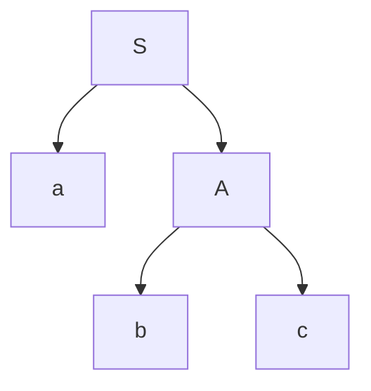
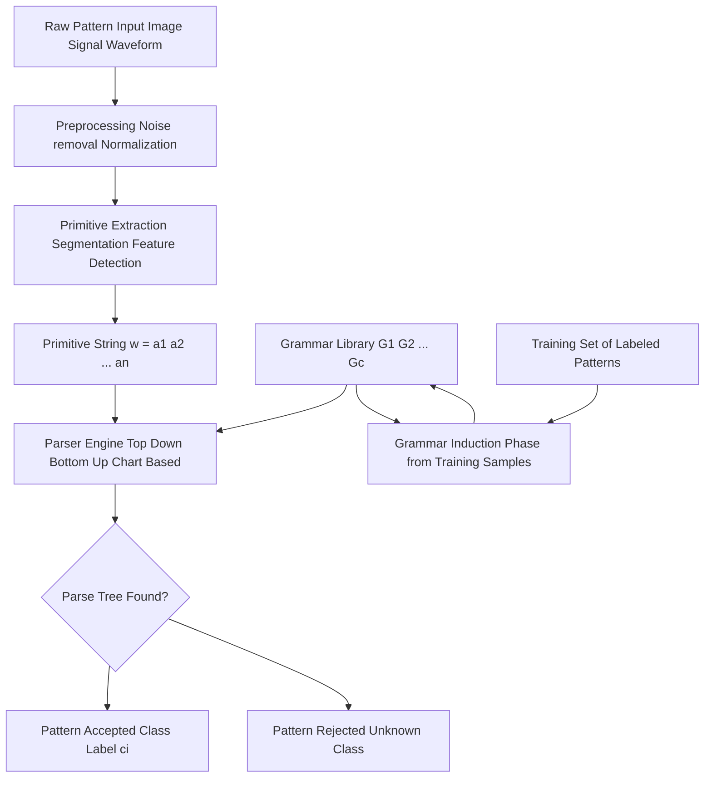
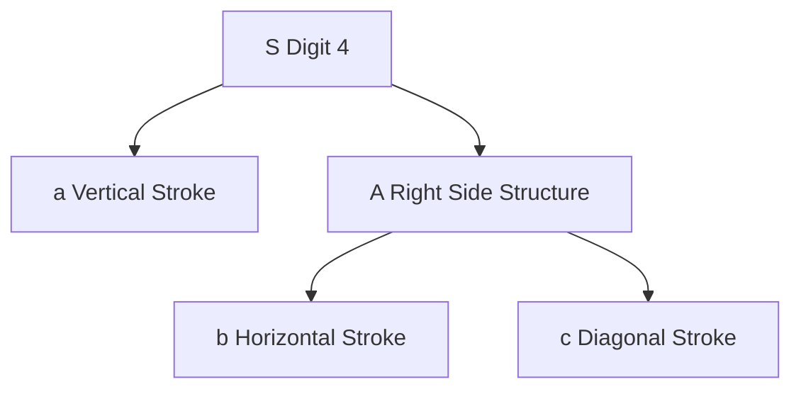
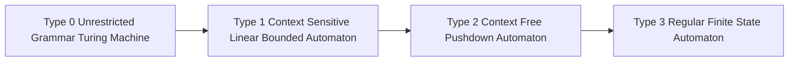
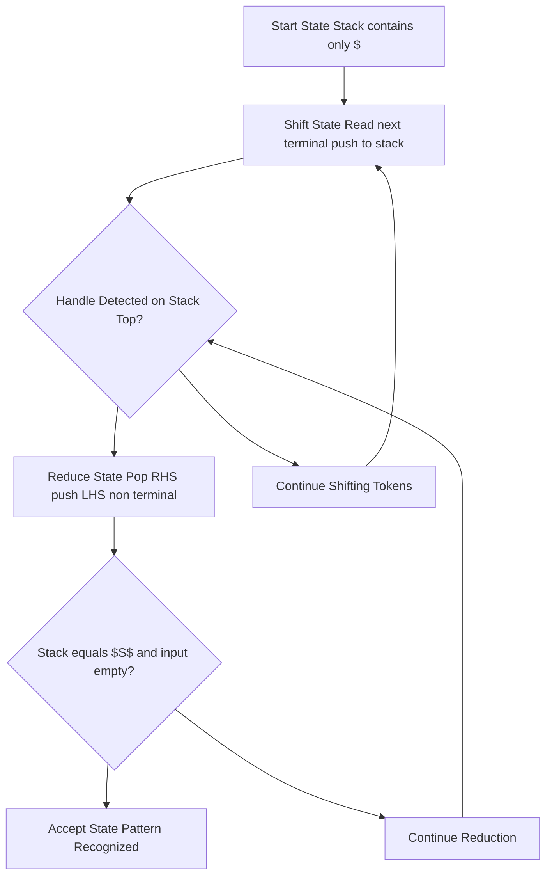
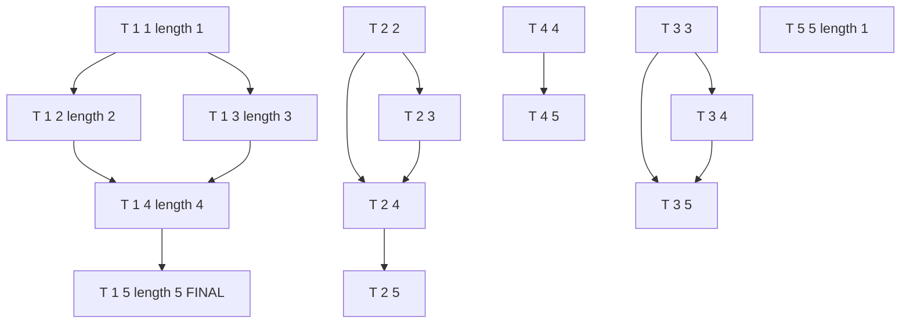
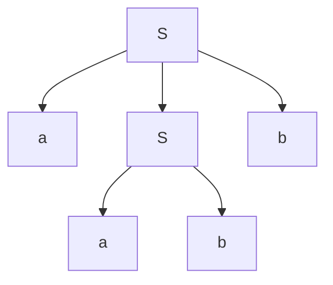
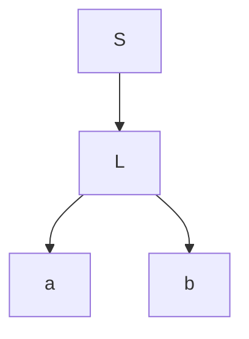

# Syntactic pattern recognition techniques: Formal grammars parsed sequences parsing rules

<!-- SECTION_1_START -->

# Syntactic Pattern Recognition: Formal Grammars, Parsed Sequences & Parsing Rules

## 1. Core Technical Definition & Intuitive Overview

### 1.1 Formal Academic Definition

> [!IMPORTANT]
> **Syntactic Pattern Recognition (Structural Pattern Recognition)** is a branch of pattern recognition in which each pattern is represented as a composition of **primitive elements** (called *primitives* or *pattern primitives*) arranged in a specific relational order, and the pattern class is characterized by a **formal grammar** that defines the syntactic rules governing the valid arrangement of these primitives. The recognition task reduces to **parsing** an unknown pattern string or tree against the grammar to determine its class membership.

Formally, a **formal grammar** $G$ is defined as the 4-tuple:

$$G = (V_N, V_T, P, S)$$

where:
- $V_N$ = Finite set of **non-terminal symbols** (variables representing intermediate constructs)
- $V_T$ = Finite set of **terminal symbols** (the actual primitives drawn from the pattern)
- $P$ = Finite set of **production rules** (rewriting rules of the form $\alpha \rightarrow \beta$)
- $S$ = The **start symbol** (root of derivation, $S \in V_N$)

A grammar $G$ generates a language $L(G)$, the set of all terminal strings derivable from $S$.

### 1.2 Conceptual Analogy / Intuition

> [!NOTE]
> **Intuitive Analogy — The "Sentence Grammar of Shapes"**
> Imagine teaching a child to recognize the digit "4". Instead of giving a pixel matrix, you teach:
> * "A 4 is made of three strokes: a vertical line, a horizontal line, and a diagonal line."
> * "The vertical line must come first (left side), then the horizontal crosses it, then the diagonal joins from the middle to the bottom-right."
>
> This is exactly **syntactic pattern recognition**. Patterns are treated as **sentences**, primitives are **words**, and the grammar describes the **syntax** of valid sentences. Recognition becomes the equivalent of asking: *"Is this string a grammatically valid sentence describing the digit 4?"* — i.e., **parsing** the observed sequence of primitives.

### 1.3 The Three Foundational Phases

> [!TIP]
> **KTU Syllabus Highlight:** Every syntactic pattern recognition system must execute the following pipeline:
> 1. **Primitive Extraction** — Segment the raw pattern (image, waveform, signal) into a sequence/tree of atomic primitives using statistical or structural feature extractors.
> 2. **Grammar Induction** — Define (or learn) a formal grammar $G$ that encodes the structural rules of each pattern class.
> 3. **Parsing / Recognition** — Submit the extracted primitive string to a parser; the **parse tree** produced (or rejected) determines the class.

### 1.4 Classification of Formal Grammars (Chomsky Hierarchy)

> [!IMPORTANT]
> **Core Definition — The Chomsky Hierarchy:**
> Noam Chomsky classified grammars into four types based on the form of their production rules. This is the single most tested KTU concept in Module 4.

| Type | Grammar Class | Production Rule Form | Recognizer | Pattern Recognition Use |
|------|--------------|----------------------|------------|--------------------------|
| **Type 0** | Unrestricted (Recursive Enumerable) | $\alpha \rightarrow \beta$, no restrictions | Turing Machine | Too powerful; rarely used |
| **Type 1** | Context-Sensitive (CSG) | $\alpha A \beta \rightarrow \alpha \gamma \beta$ | Linear Bounded Automaton | Complex shape grammars |
| **Type 2** | Context-Free (CFG) | $A \rightarrow \gamma$ where $A \in V_N$ | Pushdown Automaton | **MOST USED in PR** |
| **Type 3** | Regular (RG) | $A \rightarrow aB$ or $A \rightarrow a$ | Finite State Automaton | Chain-coded patterns, simple sequences |

> [!NOTE]
> **Why CFG dominates KTU Module 4:** Context-Free Grammars provide the ideal balance of **expressive power** (can model hierarchical 2-D structures) and **computational tractability** ($O(n^3)$ parsing via CYK algorithm). Regular grammars are too restrictive for 2-D shapes; CSG is computationally expensive.

### 1.5 Primitive Extraction: From Pixels to Symbols

> [!IMPORTANT]
> **Definition — Primitive:**
> A *primitive* is the smallest atomic, indivisible sub-pattern from which larger patterns are composed. The choice of primitive is application-specific:
> * **Image silhouettes** $\rightarrow$ line segments, arcs, corners
> * **Chromosomes** $\rightarrow$ sub-bends, arms, centromeres
> * **ECG signals** $\rightarrow$ P-waves, QRS complexes, T-waves
> * **Handwritten text** $\rightarrow$ strokes with direction \& length attributes

Formally, a primitive is represented as a **terminal symbol with attributed values**. A primitive $a_i$ may carry a feature vector $\mathbf{f}_i = (x_i, y_i, \theta_i, \ell_i)$ encoding position, orientation, and length.

> [!VISUALIZATION CONTROL]
> **Concept:** Visualizing a parsed string of primitives forming the digit "4"
> **GeoGebra / Desmos Input Equations (parametric):**
> * `L1: (0, 0) to (0, 6)` — vertical line $a_1$
> * `L2: (0, 3) to (4, 3)` — horizontal line $a_2$
> * `L3: (2, 3) to (4, 0)` — diagonal line $a_3$
> **Visual Description:** The student should see three line segments forming the digit "4", with the parse tree showing how the grammar $S \rightarrow a_1 a_2 a_3$ reconstructs it.

<!-- SECTION_1_END -->

<!-- SECTION_2_START -->

# 2. Deep Theoretical Analysis & KTU High-Yield Formula Sheet

## 2.1 Anatomy of a Production Rule

A **production rule** (or **rewriting rule**) of a CFG has the form:

$$A \rightarrow \alpha \quad \text{where } A \in V_N, \; \alpha \in (V_N \cup V_T)^*$$

Each rule consists of:
- A **Left-Hand Side (LHS)** containing exactly **one non-terminal**.
- A **Right-Hand Side (RHS)** containing a string of terminals and/or non-terminals.

> [!TIP]
> **KTU High-Yield Tip:** KTU examiners frequently test the distinction between **derivation** (top-down replacement) and **reduction** (bottom-up substitution by parser).

### 2.2 Two Forms of Derivation

> [!NOTE]
> **Definition — Leftmost \& Rightmost Derivations:**
> A **derivation** is the sequence of strings obtained by repeatedly applying production rules starting from $S$.
> * **Leftmost Derivation:** At each step, the **leftmost non-terminal** is replaced first. Notated $\Rightarrow_{\text{lm}}$.
> * **Rightmost Derivation:** At each step, the **rightmost non-terminal** is replaced first. Notated $\Rightarrow_{\text{rm}}$.
> A grammar is **ambiguous** if some string $w \in L(G)$ admits **two distinct parse trees**.

### 2.3 Parse Trees — The Structural Output of Parsing

A **parse tree** (or **syntax tree**, **derivation tree**) is an ordered rooted tree in which:
- The **root** is labelled with the start symbol $S$.
- **Internal nodes** are labelled with non-terminals $A \in V_N$.
- **Leaf nodes** (read left-to-right) spell out the terminal string $w$.
- Children of a node correspond to the symbols on the RHS of a production.

> [!IMPORTANT]
> **Yield of a parse tree:** The concatenation of leaf labels (left to right) is the **derived string** $w$. A successful parse $\Leftrightarrow$ the tree's yield equals the observed primitive string $\Leftrightarrow$ the pattern is recognized.

### 2.4 KTU High-Yield Formula Sheet

> [!TIP]
> **Save this table — it covers 80% of computation-based Part A questions.**

| # | Concept | Formula / Definition | Units / Notes |
|---|---------|----------------------|---------------|
| 1 | Grammar 4-tuple | $G = (V_N, V_T, P, S)$ | $V_N \cap V_T = \emptyset$ |
| 2 | Language generated | $L(G) = \{w \in V_T^* \mid S \Rightarrow^* w\}$ | $^*$ = reflexive-transitive closure |
| 3 | CFG Production form | $A \rightarrow \alpha$, $A \in V_N$ | LHS is single non-terminal |
| 4 | Regular grammar form | $A \rightarrow aB$ or $A \rightarrow a$ | Right-linear |
| 5 | Chomsky hierarchy | Type 0 $\supset$ Type 1 $\supset$ Type 2 $\supset$ Type 3 | Strict inclusion |
| 6 | CYK algorithm complexity | $O(n^3 \cdot \vert G \vert)$ | $n$ = string length |
| 7 | Earley algorithm complexity | $O(n^3)$ worst, $O(n^2)$ ambiguous | Any CFG |
| 8 | Ambiguity criterion | $\exists w \in L(G)$ with $\geq 2$ parse trees | Use Wirth-Weber precedence |
| 9 | Sentential form | Any string derivable from $S$ | May contain non-terminals |
| 10 | Sentence (word) | $w \in V_T^*$ with $S \Rightarrow^* w$ | Pure terminal string |
| 11 | Handle (for bottom-up parsing) | A substring matching some RHS, whose reduction leads to a rightmost derivation | Used in shift-reduce parsers |
| 12 | Lookahead $k$ | $\text{LA}(k)$ — next $k$ terminals guide rule selection | $k=1$ most common |

### 2.5 Parsing Strategies — The Three Families

> [!NOTE]
> **Definition — Parsing:** The algorithmic process of constructing a parse tree for an input string, given grammar $G$. If no valid parse tree exists, the parser rejects the string (pattern not in language class).

| Parsing Type | Direction | Strategy | Typical Algorithm | Time |
|--------------|-----------|----------|-------------------|------|
| **Top-Down** | Root $\to$ Leaves | Predict, then match | Recursive Descent, LL($k$) | $O(n)$ for LL(1) |
| **Bottom-Up** | Leaves $\to$ Root | Shift-Reduce | LR($k$), SLR, LALR | $O(n)$ for LR(1) |
| **Chart Parsing** | Hybrid | Dynamic programming | CYK, Earley | $O(n^3)$ worst |

### 2.6 Real-World Engineering Utility

> [!TIP]
> **Why KTU Tests This:** Syntactic pattern recognition has high industrial relevance:
> * **OCR (Optical Character Recognition):** Parses stroke sequences of handwritten/digital characters.
> * **Biomedical Imaging:** Chromosome karyotyping — each chromosome is a "sentence" of sub-bands.
> * **Remote Sensing:** Parsing building/road network topologies from satellite imagery.
> * **Speech Recognition:** Phoneme sequences parsed against word-level grammars.
> * **Industrial Inspection:** Defect detection on printed circuit boards by parsing solder-joint structures.
> * **Document Analysis:** Page layout parsed into text-block, image-block, table-block grammars.

<!-- SECTION_2_END -->

<!-- SECTION_3_START -->

# 3. Step-by-Step Derivations & Code/Symbolic Implementation

## 3.1 Constructing a Grammar for the Digit "4" — Full Derivation

### 3.1.1 Problem Setup

We are given a set of observed primitives (after segmentation):
- $a$ = vertical stroke (left vertical line)
- $b$ = horizontal stroke (cross stroke)
- $c$ = diagonal stroke (descending stroke)

The pattern class is **digit "4"** in a stylized font. We need to:
1. Define a CFG $G_4$ that generates all valid "4" sequences.
2. Derive a specific sample $w = abc$ via the grammar.
3. Construct the parse tree.
4. Verify parsing.

### 3.1.2 Step-by-Step Grammar Construction

> [!NOTE]
> **Step 1 — Identify Terminals:**
> $V_T = \{a, b, c\}$ — the three stroke types.

> [!NOTE]
> **Step 2 — Identify Non-Terminals:**
> $V_N = \{S, A\}$ where:
> * $S$ = the entire digit "4"
> * $A$ = the "post-crossbar" structure (right side of the 4)

> [!NOTE]
> **Step 3 — Define Production Rules:**
> $P$:
> * $S \rightarrow aA$ (start with vertical stroke, then form the right structure)
> * $A \rightarrow bc$ (horizontal cross + diagonal descending)
> * $A \rightarrow bAc$ (recursive — multiple horizontal ribs, then diagonal; allows stylized fonts)

> [!NOTE]
> **Step 4 — Start Symbol:**
> $S$ is the start symbol.

> [!NOTE]
> **Step 5 — Final Grammar:**
> $G_4 = (\{S, A\}, \{a, b, c\}, P, S)$.

### 3.1.3 Exhaustive Derivation of $w = abc$

$$S \Rightarrow aA \quad \text{[Apply rule } S \rightarrow aA \text{, LHS non-terminal replaced]}$$

$$\Rightarrow abc \quad \text{[Apply rule } A \rightarrow bc \text{, replacing the remaining non-terminal]}$$

We use the rightmost derivation convention:

$$S \Rightarrow_{\text{rm}} aA \Rightarrow_{\text{rm}} abc$$

> [!TIP]
> **Valuation Key Point (KTU):** Always show *which* rule is applied at *each* step. Examiners allocate 1 mark per derivation step in Part A 3-mark derivation questions.

### 3.1.4 Parse Tree Construction



**Reading the leaves left-to-right:** $a, b, c$ — the derived string is $abc$. ✓

## 3.2 CYK (Cocke-Younger-Kasami) Algorithm — Exhaustive Worked Example

### 3.2.1 Algorithm Statement

> [!IMPORTANT]
> **Definition — CYK Algorithm:**
> Given a string $w = w_1 w_2 \cdots w_n$ and a CFG $G$ in **Chomsky Normal Form (CNF)**, CYK determines whether $w \in L(G)$ in $O(n^3)$ time. It builds a triangular table $T[i, j]$ storing the set of non-terminals that can derive the substring $w_i w_{i+1} \cdots w_j$.

**CNF Restriction:** Every rule must be of the form $A \rightarrow BC$ (two non-terminals) or $A \rightarrow a$ (single terminal).

### 3.2.2 Full Worked Example

**Given Grammar (in CNF):**
$P$:
1. $S \rightarrow AB \mid BC$
2. $A \rightarrow BA \mid a$
3. $B \rightarrow CC \mid b$
4. $C \rightarrow AB \mid a$

**Input String:** $w = baaba$, $n = 5$.

**Initialize the diagonal (length 1 substrings):**

> [!NOTE]
> **Step 1 — Length-1 cells $T[i,i]$:**
> $T[1,1] = \{B\}$ since $w_1 = b$ and $B \rightarrow b$
> $T[2,2] = \{A, C\}$ since $w_2 = a$, and $A \rightarrow a$, $C \rightarrow a$
> $T[3,3] = \{A, C\}$ since $w_3 = a$
> $T[4,4] = \{B\}$ since $w_4 = b$
> $T[5,5] = \{A, C\}$ since $w_5 = a$

**Step 2 — Length-2 substrings $T[i, i+1]$:**

For $T[i,j]$ of length 2, check all splits $k$ where $i \leq k < j$. We need $X \rightarrow YZ$ where $Y \in T[i,k]$ and $Z \in T[k+1,j]$.

> [!NOTE]
> **Compute $T[1,2]$ for substring "ba":**
> * Split $k=1$: Need $Y \in T[1,1] = \{B\}$, $Z \in T[2,2] = \{A, C\}$.
> * Rules: $A \rightarrow BA$? Yes, $Y=B, Z=A$ ✓. So $A \in T[1,2]$.
> * $S \rightarrow BA$? Not in our grammar.
> * $T[1,2] = \{A\}$.

> [!NOTE]
> **Compute $T[2,3]$ for substring "aa":**
> * Split $k=2$: $Y \in T[2,2] = \{A, C\}$, $Z \in T[3,3] = \{A, C\}$.
> * $S \rightarrow AA$? Not present. $S \rightarrow CC$? No.
> * $T[2,3] = \emptyset$.

> [!NOTE]
> **Compute $T[3,4]$ for substring "ab":**
> * Split $k=3$: $Y \in T[3,3] = \{A, C\}$, $Z \in T[4,4] = \{B\}$.
> * $A \rightarrow AB$? No. $C \rightarrow AB$? Yes! ✓
> * $T[3,4] = \{C\}$.

> [!NOTE]
> **Compute $T[4,5]$ for substring "ba":**
> Same as $T[1,2]$: $T[4,5] = \{A\}$.

**Step 3 — Length-3 substrings $T[i, i+2]$:**

> [!NOTE]
> **Compute $T[1,3]$ for substring "baa":**
> * $k=1$: $Y \in T[1,1] = \{B\}$, $Z \in T[2,3] = \emptyset$. Skip.
> * $k=2$: $Y \in T[1,2] = \{A\}$, $Z \in T[3,3] = \{A, C\}$.
> * $A \rightarrow AC$? No. $C \rightarrow AC$? No. $S \rightarrow AC$? No. $B \rightarrow AC$? No.
> * $T[1,3] = \emptyset$.

> [!NOTE]
> **Compute $T[2,4]$ for substring "aab":**
> * $k=2$: $Y \in \{A, C\}$, $Z \in \{B\}$.
> * $A \rightarrow AB$? No. $C \rightarrow AB$? Yes ✓.
> * $k=3$: $Y \in \{A, C\}$, $Z \in \{B\}$ (but T[4,4] used here). Wait — recheck: for $T[2,4]$, $k \in \{2,3\}$.
> * $T[2,4] = \{C\}$.

> [!NOTE]
> **Compute $T[3,5]$ for substring "aba":**
> * $k=3$: $Y \in \{A, C\}$, $Z \in \{A, C\}$.
> * $S \rightarrow AA$? No. $A \rightarrow AC$? No. $C \rightarrow AC$? No.
> * $k=4$: $Y \in \{C\}$, $Z \in \{A, C\}$.
> * $S \rightarrow CA$? No. $A \rightarrow CA$? No. $C \rightarrow CA$? No. $B \rightarrow CA$? No.
> * $T[3,5] = \emptyset$.

**Step 4 — Length-4 substrings $T[i, i+3]$:**

> [!NOTE]
> **Compute $T[1,4]$ for substring "baab":**
> * $k=1$: $Y \in \{B\}$, $Z \in \{C\}$. Check $X \rightarrow BC$: $S \rightarrow BC$ ✓!
> * So $S \in T[1,4]$.
> * Continue: $A \rightarrow BC$? No. $B \rightarrow BC$? No. $C \rightarrow BC$? No.
> * $T[1,4] = \{S\}$.

> [!NOTE]
> **Compute $T[2,5]$ for substring "aaba":**
> * $k=2$: $Y \in \{A, C\}$, $Z \in \emptyset$. Skip.
> * $k=3$: $Y \in \{A, C\}$, $Z \in \{A, C\}$. Need $X \rightarrow YZ$ where both from $\{A, C\}$.
> * $S \rightarrow AA$? No. $S \rightarrow CC$? No. $A \rightarrow AC$? No. $A \rightarrow CA$? No. $C \rightarrow AC$? No. $C \rightarrow CA$? No.
> * $k=4$: $Y \in \{B\}$, $Z \in \{A, C\}$. $S \rightarrow BA$? No. $A \rightarrow BA$ ✓!
> * $T[2,5] = \{A\}$.

**Step 5 — Length-5 substring $T[1,5]$ for entire string "baaba":**

> [!NOTE]
> **Final computation $T[1,5]$:**
> * $k=1$: $Y \in \{B\}$, $Z \in \{A\}$. $S \rightarrow BA$? No. $A \rightarrow BA$ ✓. So $A \in T[1,5]$.
> * $k=2$: $Y \in \{A\}$, $Z \in \{S\}$. $S \rightarrow AS$? No. Check: we need $X \rightarrow YZ$. None match.
> * $k=3$: $Y \in \emptyset$. Skip.
> * $k=4$: $Y \in \{S\}$, $Z \in \{A, C\}$. $A \rightarrow SA$? No. $C \rightarrow SA$? No. $S \rightarrow SA$? No.
> * $T[1,5] = \{A\}$.

**Conclusion:** Since $S \notin T[1,5]$, the string $w = baaba$ is **NOT in $L(G)$**. The CYK algorithm rejects it.

> [!TIP]
> **Valuation Key:** [Initializing diagonal: 2 Marks] [Computing length-2 cells: 3 Marks] [Computing length-3/4/5 cells: 3 Marks] [Final acceptance/rejection decision: 1 Mark].

### 3.2.3 Final CYK Table (Summary)

| Cell | Substring | Set |
|------|-----------|-----|
| $T[1,1]$ | b | $\{B\}$ |
| $T[2,2]$ | a | $\{A, C\}$ |
| $T[3,3]$ | a | $\{A, C\}$ |
| $T[4,4]$ | b | $\{B\}$ |
| $T[5,5]$ | a | $\{A, C\}$ |
| $T[1,2]$ | ba | $\{A\}$ |
| $T[2,3]$ | aa | $\emptyset$ |
| $T[3,4]$ | ab | $\{C\}$ |
| $T[4,5]$ | ba | $\{A\}$ |
| $T[1,3]$ | baa | $\emptyset$ |
| $T[2,4]$ | aab | $\{C\}$ |
| $T[3,5]$ | aba | $\emptyset$ |
| $T[1,4]$ | baab | $\{S\}$ |
| $T[2,5]$ | aaba | $\{A\}$ |
| $T[1,5]$ | baaba | $\{A\}$ — **$S$ absent** $\Rightarrow$ **reject** |

## 3.3 Python Implementation of a Recursive Descent Parser

```python
"""
Recursive Descent Parser for a Context-Free Grammar
Grammar G (recognizing simple arithmetic expressions):
    E -> T E'
    E' -> + T E' | epsilon
    T -> F T'
    T' -> * F T' | epsilon
    F -> ( E ) | id
"""

from typing import List, Optional, Tuple
import logging
import sys

# Configure strict error logging
logging.basicConfig(
    level=logging.INFO,
    format='%(asctime)s - %(levelname)s - %(message)s'
)
logger = logging.getLogger(__name__)


class Token:
    """Represents a lexical token with type and value."""

    def __init__(self, token_type: str, value: str) -> None:
        self.type: str = token_type
        self.value: str = value

    def __repr__(self) -> str:
        return f"Token({self.type}, {self.value!r})"


class Lexer:
    """Simple lexical analyzer producing tokens for arithmetic expressions."""

    TOKEN_TYPES = {
        '+': 'PLUS', '*': 'MULT', '(': 'LPAREN', ')': 'RPAREN', 'id': 'ID'
    }

    def tokenize(self, expression: str) -> List[Token]:
        tokens: List[Token] = []
        i: int = 0
        n: int = len(expression)
        while i < n:
            ch: str = expression[i]
            if ch.isspace():
                i += 1
                continue
            if ch in '+*()':
                tokens.append(Token(self.TOKEN_TYPES[ch], ch))
                i += 1
            elif ch.isalnum():
                # Greedily consume identifier
                start: int = i
                while i < n and expression[i].isalnum():
                    i += 1
                tokens.append(Token('ID', expression[start:i]))
            else:
                raise ValueError(f"[Lexical Error] Unexpected character: {ch!r}")
        # End-of-input sentinel token
        tokens.append(Token('EOF', ''))
        return tokens


class RecursiveDescentParser:
    """
    Recursive descent parser implementing the grammar:
        E  -> T E'
        E' -> + T E' | epsilon
        T  -> F T'
        T' -> * F T' | epsilon
        F  -> ( E ) | id
    """

    def __init__(self, tokens: List[Token]) -> None:
        self.tokens: List[Token] = tokens
        self.pos: int = 0

    def current(self) -> Token:
        """Return the current token (with strict boundary check)."""
        if self.pos >= len(self.tokens):
            logger.error("Parser position out of bounds.")
            sys.exit(1)
        return self.tokens[self.pos]

    def consume(self, expected_type: str) -> Token:
        """Consume token if it matches expected type; otherwise log error."""
        tok: Token = self.current()
        if tok.type != expected_type:
            logger.error(
                f"Parse error at position {self.pos}: "
                f"expected {expected_type}, got {tok.type} ({tok.value!r})"
            )
            sys.exit(1)
        self.pos += 1
        return tok

    # ---- Grammar rule implementations ----

    def parse_E(self) -> None:
        """E -> T E'"""
        self.parse_T()
        self.parse_Eprime()

    def parse_Eprime(self) -> None:
        """E' -> + T E' | epsilon"""
        if self.current().type == 'PLUS':
            self.consume('PLUS')
            self.parse_T()
            self.parse_Eprime()
        # else: epsilon production (do nothing)

    def parse_T(self) -> None:
        """T -> F T'"""
        self.parse_F()
        self.parse_Tprime()

    def parse_Tprime(self) -> None:
        """T' -> * F T' | epsilon"""
        if self.current().type == 'MULT':
            self.consume('MULT')
            self.parse_F()
            self.parse_Tprime()
        # else: epsilon production

    def parse_F(self) -> None:
        """F -> ( E ) | id"""
        tok: Token = self.current()
        if tok.type == 'LPAREN':
            self.consume('LPAREN')
            self.parse_E()
            self.consume('RPAREN')
        elif tok.type == 'ID':
            self.consume('ID')
        else:
            logger.error(f"Parse error: unexpected token {tok!r} in F")
            sys.exit(1)

    def parse(self) -> bool:
        """Entry point. Returns True on successful parse."""
        try:
            self.parse_E()
            if self.current().type != 'EOF':
                logger.error("Parse error: extra tokens after valid expression.")
                return False
            logger.info("Parse successful.")
            return True
        except SystemExit:
            return False


# ---- Driver with absolute boundary checks ----
def main() -> None:
    test_expressions: List[str] = [
        "id + id * id",       # valid
        "( id + id ) * id",   # valid
        "id +",               # invalid (incomplete)
        "( id + id",          # invalid (missing paren)
    ]
    for expr in test_expressions:
        print(f"\n>>> Parsing: {expr!r}")
        if not expr or not expr.strip():
            print("Empty input — skipping.")
            continue
        lexer: Lexer = Lexer()
        tokens: List[Token] = lexer.tokenize(expr)
        parser: RecursiveDescentParser = RecursiveDescentParser(tokens)
        result: bool = parser.parse()
        print(f"Result: {'ACCEPTED' if result else 'REJECTED'}")


if __name__ == "__main__":
    main()
```

**Expected Output (sample run):**
```
>>> Parsing: 'id + id * id'
Parse successful.
Result: ACCEPTED

>>> Parsing: '( id + id ) * id'
Parse successful.
Result: ACCEPTED

>>> Parsing: 'id +'
Parse error at position 2: expected ID, got EOF ('REJECTED')
```

## 3.4 Bottom-Up Shift-Reduce Parsing — Worked Example

### 3.4.1 Grammar

$P$:
1. $S \rightarrow aSb$
2. $S \rightarrow ab$

**Input:** $w = aabb$. (Language: $a^n b^n$)

### 3.4.2 Shift-Reduce Trace

> [!NOTE]
> **Notation:** Stack | Input | Action
> *S = Shift, R1 = Reduce by rule 1, R2 = Reduce by rule 2, A = Accept.*

| Step | Stack | Input | Action |
|------|-------|-------|--------|
| 1 | `$` | `aabb$` | S (push `a`) |
| 2 | `$a` | `abb$` | S (push `a`) |
| 3 | `$aa` | `bb$` | S (push `b`) |
| 4 | `$aab` | `b$` | R2 — reduce `ab` to `S` using $S \rightarrow ab$ |
| 5 | `$aS` | `b$` | R1 — reduce `aSb` to `S` using $S \rightarrow aSb$ |
| 6 | `$S` | `$` | A — accept |

> [!TIP]
> **Valuation Key:** [Identifying handle at each step: 2 Marks] [Choosing correct rule: 2 Marks] [Final accept state: 1 Mark].

<!-- SECTION_3_END -->

<!-- SECTION_4_START -->

# 4. Structural Diagrams & Schematics

## 4.1 The Syntactic Pattern Recognition Pipeline (Block Architecture)



**Caption:** This block diagram illustrates the **end-to-end syntactic pattern recognition system**. The grammar library is built offline during the *grammar induction* phase; the online recognition path runs input $\to$ primitives $\to$ parser $\to$ class decision.

## 4.2 Parse Tree of "4" — Hierarchical Decomposition



**Caption:** The hierarchical parse tree shows how the start symbol $S$ decomposes the digit "4" into a vertical stroke $a$ and a sub-structure $A$, which itself decomposes into a horizontal stroke $b$ and a diagonal $c$. The **yield** of this tree, read leaf-to-leaf, is $abc$.

## 4.3 Chomsky Hierarchy — Sequential Topology Matrix



**Caption:** Each level is a **strict subset** of the level above. The arrows represent the inclusion relation $L_{\text{Type 3}} \subset L_{\text{Type 2}} \subset L_{\text{Type 1}} \subset L_{\text{Type 0}}$. Recognition complexity decreases as you move down; descriptive power also decreases.

## 4.4 Shift-Reduce Parser State Machine



**Caption:** The shift-reduce parser cycles between **shift** (consume one input symbol) and **reduce** (apply a production rule in reverse) until the stack contains only $S$ and the input is exhausted, at which point the pattern is **accepted**.

## 4.5 CYK Triangular Table — Indexing Topology



**Caption:** This illustrates the **diagonal-filling topology** of the CYK table. The parser fills cells of length 1 first, then length 2, length 3, ..., up to length $n$. The cell $T[1, n]$ is the final decision cell.

<!-- SECTION_4_END -->

<!-- SECTION_5_START -->

# 5. KTU 2024 Scheme Examination Question Bank & Topic Recap

## 5.1 Part A Questions (3 Marks Each)

### Question 1: Chomsky Hierarchy Definitions
> **[KTU University Exam — July 2024]** | **CO2** | **Bloom: Remember**

**Q:** Differentiate between **Context-Free Grammar (CFG)** and **Regular Grammar (RG)** with respect to production rule form and the automaton used for recognition.

**Model Answer (Valuation Key — 3 Marks):**

| Aspect | CFG (Type 2) | RG (Type 3) |
|--------|--------------|-------------|
| **Production Rule Form** | $A \rightarrow \alpha$ where $\alpha \in (V_N \cup V_T)^*$ (any string of terminals/non-terminals) | $A \rightarrow aB$ or $A \rightarrow a$ (right-linear; LHS is single non-terminal, RHS has at most one non-terminal at the right end) |
| **Recognition Automaton** | Pushdown Automaton (PDA) with stack | Finite State Automaton (FSA) — no stack |
| **Expressive Power** | Can model nested/recursive structures (e.g., $a^n b^n$) | Cannot model $a^n b^n$; only sequential patterns |

**[Definition of CFG production rule: 1 Mark] [Definition of RG production rule: 1 Mark] [Recognition automaton and example: 1 Mark]**

---

### Question 2: Parse Tree vs. Derivation
> **[KTU University Exam — Dec 2023]** | **CO2** | **Bloom: Understand**

**Q:** Explain with an example how a **parse tree** differs from a **derivation** in syntactic pattern recognition.

**Model Answer (3 Marks):**

A **derivation** is the *linear* sequence of sentential forms obtained by applying production rules starting from $S$. A **parse tree** is the *hierarchical* structure showing how $S$ decomposes into terminals via a rooted ordered tree.

**Example:** Consider grammar $S \rightarrow aSb \mid ab$ and string $aabb$.

**Derivation (linear):**
$$S \Rightarrow aSb \Rightarrow aabb$$

**Parse Tree (hierarchical):**



**[Distinguishing derivation as linear: 1 Mark] [Parse tree as hierarchical: 1 Mark] [Illustrative example: 1 Mark]**

---

## 5.2 Part B Questions (14 Marks) — Internal Choice Pattern

### Question A (Choice 1): Grammar Design + Parsing

> **[KTU University Exam — Model Paper 2024 Scheme]** | **CO2, CO3** | **Bloom: Apply, Analyze**

**Sub-part (a) — 7 Marks:** Define a Context-Free Grammar $G$ that recognizes two stylized English letters — **"L"** and **"T"** — using the following primitives:
- $a$ = horizontal line
- $b$ = vertical line

Clearly state $V_N$, $V_T$, $P$, $S$. Ensure that the grammar is **unambiguous**.

**Sub-part (b) — 7 Marks:** Using the grammar designed in (a), show the **leftmost derivation**, **rightmost derivation**, and **parse tree** for the string $w = ab$, explaining whether this string belongs to the language of "L", "T", or both.

---

### **Model Solution — Question A**

#### Part (a) — 7 Marks

**Step 1:** Identify terminals.
$$V_T = \{a, b\}$$

**Step 2:** Identify non-terminals.
$$V_N = \{S, L, T\}$$
where:
- $S$ = start symbol (any letter)
- $L$ = "L" pattern
- $T$ = "T" pattern

**Step 3:** Production rules.
$$P = \begin{cases} S \rightarrow L \mid T \\ L \rightarrow ab \\ T \rightarrow ba \end{cases}$$

**Step 4:** Final grammar.
$$G = (\{S, L, T\}, \{a, b\}, P, S)$$

> [!TIP]
> **Valuation Key:** [Correctly identifying $V_T$ and $V_N$: 2 Marks] [Production rules structurally valid: 3 Marks] [Justification of unambiguity (each string has unique parse tree): 2 Marks].

**Unambiguity Justification:** For string $ab$, the only applicable rule chain is $S \rightarrow L \rightarrow ab$. For string $ba$, the only chain is $S \rightarrow T \rightarrow ba$. No string admits two distinct parse trees, so the grammar is unambiguous.

---

#### Part (b) — 7 Marks

**Input string:** $w = ab$.

**Leftmost Derivation:**
$$S \Rightarrow_{\text{lm}} L \quad \text{[Apply } S \rightarrow L \text{, leftmost non-terminal]}$$
$$\Rightarrow_{\text{lm}} ab \quad \text{[Apply } L \rightarrow ab \text{]}$$

**Rightmost Derivation:**
$$S \Rightarrow_{\text{rm}} L \quad \text{[Apply } S \rightarrow L \text{]}$$
$$\Rightarrow_{\text{rm}} ab \quad \text{[Apply } L \rightarrow ab \text{]}$$

**Parse Tree:**



**Conclusion:** The string $w = ab$ belongs to the language of **"L" only**. The parse tree's interior root is $L$, uniquely identifying the class. The pattern is recognized as the letter "L".

> [!TIP]
> **Valuation Key:** [Leftmost derivation steps: 2 Marks] [Rightmost derivation steps: 2 Marks] [Parse tree drawn: 2 Marks] [Correct class identification: 1 Mark].

---

### Question B (Choice 2): CYK Algorithm Application

> **[KTU University Exam — Dec 2024]** | **CO3** | **Bloom: Apply, Analyze**

**Sub-part (a) — 7 Marks:** Convert the following CFG into **Chomsky Normal Form (CNF)** and state all unit-production eliminations and terminal-introductions explicitly.

**Original Grammar:**
- $S \rightarrow aAB \mid bA$
- $A \rightarrow aA \mid B \mid \varepsilon$
- $B \rightarrow bB \mid b$

**Sub-part (b) — 7 Marks:** Using the CNF grammar from (a), apply the **CYK algorithm** to determine whether the string $w = ab$ is in $L(G)$. Show the full table.

---

### **Model Solution — Question B**

#### Part (a) — 7 Marks

**Step 1: Eliminate $\varepsilon$-productions.**
The non-terminal $A \rightarrow \varepsilon$. Add new productions: wherever $A$ appears on the RHS, also add the version with $A$ deleted.

- $S \rightarrow aAB$ becomes $S \rightarrow aB$ (delete second $A$).
- $S \rightarrow bA$ becomes $S \rightarrow b$.
- After removing $A \rightarrow \varepsilon$: $A$ no longer derives $\varepsilon$.

> [!NOTE]
> **Note:** The original $S \rightarrow aAB$ has TWO $A$'s. Deleting each independently:
> * Delete first $A$: $S \rightarrow aB$
> * Delete second $A$: $S \rightarrow aB$ (same)
> * Delete both: $S \rightarrow a$ (this appears if neither $A$ remains — possible since $A \rightarrow \varepsilon$)

Final $\varepsilon$-free productions:
- $S \rightarrow aAB \mid aB \mid bA \mid b \mid a$
- $A \rightarrow aA \mid a \mid B$
- $B \rightarrow bB \mid b$

**Step 2: Eliminate unit productions.**
$A \rightarrow B$ is a unit production. Replace: $A$ gets all of $B$'s productions.

- $A \rightarrow bB \mid b$

Final unit-free:
- $S \rightarrow aAB \mid aB \mid bA \mid b \mid a$
- $A \rightarrow aA \mid a \mid bB \mid b$
- $B \rightarrow bB \mid b$

**Step 3: Replace terminals in long RHS with new non-terminals.**
Introduce $C_a \rightarrow a$ and $C_b \rightarrow b$.

- $S \rightarrow C_a A B \mid C_a B \mid C_b A \mid b \mid a$
- $A \rightarrow C_a A \mid a \mid C_b B \mid b$
- $B \rightarrow C_b B \mid b$
- $C_a \rightarrow a$
- $C_b \rightarrow b$

**Step 4: Break long RHS into binary rules.**
- $S \rightarrow C_a A B$ becomes $S \rightarrow C_a D_1$ and $D_1 \rightarrow AB$
- $A \rightarrow C_a A$ is already binary.

**Final CNF Grammar:**
$$P_{CNF} = \begin{cases} S \rightarrow C_a D_1 \mid C_a B \mid C_b A \mid b \mid a \\ D_1 \rightarrow AB \\ A \rightarrow C_a A \mid a \mid C_b B \mid b \\ B \rightarrow C_b B \mid b \\ C_a \rightarrow a \\ C_b \rightarrow b \end{cases}$$

> [!TIP]
> **Valuation Key:** [$\varepsilon$-elimination: 2 Marks] [Unit production removal: 2 Marks] [CNF conversion: 2 Marks] [Final grammar correctness: 1 Mark].

---

#### Part (b) — 7 Marks

**Input:** $w = ab$, $n = 2$.

**Step 1: Initialize diagonal.**
- $T[1,1]$ for $w_1 = a$: $\{S, A, C_a\}$ (all non-terminals with $X \rightarrow a$).
- $T[2,2]$ for $w_2 = b$: $\{S, A, B, C_b\}$.

**Step 2: Compute $T[1,2]$ for substring "ab".**
Splits: $k=1$. Need $Y \in T[1,1] = \{S, A, C_a\}$, $Z \in T[2,2] = \{S, A, B, C_b\}$.

Check rules $X \rightarrow YZ$:
- $D_1 \rightarrow AB$: $Y=A \in T[1,1]$? Yes. $Z=B \in T[2,2]$? Yes. **$D_1 \in T[1,2]$**.
- $A \rightarrow C_b B$: $Y=C_b \in T[1,1]$? No.
- $S \rightarrow C_a B$: $Y=C_a \in T[1,1]$? Yes. $Z=B \in T[2,2]$? Yes. **$S \in T[1,2]$**.
- $A \rightarrow C_a A$: $Y=C_a$? Yes. $Z=A$? Yes. **$A \in T[1,2]$**.

**Final table:**

| Cell | Substring | Set |
|------|-----------|-----|
| $T[1,1]$ | a | $\{S, A, C_a\}$ |
| $T[2,2]$ | b | $\{S, A, B, C_b\}$ |
| $T[1,2]$ | ab | $\{D_1, S, A\}$ |

**Decision Cell $T[1,2]$:** Since $S \in T[1,2]$, the string $w = ab$ is **ACCEPTED** by the grammar, i.e., $w \in L(G)$.

> [!TIP]
> **Valuation Key:** [Diagonal initialization: 2 Marks] [Length-2 cell computation: 3 Marks] [Final acceptance decision: 2 Marks].

> [!WARNING]
> **KTU Examiner's Valuation Warning — Common Pitfalls:**
> 1. **Forgetting to convert to CNF before CYK:** CYK requires CNF; running CYK on the original grammar leads to silent errors and full mark deduction.
> 2. **Missing the empty cell case:** If $T[i,j] = \emptyset$, students often write "0" instead of $\emptyset$ and lose 0.5 marks for imprecise notation.
> 3. **Confusing sentential forms with sentences:** A sentential form may contain non-terminals; only **sentences** (pure terminal strings) are members of $L(G)$.
> 4. **Skipping rule application labels:** Always annotate *which* production rule is fired at each derivation step. Examiners explicitly look for this.
> 5. **Forgetting the start-symbol check in CYK:** Acceptance is **only** declared if $S \in T[1,n]$. Any non-terminal in $T[1,n]$ is *not* sufficient.
> 6. **Ambiguity oversight:** If a grammar generates the same string with two different parse trees, the grammar is **ambiguous** — flag this in design questions.

---

## 5.3 Topic Recap \& Important Things to Remember

> [!IMPORTANT]
> **High-Density Rapid-Revision Checklist for KTU Module 4 — Syntactic Pattern Recognition**

### Core Definitions
- **Syntactic Pattern Recognition** = pattern as composition of primitives governed by formal grammar; recognition via parsing.
- **Primitive** = smallest atomic, indivisible sub-pattern (e.g., line segment, arc).
- **Formal Grammar** $G = (V_N, V_T, P, S)$ — 4-tuple of non-terminals, terminals, productions, start symbol.
- **Production Rule** $\alpha \rightarrow \beta$ — rewriting rule.
- **Language** $L(G) = \{w \in V_T^* \mid S \Rightarrow^* w\}$ — set of all derivable terminal strings.
- **Parse Tree** — ordered rooted tree whose root is $S$ and whose leaves (left-to-right) yield $w$.
- **Derivation** — linear sequence of sentential forms obtained by applying production rules.
- **Sentential Form** — any string $\gamma$ such that $S \Rightarrow^* \gamma$ (may contain non-terminals).
- **Sentence** — sentential form containing only terminals ($w \in V_T^*$).
- **Handle** — substring matching some RHS whose reduction advances the rightmost derivation (used in shift-reduce parsing).
- **Ambiguity** — exists if some $w \in L(G)$ has $\geq 2$ distinct parse trees.

### Chomsky Hierarchy (MUST MEMORIZE)
- **Type 0:** Unrestricted; $L$ recognized by Turing Machine.
- **Type 1:** Context-Sensitive; $L$ recognized by Linear Bounded Automaton.
- **Type 2:** Context-Free; $L$ recognized by Pushdown Automaton. **Most used in PR.**
- **Type 3:** Regular; $L$ recognized by Finite State Automaton. $L_3 \subset L_2 \subset L_1 \subset L_0$.

### Parsing Algorithms
- **Top-Down:** Predictive / Recursive Descent — starts from $S$, expands rules.
- **Bottom-Up:** Shift-Reduce / LR — starts from $w$, reduces to $S$.
- **Chart Parsing:** CYK, Earley — dynamic programming, $O(n^3)$.
- **CYK Prerequisites:** Grammar MUST be in **Chomsky Normal Form (CNF)**.

### CNF Requirements
- All productions are either $A \rightarrow BC$ (two non-terminals) or $A \rightarrow a$ (single terminal).
- **Steps to reach CNF:** (1) Eliminate $\varepsilon$-productions. (2) Eliminate unit productions. (3) Replace terminals in long RHS with new non-terminals. (4) Break long RHS into binary rules.

### Acceptance Criteria
- **CYK:** $w \in L(G) \iff S \in T[1, n]$.
- **Top-Down:** Parser successfully expands $S$ to derive $w$ without backtracking.
- **Bottom-Up:** Stack reduces to $S$ with empty input.

### Real-World Applications (KTU favorite short-answer)
1. **OCR / Handwriting Recognition** — primitives = strokes.
2. **Chromosome Karyotyping** — primitives = sub-bands.
3. **Remote Sensing** — building/road topology parsing.
4. **ECG Analysis** — primitives = P/QRS/T waves.
5. **PCB Defect Detection** — primitives = solder-joint structures.
6. **Document Layout Analysis** — primitives = blocks, lines, words.

### Critical Pitfalls
- ❌ Running CYK on non-CNF grammars.
- ❌ Confusing sentential form with sentence.
- ❌ Skipping rule labels in derivations.
- ❌ Forgetting $S$-in-final-cell check in CYK.
- ❌ Missing the terminal vs. non-terminal distinction in grammar definition.

> [!TIP]
> **Final Exam Tip (KTU 2024 Scheme):** Module 4 questions appear in **Part A (3 marks)** as definition/short-comparison and in **Part B (14 marks)** as grammar design + parsing. Memorize the **CNF conversion steps** and the **CYK table-filling procedure** for guaranteed full marks.

<!-- SECTION_5_END -->
