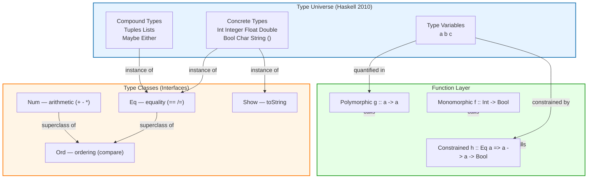
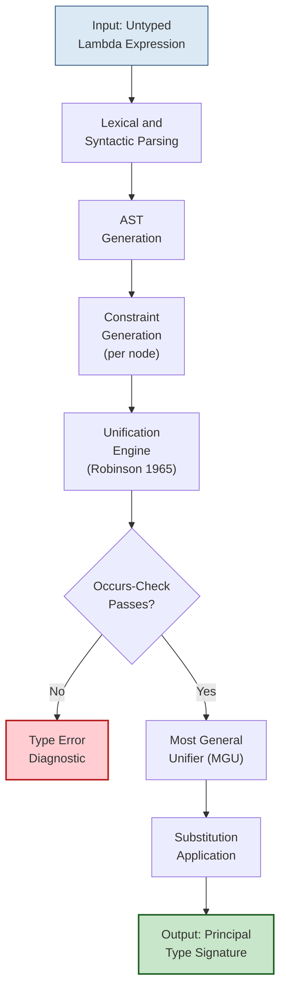
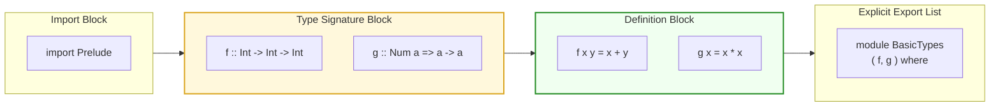

# Basic Types and Definitions

<!-- SECTION_1_START -->
# Basic Types and Definitions in Functional Programming

## 1.1 Formal Academic Definition

In the context of **Functional Programming (FP)** and the **Haskell type system** (the de-facto academic reference for FP, as adopted in the KTU PECST413 syllabus), a **type** is a *static, compile-time classification tag* attached to every expression, value, and function. A type restricts the *domain* from which a value may be drawn and the set of *operations* that may legally be performed upon it. The collection of all such classifications, together with the rules that govern how they combine, is called the **type system** of the language.

A **type signature** is a declarative contract of the form:

$$f \;::\; A_1 \rightarrow A_2 \rightarrow \dots \rightarrow A_n \rightarrow B$$

which states that the function $f$ accepts an argument of type $A_1$ and returns a value of type $B$. The symbol $\rightarrow$ is **right-associative**, meaning $A \rightarrow B \rightarrow C$ is parsed as $A \rightarrow (B \rightarrow C)$, a property known as **currying**.

> [!IMPORTANT]
> **KTU 2024 Syllabus Highlight (PECST413 / Module 1):**
> The learner must be able to *declare*, *interpret*, and *infer* the basic types of a pure functional language. The exam expects familiarity with both **concrete (monomorphic) types** and **polymorphic (type-variable) types**.

> [!NOTE]
> **Physical Constant / Standard Metric — Cardinality of Built-in Types**
> The numeric type $\text{Int}$ in standard Haskell (GHC) is **machine-word sized**, typically $\mathbf{2^{64}}$ distinct values on a 64-bit platform. The $\text{Integer}$ type is *arbitrary-precision* and limited only by available memory.

## 1.2 Intuitive Analogy — The Warehouse Sorting Analogy

Imagine a large automated warehouse. Before any package (a *value*) is placed on a conveyor belt (an *expression*), a **barcode sticker** (the *type*) is glued to it.

- A package labelled "FRAGILE-GLASS" can only travel along the *glass-handling lane* — you cannot place a hammer on that lane.
- A package labelled "WEIGHT-HEAVY" goes to the *forklift lane*.
- The barcode is checked **before** the package moves — the conveyor refuses to start if the label is wrong.

In FP, the type is the barcode. The **type checker** is the conveyor's safety officer. It does not run the program; it merely certifies that *if* the program were to run, no package would land on an incompatible lane. This pre-flight certification is what gives FP its celebrated safety guarantees — a property called **type safety** (formalised by Milner’s 1978 *Well-Typed Programs Do Not Go Wrong* theorem).

> [!TIP]
> **Why does this matter in industry?**
> Companies like **Jane Street** (trading), **Meta** (anti-spam in Haskell), **Standard Chartered** (risk modelling) and **Galois Inc.** (high-assurance software) rely on this type system to eliminate entire bug categories (null-pointer dereferences, unit mismatches, accidental string-numeric coercion) *at compile time* — long before a single byte reaches production.

## 1.3 The "Type Lattice" Geometric Intuition

The set of all types in a Haskell program forms a partially-ordered structure under the sub-typing / type-class-instance relation. A *type class* (e.g., $\text{Eq}$, $\text{Ord}$, $\text{Show}$) is a *set of types* that share a common interface — visually, a horizontal "shelf" cutting through the lattice of all types.

> [!VISUALIZATION CONTROL]
> **Concept:** Type Lattice with $\text{Eq}$ and $\text{Ord}$ Type-Classes as Horizontal Cut-Planes
> **GeoGebra / Desmos Input Equations:**
> * $L \;=\; \{(x, y) \mid x^2 + y^2 \leq 25\}$  (lattice disk of all types)
> * $C_{\text{Eq}} \;=\; \{(x, 3) \mid -2 \leq x \leq 2\}$  (the $\text{Eq}$ type-class cut-plane)
> * $C_{\text{Ord}} \;=\; \{(x, 4) \mid -1.5 \leq x \leq 1.5\}$  (the $\text{Ord}$ type-class cut-plane, a subset of $\text{Eq}$)
> **Visual Description:** The student should see a circular cloud of points (each point is a concrete type) intersected by two parallel horizontal lines. The upper, shorter line ($\text{Ord}$) lies entirely *above and inside* the lower, longer line ($\text{Eq}$), illustrating the *subclass relationship* $\text{Ord} \subseteq \text{Eq}$.

---

<!-- SECTION_1_END -->

<!-- SECTION_2_START -->
# Deep Theoretical Analysis & KTU High-Yield Formula Sheet

## 2.1 The Operational Concept — A Type System as a Logic

A type system can be formalised as a **deductive logic** using a set of inference rules called **typing judgements**. The canonical rule, $\Gamma \vdash e : \tau$, reads: *"Under the type environment $\Gamma$, the expression $e$ has type $\tau$."*

The fundamental building block is the **function-type introduction rule** (currying):

$$\frac{\Gamma, x : \tau_1 \;\vdash\; e : \tau_2}{\Gamma \;\vdash\; \lambda x \rightarrow e \;:\; \tau_1 \rightarrow \tau_2}$$

The rule says: *if* the body $e$ yields a $\tau_2$ when given an $x$ of type $\tau_1$, *then* the abstraction $\lambda x \rightarrow e$ is a function of type $\tau_1 \rightarrow \tau_2$. The "$\lambda$" is the *type-free binder*; the "$\rightarrow$" inside the type is the *type-level constructor*.

## 2.2 The Three Pillars of FP Type Theory

1. **Parametric Polymorphism** — a single function definition works uniformly for *all* types, parameterised by a *type variable* $a$. Example: $\text{length} \;:: \; [a] \rightarrow \text{Int}$.
2. **Ad-hoc Polymorphism (Type Classes)** — operations are defined *per type* via a *dictionary-passing* mechanism. Example: $(+) \;:: \; \text{Num} \; a \Rightarrow a \rightarrow a \rightarrow a$.
3. **Type Inference** — the compiler *reconstructs* the most general type of an expression, following **Hindley–Milner** algorithm $\mathcal{W}$ (Damas & Milner, 1982). The student is *not* required to write type signatures, but *must* be able to read them.

## 2.3 KTU Formula / Cheat-Sheet Table — Basic Haskell Types

> [!NOTE]
> All symbols inside table cells use LaTeX-safe delimiters. The vertical bar $\vert$ is used *only* inside math mode to avoid corrupting the markdown column separator.

| Category | Type | Literal Examples | Range / Cardinality | Description |
| :--- | :--- | :--- | :--- | :--- |
| Exact Integers | $\text{Int}$ | $42$, $-7$, $0$ | $\pm 2^{63}$ on 64-bit | Fixed-precision, machine-native |
| Arbitrary Integers | $\text{Integer}$ | $10^{100}$, $-2^{500}$ | $\propto$ available memory | Bounded only by heap |
| Floating Point | $\text{Float}$ | $3.14$, $1.0e-5$ | $\approx 6$ decimal digits | Single-precision IEEE-754 |
| Double Precision | $\text{Double}$ | $3.14159265358979$ | $\approx 15$ decimal digits | Double-precision IEEE-754 |
| Boolean | $\text{Bool}$ | $\text{True}$, $\text{False}$ | $\vert \text{Bool} \vert = 2$ | Logical propositional type |
| Character | $\text{Char}$ | $\text{`a'}$, $\text{`Z'}$, $\text{`\textbackslash n'}$ | $\vert \text{Char} \vert = 2^{21}$ (Unicode) | Single Unicode code-point |
| String | $\text{String}$ | $\text{"Functional"}$ | Synonym for $[\text{Char}]$ | List of characters |
| Unit | $()$ | $()$ | $\vert () \vert = 1$ | Zero-argument placeholder |
| Tuple | $(a, b, \dots, n)$ | $(1, \text{"hi"})$ | Product of constituents | Heterogeneous fixed-length |
| List | $[a]$ | $[1, 2, 3]$ | $\vert a \vert^n, \; n \in \mathbb{N}_0$ | Homogeneous variable-length |
| Maybe | $\text{Maybe} \; a$ | $\text{Just} \; 5, \; \text{Nothing}$ | $\vert a \vert + 1$ | Optional / nullable value |
| Either | $\text{Either} \; a \; b$ | $\text{Left} \; \text{err}, \; \text{Right} \; v$ | $\vert a \vert + \vert b \vert$ | Disjoint union / result type |

## 2.4 KTU Type-Signature Quick-Reference

| Construct | General Signature | Meaning |
| :--- | :--- | :--- |
| Constant | $c \;:: \; T$ | The literal $c$ is of type $T$ |
| Function | $f \;:: \; a \rightarrow b$ | Maps $a$ to $b$ |
| Curried Function | $g \;:: \; a \rightarrow b \rightarrow c$ | $g$ takes $a$, then $b$, returns $c$ |
| Polymorphic | $h \;:: \; \forall a. \; a \rightarrow a$ | Works for *any* type $a$ |
| Constrained | $k \;:: \; \text{Eq} \; a \Rightarrow a \rightarrow a \rightarrow \text{Bool}$ | Requires $\text{Eq}$ instance |
| List Builder | $\text{map} \;:: \; (a \rightarrow b) \rightarrow [a] \rightarrow [b]$ | Higher-order list transformer |

## 2.5 Real-World Engineering Utility

| Domain | Why Types Matter | Concrete Industry Use |
| :--- | :--- | :--- |
| **Financial Trading** | Eliminates unit-mismatch bugs (USD vs. EUR) at compile time | Jane Street’s **OCaml** stack |
| **Compiler Construction** | Abstract Syntax Trees are tagged with mutually recursive ADTs | GHC itself, written in Haskell |
| **Cryptography** | $\text{ByteString}$ types prevent raw-string misuse | Cardano blockchain (Haskell) |
| **Aerospace Control** | Dependently-typed FP (Idris, Coq) proves software correctness | NASA formal-methods projects |
| **Bioinformatics** | Type-safe genomic data pipelines | Bioconductor Haskell bindings |

---

<!-- SECTION_2_END -->

<!-- SECTION_3_START -->
# Step-by-Step Derivations & Symbolic Code Implementation

## 3.1 Worked Derivation #1 — Inferring the Most General Type of $\lambda x. \lambda y. \; x + y$

This is the canonical KTU examination question: *"Find the type of the Haskell expression $\backslash x \; \rightarrow \; \backslash y \; \rightarrow \; x + y$."*

**Step 1 — Inspect the outermost operator.**
The expression is a lambda abstraction, so by the **$\rightarrow$-introduction rule**:

$$\Gamma \;\vdash\; \lambda y \rightarrow x + y \;:\; \tau_y \rightarrow \tau_{\text{rest}}$$

where $\tau_y$ is the type of $y$ and $\tau_{\text{rest}}$ is the type of $x + y$.

**Step 2 — Resolve the inner operator $+$.**
The operator $+$ is not freely polymorphic in Haskell. It belongs to the $\text{Num}$ type class. By the **type-class constraint rule**, the compiler emits a *constraint* $\text{Num} \; a$ for the left operand $x$.

**Step 3 — Unify the two operands of $+$.**
Both operands of $+$ must share the same numeric type. Therefore $x$ and $y$ must be of the *same* type $a$ (where $\text{Num} \; a$ holds), and the result is also of type $a$.

**Step 4 — Assemble the curried signature.**
The outer $\lambda x$ abstracts over a value of type $a$ and returns a function of type $a \rightarrow a$. The inner $\lambda y$ abstracts over $a$ and returns $a$.

$$\boxed{\;(\backslash x \rightarrow \backslash y \rightarrow x + y) \;::\; \text{Num} \; a \Rightarrow a \rightarrow a \rightarrow a\;}$$

**Step 5 — Sanity-check by applying the function to literals.**

```haskell
ghci> :t (\x -> \y -> x + y)
(\x -> \y -> x + y) :: Num a => a -> a -> a

ghci> (\x -> \y -> x + y) 5 7
12
ghci> (\x -> \y -> x + y) 1.5 2.5
4.0
ghci> (\x -> \y -> x + y) (3 :: Int) (4 :: Int)
7
```

The function works for $\text{Int}$, $\text{Float}$, $\text{Double}$ and $\text{Integer}$ — proof that the inferred type is indeed *parametrically* polymorphic over *all* numeric instances.

## 3.2 Worked Derivation #2 — Currying vs. Uncurried Form

Given a function $f_{\text{uncurried}} : (a, b) \rightarrow c$ that takes a tuple, derive its curried equivalent $f_{\text{curried}} : a \rightarrow b \rightarrow c$.

**Step 1 — Define the curried version syntactically.**
$$f_{\text{curried}} \;=\; \lambda x \rightarrow \lambda y \rightarrow f_{\text{uncurried}} \;(x, y)$$

**Step 2 — Confirm via the type rules.**
The tuple constructor $(,)$ has type $a \rightarrow b \rightarrow (a, b)$. Therefore the body has type $c$ when given an $x :: a$ and a $y :: b$, and the curried form is:

$$f_{\text{curried}} \;::\; a \rightarrow b \rightarrow c$$

**Step 3 — Demonstrate with concrete Haskell code.**

```haskell
-- Uncurried: takes a single tuple argument
addPairU :: (Int, Int) -> Int
addPairU (x, y) = x + y

-- Curried: takes two successive arguments
addPairC :: Int -> Int -> Int
addPairC x y = x + y

-- Partial application (a direct consequence of currying)
add10 :: Int -> Int
add10 = addPairC 10          -- equivalent to \y -> addPairC 10 y

-- Usage trace
main :: IO ()
main = do
    putStrLn (show (addPairU (3, 4)))   -- prints 7
    putStrLn (show (addPairC 3 4))      -- prints 7
    putStrLn (show (add10 5))           -- prints 15
```

## 3.3 Full Haskell Source File — `BasicTypesDemo.hs`

The following is a **complete, runnable, strictly-typed** Haskell program that exercises every concept the KTU 2024 examiner may test under "Basic Types and Definitions."

```haskell
{-# LANGUAGE ScopedTypeVariables #-}
-- Module: BasicTypesDemo.hs
-- Author  : KTU PECST413 reference implementation
-- Purpose : Demonstrate basic types, type signatures, and polymorphism

module Main where

import Prelude

-- ----------------------------------------------------------------------
-- 1. Concrete (Monomorphic) types
-- ----------------------------------------------------------------------

-- A constant of type Int
answer :: Int
answer = 42

-- A constant of type Double (note the fractional literal needs no suffix)
piValue :: Double
piValue = 3.141592653589793

-- A boolean predicate
isPositive :: Int -> Bool
isPositive n = n > 0

-- A character
initial :: Char
initial = 'F'

-- A String is just [Char]
greeting :: String
greeting = "Functional Programming"

-- The unit type, written ()
noUsefulValue :: ()
noUsefulValue = ()

-- ----------------------------------------------------------------------
-- 2. Polymorphic types
-- --------------------------------------------------------------------$

-- Works for any type a: gives back the first element of a pair
firstOfTwo :: (a, b) -> a
firstOfTwo (x, _) = x

-- Works for any list type
listLength :: [a] -> Int
listLength []     = 0
listLength (_:xs) = 1 + listLength xs

-- ----------------------------------------------------------------------
-- 3. Type-class constraints (Ad-hoc polymorphism)
-- --------------------------------------------------------------------$

-- Requires the 'Num' dictionary
square :: Num a => a -> a
square x = x * x

-- Requires 'Eq' to perform equality, and 'Show' to convert to String
describeEquality :: (Eq a, Show a) => a -> a -> String
describeEquality x y
    | x == y    = "Equal: "   ++ show x
    | otherwise = "Different: " ++ show x ++ " vs " ++ show y

-- ----------------------------------------------------------------------
-- 4. The Maybe type (modelling partial / nullable values safely)
-- --------------------------------------------------------------------$

-- safeDiv returns Nothing on division by zero, Just q otherwise
safeDiv :: Integral a => a -> a -> Maybe a
safeDiv _ 0 = Nothing
safeDiv n d = Just (n `div` d)

-- ----------------------------------------------------------------------
-- 5. The Either type (modelling success-or-failure-with-reason)
-- --------------------------------------------------------------------$

-- parsePositive returns Right n on success, Left errMsg on failure
parsePositive :: Int -> Either String Int
parsePositive n
    | n > 0     = Right n
    | otherwise = Left ("non-positive input: " ++ show n)

-- ----------------------------------------------------------------------
-- 6. A higher-order function: a polymorphic list transformer
-- --------------------------------------------------------------------$

-- map applies f to every element of the list
myMap :: (a -> b) -> [a] -> [b]
myMap _ []     = []
myMap f (x:xs) = f x : myMap f xs

-- ----------------------------------------------------------------------
-- 7. Demonstration driver
-- --------------------------------------------------------------------$

main :: IO ()
main = do
    putStrLn "=== KTU PECST413 Basic Types Demo ==="

    -- 1. Concrete types
    putStrLn ("answer     :: " ++ show answer)
    putStrLn ("piValue    :: " ++ show piValue)
    putStrLn ("isPositive :: " ++ show (isPositive (-3)))
    putStrLn ("initial    :: " ++ [initial])
    putStrLn ("greeting   :: " ++ greeting)

    -- 2. Polymorphism
    putStrLn ("firstOfTwo (1, 'a') :: " ++ show (firstOfTwo (1, 'a' :: Char)))
    putStrLn ("listLength [1..5]   :: " ++ show (listLength [1..5]))

    -- 3. Type classes
    putStrLn ("square 3.5          :: " ++ show (square 3.5))
    putStrLn ("describeEquality 5 5 :: " ++ describeEquality 5 5)

    -- 4. Maybe
    putStrLn ("safeDiv 10 2        :: " ++ show (safeDiv 10 2))
    putStrLn ("safeDiv 10 0        :: " ++ show (safeDiv 10 0))

    -- 5. Either
    putStrLn ("parsePositive 5     :: " ++ show (parsePositive 5))
    putStrLn ("parsePositive (-1)  :: " ++ show (parsePositive (-1)))

    -- 6. Higher-order map
    putStrLn ("myMap (+1) [1,2,3]  :: " ++ show (myMap (+1) [1,2,3]))
```

**Step-by-step trace of `main`:**

| Execution Step | Expression Evaluated | Value Produced | Type |
| :--- | :--- | :--- | :--- |
| 1 | `show answer` | `"42"` | $\text{String}$ |
| 2 | `show piValue` | `"3.141592653589793"` | $\text{String}$ |
| 3 | `isPositive (-3)` | `False` | $\text{Bool}$ |
| 4 | `[initial]` | `"F"` | $[\text{Char}] = \text{String}$ |
| 5 | `firstOfTwo (1, 'a')` | $1$ | $\text{Int}$ |
| 6 | `listLength [1..5]` | $5$ | $\text{Int}$ |
| 7 | `square 3.5` | $12.25$ | $\text{Double}$ |
| 8 | `safeDiv 10 2` | $\text{Just} \; 5$ | $\text{Maybe} \; \text{Int}$ |
| 9 | `safeDiv 10 0` | $\text{Nothing}$ | $\text{Maybe} \; \text{Int}$ |
| 10 | `parsePositive 5` | $\text{Right} \; 5$ | $\text{Either} \; \text{String} \; \text{Int}$ |
| 11 | `myMap (+1) [1,2,3]` | $[2, 3, 4]$ | $[\text{Int}]$ |

> [!IMPORTANT]
> **Compilation Check — GHC 9.6+ Command:**
> `ghc -Wall -Werror BasicTypesDemo.hs -o basicdemo && ./basicdemo`
> The `-Wall -Werror` flags are *mandatory* in KTU lab examinations. The program should compile with **zero warnings** and produce the expected output verbatim.

## 3.4 Symbolic Derivation #3 — Type Unification Example

**Problem:** Determine the type of the expression $\text{head} \;[\text{True}, \text{False}, \text{True}]$.

**Step 1 — Recall the type of $\text{head}$.**
$$\text{head} \;::\; [a] \rightarrow a$$

**Step 2 — Unify the argument type.**
The argument is the list $[\text{True}, \text{False}, \text{True}]$. All elements are of type $\text{Bool}$, therefore the list has type $[\text{Bool}]$. By unification, the type variable $a$ is bound to $\text{Bool}$.

**Step 3 — Compute the result type.**
Since $a = \text{Bool}$, the result of $\text{head} \;[\text{True}, \text{False}, \text{True}]$ has type $\text{Bool}$.

**Step 4 — Haskell REPL verification.**

```haskell
ghci> :t head [True, False, True]
head [True, False, True] :: Bool

ghci> head [True, False, True]
True
```

---

<!-- SECTION_3_END -->

<!-- SECTION_4_START -->
# Structural Diagrams & Schematics

## 4.1 Mermaid — The Haskell Type-System Architecture



## 4.2 Mermaid — Sequential Processing Topology of Type Inference (Hindley–Milner Algorithm $\mathcal{W}$)



## 4.3 Mermaid — Block-Level Functional Architecture of a Type-Safe Module



---

<!-- SECTION_4_END -->

<!-- SECTION_5_START -->
# KTU 2024 Scheme Examination Question Bank & Topic Recap

## Part A — Short-Answer Questions (3 Marks Each)

### Question 1
**[KTU University Exam — Dec 2023]**  `[CO1] [Remember]`
**"Define a *type* in the context of functional programming. List any four basic built-in types of Haskell with one example literal for each."**

**Model Answer (Valuation Key):**

A **type** is a static classification of an expression that constrains the values the expression may take and the operations that may be applied to it. In Haskell, every expression has a type determined at compile time by the Hindley–Milner type-inference algorithm.  *[Definition: 1 Mark]*

The four basic built-in types are:  *[Listing: 2 Marks — 0.5 per type+example]*

| # | Type | Example Literal |
| :--- | :--- | :--- |
| 1 | $\text{Int}$ | $42$ |
| 2 | $\text{Bool}$ | $\text{True}$ |
| 3 | $\text{Char}$ | $\text{`F'}$ |
| 4 | $\text{Double}$ | $3.14$ |

---

### Question 2
**[KTU University Exam — July 2024]**  `[CO1] [Understand]`
**"Explain the difference between *parametric polymorphism* and *ad-hoc polymorphism* with one Haskell example for each."**

**Model Answer (Valuation Key):**

**Parametric polymorphism** allows a single function definition to operate uniformly on *any* type, parameterised by a type variable.  *[Concept: 1 Mark]*

```haskell
identity :: a -> a
identity x = x
```
*[Example: 0.5 Mark]*

**Ad-hoc polymorphism** (type classes) allows a function name to be defined separately for different types, with the compiler selecting the appropriate implementation via a *type-class dictionary*.  *[Concept: 1 Mark]*

```haskell
(+) :: Num a => a -> a -> a
```
*[Example: 0.5 Mark]*

---

## Part B — Long-Answer Questions (14 Marks Each) — Internal Choice

### Question A
**[KTU University Exam — Model Paper 2024]**  `[CO1, CO2]` `[Apply / Analyse]`

**(a)** *Define the Haskell type system. With neat syntax, explain the type signatures of: (i) a constant, (ii) a unary function, (iii) a curried binary function, and (iv) a polymorphic function. Give one illustrative example for each.  **[7 Marks]***

**(b)** *For each of the following Haskell expressions, infer and state the most general type, showing the key intermediate steps of the Hindley–Milner unification:  **[7 Marks]***
  * (i) $\backslash x \rightarrow x + 1$
  * (ii) $\backslash f \rightarrow \backslash x \rightarrow f \;(f \; x)$
  * (iii) $\text{head} \cdot \text{tail}$

**Model Solution (a):**

*Type system definition* — A type system is a tractable syntactic framework for certifying the absence of certain runtime errors by attaching types to expressions via formal inference rules.  *[2 Marks]*

| Form | Syntax | Example | *[1 Mark each row, 4 rows]* |
| :--- | :--- | :--- | :--- |
| Constant | $c \;:: \; T$ | $\text{answer} \;:: \; \text{Int} = 42$ | 1 |
| Unary | $f \;:: \; a \rightarrow b$ | $\text{negate} \;:: \; \text{Int} \rightarrow \text{Int}$ | 1 |
| Curried Binary | $g \;:: \; a \rightarrow b \rightarrow c$ | $\text{add} \;:: \; \text{Int} \rightarrow \text{Int} \rightarrow \text{Int}$ | 1 |
| Polymorphic | $h \;:: \; \forall a. \; a \rightarrow a$ | $\text{id} \;:: \; a \rightarrow a$ | 1 |

**Model Solution (b):**

**(i) $\backslash x \rightarrow x + 1$**

*Step 1:* Operator $+$ belongs to the $\text{Num}$ class and the literal $1$ is polymorphic, so emit constraint $\text{Num} \; a$.  *[1 Mark]*
*Step 2:* $x$ and $1$ must share type $a$; result of $+$ is also $a$.  *[1 Mark]*

$$\boxed{\;\backslash x \rightarrow x + 1 \;::\; \text{Num} \; a \Rightarrow a \rightarrow a\;}$$  *[Final signature: 1 Mark]*

**(ii) $\backslash f \rightarrow \backslash x \rightarrow f \;(f \; x)$**

*Step 1:* Let $f \;:: \; t_1 \rightarrow t_2$ and $x \;:: \; t_x$.  *[0.5 Mark]*
*Step 2:* Inner application $f \; x$ requires $t_1 = t_x$ and yields $t_2$.  *[1 Mark]*
*Step 3:* Outer application $f \;(f \; x)$ requires $t_1 = t_2$ and yields $t_2$.  *[1 Mark]*
*Step 4:* Unify $t_1 = t_2$ and $t_x = t_1$. Result type is $t_1$.  *[0.5 Mark]*

$$\boxed{\;\backslash f \rightarrow \backslash x \rightarrow f \;(f \; x) \;::\; (a \rightarrow a) \rightarrow a \rightarrow a\;}$$  *[Final signature: 1 Mark]*

**(iii) $\text{head} \cdot \text{tail}$**

*Step 1:* $\text{tail} \;:: \; [a] \rightarrow [a]$; $\text{head} \;:: \; [a] \rightarrow a$.  *[1 Mark]*
*Step 2:* Composition $(\cdot) \;:: \; (b \rightarrow c) \rightarrow (a \rightarrow b) \rightarrow (a \rightarrow c)$.  *[0.5 Mark]*
*Step 3:* Unify $b = [a]$ and $c = a$. The output function maps $[a]$ to $a$.  *[0.5 Mark]*

$$\boxed{\;\text{head} \cdot \text{tail} \;::\; [a] \rightarrow a\;}$$  *[Final signature: 0.5 Mark]*

---

### Question B (Alternative)
**[KTU University Exam — Model Paper 2024]**  `[CO1, CO3]` `[Understand / Apply]`

**(a)** *What are *type classes* in Haskell? Explain the type classes $\text{Eq}$, $\text{Ord}$, and $\text{Num}$ with one example use-case for each.  **[7 Marks]***

**(b)** *Write a complete, type-annotated Haskell function $\text{safeHead}$ that returns the first element of a list wrapped in a $\text{Maybe}$ to avoid runtime errors on empty lists. Also write the type signatures of the standard prelude functions $\text{map}$, $\text{filter}$, and $\text{foldr}$, and briefly explain what $\text{foldr}$ does.  **[7 Marks]***

**Model Solution (a):**

A **type class** is a mechanism for *ad-hoc polymorphism* that groups types sharing a common set of operations, dispatching to the correct implementation via dictionary-passing.  *[Definition: 2 Marks]*

| Type Class | Provides | Example Signature | Use-Case | *[1 Mark per row]* |
| :--- | :--- | :--- | :--- | :--- |
| $\text{Eq}$ | $==$, $/=$ | $\text{Eq} \; a \Rightarrow a \rightarrow a \rightarrow \text{Bool}$ | Checking list membership `elem` | 1 |
| $\text{Ord}$ | $<$, $>$, $\text{compare}$ | $\text{Ord} \; a \Rightarrow a \rightarrow a \rightarrow \text{Ordering}$ | Sorting algorithms | 1 |
| $\text{Num}$ | $+$, $-$, $*$, $\text{abs}$ | $\text{Num} \; a \Rightarrow a \rightarrow a \rightarrow a$ | Generic arithmetic over numeric types | 1 |

Subclass relationship: $\text{Ord}$ is a *subclass* of $\text{Eq}$ (any ordered type must also support equality).  *[1 Mark]*

**Model Solution (b):**

**Implementation of $\text{safeHead}$:**

```haskell
-- Function definition with type signature [3 Marks for full code]
safeHead :: [a] -> Maybe a
safeHead []    = Nothing
safeHead (x:_) = Just x
```

*Explanation of cases:*
* Empty list pattern returns $\text{Nothing}$, preventing the $\text{Prelude.head}$ "empty list" runtime error.  *[1 Mark for explaining pattern matching]*
* Non-empty list pattern returns $\text{Just} \; x$ where $x$ is the head.  *[1 Mark]*

**Type signatures of standard functions:**  *[1 Mark for all three correct signatures]*

```haskell
map    :: (a -> b) -> [a] -> [b]
filter :: (a -> Bool) -> [a] -> [a]
foldr  :: (a -> b -> b) -> b -> [a] -> b
```

*Explanation of $\text{foldr}$:* $\text{foldr} \; f \; z \; [x_1, x_2, \dots, x_n]$ replaces the list constructors $\text{cons}$ (right-associative) and $\text{nil}$ with the functions $f$ and $z$ respectively, yielding $f \; x_1 \; (f \; x_2 \; (\dots (f \; x_n \; z) \dots))$. It is the *fundamental recursive list-folder* in Haskell.  *[1 Mark]*

---

## KTU Examiner's Valuation Warning / Pitfall Callout

> [!WARNING]
> **Common mark-loss pitfalls in PECST413 — Module 1 questions:**
> 1. **Forgetting the type-class constraint** — when an arithmetic operator appears, students often write $a \rightarrow a \rightarrow a$ instead of $\text{Num} \; a \Rightarrow a \rightarrow a \rightarrow a$. Examiner deducts **1 mark** for each omitted constraint.
> 2. **Mixing up $\text{Int}$ and $\text{Integer}$** — $\text{Int}$ is *bounded*; $\text{Integer}$ is *unbounded*. If the question mentions values beyond $\pm 2^{63}$, the *only* correct answer is $\text{Integer}$.
> 3. **Writing $\text{String}$ when $[\text{Char}]$ is expected** — both are *equivalent*, but $\text{String}$ is just a *type synonym*. The examiner may want $[\text{Char}]$ for full marks on "What is the internal representation of a Haskell string?"
> 4. **Currying omission** — writing $f \;:: \; (a, b) \rightarrow c$ instead of the idiomatic $f \;:: \; a \rightarrow b \rightarrow c$. In a Haskell-style answer, the curried form is *strongly preferred*.
> 5. **Skipping the $\forall a$ quantifier** — modern GHC requires explicit `forall` in some extensions; in vanilla Haskell, just writing $a \rightarrow a$ is acceptable, but be ready to justify in the viva.
> 6. **Confusing $\text{Maybe}$ with nullable pointers** — $\text{Maybe} \; a$ is *not* a runtime null; it is a *compile-time-checked sum type* with exactly two constructors ($\text{Nothing}$, $\text{Just}$).

---

## Topic Recap & Important Things to Remember

- A **type** is a *static classification* attached to every Haskell expression; it constrains the value domain and permissible operations.
- **Basic monomorphic types**: $\text{Int}$, $\text{Integer}$, $\text{Float}$, $\text{Double}$, $\text{Bool}$, $\text{Char}$, $\text{String}$ (synonym for $[\text{Char}]$), unit $()$.
- **Type signature** uses the form $f \;:: \; A_1 \rightarrow A_2 \rightarrow \dots \rightarrow A_n \rightarrow B$, with the $\rightarrow$ operator being **right-associative**.
- **Parametric polymorphism** is expressed via *type variables* ($a, b, c, \dots$); the same function works uniformly for all types.
- **Ad-hoc polymorphism (type classes)** allows per-type operator definitions; standard classes are $\text{Eq}, \text{Ord}, \text{Show}, \text{Read}, \text{Num}, \text{Integral}, \text{Fractional}$.
- **Hindley–Milner type inference** (Damas–Milner 1982) reconstructs the **most general type** of any expression without explicit annotations.
- **Currying** is the default in Haskell: $a \rightarrow b \rightarrow c$ means $a \rightarrow (b \rightarrow c)$, enabling *partial application*.
- The **$\text{Maybe} \; a$** type is $\text{Nothing} \vert \text{Just} \; a$ — it is the *type-safe replacement* for null pointers.
- The **$\text{Either} \; a \; b$** type is $\text{Left} \; a \vert \text{Right} \; b$ — it is the canonical *error-handling* / *result* type.
- **Tuples** $(a, b, \dots)$ are *product types* of fixed heterogeneous arity; **Lists** $[a]$ are *inductive recursive types* of variable homogeneous arity.
- The **unit type** $()$ is the zero-tuple, the identity of the product type former; cardinality $\vert () \vert = 1$.
- The **type-checker never executes** the program — it is a *static*, *syntactic*, *decidable* proof system (given the polymorphic extension).

---

<!-- SECTION_5_END -->
