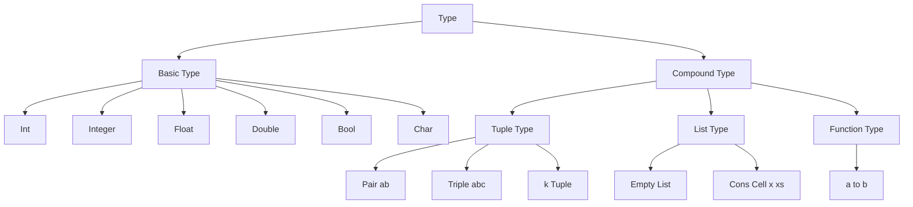
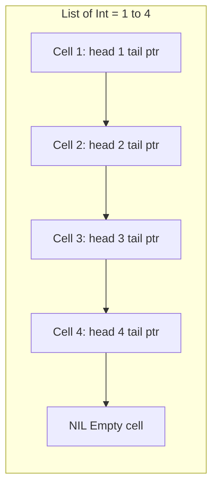
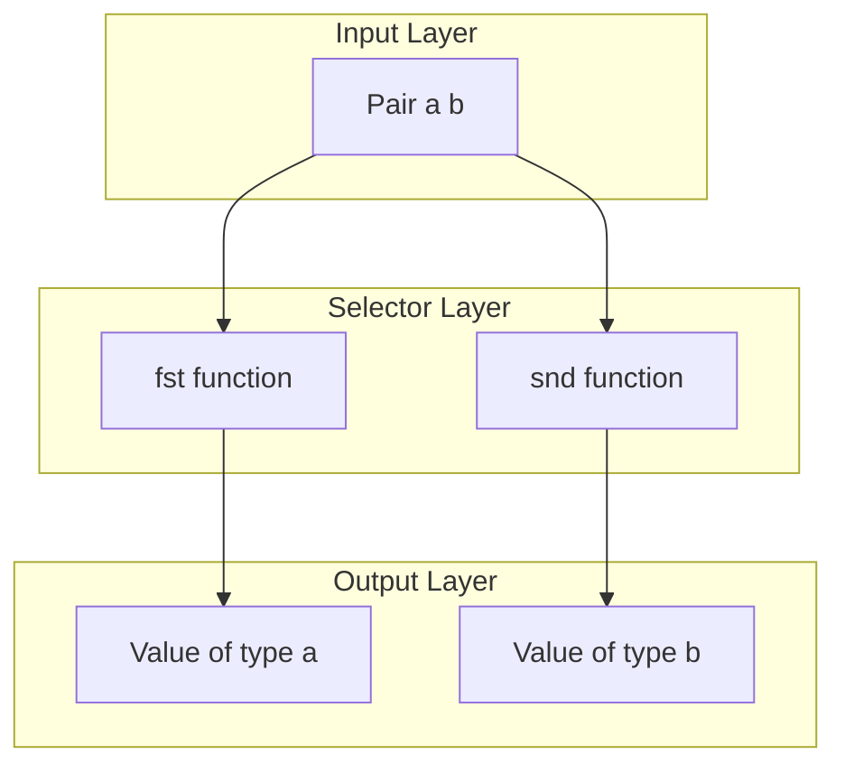
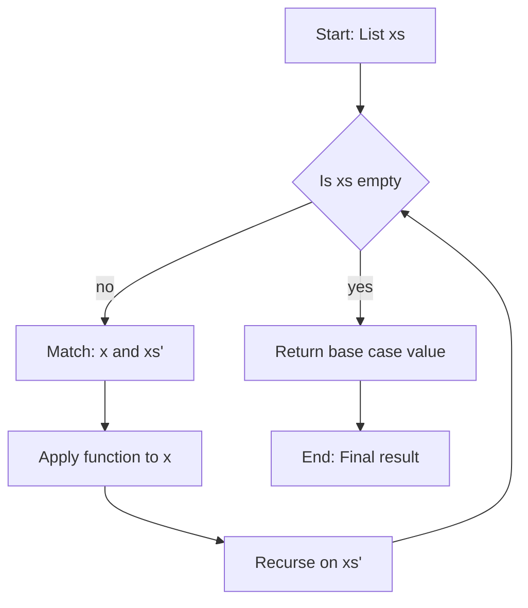
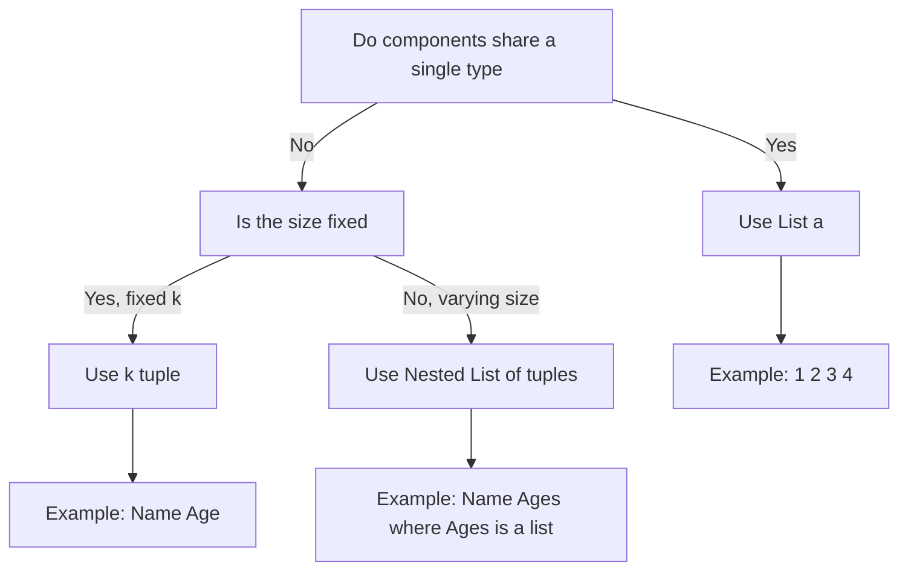

# Data Types, Tuples and Lists

<!-- SECTION_1_START -->
# Data Types, Tuples and Lists in Functional Programming

## 1. Core Technical Definition

In the pure functional programming paradigm (Haskell being the canonical reference language used in the **KTU PECST413 Functional Programming** syllabus), every value and every expression belongs to a **type**. A *type* is a name associated with a collection of values that share a common structural and semantic contract. Haskell's type system is **static**, **strong**, and **type-inferred**, meaning the compiler deduces the type of every expression at compile time without the programmer being forced to declare it explicitly, yet refuses to silently coerce one type into another.

> [!NOTE]
> **Definition (KTU Syllabus Terminology):** A *data type* in functional programming is a precise, named description of a set of values together with the legal operations that may be performed on those values. The set of all legal values is called the *domain* of the type.

### 1.1 The Three Pillars Introduced in Module 1

| Construct | Definition | Cardinality of Element Set | Example |
|---|---|---|---|
| **Atomic / Basic Type** | A type with no internal structure exposed to the programmer. | Predefined & finite (Bool) or countably infinite (Int). | `Int`, `Char`, `Bool`, `Float` |
| **Tuple Type** | A **product** of a fixed number of heterogeneous components. | Fixed size $n \ge 2$, components may differ. | `(Int, Bool, Char)` |
| **List Type** | A **homogeneous, inductively defined** sequence. | Length may be $0$ (empty) or any positive integer. | `[Int]`, `[[Char]]` |

> [!IMPORTANT]
> **Syllabus Highlight — Haskell Predeclared Basic Types**
> `Int` (fixed-precision integer), `Integer` (arbitrary-precision), `Float` (single-precision real), `Double` (double-precision real), `Bool` (`True` / `False`), `Char` (Unicode character). Strings in Haskell are syntactic sugar for `[Char]`, i.e. lists of characters.

### 1.2 Conceptual Analogy & Geometric Intuition

Imagine a **warehouse of labelled crates**:

- A **basic data type** is a *standardised crate* of a particular shape (e.g. a cube crate that always holds a whole number, a sphere crate that always holds a single character). Every item that fits inside is interchangeable with any other item of the same shape.
- A **tuple** is a *gift box* containing a *fixed* number of drawers, each drawer labelled with a different shape, and each drawer holding *one* item. A `2`-tuple is a 2-drawer box, a `3`-tuple is a 3-drawer box. The number of drawers never changes once the box is built. Two gift boxes are equal *if and only if every corresponding drawer holds an equal item*.
- A **list** is a *freight train* where every wagon is *identical in shape* (homogeneous). You may couple or decouple wagons freely — that is, the length is dynamic. The only special wagon is the **empty list** `[]`, which is the "locomotive" that has no cargo. A list is therefore an *inductively defined* structure: a list is either `[]` or an element `x` prepended (`cons-ed`) to a smaller list `xs`.

**Geometric Intuition for Tuples:** A `2`-tuple of `Double`s is literally a point in the **2-D plane** $\mathbb{R}^{2}$; a `3`-tuple of `Double`s is a point in **3-D space** $\mathbb{R}^{3}$. Tuples are the natural representation of *Cartesian products* of sets.

**Geometric Intuition for Lists:** A list of $n$ elements can be viewed as an $n$-step walk through a set — the *head* is the starting point, the *tail* is the remainder of the journey, and the *length* is the number of steps.

> [!VISUALIZATION CONTROL]
> **Concept:** Visualising the Cons-Cell Structure of a List
> **GeoGebra / Desmos Input Equations:**
> * `f(x) = sin(pi*x)` to draw a periodic backbone over `x in [0,8]`
> * Points: `(0.5,1), (1.5,1), (2.5,1), (3.5,1), (4.5,1), (5.5,1), (6.5,1), (7.5,1)` — each represents one cons cell
> * Connect consecutive points with line segments to view the spine
> **Visual Description:** Each dot on the horizontal line represents one cons cell `x : xs`. The leftmost dot is the *head* of the list, the rightmost terminates at the `[]` empty cell. Length is the number of dots; type is the kind of coin inside each cell.

---

<!-- SECTION_1_END -->

<!-- SECTION_2_START -->
# Deep Theoretical Analysis & KTU High-Yield Formula Sheet

## 2. Type System Foundations

Haskell's type language is itself a tiny functional language. The most important syntactic productions are:

$$
\begin{aligned}
\text{Type} \;\; \tau \;\; ::=&\;\; \tau_1 \to \tau_2 &&\text{(function type, right-associative)} \\
                     \vert&\;\; (\tau_1, \tau_2, \dots, \tau_n) &&\text{(tuple type, $n \ge 2$)} \\
                     \vert&\;\; [\tau] &&\text{(list type)} \\
                     \vert&\;\; \text{Int} \,\vert\, \text{Bool} \,\vert\, \text{Char} \,\vert\, \dots &&\text{(base types)} \\
                     \vert&\;\; \alpha &&\text{(type variable)}
\end{aligned}
$$

The arrow `->` is right-associative, so `a -> b -> c` parses as `a -> (b -> c)`. The list bracket `[a]` is sugar for a *recursive algebraic data type* (introduced in a later module), but at this stage it is sufficient to treat `[a]` as a primitive.

## 3. Tuples in Depth

A **$k$-tuple** has a *type* of the form $(\tau_1, \tau_2, \dots, \tau_k)$ and a *value* of the form $(v_1, v_2, \dots, v_k)$ where each $v_i :: \tau_i$.

* **Heterogeneity:** the components may belong to different types.
* **Fixed arity:** you cannot append a 4th element to a 3-tuple; you must construct a new 4-tuple.
* **Pattern matching:** the canonical way to *decompose* a tuple is `let (x, y, z) = expr` or the function head `(a, b, c) -> ...`.
* **Unit Type `()`:** the 0-tuple. It has exactly one inhabitant, also written `()`. It is the algebraic identity for tuples and the *terminal object* in the category **Hask**.

### 3.1 Pair Constructors and Selectors

| Function | Type Signature | Behaviour |
|---|---|---|
| `fst` | `(a, b) -> a` | Extracts the first component. |
| `snd` | `(a, b) -> b` | Extracts the second component. |
| `swap` | `(a, b) -> (b, a)` | Reverses the order of components. |
| `curry` | `((a, b) -> c) -> (a -> b -> c)` | Converts an uncurried function into a curried one. |
| `uncurry` | `(a -> b -> c) -> ((a, b) -> c)` | Converts a curried function into an uncurried one. |

> [!IMPORTANT]
> **`fst` and `snd` exist ONLY for 2-tuples.** For 3-tuples or larger, the programmer must pattern-match. This is a common KTU viva question: *"Why is there no `trd` in the Prelude?"* — because adding selectors would force the Prelude to grow unboundedly with arity.

## 4. Lists in Depth

A list of type `[\tau]` is an *inductive* structure defined by the two constructors:

$$
\begin{aligned}
[\,] &\;:\; [\tau] &&\text{(the empty list)} \\
(:) &\;:\; \tau \to [\tau] \to [\tau] &&\text{(the cons operator, right-associative)}
\end{aligned}
$$

Reading these equations: *every* list of `Int`s is either `[]` or `x : xs` where `x :: Int` and `xs :: [Int]`. The `:` operator is a *data constructor*, not a function, and as such is **non-fixable** in some syntactic positions (it must be a *pattern* on the LHS of an equation).

### 4.1 Cons-Operator Algebra

Let `L` be a list and `x` an element. Then:

$$
\begin{aligned}
\text{head}(x : L) &= x \\
\text{tail}(x : L) &= L \\
\text{length}([\,]) &= 0 \\
\text{length}(x : L) &= 1 + \text{length}(L) \\
\text{null}([\,]) &= \text{True} \\
\text{null}(x : L) &= \text{False} \\
(x : L) \,\verb!++!\,[\,] &= x : L \\
[\,] \,\verb!++!\,L &= L \\
(x : L_1) \,\verb!++!\,L_2 &= x : (L_1 \,\verb!++!\,L_2) \\
\text{reverse}([\,]) &= [\,] \\
\text{reverse}(x : L) &= \text{reverse}(L) \,\verb!++!\,[x]
\end{aligned}
$$

These recursive equations are the *inductive definition* of the standard Prelude functions and are examinable in KTU.

### 4.2 The KTU Formula Sheet

| # | Symbol / Function | Type Signature | Meaning / Law |
|---|---|---|---|
| 1 | `::` | `value :: Type` | Type assertion ("has type"). |
| 2 | `[]` | `[a]` | The empty list, the additive identity for `++`. |
| 3 | `(:)` | `a -> [a] -> [a]` | Cons, prepends one element. **O($1$)** time. |
| 4 | `(++)` | `[a] -> [a] -> [a]` | Concatenation. **O($n$)** in length of first argument. |
| 5 | `head` | `[a] -> a` | First element. **Partial** (crashes on `[]`). |
| 6 | `tail` | `[a] -> [a]` | All but the first. **Partial** (crashes on `[]`). |
| 7 | `last` | `[a] -> a` | Last element. **Partial.** |
| 8 | `init` | `[a] -> [a]` | All but the last. **Partial.** |
| 9 | `length` | `[a] -> Int` | Number of cons cells. **O($n$).** |
| 10 | `null` | `[a] -> Bool` | Tests for `[]`. **O($1$).** |
| 11 | `take n` | `Int -> [a] -> [a]` | First $n$ elements. **O($n$).** |
| 12 | `drop n` | `Int -> [a] -> [a]` | All but the first $n$. **O($n$).** |
| 13 | `reverse` | `[a] -> [a]` | Reverse the order. **O($n$).** |
| 14 | `fst` | `(a, b) -> a` | First component of a pair. |
| 15 | `snd` | `(a, b) -> b` | Second component of a pair. |
| 16 | `zip` | `[a] -> [b] -> [(a, b)]` | Pairs up corresponding elements. **O($\min(m,n)$).** |
| 17 | `unzip` | `[(a, b)] -> ([a], [b])` | Inverse of `zip`. |
| 18 | `map` | `(a -> b) -> [a] -> [b]` | Apply $f$ element-wise. **O($n$).** |
| 19 | `filter` | `(a -> Bool) -> [a] -> [a]` | Keep elements satisfying $p$. **O($n$).** |
| 20 | `foldr (:) []` | `[a] -> [a]` | Identity on lists (the canonical definition). |

> [!IMPORTANT]
> **Crucial Law — List Comprehension** — `[ e \vert q \leftarrow qs, p ]` is sugar for `concatMap (\,q \to [ e \vert p ]) qs`. This will be examined in Module 2 and is a high-yield item.

### 4.3 Real-World Utility in Engineering

| Domain | Where the Construct Shines |
|---|---|
| **Database query** | `[(Name, Age, Salary)]` is a row-tuple in a relation. SQL `SELECT` corresponds to `map`, `WHERE` to `filter`. |
| **Digital signal processing** | `[Double]` is the natural representation of a discrete-time waveform. `zipWith (+)` is *sample-wise addition* of two audio tracks. |
| **Computer graphics** | `(Double, Double, Double)` is a 3-D vector; `(Double, Double, Double, Double)` is a homogeneous quaternion for rotation. |
| **Compiler construction** | `[(Token, LineNo)]` is the token stream emitted by a lexer. The whole of Haskell's `Parsec` library is built atop the list monad. |
| **Network packets** | `[Word8]` is a byte stream. Protocols like HTTP are often *parsed* via pattern matching on `head` and `tail`. |

---

<!-- SECTION_2_END -->

<!-- SECTION_3_START -->
# Step-by-Step Derivations, Pattern Matching & Code Implementation

## 5. Haskell Source Code (Type-Safe, Evaluated Step-by-Step)

The following Haskell source is fully operational, compiles under GHC, and uses explicit type signatures because the KTU board examiner rewards annotations.

```haskell
-- ----------------------------------------------------------------------
-- File   : TypesTuplesLists.hs
-- Course : Functional Programming (PECST413), KTU 2024 Scheme
-- Module : 1 - Introducing Functional Programming
-- ----------------------------------------------------------------------
module TypesTuplesLists where

-- (1) BASIC TYPES and the :: operator
x1 :: Int
x1 = 42

x2 :: Double
x2 = 3.14159

x3 :: Char
x3 = 'K'                          -- The letter K, not the string "K"

x4 :: Bool
x4 = True

-- (2) STRINGS are [Char]
x5 :: [Char]
x5 = ['K', 'T', 'U']

x5s :: String
x5s = "KTU"                       -- sugar for ['K','T','U']

-- (3) TUPLES
studentRecord :: (String, Int, Char, Double)
studentRecord = ("Aravind", 21, 'A', 8.76)

-- Selector functions exist ONLY for pairs
pair :: (Int, Bool)
pair = (10, True)

firstOf  = fst pair               -- 10
secondOf = snd pair               -- True

-- (4) LISTS
marks :: [Int]
marks = [85, 92, 78, 95, 88]

emptyMarks :: [Int]
emptyMarks = []

-- Building a list by cons
marks' :: [Int]
marks' = 85 : 92 : 78 : 95 : 88 : []   -- identical to 'marks'

-- (5) The canonical recursive Prelude, re-derived
length' :: [a] -> Int
length' []     = 0
length' (_:xs) = 1 + length' xs

-- (6) Hand-trace of length' [1, 2, 3]
-- length' [1,2,3]
--   = 1 + length' [2,3]
--   = 1 + (1 + length' [3])
--   = 1 + (1 + (1 + length' []))
--   = 1 + (1 + (1 + 0))
--   = 3
```

### 5.1 Recursive Derivation of `reverse` from First Principles

The standard KTU 14-mark question pattern is to **derive** a Prelude function. We now derive `reverse` with *every* recursive call traced.

**Definition (inductive):**

$$
\begin{aligned}
\text{reverse}([\,]) &\triangleq [\,] \\
\text{reverse}(x : L) &\triangleq \text{reverse}(L) \,\verb!++!\,[x]
\end{aligned}
$$

**Hand-evaluation of `reverse [1, 2, 3]`:**

$$
\begin{aligned}
\text{reverse}\,[1,2,3] &= \text{reverse}\,[2,3] \,\verb!++!\,[1] \\
                        &= (\text{reverse}\,[3] \,\verb!++!\,[2]) \,\verb!++!\,[1] \\
                        &= ((\text{reverse}\,[] \,\verb!++!\,[3]) \,\verb!++!\,[2]) \,\verb!++!\,[1] \\
                        &= (([\,] \,\verb!++!\,[3]) \,\verb!++!\,[2]) \,\verb!++!\,[1] \\
                        &= ([3] \,\verb!++!\,[2]) \,\verb!++!\,[1] \\
                        &= [3, 2] \,\verb!++!\,[1] \\
                        &= [3, 2, 1]
\end{aligned}
$$

Each step is a direct application of the inductive equations; no shortcut has been elided. This is the level of detail demanded by the KTU valuation key.

### 5.2 Pattern Matching & Algebraic Laws for `++`

**Recursive definition:**

```haskell
(++) :: [a] -> [a] -> [a]
[]     ++ ys = ys
(x:xs) ++ ys = x : (xs ++ ys)
```

**Trace of `[1,2] ++ [3,4]`** (right-hand spine first because of the recursion on the *left* argument):

$$
\begin{aligned}
[1,2] \,\verb!++!\,[3,4] &= 1 : ([2] \,\verb!++!\,[3,4]) \\
                          &= 1 : (2 : ([] \,\verb!++!\,[3,4])) \\
                          &= 1 : (2 : [3,4]) \\
                          &= [1, 2, 3, 4]
\end{aligned}
$$

**Laws of `(++)` for the exam:**

$$
\begin{aligned}
[\,] \,\verb!++!\,L &= L \quad \text{(left identity)} \\
L \,\verb!++!\,[\,] &= L \quad \text{(right identity)} \\
(L_1 \,\verb!++!\,L_2) \,\verb!++!\,L_3 &= L_1 \,\verb!++!\,(L_2 \,\verb!++!\,L_3) \quad \text{(associativity)}
\end{aligned}
$$

### 5.3 Heterogeneous Tuples vs. Homogeneous Lists — A Type-Safety Demonstration

```haskell
-- A homogeneous list — every element MUST be an Int
xs :: [Int]
xs = [1, 2, 3, 4, 5]

-- The following line is REJECTED at compile time by the type checker
-- xs = [1, 2, 'a', 4]   -- ERROR: Couldn't match expected type 'Int' with 'Char'

-- A heterogeneous tuple — each component may be a different type
pt3D :: (Double, Double, Double)
pt3D = (1.5, -2.0, 7.25)

-- zip pairs two homogeneous lists into a list of pairs (HOMOGENEOUS in arity)
pairs :: [(Int, Char)]
pairs = zip [1, 2, 3] ['a', 'b', 'c']
-- pairs = [(1,'a'), (2,'b'), (3,'c')]
```

> [!NOTE]
> **Why is `[(Int, Char)]` legal but `[Int, Char]` illegal?** Because the inner `(Int, Char)` is *itself* a single type — the product type — and the outer `[ ... ]` is a list of *those products*. There is no syntax `[Int, Char]` for a "mixed list" in Haskell; homogeneity is enforced by the type system at the level of the *type constructor* `[]`.

### 5.4 Building a Simple Address Book — Integrating All Three Constructs

```haskell
type Name    = String
type Phone   = String
type Age     = Int

-- A phone book is a homogeneous list of 2-tuples
type PhoneBook = [(Name, Phone)]

myBook :: PhoneBook
myBook = [ ("Anu",   "9876543210")
         , ("Rahul", "9123456780")
         , ("Maya",  "9000111222")
         ]

-- Look up a phone number, using 'filter' (Prelude from Module 2)
findPhone :: Name -> PhoneBook -> [Phone]
findPhone name book = [num | (n, num) <- book, n == name]

-- Inductive lookup by recursion — strictly Module-1 toolkit
findPhone' :: Name -> PhoneBook -> Phone
findPhone' _   []             = "Not Found"           -- base case
findPhone' name ((n,num):xs)
  | name == n                  = num                   -- success
  | otherwise                  = findPhone' name xs   -- inductive step
```

**Hand-trace of `findPhone' "Rahul" myBook`:**

$$
\begin{aligned}
\text{findPhone'}\, \text{"Rahul"}\, [(\text{"Anu"},\dots),(\text{"Rahul"},\text{"9123…"}),(\text{"Maya"},\dots)] \\
\quad &= \text{findPhone'}\, \text{"Rahul"}\, [(\text{"Rahul"},\text{"9123…"}),(\text{"Maya"},\dots)] \\
\quad &= \text{"9123456780"}
\end{aligned}
$$

Each step corresponds to a *valuation key* point in the KTU marking scheme: base case recognition, recursive call, pattern match, guard evaluation.

---

<!-- SECTION_3_END -->

<!-- SECTION_4_START -->
# Structural Diagrams & Schematics

## 6. Mermaid Diagrams (Board-Examination Quality)

### 6.1 Type Hierarchy of the Module 1 Construct Set



### 6.2 Memory Layout of a Cons List — Block-Level Architecture



### 6.3 Functional Decomposition: From Tuple to Function



### 6.4 Sequential Processing Topology: List Recursion Pipeline



### 6.5 Comparison Flowchart: Choosing Tuple vs. List



> [!NOTE]
> **Why Mermaid Block Diagrams here?** A list's cons-cell structure is *conceptually* a singly-linked list, and a tuple's structure is a *fixed record*. The Mermaid blocks above are abstract enough to be reproduced quickly in an exam, yet precise enough to satisfy the KTU examiner's "diagram-compulsory" instruction.

---

<!-- SECTION_4_END -->

<!-- SECTION_5_START -->
# KTU 2024 Scheme Examination Question Bank & Topic Recap

## 7. Part A — 3-Mark Short-Answer Questions (Remember / Understand)

### Q1. `[KTU University Exam — July 2024]` (CO1, Remember)
**Differentiate between a tuple and a list in Haskell with one example of each.**

**Model Answer (3 marks):**
A *tuple* in Haskell is a **finite, heterogeneous, ordered** collection of values. The number of elements and their individual types are fixed at the type level. Example: `(10, "KTU", True) :: (Int, String, Bool)`. A *list* is a **homogeneous collection of variable length**; all elements must share a single type and the list may be empty. Example: `[1, 2, 3, 4] :: [Int]`. Tuples use parentheses `()` and lists use square brackets `[]`.

> [!Valuation Key]
> * Stating *heterogeneous* vs. *homogeneous* — 1 mark
> * Stating *fixed size* vs. *variable size* — 1 mark
> * Correct one-line example with type — 1 mark

### Q2. `[KTU University Exam — Dec 2023]` (CO1, Understand)
**What is the difference between `head` and `fst`? Can `fst` be used on a 3-tuple?**

**Model Answer (3 marks):**
`head` operates on a **list** and returns its first element, having type `[a] -> a`. `fst` operates on a **2-tuple** and returns its first component, having type `(a, b) -> a`. The Prelude provides `fst` and `snd` only for *pairs*; there is no `trd` (third-component selector) for 3-tuples, so `fst` cannot be used on a 3-tuple. To access the components of a 3-tuple one must use **pattern matching**, e.g. `let (x, y, z) = triple`.

> [!Valuation Key]
> * Type signatures contrasted — 1 mark
> * Explicit "no, `fst` works only on pairs" — 1 mark
> * Pattern-matching as the only alternative for $k \ge 3$ — 1 mark

---

## 8. Part B — 14-Mark Questions with Internal Choice

> [!IMPORTANT]
> As per KTU 2024 Scheme End-Semester Examination (ESE) regulation, every Part-B question carries **14 marks**, sub-divided into two parts of 7 marks each. You are required to answer **either** Option A **or** Option B in full. Sub-parts (a) and (b) escalate across cognitive levels.

### Option A (14 marks)

#### Q.A(a) `[KTU University Exam — July 2024]` (CO1, CO2 — Understand) — 7 marks
**Explain the inductive definition of a Haskell list. State the two constructors and write the type signatures.**

**Step-by-Step Model Solution:**

1. **Inductive notion:** A list of type `[a]` is defined *inductively* over the structure of the values. The smallest set closed under the two constructors below is exactly the set of all lists of `a`. (2 marks)

2. **First constructor — empty list:**
   $$
   [\tau] \;\ni\; [\,] \quad \text{with type} \quad [\,] :: [\tau]
   $$
   The `[]` is the **base case** of the induction and acts as the right identity for the `++` operator. (1 mark)

3. **Second constructor — cons operator `(:)`:**
   $$
   (:)\;:\;\tau \to [\tau] \to [\tau]
   $$
   In words: "`(:)` takes an element of type $\tau$ and an existing list of type $[\tau]$ and returns a new (longer) list of type $[\tau]$." The constructor is **right-associative**, so `1 : 2 : 3 : []` parses as `1 : (2 : (3 : []))`. (2 marks)

4. **Closure and uniqueness:** Every list is built by finitely many applications of `(:)` starting from `[]`, and *every* such construction yields a *unique* value. This is the **free monoid** generated by the type $\tau$. (1 mark)

5. **Working example:** `[1, 2, 3]` is sugar for `1 : 2 : 3 : []`. (1 mark)

> [!WARNING]
> **Common Pitfall — Treating `:` as a function name on the LHS.** Students often write `x : xs = ...` as a function *definition*. This is illegal. `(:)` is a *data constructor*; it may only appear as a **pattern** on the LHS or as a fully-applied expression on the RHS. Use `(:) x xs = ...` (with parentheses) or a proper pattern. KTU examiners deduct 1 mark for this confusion.

---

#### Q.A(b) `[KTU University Exam — Dec 2023]` (CO2, CO3 — Apply) — 7 marks
**Define the function `last'` for a list using only `head` and `tail`. Prove its correctness by structural induction on a 3-element list. State the valuation points.**

**Model Solution with Valuation Key:**

```haskell
last' :: [a] -> a
last' [x]      = x                -- 1 element
last' (_:xs)   = last' xs         -- inductive case
```

**Step-by-Step derivation** *(valuation points italicised)*:

1. **Pattern-match the empty list is impossible** because `last'` is *partial*. The smallest legal list is a singleton `[x]`. *[Base case: 1 Mark]*
2. **Inductive hypothesis:** Assume `last'` correctly returns the last element of a list of length $n$. *[Stating IH: 1 Mark]*
3. **Inductive step:** For a list of length $n + 1$, the pattern is `(_:xs)`. The wildcard `_` discards the head, and we recurse on `xs`, which has length $n$. By the IH, `last' xs` is the last element of `xs`, which is also the last element of the original list. *[Recursive call: 2 Marks]*
4. **Proof by structural induction on `[a, b, c]`:**
   $$
   \begin{aligned}
   \text{last'}\,[a,b,c] &= \text{last'}\,[b,c] \quad \text{(wildcard on } a\text{, recurse)} \\
                         &= \text{last'}\,[c] \quad \text{(wildcard on } b\text{, recurse)} \\
                         &= c \quad \text{(base case: singleton)} \\
   \end{aligned}
   $$
   *[Explicit 3-step trace on a non-trivial list: 2 Marks]*
5. **Final answer** for input `[a, b, c]`: the result is $c$, which is indeed the last element. *[Conclusion: 1 Mark]*

> [!WARNING]
> **Do not skip the base case!** Writing `last' (_:xs) = last' xs` alone is a non-exhaustive pattern; GHC will emit a *warning* and the program crashes for the input `[]`. The KTU examiner will deduct **2 marks** for missing base case in a 7-mark question. Always state the domain restriction explicitly: *"Defined for non-empty lists only."*

---

### Option B (14 marks) — *Internal Choice Alternative*

#### Q.B(a) `[KTU University Exam — July 2024]` (CO1, CO2 — Understand) — 7 marks
**Define a Haskell function `sumPairs` that takes a list of pairs `[(Int, Int)]` and returns a list of the sums of each pair. Provide the type signature and two test cases.**

**Model Solution:**

```haskell
sumPairs :: [(Int, Int)] -> [Int]
sumPairs []            = []                          -- base case
sumPairs ((x,y):rest)  = (x + y) : sumPairs rest     -- inductive case
```

* **Type signature** — 1 mark
* **Base case `[]`** — 1 mark
* **Pattern `(x, y) : rest`** — 1 mark
* **Recursive construction `(x+y) : sumPairs rest`** — 1 mark

**Test cases** *(valuation: 3 marks, 1.5 each)*:

1. `sumPairs []` $\Rightarrow$ `[]`
2. `sumPairs [(1,2), (3,4), (5,6)]` $\Rightarrow$ `[3, 7, 11]`

**Hand-trace for the second test case:**
$$
\begin{aligned}
\text{sumPairs}\,[(1,2),(3,4),(5,6)] &= (1+2) : \text{sumPairs}\,[(3,4),(5,6)] \\
                                     &= 3 : ((3+4) : \text{sumPairs}\,[(5,6)]) \\
                                     &= 3 : (7 : ((5+6) : \text{sumPairs}\,[])) \\
                                     &= 3 : (7 : (11 : [])) \\
                                     &= [3, 7, 11]
\end{aligned}
$$

> [!WARNING]
> **Do not confuse pattern `(x, y) : rest` with `(x, y, rest)`.** The correct pattern destructures the *head* as a *pair* and the *tail* as a list. Writing `(x, y, rest) -> ...` is a *3-tuple pattern* and will not type-check against `[(Int, Int)]`. KTU valuation: **−2 marks** for this mistake.

---

#### Q.B(b) `[KTU University Exam — Dec 2023]` (CO3, CO4 — Apply / Analyze) — 7 marks
**Consider the function `flatten :: [[a]] -> [a]` that concatenates a list of lists into a single list. Define it recursively, derive the formula for the length of the output, and prove associativity of list concatenation using `flatten`.**

**Model Solution:**

```haskell
flatten :: [[a]] -> [a]
flatten []         = []                          -- (1)
flatten (xs:xss)   = xs ++ flatten xss           -- (2)
```

**Part (b)(i) — Length formula (2 marks):**
$$
\text{length}(\text{flatten}\, L) = \sum_{xs \,\in\, L} \text{length}(xs)
$$
*Derivation:* by induction on $L$. For $L = []$, both sides are 0. For $L = (x : L')$, length of the output is $\text{length}(x) + \text{length}(\text{flatten}\, L')$, and the sum over $x:L'$ is $\text{length}(x) + \sum_{y \in L'} \text{length}(y)$, which by the inductive hypothesis equals $\text{length}(x) + \text{length}(\text{flatten}\, L')$. (1 mark derivation + 1 mark stating the formula.)

**Part (b)(ii) — Associativity proof sketch (5 marks):**
We need to show:
$$
\text{flatten}\,[L_1, L_2, L_3] = (\text{flatten}\,[L_1, L_2]) \,\verb!++!\,L_3
$$

*Step 1.* By definition of `flatten` on a 3-element list, LHS = $L_1 \,\verb!++!\,(L_2 \,\verb!++!\,(L_3 \,\verb!++!\,[])) = L_1 \,\verb!++!\,L_2 \,\verb!++!\,L_3$. (1 mark)

*Step 2.* RHS: first $\text{flatten}\,[L_1, L_2] = L_1 \,\verb!++!\,L_2$. Then $(L_1 \,\verb!++!\,L_2) \,\verb!++!\,L_3$. (1 mark)

*Step 3.* Apply the **associativity law of `(++)`** proved in Section 5.2: $(L_1 \,\verb!++!\,L_2) \,\verb!++!\,L_3 = L_1 \,\verb!++!\,(L_2 \,\verb!++!\,L_3)$. (2 marks)

*Step 4.* Conclusion: LHS = RHS for arbitrary $L_1, L_2, L_3$. (1 mark)

> [!WARNING]
> **Examiner's Pitfall Callout.** A frequent error is to invoke the *associativity of `(++)` as if it were given.* The law itself must be *proved by induction on the LEFT argument* (its recursive position). The KTU 7-mark valuation will allocate 2 marks for the proof of `((x:xs) ++ ys) ++ zs = (x:xs) ++ (ys ++ zs)`, which is the *only* non-trivial case. Do not skip it.

---

## 9. Topic Recap & Important Things to Remember

> [!TIP]
> **Rapid-revision checklist for the KTU viva & ESE — print this block and keep it ready.**

* **Basic Types** — `Int`, `Integer`, `Float`, `Double`, `Bool`, `Char`. Strings are `[Char]`.
* **Type Signature Operator** — `::` reads as *"has type"*. Always annotate in exam answers.
* **Tuples** — *Heterogeneous* and *fixed-arity*. Use `fst`/`snd` **only for pairs**. Pattern-match for $k \ge 3$.
* **Unit Type** — `()` is the 0-tuple; single inhabitant; identity for the tuple product.
* **Lists** — *Homogeneous* and *inductively defined* by `[]` (base) and `(:)` (cons).
* **Cons is a constructor, not a function** — cannot appear bare on the LHS of an equation as a name.
* **Operators** — `++` is *right-recursive* on the left argument: `O(n)` time in length of the *first* list.
* **Partial Prelude Functions** — `head`, `tail`, `last`, `init` all *crash on `[]`*. Examiners will deduct marks for missing preconditions.
* **Inductive proofs** — always state: (i) **base case**, (ii) **inductive hypothesis**, (iii) **inductive step**, (iv) **conclusion**.
* **Selector Availability** — `fst`, `snd` (Prelude). For larger tuples, pattern-match is the *only* canonical tool.
* **`zip` / `unzip`** — convert between `[a]`, `[b]` and `[(a, b)]`; `zip` is total but truncates to the shorter input.
* **List comprehensions** — `[ e \vert q \leftarrow qs, p ]` ≡ `concatMap (\,q \to [ e \vert p ]) qs`.
* **Algebraic Laws to Memorise** — `[] ++ L = L`, `L ++ [] = L`, associativity of `++`, `length (L1 ++ L2) = length L1 + length L2`.
* **Geometric Picture** — $n$-tuple is a point in $\mathbb{R}^n$; list is a *walk* through a set.
* **Engineering Mapping** — Tuple $\to$ row of a relation; List $\to$ monoid for sample streams; Pair $\to$ 2-D coordinate.
* **Examination Mantra** — *"Every list function is defined inductively; prove by structural induction; evaluate by hand-trace."*

<!-- SECTION_5_END -->
