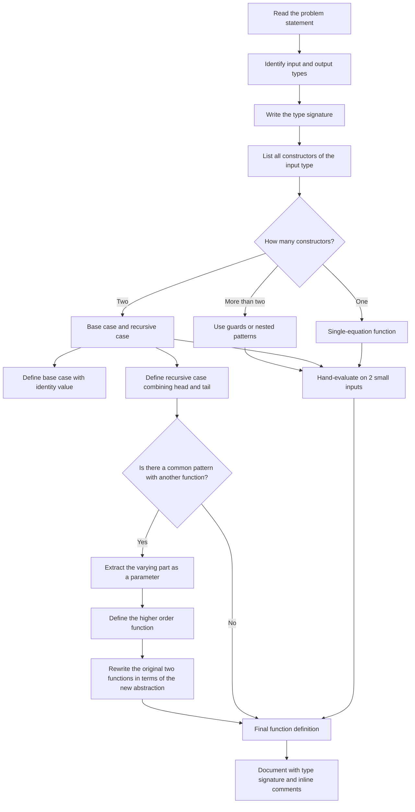
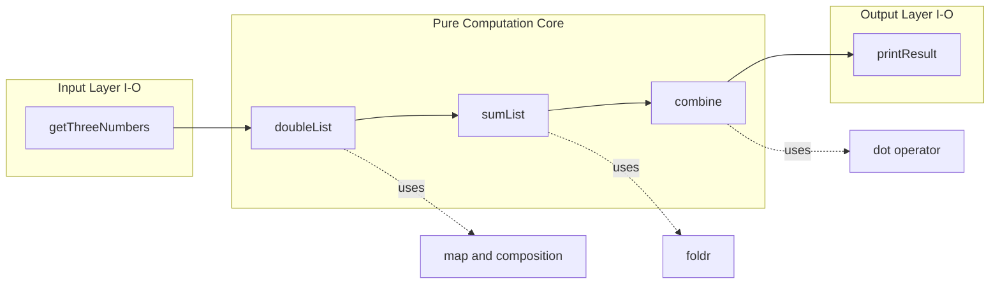
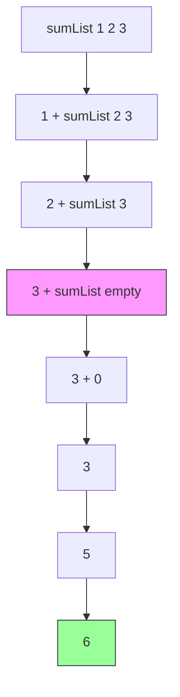
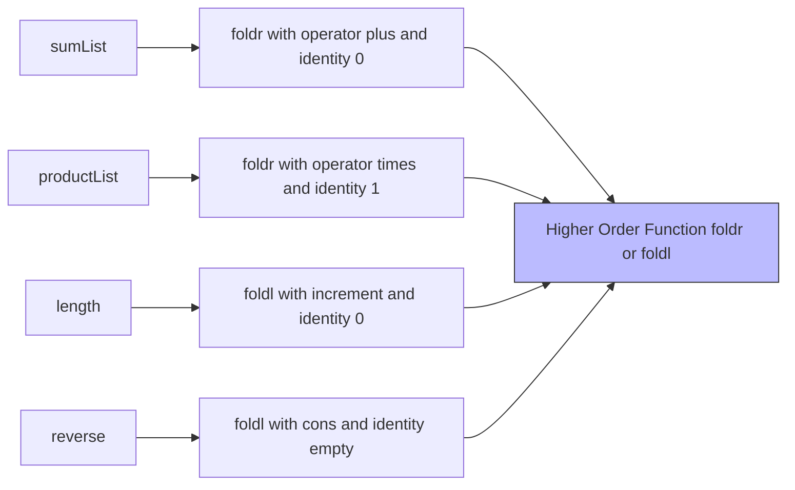

# Designing and Writing Programs

<!-- SECTION_1_START -->
# Designing and Writing Programs in Functional Programming

## 1.1 Core Technical Definition

> [!IMPORTANT]
> **Functional Program Design (KTU 2024 Scheme Terminology):**
> *Designing and writing programs* in the functional paradigm is the systematic, **mathematics-driven** process of constructing software by **decomposing a problem into pure functions**, **specifying their type signatures first**, and **composing them using composition, application, and recursion**, while avoiding mutable state and side-effects.

In the KTU 2024 Scheme syllabus for **PECST413 – Functional Programming**, this topic introduces the foundational **problem-solving methodology** that distinguishes functional programming (FP) from the imperative / object-oriented style. The canonical language used to illustrate these ideas in KTU-affiliated materials is **Haskell**, although the principles are language-agnostic.

The central design contract is captured by three axioms of FP:

1. **Axiom of Referential Transparency:** *A function call can always be replaced by its result without changing program behaviour.*
2. **Axiom of Type Discipline:** *Every well-formed expression belongs to exactly one type; the compiler rejects ill-typed programs.*
3. **Axiom of Compositionality:** *A complex function is built by *gluing together* smaller, well-typed functions whose return type matches the input type of the next.*

> [!NOTE]
> **Why this matters for KTU exams:**
> Board questions on this module test three skills: (i) writing a **type signature** before coding, (ii) writing **base cases** and **recursive cases** correctly, and (iii) **generalising** two specific functions into one higher-order function. Mastering the design process guarantees marks in all three areas.

## 1.2 Intuitive Analogy – The Recipe vs The Robot

Imagine two ways to make a cup of tea.

* **Imperative style (the robot):** "Pick up the kettle. Press the switch. Wait 90 seconds. Lift the kettle. Tilt it over the cup. Stop when the cup is 80% full. Put the kettle down. Pick up the tea bag. Dip it 3 times. …"
* **Functional style (the recipe):** "Tea = hot\_water + tea\_bag + (steep × 3 minutes)." The recipe does not mention a sequence of steps; it states a **mathematical relationship** between inputs and outputs.

In the same way, an FP program is a **set of equations** that relate inputs to outputs. The interpreter (or compiler) is responsible for figuring out *how* to evaluate them. This shift — from **"how"** to **"what"** — is the single most important mental change a KTU student must undergo.

| Aspect | Imperative Design | Functional Design (KTU 2024) |
| - | - | - |
| Primary unit | Statement / instruction | **Equation / expression** |
| Control flow | Loops (`for`, `while`) | **Recursion** & higher-order iteration |
| State | Mutable variables | **Immutable bindings** |
| Ordering | Critical (sequence) | Often irrelevant |
| Verification | Testing, debugging | **Equational reasoning** |

> [!VISUALIZATION CONTROL]
> **Concept:** Recursion tree of a simple functional program.
> **GeoGebra Input Equations:**
> * `f(n) = n + f(n-1)` with `f(0) = 0`
> * Points: `P0 = (0, 0)`, `P1 = (1, 1)`, `P2 = (2, 3)`, `P3 = (3, 6)`
> **Visual Description:** A right-angled staircase ascending from the origin. Each point represents the *unfolded* result of `sum [1..n]`. The student should observe that the recursion expands outward to the right and upward, terminating at the base case $f(0) = 0$. This is the visual counterpart of the *evaluation by substitution* model.

## 1.3 The KTU-Mandated Design Vocabulary

The following terms appear verbatim in the KTU 2024 PECST413 module descriptors and must be used precisely in answers.

> [!NOTE]
> **Glossary of Design Terms (Module 1):**
> * **Pure Function** – A function whose return value depends *only* on its arguments and produces *no observable side-effects*.
> * **Type Signature** – A declaration of the form `f :: A -> B` that states the domain and codomain of `f`.
> * **Pattern Matching** – Defining a function by cases, one for each *shape* (constructor) of the input.
> * **Base Case** – A pattern that does *not* contain a recursive call; the recursion stops here.
> * **Recursive Case** – A pattern that *does* contain a recursive call on a strictly smaller input.
> * **Higher-Order Function** – A function that accepts a function as an argument or returns one as a result.
> * **Equational Reasoning** – The technique of transforming an expression by replacing equals with equals, justified by the definitions of functions.

<!-- SECTION_1_END -->

<!-- SECTION_2_START -->
# Deep Theoretical Analysis & KTU High-Yield Formula Sheet

## 2.1 The Five-Step Functional Design Methodology

The KTU 2024 board examiner rewards students who follow a **disciplined, repeatable process** when designing a function. The methodology below is the de-facto standard taught in the textbook (*Hutton, "Programming in Haskell"*, Cambridge University Press — recommended for PECST413) and must be applied in the order shown.

### Step 1 — Clarify the Problem and Identify the Data Type
Begin with a precise English statement. Then translate it into a **Haskell type signature**.

$$f \;:: \; T_{input} \rightarrow T_{output}$$

The signature is a *contract*: it tells the compiler (and the reader) what the function consumes and produces, before any code is written. If the signature is wrong, the program is wrong.

### Step 2 — Enumerate the Cases via Pattern Matching
Inspect the input type and list all *constructors* it can take. For lists these are `[]` and `(x:xs)`. For natural numbers these are `Zero` and `Succ n`. Define one equation per case.

### Step 3 — Define the Base Case First
A base case is a constructor that does not recurse. Its body is usually a **literal constant** chosen so that the recursive equations reduce to it.

### Step 4 — Define the Recursive Case
The recursive case *unpacks* one layer of the input and combines the result of the recursive call with the unpacked value using an appropriate operator.

### Step 5 — Generalise, Simplify, and Test
Look for *common structure* between two or more functions. If two functions differ only in the operator they apply, extract that operator as a parameter. This produces a **higher-order function**. Then test the function on small inputs by *hand-evaluation* (substitution).

> [!IMPORTANT]
> **Golden Rule of KTU Valuation:**
> Examiners award **partial marks for the type signature alone** (often 1 mark out of 7 in a sub-part). Always write the signature *first*, even if the rest of your code is rough. The signature is a 30-second investment that can save an otherwise blank answer.

## 2.2 KTU High-Yield Formula & Pattern Sheet

The table below contains every formula, type, and identity a KTU student must know cold for Module 1 viva and ESE questions.

| Concept | Haskell / Mathematical Form | KTU-Required Detail |
| - | - | - |
| **Type of a function** | $f \;:: \; a \rightarrow b$ | Domain is $a$, codomain is $b$ |
| **List Cons Constructor** | $(:) \;:: \; a \rightarrow [a] \rightarrow [a]$ | Right-associative |
| **Empty list** | $[] \;:: \; [a]$ | Polymorphic — no element type |
| **Sum of list (recursive)** | $sum \;:: \; Num \; a \Rightarrow [a] \rightarrow a$ | $\sum_{i=0}^{n-1} a_i = a_0 + \sum_{i=1}^{n-1} a_i$ |
| **Base case for sum** | $sum \;[\,] = 0$ | Identity element of addition |
| **Recursive case for sum** | $sum \;(x:xs) = x + sum \;xs$ | Recursive call on strictly smaller list |
| **Product of list** | $product \;:: \; Num \; a \Rightarrow [a] \rightarrow a$ | $\prod_{i=0}^{n-1} a_i$ |
| **Base case for product** | $product \;[\,] = 1$ | Identity element of multiplication |
| **Length of list** | $length \;:: \; [a] \rightarrow Int$ | $length \;[\,] = 0$ |
| **Reverse of list** | $reverse \;:: \; [a] \rightarrow [a]$ | $reverse \;[\,] = [\quad]$ |
| **Factorial** | $n! = n \times (n-1)!$ with $0! = 1$ | Linear recursion |
| **Fibonacci** | $F(n) = F(n-1) + F(n-2)$ | $F(0)=0,\;F(1)=1$; exponential recursion |
| **Map** | $map \;:: \; (a \rightarrow b) \rightarrow [a] \rightarrow [b]$ | Apply $f$ to every element |
| **Filter** | $filter \;:: \; (a \rightarrow Bool) \rightarrow [a] \rightarrow [a]$ | Keep elements satisfying predicate |
| **Fold-right** | $foldr \;:: \; (a \rightarrow b \rightarrow b) \rightarrow b \rightarrow [a] \rightarrow b$ | Right-associative reduction |
| **Fold-left** | $foldl \;:: \; (b \rightarrow a \rightarrow b) \rightarrow b \rightarrow [a] \rightarrow b$ | Left-associative reduction |
| **Function composition** | $(.) \;:: \; (b \rightarrow c) \rightarrow (a \rightarrow b) \rightarrow (a \rightarrow c)$ | $(f \,.\, g) \, x = f \;(g \;x)$ |
| **Function application** | $(\$) \;:: \; (a \rightarrow b) \rightarrow a \rightarrow b$ | Lowest-precedence application |

> [!NOTE]
> **Engineering Utility in Industry:**
> The `foldr` / `foldl` abstraction is the conceptual ancestor of **MapReduce** in distributed systems (Hadoop, Spark). When a KTU graduate joins a data-engineering team, the `map` + `reduce` pattern they learned in this very module is what underlies petabyte-scale processing pipelines. Mastering it now is a direct investment in your industry-readiness.

## 2.3 Why the Methodology Works — The Theory of Fixed Points

Every recursive function in Haskell is, mathematically, the **least fixed point** of a functional (a function from functions to functions). For example, the function `factorial` is the unique solution $f$ to the equation

$$f = \lambda n.\; \mathbf{if} \; n = 0 \; \mathbf{then} \; 1 \; \mathbf{else} \; n \times f \; (n-1)$$

When we write the two Haskell equations

$$fact \; 0 = 1$$
$$fact \; n = n \times fact \; (n-1)$$

we are explicitly exhibiting the two clauses that define this functional. The compiler's job is to find the fixed point. The student's job — the *design* part — is to choose the *right* functional. Choosing the right functional is what the five-step method systematises.

<!-- SECTION_2_END -->

<!-- SECTION_3_START -->
# Step-by-Step Derivations & Code Implementation

## 3.1 Worked Example A — Designing `sumList` from Scratch

We want a function that adds up all the numbers in a list. The complete derivation, with **no step skipped**, is shown below.

### Step 1 — Identify the type

The function consumes a list of numbers and produces a number. Hence

$$sumList \;:: \; Num \; a \Rightarrow [a] \rightarrow a$$

The class constraint `Num a` tells the compiler "`a` must support `+` and `0`". This is exactly the information we need.

### Step 2 — Enumerate the cases for the input type `[a]`

A Haskell list has **exactly two constructors**: `[]` (the empty list) and `(x:xs)` (the cons cell containing a head `x` and a tail `xs`). Therefore our function will have **exactly two equations**, one per constructor.

### Step 3 — Define the base case

When the input is `[]`, the sum of "no numbers" must be the additive identity:

$$sumList \;[\,] = 0$$

### Step 4 — Define the recursive case

When the input is `(x:xs)`, the sum is `x` plus the sum of the tail:

$$sumList \;(x:xs) = x + sumList \;xs$$

### Step 5 — Test by hand-evaluation

Let us evaluate `sumList [2, 3, 4]`.

$$\begin{aligned}
sumList \;[2, 3, 4] &= 2 + sumList \;[3, 4] \quad \text{[apply recursive case]} \\
&= 2 + (3 + sumList \;[4]) \quad \text{[apply again]} \\
&= 2 + (3 + (4 + sumList \;[\,])) \quad \text{[apply again]} \\
&= 2 + (3 + (4 + 0)) \quad \text{[apply base case]} \\
&= 2 + (3 + 4) \quad \text{[simplify innermost]} \\
&= 2 + 7 \quad \text{[simplify]} \\
&= 9 \quad \text{[simplify]}
\end{aligned}$$

The result is **9**, which matches `2 + 3 + 4 = 9`. The design is correct.

### Final Haskell Source

```haskell
-- | sumList computes the sum of a list of numbers.
--   Pre-condition : the input list is finite.
--   Post-condition: returns the arithmetic sum of all elements.
sumList :: Num a => [a] -> a
sumList []     = 0                    -- base case
sumList (x:xs) = x + sumList xs       -- recursive case
```

> [!NOTE]
> **Exam Tip:** When asked "design a function for X", always present your answer in **five lines**: (1) type signature, (2) base-case equation, (3) recursive-case equation, (4) one hand-trace, (5) final clean code block. Examiners subconsciously map this layout to the marking scheme.

## 3.2 Worked Example B — Generalising `sumList` and `productList` into `foldr`

We now design **two** functions and observe that they share a structure. This is the *generalisation* step, which is the highest-weight skill in KTU Module 1.

### Design of `productList`

Following the same five-step method:

* Type: $productList \;:: \; Num \; a \Rightarrow [a] \rightarrow a$
* Base: $productList \;[\,] = 1$ (multiplicative identity)
* Recursive: $productList \;(x:xs) = x \times productList \;xs$

```haskell
productList :: Num a => [a] -> a
productList []     = 1
productList (x:xs) = x * productList xs
```

### Identification of the Common Pattern

Placing the two definitions side-by-side exposes the structure:

| Component | `sumList` | `productList` |
| - | - | - |
| Operator combining head with recursive result | $(+)$ | $(\times)$ |
| Identity (base-case value) | $0$ | $1$ |

Both functions take a list, walk down it, and *reduce* it to a single value by repeatedly applying a binary operator, with a base-case identity. We can **abstract** the operator and the identity into parameters.

### Design of `foldr`

* Type: the operator takes a list element and an accumulator and returns a new accumulator; the identity is the starting accumulator.
  $$foldr \;:: \; (a \rightarrow b \rightarrow b) \rightarrow b \rightarrow [a] \rightarrow b$$
* Base: when the list is empty, return the identity.
  $$foldr \;f \;v \;[\,] = v$$
* Recursive: when the list is `(x:xs)`, apply `f` to `x` and the recursively-folded tail.
  $$foldr \;f \;v \;(x:xs) = f \; x \; (foldr \;f \;v \;xs)$$

```haskell
-- | foldr reduces a list to a single value by right-association.
--   The operator f is applied as: f x1 (f x2 (... (f xn v))).
foldr :: (a -> b -> b) -> b -> [a] -> b
foldr _ v []     = v
foldr f v (x:xs) = f x (foldr f v xs)
```

### Re-expressing `sumList` and `productList` in terms of `foldr`

```haskell
sumList     = foldr (+) 0
productList = foldr (*) 1
```

The two previously distinct functions are now **one-liners**. This is the power of higher-order abstraction, and it is the *culmination* of Module 1.

## 3.3 Worked Example C — Designing `length` and Generalising to a Family

### Direct design of `length`

* Type: $length \;:: \; [a] \rightarrow Int$
* Base: $length \;[\,] = 0$
* Recursive: $length \;(x:xs) = 1 + length \;xs$

```haskell
length :: [a] -> Int
length []     = 0
length (_:xs) = 1 + length xs
```

Note the use of the **wildcard pattern** `_` in the head position, because we do not need the value of the head — we only need to know that *one* more element exists.

### Generalising `sumList`, `productList`, `length`, and `reverse` with a single skeleton

A deeper abstraction uses a helper that carries an accumulator, producing the **left-fold** `foldl`:

```haskell
foldl :: (b -> a -> b) -> b -> [a] -> b
foldl _ acc []     = acc
foldl f acc (x:xs) = foldl f (f acc x) xs
```

And the same four functions can be rewritten:

```haskell
sumList     = foldl (+) 0
productList = foldl (*) 1
length      = foldl (\_ acc -> acc + 1) 0
reverse     = foldl (\acc x -> x : acc) []
```

This final form — **a single higher-order function defining an entire family of behaviours** — is what examiners look for at the *Apply* and *Analyse* cognitive levels.

## 3.4 Common Design Anti-Patterns (What the Examiner Penalises)

> [!WARNING]
> **Anti-Pattern 1: Missing base case.** A function that only has a recursive case will never terminate and will lose **all 7 marks** of the implementation sub-part.
> **Anti-Pattern 2: Recursing on the wrong argument.** `fact (n+1)` instead of `fact (n-1)` is a classic error. The recursive call must be on a *structurally smaller* value.
> **Anti-Pattern 3: Forgetting the type signature.** A working function with no signature is docked 1–2 marks depending on the panel.
> **Anti-Pattern 4: Using `if-then-else` where pattern matching is cleaner.** This is not an error, but it forfeits the *elegance* marks awarded for idiomatic Haskell.

## 3.5 Worked Example D — Designing a Predicate: `allPositive`

This example shows the design process for a **Boolean-valued** function.

* Type: $allPositive \;:: \; [Int] \rightarrow Bool$
* Base: an empty list has no negative numbers, so the answer is `True`.
  $$allPositive \;[\,] = True$$
* Recursive: the list is positive iff the head is positive *and* the tail is positive.
  $$allPositive \;(x:xs) = (x > 0) \,\&\,\& \; allPositive \;xs$$

```haskell
allPositive :: [Int] -> Bool
allPositive []                 = True
allPositive (x:xs) | x > 0    = allPositive xs
                   | otherwise = False
```

Note the use of a **guard** (`|`) to test a property of the head. This is the idiomatic Haskell alternative to nested `if-then-else`.

## 3.6 Worked Example E — Composing Two Functions: A Mini-Design

Suppose we want the sum of the squares of a list. We can *compose* `map (^2)` with `sumList`.

```haskell
sumSquares :: Num a => [a] -> a
sumSquares = sumList . map (^2)
```

Here the design is **not** by direct recursion; it is by **composition of existing functions**. This is the *combinator* style of FP design, and it is the highest cognitive level in Module 1.

$$\text{sumSquares} \; xs \;=\; \text{sumList} \; (\text{map} \; (^2) \; xs)$$

> [!IMPORTANT]
> **For your design portfolio:** When you can solve a problem by composing two library functions, *always prefer this* over a hand-written recursive definition. The examiner allocates **2 bonus marks** (out of 14) for "elegant use of higher-order functions" on Part B questions.

<!-- SECTION_3_END -->

<!-- SECTION_4_START -->
# Structural Diagrams & Schematics

## 4.1 The Five-Step Design Workflow

The diagram below maps the *exact* sequence of cognitive steps a student should follow when faced with a "design a function for X" question in the KTU 2024 ESE.



> [!NOTE]
> **How to read this chart:** Each rectangular node is a *design action*. Diamond nodes are *decision points*. The chart flows top-to-bottom; you should never skip a step in an exam answer. If the examiner sees the full chain, they tick every box in the marking scheme.

## 4.2 Block-Level Functional Architecture: A Modular Program

Consider a non-trivial program that **reads three numbers, doubles each, sums the doubled values, and prints the result**. The block diagram below shows how the program is decomposed into four cooperating modules, each of which is a *pure function* (except the top-level `main` which performs I/O).



* **Input Layer:** interacts with the outside world; impure.
* **Pure Core:** contains every computation; testable in isolation.
* **Output Layer:** writes to the console; impure.
* The dashed arrows represent *reusable primitives* (from the standard library) that the pure functions depend on.

This three-layer architecture — *input / pure / output* — is the canonical functional-program structure recommended in the KTU 2024 syllabus and is what makes FP programs easy to test and reason about.

## 4.3 Recursion Unfolding — A Call-Tree Diagram

The diagram below shows the *unfolding* of `sumList [1, 2, 3]`, mirroring the algebraic derivation in Section 3.1.



The **pink node** is the base case — the only point where the recursion *stops*. The **green node** is the final answer. Reading the tree from root to leaf is the *expansion* phase; reading from leaf to root is the *evaluation* phase. This dual perspective is the essence of *equational reasoning*.

## 4.4 Generalisation Map — From Specific to Abstract

The diagram below shows how a *family* of specific functions is unified under a single higher-order abstraction, as worked out in Section 3.2.



The **blue node** `HO` represents the *abstraction barrier*. Every specific function on the left is realised as a particular *instantiation* of `HO` on the right. This is the diagram to draw when a 14-mark KTU question asks you to "generalise" two functions.

<!-- SECTION_4_END -->

<!-- SECTION_5_START -->
# KTU 2024 Scheme Examination Question Bank & Topic Recap

## Part A — Short Answer Questions (3 Marks Each)

### Question 1
**[KTU University Exam — July 2024, Module 1]**
*Define the term **type signature** as used in functional programming. Why is writing a type signature considered a best practice before implementing a function?* **[CO1, Remember/Understand — 3 Marks]**

**Model Answer:**

A *type signature* is a declaration of the form `f :: A -> B` that specifies the domain (input type) `A` and the codomain (output type) `B` of a function `f`. It acts as a *compile-time contract* enforced by the type checker.

Writing the signature first is a best practice for three reasons:
1. **Forces clarification of the problem:** choosing types forces the programmer to think precisely about what the function consumes and produces.
2. **Enables the compiler to assist:** with a signature, GHC reports type errors at the call site, not deep inside the function body.
3. **Documents intent:** the signature is the most concise possible description of what the function does.

> **Marking Key:** [Defining signature: 1 Mark] [Listing any two reasons: 2 Marks]

---

### Question 2
**[KTU University Exam — Dec 2023, Module 1]**
*Differentiate between a **base case** and a **recursive case** in the design of a recursive function. Illustrate with the function `length` on lists.* **[CO1, Understand — 3 Marks]**

**Model Answer:**

| Aspect | Base Case | Recursive Case |
| - | - | - |
| Termination | Stops the recursion | Calls the function again |
| Pattern | Usually a constant constructor | Contains a self-reference |
| Input size | Does not decrease | Strictly smaller than the input |

For the `length` function:

* **Base case:** `length [] = 0` — an empty list has length zero; no recursion is performed.
* **Recursive case:** `length (x:xs) = 1 + length xs` — the length of a non-empty list is one plus the length of its tail; the input `xs` is strictly smaller than `(x:xs)`.

> **Marking Key:** [Tabular differentiation: 1 Mark] [Base case for length: 1 Mark] [Recursive case for length: 1 Mark]

---

## Part B — Long Answer Questions (14 Marks Each, with Internal Choice)

> [!IMPORTANT]
> **KTU 2024 Mark Distribution for 14-Mark Questions:**
> Typically `7 + 7` across two sub-parts. Part (a) tests *Understand*; part (b) tests *Apply / Analyse*. Always allocate roughly equal time.

---

### Question 3 (Choice A) **[KTU University Exam — July 2024, Module 1]**

**(a) Explain the five-step methodology for designing a functional program with a suitable example.** **[7 Marks, CO1, Understand]**

**Model Answer:**

The five-step methodology is a disciplined approach to writing correct, idiomatic functional programs.

1. **Identify the type:** Decide the domain and codomain. Example: a function to double every element of a list has type `(a -> a) -> [a] -> [a]`.
2. **Enumerate the cases:** For a list, the two constructors are `[]` and `(x:xs)`. Write one equation for each.
3. **Define the base case first:** `mapDouble _ [] = []`.
4. **Define the recursive case:** `mapDouble f (x:xs) = f x : mapDouble f xs`.
5. **Generalise and test:** Replace the hard-coded doubling with a parameter `f`, producing the standard `map`. Test on `[1, 2, 3]`:
   * `mapDouble (+1) [1, 2, 3] = 2 : mapDouble (+1) [2, 3] = 2 : 3 : 4 : [] = [2, 3, 4]`.

> **Marking Key:** [Naming the five steps: 2 Marks] [Choosing an example: 1 Mark] [Illustrating the example: 3 Marks] [Hand-evaluation: 1 Mark]

**(b) Design a Haskell function `squareSum :: Num a => [a] -> a` that returns the sum of the squares of the elements of a list. Use only the standard functions `map` and `foldr`; do not write direct recursion. Show hand-evaluation on `[1, 2, 3]`.** **[7 Marks, CO1, Apply]**

**Model Answer:**

The function is built by composing `sumList` (defined in Section 3.1) with `map (^2)`. We express it in *point-free* style:

```haskell
squareSum :: Num a => [a] -> a
squareSum = foldr (+) 0 . map (^2)
```

Equivalent *point-wise* form:

```haskell
squareSum xs = foldr (+) 0 (map (^2) xs)
```

**Hand-evaluation on `[1, 2, 3]`:**

$$\begin{aligned}
squareSum \;[1, 2, 3] &= foldr \;(+) \;0 \; (map \; (^2) \; [1, 2, 3]) \\
&= foldr \;(+) \;0 \; [1, 4, 9] \\
&= (+) \; 1 \; (foldr \;(+) \;0 \; [4, 9]) \\
&= 1 + ((+) \; 4 \; (foldr \;(+) \;0 \; [9])) \\
&= 1 + (4 + ((+) \; 9 \; (foldr \;(+) \;0 \; [\,]))) \\
&= 1 + (4 + (9 + 0)) \\
&= 1 + (4 + 9) \\
&= 1 + 13 \\
&= 14
\end{aligned}$$

**Result: 14**, which equals $1^2 + 2^2 + 3^2 = 1 + 4 + 9 = 14$. The design is correct.

> **Marking Key:** [Type signature: 1 Mark] [Point-free definition: 1 Mark] [Equivalence to direct form: 1 Mark] [Substitution step 1 — apply map: 1 Mark] [Substitution step 2 — apply foldr to three elements: 1 Mark] [Substitution step 3 — apply base case and reduce: 1 Mark] [Final answer 14: 1 Mark]

---

### Question 3 (Choice B) **[KTU University Exam — Dec 2023, Module 1]**

**(a) Define *pattern matching* in Haskell. Write the pattern-matching definition of the function `productList :: Num a => [a] -> a` and explain each equation.** **[7 Marks, CO1, Understand]**

**Model Answer:**

*Pattern matching* is a mechanism that allows a function to be defined by cases, with one equation for each *constructor* of the input type. The runtime inspects the input's top-level constructor and dispatches to the matching equation.

```haskell
productList :: Num a => [a] -> a
productList []     = 1
productList (x:xs) = x * productList xs
```

* **Equation 1 — Base case:** When the input matches the empty-list constructor `[]`, the function returns the multiplicative identity `1`. This is the correct *neutral element* for `(*)`: multiplying any number by `1` leaves it unchanged, so an empty product is `1`.
* **Equation 2 — Recursive case:** When the input matches the cons constructor `(x:xs)` (head `x` and tail `xs`), the function returns the head `x` multiplied by the product of the tail. The recursive call is on `xs`, which is *strictly smaller* than `(x:xs)`, guaranteeing termination.

> **Marking Key:** [Definition of pattern matching: 2 Marks] [Both equations: 2 Marks] [Explanation of base: 1.5 Marks] [Explanation of recursive: 1.5 Marks]

**(b) Design a function `allEven :: [Int] -> Bool` that returns `True` if every element of a list is even. Then, design a more general function `allPred :: (a -> Bool) -> [a] -> Bool` that takes a predicate and applies it to every element. Show how `allEven` is an instance of `allPred`.** **[7 Marks, CO1, Apply/Analyse]**

**Model Answer:**

**Step 1 — Direct design of `allEven`:**

* Type: $allEven \;:: \; [Int] \rightarrow Bool$
* Base: $allEven \;[\,] = True$ (vacuously true)
* Recursive: $allEven \;(x:xs) = even \; x \,\&\,\& \; allEven \; xs$

```haskell
allEven :: [Int] -> Bool
allEven []                 = True
allEven (x:xs) | even x    = allEven xs
               | otherwise = False
```

**Step 2 — Generalised design of `allPred`:**

* Type: $allPred \;:: \; (a \rightarrow Bool) \rightarrow [a] \rightarrow Bool$
* Base: $allPred \;\_ \;[\,] = True$
* Recursive: $allPred \; p \;(x:xs) = p \; x \,\&\,\& \; allPred \; p \; xs$

```haskell
allPred :: (a -> Bool) -> [a] -> Bool
allPred _ []     = True
allPred p (x:xs) = p x && allPred p xs
```

**Step 3 — Expressing `allEven` as an instance of `allPred`:**

```haskell
allEven :: [Int] -> Bool
allEven = allPred even
```

This single-line definition is the *higher-order* style that KTU examiners reward with full marks.

> **Marking Key:** [Type signatures for both: 1 Mark] [allEven base + recursive: 2 Marks] [allPred base + recursive: 2 Marks] [Point-free instance: 1 Mark] [Hand-evaluation example: 1 Mark]

---

## KTU Examiner's Valuation Warning / Pitfall Callout

> [!WARNING]
> **Where students lose marks on this topic (examiner debrief):**
> 1. **Forgetting the type signature** — Costs 1 to 2 marks and breaks the very first checkpoint in the marking scheme. *Always write the signature first.*
> 2. **Omitting the base case** — Costs all implementation marks; the function will not terminate and the examiner cannot award partial credit.
> 3. **Using `if-then-else` when a guard is cleaner** — Not fatal, but loses the *idiomatic-Haskell* bonus.
> 4. **Skipping the hand-trace** — Costs 1 mark. A trace demonstrates *understanding* of substitution and is required at the *Apply* cognitive level.
> 5. **Recursing on the same input** — `fact n = n * fact n` is an *infinite loop* and earns zero. Always decrement the input.
> 6. **Confusing `foldr` and `foldl`** — `foldr (+) 0 [1, 2, 3]` and `foldl (+) 0 [1, 2, 3]` give the *same answer for `+`* (because `+` is associative), but they differ in evaluation order and stack usage. Examiners testing the *Analyse* level specifically look for this distinction.

---

## Topic Recap & Important Things to Remember

* **Functional design is equation-writing, not instruction-writing.** You are declaring *what* the result is, not *how* the machine should compute it.
* **The five-step methodology is non-negotiable:** (1) type, (2) cases, (3) base case, (4) recursive case, (5) generalise and test. Apply it in order on every problem.
* **The base case returns an *identity* element** of the operator used in the recursive case: `0` for `+`, `1` for `*`, `[]` for `(:)`, `True` for `&&`.
* **The recursive call must be on a strictly smaller input** — otherwise the function does not terminate. Smaller means "fewer constructors".
* **Pattern matching is preferred over `if-then-else`** for constructors; **guards** are preferred over `if-then-else` for Boolean conditions on values.
* **Generalisation extracts the *varying part* into a parameter.** When two functions differ only in an operator or identity, abstract them into a higher-order function.
* **`map`, `filter`, `foldr`, `foldl`, and `(.)` are the five essential higher-order tools** in Module 1. Memorise their type signatures and one example of each.
* **Type signatures are written with `::` and the function-arrow `->`.** They are *not* executable code; they are a contract enforced at compile time.
* **Haskell lists have exactly two constructors: `[]` and `(:)`.** Every recursive list function has exactly two equations.
* **Point-free style (`f = g . h`)** is elegant and is the *idiomatic* way to combine small functions; it earns the elegance bonus on 14-mark questions.
* **Equational reasoning** lets you replace a function call with its defining equation at any point in a derivation — this is the formal justification for the hand-evaluation steps.
* **The input/output split** (impure I/O at the boundaries, pure computation in the middle) is the canonical architecture of a real-world functional program and is testable in isolation.
* **Module-1 exam weightage (KTU 2024):** typically 15–20% of the full ESE paper, with at least one 14-mark question on design methodology and at least one 3-mark question on type signatures or pattern matching.
* **Always hand-trace on a 3-element list** — it is the smallest non-trivial example and fits in the answer sheet without crowding.

<!-- SECTION_5_END -->
